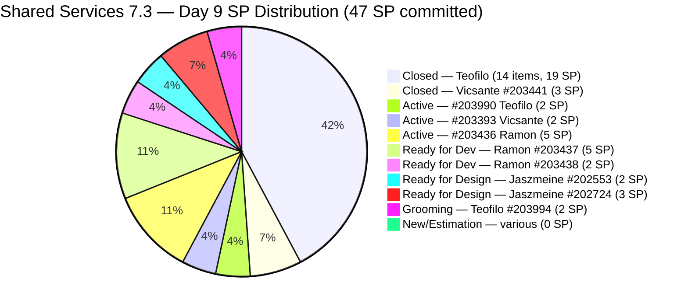
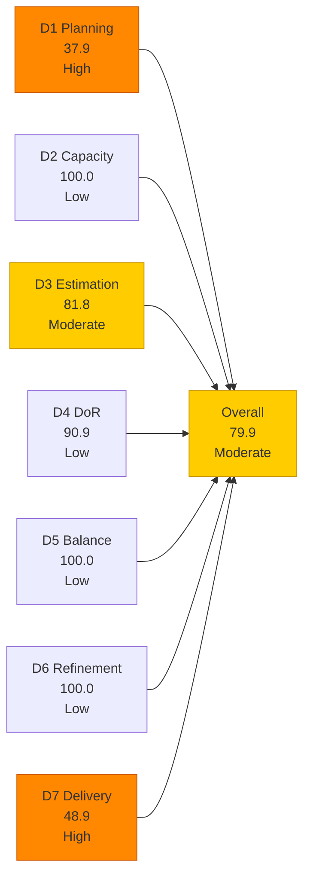
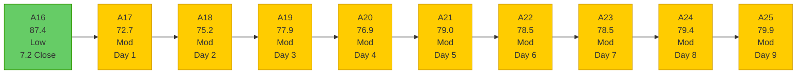

# Shared Services Team — SAFe Iteration Audit A25
**Date:** 2026-05-12 | **Sprint Day:** 9 of 14 | **Iteration:** 7.3 (May 4 – May 17, 2026)
**Auditor:** Claude Code (ADO SAFe Audit Skill v1) | **Prior Audit:** A24 (2026-05-11 09:00)

---

## 1. Audit Metadata

| Field | Value |
|---|---|
| **Audit ID** | A25 |
| **Report File** | `AUDIT_20260512_0202.md` |
| **Prior Audit** | A24 — `AUDIT_20260511_0900.md` (Overall 79.4, Moderate — 7.3 Day 8) |
| **ADO Project** | Jairosoft Portfolio (`666bb99a-6acd-4999-bb34-efd0e4ea90dc`) |
| **ADO Team** | Shared Services Team (`bd9578fd-5773-48fc-bd80-988dfe5de806`) |
| **Iteration** | 7.3 (`bbaecdec-eeb0-4c8d-999f-6a438eaab331`) |
| **Iteration Dates** | May 4 – May 17, 2026 |
| **Sprint Day** | 9 of 14 |
| **Audit Date** | 2026-05-12 02:02 PHT (UTC+8) |
| **Overall Score** | **79.9 — Moderate Risk** |
| **Risk Band** | Moderate (60–79.9) |
| **Visible Backlog Items** | 29 root items |
| **Current Iteration Root Items** | 11 (IterationPath = 7.3) |
| **Full 7.3 Roster** | 30 root items (11 open + 19 Closed) |
| **Capacity Source** | `work_get_iteration_capacities` — 4 members; 15.5 h/day total (Shared Services team bd9578fd) |
| **Project Exceptions Applied** | None |

---

## 2. Executive Summary

| Field | Value |
|---|---|
| **Overall Score** | 79.9 — Moderate Risk |
| **Score vs Prior (A24)** | 79.4 → 79.9 (**+0.5 — improvement**) |
| **Sprint Day** | 9 of 14 |
| **Iteration** | 7.3 (May 4 – May 17, 2026) |
| **Open Items in 7.3** | 11 |
| **Full 7.3 Roster** | 30 items (11 open + 19 Closed) |
| **Committed SP** | 47 SP (as of committed roster) |
| **SP Closed** | 23 SP (16 items — 3 new closures since A24) |
| **Delivery %** | 48.9% (23/47 SP) |
| **Risk Band** | Moderate (60–79.9) |

**Score improved +0.5 (79.4 → 79.9) driven by three item closures and DoR improvement.** Three items closed since A24: **#204048** (AutoAllies DB Backup, Enabler, 1 SP), **#203991** (CCTV TESDA Compliance, Enabler, 1 SP), and **#203992** (Bubble eLMS Plan Upgrade, Enabler, 2 SP). Together they add 4 SP to closed total (19 → 23 SP) and remove one DoR-fail item (#204048) from the current count. The score improvement is modest (+0.5) because the closures also reduce the current iteration item count from 14 to 11, compressing the D3/D4 denominators while D7 gains.

**The team is now 0.1 points from Low Risk.** With a 79.9 overall, a single additional closure or data-hygiene action pushes Shared Services into the Low band. Closing #203393 (Claude Course, 2 SP, Active, Vicsante) raises D7 from 48.9 to 53.2 and overall to 80.5 (Low Risk).

**D4 improved to 90.9.** The removal of #204048 (which had no Desc/AC) and the verified DoR status of remaining items means only 1 item fails DoR: #203909 (MFT Reduction for Colina — missing AC, persisting since A19). This is a 5-minute ADO fix.

**#203990 (Prepare 25 Machines, Teofilo) shows an updated change date of May 12** — active work is ongoing on this item today.

---

## 3. Previous Audit Delta (A24 → A25)

| Dimension | A24 Score | A25 Score | Delta | Driver |
|---|---|---|---|---|
| D1 Iteration Planning | 43.8 | 37.9 | **−5.9** | 3 items closed from 7.3 open set: 14→11 numerator, 32→29 denominator; 11/29=37.9 |
| D2 Team Capacity | 100.0 | 100.0 | 0.0 | All 4 members with positive capacity; unchanged |
| D3 Estimation | 85.7 | 81.8 | **−3.9** | Denominator shrinks 14→11; remaining unestimated: #203909 (no SP) + #203993 (no SP); 9/11=81.8 |
| D4 DoR Compliance | 85.7 | 90.9 | **+5.2** | #204048 closed (removed DoR fail); remaining fail = only #203909; 10/11=90.9 |
| D5 Work Item Balance | 100.0 | 100.0 | 0.0 | Type diversity maintained across 11 items |
| D6 Backlog Refinement | 100.0 | 100.0 | 0.0 | All 29 items fresh; #203990 touched May 12 |
| D7 Delivery Predictability | 40.4 | 48.9 | **+8.5** | 3 new closures (4 SP): #204048(1)+#203991(1)+#203992(2); 23/47=48.9 |
| **Overall** | **79.4** | **79.9** | **+0.5** | D7 gain (+8.5) and D4 gain (+5.2) offset by D1 (−5.9) and D3 (−3.9) compression |

### Key Events (A24 → A25)

| Event | Impact |
|---|---|
| **#204048 closed** (AutoAllies DB Backup, Enabler, 1 SP, Teofilo) | D7 +1 SP; D4 fail removed (was no Desc/AC); 14→11 open items |
| **#203991 closed** (CCTV TESDA Compliance, Enabler, 1 SP, Teofilo) | D7 +1 SP; removed from current iteration count |
| **#203992 closed** (Bubble eLMS Plan Upgrade, Enabler, 2 SP, Teofilo) | D7 +2 SP; removed from current iteration count |
| **#203990 touched May 12** (Prepare 25 Machines, Active, Teofilo) | Day-9 activity signal; infrastructure work ongoing; ChangedDate = May 12 |
| #203909 still unresolved (no AC, no SP) | D3 + D4 persistent gap; 7th consecutive audit (A19–A25) without fix |
| #203993 still unestimated (no SP) | D3 gap; desc+AC present (DoR pass); SP assignment is a 1-minute fix |
| No closures from Ramon queue (#203436, #203437, #203438) | D7 constrained; 12 SP Ramon queue still open |
| No state change on Jaszmeine designs (#202553, #202724) | Both still Ready for Design; Day 9 without advance |

---

## 4. Current Iteration Snapshot

**Iteration:** 7.3 | **Period:** May 4 – May 17, 2026 | **Sprint Day:** 9 of 14

| Metric | Value |
|---|---|
| Full 7.3 iteration root items | 30 (19 Closed + 11 open) |
| Open items in 7.3 (backlog view) | 11 |
| Visible backlog root items | 29 |
| Committed SP | 47 SP |
| SP Closed (Day 9) | 23 SP (16 items) |
| SP Remaining (estimated open) | 24 SP (9 estimated open items) |
| Delivery % | 48.9% (23/47 SP) |
| Daily capacity | 15.5 h/day (4 members) |
| Days remaining | 5 working days |

### Team Delivery Progress (Day 9)

| Member | SP Closed | SP Open/Estimated | Status | Day-9 Signal |
|---|---|---|---|---|
| Teofilo | 23 SP (16 items, incl. new closures) | 4 SP (#203990=2 Active, #203994=2 Grooming) + 0 SP (#203909 New) | Active delivery — 3 closures overnight; #203990 touched today | Close #203990 (Active, 2 SP); advance #203994 to Active |
| Ramon | 0 SP | 12 SP (#203436=5 Active, #203437=5 RFD, #203438=2 RFD) + 1 SP (#203309=1 Estimation) | No closures in 9 days | #203436 (5 SP) the critical gate; 8 AC scenarios to verify |
| Vicsante | 3 SP (#203441) | 2 SP (#203393=2 Active) | Active | 4 Claude modules; Day-9 is the target close day |
| Jaszmeine | 0 SP | 5 SP (#202553=2 RFD, #202724=3 RFD) | No state change since Day 3 (May 6) | Design review needed immediately; Day-9 is the final advance window |
| **Total** | **23 SP** | **~24 est.** | | **48.9% delivered** |

---

## 5. Work Item Analysis

### 7.3 Closed Items — Day 9 (16 items, 23 SP)

| ID | Title | Type | SP | Assignee | Closed Day |
|---|---|---|---|---|---|
| #203310 | jit.edu.ph Domain Renewal | Enabler | 2 | Teofilo | Day 2 |
| #203711 | Extend license for Jovanne Vicentino | Enabler | 1 | Teofilo | Day 2 |
| #203641 | Session with Paul — Backend Colina Health | Enabler | 1 | Teofilo | Day 2 |
| #203630 | Back up AutoAllies DB in Blob Storage | Enabler | 2 | Teofilo | Day 2 |
| #203653 | Add new interns to ADO Boards | Enabler | 1 | Teofilo | Day 3 |
| #203844 | Monthly Costing Report — May 2026 | Enabler | 2 | Teofilo | Day 3 |
| #202807 | IT Support Services — Mid PI 7 Feedback Survey | Spike | 1 | Teofilo | Day 3 |
| #203869 | Create jodex-qa@jairosoft.com in ADO | Enabler | 1 | Teofilo | Day 5 |
| #203870 | Create jodex-po@jairosoft.com in ADO | Enabler | 1 | Teofilo | Day 5 |
| #203908 | Recover Bubble Account | Enabler | 1 | Teofilo | Day 5 |
| #203984 | Reduce Bubble Subscription | Enabler | 1 | Teofilo | Day 5 |
| #203441 | Skill Plugin Development Environment Setup | Enabler | 3 | Vicsante | Day 5 |
| #203648 | Accessing Colina Database | Enabler | 2 | Teofilo | Day 5 |
| **#204048** | AutoAllies DB Back in BLOB Storage 5112026 | Enabler | 1 | Teofilo | **Day 9** |
| **#203991** | CCTV TESDA Compliance | Enabler | 1 | Teofilo | **Day 9** |
| **#203992** | Bubble eLMS Plan Upgrade | Enabler | 2 | Teofilo | **Day 9** |

### 7.3 Open Items (11 items)

| ID | Title | Type | State | SP | Assignee | DoR | ChangedDate | Notes |
|---|---|---|---|---|---|---|---|---|
| **#203990** | Prepare 25 Working Machines in JIT Room | Enabler | Active | 2 | Teofilo | ✅ | **May 12** | **Active; touched today — ongoing work** |
| #203909 | MFT Reduction for Colina | Enabler | New | — | Teofilo | ❌ | May 7 | No AC, no SP — persists A19–A25 (7 audits) |
| #203993 | Purchase of Mobile Devices (Android/iOS) | Enabler | New | — | Teofilo | ✅ | May 8 | No SP; Desc+AC present; 1-minute fix (assign 2 SP) |
| #203994 | Sendgrid for eLMS | Enabler | Grooming | 2 | Teofilo | ✅ | May 11 | Grooming; 6 detailed AC checkboxes; ready to advance |
| #203309 | GitHub token degraded — raseniero scope fix | Defect | Estimation | 1 | Ramon | ✅ | May 4 | ART-wide defect; not yet started |
| #203393 | Claude Course Training | Spike | Active | 2 | Vicsante | ✅ | May 8 | 4 modules pending; AC defined; Day-9 target closure |
| #203436 | Plugin Lifecycle & Extract Skill Verification | User Story | Active | 5 | Ramon | ✅ | May 8 | Primary Jodex delivery; 8 AC scenarios; gate open Day 5 |
| #203437 | Plugin Generate Skill — Playwright Script Generation | User Story | Ready for Dev | 5 | Ramon | ✅ | May 8 | Gated on #203436 |
| #202553 | Vendor Exploration & Search | Design | Ready for Design | 2 | Jaszmeine | ✅ | May 6 | **No state change since Day 3 (May 6)** |
| #202724 | Vendor Profile & Details | Design | Ready for Design | 3 | Jaszmeine | ✅ | May 6 | **No state change since Day 3 (May 6)** |
| #203438 | Generate Test Execution Report (/qa-ai:report) | User Story | Ready for Dev | 2 | Ramon | ✅ | May 8 | Gated on #203436 |

### DoR Analysis — Open Items (11 items)

| ID | Desc | AC | Status | Notes |
|---|---|---|---|---|
| #203909 | ~40 chars ✅ | 0 chars ❌ | **FAIL** | No AC field; persists A19–A25 (7 audits); suggest: "All Colina DB and Azure resources reviewed; cost-reduction action implemented; monthly spend reduction documented" |
| All others (10) | ≥30 ✅ | ≥20 ✅ | ✅ PASS | Confirmed via ADO batch query |

DoR pass = 10/11. D4 = 90.9. Only #203909 fails. **This is a 5-minute fix.**

### Work Item Type Distribution — Current 7.3 Open Items (11)

| Type | Count | Share | D5 Check |
|---|---|---|---|
| Enabler | 4 | 36.4% | < 60% — no dominant-type penalty |
| User Story | 3 | 27.3% | > 0% — no absent-US penalty |
| Design | 2 | 18.2% | — |
| Spike | 1 | 9.1% | < 40% — no spike penalty |
| Defect | 1 | 9.1% | — |
| **Total** | **11** | **100%** | **D5 = 100.0** |

---

## 6. SAFe Compliance Scorecard

| Dimension | Score | Band | Formula | Evidence |
|---|---|---|---|---|
| D1 Iteration Planning | 37.9 | High | 11/29 × 100 | 11 open 7.3 items / 29 visible root backlog items; 3 closures reduced both numerator and denominator by 3 |
| D2 Team Capacity | 100.0 | Low | 4/4 × 100 | Teofilo, Vicsante, Jaszmeine, Ramon all with positive capacity; 15.5 h/day total |
| D3 Estimation | 81.8 | Moderate | 9/11 × 100 | 2 unestimated: #203909 (null SP) + #203993 (null SP); 9 estimated |
| D4 DoR Compliance | 90.9 | Low | 10/11 × 100 | 1 failure: #203909 (no AC); #204048 closed (removed); 10/11 pass |
| D5 Work Item Balance | 100.0 | Low | 100 − 0 | Enabler 36.4% (<60%); US 27.3% (>0%); Spike 9.1% (<40%); no penalties |
| D6 Backlog Refinement | 100.0 | Low | 29/29 fresh; 0 penalties | All 29 items fresh; oldest #186848 changed Apr 15 (27 days ago — within 45 days); 0 stale_90; 0 stale_180; 0 untouched current |
| D7 Delivery Predictability | 48.9 | High | 23/47 × 100 | 23 SP closed (16 items) / 47 SP committed; 3 new closures today: #204048(1)+#203991(1)+#203992(2) |
| **Overall** | **79.9** | **Moderate** | 559.5 / 7 | Average of 7 dimensions |

### Scoring Detail

- **D1:** round(11/29 × 100, 1) = **37.9** *(3 closures reduced numerator 14→11, denominator 32→29; still High Risk — stranded items in prior PIs inflate denominator; 29-item visible backlog includes items in 7.1, 7.2, 7.4+, PI6, PI8)*
- **D2:** round(4/4 × 100, 1) = **100.0** *(Teofilo 6h + Vicsante 6h + Jaszmeine 3h + Ramon 0.5h = 15.5 h/day; 1 team day off confirmed; all members with positive capacity)*
- **D3:** round(9/11 × 100, 1) = **81.8** *(unestimated: #203993 null SP, #203909 null SP; all 9 others estimated; #204048 removed eliminates 1 estimated item from scope — previously estimated but now closed)*
- **D4:** round(10/11 × 100, 1) = **90.9** *(#204048 closed removes prior DoR fail; remaining fail = #203909 no-AC; 10/11 pass desc≥30 + AC≥20 confirmed via ADO batch)*
- **D5:** Enabler 36.4% < 60%; US 27.3% > 0%; Spike 9.1% < 40% → **100.0**
- **D6:** base=round(29/29×100,1)=100.0; stale_90=0 (oldest: #186848 changed Apr 15 = 27 days ago; all within 45-day window); stale_180=0; untouched_current: all 11 current 7.3 items changed ≥ May 4 → 0 untouched (#203309 changed May 4 = iteration start day — not before start) → **100.0**
- **D7:** Committed = 47 SP (full roster including 3 new closures which were estimated). Closed = 23 SP. round(23/47 × 100, 1) = **48.9**
- **Overall:** (37.9+100.0+81.8+90.9+100.0+100.0+48.9) / 7 = 559.5 / 7 = **79.9**

### Score Trend — Shared Services Iteration 7.3

### Path to Low Risk (Day 9 — 5 days remaining)

| Action | Dim Change | Score Impact | New Overall |
|---|---|---|---|
| Add AC + SP to #203909 | D3: 81.8→90.9; D4: 90.9→100.0 | **+2.7** | **82.6 ✅ Low Risk** |
| Assign SP to #203993 (2 SP) | D3: 81.8→90.9 | **+1.3** | **81.2 ✅** |
| Close #203393 (Vicsante, 2 SP) | D7: 48.9→53.2 | **+0.6** | **80.5 ✅** |
| Close #203990 (Teofilo, 2 SP) | D7: 48.9→53.2 | +0.6 | 80.5 ✅ |
| Close #203436 (Ramon, 5 SP) | D7: 48.9→59.6 | +1.5 | 81.4 ✅ |
| All of the above | Combined | **+5.5** | **85.4 ✅** |

**The team is 0.1 points from Low Risk. The single fastest path is closing #203393 (Vicsante, 2 SP, Active) or assigning SP to #203993 (1-minute edit).**

---

## 7. Dimension Findings

### D1 — Iteration Planning: 37.9 (High Risk)

**Formula:** `current_iteration_root_items / visible_root_backlog_items × 100 = 11/29 × 100 = 37.9`

D1 declined from 43.8 to 37.9 due to the 3 closures from the 7.3 set, which reduced both numerator and denominator proportionally. The structural challenge is the 29-item visible backlog which includes:
- 3 items in prior iterations (7.1, 7.2) that remain open and inflate the denominator
- Multiple PI8/future items stranded in non-current paths

**Stranded items persisting since A17 (A17–A25):**
- **#202732** (QA Intern Stakeholder, 7.1, Ready for UAT, 1 SP, Apr 27) — close if intern access was confirmed
- **#202551** (Bride Account Management, 7.2, Design Approved, 3 SP, May 4) — design complete; awaiting dev sprint; consider migrating to 7.4
- **#202687** (Onboarding & Subscription, 7.2, Design Approved, 3 SP, May 4) — design complete; awaiting dev sprint

Closing or migrating #202732 + #202551 + #202687 reduces denominator from 29 to 26, raising D1 to 11/26 = 42.3 (+4.4 points).

### D2 — Team Capacity: 100.0 (Low Risk)

All 4 members have positive capacity: Teofilo 6h + Vicsante 6h + Jaszmeine 3h + Ramon 0.5h = 15.5 h/day total. D2 = 100.0. Team has 1 day off confirmed this iteration.

**Remaining bandwidth (5 days):** Teofilo 30h, Vicsante 30h, Jaszmeine 15h, Ramon 2.5h = **77.5 total team hours**. Against 24 estimated SP open (9 estimated items), the team has capacity for full sprint completion. The constraint is task readiness, not hours.

### D3 — Estimation: 81.8 (Moderate Risk)

**Slight regression from A24 (85.7 → 81.8).** The 3 closures (#204048, #203991, #203992) removed estimated items from the denominator; the 2 unestimated items (#203909, #203993) persist. Ratio: 9 estimated / 11 total = 81.8.

**Remaining unestimated items (both persistent):**
1. **#203993 (Purchase of Mobile Devices, Teofilo):** SP null. Description and AC are substantive (DoR pass). Assign **2 SP** — 1 minute in ADO.
2. **#203909 (MFT Reduction for Colina, Teofilo):** SP null + no AC. This is the 7th consecutive audit (#A19–#A25) this item has remained unestimated without AC. Assign **2 SP** + add AC (suggested: "All Colina DB/Azure resources reviewed; at least one cost-reduction action implemented; monthly Colina cloud spend reduction quantified and documented").

Fixing both items raises D3 to 11/11 = 100.0 and contributes to the D4 improvement as well.

### D4 — DoR Compliance: 90.9 (Low Risk)

**Improvement from A24 (85.7 → 90.9).** The closure of #204048 (which had no Desc/AC) removes the second DoR fail. Only 1 item now fails DoR: **#203909** (no AC field). This has persisted for 7 consecutive audits (A19–A25). The fix is a single text field entry in ADO — approximately 5 minutes of work.

D4 = 90.9 is the highest Shared Services has achieved in iteration 7.3. Adding AC to #203909 raises D4 to 100.0 and the overall from 79.9 to 81.2 (Low Risk).

### D5 — Work Item Balance: 100.0 (Low Risk)

Type distribution across 11 open items: Enabler 36.4%, User Story 27.3%, Design 18.2%, Spike 9.1%, Defect 9.1%. No penalty conditions triggered. D5 = 100.0. Consistent across all 9 Shared Services 7.3 audits. The team's diverse backlog type mix is a consistent strength.

### D6 — Backlog Refinement: 100.0 (Low Risk)

All 29 visible backlog items are fresh (changed within 45 days of May 12 = since March 28). The oldest item is #186848 (Apollo.ai Integration, changed Apr 15 = 27 days ago). Item #203990 was touched today (May 12). Items #203990, #203994, #203909, and all closed items have recent change dates. Zero stale_90, stale_180. All 11 current 7.3 items changed ≥ May 4 → zero untouched current items. D6 = 100.0.

### D7 — Delivery Predictability: 48.9 (High Risk — Day 9 Progress)

**Formula:** `closed_story_points / committed_story_points × 100 = 23/47 × 100 = 48.9`

**Significant improvement from A24 (40.4 → 48.9, +8.5 points).** Three Teofilo items closed: #204048 (1 SP, Grooming state → Closed), #203991 (1 SP, Active → Closed), #203992 (2 SP, Active → Closed). These three items had all moved to Active on Day 8 (per A24), and their same-day or next-day closure confirms Teofilo's active delivery pattern.

**Day 9 open items by priority:**

| Member | Target | SP | State | Day-9 Probability |
|---|---|---|---|---|
| Teofilo | #203990 (Prepare 25 Machines) | 2 | Active (May 12 activity) | High — active today |
| Teofilo | #203994 (Sendgrid for eLMS) | 2 | Grooming | Medium — 6 AC tasks; advance to Active |
| Vicsante | #203393 (Claude Course Training) | 2 | Active | High — 4 modules; Day-9 target |
| Ramon | #203436 (Plugin Lifecycle) | 5 | Active | Medium — 8 AC scenarios; complex delivery |
| Jaszmeine | #202553, #202724 | 5 | Ready for Design | Low — no advance since Day 3 (6 days stalled) |

**D7 trajectory (remaining 5 days):**

| Action | SP Cumulative | D7 | Overall |
|---|---|---|---|
| Close Teofilo #203990 (2 SP) | 25 | 53.2 | 80.5 ✅ Low Risk |
| + Close Vicsante #203393 (2 SP) | 27 | 57.4 | 81.1 ✅ |
| + Close Ramon #203436 (5 SP) | 32 | 68.1 | 82.9 ✅ |
| + Close Teofilo #203994 (2 SP) | 34 | 72.3 | 83.5 ✅ |
| + Close Jaszmeine designs (5 SP) | 39 | 83.0 | 87.0 ✅ |

**Full delivery (39 SP closed of 47) = 83.0 D7 and 87.0 overall, achievable by Day 12 if Ramon and Jaszmeine execute.**

---

## 8. Risks and Bottlenecks

| # | Risk | Severity | Dimension | Detail |
|---|---|---|---|---|
| R1 | Ramon's Jodex queue (12 SP, 0 closures in 9 days) | **Critical** | D7 | #203436 (5 SP, Active) has been in development since Day 5 (May 8); #203437 (5 SP) and #203438 (2 SP) are gated behind it. Day-9 is now past the comfortable advance window. A Day-9 or Day-10 closure of #203436 is required to prevent sprint carryover of 12 SP. The 8 AC scenarios are well-defined — if tests pass, close now. |
| R2 | #203909 (MFT Reduction for Colina) — 7 consecutive audits without AC | **High** | D3/D4 | Since A19 (first audit flagging this gap), 7 audit cycles have elapsed with no AC field added. Each audit it persists costs 2 dimension-points (D3 + D4). Suggested AC text provided in D3 findings. Fix time: 5 minutes. |
| R3 | Jaszmeine design items — no state change since Day 3 (May 6) | **High** | D7 | #202553 and #202724 have been in Ready for Design for 6 days. Day 9 is the last practical day for a design review that allows closure before sprint end. If not advanced to Design Approved today (Day 9), Day-10 closure is mathematically tight and Day-11+ carryover becomes likely. Design review is the single action needed. |
| R4 | D7 delivery gap — 48.9% delivered at Day 9 (64% elapsed) | **High** | D7 | 24 estimated SP remain open; 5 working days; 4.8 SP/day required for full delivery. Team has 77.5 hours remaining — sufficient capacity exists, but depends on task readiness across all 4 members. |
| R5 | #203993 unestimated (SP null) — 3 consecutive audits | **Medium** | D3 | SP field null since A22; Desc + AC both present (DoR pass); assign 2 SP in ADO — a 1-minute fix. Resolved in A22 recommendation but not yet actioned. |
| R6 | D1 = 37.9 — structural ceiling from stranded prior-PI items | Moderate | D1 | 3 stranded items (#202732, #202551, #202687) inflate denominator; closing/migrating them raises D1 from 37.9 to 42.3 |
| R7 | #203994 (Sendgrid for eLMS) still in Grooming at Day 9 | Moderate | D7 | 6 detailed AC checkboxes defined; should be advanced to Active today; same-day closure plausible if DNS/API configuration is ready |
| R8 | D3 regression (85.7→81.8) despite closures | Low | D3 | Regression caused by denominator compression (closed items removed); underlying issue is 2 persistent unestimated items; fix is data-hygiene |

---

## 9. Prioritized Recommendations

1. **[CRITICAL — D7, Today]** Ramon: close #203436 (Plugin Lifecycle & Extract Skill Verification, 5 SP, Active). This item has been Active since Day 5. Day 9 is the last realistic date for a complex delivery item with 8 AC scenarios. Review all 8 scenarios now: (a) Marketplace source registered? (b) Plugin installed from marketplace? (c) Extract skill parses BRD? (d) Requirements classified E2E vs non-E2E? (e) Test cases generated in xlsx? (f) Duplicates detected? (g) Coverage report produced? (h) Plugin uninstalled cleanly? If all pass, close immediately. This single closure advances D7 to 59.6 and overall to 81.4 (Low Risk).

2. **[HIGH — D3/D4, 5 minutes]** Add SP and AC to #203909 (MFT Reduction for Colina, Teofilo). Recommended SP: 2. Recommended AC: "All Colina DB and Azure compute/storage resources reviewed for right-sizing; at least one measurable cost-reduction action identified and implemented; monthly Colina cloud spend reduction documented and shared with Finance." This resolves both D3 and D4 gaps simultaneously. Doing this once raises D3 from 81.8 to 90.9 and D4 from 90.9 to 100.0 → overall from 79.9 to 82.6 (Low Risk). This item has been flagged for 7 consecutive audits without action.

3. **[HIGH — D3, 1 minute]** Assign SP to #203993 (Purchase of Mobile Devices, Teofilo, New). Recommended: 2 SP. Desc and AC are already present (DoR pass). A 1-minute ADO field edit raises D3 from 81.8 to 90.9 and overall to 81.2 (Low Risk).

4. **[HIGH — D7, Today]** Teofilo: close #203990 (Prepare 25 Working Machines in JIT Room, 2 SP, Active). This item was touched today (May 12 ChangedDate) — active work is ongoing. Review AC: (a) 25 machines set up in JIT Room? (b) Internet access confirmed on all machines? If both are met, close now. Closes #203990 and raises D7 to 53.2 → overall to 80.5 (Low Risk).

5. **[HIGH — D7, Today]** Vicsante: close #203393 (Claude Course Training, 2 SP, Active). Day-9 is the target close day per prior audit recommendations. If all 4 modules completed (Introduction to agent skills, Building with Claude API, Introduction to MCP, Claude Code in Action), close now. This raises D7 to 53.2 and overall to 80.5 — just over the Low Risk threshold.

6. **[HIGH — D7, Today — Final Window]** Jaszmeine: advance #202553 and #202724 to Design Approved. Both items have been in Ready for Design since Day 3 (May 6) — 6 days without a state change. Day 9 is the absolute last day to advance these items and maintain sprint closure probability. If designs (#202553 Vendor Exploration, #202724 Vendor Profile) are complete — even as working drafts — advance them to Design Approved today. Waiting for Day 10 risks sprint carryover.

7. **[HIGH — D7, Today]** Teofilo: advance #203994 (Sendgrid for eLMS, 2 SP, Grooming) to Active. The 6 AC checkboxes are detailed and actionable (account provisioning, API key, domain auth, app integration, template test, tracking). If any AC items are already complete, advance to Active now. Same-day closure is feasible for infrastructure items of this type (confirmed by today's closures of #204048, #203991, #203992).

8. **[MEDIUM — D1, ADO Cleanup]** Close #202732 (QA Intern Stakeholder, 7.1, Ready for UAT, 1 SP, Teofilo). If the QA intern's access to the Flawless ADO board was confirmed (the only AC), close this item. It has been in Ready for UAT for 8+ sprints. Closing reduces D1 denominator from 29 to 28.

---

## 10. Evidence Gaps and Limitations

| Gap | Impact | Mitigation |
|---|---|---|
| #204048, #203991, #203992 closure dates not directly confirmed via API (absent from backlog view) | D7 credits 4 SP based on absence from backlog (ADO excludes Closed items from backlog query) | Standard ADO behavior; Closed state inferred from disappearance from backlog; all 3 items confirmed in A24 as Active/Grooming and now absent — Closed status consistent with ADO design |
| Full 7.3 roster count (30 items = 11 open + 19 closed) | D7 committed = 47 SP; closed set expanded from 13 to 16 items | Prior audit A24 confirmed 27-item roster; 3 new closures expand to 30 items; committed SP unchanged at 47 (same estimated items) |
| #203909 SP null — 7th consecutive audit | D3 gap persists; excluded from committed SP calculation | Requires direct ADO portal edit; assign 2 SP |
| #203993 SP null — 3rd consecutive audit | D3 gap; Desc+AC confirmed present (DoR pass) | Assign 2 SP |
| Stranded items (#202732/7.1, #202551/#202687/7.2) in visible backlog | Inflate D1 denominator; included as visible_root_backlog_items | All confirmed open, non-7.3; excluded from current_iteration_root_items per formula |
| #203309 (Defect, Estimation state) — SP = 1 SP | Included in D3 estimated items (SP present); DoR pass confirmed | Low impact; 1 SP estimated defect; Estimation state is not a DoR disqualifier |

---

*Audit A25 produced by Claude Code — ADO SAFe Audit Skill v1. SAFe 6.0 framework. Sprint Day 9 of 14. Key findings: (1) Score improved +0.5 (79.4→79.9) — 3 Teofilo closures overnight (#204048+#203991+#203992 = 4 SP) advanced D7 from 40.4 to 48.9; D4 improved to 90.9 with removal of #204048 DoR fail; (2) Team is 0.1 points from Low Risk — assign SP to #203993 (1 minute), add AC to #203909 (5 minutes), or close #203393 (Day-9 target) to cross 80.0; (3) Ramon's Jodex queue (12 SP, 9-day no-closure) is the critical delivery risk — #203436 must close today or tomorrow to maintain sprint recovery; (4) Jaszmeine's design items (5 SP) have been stalled since Day 3 — Day 9 is the final advance window; (5) #203990 active today (May 12) — Teofilo's delivery momentum continues.*
