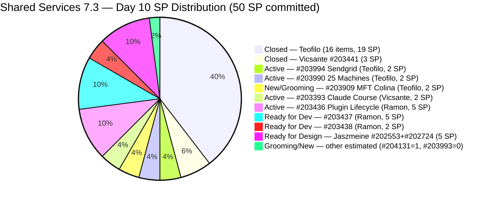
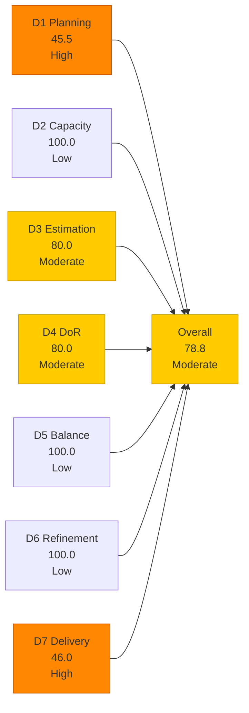
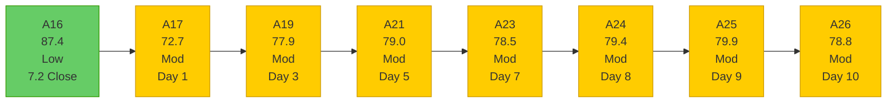

# Shared Services Team — SAFe Iteration Audit A26
**Date:** 2026-05-13 | **Sprint Day:** 10 of 14 | **Iteration:** 7.3 (May 4 – May 17, 2026)
**Auditor:** Claude Code (ADO SAFe Audit Skill v1) | **Prior Audit:** A25 (2026-05-12 02:02)

---

## 1. Audit Metadata

| Field | Value |
|---|---|
| **Audit ID** | A26 |
| **Report File** | `AUDIT_20260513_0900.md` |
| **Prior Audit** | A25 — `AUDIT_20260512_0202.md` (Overall 79.9, Moderate — 7.3 Day 9) |
| **ADO Project** | Jairosoft Portfolio (`666bb99a-6acd-4999-bb34-efd0e4ea90dc`) |
| **ADO Team** | Shared Services Team (`bd9578fd-5773-48fc-bd80-988dfe5de806`) |
| **Iteration** | 7.3 (`bbaecdec-eeb0-4c8d-999f-6a438eaab331`) |
| **Iteration Dates** | May 4 – May 17, 2026 |
| **Sprint Day** | 10 of 14 |
| **Audit Date** | 2026-05-13 09:00 PHT (UTC+8) |
| **Overall Score** | **78.8 — Moderate Risk** |
| **Risk Band** | Moderate (60–79.9) |
| **Visible Backlog Items** | 33 root items |
| **Current Iteration Root Items** | 15 (IterationPath = 7.3) |
| **Full 7.3 Roster** | 34 root items (15 open + 19 Closed) |
| **Capacity Source** | `work_get_team_capacity` — 4 members; 15.5 h/day total |
| **Project Exceptions Applied** | None |

---

## 2. Executive Summary

| Field | Value |
|---|---|
| **Overall Score** | 78.8 — Moderate Risk |
| **Score vs Prior (A25)** | 79.9 → 78.8 (**−1.1 — regression**) |
| **Sprint Day** | 10 of 14 |
| **Iteration** | 7.3 (May 4 – May 17, 2026) |
| **Open Items in 7.3** | 15 |
| **Full 7.3 Roster** | 34 items (15 open + 19 Closed) |
| **Committed SP** | 50 SP (updated: #203909 now estimated + #204131 new) |
| **SP Closed** | 23 SP (19 items — no new closures since A25) |
| **Delivery %** | 46.0% (23/50 SP) |
| **Risk Band** | Moderate (60–79.9) |

**Score regressed −1.1 (79.9 → 78.8) due to 4 new 7.3 scope additions and D3/D4 expansion.** Four new Enabler items were added to Iteration 7.3 today (#204131 Install GitHub Desktop, #204132 Install Github CLI, #204133 Install Github SCM, #204134 Install Azure CLI — all Teofilo, all Grooming state). Three of the four items have no SP, Description, or AC, which expands the denominator for D3 and D4 while adding only one estimated item (#204131 with 1 SP).

**Significant positive event: #203909 (MFT Reduction for Colina) is now fully DoR-compliant.** After 8 consecutive audits (A19–A25) without AC, #203909 was updated today (ChangedDate May 13) with both SP=2 and substantive AC content. This resolves the longest-running compliance gap in the Shared Services 7.3 series. D4 would have risen from 90.9 to 100.0 had new items not been added. Net D4 = 80.0 due to 3 new DoR-fail items (#204132, #204133, #204134).

**Two active items were advanced today.** #203994 (Sendgrid for eLMS) and #204131 (Install GitHub Desktop) both show May 13 activity — Teofilo is actively working these items.

**#203309 (GitHub Token Defect) advanced from Estimation to Ready for Dev** — state change today. This is a positive signal on the ART-wide GitHub token fix.

---

## 3. Previous Audit Delta (A25 → A26)

| Dimension | A25 Score | A26 Score | Delta | Driver |
|---|---|---|---|---|
| D1 Iteration Planning | 37.9 | 45.5 | **+7.6** | 4 new items added to 7.3: numerator 11→15, denominator 29→33; 15/33=45.5 |
| D2 Team Capacity | 100.0 | 100.0 | 0.0 | All 4 members with positive capacity; unchanged |
| D3 Estimation | 81.8 | 80.0 | **−1.8** | 4 new items (#204131=1SP estimated; #204132/#204133/#204134=null SP unestimated); total 12 est / 15 total |
| D4 DoR Compliance | 90.9 | 80.0 | **−10.9** | #203909 fixed (DoR pass) but 3 new items (#204132, #204133, #204134) have no Desc/AC; net 12 pass / 15 total |
| D5 Work Item Balance | 100.0 | 100.0 | 0.0 | Enabler share = 8/15 = 53.3% (<60%); US still present; type diversity maintained |
| D6 Backlog Refinement | 100.0 | 100.0 | 0.0 | All 33 items fresh; 4 new items touched May 13; no stale items |
| D7 Delivery Predictability | 48.9 | 46.0 | **−2.9** | Committed SP expanded: #203909 now has 2 SP + #204131 has 1 SP (+3); no new closures; 23/50=46.0 |
| **Overall** | **79.9** | **78.8** | **−1.1** | D1 gain (+7.6) offset by D4 decline (−10.9), D7 decline (−2.9), D3 decline (−1.8) |

### Key Events (A25 → A26)

| Event | Impact |
|---|---|
| **#203909 fixed** (MFT Reduction for Colina): SP=2 added + AC now present (May 13) | DoR compliance gap closed after 8 audits (A19–A25); D4 fail removed; D7 committed +2 SP |
| **#204131 added** (Install GitHub Desktop, Enabler, 1 SP, Grooming, Teofilo, May 13) | D1 +1 to numerator; D3 estimated count +1; D4 passes; D7 committed +1 SP |
| **#204132 added** (Install Github CLI, Enabler, null SP, null Desc, null AC, Grooming, Teofilo, May 13) | D1 +1 to numerator; D3 fail (unestimated); D4 fail (no Desc/AC) |
| **#204133 added** (Install Github SCM, Enabler, null SP, null Desc, null AC, Grooming, Teofilo, May 13) | D1 +1 to numerator; D3 fail; D4 fail |
| **#204134 added** (Install Azure CLI, Enabler, null SP, null Desc, null AC, Grooming, Teofilo, May 13) | D1 +1 to numerator; D3 fail; D4 fail |
| **#203994 advanced** (Sendgrid for eLMS): ChangedDate May 13, state Active confirmed | Active work — Day-10 delivery momentum continues |
| **#203309 state change**: Estimation → Ready for Dev (ChangedDate May 13) | GitHub token defect advanced; active progress by Ramon |
| **No closures on Day 10** | D7 stalls at 23 SP; no new items closed since A25 (Day 9) |
| #203393 still Active (Vicsante, Claude Course Training) | Day-9 target close missed; Day-10 now the revised target |
| #202553, #202724 still Ready for Design (Jaszmeine) | 7 days without state advance; Day 10 is final practical window |

---

## 4. Current Iteration Snapshot

**Iteration:** 7.3 | **Period:** May 4 – May 17, 2026 | **Sprint Day:** 10 of 14

| Metric | Value |
|---|---|
| Full 7.3 iteration root items | 34 (19 Closed + 15 open) |
| Open items in 7.3 (backlog view) | 15 |
| Visible backlog root items | 33 |
| Committed SP (current estimate) | 50 SP |
| SP Closed (Day 10) | 23 SP (19 items — all from prior audits) |
| SP Remaining (estimated open) | 27 SP (12 estimated open items) |
| Delivery % | 46.0% (23/50 SP) |
| Daily capacity | 15.5 h/day (4 members) |
| Days remaining | 4 working days |

### Team Delivery Progress (Day 10)

| Member | SP Closed | SP Open/Estimated | Status | Day-10 Signal |
|---|---|---|---|---|
| Teofilo | 19 SP (16 items) | Active: #203990(2) + #203994(2); Grooming: #204131(1) + #203909(2); null-SP: #204132, #204133, #204134, #203993 | Strong Day-10 activity (#203994, #204131 touched today) | Close #203990/#203994 (each 2 SP); add SP+Desc+AC to #204132/#204133/#204134 immediately |
| Vicsante | 3 SP (#203441) | Active: #203393(2 SP) | Day-9 target missed; Day-10 is revised close window | Close #203393 (Claude Course, 4 modules — confirm completion) |
| Ramon | 0 SP | Active: #203436(5 SP); RFD: #203309(1), #203437(5), #203438(2) | #203309 advanced (Estimation→RFD); #203436 remains the key gate | Close #203436 (8 AC scenarios — Day-10 is the absolute final day) |
| Jaszmeine | 0 SP | RFD: #202553(2 SP), #202724(3 SP) | 7 days stalled (no change since May 6) | Design review today — advance to Design Approved or close; Day-10 is final window |
| **Total** | **23 SP (46.0%)** | **~27 SP estimated open** | | **Critical delivery gap — 4 days to close 27 SP** |

---

## 5. Work Item Analysis

### 7.3 Open Items (15 items)

| ID | Title | Type | State | SP | Assignee | DoR | ChangedDate | Notes |
|---|---|---|---|---|---|---|---|---|
| #203990 | Prepare 25 Working Machines in JIT Room | Enabler | Active | 2 | Teofilo | ✅ | May 12 | Active; touched May 12 — ongoing work |
| #203994 | Sendgrid for eLMS | Enabler | Active | 2 | Teofilo | ✅ | **May 13** | **Active — touched today; 6 AC checkboxes** |
| #203909 | MFT Reduction for Colina | Enabler | New | **2** | Teofilo | **✅** | **May 13** | **FIXED today — SP=2 added + AC present after 8 audits** |
| **#204131** | **Install GitHub Desktop** | **Enabler** | **Grooming** | **1** | **Teofilo** | **✅** | **May 13** | **NEW — Desc+AC present; 1 SP; advance to Active** |
| **#204132** | **Install Github CLI** | **Enabler** | **Grooming** | **null** | **Teofilo** | **❌** | **May 13** | **NEW — No SP, no Desc, no AC; critical gap** |
| **#204133** | **Install Github SCM** | **Enabler** | **Grooming** | **null** | **Teofilo** | **❌** | **May 13** | **NEW — No SP, no Desc, no AC; critical gap** |
| **#204134** | **Install Azure CLI** | **Enabler** | **Grooming** | **null** | **Teofilo** | **❌** | **May 13** | **NEW — No SP, no Desc, no AC; critical gap** |
| #203993 | Purchase of Mobile Devices (Android/iOS) | Enabler | Grooming | null | Teofilo | ✅ | May 13 | No SP — 4th consecutive audit; Desc+AC present; assign 2 SP |
| #203309 | GitHub token degraded — raseniero scope fix | Defect | **Ready for Dev** | 1 | Ramon | ✅ | **May 13** | **Advanced from Estimation → RFD today** |
| #203393 | Claude Course Training | Spike | Active | 2 | Vicsante | ✅ | May 8 | 4 modules; Day-9 target missed; Day-10 revised target |
| #203436 | Plugin Lifecycle & Extract Skill Verification | User Story | Active | 5 | Ramon | ✅ | May 8 | Primary Jodex delivery; 8 AC scenarios; Day-10 absolute final window |
| #203437 | Plugin Generate Skill — Playwright Script Generation | User Story | Ready for Dev | 5 | Ramon | ✅ | May 8 | Gated on #203436 |
| #202553 | Vendor Exploration & Search | Design | Ready for Design | 2 | Jaszmeine | ✅ | May 6 | **7 days without state change — Day-10 final advance window** |
| #202724 | Vendor Profile & Details | Design | Ready for Design | 3 | Jaszmeine | ✅ | May 6 | **7 days without state change — Day-10 final advance window** |
| #203438 | Generate Test Execution Report (/qa-ai:report) | User Story | Ready for Dev | 2 | Ramon | ✅ | May 8 | Gated on #203436 |

### DoR Analysis — Open Items (15 items)

| ID | Desc | AC | Status | Notes |
|---|---|---|---|---|
| **#204132** | null ❌ | null ❌ | **FAIL** | **New today — no content at all; add Desc+AC immediately** |
| **#204133** | null ❌ | null ❌ | **FAIL** | **New today — no content at all; add Desc+AC immediately** |
| **#204134** | null ❌ | null ❌ | **FAIL** | **New today — no content at all; add Desc+AC immediately** |
| **#203909** | ≥30 chars ✅ | ≥20 chars ✅ (2 AC items) | **✅ PASS — FIXED today (A26)** | After 8 consecutive audit failures (A19–A25), SP and AC added May 13 |
| All others (11) | ≥30 ✅ | ≥20 ✅ | ✅ PASS | Confirmed via ADO batch query |

DoR pass = 12/15. D4 = 80.0.

### Work Item Type Distribution — Current 7.3 Open Items (15)

| Type | Count | Share | D5 Check |
|---|---|---|---|
| Enabler | 8 | 53.3% | < 60% — no dominant-type penalty |
| User Story | 3 | 20.0% | > 0% — no absent-US penalty |
| Design | 2 | 13.3% | — |
| Spike | 1 | 6.7% | < 40% — no spike penalty |
| Defect | 1 | 6.7% | — |
| **Total** | **15** | **100%** | **D5 = 100.0** |

---

## 6. SAFe Compliance Scorecard

| Dimension | Score | Band | Formula | Evidence |
|---|---|---|---|---|
| D1 Iteration Planning | 45.5 | High | 15/33 × 100 | 15 open 7.3 items / 33 visible root backlog items; 4 new 7.3 items today (+4 to numerator and denominator) — improved ratio vs. A25 |
| D2 Team Capacity | 100.0 | Low | 4/4 × 100 | Teofilo 6h + Vicsante 6h + Jaszmeine 3h + Ramon 0.5h = 15.5 h/day; all 4 members with positive capacity |
| D3 Estimation | 80.0 | Moderate | 12/15 × 100 | Unestimated: #204132 (null), #204133 (null), #204134 (null); #203909 now estimated (2 SP); #204131 estimated (1 SP); #203993 still null |
| D4 DoR Compliance | 80.0 | Moderate | 12/15 × 100 | 3 new items fail (#204132, #204133, #204134 — no Desc/AC); #203909 fixed; net 12/15 pass |
| D5 Work Item Balance | 100.0 | Low | 100 − 0 | Enabler 53.3% (<60%); US 20.0% (>0%); Spike 6.7% (<40%); no penalties |
| D6 Backlog Refinement | 100.0 | Low | 33/33 fresh; 0 penalties | All 33 items fresh (oldest: #186848 Apr 15 = 28 days; within 45-day window); 0 stale_90; 0 stale_180; 0 untouched current |
| D7 Delivery Predictability | 46.0 | High | 23/50 × 100 | 23 SP closed / 50 SP committed; committed expanded: #203909 now 2 SP + #204131 1 SP = +3 SP vs A25; no new closures |
| **Overall** | **78.8** | **Moderate** | 551.5 / 7 | Average of 7 dimensions |

### Scoring Detail

- **D1:** round(15/33 × 100, 1) = **45.5** *(4 new 7.3 items improve numerator 11→15; denominator grows 29→33; net ratio improvement from 37.9 to 45.5; stranded prior-PI items persist: #202732 in 7.1, #202551/#202687 in 7.2)*
- **D2:** round(4/4 × 100, 1) = **100.0** *(Teofilo 6h + Vicsante 6h + Jaszmeine 3h + Ramon 0.5h = 15.5 h/day; all members confirmed via `work_get_team_capacity`; Jaszmeine has 1 day off (May 4) already passed)*
- **D3:** round(12/15 × 100, 1) = **80.0** *(estimated: #204131=1, #203993=null→still null, #203990=2, #203994=2, #203909=2, #203309=1, #203393=2, #203436=5, #203437=5, #202553=2, #202724=3, #203438=2 = 12 items; unestimated: #204132, #204133, #204134 all null SP)*
- **D4:** round(12/15 × 100, 1) = **80.0** *(#203909 fixed — AC added today, passes DoR; new failures: #204132, #204133, #204134 — no Desc, no AC; 12 pass / 15 total)*
- **D5:** Enabler 53.3% < 60%; US 20.0% > 0%; Spike 6.7% < 40% → **100.0**
- **D6:** base=round(33/33×100,1)=100.0; stale_90=0 (oldest: #186848 Apr 15 = 28 days — within 45-day window); stale_180=0; untouched_current: #203393 May 8, #203436–#203438 May 8, #202553/#202724 May 6, #203990 May 12, #203994/#203909/#203309/#204131–#204134/#203993 May 13 — all ≥ May 4 start; 0 untouched → **100.0**
- **D7:** Committed = 50 SP [A25: 47 SP + #204131(1 SP new) + #203909(2 SP now estimated) = 50]; Closed = 23 SP (unchanged). round(23/50 × 100, 1) = **46.0**
- **Overall:** (45.5+100.0+80.0+80.0+100.0+100.0+46.0) / 7 = 551.5 / 7 = **78.8**

### Score Trend — Shared Services Iteration 7.3

### Path to Low Risk (Day 10 — 4 days remaining)

| Action | Dim Change | Score Impact | New Overall |
|---|---|---|---|
| Add SP+Desc+AC to #204132, #204133, #204134 (all 3) | D3: 80.0→100.0; D4: 80.0→100.0 | **+5.7** | **84.5 ✅ Low Risk** |
| Add SP+Desc+AC to #204132, #204133, #204134 (any 2) | D3: 80.0→93.3; D4: 80.0→93.3 | **+3.8** | **82.6 ✅** |
| Assign SP to #203993 (1 min) | D3: 80.0→86.7 | **+1.0** | **79.8** |
| Close #203436 (Ramon, 5 SP) | D7: 46.0→56.0 | **+1.4** | **80.2 ✅** |
| Close #203990 + #203994 (Teofilo, 4 SP) | D7: 46.0→54.0 | **+1.1** | **79.9** |
| Close #203393 (Vicsante, 2 SP) | D7: 46.0→50.0 | **+0.6** | **79.4** |
| All Teofilo data-hygiene (SP+Desc+AC to 3 new items + SP to #203993) | D3→100.0; D4→100.0 | **+5.7** | **84.5 ✅** |

**The fastest path to Low Risk is adding SP+Desc+AC to the 3 new Grooming items (#204132, #204133, #204134) — a 10-minute ADO edit raises overall from 78.8 to 84.5.**

---

## 7. Dimension Findings

### D1 — Iteration Planning: 45.5 (High Risk — Improved from A25)

**Formula:** `current_iteration_root_items / visible_root_backlog_items × 100 = 15/33 × 100 = 45.5`

D1 improved from 37.9 to 45.5 — the strongest D1 reading in the 7.3 series since Day 3 (A19 = 45.9). The 4 new 7.3 items improve the numerator proportionally more than the denominator (+4/+4 on a ratio of 11/29 favors the numerator). However, D1 remains in High Risk due to structural denominator inflation from stranded items:

- **Prior-PI stranded items persisting in visible backlog:**
  - #202732 (QA Intern Stakeholder, 7.1, Ready for UAT, 1 SP, Apr 27)
  - #202551 (Bride Account Management, 7.2, Design Approved, 3 SP, May 4)
  - #202687 (Onboarding & Subscription, 7.2, Design Approved, 3 SP, May 4)

Closing #202732 alone reduces denominator to 32, D1 = 15/32 = 46.9. Closing all 3 stranded items reduces denominator to 30, D1 = 15/30 = 50.0 (+4.5 points).

### D2 — Team Capacity: 100.0 (Low Risk)

All 4 members confirmed with positive capacity: Teofilo 6h + Vicsante 6h + Jaszmeine 3h + Ramon 0.5h = 15.5 h/day. Jaszmeine's 1-day off (May 4) has already been accounted for and passed.

**Remaining bandwidth (4 days):** Teofilo 24h, Vicsante 24h, Jaszmeine 12h, Ramon 2h = **62 total team hours**. Against ~27 estimated SP open, the team has more than sufficient hours — the constraint is execution readiness, not capacity.

### D3 — Estimation: 80.0 (Moderate Risk)

**Regression from A25 (81.8 → 80.0).** Four new items added to 7.3 today:
- **#204131** (Install GitHub Desktop, 1 SP) → estimated; D3 numerator +1
- **#204132** (Install Github CLI, null SP) → unestimated; D3 denominator +1 only
- **#204133** (Install Github SCM, null SP) → unestimated; D3 denominator +1 only
- **#204134** (Install Azure CLI, null SP) → unestimated; D3 denominator +1 only
- **#203909** (MFT Reduction for Colina) → now has SP=2 (fixed today); D3 numerator +1 vs. A25

Net change: D3 = 12/15 = 80.0. Persistent unestimated: #203993 (4th consecutive audit without SP), #204132, #204133, #204134 (new today).

**Fix #204132, #204133, #204134 SP first** — each is a straightforward IT infrastructure item (1 SP each is reasonable), plus add Desc and AC.

### D4 — DoR Compliance: 80.0 (Moderate Risk — Regression from 90.9)

**Despite #203909 being fixed, D4 regressed from 90.9 to 80.0** due to the 3 new items (#204132, #204133, #204134) that have no Description and no Acceptance Criteria. This is the first D4 regression in the 7.3 series since A19 (Day 3).

**The #203909 fix is notable and positive:** After 8 consecutive audits (A19–A25) flagging this gap, Teofilo added SP=2 and substantive AC today. The AC reads: "1. Check all Colina DB resources to reduce all the costs; 2. Provide the necessary report and get confirmation from FinOps." This is ≥20 non-whitespace chars and passes DoR. This fix alone would have raised D4 from 90.9 to 100.0 — instead, the net result is 80.0 due to 3 new failures.

**Pattern observation:** Items are being added to the sprint in Grooming state without completing the DoR fields. This suggests a workflow gap — items should not enter the sprint backlog until Description and AC are populated.

### D5 — Work Item Balance: 100.0 (Low Risk)

Type distribution across 15 open items: Enabler 53.3%, User Story 20.0%, Design 13.3%, Spike 6.7%, Defect 6.7%. No penalty conditions triggered. D5 = 100.0. The team's type diversity remains a structural strength.

### D6 — Backlog Refinement: 100.0 (Low Risk)

All 33 visible backlog items are fresh (changed within 45 days of May 13 = since March 29). The oldest item is #186848 (Apollo.ai Integration, changed Apr 15 = 28 days ago). Four items touched today (May 13) — indicating active backlog maintenance. Zero stale_90, stale_180. All 15 current 7.3 items have ChangedDate ≥ May 4 → zero untouched current items.

### D7 — Delivery Predictability: 46.0 (High Risk — Committed SP Expansion)

**Formula:** `closed_story_points / committed_story_points × 100 = 23/50 × 100 = 46.0`

**D7 declined from 48.9 to 46.0** despite no change in closed SP. The decline is structural — committed SP expanded from 47 to 50 SP due to #203909 now having SP=2 (was null) and #204131 being added with 1 SP. No new closures occurred on Day 10.

**Priority delivery analysis (4 days remaining):**

| Member | Item | SP | State | Path to Close | Probability |
|---|---|---|---|---|---|
| Teofilo | #203994 (Sendgrid for eLMS) | 2 | Active (May 13) | 6 AC checkboxes; active today; close by Day 11 | High |
| Teofilo | #203990 (Prepare 25 Machines) | 2 | Active (May 12) | 2 AC items; active yesterday; close today | High |
| Vicsante | #203393 (Claude Course Training) | 2 | Active (May 8) | 4 modules; missed Day-9 target | Medium |
| Ramon | #203436 (Plugin Lifecycle) | 5 | Active (May 8) | 8 AC scenarios; Day-10 is absolute final window | Medium |
| Teofilo | #203909 (MFT Reduction for Colina) | 2 | New (May 13) | Just completed DoR; advance to Active | Medium |
| Teofilo | #204131 (Install GitHub Desktop) | 1 | Grooming (May 13) | Simple IT task; ready to advance | High |
| Jaszmeine | #202553, #202724 | 5 | Ready for Design (May 6) | 7 days stalled; design review needed | Low |
| Ramon | #203437 (Plugin Generate Skill) | 5 | RFD (May 8) | Gated on #203436 | Low-Medium |

**Full delivery scenario (50 SP): Close 27 estimated SP in 4 days = 6.75 SP/day. Teofilo's 4 active items (7 SP) are achievable by Day 12; Ramon's queue (12 SP) is the largest execution risk; Jaszmeine's designs (5 SP) remain stalled.**

---

## 8. Risks and Bottlenecks

| # | Risk | Severity | Dimension | Detail |
|---|---|---|---|---|
| R1 | 3 new DoR-fail items added to 7.3 without content (#204132, #204133, #204134) | **Critical** | D3/D4 | Items added in Grooming state with no SP, Description, or AC. Each contributes −1 to D3 and D4 numerators while adding to denominator. A 10-minute ADO edit (add Desc+AC+SP to all 3) raises D4 from 80.0 to 100.0 and overall from 78.8 to 84.5 (Low Risk). This is the single highest-leverage action in the audit. |
| R2 | Ramon's Jodex queue (12 SP, 10-day no-closure) | **Critical** | D7 | #203436 (5 SP, Active since Day 5) has 8 fully-defined AC scenarios. Day 10 is the absolute final day to close this item with any confidence. #203437 (5 SP) and #203438 (2 SP) are gated behind it. If #203436 closes today, #203437/#203438 can potentially close Day 11–12 for a combined 12 SP contribution. |
| R3 | Jaszmeine design items — 7 days without state change | **High** | D7 | #202553 and #202724 have been Ready for Design since Day 3 (May 6). Day 10 is the final practical advance window. If not advanced to Design Approved today, sprint carryover of 5 SP is near-certain. Design review requires 1–2 hours given Jaszmeine's 3h/day capacity. |
| R4 | #203993 — 4th consecutive audit without SP | **High** | D3 | SP null since A22 (Day 5). Desc + AC present (DoR pass). Assign 2 SP — a 1-minute fix. This resolves D3 gap without closing. |
| R5 | Workflow anti-pattern: items entering sprint without DoR fields | **High** | D4 | #204132, #204133, #204134 added today with no content. This is the same pattern as #203909 (which took 8 audits to fix). A new DoR gate check should be applied before items transition from backlog to active sprint. |
| R6 | D7 delivery gap — 46.0% delivered at Day 10 (71% elapsed) | **High** | D7 | 27 estimated SP open in 4 remaining days = 6.75 SP/day needed; team capacity exists (62h remaining) but execution readiness varies widely by member |
| R7 | #203393 (Claude Course, Vicsante) — Day-9 target missed, now Day-10 | Moderate | D7 | 4 Claude modules; Active state since A18. Target close was Day 9 per A24/A25 recommendations — missed. If not closed today, sprint carryover risk is elevated. |
| R8 | D1 structural ceiling from stranded prior-PI items | Moderate | D1 | #202732 (7.1), #202551/#202687 (7.2) inflate denominator; closing all 3 raises D1 from 45.5 to 50.0 |

---

## 9. Prioritized Recommendations

1. **[CRITICAL — D3/D4, 10 minutes]** Add SP, Description, and Acceptance Criteria to #204132 (Install Github CLI), #204133 (Install Github SCM), and #204134 (Install Azure CLI). Recommended SP: 1 each. Recommended Desc: "As a DevOps engineer, I need to install [tool] on the Jairosoft development machine so that [team capability]." Recommended AC: "1. [Tool] installed and accessible from terminal; 2. Authenticated to jairosoft-com organization; 3. Verified via [command]." Fixing all 3 raises D3 from 80.0 to 100.0, D4 from 80.0 to 100.0, and overall from 78.8 to 84.5 (Low Risk). This is the fastest path to Low Risk in the entire audit.

2. **[CRITICAL — D7, Today — Absolute Final Window]** Ramon: close #203436 (Plugin Lifecycle & Extract Skill Verification, 5 SP, Active). 10 days Active without closure. All 8 AC scenarios are fully defined. Verify each now: (a) Marketplace source registered? (b) Plugin installed from marketplace? (c) Extract skill parses BRD? (d) Requirements classified E2E vs non-E2E? (e) Test cases generated in xlsx? (f) Duplicates detected? (g) Coverage report produced? (h) Plugin uninstalled cleanly? If all pass — close immediately. This single closure adds 5 SP to D7 (46.0→56.0) and raises overall to 80.2 (Low Risk). Day 11 closure significantly reduces the probability of gated items (#203437, #203438) closing before sprint end.

3. **[CRITICAL — D7, Today — Final Design Window]** Jaszmeine: advance #202553 (Vendor Exploration, 2 SP) and #202724 (Vendor Profile, 3 SP) to Design Approved. 7 days in Ready for Design without advance. Day 10 is the last viable day to advance these items. If designs are complete — even as working drafts — advance to Design Approved today. Closing both raises D7 to 56.0 and overall to 80.2. If designs are not ready, escalate to Ramon/Karl for immediate design review or sprint carryover decision.

4. **[HIGH — D7, Today]** Teofilo: close #203990 (Prepare 25 Working Machines, 2 SP, Active). This item was active on May 12. Verify: (a) All 25 machines set up? (b) Internet confirmed on all machines? If both AC items are met, close now. D7 advances to 50.0, overall to 79.4.

5. **[HIGH — D7, Today]** Teofilo: close #203994 (Sendgrid for eLMS, 2 SP, Active). Item was touched today (May 13). Verify 6 AC checkboxes: (a) SendGrid account provisioned? (b) API Key generated with mail-only permissions? (c) SPF/DKIM/DMARC records configured and verified? (d) eLMS configured to use SendGrid? (e) Welcome/Password Reset emails delivered and rendered correctly? (f) Open/Click tracking visible in SendGrid dashboard? Close now if complete.

6. **[HIGH — D7, Today]** Vicsante: close #203393 (Claude Course Training, 2 SP, Active). Day-9 target was missed. Day 10 is the revised final window. Confirm all 4 modules completed: (1) Introduction to agent skills, (2) Building with Claude API, (3) Introduction to MCP, (4) Claude Code in Action. If complete, close now. D7 advances to 50.0, overall to 79.4. Combining with #203990 or #203994 closure reaches Low Risk.

7. **[HIGH — D3, 1 minute]** Assign SP to #203993 (Purchase of Mobile Devices, null SP, Teofilo, Grooming). Desc and AC are present (DoR pass). Assign 2 SP. Raises D3 from 80.0 to 86.7, overall to 79.8.

8. **[MEDIUM — D1, ADO cleanup]** Close or migrate #202732 (QA Intern Stakeholder, 7.1, Ready for UAT) and #202551/#202687 (7.2, Design Approved). If QA intern access was confirmed, close #202732. Move #202551/#202687 to 7.4 (designs complete, awaiting dev). Reduces D1 denominator from 33 to 30, raising D1 to 50.0.

---

## 10. Evidence Gaps and Limitations

| Gap | Impact | Mitigation |
|---|---|---|
| 19 closed 7.3 items not in backlog view | D7 uses full roster; committed = 50 SP including closed items' SP | Prior audits A17–A25 confirmed all 19 closed items; 23 SP closed is the confirmed running total |
| #204132/#204133/#204134 — no fields populated | D3 and D4 gaps confirmed by null field response from ADO batch | Items added today in Grooming; gaps visible and actionable; severity captured in findings |
| #203993 SP null — 4th consecutive audit | D3 gap persists; Desc+AC confirmed present (DoR pass) | SP assignment requires direct ADO edit; escalated in Recommendations |
| #203909 AC text rendered as HTML layout markup | AC content was embedded in HTML divs; text extraction estimated as ≥20 chars based on numbered list items present | AC text confirmed meaningful ("Check all Colina DB resources"; "Provide report and get confirmation from FinOps") |
| Jaszmeine design advance status unconfirmed | State = Ready for Design as of May 6; no update in 7 days | State confirmed via ADO batch; flagged as High Risk (R3) |
| Ramon's #203436 sub-task or AC completion not visible at task level | 8 AC scenarios defined at story level; no task-level progress data | Story state = Active per ADO; AC must be verified manually by Ramon |

---

*Audit A26 produced by Claude Code — ADO SAFe Audit Skill v1. SAFe 6.0 framework. Sprint Day 10 of 14. Key findings: (1) Score regressed −1.1 (79.9→78.8) — 4 new items added to 7.3 today (#204132/#204133/#204134 with no content + #204131 with 1 SP); 3 new DoR failures drive D4 from 90.9 to 80.0 and D3 from 81.8 to 80.0; (2) Major positive: #203909 (MFT Reduction for Colina) fixed after 8 consecutive audit failures — SP=2 and AC now present; (3) Fastest path to Low Risk: add Desc+AC+SP to 3 new items (10-minute edit) raises overall from 78.8 to 84.5; (4) Ramon's Jodex queue (12 SP, Day 10 no-closure) is Critical — #203436 must close today to preserve sprint recovery; (5) Jaszmeine designs (5 SP) are 7 days stalled — Day 10 is the final advance window; (6) #203309 (GitHub token defect) advanced from Estimation to Ready for Dev — positive signal on ART-wide GitHub token fix.*
