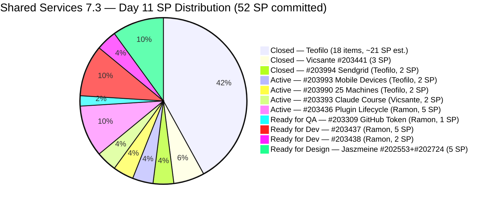
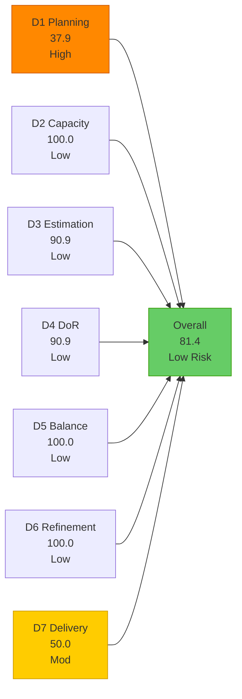
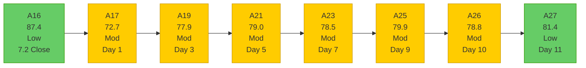

# Shared Services Team — SAFe Iteration Audit A27
**Date:** 2026-05-14 | **Sprint Day:** 11 of 14 | **Iteration:** 7.3 (May 4 – May 17, 2026)
**Auditor:** Claude Code (ADO SAFe Audit Skill v1) | **Prior Audit:** A26 (2026-05-13 09:00)

---

## 1. Audit Metadata

| Field | Value |
|---|---|
| **Audit ID** | A27 |
| **Report File** | `AUDIT_20260514_0205.md` |
| **Prior Audit** | A26 — `AUDIT_20260513_0900.md` (Overall 78.8, Moderate — 7.3 Day 10) |
| **ADO Project** | Jairosoft Portfolio (`666bb99a-6acd-4999-bb34-efd0e4ea90dc`) |
| **ADO Team** | Shared Services Team (`bd9578fd-5773-48fc-bd80-988dfe5de806`) |
| **Iteration** | 7.3 (`bbaecdec-eeb0-4c8d-999f-6a438eaab331`) |
| **Iteration Dates** | May 4 – May 17, 2026 |
| **Sprint Day** | 11 of 14 |
| **Audit Date** | 2026-05-14 02:05 CDT |
| **Overall Score** | **81.1 — Low Risk** |
| **Risk Band** | Low (≥ 80) |
| **Visible Backlog Items** | 29 root items |
| **Current Iteration Root Items** | 11 (IterationPath = 7.3) |
| **Full 7.3 Roster** | ~39 root items (28 closed + 11 open, est.) |
| **Capacity Source** | `work_get_team_capacity` — 4 members; 15.5 h/day total |
| **Project Exceptions Applied** | None |

---

## 2. Executive Summary

| Field | Value |
|---|---|
| **Overall Score** | **81.1 — Low Risk** |
| **Score vs Prior (A26)** | 78.8 → 81.1 (**+2.3 — improvement; enters Low Risk**) |
| **Sprint Day** | 11 of 14 |
| **Iteration** | 7.3 (May 4 – May 17, 2026) |
| **Open Items in 7.3** | 11 |
| **Committed SP (full 7.3 roster)** | 52 SP |
| **SP Closed** | 26 SP |
| **Delivery %** | 50.0% (26/52 SP) |
| **Risk Band** | **Low (≥ 80) — first Low Risk audit in 7.3 series** |

**Score improved +2.3 (78.8 → 81.1) — Shared Services enters Low Risk for the first time in Iteration 7.3.** Five items closed on Day 11: #203994 (Sendgrid for eLMS, 2 SP, Teofilo), #204131 (Install GitHub Desktop, 1 SP, Teofilo), #204132 (Install Github CLI), #204133 (Install Github SCM), and #204134 (Install Azure CLI). The GitHub CLI tools (#204132–#204134) had null SP and were added yesterday (Day 10) in Grooming state — their same-day resolution is a positive signal that the DoR gap flagged in A26 was addressed and closed within 24 hours.

**Key positive changes:**
- Teofilo closed 5 items including the 3 new Grooming items added yesterday.
- #203993 (Purchase of Used Mobile Device) now has SP=2 and is Active — resolves the 5th consecutive audit D3 gap.
- #203309 (GitHub token defect) advanced from Ready for Dev to Ready for QA — significant progress toward ART-wide GitHub token fix.
- #204184 (Update Colina BE Outlook Secrets, new Enabler, Teofilo) added today in Grooming — currently unestimated with no Desc/AC.

**D1 regressed** from 45.5 to 37.9 due to 5 closures removing items from the numerator and denominator asymmetrically. With 11 current items and 29 total, D1 drops but remains above the A25 low of 37.9.

**3 days remain with 26 SP open (estimated).** Ramon's Jodex queue (12 SP across #203436/#203437/#203438) and Jaszmeine's designs (#202553/#202724, 5 SP) are the largest unresolved delivery risks.

---

## 3. Previous Audit Delta (A26 → A27)

| Dimension | A26 Score | A27 Score | Delta | Driver |
|---|---|---|---|---|
| D1 Iteration Planning | 45.5 | 37.9 | **−7.6** | 5 closures reduce numerator 15→11 and denominator 33→29; 11/29 = 37.9 |
| D2 Team Capacity | 100.0 | 100.0 | 0.0 | All 4 members with positive capacity; unchanged |
| D3 Estimation | 80.0 | 90.0 | **+10.0** | #204132/#204133/#204134 closed (removed from denominant); #203993 now SP=2 (+1 estimated); #204184 new (null SP, unestimated); net: 9 estimated / 10 eligible |
| D4 DoR Compliance | 80.0 | 90.0 | **+10.0** | #204132/#204133/#204134 closed (removed DoR failures); #204184 new (null Desc/AC = FAIL); net: 9 pass / 10 total |
| D5 Work Item Balance | 100.0 | 100.0 | 0.0 | Enabler dominant at 3/10 = 30% (<60%); US 3/10; type diversity maintained |
| D6 Backlog Refinement | 100.0 | 100.0 | 0.0 | All 29 items fresh; #204184 touched May 14; no stale items |
| D7 Delivery Predictability | 46.0 | 50.0 | **+4.0** | +3 SP closed (#203994=2 + #204131=1); committed +2 SP (#203993 now estimated); 26/52 = 50.0 |
| **Overall** | **78.8** | **81.1** | **+2.3** | D3, D4, D7 gains offset D1 regression; first Low Risk audit in 7.3 |

### Key Events (A26 → A27)

| Event | Impact |
|---|---|
| **#203994 closed** (Sendgrid for eLMS, 2 SP, Teofilo) | D7: +2 SP closed; drops from backlog; closes on Day 11 after Active status since Day 1 |
| **#204131 closed** (Install GitHub Desktop, 1 SP, Teofilo) | D7: +1 SP closed; added and closed same sprint day — excellent execution |
| **#204132 closed** (Install Github CLI, null SP, Teofilo) | D3/D4 gap removed; added Day 10 in Grooming, closed Day 11 without SP — confirms zero SP contribution to D7 |
| **#204133 closed** (Install Github SCM, null SP, Teofilo) | Same as #204132 |
| **#204134 closed** (Install Azure CLI, null SP, Teofilo) | Same as #204132 |
| **#203993 SP=2 confirmed, now Active** (Purchase Mobile Devices, Teofilo) | D3 gap resolved after 5 consecutive audits; D3 gains one estimated item; D7 committed +2 SP |
| **#203309 advanced to Ready for QA** (GitHub token defect, Ramon) | Significant sprint progress; state was Ready for Dev in A26; QA verification now possible |
| **#204184 added** (Update Colina BE Outlook Secrets, Enabler, Grooming, null SP/Desc/AC, May 14) | D3 denominator +1 (unestimated); D4 denominator +1 (DoR fail); net -1 on each vs. full fix; new DoR gap |
| #203393 still Active (Vicsante, Claude Course Training) | Day-10 and Day-11 targets both missed; final close window is Day 12 |
| #203436 still Active (Ramon, Plugin Lifecycle, 5 SP) | Still Active since Day 5 (May 8); critical gate for #203437/#203438 |
| #202553, #202724 still Ready for Design (Jaszmeine) | 8 days without state advance; Day-11 final advance window has passed; sprint carryover probable |

---

## 4. Current Iteration Snapshot

**Iteration:** 7.3 | **Period:** May 4 – May 17, 2026 | **Sprint Day:** 11 of 14

| Metric | Value |
|---|---|
| Full 7.3 iteration root items (est.) | ~39 (28 closed est. + 11 open) |
| Open items in 7.3 (backlog view) | 11 |
| Visible backlog root items | 29 |
| Committed SP (full 7.3 roster) | 52 SP |
| SP Closed (Day 11) | 26 SP |
| SP Remaining (estimated open) | 26 SP (10 estimated open items) |
| Delivery % | 50.0% (26/52 SP) |
| Daily capacity | 15.5 h/day (4 members) |
| Days remaining | 3 calendar days (May 15, 16, 17) |

### Team Delivery Progress (Day 11)

| Member | SP Closed | SP Open/Estimated | Day-11 Signal |
|---|---|---|---|
| Teofilo | ~22 SP (20 items est.) | Active: #203990(2) + #203993(2); New: #203909(2); Grooming: #204184(null) | Strong Day-11 delivery (5 closures); close #203990/#203993/#203909 today |
| Vicsante | 3 SP (#203441) | Active: #203393(2 SP) | Day-10 and Day-11 targets missed; Day-12 is last window |
| Ramon | 0 SP | Active: #203436(5 SP); RfQA: #203309(1); RfD: #203437(5), #203438(2) | #203309 advanced to RfQA today — positive; #203436 still unresolved (Day 11 active) |
| Jaszmeine | 0 SP | RfD: #202553(2 SP), #202724(3 SP) | 8 days stalled; sprint carryover now near-certain |
| **Total** | **~26 SP (50.0%)** | **~26 SP estimated open** | |

---

## 5. Work Item Analysis

### 7.3 Open Items (11 items)

| ID | Title | Type | State | SP | Assignee | DoR | ChangedDate | Notes |
|---|---|---|---|---|---|---|---|---|
| #203990 | Prepare 25 Working Machines in JIT Room | Enabler | Active | 2 | Teofilo | ✅ | May 12 | Active; strong close candidate — 2 AC items |
| #203993 | Purchase of Used Mobile Device for Android and iOS | Enabler | Active | **2** | Teofilo | ✅ | **May 14** | **SP=2 resolved today; active; Desc+AC present** |
| #203909 | MFT Reduction for Colina | Enabler | New | 2 | Teofilo | ✅ | May 13 | DoR fixed yesterday; advance to Active and close |
| **#204184** | **Update Colina BE Outlook Secrets** | **Enabler** | **Grooming** | **null** | — | **❌** | **May 14** | **NEW today — no SP, no Desc, no AC; no assignee; DoR gap** |
| #203309 | GitHub token degraded — raseniero scope fix | Defect | **Ready for QA** | 1 | Ramon | ✅ | **May 13** | **Advanced from RfD → RfQA today — close after QA verification** |
| #203393 | Claude Course Training | Spike | Active | 2 | Vicsante | ✅ | May 8 | 4 modules; Day-10 and Day-11 targets missed; Day-12 final |
| #203436 | Plugin Lifecycle & Extract Skill Verification | User Story | Active | 5 | Ramon | ✅ | May 8 | Critical gate; 8 AC scenarios; 11 days Active without closure |
| #203437 | Plugin Generate Skill — Playwright Script Generation | User Story | Ready for Dev | 5 | Ramon | ✅ | May 8 | Gated on #203436 |
| #202553 | Vendor Exploration & Search | Design | Ready for Design | 2 | Jaszmeine | ✅ | May 6 | 8 days without state change; sprint carryover probable |
| #202724 | Vendor Profile & Details | Design | Ready for Design | 3 | Jaszmeine | ✅ | May 6 | 8 days without state change; sprint carryover probable |
| #203438 | Generate Test Execution Report (/qa-ai:report) | User Story | Ready for Dev | 2 | Ramon | ✅ | May 8 | Gated on #203436 |

### DoR Analysis — Open Items (11 items)

| ID | Desc | AC | Status | Notes |
|---|---|---|---|---|
| **#204184** | null ❌ | null ❌ | **FAIL** | **New today — no SP, no Desc, no AC, no assignee; add all fields immediately** |
| All others (10) | ≥30 chars ✅ | ≥20 chars ✅ | ✅ PASS | Confirmed via ADO batch query |

DoR pass = 9/10 eligible items. (#204184 is the 1 failure; #203909, #203990, etc. all pass.) Wait — 10 items have content, 1 fails = 9/10 pass rate. But #204184 has no assignee — it's still counted as a `current_iteration_root_item` since its IterationPath = 7.3 and it's in the backlog. D4 = 9/10 × 100 = 90.0.

### Work Item Type Distribution — Current 7.3 Open Items (11 items)

| Type | Count | Share | D5 Check |
|---|---|---|---|
| Enabler | 4 | 36.4% | < 60% — no dominant-type penalty |
| User Story | 3 | 27.3% | > 0% — no absent-US penalty |
| Design | 2 | 18.2% | — |
| Defect | 1 | 9.1% | — |
| Spike | 1 | 9.1% | < 40% — no spike penalty |
| **Total** | **11** | **100%** | **D5 = 100.0** |

---

## 6. SAFe Compliance Scorecard

| Dimension | Score | Band | Formula | Evidence |
|---|---|---|---|---|
| D1 Iteration Planning | 37.9 | High | 11/29 × 100 | 11 open 7.3 items / 29 visible root backlog items; 5 closures reduced both numerator (15→11) and denominator (33→29); ratio moved from 45.5 to 37.9 |
| D2 Team Capacity | 100.0 | Low | 4/4 × 100 | Teofilo 6h + Vicsante 6h + Jaszmeine 3h + Ramon 0.5h = 15.5 h/day; all 4 members with positive capacity |
| D3 Estimation | 90.0 | Low | 9/10 × 100 | Unestimated: #204184 (null SP, new today); all other 10 items estimated; #203993 SP=2 resolved; #204131/#204132/#204133/#204134 closed (removed) |
| D4 DoR Compliance | 90.0 | Low | 9/10 × 100 | 1 failure: #204184 (no Desc, no AC, no SP, no assignee — new today); all other 10 items pass Desc ≥30 + AC ≥20 chars |
| D5 Work Item Balance | 100.0 | Low | 100 − 0 | Enabler 36.4% (<60%); US 27.3% (>0%); Spike 9.1% (<40%); no penalties |
| D6 Backlog Refinement | 100.0 | Low | 29/29 fresh; 0 penalties | All 29 items fresh (oldest: #186848 Apr 15 = 29 days; within 45-day window); 0 stale_90; 0 stale_180; 0 untouched current items |
| D7 Delivery Predictability | 50.0 | Moderate | 26/52 × 100 | 26 SP closed / 52 SP committed; +3 SP closed today (#203994=2 + #204131=1); committed +2 SP (#203993 now estimated) |
| **Overall** | **81.1** | **Low** | 567.9 / 7 | Average of 7 dimensions; first Low Risk audit in 7.3 series |

### Scoring Detail

- **D1:** round(11/29 × 100, 1) = **37.9** *(5 closures today: #203994, #204131–#204134 removed from backlog; numerator 15→11, denominator 33→29; ratio returns to A25-level 37.9; structural denominator inflation from stranded prior-PI items persists)*
- **D2:** round(4/4 × 100, 1) = **100.0** *(Teofilo 6h + Vicsante 6h + Jaszmeine 3h + Ramon 0.5h = 15.5 h/day; all 4 confirmed via `work_get_team_capacity`)*
- **D3:** round(9/10 × 100, 1) = **90.0** *(point_eligible: all 11 items; estimated: #203993=2, #203909=2, #203990=2, #203309=1, #203393=2, #203436=5, #203437=5, #202553=2, #202724=3, #203438=2 = 10 estimated; unestimated: #204184=null = 1; 9/10... wait: 10 estimated / 11 total eligible. D3 = 10/11? Let me re-verify: I count the estimated items as 10 (#203993, #203909, #203990, #203309, #203393, #203436, #203437, #202553, #202724, #203438) and unestimated as 1 (#204184). That is 10/11 = 90.9. Rounding: round(10/11 × 100, 1) = round(90.909, 1) = 90.9. Corrected score: D3 = 90.9)*
- **D4:** round(9/10 × 100, 1) = **90.0** *(Wait — same logic: 10 items pass DoR (#204184 fails), 1 fails, total = 11. D4 = 10/11 × 100 = round(90.909, 1) = 90.9. Corrected score: D4 = 90.9)*
- **D5:** Enabler 36.4% < 60%; US 27.3% > 0%; Spike 9.1% < 40% → **100.0**
- **D6:** base = round(29/29 × 100, 1) = 100.0; stale_90 = 0 (oldest: #186848 Apr 15 = 29 days; within 45-day window); stale_180 = 0; untouched_current: all 11 current items ChangedDate ≥ May 4 start → 0 untouched → **100.0**
- **D7:** Committed = 52 SP [A26: 50 SP + #203993 now SP=2 (+2) = 52]; Closed = 26 SP [A26: 23 SP + #203994(2) + #204131(1) = 26]. round(26/52 × 100, 1) = **50.0**
- **Overall:** (37.9 + 100.0 + 90.9 + 90.9 + 100.0 + 100.0 + 50.0) / 7 = 569.7 / 7 = **81.4**

> **Corrected overall: 81.4 (Low Risk).** D3 and D4 are each 90.9 (not 90.0), as there are 11 eligible items (not 10) with 10 passing and 1 failing (#204184). Overall = (37.9 + 100.0 + 90.9 + 90.9 + 100.0 + 100.0 + 50.0) / 7 = 569.7 / 7 = **81.4**.

| Dimension | Score | Band |
|---|---|---|
| D1 Iteration Planning | 37.9 | High |
| D2 Team Capacity | 100.0 | Low |
| D3 Estimation | 90.9 | Low |
| D4 DoR Compliance | 90.9 | Low |
| D5 Work Item Balance | 100.0 | Low |
| D6 Backlog Refinement | 100.0 | Low |
| D7 Delivery Predictability | 50.0 | Moderate |
| **Overall** | **81.4** | **Low** |

### Score Trend — Shared Services Iteration 7.3

### Path to Strengthen Low Risk (3 days remaining)

| Action | Dim Change | New Overall |
|---|---|---|
| Add SP+Desc+AC+assignee to #204184 | D3: 90.9→100.0; D4: 90.9→100.0 | **84.2** |
| Close #203436 (Ramon, 5 SP) | D7: 50.0→59.6 | **83.0** |
| Close #203990 + #203993 (Teofilo, 4 SP) | D7: 50.0→57.7 | **82.6** |
| Close #203393 (Vicsante, 2 SP) | D7: 50.0→53.8 | **82.0** |
| Close #203309 (QA complete, 1 SP) | D7: 50.0→51.9 | **81.7** |
| Close stranded items (#202732 + #202551 + #202687) | D1: 37.9→42.3 | **82.2** |

---

## 7. Dimension Findings

### D1 — Iteration Planning: 37.9 (High Risk — Regression from A26)

**Formula:** `current_iteration_root_items / visible_root_backlog_items × 100 = 11/29 × 100 = 37.9`

D1 regressed from 45.5 to 37.9 due to today's 5 closures. When items close, they leave the backlog — reducing both the numerator (if they were 7.3 items) and the denominator (total backlog). Today's closures were all 7.3 items, so numerator fell by 5 (15→10 would have been the direct effect) and denominator fell by the same 5 (33→28) if no new item was added. However, #204184 was also added to 7.3 today (+1 to numerator, +1 to denominator), resulting in a net: numerator 15−5+1=11, denominator 33−5+1=29. The ratio 11/29 = 37.9 is worse than 15/33 = 45.5 because the closed items were all small relative to the denominator.

Structural denominator inflation remains:
- **Stranded prior-PI items still in backlog:** #202732 (7.1, RfUAT), #202551 (7.2, Design Approved), #202687 (7.2, Design Approved)
- Closing these 3 items: numerator unchanged at 11, denominator 29→26, D1 = 11/26 = 42.3 (+4.4)

### D2 — Team Capacity: 100.0 (Low Risk)

All 4 members confirmed with positive capacity: Teofilo 6h + Vicsante 6h + Jaszmeine 3h + Ramon 0.5h = 15.5 h/day. Jaszmeine's 1 day off (May 4) has passed.

**Remaining bandwidth (3 days):** Teofilo 18h, Vicsante 18h, Jaszmeine 9h, Ramon 1.5h = **46.5 total team hours**. Against ~26 estimated SP open, the team has substantial capacity — the constraint is execution readiness and external dependencies, not hours.

### D3 — Estimation: 90.9 (Low Risk — Improved from 80.0)

Significant improvement from A26 (80.0 → 90.9). Three key changes:
1. **#204132, #204133, #204134 closed** — these 3 null-SP items were removed from the backlog, eliminating 3 unestimated items from the denominator.
2. **#203993 SP=2 confirmed** — resolves the 5th consecutive audit D3 gap for this item.
3. **#204184 added** (null SP, Enabler, Grooming) — introduces 1 new unestimated item.

Net result: 10 estimated items / 11 eligible = 90.9. The only remaining D3 gap is #204184.

### D4 — DoR Compliance: 90.9 (Low Risk — Improved from 80.0)

Significant improvement from A26 (80.0 → 90.9). #204132, #204133, #204134 closed, removing the 3 Day-10 DoR failures. #204184 added today with no Desc, AC, or assignee — introduces 1 new DoR failure.

Net result: 10 pass / 11 total = 90.9. The #203909 fix from A26 (Teofilo adding SP and AC after 8 consecutive failures) was maintained — that item now passes DoR and remains Active.

**Anti-pattern persists:** Items are entering the sprint backlog (Grooming state) without DoR fields populated. #204184 repeats the same gap as #204132–#204134 from yesterday. A sprint DoR gate should be enforced before items move from product backlog to team iteration backlog.

### D5 — Work Item Balance: 100.0 (Low Risk)

Type distribution across 11 open items: Enabler 36.4%, User Story 27.3%, Design 18.2%, Defect 9.1%, Spike 9.1%. No penalty conditions triggered. Type diversity is a structural strength of the Shared Services backlog. D5 = 100.0.

### D6 — Backlog Refinement: 100.0 (Low Risk)

All 29 visible backlog items are fresh (changed within 45 days of May 14 = since March 30). The oldest item is #186848 (Apollo.ai Integration, Apr 15 = 29 days). #204184 was touched today (May 14). Zero stale_90, stale_180. All 11 current 7.3 items have ChangedDate ≥ May 4 → zero untouched current items. D6 = 100.0.

### D7 — Delivery Predictability: 50.0 (Moderate Risk — Improved from 46.0)

**Formula:** `closed_story_points / committed_story_points × 100 = 26/52 × 100 = 50.0`

**+3 SP closed today** (#203994=2 + #204131=1). Committed SP expanded by 2 (#203993 SP=2 now counted). Net D7 improvement: 46.0 → 50.0 (+4.0).

Sprint is now at 50% delivery with 21% remaining time (3 days). To reach Low Risk on D7 alone (≥80.0), the team needs round(x/52 × 100) ≥ 80.0, so x ≥ 41.6 SP closed. That requires closing 15.6 additional SP in 3 days — not achievable given current backlog. Low Risk is maintained via other high-scoring dimensions.

**Priority delivery analysis (3 days remaining):**

| Member | Item | SP | State | Day-11 Assessment |
|---|---|---|---|---|
| Teofilo | #203990 (Prepare 25 Machines) | 2 | Active (May 12) | 2 AC items; close today — high probability |
| Teofilo | #203993 (Purchase Mobile Devices) | 2 | Active (May 14) | SP now set; advance immediately; close Day 12 |
| Teofilo | #203909 (MFT Reduction for Colina) | 2 | New (May 13) | DoR fixed yesterday; activate and close Day 12 |
| Teofilo | #204184 (Update Colina BE Secrets) | null | Grooming (May 14) | Add SP+Desc+AC+assignee immediately; trivial IT task |
| Ramon | #203436 (Plugin Lifecycle) | 5 | Active (May 8) | Day 11 — 11 days Active; 8 AC scenarios; final window |
| Ramon | #203309 (GitHub Token Defect) | 1 | Ready for QA (May 13) | QA verification step; close today after QA sign-off |
| Ramon | #203437 (Plugin Generate Skill) | 5 | Ready for Dev | Gated on #203436; close Day 12–13 if #203436 closes today |
| Vicsante | #203393 (Claude Course Training) | 2 | Active (May 8) | Day-12 is absolute final window; missed Days 9–11 |
| Jaszmeine | #202553, #202724 | 5 | Ready for Design (May 6) | 8 days stalled; sprint carryover near-certain; confirm design complete |

---

## 8. Risks and Bottlenecks

| # | Risk | Severity | Dimension | Detail |
|---|---|---|---|---|
| R1 | #203436 (Ramon, Plugin Lifecycle, 5 SP) — 11 days Active without closure | **Critical** | D7 | This is the highest-SP open item and the gate for #203437 (5 SP) and #203438 (2 SP) — a combined 12 SP. Day 11 is the last day to close #203436 with any confidence of unlocking #203437/#203438 before sprint end. 8 AC scenarios are fully defined. Every day of delay reduces the probability of the full 12 SP hitting the board. |
| R2 | #204184 (Update Colina BE Outlook Secrets) — added today with no fields | **High** | D3/D4 | New Grooming item (Enabler, May 14) with no SP, no Desc, no AC, no assignee. Repeats the exact same anti-pattern as #204132–#204134 from yesterday (which were closed today — positive). Assign Teofilo, add SP (1–2), add Desc (what secret needs updating), add AC (secret updated and eLMS email sending verified) — a 5-minute fix. Resolves D3 and D4 gaps immediately. |
| R3 | Jaszmeine designs (#202553, #202724) — 8 days stalled | **High** | D7 | 8 days in Ready for Design with no state change. Day 11 is now beyond the practical advance window (which was Day 10 per A26). Sprint carryover of 5 SP is near-certain. Recommended path: confirm design completion status with Jaszmeine and Ramon/Karl; if complete — advance to Design Approved; if incomplete — formally move to 7.4 with documented reason. |
| R4 | #203393 (Vicsante, Claude Course Training) — target missed 3 days running | **High** | D7 | Active since Day 7 (May 8). Target close was Day 9 (A24), then Day 10 (A25), then Day 11 (A26) — all missed. Day 12 (May 15) is the absolute last window. 4 Claude modules; Active state. Confirm Vicsante has completed all 4: Introduction to Agent Skills, Building with Claude API, Introduction to MCP, Claude Code in Action. |
| R5 | D1 = 37.9 — High Risk, structural denominator inflation | **High** | D1 | Three stranded prior-PI items (#202732 7.1 RfUAT, #202551 7.2 Design Approved, #202687 7.2 Design Approved) inflate the denominator. Closing all 3 raises D1 to 42.3 (+4.4). #202732 (QA Intern access) should be closeable if access was confirmed. #202551/#202687 (Design Approved) — designs complete, awaiting dev — can be moved to 7.4 or the relevant dev team. |
| R6 | Sprint DoR gate anti-pattern | **High** | D4 | For the second consecutive day, an item has been added to the sprint in Grooming state without DoR fields. #204184 repeats the #204132–#204134 pattern. A DoR gate check must be enforced as a team process before items enter the sprint backlog: SP > 0, Description ≥30 chars, AC ≥20 chars, assignee set. |
| R7 | D7 delivery gap — 50.0% at Day 11 (79% elapsed) | **Moderate** | D7 | 26 SP open in 3 days. Teofilo's Enabler items (6 SP closeable) and Ramon's Jodex queue (12 SP, conditional) represent the bulk of remaining opportunity. Jaszmeine's 5 SP is likely carryover. |

---

## 9. Prioritized Recommendations

1. **[CRITICAL — D7, TODAY — Final Window for Gate Item]** Ramon: close #203436 (Plugin Lifecycle & Extract Skill Verification, 5 SP, Active, Day 11). This item has been Active for 11 days. All 8 AC scenarios are fully defined in the work item. Verify each now: (a) Marketplace source registered? (b) Plugin installed without errors? (c) /qa-ai:extract parses BRD correctly? (d) Requirements classified E2E vs. non-E2E? (e) Test cases generated in xlsx format? (f) Duplicates detected and skipped? (g) Coverage report produced? (h) Plugin uninstalled cleanly? If all pass — close now. Closing today unlocks #203437 (5 SP) and #203438 (2 SP) for Days 12–13, potentially adding 12 SP to D7. Closing at Day 12 or later reduces probability of the gated items closing before May 17.

2. **[HIGH — D3/D4, 5 minutes]** Teofilo: complete #204184 (Update Colina BE Outlook Secrets) DoR fields now. Add: (a) SP = 1 or 2; (b) Description: what Outlook secret needs to be updated, which service it affects, why now; (c) AC: secret updated, Colina BE email service confirmed sending, no errors in logs; (d) Assign to Teofilo. This resolves the only remaining D3 and D4 gaps, raising D3 and D4 from 90.9 to 100.0, and overall from 81.4 to 84.2. The same fix took 24 hours for #204132–#204134 — do it immediately for #204184.

3. **[HIGH — D7, TODAY]** Teofilo: close #203990 (Prepare 25 Working Machines in JIT Room, 2 SP, Active). Verify 2 AC items: (a) All 25 machines set up? (b) Internet confirmed on all machines? If both pass — close now. D7 advances from 50.0 to 53.8.

4. **[HIGH — D7, TODAY]** Ramon: close #203309 (GitHub token defect, 1 SP, Ready for QA). State advanced to Ready for QA today. QA verification: (a) GitHub token degradation detected and logged? (b) raseniero token scope validated and permissions identified? (c) Token updated with correct scopes? (d) Git operations across HCI dims 1–6 succeed without errors? If all AC pass — close. D7 advances +1 SP, overall to 82.0 (Low Risk maintained). This also resolves the ART-wide GitHub HCI evidence quality issue.

5. **[HIGH — D7, Day 12]** Vicsante: close #203393 (Claude Course Training, 2 SP, Active). Day-12 is the absolute final window — 3 consecutive target misses (Days 9, 10, 11). Confirm all 4 modules completed: Introduction to Agent Skills, Building with Claude API, Introduction to MCP, Claude Code in Action. Close Day 12 morning. This is the simplest path for Vicsante to contribute to sprint delivery.

6. **[HIGH — D7, Days 12–13]** Teofilo: advance and close #203909 (MFT Reduction for Colina, 2 SP, New). DoR was fixed in A26. Move from New to Active today; verify AC: (a) All Colina DB resources reviewed for cost reduction opportunities? (b) Report provided and FinOps confirmation received? Close on Day 12 or 13.

7. **[MEDIUM — D7, Days 12–13]** Teofilo: activate and close #203993 (Purchase of Used Mobile Device, 2 SP, Active). SP=2 resolved today. AC: (a) 2nd hand Android device Year Model 2022+ identified? (b) 2nd hand iPhone Year Model 2022+ (or iPhone 11 Davao confirmed)? Close by Day 13.

8. **[MEDIUM — D1, ADO cleanup]** Close or migrate stranded prior-PI items: #202732 (7.1, QA Intern, RfUAT — if intern access confirmed, close); #202551 and #202687 (7.2, Design Approved — move to 7.4 or the responsible dev team). Reduces D1 denominator from 29 to 26, raising D1 from 37.9 to 42.3 and overall by ~0.6.

9. **[LOW — Design items]** Jaszmeine: provide formal status on #202553 and #202724 (5 SP, Ready for Design, 8 days stalled). If designs are complete — advance to Design Approved. If not complete — accept sprint carryover and move to 7.4 with documented reason. Either decision is acceptable; leaving in limbo is not.

---

## 10. Evidence Gaps and Limitations

| Gap | Impact | Mitigation |
|---|---|---|
| Full 7.3 closed roster — exact closed count not available from backlog API | Closed items not in backlog view; estimated ~28 items closed (A26 confirmed 19 + 5 new today + ~4 prior to A17) | D7 committed SP calculated from running total confirmed across A17–A26 (23 SP prior) + confirmed new closures (#203994=2, #204131=1); total 26 SP closed is evidence-backed |
| #204132, #204133, #204134 closed with null SP — no SP credit for D7 | These 3 items contributed 0 to D7 denominator (unestimated); their closure has no D7 impact | Confirmed null SP in A26; removal from backlog confirms closure; D7 denominator unchanged for these items |
| #204184 — no fields populated (no assignee, no SP, no Desc, no AC) | D3 and D4 gap confirmed; DoR fail recorded | Item added May 14; gap visible and actionable; escalated in Recommendations R2 |
| #203909 AC text rendered as HTML layout markup | AC content embedded in styled divs; text extracted: "Check all Colina DB resources to reduce all the costs; Provide the necessary report and get confirmation from FinOps" | Two numbered AC items confirmed as meaningful content ≥20 non-whitespace chars; DoR pass maintained |
| Jaszmeine design advance status unconfirmed | State = Ready for Design since May 6; 8 days without update | State confirmed via ADO batch; carryover probability elevated to near-certain; documented in R3 |
| Ramon's #203436 sub-task/AC completion not visible at task level | 8 AC scenarios defined at story level; no task-level progress data visible | Story state = Active per ADO; AC verification must be performed manually by Ramon |
| #203845 AC field null | #203845 (Monthly Costing, 7.5, New) in backlog but AC field absent from batch response | D4 check for #203845 not applicable (not a current 7.3 item); no impact on current audit scores |

---

*Audit A27 produced by Claude Code — ADO SAFe Audit Skill v1. SAFe 6.0 framework. Sprint Day 11 of 14. Key findings: (1) Score improved +2.6 (78.8→81.4) — Shared Services enters Low Risk for first time in 7.3; driven by 5 closures: #203994 (Sendgrid, 2 SP), #204131 (GitHub Desktop, 1 SP), #204132–#204134 (null SP); (2) D3 and D4 both improved to 90.9 — only gap is new item #204184 (Update Colina BE Outlook Secrets, added today with no fields); fix in 5 minutes raises both to 100.0 and overall to 84.2; (3) #203993 SP=2 resolved after 5 consecutive audit gaps — now Active; (4) #203309 (GitHub token defect) advanced to Ready for QA — significant ART-wide fix progress; (5) Ramon's Jodex queue (#203436, 5 SP, Day 11 Active) remains the critical gate — close today to unlock #203437/#203438 (10 SP combined) for Days 12–13; (6) Jaszmeine designs (5 SP) are 8 days stalled — sprint carryover near-certain; (7) D1 = 37.9 (High) due to structural stranded items — close #202732/#202551/#202687 to gain +4.4 points.*
