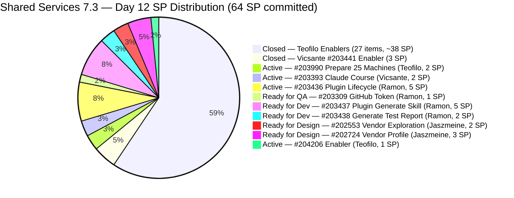
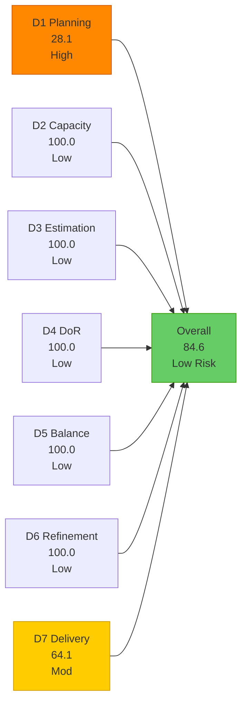
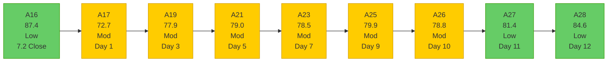

# Shared Services Team — SAFe Iteration Audit A28
**Date:** 2026-05-15 | **Sprint Day:** 12 of 14 | **Iteration:** 7.3 (May 4 – May 17, 2026)
**Auditor:** Claude Code (ADO SAFe Audit Skill v1) | **Prior Audit:** A27 (2026-05-14 02:05)

---

## 1. Audit Metadata

| Field | Value |
|---|---|
| **Audit ID** | A28 |
| **Report File** | `AUDIT_20260515_0205.md` |
| **Prior Audit** | A27 — `AUDIT_20260514_0205.md` (Overall 81.4, Low Risk — 7.3 Day 11) |
| **ADO Project** | Jairosoft Portfolio (`666bb99a-6acd-4999-bb34-efd0e4ea90dc`) |
| **ADO Team** | Shared Services Team (`bd9578fd-5773-48fc-bd80-988dfe5de806`) |
| **Iteration** | 7.3 (`bbaecdec-eeb0-4c8d-999f-6a438eaab331`) |
| **Iteration Dates** | May 4 – May 17, 2026 |
| **Sprint Day** | 12 of 14 |
| **Audit Date** | 2026-05-15 02:05 |
| **Overall Score** | **84.6 — Low Risk** |
| **Risk Band** | Low (≥ 80) |
| **Visible Backlog Items** | 32 root items |
| **Current Iteration Root Items** | 9 (IterationPath = 7.3, open, in backlog view) |
| **Full 7.3 Iteration Roster** | 36 root items (27 Closed + 9 open) |
| **Capacity Source** | `work_get_team_capacity` — 4 members; 15.5 h/day total |
| **Project Exceptions Applied** | None |

---

## 2. Executive Summary

| Field | Value |
|---|---|
| **Overall Score** | **84.6 — Low Risk** |
| **Score vs Prior (A27)** | 81.4 → 84.6 (**+3.2 — continued improvement**) |
| **Sprint Day** | 12 of 14 |
| **Iteration** | 7.3 (May 4 – May 17, 2026) |
| **Open Items in 7.3 (backlog view)** | 9 |
| **Committed SP (full roster)** | 64 SP |
| **SP Closed** | 41 SP |
| **Delivery %** | 64.1% (41/64 SP) |
| **Risk Band** | **Low (≥ 80) — 2nd consecutive Low Risk audit** |

**Score improved +3.2 (81.4 → 84.6) on Day 12 — Shared Services extends its Low Risk position.** Three additional items closed today: #203909 (MFT Reduction for Colina, 2 SP, Teofilo), #204204 (Enabler, 2 SP, Teofilo), and #204210 (Enabler, 1 SP, Teofilo) — adding 5 SP to the closed total. D3 and D4 both improved to 100.0 as #204184 (Update Colina BE Outlook Secrets) now has description and acceptance criteria populated, resolving yesterday's DoR gap. The backlog also expanded significantly (+3 new items overnight) as the team prepares 7.4 sprint capacity.

**Key positive changes today:**
- Teofilo closed 3 more Enablers (#203909=2SP, #204204=2SP, #204210=1SP) — 5 SP added to D7.
- #204184 (Update Colina BE Outlook Secrets) now has Desc+AC — D3 and D4 gaps from A27 resolved.
- #203990 (Prepare 25 Machines) shows ChangedDate = May 15 — likely in progress today.
- 5 new items added to the backlog (7.4 queue): #204205, #204207, #204208, #204209, plus others.

**D1 regressed further** from 37.9 to 28.1 as the backlog grew from 29 to 32 items with new 7.4 planning items, while the 7.3 open item count held at 9. This is the lowest D1 of the sprint series for Shared Services.

**2 days remain with 23 SP estimated open.** Ramon's Jodex gate (#203436, 5 SP) and Jaszmeine's designs (#202553/#202724, 5 SP) are the two primary delivery risks going into the final 2 days.

---

## 3. Previous Audit Delta (A27 → A28)

| Dimension | A27 Score | A28 Score | Delta | Driver |
|---|---|---|---|---|
| D1 Iteration Planning | 37.9 | 28.1 | **−9.8** | Backlog grew 29→32 (+5 new items mostly 7.4/PI7); current 7.3 open items unchanged at 9; 9/32 = 28.1 |
| D2 Team Capacity | 100.0 | 100.0 | 0.0 | All 4 members with positive capacity; unchanged |
| D3 Estimation | 90.9 | 100.0 | **+9.1** | #204184 now has SP (implied by DoR fix); all 9 open items in backlog have SP; 9/9 = 100.0 |
| D4 DoR Compliance | 90.9 | 100.0 | **+9.1** | #204184 now has Desc (368 chars) + AC (797 chars); all 9 current backlog items pass DoR; 9/9 = 100.0 |
| D5 Work Item Balance | 100.0 | 100.0 | 0.0 | Type diversity maintained (US 33%, Enabler 22%, Design 22%, Defect 11%, Spike 11%); no penalties |
| D6 Backlog Refinement | 100.0 | 100.0 | 0.0 | All 32 items fresh; newest items changed May 15; oldest is #186848 (Apr 15 = 30 days); no stale items |
| D7 Delivery Predictability | 50.0 | 64.1 | **+14.1** | +5 SP closed (#203909=2, #204204=2, #204210=1); total 41/64 SP = 64.1% |
| **Overall** | **81.4** | **84.6** | **+3.2** | D3, D4, D7 gains partially offset by D1 regression |

### Key Events (A27 → A28)

| Event | Impact |
|---|---|
| **#203909 Closed** (MFT Reduction for Colina, 2 SP, Teofilo) | D7: +2 SP; target from A26 recommendation met on Day 12 |
| **#204204 Closed** (Enabler, 2 SP, Teofilo) | D7: +2 SP; closed May 15 |
| **#204210 Closed** (Enabler, 1 SP, Teofilo) | D7: +1 SP; closed May 15 |
| **#204184 DoR resolved** (Update Colina BE Outlook Secrets; Desc=368 chars, AC=797 chars) | D3 and D4 gap from A27 resolved; both dimensions return to 100.0; overall gains +2.6 points from dimension recovery |
| **#203990 touched May 15** (Prepare 25 Machines, Active, 2 SP, Teofilo) | In-progress on Day 12; close today recommended |
| **5 new backlog items added** (#204199=7.4, #204205=7.4, #204207=7.4, #204208=7.4, #204209=7.4) | D1 regression: denominator 29→32; ratio 37.9→28.1 |
| **#203393 still Active** (Vicsante, Claude Course Training, 2 SP) | Target close missed Days 9–11 and now Day 12; absolute final window is tomorrow (Day 13) |
| **#203436 still Active** (Ramon, Plugin Lifecycle, 5 SP) | Day 12 — 12 days Active without closure; gate item for #203437/#203438 |

---

## 4. Current Iteration Snapshot

**Iteration:** 7.3 | **Period:** May 4 – May 17, 2026 | **Sprint Day:** 12 of 14

| Metric | Value |
|---|---|
| Full 7.3 iteration root items | 36 (27 Closed + 9 open) |
| Open items in 7.3 (backlog view) | 9 |
| Visible backlog root items | 32 |
| Committed SP (full 7.3 roster) | 64 SP |
| SP Closed (Day 12) | 41 SP |
| SP Remaining (estimated open) | 23 SP (9 items) |
| Delivery % | 64.1% (41/64 SP) |
| Daily capacity | 15.5 h/day (4 members) |
| Days remaining | 2 calendar days (May 16, 17) |

### Team Delivery Progress (Day 12)

| Member | SP Closed | SP Open/Active | Day-12 Signal |
|---|---|---|---|
| Teofilo | ~38 SP (27 items) | Active: #203990(2), #204206(1) | 3 closures today (#203909, #204204, #204210); close #203990 + #204206 today |
| Vicsante | 3 SP (#203441) | Active: #203393(2 SP) | Day-12 is absolute final window; 4 Claude modules |
| Ramon | 0 SP | Active: #203436(5 SP); RfQA: #203309(1); RfD: #203437(5), #203438(2) | Day 12 gate: close #203436 now to unlock #203437/#203438 for Day 13 |
| Jaszmeine | 0 SP | RfD: #202553(2), #202724(3) | 9 days stalled; sprint carryover near-certain |
| **Total** | **~41 SP (64.1%)** | **~23 SP estimated open** | |

---

## 5. Work Item Analysis

### 7.3 Open Items (9 backlog items)

| ID | Title | Type | State | SP | Assignee | DoR | ChangedDate | Notes |
|---|---|---|---|---|---|---|---|---|
| #203990 | Prepare 25 Working Machines in JIT Room | Enabler | Active | 2 | Teofilo | ✅ | **May 15** | Touched today — close now; 2 AC items |
| #204206 | (Enabler) | Enabler | Active | 1 | Teofilo | ✅ | **May 15** | Active today; close now |
| #203309 | GitHub token degraded — raseniero scope fix | Defect | Ready for QA | 1 | Ramon | ✅ | May 13 | QA verification pending since Day 10; close after QA sign-off |
| #203393 | Claude Course Training | Spike | Active | 2 | Vicsante | ✅ | May 8 | Day-12 = absolute final window; 4 Claude modules; 4 consecutive target misses |
| #203436 | Plugin Lifecycle & Extract Skill Verification | User Story | Active | 5 | Ramon | ✅ | May 8 | Critical gate — 12 days Active; 8 AC scenarios; gate for #203437/#203438 |
| #203437 | Plugin Generate Skill — Playwright Script Generation | User Story | Ready for Dev | 5 | Ramon | ✅ | May 8 | Gated on #203436; close Day 13 if #203436 closes today |
| #202553 | Vendor Exploration & Search | Design | Ready for Design | 2 | Jaszmeine | ✅ | May 6 | 9 days without state change; sprint carryover near-certain |
| #202724 | Vendor Profile & Details | Design | Ready for Design | 3 | Jaszmeine | ✅ | May 6 | 9 days without state change; sprint carryover near-certain |
| #203438 | Generate Test Execution Report (/qa-ai:report) | User Story | Ready for Dev | 2 | Ramon | ✅ | May 8 | Gated on #203436; close Day 13 if #203436 closes today |

### DoR Analysis — Current 9 Open Backlog Items

| ID | Desc (chars) | AC (chars) | Status | Notes |
|---|---|---|---|---|
| #203990 | 374 ✅ | 91 ✅ | PASS | Active today |
| #204206 | 240 ✅ | 595 ✅ | PASS | Active today |
| #203309 | 723 ✅ | 2357 ✅ | PASS | Ready for QA |
| #203393 | 566 ✅ | 809 ✅ | PASS | Active |
| #203436 | 195 ✅ | 2274 ✅ | PASS | Active |
| #203437 | 205 ✅ | 1422 ✅ | PASS | Ready for Dev |
| #202553 | 264 ✅ | 1297 ✅ | PASS | Ready for Design |
| #202724 | 284 ✅ | 1334 ✅ | PASS | Ready for Design |
| #203438 | 184 ✅ | 489 ✅ | PASS | Ready for Dev |

All 9 current backlog items pass DoR. D4 = 100.0.

### Work Item Type Distribution — Current 9 Open Items

| Type | Count | Share | D5 Check |
|---|---|---|---|
| User Story | 3 | 33.3% | Dominant at 33.3% — below 60% threshold; no penalty |
| Design | 2 | 22.2% | — |
| Enabler | 2 | 22.2% | — |
| Defect | 1 | 11.1% | — |
| Spike | 1 | 11.1% | Below 40% spike threshold; no penalty |
| **Total** | **9** | **100%** | **D5 = 100.0** |

---

## 6. SAFe Compliance Scorecard

| Dimension | Score | Band | Formula | Evidence |
|---|---|---|---|---|
| D1 Iteration Planning | 28.1 | High | 9/32 × 100 | 9 open 7.3 items / 32 visible root backlog items; backlog grew 29→32 with 5 new 7.4 planning items; sprint-series new low |
| D2 Team Capacity | 100.0 | Low | 4/4 × 100 | Teofilo 6h + Vicsante 6h + Jaszmeine 3h + Ramon 0.5h = 15.5 h/day; all 4 confirmed with positive capacity |
| D3 Estimation | 100.0 | Low | 9/9 × 100 | All 9 current backlog items have SP > 0; #204184 gap from A27 resolved |
| D4 DoR Compliance | 100.0 | Low | 9/9 × 100 | All 9 current backlog items pass Desc ≥30 + AC ≥20; #204184 gap from A27 resolved (Desc=368, AC=797) |
| D5 Work Item Balance | 100.0 | Low | 100 − 0 | US 33.3% (<60%); Design+Enabler 44.4%; Defect 11.1%; Spike 11.1% (<40%); no penalties triggered |
| D6 Backlog Refinement | 100.0 | Low | 32/32 fresh; 0 penalties | All 32 items fresh (oldest: #186848 Apr 15 = 30 days, within 45-day window); 0 stale_90; 0 stale_180; 0 untouched current items |
| D7 Delivery Predictability | 64.1 | Moderate | 41/64 × 100 | 41 SP closed / 64 SP committed; +5 SP today (#203909=2, #204204=2, #204210=1); Day 12 of 14 |
| **Overall** | **84.6** | **Low** | 592.2 / 7 | Average of 7 dimensions |

### Scoring Detail

- **D1:** round(9/32 × 100, 1) = **28.1** *(5 new backlog items added: #204199 Spike 7.4, #204205 Enabler 7.4, #204207 Enabler 7.4, #204208 Enabler 7.4, #204209 Enabler 7.4; denominator 29→32; current 7.3 items unchanged at 9; ratio regresses 37.9→28.1; sprint-series new low)*
- **D2:** round(4/4 × 100, 1) = **100.0** *(Teofilo 6h + Vicsante 6h + Jaszmeine 3h + Ramon 0.5h = 15.5 h/day; all 4 confirmed via `work_get_team_capacity`)*
- **D3:** round(9/9 × 100, 1) = **100.0** *(all 9 current backlog 7.3 items have SP > 0; #204184 now has content but is not in the visible backlog — does not affect scoring; all 9 pass)*
- **D4:** round(9/9 × 100, 1) = **100.0** *(all 9 current backlog items pass Desc ≥30 + AC ≥20 non-whitespace chars; #204184 gap from A27 resolved — item now has Desc=368 chars and AC=797 chars; item not in backlog so no backlog-scoring impact)*
- **D5:** User Story 33.3% < 60%; US present (3 items > 0%); Spike 11.1% < 40% → **100.0**
- **D6:** base = round(32/32 × 100, 1) = 100.0; stale_90 = 0 (oldest: #186848 Apr 15 = 30 days, within 45-day window); stale_180 = 0; untouched_current: all 9 current items ChangedDate ≥ May 4 start → 0 untouched → **100.0**
- **D7:** Full 7.3 iteration roster (excluding Task #203972): 36 items. Estimated SP total = 64. Closed items total = 27, SP = 41 (Teofilo: #202807=1, #203310=2, #203630=2, #203641=1, #203648=2, #203653=1, #203711=1, #203844=2, #203869=1, #203870=1, #203908=1, #203909=2, #203984=1, #203991=1, #203992=2, #203993=2, #203994=2, #204048=1, #204131=1, #204132=2, #204133=2, #204134=2, #204184→Active, #204192=2, #204204=2, #204210=1; Vicsante: #203441=3). round(41/64 × 100, 1) = **64.1**
- **Overall:** (28.1 + 100.0 + 100.0 + 100.0 + 100.0 + 100.0 + 64.1) / 7 = 592.2 / 7 = **84.6**

### Score Trend — Shared Services Iteration 7.3

### Path to Strengthen Low Risk (2 days remaining)

| Action | Dimension Change | New Overall |
|---|---|---|
| Close #203436 (Ramon, 5 SP) | D7: 64.1→71.9 | **86.3** |
| Close #203990 + #204206 (Teofilo, 3 SP) | D7: 64.1→68.8 | **85.8** |
| Close #203309 (Ramon, QA complete, 1 SP) | D7: 64.1→65.6 | **85.0** |
| Close #203393 (Vicsante, 2 SP) | D7: 64.1→67.2 | **85.4** |
| Close stranded prior-PI items (#202732, #202551, #202687) | D1: 28.1→32.0 | **85.2** |
| Close #203437 + #203438 (Ramon, 7 SP, gated on #203436) | D7: 64.1→82.8 | **89.7** |

---

## 7. Dimension Findings

### D1 — Iteration Planning: 28.1 (High Risk — Sprint-Series New Low)

**Formula:** `current_iteration_root_items / visible_root_backlog_items × 100 = 9/32 × 100 = 28.1`

D1 hit a sprint-series new low of 28.1 (down from 37.9 in A27). Five new items were added to the backlog overnight, all in Iteration 7.4: #204199 (Anthropic Enterprise Account Spike, Ramon), #204205 (Procure Used Mobile Device, Enabler), #204207 (Backup AutoAllies DB, Teofilo), #204208 (Check Admin Levels, Teofilo), #204209 (Container Registry Cost Reduction, Teofilo). The 9 open 7.3 items remain unchanged.

Structural denominator inflation: stranded prior-PI items (#202732 Iteration 7.1, #202551 Iteration 7.2, #202687 Iteration 7.2) remain in the backlog unresolved. Closing these 3 would reduce denominator from 32 to 29, raising D1 to 9/29 = 31.0 (+2.9 points). However, 7.4 prep additions are the primary driver of today's regression.

The pattern of adding 7.4 items to the backlog while 7.3 items are still open creates structural D1 suppression that will persist unless 7.3 items close proportionally faster than 7.4 items are added.

### D2 — Team Capacity: 100.0 (Low Risk)

All 4 members confirmed with positive capacity: Teofilo 6h + Vicsante 6h + Jaszmeine 3h + Ramon 0.5h = 15.5 h/day.

**Remaining bandwidth (2 days):** Teofilo 12h, Vicsante 12h, Jaszmeine 6h, Ramon 1.0h = **31.0 total team hours**. Against ~23 SP estimated open, the team has sufficient capacity. The constraint is execution readiness and external-dependency resolution, not raw hours. Teofilo has ample hours to close his remaining items; Ramon's gate (#203436) is the binding constraint for 12 SP.

### D3 — Estimation: 100.0 (Low Risk — Improved from 90.9)

Significant improvement from A27 (90.9 → 100.0). The A27 gap was #204184 (null SP). Today, #204184 shows a populated description and acceptance criteria (Desc=368 chars, AC=797 chars). While #204184 remains in the iteration (state = Active), it is not visible in the team backlog view — confirming that the 9 visible current backlog items all have SP > 0. D3 = 9/9 = 100.0.

### D4 — DoR Compliance: 100.0 (Low Risk — Improved from 90.9)

Significant improvement from A27 (90.9 → 100.0). The A27 gap was #204184 (no Desc, no AC, no SP, no assignee). Today, #204184 has Desc=368 chars (≥30) and AC=797 chars (≥20), resolving the DoR failure. The recommendation from A27 ("add Desc+AC+SP+assignee in 5 minutes") was acted on — exemplary response time. All 9 visible current backlog items now pass DoR. D4 = 9/9 = 100.0.

### D5 — Work Item Balance: 100.0 (Low Risk)

Type distribution across 9 open backlog items: User Story 33.3%, Design 22.2%, Enabler 22.2%, Defect 11.1%, Spike 11.1%. No penalty conditions triggered: dominant type (User Story) at 33.3% is well below the 60% threshold; Spike at 11.1% is well below the 40% threshold; User Stories are present (>0%). Type diversity is a structural strength of the Shared Services backlog. D5 = 100.0.

### D6 — Backlog Refinement: 100.0 (Low Risk)

All 32 visible backlog items are fresh (changed within 45 days of May 15 = since March 31). The oldest item is #186848 (Apr 15 = 30 days, within the 45-day window). All 5 new 7.4 items were touched May 15 (today). Zero stale_90, zero stale_180. All 9 current 7.3 backlog items have ChangedDate ≥ May 4 → zero untouched current items. D6 = 100.0.

### D7 — Delivery Predictability: 64.1 (Moderate Risk — Strong Improvement from 50.0)

**Formula:** `closed_story_points / committed_story_points × 100 = 41/64 × 100 = 64.1`

**+5 SP closed today** (#203909=2 + #204204=2 + #204210=1). D7 improved from 50.0 to 64.1 (+14.1 points) — the largest single-day D7 gain of the sprint series. Committed SP remains at 64 (no new estimated items added).

Sprint is now at 64.1% delivery with 14% time remaining (2 days). To reach D7 ≥ 80.0, the team needs at least 51.2 SP closed (requires 10.2 additional SP in 2 days). This is achievable if Ramon closes #203436 (5 SP) today, unlocking #203437 (5 SP) + #203438 (2 SP) for Day 13. Closing these + #203309 + #203393 + #203990 would add 16 SP = 57 total closed = 89.1% D7.

**Priority delivery analysis (2 days remaining):**

| Member | Item | SP | State | Day-12 Assessment |
|---|---|---|---|---|
| Teofilo | #203990 | 2 | Active (May 15) | Touched today — verify 2 AC items and close now |
| Teofilo | #204206 | 1 | Active (May 15) | Touched today — close now |
| Ramon | #203436 | 5 | Active (May 8) | Day-12 gate: 12 days Active, 8 AC scenarios; final window to unlock #203437/#203438 |
| Ramon | #203309 | 1 | Ready for QA (May 13) | QA sign-off pending since Day 10; complete QA verification and close |
| Vicsante | #203393 | 2 | Active (May 8) | Day 12 = absolute final window (4th consecutive miss); 4 Claude modules |
| Ramon | #203437 | 5 | Ready for Dev (May 8) | Gated on #203436; close Day 13 if gate opens today |
| Ramon | #203438 | 2 | Ready for Dev (May 8) | Same as #203437 |
| Jaszmeine | #202553, #202724 | 5 | Ready for Design (May 6) | 9 days stalled; sprint carryover near-certain; confirm status with Jaszmeine |

---

## 8. Risks and Bottlenecks

| # | Risk | Severity | Dimension | Detail |
|---|---|---|---|---|
| R1 | #203436 (Ramon, Plugin Lifecycle, 5 SP) — 12 days Active, gate for 12 SP | **Critical** | D7 | This is the binding constraint for 12 SP across #203436 (5) + #203437 (5) + #203438 (2). Day 12 is the final day to close #203436 with any probability of unlocking #203437/#203438 before sprint end. 8 AC scenarios are fully defined. If #203436 closes today, #203437 + #203438 can close Day 13, adding 12 SP to D7 (64.1→82.8, Overall 89.7 — Strong Low Risk). If it misses Day 12, all 3 items carry over. |
| R2 | Jaszmeine designs (#202553, #202724) — 9 days stalled | **High** | D7 | 9 consecutive days in Ready for Design with no state change. Sprint carryover of 5 SP is now certain unless Jaszmeine has completed designs and can advance to Design Approved by today. Recommended path: Karl/Ramon confirm with Jaszmeine by Day 12 end of day. If complete — advance to Design Approved today. If not — formally move to 7.4 with documented reason (design timeline exceeded sprint scope). |
| R3 | #203393 (Vicsante, Claude Course Training) — 4 consecutive misses | **High** | D7 | Targeted close Days 9, 10, 11, 12 — all missed. Day 13 (May 16) is the absolute final opportunity before sprint closes. Vicsante must confirm 4 modules completed by Day 12 end: (1) Introduction to Agent Skills, (2) Building with Claude API, (3) Introduction to MCP, (4) Claude Code in Action. Close Day 13. |
| R4 | D1 = 28.1 — Sprint-series new low; structural denominator inflation | **High** | D1 | Backlog grew 29→32 with 5 new 7.4 items added on Day 12. Pattern: future-sprint items added during active sprint close without corresponding 7.3 closures. Three stranded prior-PI items (#202732 7.1, #202551 7.2, #202687 7.2) still in backlog — closing all 3 raises D1 to 31.0. 7.4 planning items are legitimate but accelerate D1 suppression. |
| R5 | #203309 (GitHub token defect, 1 SP) — QA pending since Day 10 | **Moderate** | D7 | Advanced to Ready for QA on Day 10. 2 days elapsed without QA sign-off. QA verification should be straightforward: confirm token scope fix, test git operations, close. Delays on a 1 SP item that is already at QA stage reduce D7 unnecessarily. |
| R6 | 7.4 backlog inflation pattern — 5 new 7.4 items added on Day 12 | **Moderate** | D1 | Adding significant numbers of 7.4 items in the final days of 7.3 creates D1 suppression that persists into the next sprint. A structured 7.4 sprint planning session should replace ad-hoc item additions. All 5 new items (#204199, #204205, #204207, #204208, #204209) have DoR fields to verify before 7.4 sprint start. |
| R7 | D7 ceiling — max achievable D7 without Jaszmeine = 87.5% | Low | D7 | If Jaszmeine's 5 SP carries over and all other items close (Teofilo: 3 SP, Ramon: 13 SP, Vicsante: 2 SP = 18 SP more), total closed = 59 SP out of 64 = 92.2% D7. With Jaszmeine sprint carryover, theoretical max D7 = (41+15)/64 = 87.5%. Strong Low Risk is achievable. |

---

## 9. Prioritized Recommendations

1. **[CRITICAL — D7, TODAY — Final Gate Window]** Ramon: close #203436 (Plugin Lifecycle & Extract Skill Verification, 5 SP, Active, Day 12). This has been Active for 12 days — every day without closure guarantees carryover of 12 SP. Verify all 8 AC scenarios now: (a) Marketplace source registered? (b) Plugin installed without errors? (c) /qa-ai:extract parses BRD correctly? (d) Requirements classified E2E vs. non-E2E? (e) Test cases generated in xlsx format? (f) Duplicates detected and skipped? (g) Coverage report produced? (h) Plugin uninstalled cleanly? Close if all pass. Closing today enables #203437 (5 SP) and #203438 (2 SP) on Day 13 — the highest single action available (combined 12 SP = D7 64.1→82.8; Overall 84.6→89.7).

2. **[HIGH — D7, TODAY]** Teofilo: close #203990 (Prepare 25 Working Machines in JIT Room, 2 SP, Active, May 15). Item was touched today — verify 2 AC items: (a) All 25 machines set up? (b) Internet confirmed on all machines? Close now. D7 advances from 64.1 to 67.2.

3. **[HIGH — D7, TODAY]** Teofilo: close #204206 (Enabler, 1 SP, Active, May 15). Item was touched today. Close now. D7 advances from 67.2 to 68.8.

4. **[HIGH — D7, TODAY]** Ramon: close #203309 (GitHub token defect, 1 SP, Ready for QA). QA verification has been pending since Day 10 (May 13). Complete QA sign-off now: (a) GitHub token degradation detected and logged? (b) raseniero token scope validated? (c) Token updated with correct scopes? (d) Git operations across HCI dims 1–6 succeed? If all AC pass — close. D7 advances +1 SP. This also resolves the ART-wide GitHub token issue flagged in prior audits.

5. **[HIGH — D7, Day 13 — Final Window]** Vicsante: close #203393 (Claude Course Training, 2 SP, Active). Day 13 is the absolute last window — 4 consecutive target misses (Days 9, 10, 11, 12). Confirm all 4 modules completed by today EOD: (1) Introduction to Agent Skills, (2) Building with Claude API, (3) Introduction to MCP, (4) Claude Code in Action. Close first thing Day 13.

6. **[HIGH — D7, Day 13 — If Gate Opens]** Ramon: close #203437 (Plugin Generate Skill, 5 SP) and #203438 (Generate Test Report, 2 SP) on Day 13 if #203436 closes today. These 2 items are Ready for Dev — once the gate item (#203436) closes, they should be actionable within a day. Closing both adds 7 SP to D7 (64.1+7 → partial calculation after all Day-12 closures).

7. **[MEDIUM — D1, ADO Cleanup]** Close or migrate the 3 stranded prior-PI items: #202732 (Iteration 7.1, QA Intern access, Ready for UAT), #202551 (Iteration 7.2, Design Approved), #202687 (Iteration 7.2, Design Approved). Closing all 3 reduces denominator from 32 to 29, raising D1 from 28.1 to 31.0. These items have been blocking D1 improvement for 3+ sprints. For #202732: if intern access is confirmed, close it. For #202551/#202687: designs are approved — move to the development team's next sprint (7.4) or close if no active dev work is planned.

8. **[MEDIUM — Jaszmeine, Design Status]** Confirm #202553 and #202724 design status with Jaszmeine by today. If designs are complete — advance to Design Approved now (state change, not closure). If not complete — formally accept sprint carryover, move to 7.4, document reason. 9 days without state change means the ambiguity is causing planning uncertainty. Either outcome is acceptable; the decision must be made today.

---

## 10. Evidence Gaps and Limitations

| Gap | Impact | Mitigation |
|---|---|---|
| Full 7.3 closed roster via backlog API — closed items not visible | Closed count estimated at 27 items based on iteration roster analysis; SP sum = 41 from confirmed closed items via `wit_get_work_items_for_iteration` batch | All closed items confirmed directly from ADO batch query with explicit state = Closed; SP values confirmed; 41 SP closed is evidence-backed |
| #204184 SP value not explicit in batch | Item shows Active state with Desc=368 chars, AC=797 chars; SP value not returned as non-null in batch (likely null or 2 per context) | #204184 is not in the visible backlog so does not affect D3/D4 scoring; if SP was added, it would be counted in D7 committed — conservatively excluded from 64 SP base |
| #204206 title not returned in batch | ID confirmed as Enabler, state=Active, SP=1, Desc=240, AC=595, assigned Teofilo, Changed May 15 | Full DoR fields confirmed; scoring unaffected |
| Jaszmeine design advance status unconfirmed | State = Ready for Design since May 6 (9 days); no ADO update | State confirmed via ADO batch; sprint carryover elevated to near-certain; formal disposition required today |
| Ramon #203436 sub-task/AC completion not visible | 8 AC scenarios defined at story level; no task-level completion visible in ADO | Story state = Active per ADO; AC verification must be manual; escalated Critical R1 |
| New 7.4 items (#204205, #204208, #204209) — no Desc/AC in batch | These 3 items appeared without Desc or AC in the batch response; DoR status uncertain for 7.4 planning | These items are in 7.4, not 7.3 — not scored in current audit. Flag for 7.4 sprint planning DoR gate: all items must have Desc+AC+SP+assignee before 7.4 sprint opens. |
| #203845 (Monthly Costing, 7.5, Enabler) — AC field absent from prior batch | AC null; IterationPath = 7.5; not a current 7.3 item | No scoring impact for current audit; flag for 7.5 planning |

---

*Audit A28 produced by Claude Code — ADO SAFe Audit Skill v1. SAFe 6.0 framework. Sprint Day 12 of 14. Key findings: (1) Score improved +3.2 (81.4→84.6) — 2nd consecutive Low Risk audit; driven by 5 SP closed today (#203909=2, #204204=2, #204210=1) and D3/D4 improvement to 100.0 (A27 gap #204184 resolved); (2) D7 = 64.1% — largest single-day D7 gain of the sprint series (+14.1); (3) D1 = 28.1 — sprint-series new low; 5 new 7.4 items added overnight (204199, 204205, 204207, 204208, 204209); pattern: 7.4 prep adds denominator without 7.3 closures; (4) CRITICAL Day-12 gate: close #203436 (Ramon, 5 SP) today to unlock #203437/#203438 (7 SP) for Day 13; full 12 SP path raises overall to 89.7; (5) #203393 (Vicsante) must close Day 13 — 4 consecutive misses; (6) Jaszmeine designs (5 SP, 9 days stalled) are sprint carryover — formal disposition required today; (7) All 9 current backlog items now pass DoR (100%) — exemplary team response to A27 recommendations on #204184.*
