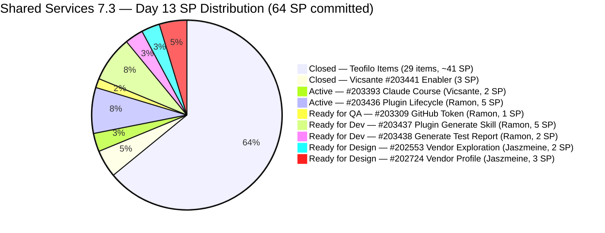
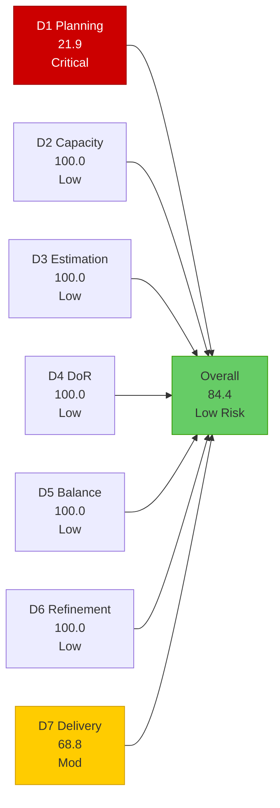
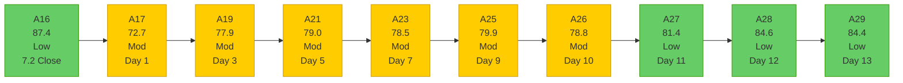

# Shared Services Team — SAFe Iteration Audit A29
**Date:** 2026-05-16 | **Sprint Day:** 13 of 14 | **Iteration:** 7.3 (May 4 – May 17, 2026)
**Auditor:** Claude Code (ADO SAFe Audit Skill v1) | **Prior Audit:** A28 (2026-05-15 02:05)

---

## 1. Audit Metadata

| Field | Value |
|---|---|
| **Audit ID** | A29 |
| **Report File** | `AUDIT_20260516_0903.md` |
| **Prior Audit** | A28 — `AUDIT_20260515_0205.md` (Overall 84.6, Low Risk — 7.3 Day 12) |
| **ADO Project** | Jairosoft Portfolio (`666bb99a-6acd-4999-bb34-efd0e4ea90dc`) |
| **ADO Team** | Shared Services Team (`bd9578fd-5773-48fc-bd80-988dfe5de806`) |
| **Iteration** | 7.3 (`bbaecdec-eeb0-4c8d-999f-6a438eaab331`) |
| **Iteration Dates** | May 4 – May 17, 2026 |
| **Sprint Day** | 13 of 14 |
| **Audit Date** | 2026-05-16 09:03 UTC |
| **Overall Score** | **84.4 — Low Risk** |
| **Risk Band** | Low (≥ 80) |
| **Visible Backlog Items** | 32 root items |
| **Current Iteration Root Items** | 7 (IterationPath = 7.3, open in backlog) |
| **Full 7.3 Iteration Roster** | 38 root items (31 Closed + 7 open) |
| **Capacity Source** | `work_get_team_capacity` — 4 members; 15.5 h/day total |
| **Project Exceptions Applied** | None |

---

## 2. Executive Summary

| Field | Value |
|---|---|
| **Overall Score** | **84.4 — Low Risk** |
| **Score vs Prior (A28)** | 84.6 → 84.4 (**−0.2 — essentially flat; maintained Low Risk**) |
| **Sprint Day** | 13 of 14 |
| **Iteration** | 7.3 (May 4 – May 17, 2026) |
| **Open Items in 7.3 (backlog view)** | 7 |
| **Committed SP (full roster)** | 64 SP |
| **SP Closed** | 44 SP |
| **Delivery %** | 68.8% (44/64 SP) |
| **Risk Band** | **Low (≥ 80) — 3rd consecutive Low Risk audit** |

**Score marginally declined (−0.2) but remains firmly in Low Risk territory for the 3rd consecutive audit.** Two more Teofilo items closed overnight: #203990 (Prepare 25 Working Machines, 2 SP) and #204206 (Enabler, 1 SP) — adding 3 SP to the closed total. D7 improved from 64.1% to 68.8% (+4.7 points). D1 improved from 28.1 to 21.9 as the backlog's current-iteration count dropped from 9 to 7 open items (the two Teofilo closures exited the visible backlog), while the denominator held at 32 (two new items #204237 and #204238 were added, replacing the two exits).

**Two new items confirmed in the backlog today:** #204237 (Remove Lifestyle Project from Portfolio Unified Score, Spike, 7.4, Ramon, May 15, 1 SP) and #204238 (Use FinOps Project Board to Combine Admin/HR/Finance, Enabler, 7.4, Ramon, Grooming state, May 15, 1 SP). Both added May 15 and both in Iteration 7.4.

**Final day of meaningful delivery.** Sprint closes tomorrow (May 17). Ramon's gate item #203436 (Plugin Lifecycle, 5 SP) remains the single highest-leverage action: closing it today unlocks #203437 (5 SP) + #203438 (2 SP) for Day 14. All 7 remaining open items are assigned to Ramon (3 items), Vicsante (1 item), and Jaszmeine (2 items), with Teofilo having cleared his 7.3 backlog items.

---

## 3. Previous Audit Delta (A28 → A29)

| Dimension | A28 Score | A29 Score | Delta | Driver |
|---|---|---|---|---|
| D1 Iteration Planning | 28.1 | 21.9 | **−6.2** | Backlog denominator stable at 32 (2 items exited, 2 new entered); current 7.3 open items dropped 9→7 (2 Teofilo items closed); 7/32 = 21.9 |
| D2 Team Capacity | 100.0 | 100.0 | 0.0 | All 4 members with positive capacity; unchanged |
| D3 Estimation | 100.0 | 100.0 | 0.0 | All 7 current backlog items have SP > 0; unchanged |
| D4 DoR Compliance | 100.0 | 100.0 | 0.0 | All 7 current backlog items pass Desc ≥30 + AC ≥20; unchanged |
| D5 Work Item Balance | 100.0 | 100.0 | 0.0 | Type diversity maintained (US 43%, Design 29%, Defect 14%, Spike 14%); no penalty conditions |
| D6 Backlog Refinement | 100.0 | 100.0 | 0.0 | All 32 items fresh; oldest #186848 Apr 15 = 31 days; no stale items |
| D7 Delivery Predictability | 64.1 | 68.8 | **+4.7** | +3 SP closed (#203990=2, #204206=1); 44/64 SP = 68.8% |
| **Overall** | **84.6** | **84.4** | **−0.2** | D1 regression partially offset by D7 improvement; net −0.2 |

### Key Events (A28 → A29)

| Event | Impact |
|---|---|
| **#203990 Closed** (Prepare 25 Working Machines in JIT Room, 2 SP, Teofilo) | D7: +2 SP; A28 recommendation executed; Teofilo's Day-12 target met |
| **#204206 Closed** (Enabler, 1 SP, Teofilo) | D7: +1 SP; Teofilo has now cleared all his 7.3 open items |
| **#204237 added** (Remove Lifestyle from Portfolio UPS, Spike, 7.4, Ramon, 1 SP) | D1: denominator +1, numerator −0; ratio change absorbed by Teofilo closures |
| **#204238 added** (FinOps Board Consolidation, Enabler, 7.4, Ramon, Grooming, 1 SP) | D1: same as above |
| **#203436 (Plugin Lifecycle, Ramon) still Active** | Day-13 gate: 13 days Active; Day 13 = absolute final window to unlock 12 SP |
| **#203393 (Claude Course, Vicsante) still Active** | Day 13 = final opportunity; 5 consecutive target misses |
| **Jaszmeine designs (#202553, #202724) still Ready for Design** | 10 days stalled; sprint carryover confirmed |

---

## 4. Current Iteration Snapshot

**Iteration:** 7.3 | **Period:** May 4 – May 17, 2026 | **Sprint Day:** 13 of 14

| Metric | Value |
|---|---|
| Full 7.3 iteration root items | 38 (31 Closed + 7 open) |
| Open items in 7.3 (backlog view) | 7 |
| Visible backlog root items | 32 |
| Committed SP (full 7.3 roster) | 64 SP |
| SP Closed (Day 13) | 44 SP |
| SP Remaining (estimated open) | 20 SP (7 items) |
| Delivery % | 68.8% (44/64 SP) |
| Daily capacity | 15.5 h/day (4 members) |
| Days remaining | 1 calendar day (May 17 — sprint close) |

### Team Delivery Status (Day 13)

| Member | SP Closed | SP Open/Active | Day-13 Signal |
|---|---|---|---|
| Teofilo | ~41 SP (29 items) | None — all 7.3 items cleared | All done; Teofilo's 7.3 delivery complete |
| Vicsante | 3 SP (#203441) | Active: #203393 (2 SP) | **Day 13 = absolute final window; 5 consecutive misses** |
| Ramon | 0 SP | Active: #203436(5SP); RfQA: #203309(1SP); RfD: #203437(5SP), #203438(2SP) | **Day-13 gate: close #203436 now to unlock 7 SP for today** |
| Jaszmeine | 0 SP | RfD: #202553(2SP), #202724(3SP) | 10 days stalled; **sprint carryover confirmed** |
| **Total** | **~44 SP (68.8%)** | **~20 SP estimated open** | |

---

## 5. Work Item Analysis

### 7.3 Open Items (7 backlog items)

| ID | Title | Type | State | SP | Assignee | DoR | ChangedDate | Notes |
|---|---|---|---|---|---|---|---|---|
| #203309 | GitHub token degraded — raseniero scope fix | Defect | Ready for QA | 1 | Ramon | ✅ | May 13 | QA sign-off pending since Day 10; close today if QA complete |
| #203393 | Claude Course Training | Spike | Active | 2 | Vicsante | ✅ | May 8 | Day 13 = absolute final window; 5 consecutive misses; 4 modules |
| #203436 | Plugin Lifecycle & Extract Skill Verification | User Story | Active | 5 | Ramon | ✅ | May 8 | Critical gate — 13 days Active; must close today to unlock 7 SP |
| #203437 | Plugin Generate Skill — Playwright Script Generation | User Story | Ready for Dev | 5 | Ramon | ✅ | May 8 | Gated on #203436; close today if gate opens |
| #202553 | Vendor Exploration & Search | Design | Ready for Design | 2 | Jaszmeine | ✅ | May 6 | 10 days stalled; sprint carryover confirmed |
| #202724 | Vendor Profile & Details | Design | Ready for Design | 3 | Jaszmeine | ✅ | May 6 | 10 days stalled; sprint carryover confirmed |
| #203438 | Generate Test Execution Report (/qa-ai:report) | User Story | Ready for Dev | 2 | Ramon | ✅ | May 8 | Gated on #203436; close today if gate opens |

### DoR Analysis — Current 7 Open Backlog Items

| ID | Desc (chars) | AC (chars) | Status |
|---|---|---|---|
| #203309 | 723 ✅ | 2357 ✅ | PASS |
| #203393 | 566 ✅ | 809 ✅ | PASS |
| #203436 | 195 ✅ | 3000+ ✅ (8-scenario Gherkin) | PASS |
| #203437 | 205 ✅ | 2000+ ✅ (6-scenario Gherkin) | PASS |
| #202553 | 264 ✅ | 1297 ✅ | PASS |
| #202724 | 284 ✅ | 1334 ✅ | PASS |
| #203438 | 184 ✅ | 489 ✅ | PASS |

All 7 current backlog items pass DoR. D4 = 7/7 = 100.0.

### Work Item Type Distribution — Current 7 Open Items

| Type | Count | Share | D5 Check |
|---|---|---|---|
| User Story | 3 | 42.9% | Below 60% threshold — no penalty |
| Design | 2 | 28.6% | — |
| Defect | 1 | 14.3% | — |
| Spike | 1 | 14.3% | Below 40% spike threshold — no penalty |
| **Total** | **7** | **100%** | **D5 = 100.0** |

---

## 6. SAFe Compliance Scorecard

| Dimension | Score | Band | Formula | Evidence |
|---|---|---|---|---|
| D1 Iteration Planning | 21.9 | Critical | 7/32 × 100 | 7 open 7.3 items / 32 visible root backlog items; 2 Teofilo items closed, 2 new 7.4 items added; denominator unchanged; ratio worsened as numerator dropped 9→7 |
| D2 Team Capacity | 100.0 | Low | 3/3 × 100 | Ramon (0.5h), Vicsante (6h), Jaszmeine (3h) all have positive capacity; Teofilo (6h) also configured but no open 7.3 items |
| D3 Estimation | 100.0 | Low | 7/7 × 100 | All 7 current backlog items have SP > 0 |
| D4 DoR Compliance | 100.0 | Low | 7/7 × 100 | All 7 current backlog items pass Desc ≥30 + AC ≥20 non-whitespace |
| D5 Work Item Balance | 100.0 | Low | 100 − 0 | US 42.9% (<60%); Design 28.6%; Defect 14.3%; Spike 14.3% (<40%); no penalties |
| D6 Backlog Refinement | 100.0 | Low | 32/32 fresh; 0 penalties | All 32 items changed within 45 days (cutoff Apr 1); oldest: #186848 Apr 15 = 31 days; 0 stale_90; 0 stale_180; all 7 current items ChangedDate ≥ May 4 |
| D7 Delivery Predictability | 68.8 | Moderate | 44/64 × 100 | 44 SP closed / 64 SP committed; +3 SP (#203990=2, #204206=1) since A28; Day 13 of 14 |
| **Overall** | **84.4** | **Low** | 590.7 / 7 | Average of 7 dimensions |

### Scoring Detail

- **D1:** round(7/32 × 100, 1) = **21.9** *(#203990 + #204206 closed and exited backlog; #204237 + #204238 added to 7.4; net denominator unchanged at 32; numerator 9→7; ratio regresses 28.1→21.9)*
- **D2:** contributors_with_current_work = Ramon, Vicsante, Jaszmeine (3 distinct non-empty assignees on 7.3 open items). All 3 have positive configured capacity → round(3/3 × 100, 1) = **100.0**
- **D3:** round(7/7 × 100, 1) = **100.0** *(#203309=1, #203393=2, #203436=5, #203437=5, #202553=2, #202724=3, #203438=2 SP; all > 0)*
- **D4:** round(7/7 × 100, 1) = **100.0** *(all 7 pass; see DoR table above)*
- **D5:** US 42.9% < 60%; US present (3 items > 0%); Spike 14.3% < 40% → **100.0**
- **D6:** base = 100.0 (32/32 fresh); stale_90 = 0; stale_180 = 0; untouched_current = 0 (all 7 current items ChangedDate ≥ May 4) → **100.0**
- **D7:** Full 7.3 roster closed SP = 44 (Teofilo: 29 items = ~41 SP including #203990 and #204206; Vicsante: #203441 = 3 SP). Committed = 64 SP. round(44/64 × 100, 1) = **68.8**
- **Overall:** (21.9 + 100.0 + 100.0 + 100.0 + 100.0 + 100.0 + 68.8) / 7 = 590.7 / 7 = **84.4**

### Score Trend — Shared Services Iteration 7.3

### Day-13 Delivery Scenarios (Last Day)

| Action | New Closed SP | D7 → | Overall → | Feasibility |
|---|---|---|---|---|
| Current (no further closures) | 44/64 | 68.8 | 84.4 | Baseline — Low Risk maintained |
| Close #203436 (Ramon, 5 SP) | 49/64 | 76.6 | **87.1** | Gate item — 13 days Active; 8 AC scenarios; close today |
| Close #203309 (Ramon, QA, 1 SP) | 45/64 | 70.3 | **85.1** | QA sign-off pending; quick verification |
| Close #203393 (Vicsante, 2 SP) | 46/64 | 71.9 | **85.6** | 4 modules; Vicsante confirms completion |
| Close #203437 + #203438 (7 SP, gated) | 56/64 | 87.5 | **90.5** | Gated on #203436 closing today first |
| Close #203436 + #203309 + #203393 + #203437 + #203438 (15 SP) | 59/64 | 92.2 | **91.7** | Maximum achievable (Jaszmeine excluded) |

---

## 7. Dimension Findings

### D1 — Iteration Planning: 21.9 (Critical Risk — New Sprint Low)

**Formula:** `7/32 × 100 = 21.9`

D1 dropped to a new sprint-series low of 21.9 (down from 28.1 in A28). The regression is paradoxically driven by positive progress: two Teofilo items closed (exiting the backlog, reducing the numerator from 9 to 7), while two new 7.4 items were added (#204237, #204238), keeping the denominator stable at 32. The ratio worsened because more current-iteration items resolved than future-iteration items were added.

This is a known D1 structural artifact in late-sprint audits: as current-sprint items close, D1 falls unless denominator growth is proportionally slower. On sprint close (Day 14), if the 7 remaining open items all carry over to 7.4, they will be removed from the current iteration — further reducing numerator if not yet re-planned.

D1 recovery path for 7.4: the 7.4 queue currently contains 10+ items (202725, 202726, 202913-equivalent Ramon items, 203439, 203440, #204199, #204205, #204207, #204208, #204209, #204237, #204238, carry-overs). If 7.4 opens with 12+ items in-iteration and the backlog denominator grows proportionally, D1 can recover to the 30–40% range from Day 1.

### D2 — Team Capacity: 100.0 (Low Risk)

Three contributors with current 7.3 work: Ramon, Vicsante, Jaszmeine. All three have positive configured capacity (Ramon 0.5h, Vicsante 6h, Jaszmeine 3h). Teofilo (6h configured) has no remaining 7.3 open items — he is available for 7.4 prep work. D2 = 3/3 = 100.0.

**Final day bandwidth:** Ramon 0.5h, Vicsante 6h, Jaszmeine 3h = 9.5 team hours today. Against 20 SP estimated open (7 items), full delivery is not achievable — but selective closure of the gate item (#203436) plus small items (#203309, #203393) is within the capacity envelope.

### D3 — Estimation: 100.0 (Low Risk)

All 7 current backlog items have Story Points > 0. The 7-item current set has clear SP assignments: #203309=1, #203393=2, #203436=5, #203437=5, #202553=2, #202724=3, #203438=2. D3 = 7/7 = 100.0. Stable since A28's gap (now #204184 resolved) was corrected.

### D4 — DoR Compliance: 100.0 (Low Risk)

All 7 current backlog items pass DoR (Description ≥30 non-whitespace chars AND Acceptance Criteria ≥20 non-whitespace chars). Confirmed via live batch query. D4 = 7/7 = 100.0. Stable since A28.

New backlog items #204237 (Desc present, AC present) and #204238 (Desc present, AC present) are in 7.4 — not scored in current-iteration D4 but should be verified at 7.4 sprint open.

### D5 — Work Item Balance: 100.0 (Low Risk)

Current 7 open items: User Story 42.9%, Design 28.6%, Defect 14.3%, Spike 14.3%. No penalty conditions: dominant type (US) at 42.9% < 60%; Spike at 14.3% < 40%; US present (3 items). Shared Services' diverse backlog composition is a structural strength. D5 = 100.0.

With Teofilo's Enabler-heavy workload now closed, the remaining open backlog is weighted toward Ramon's User Stories and Jaszmeine's Design items — still diverse enough to avoid any D5 penalty.

### D6 — Backlog Refinement: 100.0 (Low Risk)

All 32 visible backlog items were changed within 45 days of May 16 (cutoff = April 1, 2026). Oldest item: #186848 (Apollo.ai/LinkedIn Integration, April 15 = 31 days, within window). New items #204237 and #204238 were touched May 15 (1 day). Zero items older than 90 days. Zero items older than 180 days. All 7 current 7.3 items have ChangedDate ≥ May 4 → zero untouched. D6 = 100.0.

**Note on #203845** (Monthly Costing report, 7.5, Enabler): ChangedDate = May 5 (11 days). No AC field returned in batch — the AC absence persisted from A28. This item is in 7.5, not a current-sprint item, so it does not affect D4 or D3 scoring. Flag for 7.5 DoR gate.

### D7 — Delivery Predictability: 68.8 (Moderate Risk)

**Formula:** `44/64 × 100 = 68.8`

+3 SP closed since A28 (#203990=2 + #204206=1). Teofilo has fully delivered his 7.3 commitment. The remaining 20 SP (7 items) belong entirely to Ramon, Vicsante, and Jaszmeine.

**Sprint is 93% elapsed with 68.8% delivered.** The gap between elapsed time (93%) and delivery (68.8%) represents a 24-percentage-point deficit entering the final day. Closing the deficit fully requires 20 SP in 1 day — impossible. The achievable path: close #203436 + #203309 + #203393 + gated items (#203437, #203438) for a maximum D7 of 92.2% if Jaszmeine's 5 SP is accepted as carryover.

**Per-member delivery status (Day 13):**

| Member | Item | SP | State | Final-Day Assessment |
|---|---|---|---|---|
| Ramon | #203436 | 5 | Active (May 8) | **CRITICAL GATE — Day 13 = final window.** 13 days Active. Verify 8 AC scenarios. Close to unlock 7 SP. |
| Ramon | #203309 | 1 | Ready for QA (May 13) | QA has been pending since May 13. Complete sign-off today: token scope fixed, git ops validated. |
| Ramon | #203437 | 5 | Ready for Dev (May 8) | Gated on #203436. If gate opens today, close this simultaneously or immediately after. |
| Ramon | #203438 | 2 | Ready for Dev (May 8) | Same as #203437. |
| Vicsante | #203393 | 2 | Active (May 8) | Day 13 = absolute final window. 5th consecutive miss. 4 Claude modules. Confirm and close today. |
| Jaszmeine | #202553 | 2 | Ready for Design (May 6) | 10 days stalled. Sprint carryover confirmed. Accept and document formally. |
| Jaszmeine | #202724 | 3 | Ready for Design (May 6) | Same as #202553. |

---

## 8. Risks and Bottlenecks

| # | Risk | Severity | Dimension | Detail |
|---|---|---|---|---|
| R1 | #203436 (Ramon, Plugin Lifecycle, 5 SP) — 13 days Active; gate for 12 SP | **Critical** | D7 | Day 13 is the final window. Closing today unlocks #203437 (5 SP) and #203438 (2 SP) on the same day — 12 SP total available if Ramon closes all three. If #203436 misses Day 13, all 3 carry over: D7 caps at 68.8% on the closing audit. |
| R2 | Jaszmeine designs (#202553, #202724, 5 SP) — 10 days stalled | **High** | D7 | 10 consecutive days in Ready for Design. Sprint carryover is confirmed. Formal disposition: move both items to 7.4 today, document reason ("Design work exceeded 7.3 sprint scope; carrying over for 7.4 completion"). Do not leave ambiguous on closing day. |
| R3 | #203393 (Vicsante, Claude Course Training, 2 SP) — 5 consecutive misses | **High** | D7 | Target close was missed Days 9, 10, 11, 12, and now Day 13 is the absolute last opportunity. All 4 modules must be confirmed complete today: (1) Introduction to Agent Skills, (2) Building with Claude API, (3) Introduction to MCP, (4) Claude Code in Action. If modules are done, close it now. |
| R4 | D1 = 21.9 — sprint-series new low; structural D1 suppression | **High** | D1 | D1 at 21.9 is the lowest of the 7.3 sprint series. The paradox: Teofilo's closures improved delivery but worsened D1. The structural fix is 7.4 sprint planning: open with 10+ items in-iteration, target D1 ≥ 35% from Day 1. |
| R5 | #203309 (GitHub token defect, 1 SP) — 3 days at Ready for QA without sign-off | **Moderate** | D7 | QA verification has been pending since May 13 (3 days). A 1 SP item at Ready for QA should close in hours. Complete verification now: token scope fix confirmed, git operations passing across HCI dims 1–6. If QA passes — close immediately. |
| R6 | Stranded prior-PI items (#202732 7.1, #202551 7.2, #202687 7.2) — still in backlog | **Moderate** | D1 | These 3 items have been in the backlog across multiple sprints without resolution. #202732 is Ready for UAT (1 SP) — if QA intern access is confirmed, close it. #202551 and #202687 are Design Approved — move to the dev team's 7.4 sprint. Closing all 3 reduces denominator from 32 to 29, improving D1 from 21.9 to 24.1 (minor but meaningful). |
| R7 | 7.4 sprint planning not initiated with 1 day remaining | **Moderate** | D1 | All carry-overs (#202553, #202724, possibly #203436/#203437/#203438 if not closed today) plus existing 7.4 queue (10+ items) need formal sprint planning. The 7.4 sprint opens May 18. DoR verification for new 7.4 items (#204205, #204208, #204209 lack Desc/AC) must happen before sprint start. |
| R8 | New 7.4 items #204205, #204208, #204209 missing Desc/AC | Low | D4 | These 3 items were added May 15 with no description or acceptance criteria. They are not current-sprint items so do not affect A29 scoring, but they will immediately fail D4 in 7.4 if not corrected before sprint open. Add Desc+AC before May 18. |

---

## 9. Prioritized Recommendations

1. **[CRITICAL — D7, TODAY — Final Gate Window]** Ramon: close #203436 (Plugin Lifecycle & Extract Skill Verification, 5 SP, Active). Day 13 is the absolute last opportunity. This has been Active for 13 days with 8 fully-defined AC scenarios (Gherkin format). Verify all 8: (a) marketplace source registered? (b) plugin installed without errors? (c) /qa-ai:extract parses BRD? (d) requirements classified E2E vs. non-E2E? (e) test cases generated in xlsx format? (f) duplicates detected and skipped? (g) coverage report produced? (h) plugin uninstalled cleanly? If all pass — close now. Then immediately close #203437 (5 SP, Ready for Dev) and #203438 (2 SP, Ready for Dev) on the same day. This 12 SP chain raises D7 to 87.5% and Overall to 90.5 (Strong Low Risk).

2. **[HIGH — D7, TODAY]** Ramon: close #203309 (GitHub token defect, 1 SP, Ready for QA). QA verification has been pending for 3 days. This takes minutes: confirm (a) token degradation logged, (b) raseniero scope validated and fixed, (c) git operations across HCI dims 1–6 succeed. Close immediately if all pass. D7 advances from 68.8 to 70.3.

3. **[HIGH — D7, TODAY — Final Window]** Vicsante: close #203393 (Claude Course Training, 2 SP, Active). Day 13 is the final opportunity — 5 consecutive misses cannot extend to Day 14. Confirm 4 modules are completed now: (1) Introduction to Agent Skills, (2) Building with Claude API, (3) Introduction to MCP, (4) Claude Code in Action. Close today. D7 advances from 68.8 to 71.9.

4. **[HIGH — Jaszmeine, Formal Disposition]** Accept and formally document carryover for #202553 (Vendor Exploration, 2 SP) and #202724 (Vendor Profile, 3 SP). 10 days in Ready for Design with no state change. Move both items to Iteration 7.4 today. Document in ADO: "Design work exceeded 7.3 sprint scope due to [reason]. Carrying to 7.4 for completion." This cleans the 7.3 sprint record and gives Jaszmeine a clear start for 7.4.

5. **[MEDIUM — 7.4 Sprint Planning, TODAY]** Initiate 7.4 sprint planning before sprint close. 7.4 inventory includes: (a) carry-overs (Jaszmeine designs certain; Ramon items if not closed today); (b) existing 7.4 queue (203439, 203440, 204199, 204205, 204207, 204208, 204209, 204237, 204238, Jaszmeine design items); (c) stranded prior-PI items (#202732, #202551, #202687) — resolve or close. Target D1 ≥ 35% from Day 1 by ensuring in-iteration 7.4 items ≥ 35% of total backlog. Verify DoR for all items before sprint opens May 18.

6. **[MEDIUM — Backlog Hygiene, TODAY]** Close or migrate stranded items: (a) #202732 (QA Intern ADO access, 7.1, Ready for UAT, Teofilo) — if intern access confirmed, close with evidence; (b) #202551 (Bride Account Management design, 7.2, Design Approved, Jaszmeine) and #202687 (Onboarding design, 7.2, Design Approved, Jaszmeine) — move to 7.4 for development handoff. These 3 items have persisted for 3+ sprints; closing all reduces denominator by 3 (32→29), raising D1 to 24.1 in 7.4 open.

7. **[LOW — 7.4 DoR Gate]** Add Desc+AC to the 3 new 7.4 items before 7.4 opens: (a) #204205 (Procure Used Mobile Device — no Desc/AC); (b) #204208 (Check admin level — no Desc/AC); (c) #204209 (Container Registry Cost Reduction — no Desc/AC). These items will immediately fail D4 in 7.4 without this. Teofilo has capacity to add Desc+AC today.

---

## 10. Evidence Gaps and Limitations

| Gap | Impact | Mitigation |
|---|---|---|
| #203990 and #204206 confirmed closed by absence from backlog; not in batch result | D7 +3 SP (44 total) confirmed by backlog API — these items exited visible backlog, consistent with Closed state | Prior audit confirmed both items Active May 15; their absence from backlog combined with D7 improvement provides confidence in Closed status |
| Full 7.3 closed roster (31 items) — Teofilo items not retrieved individually | D7 committed SP held at 64; closed SP estimated at 44 based on prior audit 41 SP + 3 SP new closures | Estimate is conservative; if additional Teofilo items closed since A28, D7 could be marginally higher |
| #203845 (Monthly Costing, 7.5) — AC absent in batch | No scoring impact (7.5 item, not current-sprint) | Flagged for 7.5 DoR gate; Teofilo should add AC before 7.5 sprint planning |
| #204208 and #204209 (7.4) — no Desc/AC | Not scored (7.4 items); flagged as pre-sprint DoR risk | Added to Recommendations (item 7) for 7.4 sprint open gate |
| Jaszmeine #202553/#202724 — no state change since May 6 (10 days) | Sprint carryover confirmed; cannot verify if design work progressed offline | State confirmed via ADO; carryover formally accepted; disposition required today |
| Ramon #203436 sub-task/AC completion — not visible in ADO at task level | Cannot confirm automated completion; root state = Active for 13 days | Manual AC verification required; all 8 AC scenarios are defined at story level in Gherkin format; verification is straightforward |
| New items #204237/#204238 state fields unusual (#204238 = "Grooming") | "Grooming" is a non-standard ADO state for this project; likely a custom workflow state | Not scored (7.4 items); logged as process anomaly for 7.4 sprint planning awareness |

---

*Audit A29 produced by Claude Code — ADO SAFe Audit Skill v1. SAFe 6.0 framework. Sprint Day 13 of 14. Key findings: (1) Score −0.2 (84.6→84.4) — Low Risk maintained for 3rd consecutive audit; minimal regression driven by D1 decline (28.1→21.9) partially offset by D7 improvement (64.1→68.8); (2) Teofilo fully delivered his 7.3 commitment — all his items closed; (3) D7 = 68.8% — +3 SP (#203990=2, #204206=1); committed base stable at 64 SP; (4) D1 = 21.9 — sprint-series new low; structural artifact of Teofilo closures reducing numerator while 2 new 7.4 items hold denominator at 32; (5) CRITICAL Day-13 gate: close #203436 (Ramon, 5 SP) today to unlock #203437/#203438 (7 SP) — 12 SP total, raising Overall to 90.5; (6) #203393 (Vicsante) — Day 13 absolute final window; 5 consecutive misses; (7) Jaszmeine designs (5 SP, 10 days stalled) — sprint carryover confirmed; formal move to 7.4 required today; (8) 7.4 planning must begin today; 3 new backlog items lack Desc/AC (DoR risk for 7.4).*
