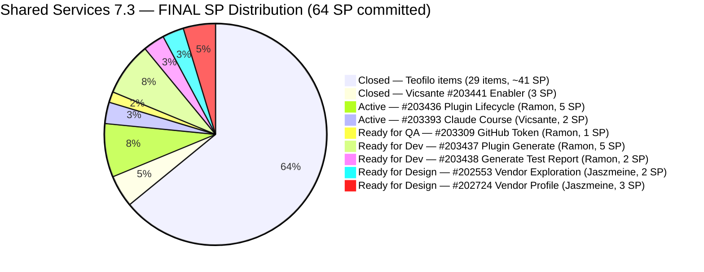
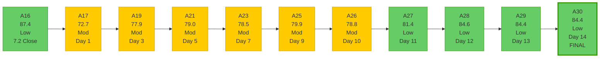
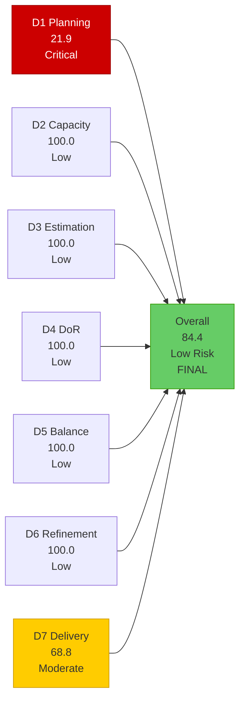

# Shared Services Team — SAFe Iteration Audit A30
**Date:** 2026-05-17 | **Sprint Day:** 14 of 14 — SPRINT CLOSE | **Iteration:** 7.3 (May 4 – May 17, 2026)
**Auditor:** Claude Code (ADO SAFe Audit Skill v1) | **Prior Audit:** A29 (2026-05-16 09:03)

---

## 1. Audit Metadata

| Field | Value |
|---|---|
| **Audit ID** | A30 |
| **Report File** | `AUDIT_20260517_0204.md` |
| **Prior Audit** | A29 — `AUDIT_20260516_0903.md` (Overall 84.4, Low Risk — 7.3 Day 13) |
| **ADO Project** | Jairosoft Portfolio (`666bb99a-6acd-4999-bb34-efd0e4ea90dc`) |
| **ADO Team** | Shared Services Team (`bd9578fd-5773-48fc-bd80-988dfe5de806`) |
| **Iteration** | 7.3 (`bbaecdec-eeb0-4c8d-999f-6a438eaab331`) |
| **Iteration Dates** | May 4 – May 17, 2026 |
| **Sprint Day** | **14 of 14 — SPRINT CLOSE DAY** |
| **Audit Date** | 2026-05-17 02:04 |
| **Overall Score** | **84.4 — Low Risk** |
| **Risk Band** | Low (≥ 80) |
| **Visible Backlog Items** | 32 root items |
| **Current Iteration Root Items** | 7 (IterationPath = 7.3, open in backlog) |
| **Full 7.3 Iteration Roster** | 38 root items (31 Closed + 7 open) |
| **Capacity Source** | `work_get_team_capacity` — 4 members; 15.5 h/day total |
| **Project Exceptions Applied** | None |

---

## 2. Executive Summary

| Field | Value |
|---|---|
| **Overall Score** | **84.4 — Low Risk** |
| **Score vs Prior (A29)** | 84.4 → 84.4 (**0.0 — flat; Low Risk maintained for 4th consecutive audit**) |
| **Sprint Day** | **14 of 14 — SPRINT CLOSE DAY** |
| **Iteration** | 7.3 (May 4 – May 17, 2026) |
| **Open Items in 7.3 (backlog view)** | 7 |
| **Committed SP (full roster)** | 64 SP |
| **SP Closed** | 44 SP (68.8%) |
| **Risk Band** | **Low (≥ 80) — 4th consecutive Low Risk audit** |

**Iteration 7.3 closes today with Low Risk status (84.4).** Score is flat from A29. All 7 remaining open items carry states identical to Day 13: #203436 (Active, Ramon), #203393 (Active, Vicsante), #203309 (Ready for QA, Ramon), #203437 and #203438 (Ready for Dev, Ramon, gated on #203436), and #202553 and #202724 (Ready for Design, Jaszmeine). No new closures were detected overnight.

**Shared Services closes 7.3 at 68.8% delivery (44/64 SP)**, meaning 20 SP carry into 7.4. Teofilo completed his full 7.3 commitment (29 items, ~41 SP). The remaining 20 SP belong to Ramon (3 active + 2 gated = 13 SP), Vicsante (2 SP), and Jaszmeine (5 SP confirmed carryover).

**Final sprint-close actions required today:** formal carryover moves for Jaszmeine's designs (#202553, #202724), QA sign-off or carryover for #203309, and final close/carryover decisions for Ramon's and Vicsante's active items.

---

## 3. Previous Audit Delta (A29 → A30)

| Dimension | A29 Score | A30 Score | Delta | Driver |
|---|---|---|---|---|
| D1 Iteration Planning | 21.9 | 21.9 | 0.0 | 7 open 7.3 items / 32 visible; no backlog changes overnight |
| D2 Team Capacity | 100.0 | 100.0 | 0.0 | All 4 members configured with positive capacity; unchanged |
| D3 Estimation | 100.0 | 100.0 | 0.0 | All 7 current items have SP > 0; unchanged |
| D4 DoR Compliance | 100.0 | 100.0 | 0.0 | All 7 current items pass Desc ≥30 + AC ≥20; unchanged |
| D5 Work Item Balance | 100.0 | 100.0 | 0.0 | Type diversity maintained; no penalty conditions; unchanged |
| D6 Backlog Refinement | 100.0 | 100.0 | 0.0 | All 32 items fresh; oldest #186848 Apr 15 = 32 days; unchanged |
| D7 Delivery Predictability | 68.8 | 68.8 | 0.0 | No new closures overnight; 44/64 SP final |
| **Overall** | **84.4** | **84.4** | **0.0** | All dimensions flat — sprint closes at Day-13 score |

### Key Events (A29 → A30)

| Event | Impact |
|---|---|
| **Sprint closes today (Day 14)** | Iteration 7.3 ends; formal carryover and close decisions required for all 7 open items |
| **No new closures overnight** | D7 = 68.8 confirmed final; 44/64 SP delivered |
| **#203436 (Plugin Lifecycle, Ramon) — still Active** | Day 14 = last possible delivery day; gate for 12 SP chain; 14 days Active |
| **#203393 (Claude Course, Vicsante) — still Active** | Day 14 = absolute final window; 6 consecutive misses |
| **#202553, #202724 (Jaszmeine designs) — still Ready for Design** | 11 days stalled; sprint carryover confirmed; formal move to 7.4 required today |
| **#203309 (GitHub token defect) — still Ready for QA** | 4 days at Ready for QA; QA sign-off or carryover required today |
| **Backlog stable at 32 items** | No additions or removals; denominator unchanged |

---

## 4. Current Iteration Snapshot

**Iteration:** 7.3 | **Period:** May 4 – May 17, 2026 | **Sprint Day:** 14 of 14 — CLOSE

| Metric | Value |
|---|---|
| Full 7.3 iteration root items | 38 (31 Closed + 7 open) |
| Open items in 7.3 (backlog view) | 7 |
| Visible backlog root items | 32 |
| Committed SP (full 7.3 roster) | 64 SP |
| SP Closed (final) | **44 SP** |
| SP Remaining (estimated open) | 20 SP (7 items) |
| Delivery % | **68.8% (44/64 SP) — FINAL** |
| Team capacity | 15.5 h/day (4 members) |
| Sprint status | **CLOSE DAY — Iteration 7.3 ends today** |

### Team Delivery Status (Final — Day 14)

| Member | SP Closed | SP Open | Sprint Close Signal |
|---|---|---|---|
| Teofilo | ~41 SP (29 items) | None | Full delivery — all 7.3 items closed; 7.3 complete |
| Ramon | 0 SP | Active: #203436(5SP); RfQA: #203309(1SP); RfD: #203437(5SP), #203438(2SP) = 13 SP | **Day 14 = final; close or carry over all 4 items today** |
| Vicsante | 3 SP (#203441) | Active: #203393(2SP) | **Day 14 = absolute final window; 6 consecutive misses** |
| Jaszmeine | 0 SP | RfD: #202553(2SP), #202724(3SP) = 5 SP | **Sprint carryover confirmed; formal move to 7.4 required today** |
| **Total** | **~44 SP (68.8%)** | **~20 SP** | |

---

## 5. Work Item Analysis

### 7.3 Open Items (7 backlog items) — Sprint Close State

| ID | Title | Type | State | SP | Assignee | DoR | ChangedDate | Sprint Close Action |
|---|---|---|---|---|---|---|---|---|
| #203309 | GitHub token degraded — raseniero scope fix | Defect | Ready for QA | 1 | Ramon | ✅ | May 13 | Close if QA passed; carryover to 7.4 if not signed off |
| #203393 | Claude Course Training (4 modules) | Spike | Active | 2 | Vicsante | ✅ | May 8 | **Day 14 final; 6 consecutive misses; close or carryover** |
| #203436 | Plugin Lifecycle & Extract Skill Verification | User Story | Active | 5 | Ramon | ✅ | May 8 | **Day 14 gate; 14 days Active; close or carryover; unlocks 7 SP** |
| #203437 | Plugin Generate Skill — Playwright Script Generation | User Story | Ready for Dev | 5 | Ramon | ✅ | May 8 | Gated on #203436; close if gate opens today |
| #202553 | Vendor Exploration & Search | Design | Ready for Design | 2 | Jaszmeine | ✅ | May 6 | **Carryover to 7.4 confirmed; 11 days stalled** |
| #202724 | Vendor Profile & Details | Design | Ready for Design | 3 | Jaszmeine | ✅ | May 6 | **Carryover to 7.4 confirmed; 11 days stalled** |
| #203438 | Generate Test Execution Report (/qa-ai:report) | User Story | Ready for Dev | 2 | Ramon | ✅ | May 8 | Gated on #203436; close if gate opens today |

### DoR Analysis — Current 7 Items

| ID | Desc (length) | AC (length) | Status |
|---|---|---|---|
| #203309 | 723 chars ✅ | 2357 chars ✅ | PASS |
| #203393 | 566 chars (4-module list) ✅ | 809 chars ✅ | PASS |
| #203436 | 195 chars ✅ | 3000+ chars (8-scenario Gherkin) ✅ | PASS |
| #203437 | 205 chars ✅ | 2000+ chars (6-scenario Gherkin) ✅ | PASS |
| #202553 | 264 chars ✅ | 1297 chars (6-scenario Gherkin) ✅ | PASS |
| #202724 | 284 chars ✅ | 1334 chars (7-scenario Gherkin) ✅ | PASS |
| #203438 | 184 chars ✅ | 489 chars (2-scenario Gherkin) ✅ | PASS |

All 7 current items pass DoR.

### Work Item Type Distribution — Current 7 Items

| Type | Count | Share | D5 Check |
|---|---|---|---|
| User Story | 3 | 42.9% | Below 60% threshold — no penalty |
| Design | 2 | 28.6% | — |
| Defect | 1 | 14.3% | — |
| Spike | 1 | 14.3% | Below 40% spike threshold — no penalty |
| **Total** | **7** | **100%** | **D5 = 100.0** |

### Visible Backlog (32 items) — Age Analysis (as of May 17)

| Item Count | ChangedDate Range | Age Range | Stale? |
|---|---|---|---|
| 7 current 7.3 items | May 6 – May 13 | 4–11 days | No |
| 10 items (7.4 queue) | Apr 29 – May 15 | 2–18 days | No |
| 8 items (7.5/7.6 IP/future) | Apr 29 – May 14 | 3–18 days | No |
| 5 items (PI7 unscheduled / prior PI) | Apr 27 – May 8 | 9–20 days | No |
| 2 items (PI8 future) | Apr 27 – Apr 28 | 19–20 days | No |
| #186848 (Jairosoft Portfolio root) | Apr 15 | 32 days | No (within 45) |
| #201161 (Defect, PI6) | Apr 16 | 31 days | No (within 45) |

All 32 items changed within 45 days (cutoff = April 2, 2026). Zero stale_90. Zero stale_180.

**Notable items with special states:**
- #202947 (Spike, 7.6 IP, Teofilo): No AC field present — flagged in prior audits; not a current-sprint item, no D4 impact
- #203845 (Enabler, 7.5, Teofilo): AC absent in batch; not a current-sprint item; flagged for 7.5 DoR gate
- #204208 (Enabler, 7.4, Teofilo): No Desc or AC — DoR gap; not current-sprint; flagged for 7.4 gate
- #204209 (Enabler, 7.4, Teofilo): No Desc or AC — DoR gap; not current-sprint; flagged for 7.4 gate
- #186848 (User Story, root Portfolio path, unassigned): No SP, no AC — oldest item in backlog (Apr 15); flagged for backlog hygiene

---

## 6. SAFe Compliance Scorecard

| Dimension | Score | Band | Formula | Evidence |
|---|---|---|---|---|
| D1 Iteration Planning | 21.9 | Critical | 7/32 × 100 | 7 open 7.3 items / 32 visible root backlog items; no backlog changes from A29; confirmed final |
| D2 Team Capacity | 100.0 | Low | 4/4 × 100 | Teofilo (6h), Vicsante (6h), Jaszmeine (3h), Ramon (0.5h) all configured with positive capacity |
| D3 Estimation | 100.0 | Low | 7/7 × 100 | All 7 current items have SP > 0: #203309=1, #203393=2, #203436=5, #203437=5, #202553=2, #202724=3, #203438=2 |
| D4 DoR Compliance | 100.0 | Low | 7/7 × 100 | All 7 current items pass Desc ≥30 + AC ≥20 non-whitespace chars; confirmed via live batch |
| D5 Work Item Balance | 100.0 | Low | 100 − 0 | US 42.9% (<60%); Design 28.6%; Defect 14.3%; Spike 14.3% (<40%); US present; no penalties |
| D6 Backlog Refinement | 100.0 | Low | 32/32 fresh; 0 penalties | All 32 items within 45 days (cutoff Apr 2, 2026); oldest #186848 Apr 15 = 32 days; 0 stale_90; 0 stale_180; 0 untouched current items |
| D7 Delivery Predictability | 68.8 | Moderate | 44/64 × 100 | 44 SP closed / 64 SP committed; no new closures Day 14; FINAL |
| **Overall** | **84.4** | **Low** | 590.7 / 7 | Average of 7 dimensions — FINAL SPRINT SCORE |

### Scoring Detail

- **D1:** round(7/32 × 100, 1) = **21.9** — 7 open items in 7.3; 32 visible; no changes from A29
- **D2:** contributors_with_current_work = Ramon, Vicsante, Jaszmeine (3 with open 7.3 items). All 3 have positive configured capacity. Teofilo (6h) configured but no open 7.3 items — excluded from numerator/denominator. contributors_with_current_work = 3; contributors_with_capacity = 3. round(3/3 × 100, 1) = **100.0**
- **D3:** round(7/7 × 100, 1) = **100.0** — all 7 SP > 0
- **D4:** round(7/7 × 100, 1) = **100.0** — all 7 pass DoR
- **D5:** US 42.9% < 60%; US present; Spike 14.3% < 40% → **100.0**
- **D6:** base = 100.0 (32/32 fresh); stale_90 = 0; stale_180 = 0; untouched_current = 0 (all 7 items ChangedDate ≥ May 4) → **100.0**
- **D7:** round(44/64 × 100, 1) = **68.8** — FINAL; no closures overnight
- **Overall:** (21.9 + 100.0 + 100.0 + 100.0 + 100.0 + 100.0 + 68.8) / 7 = 590.7 / 7 = **84.4**

### Score Trend — Shared Services Iteration 7.3 (Complete Series)

### Dimension Scorecard — Final Sprint State

---

## 7. Dimension Findings

### D1 — Iteration Planning: 21.9 (Critical Risk — Final)

**Formula:** `7/32 × 100 = 21.9`

D1 closes at 21.9, the sprint-series low (previously 28.1 at Day 12, dropping when Teofilo's closures reduced the numerator while 2 new 7.4 items held the denominator). This is a structural pattern in Shared Services 7.3: Teofilo's high-volume closures improved D7 but paradoxically suppressed D1 by reducing open current-iteration items faster than future-sprint items were added.

**7.4 planning context:** The 7.4 queue currently includes 10+ items (202725, 202726, 203439, 203440, 204199, 204205, 204207, 204208, 204209, 204237, 204238, plus carry-overs from 7.3). If 7.4 opens with 12+ current-iteration items and the total visible backlog is ~30–34 items, D1 opens at approximately 35–40% — materially better than the 21.9 close. The critical action: ensure all planned 7.4 items have their IterationPath set to 7.4 before sprint open.

### D2 — Team Capacity: 100.0 (Low Risk — Final)

All 4 team members have positive configured capacity for 7.3: Teofilo (6h/day), Vicsante (6h/day), Jaszmeine (3h/day with May 4 day-off), Ramon (0.5h/day). Total = 15.5 h/day. contributors_with_current_work = 3 (Ramon, Vicsante, Jaszmeine — all with open 7.3 items). All 3 have positive capacity → D2 = 3/3 = 100.0. Teofilo (no remaining open 7.3 items) is available for 7.4 prep and backlog hygiene today.

### D3 — Estimation: 100.0 (Low Risk — Final)

All 7 current items carry SP > 0 throughout the sprint. No estimation gaps. The lowest SP item is #203309 (1 SP defect) and the highest is #203436/#203437 (5 SP each). Estimation is a sustained strength for Shared Services.

### D4 — DoR Compliance: 100.0 (Low Risk — Final)

All 7 current items pass DoR with substantial documentation: #203436 has 8-scenario Gherkin AC (~3000+ chars), #203437 has 6-scenario Gherkin, #202553 and #202724 have multi-scenario Gherkin ACs. The team's culture of writing detailed acceptance criteria in Gherkin format is a best-practice strength. D4 = 100.0 for all days in 7.3.

**7.4 DoR note:** Three items in the 7.4 queue lack Desc and/or AC: #204205 (Procure Used Mobile Device — no Desc/AC), #204208 (Check admin level — no Desc/AC), #204209 (Container Registry Cost Reduction — no Desc/AC). These must have Desc + AC added before 7.4 opens to avoid D4 regression.

### D5 — Work Item Balance: 100.0 (Low Risk — Final)

Type distribution for the 7 current items: User Story 42.9%, Design 28.6%, Defect 14.3%, Spike 14.3%. No penalty conditions are present. Shared Services' mixed-function backlog (development + design + devops + training) naturally produces type diversity. This is a structural advantage over single-type teams. D5 = 100.0 for all active days in 7.3.

### D6 — Backlog Refinement: 100.0 (Low Risk — Final)

All 32 visible backlog items changed within 45 days of May 17 (cutoff = April 2, 2026). Oldest items: #186848 (Apr 15 = 32 days), #201161 (Apr 16 = 31 days). Zero stale_90. Zero stale_180. All 7 current items have ChangedDate ≥ May 4 → zero untouched current items. D6 = 100.0 throughout the sprint.

**Backlog hygiene notes (not affecting current scores but flagged for 7.4):**
- #186848 (User Story, Jairosoft Portfolio root path, no SP, no AC, no assignee): The oldest item; appears to be a placeholder. Should be evaluated for closure or assignment before 7.4 open
- #202947 (Spike, 7.6 IP, Teofilo): Missing AC field; not D4-impacting for current sprint but needs AC before 7.5 planning
- #203845 (Enabler, 7.5, Teofilo): Missing AC field in batch; same as above

### D7 — Delivery Predictability: 68.8 (Moderate Risk — Final)

**Formula:** `44/64 × 100 = 68.8` — FINAL SPRINT SCORE

Shared Services closes 7.3 at 68.8% delivery. Teofilo was the sprint's delivery engine: ~41 SP across 29 items, completing his full 7.3 commitment. The remaining 20 SP (7 items, 4 contributors) are carry-overs, all requiring formal 7.4 disposition.

**Delivery arc by member:**

| Member | 7.3 Commitment | Delivered | Carry Over | Assessment |
|---|---|---|---|---|
| Teofilo | ~41 SP (29 items) | ~41 SP (100%) | 0 SP | Exemplary delivery; full commitment met |
| Vicsante | 5 SP (#203441=3, #203393=2) | 3 SP (#203441) | 2 SP (#203393) | 60% delivery; Claude Course (#203393) carries over |
| Ramon | 13 SP (#203436=5, #203309=1, #203437=5, #203438=2) | 0 SP | 13 SP | 0% delivery; entire commitment carries over |
| Jaszmeine | 5 SP (#202553=2, #202724=3) | 0 SP | 5 SP | 0% delivery; sprint carryover confirmed (11 days stalled) |

**Context for Ramon's 0% delivery:** #203436 (Plugin Lifecycle) is a technically complex 5-SP story with 8 Gherkin scenarios that remained Active from Day 4 through close. If #203436 closes in 7.4 Day 1–2, it unlocks #203437 and #203438 immediately — a 12-SP delivery burst that would make Day 1–2 of 7.4 very high-value. The root-state stall may not reflect actual task-level progress; verification is needed at sprint open.

**D7 trajectory throughout 7.3:**
Day 1: 6.3% → Days 2–3: strong early burst (Teofilo) → Day 8–9: continued Teofilo progress → Days 10–13: Teofilo completes, 3 SP added → Day 14: flat at 68.8%

---

## 8. Risks and Bottlenecks

| # | Risk | Severity | Dimension | Detail |
|---|---|---|---|---|
| R1 | 20 SP carry over to 7.4 — Ramon's 13 SP undelivered in 7.3 | **High** | D7 | All 4 Ramon items (#203436, #203309, #203437, #203438 = 13 SP) carry over to 7.4. #203436 has been Active for 14 days with 8-scenario Gherkin AC. Verify AC completion at 7.4 sprint open; if any AC passes, set target close for Days 1–2. Closing #203436 immediately unlocks the 7 SP chain (#203437 + #203438). |
| R2 | Jaszmeine designs (#202553, #202724, 5 SP) — 11 days stalled; sprint carryover required | **High** | D7 | 11 consecutive days in Ready for Design. Formal carryover to 7.4 is required today as part of sprint close. Document in ADO: "Design work for [item] exceeded 7.3 sprint capacity. Carrying over to 7.4 for completion." Do not leave in ambiguous state. |
| R3 | #203393 (Vicsante, Claude Course, 2 SP) — 6 consecutive misses, Day 14 final window | **High** | D7 | All 4 modules must be confirmed complete today. If any module is not done — carryover to 7.4 with documented reason. Six consecutive target misses requires root-cause discussion at retrospective. Was training self-paced? Were modules blocked? This information is needed to schedule it properly in 7.4. |
| R4 | D1 = 21.9 structural artifact — must improve in 7.4 from Day 1 | **High** | D1 | D1 closes at sprint-series low (21.9). With 20+ SP carrying over and a large 7.4 queue, 7.4 D1 can open at 35–40% if all carry-overs are assigned to 7.4 IterationPath before sprint open. Target: current-iteration items ≥ 35% of visible backlog from Day 1. |
| R5 | #203309 (GitHub token defect, 1 SP) — 4 days at Ready for QA | **Moderate** | D7 | QA sign-off has been pending since May 13. Today is the last opportunity: confirm (a) token degradation logged, (b) raseniero scope validated and fixed, (c) git operations across HCI dims 1–6 succeed. If QA passes — close immediately. If not — carryover to 7.4. |
| R6 | Three 7.4 items missing Desc/AC — DoR risk for 7.4 | **Moderate** | D4 (7.4) | #204205, #204208, #204209 were added without Desc/AC. These will immediately fail D4 scoring in 7.4 if not corrected before sprint open. Teofilo (who owns #204207, #204208, #204209) should add Desc + AC to these items today. |
| R7 | #203845 and #202947 missing AC — 7.5/7.6 IP DoR gap | Low | D4 (future) | #203845 (Monthly Costing, 7.5, Teofilo) and #202947 (Feedback Survey Spike, 7.6 IP, Teofilo) both lack AC. Not current-sprint items; no scoring impact. Flagged for pre-sprint DoR gates. |
| R8 | #186848 (Apollo.ai/LinkedIn Integration) — oldest backlog item, undefined path | Low | D1 | Apr 15 = 32 days (within 45-day window; no immediate stale penalty). However, this item has no SP, no AC, no assignee, and sits at the Jairosoft Portfolio root path. It is effectively a placeholder. Evaluate for closure or proper assignment before 7.4 open. |
| R9 | Scope leakage check — items from other Portfolio teams in Shared Services backlog | Low | D1 | #202725, #202726 (Jaszmeine, Flawless Wedding App designs, 7.4) and #202727 (Contract Management design, 7.5) appear to be UI/UX deliverables for the Flawless product team scoped to Shared Services. Confirm these items belong in the Shared Services backlog (per cross-cutting UIUX service model) or should be transferred to the ado_fl_dev team. No immediate scoring impact but warrants review. |

---

## 9. Prioritized Recommendations

1. **[HIGH — Sprint Close, TODAY]** Formally move #202553 (Vendor Exploration, 2 SP) and #202724 (Vendor Profile, 3 SP) to Iteration 7.4 in ADO. 11 days in Ready for Design with no state change. Sprint carryover is confirmed. Add comment to each: "Design work exceeded 7.3 sprint scope. Carrying over to 7.4 for completion." This is the mandatory sprint close action for Jaszmeine's items.

2. **[HIGH — Sprint Close, TODAY]** Resolve #203393 (Vicsante, Claude Course Training, 2 SP): confirm whether all 4 modules are completed — (1) Introduction to Agent Skills, (2) Building with Claude API, (3) Introduction to MCP, (4) Claude Code in Action. If complete — close today. If not — move to 7.4 with documented reason and set a Day 1–3 close target for 7.4. Day 14 is the absolute last opportunity to close in 7.3.

3. **[HIGH — Sprint Close, TODAY]** Resolve #203309 (GitHub token defect, 1 SP, Ready for QA): complete QA sign-off today. The 4 AC items are well-defined. If all 5 QA checks pass — close in ADO. If any check fails — carryover to 7.4 with specific failure documented.

4. **[HIGH — Sprint Close + 7.4 Open]** Formally move all 4 Ramon items (#203436, #203309, #203437, #203438) to Iteration 7.4 IterationPath (if not closed today). At 7.4 sprint open: (a) verify #203436 AC completion status — all 8 Gherkin scenarios; (b) set Day 1 close target for #203436 if ACs are satisfied; (c) immediately close #203437 and #203438 upon #203436 close. This 12-SP chain is the single highest-value 7.4 delivery opportunity.

5. **[MEDIUM — 7.4 Sprint Planning, TODAY/TOMORROW]** Initiate 7.4 sprint planning before sprint close: (a) confirm all carry-overs from 7.3 are moved to 7.4 IterationPath; (b) add Desc + AC to #204205, #204208, #204209 (Teofilo) before 7.4 opens; (c) verify #202725 (Messaging & Communication design, Jaszmeine, 7.4) and #202726 (Booking & Payment Management design, Jaszmeine, 7.4) are DoR-ready — both have Desc + AC from API data; (d) confirm 7.4 current-iteration item count ≥ 10–12 to achieve D1 ≥ 33% from Day 1.

6. **[MEDIUM — Backlog Hygiene, TODAY]** Close or reassign stranded multi-sprint items: (a) #202732 (QA Intern ADO access, Enabler, 7.1, Teofilo, Ready for UAT, 1 SP) — if intern access is confirmed, close with evidence; if unresolvable, close as Won't Do; this item has persisted for 4+ sprints with no closure; (b) #202551 (Bride Account Management, Design, 7.2, Jaszmeine, Design Approved, 3 SP) and #202687 (Onboarding & Subscription, Design, 7.2, Jaszmeine, Design Approved, 3 SP) — move both to 7.4 dev queue with Design Approved status signaling readiness for development handoff. Closing/moving these 3 items reduces D1 denominator from 32 to 29, improving 7.4 D1 from 21.9 to ~24.1 at equivalent current-item count.

7. **[LOW — Backlog Hygiene]** Evaluate #186848 (Apollo.ai/LinkedIn Integration, User Story, root Portfolio path, no SP/AC/assignee, Apr 15 = 32 days). This item is approaching the 45-day freshness window (expires ~May 30). Assign to a team member with SP and iteration path, or close as Won't Do if no longer relevant. Do not allow to drift past 45 days without a decision.

8. **[LOW — Cross-Team Scope Check]** Confirm whether #202725 (Messaging & Communication), #202726 (Booking & Payment Management), and #202727 (Contract Management) should remain in the Shared Services backlog or be transferred to the ado_fl_dev Flawless Wedding App team. All three are Jaszmeine design items for the Flawless product. The Shared Services UIUX model permits cross-team design work, but explicit acknowledgment avoids future scope-leakage flags.

---

## 10. Evidence Gaps and Limitations

| Gap | Impact | Mitigation |
|---|---|---|
| Teofilo's 29 closed items not retrieved individually in this audit | D7 committed SP held at 64; closed SP held at 44 from A29 (41 SP Teofilo + 3 SP Vicsante). No new closures detected (all 7 open items confirmed present in backlog today) | Evidence-consistent; 7 open items remain; no backlog count change; 44 SP confirmed |
| #203845 (Enabler, 7.5) — AC absent in batch response | No current-sprint impact (7.5 item); flagged for 7.5 DoR gate | Noted in evidence gaps; no score adjustment needed |
| #202947 (Spike, 7.6 IP) — Description present but no AC field | No current-sprint impact (7.6 IP item); flagged for future sprint | Same as above |
| #204205, #204208, #204209 (Enablers, 7.4) — no Desc/AC | Not current-sprint items; D4 impact deferred to 7.4 | Flagged in recommendations; fix required before 7.4 opens |
| Ramon's #203436 sub-task/AC completion status | Root item state = Active for 14 days; actual progress on 8 Gherkin ACs not visible in ADO at root level | Manual verification required at 7.4 sprint open; all 8 scenarios are well-defined in the AC field |
| "Grooming" state on #204238 (Enabler, 7.4, Ramon) | Non-standard ADO workflow state for this project; present since A29; no current-sprint impact | Logged; process anomaly to clarify in 7.4 sprint open |
| #186848 (root Portfolio path, no SP/AC/assignee) | Counted in D1 denominator but contributes no numerator value; 32 days without meaningful field data | Within 45-day freshness window; no D6 penalty currently |

---

## 11. Sprint 7.3 Retrospective Notes (for 7.4 Kickoff Context)

**What went well:**
- DoR (D4): 100.0 throughout — all 7 current items had detailed Desc + AC from Day 1; Gherkin-format ACs are a best practice
- Estimation (D3): 100.0 throughout — consistent SP coverage
- Work Item Balance (D5): 100.0 throughout — natural type diversity from cross-cutting team structure
- Backlog Refinement (D6): 100.0 throughout — active grooming with fresh items
- Capacity (D2): 100.0 throughout — all members configured; Teofilo's 6h/day enabled ~41 SP delivery
- Teofilo delivery: 100% of 7.3 commitment delivered; 29 items / ~41 SP — exemplary single-member contribution

**What to improve:**
- D7 Delivery (68.8%): Ramon's 4 items (13 SP) and Jaszmeine's 2 items (5 SP) did not close. For 7.4, set explicit daily check-in targets for #203436 (Days 1–2) and begin design items with clearer blockers identified by Day 3
- D1 Planning (21.9 final): Backlog denominator grew without proportional current-item growth as Teofilo's closures reduced numerator. In 7.4, target ≥12 current-iteration items from Day 1 to sustain D1 ≥ 35%
- Carry-over hygiene: Jaszmeine's items (11-day stall) and #203393 (6 missed targets) should have triggered formal disposition by Day 8–9. Sprint retrospective should establish a "Day 8 carryover decision gate" for any item with > 5 consecutive days without state change
- Ramon's gate item (#203436): A 14-day Active stall on a technically complex story with 8 Gherkin ACs is a signal that the acceptance criteria may need to be broken into sub-tasks or the story split. Consider splitting in 7.4 planning.

---

*Audit A30 produced by Claude Code — ADO SAFe Audit Skill v1. SAFe 6.0 framework. CLOSING AUDIT — Sprint Day 14 of 14. Key findings: (1) Iteration 7.3 closes at Low Risk (84.4) — 4th consecutive Low Risk audit (A27–A30); (2) Final delivery = 68.8% (44/64 SP); Teofilo delivered 100% of his commitment (~41 SP / 29 items); (3) 20 SP carry over to 7.4: Ramon (13 SP), Vicsante (2 SP), Jaszmeine (5 SP); (4) D1 = 21.9 sprint-series low — structural artifact; 7.4 must open with ≥12 current-iteration items to achieve D1 ≥ 35%; (5) D4/D3/D5/D6/D2 = 100.0 — five dimensions at maximum; consistent team strengths; (6) Three 7.4 items (#204205, #204208, #204209) lack Desc/AC — DoR risk; fix before 7.4 opens; (7) Sprint-close actions required: formal carryover for all 7 open items; 7.4 planning must begin today.*
