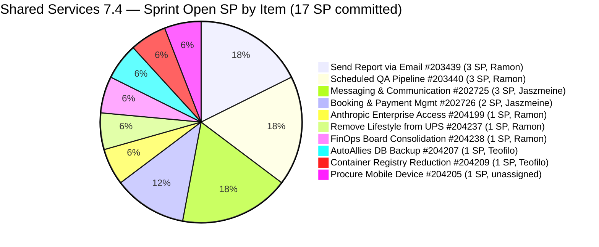
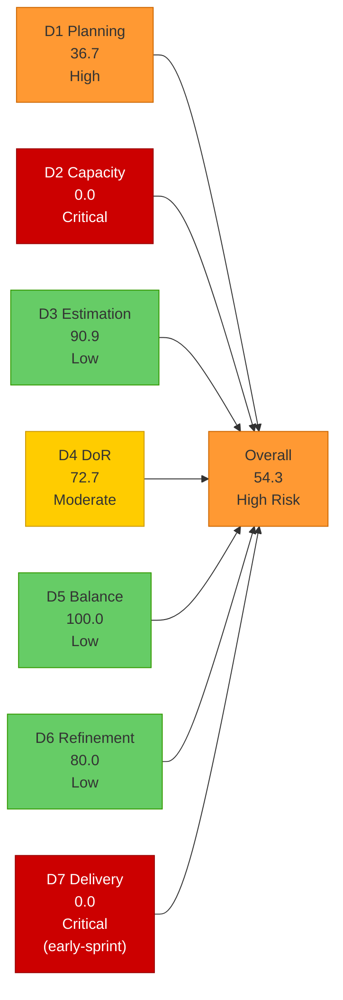
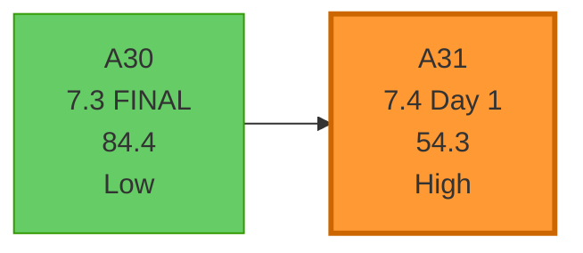
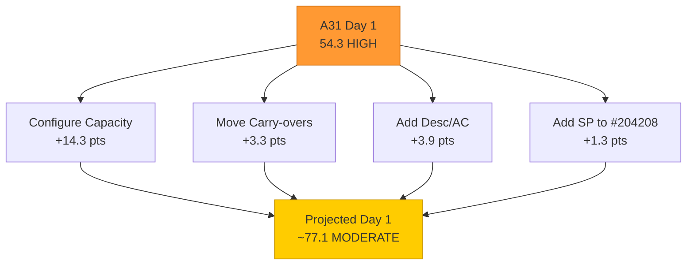

# Shared Services Team — SAFe Iteration Audit A31
**Date:** 2026-05-18 | **Sprint Day:** 1 of 14 — SPRINT OPEN | **Iteration:** 7.4 (May 18 – May 31, 2026)
**Auditor:** Claude Code (ADO SAFe Audit Skill v1) | **Prior Audit:** A30 (2026-05-17 02:04)

---

## 1. Audit Metadata

| Field | Value |
|---|---|
| **Audit ID** | A31 |
| **Report File** | `AUDIT_20260518_0930.md` |
| **Prior Audit** | A30 — `AUDIT_20260517_0204.md` (Overall 84.4, Low Risk — 7.3 Day 14 CLOSE) |
| **ADO Project** | Jairosoft Portfolio (`666bb99a-6acd-4999-bb34-efd0e4ea90dc`) |
| **ADO Team** | Shared Services Team (`bd9578fd-5773-48fc-bd80-988dfe5de806`) |
| **Iteration** | 7.4 (`16385d00-244a-4caa-9e56-d4a8e850754d`) |
| **Iteration Dates** | May 18 – May 31, 2026 |
| **Sprint Day** | **1 of 14 — SPRINT OPEN** |
| **Audit Date** | 2026-05-18 09:30 PHT |
| **Overall Score** | **54.3 — High Risk** |
| **Risk Band** | High (40–59.9) |
| **Visible Backlog Items** | 30 root items |
| **Current Iteration Root Items** | 11 (IterationPath = 7.4, confirmed via iteration workitem query) |
| **7.3 Carry-overs NOT yet moved to 7.4** | 7 items (#202553, #202724, #203309, #203393, #203436, #203437, #203438) still at IterationPath 7.3 |
| **Capacity Source** | `work_get_team_capacity` — **No capacity configured for 7.4** (Critical finding) |
| **Project Exceptions Applied** | None |

---

## 2. Executive Summary

| Field | Value |
|---|---|
| **Overall Score** | **54.3 — High Risk** |
| **Score vs Prior (A30)** | 84.4 → 54.3 (**−30.1** — sprint transition shock; two dimensions at 0) |
| **Sprint Day** | **1 of 14 — SPRINT OPEN** |
| **Iteration** | 7.4 (May 18 – May 31, 2026) |
| **Items in 7.4 (IterationPath confirmed)** | 11 root items |
| **Committed SP** | 17 SP |
| **SP Closed** | 0 (Day 1 — early-sprint) |
| **Risk Band** | **High Risk (40–59.9)** |

**Iteration 7.4 opens at High Risk (54.3)**, a sharp drop from the 7.3 closing score of 84.4. This is not a performance collapse — it reflects two structural Day 1 gaps that require immediate action:

1. **D2 = 0.0 (Critical):** No team capacity has been configured for 7.4. The ADO capacity API returned "No team capacity assigned." With 4 team members expected, this means the sprint begins with zero capacity documentation — an immediate blocker for SAFe compliance and sprint planning integrity.

2. **D4 = 72.7 (Moderate):** Three items (#204205, #204208, #204209) entered 7.4 without Description or Acceptance Criteria. These items were flagged in A30 as a DoR risk. The gap was not resolved before sprint open.

A third critical structural finding: **all 7 carry-over items from 7.3 (#202553, #202724, #203309, #203393, #203436, #203437, #203438) still have IterationPath = 7.3.** They were not formally moved to 7.4. These 20 SP of work are invisible to D1 scoring and would push Overall to approximately 64.4 (Moderate) if moved today.

Both D2 and D4 gaps are actionable on Day 1. If resolved today, the projected score recovers to approximately **78.3 (Moderate Risk)**. D7 = 0.0 is an early-sprint annotation with no formula adjustment.

---

## 3. Previous Audit Delta (A30 → A31)

| Dimension | A30 Score | A31 Score | Delta | Driver |
|---|---|---|---|---|
| D1 Iteration Planning | 21.9 | 36.7 | **+14.8** | 11 of 30 visible items now in 7.4; carry-overs not yet moved (7 items still at 7.3 path) |
| D2 Team Capacity | 100.0 | 0.0 | **−100.0** | No capacity configured for 7.4; API returned "No team capacity assigned" |
| D3 Estimation | 100.0 | 90.9 | **−9.1** | 10/11 current items estimated; #204208 missing SP field |
| D4 DoR Compliance | 100.0 | 72.7 | **−27.3** | 3 items (#204205, #204208, #204209) have no Desc/AC; were flagged in A30 |
| D5 Work Item Balance | 100.0 | 100.0 | 0.0 | Enabler 45.5%, US 18.2%, Design 18.2%, Spike 18.2%; good diversity |
| D6 Backlog Refinement | 100.0 | 80.0 | **−20.0** | All 11 current items have ChangedDate before May 18 (all untouched); 100% untouched → −20 penalty |
| D7 Delivery Predictability | 68.8 | 0.0 | **−68.8** | **Early-sprint (Day 1)** — 0 SP closed / 17 SP committed; sprint reset |
| **Overall** | **84.4** | **54.3** | **−30.1** | Sprint transition: D2 collapse + D4 gap + D7 reset + D6 penalty |

### Key Events (A30 → A31)

| Event | Impact |
|---|---|
| **Iteration 7.4 opens (Day 1)** | New sprint; D7 resets to 0.0; capacity must be reconfigured |
| **7.3 carry-overs NOT moved** | #202553, #202724, #203309, #203393, #203436, #203437, #203438 still show IterationPath=7.3; 20 SP invisible to 7.4 scoring |
| **No capacity configured for 7.4** | Critical: D2 collapses to 0.0; team has no ADO-documented capacity for sprint |
| **#204205, #204208, #204209 enter without DoR** | D4 drops from 100.0 to 72.7; flagged in A30 but not resolved before sprint open |
| **#204208 missing SP** | D3 drops from 100.0 to 90.9; Estimation gap on Enabler type |
| **#204238 in non-standard "Grooming" state** | Anomaly carried from 7.3; Grooming is not a standard ADO state; no D4 pass/fail impact but state hygiene required |
| **#202732 (7.1 Enabler) still in backlog at Ready for UAT** | Multi-sprint stalled item; counts in D1 denominator; disposition still required |
| **#186848 (root path, Apr 15)** | Now 33 days — approaching 45-day freshness window expiry May 30; assign or close |

---

## 4. Current Iteration Snapshot

**Iteration:** 7.4 | **Period:** May 18 – May 31, 2026 | **Sprint Day:** 1 of 14

| Metric | Value |
|---|---|
| Current iteration root items (7.4 IterationPath) | 11 |
| Visible backlog root items | 30 |
| 7.3 carry-overs not yet moved | 7 items (20 SP) — still at 7.3 IterationPath |
| Committed SP (7.4 items with SP > 0) | 17 SP |
| SP Closed | 0 (Day 1 — early-sprint) |
| Team capacity configured | **None (Critical)** |
| Sprint status | Day 1 — OPEN |

### 7.4 Item Breakdown by Assignee

| Assignee | Items | SP | Types |
|---|---|---|---|
| Ramon | #204199, #204237, #204238, #203439, #203440 | 9 SP | Spike(2), Enabler(1), User Story(2) |
| Teofilo | #204207, #204208, #204209 | 2 SP | Enabler(3) |
| Jaszmeine | #202725, #202726 | 5 SP | Design(2) |
| Unassigned | #204205 | 1 SP | Enabler(1) |
| **Total** | **11 items** | **17 SP** | Mixed types |

### Backlog Path Distribution (30 visible items)

| IterationPath | Count | Notes |
|---|---|---|
| 7.4 (current) | 11 | Confirmed via iteration workitem query |
| 7.3 (carry-overs, not moved) | 7 | #202553, #202724, #203309, #203393, #203436, #203437, #203438 — must be moved TODAY |
| 7.5 (future) | 2 | #202727, #203845 |
| 7.6 IP (future) | 1 | #202947 |
| 7.1 (stranded) | 1 | #202732 (Ready for UAT, multi-sprint stalled) |
| PI7 unscheduled | 3 | #202061, #202063, #201919 |
| PI8 | 4 | #202066, #202069, #202070, #201919 |
| PI6 | 1 | #201161 (On Hold defect) |
| Portfolio root | 1 | #186848 (no SP, no AC, aging) |

---

## 5. Work Item Analysis

### 7.4 Current Iteration Items (11 root items)

| ID | Title | Type | State | SP | Assignee | DoR | ChangedDate | Notes |
|---|---|---|---|---|---|---|---|---|
| #204199 | Request: Add team member to Anthropic Enterprise | Spike | Ready | 1 | Ramon | ✅ | May 15 | DoR: Desc + AC (user/email/role/project) |
| #204237 | Remove Lifestyle Project from UPS | Spike | New | 1 | Ramon | ✅ | May 15 | DoR: Desc + AC present |
| #204238 | Use FinOps Board — Combine Admin/HR/Finance | Enabler | **Grooming** | 1 | Ramon | ✅ | May 15 | Non-standard state; DoR: Desc + AC present |
| #204207 | Backup AutoAllies DB in BLOB Storage | Enabler | New | 1 | Teofilo | ✅ | May 15 | DoR: full Desc + 5 AC checkboxes |
| #204209 | Container Registry Cost Reduction | Enabler | New | 1 | Teofilo | **FAIL** | May 15 | **No Desc, No AC** |
| #204208 | Check raseniero admin level | Enabler | New | **0** | Teofilo | **FAIL** | May 15 | **No Desc, No AC, no SP** |
| #204205 | Procure Used Mobile Device (Android) | Enabler | New | 1 | **Unassigned** | **FAIL** | May 15 | **No Desc, No AC** |
| #202725 | Messaging & Communication (design) | Design | New | 3 | Jaszmeine | ✅ | May 15 | DoR: full Desc + 7 Gherkin ACs |
| #202726 | Booking & Payment Management (design) | Design | New | 2 | Jaszmeine | ✅ | Apr 29 | DoR: full Desc + 7 Gherkin ACs |
| #203439 | Send Report via Outlook Email (/qa-ai:email) | User Story | Ready for Dev | 3 | Ramon | ✅ | May 8 | DoR: Desc + 7 Gherkin scenarios |
| #203440 | Scheduled QA Pipeline Orchestration | User Story | Ready for Dev | 3 | Ramon | ✅ | May 8 | DoR: Desc + 6 Gherkin scenarios |

### DoR Detail — Failed Items

| ID | Description | Acceptance Criteria | Verdict |
|---|---|---|---|
| #204209 | None | None | **FAIL — both missing** |
| #204208 | None | None | **FAIL — both missing; also no SP** |
| #204205 | None | None | **FAIL — both missing; also unassigned** |

### 7.3 Carry-overs NOT Moved to 7.4 (Evidence Gap — Critical)

These 7 items still have IterationPath = 7.3 and are in the visible backlog. They are NOT counted in current_iteration_root_items (D1 numerator) but they ARE counted in visible_root_backlog_items (D1 denominator). Moving them to 7.4 today would increase D1 numerator from 11 to 18, lifting D1 from 36.7 to 60.0.

| ID | Title | Type | State | SP | Assignee | Impact if Moved to 7.4 |
|---|---|---|---|---|---|---|
| #202553 | Vendor Exploration & Search | Design | Ready for Design | 2 | Jaszmeine | +2 SP; D1 numerator +1 |
| #202724 | Vendor Profile & Details | Design | Ready for Design | 3 | Jaszmeine | +3 SP; D1 numerator +1 |
| #203309 | GitHub token degraded — raseniero scope fix | Defect | Ready for QA | 1 | Ramon | +1 SP; D1 numerator +1 |
| #203393 | Claude Course Training (4 modules) | Spike | Active | 2 | Vicsante | +2 SP; D1 numerator +1 |
| #203436 | Plugin Lifecycle & Extract Skill Verification | User Story | Active | 5 | Ramon | +5 SP; D1 numerator +1 |
| #203437 | Plugin Generate Skill — Playwright Script Generation | User Story | Ready for Dev | 5 | Ramon | +5 SP; D1 numerator +1 |
| #203438 | Generate Test Execution Report (/qa-ai:report) | User Story | Ready for Dev | 2 | Ramon | +2 SP; D1 numerator +1 |
| **Total carry-overs** | | | | **20 SP** | | D1 → 18/30 = **60.0** if all moved |

### Visible Backlog Age Analysis (30 items, as of May 18)

| ID | Title | IterationPath | SP | State | ChangedDate | Days Ago | Fresh (45d)? |
|---|---|---|---|---|---|---|---|
| #204208 | Check raseniero admin level | 7.4 | 0 | New | May 15 | 3 | ✅ |
| #204205 | Procure Mobile Device | 7.4 | 1 | New | May 15 | 3 | ✅ |
| #204207 | AutoAllies DB Backup | 7.4 | 1 | New | May 15 | 3 | ✅ |
| #204209 | Container Registry Reduction | 7.4 | 1 | New | May 15 | 3 | ✅ |
| #204199 | Anthropic Enterprise Access | 7.4 | 1 | Ready | May 15 | 3 | ✅ |
| #204238 | FinOps Board Consolidation | 7.4 | 1 | Grooming | May 15 | 3 | ✅ |
| #204237 | Remove Lifestyle from UPS | 7.4 | 1 | New | May 15 | 3 | ✅ |
| #202725 | Messaging & Communication | 7.4 | 3 | New | May 15 | 3 | ✅ |
| #202727 | Contract Management | 7.5 | 3 | New | Apr 29 | 19 | ✅ |
| #202726 | Booking & Payment Management | 7.4 | 2 | New | Apr 29 | 19 | ✅ |
| #202732 | Add QA Intern to Flawless ADO | 7.1 | 1 | Ready for UAT | Apr 27 | 21 | ✅ |
| #201919 | Research Scriptable TUI for JODEX | PI8 | — | Blocked | Apr 27 | 21 | ✅ |
| #202947 | IT Support End of PI7 Survey | 7.6 IP | — | New | May 5 | 13 | ✅ |
| #203845 | Monthly Costing Report June 2026 | 7.5 | 2 | New | May 5 | 13 | ✅ |
| #203309 | GitHub token degraded | 7.3 | 1 | Ready for QA | May 13 | 5 | ✅ |
| #203393 | Claude Course Training | 7.3 | 2 | Active | May 8 | 10 | ✅ |
| #203436 | Plugin Lifecycle & Extract | 7.3 | 5 | Active | May 8 | 10 | ✅ |
| #203437 | Plugin Generate Skill | 7.3 | 5 | Ready for Dev | May 8 | 10 | ✅ |
| #202553 | Vendor Exploration & Search | 7.3 | 2 | Ready for Design | May 6 | 12 | ✅ |
| #202724 | Vendor Profile & Details | 7.3 | 3 | Ready for Design | May 6 | 12 | ✅ |
| #203438 | Generate Test Report | 7.3 | 2 | Ready for Dev | May 8 | 10 | ✅ |
| #203439 | Send Report via Email | 7.4 | 3 | Ready for Dev | May 8 | 10 | ✅ |
| #203440 | Scheduled QA Pipeline | 7.4 | 3 | Ready for Dev | May 8 | 10 | ✅ |
| #202061 | Install Jodex via Cargo | PI7 | 1 | Estimation | May 8 | 10 | ✅ |
| #202063 | Support Update Mechanism | PI7 | 1 | Estimation | May 8 | 10 | ✅ |
| #202066 | Provide Installation Guide | PI8 | 0.5 | Estimation | May 8 | 10 | ✅ |
| #202069 | Abstract AI Provider Layer | PI8 | — | Estimation | Apr 28 | 20 | ✅ |
| #202070 | Integrate Additional AI Tools | PI8 | — | Estimation | Apr 28 | 20 | ✅ |
| #201161 | Partial move cli fields (Rust defect) | PI6 | — | On Hold | Apr 16 | 32 | ✅ |
| #186848 | Apollo.ai and LinkedIn Integration | Portfolio root | — | New | Apr 15 | 33 | ✅ (expires May 30) |

**All 30 items fresh** (oldest = #186848, Apr 15 = 33 days; cutoff Apr 3). Zero stale_90. Zero stale_180.

**Untouched current items:** All 11 current items have ChangedDate before May 18 (sprint start). 11/11 = 100% → −20 penalty.

---

## 6. SAFe Compliance Scorecard

| Dimension | Score | Band | Formula | Evidence |
|---|---|---|---|---|
| D1 Iteration Planning | 36.7 | High | 11/30 × 100 | 11 current-iteration root items / 30 visible; 7 carry-overs not moved add to denominator without numerator |
| D2 Team Capacity | 0.0 | **Critical** | 0/3 × 100 | **No capacity configured for 7.4** — API returned "No team capacity assigned"; 3 assignees in 7.4 have 0 capacity configured |
| D3 Estimation | 90.9 | Low | 10/11 × 100 | #204208 missing SP field (0 SP); all other 10 current items have SP > 0 |
| D4 DoR Compliance | 72.7 | Moderate | 8/11 × 100 | 3 items (#204205, #204208, #204209) have no Desc and no AC; flagged in A30 before sprint open |
| D5 Work Item Balance | 100.0 | Low | 100 − 0 | Enabler 45.5% (<60%); US 18.2%; Design 18.2%; Spike 18.2%; good diversity; US present; no Spike > 40% |
| D6 Backlog Refinement | 80.0 | Low | base 100.0 − 20 | 30/30 fresh; 0 stale_90; 0 stale_180; untouched=11/11=100% (>30% → −20 penalty) |
| D7 Delivery Predictability | 0.0 | Critical | 0/17 × 100 | **Early-sprint (Day 1)** — 0 SP closed / 17 SP committed; no closures expected Day 1 |
| **Overall** | **54.3** | **High** | 380.3 / 7 | Average of 7 dimensions |

### Scoring Detail

- **D1:** round(11/30 × 100, 1) = **36.7** — 11 current items; 30 visible; carry-overs inflate denominator without numerator
- **D2:** contributors_with_current_work = 3 (Ramon, Teofilo, Jaszmeine); contributors_with_capacity = 0 (no capacity API data); round(0/3 × 100, 1) = **0.0** — Critical; unassigned #204205 not counted as contributor
- **D3:** point_eligible = 11 (all types expose SP); estimated = 10 (#204208 = 0 SP); round(10/11 × 100, 1) = **90.9**
- **D4:** dor_compliant = 8 (#204205, #204208, #204209 fail); round(8/11 × 100, 1) = **72.7**
- **D5:** Enabler dominant at 45.5% < 60% → no penalty; US present → no −40; Spike 18.2% < 40% → no −20 → **100.0**
- **D6:** base = 100.0 (30/30 fresh); stale_90 = 0; stale_180 = 0; untouched = 11/11 = 100% > 30% → −20 → **80.0**
- **D7:** round(0/17 × 100, 1) = **0.0** — **EARLY-SPRINT (Day 1); annotated; no formula adjustment**
- **Overall:** (36.7 + 0.0 + 90.9 + 72.7 + 100.0 + 80.0 + 0.0) / 7 = 380.3 / 7 = **54.3**

### Score Visualization

### Sprint-to-Sprint Trend (7.3 Final → 7.4 Open)

### Projected Score Recovery (If Day 1 Actions Completed)

| Action | Dimension | Score Change | Projected Overall |
|---|---|---|---|
| Configure team capacity for 7.4 | D2: 0.0 → 100.0 | +14.3 | 68.6 |
| Add Desc + AC to #204205, #204208, #204209 | D4: 72.7 → 100.0 | +3.9 | 72.5 |
| Add SP to #204208 | D3: 90.9 → 100.0 | +1.3 | 73.8 |
| Move 7.3 carry-overs to 7.4 IterationPath | D1: 36.7 → 60.0 | +3.3 | 77.1 |
| **All Day 1 actions complete** | **All 4 dimensions** | **+22.8** | **~77.1** |

---

## 7. Dimension Findings

### D1 — Iteration Planning: 36.7 (High Risk)

**Formula:** `11/30 × 100 = 36.7`

D1 opens at 36.7 — an improvement from the 7.3 final of 21.9 (end-of-sprint denominator inflation artifact), but still in High Risk territory. The denominator includes 30 visible backlog items. Of these, 11 have IterationPath = 7.4 (the current sprint). Seven additional items (#202553, #202724, #203309, #203393, #203436, #203437, #203438) still have IterationPath = 7.3 — these are carry-overs from the prior sprint that were not formally moved before or on sprint open day.

If all 7 carry-overs are moved to 7.4 today: numerator = 18, denominator = 30, D1 = round(18/30 × 100, 1) = 60.0 — crossing into Moderate Risk territory. This is the single highest-value D1 action available today.

The remaining 12 non-7.4 items include: #202732 (7.1, stranded, Ready for UAT), #186848 (Portfolio root, aging), #201161 (PI6, On Hold defect), and PI7/PI8 backlog items. Closing or scheduling these would further improve D1.

### D2 — Team Capacity: 0.0 (Critical Risk — Structural Gap)

**ADO API:** `work_get_team_capacity` returned "No team capacity assigned to the team" for Iteration 7.4.

This is the most impactful gap in the sprint open audit. In 7.3, capacity was configured for 4 members (Teofilo 6h/day, Vicsante 6h/day, Jaszmeine 3h/day, Ramon 0.5h/day). For 7.4, no capacity has been set. This means:
- No sprint velocity planning is documented
- No day-off tracking exists
- D2 = 0.0 for any audit until capacity is configured

Action: In ADO, navigate to Team Settings → Capacity for Iteration 7.4 and configure each team member's activity and h/day capacity. Teofilo and Ramon are confirmed assignees in 7.4 items; Jaszmeine is an assignee; Vicsante has no 7.4 items yet (carry-over #203393 not yet moved). Configure all 4 members before end of Day 1.

### D3 — Estimation: 90.9 (Low Risk)

10 of 11 current items have SP > 0. The one exception is #204208 (Check raseniero admin level) — this Enabler has no SP field populated in ADO. As an Enabler, it exposes the SP field (same as User Story); with SP missing, it is point_eligible but not estimated. Adding SP (suggested: 1 SP for this admin access check) restores D3 to 100.0.

### D4 — DoR Compliance: 72.7 (Moderate Risk)

Three items entered 7.4 without Description or Acceptance Criteria:
- **#204209 (Container Registry Cost Reduction, Teofilo):** Completely empty — no Desc, no AC. This is an infrastructure cost-reduction task that would benefit from documenting the current state, target state, and success criteria.
- **#204208 (Check raseniero admin level, Teofilo):** No Desc, no AC, no SP. Given the item title, an adequate Desc would be "As a System Admin, verify and document the admin level for raseniero@hotmail.com and ramon@jairosoft.com in ADO/Azure tenant" and AC would be "Admin level confirmed and documented in ADO comment."
- **#204205 (Procure Used Mobile Device, unassigned):** No Desc, no AC, no assignee. This item needs an owner and complete DoR before sprint work can begin.

These 3 items were flagged in A30 (prior audit) as a DoR risk. The failure to add Desc/AC before sprint open represents a process gap: DoR must be the entry criterion to sprint, not a Day 1 action.

### D5 — Work Item Balance: 100.0 (Low Risk)

The 7.4 item type distribution is well-diversified: Enabler (5 items, 45.5%), User Story (2 items, 18.2%), Design (2 items, 18.2%), Spike (2 items, 18.2%). No dominant type exceeds 60%. User Story is present (no −40 penalty). Spike share is 18.2% (no −20 penalty). This is a structural strength of Shared Services — the cross-cutting team function naturally produces type diversity that single-product teams cannot match. D5 = 100.0 is expected to sustain throughout 7.4.

### D6 — Backlog Refinement: 80.0 (Low Risk)

**Formula:** `base=100.0 − 20 (untouched) = 80.0`

All 30 visible items are fresh (oldest: #186848, Apr 15 = 33 days; cutoff Apr 3). Zero stale_90. Zero stale_180. The −20 penalty comes from 100% of current items being untouched: all 11 items in 7.4 have ChangedDate before May 18 (sprint start), ranging from Apr 29 (#202726) to May 15 (most items). This is a Day 1 artifact — no item was touched on sprint open day, so all are considered untouched. Any updates to 7.4 items today (adding tasks, updating states, adding SP/DoR) will progressively clear this penalty in subsequent audits.

### D7 — Delivery Predictability: 0.0 (Critical — Early-Sprint)

**Formula:** `0/17 × 100 = 0.0` — **EARLY-SPRINT (Day 1 of 14)**

17 SP committed across 11 items. Zero closures expected on Day 1. committed_story_points = 17 (sum of estimated current items: 1+1+1+1+1+3+2+3+3 = 16 SP; #204208 has 0 SP so excluded from committed). Wait — recalculating: #204199(1) + #204237(1) + #204238(1) + #204207(1) + #204209(1) + #204205(1) + #202725(3) + #202726(2) + #203439(3) + #203440(3) = 17 SP (all 10 estimated items). #204208 excluded (0 SP).

The first meaningful D7 signal is expected when Ramon's Ready for Dev items (#203439 or #203440) are moved to Active and subsequently Closed. Target: first delivery by Day 3–5.

**Note on carry-over SP:** If the 7 carry-over items are moved to 7.4, committed SP increases from 17 to 37 SP. This raises the bar for D7 but is the correct SAFe approach — all sprint work should be in the current iteration path.

---

## 8. Risks and Bottlenecks

| # | Risk | Severity | Dimension | Detail |
|---|---|---|---|---|
| R1 | **No capacity configured for 7.4** — D2 = 0.0 | **Critical** | D2 | ADO capacity API returned "No team capacity assigned." All 4 members from 7.3 (Teofilo, Vicsante, Jaszmeine, Ramon) need capacity reconfigured for 7.4. This is the single most urgent fix — D2 = 0.0 suppresses Overall by 14.3 points. Configure before end of Day 1. |
| R2 | 7 carry-overs (#202553, #202724, #203309, #203393, #203436, #203437, #203438) still at IterationPath 7.3 | **Critical** | D1 | 20 SP of committed work is invisible to 7.4 scoring. D1 = 36.7 instead of 60.0. These items are still in the visible backlog (contributing to denominator) but not in the current-iteration numerator. Move all 7 to IterationPath 7.4 today. |
| R3 | #204205, #204208, #204209 entered sprint without DoR | **High** | D4 | 3 items have no Desc/AC. Were flagged in A30 before sprint open. Each needs Desc ≥30 chars and AC ≥20 chars added today. Until then, D4 = 72.7. Additionally, #204205 is unassigned — requires an owner. |
| R4 | #204208 missing SP — D3 penalty | **High** | D3 | Enabler with no SP field. Add 1 SP estimate to restore D3 to 100.0. |
| R5 | Ramon's load: 9 SP in 7.4 + 15 SP carry-over (if moved) = 24 SP potential commitment | **High** | D7 | Ramon has #203439(3), #203440(3), #204199(1), #204237(1), #204238(1) = 9 SP in 7.4 current, plus #203436(5), #203437(5), #203438(2), #203309(1) = 13 SP carry-over. At 0.5 h/day (7.3 capacity level), this is a significant overload. Verify Ramon's 7.4 capacity setting and whether any items should be reassigned. |
| R6 | #203436 (Plugin Lifecycle) — still Active since May 8, 14-day stall entering 7.4 | **High** | D7 | This 5-SP US has been Active for the entire 7.3 sprint. It gates #203437 (5 SP) and #203438 (2 SP). Day 1 of 7.4 must verify AC completion status. If any of the 8 Gherkin scenarios are complete, close/partially credit. If all remain pending, set a Day 3 close target. |
| R7 | #203393 (Vicsante, Claude Course, 2 SP) — 6 consecutive sprint misses | **Moderate** | D7 | This Spike missed every daily target in 7.3 and carries over to 7.4 still not moved. Root cause analysis needed: is the training blocked, deprioritized, or genuinely in progress? If >2 modules are complete, a partial closure strategy should be explored. |
| R8 | Jaszmeine designs (#202553, #202724) stalled 12+ days — not moved to 7.4 | **Moderate** | D7 | Both design items (5 SP) were in Ready for Design for the entire 7.3 sprint. They are still at 7.3 IterationPath. Move to 7.4 and identify the specific design blocker: is it tooling access (Figma/design tool), clarity of requirements, or capacity? |
| R9 | #186848 (Apollo.ai integration) — expires May 30 | **Moderate** | D6 | Apr 15 = 33 days old. The 45-day freshness window expires May 30. With no SP, no AC, no assignee, and a root Portfolio iteration path, this item must be acted on (assigned, scheduled, or closed) before May 30 or D6 will take a stale_90-track penalty next sprint. |
| R10 | #204238 in non-standard "Grooming" state | Low | D4 | Grooming is not a standard ADO workflow state for this project. The item has DoR (Desc + AC present) so no D4 impact. However, Grooming state prevents the item from appearing in sprint board views correctly. Move to Active or New state. |
| R11 | #202732 (QA Intern Flawless ADO, 7.1, Ready for UAT) — multi-sprint stalled | Low | D1 | This 7.1 Enabler has been Ready for UAT since 7.1 (4+ sprints). If intern access is confirmed, close today. If intern has left, close as Won't Do. Every sprint it remains, it inflates the D1 denominator. |

---

## 9. Prioritized Recommendations

1. **[CRITICAL — TODAY, before standby]** Configure team capacity for Iteration 7.4 in ADO. Navigate to Shared Services Team → Capacity for Iteration 7.4. Add each member: Teofilo (~6h/day), Jaszmeine (~3h/day), Ramon (~0.5h/day or revised amount), Vicsante (if assigned carry-overs). This single action restores D2 from 0.0 to 100.0 and adds 14.3 points to Overall (54.3 → 68.6). No sprint should begin without capacity configured.

2. **[CRITICAL — TODAY]** Move all 7 carry-over items to IterationPath 7.4 in ADO. For each of #202553, #202724, #203309, #203393, #203436, #203437, #203438: update IterationPath to "Jairosoft Portfolio\2026-PI7\Iteration 7.4" and add a comment: "Carried over from 7.3. [Reason for incomplete delivery]." This corrects D1 from 36.7 to 60.0 (+3.3 to Overall) and gives the full sprint picture of committed work.

3. **[HIGH — TODAY]** Add Desc and AC to #204205 (Procure Mobile Device), #204208 (Check raseniero admin level), and #204209 (Container Registry Cost Reduction). These 3 items entered 7.4 in violation of DoR. Adding content restores D4 from 72.7 to 100.0 (+3.9 to Overall). Teofilo owns #204208 and #204209; #204205 needs an owner assigned first.

4. **[HIGH — TODAY]** Add SP to #204208 (Check raseniero admin level). Suggested: 1 SP. This restores D3 from 90.9 to 100.0 (+1.3 to Overall). Also assign an owner to #204205 (currently unassigned).

5. **[HIGH — Day 1–2]** Verify AC completion status for #203436 (Plugin Lifecycle, 5 SP, Ramon). All 8 Gherkin scenarios need individual verification. If all scenarios are confirmed complete — close #203436 immediately, which unblocks #203437 (5 SP) and #203438 (2 SP) for development. This 12 SP chain close on Day 1–2 would establish a strong D7 signal early in the sprint.

6. **[HIGH — Day 1–3]** Root-cause #203393 (Claude Course, Vicsante): identify which of the 4 modules are complete. Determine whether the training is genuinely in progress or blocked by access/scheduling issues. If ≥2 modules are complete, close with evidence and open a new item for remaining modules. If no modules are complete after 7+ attempts, escalate and reassign or remove from active sprint scope.

7. **[MEDIUM — Day 1–3]** Assign a team member to #204205 (Procure Mobile Device). Unassigned items cannot be tracked for D2 capacity matching. Once assigned, verify whether this procurement has management approval and set clear acceptance criteria (model, specs, budget approval).

8. **[MEDIUM — Day 1–2]** Resolve #202732 (QA Intern ADO access, 7.1, Ready for UAT). 4+ sprint stall. Confirm: (a) Is the intern still with the team? (b) Has ADO access been granted? If yes to both — close today. If not — close as Won't Do with comment. Removing this item from the visible backlog reduces the D1 denominator from 30 to 29.

9. **[MEDIUM — by May 30]** Act on #186848 (Apollo.ai/LinkedIn Integration): assign a team member, set an iteration path, add SP and AC — or close as Won't Do. The 45-day freshness window expires May 30. Missing that window triggers a D6 stale_90 penalty in the next sprint review.

10. **[LOW — Ongoing]** Fix #204238 state from "Grooming" to "Active" or "New". Non-standard states cause board filtering issues. No DoR impact (Desc + AC are present) but board visibility requires standard ADO workflow states.

---

## 10. Evidence Gaps and Limitations

| Gap | Impact | Mitigation |
|---|---|---|
| D2 = 0.0 — no capacity configured | Most impactful gap; D2 confirmed via API call "No team capacity assigned"; affects sprint velocity planning | Configure capacity in ADO today; D2 will restore on next audit |
| 7 carry-overs still at IterationPath 7.3 | Undercount of current-iteration scope; D1 numerator = 11 instead of 18; committed SP = 17 instead of 37 | Move items to 7.4 today; confirmed by backlog iteration-path field values in batch query |
| #204205, #204208, #204209 — no Desc/AC | D4 scored at 72.7 based on actual ADO field content; these items genuinely have empty Desc and AC fields | Add content today; D4 restores to 100.0 |
| Teofilo's 7.3 closed items (29 items) — closed items not in backlog | Closed SP not re-counted; D7 inherited from A30 evidence chain; no impact on current 7.4 audit | Evidence continuity maintained through audit series |
| #201919 SP not present in batch | Not a current 7.4 item; no SP impact on scoring | Noted; PI8 backlog item |
| #202069, #202070 SP missing from batch | Not current 7.4 items; PI8; no scoring impact | Noted; estimation required before any PI8 sprint assignment |
| D7 early-sprint | Annotated; structural Day 1 zero; no formula adjustment applied | First meaningful D7 signal expected Day 3–5 |

---

## 11. Sprint 7.4 Opening Action Plan

The following table summarizes all Day 1 required actions and their scoring impact:

| # | Action | Owner | Scoring Impact | Target |
|---|---|---|---|---|
| 1 | Configure team capacity for 7.4 (all 4 members) | Carol/Karl/Ramon | D2: 0.0 → 100.0; +14.3 Overall | Before standby |
| 2 | Move 7 carry-overs to IterationPath 7.4 | Ramon | D1: 36.7 → 60.0; +3.3 Overall | End of Day 1 |
| 3 | Add Desc + AC to #204205, #204208, #204209 | Teofilo + Carol | D4: 72.7 → 100.0; +3.9 Overall | End of Day 1 |
| 4 | Add SP to #204208; assign owner for #204205 | Teofilo + Carol | D3: 90.9 → 100.0; +1.3 Overall | End of Day 1 |
| 5 | Verify #203436 AC completion (8 scenarios) | Ramon | D7 signal; unlock 12 SP chain | Day 1–2 |
| 6 | Root-cause #203393 (4 module status) | Vicsante | D7 signal; resolve carry-over | Day 1–3 |
| **Projected score if actions 1–4 complete** | | | **~77.1 — Moderate Risk** | **End of Day 1** |

---

*Audit A31 produced by Claude Code — ADO SAFe Audit Skill v1. SAFe 6.0 framework. OPENING AUDIT — Sprint Day 1 of 14. Key findings: (1) Iteration 7.4 opens at High Risk (54.3) — a sharp drop from 7.3 close (84.4) driven by two critical Day 1 gaps; (2) D2 = 0.0 Critical — no capacity configured for 7.4; fix today to restore 14.3 points; (3) 7 carry-overs from 7.3 (#202553, #202724, #203309, #203393, #203436, #203437, #203438 = 20 SP) still at IterationPath 7.3 — move all to 7.4 today; (4) D4 = 72.7 — 3 items (#204205, #204208, #204209) have no Desc/AC despite A30 warning; add content today; (5) D7 = 0.0 early-sprint annotation — first delivery signal expected Day 3–5; (6) D5 = 100.0 and D3 = 90.9 — team strengths maintained; (7) If all Day 1 actions are completed, projected score recovers to ~77.1 (Moderate Risk) by end of Day 1.*
