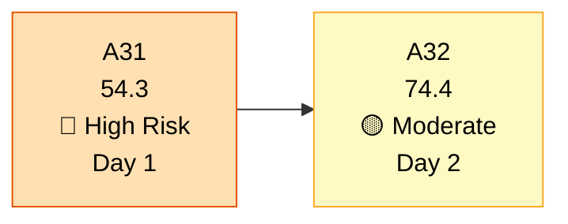
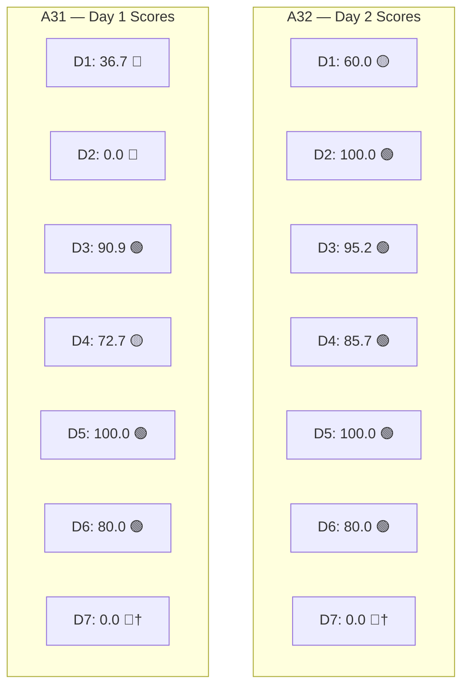
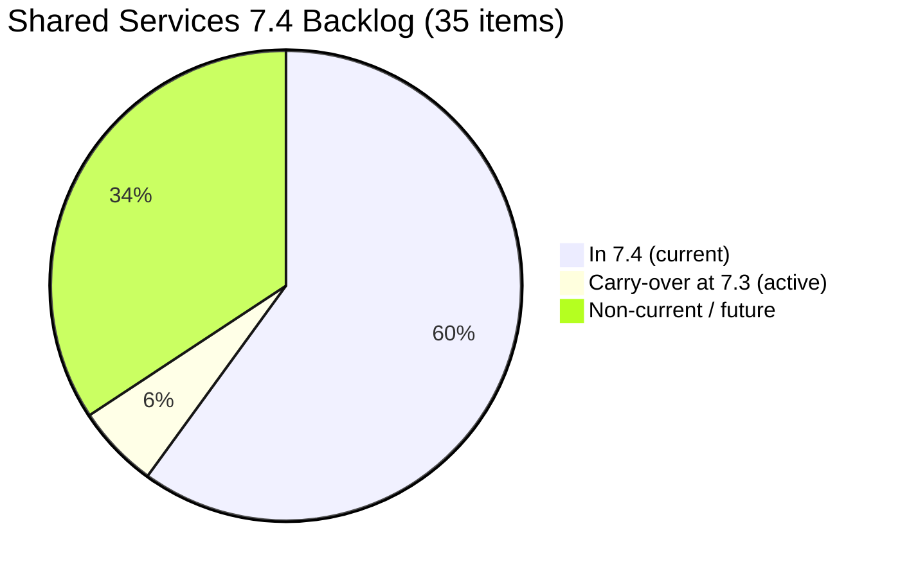
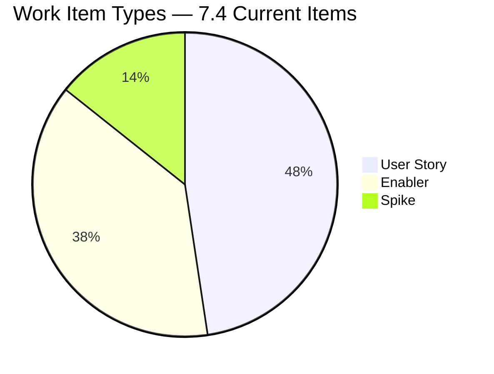

# Shared Services Team — SAFe Iteration Audit A32
**Date:** 2026-05-19 | **Sprint Day:** 2 of 14 — SPRINT ACTIVE | **Iteration:** 7.4 (May 18 – May 31, 2026)
**Auditor:** Claude Code (ADO SAFe Audit Skill v1) | **Prior Audit:** A31 (2026-05-18 09:30)

---

## 1. Audit Metadata

| Field | Value |
|---|---|
| **Audit ID** | A32 |
| **Report File** | `AUDIT_20260519_0204.md` |
| **Prior Audit** | A31 — `AUDIT_20260518_0930.md` (Overall 54.3, High Risk — 7.4 Day 1 OPEN) |
| **ADO Project** | Jairosoft Portfolio (`666bb99a-6acd-4999-bb34-efd0e4ea90dc`) |
| **ADO Team** | Shared Services Team (`bd9578fd-5773-48fc-bd80-988dfe5de806`) |
| **Iteration** | 7.4 (`16385d00-244a-4caa-9e56-d4a8e850754d`) |
| **Iteration Dates** | May 18 – May 31, 2026 |
| **Sprint Day** | **2 of 14 — SPRINT ACTIVE** |
| **Audit Date** | 2026-05-19 02:04 PHT |
| **Overall Score** | **74.4 — Moderate Risk** |
| **Risk Band** | Moderate (60–79.9) |
| **Visible Backlog Items** | 35 root items |
| **Current Iteration Root Items** | 21 (IterationPath = 7.4) |
| **Remaining Carry-overs at 7.3** | 2 items (#202553, #202724 — updated today, Design Review state) |
| **Capacity Source** | `work_get_team_capacity` — Teofilo 6h, Vicsante 6h, Jaszmeine 3h, Ramon 0.5h = 15.5h/day total |
| **Project Exceptions Applied** | None |

---

## 2. Executive Summary

| Field | Value |
|---|---|
| **Overall Score** | **74.4 — Moderate Risk** |
| **Score vs Prior (A31)** | 54.3 → 74.4 (**+20.1** — D2 critical finding fully resolved; carry-overs mostly migrated; 6 new items added) |
| **Sprint Day** | **2 of 14 — SPRINT ACTIVE** |
| **Iteration** | 7.4 (May 18 – May 31, 2026) |
| **Items in 7.4** | 21 root items (was 11 in A31; 5 carry-overs moved in + 6 new items added) |
| **Committed SP** | 41 SP (20 items with SP; #204209 still unestimated) |
| **SP Closed** | 0 (early-sprint Day 2) |
| **Risk Band** | Moderate (60–79.9) |

**Shared Services recovers strongly from High Risk (54.3) to Moderate Risk (74.4) on Day 2.** The team addressed both A31 critical findings overnight:

1. **D2 FULLY RESOLVED** — Capacity is now configured for all 4 active team members: Teofilo (6h/day), Vicsante (6h/day), Jaszmeine (3h/day), and Ramon (0.5h/day). The Day 1 critical gap is closed. D2 goes from 0.0 to 100.0.

2. **Carry-overs partially resolved** — 5 of 7 flagged carry-over items (#203309, #203393, #203436, #203437, #203438) were moved from IterationPath 7.3 to 7.4. The remaining 2 carry-overs (#202553, #202724) remain at IterationPath 7.3 but were both updated today (May 19, Design Review state), indicating active work in-progress. These 2 items are counted in the denominator for D1 planning purposes.

3. **6 new items added** — Teofilo added #204638–#204643 (MAC setup, Xeno ADO, Colina containers, Commit Eingress Repository, ADO cleanup, jodex-DevOps), expanding the iteration from 11 to 21 items. This large same-day scope increase requires monitoring for capacity overcommit (41 SP vs 15.5h/day available).

**Remaining risks:** Three DoR failures persist (#204205, #204209 unresolved from A31; #204641 new), and 7 items remain untouched since before sprint start (D6 = 80.0). The backlog denominator has grown to 35 items, holding D1 at 60.0 despite the carry-over migration.

---

## 3. Previous Audit Delta (A31 → A32)

| Dimension | A31 Score | A32 Score | Delta | Driver |
|---|---|---|---|---|
| D1 Iteration Planning | 36.7 | 60.0 | **+23.3** | 5 carry-overs moved to 7.4 (11→21 current items); 6 new items added; 2 carry-overs still at 7.3 |
| D2 Team Capacity | 0.0 | 100.0 | **+100.0** | FULLY RESOLVED — all 4 members now configured (Teofilo 6h, Vicsante 6h, Jaszmeine 3h, Ramon 0.5h) |
| D3 Estimation | 90.9 | 95.2 | **+4.3** | 20/21 items estimated; #204209 still missing SP (same gap as A31) |
| D4 DoR Compliance | 72.7 | 85.7 | **+13.0** | 18/21 pass; #204205 and #204209 unresolved from A31; #204641 new failure |
| D5 Work Item Balance | 100.0 | 100.0 | 0.0 | Enabler 47.6% <60%; US present; Spike 14.3% <40% — balanced mix maintained |
| D6 Backlog Refinement | 80.0 | 80.0 | 0.0 | 7/21 untouched (33.3%) > 30% → −20 penalty persists |
| D7 Delivery Predictability | 0.0 | 0.0 | 0.0 | Early-sprint Day 2 annotation; 0/41 SP closed |
| **Overall** | **54.3** | **74.4** | **+20.1** | D2 recovery (+14.3 weighted) + D1 improvement (+3.3 weighted) |

---

## 4. Dimension Scores

### D1 — Iteration Planning: 60.0 / 100 🟡 Moderate Risk

**Formula:** (items in current iteration) / (total visible backlog items) × 100

| Metric | Value |
|---|---|
| Items in 7.4 | 21 |
| Total visible backlog items | 35 |
| Score | 21 / 35 × 100 = **60.0** |

**Items in 7.4 (21):** #203867, #203868, #203869, #203870, #203871, #203309, #203393, #203436, #203437, #203438, #204199, #204205, #204209, #204237, #204238, #204638, #204639, #204640, #204641, #204642, #204643

**Items still at 7.3 but active (2):** #202553 (updated May 19), #202724 (updated May 19 — both in Design Review state)

**Finding (MODERATE):** D1 at 60.0 is the boundary of Moderate Risk. The denominator includes 14 non-current items. The 2 remaining 7.3 carry-overs (#202553, #202724) need formal iteration path migration to 7.4 to be captured in D1 numerator. Resolving this would push D1 to 23/35 = 65.7.

---

### D2 — Team Capacity: 100.0 / 100 🟢 Low Risk ✅ RESOLVED

**Formula:** (members with capacity configured) / (active team members) × 100

| Member | Capacity | Activities |
|---|---|---|
| Teofilo | 6.0 h/day | Development |
| Vicsante | 6.0 h/day | Development |
| Jaszmeine | 3.0 h/day | Design |
| Ramon | 0.5 h/day | Management |
| **Total** | **15.5 h/day** | — |

| Metric | Value |
|---|---|
| Active team members | 4 |
| Members with capacity configured | 4 |
| Score | 4 / 4 × 100 = **100.0** |

**Resolution of A31 Critical Finding:** A31 flagged D2 = 0.0 (no capacity configured). All four members now have capacity configured. This single fix contributed +14.3 points to the overall score.

**Capacity vs Commitment Note:** 41 SP committed against 15.5h/day. With 14 days remaining (210h total available × team), this sprint is capacity-intensive. Monitor daily velocity from Day 3.

---

### D3 — Estimation: 95.2 / 100 🟢 Low Risk

**Formula:** (items with SP > 0) / (total current iteration items) × 100

| Metric | Value |
|---|---|
| Items with SP > 0 | 20 |
| Total current iteration items | 21 |
| Score | 20 / 21 × 100 = **95.2** |

**Unestimated item:** #204209 ("Container Registry Cost Reduction" — Teofilo, assigned) — no SP assigned. This gap persists from A31 and should be resolved by Day 3.

---

### D4 — DoR Compliance: 85.7 / 100 🟢 Low Risk (Borderline)

**Formula:** (items with Desc≥30 chars AND AC≥20 chars) / (total current iteration items) × 100

| Metric | Value |
|---|---|
| DoR-compliant items | 18 |
| Total current iteration items | 21 |
| Score | 18 / 21 × 100 = **85.7** |

**DoR Failures (3):**

| Work Item | Title | Assignee | Desc | AC | Status |
|---|---|---|---|---|---|
| #204205 | Procure Mobile Device | Unassigned | ❌ Missing | ❌ Missing | UNRESOLVED from A31 |
| #204209 | Container Registry Cost Reduction | Teofilo | ❌ Missing | ❌ Missing | UNRESOLVED from A31 |
| #204641 | Commit Eingress Repository | Unassigned | ❌ Missing | ❌ Missing | NEW — added today |

**Finding (MODERATE):** Two legacy DoR gaps (#204205, #204209) remain unresolved entering Day 2. The newly added #204641 also lacks both Description and AC — items should not enter the iteration without DoR. Resolving all three would restore D4 to 21/21 = 100.0 and lift Overall by approximately 2.1 points.

---

### D5 — Work Item Balance: 100.0 / 100 🟢 Low Risk

**Formula:** Base 100; −30 if any single type >60% AND no Enablers; −20 if Spikes >40%

| Type | Count | % |
|---|---|---|
| User Story | 10 | 47.6% |
| Enabler | 8 | 38.1% |
| Spike | 3 | 14.3% |
| **Total** | **21** | **100%** |

**Score:** Base 100; User Story 47.6% < 60%; Spike 14.3% < 40% → **100.0**

**Strength:** Shared Services maintains an excellent work type distribution across all 21 items. The Enabler proportion (38.1%) and Spike presence (14.3%) reflect the team's cross-cutting infrastructure mandate.

---

### D6 — Backlog Refinement: 80.0 / 100 🟢 Low Risk

**Formula:** Base 100; −20 if untouched items >30%; −10 if untouched 10–30%

**Freshness window:** Items with ChangedDate ≥ May 4, 2026 (45-day window from May 19)

| Untouched Items (ChangedDate < May 18) | Last Changed |
|---|---|
| #204199 | May 15 |
| #204237 | May 15 |
| #204238 | May 15 |
| #204209 | May 15 |
| #204205 | May 15 |
| #203439 | May 8 |
| #203440 | May 8 |

| Metric | Value |
|---|---|
| Total current iteration items | 21 |
| Untouched items | 7 |
| Untouched percentage | 7 / 21 = 33.3% |
| Score | Base 100 − 20 (33.3% > 30%) = **80.0** |

**Finding (LOW):** The 33.3% untouched rate narrowly exceeds the 30% threshold, triggering the −20 penalty. Of the 7 untouched items, 5 (#204199, #204237, #204238, #203439, #203440) were last touched between May 8–15 — close to sprint start but not yet refined for this iteration. The two DoR failures (#204205, #204209) also contribute to this group, compounding the issue.

---

### D7 — Delivery Predictability: 0.0 / 100 🔴 Critical (Early-Sprint Annotation)

**Formula:** (SP closed this sprint) / (total committed SP) × 100

| Metric | Value |
|---|---|
| SP closed this sprint | 0 |
| Total committed SP | 41 |
| Score | 0 / 41 × 100 = **0.0** |

> **Early-Sprint Annotation:** Day 2 of 14. D7 = 0.0 is expected and does not reflect execution failure. First delivery opportunities anticipated Days 3–5. This dimension will become meaningful from Day 5 onward. With 41 SP committed and 15.5h/day capacity, the team must average approximately 2.9 SP/day from Day 3 onward to complete the sprint.

---

## 5. Scorecard Summary

```
┌─────────────────────────────────────────────┬────────┬──────┐
│ Dimension                                   │ Score  │ Band │
├─────────────────────────────────────────────┼────────┼──────┤
│ D1  Iteration Planning                      │  60.0  │  🟡  │
│ D2  Team Capacity                           │ 100.0  │  🟢  │
│ D3  Estimation                              │  95.2  │  🟢  │
│ D4  DoR Compliance                          │  85.7  │  🟢  │
│ D5  Work Item Balance                       │ 100.0  │  🟢  │
│ D6  Backlog Refinement                      │  80.0  │  🟢  │
│ D7  Delivery Predictability (Day 2†)        │   0.0  │  🔴  │
├─────────────────────────────────────────────┼────────┼──────┤
│ OVERALL                                     │  74.4  │  🟡  │
└─────────────────────────────────────────────┴────────┴──────┘
† Early-sprint annotation — no execution failure implied
```

---

## 6. Findings

| # | Severity | Dimension | Finding | Action |
|---|---|---|---|---|
| F1 | HIGH | D4 | #204205 (Procure Mobile Device, unassigned) — no Desc, no AC. UNRESOLVED from A31. | Add Description and AC immediately. Assign to a team member. |
| F2 | HIGH | D4 | #204209 (Container Registry Cost Reduction, Teofilo) — no Desc, no AC, no SP. UNRESOLVED from A31. | Add Description, AC, and SP estimation by Day 3. |
| F3 | HIGH | D4 | #204641 (Commit Eingress Repository, unassigned) — new item added today with no Desc, no AC, no assignee. | Add Description and AC before Day 3. Assign to responsible team member. |
| F4 | MODERATE | D1 | #202553 and #202724 remain at IterationPath 7.3 despite active work today. Sprint scope underreported. | Move both items to IterationPath 7.4 in ADO. This would improve D1 from 60.0 to 65.7. |
| F5 | MODERATE | D1 | Backlog denominator at 35 items; 14 non-current items dilute planning ratio. | Triage non-current items: schedule to future iterations or move to icebox. |
| F6 | MODERATE | D6 | 7 of 21 items untouched since before sprint start (33.3%); −20 penalty applied. Items: #204199, #204237, #204238, #204209, #204205, #203439, #203440. | Review and update all 7 items with brief status comments or state transitions by Day 4. |
| F7 | MODERATE | D3 | #204209 unestimated (no SP). Combined DoR + Estimation gap. | Assign SP to #204209 when adding Description and AC. |
| F8 | INFO | D7 | 0 SP closed, 41 SP committed. Day 2 early-sprint annotation. | Begin first closures by Day 3–4. Monitor velocity against 2.9 SP/day target. |

---

## 7. Trend Visualization

### Score Recovery Trend (A31 → A32)



### Dimension Comparison (A31 vs A32)



### Backlog Composition (A32)



### Work Item Type Distribution (21 current items)



---

## 8. Recommendations

1. **[HIGH — Immediate]** Resolve the three DoR failures before Day 3:
   - **#204205** (Procure Mobile Device): add Description and Acceptance Criteria; assign to a team member.
   - **#204209** (Container Registry Cost Reduction): add Description, AC, and SP estimate.
   - **#204641** (Commit Eingress Repository): add Description and AC; assign to a team member.
   Resolving all three restores D4 to 100.0 and lifts Overall to approximately 76.8.

2. **[HIGH — Today]** Move #202553 and #202724 from IterationPath 7.3 to 7.4 in ADO. Both items are actively being worked (updated today, Design Review state). Formalizing their sprint association corrects D1 and provides accurate sprint scope visibility. Impact: D1 improves from 60.0 to 65.7.

3. **[MODERATE — By Day 4]** Review and update the 7 untouched items (#204199, #204237, #204238, #204209, #204205, #203439, #203440). A brief comment or state update on each resets their freshness timestamp. Reducing untouched count below 7 (< 30% of 21) clears the D6 −20 penalty and lifts D6 to 100.0.

4. **[MODERATE — By Day 3]** Triage the 12 non-current backlog items. Assign future items to specific upcoming iterations or move them to a dedicated backlog area. This reduces the denominator and improves D1 planning coverage.

5. **[MONITOR — Daily from Day 3]** With 41 SP committed and 15.5h/day available, the team needs approximately 2.9 SP/day to close the sprint. Begin first closures no later than Day 4. Watch for scope overcommit if closures lag behind this pace.

6. **[STANDING]** Enforce DoR gate on new items before adding to active sprint. #204641 was added to 7.4 today without Description, AC, or assignee — this should be caught during daily standup or board review before items enter the sprint.

---

## 9. Audit Trail

| Source | Tool Used | Data Retrieved |
|---|---|---|
| Active iteration | `work_list_team_iterations` (team GUID `bd9578fd-5773-48fc-bd80-988dfe5de806`) | 7.4: May 18–31, ID `16385d00-244a-4caa-9e56-d4a8e850754d` |
| Backlog items | `wit_list_backlog_work_items` | 35 root items visible in backlog |
| Team capacity | `work_get_team_capacity` | Teofilo 6h, Vicsante 6h, Jaszmeine 3h, Ramon 0.5h = 15.5h/day |
| Work item details | `wit_get_work_items_batch_by_ids` | 21 current-iteration items — SP, State, Desc, AC, ChangedDate, Type |
| Prior audit | `AUDIT_20260518_0930.md` (A31) | Overall 54.3, High Risk, D2=0.0 critical, 11 items, 17 SP |
