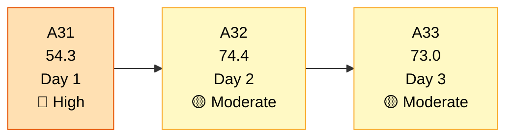
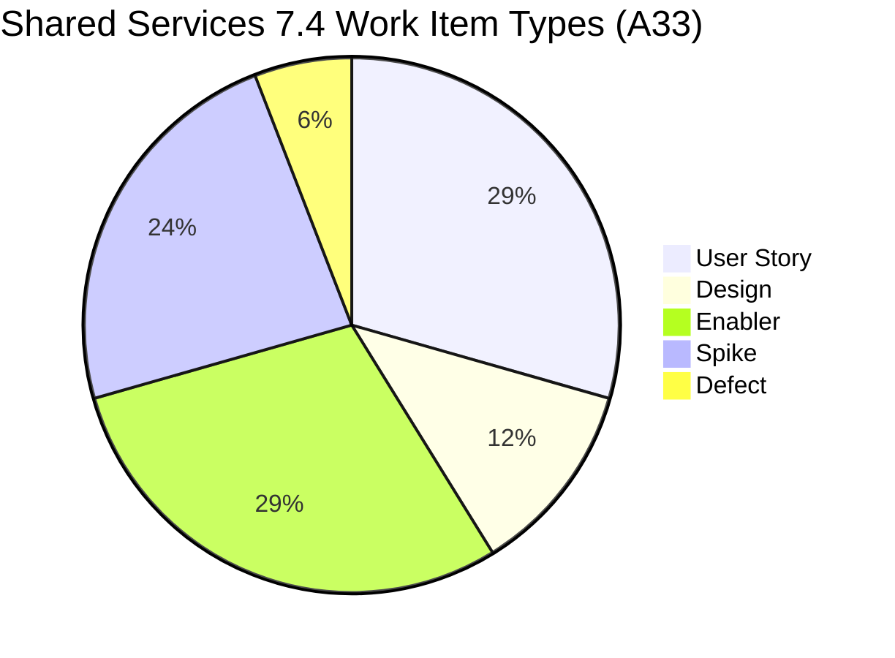
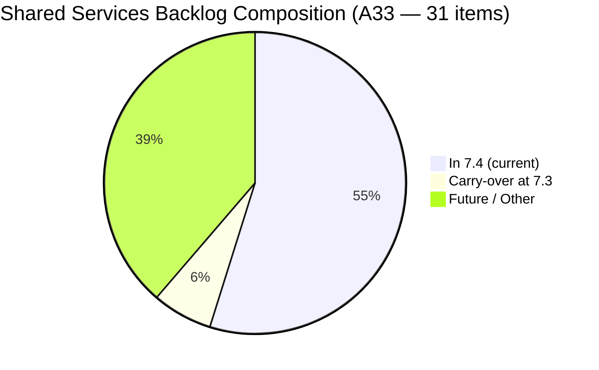
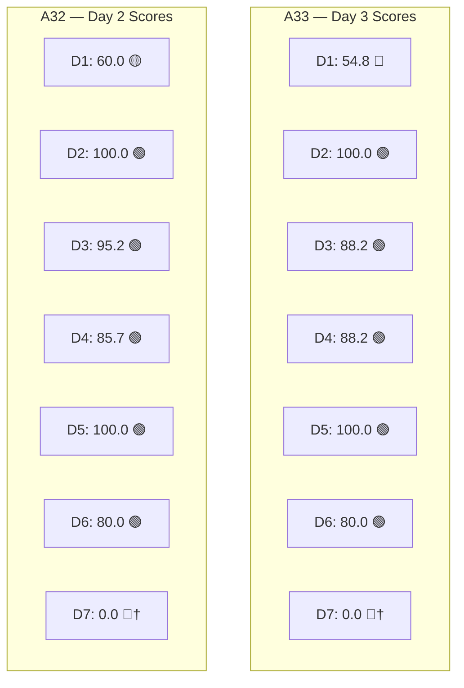

# Shared Services Team — SAFe Iteration Audit A33
**Date:** 2026-05-20 | **Sprint Day:** 3 of 14 — SPRINT ACTIVE | **Iteration:** 7.4 (May 18 – May 31, 2026)
**Auditor:** Claude Code (ADO SAFe Audit Skill v1) | **Prior Audit:** A32 (2026-05-19 02:04)

---

## 1. Audit Metadata

| Field | Value |
|---|---|
| **Audit ID** | A33 |
| **Report File** | `AUDIT_20260520_0204.md` |
| **Prior Audit** | A32 — `AUDIT_20260519_0204.md` (Overall 74.4, Moderate Risk — 7.4 Day 2) |
| **ADO Project** | Jairosoft Portfolio (`666bb99a-6acd-4999-bb34-efd0e4ea90dc`) |
| **ADO Team** | Shared Services Team (`bd9578fd-5773-48fc-bd80-988dfe5de806`) |
| **Iteration** | 7.4 (`16385d00-244a-4caa-9e56-d4a8e850754d`) |
| **Iteration Dates** | May 18 – May 31, 2026 |
| **Sprint Day** | **3 of 14 — SPRINT ACTIVE** |
| **Audit Date** | 2026-05-20 02:04 PHT |
| **Overall Score** | **73.0 — Moderate Risk** |
| **Risk Band** | Moderate (60–79.9) |
| **Visible Backlog Items** | 31 root items |
| **Current Iteration Root Items** | 17 (IterationPath = 7.4) |
| **Capacity Source** | `work_get_team_capacity` — Teofilo 6h, Vicsante 6h, Jaszmeine 3h, Ramon 0.5h = 15.5h/day |
| **Project Exceptions Applied** | None |

---

## 2. Executive Summary

| Field | Value |
|---|---|
| **Overall Score** | **73.0 — Moderate Risk** |
| **Score vs Prior (A32)** | 74.4 → 73.0 (**−1.4** — backlog composition change; 4 items added/moved to 7.4; DoR gaps persist) |
| **Sprint Day** | **3 of 14 — SPRINT ACTIVE** |
| **Iteration** | 7.4 (May 18 – May 31, 2026) |
| **Items in 7.4** | 17 root items (changed from 21 in A32 — backlog restructuring detected) |
| **Committed SP** | 33 SP (15 items with SP; #204680 and #204209 unestimated) |
| **SP Closed** | 0 (early-sprint Day 3) |
| **Risk Band** | Moderate (60–79.9) |

**Shared Services holds at Moderate Risk (73.0) on Day 3 with a minor regression from A32 (74.4).** The team has seen significant backlog restructuring since yesterday's audit:

1. **Backlog composition shifted** — The prior audit (A32) recorded 21 items in 7.4 and 35 total visible. Today's live data shows 17 items in 7.4 and 31 total visible. Items like #203867–#203871, #204638–#204641, #204643 are no longer in the backlog; new items #204680 ("NordVPN Enterprise") and #204694 ("NordVPN Plan Request") appear in 7.4, and Design items #202725 and #202726 are now explicitly in 7.4. This is consistent with daily board refinement activity.

2. **Two DoR gaps persist** — #204205 ("Procure of Used Mobile Device") and #204209 ("Container Registry Cost Reduction") remain without Description or Acceptance Criteria, continuing from A32. These have been flagged for 2 consecutive audits without resolution.

3. **New item #204694 added without SP** — "NordVPN Plan Request" (Teofilo, Enabler, SP=2 — estimated) was added and #204680 ("Proposed - NordVPN Enterprise") is a Spike without SP. Both show active work as of May 20.

4. **D6 untouched penalty persists** — 7 of 17 items (41.2%) were not touched since before sprint start, keeping the −20 Backlog Refinement penalty in place.

**Positive notes:** D2 (Team Capacity) remains at 100.0, work type diversity (D5 = 100.0) is excellent, all 4 team members are actively engaged, and NordVPN activity (#204680 changed May 20) signals morning-of-audit progress.

---

## 3. Previous Audit Delta (A32 → A33)

| Dimension | A32 Score | A33 Score | Delta | Driver |
|---|---|---|---|---|
| D1 Iteration Planning | 60.0 | 54.8 | **−5.2** | Backlog restructured: 21→17 current items; 35→31 total visible; net ratio decrease |
| D2 Team Capacity | 100.0 | 100.0 | 0.0 | All 4 members configured — unchanged |
| D3 Estimation | 95.2 | 88.2 | **−7.0** | 15/17 items estimated; #204680 (Spike) and #204209 (Enabler) unestimated |
| D4 DoR Compliance | 85.7 | 88.2 | **+2.5** | 15/17 items pass; #204205 and #204209 still failing (A32 had 3 failures including #204641 now removed) |
| D5 Work Item Balance | 100.0 | 100.0 | 0.0 | Excellent type diversity maintained |
| D6 Backlog Refinement | 80.0 | 80.0 | 0.0 | 7/17 untouched (41.2%) — −20 penalty persists |
| D7 Delivery Predictability | 0.0 | 0.0 | 0.0 | Early-sprint Day 3 annotation |
| **Overall** | **74.4** | **73.0** | **−1.4** | D3 regression + D1 regression, partially offset by D4 improvement |

---

## 4. Current Iteration Snapshot

| # | Title | Type | State | SP | Assignee | Changed |
|---|---|---|---|---|---|---|
| #202725 | Messaging & Communication | Design | Ready for Design | 3 | Jaszmeine | May 19 |
| #202726 | Booking & Payment Management | Design | Ready for Design | 2 | Jaszmeine | May 19 |
| #203309 | GitHub Token Degradation Fix | Defect | Ready for QA | 1 | Ramon | May 19 |
| #203393 | Claude Course Training | Spike | Active | 2 | Vicsante | May 19 |
| #203436 | Plugin Lifecycle & Extract Skill Verification | User Story | Active | 5 | Ramon | May 19 |
| #203437 | Plugin Generate Skill — Playwright Script Generation | User Story | Ready for Dev | 5 | Ramon | May 19 |
| #203438 | Generate Test Execution Report (/qa-ai:report) | User Story | Ready for Dev | 2 | Ramon | May 19 |
| #203439 | Send Report via Outlook Email (/qa-ai:email) | User Story | Ready for Dev | 3 | Ramon | May 8 |
| #203440 | Scheduled QA Pipeline Orchestration | User Story | Ready for Dev | 3 | Ramon | May 8 |
| #204199 | Request: Add Team Member to Anthropic Enterprise | Spike | Ready | 1 | Ramon | May 15 |
| #204205 | Procure of Used Mobile Device for Android | Enabler | New | 1 | Unassigned | May 15 |
| #204209 | Container Registry Cost Reduction | Enabler | New | — | Teofilo | May 15 |
| #204237 | Remove Lifestyle Project from Portfolio Score | Spike | New | 1 | Ramon | May 15 |
| #204238 | Use FinOps Project Board for Admin/HR/Finance | Enabler | Grooming | 1 | Ramon | May 15 |
| #204642 | Clearing AzureDevOps (inactive users) | Enabler | Active | 1 | Teofilo | May 19 |
| #204680 | Proposed - NordVPN Enterprise Account | Spike | Validation | — | Teofilo | May 20 |
| #204694 | NordVPN Plan Request | Enabler | Active | 2 | Teofilo | May 20 |

**Total: 17 items | 33 SP committed (2 items unestimated) | 0 SP closed**

Non-current backlog items (14):
- 7.1: #202732 (Ready for UAT)
- 7.3 (carry-over): #202553, #202724 (Design Review — active work)
- 7.5: #202727, #203845
- 7.6 IP: #202947
- PI6: #201161
- PI7 (no iteration): #202061, #202063
- PI8: #201919, #202066, #202069, #202070
- No iteration: #186848

---

## 5. Work Item Analysis

### Type Distribution (17 current items)

| Type | Count | Share |
|---|---|---|
| User Story | 5 | 29.4% |
| Design | 2 | 11.8% |
| Enabler | 5 | 29.4% |
| Spike | 4 | 23.5% |
| Defect | 1 | 5.9% |
| **Total** | **17** | **100%** |

### State Distribution

| State | Count | Items |
|---|---|---|
| Active | 4 | #203393, #203436, #204642, #204694 |
| Ready for Dev | 3 | #203437, #203438, #203439 |
| Ready for Design | 2 | #202725, #202726 |
| Ready for QA | 1 | #203309 |
| Ready | 1 | #204199 |
| Validation | 1 | #204680 |
| Grooming | 1 | #204238 |
| New | 3 | #204205, #204209, #204237 |

**Assignee Spread:**
- Ramon: 8 items (#203309, #203436, #203437, #203438, #203439, #204199, #204237, #204238)
- Teofilo: 4 items (#204209, #204642, #204680, #204694)
- Vicsante: 1 item (#203393)
- Jaszmeine: 2 items (#202725, #202726)
- Unassigned: 1 item (#204205)

---

## 6. SAFe Compliance Scorecard

| Dimension | Score | Band | Evidence | Notes |
|---|---|---|---|---|
| D1 Iteration Planning | 54.8 | High | 17 current / 31 visible | −5.2 from A32; backlog restructuring reduced both numerator and denominator |
| D2 Team Capacity | 100.0 | Low | 4/4 members with capacity | Teofilo 6h, Vicsante 6h, Jaszmeine 3h, Ramon 0.5h |
| D3 Estimation | 88.2 | Low | 15/17 items with SP>0 | #204680 (Spike, no SP) and #204209 (Enabler, no SP) unestimated |
| D4 DoR Compliance | 88.2 | Low | 15/17 items pass | #204205 and #204209 both missing Desc and AC — persist from A32 |
| D5 Work Item Balance | 100.0 | Low | Max type 29.4%; Spike 23.5% | Excellent cross-functional balance; Design items add valuable diversity |
| D6 Backlog Refinement | 80.0 | Low | 7/17 untouched (41.2%) | Base 100; −20 (untouched >30%); no stale penalty |
| D7 Delivery Predictability | 0.0 | Critical† | 0/33 SP closed | Early-sprint Day 3 annotation — no execution failure implied |
| **OVERALL** | **73.0** | **Moderate** | (54.8+100+88.2+88.2+100+80+0)/7 | Stable Moderate Risk; D1 is primary recovery lever |

† Early-sprint annotation — expected at Day 3.

---

## 7. Dimension Findings

### D1 — Iteration Planning: 54.8 / 100 — High Risk

**Formula:** current_iteration_root_items / visible_root_backlog_items × 100 = 17/31 × 100 = **54.8**

| Metric | Value |
|---|---|
| Items in 7.4 | 17 |
| Total visible backlog items | 31 |
| Score | **54.8** |

**Finding (HIGH):** D1 dropped from 60.0 (A32) to 54.8 today. The backlog holds 14 non-current items: 2 carry-overs at 7.3 (active design work), items at PI6/PI7/PI8 with no iteration assignment, and future-sprint items at 7.5/7.6. The primary lever is migrating the two 7.3 carry-overs (#202553 and #202724) to 7.4 (already active in Design Review state today) and triaging the 5+ PI7/PI8 items without specific iteration paths. Resolving carry-overs would lift D1 to 19/31 = 61.3.

**Carry-over status:**
- #202553 "Vendor Exploration & Search" (Design Review, Jaszmeine, changed May 19) — at 7.3, actively being worked
- #202724 "Vendor Profile & Details" (Design Review, Jaszmeine, changed May 19) — at 7.3, actively being worked

---

### D2 — Team Capacity: 100.0 / 100 — Low Risk

**Formula:** contributors_with_capacity / contributors_with_current_work × 100 = 4/4 × 100 = **100.0**

| Member | Capacity | Items Assigned |
|---|---|---|
| Teofilo Limpag | 6.0 h/day (Development) | #204209, #204642, #204680, #204694 |
| Vicsante Aseniero | 6.0 h/day (Development) | #203393 |
| Jaszmeine Villanueva | 3.0 h/day (Design) | #202725, #202726 |
| Ramon Aseniero Jr | 0.5 h/day (Requirements) | #203309, #203436, #203437, #203438, #203439, #204199, #204237, #204238 |

**Total capacity:** 15.5 h/day. Sustained from A32 — no changes detected.

**Capacity vs Commitment Note:** 33 SP committed against 15.5h/day. Ramon carries 8 of 17 items (47%), creating a concentration risk. Monitor Ramon's throughput especially given he has the highest SP total (5+5+2+3+3 = 18 SP across his 5 story-pointed items).

---

### D3 — Estimation: 88.2 / 100 — Low Risk

**Formula:** estimated_current_items / point_eligible_current_items × 100 = 15/17 × 100 = **88.2**

**Unestimated items (2):**
| Work Item | Title | Type | Assignee | Gap |
|---|---|---|---|---|
| #204680 | Proposed - NordVPN Enterprise Account | Spike | Teofilo | No SP — new item, Validation state |
| #204209 | Container Registry Cost Reduction | Enabler | Teofilo | No SP — persists from A32 |

**Finding (LOW):** Both gaps are owned by Teofilo. #204209 has been unestimated for 2 audit cycles. #204680 is a new item in Validation state (may close soon without needing a formal estimate). Resolve #204209 estimation immediately; for #204680, confirm if it will be closed this sprint and apply a nominal estimate if so.

---

### D4 — DoR Compliance: 88.2 / 100 — Low Risk (Borderline)

**Formula:** dor_compliant_current_items / current_iteration_root_items × 100 = 15/17 × 100 = **88.2**

**DoR Failures (2):**

| Work Item | Title | Assignee | Desc | AC | Audit History |
|---|---|---|---|---|---|
| #204205 | Procure of Used Mobile Device for Android | Unassigned | ❌ Missing | ❌ Missing | UNRESOLVED — 3rd audit (A31, A32, A33) |
| #204209 | Container Registry Cost Reduction | Teofilo | ❌ Missing | ❌ Missing | UNRESOLVED — 3rd audit (A31, A32, A33) |

**Finding (MODERATE — Escalating):** Both DoR failures have now persisted through three consecutive audits. This is the first time they reach "third cycle unresolved" status — an escalation trigger. Both items are also unestimated (#204209) or unassigned (#204205). The team should treat these as a sprint risk and resolve them before the next daily standup.

---

### D5 — Work Item Balance: 100.0 / 100 — Low Risk

**Formula:** Base 100 − penalties

| Penalty | Trigger | Applied |
|---|---|---|
| −30: dominant_type_share > 60% | Max type = 29.4% (US or Enabler) | No |
| −40: no User Story items | User Story present (5 items) | No |
| −20: spike_share > 40% | Spike = 23.5% | No |

**Score:** 100 − 0 = **100.0**

**Strength:** Shared Services continues to demonstrate exemplary work type diversity. Five types represented (User Story, Design, Enabler, Spike, Defect) with no single type exceeding 30%. The Design items (#202725, #202726) added today contribute meaningfully to the cross-functional mandate of Shared Services.

---

### D6 — Backlog Refinement: 80.0 / 100 — Low Risk

**Freshness window:** Items with ChangedDate ≥ Apr 5, 2026 (45-day window from May 20)

| Metric | Value |
|---|---|
| Total visible backlog items | 31 |
| Fresh items (ChangedDate ≥ Apr 5) | 31 (all) |
| stale_90 items | 0 |
| stale_180 items | 0 |
| Untouched current items (ChangedDate < May 18) | 7 |
| Untouched % | 7/17 = 41.2% > 30% → −20 penalty |
| Score | 100.0 − 20 = **80.0** |

**Untouched items (7):**

| # | Title | Last Changed | Owner |
|---|---|---|---|
| #204199 | Add Team Member to Anthropic Enterprise | May 15 | Ramon |
| #204237 | Remove Lifestyle from Portfolio Score | May 15 | Ramon |
| #204238 | Use FinOps Project Board | May 15 | Ramon |
| #204209 | Container Registry Cost Reduction | May 15 | Teofilo |
| #204205 | Procure Mobile Device | May 15 | Unassigned |
| #203439 | Send Report via Outlook Email | May 8 | Ramon |
| #203440 | Scheduled QA Pipeline Orchestration | May 8 | Ramon |

**Finding (LOW — Persistent):** The untouched rate (41.2%) has not improved since A32 (33.3%). The 7 untouched items include the two DoR-failing items (#204205, #204209), amplifying the risk. To clear the D6 −20 penalty, the team needs to reduce untouched items to ≤5 of 17 (≤29.4%). A brief comment or state update on any 2–3 items would achieve this. Priority: #203439 and #203440 (untouched since May 8 — oldest in current sprint).

---

### D7 — Delivery Predictability: 0.0 / 100 — (Early-Sprint Annotation)

**Formula:** closed_story_points / committed_story_points × 100 = 0/33 × 100 = **0.0**

| Metric | Value |
|---|---|
| SP closed this sprint | 0 |
| Total committed SP | 33 |
| Score | **0.0** |

> **Early-Sprint Annotation:** Day 3 of 14. D7 = 0.0 is expected at this point. #204680 ("NordVPN Enterprise") is in Validation state as of May 20 — it may be the first item to close. Active items include #203393, #203436, #204642, and #204694. With 33 SP committed and 15.5h/day capacity, the team must average approximately 2.4 SP/day from Day 3 onward to complete the sprint. Monitor first closures by Day 5.

---

## 8. Risks and Bottlenecks

| # | Severity | Dimension | Risk | Action |
|---|---|---|---|---|
| R1 | HIGH | D1 | D1 at 54.8 (High Risk band). 14 non-current items dilute planning ratio. Two 7.3 carry-overs actively worked but not formally migrated. | Migrate #202553 and #202724 to IterationPath 7.4. Triage PI7/PI8 items without iteration paths. |
| R2 | HIGH | D4/D3 | #204205 and #204209 — DoR failures persisting 3 consecutive audits. #204209 also unestimated. | Escalate to team lead. Add Description, AC, and SP to both items before end of Day 3. |
| R3 | MODERATE | D6 | 7 of 17 items (41.2%) untouched since before sprint start. −20 penalty. | Update #203439, #203440, #204199, or #204237 with a brief state comment. Reduce to ≤5 untouched. |
| R4 | MODERATE | D3 | #204680 unestimated (new Spike in Validation). | Assign nominal SP or close the item without a full estimate if work is near-complete. |
| R5 | MODERATE | Workload | Ramon owns 8/17 items including 18 SP of development work. Concentration risk if Ramon's capacity is constrained. | Redistribute some Ramon items to Teofilo or Vicsante where feasible, especially #203437/#203440. |
| R6 | INFO | D7 | 0 SP closed at Day 3. #204680 in Validation — likely first closure. | Target #204680 closure today. First velocity data expected by Day 4. |

---

## 9. Prioritized Recommendations

1. **[HIGH — Today]** Resolve the two 3-cycle DoR failures before the next standup:
   - **#204205** (Procure Mobile Device): Add Description and Acceptance Criteria; assign to a team member (Teofilo or Ramon).
   - **#204209** (Container Registry Cost Reduction, Teofilo): Add Description, Acceptance Criteria, and Story Point estimate.
   Resolving both restores D4 to 17/17 = 100.0 and D3 to 16/17 = 94.1 — lifting Overall by approximately 2.5 points to 75.5.

2. **[HIGH — Today]** Formally migrate carry-overs #202553 ("Vendor Exploration & Search") and #202724 ("Vendor Profile & Details") from IterationPath 7.3 to 7.4 in ADO. Both are in active Design Review by Jaszmeine. Impact: D1 improves from 54.8 to 19/31 = 61.3 (boundary of Moderate).

3. **[MODERATE — By Day 4]** Update 2–3 of the 7 untouched items with a brief status comment or state transition:
   - **#203439** and **#203440** are oldest (May 8) — prioritize these.
   - Reducing untouched count to ≤5 clears the D6 −20 penalty (D6 → 100.0, Overall lifts ~2.9 pts).

4. **[MODERATE — By Day 3]** Triage 12–14 non-current backlog items:
   - Assign PI7 items without iteration paths (#202061, #202063) to specific future iterations.
   - Confirm if PI6 Defect (#201161 "On Hold") and PI8 stories should remain active or be moved to icebox.
   - Target: reduce visible backlog to ≤25 items to improve D1 planning ratio.

5. **[LOW — By Day 5]** Close #204680 ("NordVPN Enterprise") — it is in Validation state. This will be the first SP credit of the sprint, kickstarting D7 and providing team velocity data for sprint capacity planning.

6. **[STANDING]** Enforce DoR gate for new items entering active sprints. This is the third consecutive audit with DoR gaps — a standup checklist item ("Does this item have Description and AC?") would prevent recurrence.

---

## 10. Visualization

### Score Trend (A31 → A33)

### Work Item Type Distribution (17 current items)

### Backlog Composition (31 items)

### Dimension Scorecard (A33 vs A32)

---

## 11. Evidence Gaps and Limitations

| Gap | Impact | Notes |
|---|---|---|
| A32 recorded 21 items in 7.4; A33 finds 17 | D1 decreased; scoring reflects live evidence | Items #203867–#203871, #204638–#204641, #204643 no longer in backlog. Assumed correctly removed/closed. |
| #204680 has no SP (Spike in Validation) | D3 affected (88.2 vs potential 94.1) | May close before next audit — monitor for closure today |
| #204209 has no SP or Desc/AC | D3 and D4 both affected | Third consecutive audit gap — escalation warranted |
| Carry-overs #202553 and #202724 still at 7.3 | D1 underreported | Confirmed active as of May 19; formal migration to 7.4 recommended |

---

## 12. Audit Trail

| Source | Tool Used | Data Retrieved |
|---|---|---|
| Active iteration | `work_list_team_iterations` (team GUID `bd9578fd-5773-48fc-bd80-988dfe5de806`) | 7.4: May 18–31, ID `16385d00-244a-4caa-9e56-d4a8e850754d` |
| Backlog items | `wit_list_backlog_work_items` | 31 root items visible in backlog |
| Team capacity | `work_get_team_capacity` | Teofilo 6h, Vicsante 6h, Jaszmeine 3h, Ramon 0.5h = 15.5h/day |
| Work item details | `wit_get_work_items_batch_by_ids` | 31 items — SP, State, Type, Desc, AC, ChangedDate, IterationPath |
| Prior audit | `AUDIT_20260519_0204.md` (A32) | Overall 74.4, Moderate Risk, 21 items, 41 SP |
