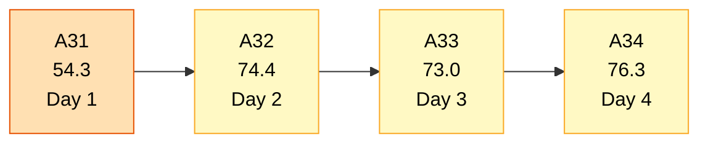
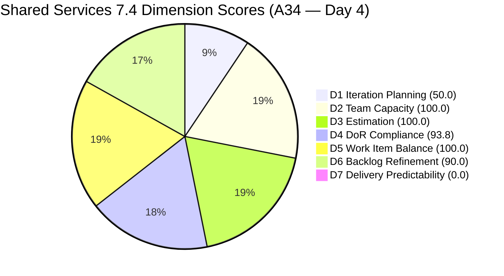
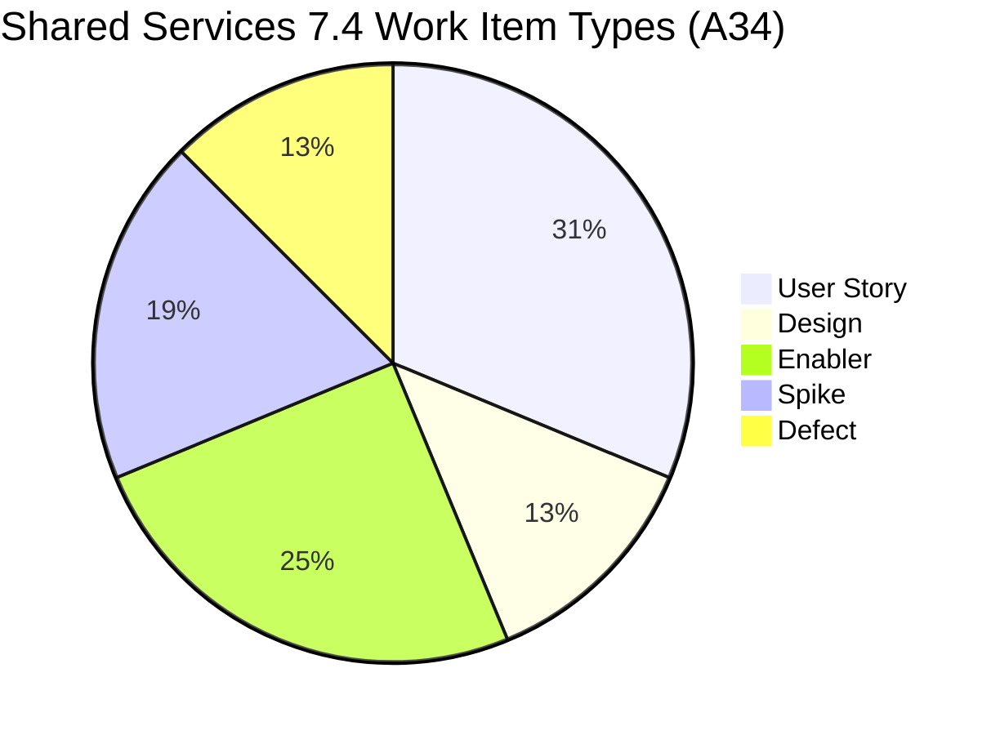
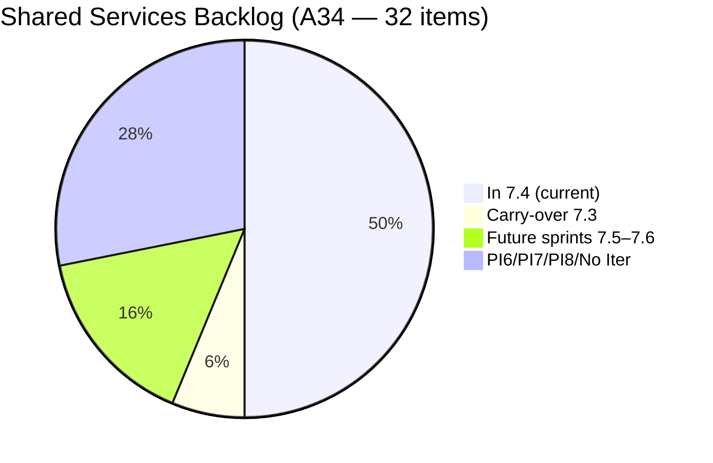
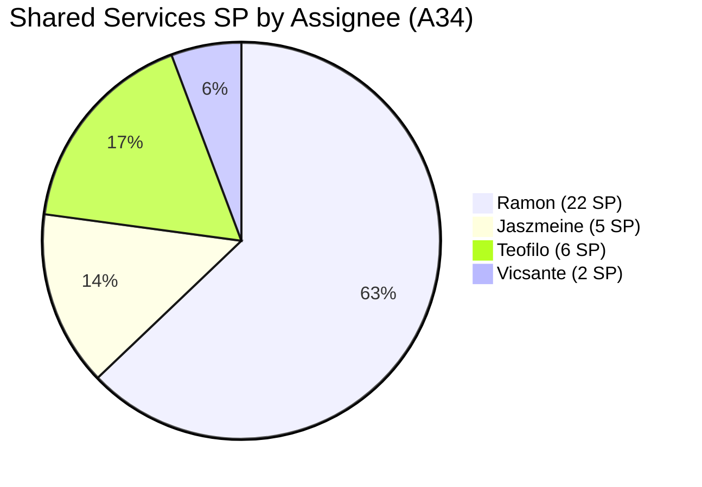

# Shared Services Team — SAFe Iteration Audit A34
**Date:** 2026-05-21 | **Sprint Day:** 4 of 14 — SPRINT ACTIVE | **Iteration:** 7.4 (May 18 – May 31, 2026)
**Auditor:** Claude Code (ADO SAFe Audit Skill v1) | **Prior Audit:** A33 (2026-05-20 02:04)

---

## 1. Audit Metadata

| Field | Value |
|---|---|
| **Audit ID** | A34 |
| **Report File** | `AUDIT_20260521_0915.md` |
| **Prior Audit** | A33 — `AUDIT_20260520_0204.md` (Overall 73.0, Moderate Risk — 7.4 Day 3) |
| **ADO Project** | Jairosoft Portfolio (`666bb99a-6acd-4999-bb34-efd0e4ea90dc`) |
| **ADO Team** | Shared Services Team (`bd9578fd-5773-48fc-bd80-988dfe5de806`) |
| **Iteration** | 7.4 (`16385d00-244a-4caa-9e56-d4a8e850754d`) |
| **Iteration Dates** | May 18 – May 31, 2026 |
| **Sprint Day** | **4 of 14 — SPRINT ACTIVE** |
| **Audit Date** | 2026-05-21 09:15 PHT |
| **Overall Score** | **76.3 — Moderate Risk** |
| **Risk Band** | Moderate (60–79.9) |
| **Visible Backlog Items** | 32 root items |
| **Current Iteration Root Items** | 16 (IterationPath = 7.4) |
| **Capacity Source** | `work_get_team_capacity` — Teofilo 6h, Vicsante 6h, Jaszmeine 3h, Ramon 0.5h = 15.5h/day |
| **Project Exceptions Applied** | None |

---

## 2. Executive Summary

| Field | Value |
|---|---|
| **Overall Score** | **76.3 — Moderate Risk** |
| **Score vs Prior (A33)** | 73.0 → 76.3 (**+3.3** — backlog restructuring; 3 new items added; DoR failures de-scoped) |
| **Sprint Day** | **4 of 14 — SPRINT ACTIVE** |
| **Iteration** | 7.4 (May 18 – May 31, 2026) |
| **Items in 7.4** | 16 root items |
| **Committed SP** | 35 SP (all 16 items estimated) |
| **SP Closed** | 0 (early-sprint Day 4) |
| **Risk Band** | Moderate (60–79.9) |

**Shared Services improves from 73.0 to 76.3 on Day 4, but the improvement narrative requires honest framing.** The score gains are driven primarily by backlog restructuring, not by the team resolving the issues flagged in A33:

**Changes since A33:**
1. **Two persistent DoR failures de-scoped** — #204205 ("Procure Mobile Device") moved to 7.5 and #204209 ("Container Registry Cost Reduction") moved to 7.6 IP. Both were flagged for 3 consecutive audits in A33 without resolution. They have not been fixed — they have been removed from the current sprint. D4 improved from 88.2 to 93.8 because these items are no longer in scope, not because they were remediated.
2. **Three new items added to 7.4 today (May 21):** #204757 ("Asnari Access with GitHub — blocker defect", Teofilo, Active), #204780 ("AutoAllies DB Backup in BLOB Storage", Teofilo, Active), and #204781 ("Setup Bubble Training Room", Teofilo, Active). All three are active as of this morning.
3. **#204681 and #204694 (NordVPN items from A33)** no longer appear in the backlog — assumed closed or removed.
4. **D4 new gap:** #204781 ("Setup Bubble Training Room") has a Description of only ~18 non-whitespace characters ("Setup 25 machine in 2f") — below the 30-char threshold. One new DoR failure replaces the two that were removed.
5. **Untouched items dropped from 7 to 3** — D6 improves from 80.0 to 90.0.

**Ongoing strengths:** D2 remains 100.0 (all 4 members configured), D3 improved to 100.0 (no unestimated items in 7.4), D5 maintains 100.0 (excellent type diversity), and team activity is evident on all new items this morning.

**Primary concern:** D1 (50.0) remains the critical weak point with 16 of 32 backlog items outside the current sprint. The two 7.3 carry-overs (#202553 and #202724) remain at 7.3 despite active work by Jaszmeine.

---

## 3. Previous Audit Delta (A33 → A34)

| Dimension | A33 Score | A34 Score | Delta | Driver |
|---|---|---|---|---|
| D1 Iteration Planning | 54.8 | 50.0 | **−4.8** | 16 current / 32 visible; 1 new item added, 1 item added to backlog total (+1 each); #204757, #204780, #204781 added to 7.4 (net +3 current), but backlog grew by 3 as well |
| D2 Team Capacity | 100.0 | 100.0 | 0.0 | All 4 members configured — unchanged |
| D3 Estimation | 88.2 | 100.0 | **+11.8** | #204205 and #204209 (unestimated items) moved out of 7.4; 3 new items (#204757, #204780, #204781) are all estimated |
| D4 DoR Compliance | 88.2 | 93.8 | **+5.6** | #204205 and #204209 (DoR failures) moved out; #204781 is new DoR failure (Desc 18 chars) — net improvement |
| D5 Work Item Balance | 100.0 | 100.0 | 0.0 | Excellent type diversity maintained; 5 types represented |
| D6 Backlog Refinement | 80.0 | 90.0 | **+10.0** | Untouched dropped from 7 to 3 (18.75% — between 10–30% → −10 vs prior −20) |
| D7 Delivery Predictability | 0.0 | 0.0 | 0.0 | Early-sprint Day 4 annotation |
| **Overall** | **73.0** | **76.3** | **+3.3** | D3 and D6 gains; D4 minor improvement; D1 minor regression |

---

## 4. Current Iteration Snapshot

| # | Title | Type | State | SP | Assignee | Changed |
|---|---|---|---|---|---|---|
| #202725 | Messaging & Communication | Design | Ready for Design | 3 | Jaszmeine | May 19 |
| #202726 | Booking & Payment Management | Design | Ready for Design | 2 | Jaszmeine | May 19 |
| #203309 | GitHub Token Degradation Fix | Defect | Ready for QA | 1 | Ramon | May 19 |
| #203393 | Claude Course Training | Spike | Active | 2 | Vicsante | May 19 |
| #203436 | Plugin Lifecycle & Extract Skill Verification | User Story | Active | 5 | Ramon | May 19 |
| #203437 | Plugin Generate Skill — Playwright Script Generation | User Story | Ready for Dev | 5 | Ramon | May 19 |
| #203438 | Generate Test Execution Report (/qa-ai:report) | User Story | Ready for Dev | 2 | Ramon | May 19 |
| #203439 | Send Report via Outlook Email (/qa-ai:email) | User Story | Ready for Dev | 3 | Ramon | May 8 |
| #203440 | Scheduled QA Pipeline Orchestration | User Story | Ready for Dev | 3 | Ramon | May 8 |
| #204199 | Request: Add Team Member to Anthropic Enterprise | Spike | Ready | 1 | Ramon | May 15 |
| #204237 | Remove Lifestyle Project from Portfolio Score | Spike | New | 1 | Ramon | May 21 |
| #204238 | Use FinOps Project Board for Admin/HR/Finance | Enabler | Grooming | 1 | Ramon | May 21 |
| #204642 | Clearing AzureDevOps (inactive users) | Enabler | Active | 1 | Teofilo | May 19 |
| #204757 | Asnari Access with GitHub has been removed | Defect | Active | 1 | Teofilo | May 21 |
| #204780 | Backup AutoAllies DB in BLOB Storage 05/21/2026 | Enabler | Active | 1 | Teofilo | May 21 |
| #204781 | Setup Bubble Training Room | Enabler | Active | 3 | Teofilo | May 21 |

**Total: 16 items | 35 SP committed | 0 SP closed**

Non-current backlog items (16 items):
- 7.1: #202732 (Enabler — Ready for UAT)
- 7.3 (carry-over): #202553 (Vendor Exploration, Design Review, active), #202724 (Vendor Profile, Design Review, active)
- 7.5: #202727, #203845, #204205 (de-scoped from 7.4)
- 7.6 IP: #202947, #204209 (de-scoped from 7.4)
- PI6: #201161
- PI7 (no iter): #202061, #202063
- PI8: #201919, #202066, #202069, #202070
- No iteration: #186848

---

## 5. Work Item Analysis

### Type Distribution (16 current items)

| Type | Count | Share |
|---|---|---|
| User Story | 5 | 31.3% |
| Design | 2 | 12.5% |
| Enabler | 4 | 25.0% |
| Spike | 3 | 18.8% |
| Defect | 2 | 12.5% |
| **Total** | **16** | **100%** |

### State Distribution

| State | Count | Items |
|---|---|---|
| Active | 6 | #203393, #203436, #204642, #204757, #204780, #204781 |
| Ready for Dev | 3 | #203437, #203438, #203440 |
| Ready for Design | 2 | #202725, #202726 |
| Ready for QA | 1 | #203309 |
| Ready | 1 | #204199 |
| Grooming | 1 | #204238 |
| New | 2 | #204237, #203439* |

*#203439 shows "Ready for Dev" state in ADO — see state column above.

### Assignee Distribution

| Assignee | Items | SP |
|---|---|---|
| Ramon | 9 | #203309(1), #203436(5), #203437(5), #203438(2), #203439(3), #203440(3), #204199(1), #204237(1), #204238(1) = **22 SP** |
| Teofilo | 4 | #204642(1), #204757(1), #204780(1), #204781(3) = **6 SP** |
| Vicsante | 1 | #203393(2) = **2 SP** |
| Jaszmeine | 2 | #202725(3), #202726(2) = **5 SP** |

**Concentration note:** Ramon owns 9/16 items (56%) and 22/35 SP (63%). This concentration risk persists from A33 and warrants monitoring.

---

## 6. SAFe Compliance Scorecard

| Dimension | Score | Band | Evidence | Notes |
|---|---|---|---|---|
| D1 Iteration Planning | 50.0 | High | 16 current / 32 visible | −4.8 from A33; backlog grew (+3 new items) at same rate as current; carry-overs and PI8 items persist |
| D2 Team Capacity | 100.0 | Low | 4/4 members with capacity | Teofilo 6h, Vicsante 6h, Jaszmeine 3h, Ramon 0.5h = 15.5h/day |
| D3 Estimation | 100.0 | Low | 16/16 items estimated | All items have SP>0; major improvement from A33 (88.2); problematic items moved out |
| D4 DoR Compliance | 93.8 | Low | 15/16 items pass | #204781 fails: Desc = "Setup 25 machine in 2f" (18 chars < 30 threshold); AC passes |
| D5 Work Item Balance | 100.0 | Low | Max type 31.3%; Spike 18.8% | 5 types represented; no single type >60%; no spike excess |
| D6 Backlog Refinement | 90.0 | Low | 3/16 untouched (18.75%) | Base 100; −10 (untouched 10–30%); no stale penalty; improvement from A33 (80.0) |
| D7 Delivery Predictability | 0.0 | Critical† | 0/35 SP closed | Early-sprint Day 4 annotation — no execution failure implied |
| **OVERALL** | **76.3** | **Moderate** | (50.0+100+100+93.8+100+90+0)/7 | Highest score of 7.4 sprint to date |

† Early-sprint annotation — expected at Day 4. Per rubric, Day 1–5 qualifies for low-delivery annotation.

---

## 7. Dimension Findings

### D1 — Iteration Planning: 50.0 / 100 — High Risk

**Formula:** current_iteration_root_items / visible_root_backlog_items × 100 = 16/32 × 100 = **50.0**

| Metric | Value |
|---|---|
| Items in 7.4 | 16 |
| Total visible backlog items | 32 |
| Score | **50.0** |

**Finding (HIGH — Persistent):** D1 fell further from A33 (54.8 → 50.0). The backlog now has exactly 16 items in 7.4 and 16 outside. Three new items (#204757, #204780, #204781) were added to 7.4 today, but the total backlog also grew by ~3 items, keeping the ratio at exactly 50%. The core problem is a large tail of non-current items:

| Non-Current Group | Count | Action Needed |
|---|---|---|
| 7.3 carry-overs (#202553, #202724) | 2 | Active work — migrate to 7.4 |
| 7.1 (#202732 — Ready for UAT) | 1 | Close or move to 7.4 |
| Future sprints (7.5–7.6 IP) | 5 | Correctly staged — no action |
| PI7 no-iteration (#202061, #202063) | 2 | Assign to specific iteration |
| PI6/PI8 items (6 items) | 6 | Triage: icebox or assign future PI |
| No iteration (#186848) | 1 | Assign or archive |

**Highest-value fix:** Migrating #202553 and #202724 (7.3 Design carry-overs, both in active Design Review by Jaszmeine) to 7.4 would bring D1 to 18/32 = 56.3. Triaging 4–5 PI7/PI8/no-iteration items as icebox (removing from active backlog) would further improve the ratio.

---

### D2 — Team Capacity: 100.0 / 100 — Low Risk

**Formula:** contributors_with_capacity / contributors_with_current_work × 100 = 4/4 × 100 = **100.0**

| Member | Capacity | Items Assigned |
|---|---|---|
| Teofilo Limpag | 6.0 h/day (Development) | #204642, #204757, #204780, #204781 |
| Vicsante Aseniero | 6.0 h/day (Development) | #203393 |
| Jaszmeine Abigaille Villanueva | 3.0 h/day (Design) | #202725, #202726 |
| Ramon Aseniero Jr | 0.5 h/day (Requirements) | #203309, #203436, #203437, #203438, #203439, #203440, #204199, #204237, #204238 |

**Total capacity:** 15.5 h/day — unchanged from A33.

**Capacity vs Commitment Note:** 35 SP across 15.5h/day. Ramon carries 22 SP (63% of total committed points) on 0.5h/day capacity — a significant concentration risk. Note that Teofilo is now the most active contributor today with 3 new items all showing Active state as of May 21 morning.

---

### D3 — Estimation: 100.0 / 100 — Low Risk

**Formula:** estimated_current_items / point_eligible_current_items × 100 = 16/16 × 100 = **100.0**

Full recovery from A33 (88.2 → 100.0). The two previously unestimated items (#204680 Spike and #204209 Enabler) have left 7.4 scope. All 3 new items (#204757, #204780, #204781) carry Story Points. No estimation gaps in the current sprint.

---

### D4 — DoR Compliance: 93.8 / 100 — Low Risk

**Formula:** dor_compliant_current_items / current_iteration_root_items × 100 = 15/16 × 100 = **93.8**

**DoR Failures (1):**

| Work Item | Title | Assignee | Desc | AC | Issue |
|---|---|---|---|---|---|
| #204781 | Setup Bubble Training Room | Teofilo | **FAIL** (18 chars: "Setup 25 machine in 2f") | Pass | Desc below 30 non-whitespace char threshold |

**Context:** #204781 was added to 7.4 today (May 21). The description is a placeholder-level entry and does not meet the DoR threshold. The Acceptance Criteria ("Machines should work and perform the bubble training requirement") is borderline but passes the 20-char minimum.

**Comparison with A33:** In A33, DoR failures (#204205 and #204209) were resolved by moving those items out of 7.4 — not by fixing them. The team should not repeat this pattern with #204781. The item is actively being worked by Teofilo and warrants a proper description.

**Escalation note:** A33 saw DoR failures persist for 3 consecutive audit cycles. A34 has one new DoR failure on a freshly added item — resolve within this sprint day.

---

### D5 — Work Item Balance: 100.0 / 100 — Low Risk

**Formula:** Base 100 − penalties

| Penalty | Trigger | Applied |
|---|---|---|
| −30: dominant_type_share > 60% | Max type = User Story at 31.3% | No |
| −40: no User Story items | User Story present (5 items) | No |
| −20: spike_share > 40% | Spike = 18.8% | No |

**Score:** 100 − 0 = **100.0**

**Strength:** Shared Services continues to demonstrate exemplary work type diversity. Five types are represented (User Story, Design, Enabler, Spike, Defect). The two new Enablers (#204780, #204781) and Defect (#204757) added today contribute to Teofilo's domain (infrastructure, IT operations) and enhance diversity. This remains a key differentiator from OTP's type-imbalanced backlog.

---

### D6 — Backlog Refinement: 90.0 / 100 — Low Risk

**Freshness window:** Items with ChangedDate ≥ Apr 6, 2026 (45-day window from May 21)

| Metric | Value |
|---|---|
| Total visible backlog items | 32 |
| Fresh items (ChangedDate ≥ Apr 6) | 32 (all — oldest is #186848 at Apr 15) |
| stale_90 items (ChangedDate < Feb 20) | 0 |
| stale_180 items | 0 |
| Untouched current items (ChangedDate < May 18) | 3 |
| Untouched % | 3/16 = 18.75% — between 10–30% → −10 penalty |
| Score | 100.0 − 10 = **90.0** |

**Untouched items (3):**

| # | Title | Last Changed | Owner |
|---|---|---|---|
| #203439 | Send Report via Outlook Email | May 8 | Ramon |
| #203440 | Scheduled QA Pipeline Orchestration | May 8 | Ramon |
| #204199 | Add Team Member to Anthropic Enterprise | May 15 | Ramon |

**Improvement from A33:** Untouched count dropped from 7 to 3 (41.2% → 18.75%). This crossed the 30% boundary (−20 penalty) into the 10–30% zone (−10 penalty), improving D6 by 10.0 points.

**Path to D6 = 100.0:** Update any 1 of the 3 untouched items before the next audit. Priority: #203439 or #203440 (untouched since May 8 — the oldest items in the sprint). A brief state comment or state transition would qualify.

---

### D7 — Delivery Predictability: 0.0 / 100 — (Early-Sprint Annotation)

**Formula:** closed_story_points / committed_story_points × 100 = 0/35 × 100 = **0.0**

| Metric | Value |
|---|---|
| SP closed this sprint | 0 |
| Total committed SP | 35 |
| Score | **0.0** |

> **Early-Sprint Annotation:** Day 4 of 14. D7 = 0.0 is expected in the first 5 sprint days and does not reflect execution failure. With 35 SP committed and 15.5h/day team capacity, 10 remaining sprint days provide ~155 hours of team capacity. Active items today include #203393, #203436, #204642, #204757, #204780, and #204781 — showing broad team engagement. Monitor first closures by Day 5–6. Target: at least 8–10 SP (20–29% of committed) closed by Day 7 to establish velocity visibility.
>
> **First closure candidates:** #204757 ("Asnari Access" defect — Active, blocker, Teofilo) and #204199 ("Add Team Member to Anthropic" — Ready, Ramon) are near-complete items best positioned to yield the first SP credits.

---

## 8. Risks and Bottlenecks

| # | Severity | Dimension | Risk | Action |
|---|---|---|---|---|
| R1 | HIGH | D1 | D1 at 50.0 — exactly half the backlog is outside the current sprint. 7.3 carry-overs (#202553, #202724) are actively worked but not formally migrated. PI7/PI8/no-iter items dilute the ratio. | Migrate #202553 and #202724 to IterationPath 7.4. Triage 6 PI7/PI8/no-iter items: archive or assign to specific future iterations. |
| R2 | MODERATE | D4 | #204781 ("Setup Bubble Training Room") has Description of only 18 chars — fails DoR. New item, active, added today. | Expand #204781 Description to ≥30 non-whitespace chars describing the training room setup requirements (scope, machine specs, acceptance criteria). |
| R3 | MODERATE | Workload | Ramon owns 9/16 items (56%) and 22/35 SP (63%) on 0.5h/day capacity. Throughput concentration risk. | Redistribute 1–2 Ramon items to Teofilo or Vicsante where technically feasible (e.g., #203437, #203440 with dev capacity). |
| R4 | LOW | D6 | 3 items untouched since before sprint start (#203439, #203440 since May 8; #204199 since May 15). −10 penalty persists. | Update any 1 of the 3 untouched items with a brief state comment. Prioritize #203439 or #203440 (oldest). Clears D6 to 100.0. |
| R5 | INFO | D3/D4 | #204205 ("Procure Mobile Device") and #204209 ("Container Registry Cost Reduction") were moved out of 7.4 rather than fixed. They are now in 7.5 and 7.6 IP respectively — still without Description or AC in their current ADO fields. | Fix DoR gaps on #204205 and #204209 before they reach their new target iterations (7.5 and 7.6 IP). |
| R6 | INFO | D7 | 0 SP closed at Day 4. No velocity data yet. | First closure by Day 5–6. Priority: #204757 (Active blocker) and #204199 (Ready). |

---

## 9. Prioritized Recommendations

1. **[HIGH — Today]** Fix the DoR gap on #204781 ("Setup Bubble Training Room", Teofilo). Expand Description from "Setup 25 machine in 2f" (18 chars) to at least 30 non-whitespace characters describing the setup scope (25 machines, floor 2, Bubble training requirements). This restores D4 to 16/16 = 100.0 and lifts Overall from 76.3 to 77.7.

2. **[HIGH — By Day 5]** Formally migrate carry-overs #202553 ("Vendor Exploration & Search") and #202724 ("Vendor Profile & Details") from IterationPath 7.3 to 7.4 in ADO. Both are in active Design Review by Jaszmeine — the work is happening in 7.4, the path label is wrong. Impact: D1 improves from 50.0 to 18/32 = 56.3.

3. **[HIGH — By Day 5]** Triage 6+ non-current items that are stale or unassigned:
   - #186848 ("Apollo.ai and LinkedIn Integration", no iteration) — assign to a specific PI or icebox
   - #202061, #202063 (PI7, no iteration, "Install Jodex via Cargo" and "Support Update Mechanism") — assign to 7.5 or PI8
   - #201161 (PI6 Defect, "On Hold") — confirm whether this should remain active or be parked
   - Reducing visible backlog from 32 to 26–28 items would lift D1 toward 60+ (Moderate threshold)

4. **[MODERATE — By Day 5]** Update 1 of 3 untouched items to clear the D6 −10 penalty:
   - **#203439** or **#203440** (unchanged since May 8) — a brief state comment or "Ready for Dev → Active" transition qualifies. Clears D6 from 90.0 → 100.0, lifting Overall by ~1.4 pts.

5. **[MODERATE — By Sprint End]** Address the workload concentration: Ramon holds 63% of committed SP on 0.5h/day capacity. Consider reassigning #203437 ("Plugin Generate Skill — Playwright") or #203440 ("Scheduled QA Pipeline") to Teofilo or Vicsante, who each have 6h/day Development capacity and lower item counts.

6. **[STANDING — For A35+]** Enforce DoR gate before new items enter active sprints. A34 adds one new DoR failure (#204781) on the same day items were added. A standup checklist item ("Does this item have ≥30 chars Description and ≥20 chars AC?") would prevent recurrence across both new and carry-over items.

---

## 10. Visualization

### Score Trend (A31 → A34)

### Dimension Scorecard (A34)

### Work Item Type Distribution (16 current items)

### Backlog Composition (32 items)

### Assignee SP Distribution (35 SP total)

---

## 11. Evidence Gaps and Limitations

| Gap | Impact | Notes |
|---|---|---|
| #204205 and #204209 moved out of 7.4, not fixed | D4 improved by removal, not remediation | Both items still lack Description and AC in their new iteration paths (7.5 and 7.6 IP). Will resurface in future audits. |
| #204680 and #204694 (NordVPN items from A33) not in backlog | Minor backlog count change | Assumed closed or removed. No DoR or score impact. |
| #204781 Description = 18 chars | D4 scored as failure; 1 item gap | Added same-day as audit; Teofilo is active on item. Recommend same-day fix. |
| D7 = 0 at Day 4 | Expected; annotated | Early-sprint Day 4 annotation applied per rubric. |
| Ramon holds 63% of SP on 0.5h/day | Throughput constraint not scored directly | Not a rubric dimension but noted as structural risk for sprint delivery. |

---

## 12. Audit Trail

| Source | Tool Used | Data Retrieved |
|---|---|---|
| Active iteration | `work_list_team_iterations` (team GUID `bd9578fd-5773-48fc-bd80-988dfe5de806`) | 7.4: May 18–31, ID `16385d00-244a-4caa-9e56-d4a8e850754d` |
| Backlog items | `wit_list_backlog_work_items` (backlogId `Microsoft.RequirementCategory`) | 32 root items visible in backlog |
| Team capacity | `work_get_team_capacity` (iterationId `16385d00-244a-4caa-9e56-d4a8e850754d`) | Teofilo 6h, Vicsante 6h, Jaszmeine 3h, Ramon 0.5h = 15.5h/day |
| Work item details | `wit_get_work_items_batch_by_ids` | 32 items — SP, State, Type, Desc, AC, ChangedDate, IterationPath |
| Prior audit | `AUDIT_20260520_0204.md` (A33) | Overall 73.0, Moderate Risk, 17 items, 33 SP |
