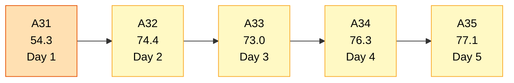
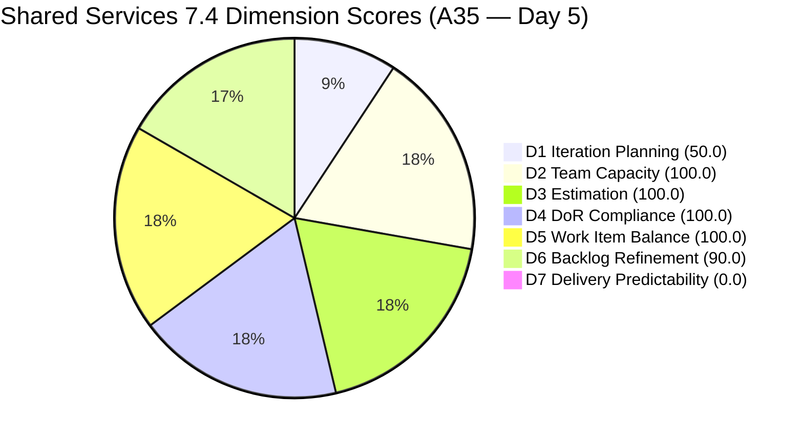
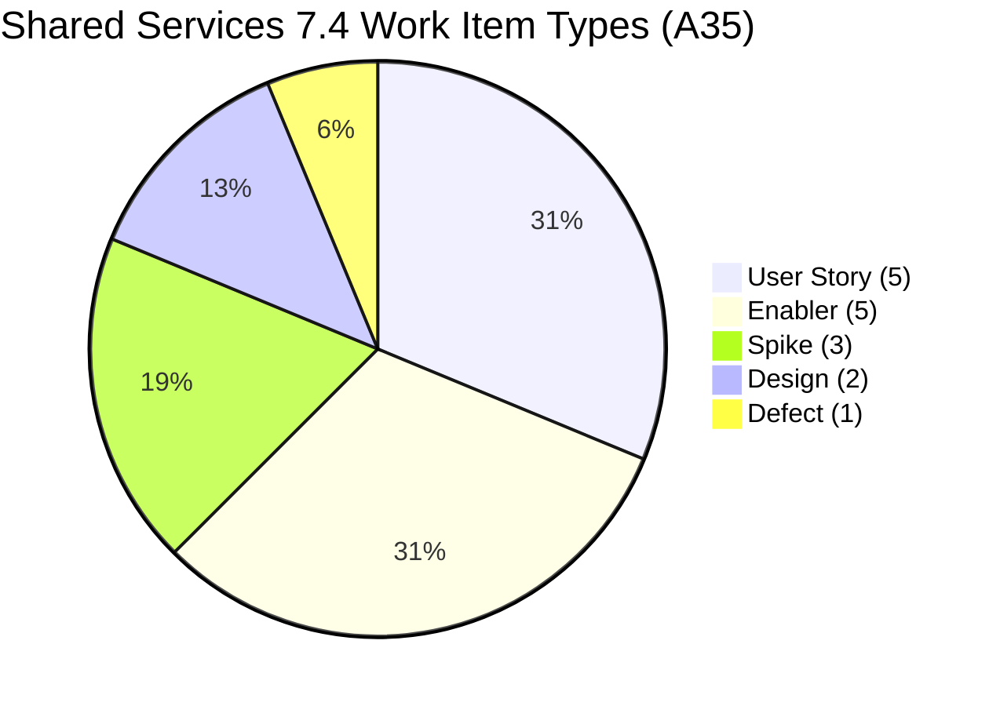
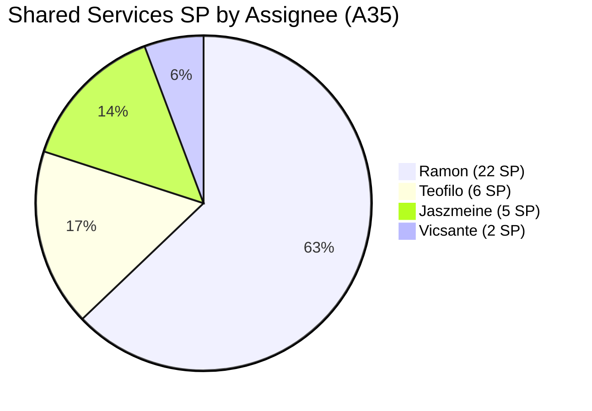
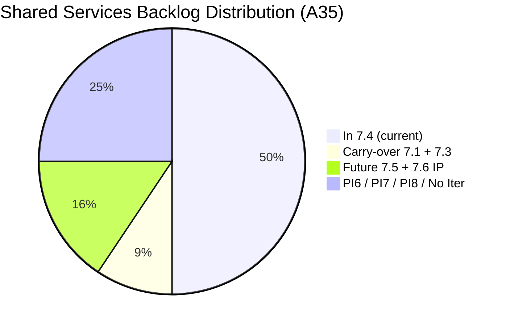
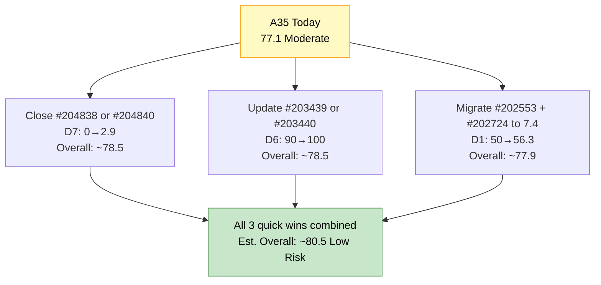

# Shared Services Team — SAFe Iteration Audit A35
**Date:** 2026-05-22 | **Sprint Day:** 5 of 14 — SPRINT ACTIVE | **Iteration:** 7.4 (May 18 – May 31, 2026)
**Auditor:** Claude Code (ADO SAFe Audit Skill v1) | **Prior Audit:** A34 (2026-05-21 09:15)

---

## 1. Audit Metadata

| Field | Value |
|---|---|
| **Audit ID** | A35 |
| **Report File** | `AUDIT_20260522_0900.md` |
| **Prior Audit** | A34 — `AUDIT_20260521_0915.md` (Overall 76.3, Moderate Risk — 7.4 Day 4) |
| **ADO Project** | Jairosoft Portfolio (`666bb99a-6acd-4999-bb34-efd0e4ea90dc`) |
| **ADO Team** | Shared Services Team (`bd9578fd-5773-48fc-bd80-988dfe5de806`) |
| **Iteration** | 7.4 (`16385d00-244a-4caa-9e56-d4a8e850754d`) |
| **Iteration Dates** | May 18 – May 31, 2026 |
| **Sprint Day** | **5 of 14 — SPRINT ACTIVE** |
| **Audit Date** | 2026-05-22 09:00 PHT |
| **Overall Score** | **77.1 — Moderate Risk** |
| **Risk Band** | Moderate (60–79.9) |
| **Visible Backlog Items** | 32 root items |
| **Current Iteration Root Items** | 16 (IterationPath = 7.4) |
| **Capacity Source** | `work_get_team_capacity` — Teofilo 6h, Vicsante 6h, Jaszmeine 3h, Ramon 0.5h = 15.5h/day |
| **Project Exceptions Applied** | None |

---

## 2. Executive Summary

| Field | Value |
|---|---|
| **Overall Score** | **77.1 — Moderate Risk** |
| **Score vs Prior (A34)** | 76.3 → 77.1 (**+0.8** — DoR fully cleared; 3 new items replace 3 items removed) |
| **Sprint Day** | **5 of 14 — SPRINT ACTIVE** |
| **Iteration** | 7.4 (May 18 – May 31, 2026) |
| **Items in 7.4** | 16 root items (unchanged count; different composition) |
| **Committed SP** | 35 SP (unchanged) |
| **SP Closed** | 0 (early-sprint Day 5) |
| **Risk Band** | Moderate (60–79.9) |

**Shared Services improves from 76.3 to 77.1 on Day 5, driven by a meaningful DoR recovery.** Three new items (#204838, #204840, #204841) replace three items that left the backlog (#204757, #204780, #204781 from A34 are no longer present). All three new items are Enablers assigned to Teofilo, are Active as of this morning, and — critically — all pass the DoR threshold. This lifts D4 from 93.8 to 100.0, recovering the one failing item (#204781) from A34.

**Key changes since A34:**
1. **Items #204757, #204780, #204781 are no longer in the backlog** — these Teofilo items (Asnari GitHub access defect, AutoAllies BLOB backup, Bubble training room setup) have exited the visible backlog. Presumed closed or moved to another team's scope.
2. **Three new items added to 7.4 today (May 22):** #204838 ("Adding new Seat in Github"), #204840 ("Update Outlook PASS in Colina PASS"), and #204841 ("Create New Repo for Eingress"). All are Active Enablers for Teofilo with ChangedDate = 2026-05-22 this morning.
3. **D4 fully restored to 100.0** — the DoR failure from A34 (#204781) is gone, and the 3 replacement items all pass DoR checks.
4. **D6 unchanged at 90.0** — the 3 untouched items (#203439, #203440, #203199) remain unchanged since May 8–15, still triggering the −10 refinement penalty.

**Primary concern remains D1 at 50.0.** The backlog has exactly 16 current-sprint items and 16 non-current items. The 7.3 carry-overs (#202553, #202724) are still in active Design Review by Jaszmeine but remain on IterationPath 7.3.

---

## 3. Previous Audit Delta (A34 → A35)

| Dimension | A34 Score | A35 Score | Delta | Driver |
|---|---|---|---|---|
| D1 Iteration Planning | 50.0 | 50.0 | 0.0 | 16/32 — 3 items left, 3 items added; ratio unchanged |
| D2 Team Capacity | 100.0 | 100.0 | 0.0 | All 4 members configured — unchanged |
| D3 Estimation | 100.0 | 100.0 | 0.0 | All 16 items have SP>0 — unchanged |
| D4 DoR Compliance | 93.8 | 100.0 | **+6.2** | #204781 (failing, 18-char Desc) replaced by 3 new items that all pass DoR |
| D5 Work Item Balance | 100.0 | 100.0 | 0.0 | Type diversity maintained; still 5 types represented |
| D6 Backlog Refinement | 90.0 | 90.0 | 0.0 | Still 3 untouched items (18.75% → −10 penalty); same 3 items as A34 |
| D7 Delivery Predictability | 0.0 | 0.0 | 0.0 | Early-sprint Day 5 — last day of annotation window |
| **Overall** | **76.3** | **77.1** | **+0.8** | D4 improvement from DoR recovery |

---

## 4. Current Iteration Snapshot

| # | Title | Type | State | SP | Assignee | Changed |
|---|---|---|---|---|---|---|
| #202725 | Messaging & Communication | Design | Ready for Design | 3 | Jaszmeine | May 19 |
| #202726 | Booking & Payment Management | Design | Ready for Design | 2 | Jaszmeine | May 19 |
| #203309 | GitHub Token Degradation Fix | Defect | Ready for QA | 1 | Ramon | May 19 |
| #203393 | Claude Course Training | Spike | Active | 2 | Vicsante | May 19 |
| #203436 | Plugin Lifecycle & Extract Skill Verification | User Story | Active | 5 | Ramon | May 19 |
| #203437 | Plugin Generate Skill — Playwright Script Generation | User Story | Ready for Dev | 5 | Ramon | May 19 |
| #203438 | Generate Test Execution Report (/qa-ai:report) | User Story | Ready for Dev | 2 | Ramon | May 19 |
| #203439 | Send Report via Outlook Email (/qa-ai:email) | User Story | Ready for Dev | 3 | Ramon | May 8 |
| #203440 | Scheduled QA Pipeline Orchestration | User Story | Ready for Dev | 3 | Ramon | May 8 |
| #204199 | Request: Add Team Member to Anthropic Enterprise | Spike | Ready | 1 | Ramon | May 15 |
| #204237 | Remove Lifestyle Project from Portfolio Score | Spike | New | 1 | Ramon | May 21 |
| #204238 | Use FinOps Project Board for Admin/HR/Finance | Enabler | Grooming | 1 | Ramon | May 21 |
| #204642 | Clearing AzureDevOps (inactive users) | Enabler | Active | 1 | Teofilo | May 19 |
| #204838 | Adding new Seat in Github | Enabler | Active | 1 | Teofilo | **May 22** (NEW) |
| #204840 | Update Outlook PASS in Colina PASS | Enabler | Active | 2 | Teofilo | **May 22** (NEW) |
| #204841 | Create New Repo for Eingress | Enabler | Active | 2 | Teofilo | **May 22** (NEW) |

**Total: 16 items | 35 SP committed | 0 SP closed**

**Sprint changes since A34 (Day 4 → Day 5):**
- **Removed from backlog:** #204757 (Asnari GitHub defect), #204780 (AutoAllies DB backup), #204781 (Bubble Training Room) — all Teofilo items
- **Added to 7.4:** #204838, #204840, #204841 — all Teofilo Enablers, Active as of this morning

**Non-current backlog items (16 items):**

| Group | Items | Count |
|---|---|---|
| 7.1 carry-over | #202732 (Ready for UAT) | 1 |
| 7.3 carry-overs | #202553, #202724 (Design Review — active) | 2 |
| 7.5 (next sprint) | #202727, #203845, #204205 | 3 |
| 7.6 IP | #202947, #204209 | 2 |
| PI7 no-iteration | #202061, #202063 | 2 |
| PI6 | #201161 (On Hold) | 1 |
| PI8 | #201919, #202066, #202069, #202070 | 4 |
| No iteration | #186848 | 1 |

---

## 5. Work Item Analysis

### Type Distribution (16 current items)

| Type | Count | Share |
|---|---|---|
| User Story | 5 | 31.3% |
| Enabler | 5 | 31.3% |
| Spike | 3 | 18.8% |
| Design | 2 | 12.5% |
| Defect | 1 | 6.3% |
| **Total** | **16** | **100%** |

**Type diversity:** 5 types represented; no single type exceeds 60% share. User Story and Enabler are tied at 31.3%. The replacement of A34's Defect (#204757) with 3 Enablers increases Enabler count from 4 to 5, creating an exact tie with User Stories.

### State Distribution (16 current items)

| State | Count | Items |
|---|---|---|
| Active | 7 | #203393, #203436, #204642, #204838, #204840, #204841 |
| Ready for Dev | 3 | #203437, #203438, #203440 |
| Ready for Design | 2 | #202725, #202726 |
| Ready for QA | 1 | #203309 |
| Ready | 1 | #204199 |
| New | 1 | #204237 |
| Grooming | 1 | #204238 |

Wait — #203439 has state "Ready for Dev" per ADO. Corrected count: Active = 6, Ready for Dev = 4.

**Active items:** #203393, #203436, #204642, #204838, #204840, #204841 = **6 Active**

### Assignee Distribution (16 current items)

| Assignee | Items | SP |
|---|---|---|
| Ramon | #203309(1) + #203436(5) + #203437(5) + #203438(2) + #203439(3) + #203440(3) + #204199(1) + #204237(1) + #204238(1) = **9 items** | **22 SP** |
| Teofilo | #204642(1) + #204838(1) + #204840(2) + #204841(2) = **4 items** | **6 SP** |
| Vicsante | #203393(2) = **1 item** | **2 SP** |
| Jaszmeine | #202725(3) + #202726(2) = **2 items** | **5 SP** |

**Concentration note:** Ramon owns 9/16 items (56%) and 22/35 SP (63%). Teofilo shows strong activity today with 3 new Active items (#204838, #204840, #204841). Vicsante and Jaszmeine each have low item counts relative to their configured daily capacity.

---

## 6. SAFe Compliance Scorecard

| Dimension | Score | Band | Evidence | Notes |
|---|---|---|---|---|
| D1 Iteration Planning | 50.0 | High | 16 current / 32 visible | Unchanged from A34; 7.3 carry-overs and PI7/PI8/no-iter items persist |
| D2 Team Capacity | 100.0 | Low | 4/4 members configured | Teofilo 6h, Vicsante 6h, Jaszmeine 3h, Ramon 0.5h = 15.5h/day |
| D3 Estimation | 100.0 | Low | 16/16 items estimated | All items have SP>0 |
| D4 DoR Compliance | 100.0 | Low | 16/16 items pass | Full recovery from A34 (93.8); #204781 removed; 3 new items (#204838, #204840, #204841) all pass |
| D5 Work Item Balance | 100.0 | Low | Max type 31.3%; Spike 18.8% | 5 types represented; US and Enabler tied at 31.3%; no penalty triggers |
| D6 Backlog Refinement | 90.0 | Low | 3/16 untouched (18.75%) | Base 100; −10 (10–30% untouched); no stale penalties; unchanged from A34 |
| D7 Delivery Predictability | 0.0 | Critical† | 0/35 SP closed | Early-sprint Day 5 — FINAL annotation day; first closures due by end of today |
| **OVERALL** | **77.1** | **Moderate** | (50.0+100+100+100+100+90+0)/7 | +0.8 from A34; highest score of the 7.4 sprint to date |

† Early-sprint annotation — Day 5 is the final day of the Day 1–5 window. Starting Day 6, D7 = 0.0 will be scored as Critical without annotation, lowering the overall score from 77.1 to ~65.9.

---

## 7. Dimension Findings

### D1 — Iteration Planning: 50.0 / 100 — High Risk

**Formula:** 16 / 32 × 100 = **50.0**

| Metric | Value |
|---|---|
| Items in 7.4 | 16 |
| Total visible backlog items | 32 |
| Score | **50.0** |

D1 remains locked at exactly 50.0 — a perfectly balanced backlog between current and non-current sprint items. Despite daily changes in sprint composition (3 items in, 3 items out since A34), the ratio has not moved. The core structural drivers persist:

| Non-Current Group | Count | Priority |
|---|---|---|
| 7.3 carry-overs (#202553, #202724 — active Design Review) | 2 | HIGH: migrate IterationPath to 7.4 |
| 7.1 carry-over (#202732 — Ready for UAT, Teofilo) | 1 | HIGH: close or move to 7.4 |
| 7.5 staged items | 3 | OK — correctly staged |
| 7.6 IP items | 2 | OK — correctly staged |
| PI7 no-iteration (#202061, #202063 — Estimation) | 2 | MODERATE: assign to 7.5 |
| PI6 On-Hold defect (#201161) | 1 | MODERATE: close or park |
| PI8 items (#201919, #202066, #202069, #202070) | 4 | LOW: triage or icebox |
| No iteration (#186848) | 1 | MODERATE: assign or archive |

**Highest-value fix:** Migrating #202553 and #202724 (7.3 → 7.4) would bring D1 to 18/32 = 56.3. Closing #202732 (7.1 Ready for UAT) would further improve. Triaging 5–6 of the PI7/PI8/no-iter items out of the active backlog would push D1 toward 65+.

---

### D2 — Team Capacity: 100.0 / 100 — Low Risk

**Formula:** 4/4 × 100 = **100.0**

| Member | Capacity | Active Items Today |
|---|---|---|
| Teofilo Limpag | 6.0 h/day (Development) | #204642, #204838, #204840, #204841 (4 Active) |
| Vicsante Aseniero | 6.0 h/day (Development) | #203393 (1 Active) |
| Jaszmeine Abigaille Villanueva | 3.0 h/day (Design) | #202725, #202726 (Ready for Design) |
| Ramon Aseniero Jr | 0.5 h/day (Requirements) | #203436 (1 Active); 8 other items queued |

**Teofilo's activity today** is notable: 3 new items added and set to Active on May 22 morning, on top of the existing #204642 already Active. This is strong engagement.

---

### D3 — Estimation: 100.0 / 100 — Low Risk

**Formula:** 16/16 × 100 = **100.0**

All 16 items carry Story Points. No unestimated items in the current sprint. This dimension has held at 100.0 since A34's recovery and has been a consistent strength through the 7.4 sprint.

---

### D4 — DoR Compliance: 100.0 / 100 — Low Risk

**Formula:** 16/16 × 100 = **100.0**

**Full DoR recovery from A34.** Three new items verified:

| Work Item | Title | Desc Check | AC Check | Result |
|---|---|---|---|---|
| #204838 | Adding new Seat in Github | "Adding new private user in Github" (~33 non-ws chars) ✓ | "new user should be added in Github" (~33 chars) ✓ | PASS |
| #204840 | Update Outlook PASS in Colina PASS | "Update Library and OUTLOOK pass variables in Azure" (~47 chars) ✓ | "Should update OUTLOOK_PASS" (~24 chars) ✓ | PASS |
| #204841 | Create New Repo for Eingress | "Create new Repo in jairosoft-com: eingress-v2" (~42 chars) ✓ | "Repository should be added in our Org; invite all eingress Dev" ✓ | PASS |

The A34 DoR failure (#204781 "Setup Bubble Training Room" with 18-char Description) is no longer in scope. The pattern of adding items with thin descriptions and then removing them rather than fixing them (observed across multiple audit cycles) has not recurred today. All 3 new items were added with adequate DoR content.

**Escalation watch:** #204205 ("Procure Used Mobile Device") in 7.5 and #204209 ("Container Registry Cost Reduction") in 7.6 IP still have no Description or AC per ADO. These will fail DoR when they become current-sprint items unless remediated beforehand.

---

### D5 — Work Item Balance: 100.0 / 100 — Low Risk

**Formula:** Base 100 − penalties

| Penalty | Trigger | Applied |
|---|---|---|
| −30: dominant_type_share > 60% | Max type = 31.3% (US and Enabler tied) | No |
| −40: no User Story items | User Story present (5 items) | No |
| −20: spike_share > 40% | Spike = 18.8% | No |

**Score:** 100 − 0 = **100.0**

D5 continues as a key differentiator for Shared Services. With User Stories and Enablers tied at 31.3% (5 each), Spikes at 18.8%, Design at 12.5%, and Defect at 6.3%, the sprint reflects true cross-cutting Shared Services work: AI tooling development, design work for Flawless, DevOps/IT operations, and infrastructure enablement.

---

### D6 — Backlog Refinement: 90.0 / 100 — Low Risk

**Freshness window:** Items with ChangedDate ≥ Apr 7, 2026 (45 days from May 22)

| Metric | Value |
|---|---|
| Total visible backlog items | 32 |
| Fresh items (ChangedDate ≥ Apr 7) | 32 (oldest is #186848 at Apr 15) |
| stale_90 items (ChangedDate < Feb 21) | 0 |
| stale_180 items | 0 |
| Untouched current items (ChangedDate < May 18) | 3 |
| Untouched share | 3/16 = 18.75% → −10 penalty (10–30% range) |
| Score | **90.0** |

**Untouched items (unchanged from A34):**

| # | Title | Last Changed | Owner | Days Untouched |
|---|---|---|---|---|
| #203439 | Send Report via Outlook Email (/qa-ai:email) | May 8 | Ramon | 14 days |
| #203440 | Scheduled QA Pipeline Orchestration | May 8 | Ramon | 14 days |
| #204199 | Request: Add Team Member to Anthropic Enterprise | May 15 | Ramon | 7 days |

These 3 items have been untouched for 7–14 days despite being in an active sprint. The −10 penalty persists. **Path to D6 = 100.0 and Overall ~78.5:** Update any 1 of the 3 items with a brief state comment, state transition, or progress note before the next audit. Priority: #203439 or #203440 (oldest at 14 days). This is a 30-second ADO update.

---

### D7 — Delivery Predictability: 0.0 / 100 — (Early-Sprint Annotation — FINAL DAY)

**Formula:** 0 / 35 × 100 = **0.0**

| Metric | Value |
|---|---|
| SP closed this sprint | 0 |
| Total committed SP | 35 |
| Score | **0.0** |

> **Early-Sprint Annotation — FINAL DAY:** Day 5 of 14. Per rubric, Day 1–5 qualifies for the early-sprint annotation. **Day 5 is the last day this annotation applies.** Starting Day 6, D7 = 0.0 lowers the unannotated overall score to approximately **65.9** (dropping from 77.1 to High Risk band).
>
> **Best candidates for first closure today:**
> - **#204838** (Adding new Seat in Github — Active, Teofilo, 1 SP): Simple operational task — add user to GitHub. Likely completable same day.
> - **#204840** (Update Outlook PASS in Colina PASS — Active, Teofilo, 2 SP): Azure variable update — likely fast to execute and verify.
> - **#204841** (Create New Repo for Eingress — Active, Teofilo, 2 SP): Create repo and invite devs — a well-defined operational task.
> - **#203393** (Claude Course Training — Active, Vicsante, 2 SP): 4 modules; may require more time but partially completable.
>
> Target: **5–8 SP closed by Day 7** (14–23% of committed) to establish sprint velocity and keep D7 above 0.

---

## 8. Risks and Bottlenecks

| # | Severity | Dimension | Risk | Action |
|---|---|---|---|---|
| R1 | HIGH | D7 | Day 5 is the last day of early-sprint annotation. Zero SP closed across 5 sprint days. Starting Day 6, D7 = 0.0 scores as Critical and drops Overall to ~65.9 (High Risk). | Close #204838 or #204840 (Teofilo, Active, operational tasks) today. Even 1 SP credit keeps the velocity signal alive and reduces D7 severity in Day 6 report. |
| R2 | HIGH | D1 | D1 locked at 50.0 for 5 consecutive days. 7.3 carry-overs (#202553, #202724) are actively worked by Jaszmeine but stuck on the wrong IterationPath. | Update IterationPath of #202553 and #202724 from 7.3 to 7.4 in ADO. This is a 1-minute board move per item. Impact: D1 → 56.3. |
| R3 | MODERATE | D6 | #203439 and #203440 untouched for 14 days; #204199 untouched for 7 days. −10 refinement penalty persists. | Add a 1-line progress note to #203439 or #203440. Clears D6 to 100.0, lifting Overall from 77.1 to ~78.5. |
| R4 | MODERATE | Workload | Ramon holds 9/16 items (56%) and 22/35 SP (63%) on 0.5h/day capacity. Teofilo now has 4 Active items (6h/day) — a heavy but feasible load. | Continue monitoring. Teofilo's morning additions (#204838, #204840, #204841) are likely quick operational tasks. Reassignment of 1–2 Ramon items to Teofilo or Vicsante (e.g., #203437 or #203440) would reduce concentration risk. |
| R5 | MODERATE | D1 (future) | #204205 and #204209 (moved to 7.5 and 7.6 IP in A34) still have no Description or AC in ADO. They will fail D4 when their target iterations become current. | Fix Description and AC on #204205 (Teofilo, 7.5) and #204209 (Teofilo, 7.6 IP) now, before they become active sprint items. |
| R6 | LOW | D1 | #202732 (7.1, Ready for UAT, Teofilo) has been sitting since Apr 27 without closure. | Close or re-test #202732. If UAT is complete, mark Closed. Reduces non-current count by 1. |
| R7 | INFO | D1 | 6 PI7/PI8/no-iter items (#202061, #202063, #201161, #186848, + 4 PI8 items) dilute the D1 ratio. | Batch-triage these items: assign to specific future iterations or move to icebox. Each removed item improves D1 ratio. |

---

## 9. Prioritized Recommendations

1. **[CRITICAL — Today Day 5]** Teofilo: Close at least one of #204838, #204840, or #204841 before end of Day 5. These are simple IT operations tasks (add GitHub user, update Azure variable, create repository). Any single closure starts the sprint velocity clock before the early-sprint annotation expires. Impact: D7 moves from 0.0 to ~2.9–5.7 (1–2 SP / 35 SP), preventing a Critical classification on Day 6.

2. **[HIGH — Today/Tomorrow]** Update IterationPath on #202553 ("Vendor Exploration & Search") and #202724 ("Vendor Profile & Details") from 7.3 to 7.4. Jaszmeine is actively working these items in Design Review — they are functionally part of 7.4 already. This fix requires a 1-minute board move per item and improves D1 from 50.0 to 56.3.

3. **[MODERATE — Today]** Ramon: Add a progress comment or state transition to any one of #203439, #203440, or #204199 (untouched since May 8–15). A single update clears the D6 −10 penalty, lifting Overall from 77.1 to approximately 78.5. Specifically, transitioning #203439 ("Send Report via Outlook Email") or #203440 ("Scheduled QA Pipeline") from "Ready for Dev" to "Active" takes 30 seconds in ADO and delivers the D6 improvement.

4. **[HIGH — Before 7.5 Starts]** Remediate DoR gaps on #204205 ("Procure Used Mobile Device", 7.5) and #204209 ("Container Registry Cost Reduction", 7.6 IP). Both items were removed from 7.4 without being fixed. They will fail D4 in their target iterations if addressed now. Teofilo: add a Description (≥30 non-ws chars) and Acceptance Criteria (≥20 non-ws chars) to each.

5. **[MODERATE — By Day 7]** Triage the non-current long tail: Batch-process the 6 PI7/PI8/no-iter items. Close #202732 (7.1, Ready for UAT), assign or icebox #186848 (no-iteration), and assign #202061 and #202063 (PI7) to 7.5 or 7.6. Each triage action reduces the D1 denominator, gradually improving the ratio toward 60+ (Moderate band boundary).

6. **[STANDING — For A36+]** Continue enforcing the DoR gate for all new sprint items. A35 shows the pattern working: 3 new items added today, all passing DoR checks. Maintain this discipline to avoid the A33→A34 pattern of adding thin items and removing them.

---

## 10. Visualization

### Score Trend (A31 → A35)

### Dimension Scorecard (A35)

### Work Item Type Distribution (16 current items)

### Assignee SP Distribution (35 SP total)

### Backlog Composition (32 items total)

### Projected Score Impact of Quick Wins

---

## 11. Evidence Gaps and Limitations

| Gap | Impact | Notes |
|---|---|---|
| Items #204757, #204780, #204781 no longer in backlog | Minor backlog count change | Presumed closed or moved to another team's scope. Not present in `wit_list_backlog_work_items` for Shared Services Team. No scoring impact. |
| #204205 (7.5) and #204209 (7.6 IP) still lack Description and AC | Will fail D4 in future iterations | Not scored in A35 (out of current iteration). Recommend immediate remediation before their target iterations become current. |
| D1 carry-overs #202553 and #202724 on IterationPath 7.3 | D1 suppressed | Work is happening in 7.4 context but IterationPath not updated. Board administrative fix needed. |
| Ramon holds 63% of committed SP on 0.5h/day capacity | Throughput concentration risk | Not a scoring dimension but a structural delivery risk. Monitor sprint velocity by Day 7. |
| D7 = 0 at Day 5 | Annotated — FINAL day | Starting Day 6, D7 = 0.0 scores as Critical without annotation. Urgent: close at least 1 item (Teofilo operational tasks are best candidates). |

---

## 12. Audit Trail

| Source | Tool Used | Data Retrieved |
|---|---|---|
| Active iteration | `work_list_team_iterations` (team GUID `bd9578fd-5773-48fc-bd80-988dfe5de806`) | 7.4: May 18–31, ID `16385d00-244a-4caa-9e56-d4a8e850754d` |
| Backlog items | `wit_list_backlog_work_items` (backlogId `Microsoft.RequirementCategory`) | 32 root items visible |
| Team capacity | `work_get_team_capacity` (iterationId `16385d00-244a-4caa-9e56-d4a8e850754d`) | Teofilo 6h, Vicsante 6h, Jaszmeine 3h, Ramon 0.5h = 15.5h/day |
| Work item details | `wit_get_work_items_batch_by_ids` | 32 items — SP, State, Type, Desc, AC, ChangedDate, IterationPath |
| Prior audit | `AUDIT_20260521_0915.md` (A34) | Overall 76.3, Moderate Risk, 16 items, 35 SP |
