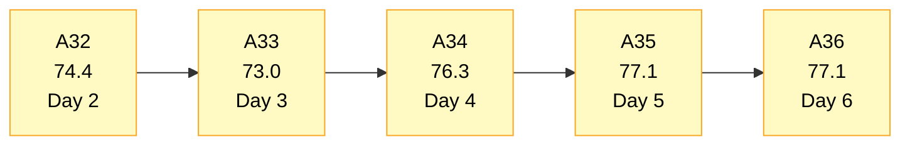
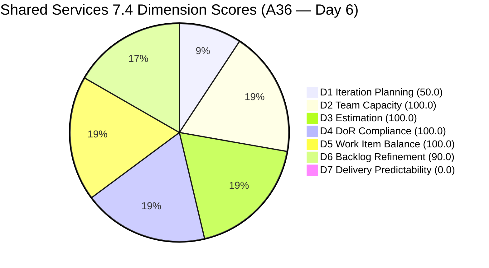
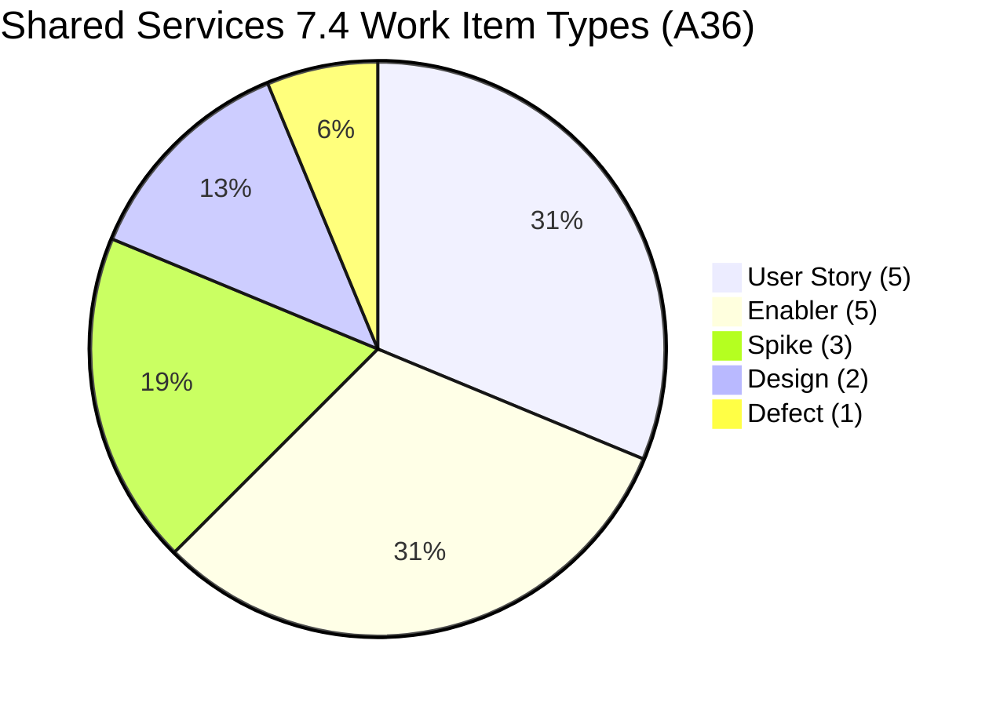
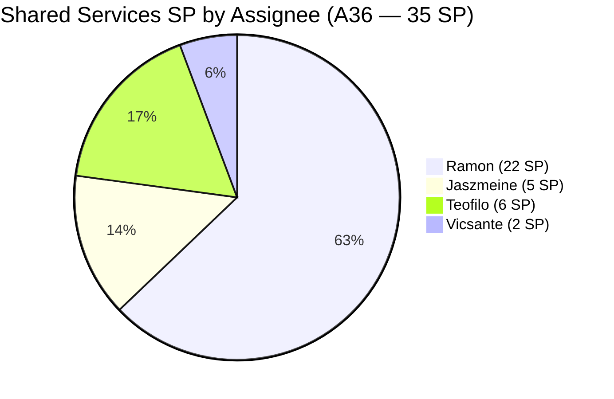
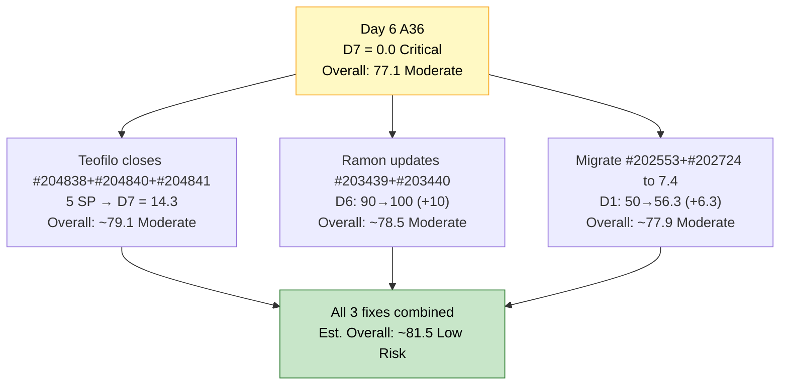

# Shared Services Team — SAFe Iteration Audit A36
**Date:** 2026-05-23 | **Sprint Day:** 6 of 14 — SPRINT ACTIVE | **Iteration:** 7.4 (May 18 – May 31, 2026)
**Auditor:** Claude Code (ADO SAFe Audit Skill v1) | **Prior Audit:** A35 (2026-05-22 09:00)

---

## 1. Audit Metadata

| Field | Value |
|---|---|
| **Audit ID** | A36 |
| **Report File** | `AUDIT_20260523_0903.md` |
| **Prior Audit** | A35 — `AUDIT_20260522_0900.md` (Overall 77.1, Moderate Risk — 7.4 Day 5) |
| **ADO Project** | Jairosoft Portfolio (`666bb99a-6acd-4999-bb34-efd0e4ea90dc`) |
| **ADO Team** | Shared Services Team (`bd9578fd-5773-48fc-bd80-988dfe5de806`) |
| **Iteration** | 7.4 (`16385d00-244a-4caa-9e56-d4a8e850754d`) |
| **Iteration Dates** | May 18 – May 31, 2026 |
| **Sprint Day** | **6 of 14 — SPRINT ACTIVE** |
| **Audit Date** | 2026-05-23 09:03 PHT |
| **Overall Score** | **77.1 — Moderate Risk** |
| **Risk Band** | Moderate (60–79.9) |
| **Visible Backlog Items** | 32 root items |
| **Current Iteration Root Items** | 16 (IterationPath = 7.4) |
| **Capacity Source** | `work_get_team_capacity` — Teofilo 6h, Vicsante 6h, Jaszmeine 3h, Ramon 0.5h = 15.5h/day |
| **Project Exceptions Applied** | None |

---

## 2. Executive Summary

| Field | Value |
|---|---|
| **Overall Score** | **77.1 — Moderate Risk** |
| **Score vs Prior (A35)** | 77.1 → 77.1 (**0.0** — no structural changes detected) |
| **Sprint Day** | **6 of 14 — SPRINT ACTIVE** |
| **Iteration** | 7.4 (May 18 – May 31, 2026) |
| **Items in 7.4** | 16 root items (unchanged) |
| **Committed SP** | 35 SP (unchanged) |
| **SP Closed** | 0 — **ALERT: D7 now scores Critical with no early-sprint annotation** |
| **Risk Band** | Moderate (60–79.9) |

**Day 6 finds Shared Services arithmetically stable but risk-escalated.** The early-sprint annotation on D7 expired at the close of Day 5. Starting today, zero SP closed against 35 committed scores as a **true Critical gap**. The overall score holds at 77.1 but the interpretation has materially shifted: the team has used six of fourteen sprint days without a single delivery.

Sprint composition is unchanged: 16 items across User Story (5), Enabler (5), Spike (3), Design (2), Defect (1). Capacity remains configured at 15.5 h/day across four members. The three untouched items (#203439, #203440, #204199) continue to carry the D6 −10 penalty and remain the quickest win available.

Teofilo's three new Enablers (#204838, #204840, #204841) — all added and set Active on May 22 — remain Active today. These are the team's best immediate closure candidates given their operational nature and narrow scope. Closing any one of them before Day 7 would establish the sprint's first velocity reading and prevent D7 from entering a true delivery stall.

---

## 3. Previous Audit Delta (A35 → A36)

| Dimension | A35 Score | A36 Score | Delta | Driver |
|---|---|---|---|---|
| D1 Iteration Planning | 50.0 | 50.0 | 0.0 | 16/32 — backlog composition unchanged |
| D2 Team Capacity | 100.0 | 100.0 | 0.0 | All 4 members configured — unchanged |
| D3 Estimation | 100.0 | 100.0 | 0.0 | All 16 items have SP>0 — unchanged |
| D4 DoR Compliance | 100.0 | 100.0 | 0.0 | All 16 items pass DoR — unchanged |
| D5 Work Item Balance | 100.0 | 100.0 | 0.0 | 5 types; max share 31.3% — unchanged |
| D6 Backlog Refinement | 90.0 | 90.0 | 0.0 | 3 untouched items (18.75%) persist — same 3 as A35 |
| D7 Delivery Predictability | 0.0 | 0.0 | 0.0 | **CRITICAL — early-sprint annotation EXPIRED. Day 6 = no annotation.** |
| **Overall** | **77.1** | **77.1** | **0.0** | Score unchanged; D7 risk status escalated from annotated to Critical |

**Key shift from A35 to A36:** Like OTP, the score is arithmetically identical but D7 has transitioned from "early-sprint" (expected at Day 5) to **Critical with no mitigating annotation**. The three untouched items (#203439, #203440, #204199) persist from A35 without state movement, confirming no board activity on these items since May 8–15.

---

## 4. Current Iteration Snapshot

| # | Title | Type | State | SP | Assignee | Changed |
|---|---|---|---|---|---|---|
| #202725 | Messaging & Communication | Design | Ready for Design | 3 | Jaszmeine | May 19 |
| #202726 | Booking & Payment Management | Design | Ready for Design | 2 | Jaszmeine | May 19 |
| #203309 | GitHub Token Degradation Fix | Defect | Ready for QA | 1 | Ramon | May 19 |
| #203393 | Claude Course Training | Spike | Active | 2 | Vicsante | May 19 |
| #203436 | Plugin Lifecycle & Extract Skill Verification | User Story | Active | 5 | Ramon | May 19 |
| #203437 | Plugin Generate Skill — Playwright Script Generation | User Story | Ready for Dev | 5 | Ramon | May 19 |
| #203438 | Generate Test Execution Report (/qa-ai:report) | User Story | Ready for Dev | 2 | Ramon | May 19 |
| #203439 | Send Report via Outlook Email (/qa-ai:email) | User Story | Ready for Dev | 3 | Ramon | **May 8** (untouched 15 days) |
| #203440 | Scheduled QA Pipeline Orchestration | User Story | Ready for Dev | 3 | Ramon | **May 8** (untouched 15 days) |
| #204199 | Request: Add Team Member to Anthropic Enterprise | Spike | Ready | 1 | Ramon | **May 15** (untouched 8 days) |
| #204237 | Remove Lifestyle Project from Portfolio Score | Spike | New | 1 | Ramon | May 21 |
| #204238 | Use FinOps Project Board for Admin/HR/Finance | Enabler | Grooming | 1 | Ramon | May 21 |
| #204642 | Clearing AzureDevOps (inactive users) | Enabler | Active | 1 | Teofilo | May 19 |
| #204838 | Adding new Seat in Github | Enabler | Active | 1 | Teofilo | **May 22** |
| #204840 | Update Outlook PASS in Colina PASS | Enabler | Active | 2 | Teofilo | **May 22** |
| #204841 | Create New Repo for Eingress | Enabler | Active | 2 | Teofilo | **May 22** |

**Total: 16 items | 35 SP committed | 0 SP closed**

**Non-current backlog items (16 items):**

| Group | Items | Count | Status |
|---|---|---|---|
| 7.1 carry-over | #202732 (Ready for UAT, Teofilo, Apr 27) | 1 | HIGH: close or migrate |
| 7.3 carry-overs | #202553, #202724 (Design Review, Jaszmeine, May 19) | 2 | HIGH: migrate IterationPath to 7.4 |
| 7.5 (next sprint) | #202727, #203845, #204205 | 3 | OK — staged |
| 7.6 IP | #202947, #204209 | 2 | OK — staged |
| PI7 no-iteration | #202061, #202063 (Estimation, Ramon, May 8) | 2 | MODERATE: assign to 7.5 |
| PI6 | #201161 (On Hold, Vicsante, Apr 16) | 1 | MODERATE: close or park |
| PI8 | #201919, #202066, #202069, #202070 | 4 | LOW: triage or icebox |
| No iteration | #186848 (New, Apr 15) | 1 | MODERATE: assign or archive |

---

## 5. Work Item Analysis

### Type Distribution (16 current items)

| Type | Count | Share |
|---|---|---|
| User Story | 5 | 31.3% |
| Enabler | 5 | 31.3% |
| Spike | 3 | 18.8% |
| Design | 2 | 12.5% |
| Defect | 1 | 6.3% |
| **Total** | **16** | **100%** |

Type diversity holds strong with 5 distinct types. User Story and Enabler are tied at 31.3%. No single type exceeds 60%. D5 remains clean.

### State Distribution (16 current items)

| State | Count | Items |
|---|---|---|
| Active | 6 | #203393, #203436, #204642, #204838, #204840, #204841 |
| Ready for Dev | 4 | #203437, #203438, #203439, #203440 |
| Ready for Design | 2 | #202725, #202726 |
| Ready for QA | 1 | #203309 |
| Ready | 1 | #204199 |
| New | 1 | #204237 |
| Grooming | 1 | #204238 |

**6 Active items = 37.5% active rate.** This is lower than optimal at Day 6. Of the 4 "Ready for Dev" items, three (#203437, #203438, #203440) have been in that state for at least 4 days without progression. Teofilo's 3 Enablers (Active since May 22) are the freshest work signals.

### Assignee Distribution (16 current items)

| Assignee | Items | SP | Capacity |
|---|---|---|---|
| Ramon | #203309, #203436, #203437, #203438, #203439, #203440, #204199, #204237, #204238 = **9 items** | **22 SP** | 0.5 h/day |
| Teofilo | #204642, #204838, #204840, #204841 = **4 items** | **6 SP** | 6.0 h/day |
| Vicsante | #203393 = **1 item** | **2 SP** | 6.0 h/day |
| Jaszmeine | #202725, #202726 = **2 items** | **5 SP** | 3.0 h/day |

**Workload concentration:** Ramon holds 9/16 items (56%) and 22/35 SP (63%) on 0.5 h/day capacity — a structural mismatch unchanged since A35. Teofilo (6 h/day) has 4 items (6 SP) and all are Active, making Teofilo the most likely first closure contributor. Vicsante (6 h/day) has only 1 item (2 SP).

### Untouched Items (ChangedDate before sprint start May 18)

| # | Title | Last Changed | Owner | Days Untouched |
|---|---|---|---|---|
| #203439 | Send Report via Outlook Email (/qa-ai:email) | May 8 | Ramon | **15 days** |
| #203440 | Scheduled QA Pipeline Orchestration | May 8 | Ramon | **15 days** |
| #204199 | Request: Add Team Member to Anthropic Enterprise | May 15 | Ramon | **8 days** |

These three untouched items persist from A35. #203439 and #203440 have now been stalled for 15 days with no state transition. The −10 D6 penalty will remain until at least one receives an update.

---

## 6. SAFe Compliance Scorecard

| Dimension | Score | Band | Evidence | Notes |
|---|---|---|---|---|
| D1 Iteration Planning | 50.0 | High | 16 current / 32 visible | Unchanged from A35; 7.3 carry-overs and PI6/PI7/PI8 tail persist |
| D2 Team Capacity | 100.0 | Low | 4/4 members configured | Teofilo 6h, Vicsante 6h, Jaszmeine 3h, Ramon 0.5h = 15.5h/day |
| D3 Estimation | 100.0 | Low | 16/16 items estimated | All items have SP>0; total 35 SP committed |
| D4 DoR Compliance | 100.0 | Low | 16/16 items pass | Desc≥30 and AC≥20 confirmed for all 16 current items |
| D5 Work Item Balance | 100.0 | Low | Max type 31.3%; Spike 18.8% | 5 types represented; US and Enabler tied at 31.3%; no penalty triggers |
| D6 Backlog Refinement | 90.0 | Low | 3/16 untouched (18.75%) | Base 100; −10 (10–30% untouched); #203439 and #203440 at 15 days |
| D7 Delivery Predictability | **0.0** | **Critical** | 0/35 SP closed | **CRITICAL — early-sprint annotation EXPIRED. Day 6 — true delivery gap.** |
| **OVERALL** | **77.1** | **Moderate** | (50+100+100+100+100+90+0)/7 | Arithmetic unchanged from A35; D7 risk unmitigated Critical |

---

## 7. Dimension Findings

### D1 — Iteration Planning: 50.0 / 100 — High Risk

**Formula:** 16 / 32 × 100 = **50.0**

| Metric | Value |
|---|---|
| Items in 7.4 | 16 |
| Total visible backlog items | 32 |
| Score | **50.0** |

D1 has been locked at exactly 50.0 for six consecutive audit days. The backlog is perfectly split between current and non-current items. The structural drivers are unchanged:

| Non-Current Group | Count | Priority | Status |
|---|---|---|---|
| 7.3 carry-overs (#202553, #202724 — Design Review, Jaszmeine) | 2 | HIGH | Actively worked but wrong IterationPath |
| 7.1 carry-over (#202732 — Ready for UAT, Teofilo) | 1 | HIGH | Waiting for UAT sign-off since Apr 27 |
| 7.5 staged items (#202727, #203845, #204205) | 3 | OK | Correctly planned |
| 7.6 IP items (#202947, #204209) | 2 | OK | Correctly planned |
| PI7 no-iter (#202061, #202063 — Estimation) | 2 | MODERATE | Need iteration assignment |
| PI6 On-Hold (#201161 — Defect, Vicsante) | 1 | MODERATE | Close or park |
| PI8 items (#201919, #202066, #202069, #202070) | 4 | LOW | Triage to icebox |
| No iteration (#186848 — New, Apr 15) | 1 | MODERATE | Assign or archive |

**Highest-value D1 fix:** Migrating #202553 and #202724 IterationPath from 7.3 → 7.4 lifts D1 to 18/32 = 56.3. Closing #202732 (Ready for UAT) reduces denominator by 1. Triaging 5–6 PI6/PI7/PI8/no-iter items to icebox or archive could push D1 above 60 (Moderate Risk boundary).

---

### D2 — Team Capacity: 100.0 / 100 — Low Risk

**Formula:** 4/4 × 100 = **100.0**

| Member | Capacity/Day | Active Items |
|---|---|---|
| Teofilo Limpag | 6.0 h (Development) | #204642, #204838, #204840, #204841 (4 Active) |
| Vicsante Aseniero | 6.0 h (Development) | #203393 (1 Active) |
| Jaszmeine Abigaille Villanueva | 3.0 h (Design) | #202725, #202726 (Ready for Design) |
| RAMON ASENIERO JR | 0.5 h (Requirements) | #203436 (1 Active); 8 items queued |

All four team members have capacity configured in ADO for Iteration 7.4. D2 = 100.0.

**Note on Vicsante's load:** Vicsante has only 1 item (2 SP) against 6 h/day capacity. If Teofilo's operational tasks (#204838, #204840, #204841) are completed quickly, the team may consider reassigning 1–2 of Ramon's lower-priority items to Vicsante for better throughput balance.

---

### D3 — Estimation: 100.0 / 100 — Low Risk

**Formula:** 16/16 × 100 = **100.0**

All 16 current-iteration items have Story Points > 0. Total committed: 35 SP. Consistent strength since A31. No unestimated items.

---

### D4 — DoR Compliance: 100.0 / 100 — Low Risk

**Formula:** 16/16 × 100 = **100.0**

All 16 current-iteration items verified: Description ≥30 non-whitespace characters AND Acceptance Criteria ≥20 non-whitespace characters. Full DoR coverage sustained from A35.

**Pre-sprint items at risk:** #204205 ("Procure Used Mobile Device", 7.5) and #204209 ("Container Registry Cost Reduction", 7.6 IP) continue to have no Description or AC in ADO. They will fail D4 in their target iterations. Teofilo should remediate both before they enter active sprint scope.

---

### D5 — Work Item Balance: 100.0 / 100 — Low Risk

**Formula:** Base 100 − penalties

| Penalty | Trigger | Applied |
|---|---|---|
| −30: dominant_type_share > 60% | Max type = 31.3% (US and Enabler tied) | No |
| −40: no User Story items | User Story present (5 items) | No |
| −20: spike_share > 40% | Spike = 18.8% | No |

**Score:** 100 − 0 = **100.0**

D5 remains a key differentiator for Shared Services. The sprint reflects genuine cross-cutting service work: design (Flawless features), dev tooling (qa-ai plugin), DevOps/IT operations (Teofilo's Enablers), and training (Vicsante's Spike). This is exactly the balanced backlog SAFe expects of a shared services team.

---

### D6 — Backlog Refinement: 90.0 / 100 — Low Risk

**Freshness window:** Items with ChangedDate ≥ Apr 8, 2026 (45 days from May 23)

| Metric | Value |
|---|---|
| Total visible backlog items | 32 |
| Fresh items (ChangedDate ≥ Apr 8) | 32 — oldest: #186848 (Apr 15) and #201161 (Apr 16) |
| stale_90 items (ChangedDate < Feb 22) | 0 |
| stale_180 items (ChangedDate < Nov 24, 2025) | 0 |
| Untouched current items (ChangedDate < May 18) | 3 (#203439, #203440, #204199) |
| Untouched share | 3/16 = 18.75% → −10 penalty (10–30% range) |
| Score | **90.0** |

**The −10 penalty persists and is worsening:** #203439 and #203440 are now 15 days untouched (up from 14 in A35). #204199 is 8 days untouched (up from 7 in A35). The fix is immediate and low-effort: any state transition, comment, or progress note on any one of these three items clears the untouched count to 2 (12.5%) and keeps the −10 penalty; clearing all three lifts D6 to 100.0.

**Path to D6 = 100.0:** Update all three items (#203439, #203440, #204199) with a 1-line progress comment or state transition. Impact: D6 100.0, Overall → ~78.5.

---

### D7 — Delivery Predictability: 0.0 / 100 — CRITICAL

**Formula:** 0 / 35 × 100 = **0.0**

| Metric | Value |
|---|---|
| SP closed this sprint | 0 |
| Total committed SP | 35 |
| Score | **0.0** |

> **CRITICAL — No Early-Sprint Annotation. Day 6 of 14.**
>
> The early-sprint grace period (Day 1–5) has expired. Six sprint days have elapsed with zero Story Points closed. The team has 8 remaining days to deliver 35 SP — an average of 4.4 SP/day required from this point forward to reach 100% predictability.
>
> **Realistic recovery trajectory:**
> - Close 5 SP by Day 7 → D7 = 14.3 (still Critical but trajectory established)
> - Close 12 SP by Day 9 → D7 = 34.3 (High Risk boundary at 40 SP would need 14 SP)
> - Close 21 SP by Day 11 → D7 = 60.0 (Moderate Risk — sprint is on track)
>
> **Best closure candidates for today (Day 6):**
> - **#204838** (Adding new Seat in Github — Active, Teofilo, 1 SP): Add user to GitHub org. Likely 15 minutes of work.
> - **#204840** (Update Outlook PASS in Colina PASS — Active, Teofilo, 2 SP): Update Azure variable. Fast and verifiable.
> - **#204841** (Create New Repo for Eingress — Active, Teofilo, 2 SP): Create repo and invite devs. Well-scoped.
> - **#204642** (Clearing AzureDevOps — Active, Teofilo, 1 SP): Disable inactive users. Operational and bounded.
>
> Teofilo closing all 4 items = 6 SP → D7 = 17.1 (still Critical, but velocity established). Combined with D6 fix (−10 penalty removed if Ramon updates #203439 or #203440) and D1 improvement (migrate #202553/#202724), the overall score could approach 80+ (Low Risk) by tomorrow's audit.

---

## 8. Risks and Bottlenecks

| # | Severity | Dimension | Risk | Action |
|---|---|---|---|---|
| R1 | **CRITICAL** | D7 | Day 6: zero SP closed. Early-sprint annotation expired. 6/14 sprint days used with no deliverables. At current trajectory, D7 = 0.0 will persist as Critical through the sprint midpoint. | Teofilo: close #204838 (1 SP), #204840 (2 SP), and/or #204841 (2 SP) today. All three are Active IT operations tasks that should be completable same day. |
| R2 | HIGH | D1 | D1 locked at 50.0 for 6 consecutive days. #202553 and #202724 are actively worked by Jaszmeine in Design Review but remain on IterationPath 7.3. | Update IterationPath of #202553 and #202724 from 7.3 → 7.4 in ADO board. Takes 1 minute per item. Impact: D1 → 56.3. |
| R3 | HIGH | D6 | #203439 and #203440 untouched for 15 days (Ramon's "Ready for Dev" items). #204199 untouched for 8 days. −10 refinement penalty persists. | Ramon: transition #203439 or #203440 from "Ready for Dev" to "Active". 30-second ADO update. Clears untouched count to 2 (−10 still), but updating all 3 clears D6 to 100.0. |
| R4 | MODERATE | Workload | Ramon holds 9/16 items (56%) and 22/35 SP (63%) on only 0.5 h/day capacity. Vicsante has 1 item on 6 h/day. | Consider reassigning 1–2 of Ramon's lower-priority queued items (e.g., #203437, #203438) to Vicsante for better throughput. |
| R5 | MODERATE | D1 (future) | #204205 (7.5, Teofilo) and #204209 (7.6 IP, Teofilo) still have no Description or AC. | Teofilo: add Description ≥30 chars and AC ≥20 chars to both items before they enter active sprint scope. |
| R6 | MODERATE | D7 | #202732 (7.1, Ready for UAT, Teofilo) has been waiting for UAT sign-off since April 27 — 26 days ago. | Confirm UAT status with Teofilo. If UAT is complete, mark #202732 as Closed. Reduces D1 non-current denominator. |
| R7 | LOW | D1 | 7 PI-level/no-iter items (#186848, #201161, #201919, #202061, #202063, #202066, #202069, #202070 — some PI8) dilute D1 ratio. | Batch-triage: icebox PI8 items, assign PI7 items to 7.5 or 7.6, close or park PI6 On-Hold defect #201161. |

---

## 9. Prioritized Recommendations

1. **[CRITICAL — Today Day 6]** Teofilo: close #204838 ("Adding new Seat in Github", 1 SP), #204840 ("Update Outlook PASS in Colina PASS", 2 SP), and #204841 ("Create New Repo for Eingress", 2 SP). These three IT operations Enablers became Active on May 22 with narrow, verifiable acceptance criteria. Closing all three = 5 SP, D7 = 14.3 — sprint velocity is established. This prevents a second consecutive day of zero closures and anchors the team's delivery trajectory.

2. **[HIGH — Today]** Ramon: transition #203439 ("Send Report via Outlook Email") or #203440 ("Scheduled QA Pipeline Orchestration") from "Ready for Dev" to "Active". These have been untouched for 15 days. A 30-second state change in ADO removes one item from the untouched count. Updating all three untouched items (#203439, #203440, #204199) to Active clears D6 from 90.0 to 100.0, lifting the overall score from 77.1 to ~78.5.

3. **[HIGH — Today/Tomorrow]** Update IterationPath on #202553 and #202724 from 7.3 → 7.4. Jaszmeine is actively working these in Design Review. They are functionally 7.4 items — the board assignment is the only blocker. 1 minute per item, D1 improves from 50.0 to 56.3.

4. **[HIGH — Before 7.5 Starts]** Teofilo: add Description (≥30 non-ws chars) and Acceptance Criteria (≥20 non-ws chars) to #204205 ("Procure Used Mobile Device", 7.5) and #204209 ("Container Registry Cost Reduction", 7.6 IP). Both will fail D4 when their target iterations go live. Remediate now while there is runway.

5. **[MODERATE — By Day 7]** Close or sign off on #202732 ("Add to Flawless ADO as Stakeholder — QA Intern", 7.1, Teofilo, Ready for UAT). This item has been in Ready for UAT since April 27. If the intern has access, mark it Closed. Reduces the non-current carry-over count and signals backlog hygiene.

6. **[MODERATE — By Day 8]** Triage the 7 PI-level/PI8/no-iter items (#201161, #186848, #202061, #202063, PI8 items). Batch-close, icebox, or assign to specific future iterations. Each item removed from the active visible backlog incrementally improves D1.

7. **[STANDING — For A37+]** Monitor Vicsante's throughput on #203393 (Claude Course Training, 2 SP). 4 modules to complete. If modules 1–2 are done, closing even a partial unit by Day 7 would credit 2 SP toward D7. Additionally, reassigning 1–2 of Ramon's #203437 or #203438 (Ready for Dev) to Vicsante would better utilize the 6 h/day development capacity.

---

## 10. Visualization

### Score Trend (A32 → A36)

### Dimension Scorecard (A36)

### Work Item Type Distribution (16 current items)

### SP by Assignee (35 SP total)

### D7 Recovery Projection (from Day 6)

---

## 11. Evidence Gaps and Limitations

| Gap | Impact | Notes |
|---|---|---|
| D7 = 0 at Day 6 | Critical — no annotation | All 16 items confirmed as Active, Ready for Dev/Design/QA, Ready, New, or Grooming. No Closed or Done states detected. Score is exact. |
| #202553 and #202724 remain on IterationPath 7.3 | D1 suppressed at 50.0 | Jaszmeine is actively working these items in Design Review as of May 19. Board admin fix needed — not a work quality issue. |
| #204205 and #204209 missing Description and AC | Will fail D4 in future iterations | Not scored in A36 (out of 7.4 scope). Immediate remediation recommended before these items become current. |
| Ramon holds 22/35 SP (63%) at 0.5 h/day capacity | Throughput concentration risk | Not a scoring dimension but a delivery risk. If Ramon's 9 items do not progress, D7 recovery depends almost entirely on Teofilo and Vicsante. |
| #202732 (7.1 carry-over) in Ready for UAT since Apr 27 | Adds to D1 non-current count | 26 days without UAT closure. If UAT was completed, Teofilo should close this item immediately. |
