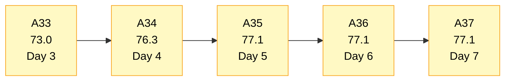
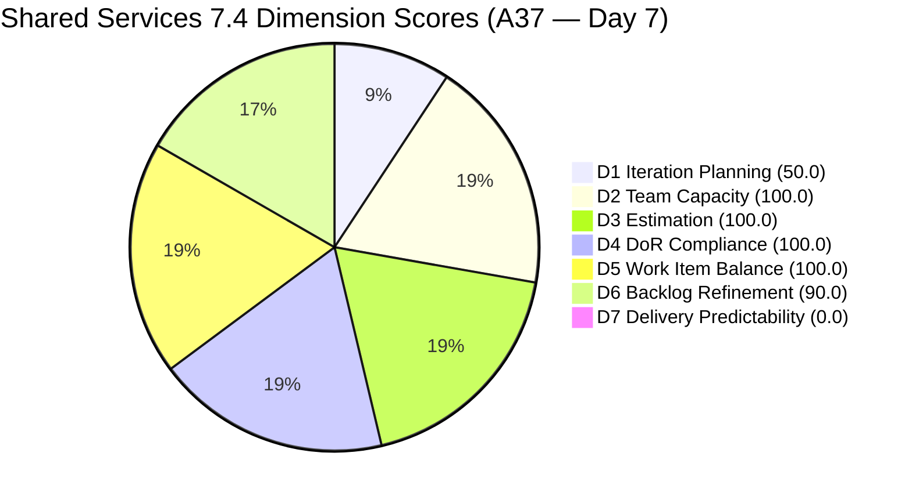
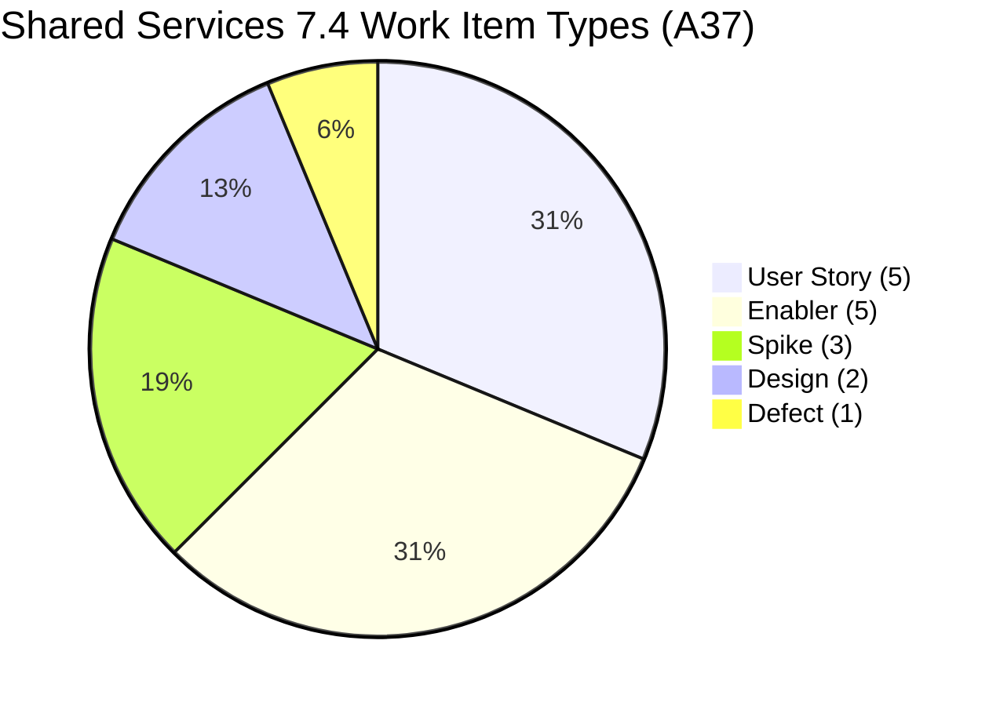
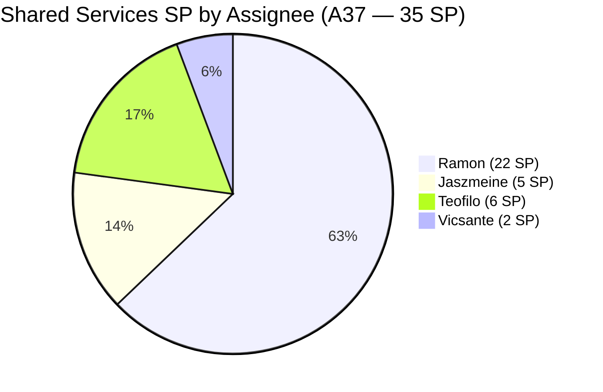
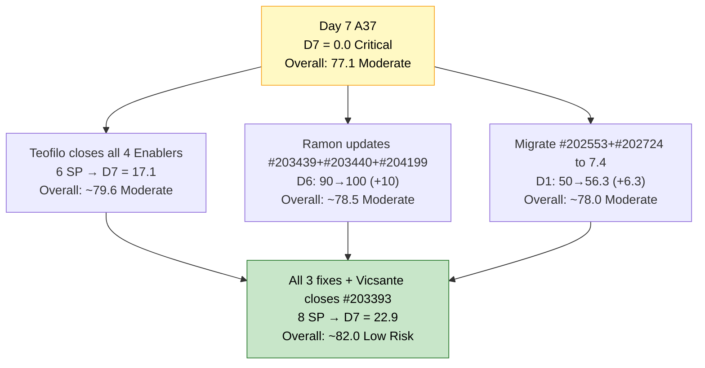
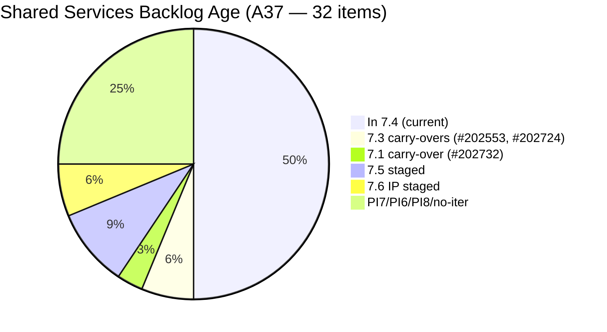

# Shared Services Team — SAFe Iteration Audit A37
**Date:** 2026-05-24 | **Sprint Day:** 7 of 14 — SPRINT ACTIVE | **Iteration:** 7.4 (May 18 – May 31, 2026)
**Auditor:** Claude Code (ADO SAFe Audit Skill v1) | **Prior Audit:** A36 (2026-05-23 09:03)

---

## 1. Audit Metadata

| Field | Value |
|---|---|
| **Audit ID** | A37 |
| **Report File** | `AUDIT_20260524_0903.md` |
| **Prior Audit** | A36 — `AUDIT_20260523_0903.md` (Overall 77.1, Moderate Risk — 7.4 Day 6) |
| **ADO Project** | Jairosoft Portfolio (`666bb99a-6acd-4999-bb34-efd0e4ea90dc`) |
| **ADO Team** | Shared Services Team (`bd9578fd-5773-48fc-bd80-988dfe5de806`) |
| **Iteration** | 7.4 (`16385d00-244a-4caa-9e56-d4a8e850754d`) |
| **Iteration Dates** | May 18 – May 31, 2026 |
| **Sprint Day** | **7 of 14 — SPRINT ACTIVE** |
| **Audit Date** | 2026-05-24 09:03 PHT |
| **Overall Score** | **77.1 — Moderate Risk** |
| **Risk Band** | Moderate (60–79.9) |
| **Visible Backlog Items** | 32 root items |
| **Current Iteration Root Items** | 16 (IterationPath = 7.4) |
| **Capacity Source** | `work_get_team_capacity` — Teofilo 6h, Vicsante 6h, Jaszmeine 3h, Ramon 0.5h = 15.5h/day |
| **Project Exceptions Applied** | None |

---

## 2. Executive Summary

| Field | Value |
|---|---|
| **Overall Score** | **77.1 — Moderate Risk** |
| **Score vs Prior (A36)** | 77.1 → 77.1 (**0.0** — no structural changes detected) |
| **Sprint Day** | **7 of 14 — SPRINT ACTIVE** |
| **Iteration** | 7.4 (May 18 – May 31, 2026) |
| **Items in 7.4** | 16 root items (unchanged) |
| **Committed SP** | 35 SP (unchanged) |
| **SP Closed** | 0 — **CRITICAL: 7 sprint days elapsed with zero deliverables closed** |
| **Risk Band** | Moderate (60–79.9) |

**Day 7 finds Shared Services at a structural inflection point.** The sprint has reached the midpoint entry zone with zero SP closed. All structural dimensions are arithmetically identical to A36 — 16 items, 35 SP committed, same state distribution, same assignees. The score holds at 77.1 Moderate Risk, but the delivery interpretation has materially worsened.

The three untouched items (#203439, #203440, #204199) persist — now at 16, 16, and 9 days untouched respectively — maintaining the D6 −10 penalty. Teofilo's four Active Enablers (#204838, #204840, #204841, #204642) remain the team's best immediate closure candidates with narrow, verifiable ACs. The two 7.3 carry-over Design items (#202553, #202724) remain on the wrong IterationPath, suppressing D1.

The team has 7 days remaining to deliver 35 SP — requiring approximately 5 SP per day to reach 100% predictability. A realistic partial recovery target is 12–14 SP by Day 10 to exit Critical risk on D7.

---

## 3. Previous Audit Delta (A36 → A37)

| Dimension | A36 Score | A37 Score | Delta | Driver |
|---|---|---|---|---|
| D1 Iteration Planning | 50.0 | 50.0 | 0.0 | 16/32 — backlog composition unchanged |
| D2 Team Capacity | 100.0 | 100.0 | 0.0 | All 4 members configured — unchanged |
| D3 Estimation | 100.0 | 100.0 | 0.0 | All 16 items have SP>0 — unchanged |
| D4 DoR Compliance | 100.0 | 100.0 | 0.0 | All 16 items pass DoR — unchanged |
| D5 Work Item Balance | 100.0 | 100.0 | 0.0 | 5 types; max share 31.3% — unchanged |
| D6 Backlog Refinement | 90.0 | 90.0 | 0.0 | 3 untouched items (18.75%) — same 3 as A36, now older |
| D7 Delivery Predictability | 0.0 | 0.0 | 0.0 | **CRITICAL — Day 7; sprint midpoint with zero closures** |
| **Overall** | **77.1** | **77.1** | **0.0** | Score static for second consecutive day; structural risks unchanged |

**No changes across any dimension for the second consecutive day.** The untouched items (#203439 and #203440) are now 16 days without a board update — up from 15 in A36. #204199 is now 9 days untouched. These items have not received a state change, comment, or attachment since they entered the sprint, suggesting they may be lower priority than their 7.4 assignment implies.

---

## 4. Current Iteration Snapshot

| # | Title | Type | State | SP | Assignee | Changed |
|---|---|---|---|---|---|---|
| #202725 | Messaging & Communication | Design | Ready for Design | 3 | Jaszmeine | May 19 |
| #202726 | Booking & Payment Management | Design | Ready for Design | 2 | Jaszmeine | May 19 |
| #203309 | GitHub Token Degradation Fix | Defect | Ready for QA | 1 | Ramon | May 19 |
| #203393 | Claude Course Training | Spike | Active | 2 | Vicsante | May 19 |
| #203436 | Plugin Lifecycle & Extract Skill Verification | User Story | Active | 5 | Ramon | May 19 |
| #203437 | Plugin Generate Skill — Playwright Script Generation | User Story | Ready for Dev | 5 | Ramon | May 19 |
| #203438 | Generate Test Execution Report (/qa-ai:report) | User Story | Ready for Dev | 2 | Ramon | May 19 |
| #203439 | Send Report via Outlook Email (/qa-ai:email) | User Story | Ready for Dev | 3 | Ramon | **May 8** (16 days untouched) |
| #203440 | Scheduled QA Pipeline Orchestration | User Story | Ready for Dev | 3 | Ramon | **May 8** (16 days untouched) |
| #204199 | Request: Add Team Member to Anthropic Enterprise | Spike | Ready | 1 | Ramon | **May 15** (9 days untouched) |
| #204237 | Remove Lifestyle Project from Portfolio Score | Spike | New | 1 | Ramon | May 21 |
| #204238 | Use FinOps Project Board for Admin/HR/Finance | Enabler | Grooming | 1 | Ramon | May 21 |
| #204642 | Clearing AzureDevOps (inactive users) | Enabler | Active | 1 | Teofilo | May 19 |
| #204838 | Adding new Seat in Github | Enabler | Active | 1 | Teofilo | May 22 |
| #204840 | Update Outlook PASS in Colina PASS | Enabler | Active | 2 | Teofilo | May 22 |
| #204841 | Create New Repo for Eingress | Enabler | Active | 2 | Teofilo | May 22 |

**Total: 16 items | 35 SP committed | 0 SP closed**

**Non-current backlog items (16 items):**

| Group | Items | Count | Status |
|---|---|---|---|
| 7.3 carry-overs | #202553 (Design Review, Jaszmeine, May 19), #202724 (Design Review, Jaszmeine, May 19) | 2 | HIGH: update IterationPath to 7.4 |
| 7.1 carry-over | #202732 (Ready for UAT, Teofilo, Apr 27) | 1 | HIGH: close or escalate UAT |
| 7.5 staged | #202727, #203845, #204205 | 3 | OK — correctly staged |
| 7.6 IP | #202947, #204209 | 2 | OK — correctly staged |
| PI7 no-iter | #202061, #202063 (Estimation, Ramon, May 8) | 2 | MODERATE: assign to 7.5 |
| PI6 On-Hold | #201161 (Vicsante, Apr 16) | 1 | MODERATE: close or park |
| PI8 | #201919, #202066, #202069, #202070 | 4 | LOW: triage or icebox |
| No iteration | #186848 (New, Apr 15) | 1 | MODERATE: assign or archive |

---

## 5. Work Item Analysis

### Type Distribution (16 current items)

| Type | Count | Share |
|---|---|---|
| User Story | 5 | 31.3% |
| Enabler | 5 | 31.3% |
| Spike | 3 | 18.8% |
| Design | 2 | 12.5% |
| Defect | 1 | 6.3% |
| **Total** | **16** | **100%** |

Five work item types represented. User Story and Enabler tied as dominant at 31.3% each — below the 60% threshold. No penalty triggers. D5 remains the team's strongest differentiator.

### State Distribution (16 current items)

| State | Count | Items |
|---|---|---|
| Active | 6 | #203393, #203436, #204642, #204838, #204840, #204841 |
| Ready for Dev | 4 | #203437, #203438, #203439, #203440 |
| Ready for Design | 2 | #202725, #202726 |
| Ready for QA | 1 | #203309 |
| Ready | 1 | #204199 |
| New | 1 | #204237 |
| Grooming | 1 | #204238 |

**State distribution identical to A36.** No state transitions have occurred since May 22 (the last board change was Teofilo's Enablers #204838, #204840, #204841 moving to Active on May 22). Teofilo's four Active Enablers represent the most immediately actionable closure candidates.

### Assignee Distribution (16 current items)

| Assignee | Items | SP | Capacity | Risk |
|---|---|---|---|---|
| Ramon | 9 items (#203309, #203436, #203437, #203438, #203439, #203440, #204199, #204237, #204238) | 22 SP | 0.5 h/day | HIGH — load/capacity mismatch |
| Teofilo | 4 items (#204642, #204838, #204840, #204841) | 6 SP | 6.0 h/day | LOW — well-scoped Active items |
| Vicsante | 1 item (#203393) | 2 SP | 6.0 h/day | MODERATE — underutilized capacity |
| Jaszmeine | 2 items (#202725, #202726) | 5 SP | 3.0 h/day | LOW — in Design state, paced |

**Persistent workload concentration:** Ramon holds 56% of sprint items and 63% of story points at 0.5 h/day capacity. The team's delivery trajectory depends disproportionately on Teofilo (6 h/day, 4 Active items) for near-term closures.

### Untouched Items (ChangedDate before sprint start May 18)

| # | Title | Last Changed | Owner | Days Untouched |
|---|---|---|---|---|
| #203439 | Send Report via Outlook Email (/qa-ai:email) | May 8 | Ramon | **16 days** |
| #203440 | Scheduled QA Pipeline Orchestration | May 8 | Ramon | **16 days** |
| #204199 | Request: Add Team Member to Anthropic Enterprise | May 15 | Ramon | **9 days** |

These three items continue to drive the D6 −10 penalty. #203439 and #203440 are now 16 days untouched — up from 15 in A36. The untouched count is confirmed at 3/16 = 18.75%, within the 10–30% range → −10 penalty applies.

---

## 6. SAFe Compliance Scorecard

| Dimension | Score | Band | Evidence | Notes |
|---|---|---|---|---|
| D1 Iteration Planning | 50.0 | High | 16 current / 32 visible | Locked at 50.0 for 7 consecutive days; #202553 and #202724 still on 7.3 |
| D2 Team Capacity | 100.0 | Low | 4/4 members configured | Teofilo 6h, Vicsante 6h, Jaszmeine 3h, Ramon 0.5h |
| D3 Estimation | 100.0 | Low | 16/16 items estimated | All items have SP>0; total 35 SP committed |
| D4 DoR Compliance | 100.0 | Low | 16/16 items pass | Desc≥30 and AC≥20 confirmed for all 16 current items |
| D5 Work Item Balance | 100.0 | Low | Max type 31.3%; Spike 18.8% | 5 types represented; no penalty triggers |
| D6 Backlog Refinement | 90.0 | Low | 3/16 untouched (18.75%) | Base 100; −10 (10–30% untouched); #203439 and #203440 at 16 days |
| D7 Delivery Predictability | **0.0** | **Critical** | 0/35 SP closed | **CRITICAL — Day 7 of 14; midpoint with zero delivery** |
| **OVERALL** | **77.1** | **Moderate** | (50+100+100+100+100+90+0)/7 | Static for second day; D1 and D7 are structural constraints |

---

## 7. Dimension Findings

### D1 — Iteration Planning: 50.0 / 100 — High Risk

**Formula:** 16 / 32 × 100 = **50.0**

| Metric | Value |
|---|---|
| Items in 7.4 | 16 |
| Total visible backlog items | 32 |
| Score | **50.0** |

D1 has been locked at exactly 50.0 for seven consecutive audit days. The backlog remains split 16/32. The immediate structural fix remains available:

| Fix | D1 Impact | Effort |
|---|---|---|
| Migrate #202553 and #202724 from 7.3 → 7.4 IterationPath | 50.0 → 56.3 | 2 minutes |
| Close #202732 (Ready for UAT, 7.1) | Reduces denominator by 1 | 1 minute if UAT done |
| Triage 5–6 PI6/PI7/PI8/no-iter items to icebox | +3–6 points on D1 | 10–15 minutes batch |

Achieving D1 ≥ 60 (Moderate boundary) requires reducing the non-current backlog from 16 to ≤6.7 items relative to current count, or increasing current items. The most accessible path is batch-triaging the 7 PI-level/no-iter items.

---

### D2 — Team Capacity: 100.0 / 100 — Low Risk

**Formula:** 4/4 × 100 = **100.0**

| Member | Capacity/Day | Active Items | Load |
|---|---|---|---|
| Teofilo Limpag | 6.0 h (Development) | 4 Active (#204642, #204838, #204840, #204841) | Balanced |
| Vicsante Aseniero | 6.0 h (Development) | 1 Active (#203393) | Under-loaded |
| Jaszmeine A. Villanueva | 3.0 h (Design) | 2 items in Ready for Design | Appropriate |
| RAMON ASENIERO JR | 0.5 h (Requirements) | 1 Active (#203436); 8 queued | Overloaded |

All four members have capacity configured. D2 = 100.0. Vicsante's underutilization (1 item, 2 SP, 6 h/day) is the team's largest latent throughput opportunity.

---

### D3 — Estimation: 100.0 / 100 — Low Risk

**Formula:** 16/16 × 100 = **100.0**

All 16 current items have Story Points > 0. Total committed: 35 SP. Unchanged since sprint start. No estimation gaps.

---

### D4 — DoR Compliance: 100.0 / 100 — Low Risk

**Formula:** 16/16 × 100 = **100.0**

All 16 current-iteration items verified: Description ≥30 non-whitespace characters AND Acceptance Criteria ≥20 non-whitespace characters. Consistent strength maintained from A36.

**Pre-sprint items at risk:** #204205 ("Procure Used Mobile Device", 7.5, Teofilo) and #204209 ("Container Registry Cost Reduction", 7.6 IP, Teofilo) still have no Description or AC in ADO. Both will fail D4 when their target iterations go live.

---

### D5 — Work Item Balance: 100.0 / 100 — Low Risk

**Formula:** Base 100 − penalties

| Penalty | Trigger | Applied |
|---|---|---|
| −30: dominant_type_share > 60% | Max type = 31.3% (US and Enabler tied) | No |
| −40: no User Story items | User Story present (5 items) | No |
| −20: spike_share > 40% | Spike = 18.8% | No |

**Score:** 100 − 0 = **100.0**

D5 remains Shared Services' structural differentiator. The sprint reflects authentic cross-functional service work: design delivery (Flawless features), developer tooling (qa-ai plugin), DevOps/IT operations (Teofilo's Enablers), and capability development (Vicsante's training Spike). This is the diversity pattern SAFe expects of a shared services team.

---

### D6 — Backlog Refinement: 90.0 / 100 — Low Risk

**Freshness window:** Items with ChangedDate ≥ Apr 9, 2026 (45 days from May 24)

| Metric | Value |
|---|---|
| Total visible backlog items | 32 |
| Fresh items (ChangedDate ≥ Apr 9) | 32 — oldest: #186848 (Apr 15), #201161 (Apr 16) |
| stale_90 items (ChangedDate < Feb 23) | 0 |
| stale_180 items (ChangedDate < Nov 25, 2025) | 0 |
| Untouched current items (ChangedDate < May 18) | 3 (#203439, #203440, #204199) |
| Untouched share | 3/16 = 18.75% → −10 penalty (10–30% range) |
| Score | **90.0** |

**The −10 penalty is worsening by one day per audit:** #203439 and #203440 are now 16 days untouched (up from 15 in A36). The fix remains immediate and low-effort: any state transition on any of the three items clears or reduces the untouched count. Updating all three to Active clears D6 to 100.0, lifting the overall score from 77.1 to ~78.5.

**Path to D6 = 100.0:** Ramon transitions #203439 ("Send Report via Outlook Email") and #203440 ("Scheduled QA Pipeline Orchestration") from "Ready for Dev" to "Active," and updates #204199 ("Add Team Member to Anthropic Enterprise"). This is a 30-second ADO update per item.

---

### D7 — Delivery Predictability: 0.0 / 100 — CRITICAL

**Formula:** 0 / 35 × 100 = **0.0**

| Metric | Value |
|---|---|
| SP closed this sprint | 0 |
| Total committed SP | 35 |
| Score | **0.0** |

> **CRITICAL — Day 7 of 14. No Early-Sprint Annotation.**
>
> The sprint has consumed exactly half its 14-day runway with zero Story Points closed. A healthy sprint at Day 7 should have approximately 14–21 SP closed (40–60% of 35). Shared Services is at 0%.
>
> **Recovery trajectory from Day 7:**
> - Need 14 SP in 7 days to reach 40% (High Risk boundary): ~2 SP/day — achievable if Teofilo delivers today
> - Need 21 SP in 7 days to reach 60% (Moderate Risk): ~3 SP/day — possible with consistent Teofilo + Vicsante throughput
> - Need 28 SP in 7 days to reach 80% (Low Risk): ~4 SP/day — compressed but possible
>
> **Best closure candidates for today (Day 7):**
> - **#204838** (Adding new Seat in Github — Active, Teofilo, 1 SP): Add private user to GitHub org. ~15 minutes
> - **#204840** (Update Outlook PASS in Colina PASS — Active, Teofilo, 2 SP): Update Azure variable. ~30 minutes
> - **#204841** (Create New Repo for Eingress — Active, Teofilo, 2 SP): Create repo and invite devs. ~30 minutes
> - **#204642** (Clearing AzureDevOps — Active, Teofilo, 1 SP): Disable inactive users. ~30 minutes
>
> Teofilo closing all 4 items = 6 SP → D7 = 17.1 (Critical, but trajectory established). Combined with Vicsante closing #203393 (Claude Course, 2 SP if complete) = 8 SP → D7 = 22.9.

---

## 8. Risks and Bottlenecks

| # | Severity | Dimension | Risk | Action |
|---|---|---|---|---|
| R1 | **CRITICAL** | D7 | Day 7: sprint midpoint with zero SP closed. Two consecutive audit days with no board activity. Teofilo's four Active Enablers have been Active since May 19–22 without closure. | Teofilo: close #204838 (1 SP), #204840 (2 SP), and #204841 (2 SP) today. All three became Active May 22 with narrow, verifiable ACs. 5 SP closed → D7 = 14.3 (Critical but trajectory established). |
| R2 | HIGH | D6 | #203439 and #203440 now 16 days untouched (Ramon). Aging by 1 day per audit. | Ramon: transition #203439 and/or #203440 from "Ready for Dev" to "Active." 30-second ADO update. Reduces untouched count toward D6 = 100.0. |
| R3 | HIGH | D1 | D1 locked at 50.0 for 7 consecutive days. #202553 and #202724 remain on 7.3 IterationPath despite active work by Jaszmeine in Design Review. | Update IterationPath of #202553 and #202724 from 7.3 → 7.4 in ADO board. Takes 1 minute per item. D1 improves to 56.3. |
| R4 | HIGH | D7 | #202732 ("Add to Flawless ADO as Stakeholder — QA Intern") in Ready for UAT since Apr 27 — 27 days. No UAT closure signal. | Teofilo: confirm UAT status. If the intern has access, mark #202732 as Closed. Reduces non-current denominator, incrementally improves D1. |
| R5 | MODERATE | Workload | Ramon holds 9/16 items (56%) and 22/35 SP (63%) at 0.5 h/day. Vicsante has 1 item on 6 h/day. | Reassign 1–2 of Ramon's lower-priority queued items (#203437 or #203438) to Vicsante. Better utilizes 6 h/day development capacity. |
| R6 | MODERATE | D4 (future) | #204205 (7.5, Teofilo) and #204209 (7.6 IP, Teofilo) still have no Description or AC. | Teofilo: add Desc (≥30 non-ws chars) and AC (≥20 non-ws chars) to both items before 7.5 starts. |
| R7 | LOW | D1 | 7 PI-level/no-iter items dilute D1 ratio. | Batch-triage: icebox PI8 items (#202066, #202069, #202070), assign PI7 root items (#202061, #202063) to 7.5, close or park PI6 defect #201161, archive #186848. |

---

## 9. Prioritized Recommendations

1. **[CRITICAL — Today Day 7]** Teofilo: close #204838 ("Adding new Seat in Github", 1 SP), #204840 ("Update Outlook PASS in Colina PASS", 2 SP), and #204841 ("Create New Repo for Eingress", 2 SP). All three became Active on May 22 with narrow operational ACs. Closing all three = 5 SP → D7 = 14.3. This establishes the sprint's first velocity reading and prevents a third consecutive day of zero closures.

2. **[CRITICAL — Today]** Also close #204642 ("Clearing AzureDevOps", 1 SP, Active, Teofilo). Disabling inactive ADO users is a bounded, verifiable operational task. Combined with the above three, 6 SP total → D7 = 17.1.

3. **[HIGH — Today]** Ramon: transition #203439 ("Send Report via Outlook Email") and #203440 ("Scheduled QA Pipeline Orchestration") from "Ready for Dev" to "Active." These have been untouched for 16 days. A state change confirms intent and removes the growing untouched anomaly. If all three untouched items (#203439, #203440, #204199) are updated, D6 clears from 90.0 to 100.0, lifting the overall score from 77.1 to ~78.5.

4. **[HIGH — Today/Tomorrow]** Update IterationPath on #202553 and #202724 from 7.3 → 7.4. Jaszmeine is actively working these in Design Review. Their board assignment is the only discrepancy. 1 minute per item, D1 improves from 50.0 to 56.3.

5. **[HIGH — Before Day 8]** Teofilo: close or sign off on #202732 ("Add to Flawless ADO as Stakeholder — QA Intern", 7.1, Ready for UAT). 27 days in Ready for UAT. If access has been confirmed, mark Closed. Reduces non-current carry-over count.

6. **[MODERATE — By Day 8]** Consider reassigning 1–2 of Ramon's "Ready for Dev" items (#203437 or #203438) to Vicsante. Vicsante has 6 h/day capacity and only 1 sprint item (2 SP). This could unlock 5–7 additional SP in the recovery window.

7. **[MODERATE — By Day 9]** Triage the 7 PI-level/PI8/no-iter items (#201161, #186848, #202061, #202063, and PI8 items). Batch-close or icebox to reduce the non-current denominator and improve D1 incrementally.

8. **[MODERATE — Before 7.5]** Teofilo: add Description and Acceptance Criteria to #204205 (7.5) and #204209 (7.6 IP). Both will fail D4 in their target iterations without remediation.

---

## 10. Visualization

### Score Trend (A33 → A37)

### Dimension Scorecard (A37)

### Work Item Type Distribution (16 current items)

### SP by Assignee (35 SP total)

### D7 Recovery Projection — Day 7 Scenarios

### Backlog Age Distribution (32 items)

---

## 11. Evidence Gaps and Limitations

| Gap | Impact | Notes |
|---|---|---|
| D7 = 0 at Day 7 | Critical — no annotation | All 16 items confirmed as Active, Ready for Dev/Design/QA, Ready, New, or Grooming via `wit_get_work_items_batch_by_ids`. No Closed or Done states detected. Score is exact. |
| #202553 and #202724 on IterationPath 7.3 | D1 suppressed at 50.0 | Jaszmeine actively worked these items (changed May 19). Board admin fix required — not a work quality issue. Not counted as current_iteration_root_items per rubric. |
| #204205 and #204209 missing Description and AC | Will fail D4 in future iterations | Out of 7.4 scope for A37. Remediation recommended before these items enter active sprint. |
| Ramon holds 22/35 SP (63%) at 0.5 h/day | Throughput concentration risk | Not a scoring dimension but a real delivery risk. If Ramon's 9 items stall, D7 recovery depends almost entirely on Teofilo and Vicsante. |
| #202732 in Ready for UAT since Apr 27 | Contributes to D1 non-current count | 27 days without UAT closure. If UAT was completed, close immediately. |
| #203845 (7.5, Teofilo, May 5) has no AC field returned | Future D4 risk | Description present but AC field empty in ADO response. Teofilo should add AC before 7.5. |

---

## 12. Audit Trail

| Source | Tool Used | Data Retrieved |
|---|---|---|
| Backlog items | `wit_list_backlog_work_items` (backlogId `Microsoft.RequirementCategory`) | 32 root items visible in backlog |
| Team capacity | `work_get_team_capacity` (iterationId `16385d00-244a-4caa-9e56-d4a8e850754d`) | Teofilo 6h, Vicsante 6h, Jaszmeine 3h, Ramon 0.5h = 15.5h/day |
| Work item details | `wit_get_work_items_batch_by_ids` (32 items) | SP, State, Type, Desc, AC, ChangedDate, IterationPath confirmed for all 32 |
| Current iteration | `work_list_team_iterations` (timeframe=current) | Iteration 7.4 confirmed active: May 18 – May 31, 2026 |
| Prior audit | `AUDIT_20260523_0903.md` (A36) | Overall 77.1, Moderate Risk, 16 items, 35 SP |
