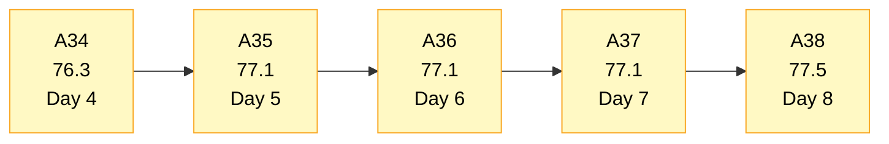
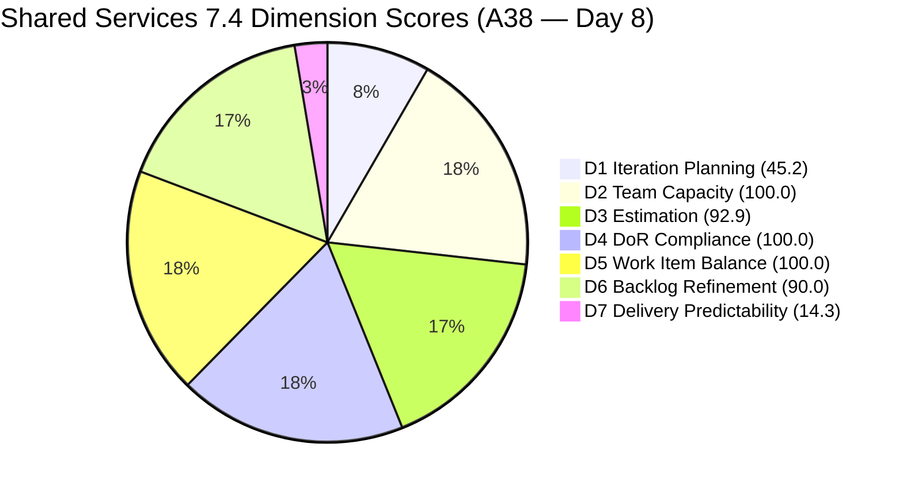
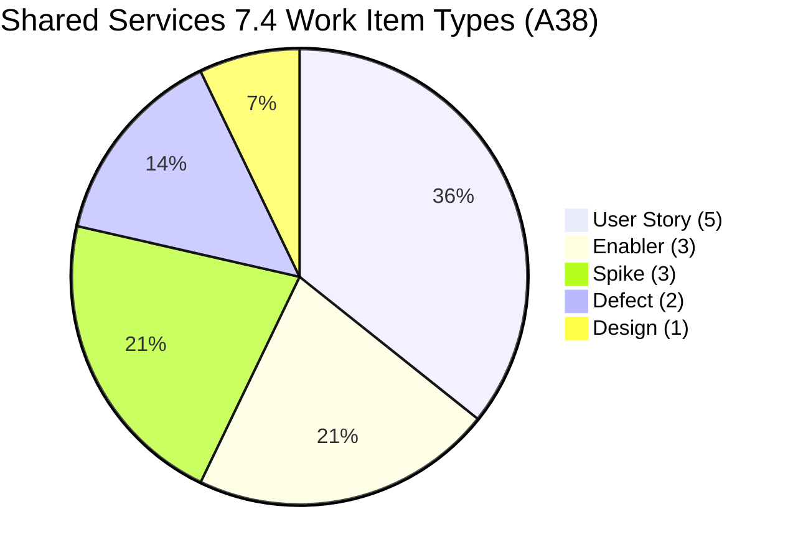
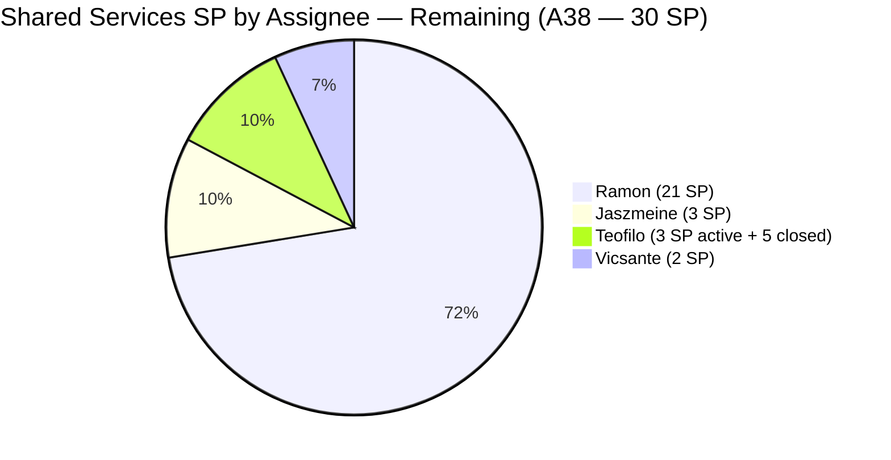
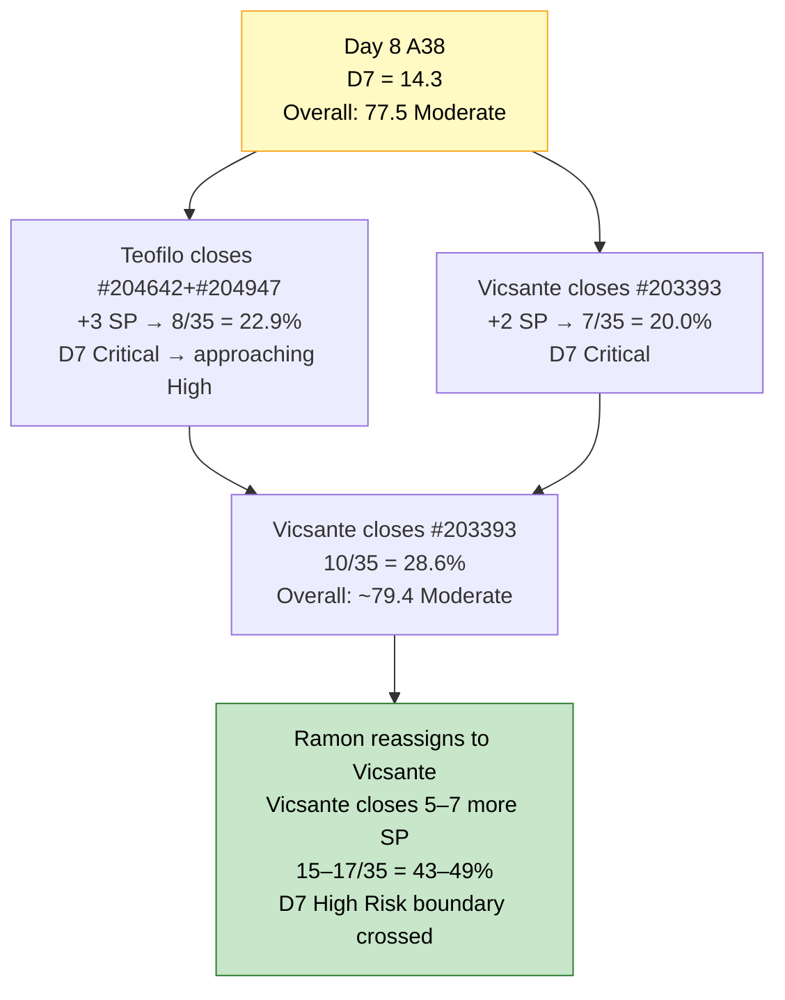
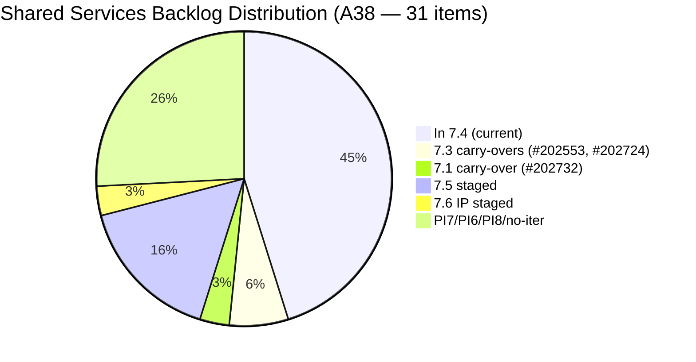

# Shared Services Team — SAFe Iteration Audit A38
**Date:** 2026-05-25 | **Sprint Day:** 8 of 14 — SPRINT ACTIVE | **Iteration:** 7.4 (May 18 – May 31, 2026)
**Auditor:** Claude Code (ADO SAFe Audit Skill v1) | **Prior Audit:** A37 (2026-05-24 09:03)

---

## 1. Audit Metadata

| Field | Value |
|---|---|
| **Audit ID** | A38 |
| **Report File** | `AUDIT_20260525_0900.md` |
| **Prior Audit** | A37 — `AUDIT_20260524_0903.md` (Overall 77.1, Moderate Risk — 7.4 Day 7) |
| **ADO Project** | Jairosoft Portfolio (`666bb99a-6acd-4999-bb34-efd0e4ea90dc`) |
| **ADO Team** | Shared Services Team (`bd9578fd-5773-48fc-bd80-988dfe5de806`) |
| **Iteration** | 7.4 (`16385d00-244a-4caa-9e56-d4a8e850754d`) |
| **Iteration Dates** | May 18 – May 31, 2026 |
| **Sprint Day** | **8 of 14 — SPRINT ACTIVE** |
| **Audit Date** | 2026-05-25 09:00 PHT |
| **Overall Score** | **77.5 — Moderate Risk** |
| **Risk Band** | Moderate (60–79.9) |
| **Visible Backlog Items** | 31 root items (was 32 in A37) |
| **Current Iteration Root Items** | 14 (IterationPath = 7.4; was 16 in A37) |
| **Capacity Source** | `work_get_team_capacity` — Teofilo 6h, Vicsante 6h, Jaszmeine 3h, Ramon 0.5h = 15.5h/day |
| **Project Exceptions Applied** | None |

---

## 2. Executive Summary

| Field | Value |
|---|---|
| **Overall Score** | **77.5 — Moderate Risk** |
| **Score vs Prior (A37)** | 77.1 → 77.5 (**+0.4** — D7 first delivery signal + D1 adjustment) |
| **Sprint Day** | **8 of 14 — SPRINT ACTIVE** |
| **Iteration** | 7.4 (May 18 – May 31, 2026) |
| **Items in 7.4** | 14 root items (down from 16 — 3 closed, 2 added, 1 moved) |
| **Committed SP** | 35 SP (30 remaining + 5 closed) |
| **SP Closed** | **5 SP — FIRST DELIVERY of sprint (14.3%)** |
| **Risk Band** | Moderate (60–79.9) |

**Day 8 brings the sprint's first delivery signal.** Teofilo closed three Enabler items (#204838, #204840, #204841) that were Active since May 22 — accounting for 5 SP (1+2+2). This is the first velocity reading for Iteration 7.4 and represents a meaningful break from the 7-day zero-delivery pattern.

Two new items entered the sprint: #204947 ("Final Checking Bubble Training Machines", Enabler, Active, Teofilo, 2 SP) and #204988 ("Fix Computer of Mark Colina", Defect, Estimation, Teofilo, 0 SP). #202726 ("Booking & Payment Management") moved from 7.4 to 7.5, reducing the in-sprint count by one.

The structural D1 challenge deepens slightly (45.2 → 45.2, effectively unchanged at 14/31). The three untouched items (#203439, #203440, #204199) persist — now aged to 17, 17, and 10 days respectively — maintaining the D6 −10 penalty. D3 drops marginally due to #204988 having 0 SP.

Teofilo must continue closing today to establish sustained velocity. With 6 days remaining and 30 SP still open, the team needs approximately 5 SP/day to reach 100% predictability — only achievable with coordinated multi-member delivery.

---

## 3. Previous Audit Delta (A37 → A38)

| Dimension | A37 Score | A38 Score | Delta | Driver |
|---|---|---|---|---|
| D1 Iteration Planning | 50.0 | 45.2 | **−4.8** | 14 current / 31 visible — #202726 moved to 7.5; backlog net −1; current −2 (+2 new, −3 closed, −1 moved) |
| D2 Team Capacity | 100.0 | 100.0 | 0.0 | All 4 members configured — unchanged |
| D3 Estimation | 100.0 | 92.9 | **−7.1** | #204988 (new Defect) has 0 SP — 13/14 estimated |
| D4 DoR Compliance | 100.0 | 100.0 | 0.0 | All 14 current items pass Desc + AC |
| D5 Work Item Balance | 100.0 | 100.0 | 0.0 | 5 types; max share 35.7% — no penalty triggers |
| D6 Backlog Refinement | 90.0 | 90.0 | 0.0 | 3/14 untouched (21.4%) — same items, now older |
| D7 Delivery Predictability | 0.0 | 14.3 | **+14.3** | **5 SP closed (3 Teofilo Enablers) — first delivery of sprint** |
| **Overall** | **77.1** | **77.5** | **+0.4** | D7 gain partially offset by D1 and D3 drops |

**Key changes from A37 to A38:**
- **CLOSED (removed from backlog):** #204838 (Adding new Seat in Github, 1 SP, Teofilo), #204840 (Update Outlook PASS in Colina PASS, 2 SP, Teofilo), #204841 (Create New Repo for Eingress, 2 SP, Teofilo) → **5 SP delivered**
- **ADDED to 7.4:** #204947 (Final Checking Bubble Training Machines, Enabler, Active, Teofilo, 2 SP), #204988 (Fix Computer of Mark Colina, Defect, Estimation, Teofilo, 0 SP)
- **MOVED from 7.4:** #202726 (Booking & Payment Management, Design, Jaszmeine) → now in 7.5
- **Updated:** #203845 (7.5, Teofilo, changed May 25 — now has full AC for June costing report), #204950 (new 7.5 item added today)

---

## 4. Current Iteration Snapshot

| # | Title | Type | State | SP | Assignee | Changed |
|---|---|---|---|---|---|---|
| #202725 | Messaging & Communication | Design | Ready for Design | 3 | Jaszmeine | May 19 |
| #203309 | GitHub Token Degradation Fix | Defect | Ready for QA | 1 | Ramon | May 19 |
| #203393 | Claude Course Training | Spike | Active | 2 | Vicsante | May 19 |
| #203436 | Plugin Lifecycle & Extract Skill Verification | User Story | Active | 5 | Ramon | May 19 |
| #203437 | Plugin Generate Skill — Playwright Script Generation | User Story | Ready for Dev | 5 | Ramon | May 19 |
| #203438 | Generate Test Execution Report (/qa-ai:report) | User Story | Ready for Dev | 2 | Ramon | May 19 |
| #203439 | Send Report via Outlook Email (/qa-ai:email) | User Story | Ready for Dev | 3 | Ramon | **May 8** (17 days untouched) |
| #203440 | Scheduled QA Pipeline Orchestration | User Story | Ready for Dev | 3 | Ramon | **May 8** (17 days untouched) |
| #204199 | Request: Add Team Member to Anthropic Enterprise | Spike | Ready | 1 | Ramon | **May 15** (10 days untouched) |
| #204237 | Remove Lifestyle Project from Portfolio Score | Spike | New | 1 | Ramon | May 21 |
| #204238 | Use FinOps Project Board for Admin/HR/Finance | Enabler | Grooming | 1 | Ramon | May 21 |
| #204642 | Clearing AzureDevOps (inactive users) | Enabler | Active | 1 | Teofilo | May 19 |
| #204947 | Final Checking Bubble Training Machines | Enabler | Active | 2 | Teofilo | **May 25** (new item) |
| #204988 | Fix Computer of Mark Colina | Defect | Estimation | 0 | Teofilo | **May 25** (new item, 0 SP) |

**Total: 14 items | 30 SP remaining + 5 SP closed = 35 SP committed | 5 SP closed (14.3%)**

**Closed this sprint (no longer in backlog):**

| # | Title | SP | Assignee | Closed |
|---|---|---|---|---|
| #204838 | Adding new Seat in Github | 1 | Teofilo | May 24–25 |
| #204840 | Update Outlook PASS in Colina PASS | 2 | Teofilo | May 24–25 |
| #204841 | Create New Repo for Eingress | 2 | Teofilo | May 24–25 |

**Non-current backlog items (17 total):**

| Group | Items | Count | Status |
|---|---|---|---|
| 7.3 carry-overs | #202553 (Design Review, Jaszmeine, May 19), #202724 (Design Review, Jaszmeine, May 19) | 2 | HIGH: update IterationPath to 7.4 |
| 7.1 carry-over | #202732 (Ready for UAT, Teofilo, Apr 27) | 1 | HIGH: close or confirm UAT |
| 7.5 staged | #202726 (moved today), #202727, #203845, #204205, #204950 | 5 | OK — correctly staged |
| 7.6 IP | #202947 | 1 | OK — correctly staged |
| PI7 no-iter | #202061, #202063 (Estimation, Ramon, May 8) | 2 | MODERATE: assign to 7.5 |
| PI6 On-Hold | #201161 (Vicsante, Apr 16) | 1 | MODERATE: close or park |
| PI8 | #201919, #202066, #202069, #202070 | 4 | LOW: triage or icebox |
| No iteration | #186848 (New, Apr 15) | 1 | MODERATE: assign or archive |

---

## 5. Work Item Analysis

### Type Distribution (14 current items)

| Type | Count | Share |
|---|---|---|
| User Story | 5 | 35.7% |
| Enabler | 3 | 21.4% |
| Spike | 3 | 21.4% |
| Defect | 2 | 14.3% |
| Design | 1 | 7.1% |
| **Total** | **14** | **100%** |

Five work item types represented. User Story dominant at 35.7% — well below the 60% threshold. D5 = 100.0 maintained. The addition of #204988 (Defect) adds a second Defect to the sprint, further diversifying the type mix.

### State Distribution (14 current items)

| State | Count | Items |
|---|---|---|
| Active | 4 | #203393, #203436, #204642, #204947 |
| Ready for Dev | 4 | #203437, #203438, #203439, #203440 |
| Ready for Design | 1 | #202725 |
| Ready for QA | 1 | #203309 |
| Ready | 1 | #204199 |
| New | 1 | #204237 |
| Grooming | 1 | #204238 |
| Estimation | 1 | #204988 |

**Delivery signal established by Teofilo.** The closure of #204838, #204840, #204841 represents the sprint's first productive day. Teofilo's remaining Active items (#204642, #204947) should continue to close. #204988 is in Estimation state with 0 SP — it needs sizing before it can be tracked for delivery.

### Assignee Distribution (14 current items)

| Assignee | Items | SP | Capacity | Risk |
|---|---|---|---|---|
| Ramon | 8 items (#203309, #203436, #203437, #203438, #203439, #203440, #204199, #204237, #204238) | 21 SP | 0.5 h/day | HIGH — load/capacity mismatch |
| Teofilo | 3 items (#204642, #204947, #204988) | 3 SP (+ 5 closed) | 6.0 h/day | LOW — active delivery in progress |
| Vicsante | 1 item (#203393) | 2 SP | 6.0 h/day | MODERATE — underutilized |
| Jaszmeine | 1 item (#202725) | 3 SP | 3.0 h/day | LOW — in Ready for Design |

**Teofilo accounts for 100% of sprint deliveries so far.** Ramon still holds 60% of remaining items (21 SP) at 0.5h/day — a persistent throughput concentration risk. Vicsante's 6h/day is largely untapped with only 1 Active item.

### Untouched Items (ChangedDate before sprint start May 18)

| # | Title | Last Changed | Owner | Days Untouched |
|---|---|---|---|---|
| #203439 | Send Report via Outlook Email (/qa-ai:email) | May 8 | Ramon | **17 days** |
| #203440 | Scheduled QA Pipeline Orchestration | May 8 | Ramon | **17 days** |
| #204199 | Request: Add Team Member to Anthropic Enterprise | May 15 | Ramon | **10 days** |

Same three items, one additional day each. The −10 D6 penalty continues. The untouched count is 3/14 = 21.4%, still in the 10–30% range.

---

## 6. SAFe Compliance Scorecard

| Dimension | Score | Band | Evidence | Notes |
|---|---|---|---|---|
| D1 Iteration Planning | **45.2** | High | 14 current / 31 visible | Down from 50.0 — #202726 moved to 7.5; 2 new items added, 3 closed; net backlog −1, net current −2 |
| D2 Team Capacity | 100.0 | Low | 4/4 members configured | Teofilo 6h, Vicsante 6h, Jaszmeine 3h, Ramon 0.5h — unchanged |
| D3 Estimation | **92.9** | Low | 13/14 items estimated | #204988 (new Defect) has 0 SP; all others have SP>0 |
| D4 DoR Compliance | 100.0 | Low | 14/14 items pass | Desc≥30 and AC≥20 confirmed for all 14 current items |
| D5 Work Item Balance | 100.0 | Low | Max type 35.7%; Spike 21.4% | 5 types; no penalty triggers — maintained |
| D6 Backlog Refinement | 90.0 | Low | 3/14 untouched (21.4%) | Base 100; −10 (10–30% untouched); #203439 and #203440 at 17 days |
| D7 Delivery Predictability | **14.3** | Critical | 5/35 SP closed | **FIRST DELIVERY: +14.3 from 0.0 — Teofilo closed 3 Enablers (5 SP). Still Critical.** |
| **OVERALL** | **77.5** | **Moderate** | (45.2+100+92.9+100+100+90+14.3)/7 | +0.4 from A37; D7 gain offset by D1 and D3 drops |

---

## 7. Dimension Findings

### D1 — Iteration Planning: 45.2 / 100 — High Risk

**Formula:** 14 / 31 × 100 = **45.2**

| Metric | Value |
|---|---|
| Items in 7.4 | 14 |
| Total visible backlog items | 31 |
| Score | **45.2** |

D1 dropped from 50.0 to 45.2 due to net backlog changes: 3 items closed (removed from visible), 2 new items added (#204947, #204988), and #202726 moved from 7.4 to 7.5. The net effect was −1 visible backlog item but −2 current-iteration items (the closures and the move). The ratio worsened.

The structural path to D1 improvement remains unchanged:

| Fix | D1 Impact | Effort |
|---|---|---|
| Migrate #202553 and #202724 from 7.3 → 7.4 IterationPath | 45.2 → 51.6 | 2 minutes |
| Add estimated SP to #204988 (0 SP Defect) | No D1 impact | 1 minute |
| Triage 7 PI-level/no-iter items to icebox | +3–7 points | 10–15 min |
| Close #202732 (7.1, Ready for UAT, 28 days) | Reduces non-current by 1 | 1 minute |

D1 ≥ 50.0 requires current / total > 0.50 → 14/28 = exactly 50.0. The closest path: reduce visible non-current items by 3 (e.g., close/remove #202732, #186848, #201161).

---

### D2 — Team Capacity: 100.0 / 100 — Low Risk

**Formula:** 4/4 × 100 = **100.0**

| Member | Capacity/Day | Active Items | Load |
|---|---|---|---|
| Teofilo Limpag | 6.0 h (Development) | 2 Active (#204642, #204947) + #204988 in Estimation | Optimal — delivering |
| Vicsante Aseniero | 6.0 h (Development) | 1 Active (#203393) | Under-loaded |
| Jaszmeine A. Villanueva | 3.0 h (Design) | 1 item in Ready for Design (#202725) | Appropriate |
| RAMON ASENIERO JR | 0.5 h (Requirements) | 1 Active (#203436); 7 queued | Overloaded |

All four members have capacity configured. D2 = 100.0. Teofilo's delivery today validates his active status. Vicsante's latent capacity (6h/day, 1 item) is the team's largest untapped throughput resource.

---

### D3 — Estimation: 92.9 / 100 — Low Risk

**Formula:** 13/14 × 100 = **92.9**

| Metric | Value |
|---|---|
| point_eligible_current_items | 14 (all types expose SP field) |
| estimated_current_items (SP>0) | 13 |
| Unestimated | #204988 (Fix Computer of Mark Colina — 0 SP, Estimation state) |
| Score | **92.9** |

**Drop from 100.0.** #204988 is a new Defect added on May 25 in "Estimation" state with 0 Story Points. The item needs sizing before it can contribute to committed SP or be tracked for delivery. Teofilo should add an SP estimate (likely 1 SP for a desktop support fix) immediately.

---

### D4 — DoR Compliance: 100.0 / 100 — Low Risk

**Formula:** 14/14 × 100 = **100.0**

All 14 current-iteration items verified: Description ≥30 non-whitespace characters AND Acceptance Criteria ≥20 non-whitespace characters. #204988 has both fields present. D4 = 100.0.

**Pre-sprint items at risk (unchanged):** #204205 ("Procure Used Mobile Device", 7.5, Teofilo) still has no Description or AC. Will fail D4 when 7.5 goes live.

---

### D5 — Work Item Balance: 100.0 / 100 — Low Risk

**Formula:** Base 100 − penalties

| Penalty | Trigger | Applied |
|---|---|---|
| −30: dominant_type_share > 60% | US = 35.7% | No |
| −40: no User Story items | User Story present (5 items) | No |
| −20: spike_share > 40% | Spike = 21.4% | No |

**Score:** 100 − 0 = **100.0**

D5 remains Shared Services' structural differentiator. Five types represented. The addition of #204988 (Defect) slightly increases Defect share from 6.3% to 14.3% while all other shares adjust proportionally — no penalty threshold crossed.

---

### D6 — Backlog Refinement: 90.0 / 100 — Low Risk

**Freshness window:** Items with ChangedDate ≥ Apr 10, 2026 (45 days from May 25)

| Metric | Value |
|---|---|
| Total visible backlog items | 31 |
| Fresh items (ChangedDate ≥ Apr 10) | 31 — oldest: #186848 (Apr 15), #201161 (Apr 16) |
| stale_90 items (ChangedDate < Feb 24) | 0 |
| stale_180 items (ChangedDate < Nov 26, 2025) | 0 |
| Untouched current items (ChangedDate < May 18) | 3 (#203439, #203440, #204199) |
| Untouched share | 3/14 = 21.4% → −10 penalty (10–30% range) |
| Score | **90.0** |

**The −10 penalty is one day older.** #203439 and #203440 are now 17 days untouched (up from 16 in A37). The fix is immediate: any state transition on any of the three items reduces or clears the untouched count. Ramon transitioning #203439 and #203440 from "Ready for Dev" to "Active" clears the penalty → D6 = 100.0 → Overall ≈ 78.9.

---

### D7 — Delivery Predictability: 14.3 / 100 — Critical

**Formula:** 5 / 35 × 100 = **14.3**

| Metric | Value |
|---|---|
| SP closed this sprint | 5 (#204838=1 SP, #204840=2 SP, #204841=2 SP) |
| Total committed SP (remaining + closed) | 35 |
| Score | **14.3** |

> **FIRST DELIVERY — Day 8. Still Critical band but trajectory established.**
>
> Teofilo closed three Enabler items between A37 and A38: #204838 (Adding new Seat in Github, 1 SP), #204840 (Update Outlook PASS in Colina PASS, 2 SP), #204841 (Create New Repo for Eingress, 2 SP). These were the "best immediate closure candidates" recommended in A37.
>
> D7 moves from 0.0 (Critical) to 14.3 (still Critical, but now on the board). The trajectory matters:
>
> **Recovery from Day 8 (6 days remaining):**
> - Current: 5/35 SP = 14.3% (Critical)
> - Need 14 SP more (total 19 SP) to reach 40% threshold (High Risk boundary)
> - Need 21 SP more (total 26 SP) to reach 60% (Moderate Risk)
> - Need 28 SP more (total 33 SP) to reach 80% (Low Risk)
>
> At Teofilo's demonstrated velocity (5 SP in ~1 day), 6 more days could theoretically yield 30 additional SP — but this assumes all remaining Teofilo items close, plus significant contribution from others.
>
> **Next closure candidates (Day 8):**
> - **#204642** (Clearing AzureDevOps, Active, Teofilo, 1 SP): Disable inactive users — ~30 min
> - **#204947** (Final Checking Bubble Training Machines, Active, Teofilo, 2 SP): Check machine requirements — ~1–2 hrs
> - **#203393** (Claude Course Training, Active, Vicsante, 2 SP): 4 modules — if completed, close today

---

## 8. Risks and Bottlenecks

| # | Severity | Dimension | Risk | Action |
|---|---|---|---|---|
| R1 | HIGH | D7 | 14.3% delivery at Day 8. 30 SP remaining in 6 days. Even maintaining Teofilo's pace (5 SP/day), most of Ramon's 21 SP will not close without reprioritization. | Ramon: reassign #203437 and #203438 to Vicsante. These are active development items in "Ready for Dev" — Vicsante has 6h/day and 1 active item. Unlocks 7 SP in the recovery window. |
| R2 | HIGH | D1 | D1 dropped to 45.2 (High Risk). #202553 and #202724 still on 7.3 IterationPath despite Jaszmeine working them in Design Review. | Update IterationPath on #202553 and #202724 to 7.4. 1 minute each. D1 improves to 51.6. |
| R3 | HIGH | D6 | #203439 and #203440 now 17 days untouched. The −10 D6 penalty is aging. | Ramon: transition #203439 and #203440 from "Ready for Dev" to "Active" today. If assigned to Vicsante (R1 action), the state change and ownership transfer resolves both risks simultaneously. |
| R4 | MODERATE | D3 | #204988 (Fix Computer of Mark Colina) has 0 SP. It is in Estimation state — must be sized before closing to count toward D7. | Teofilo: add SP estimate to #204988 immediately (likely 1 SP). Otherwise closure of this item contributes 0 to D7 numerator even if closed. |
| R5 | MODERATE | D7 | #202732 in Ready for UAT since Apr 27 (28 days). QA intern access was the sole AC. | Teofilo: confirm whether QA intern has access. If yes, close #202732 immediately. This removes 1 item from non-current backlog and improves D1 by ~0.1. |
| R6 | MODERATE | D4 (future) | #204205 (7.5, Teofilo) has no Description or AC. #203845 now has AC (updated May 25) — resolved. | Teofilo: add Desc+AC to #204205 before 7.5 sprint starts. #203845 is now resolved. |
| R7 | LOW | D1 | 7 PI-level/no-iter items dilute D1 ratio. | Batch-triage: icebox PI8 items (#201919, #202066, #202069, #202070), assign PI7 root items (#202061, #202063) to 7.5, close/park #201161 (PI6 defect), archive #186848. |

---

## 9. Prioritized Recommendations

1. **[HIGH — Today Day 8]** Teofilo: close #204642 ("Clearing AzureDevOps", Active, 1 SP) and #204947 ("Final Checking Bubble Training Machines", Active, 2 SP). Both became Active before/on May 25 with verifiable operational ACs. Closing both = 3 SP today → cumulative D7 = 22.9 (total 8/35 SP). Also immediately estimate #204988 (0 SP → set to 1 SP) so closure counts toward D7.

2. **[HIGH — Today]** Vicsante: close #203393 ("Claude Course Training", Active, 2 SP, Spike) if the 4 modules are complete. If complete but not closed, a state change today = 10/35 SP = 28.6% predictability. Combined with Teofilo's actions: potential 10/35 = 28.6% by end of Day 8.

3. **[HIGH — Today]** Ramon: reassign #203437 ("Plugin Generate Skill", 5 SP) and #203438 ("Generate Test Execution Report", 2 SP) to Vicsante. Vicsante has 6h/day development capacity and currently holds only 1 item. This frees 7 SP into Vicsante's queue for Days 8–13, potentially recovering the sprint's largest velocity block.

4. **[HIGH — Today]** Ramon: transition #203439 ("Send Report via Outlook Email", 17 days untouched) and #203440 ("Scheduled QA Pipeline Orchestration", 17 days untouched) to Active. If these items are reassigned to Vicsante (per R3/R1 combined action), the transition and ownership change clear the D6 penalty simultaneously → D6 = 100.0 → Overall ≈ 79.0.

5. **[HIGH — Today/Tomorrow]** Update IterationPath of #202553 and #202724 from 7.3 → 7.4 in ADO. Jaszmeine is actively working these items. Board admin discrepancy only — D1 improves from 45.2 to 51.6.

6. **[MODERATE — Before Day 9]** Teofilo: add Story Points to #204988 (Defect, currently 0 SP, Estimation state). A desktop support fix of this scope is approximately 1 SP. Without SP, closure of this item contributes $0 to D7.

7. **[MODERATE — By Day 9]** Teofilo: close or sign off on #202732 ("Add to Flawless ADO as Stakeholder — QA Intern", 7.1, Ready for UAT). 28 days in Ready for UAT — the access should either be confirmed or the item should be closed as Done/Rejected.

8. **[LOW — By Day 10]** Batch-triage the 7 PI-level/PI8/no-iter items. Icebox or archive to reduce the non-current denominator and improve D1 over next few audits.

---

## 10. Visualization

### Score Trend (A34 → A38)

### Dimension Scorecard (A38)

### Work Item Type Distribution (14 current items)

### SP by Assignee — Remaining (30 SP)

### D7 Recovery Projection — Day 8 Scenarios

### Backlog Distribution (31 items)

---

## 11. Evidence Gaps and Limitations

| Gap | Impact | Notes |
|---|---|---|
| #204838, #204840, #204841 closure dates not confirmed in API | D7 scored on absence from backlog | These three items were in A37's 7.4 list but are absent from today's `wit_list_backlog_work_items` response. This indicates closure (removed from active backlog). Their SP (1+2+2=5) counted as closed. Exact closure timestamps not retrieved — inferred from absence. |
| #204988 has 0 SP in Estimation state | D3 drops from 100.0 to 92.9 | New item added to sprint today. SP field returned as null/absent. Until estimated, it counts as point_eligible but not estimated. D7 impact: if closed at 0 SP, contributes nothing to D7 numerator. |
| #202553 and #202724 IterationPath still 7.3 | D1 suppressed | These items are actively worked by Jaszmeine (changed May 19) but board admin path is wrong. Not counted as current_iteration_root_items per rubric. Fix is a 2-minute ADO admin update. |
| #204205 missing Description and AC | Future D4 risk | Out of 7.4 scope. Risk materializes when 7.5 starts. #203845 is now resolved (full AC added May 25). |
| Ramon 21 SP / 0.5h capacity | Throughput risk not captured in scoring | 60% of remaining committed SP is held by a member with 0.5h/day capacity. If Ramon does not reassign or accelerate, D7 recovery depends entirely on Teofilo and Vicsante completing 14 SP in 6 days. |

---

## 12. Audit Trail

| Source | Tool Used | Data Retrieved |
|---|---|---|
| Current iteration | `work_list_team_iterations` (timeframe=current, project `666bb99a-6acd-4999-bb34-efd0e4ea90dc`, team `bd9578fd-5773-48fc-bd80-988dfe5de806`) | Iteration 7.4 confirmed: May 18–31, ID `16385d00-244a-4caa-9e56-d4a8e850754d` |
| Backlog items | `wit_list_backlog_work_items` (backlogId `Microsoft.RequirementCategory`) | 31 root items (down from 32 in A37) |
| Work item details | `wit_get_work_items_batch_by_ids` (31 items) | SP, State, Type, Desc, AC, ChangedDate, IterationPath confirmed for all 31 |
| Team capacity | `work_get_team_capacity` (iterationId `16385d00-244a-4caa-9e56-d4a8e850754d`) | Teofilo 6h, Vicsante 6h, Jaszmeine 3h, Ramon 0.5h = 15.5h/day — unchanged |
| Prior audit | `AUDIT_20260524_0903.md` (A37) | Overall 77.1, Moderate Risk, 16 items, 35 SP |
