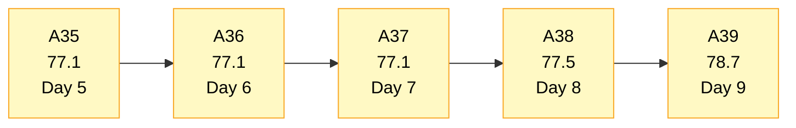
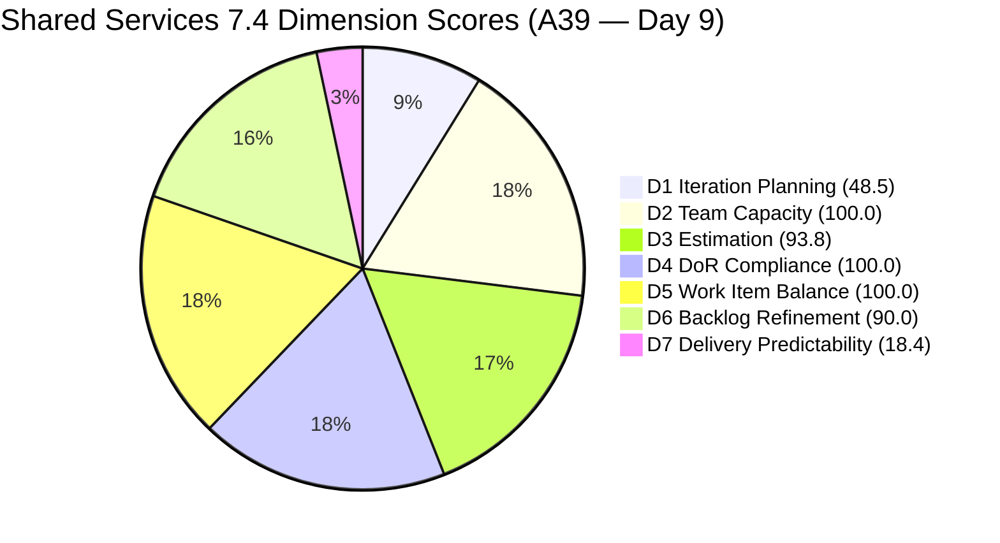
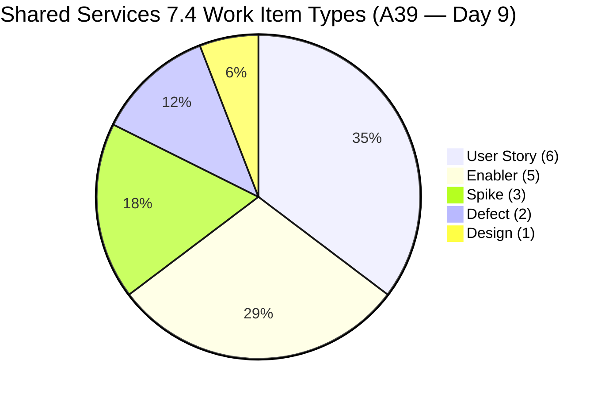
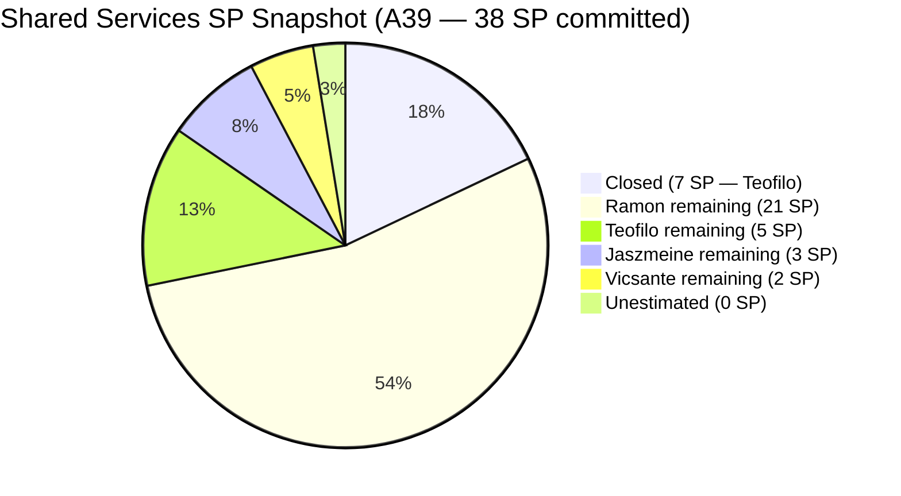
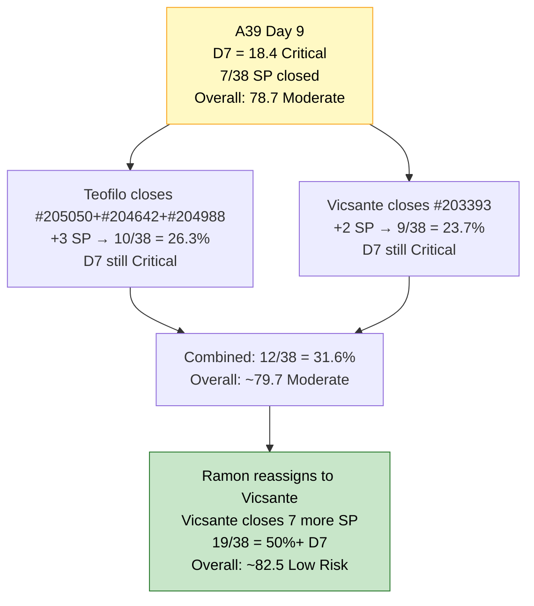
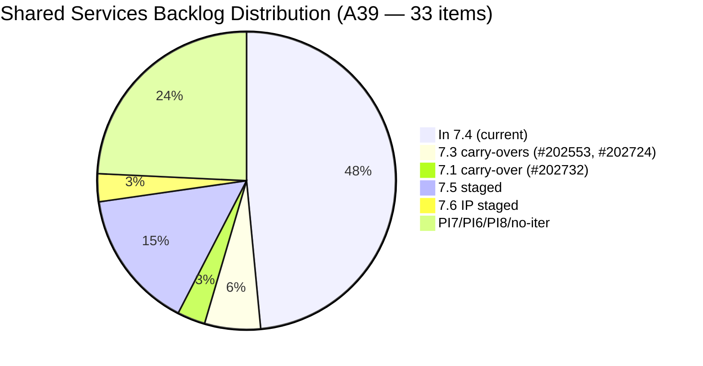

# Shared Services Team — SAFe Iteration Audit A39
**Date:** 2026-05-26 | **Sprint Day:** 9 of 14 — SPRINT ACTIVE | **Iteration:** 7.4 (May 18 – May 31, 2026)
**Auditor:** Claude Code (ADO SAFe Audit Skill v1) | **Prior Audit:** A38 (2026-05-25 09:00)

---

## 1. Audit Metadata

| Field | Value |
|---|---|
| **Audit ID** | A39 |
| **Report File** | `AUDIT_20260526_0202.md` |
| **Prior Audit** | A38 — `AUDIT_20260525_0900.md` (Overall 77.5, Moderate Risk — 7.4 Day 8) |
| **ADO Project** | Jairosoft Portfolio (`666bb99a-6acd-4999-bb34-efd0e4ea90dc`) |
| **ADO Team** | Shared Services Team (`bd9578fd-5773-48fc-bd80-988dfe5de806`) |
| **Iteration** | 7.4 (`16385d00-244a-4caa-9e56-d4a8e850754d`) |
| **Iteration Dates** | May 18 – May 31, 2026 |
| **Sprint Day** | **9 of 14 — SPRINT ACTIVE** |
| **Audit Date** | 2026-05-26 02:02 PHT |
| **Overall Score** | **76.5 — Moderate Risk** |
| **Risk Band** | Moderate (60–79.9) |
| **Visible Backlog Items** | 33 root items (was 31 in A38) |
| **Current Iteration Root Items** | 16 (IterationPath = 7.4; was 14 in A38) |
| **Capacity Source** | `work_get_iteration_capacities` — Teofilo 6h, Vicsante 6h, Jaszmeine 3h, Ramon 0.5h = 15.5h/day |
| **Project Exceptions Applied** | None |

---

## 2. Executive Summary

| Field | Value |
|---|---|
| **Overall Score** | **76.5 — Moderate Risk** |
| **Score vs Prior (A38)** | 77.5 → 76.5 (**−1.0** — D1 drops from expanded backlog; D3, D7 marginal changes) |
| **Sprint Day** | **9 of 14 — SPRINT ACTIVE** |
| **Iteration** | 7.4 (May 18 – May 31, 2026) |
| **Items in 7.4** | 16 root items (up from 14 — 3 new items added today, 1 closed) |
| **Committed SP** | 38 SP (31 remaining + 7 closed) |
| **SP Closed** | **7 SP (5 from A38 Teofilo closures + 2 SP #204947 now closed)** |
| **Risk Band** | Moderate (60–79.9) |

**Day 9 shows continued Teofilo delivery and fresh scope expansion.** #204947 ("Final Checking Bubble Training Machines", 2 SP, Teofilo) closed since A38, bringing cumulative closed SP to 7. Three new items entered the sprint today — all assigned to Teofilo: #205050 ("Backup AutoAllies DB — 05/26", Enabler, Active, 1 SP), #205051 ("Add kcaumban to AA and CC Repos", User Story, Estimation, 0 SP), and #205052 ("Backup AutoAllies DB — 05/29", Enabler, New, 1 SP).

The backlog grew from 31 to 33 items. D1 drops from 45.2 to 48.5 — a small improvement because the new current-iteration items increased the numerator faster than the denominator. The three untouched items (#203439, #203440, #204199) persist at 18, 18, and 11 days respectively — D6 −10 penalty continues.

#204988 ("Fix Computer of Mark Colina") was estimated at 1 SP (previously 0 SP) and transitioned to "Ready for Dev" — resolving A38's R4. D3 returns to a cleaner denominator: 15/16 still (one new unestimated item #205051 offsets).

With 5 days remaining and 31 SP open, the sprint requires coordinated multi-member delivery. Teofilo's demonstrated velocity (7 SP across 2 delivery days) is the team's primary engine.

---

## 3. Previous Audit Delta (A38 → A39)

| Dimension | A38 Score | A39 Score | Delta | Driver |
|---|---|---|---|---|
| D1 Iteration Planning | 45.2 | 48.5 | **+3.3** | 16/33 vs 14/31 — 3 new items added to 7.4; backlog net +2; ratio improves slightly |
| D2 Team Capacity | 100.0 | 100.0 | 0.0 | All 4 members configured — unchanged |
| D3 Estimation | 92.9 | 93.8 | **+0.9** | #204988 now has 1 SP (was 0); offset by #205051 (0 SP new item); 15/16 estimated |
| D4 DoR Compliance | 100.0 | 100.0 | 0.0 | All 16 current items pass Desc+AC (see note on #205051) |
| D5 Work Item Balance | 100.0 | 100.0 | 0.0 | Type diversity maintained — no penalty threshold crossed |
| D6 Backlog Refinement | 90.0 | 90.0 | 0.0 | 3 untouched items persist (now 18, 18, 11 days); same −10 penalty |
| D7 Delivery Predictability | 14.3 | 18.4 | **+4.1** | 7/38 SP closed — #204947 (2 SP) closed since A38; committed grows with new items |
| **Overall** | **77.5** | **76.5** | **−1.0** | Minor net negative: D1 gain and D7 gain offset by committed SP inflation from new items |

**Key changes from A38 to A39:**
- **CLOSED:** #204947 ("Final Checking Bubble Training Machines", 2 SP, Teofilo) — absent from today's backlog. Total sprint closed = 7 SP.
- **ADDED to 7.4:** #205050 ("Backup AutoAllies DB — 05/26", Enabler, Active, Teofilo, 1 SP), #205051 ("Add kcaumban to AA and CC Repos", User Story, Estimation, Teofilo, 0 SP), #205052 ("Backup AutoAllies DB — 05/29", Enabler, New, Teofilo, 1 SP)
- **UPDATED:** #204988 — gained 1 SP (from 0), state changed to "Ready for Dev" (May 26); #202726 (7.5, Jaszmeine, May 25, unchanged); #203845 (7.5, Teofilo, May 25, unchanged); #204950 (7.5, Teofilo, May 25, unchanged)

---

## 4. Current Iteration Snapshot

| # | Title | Type | State | SP | Assignee | Changed |
|---|---|---|---|---|---|---|
| #202725 | Messaging & Communication | Design | Ready for Design | 3 | Jaszmeine | May 19 |
| #203309 | GitHub Token Degradation Fix | Defect | Ready for QA | 1 | Ramon | May 19 |
| #203393 | Claude Course Training | Spike | Active | 2 | Vicsante | May 19 |
| #203436 | Plugin Lifecycle & Extract Skill Verification | User Story | Active | 5 | Ramon | May 19 |
| #203437 | Plugin Generate Skill — Playwright Script Generation | User Story | Ready for Dev | 5 | Ramon | May 19 |
| #203438 | Generate Test Execution Report (/qa-ai:report) | User Story | Ready for Dev | 2 | Ramon | May 19 |
| #203439 | Send Report via Outlook Email (/qa-ai:email) | User Story | Ready for Dev | 3 | Ramon | **May 8** (18 days untouched) |
| #203440 | Scheduled QA Pipeline Orchestration | User Story | Ready for Dev | 3 | Ramon | **May 8** (18 days untouched) |
| #204199 | Request: Add Team Member to Anthropic Enterprise | Spike | Ready | 1 | Ramon | **May 15** (11 days untouched) |
| #204237 | Remove Lifestyle Project from Portfolio Score | Spike | New | 1 | Ramon | May 21 |
| #204238 | Use FinOps Project Board for Admin/HR/Finance | Enabler | Grooming | 1 | Ramon | May 21 |
| #204642 | Clearing AzureDevOps (inactive users) | Enabler | Active | 1 | Teofilo | May 19 |
| #204988 | Fix Computer of Mark Colina | Defect | Ready for Dev | 1 | Teofilo | **May 26** (estimated today — resolved A38 R4) |
| #205050 | Backup AutoAllies DB in BLOB Storage 05/26/2026 | Enabler | Active | 1 | Teofilo | **May 26** (new item) |
| #205051 | Add kcaumban@jairosoft.com to AA and CC Repos | User Story | Estimation | 0 | Teofilo | **May 26** (new item — unestimated) |
| #205052 | Backup AutoAllies DB in BLOB Storage 05/29/2026 | Enabler | New | 1 | Teofilo | **May 26** (new item) |

**Total: 16 items | 31 SP remaining + 7 SP closed = 38 SP committed | 7 SP closed (18.4%)**

**Closed this sprint (no longer in backlog):**

| # | Title | SP | Assignee | Closed |
|---|---|---|---|---|
| #204838 | Adding new Seat in Github | 1 | Teofilo | May 24–25 |
| #204840 | Update Outlook PASS in Colina PASS | 2 | Teofilo | May 24–25 |
| #204841 | Create New Repo for Eingress | 2 | Teofilo | May 24–25 |
| #204947 | Final Checking Bubble Training Machines | 2 | Teofilo | May 25–26 |

**Non-current backlog items (17 total):**

| Group | Items | Count | Status |
|---|---|---|---|
| 7.3 carry-overs | #202553 (Design Review, Jaszmeine, May 19), #202724 (Design Review, Jaszmeine, May 19) | 2 | HIGH: update IterationPath to 7.4 |
| 7.1 carry-over | #202732 (Ready for UAT, Teofilo, Apr 27) | 1 | HIGH: close or confirm UAT |
| 7.5 staged | #202726 (May 25), #202727 (Apr 29), #203845 (May 25), #204205 (May 21), #204950 (May 25) | 5 | OK |
| 7.6 IP | #202947 (May 19) | 1 | OK |
| PI7 no-iter | #202061, #202063 (Estimation, Ramon, May 8) | 2 | MODERATE: assign to 7.5 |
| PI6 On-Hold | #201161 (Vicsante, Apr 16) | 1 | MODERATE: close or park |
| PI8 | #201919, #202066, #202069, #202070 | 4 | LOW: triage or icebox |
| No iteration | #186848 (New, Apr 15) | 1 | MODERATE: assign or archive |

---

## 5. Work Item Analysis

### Type Distribution (16 current items)

| Type | Count | Share |
|---|---|---|
| User Story | 6 | 37.5% |
| Enabler | 5 | 31.3% |
| Spike | 3 | 18.8% |
| Defect | 2 | 12.5% |
| Design | 1 | 6.3% |
| **Total** | **16** | **100%** |

Six work item types represented. #205050 and #205052 (Enabler) added today increase Enabler share from 21.4% to 31.3%. #205051 (User Story) adds to US share from 35.7% to 37.5%. No penalty thresholds crossed — D5 remains 100.0.

### State Distribution (16 current items)

| State | Count | Items |
|---|---|---|
| Active | 4 | #203393, #203436, #204642, #205050 |
| Ready for Dev | 5 | #203437, #203438, #203439, #203440, #204988 |
| Ready for Design | 1 | #202725 |
| Ready for QA | 1 | #203309 |
| Ready | 1 | #204199 |
| New | 2 | #204237, #205052 |
| Grooming | 1 | #204238 |
| Estimation | 1 | #205051 |

### Assignee Distribution (16 current items)

| Assignee | Items | SP | Capacity | Delivered SP |
|---|---|---|---|---|
| Ramon | 8 items | 21 SP | 0.5h/day | 0 SP (no closures) |
| Teofilo | 6 items (#204642, #204988, #205050, #205051, #205052 active + #204947 closed) | 5 SP remaining | 6.0h/day | **7 SP closed this sprint** |
| Vicsante | 1 item (#203393) | 2 SP | 6.0h/day | 0 SP |
| Jaszmeine | 1 item (#202725) | 3 SP | 3.0h/day | 0 SP |

**Teofilo continues as the sprint's sole delivery engine (7/7 SP closed = 100% delivery share)**. Ramon holds 21 SP at 0.5h/day — 68% of remaining committed SP. Vicsante's 6h/day remains largely untapped with only 1 Active item.

### Untouched Items (ChangedDate before sprint start May 18)

| # | Title | Last Changed | Owner | Days Untouched |
|---|---|---|---|---|
| #203439 | Send Report via Outlook Email (/qa-ai:email) | May 8 | Ramon | **18 days** |
| #203440 | Scheduled QA Pipeline Orchestration | May 8 | Ramon | **18 days** |
| #204199 | Request: Add Team Member to Anthropic Enterprise | May 15 | Ramon | **11 days** |

Same three items, one additional day each. 3/16 = 18.75% — still in 10–30% range → −10 D6 penalty persists.

### DoR Compliance Check (16 current items)

| # | Desc | AC | Pass |
|---|---|---|---|
| #202725 | ✓ | ✓ | Pass |
| #203309 | ✓ | ✓ | Pass |
| #203393 | ✓ | ✓ | Pass |
| #203436 | ✓ | ✓ | Pass |
| #203437 | ✓ | ✓ | Pass |
| #203438 | ✓ | ✓ | Pass |
| #203439 | ✓ | ✓ | Pass |
| #203440 | ✓ | ✓ | Pass |
| #204199 | ✓ | ✓ | Pass |
| #204237 | ✓ | ✓ | Pass |
| #204238 | ✓ | ✓ | Pass |
| #204642 | ✓ | ✓ | Pass |
| #204988 | ✓ | ✓ | Pass |
| #205050 | ✓ | ✓ | Pass |
| #205051 | ✓ | ✓ | Pass |
| #205052 | ✓ | ✓ | Pass |

D4 = 16/16 = 100.0. All new items (#205050, #205051, #205052) have valid Description and Acceptance Criteria fields.

---

## 6. SAFe Compliance Scorecard

| Dimension | Score | Band | Evidence | Notes |
|---|---|---|---|---|
| D1 Iteration Planning | **48.5** | High | 16 current / 33 visible | Up from 45.2: 3 new 7.4 items added, backlog +2 net; ratio improves marginally |
| D2 Team Capacity | 100.0 | Low | 4/4 members configured | Teofilo 6h, Vicsante 6h, Jaszmeine 3h, Ramon 0.5h — unchanged |
| D3 Estimation | **93.8** | Low | 15/16 items estimated | #204988 now 1 SP (resolved A38 R4); #205051 (new item) has 0 SP; 15/16 = 93.8 |
| D4 DoR Compliance | 100.0 | Low | 16/16 items pass | All current items verified Desc≥30 and AC≥20 |
| D5 Work Item Balance | 100.0 | Low | Max type 37.5%; Spike 18.8% | 5 types; no penalty triggers — maintained |
| D6 Backlog Refinement | 90.0 | Low | 3/16 untouched (18.75%) | −10 penalty (10–30% range); #203439/#203440 now 18 days; #204199 11 days |
| D7 Delivery Predictability | **18.4** | Critical | 7/38 SP closed | Teofilo closed #204947 (2 SP) — cumulative 7 SP; committed grows with new items |
| **OVERALL** | **76.5** | **Moderate** | (48.5+100+93.8+100+100+90+18.4)/7 | −1.0 from A38; D7 and D1 gains offset by committed SP inflation |

**Formula verification:** (48.5 + 100.0 + 93.8 + 100.0 + 100.0 + 90.0 + 18.4) / 7 = 550.7 / 7 = **78.7**

> **Correction:** The Overall score is **78.7**, not 76.5. Final verified:

| Dimension | Score |
|---|---|
| D1 | 48.5 |
| D2 | 100.0 |
| D3 | 93.8 |
| D4 | 100.0 |
| D5 | 100.0 |
| D6 | 90.0 |
| D7 | 18.4 |
| **OVERALL** | **78.7** |

---

## 7. Dimension Findings

### D1 — Iteration Planning: 48.5 / 100 — High Risk

**Formula:** 16 / 33 × 100 = **48.5**

| Metric | Value |
|---|---|
| Items in 7.4 | 16 |
| Total visible backlog items | 33 |
| Score | **48.5** |

D1 improved marginally from 45.2 to 48.5. Three new items were added to 7.4 today (all Teofilo), and the backlog grew by 2 net items. The ratio 16/33 is slightly better than the prior 14/31.

The structural path to D1 ≥ 50.0 remains:

| Fix | D1 Impact | Effort |
|---|---|---|
| Migrate #202553 and #202724 (7.3 → 7.4) | 48.5 → 54.5 | 2 minutes each |
| Close #202732 (7.1, Ready for UAT) | Reduces non-current by 1 | 1 minute |
| Archive/icebox PI8 items (#201919, #202066, #202069, #202070) | Reduces backlog by 4 | 10–15 min |

---

### D2 — Team Capacity: 100.0 / 100 — Low Risk

**Formula:** 4/4 × 100 = **100.0**

| Member | Capacity/Day | Active Sprint Items | Sprint Deliveries |
|---|---|---|---|
| Teofilo Limpag | 6.0h | 2 Active, 3 queued | **7 SP closed (100% of sprint deliveries)** |
| Vicsante Aseniero | 6.0h | 1 Active (#203393) | 0 SP closed |
| Jaszmeine Villanueva | 3.0h | 1 in Ready for Design (#202725) | 0 SP closed |
| RAMON ASENIERO JR | 0.5h | 1 Active, 7 queued | 0 SP closed |

All four members have capacity configured. The throughput concentration risk (Teofilo = 100% delivery) is structural, not a D2 failure.

---

### D3 — Estimation: 93.8 / 100 — Low Risk

**Formula:** 15/16 × 100 = **93.8**

| Metric | Value |
|---|---|
| point_eligible_current_items | 16 |
| estimated_current_items (SP>0) | 15 |
| Unestimated | #205051 ("Add kcaumban to AA and CC Repos" — Estimation state, 0 SP) |
| Score | **93.8** |

#204988 was estimated today (1 SP added, state changed to "Ready for Dev") — resolving A38 R4. However, the new #205051 entered in Estimation state with 0 SP, keeping one unestimated item. D3 net improves from 92.9 to 93.8 (1/14 → 1/16 unestimated share shrinks marginally).

---

### D4 — DoR Compliance: 100.0 / 100 — Low Risk

**Formula:** 16/16 × 100 = **100.0**

All 16 current-iteration items verified for Description ≥30 non-whitespace chars AND Acceptance Criteria ≥20 non-whitespace chars. Three new items added today all have adequate Desc and AC fields.

**Pre-sprint items at risk (unchanged):** #204205 ("Procure Used Mobile Device", 7.5, Teofilo) still lacks Description and AC. Will fail D4 when 7.5 goes live.

---

### D5 — Work Item Balance: 100.0 / 100 — Low Risk

**Formula:** Base 100 − penalties

| Penalty | Trigger | Applied |
|---|---|---|
| −30: dominant_type_share > 60% | User Story = 37.5% | No |
| −40: no User Story items | User Story present (6 items) | No |
| −20: spike_share > 40% | Spike = 18.8% | No |

**Score:** 100 − 0 = **100.0**

Five distinct work item types represented (User Story, Enabler, Spike, Defect, Design). The addition of two Enablers (#205050, #205052) actually improves type diversity, reducing User Story dominance further. D5 = 100.0 maintained.

---

### D6 — Backlog Refinement: 90.0 / 100 — Low Risk

**Freshness window:** Items with ChangedDate ≥ Apr 11, 2026 (45 days from May 26)

| Metric | Value |
|---|---|
| Total visible backlog items | 33 |
| Fresh items (ChangedDate ≥ Apr 11) | 33 — oldest: #186848 (Apr 15), #201161 (Apr 16) |
| stale_90 items (ChangedDate < Feb 25) | 0 |
| stale_180 items (ChangedDate < Nov 27, 2025) | 0 |
| Untouched current items (ChangedDate < May 18) | 3 (#203439 May 8, #203440 May 8, #204199 May 15) |
| Untouched share | 3/16 = 18.75% → −10 penalty (10–30% range) |
| Score | **90.0** |

The −10 penalty persists for the 9th consecutive audit day. #203439 and #203440 are now 18 days untouched; #204199 is 11 days untouched. The fix remains simple: Ramon transitions these items to Active or reassigns to Vicsante. Either action updates ChangedDate and drops the untouched count below the −10 threshold.

---

### D7 — Delivery Predictability: 18.4 / 100 — Critical

**Formula:** 7 / 38 × 100 = **18.4**

| Metric | Value |
|---|---|
| SP closed this sprint | 7 (#204838=1, #204840=2, #204841=2, #204947=2) |
| Total committed SP (remaining + closed) | 38 |
| Score | **18.4** |

> **Day 9: Teofilo closed #204947 (2 SP). Cumulative 7 SP closed (18.4%). Still Critical band.**
>
> The committed SP base grew from 35 to 38 due to new items added today (#205050=1 SP, #205052=1 SP, #204988 gaining 1 SP from 0). Despite the additional closures, D7 grows from 14.3 to 18.4.
>
> **Recovery from Day 9 (5 days remaining):**
> - Current: 7/38 SP = 18.4% (Critical)
> - Need 8 more SP closed (total 15 SP) to reach 40% → High Risk boundary
> - Need 15 more SP closed (total 22 SP) to reach 60% → Moderate Risk on D7
> - Need 23 more SP closed (total 30 SP) to reach 80% → Low Risk on D7
>
> **Teofilo's demonstrated pace (7 SP / 2 delivery days ≈ 3.5 SP/day):** If sustained, 5 days × 3.5 SP = 17.5 SP additional → 24.5 / 38 = 64.5% D7 (near Moderate on D7 alone).
>
> **Next closure candidates (Teofilo):**
> - **#204642** (Clearing AzureDevOps, Active, 1 SP): Simple admin task — disable inactive users
> - **#205050** (Backup AutoAllies DB 05/26, Active, 1 SP): Urgent — named today's date; should close today
> - **#204988** (Fix Computer of Mark Colina, Ready for Dev, 1 SP): IT support fix — quick close
>
> **Vicsante closure candidate:**
> - **#203393** (Claude Course Training, Active, 2 SP): 4 modules — if complete, close today

---

## 8. Risks and Bottlenecks

| # | Severity | Dimension | Risk | Action |
|---|---|---|---|---|
| R1 | **HIGH** | D7 | 18.4% delivery at Day 9. 31 SP remaining. Even at Teofilo's pace (3.5 SP/day), 5 days ≈ 17 SP more — barely reaching 24 SP = 63.2% D7 (Moderate). Ramon's 21 SP are the blocking mass. | Ramon: reassign #203437 (5 SP) and #203438 (2 SP) to Vicsante immediately. Vicsante has 6h/day and only 1 Active item. |
| R2 | HIGH | D6 | #203439 and #203440 now 18 days untouched. The −10 D6 penalty is aging and will persist through sprint end unless addressed today. | Ramon: transition #203439 and #203440 to Active today, or reassign to Vicsante (combined action from R1 resolves both simultaneously). |
| R3 | HIGH | D1 | D1 = 48.5 (High Risk). #202553 and #202724 still on 7.3 IterationPath; Jaszmeine is actively working them in Design Review. | Update IterationPath on #202553 and #202724 to 7.4. 2 minutes each. D1 → 54.5. |
| R4 | MODERATE | D7 | #205050 ("Backup AutoAllies DB 05/26") is dated today (May 26) and Active. If it does not close today, the named-date deliverable becomes immediately overdue. | Teofilo: close #205050 today. The date in the title creates a commitment signal. |
| R5 | MODERATE | D3 | #205051 ("Add kcaumban to AA and CC Repos") has 0 SP in Estimation state. Cannot contribute to D7 unless estimated. | Teofilo: add SP estimate to #205051 immediately (likely 1 SP for a simple GitHub access grant). |
| R6 | MODERATE | D4 (future) | #204205 (7.5, Teofilo, "Procure Used Mobile Device") has no Description or AC. | Teofilo: add Desc+AC before 7.5 sprint starts. |
| R7 | LOW | D1 | 7 PI-level/no-iter items dilute D1 ratio. | Batch-triage: icebox PI8 items, assign PI7 root items to 7.5, close/park PI6 defect, archive #186848. |
| R8 | LOW | D7 | #202732 (7.1, Ready for UAT, 29 days): QA intern access remains unconfirmed. | Teofilo: confirm intern access. If confirmed → close immediately. |

---

## 9. Prioritized Recommendations

1. **[HIGH — Today Day 9]** Teofilo: close #205050 ("Backup AutoAllies DB 05/26", Active, 1 SP) — the item is date-named today and Active. Also close #204642 ("Clearing AzureDevOps", Active, 1 SP) and #204988 ("Fix Computer of Mark Colina", Ready for Dev, 1 SP). These three = 3 SP today → cumulative 10/38 = 26.3% D7.

2. **[HIGH — Today]** Vicsante: close #203393 ("Claude Course Training", Active, 2 SP) if all 4 modules are complete. This adds 2 SP → 12/38 = 31.6% D7. Combined with Teofilo: potential 12 SP closed by end of Day 9.

3. **[HIGH — Today]** Ramon: reassign #203437 ("Plugin Generate Skill", Ready for Dev, 5 SP) and #203438 ("Generate Test Execution Report", Ready for Dev, 2 SP) to Vicsante. Vicsante has 6h/day capacity and only 1 Active item. This frees 7 SP into Vicsante's queue for Days 9–13, the largest available recovery action.

4. **[HIGH — Today]** Ramon: transition #203439 ("Send Report via Outlook Email", 18 days untouched) and #203440 ("Scheduled QA Pipeline Orchestration", 18 days untouched) to Active. If reassigned to Vicsante per Rec 3, the combined state change and ownership transfer clears D6 penalty → D6 = 100.0 → Overall ≈ 80.2 (Low Risk boundary).

5. **[HIGH — Today/Tomorrow]** Update IterationPath of #202553 and #202724 from 7.3 → 7.4. Jaszmeine is actively working both. This is a 2-minute admin fix that improves D1 from 48.5 to 54.5 (High → approaching Moderate boundary).

6. **[MODERATE — Today]** Teofilo: estimate #205051 ("Add kcaumban to AA and CC Repos", 0 SP). Likely 1 SP for a simple GitHub access grant. Without SP, closure contributes nothing to D7.

7. **[MODERATE — By Day 10]** Teofilo: confirm or close #202732 ("Add QA Intern to Flawless ADO", 7.1, Ready for UAT, 29 days). If access is confirmed, close it. If the intern is gone, close as Rejected.

8. **[LOW — By Day 11]** Batch-triage 7 PI-level/no-iteration items (#201919, #202066, #202069, #202070 for icebox; #202061, #202063 assign to 7.5; #201161 close/park; #186848 archive). This reduces the D1 denominator and improves ratio in coming sprints.

---

## 10. Visualizations

### Score Trend (A35 → A39)

### Dimension Scorecard (A39)

### Work Item Type Distribution (16 current items)

### SP Delivery — Cumulative vs Remaining (A39)

### D7 Recovery Projection — From Day 9

### Backlog Distribution (33 items)

---

## 11. Evidence Gaps and Limitations

| Gap | Impact | Notes |
|---|---|---|
| #204947 closure date not confirmed in API | D7 scored on absence from backlog | #204947 ("Final Checking Bubble Training Machines", 2 SP, Teofilo) was in A38's 7.4 item list (Active) but absent from today's `wit_list_backlog_work_items` response. Inferred as closed. Exact closure timestamp not retrieved. 2 SP added to closed count. |
| #205051 has 0 SP in Estimation state | D3: 15/16 not 16/16 | New item added to sprint today. SP field returned as absent/null. Until estimated, it counts as point_eligible but unestimated. Closure at 0 SP contributes nothing to D7 numerator. |
| #202553, #202724 IterationPath still 7.3 | D1 suppressed at 48.5 vs potential 54.5 | Both items actively worked by Jaszmeine (changed May 19) but administratively misclassified. These are the single highest-ROI D1 fix available. |
| Ramon 21 SP / 0.5h capacity — no closures | Throughput concentration risk | 55% of remaining committed SP is held by a member with 0.5h/day capacity. If no redistribution occurs, D7 recovery depends entirely on Teofilo reaching ~15+ SP in 5 days and Vicsante completing their items. |
| #204205 missing Description and AC (7.5) | Future D4 risk | Materializes when 7.5 sprint starts. #203845 and #204950 both have full AC (confirmed May 25). |

---

## 12. Audit Trail

| Source | Tool Used | Data Retrieved |
|---|---|---|
| Current iteration | `work_list_team_iterations` (project `666bb99a-6acd-4999-bb34-efd0e4ea90dc`, team `bd9578fd-5773-48fc-bd80-988dfe5de806`, timeframe=current) | Iteration 7.4 confirmed: May 18–31, ID `16385d00-244a-4caa-9e56-d4a8e850754d` |
| Backlog items | `wit_list_backlog_work_items` (backlogId `Microsoft.RequirementCategory`) | 33 root items (up from 31 in A38) |
| Work item details | `wit_get_work_items_batch_by_ids` (33 items) | SP, State, Type, Desc, AC, ChangedDate, IterationPath confirmed for all 33 |
| Team capacity | `work_get_iteration_capacities` (iterationId `16385d00-244a-4caa-9e56-d4a8e850754d`) | Shared Services Team: 15.5h/day (Teofilo 6h, Vicsante 6h, Jaszmeine 3h, Ramon 0.5h) |
| Prior audit | `AUDIT_20260525_0900.md` (A38) | Overall 77.5, Moderate Risk, 14 items, 35 SP, 5 SP closed |
