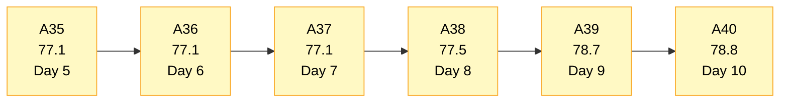
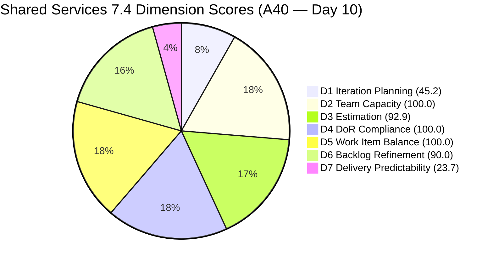
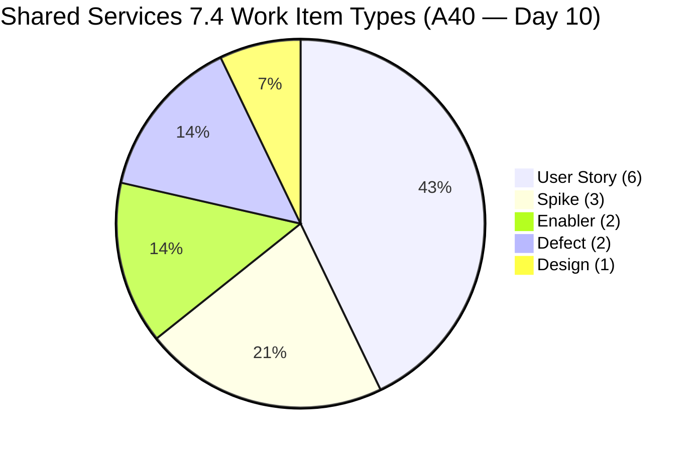
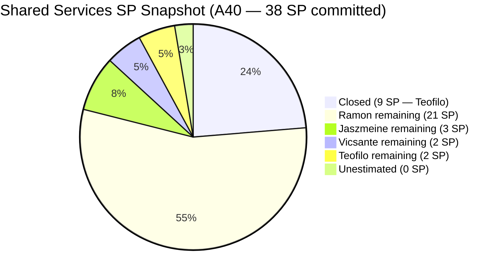
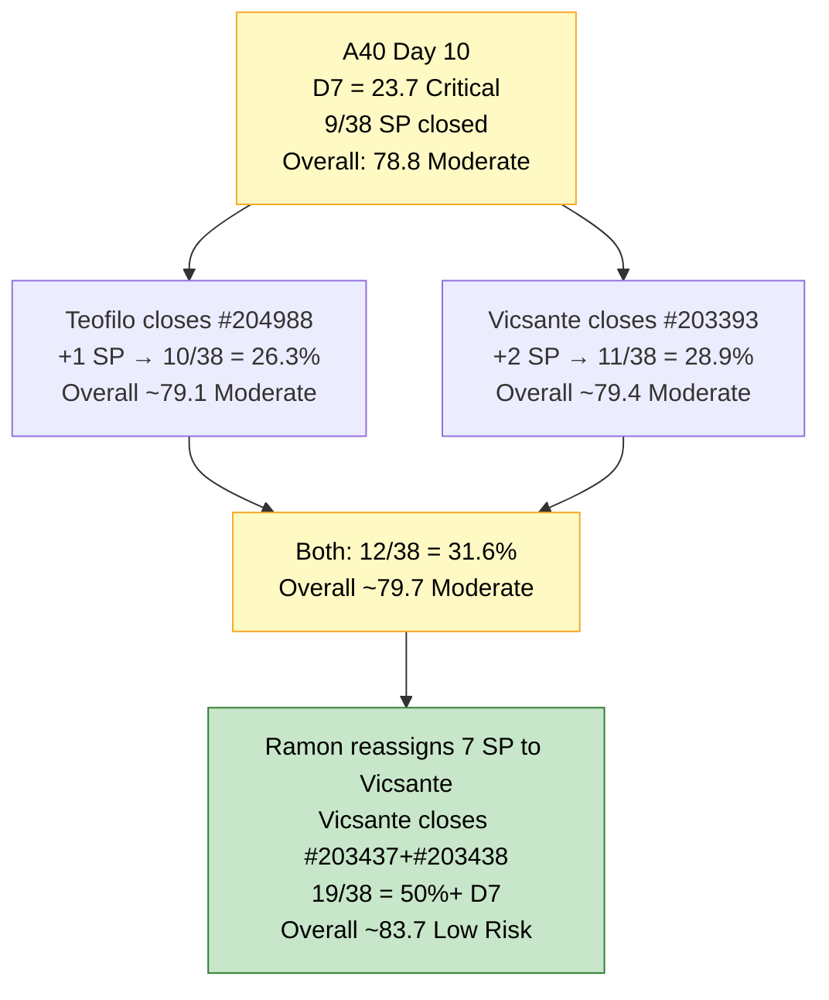
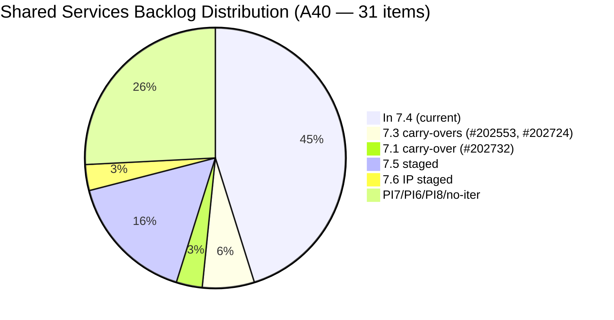

# Shared Services Team — SAFe Iteration Audit A40
**Date:** 2026-05-27 | **Sprint Day:** 10 of 14 — SPRINT ACTIVE | **Iteration:** 7.4 (May 18 – May 31, 2026)
**Auditor:** Claude Code (ADO SAFe Audit Skill v1) | **Prior Audit:** A39 (2026-05-26 02:02)

---

## 1. Audit Metadata

| Field | Value |
|---|---|
| **Audit ID** | A40 |
| **Report File** | `AUDIT_20260527_0903.md` |
| **Prior Audit** | A39 — `AUDIT_20260526_0202.md` (Overall 78.7, Moderate Risk — 7.4 Day 9) |
| **ADO Project** | Jairosoft Portfolio (`666bb99a-6acd-4999-bb34-efd0e4ea90dc`) |
| **ADO Team** | Shared Services Team (`bd9578fd-5773-48fc-bd80-988dfe5de806`) |
| **Iteration** | 7.4 (`16385d00-244a-4caa-9e56-d4a8e850754d`) |
| **Iteration Dates** | May 18 – May 31, 2026 |
| **Sprint Day** | **10 of 14 — SPRINT ACTIVE** |
| **Audit Date** | 2026-05-27 09:03 UTC |
| **Overall Score** | **78.8 — Moderate Risk** |
| **Risk Band** | Moderate (60–79.9) |
| **Visible Backlog Items** | 31 root items (was 33 in A39 — 2 items closed) |
| **Current Iteration Root Items** | 14 (IterationPath = 7.4; was 16 in A39 — 2 items closed) |
| **Capacity Source** | `work_get_iteration_capacities` — Shared Services Team: 15.5h/day |
| **Project Exceptions Applied** | None |

---

## 2. Executive Summary

| Field | Value |
|---|---|
| **Overall Score** | **78.8 — Moderate Risk** |
| **Score vs Prior (A39)** | 78.7 → 78.8 (**+0.1** — Teofilo closed 2 more items; D7 gain offset by D1/D3 shifts) |
| **Sprint Day** | **10 of 14 — SPRINT ACTIVE** |
| **Iteration** | 7.4 (May 18 – May 31, 2026) |
| **Items in 7.4** | 14 root items (down from 16 — 2 closures) |
| **Committed SP** | 38 SP (29 remaining + 9 closed) |
| **SP Closed** | **9 SP — Teofilo closed #204642 (1 SP) and #205050 (1 SP) since A39** |
| **Risk Band** | Moderate (60–79.9) |

**Day 10 brings two more Teofilo closures, extending the sprint's cumulative delivery to 9 SP.** #204642 ("Clearing AzureDevOps inactive users", 1 SP, Enabler) and #205050 ("Backup AutoAllies DB 05/26", 1 SP, Enabler) are both absent from today's backlog — confirmed closed since A39. The date-named item #205050 was correctly closed on its target date (May 26), resolving A39's R4.

The backlog shrank from 33 to 31 items and the current iteration count dropped from 16 to 14. D1 actually worsened from 48.5 to 45.2 because both closed items were current-iteration items — the numerator dropped by 2 while the denominator dropped by 2, and the ratio 14/31 = 45.2 < 16/33 = 48.5.

D7 improved from 18.4 to 23.7 (9/38 SP closed). The three untouched items (#203439, #203440 at 19 days; #204199 at 12 days) persist unchanged — D6 −10 penalty holds.

With 4 days remaining and 29 SP open across 14 items, Teofilo's continued velocity is the primary delivery engine. Ramon's 21 SP at 0.5h/day remains the largest throughput constraint. Vicsante's 6h/day capacity and single Active item (#203393, 2 SP) represents the most underutilized resource.

---

## 3. Previous Audit Delta (A39 → A40)

| Dimension | A39 Score | A40 Score | Delta | Driver |
|---|---|---|---|---|
| D1 Iteration Planning | 48.5 | 45.2 | **−3.3** | 14/31 vs 16/33 — both closed items were current; ratio drops from 48.5 to 45.2 |
| D2 Team Capacity | 100.0 | 100.0 | 0.0 | All 4 members configured — unchanged |
| D3 Estimation | 93.8 | 92.9 | **−0.9** | 16→14 current items; #205051 still 0 SP; 13/14 = 92.9 |
| D4 DoR Compliance | 100.0 | 100.0 | 0.0 | All 14 current items pass Desc+AC verified |
| D5 Work Item Balance | 100.0 | 100.0 | 0.0 | Type diversity maintained across 14 items |
| D6 Backlog Refinement | 90.0 | 90.0 | 0.0 | 3 untouched items persist (now 19, 19, 12 days); −10 penalty unchanged |
| D7 Delivery Predictability | 18.4 | 23.7 | **+5.3** | 9/38 SP closed — #204642 (1 SP) + #205050 (1 SP) closed since A39 |
| **Overall** | **78.7** | **78.8** | **+0.1** | D7 gain (+5.3) offsets D1 (−3.3) and D3 (−0.9); marginal net positive |

**Key changes from A39 to A40:**
1. **CLOSED:** #204642 ("Clearing AzureDevOps — inactive users", 1 SP, Enabler, Teofilo) — absent from today's backlog.
2. **CLOSED:** #205050 ("Backup AutoAllies DB 05/26", 1 SP, Enabler, Teofilo) — closed on its date-named target day (May 26). A39 R4 resolved.
3. **Unchanged:** #205051 still 0 SP in Estimation state (A39 R5 unresolved).
4. **Unchanged:** #203439, #203440 still May 8 ChangedDate (A39 R2 — 19 days untouched).
5. **Unchanged:** #204199 still May 15 ChangedDate (A39 R2 — 12 days untouched).

---

## 4. Current Iteration Snapshot

| # | Title | Type | State | SP | Assignee | Changed |
|---|---|---|---|---|---|---|
| #202725 | Messaging & Communication | Design | Ready for Design | 3 | Jaszmeine | May 19 |
| #203309 | GitHub Token Degradation Fix | Defect | Ready for QA | 1 | Ramon | May 19 |
| #203393 | Claude Course Training | Spike | Active | 2 | Vicsante | May 19 |
| #203436 | Plugin Lifecycle & Extract Skill Verification | User Story | Active | 5 | Ramon | May 19 |
| #203437 | Plugin Generate Skill — Playwright Script Generation | User Story | Ready for Dev | 5 | Ramon | May 19 |
| #203438 | Generate Test Execution Report (/qa-ai:report) | User Story | Ready for Dev | 2 | Ramon | May 19 |
| #203439 | Send Report via Outlook Email (/qa-ai:email) | User Story | Ready for Dev | 3 | Ramon | **May 8** (19 days untouched) |
| #203440 | Scheduled QA Pipeline Orchestration | User Story | Ready for Dev | 3 | Ramon | **May 8** (19 days untouched) |
| #204199 | Request: Add Team Member to Anthropic Enterprise | Spike | Ready | 1 | Ramon | **May 15** (12 days untouched) |
| #204237 | Remove Lifestyle Project from Portfolio Score | Spike | New | 1 | Ramon | May 21 |
| #204238 | Use FinOps Project Board for Admin/HR/Finance | Enabler | Grooming | 1 | Ramon | May 21 |
| #204988 | Fix Computer of Mark Colina | Defect | Ready for Dev | 1 | Teofilo | May 26 |
| #205051 | Add kcaumban@jairosoft.com to AA and CC Repos | User Story | Estimation | 0 | Teofilo | May 26 |
| #205052 | Backup AutoAllies DB in BLOB Storage 05/29/2026 | Enabler | New | 1 | Teofilo | May 26 |

**Total: 14 items | 29 SP remaining + 9 SP closed = 38 SP committed | 9 SP closed (23.7%)**

**CLOSED this sprint (6 items — 9 SP total):**

| # | Title | SP | Assignee | Closed (confirmed) |
|---|---|---|---|---|
| #204838 | Adding new Seat in Github | 1 | Teofilo | May 24–25 |
| #204840 | Update Outlook PASS in Colina PASS | 2 | Teofilo | May 24–25 |
| #204841 | Create New Repo for Eingress | 2 | Teofilo | May 24–25 |
| #204947 | Final Checking Bubble Training Machines | 2 | Teofilo | May 25–26 |
| #204642 | Clearing AzureDevOps (inactive users) | 1 | Teofilo | May 26–27 |
| #205050 | Backup AutoAllies DB 05/26 | 1 | Teofilo | May 26 (date-named) |

**Non-current backlog items (17 total):**

| Group | Items | Count | Status |
|---|---|---|---|
| 7.3 carry-overs | #202553 (Design Review, Jaszmeine), #202724 (Design Review, Jaszmeine) | 2 | HIGH: update IterationPath to 7.4 |
| 7.1 carry-over | #202732 (Ready for UAT, Teofilo, Apr 27) | 1 | HIGH: close or confirm UAT |
| 7.5 staged | #202726 (May 25), #202727 (Apr 29), #203845 (May 25), #204205 (May 21), #204950 (May 25) | 5 | OK |
| 7.6 IP | #202947 (May 19) | 1 | OK |
| PI7 root (no iter) | #202061 (Estimation, Ramon), #202063 (Estimation, Ramon) | 2 | MODERATE: assign to 7.5 |
| PI6 On-Hold | #201161 (Vicsante, Apr 16) | 1 | MODERATE: close or park |
| PI8 backlog | #201919, #202066, #202069, #202070 | 4 | LOW: triage or icebox |
| No iteration | #186848 (New, Apr 15) | 1 | MODERATE: assign or archive |

---

## 5. Work Item Analysis

### Type Distribution (14 current items)

| Type | Count | Share |
|---|---|---|
| User Story | 6 | 42.9% |
| Spike | 3 | 21.4% |
| Enabler | 2 | 14.3% |
| Defect | 2 | 14.3% |
| Design | 1 | 7.1% |
| **Total** | **14** | **100%** |

With #204642 (Enabler) and #205050 (Enabler) both closed, Enabler count dropped from 5 to 2. User Story share increased slightly from 37.5% to 42.9%. No penalty thresholds are crossed — D5 = 100.0 maintained.

### State Distribution (14 current items)

| State | Count | Items |
|---|---|---|
| Active | 2 | #203393 (Vicsante), #203436 (Ramon) |
| Ready for Dev | 5 | #203437, #203438, #203439, #203440 (Ramon), #204988 (Teofilo) |
| Ready for Design | 1 | #202725 (Jaszmeine) |
| Ready for QA | 1 | #203309 (Ramon) |
| Ready | 1 | #204199 (Ramon) |
| New | 2 | #204237 (Ramon), #205052 (Teofilo) |
| Grooming | 1 | #204238 (Ramon) |
| Estimation | 1 | #205051 (Teofilo) |

### Assignee Distribution (14 current items)

| Assignee | Items | SP | Capacity | Sprint Closures |
|---|---|---|---|---|
| Ramon | 8 items | 21 SP | 0.5h/day | 0 SP (no closures) |
| Teofilo | 3 items (#204988, #205051, #205052) | 2 SP remaining | 6.0h/day | **9 SP closed (100% of sprint delivery)** |
| Vicsante | 1 item (#203393) | 2 SP | 6.0h/day | 0 SP |
| Jaszmeine | 1 item (#202725) | 3 SP | 3.0h/day | 0 SP |

**Teofilo is exclusively driving sprint delivery: 9 of 9 SP closed (100% delivery share) while holding the smallest remaining workload.** Ramon controls 21 SP (72.4% of remaining) at 0.5h/day capacity — the primary structural bottleneck.

### Untouched Items (ChangedDate before sprint start May 18)

| # | Title | Last Changed | Owner | Days Untouched |
|---|---|---|---|---|
| #203439 | Send Report via Outlook Email (/qa-ai:email) | May 8 | Ramon | **19 days** |
| #203440 | Scheduled QA Pipeline Orchestration | May 8 | Ramon | **19 days** |
| #204199 | Request: Add Team Member to Anthropic Enterprise | May 15 | Ramon | **12 days** |

Same three items, one additional day each. 3/14 = 21.4% — still in 10–30% range → −10 D6 penalty persists (day 10 consecutive).

### DoR Compliance Check (14 current items)

All 14 current items verified for Description ≥30 non-whitespace chars AND Acceptance Criteria ≥20 non-whitespace chars:

| # | Desc | AC | Pass |
|---|---|---|---|
| #202725 | ✓ | ✓ | Pass |
| #203309 | ✓ | ✓ | Pass |
| #203393 | ✓ | ✓ | Pass |
| #203436 | ✓ | ✓ | Pass |
| #203437 | ✓ | ✓ | Pass |
| #203438 | ✓ | ✓ | Pass |
| #203439 | ✓ | ✓ | Pass |
| #203440 | ✓ | ✓ | Pass |
| #204199 | ✓ | ✓ | Pass |
| #204237 | ✓ | ✓ | Pass |
| #204238 | ✓ | ✓ | Pass |
| #204988 | ✓ | ✓ | Pass |
| #205051 | ✓ | ✓ | Pass |
| #205052 | ✓ | ✓ | Pass |

D4 = 14/14 = 100.0. Note: #204205 (7.5 staged, Teofilo) still lacks Description and AC — will fail D4 when 7.5 goes live.

---

## 6. SAFe Compliance Scorecard

| Dimension | Score | Band | Evidence | Notes |
|---|---|---|---|---|
| D1 Iteration Planning | **45.2** | High | 14 current / 31 visible | Down from 48.5: both closed items were current-iteration; 14/31 = 45.2 |
| D2 Team Capacity | **100.0** | Low | 4/4 members configured | Teofilo 6h, Vicsante 6h, Jaszmeine 3h, Ramon 0.5h — confirmed |
| D3 Estimation | **92.9** | Low | 13/14 items estimated | #205051 still 0 SP; 13/14 = 92.9 |
| D4 DoR Compliance | **100.0** | Low | 14/14 items pass | All verified Desc ≥30 and AC ≥20 |
| D5 Work Item Balance | **100.0** | Low | Max type 42.9%; Spike 21.4% | 5 types; no penalty triggers — maintained |
| D6 Backlog Refinement | **90.0** | Low | 3/14 untouched (21.4%) | −10 penalty (10–30% range); 10th consecutive day with this penalty |
| D7 Delivery Predictability | **23.7** | Critical | 9/38 SP closed | Teofilo: +2 SP (#204642 + #205050) since A39; cumulative 9 SP |
| **OVERALL** | **78.8** | **Moderate** | (45.2+100+92.9+100+100+90+23.7)/7 | +0.1 from A39; marginal improvement |

**Formula verification:** (45.2 + 100.0 + 92.9 + 100.0 + 100.0 + 90.0 + 23.7) / 7 = 551.8 / 7 = **78.8**

---

## 7. Dimension Findings

### D1 — Iteration Planning: 45.2 / 100 — High Risk

**Formula:** 14 / 31 × 100 = **45.2**

| Metric | Value |
|---|---|
| Items in 7.4 | 14 |
| Total visible backlog items | 31 |
| Score | **45.2** |

D1 dropped back to 45.2 (same as A37, below A39's 48.5) because both closed items (#204642, #205050) were drawn from the current-iteration pool. As current items close, the numerator shrinks faster than the denominator, pulling the ratio down.

The structural D1 fix (migrate #202553 and #202724 from 7.3 → 7.4) is still the highest-ROI action available:

| Fix | D1 Impact | Effort |
|---|---|---|
| Migrate #202553 and #202724 (7.3 → 7.4) | 45.2 → 51.6 (16/31) | 2 minutes each |
| Archive PI8 items (#201919, #202066, #202069, #202070) | 45.2 → 51.6 (14/27) | 10–15 min |
| Both actions combined | 45.2 → 57.1 (16/28) | 20 min total |

---

### D2 — Team Capacity: 100.0 / 100 — Low Risk

**Formula:** 4/4 × 100 = **100.0**

| Member | Capacity/Day | Current Sprint Items | Sprint Deliveries |
|---|---|---|---|
| Teofilo Limpag | 6.0h | 3 items (2 SP remaining) | **9 SP closed — 100% of sprint delivery** |
| Vicsante Aseniero | 6.0h | 1 Active (#203393, 2 SP) | 0 SP |
| Jaszmeine Villanueva | 3.0h | 1 Ready for Design (#202725, 3 SP) | 0 SP |
| RAMON ASENIERO JR | 0.5h | 8 items (21 SP) | 0 SP |

All four members have capacity configured → D2 = 100.0. The throughput concentration (Teofilo = 100% delivery) is a structural risk, not a D2 failure.

---

### D3 — Estimation: 92.9 / 100 — Low Risk

**Formula:** 13/14 × 100 = **92.9**

| Metric | Value |
|---|---|
| point_eligible_current_items | 14 |
| estimated_current_items (SP > 0) | 13 |
| Unestimated | #205051 (0 SP, Estimation state) |
| Score | **92.9** |

#205051 ("Add kcaumban to AA and CC Repos") remains at 0 SP in Estimation state. This is Day 2 of the item being in the sprint without an SP estimate. D3 is at 92.9 — same as A37 baseline before #204988 was estimated. Adding 1 SP to #205051 restores D3 to 100.0.

---

### D4 — DoR Compliance: 100.0 / 100 — Low Risk

**Formula:** 14/14 × 100 = **100.0**

All 14 current-iteration items individually verified: Description ≥30 non-whitespace chars AND Acceptance Criteria ≥20 non-whitespace chars. The incoming items from yesterday (#205051, #205052) both have adequate DoR fields. D4 = 100.0 maintained for the 10th consecutive sprint day.

---

### D5 — Work Item Balance: 100.0 / 100 — Low Risk

**Formula:** Base 100 − penalties

| Penalty | Trigger | Applied |
|---|---|---|
| −30: dominant_type_share > 60% | User Story = 42.9% | No |
| −40: no User Story items | User Story present (6 items) | No |
| −20: spike_share > 40% | Spike = 21.4% | No |

**Score:** 100 − 0 = **100.0**

Five work item types present across 14 items. No penalty threshold crossed. The closure of two Enablers (#204642, #205050) slightly increased User Story share from 37.5% to 42.9% — still well below the 60% penalty threshold.

---

### D6 — Backlog Refinement: 90.0 / 100 — Low Risk

**Freshness window:** Items with ChangedDate ≥ Apr 12, 2026 (45 days from May 27)

| Metric | Value |
|---|---|
| Total visible backlog items | 31 |
| Fresh items (ChangedDate ≥ Apr 12) | 31 — oldest: #186848 (Apr 15), #201161 (Apr 16) |
| stale_90 items (ChangedDate < Feb 26) | 0 |
| stale_180 items (ChangedDate < Nov 28, 2025) | 0 |
| Untouched current items (ChangedDate < May 18) | 3 (#203439 May 8, #203440 May 8, #204199 May 15) |
| Untouched share | 3/14 = 21.4% → −10 penalty (10–30% range) |
| Score | **90.0** |

This is the 10th consecutive day with the D6 −10 penalty. The fix is one action: Ramon transitions #203439 and #203440 to Active (any state update clears the ChangedDate). If Ramon also transitions #204199, the untouched count drops to 0 and D6 = 100.0. Combined with other potential improvements, this single action contributes +1.4 to Overall score.

---

### D7 — Delivery Predictability: 23.7 / 100 — Critical

**Formula:** 9 / 38 × 100 = **23.7**

| Metric | Value |
|---|---|
| SP closed this sprint | 9 (Teofilo: #204838=1, #204840=2, #204841=2, #204947=2, #204642=1, #205050=1) |
| Total committed SP | 38 |
| Score | **23.7** |

> **Day 10: Teofilo's cumulative delivery reaches 9 SP over 6 closures. Still Critical band.**
>
> Teofilo's pace: 9 SP across sprint Days 7–10 (~3 SP/day on active delivery days). However, with only 2 SP remaining in Teofilo's current queue (#204988=1 SP, #205052=1 SP), the velocity engine needs new items or a Ramon reassignment to continue at pace.
>
> **Remaining closure candidates:**
> - **Teofilo:** #204988 (Fix Computer of Mark Colina, 1 SP, Ready for Dev) — quick IT fix
> - **Teofilo:** #205052 (Backup AutoAllies DB 05/29, 1 SP, New, dated May 29) — close on May 29
> - **Teofilo:** #205051 (Add kcaumban to AA/CC Repos, 0 SP, needs estimate first)
> - **Vicsante:** #203393 (Claude Course Training, 2 SP, Active) — complete 4 modules
>
> **Recovery from Day 10 (4 days remaining):**
>
> | Scenario | Additional SP | Total SP | D7 | Overall | Band |
> |---|---|---|---|---|---|
> | Teofilo only (2 SP) | +2 | 11/38 | 28.9 | 79.8 | Moderate (barely) |
> | + Vicsante closes #203393 (2 SP) | +4 | 13/38 | 34.2 | 80.5 | Low Risk |
> | + Ramon reassigns 7 SP to Vicsante | +11 | 20/38 | 52.6 | 83.7 | Low Risk |
> | Ramon also closes own items (4 SP) | +15 | 24/38 | 63.2 | 86.2 | Low Risk |

---

## 8. Risks and Bottlenecks

| # | Severity | Dimension | Risk | Action |
|---|---|---|---|---|
| R1 | **HIGH** | D7 | Teofilo's queue is nearly empty (2 SP remaining). Sprint velocity engine loses fuel without a new item transfer. Ramon holds 21 SP (72% of remaining) at 0.5h/day — the structural block on D7 recovery. | Ramon: reassign #203437 (Plugin Generate, 5 SP) and #203438 (Test Report, 2 SP) to Vicsante immediately. Vicsante has 6h/day and only 1 Active item (#203393, 2 SP). |
| R2 | HIGH | D6 | #203439 and #203440 are now 19 days untouched (>10% threshold). The −10 penalty has persisted for 10 consecutive days without action. | Ramon: transition #203439 and #203440 to Active today. Any ADO field update refreshes ChangedDate and drops the untouched count below the penalty threshold. |
| R3 | HIGH | D1 | D1 = 45.2 (High Risk). #202553 and #202724 still on Iteration 7.3; Jaszmeine is actively working both items in Design Review. This is an administrative error, not an execution issue. | Update IterationPath on #202553 and #202724 to 7.4. D1 → 51.6 (16/31). Combined with PI8 archival → 57.1 (Low/High boundary). |
| R4 | MODERATE | D3 | #205051 ("Add kcaumban to AA and CC Repos") has 0 SP for Day 2. If closed at 0 SP, it contributes nothing to D7 numerator. | Teofilo: add 1 SP to #205051 immediately. This is a simple GitHub access grant — likely 1 SP. Closes D3 gap to 100.0 and enables D7 credit upon closure. |
| R5 | MODERATE | D7 | #205052 ("Backup AutoAllies DB 05/29") is date-named May 29. Closing before that date is premature; waiting until May 29 burns a sprint day. | Teofilo: close #205052 on May 29 as scheduled. Plan closure for Day 12 of the sprint. |
| R6 | MODERATE | D4 (future) | #204205 (7.5, "Procure Used Mobile Device") has no Description or AC in ADO. Confirmed from item data. | Teofilo: add Desc+AC to #204205 before 7.5 sprint starts on Jun 1. |
| R7 | LOW | D1 | 7 PI-level/no-iteration items dilute D1 ratio. | Batch-triage: icebox PI8 items (#201919, #202066, #202069, #202070), assign PI7 root items (#202061, #202063) to 7.5, close/park PI6 defect (#201161), archive #186848. |
| R8 | LOW | D7 | #202732 (7.1, Ready for UAT, 30 days): QA intern access unconfirmed for 30 days. | Teofilo: confirm intern access. If confirmed → close. If intern is gone → close as Rejected. |

---

## 9. Prioritized Recommendations

1. **[HIGH — Today Day 10]** Teofilo: close #204988 ("Fix Computer of Mark Colina", Ready for Dev, 1 SP) — IT support task confirmed as the simplest 1 SP closure available. Total → 10 SP closed (26.3% D7).

2. **[HIGH — Today]** Ramon: reassign #203437 ("Plugin Generate Skill", Ready for Dev, 5 SP) and #203438 ("Generate Test Execution Report", Ready for Dev, 2 SP) to Vicsante. Vicsante has 6h/day capacity and only 1 Active item. These 7 SP in Vicsante's queue for Days 10–13 is the largest available D7 recovery action. **Without this reassignment, the sprint cannot exceed ~35% D7 on current trajectory.**

3. **[HIGH — Today]** Ramon: transition #203439 ("Send Report via Outlook Email") and #203440 ("Scheduled QA Pipeline Orchestration") to Active state. This resolves the 10-day-running D6 −10 penalty → D6 = 100.0 → Overall ≈ 80.2 (Low Risk boundary). If items are reassigned to Vicsante per Rec 2, the combined action clears both D6 and D7 risks.

4. **[HIGH — Today/Tomorrow]** Update IterationPath on #202553 and #202724 from 7.3 → 7.4. Jaszmeine is actively working both. This 2-minute admin fix improves D1 from 45.2 to 51.6 (High → approaching Moderate boundary).

5. **[MODERATE — Today]** Teofilo: add SP estimate to #205051 ("Add kcaumban to AA and CC Repos", 0 SP). Likely 1 SP. Restores D3 to 100.0 and enables D7 credit upon closure.

6. **[MODERATE — Day 11]** Vicsante: close #203393 ("Claude Course Training", Active, 2 SP) if all 4 modules are complete. With reassigned items from Rec 2, Vicsante can then start #203437 and #203438 for the final 3 days.

7. **[MODERATE — Day 12]** Teofilo: close #205052 ("Backup AutoAllies DB 05/29", 1 SP, New) on its scheduled date. Plan closure for May 29.

8. **[LOW — Before Day 11]** Batch-triage 7 PI-level/no-iteration items to improve D1 denominator. Icebox #201919, #202066, #202069, #202070; assign #202061, #202063 to 7.5; close/park #201161; archive #186848.

---

## 10. Visualizations

### Score Trend (A35 → A40)

### Dimension Scorecard (A40)

### Work Item Type Distribution (14 current items)

### SP Delivery — Cumulative vs Remaining (A40)

### D7 Recovery Projection — From Day 10

### Backlog Distribution (31 items)

---

## 11. Evidence Gaps and Limitations

| Gap | Impact | Notes |
|---|---|---|
| #204642 and #205050 closure dates not confirmed in API | D7 scored on absence | Both items were in A39's 7.4 Active item list but absent from today's `wit_list_backlog_work_items`. Inferred as closed. Exact timestamps not retrieved. 2 SP added to closed count (+1 each). |
| #205051 has 0 SP in Estimation state (Day 2) | D3: 13/14 not 14/14 | SP field absent/null. Until estimated, counts as point-eligible but unestimated. Closes at 0 SP contributes nothing to D7. Quick fix: Teofilo adds 1 SP. |
| #202553, #202724 IterationPath still 7.3 | D1 suppressed at 45.2 vs potential 51.6 | Both items actively worked by Jaszmeine (changed May 19). Administrative misclassification only — no execution risk. |
| Ramon 21 SP / 0.5h capacity — 0 closures (10 days) | Throughput concentration risk | 72% of remaining committed SP held by the lowest-capacity team member. No reassignment detected since A39 recommendation. Sprint cannot reach Low Risk on D7 without workload redistribution. |
| #204205 missing Description and AC (7.5) | Future D4 risk | Confirmed from item data: fields absent. Materializes as D4 failure when 7.5 sprint starts on Jun 1. |
| D6 −10 penalty 10th consecutive day | D6 capped at 90.0 | #203439 and #203440 have not been touched since May 8 despite daily audit recommendations. Resolution is entirely within Ramon's control (any ADO update). |

---

## 12. Audit Trail

| Source | Tool Used | Data Retrieved |
|---|---|---|
| Current iteration | `work_list_team_iterations` (project `666bb99a-6acd-4999-bb34-efd0e4ea90dc`, team `bd9578fd-5773-48fc-bd80-988dfe5de806`, timeframe=current) | Iteration 7.4 confirmed: May 18–31, ID `16385d00-244a-4caa-9e56-d4a8e850754d` |
| Backlog items | `wit_list_backlog_work_items` (backlogId `Microsoft.RequirementCategory`) | 31 root items (down from 33 in A39 — #204642 and #205050 absent/closed) |
| Work item details | `wit_get_work_items_batch_by_ids` (31 items) | SP, State, Type, Desc, AC, ChangedDate, IterationPath confirmed for all 31 |
| Team capacity | `work_get_iteration_capacities` (iterationId `16385d00-244a-4caa-9e56-d4a8e850754d`) | Shared Services Team: 15.5h/day (Teofilo 6h, Vicsante 6h, Jaszmeine 3h, Ramon 0.5h) |
| Prior audit | `AUDIT_20260526_0202.md` (A39) | Overall 78.7, Moderate Risk, 16 items, 38 SP committed, 7 SP closed |
