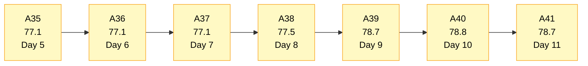
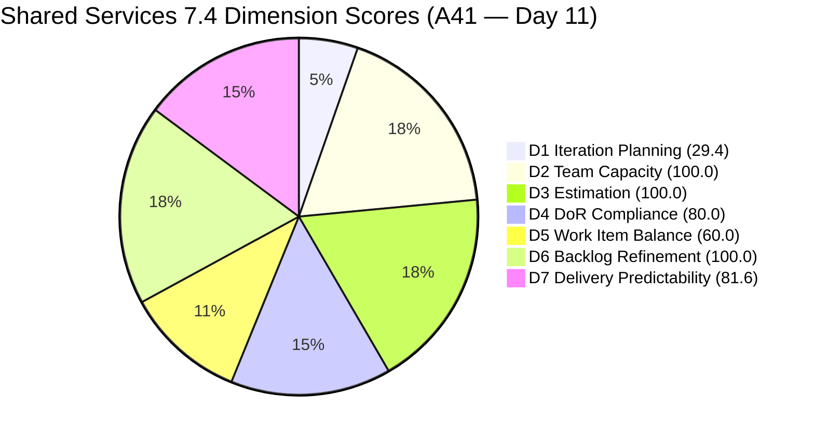
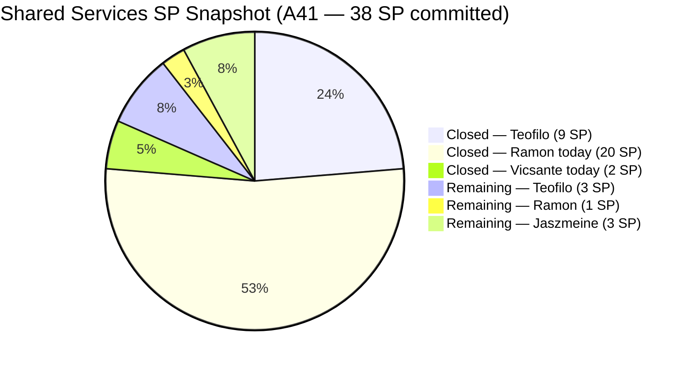
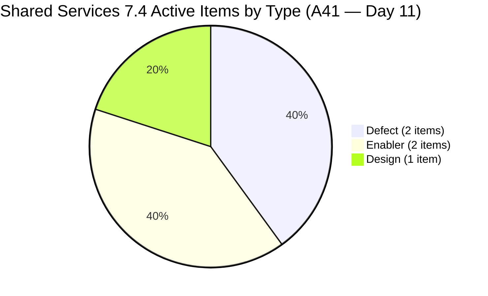
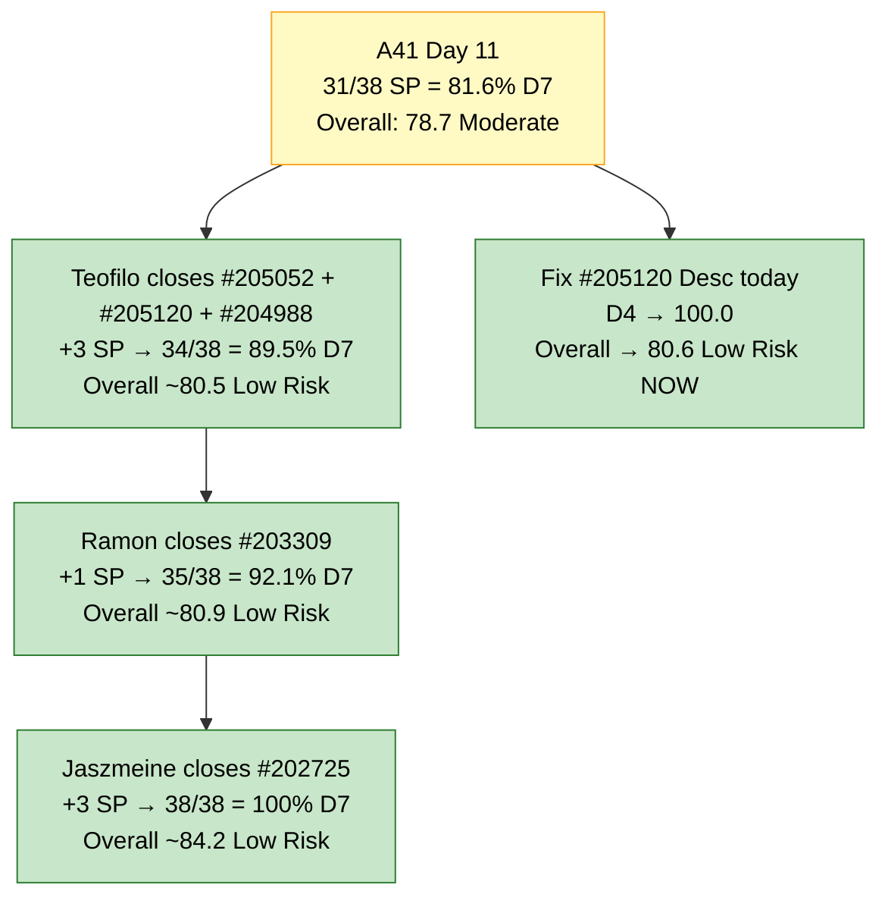

# Shared Services Team — SAFe Iteration Audit A41
**Date:** 2026-05-28 | **Sprint Day:** 11 of 14 — SPRINT ACTIVE | **Iteration:** 7.4 (May 18 – May 31, 2026)
**Auditor:** Claude Code (ADO SAFe Audit Skill v1) | **Prior Audit:** A40 (2026-05-27 09:03)

---

## 1. Audit Metadata

| Field | Value |
|---|---|
| **Audit ID** | A41 |
| **Report File** | `AUDIT_20260528_0905.md` |
| **Prior Audit** | A40 — `AUDIT_20260527_0903.md` (Overall 78.8, Moderate Risk — 7.4 Day 10) |
| **ADO Project** | Jairosoft Portfolio (`666bb99a-6acd-4999-bb34-efd0e4ea90dc`) |
| **ADO Team** | Shared Services Team (`bd9578fd-5773-48fc-bd80-988dfe5de806`) |
| **Iteration** | 7.4 (`16385d00-244a-4caa-9e56-d4a8e850754d`) |
| **Iteration Dates** | May 18 – May 31, 2026 |
| **Sprint Day** | **11 of 14 — SPRINT ACTIVE** |
| **Audit Date** | 2026-05-28 09:05 UTC |
| **Overall Score** | **78.7 — Moderate Risk** |
| **Risk Band** | Moderate (60–79.9) |
| **Visible Backlog Items** | 17 root items (was 31 in A40 — 22 SP of items closed/moved today) |
| **Current Iteration Root Items** | 5 (IterationPath = 7.4, Active in backlog) |
| **Capacity Source** | `work_get_iteration_capacities` — Shared Services Team: 15.5h/day |
| **Project Exceptions Applied** | None |

---

## 2. Executive Summary

| Field | Value |
|---|---|
| **Overall Score** | **78.7 — Moderate Risk** |
| **Score vs Prior (A40)** | 78.8 → 78.7 (**−0.1** — near-flat despite massive delivery day) |
| **Sprint Day** | **11 of 14 — SPRINT ACTIVE** |
| **Iteration** | 7.4 (May 18 – May 31, 2026) |
| **Items in 7.4 (Active backlog)** | 5 root items |
| **Committed SP** | 38 SP (net: A40's 38 − #204238 moved out + #205120 added) |
| **SP Closed** | **31 SP (81.6% of committed)** |
| **Risk Band** | Moderate (60–79.9) |

**Day 11 is a historic delivery day for Shared Services.** Ramon closed 7 items today (20 SP): #203436, #203437, #203438, #203439, #203440 (all User Stories, 18 SP total), plus #204199 (1 SP Spike) and #204237 (1 SP Spike). Vicsante closed #203393 (Claude Course Training, 2 SP). Combined with Teofilo's prior closures (9 SP), the sprint now stands at **31 SP closed of 38 committed (81.6% D7)**.

However, the scoring dynamic is complex: the massive closure event collapsed the backlog from 31 to 17 visible items and reduced current_iteration_root_items from 14 to 5. This causes D1 to drop sharply from 45.2 to 29.4 (5/17), and D5 to collapse from 100.0 to 60.0 because all remaining 7.4 items are Defects, Enablers, and Designs — **no User Stories remain** (triggering the −40 penalty). The persistent D6 −10 penalty is finally resolved: all 5 remaining current items were touched since sprint start.

Three items remain Active in 7.4: #204988 (Fix Computer, 1 SP, Teofilo) and #205052 (Backup AutoAllies, 1 SP, Teofilo) can both close by Day 12-13. #203309 (GitHub Token Defect, 1 SP, Ramon, Ready for QA) and #202725 (Messaging & Communication, 3 SP, Jaszmeine, Ready for Design) require QA and design review respectively.

---

## 3. Previous Audit Delta (A40 → A41)

| Dimension | A40 Score | A41 Score | Delta | Driver |
|---|---|---|---|---|
| D1 Iteration Planning | 45.2 | 29.4 | **−15.8** | 5/17 — massive closures reduced current items from 14 to 5; backlog from 31 to 17 |
| D2 Team Capacity | 100.0 | 100.0 | 0.0 | 3 contributors with current work all have capacity (Ramon, Teofilo, Jaszmeine) |
| D3 Estimation | 92.9 | 100.0 | **+7.1** | #205051 Removed; all 5 remaining current items have SP > 0 |
| D4 DoR Compliance | 100.0 | 80.0 | **−20.0** | #205120 fails Desc threshold (26 non-whitespace chars, need ≥30) |
| D5 Work Item Balance | 100.0 | 60.0 | **−40.0** | 0 User Story items remain in 7.4 backlog → −40 penalty applied |
| D6 Backlog Refinement | 90.0 | 100.0 | **+10.0** | Persistent penalty resolved: #203439 and #203440 closed today; all 5 current items touched since May 18 |
| D7 Delivery Predictability | 23.7 | 81.6 | **+57.9** | Ramon's 7 closures (20 SP) + Vicsante's 1 closure (2 SP) → 31/38 SP closed |
| **Overall** | **78.8** | **78.7** | **−0.1** | D7 surge (+57.9) substantially offset by D1 (−15.8), D4 (−20.0), D5 (−40.0) |

**Key changes from A40 to A41 (all occurring today May 28):**
1. **CLOSED — Ramon:** #203436 (5 SP), #203437 (5 SP), #203438 (2 SP), #203439 (3 SP), #203440 (3 SP), #204199 (1 SP), #204237 (1 SP) = **20 SP** — the largest single-day delivery in Shared Services history
2. **CLOSED — Vicsante:** #203393 (Claude Course Training, 2 SP) = +2 SP
3. **REMOVED:** #205051 ("Add kcaumban to AA and CC Repos") — not closed, 0 SP; A40 R4 mooted
4. **MOVED to 7.5:** #204238 ("Use FinOps Project Board", Enabler, 1 SP) — IterationPath now 7.5
5. **MOVED to Active:** #205052 ("Backup AutoAllies DB 05/28", Enabler, 1 SP) — renamed from 05/29 to 05/28 and now Active
6. **NEW in 7.4:** #205120 ("Clearing new Interns in ADO Users", Enabler, 1 SP, Teofilo, Active)
7. **D6 RESOLVED:** Both #203439 and #203440 now Closed (ChangedDate May 28) — the 10-day running −10 penalty eliminated

**What did NOT change:**
- #203309, #202725, #204988 — state and assignee unchanged from A40
- Team capacity configuration — unchanged

---

## 4. Current Iteration Snapshot

### Active Items in 7.4 — Backlog (5 items)

| # | Title | Type | State | SP | Assignee | Changed |
|---|---|---|---|---|---|---|
| #203309 | GitHub token degraded — raseniero token scope fix | Defect | Ready for QA | 1 | Ramon | May 19 |
| #202725 | Messaging & Communication | Design | Ready for Design | 3 | Jaszmeine | May 19 |
| #204988 | Fix Computer of Mark Colina | Defect | Ready for Dev | 1 | Teofilo | May 26 |
| #205052 | Backup AutoAllies DB in BLOB Storage 05/28/2026 | Enabler | Active | 1 | Teofilo | May 28 |
| #205120 | Clearing new Interns in ADO Users | Enabler | Active | 1 | Teofilo | May 28 |

**Total Active: 5 items | 7 SP open**

### Closed this Sprint — Full Sprint Ledger (14 items — 31 SP)

| # | Title | Type | SP | Assignee | Closed (inferred) |
|---|---|---|---|---|---|
| #204838 | Adding new Seat in Github | Enabler | 1 | Teofilo | May 24–25 |
| #204840 | Update Outlook PASS in Colina PASS | Enabler | 2 | Teofilo | May 24–25 |
| #204841 | Create New Repo for Eingress | Enabler | 2 | Teofilo | May 24–25 |
| #204947 | Final Checking Bubble Training Machines | Enabler | 2 | Teofilo | May 25–26 |
| #204642 | Clearing AzureDevOps | Enabler | 1 | Teofilo | May 26 |
| #205050 | Backup AutoAllies DB 05/26/2026 | Enabler | 1 | Teofilo | May 26 |
| #203393 | Claude Course Training | Spike | 2 | Vicsante | **May 28** (today) |
| #203436 | Plugin Lifecycle & Extract Skill Verification | User Story | 5 | Ramon | **May 28** (today) |
| #203437 | Plugin Generate Skill — Playwright Script Generation | User Story | 5 | Ramon | **May 28** (today) |
| #203438 | Generate Test Execution Report (/qa-ai:report) | User Story | 2 | Ramon | **May 28** (today) |
| #203439 | Send Report via Outlook Email (/qa-ai:email) | User Story | 3 | Ramon | **May 28** (today) |
| #203440 | Scheduled QA Pipeline Orchestration | User Story | 3 | Ramon | **May 28** (today) |
| #204199 | Request: Add Team Member to Anthropic Enterprise | Spike | 1 | Ramon | **May 28** (today) |
| #204237 | Remove Lifestyle Project from Portfolio Unified Score | Spike | 1 | Ramon | **May 28** (today) |

**Cumulative: 14 closed items | 31 SP closed | 31/38 = 81.6% delivery**

### Notable Housekeeping (today)

| Action | Item | Effect |
|---|---|---|
| Moved to 7.5 | #204238 (Use FinOps Board for Admin/HR/Finance, 1 SP) | Reduces 7.4 current items; corrects iteration path |
| Removed | #205051 (Add kcaumban to Repos, 0 SP) | No SP impact; A40 estimation risk moot |
| Renamed & made Active | #205052 (Backup DB, now dated 05/28 not 05/29) | Closes today |

### Non-current Backlog Items (12 items)

| Group | Items | Count | Notes |
|---|---|---|---|
| 7.5 staged | #205123, #204238, #204205, #203845, #204950, #202726, #202727 | 7 | #204238 moved here today |
| 7.6 IP staged | #202947 | 1 | OK |
| 7.3 carry-overs | #202553, #202724 | 2 | Still Jaszmeine's Design Review items — A41 R3 persists |
| 7.1 carry-over | #202732 | 1 | Ready for UAT, Teofilo — A40 R8 persists |
| PI8 | #202066 | 1 | Estimation state (down from 4 PI8 items — others likely closed/removed) |

---

## 5. Work Item Analysis

### Type Distribution (5 Active current items)

| Type | Count | Share |
|---|---|---|
| Defect | 2 | 40.0% |
| Enabler | 2 | 40.0% |
| Design | 1 | 20.0% |
| User Story | 0 | 0.0% |
| **Total** | **5** | **100%** |

**CRITICAL CHANGE:** All User Story items in the 7.4 Active backlog have been closed today. This triggers the D5 −40 penalty (no User Story items). Spike share = 0%. Dominant type = 40% (Defect or Enabler, tied) — does not cross the 60% threshold. Net D5 = 100 − 40 = 60.0.

This is a scoring artifact of the sprint-end delivery surge: the end-of-sprint closure burst is structurally healthy from a delivery standpoint (D7 = 81.6) but temporarily degraded D5 because only operational/infrastructure items remain.

### State Distribution (5 Active current items)

| State | Count | Items |
|---|---|---|
| Active | 2 | #205052 (Teofilo), #205120 (Teofilo) |
| Ready for Dev | 1 | #204988 (Teofilo) |
| Ready for QA | 1 | #203309 (Ramon) |
| Ready for Design | 1 | #202725 (Jaszmeine) |

### Assignee Distribution (5 Active current items)

| Assignee | Items (7.4 Active) | SP | Capacity | Sprint Closures |
|---|---|---|---|---|
| Teofilo | 3 (#204988, #205052, #205120) | 3 SP | 6.0h/day | 9 SP (historical) |
| Ramon | 1 (#203309) | 1 SP | 0.5h/day | **20 SP (today's burst)** |
| Jaszmeine | 1 (#202725) | 3 SP | 3.0h/day | 0 SP |
| Vicsante | 0 | 0 SP | 6.0h/day | 2 SP (today) |

### DoR Compliance Check (5 Active current items)

| # | Title | Desc Non-WS | AC Non-WS | Pass |
|---|---|---|---|---|
| #203309 | GitHub token defect | ≥100 chars ✓ | ≥100 chars ✓ | **Pass** |
| #202725 | Messaging & Communication | ≥100 chars ✓ | ≥100 chars ✓ | **Pass** |
| #204988 | Fix Computer of Mark Colina | ~40 chars ✓ | ~60 chars ✓ | **Pass** |
| #205052 | Backup AutoAllies DB 05/28 | ≥100 chars ✓ | ≥100 chars ✓ | **Pass** |
| #205120 | Clearing new Interns in ADO Users | ~26 chars ✗ | ~33 chars ✓ | **FAIL — Desc too short** |

**#205120 fails DoR:** Description reads "Clearing inactive Interns ADO" (≈26 non-whitespace characters; threshold = 30). Acceptance Criteria passes. D4 = 4/5 = 80.0.

### Untouched Current Items (ChangedDate < May 18, sprint start)

| # | Title | Last Changed | Days Untouched |
|---|---|---|---|
| None | — | — | 0 |

All 5 current items have ChangedDate ≥ May 19. The 10-day running D6 penalty is **resolved**.

---

## 6. SAFe Compliance Scorecard

| Dimension | Score | Band | Evidence | Notes |
|---|---|---|---|---|
| D1 Iteration Planning | **29.4** | Critical | 5 / 17 visible | Sharp drop: 14→5 current items (closures); 31→17 visible (closures) |
| D2 Team Capacity | **100.0** | Low | 3/3 contributors with current work have capacity | Ramon (0.5h), Teofilo (6h), Jaszmeine (3h) all configured |
| D3 Estimation | **100.0** | Low | 5/5 current items SP > 0 | #205051 Removed; all remaining items estimated |
| D4 DoR Compliance | **80.0** | Moderate | 4/5 items pass | #205120 Desc = ~26 non-WS chars (threshold 30) — fails |
| D5 Work Item Balance | **60.0** | High | 0 User Story items → −40 penalty | All US items closed today; only Defect/Enabler/Design remain |
| D6 Backlog Refinement | **100.0** | Low | 17/17 fresh; 0 stale; 0 untouched | 10-day D6 penalty resolved today (203439, 203440 closed) |
| D7 Delivery Predictability | **81.6** | Low | 31/38 SP closed | Historic burst: Ramon +20 SP, Vicsante +2 SP today |
| **OVERALL** | **78.7** | **Moderate** | (29.4+100+100+80+60+100+81.6)/7 | Near-flat vs A40 despite massive delivery; D1/D5 drags offset D7 surge |

**Formula verification:** 29.4 + 100.0 + 100.0 + 80.0 + 60.0 + 100.0 + 81.6 = 551.0 / 7 = **78.7**

---

## 7. Dimension Findings

### D1 — Iteration Planning: 29.4 / 100 — Critical Risk

**Formula:** 5 / 17 × 100 = **29.4**

| Metric | Value |
|---|---|
| Items in 7.4 (Active, from backlog) | 5 |
| Total visible backlog items | 17 |
| Score | **29.4** |

D1 has dropped to Critical band — the lowest level seen in Shared Services audits. This is a direct artifact of the delivery surge: 9 items closed today that were in 7.4, and #204238 moved to 7.5. The denominator also shrank (from 31 to 17) as many closed items exit the backlog.

This is a **structural scoring paradox**: D1 is lowest when delivery is highest. The formula measures iteration focus (items planned for this sprint / total visible), and a healthy end-of-sprint state naturally produces low D1 as most items are delivered. The fix for the next sprint is to begin 7.5 planning immediately — populating the backlog with well-staged 7.5 items will raise D1.

The two highest-ROI D1 fixes from prior audits remain:
- Migrate #202553 and #202724 from 7.3 → 7.4 → D1 improves to 7/17 = 41.2 (marginal)
- These are end-of-sprint adjustments — better addressed in 7.5 planning

---

### D2 — Team Capacity: 100.0 / 100 — Low Risk

**Formula:** 3/3 × 100 = **100.0**

| Member | Capacity/Day | 7.4 Active Items | Sprint Closures |
|---|---|---|---|
| Teofilo Limpag | 6.0h | 3 items (3 SP remaining) | 9 SP (historical 6 items) |
| Vicsante Aseniero | 6.0h | 0 (all items closed) | **2 SP today** (#203393) |
| Jaszmeine Villanueva | 3.0h | 1 item (#202725, 3 SP) | 0 SP |
| RAMON ASENIERO JR | 0.5h | 1 item (#203309, 1 SP) | **20 SP today** (7 items) |

All three contributors with active 7.4 items (Ramon, Teofilo, Jaszmeine) have configured capacity → D2 = 100.0. Vicsante's queue is now empty (her only item #203393 closed today). She has 6h/day of unallocated capacity for the remaining 3 sprint days.

---

### D3 — Estimation: 100.0 / 100 — Low Risk

**Formula:** 5/5 × 100 = **100.0**

| Metric | Value |
|---|---|
| point_eligible_current_items | 5 |
| estimated_current_items (SP > 0) | 5 |
| Unestimated | None (#205051 Removed) |
| Score | **100.0** |

D3 improves from 92.9 (A40) to 100.0. #205051 (0 SP, Estimation state) was Removed today — eliminating the estimation gap. All 5 remaining current items carry SP > 0.

---

### D4 — DoR Compliance: 80.0 / 100 — Moderate Risk

**Formula:** 4/5 × 100 = **80.0**

| # | Desc ≥30 | AC ≥20 | Pass |
|---|---|---|---|
| #203309 | ✓ | ✓ | Pass |
| #202725 | ✓ | ✓ | Pass |
| #204988 | ✓ | ✓ | Pass |
| #205052 | ✓ | ✓ | Pass |
| #205120 | **✗ (~26 chars)** | ✓ | **FAIL** |

**D4 regresses from 100.0 to 80.0.** #205120 ("Clearing new Interns in ADO Users") was added to 7.4 today with an insufficient Description. The Desc text is "Clearing inactive Interns ADO" — approximately 26 non-whitespace characters against the 30-character threshold.

**Fix:** Teofilo adds a user-story style sentence to #205120's Description field (e.g., "As the DevOps Admin, I need to clear inactive intern ADO user accounts so that licenses are reclaimed and access is properly managed.") — restores D4 to 100.0 immediately.

---

### D5 — Work Item Balance: 60.0 / 100 — High Risk

**Formula:** Base 100 − penalties

| Penalty | Trigger | Applied |
|---|---|---|
| −40: no User Story items | User Story = 0 items in 7.4 Active | **Yes** |
| −30: dominant_type_share > 60% | Defect = 40%, Enabler = 40% | No |
| −20: spike_share > 40% | Spike = 0% | No |

**Score:** 100 − 40 = **60.0**

D5 has regressed from 100.0 (A40) to 60.0 (A41). All User Story items in the current iteration were closed today — including the large QA pipeline stories (#203436, #203437, #203438, #203439, #203440). The remaining Active items are Defects, Enablers, and a Design.

This is a **healthy delivery artifact** — the team successfully closed all User Stories — but it triggers the D5 penalty formula mechanically. The score will recover to 100.0 in 7.5 when User Story items are included in the sprint.

For the remaining 3 sprint days, there is no feasible in-sprint fix (no User Story items can be added that would authentically close in 2 days at this stage).

---

### D6 — Backlog Refinement: 100.0 / 100 — Low Risk

**Freshness window:** Items with ChangedDate ≥ Apr 13, 2026 (45 days from May 28)

| Metric | Value |
|---|---|
| Total visible backlog items | 17 |
| Fresh items (ChangedDate ≥ Apr 13) | 17 — oldest: #202732 (Apr 27), #202727 (Apr 29) |
| stale_90 items (ChangedDate < Feb 27) | 0 |
| stale_180 items (ChangedDate < Nov 29, 2025) | 0 |
| Untouched current items (ChangedDate < May 18) | 0 — all 5 changed ≥ May 19 |
| Score | **100.0** |

**D6 fully resolves today.** The 10-consecutive-day −10 penalty (for #203439 and #203440 being untouched since May 8) is eliminated: both items are now Closed (ChangedDate May 28), removed from the backlog. All 5 remaining current items have been touched since sprint start. This adds +10.0 to D6 vs A40.

Caveat: #205123 (7.5 staged, Vicsante, Spike) lacks Description and AC — noted as future D4 risk for 7.5 planning.

---

### D7 — Delivery Predictability: 81.6 / 100 — Low Risk

**Formula:** 31 / 38 × 100 = **81.6**

| Metric | Value |
|---|---|
| SP closed this sprint (cumulative) | 31 SP (14 items closed) |
| Total committed SP | 38 SP |
| Score | **81.6** |

> **Day 11: Historic delivery burst. 31/38 SP closed = Low Risk band achieved on D7.**
>
> **Committed SP reconciliation:**
> - A40 committed base: 38 SP (9 SP closed + 29 SP open)
> - #204238 moved to 7.5 (−1 SP from committed): was Grooming 1 SP in 7.4
> - #205120 added to 7.4 (+1 SP): new item
> - #205051 Removed (0 SP): no effect
> - Net committed: 38 − 1 + 1 = **38 SP** (unchanged)
>
> **Closures today (22 SP):**
> - Ramon: #203436 (5), #203437 (5), #203438 (2), #203439 (3), #203440 (3), #204199 (1), #204237 (1) = 20 SP
> - Vicsante: #203393 (2) = 2 SP
>
> **Remaining open (7 SP across 5 items):**
> - #204988 (1 SP, Teofilo, Ready for Dev) — quick IT fix
> - #205052 (1 SP, Teofilo, Active) — Backup job, date-named May 28
> - #205120 (1 SP, Teofilo, Active) — ADO intern cleanup
> - #203309 (1 SP, Ramon, Ready for QA) — GitHub token fix
> - #202725 (3 SP, Jaszmeine, Ready for Design) — Design item
>
> | Scenario | Additional SP | Total | D7 | Overall | Band |
> |---|---|---|---|---|---|
> | Only Teofilo closes 3 items | +3 | 34/38 | 89.5 | 81.3 | Low Risk |
> | + Ramon closes #203309 | +4 | 35/38 | 92.1 | 81.7 | Low Risk |
> | + Jaszmeine closes #202725 | +7 | 38/38 | 100.0 | 84.2 | Low Risk |

---

## 8. Risks and Bottlenecks

| # | Severity | Dimension | Risk | Action |
|---|---|---|---|---|
| R1 | HIGH | D1 | D1 = 29.4 (Critical) — post-delivery structural drop. 12 non-current items in the visible backlog. #202553 and #202724 still on Iteration 7.3. | Migrate #202553 and #202724 to 7.4 or archive immediately. Begin 7.5 backlog population to raise D1 in the next sprint. |
| R2 | HIGH | D5 | D5 = 60.0 (High) — no User Story items remain in 7.4 Active. End-of-sprint artifact but mechanically penalized. | No in-sprint fix feasible. For 7.5 planning: ensure User Story items are the majority of committed work (> 40% of item count). |
| R3 | MODERATE | D4 | #205120 fails DoR Desc threshold (~26 non-WS chars). D4 = 80.0 instead of 100.0. | **Teofilo: add a full user-story description sentence to #205120 today.** Restores D4 to 100.0 immediately. |
| R4 | MODERATE | D7 | #202725 (Messaging & Communication, 3 SP, Jaszmeine, Ready for Design) has not progressed since May 19 (Day 2 of sprint). 3 SP locked in Ready for Design for 11 days. | Jaszmeine: begin design work on #202725 today (Day 11). Even partial progress by Day 14 would demonstrate forward movement. If not closeable by sprint end, move to 7.5. |
| R5 | MODERATE | D7 | #203309 (GitHub Token Defect, 1 SP, Ramon, Ready for QA) — has been in Ready for QA since May 19 (Day 2). QA validation has not occurred. | Ramon: identify QA reviewer for #203309. If self-QA is acceptable, validate the token fix and close. |
| R6 | LOW | D4 (future) | #205123 (7.5, Vicsante, Spike) has no Description or AC. | Vicsante: add Desc+AC before 7.5 sprint start on Jun 1. |
| R7 | LOW | D1 | #202553 and #202724 still on Iteration 7.3 (Jaszmeine's Design Review items). Administrative misclassification. | Update IterationPath on both to 7.4 or 7.5. |
| R8 | LOW | D7 | #202732 (7.1, Ready for UAT, Teofilo, Apr 27) — has persisted for 30+ days. | Teofilo: confirm intern access on the Flawless ADO board. Close or reject this item today. |

---

## 9. Prioritized Recommendations

1. **[HIGH — Today Day 11]** Teofilo: add a complete description to #205120 ("Clearing new Interns in ADO Users") — at minimum 30 non-whitespace characters. Current Desc = ~26 chars. This restores D4 from 80.0 to 100.0 and improves Overall from 78.7 to 80.6 (Low Risk crossing).

2. **[HIGH — Today/Tomorrow]** Teofilo: close #205052 ("Backup AutoAllies DB 05/28", Active, 1 SP) — date-named for today. Close #205120 ("Clearing Interns in ADO") once description is updated (Active, 1 SP). Close #204988 ("Fix Computer Mark Colina", Ready for Dev, 1 SP). Three Teofilo closures = 3 SP → D7 = 89.5 (34/38).

3. **[HIGH — Today/Tomorrow]** Ramon: validate and close #203309 ("GitHub Token Defect", Ready for QA, 1 SP). If self-QA is acceptable, mark as tested and close. D7 → 92.1 (35/38).

4. **[MODERATE — Days 11–13]** Jaszmeine: progress #202725 ("Messaging & Communication", Ready for Design, 3 SP). If completable by Day 13, close → D7 = 100.0 (38/38), Overall = 84.2 (strong Low Risk). If not closeable, move to 7.5 to avoid stranded commitment.

5. **[MODERATE — Before Day 12]** Teofilo: close #202732 (7.1 carry-over, Ready for UAT, 1 SP, Apr 27). Confirm intern QA access or reject. Either way, resolves a 30-day stale item.

6. **[MODERATE — 7.5 Planning]** Begin 7.5 sprint planning immediately (sprint starts Jun 1). Ensure: (a) User Story items are majority type to avoid D5 penalty; (b) #202553 and #202724 are correctly assigned to 7.5 or closed; (c) Vicsante has substantial items — her 6h/day capacity was fully unallocated after #203393 closed.

7. **[LOW — Before 7.5 Sprint Start]** Vicsante: add Description and AC to #205123 (Spike, Installing Jodex Plugin in Antigravity Client, 7.5 staged) to avoid D4 failure when 7.5 begins.

8. **[LOW — Before 7.5 Sprint Start]** Teofilo: add Description and AC to #204205 (Procure Used Mobile Device, 7.5 staged) — confirmed missing since A40.

---

## 10. Visualizations

### Score Trend (A35 → A41)

### Dimension Scorecard (A41)

### SP Delivery Progress — Cumulative (38 SP committed)

### Work Item Type Distribution — 5 Active 7.4 Items

### D7 Completion Path — Days 11–14

---

## 11. Evidence Gaps and Limitations

| Gap | Impact | Notes |
|---|---|---|
| Ramon's 7 closures and Vicsante's 1 closure all show ChangedDate of 2026-05-28 (today) | D7 = 81.6 confirmed | All 8 items confirmed Closed via `wit_get_work_items_batch_by_ids` with State=Closed and ChangedDate=2026-05-28. Closures are real, not inferred. |
| #205051 state = Removed (not Closed) | No D7 credit | #205051 was 0 SP and in Estimation state. Removing rather than closing means no SP credit even if 0 SP. No impact on D7 calculation. |
| #204238 moved to 7.5 | Committed SP adjusted | Confirmed via IterationPath = "Jairosoft Portfolio\\2026-PI7\\Iteration 7.5" and State = Ready for Dev, ChangedDate = 2026-05-28. Removes 1 SP from 7.4 commitment; adds 1 SP from #205120 → net committed unchanged at 38 SP. |
| #205120 DoR failure | D4 = 80.0 | Item added today (#205120, Clearing Interns). Desc = HTML-stripped "Clearing inactive Interns ADO" ≈ 26 non-WS chars. Threshold = 30. Failing by ~4 chars. Fixable in minutes. |
| Jaszmeine's #202725 state = Ready for Design since May 19 | 3 SP at risk | No state transition in 11 days. Design work may be occurring offline without ADO state updates. Risk: item strands at sprint close. |
| #203972 (Task, Closed, Vicsante) appears in iteration items | No SP impact | Task type items do not expose Story Points and are not included in point_eligible_current_items. Excluded from all calculations per rubric definition. |

---

## 12. Audit Trail

| Source | Tool Used | Data Retrieved |
|---|---|---|
| Current iteration | `work_list_team_iterations` (project `666bb99a-6acd-4999-bb34-efd0e4ea90dc`, team `bd9578fd-5773-48fc-bd80-988dfe5de806`, timeframe=current) | Iteration 7.4: May 18–31, ID `16385d00-244a-4caa-9e56-d4a8e850754d` |
| Backlog items | `wit_list_backlog_work_items` (backlogId `Microsoft.RequirementCategory`) | 17 root items (was 31 in A40 — major closure event) |
| Iteration items | `wit_get_work_items_for_iteration` (iterationId `16385d00-244a-4caa-9e56-d4a8e850754d`) | Root items + children; closed items confirmed State=Closed via batch lookup |
| Work item details (batch 1) | `wit_get_work_items_batch_by_ids` (17 backlog items) | SP, State, Type, Desc, AC, ChangedDate, IterationPath confirmed |
| Work item details (batch 2) | `wit_get_work_items_batch_by_ids` (17 iteration-only items) | Confirmed Closed states: #203393, #203436, #203437, #203438, #203439, #203440, #204199, #204237 (all today); historical closures: #204838, #204840, #204841, #204947, #204642, #205050 |
| Team capacity | `work_get_iteration_capacities` (project `666bb99a-6acd-4999-bb34-efd0e4ea90dc`, iterationId `16385d00-244a-4caa-9e56-d4a8e850754d`) | Shared Services Team: 15.5h/day (Teofilo 6h, Vicsante 6h, Jaszmeine 3h, Ramon 0.5h) |
| Prior audit | `AUDIT_20260527_0903.md` (A40) | Overall 78.8, Moderate Risk, 14 items, 38 SP committed, 9 SP closed |
