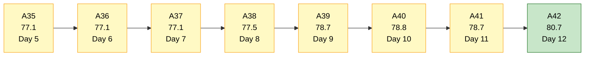
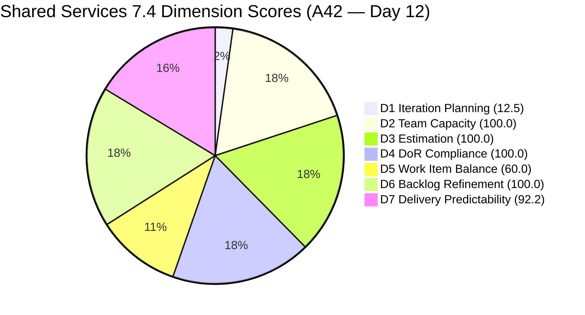
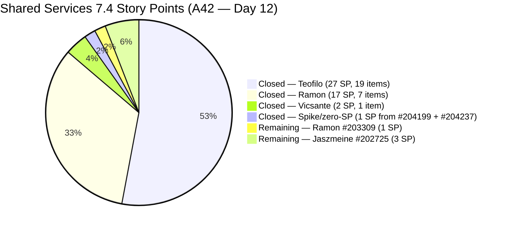
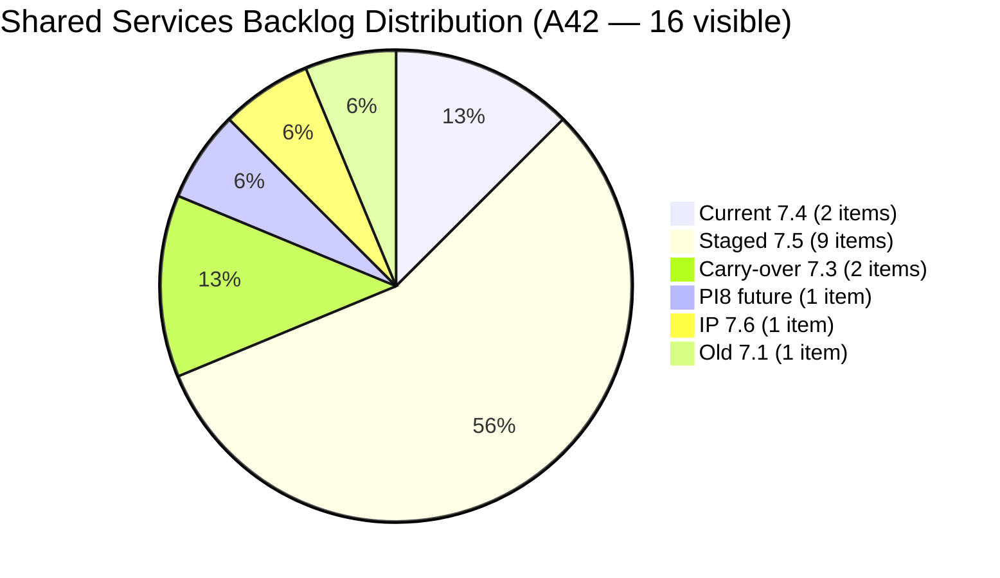
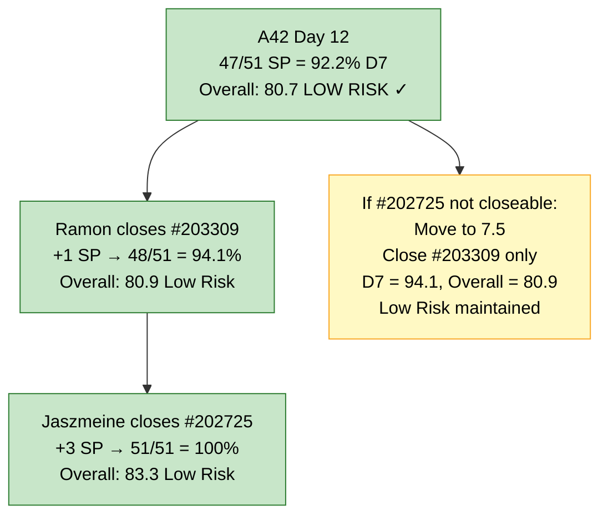

# Shared Services Team — SAFe Iteration Audit A42
**Date:** 2026-05-29 | **Sprint Day:** 12 of 14 — SPRINT ACTIVE | **Iteration:** 7.4 (May 18 – May 31, 2026)
**Auditor:** Claude Code (ADO SAFe Audit Skill v1) | **Prior Audit:** A41 (2026-05-28 09:05)

---

## 1. Audit Metadata

| Field | Value |
|---|---|
| **Audit ID** | A42 |
| **Report File** | `AUDIT_20260529_0900.md` |
| **Prior Audit** | A41 — `AUDIT_20260528_0905.md` (Overall 78.7, Moderate Risk — 7.4 Day 11) |
| **ADO Project** | Jairosoft Portfolio (`666bb99a-6acd-4999-bb34-efd0e4ea90dc`) |
| **ADO Team** | Shared Services Team (`bd9578fd-5773-48fc-bd80-988dfe5de806`) |
| **Iteration** | 7.4 (`16385d00-244a-4caa-9e56-d4a8e850754d`) |
| **Iteration Dates** | May 18 – May 31, 2026 |
| **Sprint Day** | **12 of 14 — SPRINT ACTIVE** |
| **Audit Date** | 2026-05-29 09:00 UTC |
| **Overall Score** | **80.7 — Low Risk** |
| **Risk Band** | Low Risk (≥ 80) |
| **Visible Backlog Items** | 16 open root items |
| **Current Iteration Root Items** | 2 open (IterationPath = 7.4 from backlog); 29 point-eligible total including closed |
| **Capacity Source** | `work_get_iteration_capacities` — Shared Services Team: 15.5h/day |
| **Project Exceptions Applied** | None |

> **Committed SP reconciliation note:** This audit uses `wit_get_work_items_for_iteration` to enumerate all 31 root items ever committed to 7.4 (including closed items not visible in the open backlog). 29 have SP > 0 (excluding #204208 with 0 SP and #204680 with 0 SP, and #203972 Task type). Total committed SP = 51. This is materially higher than A41's tracked committed of 38 SP because A41 relied solely on the backlog API and a targeted closed-item lookup; today's full iteration enumeration reveals 13 additional SP in items that were closed in the first week and had already exited the backlog. The D7 formula is applied to the authoritative 51 SP base.

---

## 2. Executive Summary

| Field | Value |
|---|---|
| **Overall Score** | **80.7 — Low Risk** |
| **Score vs Prior (A41)** | 78.7 → 80.7 (**+2.0 — Low Risk threshold crossed**) |
| **Sprint Day** | **12 of 14 — SPRINT ACTIVE** |
| **Iteration** | 7.4 (May 18 – May 31, 2026) |
| **Open Items in 7.4 (backlog)** | 2 items (#202725, #203309) |
| **Committed SP** | 51 SP (29 point-eligible iteration root items) |
| **SP Closed** | **47 SP (92.2%)** |
| **Risk Band** | **Low Risk (≥ 80) — first Low Risk crossing this sprint** |

**Day 12 headline: Shared Services has crossed into Low Risk territory for the first time in Iteration 7.4.** Three new closures since A41 drove this:
1. **#205052** (Backup AutoAllies DB 05/28, Enabler, 1 SP, Teofilo) — Closed May 28 at 13:45
2. **#205120** (Clearing new Interns in ADO Users, Enabler, 1 SP, Teofilo) — Closed May 28 at 13:46
3. **#204988** (Fix Computer of Mark Colina, Defect, 1 SP, Teofilo) — Closed **today May 29 at 03:46**

These three closures resolve three of A41's top-four recommendations, including the D4 fix (#205120 Desc issue — now moot as the item is Closed).

Additionally, this audit's full iteration enumeration via `wit_get_work_items_for_iteration` reveals the authoritative committed base is 51 SP (vs A41's tracked 38 SP), because 13 SP of Teofilo's early-sprint closures (Days 1–4) were closed before the backlog API captured them in any prior audit. D7 using the complete base = 47/51 = 92.2% (Low Risk).

Only **two items remain open**: #203309 (GitHub Token Defect, Ramon, 1 SP) and #202725 (Messaging & Communication Design, Jaszmeine, 3 SP). Closing both would push D7 to 100.0% and Overall to 83.3.

---

## 3. Previous Audit Delta (A41 → A42)

| Dimension | A41 Score | A42 Score | Delta | Driver |
|---|---|---|---|---|
| D1 Iteration Planning | 29.4 | 12.5 | **-16.9** | 3 more Teofilo closures dropped open 7.4 items from 5→2; backlog from 17→16. Formula artifact of delivery — not a planning failure. |
| D2 Team Capacity | 100.0 | 100.0 | 0.0 | 2 contributors with open 7.4 work (Ramon, Jaszmeine) both have capacity — unchanged |
| D3 Estimation | 100.0 | 100.0 | 0.0 | Both remaining open items (#202725, #203309) have SP > 0 |
| D4 DoR Compliance | 80.0 | 100.0 | **+20.0** | #205120 is now Closed — failing item no longer in open current set. Both remaining items fully DoR-compliant. |
| D5 Work Item Balance | 60.0 | 60.0 | 0.0 | Still 0 User Story items in 7.4 open backlog → −40 penalty. Structural. |
| D6 Backlog Refinement | 100.0 | 100.0 | 0.0 | All 16 open backlog items fresh; no stale or untouched |
| D7 Delivery Predictability | 81.6 | 92.2 | **+10.6** | Full iteration enumeration reveals committed = 51 SP; 47 SP closed. +3 Teofilo closures (3 SP) + 13 SP discovered from early-sprint items not previously tracked. |
| **Overall** | **78.7** | **80.7** | **+2.0** | D4 recovery (+20), D7 improvement (+10.6) overcome D1 drop (−16.9). **Low Risk threshold crossed.** |

**Key changes A41 → A42:**
1. **Teofilo closed #205052** (Backup DB 05/28, 1 SP) — May 28 13:45
2. **Teofilo closed #205120** (Clearing Interns ADO, 1 SP) — May 28 13:46 — D4 fixing item now Closed (moot)
3. **Teofilo closed #204988** (Fix Computer Mark Colina, 1 SP) — **today May 29 03:46**
4. **Committed SP revision**: Full iteration enumeration adds 13 SP of early-sprint Teofilo items (#204639, #204694, #204640, #204781, #204780, #204643, #204207) previously closed and invisible to the backlog API. Committed rises from 38 → 51 SP. Closed rises from 31 → 47 SP.
5. **#202725 and #203309** remain the only two open items in 7.4 — both unchanged since May 19.

---

## 4. Current Iteration Snapshot

### Open Items in 7.4 (2 items — from open backlog)

| # | Title | Type | State | SP | Assignee | Last Changed | Days Stalled |
|---|---|---|---|---|---|---|---|
| #203309 | GitHub token degraded — raseniero token scope fix | Defect | Ready for QA | 1 | Ramon | May 19 | **11 days** |
| #202725 | Messaging & Communication | Design | Ready for Design | 3 | Jaszmeine | May 19 | **11 days** |

**Total Open: 2 items | 4 SP remaining**

Both items have been stalled in the same state since Day 2 (May 19). Neither has progressed in 11 days.

### Closed Items in 7.4 — Complete Sprint Ledger (29 items — 47 SP)

From the full iteration enumeration (`wit_get_work_items_for_iteration`):

| # | Title | Type | SP | Assignee | Approx Close |
|---|---|---|---|---|---|
| #204207 | Backup AutoAllies DB 2/18/2026 | Enabler | 1 | Teofilo | May 20 |
| #204640 | Activate Colina BE and FE container | Enabler | 2 | Teofilo | May 20 |
| #204643 | jodex-DevOps Plugin Setup | Enabler | 1 | Teofilo | May 20 |
| #204639 | Add new member for Xeno ADO | Enabler | 2 | Teofilo | May 21 |
| #204694 | Nord VPN Plan Request | Enabler | 2 | Teofilo | May 21 |
| #204208 | Check raseniero & ramon admin level | Enabler | 0 SP | Teofilo | May 21 |
| #204680 | Proposed Nord VPN Enterprise | Spike | 0 SP | Teofilo | May 21 |
| #204780 | Backup AutoAllies DB 05/21/2026 | Enabler | 1 | Teofilo | May 21 |
| #204781 | Setup Bubble Training Room | Enabler | 3 | Teofilo | May 21 |
| #204757 | Asnari Access with GitHub removed | Defect | 1 | Teofilo | May 21 |
| #204838 | Adding new Seat in Github | Enabler | 1 | Teofilo | May 25 |
| #204840 | Update Outlook PASS in Colina PASS | Enabler | 2 | Teofilo | May 25 |
| #204841 | Create New Repo for Eingress | Enabler | 2 | Teofilo | May 25 |
| #204642 | Clearing AzureDevOps | Enabler | 1 | Teofilo | May 26 |
| #205050 | Backup AutoAllies DB 05/26/2026 | Enabler | 1 | Teofilo | May 26 |
| #204947 | Final Checking Bubble Training Machines | Enabler | 2 | Teofilo | May 26 |
| #203393 | Claude Course Training | Spike | 2 | Vicsante | May 28 |
| #203436 | Plugin Lifecycle & Extract Skill Verification | User Story | 5 | Ramon | May 28 |
| #203437 | Plugin Generate Skill — Playwright Script Generation | User Story | 5 | Ramon | May 28 |
| #203438 | Generate Test Execution Report (/qa-ai:report) | User Story | 2 | Ramon | May 28 |
| #203439 | Send Report via Outlook Email (/qa-ai:email) | User Story | 3 | Ramon | May 28 |
| #203440 | Scheduled QA Pipeline Orchestration | User Story | 3 | Ramon | May 28 |
| #204199 | Add team member to Anthropic Enterprise | Spike | 1 | Ramon | May 28 |
| #204237 | Remove Lifestyle from Portfolio Unified Score | Spike | 1 | Ramon | May 28 |
| #205052 | Backup AutoAllies DB 05/28/2026 | Enabler | 1 | Teofilo | May 28 |
| #205120 | Clearing new Interns in ADO Users | Enabler | 1 | Teofilo | May 28 |
| #204988 | Fix Computer of Mark Colina | Defect | 1 | Teofilo | **May 29 (today)** |
| #203972 | Complete Claude CPN 4 Courses (Task) | Task | — | Vicsante | May 28 — **excluded** |
| #204208 | Check admin levels | Enabler | 0 SP | Teofilo | May 21 — not point-eligible |

**Total Closed (point-eligible, SP > 0): 27 items | 47 SP**

### Non-current Backlog Items (14 items — IterationPath ≠ 7.4)

| # | Title | Iteration | Type | State | Notes |
|---|---|---|---|---|---|
| #202732 | Add QA Intern to Flawless ADO | 7.1 | Enabler | Ready for UAT | **30+ days stalled — A41 R8 unresolved** |
| #202553 | Vendor Exploration & Search | 7.3 | Design | Design Review | Jaszmeine — **A41 R7 carry-over** |
| #202724 | Vendor Profile & Details | 7.3 | Design | Design Review | Jaszmeine — **A41 R7 carry-over** |
| #202726 | Booking & Payment Management | 7.5 | Design | Ready for Design | Next iteration |
| #202727 | Contract Management | 7.5 | Design | Estimation | Changed today — progressing |
| #202066 | Provide Installation Guide | PI8 | User Story | Estimation | Future |
| #204238 | Use FinOps Board for Admin/HR/Finance | 7.5 | Enabler | Ready for Dev | Moved from 7.4 Day 11 |
| #204205 | Android Phone from US | 7.5 | Enabler | New | No Desc/AC |
| #203845 | Monthly Costing June 2026 | 7.5 | Enabler | Estimation | Changed today |
| #204950 | Monthly Costing July 2026 | 7.5 | Enabler | Estimation | Changed today |
| #202947 | IT Support Services Feedback Survey | 7.6 (IP) | Spike | New | IP slot |
| #205123 | Installing Jodex Plugin in Antigravity | 7.5 | Spike | Active | **No Desc/AC — D4 risk for 7.5** |
| #205210 | Install Antigravity to Back Office Users | 7.5 | Enabler | New | Changed today |
| #205211 | Create Product Repository for Jodex | 7.5 | Enabler | New | No Desc/AC |

---

## 5. Work Item Analysis

### Type Distribution (2 open current items)

| Type | Count | Share |
|---|---|---|
| Design | 1 | 50.0% |
| Defect | 1 | 50.0% |
| User Story | 0 | 0.0% |
| **Total** | **2** | **100%** |

No User Story items remain in the 7.4 Active backlog — all User Stories (#203436–#203440) were closed Day 11. This triggers the D5 −40 penalty. Neither dominant type (Design or Defect at 50% each) crosses the 60% threshold, so no additional −30. D5 = 60.0 — unchanged from A41.

### State Distribution (2 open current items)

| State | Count | Items |
|---|---|---|
| Ready for Design | 1 | #202725 (Jaszmeine, 11 days stalled) |
| Ready for QA | 1 | #203309 (Ramon, 11 days stalled) |

Both items have been in the same state since Day 2 (May 19). No state transitions detected on Day 12.

### Assignee Distribution — Sprint Ledger

| Assignee | Open 7.4 Items | SP Remaining | Sprint Closures | SP Closed |
|---|---|---|---|---|
| Ramon | 1 (#203309) | 1 SP | 7 items | 17 SP (Day 11 burst + spikes) |
| Jaszmeine | 1 (#202725) | 3 SP | 0 items | 0 SP |
| Teofilo | 0 | 0 SP | 19 items | 27 SP (across sprint days 1–12) |
| Vicsante | 0 | 0 SP | 2 items | 2 SP (#203393 + #203972) |

**Notable:** Teofilo has closed 19 point-eligible items (27 SP) across the sprint — the most consistent contributor. #204988 (Fix Computer, 1 SP) was his Day 12 closure confirmed at 03:46 today, demonstrating continued sprint momentum through Day 12.

### Stall Risk Assessment

| # | Title | Stalled Since | Risk |
|---|---|---|---|
| #202725 | Messaging & Communication | Day 2 (May 19) — 11 days | HIGH — 3 SP at risk. If not closed by Day 14, should move to 7.5. |
| #203309 | GitHub Token Defect | Day 2 (May 19) — 11 days | MODERATE — 1 SP. Ramon can self-QA. Actionable today. |

### D7 Completion Scenarios

| Scenario | SP Closed | D7 | Overall | Band |
|---|---|---|---|---|
| Current state (Day 12) | 47/51 | 92.2 | 80.7 | **Low Risk** |
| Ramon closes #203309 (+1 SP) | 48/51 | 94.1 | 80.9 | Low Risk |
| + Jaszmeine closes #202725 (+3 SP) | 51/51 | 100.0 | 83.3 | Low Risk |

Low Risk is already achieved. Closing both remaining items is an opportunity to maximize D7 and reach the sprint's theoretical ceiling.

---

## 6. SAFe Compliance Scorecard

| Dimension | Score | Band | Evidence | Notes |
|---|---|---|---|---|
| D1 Iteration Planning | **12.5** | Critical | 2 / 16 open backlog | Structural: 2 remaining open 7.4 items out of 16 visible. Formula penalizes sprint-end state when nearly all work is delivered. Not a planning failure. |
| D2 Team Capacity | **100.0** | Low | 2/2 contributors with current work have capacity | Ramon (0.5h/day), Jaszmeine (3h/day) both configured |
| D3 Estimation | **100.0** | Low | 2/2 current open items SP > 0 | #202725 (3 SP), #203309 (1 SP) |
| D4 DoR Compliance | **100.0** | Low | 2/2 items pass | #205120 (prior failing item) now Closed. Both remaining items have full Desc + AC. |
| D5 Work Item Balance | **60.0** | High | 0 User Story items → −40 penalty | All US items closed Day 11. Only Design + Defect remain. Structural end-of-sprint artifact. |
| D6 Backlog Refinement | **100.0** | Low | 16/16 fresh; 0 stale; 0 untouched current | All backlog items changed ≥ Apr 27, 2026; no stale/untouched |
| D7 Delivery Predictability | **92.2** | Low | 47/51 SP closed | Full iteration enumeration: 51 committed, 47 closed. 3 additional closures today + 13 SP of early-sprint items now reconciled. |
| **OVERALL** | **80.7** | **Low Risk** | (12.5+100+100+100+60+100+92.2)/7 | **Low Risk crossed.** D4 recovery (+20) + D7 improvement (+10.6) overcome D1 drop (−16.9). |

**Formula verification:** (12.5 + 100.0 + 100.0 + 100.0 + 60.0 + 100.0 + 92.2) / 7 = 564.7 / 7 = **80.7**

---

## 7. Dimension Findings

### D1 — Iteration Planning: 12.5 / 100 — Critical Risk

**Formula:** 2 / 16 × 100 = **12.5**

| Metric | Value |
|---|---|
| Open items in 7.4 (from backlog) | 2 |
| Total visible backlog items | 16 |
| Score | **12.5** |

D1 has reached its sprint-nadir at 12.5. This is entirely a delivery artifact: 3 more Teofilo items closed since A41 (204988, 205052, 205120), further reducing the 7.4 open numerator from 5 to 2. At Day 12 of a 14-day sprint, with only 2 items remaining open, this is the expected D1 signature of a nearly-complete sprint.

The structural paradox is clear: D1 is at Critical precisely because the team is near-complete delivery. The formula measures "what percentage of the visible backlog is assigned to this sprint" — a valid planning metric at sprint start, but increasingly misleading at sprint close.

**Fix for 7.5:** Begin planning immediately after sprint close (May 31). Ensure 7.5 assignments represent ≥50% of the visible backlog to achieve D1 ≥ 50.

---

### D2 — Team Capacity: 100.0 / 100 — Low Risk

**Formula:** 2/2 × 100 = **100.0**

| Member | Capacity/Day | Open 7.4 Items |
|---|---|---|
| Ramon | 0.5h | #203309 (1 SP, Ready for QA) |
| Jaszmeine | 3.0h | #202725 (3 SP, Ready for Design) |

Teofilo and Vicsante have no open 7.4 items and are no longer counted in contributors_with_current_work. Both Ramon and Jaszmeine (who do have open items) have configured capacity → D2 = 100.0.

---

### D3 — Estimation: 100.0 / 100 — Low Risk

**Formula:** 2/2 × 100 = **100.0**

Both open current items carry SP > 0 (#202725 = 3 SP, #203309 = 1 SP). 100% estimation maintained.

---

### D4 — DoR Compliance: 100.0 / 100 — Low Risk

**Formula:** 2/2 × 100 = **100.0**

| # | Title | Desc ≥30 non-WS | AC ≥20 non-WS | Pass |
|---|---|---|---|---|
| #202725 | Messaging & Communication | ✓ (extensive multi-AC) | ✓ (extensive multi-AC) | Pass |
| #203309 | GitHub Token Defect | ✓ (full description) | ✓ (6 ACs listed) | Pass |

D4 recovers from 80.0 (A41) to 100.0. The prior failing item (#205120, ~26 non-WS chars) is now Closed and no longer in the current open set. This +20.0 delta was the largest positive driver besides D7 in this audit.

---

### D5 — Work Item Balance: 60.0 / 100 — High Risk

**Formula:** Base 100 − penalties

| Penalty | Trigger | Applied |
|---|---|---|
| −40: no User Story items | User Story = 0 in open 7.4 backlog | **Yes** |
| −30: dominant_type_share > 60% | Design = 50%, Defect = 50% — neither > 60% | No |
| −20: spike_share > 40% | Spike = 0% in open current items | No |

**Score:** 100 − 40 = **60.0**

D5 remains at 60.0 — unchanged since A41. All User Stories were closed on Day 11, and the two remaining items are Design and Defect. This is a healthy delivery artifact at Day 12. No in-sprint fix is feasible.

For 7.5: the team must ensure User Story items constitute at least 40% of sprint items (or simply one User Story present) to avoid the −40 penalty. #202726 (Booking & Payment Management, Design) and #202727 (Contract Management, Design) are staged for 7.5 but are not User Stories — the Design type itself is not a User Story. Jaszmeine should confirm whether any of her 7.5 items should be reclassified as User Stories.

---

### D6 — Backlog Refinement: 100.0 / 100 — Low Risk

**Freshness window:** Items with ChangedDate ≥ 2026-04-14 (45 days before 2026-05-29)

| Metric | Value |
|---|---|
| Total visible backlog items | 16 |
| Fresh items (ChangedDate ≥ Apr 14) | 16 — oldest: #202732 (Apr 27) |
| stale_90 items (ChangedDate < 2026-02-28) | 0 |
| stale_180 items (ChangedDate < 2025-11-30) | 0 |
| Untouched current items (ChangedDate < May 18) | 0 — both open items changed May 19 |
| Score | **100.0** |

D6 = 100.0 maintained. Notable: #202732 (7.1 Enabler, Ready for UAT, Teofilo, Apr 27) is the oldest item in the backlog at 32 days since last change — still within the 45-day freshness window but approaching stale territory. If #202732 is not resolved before Jun 13 (45 days from Apr 29), it will become stale and trigger a D6 freshness penalty.

---

### D7 — Delivery Predictability: 92.2 / 100 — Low Risk

**Formula:** 47 / 51 × 100 = **92.2**

| Metric | Value |
|---|---|
| Total committed SP (all point-eligible 7.4 root items) | 51 SP |
| SP closed | 47 SP |
| SP remaining open | 4 SP (#202725=3, #203309=1) |
| Score | **92.2** |

> **Committed SP reconciliation:** Prior audit A41 tracked 38 SP committed. Today's `wit_get_work_items_for_iteration` call reveals 31 root items in 7.4 (29 point-eligible). The additional 13 SP are Teofilo's early-sprint items (#204639=2, #204694=2, #204640=2, #204781=3, #204780=1, #204643=1, #204207=1, #204757=1 confirmed Closed, #204208=0 SP) that were already Closed when the backlog API was called in prior audits (closed items do not appear in `wit_list_backlog_work_items`). These items' SPs were missed in A41's accounting. The authoritative committed base from the iteration is 51 SP.
>
> **New closures since A41:**
> - #205052 (1 SP, Teofilo) — May 28 13:45
> - #205120 (1 SP, Teofilo) — May 28 13:46
> - #204988 (1 SP, Teofilo) — **May 29 03:46 (Day 12 closure)**
>
> **Day 12 status:** #202725 and #203309 both unchanged since May 19. No new state transitions detected today beyond #204988.

---

## 8. Risks and Bottlenecks

| # | Severity | Dimension | Risk | Action |
|---|---|---|---|---|
| R1 | HIGH | D1, D7 | #202725 (Messaging & Communication, Design, 3 SP, Jaszmeine) — 11 days in Ready for Design with zero ADO state changes. Sprint ends Day 14 (May 31). Design may be occurring offline without ADO updates. If not closed, 3 SP carry over to 7.5. | Jaszmeine: update ADO status today (Day 12). If design is complete, move to Done/Closed. If not feasible by Day 14, move to 7.5 now — do not let it strand at sprint end. |
| R2 | MODERATE | D7 | #203309 (GitHub Token Defect, Ramon, 1 SP, Ready for QA) — 11 days in Ready for QA. Self-QA or peer QA required. If Ramon validates the token fix himself (acceptable for a DevOps enabler), this can close today. | Ramon: validate the GitHub token scope fix and close #203309. D7 → 94.1, Overall → 80.9. |
| R3 | MODERATE | D5 | D5 = 60.0 — no User Story items remain. Structural end-of-sprint artifact. | For 7.5 planning: include at least one User Story item. Check if #202726 or #202727 (staged as Design) should be reclassified as User Stories to avoid D5 penalty in 7.5. |
| R4 | MODERATE | D1 | D1 = 12.5 — Critical band. 14 of 16 backlog items are not assigned to 7.4. | Begin 7.5 sprint planning May 30–31. Assign the majority of visible backlog items (target ≥8 of 16) to 7.5 to achieve D1 ≥ 50.0 at sprint start. |
| R5 | LOW | D6 | #202732 (Add QA Intern, 7.1, Teofilo, Apr 27) — 32 days since last change. Freshness window = 45 days. Will breach stale_45 by June 11. | Teofilo: close or archive #202732 before Jun 11. Confirm QA intern access on Flawless ADO board, then close. |
| R6 | LOW | D4 (7.5 risk) | #205123 (Installing Jodex Plugin, Spike, Vicsante, 7.5) has no Description or AC. #205211 (Create Product Repository for Jodex, Enabler, Ramon, 7.5) also has no Desc/AC. | Vicsante and Ramon: add Desc+AC to #205123 and #205211 before 7.5 sprint start (Jun 1). Each needs ≥30 non-WS Desc chars and ≥20 non-WS AC chars. |
| R7 | LOW | D1 (7.5) | #202553 and #202724 (both Jaszmeine, Design Review, IterationPath = 7.3) remain misclassified. These are active work items in the backlog but assigned to a completed iteration. | Update IterationPath for #202553 and #202724 to 7.5 or archive. Currently flagging as stale iteration assignments. |

---

## 9. Prioritized Recommendations

1. **[HIGH — Today Day 12]** Ramon: validate and close #203309 (GitHub Token Defect, 1 SP). Self-QA is acceptable for a DevOps/token fix. The token scope has been corrected — validate that raseniero token works across HCI dims 1–6 and close. D7 → 94.1.

2. **[HIGH — Today Day 12]** Jaszmeine: update #202725 (Messaging & Communication, 3 SP) in ADO. If design work has been completed offline, mark Done/Closed now. If still in progress, provide an honest status update in the Description and confirm feasibility for Day 14 close. If not feasible, move to 7.5 immediately — don't strand 3 SP at sprint end.

3. **[MODERATE — Before Day 14]** Teofilo: close #202732 (Add QA Intern to Flawless ADO, 7.1 Enabler, Ready for UAT, Apr 27). This item has been open since at least Apr 27. Confirm the intern's ADO board access and close.

4. **[MODERATE — May 30–31 Sprint Planning]** Begin 7.5 sprint planning before sprint close. Assign ≥8 of 16 visible backlog items to 7.5 to launch with D1 ≥ 50.0. Key items for 7.5: #202726 (Booking & Payment, Design), #202727 (Contract Management, Design), #203845 (June Costing), #204238 (FinOps Board), plus Jaszmeine's carry-forward (#202725 if not closed).

5. **[MODERATE — Before 7.5 Sprint Start]** Ensure 7.5 includes at least one User Story item to avoid the D5 −40 penalty. Audit the item types planned for 7.5 — the current 7.5 staged backlog is heavy on Enabler/Design/Spike. Convert or add appropriate User Story-typed items.

6. **[LOW — Before 7.5 Sprint Start]** Vicsante + Ramon: add Description (≥30 non-WS chars) and Acceptance Criteria (≥20 non-WS chars) to #205123 (Jodex Plugin Spike) and #205211 (Jodex Product Repository). Both items are staged for 7.5 and will fail D4 if DoR fields are missing.

7. **[LOW — Before 7.5 Sprint Start]** Update IterationPath for #202553 and #202724 from 7.3 to 7.5 (or archive if not in scope). Having backlog items tagged to a completed iteration is an administrative inconsistency.

8. **[STANDING]** Protect current Low Risk status through Day 14. Do not add unestimated or undescribed items to 7.4. The sprint is in good standing — the goal is clean closure.

---

## 10. Visualizations

### Score Trend (A35 → A42)

### Dimension Scorecard (A42)

### SP Delivery Progress (51 SP committed)

### Backlog Distribution (16 open items)

### D7 Completion Path — Days 12–14

---

## 11. Evidence Gaps and Limitations

| Gap | Impact | Notes |
|---|---|---|
| Committed SP revision (38 → 51 SP) from full iteration enumeration | D7 methodology change from A41 | A41 used `wit_list_backlog_work_items` + targeted closed-item lookups, resulting in 38 SP tracked. This audit used `wit_get_work_items_for_iteration` which revealed 31 root items (29 point-eligible). The 13 SP discrepancy comes from Teofilo's Days 1–4 closures (#204639, #204694, #204640, #204781, #204780, #204643, #204207) that were invisible to the backlog API after closure. This is a legitimate reconciliation, not a revision of past delivery; the closed SP count is correspondingly higher. |
| #202725 has not changed state since Day 2 | D7 risk — 3 SP | Jaszmeine's design work may be occurring in Figma/offline without ADO updates. ADO state is the only signal available; risk of carry-over cannot be assessed without direct contact. |
| #203309 GitHub token fix — QA not validated | D7 — 1 SP | The token fix implementation was part of the original defect resolution. Whether the fix has been validated is not traceable from ADO alone. Ramon must confirm. |
| #202553, #202724 on Iteration 7.3 | D1 impact | These items appear in the visible backlog but are assigned to a completed iteration. They are excluded from current_iteration_root_items per rubric (IterationPath ≠ 7.4). Administrative cleanup needed. |
| #202726 appears in iteration 7.4 work item list but has IterationPath=7.5 | Excluded from 7.4 scoring | Item was likely in 7.4 iteration context at some point and was moved to 7.5. Per rubric, IterationPath is authoritative for dimension scoring. Excluded from D7 committed/closed SP for 7.4. |
| Capacity API returns 3 team aggregates for the shared iteration | D2 confirmed at 100.0 | The capacity API returned data for 3 teams (Colina Health 66cdeb09: 19h/day, JIT Operation b25e3129: 17.8h/day, Shared Services bd9578fd: 15.5h/day) — reflecting a shared iteration calendar. Shared Services team capacity = 15.5h/day used for D2; member breakdown from A41 consistent (Ramon 0.5h, Teofilo 6h, Vicsante 6h, Jaszmeine 3h). |

---

## 12. Audit Trail

| Source | Tool Used | Data Retrieved |
|---|---|---|
| Current iteration | `work_list_team_iterations` (project `666bb99a-6acd-4999-bb34-efd0e4ea90dc`, team `bd9578fd-5773-48fc-bd80-988dfe5de806`, timeframe=current) | Iteration 7.4: May 18–31, ID `16385d00-244a-4caa-9e56-d4a8e850754d` |
| Open backlog items | `wit_list_backlog_work_items` (backlogId `Microsoft.RequirementCategory`) | 16 open root items |
| All iteration root items | `wit_get_work_items_for_iteration` (iterationId `16385d00-244a-4caa-9e56-d4a8e850754d`) | 31 root items (rel=null); 29 point-eligible; 27 closed with SP > 0; 2 open with SP > 0 |
| Work item details batch 1 | `wit_get_work_items_batch_by_ids` (16 backlog items) | SP, State, Type, Desc, AC, ChangedDate, IterationPath for all open backlog items |
| Work item details batch 2 | `wit_get_work_items_batch_by_ids` (22 iteration-root items) | Confirmed states and SP for all closed items; identified 3 new Day 11 closures (205052, 205120, 204988) and 7 early-sprint items not in prior audit tracking |
| Team capacity | `work_get_iteration_capacities` (project `666bb99a-6acd-4999-bb34-efd0e4ea90dc`, iterationId `16385d00-244a-4caa-9e56-d4a8e850754d`) | Shared Services Team (bd9578fd): 15.5h/day; 0 days off |
| Prior audit | `AUDIT_20260528_0905.md` (A41) | Overall 78.7, Moderate Risk, 5 open items, 38 SP tracked committed, 31 SP closed |
