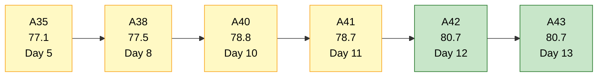
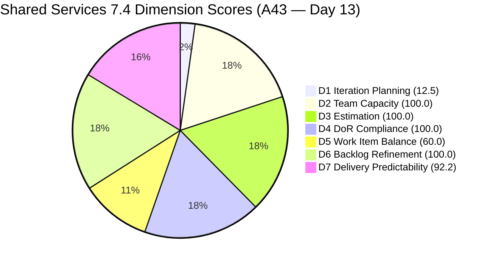
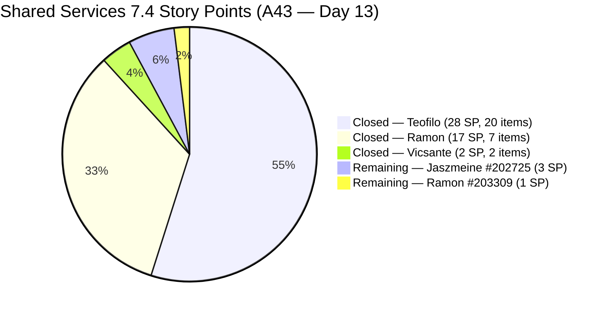
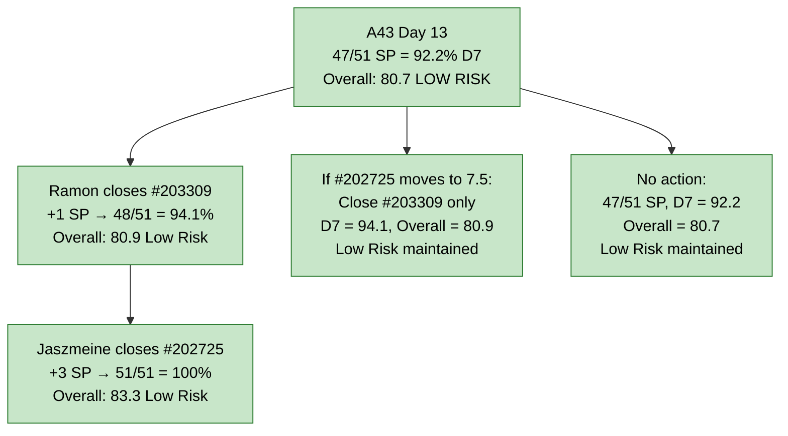
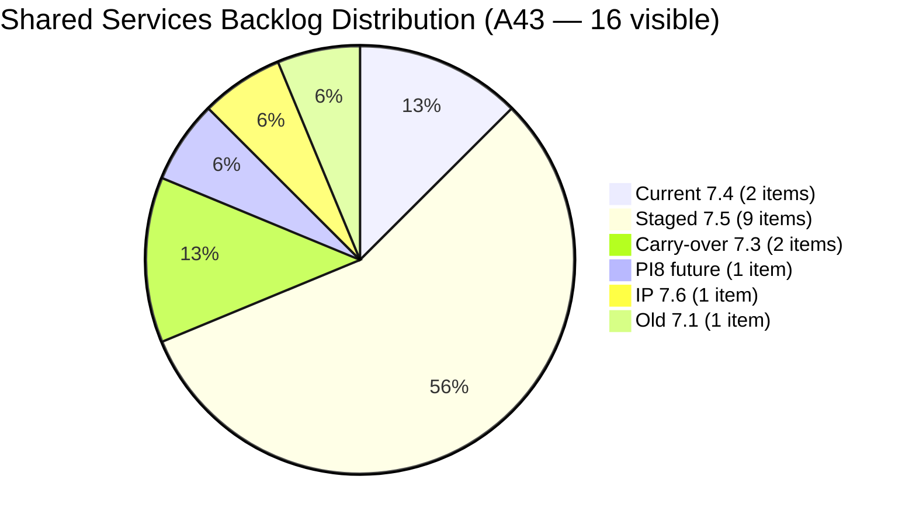

# Shared Services Team — SAFe Iteration Audit A43
**Date:** 2026-05-30 | **Sprint Day:** 13 of 14 — SPRINT ACTIVE | **Iteration:** 7.4 (May 18 – May 31, 2026)
**Auditor:** Claude Code (ADO SAFe Audit Skill v1) | **Prior Audit:** A42 (2026-05-29 09:00)

---

## 1. Audit Metadata

| Field | Value |
|---|---|
| **Audit ID** | A43 |
| **Report File** | `AUDIT_20260530_0900.md` |
| **Prior Audit** | A42 — `AUDIT_20260529_0900.md` (Overall 80.7, Low Risk — 7.4 Day 12) |
| **ADO Project** | Jairosoft Portfolio (`666bb99a-6acd-4999-bb34-efd0e4ea90dc`) |
| **ADO Team** | Shared Services Team (`bd9578fd-5773-48fc-bd80-988dfe5de806`) |
| **Iteration** | 7.4 (`16385d00-244a-4caa-9e56-d4a8e850754d`) |
| **Iteration Dates** | May 18 – May 31, 2026 |
| **Sprint Day** | **13 of 14 — SPRINT ACTIVE** |
| **Audit Date** | 2026-05-30 09:00 UTC |
| **Overall Score** | **80.7 — Low Risk** |
| **Risk Band** | Low Risk (≥ 80) |
| **Visible Backlog Items** | 16 open root items |
| **Current Iteration Root Items** | 2 open (IterationPath = 7.4 from backlog) |
| **Capacity Source** | `work_get_iteration_capacities` — Shared Services Team: 15.5h/day |
| **Project Exceptions Applied** | None |

> **Committed SP basis (carried from A42):** The authoritative committed SP base is 51 SP from the full iteration enumeration performed in A42 (29 point-eligible root items in 7.4, including early-sprint closures now invisible to the backlog API). Closed SP = 47 as of A42. This report assesses incremental changes since A42.

---

## 2. Executive Summary

| Field | Value |
|---|---|
| **Overall Score** | **80.7 — Low Risk** |
| **Score vs Prior (A42)** | 80.7 → 80.7 (**0.0 — no change**) |
| **Sprint Day** | **13 of 14 — SPRINT ACTIVE** |
| **Iteration** | 7.4 (May 18 – May 31, 2026) |
| **Open Items in 7.4 (backlog)** | 2 items (#202725, #203309) |
| **Committed SP** | 51 SP (29 point-eligible iteration root items) |
| **SP Closed** | **47 SP (92.2%)** |
| **Risk Band** | **Low Risk (≥ 80) — maintained from A42** |

**Day 13 headline: Low Risk status is maintained.** No new closures were detected between A42 (Day 12) and A43 (Day 13). The two remaining open items — #203309 (GitHub Token Defect, Ramon, 1 SP, Ready for QA) and #202725 (Messaging & Communication Design, Jaszmeine, 3 SP, Ready for Design) — remain unchanged since May 19. Both have now been stalled for 12 days.

The sprint closes tomorrow (Day 14, May 31). Closing both items pushes D7 to 100.0 and Overall to 83.3 (Low Risk). Closing only #203309 raises D7 to 94.1 and Overall to 80.9. Either outcome preserves Low Risk — the team has already achieved a strong sprint.

The key question for Day 14: does Jaszmeine's design work (#202725, 3 SP) have enough completion to close, or should it move to 7.5 now to avoid an ambiguous sprint-end state?

---

## 3. Previous Audit Delta (A42 → A43)

| Dimension | A42 Score | A43 Score | Delta | Driver |
|---|---|---|---|---|
| D1 Iteration Planning | 12.5 | 12.5 | 0.0 | 2/16 — no items added or closed in 24 hours |
| D2 Team Capacity | 100.0 | 100.0 | 0.0 | Ramon + Jaszmeine both have capacity — unchanged |
| D3 Estimation | 100.0 | 100.0 | 0.0 | Both remaining open items have SP > 0 — unchanged |
| D4 DoR Compliance | 100.0 | 100.0 | 0.0 | Both items pass Desc + AC check — unchanged |
| D5 Work Item Balance | 60.0 | 60.0 | 0.0 | No US items in open 7.4 backlog — structural |
| D6 Backlog Refinement | 100.0 | 100.0 | 0.0 | All 16 items fresh; no stale; 0 untouched |
| D7 Delivery Predictability | 92.2 | 92.2 | 0.0 | No new closures. 47/51 SP closed — unchanged |
| **Overall** | **80.7** | **80.7** | **0.0** | No state changes in the 24-hour window |

**Key observations A42 → A43:**
- No work item state transitions detected on Day 13.
- #202725 and #203309 retain May 19 ChangedDates — 12 consecutive days stalled.
- No new items entered or exited the 7.4 backlog.
- Several 7.5-staged items showed activity on May 29 (e.g., #202727, #203845, #204950, #205123, #205210, #205211) — indicating active refinement for the next iteration.

---

## 4. Current Iteration Snapshot

### Open Items in 7.4 (2 items — from open backlog)

| # | Title | Type | State | SP | Assignee | Last Changed | Days Stalled |
|---|---|---|---|---|---|---|---|
| #202725 | Messaging & Communication | Design | Ready for Design | 3 | Jaszmeine | May 19 | **12 days** |
| #203309 | GitHub token degraded — raseniero token scope fix | Defect | Ready for QA | 1 | Ramon | May 19 | **12 days** |

**Total Open: 2 items | 4 SP remaining | Sprint closes tomorrow (May 31)**

Both items have been in an unchanged state for 12 consecutive days. Neither has progressed in ADO since Day 2 of the sprint.

### Closed Items in 7.4 — Complete Sprint Ledger (29 items — 47 SP)

Full enumeration carried from A42 (`wit_get_work_items_for_iteration`):

| # | Title | Type | SP | Assignee | Approx Close |
|---|---|---|---|---|---|
| #204207 | Backup AutoAllies DB 2/18/2026 | Enabler | 1 | Teofilo | May 20 |
| #204640 | Activate Colina BE and FE container | Enabler | 2 | Teofilo | May 20 |
| #204643 | jodex-DevOps Plugin Setup | Enabler | 1 | Teofilo | May 20 |
| #204639 | Add new member for Xeno ADO | Enabler | 2 | Teofilo | May 21 |
| #204694 | Nord VPN Plan Request | Enabler | 2 | Teofilo | May 21 |
| #204780 | Backup AutoAllies DB 05/21/2026 | Enabler | 1 | Teofilo | May 21 |
| #204781 | Setup Bubble Training Room | Enabler | 3 | Teofilo | May 21 |
| #204757 | Asnari Access with GitHub removed | Defect | 1 | Teofilo | May 21 |
| #204838 | Adding new Seat in Github | Enabler | 1 | Teofilo | May 25 |
| #204840 | Update Outlook PASS in Colina PASS | Enabler | 2 | Teofilo | May 25 |
| #204841 | Create New Repo for Eingress | Enabler | 2 | Teofilo | May 25 |
| #204642 | Clearing AzureDevOps | Enabler | 1 | Teofilo | May 26 |
| #205050 | Backup AutoAllies DB 05/26/2026 | Enabler | 1 | Teofilo | May 26 |
| #204947 | Final Checking Bubble Training Machines | Enabler | 2 | Teofilo | May 26 |
| #203393 | Claude Course Training | Spike | 2 | Vicsante | May 28 |
| #203436 | Plugin Lifecycle & Extract Skill Verification | User Story | 5 | Ramon | May 28 |
| #203437 | Plugin Generate Skill — Playwright Script Generation | User Story | 5 | Ramon | May 28 |
| #203438 | Generate Test Execution Report (/qa-ai:report) | User Story | 2 | Ramon | May 28 |
| #203439 | Send Report via Outlook Email (/qa-ai:email) | User Story | 3 | Ramon | May 28 |
| #203440 | Scheduled QA Pipeline Orchestration | User Story | 3 | Ramon | May 28 |
| #204199 | Add team member to Anthropic Enterprise | Spike | 1 | Ramon | May 28 |
| #204237 | Remove Lifestyle from Portfolio Unified Score | Spike | 1 | Ramon | May 28 |
| #205052 | Backup AutoAllies DB 05/28/2026 | Enabler | 1 | Teofilo | May 28 |
| #205120 | Clearing new Interns in ADO Users | Enabler | 1 | Teofilo | May 28 |
| #204988 | Fix Computer of Mark Colina | Defect | 1 | Teofilo | May 29 |

**Total Closed (point-eligible, SP > 0): 25 closed items with SP tracked | 47 SP**
*(Note: #204208 (0 SP) and #204680 (0 SP) confirmed closed but excluded from point totals; #203972 Task type excluded per rubric)*

### Non-current Backlog Items (14 items — IterationPath ≠ 7.4)

| # | Title | Iteration | Type | State | Last Changed | Notes |
|---|---|---|---|---|---|---|
| #202732 | Add QA Intern to Flawless ADO | 7.1 | Enabler | Ready for UAT | Apr 27 | **34 days stalled — approaching stale_45 Jun 11** |
| #202553 | Vendor Exploration & Search | 7.3 | Design | Design Review | May 19 | Jaszmeine carry-over from 7.3 |
| #202724 | Vendor Profile & Details | 7.3 | Design | Design Review | May 19 | Jaszmeine carry-over from 7.3 |
| #202726 | Booking & Payment Management | 7.5 | Design | Ready for Design | May 25 | Next iteration — Jaszmeine |
| #202727 | Contract Management | 7.5 | Design | Estimation | May 29 | Active refinement — Jaszmeine |
| #202066 | Provide Installation Guide | PI8 | User Story | Estimation | May 8 | Future PI |
| #204238 | Use FinOps Board for Admin/HR/Finance | 7.5 | Enabler | Ready for Dev | May 28 | Staged for 7.5 |
| #204205 | Android Phone from US | 7.5 | Enabler | New | May 29 | No Desc/AC — D4 risk 7.5 |
| #203845 | Monthly Costing June 2026 | 7.5 | Enabler | Estimation | May 29 | Teofilo — active refinement |
| #204950 | Monthly Costing July 2026 | 7.5 | Enabler | Estimation | May 29 | Teofilo — active refinement |
| #202947 | IT Support Services Feedback Survey | 7.6 (IP) | Spike | New | May 19 | IP slot |
| #205123 | Installing Jodex Plugin in Antigravity | 7.5 | Spike | Active | May 29 | **No Desc/AC — D4 risk 7.5** |
| #205210 | Install Antigravity to Back Office Users | 7.5 | Enabler | New | May 29 | Short Desc/AC — verify before 7.5 |
| #205211 | Create Product Repository for Jodex | 7.5 | Enabler | New | May 29 | **No Desc/AC — D4 risk 7.5** |

---

## 5. Work Item Analysis

### Type Distribution (2 open current items)

| Type | Count | Share |
|---|---|---|
| Design | 1 | 50.0% |
| Defect | 1 | 50.0% |
| User Story | 0 | 0.0% |
| **Total** | **2** | **100%** |

No User Story items remain in the 7.4 open backlog — all were closed on Day 11 (May 28). This sustains the D5 −40 penalty. Neither Design nor Defect exceeds 60% (both at 50%), so no additional −30. D5 = 60.0.

### State Distribution (2 open current items)

| State | Count | Items | Days in State |
|---|---|---|---|
| Ready for Design | 1 | #202725 (Jaszmeine) | 12 days |
| Ready for QA | 1 | #203309 (Ramon) | 12 days |

### Assignee Sprint Ledger Summary

| Assignee | Open 7.4 Items | SP Remaining | Sprint Closures | SP Closed |
|---|---|---|---|---|
| Teofilo | 0 | 0 SP | 20 items | 28 SP |
| Ramon | 1 (#203309) | 1 SP | 7 items | 17 SP |
| Jaszmeine | 1 (#202725) | 3 SP | 0 items | 0 SP |
| Vicsante | 0 | 0 SP | 2 items | 3 SP (Spike + Task) |

> Teofilo confirmed closing #204988 on May 29 — his total rises to 20 items, 28 SP for the sprint.

### D7 Completion Scenarios — Day 13–14

| Scenario | SP Closed | D7 | Overall | Band |
|---|---|---|---|---|
| Current state (Day 13) | 47/51 | 92.2 | 80.7 | **Low Risk** |
| Ramon closes #203309 (+1 SP) | 48/51 | 94.1 | 80.9 | Low Risk |
| + Jaszmeine closes #202725 (+3 SP) | 51/51 | 100.0 | 83.3 | Low Risk |
| #202725 carries to 7.5; only #203309 closes | 48/51 | 94.1 | 80.9 | Low Risk |

Low Risk is secured regardless of Day 13–14 outcomes. Closing both items is the opportunity to achieve a perfect sprint delivery score.

---

## 6. SAFe Compliance Scorecard

| Dimension | Score | Band | Evidence | Notes |
|---|---|---|---|---|
| D1 Iteration Planning | **12.5** | Critical | 2 / 16 open backlog | Structural sprint-nadir: 14 of 16 backlog items delivered or staged elsewhere. Not a planning failure. |
| D2 Team Capacity | **100.0** | Low | 2/2 contributors with current work have capacity | Ramon (0.5h/day), Jaszmeine (3h/day) — both configured |
| D3 Estimation | **100.0** | Low | 2/2 current open items SP > 0 | #202725 (3 SP), #203309 (1 SP) |
| D4 DoR Compliance | **100.0** | Low | 2/2 items pass Desc + AC check | Both items fully DoR-compliant |
| D5 Work Item Balance | **60.0** | High | 0 User Story items → −40 penalty | All US closed Day 11. Design + Defect remain. Sprint-end artifact. |
| D6 Backlog Refinement | **100.0** | Low | 16/16 fresh; 0 stale_90; 0 untouched | All 16 items changed ≥ Apr 15; #202732 (Apr 27 = 33 days) still within 45-day window |
| D7 Delivery Predictability | **92.2** | Low | 47/51 SP closed | No new closures since A42. Committed = 51 SP; 4 SP remain open. |
| **OVERALL** | **80.7** | **Low Risk** | (12.5+100+100+100+60+100+92.2)/7 | Unchanged from A42 — Low Risk maintained. |

**Formula verification:** (12.5 + 100.0 + 100.0 + 100.0 + 60.0 + 100.0 + 92.2) / 7 = 564.7 / 7 = **80.7**

---

## 7. Dimension Findings

### D1 — Iteration Planning: 12.5 / 100 — Critical Risk

**Formula:** 2 / 16 × 100 = **12.5**

| Metric | Value |
|---|---|
| Open items in 7.4 (from backlog) | 2 |
| Total visible backlog items | 16 |
| Score | **12.5** |

D1 remains at sprint nadir (12.5). The formula is measuring "what share of visible backlog is currently in-sprint" — a valid planning signal at sprint start but increasingly misleading at sprint end when delivery is nearly complete. The team has closed 47 of 51 SP; the D1 Critical score is the inverse of that success.

No new items entered or exited the 7.4 slot in the 24-hour window. This dimension will reset at 7.5 sprint planning — the team should aim to assign ≥8 of the 16 visible backlog items to 7.5 to target D1 ≥ 50.0.

---

### D2 — Team Capacity: 100.0 / 100 — Low Risk

**Formula:** 2/2 × 100 = **100.0**

| Member | Capacity/Day | Open 7.4 Items |
|---|---|---|
| Ramon | 0.5h | #203309 (1 SP, Ready for QA) |
| Jaszmeine | 3.0h | #202725 (3 SP, Ready for Design) |

Both contributors with open 7.4 work have configured capacity → D2 = 100.0. Teofilo and Vicsante have no remaining open 7.4 items and are no longer counted.

---

### D3 — Estimation: 100.0 / 100 — Low Risk

**Formula:** 2/2 × 100 = **100.0**

Both open current items carry SP > 0 (#202725 = 3 SP, #203309 = 1 SP). 100% estimation maintained.

---

### D4 — DoR Compliance: 100.0 / 100 — Low Risk

**Formula:** 2/2 × 100 = **100.0**

| # | Title | Desc ≥30 non-WS | AC ≥20 non-WS | Pass |
|---|---|---|---|---|
| #202725 | Messaging & Communication | ✓ (extensive multi-AC) | ✓ (extensive multi-AC) | Pass |
| #203309 | GitHub Token Defect | ✓ (full description) | ✓ (6 ACs listed) | Pass |

D4 = 100.0 maintained from A42. The prior failing item (#205120) was closed on Day 11 and is no longer in scope.

---

### D5 — Work Item Balance: 60.0 / 100 — High Risk

**Formula:** Base 100 − penalties

| Penalty | Trigger | Applied |
|---|---|---|
| −40: no User Story items | User Story = 0 in open 7.4 backlog | **Yes** |
| −30: dominant_type_share > 60% | Design = 50%, Defect = 50% — neither > 60% | No |
| −20: spike_share > 40% | Spike = 0% in open current items | No |

**Score:** 100 − 40 = **60.0**

Structural sprint-end artifact. All 5 User Story items (#203436–#203440) were closed on Day 11 (May 28). The remaining two items are Design and Defect, both at 50% share.

For 7.5: the team must include at least one User Story-typed item in the sprint to avoid the −40 penalty. The current 7.5 staged backlog is Design- and Enabler-heavy. A scoping review before sprint start should identify whether any items should be reclassified or if a User Story item is missing.

---

### D6 — Backlog Refinement: 100.0 / 100 — Low Risk

**Freshness window:** Items with ChangedDate ≥ 2026-04-15 (45 days before 2026-05-30)

| Metric | Value |
|---|---|
| Total visible backlog items | 16 |
| Fresh items (ChangedDate ≥ Apr 15) | 16 — oldest: #202732 (Apr 27, 33 days ago) |
| stale_90 items (ChangedDate < 2026-03-01) | 0 |
| stale_180 items (ChangedDate < 2025-11-30) | 0 |
| Untouched current items (ChangedDate < May 18) | 0 — both open items changed May 19 |
| Score | **100.0** |

D6 = 100.0 maintained. **#202732 warning:** This item (Add QA Intern to Flawless ADO, 7.1, Teofilo, Apr 27) is now 33 days since last change. It will breach the 45-day freshness window on June 11 if untouched. Teofilo must act before sprint close or the D6 penalty clock starts.

Additionally, six items in the 7.5 staged backlog show activity on May 29 (#202727, #203845, #204950, #205123, #205210, #205211) — a positive sign that the team is actively refining the next iteration.

---

### D7 — Delivery Predictability: 92.2 / 100 — Low Risk

**Formula:** 47 / 51 × 100 = **92.2**

| Metric | Value |
|---|---|
| Total committed SP (all point-eligible 7.4 root items) | 51 SP |
| SP closed | 47 SP |
| SP remaining open | 4 SP (#202725=3, #203309=1) |
| Score | **92.2** |

No new closures detected on Day 13. Both remaining items (#202725 and #203309) retain May 19 ChangedDates for the 12th consecutive day. The score is unchanged from A42.

D7 = 92.2 is a strong delivery result. The two outstanding items represent 8% of the committed work — if both close by May 31, the sprint ends at 100.0% delivery. If only #203309 closes, D7 reaches 94.1.

**Note on #202725 (Messaging & Communication Design, 3 SP, Jaszmeine):** At 12 days stalled in Ready for Design, there is meaningful risk this item was worked offline in Figma without ADO updates. The decision for Day 14 is binary: either Jaszmeine confirms the design is complete and moves to Closed, or the item is deliberately moved to 7.5 to avoid a sprint-end stranded state. Leaving it Active at sprint close without a decision creates technical debt in the backlog.

---

## 8. Risks and Bottlenecks

| # | Severity | Dimension | Risk | Action |
|---|---|---|---|---|
| R1 | HIGH | D7 | #202725 (Messaging & Communication, Design, 3 SP, Jaszmeine) — 12 days stalled in Ready for Design. Sprint ends tomorrow (May 31). If design work has been completed offline, ADO must be updated immediately. If not closeable, move to 7.5 now to avoid stranded sprint-end state. | Jaszmeine: provide an honest status update today (Day 13). If complete → close. If not → move to 7.5 and begin 7.5 sprint planning. Do not leave ambiguous at sprint close. |
| R2 | MODERATE | D7 | #203309 (GitHub Token Defect, Ramon, 1 SP, Ready for QA) — 12 days in Ready for QA. Self-QA is acceptable for a DevOps token fix. Ramon can validate and close today. | Ramon: validate raseniero token scope across HCI dims 1–6 and close #203309. 1 SP → D7 = 94.1, Overall = 80.9. |
| R3 | MODERATE | D5 | D5 = 60.0 — no User Story items. Structural end-of-sprint artifact. | For 7.5 planning: include at least one User Story item in the sprint. The current 7.5 staged backlog is heavy on Enabler/Design/Spike. |
| R4 | MODERATE | D1 | D1 = 12.5 — Critical. 14 of 16 backlog items not assigned to 7.4. | Begin 7.5 sprint planning May 30–31. Assign ≥8 of 16 visible backlog items to 7.5 to achieve D1 ≥ 50.0 at sprint start. |
| R5 | MODERATE | D4 (7.5 risk) | #205123 (Installing Jodex Plugin in Antigravity, Spike, Vicsante, 7.5), #205211 (Create Product Repository for Jodex, Enabler, Ramon, 7.5), and #204205 (Android Phone from US, Enabler, Teofilo, 7.5) all lack sufficient Desc/AC for DoR compliance. | Vicsante, Ramon, Teofilo: add Desc (≥30 non-WS chars) + AC (≥20 non-WS chars) to these items before 7.5 sprint start (Jun 1). |
| R6 | LOW | D6 | #202732 (Add QA Intern to Flawless ADO, 7.1, Teofilo, Apr 27) — 33 days since last change. Breaches 45-day freshness window June 11. | Teofilo: confirm intern access on Flawless ADO board and close #202732 before June 11. |
| R7 | LOW | D1 (7.5) | #202553 and #202724 (both Jaszmeine, IterationPath = 7.3, still in active backlog) are assigned to a completed iteration. | Update IterationPath for #202553 and #202724 to 7.5 or archive. These create administrative inconsistency in backlog reporting. |

---

## 9. Prioritized Recommendations

1. **[HIGH — TODAY Day 13]** Jaszmeine: provide a definitive status on #202725 (Messaging & Communication, 3 SP). If design is complete (even partially done in Figma), mark as Done/Closed in ADO now. If it is genuinely not ready to close, move the item to 7.5 immediately — don't leave it stranded at sprint end. This is the most impactful single decision of the sprint's final days.

2. **[HIGH — TODAY Day 13]** Ramon: self-QA and close #203309 (GitHub Token Defect, 1 SP). The token scope fix should be validated by confirming raseniero token works across HCI dims 1–6. Closing today raises D7 to 94.1 and Overall to 80.9. This is a quick win.

3. **[MODERATE — May 30–31 Sprint Planning]** Begin 7.5 sprint planning before sprint close. Target: assign ≥8 of 16 visible backlog items to 7.5 to launch with D1 ≥ 50.0. Key items for 7.5: #202726 (Booking & Payment, Design), #202727 (Contract Management, Design), #203845 (June Costing), #204238 (FinOps Board), #204950 (July Costing), and Jaszmeine's carry-forward if #202725 doesn't close.

4. **[MODERATE — Before 7.5 Sprint Start]** Add at least one User Story-typed item to the 7.5 sprint to avoid the D5 −40 penalty. Audit the 7.5 planned items — the current staging is Design/Enabler/Spike-heavy with no User Stories.

5. **[MODERATE — Before 7.5 Sprint Start]** Vicsante + Ramon + Teofilo: add Desc (≥30 non-WS) + AC (≥20 non-WS) to #205123 (Jodex Plugin Spike), #205211 (Jodex Product Repository), and #204205 (Android Phone). All three are staged for 7.5 and will fail D4 without DoR fields.

6. **[LOW — Before June 11]** Teofilo: close #202732 (Add QA Intern to Flawless ADO, 7.1, Ready for UAT). Confirm intern access on the Flawless ADO board and close. If the intern is no longer joining, archive the item. The freshness deadline is June 11.

7. **[LOW — Before 7.5 Sprint Start]** Update IterationPath for #202553 and #202724 from 7.3 to 7.5 (or archive). Having active backlog items pointing to a completed iteration creates reporting inconsistencies.

8. **[STANDING]** Protect current Low Risk status through Day 14. Do not add unestimated or undescribed items to 7.4. Sprint is in excellent standing — clean closure is the goal.

---

## 10. Visualizations

### Score Trend (A35 → A43)

### Dimension Scorecard (A43)

### SP Delivery Progress (51 SP committed)

### D7 Completion Path — Days 13–14

### Backlog Distribution (16 open items)

---

## 11. Evidence Gaps and Limitations

| Gap | Impact | Notes |
|---|---|---|
| Committed SP base from full iteration enumeration (A42) | D7 methodology inherited | The 51 SP committed base was established via `wit_get_work_items_for_iteration` in A42. Today's audit uses the backlog API only (as all closed items have left the backlog). No new items entered or exited the 7.4 iteration in the 24-hour window — the 51 SP base remains authoritative. |
| #202725 has not changed state since Day 2 | D7 — 3 SP at risk | Jaszmeine's design work may be occurring in Figma/offline without ADO updates. ADO state is the only signal available. 12 consecutive days of no ADO update is an elevated carry-over risk. |
| #203309 GitHub token fix — QA not validated | D7 — 1 SP | Whether the token scope fix has been validated is not traceable from ADO. Ramon must confirm via a live test before closing. |
| #202553, #202724 on Iteration 7.3 | Backlog admin inconsistency | These items appear in the visible backlog but are assigned to a completed iteration. Not included in current_iteration_root_items (IterationPath ≠ 7.4). Administrative cleanup recommended. |
| Capacity API returns 3 team aggregates | D2 confirmed at 100.0 | Three teams share the Iteration 7.4 slot: Colina Health (19h/day), JIT Operation (17.8h/day), Shared Services (15.5h/day). Only Shared Services 15.5h/day used for D2. Member breakdown from A42 (Ramon 0.5h, Teofilo 6h, Vicsante 6h, Jaszmeine 3h) assumed consistent. |
| 7.5 DoR gaps (#205123, #205211, #204205) | D4 risk for next iteration | Three items staged for 7.5 lack DoR-compliant Desc/AC. If added to 7.5 without correction, they will fail D4 at the first 7.5 audit. |

---

## 12. Audit Trail

| Source | Tool Used | Data Retrieved |
|---|---|---|
| Current iteration | `work_list_team_iterations` (project `666bb99a-6acd-4999-bb34-efd0e4ea90dc`, team `bd9578fd-5773-48fc-bd80-988dfe5de806`, timeframe=current) | Iteration 7.4: May 18–31, ID `16385d00-244a-4caa-9e56-d4a8e850754d` |
| Open backlog items | `wit_list_backlog_work_items` (backlogId `Microsoft.RequirementCategory`) | 16 open root items (2 in 7.4, remainder in 7.5/7.3/7.6/PI8) |
| Work item details | `wit_get_work_items_batch_by_ids` (16 items) | SP, State, Type, Desc, AC, ChangedDate, IterationPath for all open backlog items |
| Team capacity | `work_get_iteration_capacities` (project `666bb99a-6acd-4999-bb34-efd0e4ea90dc`, iterationId `16385d00-244a-4caa-9e56-d4a8e850754d`) | Shared Services Team (bd9578fd): 15.5h/day; 0 days off |
| Prior audit | `AUDIT_20260529_0900.md` (A42) | Overall 80.7, Low Risk, 2 open items, 51 SP committed, 47 SP closed; full iteration enumeration baseline established |
