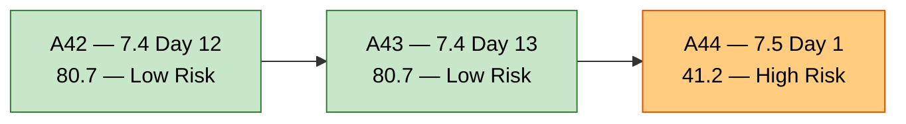
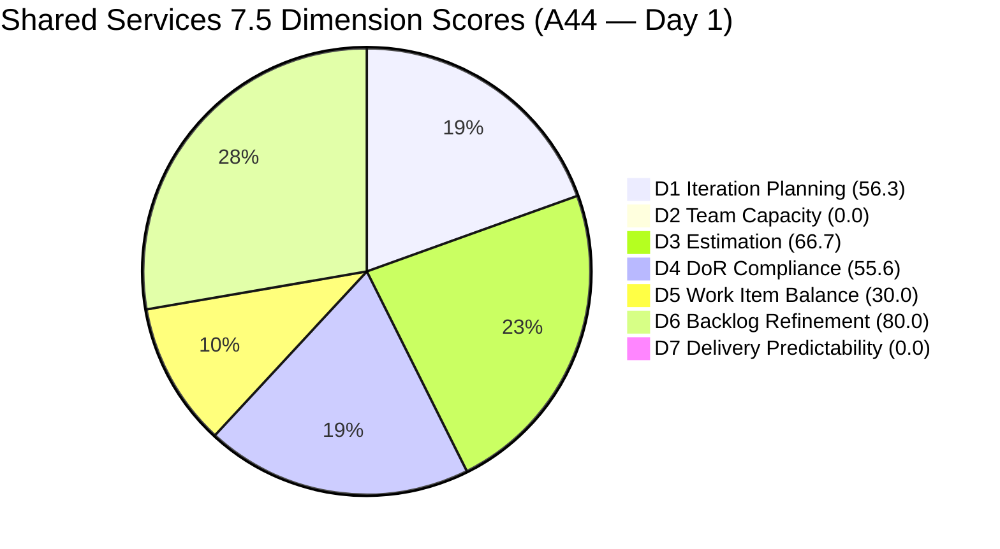
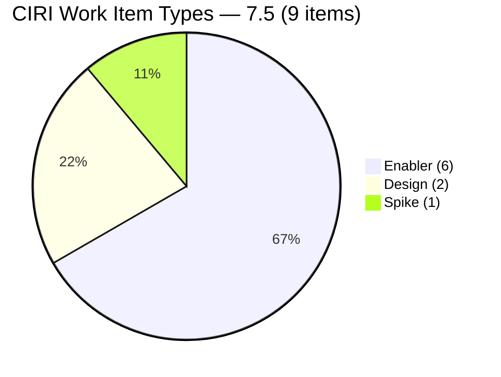
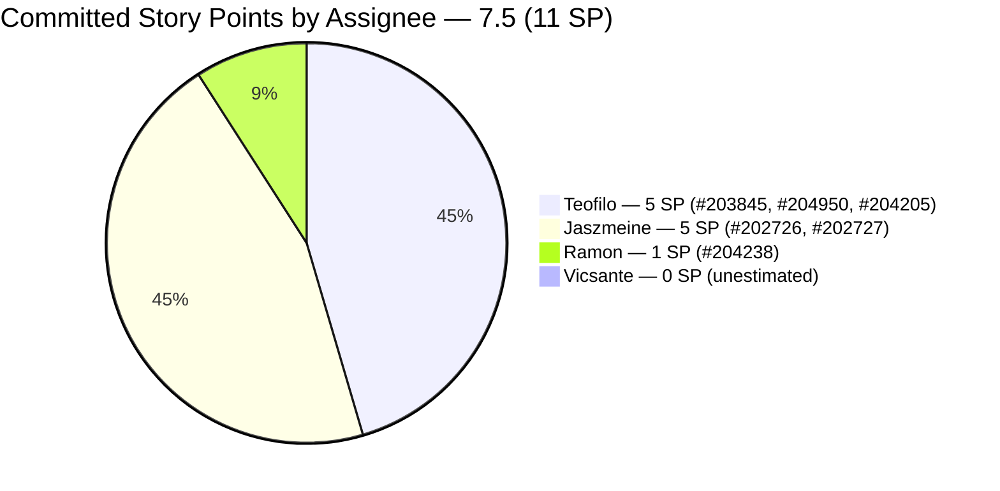
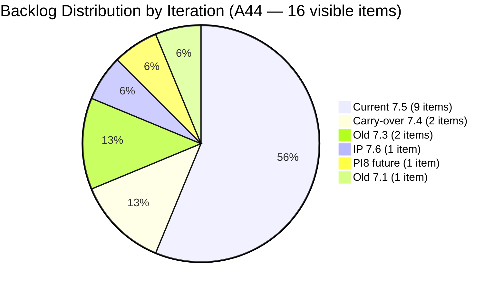
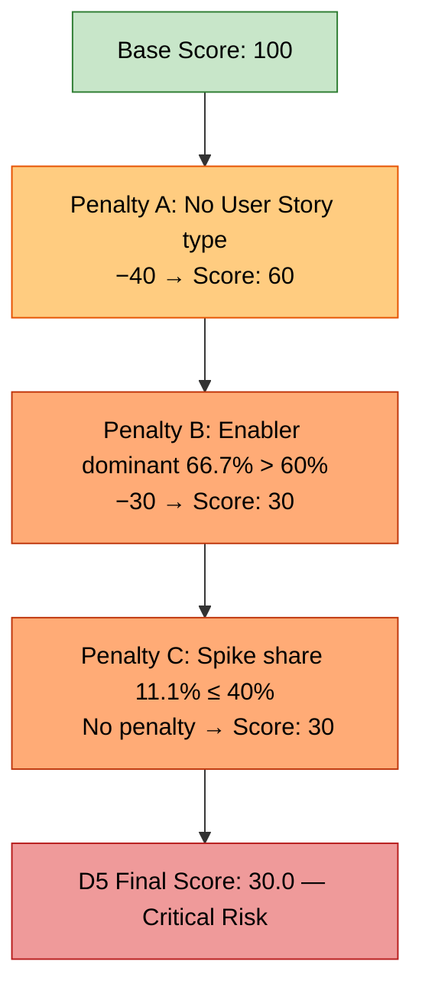

# Shared Services Team — SAFe Iteration Audit A44
**Date:** 2026-06-01 | **Sprint Day:** 1 of 14 — SPRINT ACTIVE | **Iteration:** 7.5 (Jun 1 – Jun 14, 2026)
**Auditor:** Claude Code (ADO SAFe Audit Skill v1) | **Prior Audit:** A43 (2026-05-30 09:00)

---

## 1. Audit Metadata

| Field | Value |
|---|---|
| **Audit ID** | A44 |
| **Report File** | `AUDIT_20260601_0203.md` |
| **Prior Audit** | A43 — `AUDIT_20260530_0900.md` (Overall 80.7, Low Risk — 7.4 Day 13) |
| **ADO Project** | Jairosoft Portfolio (`666bb99a-6acd-4999-bb34-efd0e4ea90dc`) |
| **ADO Team** | Shared Services Team (`bd9578fd-5773-48fc-bd80-988dfe5de806`) |
| **Iteration** | 7.5 (`9c70d575-210a-4156-bbdc-79f1efbe2869`) |
| **Iteration Dates** | Jun 1 – Jun 14, 2026 |
| **Sprint Day** | **1 of 14 — SPRINT ACTIVE (Day 1)** |
| **Audit Date** | 2026-06-01 02:03 UTC-6 |
| **Overall Score** | **41.2 — High Risk** |
| **Risk Band** | High Risk (40–59.9) |
| **Visible Backlog Items (VRBI)** | 16 open root items |
| **Current Iteration Root Items (CIRI)** | 9 items (IterationPath = 7.5) |
| **Capacity Source** | `work_get_team_capacity` — no capacity configured for 7.5 yet (Sprint Day 1) |
| **Project Exceptions Applied** | Board URL path is `/Stories`; backlogLevel="Stories" used in API calls |

---

## 2. Executive Summary

Iteration 7.5 opened today (Sprint Day 1, June 1–14) with a **High Risk** overall score of **41.2** — a sharp decline from the prior iteration's 7.4 close at 80.7 (Low Risk). This drop is expected and structural: sprint start artifacts drive three dimensions to zero or near-zero.

**Structural sprint-start factors (expected, will self-correct):**
- **D2 Team Capacity (0.0):** No capacity has been entered in ADO for 7.5 yet. Contributors are actively working (9 items assigned across 4 people), but ADO shows no configured capacity — this is a Day 1 gap that Carol or Karl must close before the next audit.
- **D7 Delivery Predictability (0.0):** Sprint Day 1 — no items are closed yet. 11 SP committed with 0 closed. Annotated as early-sprint; score will rise as work closes.

**Genuine concerns requiring action:**
- **D5 Work Item Balance (30.0 — Critical):** No User Story items in the sprint (−40 penalty) and Enabler type dominates at 66.7% of CIRI (−30 penalty). The sprint mix is Enabler-heavy with no User Stories — a recurring pattern that needs correction.
- **D4 DoR Compliance (55.6):** 4 of 9 current items lack sufficient Description and/or Acceptance Criteria. Three items carry zero DoR content (#205123, #205211, #204205). These should be corrected within the first 2 sprint days.
- **D1 Iteration Planning (56.3):** 9 of 16 backlog items are in the current sprint — a moderate result. Non-current items include 2 stale 7.4 items that should be resolved.

The team is entering 7.5 with real momentum from 7.4 (47/51 SP closed last sprint) and a reasonably active backlog. Capacity setup and DoR cleanup are the critical Day 1–2 actions.

---

## 3. Previous Audit Delta (A43 → A44)

| Dimension | A43 Score (7.4 Day 13) | A44 Score (7.5 Day 1) | Delta | Driver |
|---|---|---|---|---|
| D1 Iteration Planning | 12.5 | **56.3** | **+43.8** | Sprint reset: 9 of 16 VRBI now assigned to 7.5 vs 2 of 16 in 7.4 |
| D2 Team Capacity | 100.0 | **0.0** | **−100.0** | No capacity configured in ADO for 7.5 — Sprint Day 1 gap |
| D3 Estimation | 100.0 | **66.7** | **−33.3** | 6/9 CIRI items estimated; #205123, #205210, #205211 missing SP |
| D4 DoR Compliance | 100.0 | **55.6** | **−44.4** | 4/9 items fail DoR — #205123, #205211, #204205 have no Desc/AC; #205210 AC too short |
| D5 Work Item Balance | 60.0 | **30.0** | **−30.0** | No User Story (−40) + Enabler dominant at 66.7% (−30); Sprint-start composition |
| D6 Backlog Refinement | 100.0 | **80.0** | **−20.0** | 8/9 CIRI items touched before sprint start (untouched > 30% → −20); all 16 VRBI fresh |
| D7 Delivery Predictability | 92.2 | **0.0** | **−92.2** | Sprint Day 1 — 0/11 SP closed; early-sprint annotation applied |
| **Overall** | **80.7** | **41.2** | **−39.5** | Sprint boundary reset — structural factors drive most of the drop |

**Key transition observations A43 → A44:**
- Iteration 7.5 officially started June 1, 2026. This is the first audit of the new sprint.
- Two 7.4 items remain open in the backlog: #202725 (Messaging & Communication, Design, Jaszmeine, 3 SP) and #203309 (GitHub Token Defect, Ramon, 1 SP) — neither was closed before sprint end. Both are now visible as non-current backlog items.
- #202553 (Vendor Exploration & Search) changed state to "Design Approved" today (Jun 1), suggesting Jaszmeine completed and approved this 7.3 item.
- #205210 (Install Antigravity to Back Office Users) was updated today (Jun 1 03:08 UTC) — the only CIRI item touched after sprint start.
- 9 items are now staged for 7.5 — the team planned ahead and most items were refined in the May 27–29 window.

---

## 4. Current Iteration Snapshot

| Metric | Value |
|---|---|
| **Visible Backlog Items (VRBI)** | 16 |
| **Current Iteration Root Items (CIRI)** | 9 |
| **SP Committed (ECI with SP > 0)** | 11 SP |
| **SP Closed** | 0 SP |
| **Team Size (distinct assignees on CIRI)** | 4 (Ramon, Vicsante, Teofilo, Jaszmeine) |
| **Sprint Day / Total** | 1 / 14 |
| **Overall Score** | 41.2 — High Risk |

### CIRI Items (9 items in Iteration 7.5)

| # | Title | Type | State | SP | Assignee | DoR | ChangedDate |
|---|---|---|---|---|---|---|---|
| #202726 | Booking & Payment Management | Design | Ready for Design | 2 | Jaszmeine | PASS | May 25 |
| #202727 | Contract Management | Design | Estimation | 3 | Jaszmeine | PASS | May 29 |
| #203845 | Monthly Costing — June 2026 | Enabler | Estimation | 2 | Teofilo | PASS | May 29 |
| #204205 | Android Phone from US | Enabler | New | 1 | Teofilo | FAIL | May 29 |
| #204238 | Use FinOps Board — Admin/HR/Finance | Enabler | Ready for Dev | 1 | Ramon | PASS | May 28 |
| #204950 | Monthly Costing — July 2026 | Enabler | Estimation | 2 | Teofilo | PASS | May 29 |
| #205123 | Installing Jodex Plugin in Antigravity | Spike | Active | — | Vicsante | FAIL | May 29 |
| #205210 | Install Antigravity to Back Office Users | Enabler | Active | — | Vicsante | FAIL | Jun 1 |
| #205211 | Create Product Repository for Jodex | Enabler | New | — | Ramon | FAIL | May 29 |

*SP "—" = null (not estimated)*

### Non-CIRI Backlog Items (7 items)

| # | Title | Iter | Type | State | ChangedDate | Notes |
|---|---|---|---|---|---|---|
| #202725 | Messaging & Communication | 7.4 | Design | Ready for Design | May 19 | 7.4 carry-over — unresolved; 13 days stalled |
| #203309 | GitHub Token Defect | 7.4 | Defect | Ready for QA | May 19 | 7.4 carry-over — unresolved; 13 days stalled |
| #202553 | Vendor Exploration & Search | 7.3 | Design | Design Approved | Jun 1 | State changed today — was previously in 7.3 |
| #202724 | Vendor Profile & Details | 7.3 | Design | Design Review | May 19 | 7.3 carry-over — needs iteration path update |
| #202947 | IT Support Services Feedback Survey | 7.6 (IP) | Spike | New | May 19 | IP slot — future |
| #202066 | Provide Installation Guide | PI8 | User Story | Estimation | May 8 | Future PI — low priority |
| #202732 | Add QA Intern to Flawless ADO | 7.1 | Enabler | Ready for UAT | Apr 27 | **35 days stalled — freshness deadline Jun 11** |

---

## 5. Work Item Analysis

### CIRI Type Distribution (9 items)

| Type | Count | Share |
|---|---|---|
| Enabler | 6 | 66.7% |
| Design | 2 | 22.2% |
| Spike | 1 | 11.1% |
| User Story | 0 | 0.0% |
| **Total** | **9** | **100%** |

No User Story items in the sprint. Enabler is the dominant type at 66.7%, exceeding the 60% threshold. This triggers both the −40 (no User Story) and −30 (dominant type > 60%) D5 penalties.

### CIRI State Distribution (9 items)

| State | Count | Items |
|---|---|---|
| New | 2 | #205211 (Ramon), #204205 (Teofilo) |
| Active | 2 | #205123 (Vicsante), #205210 (Vicsante) |
| Estimation | 2 | #202727 (Jaszmeine), #203845 (Teofilo) |
| Ready for Design | 1 | #202726 (Jaszmeine) |
| Ready for Dev | 1 | #204238 (Ramon) |
| — | — | #204950 (Teofilo) — Estimation |

### Assignee Workload Distribution

| Assignee | CIRI Items | SP Committed | SP Closed | Notes |
|---|---|---|---|---|
| Teofilo | 3 | 5 SP (#203845×2, #204950×2, #204205×1) | 0 | Costing + hardware; no capacity configured |
| Jaszmeine | 2 | 5 SP (#202726×2, #202727×3) | 0 | Design backlog carry-forward |
| Ramon | 2 | 1 SP (#204238×1, #205211 unestimated) | 0 | FinOps board + Jodex repo |
| Vicsante | 2 | 0 SP (both unestimated) | 0 | Antigravity installation — needs estimation |

### DoR Assessment — Detailed

| # | Title | Desc Chars (stripped) | AC Chars (stripped) | Pass |
|---|---|---|---|---|
| #202726 | Booking & Payment Management | ~95 chars ✓ | ~900+ chars ✓ | **PASS** |
| #202727 | Contract Management | ~120 chars ✓ | ~800+ chars ✓ | **PASS** |
| #203845 | Monthly Costing — June 2026 | ~155 chars ✓ | ~600+ chars ✓ | **PASS** |
| #204205 | Android Phone from US | 0 chars — null | 0 chars — null | **FAIL** |
| #204238 | Use FinOps Board | ~88 chars ✓ | ~101 chars ✓ | **PASS** |
| #204950 | Monthly Costing — July 2026 | ~155 chars ✓ | ~600+ chars ✓ | **PASS** |
| #205123 | Jodex Plugin in Antigravity | 0 chars — null | 0 chars — null | **FAIL** |
| #205210 | Install Antigravity — Back Office | ~38 chars ✓ | "4 persons" — 9 chars (< 20) | **FAIL** |
| #205211 | Create Product Repository for Jodex | 0 chars — null | 0 chars — null | **FAIL** |

DCI = 5 (PASS: #202726, #202727, #203845, #204238, #204950)
DoR failures: 4 items (#204205, #205123, #205210, #205211)

---

## 6. SAFe Compliance Scorecard

| Dimension | Score | Band | Evidence (N/D) | Notes |
|---|---|---|---|---|
| D1 Iteration Planning | **56.3** | Moderate | 9 / 16 VRBI in 7.5 | Reasonable sprint load; 7 items in other iterations |
| D2 Team Capacity | **0.0** | Critical | 0 / 4 CW with capacity | No ADO capacity configured for 7.5 — Sprint Day 1 gap |
| D3 Estimation | **66.7** | Moderate | 6 / 9 PECI with SP > 0 | #205123, #205210, #205211 unestimated (3 items missing SP) |
| D4 DoR Compliance | **55.6** | High | 5 / 9 CIRI pass Desc+AC | 4 items lack DoR — critical within Days 1–2 |
| D5 Work Item Balance | **30.0** | Critical | Penalties: −40 (no US) + −30 (Enabler 66.7%) | Structural sprint composition issue — no User Stories |
| D6 Backlog Refinement | **80.0** | Low | 16/16 fresh; 0 stale; untouched penalty −20 | 8/9 CIRI items untouched since sprint start (Day 1 normal) |
| D7 Delivery Predictability | **0.0** | Critical | 0 / 11 SP closed | Sprint Day 1 — early-sprint; no delivery expected yet |
| **OVERALL** | **41.2** | **High Risk** | (56.3+0.0+66.7+55.6+30.0+80.0+0.0)/7 | Sprint boundary reset — structural factors dominate |

**Formula verification:** (56.3 + 0.0 + 66.7 + 55.6 + 30.0 + 80.0 + 0.0) / 7 = 288.6 / 7 = **41.2**

---

## 7. Dimension Findings

### D1 — Iteration Planning: 56.3 / 100 — Moderate Risk

**Formula:** CIRI / VRBI × 100 = 9 / 16 × 100 = **56.3**

| Metric | Value |
|---|---|
| Visible backlog items (VRBI) | 16 |
| Current iteration items (CIRI — IterationPath = 7.5) | 9 |
| Score | **56.3** |

The team planned 9 of 16 visible items into 7.5 — a meaningful improvement over the sprint-end nadir of 2/16 (12.5) in 7.4. The remaining 7 non-7.5 items include 2 unresolved 7.4 carry-overs, 2 old 7.3 items, 1 IP slot (7.6), 1 PI8 future item, and 1 stale 7.1 item.

For D1 to reach ≥ 80 (Low Risk), the team would need 13 of 16 items in 7.5 — an aggressive but achievable target if carry-overs are resolved and non-sprint items are archived or moved. A realistic target is to resolve the two 7.4 carry-overs (#202725, #203309) by moving them to 7.5 or archiving them.

---

### D2 — Team Capacity: 0.0 / 100 — Critical Risk

**Formula:** CC / CW × 100 = 0 / 4 × 100 = **0.0**

| Metric | Value |
|---|---|
| Contributors with current work (CW) — distinct non-empty assignees on CIRI | 4 (Ramon, Vicsante, Teofilo, Jaszmeine) |
| Contributors with capacity (CC) — positive daily capacity or activity configured | 0 |
| Score | **0.0** |

No capacity has been entered in ADO for Iteration 7.5. Both `work_get_team_capacity` (Shared Services Team) returned an error ("No team capacity assigned to the team") and `work_get_iteration_capacities` did not include Shared Services Team (bd9578fd) in its response for iteration 9c70d575.

This is a Sprint Day 1 configuration gap — not a sign that the team is idle. All 4 contributors have assigned work items. However, the ADO capacity board must be populated as a mandatory SAFe planning artifact. Carol or Karl should configure capacity for all 4 members (Ramon, Vicsante, Teofilo, Jaszmeine) before the next audit.

**Note:** In 7.4, the Shared Services Team capacity was 15.5h/day aggregate. Member breakdown from A43: Ramon 0.5h, Teofilo 6h, Vicsante 6h, Jaszmeine 3h. These should be re-entered for 7.5 as a baseline.

---

### D3 — Estimation: 66.7 / 100 — Moderate Risk

**Formula:** ECI / PECI × 100 = 6 / 9 × 100 = **66.7**

| Metric | Value |
|---|---|
| Point-eligible current items (PECI — all CIRI types except Task/Bug) | 9 |
| Estimated current items (ECI — PECI with SP > 0) | 6 |
| Missing SP items | #205123 (Spike — null), #205210 (Enabler — null), #205211 (Enabler — null) |
| Score | **66.7** |

Three CIRI items have no Story Points configured. All three are Vicsante's and Ramon's unestimated items:
- **#205123** (Installing Jodex Plugin in Antigravity, Spike, Vicsante) — no SP, no DoR content
- **#205210** (Install Antigravity to Back Office Users, Enabler, Vicsante) — no SP
- **#205211** (Create Product Repository for Jodex, Enabler, Ramon) — no SP

Estimation should be completed at sprint planning (Day 1–2). Target: 9/9 PECI estimated → D3 = 100.0.

---

### D4 — DoR Compliance: 55.6 / 100 — High Risk

**Formula:** DCI / CIRI × 100 = 5 / 9 × 100 = **55.6**

| Metric | Value |
|---|---|
| CIRI count | 9 |
| DoR-compliant items (DCI — Desc ≥ 30 non-WS chars AND AC ≥ 20 non-WS chars) | 5 |
| Failing items | 4 (#204205, #205123, #205210, #205211) |
| Score | **55.6** |

**Failing items detail:**
- **#204205** (Android Phone from US, Teofilo): Both Description and Acceptance Criteria are null (0 chars each). Completely empty.
- **#205123** (Jodex Plugin in Antigravity, Vicsante): Both fields null. No DoR content at all.
- **#205210** (Install Antigravity — Back Office Users, Vicsante): Description passes (~38 chars stripped: "Back Office Users Grace Sam Armelita Kleer"). AC = "4 persons" → 9 stripped chars < 20 threshold → FAIL.
- **#205211** (Create Product Repository for Jodex, Ramon): Both fields null. No DoR content.

These 4 items must have Description (≥ 30 non-whitespace chars) and Acceptance Criteria (≥ 20 non-whitespace chars) populated within the first 2 sprint days. At 5/9, D4 = 55.6 (High Risk). Fixing all 4 → 9/9 = 100.0.

---

### D5 — Work Item Balance: 30.0 / 100 — Critical Risk

**Formula:** Base 100 − penalties applied independently

| Penalty | Trigger | Applied |
|---|---|---|
| −40: No User Story type in CIRI | User Story count = 0 | **YES** |
| −30: Dominant type share > 60% | Enabler = 6/9 = 66.7% > 60% | **YES** |
| −20: Spike share > 40% | Spike = 1/9 = 11.1% < 40% | No |

**Score:** 100 − 40 − 30 = **30.0**

The sprint is composed entirely of Enablers (6), Designs (2), and one Spike (1). Zero User Stories. The Enabler type at 66.7% dominance doubles the penalty. This is a structural composition issue — the backlog and sprint planning should incorporate at least one User Story-typed item for 7.5.

Looking at the non-CIRI backlog: #202066 (Provide Installation Guide, User Story, PI8, Ramon) exists but is assigned to PI8. This item could be moved to 7.5 to address the User Story gap — or a new User Story should be created for the sprint.

---

### D6 — Backlog Refinement: 80.0 / 100 — Low Risk

**Freshness window:** Items with ChangedDate ≥ 2026-04-17 (45 days before 2026-06-01)

**Formula:** base = fresh_VRBI/VRBI × 100 − penalties

| Metric | Value |
|---|---|
| Total VRBI | 16 |
| Fresh items (ChangedDate ≥ Apr 17) | 16 — all items; oldest: #202732 (Apr 27) |
| Stale_90 items (ChangedDate < Mar 3, 2026) | 0 |
| Stale_180 items (ChangedDate < Dec 4, 2025) | 0 |
| Untouched CIRI (ChangedDate < iteration start Jun 1) | 8 of 9 CIRI items |
| Untouched / CIRI | 8/9 = 88.9% → > 30% → −20 penalty |
| Score | 100.0 − 20 = **80.0** |

**Untouched CIRI items (8 of 9 — all pre-dated the Jun 1 sprint start):**
#202726 (May 25), #202727 (May 29), #203845 (May 29), #204205 (May 29), #204238 (May 28), #204950 (May 29), #205123 (May 29), #205211 (May 29).

**Touched today:** #205210 (Jun 1 03:08 UTC) — the only item updated after sprint start.

**Context:** This −20 untouched penalty on Sprint Day 1 is a natural artifact — items were refined in late May and the sprint just began. The penalty will self-correct as items are updated during sprint execution. No stale items exist; all 16 VRBI have been touched within the last 45 days. The base refinement health is strong.

**#202732 freshness warning:** This item (Add QA Intern to Flawless ADO, 7.1, Teofilo, Apr 27) is now 35 days since last change. It will breach the 45-day freshness window on **June 11** if untouched. Teofilo must action before June 11.

---

### D7 — Delivery Predictability: 0.0 / 100 — Critical Risk

**Formula:** CSP > 0 → CLSP/CSP × 100 | CSP = 0 → score = 0

| Metric | Value |
|---|---|
| Point-eligible current items (PECI) | 9 |
| Estimated current items (ECI — SP > 0) | 6 |
| Committed story points (CSP — sum of SP on ECI) | 11 SP |
| Closed story points (CLSP — ECI with State = Closed or Done) | 0 SP |
| Score | 0/11 = **0.0** |

**Early-sprint annotation:** Sprint Day 1 — no delivery is expected on the first day of a sprint. D7 = 0.0 is a structural sprint-start score. This dimension will rise as items close over the 14-day sprint. No action needed on D7 until mid-sprint (Day 5–7).

**CSP breakdown (11 SP committed):**
- Teofilo: #203845 (2 SP) + #204950 (2 SP) + #204205 (1 SP) = 5 SP
- Jaszmeine: #202726 (2 SP) + #202727 (3 SP) = 5 SP
- Ramon: #204238 (1 SP) = 1 SP
- Vicsante: 0 SP (both items unestimated)

Note: If Vicsante estimates #205123 and #205210, the CSP will increase. Closing 3 unestimated items would require SP first.

---

## 8. Risks and Bottlenecks

| # | Severity | Dimension | Risk | Recommended Action |
|---|---|---|---|---|
| R1 | CRITICAL | D2 | No ADO capacity configured for Iteration 7.5. `work_get_team_capacity` returns error; Shared Services Team absent from iteration capacities API. With 4 active contributors and 0 capacity configured, D2 = 0.0. | **Carol/Karl: enter capacity for Ramon, Vicsante, Teofilo, Jaszmeine in ADO capacity board for 7.5 before Jun 2. Use 7.4 baseline: Ramon 0.5h, Teofilo 6h, Vicsante 6h, Jaszmeine 3h.** |
| R2 | CRITICAL | D5 | No User Story items in the sprint (−40 penalty) + Enabler dominance at 66.7% (−30 penalty). D5 = 30.0. This is a structural sprint composition failure, not a late-sprint artifact. | **Identify or create at least one User Story-typed item for 7.5. Evaluate whether #202066 (PI8) can be moved up, or whether a new User Story is appropriate for AI/DevOps enablement work.** |
| R3 | HIGH | D4 | 4 of 9 CIRI items lack DoR-compliant Description and/or Acceptance Criteria (#204205, #205123, #205210, #205211). DoR compliance is 55.6% — below the 80% Low Risk threshold. | **Teofilo: add Desc + AC to #204205. Vicsante: add Desc ≥ 30 chars + AC ≥ 20 chars to #205123 and expand AC on #205210. Ramon: add Desc + AC to #205211. Target: complete by Jun 2.** |
| R4 | HIGH | D3 | 3 CIRI items unestimated: #205123 (Spike), #205210 (Enabler), #205211 (Enabler). D3 = 66.7%. Sprint planning should not have committed items without SP. | **Vicsante + Ramon: estimate #205123, #205210, #205211 before end of Jun 2. Standard Spike sizing: 1–3 SP. This also raises CSP and sets D7 baseline.** |
| R5 | HIGH | D7 | Two 7.4 items remain unresolved in the backlog: #202725 (Messaging & Communication, Design, Jaszmeine, 3 SP, Ready for Design) and #203309 (GitHub Token Defect, Ramon, 1 SP, Ready for QA). Both stalled since May 19 (13 days). These are now non-current backlog items that inflate VRBI without contributing to CIRI. | **Jaszmeine: move #202725 to 7.5 or close if design work is complete. Ramon: close #203309 if token fix is validated. Resolving both reduces stale debt and may improve D1.** |
| R6 | MODERATE | D1 | D1 = 56.3 (Moderate). 7 of 16 VRBI items are not in 7.5. Non-7.5 items include 2 old 7.4 carry-overs, 2 stale 7.3 items, 1 IP, 1 PI8, and 1 old 7.1 item. | **Resolve 7.4 carry-overs (R5 above). Update 7.3 items (#202553, #202724) to appropriate iteration path — #202553 now Design Approved, may be closeable. Archive #202732 if QA Intern access is no longer relevant.** |
| R7 | MODERATE | D6 | #202732 (Add QA Intern to Flawless ADO, 7.1, Teofilo, Ready for UAT, Apr 27) — 35 days since last change. Freshness deadline is June 11 (45-day window). | **Teofilo: confirm QA Intern access to Flawless ADO board and close #202732 before June 11. If intern is no longer joining, archive the item.** |
| R8 | LOW | Backlog | #202553 (Vendor Exploration & Search, Design, Jaszmeine, 7.3) changed to "Design Approved" today (Jun 1). Its IterationPath is still 7.3 (a completed iteration). | **Jaszmeine: close #202553 or update IterationPath to 7.5. "Design Approved" on a 7.3 item suggests the design is complete — this should be formally closed and not left in the open backlog.** |
| R9 | LOW | Backlog | #202724 (Vendor Profile & Details, Design, Jaszmeine, 7.3, Design Review) still on 7.3. | **Update IterationPath from 7.3 to 7.5 or archive. Active items on completed iterations create backlog reporting inconsistencies.** |

---

## 9. Prioritized Recommendations

1. **[CRITICAL — By Jun 2]** Carol/Karl: configure team capacity in ADO for Iteration 7.5. Enter capacity for all 4 active contributors. Use 7.4 baseline as starting point: Ramon 0.5h/day, Teofilo 6h/day, Vicsante 6h/day, Jaszmeine 3h/day. This is a mandatory SAFe sprint planning artifact — D2 will remain 0.0 until capacity is entered, dragging the overall score.

2. **[CRITICAL — By Jun 2]** Vicsante + Ramon: add DoR content to failing items before end of Day 2.
   - **#205123** (Jodex Plugin in Antigravity): write Description (≥ 30 chars explaining the installation task) and Acceptance Criteria (≥ 20 chars with verification criteria).
   - **#205210** (Install Antigravity — Back Office Users): expand AC from "4 persons" to at least 20 non-whitespace chars (e.g., "All 4 back office users — Grace, Sam, Armelita, Kleer — have Antigravity installed and verified").
   - **#205211** (Create Product Repository for Jodex): add Description and AC.
   - **Teofilo:** Add Description and AC to **#204205** (Android Phone from US).

3. **[CRITICAL — By Jun 3]** Vicsante + Ramon: estimate all 3 unestimated CIRI items. #205123 (Spike), #205210 (Enabler), and #205211 (Enabler) must have Story Points before the next audit. Missing SP prevents D3 from reaching 100.0 and under-reports the committed CSP baseline.

4. **[HIGH — By Jun 3]** Jaszmeine: resolve #202725 (Messaging & Communication Design, 3 SP, 7.4, Ready for Design). If design work has been completed in Figma or offline, close the item in ADO now. If the design is genuinely in-progress for 7.5, move IterationPath to 7.5 so it becomes a CIRI item and contributes to the sprint. Leaving it open in 7.4 is an unresolvable limbo.

5. **[HIGH — By Jun 3]** Ramon: close #203309 (GitHub Token Defect, 1 SP, 7.4, Ready for QA) if the token scope fix has been validated. Self-QA is appropriate for this item. Once closed, D7 carry-over concern from 7.4 is resolved.

6. **[HIGH — Sprint Planning]** Introduce at least one User Story-typed item to the 7.5 sprint. The current sprint has zero User Stories — triggering a permanent −40 D5 penalty regardless of delivery velocity. Options: (a) move #202066 (Provide Installation Guide) from PI8 to 7.5 if the scope is achievable, (b) create a new User Story for the Jodex plugin work currently logged as a Spike, or (c) convert #205211 (Create Product Repository for Jodex) to User Story type.

7. **[MODERATE — By Jun 11]** Teofilo: action #202732 (Add QA Intern to Flawless ADO, 7.1, Ready for UAT). Confirm the QA intern's access to the Flawless ADO board and close. Freshness deadline is June 11. If the intern position is no longer active, archive the item.

8. **[MODERATE — This Week]** Jaszmeine: close #202553 (Vendor Exploration & Search) now that it has moved to Design Approved. Update IterationPath from 7.3 to current, then close. Also update #202724 (Vendor Profile & Details) IterationPath from 7.3 to 7.5 or archive.

9. **[STANDING]** Maintain active sprint hygiene: update work item states daily, especially for Vicsante's Antigravity items (#205123, #205210) which are in "Active" state. Daily ADO updates ensure accurate D6 (untouched item penalty reduces as items are touched during the sprint).

---

## 10. Visualizations

### Score Trend (7.4 Sprint → 7.5 Day 1)

*Score drop reflects sprint boundary reset (D2=0, D7=0, D5 structural penalties). Not a delivery failure.*

### D44 Dimension Scorecard

### CIRI Type Distribution

### 7.5 Sprint Capacity — Committed SP by Assignee

### Backlog Distribution — 16 Visible Items

### D5 Risk Decomposition — Work Item Balance

---

## 11. Evidence Gaps and Limitations

| Gap | Impact | Notes |
|---|---|---|
| No ADO capacity configured for 7.5 | D2 forced to 0.0 | Both `work_get_team_capacity` (error: "No team capacity assigned") and `work_get_iteration_capacities` (Shared Services Team absent from response) returned no data. This is a Sprint Day 1 configuration gap, not an indicator of team inactivity. 4 contributors have active assignments. |
| D7 = 0.0 on Sprint Day 1 | Expected — annotated | No items are closed on Day 1 of a 14-day sprint. CSP = 11 SP committed; CLSP = 0. D7 will rise as items deliver. Score annotated as early-sprint — no adjustment to formula. |
| D6 untouched penalty on Day 1 | −20 to D6 | 8/9 CIRI items have ChangedDate before Jun 1 (sprint start). Items were refined in late May — this is expected pipeline staging, not a refinement failure. The penalty will reduce as items are updated during sprint execution. |
| #202725 (7.4 Design, Jaszmeine) still unresolved | Non-CIRI backlog | This item has been in "Ready for Design" since May 19 (13+ days). It did not close at 7.4 end. It is not in CIRI (IterationPath = 7.4). Whether design work occurred offline is unobservable from ADO. |
| #203309 (7.4 Defect, Ramon) still unresolved | Non-CIRI backlog | GitHub token defect open since May 19. IterationPath = 7.4. Whether the fix was applied is not visible in ADO state. |
| Closed 7.4 items departed backlog API | Normal backlog API behavior | All 27+ items that closed in Iteration 7.4 are no longer visible in the backlog API. VRBI = 16 represents only open items. This is expected behavior — no closed items are counted in VRBI or CIRI. |
| PECI scope for Enabler/Design types | D3 methodology | Per rubric, PECI excludes only Task and Bug types. All 9 CIRI items (Enabler, Design, Spike) are treated as point-eligible. This aligns with A43 methodology where Design and Defect were counted as PECI. |
| #202553 state change to "Design Approved" (Jun 1) | Positive signal | This 7.3 item changed state today — a positive signal that Jaszmeine completed design work. However, the item's IterationPath remains 7.3 and it is not counted in CIRI. ADO closure and path update recommended. |

---

## 12. Audit Trail

| Source | Tool Used | Data Retrieved |
|---|---|---|
| Current iteration | `work_list_team_iterations` (project `666bb99a`, team `bd9578fd`, timeframe=current) | Iteration 7.5: Jun 1–14, ID `9c70d575-210a-4156-bbdc-79f1efbe2869` |
| Open backlog items | `wit_list_backlog_work_items` (backlogId `Microsoft.RequirementCategory`) | 16 open root items returned |
| Work item details | `wit_get_work_items_batch_by_ids` (16 items — all VRBI) | SP, State, Type, Desc, AC, ChangedDate, IterationPath for all open backlog items |
| Team capacity (7.5) | `work_get_team_capacity` (project `666bb99a`, team `bd9578fd`, iterationId `9c70d575`) | Error: "No team capacity assigned to the team" |
| Iteration capacities (7.5) | `work_get_iteration_capacities` (project `666bb99a`, iterationId `9c70d575`) | 3 teams returned; Shared Services Team (bd9578fd) not included |
| Prior audit | `AUDIT_20260530_0900.md` (A43) | Overall 80.7, Low Risk, 7.4 Day 13; 2 open items; 51 SP committed, 47 SP closed |
