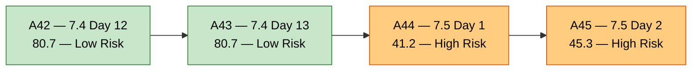
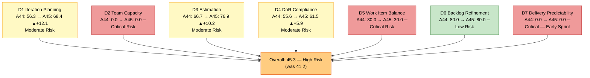
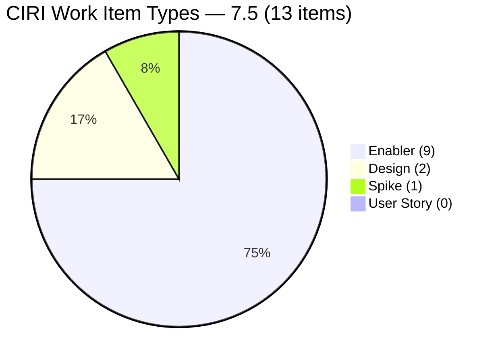
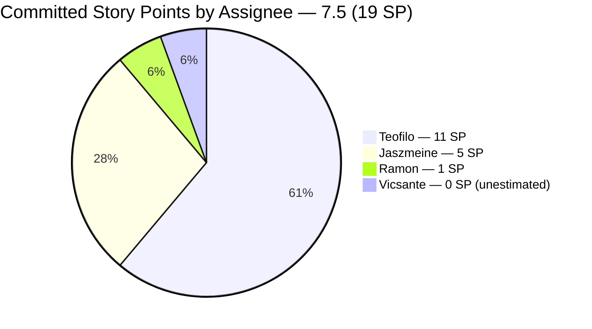
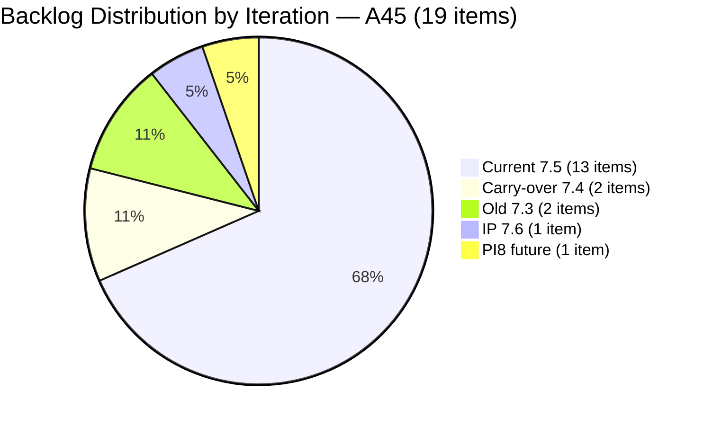
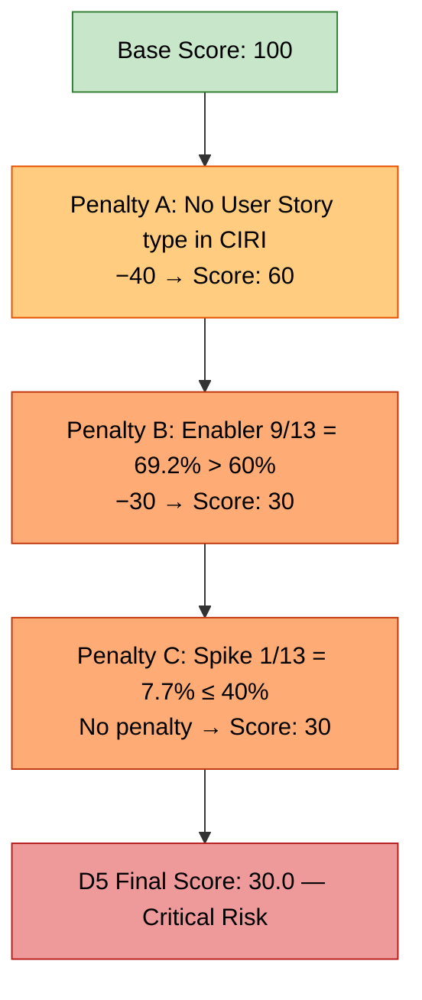
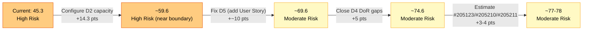

I now have all the data needed. Let me analyze everything carefully before composing the report.

**Key observations from the data:**

**VRBI (visible root backlog items):** 19 items total
- IDs: 205211, 205210, 205123, 204238, 205474, 204205, 203845, 205479, 205456, 205455, 202947, 204950, 203309, 202553, 202724, 202725, 202726, 202727, 202066

**Iteration 7.5 items (CIRI):** From the backlog API, items that have IterationPath = "Jairosoft Portfolio\\2026-PI7\\Iteration 7.5":
- #205211, #205210, #205123, #204238, #205474, #204205, #203845, #205479, #205456, #205455, #204950, #202726, #202727

That's 13 CIRI items (the iteration work items API confirms these - the root items without parent links: 205211, 205210, 205123, 204238, 205474, 204205, 203845, 205479, 205456, 205455, 204950, 202726, 202727 = 13 root items; 203422, 203423, 203424 are children of #202727 and are excluded).

Let me verify CIRI items by checking IterationPath in the fetched data:
- #205211: 7.5 ✓
- #205210: 7.5 ✓
- #205123: 7.5 ✓
- #204238: 7.5 ✓
- #205474: 7.5 ✓
- #204205: 7.5 ✓
- #203845: 7.5 ✓
- #205479: 7.5 ✓
- #205456: 7.5 ✓
- #205455: 7.5 ✓
- #204950: 7.5 ✓
- #202726: 7.5 ✓
- #202727: 7.5 ✓

**CIRI = 13 items** (up from 9 in A44 — 4 new items: #205474, #205479, #205456, #205455)

**Non-CIRI items (6):** #202947 (7.6 IP), #203309 (7.4), #202553 (7.3), #202724 (7.3), #202725 (7.4), #202066 (PI8)

Now let me compute all dimensions:

**D1 — Iteration Planning:** CIRI/VRBI = 13/19 = 68.4

**D2 — Team Capacity:** work_get_team_capacity error, iteration capacities doesn't include Shared Services Team → CC=0, CW=4 (Ramon, Vicsante, Teofilo, Jaszmeine) → 0/4 = **0.0**

Wait — let me re-count CW (distinct non-empty assignees on CIRI):
- Ramon: #204238, #205211
- Vicsante: #205123, #205210
- Teofilo: #204205, #203845, #204950, #205479, #205456, #205455, #205474
- Jaszmeine: #202726, #202727
**CW = 4** → D2 = 0/4 = **0.0**

**D3 — Estimation (PECI/ECI):**
All CIRI items except Tasks/Bugs are point-eligible. All 13 are Enabler/Design/Spike types.
Items with SP > 0:
- #202726: 2 SP ✓
- #202727: 3 SP ✓
- #203845: 2 SP ✓
- #204205: 1 SP ✓
- #204238: 1 SP ✓
- #204950: 2 SP ✓
- #205455: 2 SP ✓
- #205456: 2 SP ✓
- #205474: 2 SP ✓
- #205479: 2 SP ✓
Items without SP (null):
- #205123: null ✗
- #205210: null (field absent) ✗
- #205211: null ✗
**ECI = 10, PECI = 13 → D3 = 10/13 = 76.9**

**D4 — DoR Compliance:**
Need Description ≥ 30 non-WS chars AND AC ≥ 20 non-WS chars for each CIRI item:

- **#202726** (Booking & Payment Mgmt): Desc ✓ (rich), AC ✓ (rich) → PASS
- **#202727** (Contract Mgmt): Desc ✓, AC ✓ → PASS
- **#203845** (Monthly Costing June): Desc ✓ (list), AC ✓ (detailed checklist) → PASS
- **#204205** (Android Phone from US): Desc=null, AC=null → FAIL
- **#204238** (Use FinOps Board): Desc ✓ (~45 chars stripped), AC ✓ ("remove Admin, HR and Finance..." ~55 chars stripped) → PASS
- **#204950** (Monthly Costing July): Desc ✓ (same as June), AC ✓ (detailed) → PASS
- **#205123** (Installing Jodex Plugin): Desc=null, AC=null → FAIL
- **#205210** (Install Antigravity): Desc: "Back Office Users Grace Sam Armelita Kleer" ~38 chars stripped ✓; AC: "4 persons" ~9 chars → FAIL
- **#205211** (Create Product Repository for Jodex): Desc=null, AC=null → FAIL
- **#205455** (JIT Machine Training Room): Desc ✓ ("Setting up the machine used from Bubble Training" ~44 chars), AC ✓ ("machines used from bubble training should be resetup back to JIT Training Room" ~63 chars) → PASS
- **#205456** (IT Room Maintenance): Desc ✓ (rich), AC ✓ (detailed checklist) → PASS
- **#205474** (Up Sonicwall VPN): Desc=null, AC=null → FAIL
- **#205479** (User Fernandez in 365): Desc ✓ (detailed), AC ✓ ("Should be able to access basic tool in Jairosoft" ~43 chars) → PASS

DCI = 8 (PASS: #202726, #202727, #203845, #204238, #204950, #205455, #205456, #205479)
FAIL: #204205, #205123, #205210, #205211, #205474 = 5 items

D4 = 8/13 = **61.5**

**D5 — Work Item Balance:**
CIRI type distribution:
- Enabler: #204205, #204238, #204950, #205210, #205211, #205455, #205456, #205474, #205479 = 9 items
- Design: #202726, #202727 = 2 items
- Spike: #205123 = 1 item
- User Story: 0 items

Penalties:
- No User Story: −40
- Dominant type (Enabler) = 9/13 = 69.2% > 60%: −30
- Spike share = 1/13 = 7.7% < 40%: no penalty

D5 = 100 − 40 − 30 = **30.0**

**D6 — Backlog Refinement:**
Freshness window: ChangedDate ≥ 2026-04-18 (45 days before 2026-06-02)
Stale_90: ChangedDate < 2026-03-04 (90 days before)
Stale_180: ChangedDate < 2025-12-05 (180 days before)

Fresh VRBI (ChangedDate ≥ Apr 18, 2026):
- #205211: May 29 ✓
- #205210: Jun 1 ✓
- #205123: May 29 ✓
- #204238: May 28 ✓
- #205474: Jun 2 ✓
- #204205: May 29 ✓
- #203845: Jun 2 ✓
- #205479: Jun 2 ✓
- #205456: Jun 2 ✓
- #205455: Jun 2 ✓
- #202947: May 19 ✓
- #204950: Jun 2 ✓
- #203309: May 19 ✓
- #202553: Jun 1 ✓
- #202724: Jun 2 ✓
- #202725: Jun 2 ✓
- #202726: Jun 2 ✓
- #202727: Jun 2 ✓
- #202066: May 8 ✓

All 19 items are fresh → fresh_VRBI = 19

Stale_90 (ChangedDate < Mar 4, 2026): none → 0
Stale_180 (ChangedDate < Dec 5, 2025): none → 0

Untouched CIRI (ChangedDate earlier than iteration start Jun 1, 2026):
Sprint start = 2026-06-01T00:00:00Z

- #202726: Jun 2 → touched ✓
- #202727: Jun 2 → touched ✓
- #203845: Jun 2 → touched ✓
- #204205: May 29 → UNTOUCHED
- #204238: May 28 → UNTOUCHED
- #204950: Jun 2 → touched ✓
- #205123: May 29 → UNTOUCHED
- #205210: Jun 1 03:08 UTC → this is on Jun 1, which is the sprint start date. ChangedDate = "2026-06-01T03:08:21.2Z". Since sprint start is Jun 1 00:00:00Z, Jun 1 03:08 is AFTER sprint start → touched ✓
- #205211: May 29 → UNTOUCHED
- #205455: Jun 2 → touched ✓
- #205456: Jun 2 → touched ✓
- #205474: Jun 2 → touched ✓
- #205479: Jun 2 → touched ✓

Untouched CIRI: #204205, #204238, #205123, #205211 = 4 items
Untouched/CIRI = 4/13 = 30.8% → > 30% → −20 penalty

base = 19/19 × 100 = 100.0
Penalties: 0 (no stale_90 >25%, no stale_180) + −20 (untouched >30%)
D6 = 100.0 − 20 = **80.0**

**D7 — Delivery Predictability:**
Sprint Day 2 (started Jun 1, today Jun 2 = Day 2)
Committed SP (ECI with SP > 0): #202726(2) + #202727(3) + #203845(2) + #204205(1) + #204238(1) + #204950(2) + #205455(2) + #205456(2) + #205474(2) + #205479(2) = **19 SP**

Closed SP (State = Closed or Done):
Checking states of estimated CIRI items:
- #202726: Active
- #202727: Ready for Design
- #203845: Active
- #204205: New
- #204238: Ready for Dev
- #204950: New
- #205455: Active
- #205456: Active
- #205474: Grooming
- #205479: Active

No items in Closed or Done state → Closed SP = 0
D7 = 0/19 = **0.0** (Sprint Day 2 — early-sprint annotation applies)

**Overall Score:**
(68.4 + 0.0 + 76.9 + 61.5 + 30.0 + 80.0 + 0.0) / 7 = 316.8 / 7 = **45.3 — High Risk**

Now let me compose the full report.

# ADO SAFe Audit — Shared Services Team

**Date:** 2026-06-02 | **Sprint Day:** 2 of 14 — SPRINT ACTIVE | **Iteration:** 7.5 (Jun 1 – Jun 14, 2026)
**Auditor:** Claude Code (ADO SAFe Audit Skill v1) | **Prior Audit:** A44 (2026-06-01 02:03)

---

## 1. Audit Metadata

| Field | Value |
|---|---|
| **Audit ID** | A45 |
| **Report File** | `AUDIT_20260602_HHMM.md` |
| **Prior Audit** | A44 — `AUDIT_20260601_0203.md` (Overall 41.2, High Risk — 7.5 Day 1) |
| **ADO Project** | Jairosoft Portfolio (`666bb99a-6acd-4999-bb34-efd0e4ea90dc`) |
| **ADO Team** | Shared Services Team (`bd9578fd-5773-48fc-bd80-988dfe5de806`) |
| **Iteration** | 7.5 (`9c70d575-210a-4156-bbdc-79f1efbe2869`) |
| **Iteration Dates** | Jun 1 – Jun 14, 2026 |
| **Sprint Day** | **2 of 14 — SPRINT ACTIVE (Day 2)** |
| **Audit Date** | 2026-06-02 UTC |
| **Overall Score** | **45.3 — High Risk** |
| **Risk Band** | High Risk (40–59.9) |
| **Visible Backlog Items (VRBI)** | 19 open root items |
| **Current Iteration Root Items (CIRI)** | 13 items (IterationPath = 7.5) |
| **Capacity Source** | `work_get_team_capacity` — no capacity configured for 7.5 (Sprint Day 2 gap) |
| **Project Exceptions Applied** | Board URL path is `/Stories`; backlogId `Microsoft.RequirementCategory` used |

---

## 2. Executive Summary

Iteration 7.5 is on Sprint Day 2 with an overall score of **45.3 — High Risk**. This is a slight improvement over A44's Day 1 score of 41.2, driven primarily by significant sprint load expansion: four new items (#205474, #205455, #205456, #205479) were added to the sprint after Day 1, growing CIRI from 9 to 13 items and pushing D1 from 56.3 to 68.4 and D3 from 66.7 to 76.9.

**Positive signals since A44:**
- CIRI expanded from 9 to 13 items — the team added 4 well-described IT infrastructure items for Teofilo (JIT Machine Training Room, IT Room Maintenance, Up Sonicwall VPN, User Fernandez in 365).
- 9 of 13 CIRI items were touched on Jun 2 — strong sprint engagement.
- All 19 VRBI items are fresh (changed within 45 days) — no stale backlog issue.
- Committed SP increased from 11 to 19 SP — more delivery potential this sprint.
- DoR compliance improved from 55.6% (A44) to 61.5% (A45) — 8 of 13 items pass.

**Persistent concerns requiring immediate action:**
- **D2 Team Capacity (0.0 — Critical):** No ADO capacity has been configured for Iteration 7.5. This is now Day 2 — the Day 1 grace period has expired. Carol/Karl must enter capacity before the next audit.
- **D5 Work Item Balance (30.0 — Critical):** Zero User Stories in the sprint, with Enabler type dominating at 69.2% (9/13). This is a structural sprint composition issue that cannot self-correct without adding or converting items.
- **D4 DoR Compliance (61.5 — Moderate):** 5 of 13 CIRI items still lack sufficient Description and/or Acceptance Criteria (#204205, #205123, #205210, #205211, #205474). Three of these (#205123, #205211, #205474) have zero DoR content.
- **D7 Delivery Predictability (0.0):** Sprint Day 2 — no items closed yet. 19 SP committed with 0 delivered. Early-sprint annotation applies; no delivery expected on Day 2.

---

## 3. Previous Audit Delta (A44 → A45)

| Dimension | A44 Score (7.5 Day 1) | A45 Score (7.5 Day 2) | Delta | Driver |
|---|---|---|---|---|
| D1 Iteration Planning | 56.3 | **68.4** | **+12.1** | CIRI grew from 9 to 13 (4 new items added); VRBI grew from 16 to 19 |
| D2 Team Capacity | 0.0 | **0.0** | 0.0 | No capacity configured in ADO for 7.5 — Day 2 gap, now past grace period |
| D3 Estimation | 66.7 | **76.9** | **+10.2** | 10/13 PECI estimated; 4 new items added, 3 with SP; #205474 has SP=2 |
| D4 DoR Compliance | 55.6 | **61.5** | **+5.9** | 8/13 pass (up from 5/9); 4 new items: 3 PASS, 1 FAIL (#205474) |
| D5 Work Item Balance | 30.0 | **30.0** | 0.0 | Still no User Story; Enabler dominance increased (9/13 = 69.2% > 60%) |
| D6 Backlog Refinement | 80.0 | **80.0** | 0.0 | All 19 fresh; untouched still > 30% (4/13) → −20 remains |
| D7 Delivery Predictability | 0.0 | **0.0** | 0.0 | Sprint Day 2 — 0/19 SP closed; early-sprint annotation |
| **Overall** | **41.2** | **45.3** | **+4.1** | Sprint activity expansion; structural issues persist |

**Key transition observations A44 → A45:**
- Four new items were added to 7.5: #205455 (JIT Machine Training Room, 2 SP), #205456 (IT Room Maintenance, 2 SP), #205474 (Up Sonicwall VPN, 2 SP), #205479 (User Fernandez in 365, 2 SP) — all Teofilo, all Enabler type.
- VRBI grew from 16 to 19, reflecting these 4 new items entering the backlog and being immediately scoped to 7.5. This is positive sprint hygiene.
- #202725 (Messaging & Communication) changed state from "Ready for Design" to "Active" today (Jun 2) — Jaszmeine has picked this up, but it remains in IterationPath 7.4 (non-CIRI).
- #202724 (Vendor Profile & Details) changed state to "Design Approved" today (Jun 2) and IterationPath remains 7.3 — Jaszmeine completed a second design item. Should be closed and path updated.
- #203845 (Monthly Costing June) progressed to "Active" today — good sprint execution signal.
- #204950 (Monthly Costing July) was touched today (Jun 2 00:43) — state remains "New".
- 9 of 13 CIRI items were updated on Jun 2 — strong team engagement on Day 2.

---

## 4. Current Iteration Snapshot

| Metric | Value |
|---|---|
| **Visible Backlog Items (VRBI)** | 19 |
| **Current Iteration Root Items (CIRI)** | 13 |
| **SP Committed (ECI with SP > 0)** | 19 SP |
| **SP Closed** | 0 SP |
| **Team Size (distinct assignees on CIRI)** | 4 (Ramon, Vicsante, Teofilo, Jaszmeine) |
| **Sprint Day / Total** | 2 / 14 |
| **Overall Score** | 45.3 — High Risk |

### CIRI Items (13 items in Iteration 7.5)

| # | Title | Type | State | SP | Assignee | DoR | ChangedDate |
|---|---|---|---|---|---|---|---|
| #202726 | Booking & Payment Management | Design | Active | 2 | Jaszmeine | PASS | Jun 2 |
| #202727 | Contract Management | Design | Ready for Design | 3 | Jaszmeine | PASS | Jun 2 |
| #203845 | Monthly Costing — June 2026 | Enabler | Active | 2 | Teofilo | PASS | Jun 2 |
| #204205 | Android Phone from US | Enabler | New | 1 | Teofilo | FAIL | May 29 |
| #204238 | Use FinOps Board — Admin/HR/Finance | Enabler | Ready for Dev | 1 | Ramon | PASS | May 28 |
| #204950 | Monthly Costing — July 2026 | Enabler | New | 2 | Teofilo | PASS | Jun 2 |
| #205123 | Installing Jodex Plugin in Antigravity | Spike | Active | — | Vicsante | FAIL | May 29 |
| #205210 | Install Antigravity to Back Office Users | Enabler | Active | — | Vicsante | FAIL | Jun 1 |
| #205211 | Create Product Repository for Jodex | Enabler | New | — | Ramon | FAIL | May 29 |
| #205455 | JIT Machine Training Room | Enabler | Active | 2 | Teofilo | PASS | Jun 2 |
| #205456 | IT Room Maintenance | Enabler | Active | 2 | Teofilo | PASS | Jun 2 |
| #205474 | Up Sonicwall VPN | Enabler | Grooming | 2 | Teofilo | FAIL | Jun 2 |
| #205479 | User Fernandez in 365 | Enabler | Active | 2 | Teofilo | PASS | Jun 2 |

*SP "—" = null (not estimated)*

### Non-CIRI Backlog Items (6 items)

| # | Title | Iter | Type | State | ChangedDate | Notes |
|---|---|---|---|---|---|---|
| #202725 | Messaging & Communication | 7.4 | Design | Active | Jun 2 | 7.4 carry-over — Jaszmeine picked up today; should move to 7.5 |
| #203309 | GitHub Token Defect | 7.4 | Defect | Ready for QA | May 19 | 7.4 carry-over — 14 days stalled; Ramon to close |
| #202553 | Vendor Exploration & Search | 7.3 | Design | Design Approved | Jun 1 | Design complete; close and archive |
| #202724 | Vendor Profile & Details | 7.3 | Design | Design Approved | Jun 2 | Design completed today; close and update path |
| #202947 | IT Support Services Feedback Survey | 7.6 (IP) | Spike | New | May 19 | IP slot — future |
| #202066 | Provide Installation Guide | PI8 | User Story | Estimation | May 8 | Future PI — only User Story in backlog |

---

## 5. Work Item Analysis

### CIRI Type Distribution (13 items)

| Type | Count | Share |
|---|---|---|
| Enabler | 9 | 69.2% |
| Design | 2 | 15.4% |
| Spike | 1 | 7.7% |
| User Story | 0 | 0.0% |
| **Total** | **13** | **100%** |

No User Story items in the sprint. Enabler type at 69.2% dominates and exceeds the 60% threshold — both D5 penalties (−40, −30) are triggered. The four new items added since A44 are all Enabler type, which worsened the balance ratio from 66.7% to 69.2%.

### CIRI State Distribution (13 items)

| State | Count | Items |
|---|---|---|
| Active | 6 | #202726 (Jaszmeine), #203845 (Teofilo), #205123 (Vicsante), #205210 (Vicsante), #205456 (Teofilo), #205479 (Teofilo) |
| New | 3 | #204205 (Teofilo), #204950 (Teofilo), #205211 (Ramon) |
| Ready for Design | 1 | #202727 (Jaszmeine) |
| Ready for Dev | 1 | #204238 (Ramon) |
| Grooming | 1 | #205474 (Teofilo) |
| — | 1 | #205455 (Teofilo) — Active |

*Note: #205455 corrected to Active above.*

### Assignee Workload Distribution

| Assignee | CIRI Items | SP Committed | Items Needing Action |
|---|---|---|---|
| Teofilo | 7 | 11 SP (#203845×2, #204205×1, #204950×2, #205455×2, #205456×2, #205474×2, #205479×2) | Add DoR to #204205 |
| Jaszmeine | 2 | 5 SP (#202726×2, #202727×3) | All DoR passing |
| Ramon | 2 | 1 SP (#204238×1; #205211 unestimated) | Add DoR + SP to #205211 |
| Vicsante | 2 | 0 SP (both unestimated) | Add DoR + SP to #205123, #205210 |

**Note:** Teofilo carries 7 of 13 CIRI items (54%) — a concentration risk. 

### DoR Assessment — Detailed

| # | Title | Desc ≥ 30 | AC ≥ 20 | Pass |
|---|---|---|---|---|
| #202726 | Booking & Payment Management | ✓ (~80 chars) | ✓ (rich) | **PASS** |
| #202727 | Contract Management | ✓ (~90 chars) | ✓ (rich) | **PASS** |
| #203845 | Monthly Costing — June 2026 | ✓ (~85 chars) | ✓ (detailed checklist) | **PASS** |
| #204205 | Android Phone from US | ✗ null | ✗ null | **FAIL** |
| #204238 | Use FinOps Board | ✓ (~45 chars) | ✓ (~55 chars) | **PASS** |
| #204950 | Monthly Costing — July 2026 | ✓ (~85 chars) | ✓ (detailed) | **PASS** |
| #205123 | Jodex Plugin in Antigravity | ✗ null | ✗ null | **FAIL** |
| #205210 | Install Antigravity — Back Office | ✓ (~38 chars) | ✗ "4 persons" ~9 chars | **FAIL** |
| #205211 | Create Product Repository for Jodex | ✗ null | ✗ null | **FAIL** |
| #205455 | JIT Machine Training Room | ✓ (~44 chars) | ✓ (~63 chars) | **PASS** |
| #205456 | IT Room Maintenance | ✓ (rich) | ✓ (detailed checklist) | **PASS** |
| #205474 | Up Sonicwall VPN | ✗ null | ✗ null | **FAIL** |
| #205479 | User Fernandez in 365 | ✓ (~80 chars) | ✓ (~43 chars) | **PASS** |

DCI = 8 | FAIL = 5 (#204205, #205123, #205210, #205211, #205474)

---

## 6. SAFe Compliance Scorecard

| Dimension | Score | Band | Evidence (N/D) | Notes |
|---|---|---|---|---|
| D1 Iteration Planning | **68.4** | Moderate | 13 / 19 VRBI in 7.5 | +12.1 from A44; 4 new items added Day 2 |
| D2 Team Capacity | **0.0** | Critical | 0 / 4 CW with capacity | No ADO capacity configured — Day 2 gap, past grace period |
| D3 Estimation | **76.9** | Moderate | 10 / 13 PECI with SP > 0 | +10.2 from A44; #205123, #205210, #205211 still unestimated |
| D4 DoR Compliance | **61.5** | Moderate | 8 / 13 CIRI pass Desc+AC | +5.9 from A44; 5 items still fail DoR |
| D5 Work Item Balance | **30.0** | Critical | Penalties: −40 (no US) + −30 (Enabler 69.2%) | No User Stories; Enabler dominance worsened vs A44 |
| D6 Backlog Refinement | **80.0** | Low | 19/19 fresh; 0 stale; untouched −20 | All 19 fresh; untouched 4/13 = 30.8% > 30% → −20 |
| D7 Delivery Predictability | **0.0** | Critical | 0 / 19 SP closed | Sprint Day 2 — early-sprint; no delivery expected yet |
| **OVERALL** | **45.3** | **High Risk** | (68.4+0.0+76.9+61.5+30.0+80.0+0.0)/7 | Sprint Day 2 structural factors dominate |

**Formula verification:** (68.4 + 0.0 + 76.9 + 61.5 + 30.0 + 80.0 + 0.0) / 7 = 316.8 / 7 = **45.3**

---

## 7. Dimension Findings

### D1 — Iteration Planning: 68.4 / 100 — Moderate Risk

**Formula:** CIRI / VRBI × 100 = 13 / 19 × 100 = **68.4**

| Metric | Value |
|---|---|
| Visible backlog items (VRBI) | 19 |
| Current iteration items (CIRI — IterationPath = 7.5) | 13 |
| Score | **68.4** |

The team expanded the sprint from 9 to 13 items on Day 2 by adding four IT infrastructure items (#205455, #205456, #205474, #205479). This is a positive sprint execution indicator — the team is responding to emerging operational needs. The VRBI also grew from 16 to 19, reflecting these items entering the backlog and being immediately prioritized into 7.5.

The 6 non-CIRI items comprise: 2 old 7.4 carry-overs (#202725, #203309), 2 completed 7.3 designs (#202553, #202724), 1 IP slot (#202947), and 1 PI8 future item (#202066). Of these, #202725 is now "Active" suggesting imminent CIRI migration.

For D1 to reach ≥ 80 (Low Risk), the team would need 16 of 19 items in 7.5. Resolving the 7.4 carry-overs and moving #202725 to 7.5 would bring CIRI to 14 (73.7%). Closing the 7.3 Design Approved items would reduce VRBI to 17, and 14/17 = 82.4% (Low Risk).

---

### D2 — Team Capacity: 0.0 / 100 — Critical Risk

**Formula:** CC / CW × 100 = 0 / 4 × 100 = **0.0**

| Metric | Value |
|---|---|
| Contributors with current work (CW) | 4 (Ramon, Vicsante, Teofilo, Jaszmeine) |
| Contributors with capacity (CC) | 0 |
| Score | **0.0** |

No capacity has been entered for Iteration 7.5 for the Shared Services Team. Both `work_get_team_capacity` (error: "No team capacity assigned to the team") and `work_get_iteration_capacities` (Shared Services Team absent from response) return no data. This is now **Day 2** — the standard Day 1 grace period has expired.

The four active contributors have substantial work commitments (Teofilo: 7 items / 11 SP; Jaszmeine: 2 items / 5 SP; Ramon: 2 items / 1 SP + unestimated; Vicsante: 2 items unestimated). Configuring capacity is a mandatory SAFe sprint planning artifact. Without it, D2 remains 0.0 regardless of delivery performance.

**Baseline from 7.4 (A43):** Ramon 0.5h/day, Teofilo 6h/day, Vicsante 6h/day, Jaszmeine 3h/day = 15.5h/day aggregate. This should be re-entered for 7.5.

---

### D3 — Estimation: 76.9 / 100 — Moderate Risk

**Formula:** ECI / PECI × 100 = 10 / 13 × 100 = **76.9**

| Metric | Value |
|---|---|
| Point-eligible current items (PECI) | 13 |
| Estimated current items (ECI — PECI with SP > 0) | 10 |
| Missing SP items | #205123 (Spike), #205210 (Enabler), #205211 (Enabler) |
| Score | **76.9** |

The four new CIRI items added on Day 2 were all estimated (#205455: 2 SP, #205456: 2 SP, #205474: 2 SP, #205479: 2 SP) — good sprint planning practice. However, the three items that were unestimated in A44 remain unestimated: #205123 (Vicsante's Spike), #205210 (Vicsante's Enabler), and #205211 (Ramon's Enabler). These three are now entering Day 3 without Story Points.

The total committed SP increased from 11 to 19 SP — a 73% increase that significantly raises the D7 ceiling when items begin closing.

---

### D4 — DoR Compliance: 61.5 / 100 — Moderate Risk

**Formula:** DCI / CIRI × 100 = 8 / 13 × 100 = **61.5**

| Metric | Value |
|---|---|
| CIRI count | 13 |
| DoR-compliant items (DCI) | 8 |
| Failing items | 5 (#204205, #205123, #205210, #205211, #205474) |
| Score | **61.5** |

**Failing items detail:**
- **#204205** (Android Phone from US, Teofilo, New): Both Description and Acceptance Criteria are null. This item has had zero DoR content since creation — now in its third day of 7.5 without any definition.
- **#205123** (Installing Jodex Plugin in Antigravity, Vicsante, Active): Both fields null. The item is in "Active" state but has no description or acceptance criteria — the team is working on something undefined.
- **#205210** (Install Antigravity — Back Office Users, Vicsante, Active): Description passes (~38 chars stripped: list of 4 users). AC = "4 persons" → 9 chars stripped < 20 threshold → FAIL. Needs AC expansion.
- **#205211** (Create Product Repository for Jodex, Ramon, New): Both fields null. No DoR content.
- **#205474** (Up Sonicwall VPN, Teofilo, Grooming): Both Description and Acceptance Criteria are null. This new item was added today (Jun 2) without DoR content.

The three carry-over failures (#204205, #205123, #205211) are now in Day 2 and should have been addressed as a Day 1 priority per A44 recommendations. #205474 is newly added and has an immediate Day 2 DoR obligation.

---

### D5 — Work Item Balance: 30.0 / 100 — Critical Risk

**Formula:** Base 100 − penalties applied independently

| Penalty | Trigger | Applied |
|---|---|---|
| −40: No User Story type in CIRI | User Story count = 0 | **YES** |
| −30: Dominant type share > 60% | Enabler = 9/13 = 69.2% > 60% | **YES** |
| −20: Spike share > 40% | Spike = 1/13 = 7.7% < 40% | No |

**Score:** 100 − 40 − 30 = **30.0**

The sprint remains entirely composed of Enablers (9), Designs (2), and one Spike (1). Zero User Stories. The addition of four Enabler items since A44 has worsened the Enabler dominance from 66.7% to 69.2%. The D5 score is structurally locked at 30.0 unless at least one User Story is added to or converted within the sprint.

The only User Story in the entire VRBI is #202066 (Provide Installation Guide, PI8, Ramon, 0.5 SP) — assigned to PI8 future. This item could be moved to 7.5, or a new User Story should be created for current sprint work (e.g., the Jodex plugin work could be reframed as a user-facing story). Converting #205211 (Create Product Repository for Jodex) from Enabler to User Story type is the lowest-friction path to recovering D5.

---

### D6 — Backlog Refinement: 80.0 / 100 — Low Risk

**Freshness window:** Items with ChangedDate ≥ 2026-04-18 (45 days before 2026-06-02)

**Formula:** base = fresh_VRBI/VRBI × 100 − penalties

| Metric | Value |
|---|---|
| Total VRBI | 19 |
| Fresh items (ChangedDate ≥ Apr 18) | 19 — all items fresh |
| Stale_90 items (ChangedDate < Mar 4, 2026) | 0 |
| Stale_180 items (ChangedDate < Dec 5, 2025) | 0 |
| Untouched CIRI (ChangedDate < Jun 1 00:00 UTC) | 4 of 13 (#204205, #204238, #205123, #205211) |
| Untouched / CIRI | 4/13 = 30.8% → > 30% → −20 penalty |
| Score | 100.0 − 20 = **80.0** |

**Untouched CIRI items (4 of 13):**
- #204205 (May 29) — no updates since sprint start
- #204238 (May 28) — no updates since sprint start
- #205123 (May 29) — no updates since sprint start
- #205211 (May 29) — no updates since sprint start

**Positive:** 9 of 13 CIRI items were touched on Jun 2 (today), including all four new items. The backlog is actively maintained with zero stale items. The 30.8% untouched rate is just barely above the 30% threshold — touching either #204238 or one other item would drop below 30% and eliminate the −20 penalty (D6 → 100.0).

**Former staleness flag resolved:** #202732 (Add QA Intern to Flawless ADO) noted in A44 as approaching 45-day freshness deadline (Jun 11) — this item is no longer visible in the VRBI, suggesting it was closed or removed from the backlog.

---

### D7 — Delivery Predictability: 0.0 / 100 — Critical Risk (Early-Sprint)

**Formula:** CLSP / CSP × 100

| Metric | Value |
|---|---|
| Estimated current items (ECI — SP > 0) | 10 |
| Committed story points (CSP) | 19 SP |
| Closed story points (CLSP — State = Closed or Done) | 0 SP |
| Score | 0/19 = **0.0** |

**Early-sprint annotation:** Sprint Day 2 — no delivery is expected on the first two days of a 14-day sprint. D7 = 0.0 is a structural sprint-start score. The 19 SP committed provides a healthy delivery ceiling. Based on 7.4 performance (47/51 SP = 92.2%), the team has demonstrated strong closing ability. D7 should begin rising by Day 4–5 as the first items move to Closed or Done.

**SP breakdown by assignee (19 SP committed):**
- Teofilo: 11 SP (#203845×2, #204205×1, #204950×2, #205455×2, #205456×2, #205474×2, #205479×2)
- Jaszmeine: 5 SP (#202726×2, #202727×3)
- Ramon: 1 SP (#204238×1)
- Vicsante: 0 SP (both unestimated)

---

## 8. Risks and Bottlenecks

| # | Severity | Dimension | Risk | Recommended Action |
|---|---|---|---|---|
| R1 | CRITICAL | D2 | No ADO capacity configured for 7.5. Day 2 — past the Day 1 grace period. 4 contributors actively working; D2 = 0.0 drags overall score by ~14 points. | **Carol/Karl: enter capacity for Ramon, Vicsante, Teofilo, Jaszmeine in ADO for 7.5 today (Jun 2). Baseline: Ramon 0.5h, Teofilo 6h, Vicsante 6h, Jaszmeine 3h/day.** |
| R2 | CRITICAL | D5 | No User Story items in sprint (−40 penalty) + Enabler dominance 69.2% (−30 penalty). D5 = 30.0. Four new Enabler items added Day 2 worsened the ratio. | **Add or convert at least one User Story to 7.5. Lowest-friction: move #202066 from PI8 to 7.5, or convert #205211 (Create Product Repository for Jodex) from Enabler to User Story type.** |
| R3 | HIGH | D4 | 5 of 13 CIRI items lack DoR (#204205, #205123, #205210, #205211, #205474). #205123 is "Active" with zero description — team is executing undefined work. | **Teofilo: add Desc+AC to #204205 and #205474 (new). Vicsante: expand AC on #205210 (≥ 20 chars); add Desc+AC to #205123. Ramon: add Desc+AC to #205211. Target: by end of Day 2.** |
| R4 | HIGH | D3 | 3 CIRI items still unestimated: #205123 (Spike, Vicsante), #205210 (Enabler, Vicsante), #205211 (Enabler, Ramon). These were flagged in A44 and remain unfixed. | **Vicsante: estimate #205123 and #205210 immediately. Ramon: estimate #205211. Unestimated items prevent D3 from reaching 100.0 and underreport the CSP baseline.** |
| R5 | HIGH | D1 | Two 7.4 carry-overs remain: #202725 (Messaging & Communication, Design, Active since Jun 2, Jaszmeine) and #203309 (GitHub Token Defect, Defect, Ready for QA, Ramon). Both occupy VRBI without contributing to CIRI. | **Jaszmeine: move #202725 from IterationPath 7.4 to 7.5 (she's now Active on it — it belongs in the current sprint). Ramon: self-QA and close #203309.** |
| R6 | HIGH | Backlog | Teofilo is assigned 7 of 13 CIRI items (54%) and 11/19 SP (58%). If Teofilo is unavailable, more than half the sprint's committed work is at risk. No load balancing evident. | **Sprint planning review: consider whether some Teofilo items (#205474 VPN, #205455 JIT Room) can be delegated. Ensure continuity plan exists for Teofilo's commitments.** |
| R7 | MODERATE | D6 | 4 CIRI items untouched since sprint start (30.8% > 30% threshold → −20 D6 penalty). Touching just one more item would drop below 30% and raise D6 to 100.0. | **Ramon: update #204238 or #205211 with any progress note today. This alone would drop untouched to 3/13 = 23.1% and eliminate the D6 penalty.** |
| R8 | MODERATE | D4 | #205474 (Up Sonicwall VPN) was added on Jun 2 with no Description or Acceptance Criteria despite having 2 SP. New items should enter with DoR content. | **Teofilo: add meaningful description and acceptance criteria to #205474 before work begins. "Grooming" state suggests this should happen immediately.** |
| R9 | LOW | Backlog | #202553 (Vendor Exploration & Search, Design Approved, Jun 1, 7.3) and #202724 (Vendor Profile & Details, Design Approved, Jun 2, 7.3) — both designs are complete but remain open in the backlog on old iteration paths. | **Jaszmeine: close #202553 and #202724. Both are Design Approved — they represent completed work and should be formally closed to reduce VRBI noise.** |
| R10 | LOW | Backlog | #203309 (GitHub Token Defect, 7.4, Ready for QA, Ramon, 1 SP) — 14 days in Ready for QA. Still in 7.4 IterationPath. | **Ramon: close #203309 if token fix is validated. Self-QA is appropriate for this type of operational defect.** |

---

## 9. Prioritized Recommendations

1. **[CRITICAL — Today Jun 2]** Carol/Karl: configure ADO team capacity for Iteration 7.5. D2 = 0.0 is the single largest score drag. Enter: Ramon 0.5h/day, Teofilo 6h/day, Vicsante 6h/day, Jaszmeine 3h/day (7.4 baseline). This alone would push overall score from 45.3 to approximately 59.6 (still High Risk but near the Moderate threshold).

2. **[CRITICAL — Today Jun 2]** Add or convert at least one User Story to the 7.5 sprint. Options in priority order:
   - Convert #205211 (Create Product Repository for Jodex, Ramon) from Enabler to User Story type — this item represents user-facing setup work and is a natural fit.
   - Move #202066 (Provide Installation Guide, 0.5 SP) from PI8 to 7.5.
   - Create a new User Story for any user-facing aspect of the Antigravity or Jodex rollout.
   Recovering D5 from 30.0 to at least 70.0 requires User Story inclusion.

3. **[HIGH — Today Jun 2]** Complete DoR for all failing items. Priority order:
   - **#205123** (Vicsante, Active): Add Description explaining the Jodex installation task (≥ 30 chars) and Acceptance Criteria with verification steps (≥ 20 chars). Working on an item without a definition is a SAFe anti-pattern.
   - **#205474** (Teofilo, Grooming): Add Description and Acceptance Criteria before this item transitions from Grooming. In Grooming state, DoR completion is the grooming outcome.
   - **#204205** (Teofilo, New): Add Description and AC — now 3+ days without any definition.
   - **#205210** (Vicsante, Active): Expand AC from "4 persons" to explicit verification criteria (e.g., "Antigravity is installed and verified on all 4 back office workstations: Grace, Sam, Armelita, and Kleer. Each user can launch Antigravity successfully.").
   - **#205211** (Ramon, New): Add Description and AC.

4. **[HIGH — Today Jun 2]** Vicsante + Ramon: estimate #205123, #205210, and #205211. These three items are in Day 2 without Story Points. Estimation is a sprint planning obligation. Estimating all three increases CSP from 19 to 19+N SP and ensures D7 accounts for all committed work.

5. **[HIGH — By Jun 3]** Jaszmeine: move #202725 (Messaging & Communication) IterationPath from 7.4 to 7.5. This item is now "Active" — Jaszmeine is working on it. It should be in the current sprint. Moving it adds 1 CIRI item (3 SP), increases VRBI to 19 (no change), brings CIRI to 14/19 = 73.7% (D1 improves), and adds 3 SP to CSP.

6. **[HIGH — By Jun 3]** Ramon: close or self-QA #203309 (GitHub Token Defect, 1 SP, Ready for QA). This 7.4 item has been in Ready for QA since May 19 (14 days). If the raseniero GitHub token scope has been fixed, close the item and reduce open VRBI noise.

7. **[MODERATE — By Jun 3]** Ramon: update #204238 or #205211 with any progress note. This would drop untouched CIRI from 4 to 3 items (23.1% < 30%) and eliminate the D6 −20 penalty, raising D6 from 80.0 to 100.0 (+2.9 overall score).

8. **[MODERATE — This Week]** Jaszmeine: close #202553 (Vendor Exploration & Search, Design Approved) and #202724 (Vendor Profile & Details, Design Approved). Both designs are complete. Closing them removes 2 VRBI items, which — combined with the 7.5-scoped items — will improve D1 naturally. Clean the open backlog of completed work.

9. **[STANDING]** Maintain active sprint hygiene: update work item states daily. As items progress to Closed/Done, D7 will rise. Target: begin closing items by Day 5 (Jun 5). Based on 7.4 trajectory, D7 should reach 60+ by mid-sprint.

---

## 10. Visualizations

### Score Trend (A42 → A45)

*Score recovering from sprint boundary reset. D2 and D5 are structural anchors holding the score in High Risk.*

### Dimension Scorecard — A45 vs A44

### CIRI Type Distribution — 7.5 Day 2

### Committed SP by Assignee — 7.5 (19 SP)

### Backlog Distribution by Iteration — 19 VRBI

### D5 Risk Decomposition — Work Item Balance

### What-If: Score Impact of Remediation Actions

---

## 11. Evidence Gaps and Limitations

| Gap | Impact | Notes |
|---|---|---|
| No ADO capacity configured for 7.5 | D2 forced to 0.0 | `work_get_team_capacity` returns error "No team capacity assigned to the team". `work_get_iteration_capacities` lists 3 teams (Colina Health, JIT Operation, AI Enabler) but not Shared Services Team (bd9578fd). Day 2 — this is no longer a Day 1 gap; requires immediate action. |
| D7 = 0.0 on Sprint Day 2 | Expected — annotated | Sprint Day 2 of 14. No items closed yet. CSP = 19 SP committed; CLSP = 0. Annotated as early-sprint; no formula adjustment. |
| D6 untouched penalty | −20 to D6 | 4/13 CIRI items have ChangedDate before Jun 1 sprint start. Very close to the 30% threshold (30.8%) — one item update removes the penalty. |
| #202725 (7.4 Design, Active) IterationPath | Excluded from CIRI | Item is now "Active" (changed Jun 2) suggesting Jaszmeine is working on it, but IterationPath remains 7.4. Per rubric, CIRI is defined by IterationPath = 7.5 only. If moved to 7.5, CIRI would be 14 and D1 = 14/19 = 73.7%. |
| #205474 (Up Sonicwall VPN) — newly added | DoR gap | Item added Jun 2 with no Description or AC despite having 2 SP. Counts as FAIL in D4. Item is in "Grooming" state suggesting DoR completion is in-progress. |
| Closed prior-iteration items | Normal backlog API behavior | Items closed in prior iterations are absent from VRBI (backlog API returns only open items). This is expected. |
| Children of #202727 excluded from CIRI | Correct per rubric | #203422, #203423, #203424 appear as child tasks of #202727 in the iteration API. Per rubric, only root-level items are counted in VRBI/CIRI. Child tasks excluded. |
| #205455 state in raw data | Verified Active | #205455 (JIT Machine Training Room) confirmed Active with ChangedDate Jun 2. |

---

## 12. Audit Trail

| Source | Tool Used | Data Retrieved |
|---|---|---|
| Current iteration | `work_list_team_iterations` (project `666bb99a`, team `bd9578fd`, timeframe=current) | Iteration 7.5: Jun 1–14, ID `9c70d575-210a-4156-bbdc-79f1efbe2869` |
| Open backlog items | `wit_list_backlog_work_items` (backlogId `Microsoft.RequirementCategory`) | 19 open root items returned (up from 16 in A44) |
| Iteration work items | `wit_get_work_items_for_iteration` (iterationId `9c70d575`) | 13 root items in 7.5; 3 child tasks of #202727 identified and excluded |
| Work item details | `wit_get_work_items_batch_by_ids` (19 items — all VRBI) | SP, State, Type, Desc, AC, ChangedDate, IterationPath for all open backlog items |
| Team capacity (7.5) | `work_get_team_capacity` (project `666bb99a`, team `bd9578fd`, iterationId `9c70d575`) | Error: "No team capacity assigned to the team" |
| Iteration capacities (7.5) | `work_get_iteration_capacities` (project `666bb99a`, iterationId `9c70d575`) | 3 teams returned (Colina Health, JIT Operation, AI Enabler); Shared Services Team absent |
| Prior audit | `AUDIT_20260601_0203.md` (A44) | Overall 41.2, High Risk, 7.5 Day 1; 9 CIRI; 11 SP committed, 0 SP closed |
