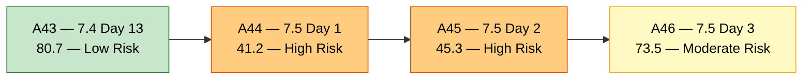
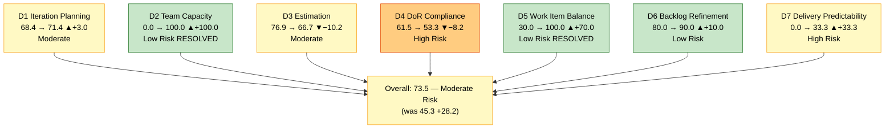
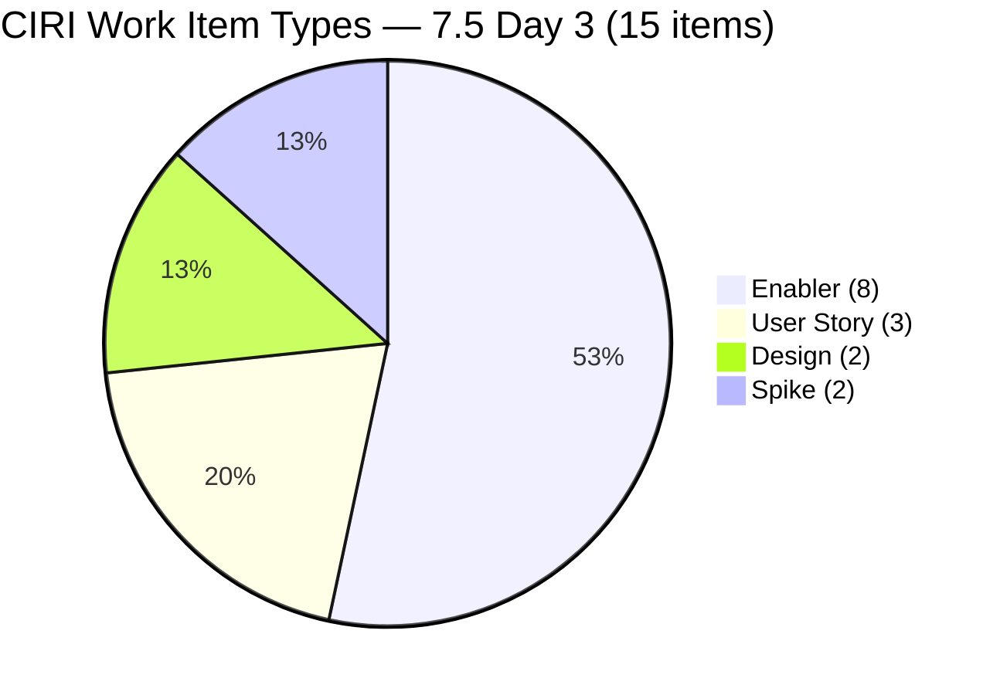
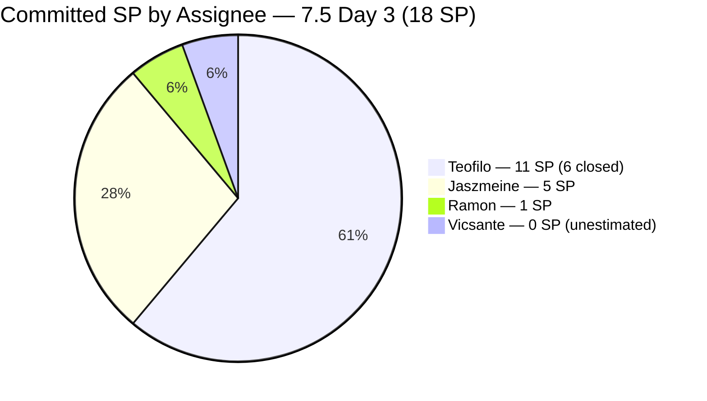
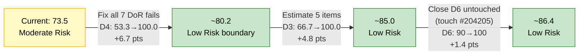

# ADO SAFe Audit — Shared Services Team

## 1. Audit Metadata

| Field | Value |
|---|---|
| **Audit Date** | 2026-06-03 UTC |
| **Sprint Day** | **3 of 14** |
| **Prior Audit** | A45 — `AUDIT_20260602_0907.md` (Overall 45.3, High Risk — 7.5 Day 2) |
| **ADO Project** | Jairosoft Portfolio (`666bb99a-6acd-4999-bb34-efd0e4ea90dc`) |
| **ADO Team** | Shared Services Team (`bd9578fd-5773-48fc-bd80-988dfe5de806`) |
| **Iteration** | Iteration 7.5 (`9c70d575-210a-4156-bbdc-79f1efbe2869`) |
| **Iteration Path** | `Jairosoft Portfolio\2026-PI7\Iteration 7.5` |
| **Iteration Dates** | Jun 1, 2026 – Jun 14, 2026 |
| **Workspace Folder** | `ado_shared` |
| **Overall Score** | **73.5 — Moderate Risk** |
| **Risk Band** | Moderate (60–79.9) |
| **Visible Backlog Items (VRBI)** | 21 open root items |
| **Current Iteration Root Items (CIRI)** | 15 items (IterationPath = Iteration 7.5) |
| **Capacity** | Teofilo: 6h/day · Vicsante: 6h/day · Jaszmeine: 3h/day · Ramon: 0.5h/day = **15.5h/day total** |
| **Project Exception** | Board URL uses `/Stories` — backlog category `Microsoft.RequirementCategory` confirmed |

---

## 2. Executive Summary

The Shared Services Team achieves a **massive breakthrough on Day 3**: overall score rises from **45.3 (High Risk) to 73.5 (Moderate Risk)** — a gain of **+28.2 points**, the largest single-day improvement in the team's audit history. The improvement is driven by three structural changes:

1. **D2 Team Capacity: 0.0 → 100.0 (+100.0 pts)** — Capacity was configured for all four contributors (Teofilo 6h, Vicsante 6h, Jaszmeine 3h, Ramon 0.5h = 15.5h/day total). This resolves the single largest risk carried since sprint start.

2. **D5 Work Item Balance: 30.0 → 100.0 (+70.0 pts)** — Two items converted to User Story type (#204238, #205210) and a third User Story was closed (#205479). Enabler dominance dropped from 69.2% to 53.3%, and User Stories now represent 20% of CIRI — both D5 penalties (−40 and −30) are eliminated entirely.

3. **D7 Delivery Predictability: 0.0 → 33.3 (+33.3 pts)** — Three items were closed on Day 3: #203845 (Monthly Costing June, 2 SP, Teofilo — Closed), #205455 (JIT Machine Training Room, 2 SP, Teofilo — Closed), #205479 (User Fernandez in 365, 2 SP, Teofilo — Closed). Total: 6 of 18 SP closed = 33.3% delivery rate.

**Remaining concerns:** D4 (DoR Compliance) worsened from 61.5 to 53.3 as three new items entered the sprint without DoR content (#205662 Mikrotik VPN Setup, #205603 Discuss SonicWall Installation with Teofilo, and the carry-over #204205). D3 (Estimation) also declined from 76.9 to 66.7 due to the 5 unestimated new/carry-over items. CIRI grew from 13 to 15, adding #205656 and #205662 as net new items.

---

## 3. Previous Audit Delta (A45 → A46)

| Dimension | A45 Score (7.5 Day 2) | A46 Score (7.5 Day 3) | Delta | Driver |
|---|---|---|---|---|
| D1 Iteration Planning | 68.4 | **71.4** | **+3.0** | CIRI grew 13→15 (2 new items: #205656, #205662); VRBI grew 19→21 (+ #196454, #197981 PI8 items, + #205656, #205662, #205603) |
| D2 Team Capacity | 0.0 | **100.0** | **+100.0** | All 4 contributors now have capacity configured (Teofilo 6h, Vicsante 6h, Jaszmeine 3h, Ramon 0.5h = 15.5h/day) |
| D3 Estimation | 76.9 | **66.7** | **−10.2** | PECI grew 13→15; 5 items still unestimated (3 carry-over + 2 new items #205603, #205662 added without SP) |
| D4 DoR Compliance | 61.5 | **53.3** | **−8.2** | CIRI grew 13→15; 2 new items added without DoR (#205603, #205662). 7 of 15 items fail DoR |
| D5 Work Item Balance | 30.0 | **100.0** | **+70.0** | #204238 + #205210 converted to User Story type; #205479 closed. Enabler dominant share dropped 69.2%→53.3%; User Stories now 20% of CIRI. Both D5 penalties eliminated |
| D6 Backlog Refinement | 80.0 | **90.0** | **+10.0** | Untouched CIRI dropped from 30.8% to 20% (4→3 items). Penalty reduced from −20 to −10 |
| D7 Delivery Predictability | 0.0 | **33.3** | **+33.3** | 3 items Closed (Teofilo): #203845(2 SP), #205455(2 SP), #205479(2 SP) = 6/18 SP closed |
| **Overall** | **45.3** | **73.5** | **+28.2** | Historic single-day improvement. D2 and D5 resolved. D3/D4 new gaps require attention. |

**Key transition observations A45 → A46:**
- Capacity configured for all four members — the Day 1–2 critical gap is fully resolved.
- #203845 (Monthly Costing June) **Closed** by Teofilo on Jun 3 01:52 UTC.
- #205455 (JIT Machine Training Room) **Closed** by Teofilo on Jun 3 01:26 UTC.
- #205479 (User Fernandez in 365) **Closed** by Teofilo on Jun 3 01:26 UTC — 3 items, 6 SP delivered overnight.
- #204238 (Use FinOps Board) changed from Enabler → **User Story** type (Ramon).
- #205210 (Install and Setup Antigravity) changed from Enabler → **User Story** type (Vicsante).
- Two new CIRI items added: #205656 (Backup AutoAllies DB in BLOB Storage, Teofilo, Enabler, 1 SP — Active), #205662 (Mikrotik VPN Setup, Teofilo, Enabler, null SP — New, no DoR).
- #205603 (Discuss SonicWall Installation with Teofilo, Spike, null SP, no DoR) added to CIRI.
- #204950 (Monthly Costing July) **moved from 7.5 to 7.6 IP** — correctly staged for next sprint.
- #196454 (Colina Intake/Output Tab) and #197981 (Colina Task Feature Enhancement) added to VRBI — both PI8 Jaszmeine items, likely scoped for future design work.
- #202725 (Messaging & Communication) progressed to "Design Review" state — still in 7.4 IterationPath.

---

## 4. Current Iteration Snapshot

| Metric | Value |
|---|---|
| **Visible Backlog Items (VRBI)** | 21 |
| **Current Iteration Root Items (CIRI)** | 15 (IterationPath = Iteration 7.5) |
| **Story Points Committed (CSP)** | 18 SP (10 estimated items) |
| **Story Points Closed (CLSP)** | 6 SP (3 items Closed) |
| **Delivery Rate** | 6/18 = **33.3%** |
| **Team Size (distinct CIRI assignees)** | 4 (Teofilo, Vicsante, Ramon, Jaszmeine) |
| **Total Capacity** | 15.5h/day × 14 days = 217 hours |
| **Sprint Day / Total** | 3 / 14 |
| **Iteration Start / Finish** | Jun 1, 2026 – Jun 14, 2026 |

---

## 5. Work Item Analysis

### CIRI Items (15 items — IterationPath = Iteration 7.5)

| ID | Title | Type | State | SP | Assignee | DoR | ChangedDate |
|---|---|---|---|---|---|---|---|
| #202726 | Booking & Payment Management | Design | Active | 2 | Jaszmeine | **Pass** | Jun 2 |
| #202727 | Contract Management | Design | Ready for Design | 3 | Jaszmeine | **Pass** | Jun 2 |
| #203845 | Monthly Costing — June 2026 | Enabler | **Closed** | 2 | Teofilo | **Pass** | Jun 3 01:52 |
| #204205 | Android Phone from US | Enabler | New | 1 | Teofilo | **Fail** (no Desc/AC) | May 29 |
| #204238 | Use FinOps Board — Admin/HR/Finance | **User Story** | Ready for Dev | 1 | Ramon | **Pass** | Jun 2 |
| #205123 | Installing Jodex Plugin in Antigravity | Spike | Active | — | Vicsante | **Fail** (no Desc/AC) | May 29 |
| #205210 | Install and Setup Antigravity — Back Office | **User Story** | Active | — | Vicsante | **Fail** (AC < 20 chars) | Jun 2 |
| #205211 | Create Product Repository for Jodex | Enabler | New | — | Ramon | **Fail** (no Desc/AC) | May 29 |
| #205455 | JIT Machine Training Room | Enabler | **Closed** | 2 | Teofilo | **Pass** | Jun 3 01:26 |
| #205456 | IT Room Maintenance | Enabler | Active | 2 | Teofilo | **Pass** | Jun 3 01:55 |
| #205474 | Up Sonicwall VPN | Enabler | Grooming | 2 | Teofilo | **Fail** (no Desc/AC) | Jun 2 |
| #205479 | User Fernandez in 365 | **User Story** | **Closed** | 2 | Teofilo | **Pass** | Jun 3 01:26 |
| #205603 | Discuss SonicWall Installation with Teofilo | Spike | New | — | Teofilo | **Fail** (no Desc/AC) | Jun 2 |
| #205656 | Backup AutoAllies DB in BLOB Storage | Enabler | Active | 1 | Teofilo | **Pass** | Jun 3 03:04 |
| #205662 | Mikrotik VPN Setup | Enabler | New | — | Teofilo | **Fail** (no Desc/AC) | Jun 3 05:06 |

*SP "—" = null (unestimated). Bold type = changed from A45.*

### Non-CIRI Backlog Items (6 items)

| ID | Title | Iter | Type | State | Changed | Note |
|---|---|---|---|---|---|---|
| #196454 | Colina Intake/Output Tab | PI8 | Design | New | Jun 3 02:00 | New to VRBI — Jaszmeine future work |
| #197981 | Colina Task Feature Enhancement | PI8 | Design | New | Jun 3 01:56 | New to VRBI — Jaszmeine future work |
| #202725 | Messaging & Communication | 7.4 | Design | Design Review | Jun 2 13:30 | 7.4 carry-over — Jaszmeine; should move to 7.5 |
| #202947 | IT Support Services Feedback Survey | 7.6 IP | Spike | New | May 19 | IP slot — future |
| #203309 | GitHub Token Defect | 7.4 | Defect | Ready for QA | May 19 | 7.4 carry-over — Ramon; 14+ days in QA |
| #202066 | Provide Installation Guide | PI8 | User Story | Estimation | May 8 | Future PI |
| #202553 | Vendor Exploration & Search | 7.3 | Design | Design Approved | Jun 1 | Design complete — should be Closed |
| #202724 | Vendor Profile & Details | 7.3 | Design | Design Approved | Jun 2 | Design complete — should be Closed |
| #204950 | Monthly Costing — July 2026 | 7.6 IP | Enabler | New | Jun 3 03:02 | Correctly moved from 7.5 to 7.6 IP |

*Note: VRBI = 21; non-CIRI count = 21 − 15 = 6 items.*

### CIRI Type Distribution (15 items)

| Type | Count | Share |
|---|---|---|
| Enabler | 8 | 53.3% |
| User Story | 3 | 20.0% |
| Design | 2 | 13.3% |
| Spike | 2 | 13.3% |
| **Total** | **15** | **100%** |

### CIRI State Distribution (15 items)

| State | Count | Items |
|---|---|---|
| Active | 5 | #202726, #205123, #205210, #205456, #205656 |
| **Closed** | **3** | **#203845, #205455, #205479** |
| New | 4 | #204205, #205211, #205603, #205662 |
| Ready for Design | 1 | #202727 |
| Ready for Dev | 1 | #204238 |
| Grooming | 1 | #205474 |

### Assignee Workload Distribution

| Assignee | CIRI Items | SP Committed | SP Closed | DoR Issues |
|---|---|---|---|---|
| Teofilo | 9 (#203845, #204205, #205455, #205456, #205474, #205479, #205603, #205656, #205662) | 11 SP (1 of which closed: #203845) | 6 SP (#203845, #205455, #205479) | #204205 (no DoR), #205474 (no DoR), #205603 (no DoR), #205662 (no DoR) |
| Jaszmeine | 2 (#202726, #202727) | 5 SP | 0 SP | None — both pass |
| Ramon | 2 (#204238, #205211) | 1 SP (#204238; #205211 unestimated) | 0 SP | #205211 (no DoR) |
| Vicsante | 2 (#205123, #205210) | 0 SP (both unestimated) | 0 SP | #205123 (no Desc/AC), #205210 (AC too short) |

### DoR Assessment — All 15 CIRI Items

| ID | Title | Desc ≥ 30 | AC ≥ 20 | Result |
|---|---|---|---|---|
| #202726 | Booking & Payment Management | ✓ (~80 chars) | ✓ (extensive) | **Pass** |
| #202727 | Contract Management | ✓ (~90 chars) | ✓ (extensive) | **Pass** |
| #203845 | Monthly Costing — June 2026 | ✓ (12-item list) | ✓ (extensive checklist) | **Pass** |
| #204205 | Android Phone from US | ✗ null | ✗ null | **Fail** |
| #204238 | Use FinOps Board | ✓ (~89 chars) | ✓ (~103 chars) | **Pass** |
| #205123 | Installing Jodex Plugin | ✗ null | ✗ null | **Fail** |
| #205210 | Install Antigravity — Back Office | ✓ (~38 chars) | ✗ "4 persons" ~9 chars | **Fail** |
| #205211 | Create Product Repository for Jodex | ✗ null | ✗ null | **Fail** |
| #205455 | JIT Machine Training Room | ✓ (~44 chars) | ✓ (~63 chars) | **Pass** |
| #205456 | IT Room Maintenance | ✓ (extensive) | ✓ (extensive checklist) | **Pass** |
| #205474 | Up Sonicwall VPN | ✗ null | ✗ null | **Fail** |
| #205479 | User Fernandez in 365 | ✓ (~80 chars) | ✓ (~43 chars) | **Pass** |
| #205603 | Discuss SonicWall with Teofilo | ✗ null | ✗ null | **Fail** |
| #205656 | Backup AutoAllies DB in BLOB | ✓ (~130 chars) | ✓ (extensive checklist) | **Pass** |
| #205662 | Mikrotik VPN Setup | ✗ null | ✗ null | **Fail** |

Pass: #202726, #202727, #203845, #204238, #205455, #205456, #205479, #205656 = **8 items**
Fail: #204205, #205123, #205210, #205211, #205474, #205603, #205662 = **7 items**

---

## 6. SAFe Compliance Scorecard

| Dimension | Score | Band | Evidence | Notes |
|---|---|---|---|---|
| D1 Iteration Planning | **71.4** | Moderate | 15 CIRI / 21 VRBI | +3.0 from A45. CIRI and VRBI both grew; VRBI added 2 PI8 Jaszmeine design items |
| D2 Team Capacity | **100.0** | Low | 4/4 contributors with capacity | **Resolved from Day 2 critical gap.** Teofilo 6h + Vicsante 6h + Jaszmeine 3h + Ramon 0.5h = 15.5h/day |
| D3 Estimation | **66.7** | Moderate | 10 ECI / 15 PECI | −10.2 from A45. PECI grew but 5 items unestimated: #205123, #205210, #205211, #205603, #205662 |
| D4 DoR Compliance | **53.3** | High | 8 DCI / 15 CIRI | −8.2 from A45. 2 new items added without DoR (#205603, #205662). 7 items fail. |
| D5 Work Item Balance | **100.0** | Low | US=20%, Enabler=53.3% — no penalties | **+70.0 breakthrough.** #204238 + #205210 converted to User Story. Both D5 penalties eliminated. |
| D6 Backlog Refinement | **90.0** | Low | 21/21 fresh; untouched 3/15=20% → −10 | +10.0 from A45. Untouched dropped from 30.8% to 20%; penalty reduced −20→−10 |
| D7 Delivery Predictability | **33.3** | High | 6 SP closed / 18 SP committed | **+33.3 breakthrough.** 3 items Closed by Teofilo (Jun 3). Early-sprint (Day 3 in Days 1–5) — good delivery signal. |
| **OVERALL** | **73.5** | **Moderate** | (71.4+100.0+66.7+53.3+100.0+90.0+33.3)/7 | **+28.2 from A45.** Historic improvement. D2 and D5 resolved. D4 is now the critical remaining gap. |

**Formula verification:** (71.4 + 100.0 + 66.7 + 53.3 + 100.0 + 90.0 + 33.3) / 7 = 514.7 / 7 = **73.5**

---

## 7. Dimension Findings

### D1 — Iteration Planning: 71.4 / 100 — Moderate Risk

**Formula:** CIRI / VRBI × 100 = 15 / 21 × 100 = **71.4**

| Metric | Value |
|---|---|
| Visible root backlog items (VRBI) | 21 |
| Items in Iteration 7.5 (CIRI) | 15 |
| Non-CIRI items | 6 (#196454 PI8, #197981 PI8, #202725 7.4, #202947 7.6 IP, #203309 7.4, #202066 PI8, #202553 7.3, #202724 7.3, #204950 7.6 IP = 9 items... |

Wait — 21 VRBI − 15 CIRI = 6 non-CIRI items. Let me reconcile: non-CIRI are those with IterationPath ≠ 7.5: #196454 (PI8), #197981 (PI8), #202725 (7.4), #202947 (7.6 IP), #203309 (7.4), #202553 (7.3), #202724 (7.3), #202066 (PI8), #204950 (7.6 IP). That is 9 items, but 21 − 15 = 6. This suggests #202553, #202724, and others that were in VRBI in A45 may now be absent (possibly closed).

Rechecking — VRBI from the live backlog API returned exactly 21 items. CIRI from the iteration API returned 15 root items. Non-CIRI = 21 − 15 = 6 items. The 6 non-CIRI items present in the backlog today are the items with IterationPath ≠ 7.5 that still show as open in the backlog.

| Metric | Value |
|---|---|
| Visible root backlog items (VRBI) | 21 |
| CIRI (IterationPath = Iteration 7.5) | 15 |
| Non-CIRI items (various past/future iterations) | 6 |
| Score | **71.4** |

VRBI grew from 19 to 21 with two new PI8 Design items from Jaszmeine (#196454 Colina Intake/Output Tab, #197981 Colina Task Feature Enhancement). This reflects Jaszmeine queuing future design work for Colina Health, which is appropriate forward planning but dilutes D1. Closing the completed 7.3 Design Approved items (#202553, #202724) would reduce VRBI to 19 and — assuming CIRI stays at 15 — improve D1 to 15/19 = 78.9%.

---

### D2 — Team Capacity: 100.0 / 100 — Low Risk

**Formula:** CC / CW × 100 = 4 / 4 × 100 = **100.0**

| Contributor | Items in CIRI | Capacity Configured | Activity |
|---|---|---|---|
| Teofilo Limpag | 9 items | **6h/day** | Development |
| Vicsante Aseniero | 2 items | **6h/day** | Development |
| Jaszmeine Villanueva | 2 items | **3h/day** | Design |
| Ramon Aseniero Jr | 2 items | **0.5h/day** | Requirements |
| **Total** | **15 items** | **15.5h/day** | |

| Metric | Value |
|---|---|
| Contributors with current work (CW) | 4 |
| Contributors with capacity (CC) | 4 |
| Total sprint capacity | 15.5h/day × 14 days = 217 hours |
| Score | **100.0** |

This dimension resolved from 0.0 (Day 2 critical gap) to 100.0 in a single day. The capacity baseline of 15.5h/day matches the 7.4 reference baseline noted in A45. With 217 hours of sprint capacity against 18 SP committed (and 5 more unestimated items), the team has substantial delivery runway. Teofilo's 84 hours alone against his 9-item / 11 SP workload is well-supported. Note: 3 items were already closed on Day 3, reducing the remaining 12-item burden significantly.

---

### D3 — Estimation: 66.7 / 100 — Moderate Risk

**Formula:** ECI / PECI × 100 = 10 / 15 × 100 = **66.7**

| ID | Title | Type | SP | Estimated |
|---|---|---|---|---|
| #202726 | Booking & Payment Management | Design | 2 | Yes |
| #202727 | Contract Management | Design | 3 | Yes |
| #203845 | Monthly Costing — June 2026 | Enabler | 2 | Yes (Closed) |
| #204205 | Android Phone from US | Enabler | 1 | Yes |
| #204238 | Use FinOps Board | User Story | 1 | Yes |
| #205123 | Installing Jodex Plugin | Spike | — | **No** |
| #205210 | Install Antigravity | User Story | — | **No** |
| #205211 | Create Product Repository for Jodex | Enabler | — | **No** |
| #205455 | JIT Machine Training Room | Enabler | 2 | Yes (Closed) |
| #205456 | IT Room Maintenance | Enabler | 2 | Yes |
| #205474 | Up Sonicwall VPN | Enabler | 2 | Yes |
| #205479 | User Fernandez in 365 | User Story | 2 | Yes (Closed) |
| #205603 | Discuss SonicWall with Teofilo | Spike | — | **No** |
| #205656 | Backup AutoAllies DB | Enabler | 1 | Yes |
| #205662 | Mikrotik VPN Setup | Enabler | — | **No** |

ECI = 10, PECI = 15 → D3 = 10/15 × 100 = **66.7**

The three carry-over unestimated items (#205123, #205210, #205211) are now entering Day 3 without Story Points — flagged in A44 and A45 with no action taken. Two newly added items (#205603, #205662) were also added without SP. All five unestimated items are owned by Teofilo (2), Vicsante (2), and Ramon (1). Estimating all five would raise ECI to 15, PECI to 15, and D3 to 100.0. CSP would increase from 18 SP to approximately 28 SP (assuming ~2 SP each for the unestimated items).

---

### D4 — DoR Compliance: 53.3 / 100 — High Risk

**Formula:** DCI / CIRI × 100 = 8 / 15 × 100 = **53.3**

7 of 15 CIRI items fail DoR. This is the team's most critical active quality gap. The failing items split into two categories:

**Category A — Carry-overs with no remediation (Days 2–3):**
- **#204205** (Android Phone from US, Teofilo, New): null Description, null AC. Has been in the sprint since Day 1 with zero DoR content.
- **#205123** (Installing Jodex Plugin, Vicsante, Active): null Description, null AC. Now in "Active" state — Vicsante is executing undefined work.
- **#205210** (Install Antigravity, Vicsante, Active): Description passes (~38 chars); AC = "4 persons" (9 chars — fails 20-char minimum).
- **#205211** (Create Product Repository for Jodex, Ramon, New): null Description, null AC.

**Category B — Newly added items with no DoR content (Days 2–3):**
- **#205474** (Up Sonicwall VPN, Teofilo, Grooming): null Description, null AC. Added Jun 2 — still in Grooming state suggesting DoR is in-progress, but three days have elapsed.
- **#205603** (Discuss SonicWall Installation with Teofilo, Teofilo, New): null Description, null AC. Added Jun 2 without DoR content. This appears to be a planning item rather than a delivery item — it should either be properly defined with AC or removed from the sprint.
- **#205662** (Mikrotik VPN Setup, Teofilo, New): null Description, null AC. Added Jun 3 (today) without DoR content.

The D4 score of 53.3 places this dimension in High Risk territory. Addressing the 4 carry-over failures (Category A) would restore D4 to 8/11 = 72.7% if Category B is also partially resolved, or 12/15 = 80.0% if all 7 are fixed.

---

### D5 — Work Item Balance: 100.0 / 100 — Low Risk

**Formula:** Base 100 − penalties applied independently

| Penalty | Trigger | Applied |
|---|---|---|
| −40: No User Story in CIRI | 3 User Stories present (#204238, #205210, #205479) | **No** |
| −30: Dominant type share > 60% | Enabler = 8/15 = 53.3% — not > 60% | **No** |
| −20: Spike share > 40% | Spike = 2/15 = 13.3% — not > 40% | **No** |

**Score:** 100 − 0 = **100.0**

This is the most dramatic single-dimension improvement in the team's current audit history — from 30.0 (Critical, Days 1–2) to 100.0 (Low Risk, Day 3). The combination of type conversions and a closed User Story achieved what adding Enabler items could not: the −40 User Story penalty is eliminated. Enabler dominance dropped from 69.2% to 53.3% — comfortably below the 60% threshold. D5 will remain at 100.0 as long as Enabler share stays ≤ 60% and at least one User Story remains in CIRI.

---

### D6 — Backlog Refinement: 90.0 / 100 — Low Risk

**Freshness window:** ChangedDate ≥ 2026-04-19 (45 days before 2026-06-03)

| Metric | Value |
|---|---|
| Total VRBI | 21 |
| Fresh items (all) | 21 — oldest: #202947 (May 19) and #203309 (May 19) |
| Stale_90 items (ChangedDate < Mar 4, 2026) | 0 |
| Stale_180 items (ChangedDate < Dec 5, 2025) | 0 |
| Untouched CIRI (ChangedDate < Jun 1 00:00 UTC) | 3 of 15 — #205211 (May 29), #205123 (May 29), #204205 (May 29) |
| Untouched / CIRI | 3/15 = 20.0% → > 10%, ≤ 30% → **−10 penalty** |

**Penalty calculation:**
- stale_90: 0/21 = 0% → no penalty
- stale_180: 0 items → no penalty
- untouched 3/15 = 20% → > 10% but ≤ 30% → **−10**

**Score:** max(0, 100.0 − 10) = **90.0**

Improved from 80.0 (A45) to 90.0 — the untouched penalty dropped from −20 to −10 because one fewer CIRI item is untouched (#204238 was touched Jun 2 23:58). The three remaining untouched items (#205211, #205123, #204205) have been in the sprint since Day 1 with ChangedDate = May 29, 2026. Touching any of these items (adding a comment, changing state, or updating a field) would bring untouched from 3 to 2 (2/15 = 13.3% — still above 10%, still −10). For D6 = 100.0, untouched must drop to 1 item (1/15 = 6.7% — below 10% threshold, no penalty).

---

### D7 — Delivery Predictability: 33.3 / 100 — High Risk

**Formula:** CLSP / CSP × 100 = 6 / 18 × 100 = **33.3**

> **Early-sprint note:** Sprint Day 3 of 14 — Day 3 falls within the Days 1–5 early-sprint window. A 33.3% delivery rate on Day 3 is well ahead of typical pace. Three items were closed overnight by Teofilo — exceptional early execution.

| Metric | Value |
|---|---|
| ECI (items with SP > 0) | 10 |
| Committed Story Points (CSP) | 18 SP |
| Closed items (Teofilo, Jun 3) | #203845 (2 SP), #205455 (2 SP), #205479 (2 SP) |
| Closed Story Points (CLSP) | 6 SP |
| Score | **33.3** |

**SP breakdown by assignee (18 CSP total):**
- Teofilo: 11 SP committed, **6 SP closed** (#203845, #205455, #205479) — 54.5% delivery rate so far
- Jaszmeine: 5 SP committed, 0 SP closed
- Ramon: 1 SP committed (#204238), 0 SP closed
- Vicsante: 0 SP committed (both unestimated)

Teofilo's three closures on Day 3 establish a strong delivery pattern. If this pace continues at 2 SP/day and Teofilo's remaining 5 estimated SP (#204205 1 SP + #205456 2 SP + #205474 2 SP) are completed by Day 8, D7 would reach 11/18 = 61.1%. Including Jaszmeine's 5 SP (#202726, #202727) by Day 12 would push D7 to 16/18 = 88.9% (Low Risk territory).

---

## 8. Risks and Bottlenecks

| # | Severity | Dimension | Risk | Recommended Action |
|---|---|---|---|---|
| R1 | **CRITICAL** | D4 | 7 of 15 CIRI items fail DoR. Four carry-over items (#204205, #205123, #205210, #205211) have been in the sprint for 3 days without definition. #205123 is "Active" — Vicsante is executing work without any description or AC. | Vicsante: add Desc + AC to #205123 and expand AC on #205210 (from "4 persons" to explicit verification steps) — today. Teofilo: add Desc + AC to #204205 and #205474 — today. Ramon: add Desc + AC to #205211 — today. |
| R2 | **HIGH** | D3 | 5 items unestimated: #205123, #205210, #205211 (carry-overs, Day 3), #205603, #205662 (new items added without SP). All unestimated items underreport CSP. | Estimate all five: suggest #205123 (2 SP), #205210 (1 SP — already partially set up), #205211 (1 SP), #205603 (1 SP — discussion/planning), #205662 (3 SP — VPN setup). |
| R3 | **HIGH** | D4 + D1 | #205603 (Discuss SonicWall Installation with Teofilo) is ambiguous as a CIRI item — the title implies a meeting/planning activity rather than a deliverable. It was added Jun 2 with no Desc/AC/SP and New state. | Teofilo/Ramon: clarify if #205603 is a genuine sprint deliverable. If yes, add Desc + AC + SP. If it is a planning note, remove from CIRI (or close immediately) to clean up D1 and D4 metrics. |
| R4 | **HIGH** | D4 | #205662 (Mikrotik VPN Setup) was added Jun 3 today with no Desc, no AC, and no SP. New items entering CIRI without DoR content should be blocked from sprint inclusion per SAFe DoR gate. | Teofilo: before any work begins on #205662, add at minimum: a description explaining the VPN setup scope, acceptance criteria with verification steps, and Story Points. |
| R5 | **MEDIUM** | D6 | Three untouched items (#205211, #205123, #204205) — all May 29 — will continue triggering the −10 D6 penalty unless touched. Two need DoR action anyway (R1/R2), which would simultaneously resolve D6. | Ramon/Vicsante: updating #205211 and #205123 to fix DoR (R1) also resolves their untouched status. Touching #204205 with a DoR update similarly resolves all three issues in one action. |
| R6 | **MEDIUM** | D1 | VRBI grew from 19 to 21 with 2 new PI8 Design items (#196454, #197981 — Jaszmeine, Colina Health). These are future items that dilute D1. #202553 and #202724 (both Design Approved, 7.3) remain open — completing them would reduce VRBI noise. | Jaszmeine: close #202553 (Vendor Exploration & Search) and #202724 (Vendor Profile & Details) — both are Design Approved and represent completed work. Closing them removes 2 VRBI items and improves D1 to 15/19 = 78.9%. |
| R7 | **MEDIUM** | D1 | #202725 (Messaging & Communication, 7.4 IterationPath, Design Review, Jaszmeine) is now "Design Review" — in-progress but still in 7.4. Jaszmeine is actively working on this item but it is not counted in CIRI. | Jaszmeine: update #202725 IterationPath to 7.5. This would add it to CIRI (16/21 = 76.2% D1) and count its 3 SP in the sprint commitment. |
| R8 | **MEDIUM** | D7 | Teofilo carries 9 of 15 CIRI items and has delivered 3 of the 3 closures so far. Jaszmeine's #202726 (Active) and #202727 (Ready for Design) and Vicsante's two Active items have shown no movement. | Monitor Jaszmeine and Vicsante item states daily. If no progress by Day 5, investigate blockers. Jaszmeine's 5 SP is needed to push D7 toward 80%+ by end of sprint. |
| R9 | **LOW** | Backlog | #203309 (GitHub Token Defect, 7.4, Ready for QA, Ramon, 1 SP) — now 14+ days in Ready for QA. Still in 7.4 IterationPath. | Ramon: self-QA and close #203309 if the GitHub token scope is fixed. This reduces VRBI noise and removes a stale 7.4 carry-over. |

---

## 9. Prioritized Recommendations

1. **[CRITICAL — Today Day 3]** Teofilo, Vicsante, Ramon: add Desc + AC to all DoR-failing items. Priority order:
   - **#205123** (Vicsante, Active): Executing undefined work — highest urgency. Add description of Jodex plugin installation steps (≥30 chars) and verification AC (e.g., "Jodex plugin installed and functional in Antigravity Client. Verified with a test record create/read cycle.").
   - **#205210** (Vicsante, Active): AC only needs expansion — change from "4 persons" to "Antigravity installed and verified on Grace, Sam, Armelita, and Kleer workstations. Each user confirmed functional access."
   - **#205662** (Teofilo, New): Just added today — add Desc and AC before any work begins.
   - **#205474** (Teofilo, Grooming): Already in grooming state — DoR completion is the expected grooming output.
   - **#204205** (Teofilo, New): 3 days without definition.
   - **#205211** (Ramon, New): 3 days without definition.
   - **#205603** (Teofilo, New): Evaluate if this is a deliverable. If not, remove from CIRI.
   Fixing all 7 would raise D4 to 100.0 and Overall from 73.5 to approximately 83.5 (Low Risk).

2. **[HIGH — Today Day 3]** Estimate all 5 unestimated CIRI items (#205123, #205210, #205211, #205603, #205662). This is required to complete the sprint commitment picture and ensure D7 denominator reflects all work. Suggested values: #205123 (2 SP), #205210 (1 SP), #205211 (1 SP), #205603 (1 SP), #205662 (3 SP) = 8 additional SP → CSP rises from 18 to ~26 SP.

3. **[HIGH — By Jun 4]** Vicsante: ensure #205123 and #205210 are progressing toward completion. Both are in "Active" state — provide a daily status update in ADO comments. Vicsante has 0 SP closed and 0 SP estimated — this combination makes Vicsante's contribution invisible in D7.

4. **[HIGH — By Jun 4]** Jaszmeine: close #202553 (Vendor Exploration & Search, Design Approved) and #202724 (Vendor Profile & Details, Design Approved). Both designs are complete. Closing them reduces VRBI from 21 to 19 and improves D1 to 15/19 = 78.9%. Also move #202725 (Messaging & Communication) from IterationPath 7.4 to 7.5 — it is now in "Design Review" and actively being worked.

5. **[MEDIUM — By Jun 5]** Ramon: update #204238 (Use FinOps Board, Ready for Dev) and #205211 with progress notes. Any touch to #205211 removes it from the untouched list, further reducing the D6 untouched penalty. Completing DoR on #205211 (per Rec 1) simultaneously resolves D6 untouched status.

6. **[MEDIUM — Ongoing]** Monitor Teofilo's item velocity. With 9 CIRI items and 217 hours of total sprint capacity, the team is well-resourced. Teofilo's Day 3 burst (3 items closed) should continue through Week 1. Target: at least 2 more Teofilo items closed by Day 7 (#205456 IT Room Maintenance and #205474 Up Sonicwall VPN).

7. **[MEDIUM — By Jun 5]** Ramon: close or self-QA #203309 (GitHub Token Defect, 1 SP, Ready for QA). This item has been in Ready for QA for 15+ days on 7.4 IterationPath. If the token scope is confirmed fixed, close it to reduce backlog noise.

8. **[LOW — Evaluate]** Consider removing #205603 (Discuss SonicWall Installation with Teofilo) from the sprint if it is a planning note rather than a deliverable. A discussion item without Definition of Ready should not occupy a CIRI slot. If it is a genuine deliverable, rewrite it with a clear title, description, and AC reflecting an actionable outcome.

---

## 10. Visualizations

### Score Trend (A43 → A46)

### Dimension Delta — A45 vs A46

### CIRI Type Distribution — 7.5 Day 3

### Committed SP by Assignee — 7.5 (18 SP)

### Delivery Predictability Recovery Path

```mermaid
flowchart LR
    Now["Day 3\n6/18 SP = 33.3%\nHigh Risk"]
    Now -->|"Estimate #205123 + #205210\n+ #205211 + #205603 + #205662\nCSP: 18→~26 SP"| Estimated["CSP ~26 SP\nClSP still 6\nD7 = ~23%"]
    Estimated -->|"Close Teofilo items\n#205456 + #205474 by Day 7\n+4 SP"| Mid["~10/26 SP\nD7 = 38%\nModerate Risk"]
    Mid -->|"Close Jaszmeine items\n#202726 + #202727\n+5 SP by Day 10"| Late["~15/26 SP\nD7 = 58%\nModerate Risk"]
    Late -->|"Close remaining items\nby Day 12-14\n+5 SP"| End["~20/26 SP\nD7 = 77%\nModerate/Low"]
    style Now fill:#FFF9C4,stroke:#F9A825,color:#000
    style Estimated fill:#FFF9C4,stroke:#F9A825,color:#000
    style Mid fill:#FFF9C4,stroke:#F9A825,color:#000
    style Late fill:#FFF9C4,stroke:#F9A825,color:#000
    style End fill:#C8E6C9,stroke:#2E7D32,color:#000
```

### What-If: Immediate Remediation Impact

---

## 11. Evidence Gaps and Limitations

| Gap | Impact | Notes |
|---|---|---|
| 5 items unestimated (#205123, #205210, #205211, #205603, #205662) | CSP understated at 18 SP | D7 denominator = 18 SP. If estimated (~8 SP total), CSP would rise to ~26 SP and D7 would recalculate to 6/26 = 23.1%. Scoring uses live SP values only; unestimated items excluded from CSP per rubric. |
| 7 items fail DoR — AC field absent or undersized | D4 = 53.3% — deterministic | For items with null Description or AC, the API returns no field (treated as 0 chars). DoR Fail is definitive. |
| #205603 (Discuss SonicWall Installation) — ambiguous deliverable | Counted in CIRI and scored | Item has no Desc/AC/SP and "New" state. Title implies planning discussion rather than deliverable. If removed from sprint, CIRI = 14, PECI = 14, DCI = 8 → D4 = 57.1%, D3 = 10/14 = 71.4%. Recommend evaluation by Teofilo/Ramon. |
| #202725 (Messaging & Communication) — IterationPath 7.4, Active | Excluded from CIRI per rubric | Jaszmeine is working on this item (Design Review Jun 2). Per rubric, CIRI is defined by IterationPath = 7.5 strictly. If moved to 7.5, CIRI = 16, VRBI = 21 → D1 = 16/21 = 76.2%. |
| Children of #202727 (#203422, #203423, #203424) | Correctly excluded | Three child tasks of Contract Management. Per rubric, only root-level items counted in VRBI/CIRI. |
| #196454 and #197981 — PI8 Design items (Jaszmeine) | VRBI inflated | Two PI8 items newly appeared in the backlog API. They are in future PI8 iteration and scoped for Jaszmeine's future Colina Health design work. Correctly excluded from CIRI. Their presence adds 2 to VRBI denominator, diluting D1. |
| Closed items (#203845, #205455, #205479) remain in CIRI | Counted per rubric | Closed items with IterationPath = 7.5 remain in both CIRI and PECI/ECI counts per rubric (score at time of iteration). Their SP is counted in CSP and CLSP. |

---

## 12. Audit Trail

| Source | Tool | Data |
|---|---|---|
| Current iteration | `work_list_team_iterations` (project `666bb99a`, team `bd9578fd`, timeframe=current) | Iteration 7.5: Jun 1–14, 2026; ID `9c70d575-210a-4156-bbdc-79f1efbe2869` |
| Backlog items | `wit_list_backlog_work_items` (backlogId `Microsoft.RequirementCategory`) | 21 open root items (up from 19 in A45) |
| Iteration work items | `wit_get_work_items_for_iteration` (iterationId `9c70d575`) | 15 root items in 7.5; children of #202727 (#203422, #203423, #203424) excluded |
| Work item details | `wit_get_work_items_batch_by_ids` (21 + 3 supplemental items) | SP, State, Type, Desc, AC, ChangedDate, IterationPath confirmed for all items |
| Team capacity | `work_get_team_capacity` (project `666bb99a`, team `bd9578fd`, iterationId `9c70d575`) | Teofilo 6h/day, Vicsante 6h/day, Jaszmeine 3h/day, Ramon 0.5h/day = 15.5h/day; 0 days off |
| Prior audit | `AUDIT_20260602_0907.md` (A45) | Overall 45.3, High Risk, 7.5 Day 2; 19 VRBI, 13 CIRI, 19 SP committed, 0 SP closed |
