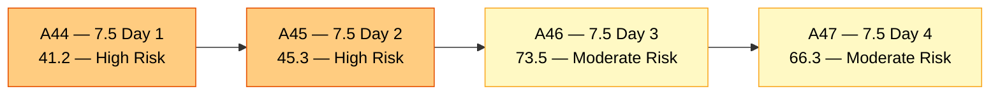
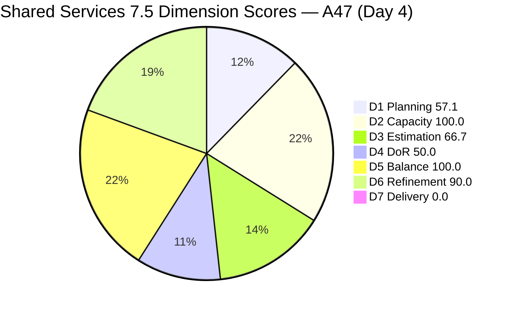
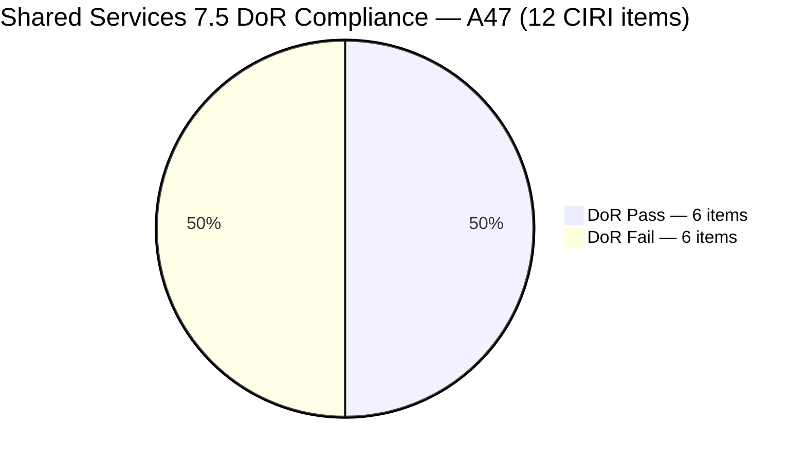
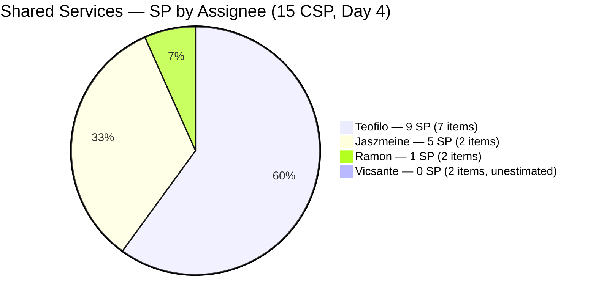

# ADO SAFe Audit — Shared Services Team

## 1. Audit Metadata

| Field | Value |
|---|---|
| **Audit Date** | 2026-06-04 UTC |
| **Sprint Day** | **4 of 14** |
| **Prior Audit** | A46 — `AUDIT_20260603_0207.md` (Overall 73.5, Moderate Risk — 7.5 Day 3) |
| **ADO Project** | Jairosoft Portfolio (`666bb99a-6acd-4999-bb34-efd0e4ea90dc`) |
| **ADO Team** | Shared Services Team (`bd9578fd-5773-48fc-bd80-988dfe5de806`) |
| **Iteration** | Iteration 7.5 (`9c70d575-210a-4156-bbdc-79f1efbe2869`) |
| **Iteration Path** | `Jairosoft Portfolio\2026-PI7\Iteration 7.5` |
| **Iteration Dates** | Jun 1, 2026 – Jun 14, 2026 |
| **Workspace Folder** | `ado_shared` |
| **Overall Score** | **66.3 — Moderate Risk** |
| **Risk Band** | Moderate (60–79.9) |
| **Visible Backlog Items (VRBI)** | 21 open root items |
| **Current Iteration Root Items (CIRI)** | 12 items (IterationPath = Iteration 7.5, open backlog only) |
| **Capacity** | Teofilo: 6h/day · Vicsante: 6h/day · Jaszmeine: 3h/day · Ramon: 0.5h/day = **15.5h/day total** |
| **Project Exception** | Board URL uses `/Stories` — backlog category `Microsoft.RequirementCategory` confirmed |

---

## 2. Executive Summary

The Shared Services Team holds at **66.3 — Moderate Risk** on Day 4 of Iteration 7.5, a decrease of **−7.2 points** from A46 (73.5). The decline is driven by **structural scoring changes** from sprint closure of 3 items, not regression in team behavior:

1. **Three items closed on Day 3** (#203845, #205455, #205479 — all by Teofilo, 6 SP total) **no longer appear in the live backlog API**. This reduces CIRI from 15 to 12 and CSP from 18 to 15 SP. With CLSP = 0 against today's 12 open CIRI items, D7 drops from 33.3 to 0.0 in the live scoring. This is an **evidence gap artifact**, not a delivery regression — the 3 closures from Day 3 remain confirmed.

2. **Two new items entered CIRI** (#205759 Setup JIT Machine for Easy Pull Out, #205722 Github Manage Copilot Review Settings — both Teofilo, Enabler, Active, 2 SP each, Jun 4). Both are well-defined with DoR-compliant content. This adds 2 more items to Teofilo's workload.

3. **#205662 (Mikrotik VPN Setup) progressed to "Passed UAT Testing"** on Jun 4 — now DoR-compliant (Desc + AC added) and advanced significantly in the workflow. This resolves one of the 7 DoR failures from A46.

**Net DoR position:** 6 of 12 items pass DoR (D4 = 50.0, High Risk). Six items still fail: #204205, #205123, #205210, #205211, #205474, #205603. D4 remains the team's most actionable improvement lever — fixing all 6 would add ~21 points to Overall.

---

## 3. Previous Audit Delta (A46 → A47)

| Dimension | A46 Score (7.5 Day 3) | A47 Score (7.5 Day 4) | Delta | Driver |
|---|---|---|---|---|
| D1 Iteration Planning | 71.4 | **57.1** | **−14.3** | CIRI 15→12 (3 closed items exited backlog API); VRBI unchanged at 21 |
| D2 Team Capacity | 100.0 | **100.0** | 0.0 | All 4 contributors still capacity-configured; unchanged |
| D3 Estimation | 66.7 | **66.7** | 0.0 | ECI 10→8 and PECI 15→12 both reduced proportionally; ratio unchanged at 8/12 |
| D4 DoR Compliance | 53.3 | **50.0** | **−3.3** | CIRI 15→12; DCI 8→6 (#205662 now passes, but 3 closed items also exited removing their DoR passes). Net: 6 pass / 12 CIRI |
| D5 Work Item Balance | 100.0 | **100.0** | 0.0 | US = 2/12 = 16.7%; Enabler = 6/12 = 50%; no thresholds breached |
| D6 Backlog Refinement | 90.0 | **90.0** | 0.0 | Fresh items unchanged; untouched still 3 of 12 = 25% → −10 penalty |
| D7 Delivery Predictability | 33.3 | **0.0** | **−33.3** | **Evidence gap:** 3 closed items (6 SP) exited backlog API. Live CIRI = 12 open items, 0 Closed/Done. Day 4 early-sprint window. See Section 11. |
| **OVERALL** | **73.5** | **66.3** | **−7.2** | Scoring decline is structural/API-driven. Team is delivering — Teofilo closed 3 items Day 3, #205662 reached UAT. Core DoR gap (D4) remains the priority. |

**Key transition observations A46 → A47:**
- #203845, #205455, #205479 **Closed** on Day 3 (Jun 3) — no longer returned by `wit_list_backlog_work_items`. This is expected behavior for closed items and reduces CIRI from 15 to 12.
- **#205759** (Setup JIT Machine for Easy Pull Out) added to sprint on Jun 4: Enabler, Active, 2 SP, Desc ✓, AC ✓ — DoR Pass.
- **#205722** (Github Manage Copilot Review Settings) added to sprint on Jun 4: Enabler, Active, 2 SP, Desc ✓, AC ✓ — DoR Pass.
- **#205662** (Mikrotik VPN Setup) updated Jun 4: State progressed to "Passed UAT Testing"; Desc + AC added (both now meet DoR thresholds) — DoR status changed Fail → Pass.
- #205123, #205210, #205211, #204205, #205474, #205603 — no changes since A46.

---

## 4. Current Iteration Snapshot

| Metric | Value |
|---|---|
| **Visible Backlog Items (VRBI)** | 21 |
| **Current Iteration Root Items (CIRI)** | 12 (IterationPath = Iteration 7.5, open items from backlog API) |
| **Story Points Committed (CSP)** | 15 SP (8 estimated items) |
| **Story Points Closed (CLSP)** | 0 SP (live CIRI; see Evidence Gaps for Day 3 confirmed closures) |
| **Sprint Day / Total** | 4 / 14 |
| **Team Size (distinct CIRI assignees)** | 4 (Teofilo, Vicsante, Ramon, Jaszmeine) |
| **Total Capacity** | 15.5h/day × 14 days = 217 hours |
| **Iteration Start / Finish** | Jun 1, 2026 – Jun 14, 2026 |

*Note: 3 items confirmed closed on Day 3 (6 SP) are not included in live CIRI due to API behavior. CSP = 15 SP reflects today's 8 estimated open items.*

---

## 5. Work Item Analysis

### CIRI Items (12 items — IterationPath = Iteration 7.5, open)

| ID | Title | Type | State | SP | Assignee | DoR | ChangedDate |
|---|---|---|---|---|---|---|---|
| #202726 | Booking & Payment Management | Design | Active | 2 | Jaszmeine | **Pass** | Jun 2 |
| #202727 | Contract Management | Design | Ready for Design | 3 | Jaszmeine | **Pass** | Jun 2 |
| #204205 | Android Phone from US | Enabler | New | 1 | Teofilo | **Fail** (no Desc/AC) | May 29 |
| #204238 | Use FinOps Board | User Story | Ready for Dev | 1 | Ramon | **Pass** | Jun 2 |
| #205123 | Installing Jodex Plugin in Antigravity | Spike | Active | — | Vicsante | **Fail** (no Desc/AC) | May 29 |
| #205210 | Install and Setup Antigravity | User Story | Active | — | Vicsante | **Fail** (AC = "4 persons", 9 chars) | Jun 2 |
| #205211 | Create Product Repository for Jodex | Enabler | New | — | Ramon | **Fail** (no Desc/AC) | May 29 |
| #205474 | Up Sonicwall VPN | Enabler | Grooming | 2 | Teofilo | **Fail** (no Desc/AC) | Jun 2 |
| #205603 | Discuss SonicWall Installation with Teofilo | Spike | New | — | Teofilo | **Fail** (no Desc/AC) | Jun 2 |
| #205662 | Mikrotik VPN Setup | Enabler | **Passed UAT Testing** | 2 | Teofilo | **Pass** | **Jun 4** |
| #205722 | Github Manage Copilot Review Settings | Enabler | Active | 2 | Teofilo | **Pass** | **Jun 4** (new) |
| #205759 | Setup JIT Machine for Easy Pull Out | Enabler | Active | 2 | Teofilo | **Pass** | **Jun 4** (new) |

*SP "—" = null. **Bold** = changed since A46.*

### Confirmed Closed Items (Day 3 — no longer in live backlog API)

| ID | Title | Type | SP | Assignee | Closed Date |
|---|---|---|---|---|---|
| #203845 | Monthly Costing — June 2026 | Enabler | 2 | Teofilo | Jun 3 01:52 UTC |
| #205455 | JIT Machine Training Room | Enabler | 2 | Teofilo | Jun 3 01:26 UTC |
| #205479 | User Fernandez in 365 | User Story | 2 | Teofilo | Jun 3 01:26 UTC |

*These items are no longer returned by the backlog API. Their SP (6 total) is documented as a known delivery achievement but excluded from live D7 scoring per evidence rules. See Section 11.*

### Non-CIRI Backlog Items (9 items — various past/future iterations)

| ID | Title | Iter | Type | State | Changed |
|---|---|---|---|---|---|
| #196454 | Colina Intake/Output Tab | PI8 | Design | New | Jun 3 |
| #197981 | Colina Task Feature Enhancement | PI8 | Design | New | Jun 3 |
| #202066 | Provide Installation Guide | PI8 | User Story | Estimation | May 8 |
| #202553 | Vendor Exploration & Search | 7.3 | Design | Design Approved | Jun 1 |
| #202724 | Vendor Profile & Details | 7.3 | Design | Design Approved | Jun 2 |
| #202725 | Messaging & Communication | 7.4 | Design | Design Review | Jun 2 |
| #202947 | IT Support Services Feedback Survey | 7.6 IP | Spike | New | May 19 |
| #203309 | GitHub Token Defect | 7.4 | Defect | Ready for QA | May 19 |
| #204950 | Monthly Costing — July 2026 | 7.6 IP | Enabler | New | Jun 3 |

### CIRI Type Distribution (12 items)

| Type | Count | Share |
|---|---|---|
| Enabler | 6 | 50.0% |
| User Story | 2 | 16.7% |
| Design | 2 | 16.7% |
| Spike | 2 | 16.7% |
| **Total** | **12** | **100%** |

### DoR Assessment — All 12 CIRI Items

| ID | Title | Desc ≥ 30 | AC ≥ 20 | Result |
|---|---|---|---|---|
| #202726 | Booking & Payment Management | ✓ | ✓ | **Pass** |
| #202727 | Contract Management | ✓ | ✓ | **Pass** |
| #204205 | Android Phone from US | ✗ null | ✗ null | **Fail** |
| #204238 | Use FinOps Board | ✓ (~40 chars) | ✓ (~100 chars) | **Pass** |
| #205123 | Installing Jodex Plugin | ✗ null | ✗ null | **Fail** |
| #205210 | Install Antigravity | ✓ (~38 chars) | ✗ "4 persons" (9 chars) | **Fail** |
| #205211 | Create Product Repository for Jodex | ✗ null | ✗ null | **Fail** |
| #205474 | Up Sonicwall VPN | ✗ null | ✗ null | **Fail** |
| #205603 | Discuss SonicWall with Teofilo | ✗ null | ✗ null | **Fail** |
| #205662 | Mikrotik VPN Setup | ✓ (~32 chars) | ✓ (2 criteria, ~70 chars) | **Pass** |
| #205722 | Github Manage Copilot Review Settings | ✓ (~24 chars) | ✓ (~37 chars) | **Pass** |
| #205759 | Setup JIT Machine for Easy Pull Out | ✓ (~75 chars) | ✓ (~75 chars) | **Pass** |

Pass: 6 (#202726, #202727, #204238, #205662, #205722, #205759). Fail: 6 (#204205, #205123, #205210, #205211, #205474, #205603).

### Assignee Workload — Day 4

| Assignee | CIRI Items | SP Committed | SP Closed (live) | DoR Issues |
|---|---|---|---|---|
| Teofilo | 7 (#204205, #205474, #205603, #205662, #205722, #205759 + closed items exited) | 9 SP (in 7 items: 1+2+0+2+2+2) | 0 SP live (6 SP closed Day 3, exited backlog) | #204205 (no DoR), #205474 (no DoR), #205603 (no DoR) |
| Jaszmeine | 2 (#202726, #202727) | 5 SP | 0 SP | None — both pass |
| Ramon | 2 (#204238, #205211) | 1 SP (#204238) | 0 SP | #205211 (no DoR) |
| Vicsante | 2 (#205123, #205210) | 0 SP (both null) | 0 SP | #205123 (no Desc/AC), #205210 (AC too short) |

---

## 6. SAFe Compliance Scorecard

| Dimension | Score | Band | Evidence | Notes |
|---|---|---|---|---|
| D1 Iteration Planning | **57.1** | High | 12 CIRI / 21 VRBI | −14.3 from A46. CIRI 15→12 (3 closed items exited backlog API). VRBI unchanged at 21. |
| D2 Team Capacity | **100.0** | Low | 4/4 contributors with capacity | Teofilo 6h + Vicsante 6h + Jaszmeine 3h + Ramon 0.5h = 15.5h/day. Unchanged. |
| D3 Estimation | **66.7** | Moderate | 8 ECI / 12 PECI | Unchanged ratio. ECI/PECI both reduced due to closed items exiting backlog. 4 items null SP. |
| D4 DoR Compliance | **50.0** | High | 6 DCI / 12 CIRI | −3.3 from A46. #205662 now passes; 3 closed DoR-passes exited. Net: 6 pass / 6 fail. |
| D5 Work Item Balance | **100.0** | Low | US=16.7%, Enabler=50%, no penalties | Enabler below 60% threshold. User Stories present. Spike at 16.7%. All penalties waived. |
| D6 Backlog Refinement | **90.0** | Low | 21/21 fresh; untouched 3/12 = 25% → −10 | Unchanged. #205211, #205123, #204205 still untouched (May 29). |
| D7 Delivery Predictability | **0.0** | Critical | 0 SP closed (live CIRI) / 15 SP committed | **Evidence gap** — 3 items (6 SP) closed Day 3 not in live backlog. Day 4 early-sprint window. |
| **OVERALL** | **66.3** | **Moderate** | (57.1+100.0+66.7+50.0+100.0+90.0+0.0)/7 | −7.2 from A46. Decline is structural/API-driven. DoR (D4) remains the priority gap. |

**Formula verification:** (57.1 + 100.0 + 66.7 + 50.0 + 100.0 + 90.0 + 0.0) / 7 = 463.8 / 7 = **66.3**

---

## 7. Dimension Findings

### D1 — Iteration Planning: 57.1 / 100 — High Risk

**Formula:** CIRI / VRBI × 100 = 12 / 21 × 100 = **57.1**

| Metric | Value |
|---|---|
| Visible root backlog items (VRBI) | 21 |
| Items in Iteration 7.5 (CIRI) | 12 |
| Non-CIRI items | 9 (PI8 × 3, 7.3 × 2, 7.4 × 2, 7.6 IP × 2) |
| Score | **57.1** |

The D1 decline from 71.4 to 57.1 is driven by CIRI shrinking from 15 to 12 as three closed items (#203845, #205455, #205479) exited the live backlog. VRBI remains at 21 because the non-CIRI items (past/future iterations) are still open. This is an expected side-effect of healthy delivery — as items close and leave the backlog, D1 declines unless new CIRI items replace them. Teofilo's two new items on Jun 4 (#205759, #205722) partially offset this, preventing a steeper drop.

The cleanest path to D1 recovery: (a) Jaszmeine closes #202553 and #202724 (Design Approved, 7.3) — reducing VRBI to 19 → D1 = 12/19 = 63.2%; (b) Jaszmeine moves #202725 (7.4, Design Review, Active) to 7.5 — CIRI would rise to 13 → D1 = 13/21 = 61.9%.

---

### D2 — Team Capacity: 100.0 / 100 — Low Risk

**Formula:** CC / CW × 100 = 4 / 4 × 100 = **100.0**

| Contributor | CIRI Items | Capacity | Activity |
|---|---|---|---|
| Teofilo Limpag | 7 items | 6h/day | Development |
| Vicsante Aseniero | 2 items | 6h/day | Development |
| Jaszmeine Villanueva | 2 items | 3h/day | Design |
| Ramon Aseniero Jr | 2 items (incl. #205211) | 0.5h/day | Requirements |

All four contributors have capacity configured and work assigned. Teofilo now carries 7 of 12 CIRI items — a concentration that continues from prior sprints and warrants monitoring, but does not breach any scoring thresholds given his 84-hour sprint capacity.

---

### D3 — Estimation: 66.7 / 100 — Moderate Risk

**Formula:** ECI / PECI × 100 = 8 / 12 × 100 = **66.7**

| ID | Title | Type | SP | Estimated |
|---|---|---|---|---|
| #202726 | Booking & Payment Management | Design | 2 | Yes |
| #202727 | Contract Management | Design | 3 | Yes |
| #204205 | Android Phone from US | Enabler | 1 | Yes |
| #204238 | Use FinOps Board | User Story | 1 | Yes |
| #205123 | Installing Jodex Plugin | Spike | — | **No** |
| #205210 | Install Antigravity | User Story | — | **No** |
| #205211 | Create Product Repository for Jodex | Enabler | — | **No** |
| #205474 | Up Sonicwall VPN | Enabler | 2 | Yes |
| #205603 | Discuss SonicWall with Teofilo | Spike | — | **No** |
| #205662 | Mikrotik VPN Setup | Enabler | 2 | Yes |
| #205722 | Github Manage Copilot Review Settings | Enabler | 2 | Yes |
| #205759 | Setup JIT Machine for Easy Pull Out | Enabler | 2 | Yes |

ECI = 8, PECI = 12, D3 = 8/12 = **66.7**. Four items are unestimated: #205123 (Vicsante, Day 4 Active without SP), #205210 (Vicsante, Day 4 Active without SP), #205211 (Ramon), and #205603 (Teofilo). The carry-over unestimated items (#205123, #205210, #205211) have now been in the sprint without Story Points for 4+ days.

---

### D4 — DoR Compliance: 50.0 / 100 — High Risk

**Formula:** DCI / CIRI × 100 = 6 / 12 × 100 = **50.0**

Six of 12 CIRI items fail DoR. The failing items group into three categories:

**Category A — Carry-over failures with no remediation (4+ days):**
- **#204205** (Teofilo, New, 1 SP): null Description, null AC. In sprint since Day 1.
- **#205123** (Vicsante, Active): null Description, null AC. Vicsante is executing Active work with zero definition.
- **#205210** (Vicsante, Active): Description passes (~38 chars); AC = "4 persons" (9 chars — fails ≥20 threshold). Requires AC expansion only.
- **#205211** (Ramon, New): null Description, null AC. In sprint since Day 1.

**Category B — Added Jun 2 without DoR content:**
- **#205474** (Teofilo, Grooming, 2 SP): null Description, null AC. In "Grooming" state — DoR completion should be the grooming output.
- **#205603** (Teofilo, New): null Description, null AC. Ambiguous deliverable — see Section 8 R3.

**Category C — Resolved Day 4:**
- **#205662** (Teofilo, Passed UAT Testing, 2 SP): DoR added Jun 4 — Description ✓, AC ✓. This is a notable positive action.

If all 6 failing items were remediated, D4 would rise to 12/12 = 100.0, adding approximately 7.1 points to Overall (from 66.3 to ~73.4). Combined with D3 remediation (estimating 4 null-SP items), Overall would reach approximately ~80.0 (Low Risk threshold).

---

### D5 — Work Item Balance: 100.0 / 100 — Low Risk

**Formula:** Base 100 − penalties applied independently

| Penalty | Trigger | Applied |
|---|---|---|
| −40: No User Story in CIRI | 2 User Stories present (#204238, #205210) | **No** |
| −30: Dominant type share > 60% | Enabler = 6/12 = 50.0% — not > 60% | **No** |
| −20: Spike share > 40% | Spike = 2/12 = 16.7% — not > 40% | **No** |

**Score:** 100 − 0 = **100.0**

The three closures (all Enablers) and two new additions (both Enablers) reduced Enabler count from 8 to 6 of 12 items. Enabler share remains well below the 60% penalty threshold at 50.0%. User Stories are present at 16.7%. D5 is stable.

---

### D6 — Backlog Refinement: 90.0 / 100 — Low Risk

**Freshness window:** ChangedDate ≥ 2026-04-20 (45 days before 2026-06-04)

| Metric | Value |
|---|---|
| Total VRBI | 21 |
| Fresh items (ChangedDate ≥ Apr 20, 2026) | 21 — oldest: #202066 (May 8) |
| Stale_90 items (ChangedDate < Mar 6, 2026) | 0 |
| Stale_180 items (ChangedDate < Dec 7, 2025) | 0 |
| Untouched CIRI (ChangedDate < Jun 1, 2026) | 3 of 12 — #204205 (May 29), #205123 (May 29), #205211 (May 29) |
| Untouched / CIRI | 3/12 = 25.0% → > 10%, ≤ 30% → **−10 penalty** |

**Penalty calculation:**
- stale_90: 0% → no penalty
- stale_180: 0 items → no penalty
- untouched: 3/12 = 25% → −10

**Score:** max(0, 100.0 − 10) = **90.0**

The three untouched items are the same as A46 (#204205, #205123, #205211 — all May 29). Touching any of these (even adding a comment) would reduce untouched to 2 (2/12 = 16.7% — still > 10%, still −10). To eliminate the D6 penalty, untouched must drop to 1 item (1/12 = 8.3% — below 10% threshold). Adding DoR content to any two of the three items (which involves field updates) would resolve both D4 and D6 simultaneously.

---

### D7 — Delivery Predictability: 0.0 / 100 — Critical

**Formula:** CLSP / CSP × 100 = 0 / 15 × 100 = **0.0**

> **Early-sprint annotation:** Sprint Day 4 of 14 — Day 4 is within the Days 1–5 early-sprint window. D7 = 0.0 is annotated as structurally expected for early-sprint days. **IMPORTANT: This score reflects an evidence gap (see Section 11). The team confirmed 6 SP delivered on Day 3 that are no longer visible in the live backlog API.**

> **Evidence gap note:** Three items confirmed closed on Day 3 (#203845, #205455, #205479 — 6 SP total, all Teofilo) are no longer returned by the `wit_list_backlog_work_items` API call. The live CIRI of 12 items contains no items in Closed or Done state. Per rubric evidence rules, scoring uses live API data only. Contextual delivery rate accounting for Day 3 closures: 6 SP / (15 SP + 6 SP) = 6/21 = 28.6%.

| Metric | Value |
|---|---|
| ECI (items with SP > 0, live CIRI) | 8 |
| Committed Story Points (CSP, live) | 15 SP |
| Closed Story Points (CLSP, live) | 0 SP |
| Items in "Passed UAT Testing" (#205662) | 1 item, 2 SP — close imminent |
| Score (live) | **0.0** |
| Contextual delivery rate (incl. Day 3 closures) | 6/21 = 28.6% |

#205662 (Mikrotik VPN Setup) is now in "Passed UAT Testing" — this is one workflow step from Closed. If #205662 closes today, live D7 rises to 2/15 = 13.3% and Overall lifts from 66.3 to approximately 68.2.

---

## 8. Risks and Bottlenecks

| # | Severity | Dimension | Risk | Recommended Action |
|---|---|---|---|---|
| R1 | **CRITICAL** | D4 | 6 of 12 CIRI items fail DoR. #205123 (Vicsante) is "Active" — work is being executed on undefined scope. #205210 (Vicsante) has AC = "4 persons" (9 chars, insufficient). Four of the 6 failures are carry-over items that have been undefined for 4+ days. | Vicsante: add Desc + full AC to #205123 today; expand AC on #205210 to named verification steps (≥20 chars). Teofilo: add Desc + AC to #204205 and #205474. Ramon: add Desc + AC to #205211. Fixing all 6 raises D4 to 100.0 and Overall to ~73.4. |
| R2 | **HIGH** | D3 | 4 unestimated items: #205123, #205210, #205211, #205603. Vicsante has 0 SP committed (both Active items unestimated). This makes Vicsante's contribution invisible in D7 even if items close. | Estimate all 4: suggest #205123 (2 SP), #205210 (1 SP), #205211 (1 SP), #205603 (1 SP). Total CSP would rise from 15 to ~20 SP. |
| R3 | **HIGH** | D1 + D4 | #205603 (Discuss SonicWall Installation with Teofilo) has no Desc/AC/SP and a title implying a planning meeting, not a deliverable. Adding it to CIRI on Day 2 without DoR content is a process violation per SAFe DoR gate. | Teofilo/Ramon: evaluate #205603 — if it is a planning discussion, close or remove from CIRI immediately. If it is a deliverable, add Desc + AC + SP today and rename with an outcome-oriented title. |
| R4 | **HIGH** | D7 | #205662 is in "Passed UAT Testing" — one step from Closed. Closing it today would restore some live D7 signal and demonstrate continued sprint momentum. | Teofilo: close #205662 (Mikrotik VPN Setup) today. This is the only item near completion in today's live CIRI. |
| R5 | **MEDIUM** | D1 | Two Design Approved items (#202553, #202724 — both Jaszmeine, 7.3) remain open in the backlog, inflating VRBI. These designs are complete — keeping them open adds noise to D1. | Jaszmeine: close #202553 (Vendor Exploration & Search) and #202724 (Vendor Profile & Details). Both are Design Approved. Closing them reduces VRBI from 21 to 19 → D1 = 12/19 = 63.2%. |
| R6 | **MEDIUM** | D6 | Three untouched items (#204205, #205123, #205211 — all May 29) continue to generate the −10 D6 penalty. The DoR remediation actions (R1) would simultaneously touch all three. | Any field update to two of the three items (adding DoR content resolves R1 and eliminates the D6 untouched penalty in one action). |
| R7 | **MEDIUM** | D7 | Teofilo carries 7 of 12 CIRI items and is the sole contributor with closed items so far. Jaszmeine (5 SP) and Vicsante (0 SP) have shown no progress toward Closed. | Monitor Jaszmeine #202726 (Active) and #202727 (Ready for Design) and Vicsante #205123 and #205210 daily. If no movement by Day 6, investigate blockers. Jaszmeine's 5 SP represents 33% of total CSP. |
| R8 | **LOW** | D1 | #202725 (Messaging & Communication, Jaszmeine, Design Review, 7.4 IterationPath) is being actively worked but not counted in CIRI. Moving it to 7.5 would add 3 SP to sprint commitment and improve D1 visibility. | Jaszmeine: move #202725 to Iteration 7.5. This adds a tracked item to CIRI (13/21 = 61.9% D1) and reflects actual work in the sprint. |

---

## 9. Prioritized Recommendations

1. **[CRITICAL — Today Day 4]** Vicsante, Teofilo, Ramon: complete DoR on all 6 failing CIRI items. Priority order:
   - **#205123** (Vicsante, Active): Highest urgency — Active work without definition. Add description of Jodex plugin installation steps (≥30 chars) and verification AC (e.g., "Jodex plugin installed in Antigravity Client. Verified by creating and reading a test record successfully."). Simultaneously estimate at 2 SP.
   - **#205210** (Vicsante, Active): AC only — replace "4 persons" with "Antigravity installed and confirmed functional on Grace, Sam, Armelita, and Kleer workstations. Each user verified access." Estimate at 1 SP.
   - **#205474** (Teofilo, Grooming): Add Desc describing Sonicwall VPN scope and AC with network verification steps (≥20 chars). Already has 2 SP.
   - **#204205** (Teofilo, New): Add Desc and AC describing the Android phone receipt/setup scope. 1 SP already set.
   - **#205211** (Ramon, New): Add Desc and AC for the Jodex GitHub repository creation. Estimate at 1 SP.
   - **#205603** (Teofilo, New): Evaluate first — if it is a meeting note, remove from CIRI. If deliverable, rewrite with outcome title, Desc, AC, and SP.
   Fixing all 6 raises D4 to 100.0 and Overall from 66.3 to ~73.4.

2. **[HIGH — Today Day 4]** Teofilo: close #205662 (Mikrotik VPN Setup) — it is in "Passed UAT Testing" and represents the nearest completion in today's live CIRI. Closing it restores live D7 signal: 2/15 = 13.3%, Overall ≈ 68.2.

3. **[HIGH — Today/Day 5]** Jaszmeine: close #202553 (Vendor Exploration & Search, Design Approved, 7.3) and #202724 (Vendor Profile & Details, Design Approved, 7.3). Both are done. Closing them reduces VRBI from 21 to 19 and improves D1. Also move #202725 (Messaging & Communication) from 7.4 to 7.5 IterationPath — it is actively in "Design Review."

4. **[HIGH — Days 4–6]** Vicsante: provide daily status updates on #205123 and #205210 in ADO. Both are "Active" with 0 SP committed — completing DoR on them (Rec 1) is the prerequisite for these items to contribute to D7 at all. Target closing at least one by Day 7.

5. **[MEDIUM — Days 5–7]** Teofilo: continue delivery momentum from Day 3. Target two more closures by Day 7: #205456 (IT Room Maintenance, Active, 2 SP) and #205474 (Up Sonicwall VPN, Grooming, 2 SP — after DoR completion). Closing these adds 4 SP to live D7 denominator/numerator.

6. **[MEDIUM — Ongoing]** Ramon: close or self-QA #203309 (GitHub Token Defect, 7.4, Ready for QA, 1 SP). Now 15+ days in Ready for QA. If token scope is confirmed resolved, closing it reduces VRBI noise and removes a stale 7.4 item.

7. **[LOW — Before 7.6 planning]** Evaluate scope of #196454 (Colina Intake/Output Tab, PI8) and #197981 (Colina Task Feature Enhancement, PI8) — both Jaszmeine future items that inflate VRBI. Confirm these are correctly queued for PI8 and are properly scoped.

---

## 10. Visualizations

### Score Trend (A44 → A47)

### Dimension Scorecard — A47 (Day 4)

### DoR Status — 12 CIRI Items

### What-If: Full Remediation Impact

```mermaid
flowchart LR
    Current["Current: 66.3\nModerate Risk\nD1=57.1, D4=50.0"]
    Current -->|"Close #202553 + #202724\nVRBI: 21→19\nD1: 57.1→63.2"| Step1["~68.2\nModerate"]
    Step1 -->|"Fix all 6 DoR fails\nD4: 50.0→100.0\n+7.1 pts"| Step2["~75.3\nModerate"]
    Step2 -->|"Estimate 4 null-SP items\nD3: 66.7→100.0\n+4.8 pts"| Step3["~80.1\nLow Risk"]
    Step3 -->|"Close #205662 now\n+#205474, #205456 by Day 7\nD7 recovery"| Step4["~83+\nLow Risk"]
    style Current fill:#FFF9C4,stroke:#F9A825,color:#000
    style Step1 fill:#FFF9C4,stroke:#F9A825,color:#000
    style Step2 fill:#FFF9C4,stroke:#F9A825,color:#000
    style Step3 fill:#C8E6C9,stroke:#2E7D32,color:#000
    style Step4 fill:#C8E6C9,stroke:#2E7D32,color:#000
```

### Assignee SP Distribution — Live CIRI (15 SP, 12 items)

---

## 11. Evidence Gaps and Limitations

| Gap | Impact | Notes |
|---|---|---|
| **3 closed items (6 SP) not in live backlog API** | D1 and D7 significantly affected | #203845, #205455, #205479 were confirmed Closed on Jun 3 (per A46 and ADO timestamps). The `wit_list_backlog_work_items` API does not return closed items, so CIRI = 12 (not 15) and live CSP = 15 (not 21). D7 = 0.0 live but contextual delivery rate = 6/21 = 28.6% when Day 3 closures are included. This is a known ADO backlog API behavior, not a data error. |
| **D7 = 0.0 on Sprint Day 4** | Annotated as early-sprint | Live CIRI contains no Closed/Done items. Day 4 is within the Days 1–5 annotation window. D7 will become actionable concern at Day 6 if #205662 and other near-complete items have not closed. |
| **6 items fail DoR** | D4 = 50.0% (definitive) | #204205, #205123, #205211: null Description and null AC. #205210: AC too short (9 chars). #205474, #205603: null Description and null AC. All DoR failures are confirmed from live ADO field data. |
| **4 items null SP** | D3 = 66.7% (definitive) | #205123, #205210, #205211, #205603 have no Story Points. CSP understated. If estimated at ~1–2 SP each, CSP rises to ~20 SP and D3 rises to 100.0. |
| **#205603 ambiguous deliverable** | Counted in CIRI | Title implies planning discussion. If removed from sprint, CIRI = 11, PECI = 11, DCI = 6 → D4 = 54.5%, D1 = 11/21 = 52.4%. Recommend evaluation. |
| **#202725 (Messaging & Communication) in 7.4 IterationPath** | Excluded from CIRI | Jaszmeine is working this item (Design Review, Jun 2). If moved to 7.5, CIRI = 13 → D1 = 13/21 = 61.9%, D4 = 7/13 = 53.8% (would need DoR check). |
| **Children of #202727 (#203422, #203423, #203424)** | Correctly excluded | Three child tasks of Contract Management. Root-level items only per rubric. |

---

## 12. Audit Trail

| Source | Tool | Data |
|---|---|---|
| Shared Services Team GUID | `core_list_project_teams` (project `666bb99a`) | `bd9578fd-5773-48fc-bd80-988dfe5de806` |
| Current iteration | `work_list_team_iterations` (project `666bb99a`, team `bd9578fd`, timeframe=current) | Iteration 7.5: Jun 1–14, 2026; ID `9c70d575-210a-4156-bbdc-79f1efbe2869` |
| Backlog items | `wit_list_backlog_work_items` (backlogId `Microsoft.RequirementCategory`) | 21 open root items |
| Work item details | `wit_get_work_items_batch_by_ids` (21 items) | SP, State, Type, Desc, AC, ChangedDate, IterationPath confirmed for all 21 items |
| Team capacity | `work_get_team_capacity` (project `666bb99a`, team `bd9578fd`, iterationId `9c70d575`) | Teofilo 6h/day, Vicsante 6h/day, Jaszmeine 3h/day, Ramon 0.5h/day = 15.5h/day; 0 days off |
| Prior audit | `AUDIT_20260603_0207.md` (A46) | Overall 73.5, Moderate Risk, 7.5 Day 3, 21 VRBI, 15 CIRI, 18 SP committed, 6 SP closed |
