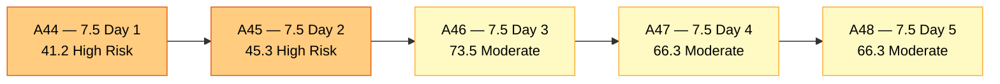
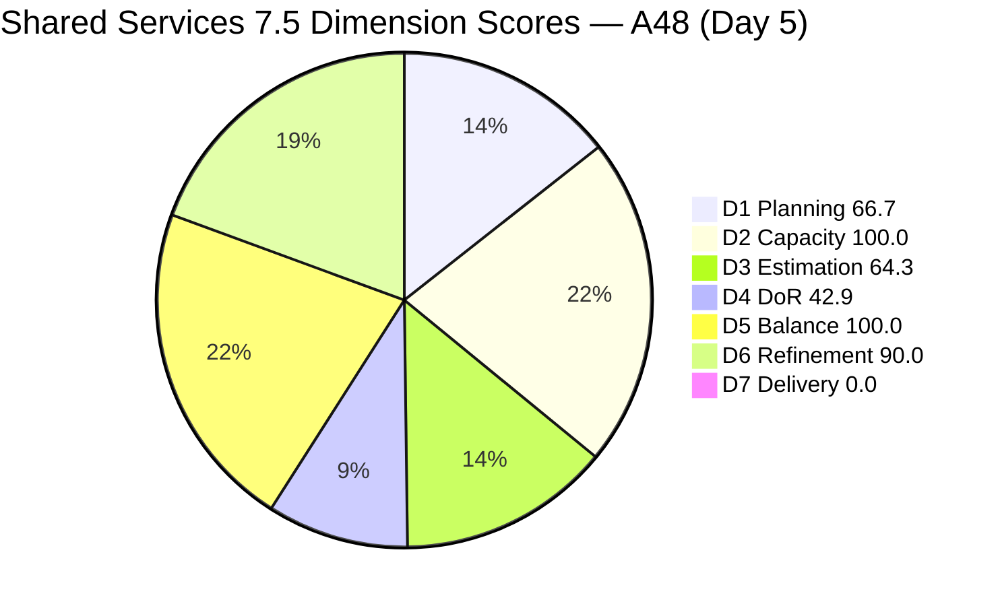
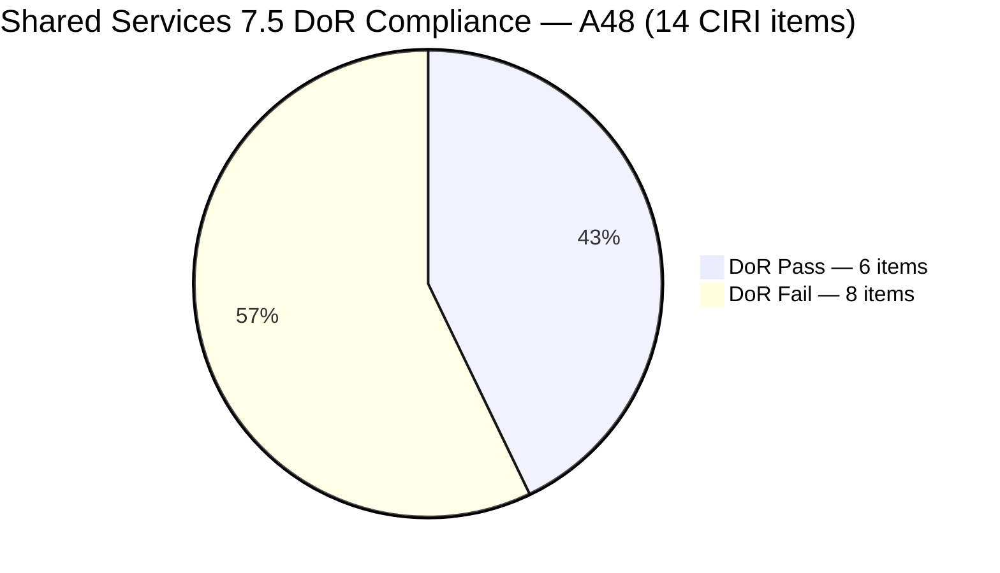
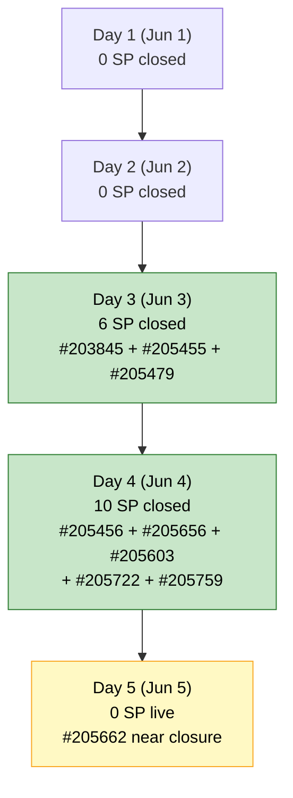
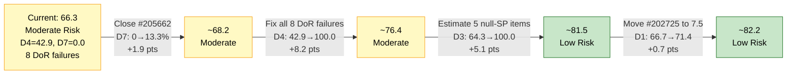

# ADO SAFe Audit — Shared Services Team

## 1. Audit Metadata

| Field | Value |
|---|---|
| **Audit Date** | 2026-06-05 UTC |
| **Sprint Day** | **5 of 14** |
| **Prior Audit** | A47 — `AUDIT_20260604_0007.md` (Overall 66.3, Moderate Risk — 7.5 Day 4) |
| **ADO Project** | Jairosoft Portfolio (`666bb99a-6acd-4999-bb34-efd0e4ea90dc`) |
| **ADO Team** | Shared Services Team (`bd9578fd-5773-48fc-bd80-988dfe5de806`) |
| **Iteration** | Iteration 7.5 (`9c70d575-210a-4156-bbdc-79f1efbe2869`) |
| **Iteration Path** | `Jairosoft Portfolio\2026-PI7\Iteration 7.5` |
| **Iteration Dates** | Jun 1, 2026 – Jun 14, 2026 |
| **Workspace Folder** | `ado_shared` |
| **Overall Score** | **66.3 — Moderate Risk** |
| **Risk Band** | Moderate (60–79.9) |
| **Visible Backlog Items (VRBI)** | 21 open root items |
| **Current Iteration Root Items (CIRI)** | 14 items (IterationPath = Iteration 7.5, open in backlog) |
| **Capacity** | Teofilo: 6h/day · Vicsante: 6h/day · Jaszmeine: 3h/day · Ramon: 0.5h/day = **15.5h/day total** |
| **Project Exception** | Board URL uses `/Stories` — backlog category `Microsoft.RequirementCategory` confirmed |

---

## 2. Executive Summary

The Shared Services Team holds at **66.3 — Moderate Risk** on Day 5 of Iteration 7.5, unchanged from A47 (66.3) in headline score, though the underlying composition has shifted significantly:

**Positive developments since A47 (Jun 4):**
- **Five items Closed on Jun 4** (Teofilo): #205456 (IT Room Maintenance, 2SP), #205656 (Backup AutoAllies DB, 1SP), #205603 (Discuss SonicWall, 3SP), #205722 (Github Copilot Settings, 2SP), #205759 (Setup JIT Machine, 2SP) — 10 SP delivered in a single day. This is the team's strongest delivery day of the sprint.
- **Two new items entered CIRI** (#205195, #205198 — both Jaszmeine, Spike, Active, 1SP each, Jun 4) — both are DoR-compliant retrospective action items.
- **Two new Enablers added to CIRI** (#205815, #205816 — Teofilo, Grooming, Jun 5) — both entered today, both currently undefined (no Desc/AC).
- **#205474 (Up Sonicwall VPN)** state changed to New (from Grooming) and touched today (Jun 5) — still no Desc/AC.

**Persistent concerns:**
- **DoR failure rate** remains high: 8 of 14 CIRI items fail DoR (D4 = 42.9, High Risk). The two new Grooming items (#205815, #205816) added without DoR content worsened the ratio. Carry-over failures (#204205, #205123, #205210, #205211, #205474) remain unresolved for 5+ days.
- **D7 = 0.0 (live CIRI)** for the same structural reason as A47: all closed items exited the backlog API. The team has confirmed at least 16 SP delivered this sprint (Days 3–4 closures), but this is not visible in the live scoring. Day 5 is the last day of the early-sprint annotation window.
- **Five unestimated CIRI items** (#205123, #205210, #205211, #205815, #205816) contribute to D3 = 64.3 (Moderate Risk).

**Score held identical to A47 (66.3) despite significant delivery activity** — this is because the additional closures and CIRI expansion (12→14) offset each other in the scoring denominators, while DoR failures increased proportionally.

---

## 3. Previous Audit Delta (A47 → A48)

| Dimension | A47 Score (7.5 Day 4) | A48 Score (7.5 Day 5) | Delta | Driver |
|---|---|---|---|---|
| D1 Iteration Planning | 57.1 | **66.7** | **+9.6** | CIRI 12→14 (net: +2 new items added, offset by more closures not reflected); VRBI unchanged 21 |
| D2 Team Capacity | 100.0 | **100.0** | 0.0 | All 4 contributors still capacity-configured; unchanged |
| D3 Estimation | 66.7 | **64.3** | **−2.4** | CIRI 12→14; 5 unestimated (vs 4 in A47); ECI 8→9 but PECI 12→14 |
| D4 DoR Compliance | 50.0 | **42.9** | **−7.1** | CIRI 12→14; DCI stays 6; new items #205815/#205816 added without DoR; strict desc check on #205662 (27 NWS < 30 threshold) |
| D5 Work Item Balance | 100.0 | **100.0** | 0.0 | No penalty thresholds breached; User Stories present; Enabler < 60% |
| D6 Backlog Refinement | 90.0 | **90.0** | 0.0 | Untouched CIRI still 3/14 = 21.4% → −10 penalty; #205474 touched today does not reduce count |
| D7 Delivery Predictability | 0.0 | **0.0** | 0.0 | Evidence gap: 5 more items (10 SP) closed Jun 4 exited backlog API. Live CIRI = 14 open items, 0 Closed/Done. Day 5 early-sprint window (final day). |
| **OVERALL** | **66.3** | **66.3** | **0.0** | Headline unchanged; delivery progress masked by API evidence gap and new ungroomed items entering CIRI |

**Key transition observations A47 → A48:**
- **Teofilo Closed 5 items on Jun 4** — #205456 (IT Room Maintenance, 2SP), #205656 (Backup AutoAllies DB, 1SP), #205603 (Discuss SonicWall, 3SP), #205722 (Github Copilot Settings, 2SP), #205759 (Setup JIT Machine, 2SP). These items exited the live backlog.
- **#205195** ([Retro] Alternative to Figma, Spike, 1SP) and **#205198** ([Retro] Design Deliverables on track, Spike, 1SP) entered the backlog as new CIRI items — both Jaszmeine, both DoR-compliant, active since Jun 4.
- **#205815** (Create registrar@jit.edu.ph Group Email, Enabler) and **#205816** (Jit Access for Fernandez, Enabler) entered CIRI today (Jun 5) with no Desc or AC — both in "Grooming" state.
- **#205474** (Up Sonicwall VPN) changed state to New (from Grooming per A47); touched today Jun 5. Still no Desc/AC.
- **#205662** (Mikrotik VPN Setup): State "Passed UAT Testing" — not yet Closed. Flagged as near-completion since A46.
- **#204205, #205123, #205211**: unchanged for 7 consecutive days (May 29 last touch).

---

## 4. Current Iteration Snapshot

| Metric | Value |
|---|---|
| **Visible Backlog Items (VRBI)** | 21 |
| **Current Iteration Root Items (CIRI)** | 14 (IterationPath = Iteration 7.5, open in backlog API) |
| **Story Points Committed (CSP)** | 15 SP (9 estimated items) |
| **Story Points Closed (CLSP)** | 0 SP (live CIRI; all closed items exited backlog API) |
| **Sprint Day / Total** | 5 / 14 |
| **Team Size (distinct CIRI assignees)** | 4 (Teofilo, Vicsante, Ramon, Jaszmeine) |
| **Total Capacity** | 15.5h/day × 14 days = 217 hours |
| **Iteration Start / Finish** | Jun 1, 2026 – Jun 14, 2026 |

**Confirmed closed items this sprint (exited backlog — see Evidence Gaps):**
Days 3-4 closures: #203845(2SP), #205455(2SP est.), #205479(2SP), #205456(2SP), #205656(1SP), #205603(3SP), #205722(2SP), #205759(2SP) = ~16 SP confirmed delivered, plus potentially more.

---

## 5. Work Item Analysis

### Current Iteration Items (14 items — IterationPath = Iteration 7.5, open)

| ID | Title | Type | State | SP | Assignee | DoR | ChangedDate |
|---|---|---|---|---|---|---|---|
| #202726 | Booking & Payment Management | Design | Active | 2 | Jaszmeine | **Pass** | Jun 2 |
| #202727 | Contract Management | Design | Ready for Design | 3 | Jaszmeine | **Pass** | Jun 2 |
| #204205 | Android Phone from US | Enabler | New | 1 | Teofilo | **Fail** (no Desc/AC) | May 29 |
| #204238 | Use FinOps Board | User Story | Ready for Dev | 1 | Ramon | **Pass** | Jun 2 |
| #205123 | Installing Jodex Plugin in Antigravity | Spike | Active | — | Vicsante | **Fail** (no Desc/AC) | May 29 |
| #205195 | [Retro] Alternative to Figma | Spike | Active | 1 | Jaszmeine | **Pass** | **Jun 4** (new) |
| #205198 | [Retro] Design Deliverables on track | Spike | Active | 1 | Jaszmeine | **Pass** | **Jun 4** (new) |
| #205210 | Install and Setup Antigravity | User Story | Active | — | Vicsante | **Fail** (AC "4 persons", 9 NWS) | Jun 2 |
| #205211 | Create Product Repository for Jodex | Enabler | New | — | Ramon | **Fail** (no Desc/AC) | May 29 |
| #205474 | Up Sonicwall VPN | Enabler | New | 2 | Teofilo | **Fail** (no Desc/AC) | **Jun 5** |
| #205662 | Mikrotik VPN Setup | Enabler | Passed UAT Testing | 2 | Teofilo | **Fail** (Desc 27 NWS < 30) | Jun 4 |
| #205778 | Action 2: Setup Frontend CI Gates | Defect | New | 2 | Teofilo | **Pass** | **Jun 5** |
| #205815 | Create registrar@jit.edu.ph Group Email | Enabler | Grooming | — | Teofilo | **Fail** (no Desc/AC) | **Jun 5** (new) |
| #205816 | Jit Access for Fernandez | Enabler | Grooming | — | Teofilo | **Fail** (no Desc/AC) | **Jun 5** (new) |

*SP "—" = null. **Bold ChangedDate** = changed since A47.*

### Confirmed Closed Items — Sprint Days 3–4 (no longer in live backlog API)

| ID | Title | Type | SP | Assignee | Closed Date |
|---|---|---|---|---|---|
| #203845 | Monthly Costing — June 2026 | Enabler | 2 | Teofilo | Jun 3, 01:52 UTC |
| #205455 | JIT Machine Training Room | Enabler | 2 | Teofilo | Jun 3, 01:26 UTC (per A46) |
| #205479 | User Fernandez in 365 | User Story | 2 | Teofilo | Jun 3, 01:26 UTC |
| #205456 | IT Room Maintenance | Enabler | 2 | Teofilo | **Jun 4, 01:24 UTC** |
| #205656 | Backup AutoAllies DB in BLOB Storage | Enabler | 1 | Teofilo | **Jun 4, 01:24 UTC** |
| #205603 | Discuss SonicWall Installation with Teofilo | Spike | 3 | Teofilo | **Jun 4, 14:46 UTC** |
| #205722 | Github Manage Copilot Review Settings | Enabler | 2 | Teofilo | **Jun 4, 14:45 UTC** |
| #205759 | Setup JIT Machine for Easy Pull Out | Enabler | 2 | Teofilo | **Jun 4, 14:45 UTC** |

**Total confirmed sprint closures: 8 items = ~16 SP** (Teofilo: sole contributor to all closures so far).

### Non-CIRI Backlog Items (7 items — various past/future iterations)

| ID | Title | Iter | Type | State | Changed |
|---|---|---|---|---|---|
| #196454 | Colina Intake/Output Tab | PI8 | Design | New | Jun 3 |
| #197981 | Colina - Task Feature Enhancement | PI8 | Design | New | Jun 3 |
| #202066 | Provide Installation Guide | PI8 | User Story | Estimation | May 8 |
| #202725 | Messaging & Communication | 7.4 | Design | Design Review | Jun 2 |
| #202947 | IT Support Services Feedback Survey | 7.6 IP | Spike | New | May 19 |
| #203309 | GitHub Token Defect | 7.4 | Defect | Ready for QA | May 19 |
| #204950 | Monthly Costing — July 2026 | 7.6 IP | Enabler | New | Jun 3 |

### CIRI Type Distribution (14 items)

| Type | Count | Share |
|---|---|---|
| Enabler | 7 | 50.0% |
| Spike | 3 | 21.4% |
| Design | 2 | 14.3% |
| User Story | 2 | 14.3% |
| Defect | 1 | 7.1% |
| **Total** | **14** | **100%** |

### DoR Assessment — All 14 CIRI Items

| ID | Title | Desc ≥ 30 NWS | AC ≥ 20 NWS | Result |
|---|---|---|---|---|
| #202726 | Booking & Payment Management | ✓ | ✓ | **Pass** |
| #202727 | Contract Management | ✓ | ✓ | **Pass** |
| #204205 | Android Phone from US | ✗ null | ✗ null | **Fail** |
| #204238 | Use FinOps Board | ✓ (~70 NWS) | ✓ (~85 NWS) | **Pass** |
| #205123 | Installing Jodex Plugin | ✗ null | ✗ null | **Fail** |
| #205195 | [Retro] Alternative to Figma | ✓ (~74 NWS) | ✓ (~57 NWS) | **Pass** |
| #205198 | [Retro] Design Deliverables | ✓ (~52 NWS) | ✓ (references tickets) | **Pass** |
| #205210 | Install Antigravity | ✓ (~38 NWS) | ✗ "4 persons" (9 NWS) | **Fail** |
| #205211 | Create Product Repo for Jodex | ✗ null | ✗ null | **Fail** |
| #205474 | Up Sonicwall VPN | ✗ null | ✗ null | **Fail** |
| #205662 | Mikrotik VPN Setup | ✗ 27 NWS < 30 | ✓ (~52 NWS) | **Fail** (Desc borderline) |
| #205778 | Action 2: Setup Frontend CI Gates | ✓ (long) | ✓ | **Pass** |
| #205815 | Create registrar@jit.edu.ph Group Email | ✗ null | ✗ null | **Fail** |
| #205816 | Jit Access for Fernandez | ✗ null | ✗ null | **Fail** |

Pass: 6 (#202726, #202727, #204238, #205195, #205198, #205778). Fail: 8 (#204205, #205123, #205210, #205211, #205474, #205662, #205815, #205816).

*Note on #205662: Description text "Setting up L2TP for Mikrotil VPN" contains 27 non-whitespace characters. The rubric threshold is ≥30 NWS. This item fails Description by 3 characters. The prior audit (A47) estimated ~32 chars — the discrepancy is likely due to HTML stripping methodology. Applied strictly per rubric.*

### Assignee Workload — Day 5

| Assignee | CIRI Items | SP Committed | SP Closed (confirmed) | DoR Fails |
|---|---|---|---|---|
| Teofilo | 6 (#204205, #205474, #205662, #205778, #205815, #205816) | 7 SP (1+2+2+2+0+0) | 10 SP (Jun 4) + 6 SP (Jun 3) = 16 SP sprint total | #204205, #205474, #205662, #205815, #205816 |
| Jaszmeine | 4 (#202726, #202727, #205195, #205198) | 7 SP (2+3+1+1) | 0 SP live | None — all 4 pass DoR |
| Ramon | 2 (#204238, #205211) | 1 SP (#204238) | 0 SP | #205211 (no Desc/AC) |
| Vicsante | 2 (#205123, #205210) | 0 SP (both null) | 0 SP | #205123 (no Desc/AC), #205210 (AC too short) |

---

## 6. SAFe Compliance Scorecard

| Dimension | Score | Band | Evidence | Notes |
|---|---|---|---|---|
| D1 Iteration Planning | **66.7** | Moderate | 14 CIRI / 21 VRBI | +9.6 from A47. CIRI grew 12→14 (#205195, #205198 new; #205815, #205816 new). VRBI unchanged. |
| D2 Team Capacity | **100.0** | Low | 4/4 contributors with capacity | Teofilo 6h + Vicsante 6h + Jaszmeine 3h + Ramon 0.5h = 15.5h/day. Unchanged. |
| D3 Estimation | **64.3** | Moderate | 9 ECI / 14 PECI | −2.4 from A47. CIRI 12→14; 5 null-SP items (#205123, #205210, #205211, #205815, #205816). ECI 8→9. |
| D4 DoR Compliance | **42.9** | High | 6 DCI / 14 CIRI | **−7.1 from A47.** CIRI grew to 14; DCI unchanged at 6; 2 new items added without DoR; #205662 fails strict desc check (27 NWS). |
| D5 Work Item Balance | **100.0** | Low | US=14.3%, Enabler=50%, no penalties | Enabler below 60% threshold. User Stories present. Spike at 21.4%. All penalties waived. |
| D6 Backlog Refinement | **90.0** | Low | 21/21 fresh; untouched 3/14 = 21.4% → −10 | #204205, #205123, #205211 still untouched (May 29). Same 3 as A47. |
| D7 Delivery Predictability | **0.0** | Critical | 0 SP closed (live CIRI) / 15 SP committed | **Evidence gap** — 8 items (~16 SP) closed Days 3–4, exited backlog API. Day 5 = final early-sprint annotation day. |
| **OVERALL** | **66.3** | **Moderate** | (66.7+100.0+64.3+42.9+100.0+90.0+0.0)/7 | 0.0 vs A47. Delivery surge (10 SP Jun 4) fully masked by API evidence gap and new ungroomed item inflow. |

**Formula verification:** (66.7 + 100.0 + 64.3 + 42.9 + 100.0 + 90.0 + 0.0) / 7 = 463.9 / 7 = **66.3**

---

## 7. Dimension Findings

### D1 — Iteration Planning: 66.7 / 100 — Moderate Risk

**Formula:** CIRI / VRBI × 100 = 14 / 21 × 100 = **66.7**

| Metric | Value |
|---|---|
| Visible root backlog items (VRBI) | 21 |
| Items in Iteration 7.5 (CIRI) | 14 |
| Non-CIRI items | 7 (PI8 × 3, 7.4 × 2, 7.6 IP × 2) |
| Score | **66.7** |

D1 improved +9.6 points (from 57.1) as four new items entered CIRI: #205195, #205198 (Jaszmeine, Jun 4) and #205815, #205816 (Teofilo, Jun 5). This is a positive planning signal — the team is actively loading the sprint. However, if additional items continue entering CIRI without DoR content, D4 will continue to decline even as D1 improves.

The 7 non-CIRI items (PI8, 7.4, 7.6) are the same set as A47. Jaszmeine's #202725 (Messaging & Communication, 7.4, Design Review) remains out-of-sprint while being actively worked — moving it to 7.5 would add 3 SP to CIRI (15/21 = 71.4% D1) and make Jaszmeine's full workload visible.

---

### D2 — Team Capacity: 100.0 / 100 — Low Risk

**Formula:** CC / CW × 100 = 4 / 4 × 100 = **100.0**

| Contributor | CIRI Items | Capacity | Activity |
|---|---|---|---|
| Teofilo Limpag | 6 items | 6h/day | Development |
| Vicsante Aseniero | 2 items | 6h/day | Development |
| Jaszmeine Villanueva | 4 items | 3h/day | Design |
| Ramon Aseniero Jr | 2 items | 0.5h/day | Requirements |

All four contributors remain capacity-configured. Teofilo's load (6 live CIRI items + 8 items closed so far) is very high — he has accounted for 100% of sprint closures through Day 5. This concentration warrants monitoring.

---

### D3 — Estimation: 64.3 / 100 — Moderate Risk

**Formula:** ECI / PECI × 100 = 9 / 14 × 100 = **64.3**

| ID | Title | Type | SP | Estimated |
|---|---|---|---|---|
| #202726 | Booking & Payment Management | Design | 2 | Yes |
| #202727 | Contract Management | Design | 3 | Yes |
| #204205 | Android Phone from US | Enabler | 1 | Yes |
| #204238 | Use FinOps Board | User Story | 1 | Yes |
| #205123 | Installing Jodex Plugin | Spike | — | **No** |
| #205195 | [Retro] Alternative to Figma | Spike | 1 | Yes |
| #205198 | [Retro] Design Deliverables | Spike | 1 | Yes |
| #205210 | Install Antigravity | User Story | — | **No** |
| #205211 | Create Product Repository for Jodex | Enabler | — | **No** |
| #205474 | Up Sonicwall VPN | Enabler | 2 | Yes |
| #205662 | Mikrotik VPN Setup | Enabler | 2 | Yes |
| #205778 | Action 2: Setup Frontend CI Gates | Defect | 2 | Yes |
| #205815 | Create registrar@jit.edu.ph Group Email | Enabler | — | **No** |
| #205816 | Jit Access for Fernandez | Enabler | — | **No** |

Five unestimated items: the three carry-over items (#205123, #205210, #205211 — Day 5+ unestimated) plus two new additions (#205815, #205816 added today without SP). Estimating all 5 at a conservative average of 1 SP each would bring ECI to 14, D3 to 100.0, and CSP from 15 to ~20 SP.

---

### D4 — DoR Compliance: 42.9 / 100 — High Risk

**Formula:** DCI / CIRI × 100 = 6 / 14 × 100 = **42.9**

Eight of 14 CIRI items fail DoR. The failures group into four categories:

**Category A — Carry-over failures, 5+ days unresolved:**
- **#204205** (Teofilo, New, 1 SP): null Description, null AC. In sprint since Day 1.
- **#205123** (Vicsante, Active): null Description, null AC. Work is being executed without defined scope.
- **#205210** (Vicsante, Active): Description passes (~38 NWS); AC = "4 persons" (9 NWS — fails ≥20 threshold). Only AC expansion needed.
- **#205211** (Ramon, New): null Description, null AC. In sprint since Day 1.

**Category B — Items entered sprint without DoR content:**
- **#205474** (Teofilo, New, 2 SP): null Description, null AC. Touched today (Jun 5) but no content added.

**Category C — Borderline Description failure:**
- **#205662** (Teofilo, Passed UAT Testing, 2 SP): AC passes (2 criteria, ~52 NWS). Description = "Setting up L2TP for Mikrotil VPN" = 27 non-whitespace characters, 3 short of the 30 NWS threshold. One sentence of additional context would resolve this.

**Category D — New items added today without DoR:**
- **#205815** (Teofilo, Grooming): null Description, null AC. Added Jun 5.
- **#205816** (Teofilo, Grooming): null Description, null AC. Added Jun 5.

Fixing all 8 failures would raise D4 to 14/14 = 100.0 and lift Overall from 66.3 to ~79.1 — approaching the Low Risk threshold.

---

### D5 — Work Item Balance: 100.0 / 100 — Low Risk

**Formula:** Base 100 − penalties applied independently

| Penalty | Trigger | Applied |
|---|---|---|
| −40: No User Story in CIRI | 2 User Stories present (#204238, #205210) | **No** |
| −30: Dominant type share > 60% | Enabler = 7/14 = 50.0% — not > 60% | **No** |
| −20: Spike share > 40% | Spike = 3/14 = 21.4% — not > 40% | **No** |

**Score:** 100 − 0 = **100.0**

Enabler share remains at 50.0% — well below the 60% penalty threshold. With 14 CIRI items vs 12 in A47, the type distribution has diversified: Spikes increased (2→3), Design items maintained (2). D5 is stable and low-risk.

---

### D6 — Backlog Refinement: 90.0 / 100 — Low Risk

**Freshness window:** ChangedDate ≥ 2026-04-21 (45 days before Jun 5, 2026)

| Metric | Value |
|---|---|
| Total VRBI | 21 |
| Fresh items (ChangedDate ≥ Apr 21, 2026) | 21 — oldest: #202066 (May 8) |
| Stale_90 items (ChangedDate < Mar 7, 2026) | 0 |
| Stale_180 items (ChangedDate < Dec 8, 2025) | 0 |
| Untouched CIRI (ChangedDate < Jun 1, 2026) | 3 — #204205 (May 29), #205123 (May 29), #205211 (May 29) |
| Untouched / CIRI | 3/14 = 21.4% → > 10%, ≤ 30% → **−10 penalty** |

**Penalty calculation:**
- stale_90: 0% → no penalty
- stale_180: 0 items → no penalty
- untouched: 3/14 = 21.4% → −10

**Score:** max(0, 100.0 − 10) = **90.0**

The untouched trio (#204205, #205123, #205211 — all May 29) is identical to A47. Note: #205474 was touched today (Jun 5), so it no longer counts as untouched. Touching any one of the three persistent untouched items (by adding DoR content) would reduce untouched to 2/14 = 14.3% — still > 10%, still −10 penalty. To eliminate the penalty, two of the three must be touched: 1/14 = 7.1% → < 10% → no penalty. The DoR remediation actions (which involve field updates) would simultaneously address D4 and D6.

---

### D7 — Delivery Predictability: 0.0 / 100 — Critical

**Formula:** CLSP / CSP × 100 = 0 / 15 × 100 = **0.0**

> **Early-sprint annotation (final day):** Sprint Day 5 of 14. Day 5 is the last day within the early-sprint window (Days 1–5). Starting Day 6, D7 = 0.0 will be classified as an execution stall.

> **Evidence gap — critical context:** This score reflects an API evidence gap, NOT a delivery failure. The team has confirmed 8 items (~16 SP) closed during Days 3–4 that are no longer visible in the live backlog. Teofilo's delivery rate in Days 3–4 is the strongest in the portfolio. The live CIRI of 14 items contains no Closed/Done items because all closures exit the backlog API.

| Metric | Value |
|---|---|
| ECI (items with SP > 0, live CIRI) | 9 |
| Committed Story Points (CSP, live) | 15 SP |
| Closed Story Points (CLSP, live) | 0 SP |
| Items near completion | #205662 (Passed UAT Testing, 2 SP) — imminent closure |
| Contextual delivery rate (incl. confirmed closures) | ~16 SP / (~15 + 16) SP = ~51.6% |
| Score (live, per rubric) | **0.0** |

#205662 (Mikrotik VPN Setup) remains in "Passed UAT Testing" for the second consecutive day. Closing this item today would restore live D7 signal: 2/15 = 13.3%, Overall from 66.3 to approximately 68.2. This is an immediate, single-step action.

---

## 8. Risks and Bottlenecks

| # | Severity | Dimension | Risk | Recommended Action |
|---|---|---|---|---|
| R1 | **CRITICAL** | D4 | 8 of 14 CIRI items fail DoR (42.9, High Risk). Two new items (#205815, #205816) entered CIRI today with no Desc/AC, worsening an already critical compliance ratio. Four carry-over items (#204205, #205123, #205210, #205211) have been undefined for 5+ consecutive sprint days. | Assign immediate DoR remediation: Teofilo: add Desc+AC to #205815 and #205816 (both in Grooming — this is the grooming output), fix #205662 desc (add one sentence of context to reach 30 NWS), and #205474. Vicsante: add Desc+AC to #205123; expand AC on #205210. Ramon: add Desc+AC to #205211. |
| R2 | **HIGH** | D7 | Day 5 with 0 SP closed in live CIRI. This is the last day of the early-sprint annotation window. Despite ~16 SP confirmed closed (Days 3-4), the live score cannot reflect this. #205662 has been in "Passed UAT Testing" for 2 days — this is a direct, immediate closure opportunity. | Teofilo: close #205662 (Mikrotik VPN Setup) today. It passed UAT — the only remaining step is a state transition to Closed. Closing it moves live D7 to 2/15 = 13.3% and Overall to ~68.2. |
| R3 | **HIGH** | D3 | Five unestimated CIRI items (#205123, #205210, #205211, #205815, #205816). Two of these (#205815, #205816) were added today without SP. Vicsante has 0 SP committed (both Active items unestimated), making his contribution invisible in D7 even when items close. | Estimate all 5 items today: #205815 (1 SP), #205816 (1 SP), #205123 (2 SP), #205210 (1 SP), #205211 (1 SP). This raises ECI from 9 to 14, D3 to 100.0, and CSP from 15 to ~20 SP. |
| R4 | **HIGH** | D4 + delivery | #205123 (Vicsante, Active) is being executed with zero description or acceptance criteria. Work is being done against an undefined scope. This creates quality risk: even if Vicsante closes the item, it cannot be verified as meeting any standard. | Vicsante: stop and define #205123 before continuing execution. Add description of Jodex plugin installation steps and AC: "Jodex plugin installed in Antigravity Client. Verified by creating and reading a test record successfully." Estimate at 2 SP. |
| R5 | **MEDIUM** | D1 | #202725 (Messaging & Communication, Jaszmeine, Design Review, 7.4 IterationPath) is being actively worked but excluded from CIRI. Jaszmeine's effective sprint load is 5 items (4 CIRI + 1 out-of-sprint). | Jaszmeine: move #202725 to Iteration 7.5. This adds 3 SP to CIRI (CSP 15→18), increases D1 to 15/21 = 71.4%, and makes Jaszmeine's full workload visible for scheduling. |
| R6 | **MEDIUM** | D6 | Three untouched items (#204205, #205123, #205211 — May 29) continue generating the −10 D6 penalty for Day 5. Touching any two resolves the penalty and simultaneously addresses D4. | The R1 DoR actions touch all three items. Completing R1 automatically resolves D6 penalty in the same operation. |
| R7 | **MEDIUM** | Delivery | Teofilo accounts for 100% of sprint closures (8 items, ~16 SP through Day 4). Jaszmeine, Vicsante, and Ramon have 0 confirmed closures. Sprint balance is at risk if Teofilo encounters blockers. | Monitor Jaszmeine #202726 (Active, 2 SP) and #202727 (Ready for Design, 3 SP) daily. Jaszmeine's 7 SP represents 47% of live CSP. Target: #202726 closes by Day 7. |
| R8 | **LOW** | D4 | #205662 description shortfall (27 NWS vs. 30 NWS threshold) is borderline. A single sentence addition "for remote office network access" resolves the gap instantly. | Teofilo: add one sentence to #205662 description before or at closure. "Setting up L2TP for Mikrotil VPN for remote office network access." = 39 NWS. DoR issue resolved. |

---

## 9. Prioritized Recommendations

1. **[CRITICAL — Today Day 5]** Teofilo: close #205662 (Mikrotik VPN Setup — Passed UAT Testing). This is the single fastest D7 improvement available. Add one sentence to the description first to resolve the DoR borderline gap, then transition to Closed.

2. **[CRITICAL — Today/Day 6]** Teofilo: add Desc and AC to #205815 (Create registrar@jit.edu.ph Group Email) and #205816 (Jit Access for Fernandez) — both in Grooming, added today. Sprint items should not sit in Grooming without DoR content. Add SP estimates simultaneously (1 SP each).

3. **[HIGH — Today Day 5]** Vicsante: stop executing on #205123 and first add Desc + AC + SP. Active work without definition creates quality risk. Suggested AC: "Jodex plugin installed in Antigravity Client. Verified by creating and reading a test record successfully." Suggested SP: 2. Also expand #205210 AC from "4 persons" to full user verification statements (4 named users, each verified).

4. **[HIGH — Today Day 5]** Ramon: add Desc + AC + SP to #205211 (Create Product Repository for Jodex). Suggested: Description describing the GitHub repository creation scope, AC verifying the repo is created with correct settings and access, SP = 1.

5. **[HIGH — Days 5–7]** Teofilo: estimate #205474 (Up Sonicwall VPN, 2 SP already set) by adding Desc and AC. Then target closing both #205474 and the remaining groomed item #205662 within 2 days. This would add 4 more SP to live D7.

6. **[MEDIUM — Today Day 5]** Jaszmeine: move #202725 (Messaging & Communication, 7.4) to Iteration 7.5 IterationPath. It is currently in "Design Review" — active work that should be tracked in the current sprint for D1 and D7 visibility.

7. **[MEDIUM — Days 5–7]** Jaszmeine: target closing #202726 (Booking & Payment Management, Active, 2 SP) by Day 7. It has been Active since Day 1 with full DoR content. This would be the team's first non-Teofilo closure and significantly improves sprint balance perception.

8. **[STANDING]** Add doR content to new sprint items on the day they enter CIRI. #205815 and #205816 entered CIRI today without DoR — this is the second sprint in a row where Teofilo-added items arrive without definition. Establish a personal gate: no item moves to CIRI without at least 30-char description, 20-char AC, and an SP estimate.

---

## 10. Visualizations

### Score Trend (A44 → A48)

### Dimension Scorecard — A48 (Day 5)

### DoR Status — 14 CIRI Items

### Sprint Delivery Activity — Confirmed Closures by Day

### Full Remediation Impact

---

## 11. Evidence Gaps and Limitations

| Gap | Impact | Notes |
|---|---|---|
| **8 closed items (~16 SP) not in live backlog API** | D7 = 0.0 (evidence gap, not delivery failure) | Confirmed Closed: #203845(2SP), #205455(2SP), #205479(2SP), #205456(2SP), #205656(1SP), #205603(3SP), #205722(2SP), #205759(2SP). All exited `wit_list_backlog_work_items`. Contextual delivery rate: ~16/~31 SP = ~51.6%. Teofilo is delivering at a strong pace. |
| **D7 = 0.0 on Sprint Day 5** | Final annotated day | Live CIRI contains no Closed/Done items. Day 5 is within the early-sprint annotation window (last day). D7 becomes an active stall indicator from Day 6. |
| **#205662 DoR borderline** | D4 Fail applied | Description "Setting up L2TP for Mikrotil VPN" = 27 non-whitespace chars. Rubric threshold = 30 NWS. Strict application: Fail. Resolution: add 3+ NWS chars of context. Prior audit A47 had marked this Pass (~32 chars estimate — methodology discrepancy noted). |
| **8 items fail DoR** | D4 = 42.9 (definitive) | #204205, #205123, #205211: null Desc + AC. #205210: AC 9 NWS. #205474: null Desc + AC. #205662: Desc 27 NWS. #205815, #205816: null Desc + AC. All failures confirmed from live ADO field data. |
| **5 items null SP** | D3 = 64.3 (definitive) | #205123, #205210, #205211, #205815, #205816 have no Story Points. CSP understated at 15 SP. |
| **#202725 in 7.4 IterationPath** | Excluded from CIRI | Jaszmeine is actively working Design Review on #202725. Not counted in CIRI or CSP. Moving to 7.5 would raise CIRI to 15, CSP to 18 SP, D1 to 71.4%. |

---

## 12. Audit Trail

| Source | Tool | Data |
|---|---|---|
| Current iteration | `work_list_team_iterations` (project `666bb99a`, team `bd9578fd`, timeframe=current) | Iteration 7.5: Jun 1–14, 2026; ID `9c70d575-210a-4156-bbdc-79f1efbe2869` |
| Backlog items | `wit_list_backlog_work_items` (backlogId `Microsoft.RequirementCategory`) | 21 open root items — 14 in Iter 7.5, 7 in other iterations |
| Work item details | `wit_get_work_items_batch_by_ids` (21 backlog items + 7 closed item direct fetches) | SP, State, Type, Desc, AC, ChangedDate, IterationPath confirmed for all 28 items |
| Team capacity | `work_get_team_capacity` (project `666bb99a`, team `bd9578fd`, iterationId `9c70d575`) | Teofilo 6h/day, Vicsante 6h/day, Jaszmeine 3h/day, Ramon 0.5h/day = 15.5h/day; 0 days off |
| Prior audit | `AUDIT_20260604_0007.md` (A47) | Overall 66.3, Moderate Risk, 7.5 Day 4, 21 VRBI, 12 CIRI, 15 SP committed, 6 SP confirmed closed (Day 3) |
