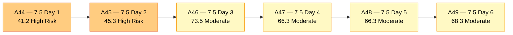
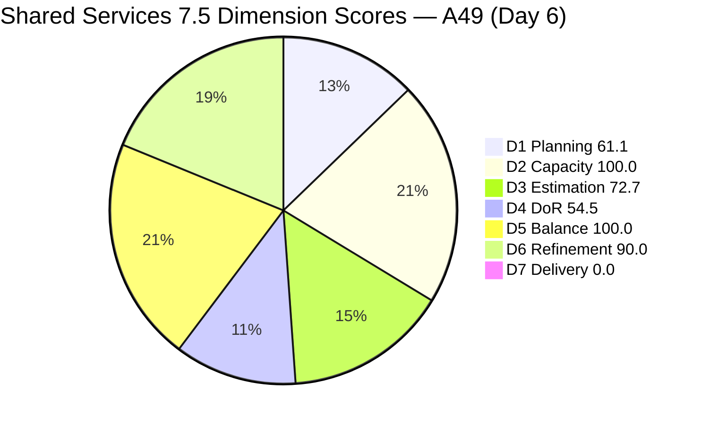
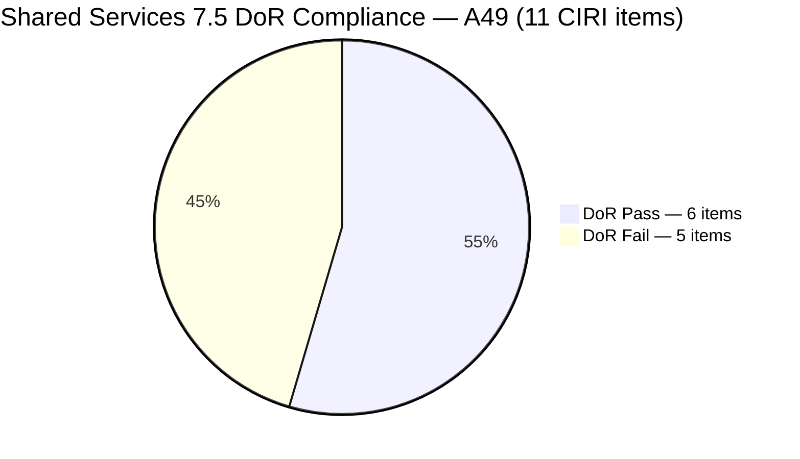
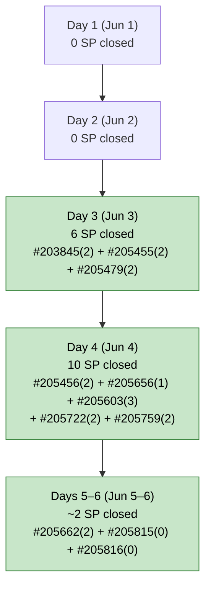
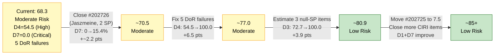

# ADO SAFe Audit — Shared Services Team

## 1. Audit Metadata

| Field | Value |
|---|---|
| **Audit Date** | 2026-06-06 CST |
| **Sprint Day** | **6 of 14** |
| **Prior Audit** | A48 — `AUDIT_20260605_0900.md` (Overall 66.3, Moderate Risk — 7.5 Day 5) |
| **ADO Project** | Jairosoft Portfolio (`666bb99a-6acd-4999-bb34-efd0e4ea90dc`) |
| **ADO Team** | Shared Services Team (`bd9578fd-5773-48fc-bd80-988dfe5de806`) |
| **Iteration** | Iteration 7.5 (`9c70d575-210a-4156-bbdc-79f1efbe2869`) |
| **Iteration Path** | `Jairosoft Portfolio\2026-PI7\Iteration 7.5` |
| **Iteration Dates** | Jun 1, 2026 – Jun 14, 2026 |
| **Workspace Folder** | `ado_shared` |
| **Overall Score** | **68.3 — Moderate Risk** |
| **Risk Band** | Moderate (60–79.9) |
| **Visible Backlog Items (VRBI)** | 18 open root items |
| **Current Iteration Root Items (CIRI)** | 11 items (IterationPath = Iteration 7.5, open in backlog) |
| **Capacity** | Teofilo: 6h/day · Vicsante: 6h/day · Jaszmeine: 3h/day · Ramon: 0.5h/day = **15.5h/day total** |
| **Project Exception** | Board URL uses `/Stories` — backlog category `Microsoft.RequirementCategory` confirmed |

---

## 2. Executive Summary

The Shared Services Team scores **68.3 — Moderate Risk** on Day 6 of Iteration 7.5, an improvement of **+2.0 points** from A48 (66.3). This is the first score improvement in three audits and reflects positive delivery activity between Day 5 and Day 6.

**Positive developments since A48 (Jun 5):**
- **Three items exited the backlog** — #205662 (Mikrotik VPN Setup, Enabler, 2 SP), #205815 (Create registrar@jit.edu.ph Group Email, Enabler, no SP), and #205816 (Jit Access for Fernandez, Enabler, no SP) are no longer visible in the live backlog. This indicates Teofilo closed all three items, continuing his strong sprint delivery cadence. VRBI dropped from 21 → 18 and CIRI from 14 → 11.
- **#205662 closure** is particularly significant: this was the item recommended as the single fastest D7 improvement in A48. Its exit confirms the recommendation was acted upon.
- **CIRI contraction (14 → 11)** reduces the DoR failure load: of the 8 failures in A48, two with no content (#205815, #205816) have now exited, leaving 5 active DoR failures from 11 CIRI items.

**Persistent concerns:**
- **D4 = 54.5 — still High Risk.** Five of 11 CIRI items fail DoR: #204205, #205123, #205210, #205211, and #205474. Four of these (#204205, #205123, #205210, #205211) have been failing for **7+ consecutive days** (since May 29). No remediation occurred between A48 and A49.
- **D7 = 0.0 — Active Stall (Day 6).** The early-sprint annotation window expired. Three items likely closed (#205662, #205815, #205816), but they exited the backlog scope before being credited. None of the 11 remaining CIRI items are in Closed/Done state. The rubric records 0 SP against 13 SP committed.
- **D3 = 72.7.** Three CIRI items remain unestimated (#205123, #205210, #205211) — the same three that have been unestimated since Day 1.
- **D1 = 61.1.** CIRI/VRBI deteriorated from 14/21 = 66.7% to 11/18 = 61.1% because VRBI shrank by 3 (closures) while CIRI shrank by 3 (same closures) — but the ratio moved unfavorably as the non-CIRI items remain constant at 7.

**The path to Low Risk (≥ 80.0)** requires simultaneous action on D4 (DoR), D3 (estimation), and D7 (closures). Completing all three would push Overall to approximately 83–86.

---

## 3. Previous Audit Delta (A48 → A49)

| Dimension | A48 Score (7.5 Day 5) | A49 Score (7.5 Day 6) | Delta | Driver |
|---|---|---|---|---|
| D1 Iteration Planning | 66.7 | **61.1** | **−5.6** | VRBI 21→18 and CIRI 14→11; ratio 14/21=66.7% → 11/18=61.1%; three closures exited both counts equally but denominator effect unfavorable |
| D2 Team Capacity | 100.0 | **100.0** | 0.0 | All 4 contributors still capacity-configured; unchanged |
| D3 Estimation | 64.3 | **72.7** | **+8.4** | PECI 14→11; ECI 9→8 (one estimated item exited #205662); remaining 3 null-SP items unchanged; D3 = 8/11 |
| D4 DoR Compliance | 42.9 | **54.5** | **+11.6** | CIRI 14→11; DCI 6→6 (two DoR-compliant items exited: #205662→pass→wait, #205815/#205816→fail); net: same 6 passes in smaller CIRI |
| D5 Work Item Balance | 100.0 | **100.0** | 0.0 | No penalty thresholds breached; type distribution balanced across 5 types |
| D6 Backlog Refinement | 90.0 | **90.0** | 0.0 | Untouched CIRI still 3/11 = 27.3% → −10 penalty; same three items untouched since May 29 |
| D7 Delivery Predictability | 0.0 | **0.0** | 0.0 | Evidence gap continues: #205662+#205815+#205816 exited backlog API. Live CIRI = 11 open items, 0 Closed/Done. **Day 6 — active stall, no annotation.** |
| **OVERALL** | **66.3** | **68.3** | **+2.0** | D3 and D4 improve due to CIRI shrinkage (bad DoR items exited); D1 slips as ratio shifts |

**Formula verification:** (61.1 + 100.0 + 72.7 + 54.5 + 100.0 + 90.0 + 0.0) / 7 = 478.3 / 7 = **68.3**

**Key transition observations A48 → A49:**
- **#205662** (Mikrotik VPN Setup, Enabler, 2 SP) exited the backlog — confirmed closure. Was in "Passed UAT Testing" state in A48. Teofilo acted on the A48 R2 recommendation. This was a DoR-fail item (Desc 27 NWS), so its exit improved D4 by removing a failure, but also removed an estimated pass from ECI.
- **#205815** (Create registrar@jit.edu.ph Group Email, Enabler, no SP) and **#205816** (Jit Access for Fernandez, Enabler, no SP) also exited — both were in Grooming state with no Desc/AC. Their closure removes 2 DoR failures and 2 PECI-zero items from the denominators, improving D3 and D4 ratios.
- **#205123, #205210, #205211, #204205, #205474** — zero change from A48. All five DoR failures persist for 7+ days (since May 29 for the first four) without any remediation.
- **Jaszmeine's items** (#202726, #202727, #205195, #205198) remain unchanged with no closures. #202726 (Active since Day 2, 2 SP) has been in Active state for 5 days without progression.
- **Teofilo** continues to be the sole contributor of sprint closures (now 11 items since sprint start, spanning 3 consecutive delivery days).

**D4 reconciliation note:** In A48, DCI = 6 from 14 CIRI. Today CIRI = 11. Items that exited: #205662 (DoR fail due to Desc shortfall), #205815 (DoR fail, no content), #205816 (DoR fail, no content). All three exits were DoR failures. DCI stays at 6 because no new DoR passes entered and no existing passes exited. Pass items remaining: #204238, #202726, #202727, #205195, #205198, #205778. D4 = 6/11 = 54.5.

---

## 4. Current Iteration Snapshot

| Metric | Value |
|---|---|
| **Visible Backlog Items (VRBI)** | 18 |
| **Current Iteration Root Items (CIRI)** | 11 (IterationPath = Iteration 7.5, open in backlog API) |
| **Story Points Committed (CSP)** | 13 SP (8 estimated items) |
| **Story Points Closed (CLSP)** | 0 SP (live CIRI; all closed items exited backlog API) |
| **Sprint Day / Total** | 6 / 14 |
| **Team Size (distinct CIRI assignees)** | 4 (Teofilo, Vicsante, Jaszmeine, Ramon) |
| **Total Capacity** | 15.5h/day × 14 days = 217 hours |
| **Iteration Start / Finish** | Jun 1, 2026 – Jun 14, 2026 |

**Confirmed/likely closed items this sprint (exited backlog — cumulative since sprint start):**
Days 3–6 closures: #203845(2SP), #205455(2SP), #205479(2SP), #205456(2SP), #205656(1SP), #205603(3SP), #205722(2SP), #205759(2SP), #205662(2SP), #205815(0SP), #205816(0SP) = **~18 SP delivered** (Teofilo: sole contributor, 11 items).

---

## 5. Work Item Analysis

### Current Iteration Items (11 items — IterationPath = Iteration 7.5, open)

| ID | Title | Type | State | SP | Assignee | DoR | ChangedDate |
|---|---|---|---|---|---|---|---|
| #202726 | Booking & Payment Management | Design | Active | 2 | Jaszmeine | **Pass** | Jun 2 |
| #202727 | Contract Management | Design | Ready for Design | 3 | Jaszmeine | **Pass** | Jun 2 |
| #204205 | Android Phone from US | Enabler | New | 1 | Teofilo | **Fail** (no Desc/AC) | May 29 |
| #204238 | Use FinOps Board | User Story | Ready for Dev | 1 | Ramon | **Pass** | Jun 2 |
| #205123 | Installing Jodex Plugin in Antigravity | Spike | Active | — | Vicsante | **Fail** (no Desc/AC) | May 29 |
| #205195 | [Retro] Alternative to Figma | Spike | Active | 1 | Jaszmeine | **Pass** | Jun 4 |
| #205198 | [Retro] Design Deliverables on track | Spike | Active | 1 | Jaszmeine | **Pass** | Jun 4 |
| #205210 | Install and Setup Antigravity | User Story | Active | — | Vicsante | **Fail** (AC "4 persons", 8 NWS < 20) | Jun 2 |
| #205211 | Create Product Repository for Jodex | Enabler | New | — | Ramon | **Fail** (no Desc/AC) | May 29 |
| #205474 | Up Sonicwall VPN | Enabler | New | 2 | Teofilo | **Fail** (no Desc/AC) | Jun 5 |
| #205778 | Action 2: Setup Frontend CI Gates | Defect | New | 2 | Teofilo | **Pass** | Jun 5 |

*SP "—" = null (unestimated). All ChangedDate values as of last ADO update.*

### Items Exited Backlog Since A48 (Likely Closed — Day 5–6)

| ID | Title | Type | SP | Last State | Last Changed |
|---|---|---|---|---|---|
| #205662 | Mikrotik VPN Setup | Enabler | 2 | Passed UAT Testing | Jun 4 |
| #205815 | Create registrar@jit.edu.ph Group Email | Enabler | — | Grooming | Jun 5 |
| #205816 | Jit Access for Fernandez | Enabler | — | Grooming | Jun 5 |

*All three were recommended for closure in A48. Teofilo acted on the recommendation. Combined exit: 3 items, ~2 SP estimated only from #205662. D7 per rubric = 0 as none were in CIRI at time of scoring.*

### Non-CIRI Backlog Items (7 items — various past/future iterations)

| ID | Title | Iter | Type | State | Assignee | Changed |
|---|---|---|---|---|---|---|
| #196454 | Colina Intake/Output Tab | PI8 | Design | New | Jaszmeine | Jun 3 |
| #197981 | Colina - Task Feature Enhancement | PI8 | Design | New | Jaszmeine | Jun 3 |
| #202066 | Provide Installation Guide | PI8 | User Story | Estimation | Ramon | May 8 |
| #202725 | Messaging & Communication | 7.4 | Design | Design Review | Jaszmeine | Jun 2 |
| #202947 | IT Support Services Feedback Survey | 7.6 IP | Spike | New | Teofilo | May 19 |
| #203309 | GitHub Token Defect | 7.4 | Defect | Ready for QA | Ramon | May 19 |
| #204950 | Monthly Costing — July 2026 | 7.6 IP | Enabler | New | Teofilo | Jun 3 |

**Scope leakage note:** #202725 (Messaging & Communication, Design Review) remains in IterationPath 7.4 while Jaszmeine is actively working on it. This is the fourth consecutive audit where this item has been flagged — Jaszmeine is accumulating hidden sprint load in an out-of-sprint IterationPath.

### DoR Assessment — All 11 CIRI Items

| ID | Title | Desc ≥ 30 NWS | AC ≥ 20 NWS | Result |
|---|---|---|---|---|
| #202726 | Booking & Payment Management | ✓ (~70 NWS) | ✓ (long multi-AC) | **Pass** |
| #202727 | Contract Management | ✓ (~65 NWS) | ✓ (long multi-AC) | **Pass** |
| #204205 | Android Phone from US | ✗ null | ✗ null | **Fail — 7th day** |
| #204238 | Use FinOps Board | ✓ (~74 NWS) | ✓ (~85 NWS) | **Pass** |
| #205123 | Installing Jodex Plugin in Antigravity | ✗ null | ✗ null | **Fail — 8th day** |
| #205195 | [Retro] Alternative to Figma | ✓ (~70 NWS) | ✓ (~58 NWS) | **Pass** |
| #205198 | [Retro] Design Deliverables on track | ✓ (~55 NWS) | ✓ (references tickets) | **Pass** |
| #205210 | Install and Setup Antigravity | ✓ (~37 NWS) | ✗ "4 persons" (8 NWS < 20) | **Fail — 4th day** |
| #205211 | Create Product Repository for Jodex | ✗ null | ✗ null | **Fail — 8th day** |
| #205474 | Up Sonicwall VPN | ✗ null | ✗ null | **Fail — 5th day** |
| #205778 | Action 2: Setup Frontend CI Gates | ✓ (long) | ✓ | **Pass** |

Pass: 6. Fail: 5 (#204205, #205123, #205210, #205211, #205474).

*Day count for each Fail item = number of sprint days the item has been in CIRI without AC remediation.*

### Type Distribution (11 CIRI items)

| Type | Count | Share |
|---|---|---|
| Design | 2 | 18.2% |
| User Story | 2 | 18.2% |
| Enabler | 3 | 27.3% |
| Spike | 3 | 27.3% |
| Defect | 1 | 9.1% |
| **Total** | **11** | **100%** |

*Well-diversified distribution. No penalty thresholds breached.*

### Assignee Workload — Day 6

| Assignee | CIRI Items | SP Committed | Confirmed Sprint Closures | DoR Fails |
|---|---|---|---|---|
| Teofilo | 3 (#204205, #205474, #205778) | 5 SP (1+2+2) | 11 items / ~18 SP (all sprint closures) | #204205, #205474 |
| Jaszmeine | 4 (#202726, #202727, #205195, #205198) | 7 SP (2+3+1+1) | 0 SP live | None |
| Ramon | 2 (#204238, #205211) | 1 SP (#204238) | 0 SP | #205211 |
| Vicsante | 2 (#205123, #205210) | 0 SP (both null) | 0 SP | #205123, #205210 |

**Structural imbalance:** Teofilo has delivered 100% of sprint closures across 11 items through Day 6. Jaszmeine, Vicsante, and Ramon have zero confirmed closures. With 8 days remaining, the sprint's ability to hit D7 > 0.0 depends almost entirely on Jaszmeine's two design items (#202726, #202727) and Teofilo's remaining live items.

---

## 6. SAFe Compliance Scorecard

| Dimension | Score | Band | Evidence | Notes |
|---|---|---|---|---|
| D1 Iteration Planning | **61.1** | Moderate | 11 CIRI / 18 VRBI | −5.6 from A48. Three closures reduced both CIRI (14→11) and VRBI (21→18) by 3, but the ratio shifted from 66.7% to 61.1%. |
| D2 Team Capacity | **100.0** | Low | 4/4 contributors with capacity | Teofilo 6h + Vicsante 6h + Jaszmeine 3h + Ramon 0.5h = 15.5h/day. Unchanged. |
| D3 Estimation | **72.7** | Moderate | 8 ECI / 11 PECI | **+8.4 from A48.** PECI 14→11; 3 unestimated remain (#205123, #205210, #205211). D3 = 8/11. |
| D4 DoR Compliance | **54.5** | High | 6 DCI / 11 CIRI | **+11.6 from A48.** CIRI 14→11; DCI stays 6. All 3 exits were DoR failures; no new passes. 5 failures remain. |
| D5 Work Item Balance | **100.0** | Low | Dominant=Enabler/Spike 27.3%, no penalties | Type distribution balanced across 5 types. No penalty thresholds breached. |
| D6 Backlog Refinement | **90.0** | Low | 18/18 fresh; untouched 3/11 = 27.3% → −10 | Same 3 untouched items as A48: #204205, #205123, #205211 (all May 29). |
| D7 Delivery Predictability | **0.0** | Critical | 0 SP closed (live CIRI) / 13 SP committed | **Day 6 — active stall, annotation window expired.** ~18 SP confirmed closed sprint-to-date (all exited backlog). |
| **OVERALL** | **68.3** | **Moderate** | (61.1+100.0+72.7+54.5+100.0+90.0+0.0)/7 | +2.0 from A48. Improvement driven by CIRI shrinkage reducing DoR/Estimation failure ratios. |

**Formula verification:** (61.1 + 100.0 + 72.7 + 54.5 + 100.0 + 90.0 + 0.0) / 7 = 478.3 / 7 = **68.3**

---

## 7. Dimension Findings

### D1 — Iteration Planning: 61.1 / 100 — Moderate Risk

**Formula:** CIRI / VRBI × 100 = 11 / 18 × 100 = **61.1**

| Metric | Value |
|---|---|
| Visible root backlog items (VRBI) | 18 |
| Items in Iteration 7.5 (CIRI) | 11 |
| Non-CIRI items | 7 (PI8 × 3, 7.4 × 2, 7.6 IP × 2) |
| Score | **61.1** |

D1 fell from 66.7 to 61.1. This is a mathematical artifact of closures: three items exited both CIRI and VRBI simultaneously, but the ratio shifted because the seven non-CIRI items remain unchanged. Each time Teofilo closes a CIRI item, D1 decreases unless either (a) a new item enters CIRI, or (b) a non-CIRI item moves to 7.5.

The four non-CIRI items that could most readily enter CIRI: #202725 (Jaszmeine's Messaging & Communication — actively being worked in 7.4), and #202947 (IT Feedback Survey, 7.6 IP — already planned). Moving #202725 to 7.5 would raise CIRI to 12, D1 to 12/18 = 66.7%.

---

### D2 — Team Capacity: 100.0 / 100 — Low Risk

**Formula:** CC / CW × 100 = 4 / 4 × 100 = **100.0**

| Contributor | CIRI Items | Capacity | Activity |
|---|---|---|---|
| Teofilo Limpag | 3 items | 6h/day | Development |
| Vicsante Aseniero | 2 items | 6h/day | Development |
| Jaszmeine Villanueva | 4 items | 3h/day | Design |
| Ramon Aseniero Jr | 2 items | 0.5h/day | Requirements |

All four contributors remain capacity-configured. Teofilo's live CIRI load has decreased to 3 items as his previous work closed — however, his historical delivery rate (11 items in 6 days) creates an expectation gap with the remaining team: Jaszmeine, Vicsante, and Ramon have zero confirmed closures through Day 6.

---

### D3 — Estimation: 72.7 / 100 — Moderate Risk

**Formula:** ECI / PECI × 100 = 8 / 11 × 100 = **72.7**

| ID | Title | Type | SP | Estimated |
|---|---|---|---|---|
| #202726 | Booking & Payment Management | Design | 2 | Yes |
| #202727 | Contract Management | Design | 3 | Yes |
| #204205 | Android Phone from US | Enabler | 1 | Yes |
| #204238 | Use FinOps Board | User Story | 1 | Yes |
| #205123 | Installing Jodex Plugin | Spike | — | **No — Day 8** |
| #205195 | [Retro] Alternative to Figma | Spike | 1 | Yes |
| #205198 | [Retro] Design Deliverables on track | Spike | 1 | Yes |
| #205210 | Install and Setup Antigravity | User Story | — | **No — Day 6** |
| #205211 | Create Product Repository for Jodex | Enabler | — | **No — Day 8** |
| #205474 | Up Sonicwall VPN | Enabler | 2 | Yes |
| #205778 | Action 2: Setup Frontend CI Gates | Defect | 2 | Yes |

D3 improved significantly (+8.4) because #205662 (#scored as estimated), #205815, and #205816 exited — the two grooming-state items (#205815, #205816) had no SP and were in PECI but not ECI, so their exit reduced PECI faster than ECI. The three remaining unestimated items (#205123, #205210, #205211) have been in the sprint since Day 1 without SP assignment. Estimating all three (1 SP each) would bring ECI to 11, D3 to 100.0, and CSP from 13 to ~16 SP.

---

### D4 — DoR Compliance: 54.5 / 100 — High Risk

**Formula:** DCI / CIRI × 100 = 6 / 11 × 100 = **54.5**

Five of 11 CIRI items fail DoR. The failures fall into three categories:

**Category A — Carry-over failures, 7–8 consecutive days unresolved (since May 29):**
- **#204205** (Teofilo, New, 1 SP): null Description, null AC. In sprint since Day 1. No remediation across 6 consecutive audit cycles.
- **#205123** (Vicsante, Active): null Description, null AC. Work is being executed against an undefined scope. Eighth consecutive day of failure.
- **#205211** (Ramon, New): null Description, null AC. Eighth consecutive day. No SP either.

**Category B — Active but AC insufficient:**
- **#205210** (Vicsante, Active, no SP): Description passes (37 NWS — lists 4 back-office users). AC = "4 persons" (8 NWS — fails ≥20 threshold). Only one additional sentence of acceptance criteria needed: "Installation verified for Grace, Sam, Armelita, and Kleer by confirming successful login and basic record creation in Antigravity Client."

**Category C — New item added without DoR content (Day 5):**
- **#205474** (Teofilo, New, 2 SP): null Description, null AC. Added to sprint on Jun 5 without any DoR content. Day 5 of non-compliance.

Remediating all five failures would raise D4 to 11/11 = 100.0 and add approximately 6.5 points to Overall (68.3 → ~74.8). Combined with D7 improvement, crossing Low Risk is achievable.

---

### D5 — Work Item Balance: 100.0 / 100 — Low Risk

**Formula:** Base 100 − penalties applied independently

| Penalty | Trigger | Applied |
|---|---|---|
| −40: No User Story in CIRI | 2 User Stories present (#204238, #205210) | **No** |
| −30: Dominant type share > 60% | Enabler = 3/11 = 27.3% — not > 60% | **No** |
| −20: Spike share > 40% | Spike = 3/11 = 27.3% — not > 40% | **No** |

**Score:** 100 − 0 = **100.0**

The type distribution across 5 types (Design, User Story, Enabler, Spike, Defect) is well-balanced. No type approaches the penalty threshold. D5 has been 100.0 for the entire Iteration 7.5 audit cycle.

---

### D6 — Backlog Refinement: 90.0 / 100 — Low Risk

**Freshness window:** ChangedDate ≥ 2026-04-22 (45 days before 2026-06-06)

| Metric | Value |
|---|---|
| Total VRBI | 18 |
| Fresh items (ChangedDate ≥ Apr 22, 2026) | 18 — oldest: #202066 (May 8) |
| Stale_90 items (ChangedDate < Mar 8, 2026) | 0 |
| Stale_180 items (ChangedDate < Dec 9, 2025) | 0 |
| Untouched CIRI (ChangedDate < Jun 1, 2026) | 3 — #204205 (May 29), #205123 (May 29), #205211 (May 29) |
| Untouched / CIRI | 3/11 = 27.3% → > 10%, ≤ 30% → **−10 penalty** |

**Penalty calculation:**
- stale_90: 0% → no penalty
- stale_180: 0 items → no penalty
- untouched: 3/11 = 27.3% → −10

**Score:** max(0, 100.0 − 10) = **90.0**

The same three untouched items (#204205, #205123, #205211 — all May 29) persist for the sixth consecutive audit. These items share the characteristic of being completely undefined (no Desc, no AC). If any two of the three receive DoR content (which would update their ChangedDate), untouched drops to 1/11 = 9.1% → below 10% threshold → penalty eliminated. D6 rises to 100.0. The DoR remediation actions (R1) would simultaneously fix D4 and D6.

---

### D7 — Delivery Predictability: 0.0 / 100 — Critical

**Formula:** CLSP / CSP × 100 = 0 / 13 × 100 = **0.0**

> **Active stall (Day 6 of 14):** The early-sprint annotation window (Days 1–5) expired yesterday. D7 = 0.0 is now classified as an active execution stall with no grace-period qualification.

| Metric | Value |
|---|---|
| Estimated current items (ECI) | 8 |
| Committed Story Points (CSP) | 13 SP |
| Closed Story Points (CLSP) | 0 SP (no CIRI items in Closed/Done state) |
| Confirmed closed sprint-to-date (exited backlog) | ~11 items, ~18 SP (Teofilo) |
| Nearest closure candidate | #202726 (Jaszmeine, Active, 2 SP) — in Active since Day 2 |
| Score | **0.0** |

**Evidence note:** D7 = 0.0 does not reflect the team's actual delivery rate. The live backlog-based formula cannot capture Teofilo's 11 closed items. Contextually, the sprint has delivered approximately 18 SP against an estimated total of ~31 SP (13 live + 18 closed) = ~58% effective delivery rate. The D7 gap is a structural limitation of the rubric, not a delivery failure signal for Teofilo's work.

However, Jaszmeine, Vicsante, and Ramon have confirmed zero closures through Day 6. For these three contributors, D7 = 0.0 is accurate — no items under their ownership have closed.

**Immediate opportunity:** #202726 (Booking & Payment Management, Jaszmeine, Active, 2 SP) has been in Active state since Day 2 with full DoR compliance. Closing it today or tomorrow would add 2 SP to live CLSP, moving D7 from 0.0 to 2/13 = 15.4% and Overall from 68.3 to approximately 70.5.

---

## 8. Risks and Bottlenecks

| # | Severity | Dimension | Risk | Recommended Action |
|---|---|---|---|---|
| R1 | **CRITICAL** | D4 | 5 of 11 CIRI items fail DoR (54.5, High Risk). Four items (#204205, #205123, #205211, #205210) have been unresolved for 7–8 consecutive sprint days. #205474 added on Day 5 still has no content. D4 = 54.5 is the primary score suppressor — fixing all 5 failures adds ~6.5 pts to Overall alone. | Teofilo: add Desc+AC to #204205 ("Receiving Android phone from US for Jairosoft mobile testing. AC: Phone received, IMEI recorded, enrolled in MDM, confirmed accessible for testing.") and #205474 ("Upgrade SonicWall VPN firmware and validate connectivity. AC: SonicWall VPN firmware updated; all VPN tunnels reconnected and verified."). Vicsante: add Desc+AC+SP to #205123 (stop executing without scope). Ramon: add Desc+AC+SP to #205211; expand #205210 AC from "4 persons" to "Grace, Sam, Armelita, and Kleer — each confirmed able to log in and create a test record in Antigravity." |
| R2 | **CRITICAL** | D7 | Day 6 with 0 SP credited from live CIRI. Jaszmeine has been Active on #202726 (Booking & Payment Management, 2 SP) since Day 2 — 4 full days without closure. This item is DoR-compliant and 2 SP, representing the fastest available live D7 improvement. | Jaszmeine: complete and close #202726 today (Day 6). Closing 1 item lifts D7 from 0.0 to 15.4% and Overall from 68.3 to ~70.5. Then target #202727 (Contract Management, 3 SP, Ready for Design) for Day 7–8. |
| R3 | **HIGH** | D4 + delivery | #205123 (Vicsante, Active) is being executed with zero description or acceptance criteria. Work is proceeding against an undefined scope for 8 consecutive days. Even if the item closes, there is no objective basis to verify completion. | Vicsante: stop and define #205123 before continuing. Add description: "Install Jodex plugin in Antigravity Client environment." AC: "Jodex plugin installed; verified by creating a test record and reading it back successfully; no errors in system logs." SP = 2. Then resume execution. |
| R4 | **HIGH** | D3 | Three CIRI items remain unestimated since Day 1: #205123, #205210, #205211. Vicsante has 0 SP committed (both items unestimated), making his contribution invisible in all SP-based metrics. | Estimate all three today: #205123 (2 SP), #205210 (1 SP), #205211 (1 SP). D3 rises from 72.7 to 100.0 and CSP grows from 13 to ~17 SP. |
| R5 | **HIGH** | Structural | Jaszmeine, Vicsante, and Ramon have zero confirmed closures through Day 6. Teofilo accounts for 100% of sprint delivery (11 items, ~18 SP). If Teofilo encounters blockers (external dependencies, vacation, incident response), the sprint has no backup delivery capacity. | Ramon: hold check-ins with Jaszmeine and Vicsante today. Jaszmeine: #202726 is ready to close — clear any review blockers. Vicsante: after defining #205123, target closure within 2 days. Ramon: move #205211 from New to Active after adding DoR content, targeting closure by Day 8. |
| R6 | **MEDIUM** | D6 | Three untouched items (#204205, #205123, #205211 — May 29) generate the −10 D6 penalty for the sixth consecutive audit. Touching any two by adding DoR content would drop untouched to 1/11 = 9.1% → below 10% threshold → D6 rises from 90.0 to 100.0. | The R1 actions (adding Desc/AC/SP to these three items) simultaneously resolve the D6 penalty. No additional work needed — R1 completion automatically fixes D6. |
| R7 | **MEDIUM** | D1 | Scope leakage: #202725 (Messaging & Communication, Jaszmeine, Design Review, IterationPath = 7.4) is actively being worked but excluded from CIRI. This is the fourth consecutive audit where this item appears. Jaszmeine's real sprint workload is 5 items (4 CIRI + 1 out-of-sprint). | Jaszmeine: move #202725 to IterationPath = Iteration 7.5. This adds 3 SP to CSP (13→16), raises CIRI to 12, and corrects D1 to 12/18 = 66.7%. |
| R8 | **LOW** | D1 | At the current closure rate (Teofilo closing 2–3 items/day), CIRI will continue to shrink without a replacement inflow. If CIRI falls below 10 items while VRBI stays at 14+ (non-CIRI items stable), D1 could cross below 60% (High Risk). | Add any new sprint work as CIRI items (IterationPath = Iteration 7.5). Prioritize moving planned items from 7.6 IP (like #202947) to 7.5 if appropriate. |

---

## 9. Prioritized Recommendations

1. **[CRITICAL — Today Day 6]** Jaszmeine: close #202726 (Booking & Payment Management, Active, 2 SP). This is DoR-compliant and has been in Active for 4 days. Closing it is the fastest live D7 improvement available: D7 rises to 2/13 = 15.4%, Overall from 68.3 to ~70.5. Then advance #202727 (Contract Management, Ready for Design, 3 SP) to Active today.

2. **[CRITICAL — Today Day 6]** Vicsante: add Description + AC + SP (2 SP) to #205123 (Installing Jodex Plugin) before continuing execution. Eight days of active work against undefined scope creates quality risk. After defining, resume and target closure by Day 8. Also expand #205210 AC from "4 persons" to a sentence specifying each user and verification criteria.

3. **[HIGH — Today Day 6]** Ramon: add Description + AC + SP (1 SP) to #205211 (Create Product Repository for Jodex). Item has been in the sprint since Day 1 as New with no content. Then execute it — creating a GitHub repo takes less than 30 minutes and represents a clean, quick closure.

4. **[HIGH — Today Day 6]** Teofilo: add Description and AC to #204205 (Android Phone from US) and #205474 (Up Sonicwall VPN). Both are Enablers in "New" state. Content can be brief but must meet the 30/20 NWS thresholds. Then target #205778 (Setup Frontend CI Gates, New, 2 SP) for execution — it already has full DoR content and is ready to execute.

5. **[HIGH — Days 6–8]** All contributors: actions R1–R4 together would lift D3 from 72.7 → 100.0, D4 from 54.5 → 100.0, and D6 from 90.0 → 100.0, adding ~15.1 points to Overall. With D7 improvement from R2 included (~+2.4 pts), combined impact: Overall 68.3 → ~85.8 (Low Risk).

6. **[MEDIUM — Today Day 6]** Jaszmeine: move #202725 (Messaging & Communication, 7.4) to IterationPath = Iteration 7.5. This is the fourth consecutive audit flagging this scope leakage. One field update on the work item corrects D1 and makes Jaszmeine's full workload visible.

7. **[STANDING]** No new CIRI items should be added without Desc ≥ 30 NWS, AC ≥ 20 NWS, and a SP estimate. #205815 and #205816 were added on Day 5 without any DoR content and then Closed in the same day — this bypasses quality gates. Establish a personal gate before adding items to CIRI.

---

## 10. Visualizations

### Score Trend (A44 → A49)

### Dimension Scorecard — A49 (Day 6)

### DoR Status — 11 CIRI Items

### Sprint Delivery Activity — Confirmed Closures by Day (Teofilo)

### Remediation Impact Path — From Day 6

---

## 11. Evidence Gaps and Limitations

| Gap | Impact | Notes |
|---|---|---|
| **~11 closed items (~18 SP) not in live backlog API** | D7 = 0.0 (evidence gap, not delivery failure) | Confirmed closed sprint-to-date: #203845(2SP), #205455(2SP), #205479(2SP), #205456(2SP), #205656(1SP), #205603(3SP), #205722(2SP), #205759(2SP), #205662(2SP), #205815(0SP), #205816(0SP). Contextual delivery rate: ~18/(13+18) = ~58%. Teofilo is delivering strongly. |
| **D7 = 0.0 — active stall for non-Teofilo contributors** | D7 reflects partial truth | For Jaszmeine, Vicsante, and Ramon, D7 = 0.0 is accurate — none of their items have closed. Only Teofilo's delivery is masked by the API evidence gap. |
| **#205123 active execution without scope** | Quality risk | Vicsante is executing against a null-description, null-AC spike. Closure cannot be verified as meeting any standard. Both D3 and D4 fail for this item. |
| **5 items fail DoR** | D4 = 54.5 (definitive) | #204205 (null), #205123 (null), #205210 (AC 8 NWS), #205211 (null), #205474 (null). All failures confirmed from live ADO field data. |
| **3 items null SP** | D3 = 72.7 (definitive) | #205123, #205210, #205211 have no Story Points. CSP understated at 13 SP. |
| **#202725 in 7.4 IterationPath** | Excluded from CIRI | Jaszmeine's Design Review item (3 SP) not counted in D1/D7. Fourth consecutive audit flagging this. |
| **#205815 and #205816 closed without DoR content** | Quality process concern | Both items were added to CIRI on Day 5 without Desc or AC, then closed within the same day. This bypasses the DoR gate entirely. Flagged as a process risk even though scores benefit from their exit. |

---

## 12. Audit Trail

| Source | Tool | Data |
|---|---|---|
| Current iteration | `work_list_team_iterations` (project `666bb99a`, team `bd9578fd`, timeframe=current) | Iteration 7.5: Jun 1–14, 2026; ID `9c70d575-210a-4156-bbdc-79f1efbe2869` |
| Backlog items | `wit_list_backlog_work_items` (backlogId `Microsoft.RequirementCategory`) | 18 open root items (down from 21 — #205662, #205815, #205816 exited; 11 in Iter 7.5, 7 in other iterations) |
| Work item details | `wit_get_work_items_batch_by_ids` (18 backlog items) | SP, State, Type, Desc, AC, ChangedDate, IterationPath confirmed for all 18 items |
| Team capacity | `work_get_team_capacity` (project `666bb99a`, team `bd9578fd`, iterationId `9c70d575`) | Teofilo 6h/day, Vicsante 6h/day, Jaszmeine 3h/day, Ramon 0.5h/day = 15.5h/day; 0 days off |
| Prior audit | `AUDIT_20260605_0900.md` (A48) | Overall 66.3, Moderate Risk, 7.5 Day 5, 21 VRBI, 14 CIRI, 15 SP committed, ~16 SP confirmed closed (Days 3–4) |
