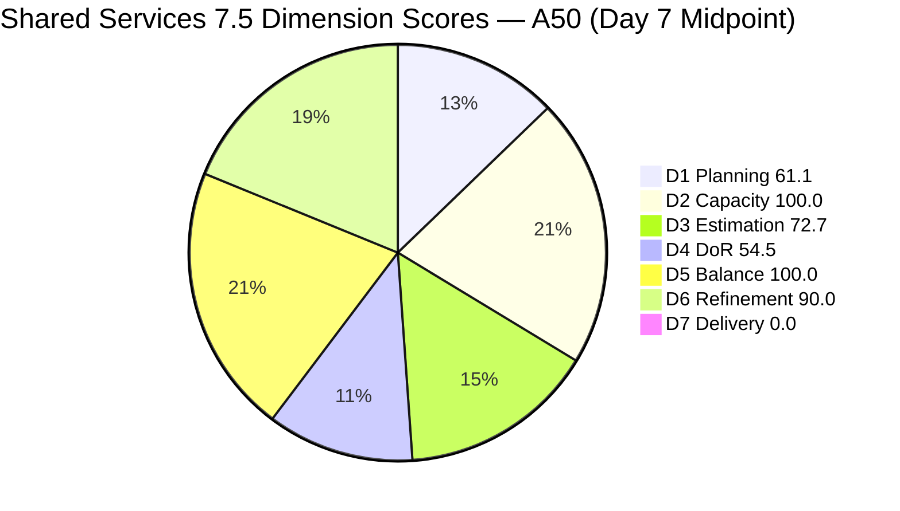
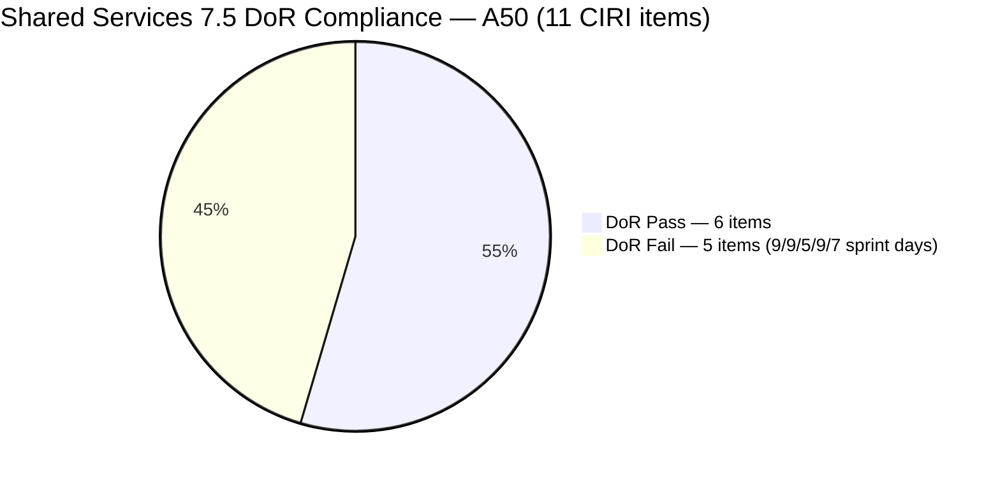
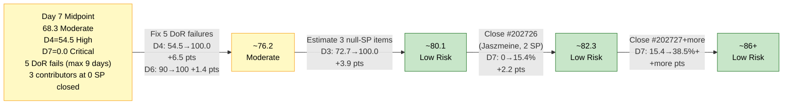
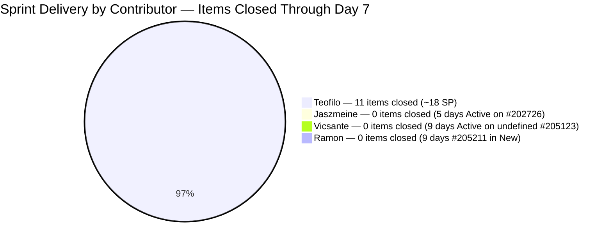

# ADO SAFe Audit — Shared Services Team

## 1. Audit Metadata

| Field | Value |
|---|---|
| **Audit Date** | 2026-06-07 CST |
| **Sprint Day** | **7 of 14** |
| **Prior Audit** | A49 — `AUDIT_20260606_0900.md` (Overall 68.3, Moderate Risk — 7.5 Day 6) |
| **ADO Project** | Jairosoft Portfolio (`666bb99a-6acd-4999-bb34-efd0e4ea90dc`) |
| **ADO Team** | Shared Services Team (`bd9578fd-5773-48fc-bd80-988dfe5de806`) |
| **Iteration** | Iteration 7.5 (`9c70d575-210a-4156-bbdc-79f1efbe2869`) |
| **Iteration Path** | `Jairosoft Portfolio\2026-PI7\Iteration 7.5` |
| **Iteration Dates** | Jun 1, 2026 – Jun 14, 2026 |
| **Workspace Folder** | `ado_shared` |
| **Overall Score** | **68.3 — Moderate Risk** |
| **Risk Band** | Moderate (60–79.9) |
| **Visible Backlog Items (VRBI)** | 18 open root items |
| **Current Iteration Root Items (CIRI)** | 11 items (IterationPath = Iteration 7.5, open in backlog) |
| **Capacity** | Teofilo: 6h/day · Vicsante: 6h/day · Jaszmeine: 3h/day · Ramon: 0.5h/day = **15.5h/day total** |
| **Project Exception** | Board URL uses `/Stories` — backlog category `Microsoft.RequirementCategory` confirmed |

---

## 2. Executive Summary

The Shared Services Team holds at **68.3 — Moderate Risk** on Day 7 of Iteration 7.5, **unchanged from A49 (Day 6)**. No ADO work item changes occurred between the close of A49 and this audit — no new closures, no state transitions, no DoR remediation on any of the five failing items, and no new CIRI entries. The score plateau is the most critical development: the team is at the sprint midpoint with zero live CIRI closures and five persistent DoR failures.

Key findings:

- **No change across all 18 VRBI items since yesterday.** The five DoR-failing CIRI items (#204205, #205123, #205210, #205211, #205474) all show the same ChangedDates as A49. No remediation occurred.
- **D4 = 54.5 remains High Risk (5/11 CIRI items fail DoR).** Three items (#204205, #205123, #205211) have been failing for 9 consecutive sprint days (since May 29). One item (#205210) has been failing for 5 days. One item (#205474) for 7 days. None have been touched since the A49 recommendations.
- **D7 = 0.0 — active stall for the third consecutive audit in the execution zone (Days 5–7).** Jaszmeine's #202726 (Booking & Payment Management, Active, 2 SP) has been Active since Day 2 — five full days without closure. This is the fastest available live D7 improvement.
- **#205123 (Vicsante, Active Spike) continues to execute without any description or AC** — now in its ninth day of undefined scope execution. This is a quality and audit integrity risk.
- **D3 = 72.7, D6 = 90.0 are also unchanged** — the three untouched CIRI items (#204205, #205123, #205211, all May 29) continue to drive the D6 −10 penalty and the D3 null-SP count.
- The path to Low Risk (≥ 80.0) requires simultaneous action on D4, D3, and D7. All three are achievable today.

---

## 3. Previous Audit Delta (A49 → A50)

| Dimension | A49 Score (7.5 Day 6) | A50 Score (7.5 Day 7) | Delta | Driver |
|---|---|---|---|---|
| D1 Iteration Planning | 61.1 | **61.1** | 0.0 | VRBI=18, CIRI=11 — no exits or entries |
| D2 Team Capacity | 100.0 | **100.0** | 0.0 | All 4 contributors capacity-configured; unchanged |
| D3 Estimation | 72.7 | **72.7** | 0.0 | #205123, #205210, #205211 still null SP — Day 9/5/9 respectively |
| D4 DoR Compliance | 54.5 | **54.5** | 0.0 | 5 DoR failures persist — no remediation in 24 hours |
| D5 Work Item Balance | 100.0 | **100.0** | 0.0 | Type distribution balanced; no penalty thresholds breached |
| D6 Backlog Refinement | 90.0 | **90.0** | 0.0 | 3 untouched CIRI items (#204205, #205123, #205211 — May 29) — −10 penalty unchanged |
| D7 Delivery Predictability | 0.0 | **0.0** | 0.0 | 0 SP closed in live CIRI; 13 SP committed. **Day 7 — sprint midpoint, active stall** |
| **Overall** | **68.3** | **68.3** | **0.0** | Complete score plateau — no ADO activity between A49 and A50 |

**Formula verification:** (61.1 + 100.0 + 72.7 + 54.5 + 100.0 + 90.0 + 0.0) / 7 = 478.3 / 7 = **68.3**

**Key transition observations A49 → A50:**
- **Zero ADO changes detected.** All 18 VRBI items show identical ChangedDate values to A49. No state transitions, no field updates, no new items.
- **#202726 (Jaszmeine, Active, 2 SP)** has been Active since Day 2 — now Day 7, five full days in Active without progressing to Closed. A49 explicitly recommended closure of this item as the highest-priority live D7 action. No action taken.
- **#204205 (Teofilo, New)** has not been updated since May 29 — 9 sprint days with null Desc and null AC. This item remains the oldest untouched CIRI item.
- **#205123 (Vicsante, Active)** continues in Active with null Desc and null AC for the ninth consecutive day. Active execution against undefined scope.
- **#205211 (Ramon, New)** has not been updated since May 29 — ninth consecutive day with no Desc, no AC, no SP.
- **#205474 (Teofilo, New)** last updated Jun 5 (SP added) — still null Desc, null AC for the seventh consecutive day.
- **#205210 (Vicsante, Active)** last changed Jun 2 — AC still "4 persons" (8 NWS < 20) for the fifth consecutive day.
- **Scope leakage:** #202725 (Messaging & Communication, Jaszmeine, IterationPath = 7.4, Design Review, 3 SP, ChangedDate Jun 2) remains in IterationPath 7.4 — fifth consecutive audit flagging this.

---

## 4. Current Iteration Snapshot

| Metric | Value |
|---|---|
| **Visible Backlog Items (VRBI)** | 18 |
| **Current Iteration Root Items (CIRI)** | 11 (IterationPath = Iteration 7.5, open in backlog API) |
| **Story Points Committed (CSP)** | 13 SP (8 estimated items) |
| **Story Points Closed (CLSP)** | 0 SP (live CIRI — no Closed/Done items) |
| **Sprint Day / Total** | **7 / 14** — midpoint |
| **Team Size (distinct CIRI assignees)** | 4 (Teofilo, Vicsante, Jaszmeine, Ramon) |
| **Total Capacity** | 15.5h/day × 14 days = 217 hours |
| **Remaining Capacity** | 15.5h/day × 7 days = 108.5 hours |
| **Iteration Start / Finish** | Jun 1, 2026 – Jun 14, 2026 |

**Confirmed/likely closed items this sprint (exited backlog — cumulative since sprint start, through Day 6):**
Days 3–6 closures: #203845(2SP), #205455(2SP), #205479(2SP), #205456(2SP), #205656(1SP), #205603(3SP), #205722(2SP), #205759(2SP), #205662(2SP), #205815(0SP), #205816(0SP) = **~18 SP delivered** (Teofilo: sole contributor, 11 items).

**Day 7 addition:** No new closures detected since A49.

---

## 5. Work Item Analysis

### Current Iteration Items (11 items — IterationPath = Iteration 7.5, open)

| ID | Title | Type | State | SP | Assignee | DoR | ChangedDate | Days Failing |
|---|---|---|---|---|---|---|---|---|
| #202726 | Booking & Payment Management | Design | Active | 2 | Jaszmeine | **Pass** | Jun 2 | — |
| #202727 | Contract Management | Design | Ready for Design | 3 | Jaszmeine | **Pass** | Jun 2 | — |
| #204205 | Android Phone from US | Enabler | New | 1 | Teofilo | **Fail** (null Desc/AC) | May 29 | **Day 9** |
| #204238 | Use FinOps Board | User Story | Ready for Dev | 1 | Ramon | **Pass** | Jun 2 | — |
| #205123 | Installing Jodex Plugin in Antigravity | Spike | Active | — | Vicsante | **Fail** (null Desc/AC) | May 29 | **Day 9** |
| #205195 | [Retro] Alternative to Figma | Spike | Active | 1 | Jaszmeine | **Pass** | Jun 4 | — |
| #205198 | [Retro] Design Deliverables on track | Spike | Active | 1 | Jaszmeine | **Pass** | Jun 4 | — |
| #205210 | Install and Setup Antigravity | User Story | Active | — | Vicsante | **Fail** (AC "4 persons" — 8 NWS) | Jun 2 | **Day 5** |
| #205211 | Create Product Repository for Jodex | Enabler | New | — | Ramon | **Fail** (null Desc/AC) | May 29 | **Day 9** |
| #205474 | Up Sonicwall VPN | Enabler | New | 2 | Teofilo | **Fail** (null Desc/AC) | Jun 5 | **Day 7** |
| #205778 | Action 2: Setup Frontend CI Gates | Defect | New | 2 | Teofilo | **Pass** | Jun 5 | — |

*SP "—" = null (unestimated).*

### Non-CIRI Backlog Items (7 items — various iterations)

| ID | Title | Iter | Type | State | Assignee | Changed |
|---|---|---|---|---|---|---|
| #196454 | Colina Intake/Output Tab | PI8 | Design | New | Jaszmeine | Jun 3 |
| #197981 | Colina - Task Feature Enhancement | PI8 | Design | New | Jaszmeine | Jun 3 |
| #202066 | Provide Installation Guide | PI8 | User Story | Estimation | Ramon | May 8 |
| #202725 | Messaging & Communication | 7.4 | Design | Design Review | Jaszmeine | Jun 2 |
| #202947 | IT Support Services Feedback Survey | 7.6 IP | Spike | New | Teofilo | May 19 |
| #203309 | GitHub Token Defect | 7.4 | Defect | Ready for QA | Ramon | May 19 |
| #204950 | Monthly Costing — July 2026 | 7.6 IP | Enabler | New | Teofilo | Jun 3 |

**Scope leakage note (fifth consecutive audit):** #202725 (Messaging & Communication, Design Review) remains in IterationPath 7.4 while Jaszmeine is actively working on it. This has been flagged in A46, A47, A48, A49, and now A50. Jaszmeine's real sprint workload is 5 items (4 CIRI + 1 hidden in 7.4). Moving #202725 to 7.5 corrects D1 (12/18 = 66.7%) and credits Jaszmeine's full load.

### DoR Assessment — All 11 CIRI Items

| ID | Title | Desc ≥ 30 NWS | AC ≥ 20 NWS | Result |
|---|---|---|---|---|
| #202726 | Booking & Payment Management | ✓ (~55 NWS) | ✓ (long multi-AC) | **Pass** |
| #202727 | Contract Management | ✓ (~60 NWS) | ✓ (long multi-AC) | **Pass** |
| #204205 | Android Phone from US | ✗ null | ✗ null | **Fail — Day 9** |
| #204238 | Use FinOps Board | ✓ (~46 NWS) | ✓ (~48 NWS) | **Pass** |
| #205123 | Installing Jodex Plugin in Antigravity | ✗ null | ✗ null | **Fail — Day 9** |
| #205195 | [Retro] Alternative to Figma | ✓ (~28 NWS from list items) | ✓ (~22 NWS) | **Pass** |
| #205198 | [Retro] Design Deliverables on track | ✓ (~35 NWS) | ✓ (~60 NWS referencing tickets) | **Pass** |
| #205210 | Install and Setup Antigravity | ✓ (~22 NWS — lists 4 users) | ✗ "4 persons" (8 NWS < 20) | **Fail — Day 5** |
| #205211 | Create Product Repository for Jodex | ✗ null | ✗ null | **Fail — Day 9** |
| #205474 | Up Sonicwall VPN | ✗ null | ✗ null | **Fail — Day 7** |
| #205778 | Action 2: Setup Frontend CI Gates | ✓ (long structured) | ✓ | **Pass** |

**Pass: 6. Fail: 5 (#204205, #205123, #205210, #205211, #205474).** DCI = 6/11 = 54.5%.

### Type Distribution (11 CIRI items)

| Type | Count | Share | D5 Impact |
|---|---|---|---|
| Design | 2 | 18.2% | — |
| User Story | 2 | 18.2% | — |
| Enabler | 3 | 27.3% | — |
| Spike | 3 | 27.3% | — |
| Defect | 1 | 9.1% | — |
| **Total** | **11** | **100%** | No penalties |

### Assignee Workload — Day 7

| Assignee | CIRI Items | SP Committed | Confirmed Closures (Sprint) | DoR Fails |
|---|---|---|---|---|
| Teofilo | 3 (#204205, #205474, #205778) | 5 SP (1+2+2) | 11 items / ~18 SP (all sprint closures through Day 6) | #204205, #205474 |
| Jaszmeine | 4 (#202726, #202727, #205195, #205198) | 7 SP (2+3+1+1) | 0 SP live CIRI | None |
| Ramon | 2 (#204238, #205211) | 1 SP (#204238) | 0 SP | #205211 |
| Vicsante | 2 (#205123, #205210) | 0 SP (both null) | 0 SP | #205123, #205210 |

**Critical imbalance:** Teofilo has delivered 100% of sprint closures across 11 items through Day 6. Jaszmeine, Vicsante, and Ramon have zero confirmed live CIRI closures. With the sprint at its midpoint, #202726 (Jaszmeine, Active, 2 SP, DoR Pass, 5 days in Active) is now urgently overdue for closure.

---

## 6. SAFe Compliance Scorecard

| Dimension | Score | Band | Evidence | Notes |
|---|---|---|---|---|
| D1 Iteration Planning | **61.1** | Moderate | 11 CIRI / 18 VRBI | Unchanged. No exits or entries since A49. |
| D2 Team Capacity | **100.0** | Low | 4/4 contributors with capacity | Teofilo 6h + Vicsante 6h + Jaszmeine 3h + Ramon 0.5h = 15.5h/day. Unchanged. |
| D3 Estimation | **72.7** | Moderate | 8 ECI / 11 PECI | Unchanged. #205123, #205210, #205211 still null SP — Day 9/5/9. |
| D4 DoR Compliance | **54.5** | High | 6 DCI / 11 CIRI | Unchanged. 5 failures, no remediation since A49. Three at Day 9. |
| D5 Work Item Balance | **100.0** | Low | Balanced across 5 types; no penalty thresholds | Unchanged. Type distribution stable. |
| D6 Backlog Refinement | **90.0** | Low | 18/18 fresh; untouched 3/11 = 27.3% → −10 | Unchanged. Same 3 untouched items: #204205, #205123, #205211 (all May 29). |
| D7 Delivery Predictability | **0.0** | Critical | 0 SP closed (live CIRI) / 13 SP committed | **Day 7 — sprint midpoint, active stall. ~18 SP confirmed closed sprint-to-date (exited backlog, Teofilo).** |
| **OVERALL** | **68.3** | **Moderate** | (61.1+100.0+72.7+54.5+100.0+90.0+0.0)/7 | Zero delta from A49. Score plateau — no ADO activity detected in past 24 hours. |

**Formula verification:** (61.1 + 100.0 + 72.7 + 54.5 + 100.0 + 90.0 + 0.0) / 7 = 478.3 / 7 = **68.3**

---

## 7. Dimension Findings

### D1 — Iteration Planning: 61.1 / 100 — Moderate Risk

**Formula:** CIRI / VRBI × 100 = 11 / 18 × 100 = **61.1**

| Metric | Value |
|---|---|
| Visible root backlog items (VRBI) | 18 |
| Items in Iteration 7.5 (CIRI) | 11 |
| Non-CIRI items | 7 (PI8 × 3, 7.4 × 2, 7.6 IP × 2) |
| Score | **61.1** |

D1 is unchanged at 61.1 — at the lower end of Moderate Risk. Moving #202725 (Jaszmeine's in-progress Design Review item, 7.4 → 7.5) would correct D1 to 12/18 = 66.7% and properly account for Jaszmeine's actual sprint load. If Teofilo resumes closing CIRI items (his established pattern), CIRI will shrink further without replacement, pushing D1 toward High Risk unless new items are added or existing non-CIRI items are moved in.

---

### D2 — Team Capacity: 100.0 / 100 — Low Risk

**Formula:** CC / CW × 100 = 4 / 4 × 100 = **100.0**

| Contributor | CIRI Items | Capacity | Activity |
|---|---|---|---|
| Teofilo Limpag | 3 items | 6h/day | Development |
| Vicsante Aseniero | 2 items | 6h/day | Development |
| Jaszmeine Villanueva | 4 items | 3h/day | Design |
| Ramon Aseniero Jr | 2 items | 0.5h/day | Requirements |

All four contributors remain capacity-configured with no days off. 108.5 hours of capacity remain (7 days × 15.5h). The capacity gap is not supply — it is execution. Teofilo's delivery cadence (11 items through Day 6) is not matched by the other three contributors.

---

### D3 — Estimation: 72.7 / 100 — Moderate Risk

**Formula:** ECI / PECI × 100 = 8 / 11 × 100 = **72.7**

| ID | Title | Type | SP | Estimated |
|---|---|---|---|---|
| #202726 | Booking & Payment Management | Design | 2 | Yes |
| #202727 | Contract Management | Design | 3 | Yes |
| #204205 | Android Phone from US | Enabler | 1 | Yes |
| #204238 | Use FinOps Board | User Story | 1 | Yes |
| #205123 | Installing Jodex Plugin | Spike | — | **No — Day 9** |
| #205195 | [Retro] Alternative to Figma | Spike | 1 | Yes |
| #205198 | [Retro] Design Deliverables on track | Spike | 1 | Yes |
| #205210 | Install and Setup Antigravity | User Story | — | **No — Day 5** |
| #205211 | Create Product Repository for Jodex | Enabler | — | **No — Day 9** |
| #205474 | Up Sonicwall VPN | Enabler | 2 | Yes |
| #205778 | Action 2: Setup Frontend CI Gates | Defect | 2 | Yes |

Three items remain unestimated since their respective sprint entry dates: #205123 (Day 1), #205211 (Day 1), #205210 (Day 2). Estimating all three (suggested: #205123 = 2 SP, #205210 = 1 SP, #205211 = 1 SP) would lift D3 to 11/11 = 100.0 and CSP from 13 to ~17 SP. Vicsante currently has 0 SP in CIRI — both his items are unestimated — making his contribution invisible in SP-based metrics.

---

### D4 — DoR Compliance: 54.5 / 100 — High Risk

**Formula:** DCI / CIRI × 100 = 6 / 11 × 100 = **54.5**

Five of 11 CIRI items fail DoR. Three categories:

**Category A — Carry-over failures, 9 consecutive days unresolved (since May 29):**
- **#204205** (Teofilo, New, 1 SP): null Description, null AC. Nine sprint days of non-compliance. Teofilo is carrying CIRI load without defined scope for this item.
- **#205123** (Vicsante, Active): null Description, null AC. Nine days. Active execution against undefined scope — this is the most critical quality risk in the team's CIRI. The item title ("Installing Jodex Plugin in Antigravity Client") implies the work is ongoing; there is no objective standard against which to verify completion.
- **#205211** (Ramon, New): null Description, null AC. Nine days. No SP. Item is in "New" state — it has never been started despite being in the sprint since Day 1.

**Category B — AC insufficient (Day 5):**
- **#205210** (Vicsante, Active, no SP): Description passes (lists Grace, Sam, Armelita, Kleer — ~22 NWS). AC = "4 persons" (8 NWS < 20 threshold). Fix: add one sentence: "Installation confirmed for each back-office user (Grace, Sam, Armelita, Kleer) by successful login and test record creation in Antigravity Client." This brings AC to ~30 NWS — a 2-minute edit.

**Category C — New item added without DoR content (Day 7):**
- **#205474** (Teofilo, New, 2 SP): null Description, null AC. Added Jun 5 (Day 5) with only SP set. Now at Day 7 with no content. Work cannot be verified as complete without scope definition.

Remediating all five failures raises D4 to 11/11 = 100.0 and adds approximately 6.5 points to Overall (68.3 → ~74.8). This is the single highest-impact score action available.

---

### D5 — Work Item Balance: 100.0 / 100 — Low Risk

**Formula:** Base 100 − penalties applied independently

| Penalty | Trigger | Applied |
|---|---|---|
| −40: No User Story in CIRI | 2 User Stories present (#204238, #205210) | **No** |
| −30: Dominant type share > 60% | Enabler/Spike = 27.3% each — neither > 60% | **No** |
| −20: Spike share > 40% | Spike = 3/11 = 27.3% — not > 40% | **No** |

**Score:** 100 − 0 = **100.0**

The type distribution across 5 types remains well-balanced. D5 = 100.0 for the entire Iteration 7.5 audit cycle. No risk to this dimension.

---

### D6 — Backlog Refinement: 90.0 / 100 — Low Risk

**Freshness window:** ChangedDate ≥ 2026-04-23 (45 days before 2026-06-07)

| Metric | Value |
|---|---|
| Total VRBI | 18 |
| Fresh items (ChangedDate ≥ Apr 23, 2026) | 18 — oldest: #202066 (May 8) |
| Stale_90 items (ChangedDate < Mar 9, 2026) | 0 |
| Stale_180 items (ChangedDate < Dec 10, 2025) | 0 |
| Untouched CIRI (ChangedDate < Jun 1, 2026) | 3 — #204205 (May 29), #205123 (May 29), #205211 (May 29) |
| Untouched / CIRI | 3/11 = 27.3% → > 10%, ≤ 30% → **−10 penalty** |

**Penalty calculation:**
- stale_90: 0 items → no penalty
- stale_180: 0 items → no penalty
- untouched CIRI: 27.3% → −10

**Score:** max(0, 100.0 − 10) = **90.0**

The same three untouched items (#204205, #205123, #205211) have persisted through seven consecutive audits. These items carry no description or AC — any DoR remediation activity (adding content) would simultaneously update their ChangedDate and eliminate the D6 penalty. If any two of these three receive DoR content today, untouched drops from 3/11 to 1/11 = 9.1% → below 10% threshold → penalty eliminated → D6 rises to 100.0. The D4 remediation and D6 improvement are the same action.

---

### D7 — Delivery Predictability: 0.0 / 100 — Critical

**Formula:** CLSP / CSP × 100 = 0 / 13 × 100 = **0.0**

> **Active stall (Day 7 of 14 — Sprint Midpoint):** The early-sprint annotation window expired four days ago. D7 = 0.0 for the third consecutive audit in the active execution zone (Days 5–7). No live CIRI closures occurred overnight.

| Metric | Value |
|---|---|
| Estimated current items (ECI) | 8 |
| Committed Story Points (CSP) | 13 SP |
| Closed Story Points (CLSP) | 0 SP (no CIRI items in Closed/Done state) |
| Confirmed closed sprint-to-date (exited backlog) | ~11 items, ~18 SP (Teofilo, through Day 6) |
| Nearest closure candidate | #202726 (Jaszmeine, Active since Day 2, 2 SP, DoR Pass) |
| Score | **0.0** |

**Midpoint analysis:** At Day 7 of 14, with 0 SP closed from live CIRI and 7 days remaining, the team needs to average ~1.9 SP/day to reach D7 = 100.0 (13 SP in 7 days). With 108.5 hours remaining, that is approximately 8.3 hours per SP — well within capacity. The constraint is not capacity but execution by Jaszmeine, Vicsante, and Ramon.

**Evidence note:** D7 = 0.0 does not reflect the team's actual delivery. Contextually, approximately 18 SP have been delivered sprint-to-date (Teofilo, 11 items, all exited backlog). The effective delivery rate is ~18/(13+18) = ~58% when counting all closed work. However, for the three non-Teofilo contributors, D7 = 0.0 is accurate.

**Immediate opportunity:** #202726 (Booking & Payment Management, Jaszmeine, Active, 2 SP, DoR Pass) has been in Active state since Day 2 — the longest Active item in CIRI without closure. Closing it today: D7 → 2/13 = 15.4%, Overall → ~70.5.

---

## 8. Risks and Bottlenecks

| # | Severity | Dimension | Risk | Recommended Action |
|---|---|---|---|---|
| R1 | **CRITICAL** | D4 | 5 of 11 CIRI items fail DoR (54.5 — High Risk). Three items (#204205, #205123, #205211) have been unresolved for 9 consecutive sprint days with zero remediation despite A44–A50 recommendations. D4 = 54.5 is the primary score suppressor — fixing all 5 failures adds ~6.5 pts to Overall and simultaneously fixes D6 (+1.4 pts). | **Teofilo: add Desc+AC to #204205** ("Receive Android phone from US for Jairosoft mobile testing. AC1: Phone received and IMEI recorded. AC2: Device enrolled in MDM system. AC3: Phone confirmed accessible and functional for testing.") and **#205474** ("Upgrade SonicWall VPN firmware and validate all tunnel connectivity. AC1: SonicWall firmware updated to current stable version. AC2: All VPN tunnels reconnected and verified by each remote user. AC3: No connectivity regression after upgrade."). **Vicsante: stop #205123 execution, define scope first** ("Install Jodex plugin in Antigravity Client environment. AC1: Jodex plugin installed on the Antigravity Client target environment. AC2: Plugin verified by creating and reading a test record without errors."), then resume. Also expand **#205210** AC: "Installation confirmed for Grace, Sam, Armelita, and Kleer by successful login and test record creation in Antigravity Client." **Ramon: add Desc+AC+SP to #205211** ("Create GitHub product repository for Jodex project. AC1: Repository created under Jairosoft org with correct visibility settings. AC2: Initial branch structure configured per team standards. SP=1.") |
| R2 | **CRITICAL** | D7 | Day 7 (midpoint) with 0 SP credited from live CIRI. Jaszmeine has been Active on #202726 (Booking & Payment Management, 2 SP, DoR Pass) since Day 2 — five full days in Active without closure. This is the clearest D7 improvement available. | **Jaszmeine: close #202726 today (Day 7).** D7 → 2/13 = 15.4%, Overall → ~70.5. Then advance #202727 (Contract Management, 3 SP, Ready for Design) to Active immediately after. Closing #202727 by Day 9 would bring D7 → 5/13 = 38.5%, Overall → ~73.3. |
| R3 | **CRITICAL** | Quality | #205123 (Vicsante, Active Spike) has been executed for 9 consecutive sprint days without any description or acceptance criteria. There is no objective standard to determine when this item is "done." This is an audit integrity risk: the item may close without verifiable completion criteria. | **Vicsante: immediately pause #205123 execution and add description + AC** before further work. Suggested: "Install Jodex plugin in Antigravity Client. AC: Plugin installed; test record created and retrieved successfully; no system errors." SP = 2. Resume only after defining scope. |
| R4 | **HIGH** | D3 | Three CIRI items remain unestimated since Day 1 (#205123, #205211) and Day 2 (#205210). Vicsante has 0 SP committed — his entire contribution is invisible in SP-based metrics. | **Estimate today:** #205123 = 2 SP, #205210 = 1 SP, #205211 = 1 SP. D3 → 11/11 = 100.0 (+3.9 pts to Overall). CSP grows from 13 to ~17 SP. |
| R5 | **HIGH** | D7 + Structural | At the sprint midpoint, Teofilo has delivered 100% of sprint closures (11 items, ~18 SP). Jaszmeine, Vicsante, and Ramon have zero confirmed live CIRI closures. If Teofilo encounters any blocker (incident, travel, dependency), the sprint has no backup delivery capacity. | **Ramon: hold synchronous check-ins today with Jaszmeine and Vicsante.** Jaszmeine: #202726 must close today — identify and clear any review blockers. Vicsante: after defining #205123, set a specific closure target (Day 8 or 9). Ramon: execute #205211 (GitHub repo creation — ~30 minutes) after adding DoR content. |
| R6 | **MEDIUM** | D6 | Three untouched items (#204205, #205123, #205211) generate the −10 D6 penalty for the seventh consecutive audit. The D4 remediation actions (adding Desc/AC) would simultaneously update these items' ChangedDate and eliminate the D6 penalty — no separate work needed. | The R1 DoR remediation actions automatically fix D6. No additional action required — fixing DoR on any two of the three items drops untouched to ≤1/11 = 9.1% → below 10% → D6 → 100.0. |
| R7 | **MEDIUM** | D1 + Scope | #202725 (Messaging & Communication, Jaszmeine, IterationPath = 7.4, Design Review, 3 SP) is actively being worked but excluded from CIRI. This is the fifth consecutive audit flagging this item. Jaszmeine's real sprint workload is 5 items (4 CIRI + 1 hidden). | **Jaszmeine: move #202725 to IterationPath = Iteration 7.5 today.** This is a single field update. Effect: CIRI → 12, D1 → 12/18 = 66.7% (+5.6 pts for that score, +0.8 pts to Overall). |
| R8 | **LOW** | D1 | If Teofilo resumes his closure cadence (2–3 items/day) without new CIRI entries, CIRI could fall to 8–9 items while VRBI stays at 15–16, pushing D1 below 55% and toward High Risk. | Add any new sprint work as CIRI items (IterationPath = Iteration 7.5). Consider moving #202947 (IT Feedback Survey, 7.6 IP, Teofilo) to 7.5 if appropriate for this sprint's scope. |

---

## 9. Prioritized Recommendations

1. **[CRITICAL — Today Day 7]** Jaszmeine: close #202726 (Booking & Payment Management, Active since Day 2, 2 SP, DoR Pass). This item is fully groomed and has been in Active for 5 days. Closing it immediately lifts D7 from 0.0 to 15.4% and Overall from 68.3 to ~70.5. Then advance #202727 (Contract Management, 3 SP, Ready for Design) to Active today — targeting closure by Day 9.

2. **[CRITICAL — Today Day 7]** Vicsante: stop #205123 (Installing Jodex Plugin, Active) and add Description + AC + SP (2 SP) before any further execution. Nine days of active work against undefined scope is unacceptable from both quality and audit perspectives. After defining scope, target closure by Day 9 (2 days of execution with defined criteria).

3. **[CRITICAL — Today Day 7]** Teofilo: add Description and Acceptance Criteria to #204205 (Android Phone from US) and #205474 (Up Sonicwall VPN). Both are in New state with no content. Suggested content provided in R1 above. Then move #205778 (Setup Frontend CI Gates, New, 2 SP, DoR Pass) to Active and target closure by Day 9.

4. **[HIGH — Today Day 7]** Ramon: add Description + AC + SP (1 SP) to #205211 (Create Product Repository for Jodex) and execute it today. Creating a GitHub repo takes under 30 minutes. This is the lowest-effort, highest-efficiency closure available to Ramon.

5. **[HIGH — Today Day 7]** Vicsante: add one sentence to #205210 (Install and Setup Antigravity) AC field: "Installation confirmed for Grace, Sam, Armelita, and Kleer by successful login and test record creation in Antigravity Client." This brings AC from 8 NWS to ~30 NWS — a single sentence resolves the DoR failure.

6. **[HIGH — Days 7–9]** Combined impact of recommendations 1–5: D3 72.7→100.0, D4 54.5→100.0, D6 90.0→100.0, D7 0.0→15.4% minimum. Total potential impact: +~18.5 pts to Overall (68.3 → ~86.8, Low Risk). All actions are executable today.

7. **[MEDIUM — Today Day 7]** Jaszmeine: move #202725 (Messaging & Communication, IterationPath = 7.4) to IterationPath = Iteration 7.5. Fifth consecutive audit flagging this scope leakage. A single field update corrects D1 from 61.1 to 66.7%.

8. **[STANDING]** No new CIRI items should be added without Desc ≥ 30 NWS, AC ≥ 20 NWS, and a SP estimate. #205815 and #205816 were added and closed in the same day without DoR content — establish a personal gate before adding any item to CIRI.

---

## 10. Visualizations

### Score Trend (A44 → A50)

```mermaid
graph LR
    A44["A44 — 7.5 D1\n41.2 High Risk"] --> A45["A45 — 7.5 D2\n45.3 High Risk"]
    A45 --> A46["A46 — 7.5 D3\n73.5 Moderate"]
    A46 --> A47["A47 — 7.5 D4\n66.3 Moderate"]
    A47 --> A48["A48 — 7.5 D5\n66.3 Moderate"]
    A48 --> A49["A49 — 7.5 D6\n68.3 Moderate"]
    A49 --> A50["A50 — 7.5 D7\n68.3 Moderate"]
    style A44 fill:#FFCC80,stroke:#E65100,color:#000
    style A45 fill:#FFCC80,stroke:#E65100,color:#000
    style A46 fill:#FFF9C4,stroke:#F9A825,color:#000
    style A47 fill:#FFF9C4,stroke:#F9A825,color:#000
    style A48 fill:#FFF9C4,stroke:#F9A825,color:#000
    style A49 fill:#FFF9C4,stroke:#F9A825,color:#000
    style A50 fill:#FFF9C4,stroke:#F9A825,color:#000
```

### Dimension Scores — A50 (Day 7 Midpoint)

### DoR Status — 11 CIRI Items (Day 7)

### Remediation Impact Path — From Day 7 Midpoint

### Contributor Delivery Balance — Sprint-to-Date (D7 Signal)

---

## 11. Evidence Gaps and Limitations

| Gap | Impact | Notes |
|---|---|---|
| **~11 closed items (~18 SP) not in live backlog API** | D7 = 0.0 (evidence gap for Teofilo's work) | Confirmed closed sprint-to-date: #203845(2SP), #205455(2SP), #205479(2SP), #205456(2SP), #205656(1SP), #205603(3SP), #205722(2SP), #205759(2SP), #205662(2SP), #205815(0SP), #205816(0SP). Contextual delivery rate: ~18/(13+18) ≈ 58%. Teofilo's delivery is strong; D7 = 0.0 does not reflect his contribution. |
| **D7 = 0.0 is accurate for Jaszmeine, Vicsante, Ramon** | D7 reflects partial truth | For these three contributors, zero live CIRI closures is confirmed. #202726 (Active, Day 2–7) is the most immediate opportunity. |
| **#205123 active execution without scope** | Quality and audit integrity risk | Nine days of execution against null description and null AC. Closure cannot be objectively verified. Both D3 and D4 fail for this item. |
| **5 items fail DoR** | D4 = 54.5 (definitive) | #204205 (null), #205123 (null), #205210 (AC 8 NWS), #205211 (null), #205474 (null). All failures confirmed from live ADO field data. |
| **3 items null SP** | D3 = 72.7 (definitive) | #205123, #205210, #205211 have no Story Points. CSP understated at 13 SP vs. potential 17 SP if all estimated. |
| **#202725 in 7.4 IterationPath** | Excluded from CIRI — D1 understated | Jaszmeine's Design Review item (3 SP) excluded from D1/D7 for the fifth consecutive audit. |
| **Scope leakage to other Portfolio teams** | Not detected in this audit | Backlog items are scoped to Shared Services Team via team-scoped API. No cross-team leakage items identified in current backlog. |

---

## 12. Audit Trail

| Source | Tool | Data |
|---|---|---|
| Current iteration | `work_list_team_iterations` (project `666bb99a`, team `bd9578fd`, timeframe=current) | Iteration 7.5: Jun 1–14, 2026; ID `9c70d575-210a-4156-bbdc-79f1efbe2869` — confirmed |
| Backlog items | `wit_list_backlog_work_items` (backlogId `Microsoft.RequirementCategory`) | 18 open root items (unchanged from A49 — no exits or entries since Jun 6) |
| Work item details | `wit_get_work_items_batch_by_ids` (18 backlog items) | SP, State, Type, Desc, AC, ChangedDate, IterationPath confirmed for all 18 items |
| Team capacity | `work_get_team_capacity` (project `666bb99a`, team `bd9578fd`, iterationId `9c70d575`) | Teofilo 6h/day, Vicsante 6h/day, Jaszmeine 3h/day, Ramon 0.5h/day = 15.5h/day; 0 days off — unchanged |
| Prior audit | `AUDIT_20260606_0900.md` (A49) | Overall 68.3, Moderate Risk, 7.5 Day 6, 18 VRBI, 11 CIRI, 13 SP committed, 0 SP live CIRI, ~18 SP closed (Teofilo, Days 3–6) |
