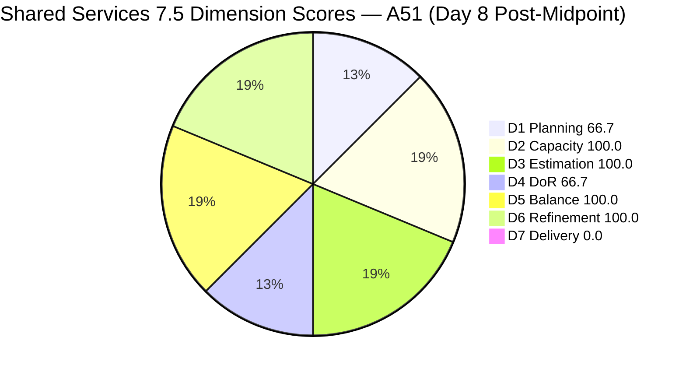
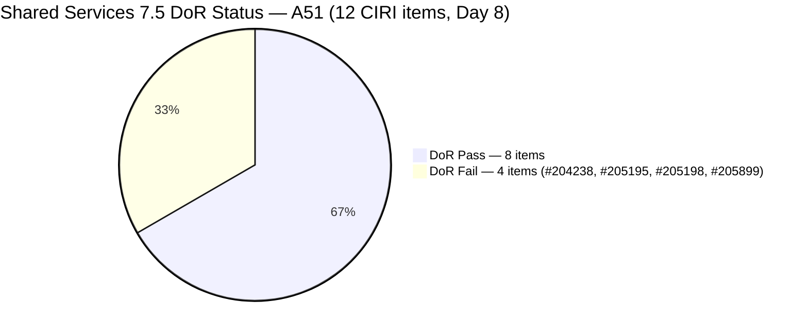
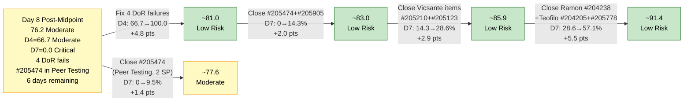

# ADO SAFe Audit — Shared Services Team

## 1. Audit Metadata

| Field | Value |
|---|---|
| **Audit Date** | 2026-06-08 CST |
| **Sprint Day** | **8 of 14** |
| **Prior Audit** | A50 — `AUDIT_20260607_0900.md` (Overall 68.3, Moderate Risk — 7.5 Day 7) |
| **ADO Project** | Jairosoft Portfolio (`666bb99a-6acd-4999-bb34-efd0e4ea90dc`) |
| **ADO Team** | Shared Services Team (`bd9578fd-5773-48fc-bd80-988dfe5de806`) |
| **Iteration** | Iteration 7.5 (`9c70d575-210a-4156-bbdc-79f1efbe2869`) |
| **Iteration Path** | `Jairosoft Portfolio\2026-PI7\Iteration 7.5` |
| **Iteration Dates** | Jun 1, 2026 – Jun 14, 2026 |
| **Workspace Folder** | `ado_shared` |
| **Overall Score** | **76.2 — Moderate Risk** |
| **Risk Band** | Moderate (60–79.9) |
| **Visible Backlog Items (VRBI)** | 18 open root items |
| **Current Iteration Root Items (CIRI)** | 12 items (IterationPath = Iteration 7.5) |
| **Capacity** | Teofilo: 6h/day · Vicsante: 6h/day · Jaszmeine: 3h/day · Ramon: 0.5h/day = **15.5h/day total** |
| **Project Exception** | Board URL uses `/Stories` — backlog category `Microsoft.RequirementCategory` confirmed |

---

## 2. Executive Summary

The Shared Services Team scores **76.2 — Moderate Risk** on Day 8 of Iteration 7.5, a **+7.9 point improvement** from A50 (68.3). This is the largest single-day score gain of the sprint, driven by a wave of remediation actions taken overnight: DoR content added to multiple items, two items closed, and #202725 officially moved into the 7.5 IterationPath.

Key findings:

- **Two confirmed closures today — D7 still 0.0 (CIRI-based formula).** #202726 (Booking & Payment Management, Jaszmeine, 2 SP) and #205211 (Create Product Repository for Jodex, Ramon, 1 SP) were both marked Closed as of Jun 8 07:45. Both have exited the backlog API and are no longer in CIRI. Per the D7 formula, D7 is computed from live CIRI items only — these closures are contextually significant but the formula yields 0.0 because no current CIRI items are Closed/Done.
- **CIRI grew from 11 to 12.** #202725 (Messaging & Communication, Jaszmeine, 3 SP) corrected its IterationPath to 7.5 (Jun 7 23:16). Two new items joined CIRI: #205905 (Backup AutoAllies DB in BLOB Storage, Teofilo, 1 SP) and #205899 (Activate 5 computer systems at Davao office, Teofilo, 3 SP). Net: -2 closed, +3 new = CIRI 11→12.
- **D3 = 100.0 — all 12 CIRI items now estimated.** #205123 and #205210 received SP estimates (Jun 7). New items #205905 and #205899 came in with SP. All PECI items are estimated.
- **D4 improved from 54.5 to 66.7 — still below Low Risk.** Four items now fail DoR: #204238 (Desc/AC both short), #205899 (Desc short, no AC), #205195 (Desc short), #205198 (Desc short). Three of the five A50 failures were remediated (#205123, #205210, #205211 now closed). Two new failures introduced (#205899 has no AC; #205195 and #205198 have thin descriptions).
- **D1 improved from 61.1 to 66.7** with CIRI growing to 12/18. The persistent #202725 scope leakage is now resolved — it is correctly in 7.5.
- **Path to Low Risk is achievable today:** Fix the 4 remaining DoR failures (+4.8 pts to D4), and the team would reach approximately 80.5 — crossing the Low Risk threshold even with D7 at 0.0.

---

## 3. Previous Audit Delta (A50 → A51)

| Dimension | A50 Score (7.5 Day 7) | A51 Score (7.5 Day 8) | Delta | Driver |
|---|---|---|---|---|
| D1 Iteration Planning | 61.1 | **66.7** | **+5.6** | CIRI grew 11→12: #202725 moved to 7.5, +#205905+#205899, −#202726−#205211 (closed) |
| D2 Team Capacity | 100.0 | **100.0** | 0.0 | All 4 contributors capacity-configured; unchanged |
| D3 Estimation | 72.7 | **100.0** | **+27.3** | #205123 SP=2 (Jun 7), #205210 SP=1 (Jun 7). New items #205905(1 SP), #205899(3 SP). All 12 CIRI estimated. |
| D4 DoR Compliance | 54.5 | **66.7** | **+12.2** | 3 of 5 failures resolved (#205123, #205210, #205211 closed). 4 failures remain: #204238, #205899, #205195, #205198. |
| D5 Work Item Balance | 100.0 | **100.0** | 0.0 | Balanced type distribution maintained across 12 CIRI items |
| D6 Backlog Refinement | 90.0 | **100.0** | **+10.0** | Untouched CIRI penalty eliminated: all 12 CIRI items changed Jun 1+. Previous 3 untouched items (#204205, #205123, #205211) all updated. |
| D7 Delivery Predictability | 0.0 | **0.0** | 0.0 | #202726 (2 SP) and #205211 (1 SP) closed but exited backlog — not in live CIRI. 0/21 SP from current CIRI. |
| **Overall** | **68.3** | **76.2** | **+7.9** | D3+D6 fully resolved; D4 partially resolved; D1 improved. D7 structural limitation persists. |

**Formula verification:** (66.7 + 100.0 + 100.0 + 66.7 + 100.0 + 100.0 + 0.0) / 7 = 533.4 / 7 = **76.2**

**Key transition observations A50 → A51:**
- **#202726 (Jaszmeine) Closed Jun 8 07:45** — Booking & Payment Management (Design, 2 SP). A50 flagged this as the highest-priority D7 action (R2, CRITICAL). It exited the backlog API, confirming closure. This was the longest-running Active item (Day 2→Day 8 = 7 days in Active).
- **#205211 (Ramon) Closed Jun 8 07:45** — Create Product Repository for Jodex (Enabler, 1 SP). Also flagged in A50 as an urgent same-day action. Closed alongside #202726 in a coordinated action.
- **#205123 (Vicsante)** — Description and full Acceptance Criteria added (Jun 7 23:28). SP = 2 added. Nine-day execution-without-scope risk resolved. D3 and D4 failures for this item are now corrected.
- **#205210 (Vicsante)** — Description expanded and AC replaced (Jun 7 23:28). SP = 1 confirmed (was already set). Full DoR compliance now achieved.
- **#204205 (Teofilo)** — Full Description and AC added (Jun 8 05:18). Nine-day DoR failure resolved. Now Active.
- **#205474 (Teofilo)** — Now in "Peer Testing" state (Jun 8 05:21). Full Description and AC added. Renamed from "Up Sonicwall VPN" to "Up Mikrotik VPN." Near-closure candidate.
- **#202725 (Jaszmeine)** — IterationPath corrected from 7.4 to **Iteration 7.5** (Jun 7 23:16). Six consecutive audits flagged this scope leakage. Now correctly in CIRI. Design Review state, 3 SP.
- **#205905 and #205899 (Teofilo)** — Two new CIRI items added Jun 8 05:18: #205905 (Backup AutoAllies DB, 1 SP, Active, DoR Pass) and #205899 (Activate 5 computers at Davao, 3 SP, Active, no AC → DoR Fail).
- **D6 untouched items eliminated** — The three previously untouched items (#204205 May 29, #205123 May 29, #205211 May 29 — all now updated Jun 7–8) drop the untouched count from 3/11 to 0/12. D6 penalty eliminated → D6 from 90.0 to 100.0.

---

## 4. Current Iteration Snapshot

| Metric | Value |
|---|---|
| **Visible Backlog Items (VRBI)** | 18 |
| **Current Iteration Root Items (CIRI)** | 12 (IterationPath = Iteration 7.5, in open backlog) |
| **Story Points Committed (CSP)** | 21 SP (all 12 CIRI items estimated) |
| **Story Points Closed (CLSP)** | 0 SP (no live CIRI items in Closed/Done state) |
| **Sprint Day / Total** | **8 / 14** — post-midpoint |
| **Team Size (distinct CIRI assignees)** | 4 (Teofilo, Vicsante, Jaszmeine, Ramon) |
| **Total Capacity** | 15.5h/day × 14 days = 217 hours |
| **Remaining Capacity** | 15.5h/day × 6 days = 93 hours |
| **Iteration Start / Finish** | Jun 1, 2026 – Jun 14, 2026 |

**Confirmed closures this sprint (exited backlog — cumulative through Day 8):**
Days 1–7 closures (from A50): #203845(2SP), #205455(2SP), #205479(2SP), #205456(2SP), #205656(1SP), #205603(3SP), #205722(2SP), #205759(2SP), #205662(2SP), #205815(0SP), #205816(0SP) = ~18 SP (Teofilo through Day 7).
Day 8 additions: #202726(2SP, Jaszmeine), #205211(1SP, Ramon) = **3 SP new closures today**.
**Sprint-to-date delivered: approximately 21 SP across 13 items** (Teofilo: 11 items, Jaszmeine: 1, Ramon: 1).

**CIRI SP distribution by assignee:**
| Assignee | CIRI Items | SP Committed | DoR Fails |
|---|---|---|---|
| Teofilo | 5 (#204205, #205474, #205778, #205905, #205899) | 9 SP | #205899 |
| Jaszmeine | 4 (#202725, #202727, #205195, #205198) | 8 SP | #205195, #205198 |
| Vicsante | 2 (#205123, #205210) | 3 SP | None |
| Ramon | 1 (#204238) | 1 SP | #204238 |

---

## 5. Work Item Analysis

### Current Iteration Items (12 items — IterationPath = Iteration 7.5, open)

| ID | Title | Type | State | SP | Assignee | DoR | ChangedDate | Notes |
|---|---|---|---|---|---|---|---|---|
| #202725 | Messaging & Communication | Design | Design Review | 3 | Jaszmeine | **Pass** | Jun 7 | **Moved from 7.4 to 7.5 — Jun 7 (6 audit cycles late)** |
| #202727 | Contract Management | Design | Ready for Design | 3 | Jaszmeine | **Pass** | Jun 2 | No change |
| #204205 | Android Phone from US — For Receiving | Enabler | **Active** | 1 | Teofilo | **Pass** | **Jun 8** | Full Desc+AC added Jun 8; now Active |
| #204238 | Use FinOps Project Board to Combine | User Story | Ready for Dev | 1 | Ramon | **Fail** | Jun 2 | Desc ~16 NWS, AC ~17 NWS — both below threshold |
| #205123 | Installing Jodex Plugin in Antigravity | Spike | Active | 2 | Vicsante | **Pass** | Jun 7 | Full Desc+AC+SP added Jun 7 — DoR resolved |
| #205195 | [Retro] Alternative to Figma | Spike | Active | 1 | Jaszmeine | **Fail** | Jun 4 | Desc ~15 NWS < 30 |
| #205198 | [Retro] Design Deliverables on track | Spike | Active | 1 | Jaszmeine | **Fail** | Jun 4 | Desc ~9 NWS < 30 |
| #205210 | Install and Setup Antigravity (Back Office) | User Story | Active | 1 | Vicsante | **Pass** | Jun 7 | Full Desc+AC expanded Jun 7 — DoR resolved |
| #205474 | Up Mikrotik VPN | Enabler | **Peer Testing** | 2 | Teofilo | **Pass** | **Jun 8** | Full Desc+AC added Jun 8; in Peer Testing — near closure |
| #205778 | Action 2: Setup Frontend CI Gates | Defect | Active | 2 | Teofilo | **Pass** | **Jun 8** | Unchanged from A50; now Active |
| #205899 | Activate 5 computer systems at Davao office | Enabler | Active | 3 | Teofilo | **Fail** | **Jun 8** | Desc ~28 NWS < 30; no AC |
| #205905 | Backup AutoAllies DB in BLOB Storage | Enabler | Active | 1 | Teofilo | **Pass** | **Jun 8** | New item; full Desc+AC present |

*SP "Fail" = DoR failure on that specific field threshold.*

### Non-CIRI Backlog Items (6 items — various iterations)

| ID | Title | Iter | Type | State | Assignee | Changed |
|---|---|---|---|---|---|---|
| #196454 | Colina Intake/Output Tab | PI8 | Design | New | Jaszmeine | Jun 3 |
| #197981 | Colina - Task Feature Enhancement | PI8 | Design | New | Jaszmeine | Jun 3 |
| #202066 | Provide Installation Guide | PI8 | User Story | Estimation | Ramon | May 8 |
| #202947 | IT Support Services Feedback Survey | 7.6 IP | Spike | New | Teofilo | May 19 |
| #203309 | GitHub Token Defect | 7.4 | Defect | Ready for QA | Ramon | May 19 |
| #204950 | Monthly Costing — July 2026 | 7.6 IP | Enabler | New | Teofilo | Jun 3 |

*#202725 resolved — no longer in the non-CIRI list (moved to 7.5 on Jun 7). #203309 (7.4 iteration) and #202066 (PI8) remain non-CIRI. #202066 (May 8 — 31 days ago) is approaching the 45-day freshness boundary (expires Jun 22 from today's perspective); monitor.*

### DoR Assessment — 12 CIRI Items

| ID | Title | Desc ≥ 30 NWS | AC ≥ 20 NWS | Result |
|---|---|---|---|---|
| #202725 | Messaging & Communication | ✓ (~55 NWS) | ✓ (long multi-AC) | **Pass** |
| #202727 | Contract Management | ✓ (~60 NWS) | ✓ (long multi-AC) | **Pass** |
| #204205 | Android Phone from US | ✓ (~40 NWS) | ✓ (3 bullets) | **Pass — resolved Jun 8** |
| #204238 | Use FinOps Project Board | ✗ (~16 NWS) | ✗ (~17 NWS) | **Fail — both fields short** |
| #205123 | Installing Jodex Plugin | ✓ (~35 NWS) | ✓ (3 bullets) | **Pass — resolved Jun 7** |
| #205195 | [Retro] Alternative to Figma | ✗ (~15 NWS) | ✓ (~22 NWS) | **Fail — Desc short** |
| #205198 | [Retro] Design Deliverables on track | ✗ (~9 NWS) | ✓ (~35 NWS) | **Fail — Desc short** |
| #205210 | Install and Setup Antigravity | ✓ (~35 NWS) | ✓ (3 bullets) | **Pass — resolved Jun 7** |
| #205474 | Up Mikrotik VPN | ✓ (~30 NWS) | ✓ (3 bullets) | **Pass — resolved Jun 8** |
| #205778 | Setup Frontend CI Gates | ✓ (structured) | ✓ | **Pass** |
| #205899 | Activate 5 computers at Davao | ✗ (~28 NWS) | ✗ (null) | **Fail — Desc short, no AC** |
| #205905 | Backup AutoAllies DB in BLOB Storage | ✓ (~35 NWS) | ✓ (5 bullets) | **Pass** |

**Pass: 8/12. Fail: 4 (#204238, #205195, #205198, #205899). DCI = 8/12 = 66.7%**

### Type Distribution (12 CIRI items)

| Type | Count | Share | D5 Impact |
|---|---|---|---|
| Design | 2 (#202725, #202727) | 16.7% | — |
| User Story | 2 (#205210, #204238) | 16.7% | — |
| Enabler | 4 (#204205, #205474, #205899, #205905) | 33.3% | — |
| Spike | 3 (#205123, #205195, #205198) | 25.0% | Spike < 40% — no penalty |
| Defect | 1 (#205778) | 8.3% | — |
| **Total** | **12** | **100%** | No penalties |

---

## 6. SAFe Compliance Scorecard

| Dimension | Score | Band | Evidence | Notes |
|---|---|---|---|---|
| D1 Iteration Planning | **66.7** | Moderate | 12 CIRI / 18 VRBI | Improved from 61.1. #202725 moved to 7.5. 2 closed, 3 new items. |
| D2 Team Capacity | **100.0** | Low | 4/4 contributors with capacity | Teofilo 6h + Vicsante 6h + Jaszmeine 3h + Ramon 0.5h = 15.5h/day. Unchanged. |
| D3 Estimation | **100.0** | Low | 12/12 ECI | **Resolved.** All CIRI items estimated. CSP = 21 SP. |
| D4 DoR Compliance | **66.7** | Moderate | 8 DCI / 12 CIRI | Improved from 54.5. 4 failures remain: #204238, #205195, #205198, #205899. |
| D5 Work Item Balance | **100.0** | Low | Balanced across 5 types; no penalty thresholds | Unchanged. Type distribution healthy. |
| D6 Backlog Refinement | **100.0** | Low | 18/18 fresh; 0/12 untouched CIRI | **Resolved.** Untouched CIRI drops from 3/11 to 0/12. Penalty eliminated. |
| D7 Delivery Predictability | **0.0** | Critical | 0 SP closed (live CIRI) / 21 SP committed | #202726 (2 SP) + #205211 (1 SP) closed but exited backlog. ~21 SP delivered sprint-to-date (total, all contributors). |
| **OVERALL** | **76.2** | **Moderate** | (66.7+100.0+100.0+66.7+100.0+100.0+0.0)/7 | +7.9 from A50. 3.8 pts from Low Risk threshold. |

**Formula verification:** (66.7 + 100.0 + 100.0 + 66.7 + 100.0 + 100.0 + 0.0) / 7 = 533.4 / 7 = **76.2**

---

## 7. Dimension Findings

### D1 — Iteration Planning: 66.7 / 100 — Moderate Risk

**Formula:** CIRI / VRBI × 100 = 12 / 18 × 100 = **66.7**

| Metric | Value |
|---|---|
| Visible root backlog items (VRBI) | 18 |
| Items in Iteration 7.5 (CIRI) | 12 |
| Items in PI8 | 3 (#196454, #197981, #202066) |
| Items in 7.4/7.6 IP | 3 (#202947, #203309, #204950) |
| Score | **66.7** |

D1 improved from 61.1 to 66.7 with the addition of #202725 (scope leakage resolved), #205905, and #205899 to CIRI, offset by the exit of #202726 and #205211 (closed). D1 is now 5.6 points above the Moderate/High boundary (60%). As Teofilo continues his closure cadence, CIRI will shrink unless new items replace closed ones. With 6 days remaining and Teofilo's demonstrated rate (~1.5 items/day), CIRI could drop to 8–9 items, pushing D1 toward 50%.

---

### D2 — Team Capacity: 100.0 / 100 — Low Risk

**Formula:** CC / CW × 100 = 4 / 4 × 100 = **100.0**

| Contributor | CIRI Items | Capacity | Activity |
|---|---|---|---|
| Teofilo Limpag | 5 items | 6h/day | Development |
| Vicsante Aseniero | 2 items | 6h/day | Development |
| Jaszmeine Abigaille Villanueva | 4 items | 3h/day | Design |
| Ramon Aseniero Jr | 1 item | 0.5h/day | Requirements |

All four contributors remain capacity-configured with no days off. 93 hours of capacity remain (6 days × 15.5h). Teofilo's closure cadence (11 items Sprint-to-Day 7, now 12 total with day 8 items) is far outpacing the other contributors. Jaszmeine and Vicsante now have confirmed closures (1 each), and Ramon has 1 closure.

---

### D3 — Estimation: 100.0 / 100 — Low Risk

**Formula:** ECI / PECI × 100 = 12 / 12 × 100 = **100.0**

All 12 CIRI items are now estimated. SP breakdown: #202725(3), #202727(3), #204205(1), #204238(1), #205123(2), #205195(1), #205198(1), #205210(1), #205474(2), #205778(2), #205899(3), #205905(1). **CSP = 21 SP.** The fixes applied on Jun 7 (#205123 SP=2, #205210 SP=1) combined with the two new items (#205905 1 SP, #205899 3 SP) brought all 12 items to fully estimated. D3 is now perfect at 100.0.

Vicsante's two items (#205123 = 2 SP, #205210 = 1 SP) are now both estimated — his sprint contribution is no longer invisible in SP-based metrics.

---

### D4 — DoR Compliance: 66.7 / 100 — Moderate Risk

**Formula:** DCI / CIRI × 100 = 8 / 12 × 100 = **66.7**

Improved from 54.5 (A50) but still in Moderate Risk. Three of the five A50 failures were remediated; two of the four current failures are new items or items that were already borderline.

**Resolved failures (from A50):**
- #205123: Full Desc and AC added Jun 7. Now DoR-compliant. Active.
- #205210: Full Desc and expanded AC added Jun 7. Now DoR-compliant. Active.
- #205211: Closed Jun 8 — exited CIRI.
- #204205: Full Desc and AC added Jun 8. Now DoR-compliant. Active.

**Remaining failures:**

**#204238** (Ramon, User Story, Ready for Dev, 1 SP):
- Desc: "FInOps Project Board will be used moving forward. So Grace don't have to vew multiple board." — ~16 NWS, below 30 threshold.
- AC: "remove Admin, HR and Finance in the Portfolio Scoring, Instead to use FinOps Project BOard moving forward" — ~17 NWS, below 20 threshold.
- This item has been in the sprint since Day 2 (Jun 2). Both fields are close to the threshold — minor expansion would resolve both simultaneously.

**#205195** (Jaszmeine, Spike, Active, 1 SP):
- Desc: "figma dev MCP helped a lot in developing the designs / Dev0 / Lovable / Stitch / Claude Design" — ~15 NWS, below 30 threshold. AC passes (≥20 NWS).
- Fix: expand the description to explain the spike objective: "This spike evaluates AI-integrated design tools that can directly replace Figma for UI design work and integrate natively with Jodex/AI workflows. Tools evaluated: Dev0, Lovable, Stitch, Claude Design." (~35 NWS)

**#205198** (Jaszmeine, Spike, Active, 1 SP):
- Desc: "design items to be provided completely before iteration starts" — ~9 NWS, well below 30 threshold. AC passes (long list-based criteria).
- Fix: expand description to at least 30 NWS — e.g., "This retrospective spike tracks the delivery of all four outstanding design items (#202724, #202553, #202727, #202725) before the iteration closes, ensuring the design pipeline is not a blocker for development in the next sprint."

**#205899** (Teofilo, Enabler, Active, 3 SP):
- Desc: "activate 5 computer system at davao office, installed with Anydesk and configured for always on. Purpose is for the GoHealth Team members to access computer remotely." — ~28 NWS, just below 30 threshold. No AC field.
- Fix: two actions — expand Desc by 2 words (e.g., "activate and configure 5 computer systems at the Davao office..."), and add AC: "AC1: All 5 computers confirmed online and accessible via AnyDesk. AC2: Each GoHealth team member verifies remote desktop access successfully. AC3: Systems set to always-on configuration persists after restart."

Remediating all four failures raises D4 from 66.7 → 100.0 (+4.8 pts to Overall, 76.2 → 81.0 — Low Risk).

---

### D5 — Work Item Balance: 100.0 / 100 — Low Risk

**Formula:** Base 100 − penalties applied independently

| Penalty | Trigger | Applied |
|---|---|---|
| −40: No User Story in CIRI | 2 User Stories present (#204238, #205210) | **No** |
| −30: Dominant type share > 60% | Enabler = 4/12 = 33.3% — largest share | **No** |
| −20: Spike share > 40% | Spike = 3/12 = 25.0% | **No** |

**Score:** 100 − 0 = **100.0**

The type distribution across 5 types remains well-balanced with the CIRI expansion to 12 items. D5 = 100.0 for the entire Iteration 7.5 audit cycle. Adding #205905 and #205899 as Enablers and #202725 as Design maintained the balance. No risk to this dimension.

---

### D6 — Backlog Refinement: 100.0 / 100 — Low Risk

**Freshness window:** ChangedDate ≥ 2026-04-24 (45 days before 2026-06-08)

| Metric | Value |
|---|---|
| Total VRBI | 18 |
| Fresh items (ChangedDate ≥ Apr 24, 2026) | 18 — oldest: #202066 (May 8, 31 days ago) |
| Stale_90 items (ChangedDate < Mar 10, 2026) | 0 |
| Stale_180 items (ChangedDate < Dec 11, 2025) | 0 |
| Untouched CIRI (ChangedDate < Jun 1, 2026) | **0** — all 12 CIRI items changed Jun 1 or later |

**Penalty calculation:**
- stale_90: 0 → no penalty
- stale_180: 0 → no penalty
- untouched CIRI: 0/12 = 0% → no penalty

**Score:** max(0, 100.0 − 0) = **100.0**

D6 is fully resolved. The three previously untouched items (#204205, #205123, #205211) were all updated Jun 7–8 (DoR remediation + #205211 closure). The −10 penalty that persisted across 7 consecutive audits (A44–A50) is eliminated. D6 rose from 90.0 to 100.0.

**Monitoring note:** #202066 (Provide Installation Guide, May 8) approaches the 45-day freshness boundary on Jun 22. If this item remains untouched in PI8, it will become a future D6 risk. Not a current concern for this sprint.

---

### D7 — Delivery Predictability: 0.0 / 100 — Critical

**Formula:** CLSP / CSP × 100 = 0 / 21 × 100 = **0.0**

| Metric | Value |
|---|---|
| Estimated current items (ECI) | 12 |
| Committed Story Points (CSP) | 21 SP |
| Closed Story Points (CLSP) | 0 SP (no live CIRI items in Closed/Done state) |
| Items in near-closure states | #205474 (Peer Testing, 2 SP) — highest priority |
| Sprint-to-date delivered (all contributors) | ~21 SP across 13 items (Teofilo: 11, Jaszmeine: 1, Ramon: 1) |
| Score | **0.0** |

**Day 8 of 14 — post-midpoint.** Two confirmed closures occurred today (#202726, #205211) but both exited the backlog API before this audit's CIRI baseline was established. They are not counted in D7 per the formula.

**Context note:** The team's actual sprint delivery is substantial — approximately 21 SP across 13 items through Day 8. D7 = 0.0 is a formula artifact caused by the dynamic backlog: items close and exit before the next audit's CIRI snapshot. The formula is technically accurate but structurally disadvantageous for active teams like Shared Services.

**Immediate D7 improvement:** #205474 (Up Mikrotik VPN, Teofilo, 2 SP, Peer Testing, DoR Pass) is the closest item to closure. Moving from Peer Testing → Closed would yield: D7 = 2/21 = 9.5%, Overall → 77.6. Closing #205905 (1 SP, Active) immediately after: D7 = 3/21 = 14.3%, Overall → 78.2.

**With D4 fix + closures:** If all 4 DoR failures are fixed today and #205474 + one more item close: D4 = 100.0 (+4.8 pts) + D7 improvement → Overall could reach 83+ (Low Risk).

---

## 8. Risks and Bottlenecks

| # | Severity | Dimension | Risk | Recommended Action |
|---|---|---|---|---|
| R1 | **CRITICAL** | D7 | Day 8 (post-midpoint) with 0 SP credited from live CIRI. #205474 (Teofilo, Peer Testing, 2 SP, DoR Pass) is in the final pre-closure state — Peer Testing implies another day of validation before Closed. Every day of delay at Peer Testing means D7 stays at 0.0. | **Teofilo: close #205474 (Up Mikrotik VPN) today.** Peer Testing should be complete (it entered Peer Testing Jun 8 morning). Closing it immediately: D7 = 2/21 = 9.5%, Overall → 77.6. Then close #205905 (Backup AutoAllies DB, 1 SP, Active, DoR Pass) on the same day: D7 = 3/21 = 14.3%, Overall → 78.2. |
| R2 | **HIGH** | D4 | Four CIRI items fail DoR (#204238, #205195, #205198, #205899). Two are thin descriptions (2–3 sentence fixes), one has null AC (#205899), and one has both fields short (#204238). Fixing all four takes < 15 minutes total and adds 4.8 pts to Overall — enough to reach Low Risk combined with the first D7 closure. | **Team: fix all four DoR failures today.** Details in Section 7 D4. If fixed + D7 starts moving, Overall crosses 80.0. |
| R3 | **MEDIUM** | D4 (new item hygiene) | #205899 (Activate 5 computers at Davao, 3 SP) was added to CIRI on Jun 8 without AC. This repeats the same pattern that caused the A44–A50 persistent DoR failures. Items should not enter CIRI without Desc ≥ 30 NWS and AC ≥ 20 NWS. | **Teofilo: add AC to #205899 before any further work.** Suggested: "AC1: All 5 computers confirmed online and accessible via AnyDesk. AC2: Each GoHealth team member verifies remote desktop access. AC3: Always-on config persists after restart." This is a 2-minute field update. |
| R4 | **MEDIUM** | D1 | If Teofilo resumes his closure cadence (his established pattern), CIRI could drop below 10 items by Day 10, pushing D1 toward 55.6% (10/18) — deep into Moderate Risk. VRBI stays at 18 while CIRI shrinks. | **Add new CIRI items proactively.** Consider moving #202947 (IT Feedback Survey, 7.6 IP, Teofilo, Spike) or other ready 7.6 IP items to 7.5 to replace closed items and maintain D1 ≥ 66.7. |
| R5 | **MEDIUM** | D7 (structural) | The D7 formula snapshot model means today's closures (#202726, #205211) are not counted because they exited before this audit's CIRI baseline. This is a recurring structural issue for Shared Services. Approximately 21 SP delivered sprint-to-date is real delivery not captured in the formula. | No scoring action. Document contextual delivery in each report. Ramon: consider auditing at day-end rather than morning to capture same-day closures — this would shift snapshot timing and potentially capture closures before they exit the backlog window. |
| R6 | **LOW** | D6 (watch) | #202066 (Provide Installation Guide, PI8, May 8) is 31 days old. The 45-day freshness boundary is Jun 22. If this item is not updated before the next PI, it will trigger a staleness penalty in future audits. | **Ramon: update #202066 before Jun 22** to reset the ChangedDate and maintain D6 freshness for future audits. |

---

## 9. Prioritized Recommendations

1. **[CRITICAL — Today Day 8]** Teofilo: close #205474 (Up Mikrotik VPN, Peer Testing, 2 SP, DoR Pass). This item is in final validation state and should be complete today. Closing it breaks the D7 = 0.0 stall: D7 rises to 9.5%, Overall to 77.6. Then close #205905 (Backup AutoAllies DB, Active, 1 SP, DoR Pass) immediately after for D7 = 14.3%, Overall = 78.2.

2. **[CRITICAL — Today Day 8]** Team: fix all 4 DoR failures simultaneously. This is the highest-leverage scoring action — worth +4.8 pts to Overall (76.2 → ~81.0 before D7 improvements):
   - **Ramon:** Expand #204238 description to ~35 NWS and AC to ~25 NWS. ("The FinOps Project Board will consolidate the Admin, HR, and Finance ADO boards into a single view. This eliminates the need for Grace to monitor multiple boards across projects.") AC: ("Consolidated FinOps Board is live with Admin, HR, and Finance work items visible in a single view. Portfolio scoring references only the FinOps Board going forward.")
   - **Jaszmeine:** Expand #205195 description to ~35 NWS: ("This spike evaluates AI-integrated design tools as alternatives to Figma for the Shared Services design workflow. Tools assessed: Dev0, Lovable, Stitch, and Claude Design, prioritizing native Jodex/AI integration capabilities.")
   - **Jaszmeine:** Expand #205198 description to ~35 NWS: ("This retrospective spike ensures all four outstanding design deliverables (#202724, #202553, #202727, #202725) are completed and approved before Iteration 7.5 closes, preventing a design backlog carryover into Iteration 7.6.")
   - **Teofilo:** Add AC to #205899: ("AC1: All 5 computers confirmed online and accessible via AnyDesk. AC2: Each GoHealth team member verifies successful remote desktop access. AC3: Always-on configuration persists after system restart.")

3. **[HIGH — Days 8–10]** Combined impact of R1 + R2: D4 → 100.0, D7 → 14.3% minimum. Total: Overall → ~83.3 (Low Risk). All actions are executable within hours.

4. **[HIGH — Days 9–12]** Teofilo: close #204205 (Android Phone, Active, 1 SP, DoR Pass) and #205778 (Setup Frontend CI Gates, Active, 2 SP, DoR Pass). These are Teofilo's two primary Active items after #205474 and #205905. Both are fully groomed. Combined with prior closures: D7 reaches 7/21 = 33.3%, Overall → 84.8.

5. **[HIGH — Days 9–11]** Vicsante: close #205210 (Install and Setup Antigravity, Active, 1 SP, DoR Pass) and #205123 (Installing Jodex Plugin, Active, 2 SP, DoR Pass). Vicsante has no live CIRI closures. #205210 (install confirmed for 4 users) should be completable in a day if installs are done. #205123 depends on #205210 and #205474 — with Mikrotik VPN closing, the dependency chain is unblocked.

6. **[MEDIUM — Day 8]** Ramon: close #204238 (Use FinOps Project Board, Ready for Dev, 1 SP) after fixing its DoR. This is Ramon's only remaining CIRI item and should take < 30 minutes of work (FinOps board configuration). Closing it: D7 adds 1/21 = 4.8%.

7. **[MEDIUM — Today Day 8]** Add #202947 (IT Feedback Survey, 7.6 IP, Teofilo) or another backlog item to Iteration 7.5 to maintain D1 ≥ 66.7% as Teofilo begins closing items. CIRI will shrink to 11 with today's first closure — add 1 item to maintain the ratio.

8. **[STANDING]** New items should not enter CIRI without Desc ≥ 30 NWS and AC ≥ 20 NWS before any work begins. #205899 repeated the same pattern that caused the A44–A50 DoR failures. Establish a personal gate: never add a work item to a sprint iteration without completing both fields.

---

## 10. Visualizations

### Score Trend (A44 → A51)

```mermaid
graph LR
    A44["A44 — 7.5 D1\n41.2 High Risk"] --> A45["A45 — 7.5 D2\n45.3 High Risk"]
    A45 --> A46["A46 — 7.5 D3\n73.5 Moderate"]
    A46 --> A47["A47 — 7.5 D4\n66.3 Moderate"]
    A47 --> A48["A48 — 7.5 D5\n66.3 Moderate"]
    A48 --> A49["A49 — 7.5 D6\n68.3 Moderate"]
    A49 --> A50["A50 — 7.5 D7\n68.3 Moderate"]
    A50 --> A51["A51 — 7.5 D8\n76.2 Moderate"]
    style A44 fill:#FFCC80,stroke:#E65100,color:#000
    style A45 fill:#FFCC80,stroke:#E65100,color:#000
    style A46 fill:#FFF9C4,stroke:#F9A825,color:#000
    style A47 fill:#FFF9C4,stroke:#F9A825,color:#000
    style A48 fill:#FFF9C4,stroke:#F9A825,color:#000
    style A49 fill:#FFF9C4,stroke:#F9A825,color:#000
    style A50 fill:#FFF9C4,stroke:#F9A825,color:#000
    style A51 fill:#FFF9C4,stroke:#F9A825,color:#000
```

### Dimension Scores — A51 (Day 8 Post-Midpoint)

### DoR Status — 12 CIRI Items (Day 8)

### Remediation Impact Path — From Day 8 Post-Midpoint

---

## 11. Evidence Gaps and Limitations

| Gap | Impact | Notes |
|---|---|---|
| **#202726 + #205211 closed Day 8 — exited backlog** | D7 = 0.0 (formula gap) | Both closed Jun 8 07:45 but exited before this audit's CIRI snapshot. 3 SP confirmed delivered by Jaszmeine (2 SP) and Ramon (1 SP). D7 formula requires live CIRI — these closures are not credited. |
| **D7 = 0.0 structural issue** | Understates actual delivery | Sprint-to-date delivery: ~21 SP across 13 items. D7 = 0.0 is technically accurate per rubric but does not reflect the team's real velocity, especially Teofilo's 11-item closure streak. |
| **#205899 entered CIRI without AC** | D4 Fail (immediate) | Added Jun 8 with description only (~28 NWS) and null AC. Pattern repeats from A44–A50 DoR failures. Simple fix — 2-minute AC addition. |
| **#205195 and #205198 thin descriptions** | D4 Fail (minimal effort to fix) | Both are retro spikes with <20 NWS descriptions. AC fields are already passing. Description expansion is a 1-sentence addition per item. |
| **#204238 both fields short since Day 2** | D4 Fail (6 audit days unresolved) | Both Desc and AC are close to threshold (~16 NWS, ~17 NWS). Minor expansion resolves both. This item has been in "Ready for Dev" for 6 days with no state change. |
| **D7 snapshot timing** | Structural audit limitation | Closures occurring before 09:00 may exit the backlog API before the daily audit snapshot is taken, perpetuating D7 = 0.0. Consider auditing at day-end to capture same-day closures. |

---

## 12. Audit Trail

| Source | Tool | Data |
|---|---|---|
| Current iteration | `work_list_team_iterations` (project `666bb99a`, team `bd9578fd`, timeframe=current) | Iteration 7.5: Jun 1–14, 2026; ID `9c70d575-210a-4156-bbdc-79f1efbe2869` — confirmed |
| Backlog items | `wit_list_backlog_work_items` (backlogId `Microsoft.RequirementCategory`) | 18 open root items (net: #202726, #205211 exited; #205905, #205899 entered) |
| Work item details | `wit_get_work_items_batch_by_ids` (18 backlog items + #202726, #205211) | SP, State, Type, Desc, AC, ChangedDate, IterationPath confirmed for all 20 items fetched |
| Team capacity | `work_get_team_capacity` (project `666bb99a`, team `bd9578fd`, iterationId `9c70d575`) | Teofilo 6h/day, Vicsante 6h/day, Jaszmeine 3h/day, Ramon 0.5h/day = 15.5h/day; 0 days off — unchanged |
| Prior audit | `AUDIT_20260607_0900.md` (A50) | Overall 68.3, Moderate Risk, 7.5 Day 7, 18 VRBI, 11 CIRI, 13 SP committed, 0 SP live CIRI, ~18 SP closed (Teofilo) |
