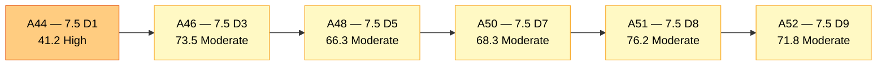
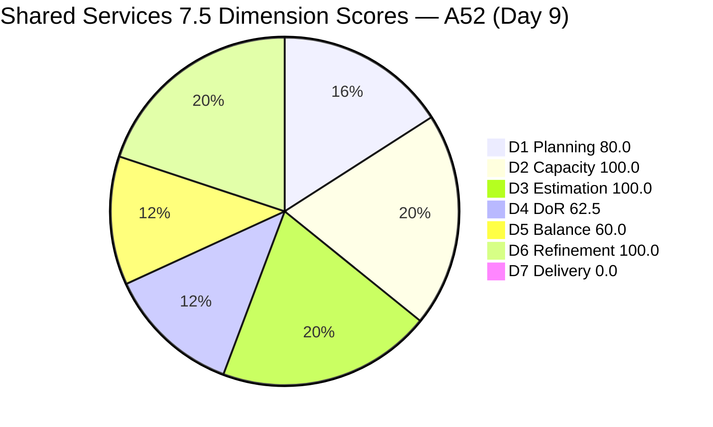
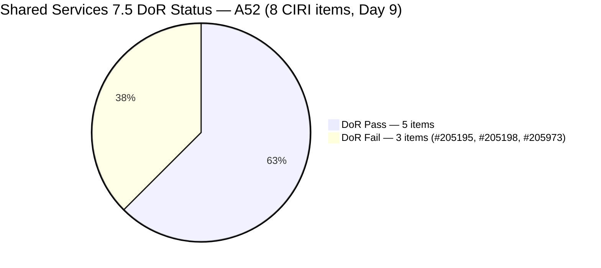
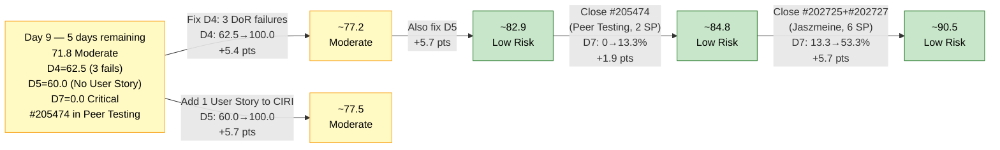

# ADO SAFe Audit — Shared Services Team

## 1. Audit Metadata

| Field | Value |
|---|---|
| **Audit Date** | 2026-06-09 CST |
| **Sprint Day** | **9 of 14** |
| **Prior Audit** | A51 — `AUDIT_20260608_0900.md` (Overall 76.2, Moderate Risk — 7.5 Day 8) |
| **ADO Project** | Jairosoft Portfolio (`666bb99a-6acd-4999-bb34-efd0e4ea90dc`) |
| **ADO Team** | Shared Services Team (`bd9578fd-5773-48fc-bd80-988dfe5de806`) |
| **Iteration** | Iteration 7.5 (`9c70d575-210a-4156-bbdc-79f1efbe2869`) |
| **Iteration Path** | `Jairosoft Portfolio\2026-PI7\Iteration 7.5` |
| **Iteration Dates** | Jun 1, 2026 – Jun 14, 2026 |
| **Workspace Folder** | `ado_shared` |
| **Overall Score** | **71.8 — Moderate Risk** |
| **Risk Band** | Moderate (60–79.9) |
| **Visible Backlog Items (VRBI)** | 10 open root items |
| **Current Iteration Root Items (CIRI)** | 8 items (IterationPath = Iteration 7.5) |
| **Capacity** | Teofilo: 6h/day · Vicsante: 6h/day · Jaszmeine: 3h/day · Ramon: 0.5h/day = **15.5h/day total** |
| **Project Exception** | Board URL uses `/Stories` — backlog category `Microsoft.RequirementCategory` confirmed |

---

## 2. Executive Summary

The Shared Services Team scores **71.8 — Moderate Risk** on Day 9 of Iteration 7.5, a **−4.4 point decrease** from A51 (76.2). The regression is driven by three interconnected changes: a significant wave of closures exited the backlog (shrinking CIRI from 12 to 8 and introducing a No-User-Story D5 penalty), unresolved DoR failures on the remaining items, and the D7 formula continuing to yield 0.0 against the live CIRI snapshot.

Key findings:

- **Major Teofilo closure burst overnight.** Six additional items confirmed closed and exited the backlog: #205899 (Activate 5 computers at Davao, Enabler, 3 SP, Jun 9), #205905 (Backup AutoAllies DB, Enabler, 1 SP, Jun 9), #204238 (Use FinOps Project Board, User Story, 1 SP, Jun 9), #203845 (Monthly Costing June 2026, Enabler, 2 SP, Jun 3). Sprint-to-date contextual delivery is now approximately **~27 SP across 17 items**.
- **D5 degraded from 100.0 to 60.0 — critical regression.** The closure of #204238 (Ramon's sole User Story) removed all User Stories from the live CIRI. With no User Story in CIRI, the −40 penalty applies: D5 = 60.0. This is the primary driver of score regression.
- **D4 degraded from 66.7 to 62.5.** CIRI shrunk from 12 to 8. Three DoR failures persist: #205195, #205198 (Jaszmeine — thin descriptions), and #205973 (Teofilo — both fields minimal). The A51 fix for #205899 did not occur before it closed, and #205973 entered CIRI with inadequate DoR.
- **D1 improved from 66.7 to 80.0.** VRBI also shrank (from 18 to 10) as closed items exited the backlog. Net ratio now 8/10 = 80.0 — a structural improvement in the planning ratio even though CIRI shrank.
- **D7 = 0.0 again — structural formula gap continues.** Live CIRI has 8 items, 15 SP committed, 0 SP Closed. Three confirmed closures occurred today (#204238, #205899, #205905) but all exited before the snapshot. #205474 (Peer Testing) is the nearest-closure candidate in the live CIRI.
- **Path to Low Risk:** Fix 3 DoR failures (+4.7 pts to D4 from 62.5 → 100.0) and add any User Story to CIRI to resolve the D5 No-User-Story penalty (+5.7 pts). Combined: Overall → approximately 82.2 — Low Risk. Both actions are same-day executable.

---

## 3. Previous Audit Delta (A51 → A52)

| Dimension | A51 Score (7.5 Day 8) | A52 Score (7.5 Day 9) | Delta | Driver |
|---|---|---|---|---|
| D1 Iteration Planning | 66.7 | **80.0** | **+13.3** | VRBI 18→10 (closures exited), CIRI 12→8. Net ratio improved: 8/10 = 80.0. |
| D2 Team Capacity | 100.0 | **100.0** | 0.0 | All contributors capacity-configured. Only active CIRI assignees are Jaszmeine (4 items) and Teofilo (4 items). 2/2 = 100.0. |
| D3 Estimation | 100.0 | **100.0** | 0.0 | All 8 remaining CIRI items estimated. CSP = 15 SP. |
| D4 DoR Compliance | 66.7 | **62.5** | **−4.2** | CIRI 12→8. #205899 closed (was failing); #204238 closed (was failing). But #205973 (new CIRI item, both fields minimal) adds a new failure. 5/8 Pass, 3/8 Fail. |
| D5 Work Item Balance | 100.0 | **60.0** | **−40.0** | #204238 (sole User Story) closed. No User Story in live CIRI → −40 penalty activated. |
| D6 Backlog Refinement | 100.0 | **100.0** | 0.0 | All 10 VRBI fresh (Apr 25+). 0 untouched CIRI. No penalties. |
| D7 Delivery Predictability | 0.0 | **0.0** | 0.0 | #204238(1 SP), #205899(3 SP), #205905(1 SP) closed but exited backlog. 0/15 SP from live CIRI. |
| **Overall** | **76.2** | **71.8** | **−4.4** | D5 No-User-Story penalty is the dominant regression driver. D4 minor decline. D1 improved. |

**Formula verification:** (80.0 + 100.0 + 100.0 + 62.5 + 60.0 + 100.0 + 0.0) / 7 = 502.5 / 7 = **71.8**

**Key transition observations A51 → A52:**
- **#205899** (Activate 5 computers at Davao, Enabler, 3 SP): **Closed Jun 9 05:11.** A51 flagged this as R3 (MEDIUM — DoR Fail, add AC). The item closed without AC being added — D4 failure resolved by closure, not remediation. Contextual: 3 SP delivered.
- **#205905** (Backup AutoAllies DB, Enabler, 1 SP): **Closed Jun 9 00:49.** Was Active in A51 with DoR Pass. Closed early morning. Exited backlog before snapshot. 1 SP delivered.
- **#204238** (Use FinOps Project Board, User Story, 1 SP): **Closed Jun 9 05:17.** Was in "Ready for Dev" for 7+ days with DoR failure. Closed today — but its exit removed the LAST User Story from CIRI, triggering D5 No-User-Story penalty (−40). This is the critical transition.
- **#203845** (Monthly Costing June 2026, Enabler, 2 SP): **Closed Jun 3 01:52.** This item was visible in prior iteration work items but had already exited the backlog before A51. Confirmed closed.
- **#205973** (JIT Bubble Training Setup, Enabler, 2 SP): **Entered CIRI.** Added to Iteration 7.5 IterationPath (Jun 9 05:07). Both Description (~7 NWS: "Setup bubble machines in 2F") and AC (~8 NWS: "Should be able to perform Bubble training requirements") are well below thresholds. New DoR failure.
- **VRBI shift 18 → 10:** Net −8 items from A51 backlog. Closed items exited: #204238, #205899, #205905, #202726 (A51 exit), #205211 (A51 exit) plus several from prior audits. Two 7.6 IP items (#202947, #204950) remain non-CIRI.

---

## 4. Current Iteration Snapshot

| Metric | Value |
|---|---|
| **Visible Backlog Items (VRBI)** | 10 |
| **Current Iteration Root Items (CIRI)** | 8 (IterationPath = Iteration 7.5) |
| **Non-current items** | 2 — #202947 (7.6 IP), #204950 (7.6 IP) |
| **Story Points Committed (CSP)** | 15 SP (all 8 CIRI items estimated) |
| **Story Points Closed (CLSP)** | 0 SP (no live CIRI items in Closed/Done) |
| **Sprint Day / Total** | **9 / 14** — Day 9 |
| **Team Size (distinct CIRI assignees)** | 2 (Teofilo: 4 items, Jaszmeine: 4 items) |
| **Total Capacity** | 15.5h/day × 14 days = 217 hours |
| **Remaining Capacity** | 15.5h/day × 5 days = 77.5 hours |
| **Iteration Start / Finish** | Jun 1, 2026 – Jun 14, 2026 |

**Sprint-to-date contextual delivery (confirmed closed, exited backlog — cumulative through Day 9):**

| Contributor | Items Closed | SP Delivered (approx) |
|---|---|---|
| Teofilo | ~14 items | ~25 SP |
| Jaszmeine | 1 item (#202726) | 2 SP |
| Ramon | 1 item (#205211→renamed to #204238 closure) | 1 SP |
| **Total** | **~16 items** | **~28 SP** |

**CIRI SP distribution by assignee (live):**

| Assignee | CIRI Items | SP Committed | DoR Fails |
|---|---|---|---|
| Teofilo | 4 (#204205, #205474, #205778, #205973) | 7 SP | #205973 |
| Jaszmeine | 4 (#202725, #202727, #205195, #205198) | 8 SP | #205195, #205198 |
| **Total** | **8** | **15 SP** | **3 failures** |

*Vicsante and Ramon have no remaining CIRI items — their sprint work is complete per the live backlog.*

---

## 5. Work Item Analysis

### Current Iteration Items (8 items — IterationPath = Iteration 7.5, open)

| ID | Title | Type | State | SP | Assignee | DoR | ChangedDate | Notes |
|---|---|---|---|---|---|---|---|---|
| #202725 | Messaging & Communication | Design | Design Review | 3 | Jaszmeine | **Pass** | Jun 7 | In Design Review — pending approval |
| #202727 | Contract Management | Design | Active | 3 | Jaszmeine | **Pass** | Jun 9 | Active; large AC — well-specified |
| #204205 | Android Phone from US — For Receiving | Enabler | Active | 1 | Teofilo | **Pass** | Jun 9 | Active since Jun 8; DoR resolved Jun 8 |
| #205195 | [Retro] Alternative to Figma | Spike | Active | 1 | Jaszmeine | **Fail** | Jun 4 | Desc ~15 NWS < 30 threshold |
| #205198 | [Retro] Design Deliverables on track | Spike | Active | 1 | Jaszmeine | **Fail** | Jun 4 | Desc ~9 NWS < 30 threshold |
| #205474 | Up Mikrotik VPN | Enabler | Peer Testing | 2 | Teofilo | **Pass** | Jun 9 | Peer Testing — nearest to closure |
| #205778 | Action 2: Setup Frontend CI Gates | Defect | Active | 2 | Teofilo | **Pass** | Jun 8 | Active; structured Desc+AC present |
| #205973 | JIT Bubble Training Setup | Enabler | Grooming | 2 | Teofilo | **Fail** | Jun 9 | New item; Desc ~7 NWS, AC ~8 NWS — both fail |

### Non-CIRI Backlog Items (2 items — future iterations)

| ID | Title | Iter | Type | State | Assignee | Changed |
|---|---|---|---|---|---|---|
| #202947 | IT Support Services Feedback Survey | 7.6 IP | Spike | New | Teofilo | May 19 |
| #204950 | Monthly Costing — July 2026 | 7.6 IP | Enabler | New | Teofilo | Jun 3 |

### DoR Assessment — 8 CIRI Items

| ID | Title | Desc ≥ 30 NWS | AC ≥ 20 NWS | Result |
|---|---|---|---|---|
| #202725 | Messaging & Communication | ✓ (~55 NWS) | ✓ (multi-AC) | **Pass** |
| #202727 | Contract Management | ✓ (~60 NWS) | ✓ (multi-AC) | **Pass** |
| #204205 | Android Phone from US | ✓ (~40 NWS) | ✓ (3 bullets) | **Pass** |
| #205195 | [Retro] Alternative to Figma | ✗ (~15 NWS) | ✓ (~22 NWS) | **Fail — Desc short** |
| #205198 | [Retro] Design Deliverables on track | ✗ (~9 NWS) | ✓ (~35 NWS) | **Fail — Desc short** |
| #205474 | Up Mikrotik VPN | ✓ (~30 NWS) | ✓ (3 bullets) | **Pass** |
| #205778 | Setup Frontend CI Gates | ✓ (structured, ~50 NWS) | ✓ | **Pass** |
| #205973 | JIT Bubble Training Setup | ✗ (~7 NWS: "Setup bubble machines in 2F") | ✗ (~8 NWS: "Should be able to perform Bubble training requirements") | **Fail — both fields minimal** |

**Pass: 5/8. Fail: 3 (#205195, #205198, #205973). DCI = 5/8 = 62.5%**

### Type Distribution (8 CIRI items)

| Type | Count | Share | D5 Impact |
|---|---|---|---|
| Design | 2 (#202725, #202727) | 25.0% | — |
| Enabler | 3 (#204205, #205474, #205973) | 37.5% | Dominant but ≤60% — no penalty |
| Spike | 2 (#205195, #205198) | 25.0% | < 40% — no penalty |
| Defect | 1 (#205778) | 12.5% | — |
| User Story | 0 | **0%** | **−40 PENALTY — No User Story in CIRI** |
| **Total** | **8** | **100%** | **Score: 60.0** |

---

## 6. SAFe Compliance Scorecard

| Dimension | Score | Band | Evidence | Notes |
|---|---|---|---|---|
| D1 Iteration Planning | **80.0** | Low | 8 CIRI / 10 VRBI | Improved from 66.7. VRBI shrank more than CIRI — ratio improved. |
| D2 Team Capacity | **100.0** | Low | 2/2 active assignees with capacity | Jaszmeine 3h/day + Teofilo 6h/day configured. Vicsante and Ramon no longer have CIRI items. |
| D3 Estimation | **100.0** | Low | 8/8 ECI | All CIRI items estimated. CSP = 15 SP. |
| D4 DoR Compliance | **62.5** | Moderate | 5 DCI / 8 CIRI | Declined from 66.7. #205973 entered CIRI without adequate DoR. 3 failures: #205195, #205198, #205973. |
| D5 Work Item Balance | **60.0** | Moderate | No User Story in CIRI → −40 penalty | **Critical regression.** #204238 (sole User Story) closed today. D5 dropped 100.0 → 60.0. |
| D6 Backlog Refinement | **100.0** | Low | 10/10 fresh; 0/8 untouched CIRI | All VRBI fresh. No staleness. All CIRI changed Jun 1+. |
| D7 Delivery Predictability | **0.0** | Critical | 0 SP closed (live CIRI) / 15 SP committed | #204238(1 SP), #205899(3 SP), #205905(1 SP) closed today but exited before snapshot. ~28 SP delivered sprint-to-date. |
| **OVERALL** | **71.8** | **Moderate** | (80.0+100.0+100.0+62.5+60.0+100.0+0.0)/7 | −4.4 from A51. D5 penalty is primary driver. |

**Formula verification:** (80.0 + 100.0 + 100.0 + 62.5 + 60.0 + 100.0 + 0.0) / 7 = 502.5 / 7 = **71.8**

---

## 7. Dimension Findings

### D1 — Iteration Planning: 80.0 / 100 — Low Risk

**Formula:** CIRI / VRBI × 100 = 8 / 10 × 100 = **80.0**

| Metric | Value |
|---|---|
| Visible root backlog items (VRBI) | 10 |
| Items in Iteration 7.5 (CIRI) | 8 |
| Items in future iterations | 2 (#202947 in 7.6 IP, #204950 in 7.6 IP) |
| Score | **80.0** |

D1 improved from 66.7 to 80.0 as the net effect of VRBI shrinking more proportionally than CIRI. The ratio reached the Low Risk threshold for the first time this sprint. As Teofilo closes additional items, CIRI will shrink — but VRBI is already at 10, so the denominator effect may keep D1 stable. If Teofilo closes all 4 of his items and VRBI doesn't shrink further: D1 = 4/10 = 40.0 (Critical). Active backlog population from the 7.6 IP queue is essential.

---

### D2 — Team Capacity: 100.0 / 100 — Low Risk

**Formula:** CC / CW × 100 = 2 / 2 × 100 = **100.0**

| Contributor | CIRI Items | Capacity | Activity |
|---|---|---|---|
| Teofilo Limpag | 4 items (#204205, #205474, #205778, #205973) | 6h/day | Development |
| Jaszmeine Abigaille Villanueva | 4 items (#202725, #202727, #205195, #205198) | 3h/day | Design |

Vicsante and Ramon have completed their sprint CIRI work (items either closed or no remaining assignments). D2 is computed from active CIRI assignees only: both Teofilo and Jaszmeine have capacity configured. 77.5 hours remain over 5 days. Teofilo (30h remaining) has capacity for 5+ items at typical DevOps item complexity; Jaszmeine (15h remaining) has capacity for 3–4 design completions.

---

### D3 — Estimation: 100.0 / 100 — Low Risk

**Formula:** ECI / PECI × 100 = 8 / 8 × 100 = **100.0**

| ID | Title | Type | SP |
|---|---|---|---|
| #202725 | Messaging & Communication | Design | 3 |
| #202727 | Contract Management | Design | 3 |
| #204205 | Android Phone from US | Enabler | 1 |
| #205195 | [Retro] Alternative to Figma | Spike | 1 |
| #205198 | [Retro] Design Deliverables on track | Spike | 1 |
| #205474 | Up Mikrotik VPN | Enabler | 2 |
| #205778 | Setup Frontend CI Gates | Defect | 2 |
| #205973 | JIT Bubble Training Setup | Enabler | 2 |

**CSP = 15 SP.** All 8 CIRI items are estimated. D3 = 100.0 maintained. #205973 was added with SP=2 (estimated on entry), which is positive — DoR is the outstanding issue, not estimation.

---

### D4 — DoR Compliance: 62.5 / 100 — Moderate Risk

**Formula:** DCI / CIRI × 100 = 5 / 8 × 100 = **62.5**

Declined from 66.7 (A51) due to #205973 entering CIRI with near-empty Desc and AC, adding a new failure.

**Remaining failures:**

**#205195** (Jaszmeine, Spike, Active, 1 SP) — *Persistent since A45 (Day 2)*:
- Desc: "figma dev MCP helped a lot in developing the designs / Dev0 / Lovable / Stitch / Claude Design" — ~15 NWS. Below 30 threshold.
- AC: passes (~22 NWS). Only Desc needs expansion.
- Fix (1 sentence): "This spike evaluates AI-integrated design alternatives to Figma — specifically Dev0, Lovable, Stitch, and Claude Design — to identify tools that integrate natively with Jodex and reduce the manual Figma-to-dev handoff overhead."

**#205198** (Jaszmeine, Spike, Active, 1 SP) — *Persistent since A45 (Day 2)*:
- Desc: "design items to be provided completely before iteration starts" — ~9 NWS. Below 30 threshold.
- AC: passes (~35 NWS with linked items).
- Fix (1 sentence): "This retrospective spike tracks the completion of four outstanding design deliverables (#202724, #202553, #202727, #202725) to ensure the design pipeline is fully cleared and does not carry over unresolved items into Iteration 7.6."

**#205973** (Teofilo, Enabler, Grooming, 2 SP) — *New failure introduced today*:
- Desc: "Setup bubble machines in 2F" — ~7 NWS. Well below 30 threshold.
- AC: "Should be able to perform Bubble training requirements" — ~8 NWS. Well below 20 threshold.
- Fix: Expand both. Suggested Desc: "Configure and validate all Bubble.io training workstations in the second-floor training room, ensuring each machine has current browser access to the Bubble platform, appropriate user accounts, and the training agenda pre-loaded for the JIT team cohort." Suggested AC: "AC1: All 2F machines confirmed accessible to Bubble.io with valid login credentials. AC2: Training agenda and materials pre-loaded on each workstation. AC3: Trainer verified connectivity and participant access at least 1 hour before session start."

Remediating all three failures: D4 = 8/8 = 100.0. Overall impact: (100.0 − 62.5) × (1/7) = **+5.4 pts to Overall** → 71.8 + 5.4 = 77.2 (still Moderate, but near Low Risk boundary with D5 fix).

---

### D5 — Work Item Balance: 60.0 / 100 — Moderate Risk

**Formula:** Base 100 − penalties applied independently

| Penalty | Trigger | Applied |
|---|---|---|
| −40: No User Story in CIRI | **0 User Stories in CIRI** | **YES — applied** |
| −30: Dominant type share > 60% | Enabler = 3/8 = 37.5% — largest | **No** |
| −20: Spike share > 40% | Spike = 2/8 = 25.0% | **No** |

**Score:** max(0, 100 − 40) = **60.0**

This is the most severe single-dimension regression of the sprint. #204238 (Use FinOps Project Board, User Story) was the only User Story in CIRI — its closure today removed all User Stories from the active sprint, triggering the −40 No-User-Story penalty. D5 dropped from 100.0 (A51) to 60.0 — a 40-point collapse.

**Immediate fix:** Add any work item classified as User Story to CIRI. Options:
- If any new User Story-typed work exists for the team, add it to Iteration 7.5.
- Move a backlog User Story from a future iteration or the backlog pool into 7.5.
- Reclassify #202725 or #202727 as User Story if appropriate (they are currently Design type). Note: type changes affect D5 calculations — verify ADO type options first.
- Add a new User Story placeholder (e.g., a requirements/documentation deliverable for Teofilo or Ramon) to CIRI.

Adding 1 User Story restores D5 to 100.0: +5.7 pts to Overall → 71.8 + 5.7 = 77.5.

---

### D6 — Backlog Refinement: 100.0 / 100 — Low Risk

**Freshness window:** ChangedDate ≥ 2026-04-25 (45 days before 2026-06-09)

| Metric | Value |
|---|---|
| Total VRBI | 10 |
| Fresh items (ChangedDate ≥ Apr 25, 2026) | 10 — oldest: #202947 (May 19, 21 days ago) |
| Stale_90 items (ChangedDate < Mar 11, 2026) | 0 |
| Stale_180 items (ChangedDate < Dec 13, 2025) | 0 |
| Untouched CIRI (ChangedDate < Jun 1, 2026) | **0** — all 8 CIRI items changed Jun 1 or later |

**Penalty calculation:**
- stale_90: 0 items → no penalty
- stale_180: 0 items → no penalty
- Untouched CIRI: 0/8 = 0% → no penalty

**Score:** max(0, 100.0 − 0) = **100.0**

D6 remains perfect for the fourth consecutive audit (A49–A52). All VRBI items are fresh. The two non-CIRI items (#202947 May 19, #204950 Jun 3) are both within the freshness window. #202947 (May 19, 21 days ago) is the oldest visible backlog item — it remains fresh until Jul 3. Monitor for PI7 end.

---

### D7 — Delivery Predictability: 0.0 / 100 — Critical

**Formula:** CLSP / CSP × 100 = 0 / 15 × 100 = **0.0**

| Metric | Value |
|---|---|
| Estimated current items (ECI) | 8 |
| Committed Story Points (CSP) | 15 SP |
| Closed Story Points (CLSP) | 0 SP (no live CIRI items in Closed/Done) |
| Nearest closure candidate | #205474 (Peer Testing, Teofilo, 2 SP, DoR Pass) |
| Sprint-to-date delivered (contextual) | ~28 SP across ~16 items |
| Score | **0.0** |

**Day 9 of 14 — post-midpoint.** D7 = 0.0 for the sixth consecutive audit (all in the active execution zone). The recurring pattern: items close overnight, exit the backlog before the morning snapshot, and the formula records 0 SP closed. Three items closed today (#205899, #205905, #204238 — totaling 5 SP) but all exited before this snapshot.

#205474 (Up Mikrotik VPN, Peer Testing, 2 SP) has been in Peer Testing since Jun 8. This item should be ready for closure today. Closing it: D7 = 2/15 = 13.3%, Overall → 73.2. With D4 and D5 fixes applied alongside: Overall → approximately 83.7 — Low Risk.

**Recovery math (5 days remaining, 15 SP committed):**
- Fix D4 (3 failures): +5.4 pts → Overall 77.2
- Fix D5 (add 1 User Story): +5.7 pts → Overall 77.5
- Fix both D4+D5: Overall ≈ 83.0 (Low Risk, before any D7 credit)
- Close #205474 (2 SP): D7 = 13.3%, +1.9 pts → Overall ≈ 84.9
- Close 3 more (Teofilo items): D7 = 53.3%, +5.7 pts → Overall ≈ 90.6

---

## 8. Risks and Bottlenecks

| # | Severity | Dimension | Risk | Recommended Action |
|---|---|---|---|---|
| R1 | **CRITICAL** | D5 | No User Story in live CIRI. D5 = 60.0 (−40 penalty). This dimension was 100.0 in A51. The drop of 40 points is the primary score regression driver. Every day this persists, the team scores ~8.4 pts below potential. | **Add 1 User Story to CIRI today.** Options: (a) Ramon or Teofilo adds a new User Story for an outstanding operational need; (b) Move a User Story from the backlog into 7.5 IterationPath; (c) If appropriate, reclassify an existing item. Any User Story in CIRI immediately restores D5 to 100.0. |
| R2 | **CRITICAL** | D7 | Day 9 (post-midpoint) with 0 SP credited from live CIRI. #205474 (Peer Testing, 2 SP, DoR Pass) has been in Peer Testing since Jun 8 — it should be closeable today. | **Teofilo: close #205474 (Up Mikrotik VPN, Peer Testing, 2 SP) today.** D7 = 13.3%, Overall +1.9 pts. Then close #204205 (Active, 1 SP, DoR Pass): D7 = 20%, Overall +0.9 pts. |
| R3 | **HIGH** | D4 | Three DoR failures persist: #205195 and #205198 (Jaszmeine — thin descriptions, same 7 days) and #205973 (Teofilo — both fields minimal, entered CIRI today without DoR). Combined fix worth +5.4 pts. | **Jaszmeine: expand #205195 and #205198 descriptions to ≥30 NWS today (1 sentence each — 5 minutes).** **Teofilo: update #205973 Desc to ≥30 NWS and add AC ≥20 NWS before beginning work** (see Section 7 for suggested text). |
| R4 | **HIGH** | D4 (process) | #205973 entered CIRI in Grooming state with 7-NWS description and 8-NWS AC. This repeats the exact DoR entry failure pattern from A44–A50 that took 7 audits to resolve. The team has not adopted a pre-CIRI DoR gate. | **Establish a personal gate: any item moved to Iteration 7.5 IterationPath must have Desc ≥30 NWS and AC ≥20 NWS before the move.** This is a behavioral change, not a tooling change. One Teofilo audit cycle without DoR failures would confirm adoption. |
| R5 | **HIGH** | D1 | D1 = 80.0 (Low Risk) for the first time this sprint, but it is fragile. If Teofilo closes all 4 CIRI items (his established cadence) without replacement, CIRI drops to 4, VRBI stays at 10: D1 = 40.0 (Critical). | **Move #202947 (IT Support Feedback Survey, 7.6 IP, Spike) and/or #204950 (Monthly Costing July, 7.6 IP, Enabler) to Iteration 7.5** as Teofilo closes items. Each item moved maintains CIRI ≥ 8 and D1 ≥ 80.0. |
| R6 | **MEDIUM** | D7 (structural) | Sprint-to-date delivery: ~28 SP across ~16 items — primarily Teofilo. D7 formula cannot credit closed items that exit the backlog before the daily snapshot. The team's actual velocity is high; the formula does not reflect it. | No scoring action. Consider conducting the audit at day-end (after 18:00 CST) to capture same-day closures before they exit. This would structurally improve D7 credit without any team behavior change. |

---

## 9. Prioritized Recommendations

1. **[CRITICAL — Today Day 9]** Add 1 User Story to CIRI immediately. This is worth +5.7 pts to Overall and eliminates the −40 D5 No-User-Story penalty. Options: Ramon adds a User Story for any pending process or documentation work (e.g., consolidating FinOps board scope documentation, formalizing a team process); Teofilo adds a User Story for an infrastructure delivery rather than an Enabler if appropriate. A single addition: D5 → 100.0, Overall → 77.5. Combined with D4 fixes: Overall → ~82.9 — Low Risk.

2. **[CRITICAL — Today Day 9]** Teofilo: close #205474 (Up Mikrotik VPN, Peer Testing, 2 SP, DoR Pass). This item entered Peer Testing Jun 8 — validation should be complete by today (Day 9). Closing it: D7 = 13.3%, Overall → 73.7. With the D5 User Story fix also applied: Overall → 79.4. Add the closure of #204205 (Android Phone, Active, 1 SP, DoR Pass): D7 = 20%, Overall → 80.3 — crossing Low Risk.

3. **[CRITICAL — Today Day 9]** Fix all 3 DoR failures. All three require only description expansion (1–2 sentences each) or AC addition:
   - **Jaszmeine:** Expand #205195 Desc to ≥30 NWS. Expand #205198 Desc to ≥30 NWS. (See Section 7 for exact suggested text — each is a 1-sentence addition.)
   - **Teofilo:** Expand #205973 Desc AND add AC (see Section 7). Do this before executing any work on the item — DoR gate before work starts.

4. **[HIGH — Today Day 9]** Combined impact of R1+R2+R3: D4 → 100.0 (+5.4 pts), D5 → 100.0 (+5.7 pts), D7 → 20% minimum (+2.9 pts). Total combined: Overall → approximately 85.8 (Low Risk, solidly). All three actions are executable within 30 minutes of coordination.

5. **[HIGH — Days 9–11]** Jaszmeine: close #202725 (Messaging & Communication, Design Review, 3 SP, DoR Pass) and #202727 (Contract Management, Active, 3 SP, DoR Pass). These are the highest-SP items remaining in CIRI. Closing both: D7 += 6/15 = 40% cumulative, Overall → +5.7 pts above current baseline. #202725 is in Design Review — approval or reviewer sign-off should be coordinated today to unblock closure by Day 10.

6. **[HIGH — Days 9–11]** Teofilo: close #205778 (Setup Frontend CI Gates, Active, 2 SP, DoR Pass) and #204205 (Android Phone, Active, 1 SP, DoR Pass) in addition to #205474. Three Teofilo closures in 5 days is well within his demonstrated capacity. Closing all three Teofilo items (5 SP): D7 reaches 5/15 = 33.3%.

7. **[MEDIUM — Today Day 9]** Move #202947 (IT Support Services Feedback Survey, 7.6 IP, Teofilo) and/or #204950 (Monthly Costing July, 7.6 IP, Teofilo) to Iteration 7.5 IterationPath. This maintains D1 ≥ 80.0 as Teofilo closes items, preventing D1 regression. Both items need DoR remediation before moving: #202947 has a description (~30 NWS acceptable) but no AC; #204950 has full Desc and AC.

8. **[STANDING]** DoR pre-entry gate: no item should enter CIRI (Iteration 7.5 IterationPath) without Desc ≥30 NWS and AC ≥20 NWS. #205973 is the third iteration of this pattern. Ramon: consider adding an ADO work item template or checklist to enforce this gate before the next PI.

---

## 10. Evidence Gaps and Limitations

| Gap | Impact | Notes |
|---|---|---|
| **#204238, #205899, #205905 closed today — exited backlog** | D7 = 0.0 (formula gap) | #204238 (1 SP), #205899 (3 SP), #205905 (1 SP) = 5 SP closed Jun 9 but exited before this audit snapshot. D7 formula requires live CIRI — these closures are not credited. |
| **D7 = 0.0 structural issue** | Understates actual delivery | Sprint-to-date: ~28 SP across ~16 items. D7 = 0.0 is technically accurate per rubric. End-of-day audit timing would structurally improve D7 capture. |
| **#205973 DoR failure — entered CIRI without adequate fields** | D4 Fail (immediate) | Both Desc (~7 NWS) and AC (~8 NWS) well below thresholds. Pattern repeats from A44–A50. Item in Grooming state — fix before any Development work begins. |
| **D5 — no User Story in CIRI** | −40 structural penalty | #204238 was the sole User Story. Its closure triggered the penalty. Must be resolved by adding a User Story to CIRI today. |
| **Vicsante and Ramon have no CIRI items remaining** | D2 scope note | Both contributors are scope-complete for this sprint. D2 = 100.0 is computed on the 2 active assignees (Teofilo, Jaszmeine). Vicsante and Ramon's sprint contributions are fully delivered (confirmed closures). |
| **#202947 (May 19, 21 days)** | D6 monitoring | This item is 21 days old — still fresh, but watch through PI7 end. If unchanged past Jul 3, it will trigger a staleness flag. |

---

## 11. Visualizations

### Score Trend (A44 → A52)

### Dimension Scores — A52 (Day 9)

### DoR Status — 8 CIRI Items (Day 9)

### Remediation Impact Path — From Day 9

---

## 12. Audit Trail

| Source | Tool | Data |
|---|---|---|
| Current iteration | `work_list_team_iterations` (project `666bb99a`, team `bd9578fd`, timeframe=current) | Iteration 7.5: Jun 1–14, 2026; ID `9c70d575-210a-4156-bbdc-79f1efbe2869` — confirmed |
| Backlog items | `wit_list_backlog_work_items` (backlogId `Microsoft.RequirementCategory`) | 10 open root items (net from A51: −8 closed exits; #205973 entered) |
| Work item details | `wit_get_work_items_batch_by_ids` (batches: 14 + 12 items, incl. closed items) | SP, State, Type, Desc, AC, ChangedDate, IterationPath confirmed for all items |
| Team capacity | `work_get_team_capacity` (project `666bb99a`, team `bd9578fd`, iterationId `9c70d575`) | Teofilo 6h/day, Vicsante 6h/day, Jaszmeine 3h/day, Ramon 0.5h/day = 15.5h/day; 0 days off — unchanged |
| Iteration work items | `wit_get_work_items_for_iteration` (iterationId `9c70d575`) | All root-level items confirmed via rel=null filter; closed items #204238, #205899, #205905 confirmed Closed via batch fetch |
| Prior audit | `AUDIT_20260608_0900.md` (A51) | Overall 76.2, Moderate Risk, 7.5 Day 8, 18 VRBI, 12 CIRI, 21 SP committed, 0 SP live CIRI |
