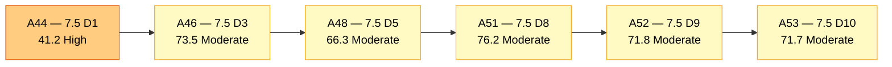
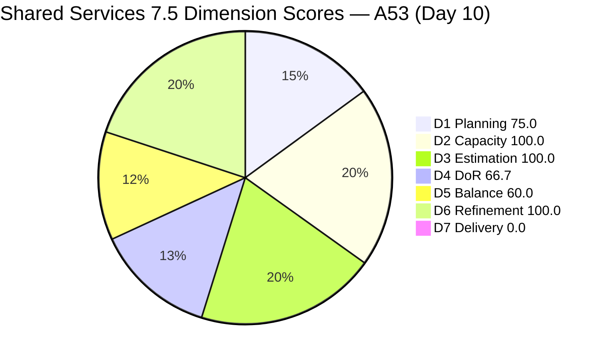
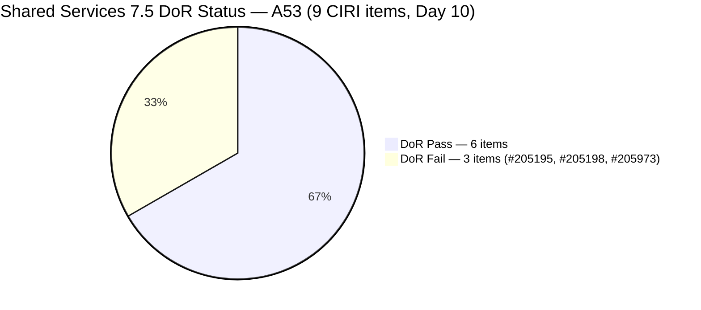
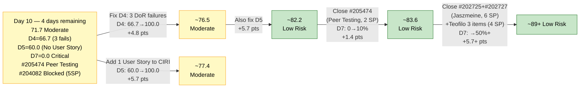

# ADO SAFe Audit — Shared Services Team

## 1. Audit Metadata

| Field | Value |
|---|---|
| **Audit Date** | 2026-06-10 CST |
| **Sprint Day** | **10 of 14** |
| **Prior Audit** | A52 — `AUDIT_20260609_0203.md` (Overall 71.8, Moderate Risk — 7.5 Day 9) |
| **ADO Project** | Jairosoft Portfolio (`666bb99a-6acd-4999-bb34-efd0e4ea90dc`) |
| **ADO Team** | Shared Services Team (`bd9578fd-5773-48fc-bd80-988dfe5de806`) |
| **Iteration** | Iteration 7.5 (`9c70d575-210a-4156-bbdc-79f1efbe2869`) |
| **Iteration Path** | `Jairosoft Portfolio\2026-PI7\Iteration 7.5` |
| **Iteration Dates** | Jun 1, 2026 – Jun 14, 2026 |
| **Workspace Folder** | `ado_shared` |
| **Overall Score** | **71.7 — Moderate Risk** |
| **Risk Band** | Moderate (60–79.9) |
| **Visible Backlog Items (VRBI)** | 12 open root items |
| **Current Iteration Root Items (CIRI)** | 9 items (IterationPath = Iteration 7.5) |
| **Capacity** | Teofilo: 6h/day · Jaszmeine: 3h/day · Ramon: 0.5h/day = 15.5h/day (Shared Services Team) |
| **Project Exception** | Board URL uses `/Stories` — backlog category `Microsoft.RequirementCategory` confirmed |

---

## 2. Executive Summary

The Shared Services Team scores **71.7 — Moderate Risk** on Day 10 of Iteration 7.5, a **−0.1 point decrease** from A52 (71.8) — essentially flat. The score stability masks a significant structural change: CIRI expanded from 8 to 9 as #204082 (QA Jodex / AI Enablement Session, Enabler, 5 SP, Ramon) has appeared in the Iteration 7.5 backlog, adding a high-SP Blocked item. Three persistent DoR failures continue (#205195, #205198, #205973) and no User Story remains in the live CIRI.

Key findings:

- **#204082 (QA Jodex / AI Enablement Session, Enabler, 5 SP, Blocked) entered the live backlog CIRI.** This item was previously assigned to Ramon, is Blocked, and adds 5 SP to the committed total (CSP increases from 15 to 20 SP). Its description and AC are adequate for DoR (both exceed thresholds), so D4 improves marginally. However, the Blocked state raises execution concern.
- **D4 improved from 62.5 to 66.7.** CIRI expanded to 9 items. #204082 passes DoR. Three failures persist (#205195, #205198, #205973). Net: 6/9 = 66.7%.
- **D5 persists at 60.0 — No User Story in CIRI.** No User Story has been added to the backlog. The −40 No-User-Story penalty continues unchanged from A52.
- **D7 = 0.0 continues.** CSP has grown to 20 SP across 9 items. No CIRI items are in Closed/Done state. #205474 (Peer Testing, 2 SP) remains the nearest-closure candidate.
- **D1 degraded slightly from 80.0 to 75.0.** VRBI expanded from 10 to 12 as #204082 and #204087 appear as visible backlog items, while CIRI grew by 1. New ratio: 9/12 = 75.0.
- **Path to Low Risk remains clear but requires same-day action.** Fix 3 DoR failures (+4.8 pts), add 1 User Story (+5.7 pts), close #205474 (+1.4 pts): combined impact → approximately 83.6 (Low Risk). All three are achievable today.

---

## 3. Previous Audit Delta (A52 → A53)

| Dimension | A52 Score (7.5 Day 9) | A53 Score (7.5 Day 10) | Delta | Driver |
|---|---|---|---|---|
| D1 Iteration Planning | 80.0 | **75.0** | **−5.0** | VRBI grew 10→12 (new items #204082 + #204087 visible); CIRI grew 8→9 (#204082 joins). Net: 9/12 = 75.0. |
| D2 Team Capacity | 100.0 | **100.0** | 0.0 | Teofilo, Jaszmeine, Ramon all have configured capacity. 3/3 = 100.0. |
| D3 Estimation | 100.0 | **100.0** | 0.0 | All 9 CIRI items estimated. CSP = 20 SP (#204082 adds 5 SP). |
| D4 DoR Compliance | 62.5 | **66.7** | **+4.2** | CIRI grew 8→9; #204082 passes DoR. 3 failures persist. 6/9 = 66.7. |
| D5 Work Item Balance | 60.0 | **60.0** | 0.0 | No User Story added. −40 No-User-Story penalty unchanged. |
| D6 Backlog Refinement | 100.0 | **100.0** | 0.0 | All 12 VRBI fresh; 0 untouched CIRI (all changed Jun 1+). No penalties. |
| D7 Delivery Predictability | 0.0 | **0.0** | 0.0 | 0 SP closed from live CIRI / 20 SP committed. No live closures. |
| **Overall** | **71.8** | **71.7** | **−0.1** | Essentially flat. D4 minor improvement offset by D1 slight decline. |

**Formula verification:** (75.0 + 100.0 + 100.0 + 66.7 + 60.0 + 100.0 + 0.0) / 7 = 501.7 / 7 = **71.7**

**Key transition observations A52 → A53:**
- **#204082** (QA Jodex / AI Enablement Session, Enabler, 5 SP, Blocked, Ramon): Entered the live backlog snapshot in CIRI. Previously this item may have been at a non-backlog level or not visible in the backlog API. It is now visible as a root-level Iteration 7.5 item. State = Blocked — no execution evident. DoR passes (Desc ~45 NWS, AC 4 bullets ✓). Adds 5 SP to CSP.
- **#204087** (PO — Jodex AI Enablement Sessions, Enabler, 5 SP, Active, Ramon): Appears in visible backlog but IterationPath = `Jairosoft Portfolio\2026-PI7\Iteration 7.6 (IP)` — NOT CIRI. Contributes to VRBI count.
- **VRBI expanded 10 → 12:** Two new items appeared in the backlog API view: #204082 (CIRI) and #204087 (non-CIRI). No items closed from A52's live CIRI snapshot in today's data.

---

## 4. Current Iteration Snapshot

| Metric | Value |
|---|---|
| **Visible Backlog Items (VRBI)** | 12 |
| **Current Iteration Root Items (CIRI)** | 9 (IterationPath = Iteration 7.5) |
| **Non-current items** | 3 — #202947 (7.6 IP), #204087 (7.6 IP), #204950 (7.6 IP) |
| **Story Points Committed (CSP)** | 20 SP (all 9 CIRI items estimated) |
| **Story Points Closed (CLSP)** | 0 SP (no live CIRI items in Closed/Done state) |
| **Sprint Day / Total** | **10 / 14** — Day 10 |
| **Team Size (distinct CIRI assignees)** | 3 (Teofilo: 4 items, Jaszmeine: 4 items, Ramon: 1 item) |
| **Total Capacity** | 15.5h/day (Shared Services Team) |
| **Remaining Capacity** | 15.5h/day × 4 days = 62 hours |
| **Iteration Start / Finish** | Jun 1, 2026 – Jun 14, 2026 |

**CIRI SP distribution by assignee (live):**

| Assignee | CIRI Items | SP Committed | DoR Status |
|---|---|---|---|
| Teofilo Limpag | 4 (#204205, #205474, #205778, #205973) | 7 SP | #205973 Fail |
| Jaszmeine Villanueva | 4 (#202725, #202727, #205195, #205198) | 8 SP | #205195, #205198 Fail |
| Ramon Aseniero | 1 (#204082) | 5 SP | Pass |
| **Total** | **9** | **20 SP** | **3 failures** |

**Sprint-to-date contextual delivery (cumulative through Day 10 — consistent with A52):**

Approximately 28+ SP across 16+ items (primarily Teofilo). No new confirmed closures visible in today's backlog snapshot compared to A52.

---

## 5. Work Item Analysis

### Current Iteration Items (9 items — IterationPath = Iteration 7.5, open)

| ID | Title | Type | State | SP | Assignee | DoR | ChangedDate | Notes |
|---|---|---|---|---|---|---|---|---|
| #202725 | Messaging & Communication | Design | Design Review | 3 | Jaszmeine | **Pass** | Jun 7 | In Design Review — pending approval. 9 days in sprint. |
| #202727 | Contract Management | Design | Active | 3 | Jaszmeine | **Pass** | Jun 9 | Active; large AC — well-specified. |
| #204082 | QA Jodex / AI Enablement Session | Enabler | Blocked | 5 | Ramon | **Pass** | Jun 10 | NEW in CIRI today. Blocked state — no execution. High SP. |
| #204205 | Android Phone from US — For Receiving | Enabler | Active | 1 | Teofilo | **Pass** | Jun 9 | Active; DoR resolved Jun 8. |
| #205195 | [Retro] Alternative to Figma | Spike | Active | 1 | Jaszmeine | **Fail** | Jun 10 | Desc ~15 NWS < 30 threshold. Persistent 8 days. |
| #205198 | [Retro] Design Deliverables on track | Spike | Active | 1 | Jaszmeine | **Fail** | Jun 10 | Desc ~9 NWS < 30 threshold. Persistent 8 days. |
| #205474 | Up Mikrotik VPN | Enabler | Peer Testing | 2 | Teofilo | **Pass** | Jun 9 | Peer Testing — nearest to closure. 2 days in Peer Testing. |
| #205778 | Action 2: Setup Frontend CI Gates | Defect | Active | 2 | Teofilo | **Pass** | Jun 8 | Active; structured Desc+AC present. |
| #205973 | JIT Bubble Training Setup | Enabler | Grooming | 2 | Teofilo | **Fail** | Jun 9 | Desc ~7 NWS, AC ~8 NWS — both fail thresholds. |

### Non-CIRI Backlog Items (3 items — future iterations)

| ID | Title | Iter | Type | State | Assignee | Changed | DoR Notes |
|---|---|---|---|---|---|---|---|
| #202947 | IT Support Services Feedback Survey | 7.6 IP | Spike | New | Teofilo | Jun 10 | Desc ~30 NWS borderline, no AC documented |
| #204087 | PO — Jodex AI Enablement Sessions | 7.6 IP | Enabler | Active | Ramon | Jun 10 | Desc ✓, AC ✓ — DoR Pass |
| #204950 | Monthly Costing — July 2026 | 7.6 IP | Enabler | New | Teofilo | Jun 10 | Desc ✓, AC ✓ — DoR Pass |

### DoR Assessment — 9 CIRI Items

| ID | Title | Desc ≥ 30 NWS | AC ≥ 20 NWS | Result |
|---|---|---|---|---|
| #202725 | Messaging & Communication | ✓ (~55 NWS) | ✓ (multi-AC) | **Pass** |
| #202727 | Contract Management | ✓ (~60 NWS) | ✓ (multi-AC) | **Pass** |
| #204082 | QA Jodex / AI Enablement Session | ✓ (~45 NWS: "Conduct a hands-on AI Enablement session…") | ✓ (4 checklist ACs) | **Pass** |
| #204205 | Android Phone from US | ✓ (~40 NWS) | ✓ (3 bullets) | **Pass** |
| #205195 | [Retro] Alternative to Figma | ✗ (~15 NWS) | ✓ (~22 NWS) | **Fail — Desc short** |
| #205198 | [Retro] Design Deliverables on track | ✗ (~9 NWS) | ✓ (~35 NWS) | **Fail — Desc short** |
| #205474 | Up Mikrotik VPN | ✓ (~30 NWS) | ✓ (3 bullets) | **Pass** |
| #205778 | Setup Frontend CI Gates | ✓ (structured, ~50 NWS) | ✓ | **Pass** |
| #205973 | JIT Bubble Training Setup | ✗ (~7 NWS: "Setup bubble machines in 2F") | ✗ (~8 NWS: "Should be able to perform Bubble training requirements") | **Fail — both fields minimal** |

**Pass: 6/9. Fail: 3 (#205195, #205198, #205973). DCI = 6/9 = 66.7%**

### Type Distribution (9 CIRI items)

| Type | Count | Share | D5 Impact |
|---|---|---|---|
| Enabler | 4 (#204082, #204205, #205474, #205973) | 44.4% | Dominant type — ≤60%, no penalty |
| Design | 2 (#202725, #202727) | 22.2% | — |
| Spike | 2 (#205195, #205198) | 22.2% | 22.2% < 40% — no penalty |
| Defect | 1 (#205778) | 11.1% | — |
| User Story | 0 | **0%** | **−40 PENALTY — No User Story in CIRI** |
| **Total** | **9** | **100%** | **Score: 60.0** |

---

## 6. SAFe Compliance Scorecard

| Dimension | Score | Band | Evidence | Notes |
|---|---|---|---|---|
| D1 Iteration Planning | **75.0** | Moderate | 9 CIRI / 12 VRBI | Slight decline from 80.0. VRBI grew (+2: #204082 CIRI, #204087 non-CIRI). CIRI grew +1. Net: 9/12 = 75.0. |
| D2 Team Capacity | **100.0** | Low | 3/3 contributors with capacity | Teofilo 6h/day, Jaszmeine 3h/day, Ramon 0.5h/day — all configured. |
| D3 Estimation | **100.0** | Low | 9/9 ECI | All CIRI items estimated. CSP = 20 SP (#204082 adds 5 SP). |
| D4 DoR Compliance | **66.7** | Moderate | 6 DCI / 9 CIRI | Improved from 62.5. #204082 passes. 3 failures: #205195, #205198, #205973 persist. |
| D5 Work Item Balance | **60.0** | Moderate | No User Story in CIRI → −40 penalty | Persistent from A52. No User Story added to CIRI. |
| D6 Backlog Refinement | **100.0** | Low | 12/12 fresh; 0/9 untouched CIRI | All VRBI fresh. No staleness. #202947 changed Jun 10 — within window. |
| D7 Delivery Predictability | **0.0** | Critical | 0 SP closed (live CIRI) / 20 SP committed | Day 10. No live CIRI items in Closed/Done. #205474 in Peer Testing. Sprint-to-date ~28+ SP contextual. |
| **OVERALL** | **71.7** | **Moderate** | (75.0+100.0+100.0+66.7+60.0+100.0+0.0)/7 | −0.1 from A52. Score plateau — D4 slight improvement, D1 slight decline. |

**Formula verification:** (75.0 + 100.0 + 100.0 + 66.7 + 60.0 + 100.0 + 0.0) / 7 = 501.7 / 7 = **71.7**

---

## 7. Dimension Findings

### D1 — Iteration Planning: 75.0 / 100 — Moderate Risk

**Formula:** CIRI / VRBI × 100 = 9 / 12 × 100 = **75.0**

| Metric | Value |
|---|---|
| Visible root backlog items (VRBI) | 12 |
| Items in Iteration 7.5 (CIRI) | 9 |
| Items in future iterations | 3 (#202947, #204087, #204950 — all in 7.6 IP) |
| Score | **75.0** |

D1 declined from 80.0 to 75.0 as VRBI grew by 2 with only a net +1 CIRI item. The ratio dropped slightly from 8/10 to 9/12 = 75.0. This remains in Moderate Risk but retreated from the Low Risk boundary. As Teofilo closes items, CIRI will shrink — VRBI is now 12, so the denominator effect could help maintain ratio if pull-in is done from the 7.6 IP queue.

If Teofilo closes all 4 of his CIRI items without VRBI changing: CIRI = 5/12 = 41.7% — High Risk. Active replenishment from the 7.6 IP queue (#202947, #204950) is essential through sprint end.

---

### D2 — Team Capacity: 100.0 / 100 — Low Risk

**Formula:** CC / CW × 100 = 3 / 3 × 100 = **100.0**

| Contributor | CIRI Items | Capacity | Status |
|---|---|---|---|
| Teofilo Limpag | 4 (#204205, #205474, #205778, #205973) | 6h/day | Active execution |
| Jaszmeine Villanueva | 4 (#202725, #202727, #205195, #205198) | 3h/day | Design/Active |
| Ramon Aseniero | 1 (#204082) | 0.5h/day | Blocked item |

All 3 contributors with CIRI work have positive capacity configured. D2 = 100.0. Ramon's #204082 is Blocked — his 0.5h/day capacity is insufficient to independently unblock the item, but D2 assesses capacity configuration, not execution status. 62 hours remain over 4 days for the team.

**Note on #204082 (Blocked):** This item (5 SP) is Blocked and assigned to Ramon. At 0.5h/day remaining capacity (2h total through sprint end), the 5 SP assigned cannot realistically be closed. The Blocked state must be resolved to enable any D7 contribution from this item. Ramon should immediately document the blocker and either (a) resolve it, (b) reduce scope, or (c) move the item to Iteration 7.6 IP.

---

### D3 — Estimation: 100.0 / 100 — Low Risk

**Formula:** ECI / PECI × 100 = 9 / 9 × 100 = **100.0**

| ID | Title | Type | SP |
|---|---|---|---|
| #202725 | Messaging & Communication | Design | 3 |
| #202727 | Contract Management | Design | 3 |
| #204082 | QA Jodex / AI Enablement Session | Enabler | 5 |
| #204205 | Android Phone from US | Enabler | 1 |
| #205195 | [Retro] Alternative to Figma | Spike | 1 |
| #205198 | [Retro] Design Deliverables on track | Spike | 1 |
| #205474 | Up Mikrotik VPN | Enabler | 2 |
| #205778 | Setup Frontend CI Gates | Defect | 2 |
| #205973 | JIT Bubble Training Setup | Enabler | 2 |

**CSP = 20 SP.** All 9 CIRI items are estimated. #204082 adds 5 SP (the largest single item in CIRI). D3 = 100.0 maintained.

---

### D4 — DoR Compliance: 66.7 / 100 — Moderate Risk

**Formula:** DCI / CIRI × 100 = 6 / 9 × 100 = **66.7**

Improved from 62.5 (A52) as #204082 entered CIRI with passing DoR. Three failures persist:

**#205195** (Jaszmeine, Spike, Active, 1 SP) — *Persistent failure since Day 2 (8 days)*:
- Desc: "figma dev MCP helped a lot in developing the designs / Dev0 / Lovable / Stitch / Claude Design" — ~15 NWS. Below 30 threshold.
- AC: passes (~22 NWS).
- Fix (1 sentence, 30 seconds): "This spike evaluates AI-integrated design alternatives to Figma — specifically Dev0, Lovable, Stitch, and Claude Design — to identify tools that integrate natively with Jodex and reduce the manual Figma-to-dev handoff overhead."
- Urgency: **8 consecutive days of DoR failure on a trivial fix.** Must be resolved today.

**#205198** (Jaszmeine, Spike, Active, 1 SP) — *Persistent failure since Day 2 (8 days)*:
- Desc: "design items to be provided completely before iteration starts" — ~9 NWS. Below 30 threshold.
- AC: passes (~35 NWS with linked items).
- Fix (1 sentence, 30 seconds): "This retrospective spike tracks the completion of four outstanding design deliverables (#202724, #202553, #202727, #202725) to ensure the design pipeline is fully cleared and does not carry over unresolved items into Iteration 7.6."
- Urgency: **8 consecutive days of DoR failure on a trivial fix.** Must be resolved today.

**#205973** (Teofilo, Enabler, Grooming, 2 SP) — *Failure since Day 9 entry (2 days)*:
- Desc: "Setup bubble machines in 2F" — ~7 NWS. Well below 30 threshold.
- AC: "Should be able to perform Bubble training requirements" — ~8 NWS. Well below 20 threshold.
- Fix: Expand both fields.
  - Suggested Desc: "Configure and validate all Bubble.io training workstations in the second-floor training room, ensuring each machine has current browser access to the Bubble platform, appropriate user accounts, and the training agenda pre-loaded for the JIT team cohort."
  - Suggested AC: "AC1: All 2F machines confirmed accessible to Bubble.io with valid login credentials. AC2: Training agenda and materials pre-loaded on each workstation. AC3: Trainer verified connectivity and participant access at least 1 hour before session start."
- Urgency: Item is in Grooming — must be DoR-compliant before moving to Active.

Remediating all three: D4 = 9/9 = 100.0. Overall impact: +4.8 pts → 71.7 + 4.8 = 76.5.

---

### D5 — Work Item Balance: 60.0 / 100 — Moderate Risk

**Formula:** Base 100 − penalties applied independently

| Penalty | Trigger | Applied |
|---|---|---|
| −40: No User Story in CIRI | **0 User Stories in CIRI** | **YES — applied (Day 2 through Day 10)** |
| −30: Dominant type share > 60% | Enabler = 4/9 = 44.4% — no single type > 60% | **No** |
| −20: Spike share > 40% | Spike = 2/9 = 22.2% | **No** |

**Score:** max(0, 100 − 40) = **60.0**

D5 = 60.0 for the second consecutive audit. #204238 (the sole User Story) closed on Jun 9, triggering this penalty. No User Story has been added in 2 days. This is the primary gap between current score (71.7) and Low Risk threshold (80.0).

**Immediate fix:** Add any work item classified as User Story to CIRI:
- Ramon: add a User Story for any pending process, documentation, or operational requirement.
- Teofilo: if #204205 (Android Phone setup) or #205778 (CI Gates) more accurately represents a user-facing delivery, consider reclassifying to User Story.
- Pull a User Story from the backlog pool or create a new one for an outstanding team commitment.

Adding 1 User Story: D5 → 100.0, +5.7 pts → Overall 77.4. Combined with D4 fix: Overall → 82.2 (Low Risk).

---

### D6 — Backlog Refinement: 100.0 / 100 — Low Risk

**Freshness window:** ChangedDate ≥ 2026-04-26 (45 days before 2026-06-10)

| Metric | Value |
|---|---|
| Total VRBI | 12 |
| Fresh items (ChangedDate ≥ Apr 26, 2026) | 12 — all items changed May 19 or later |
| Stale_90 items (ChangedDate < Mar 11, 2026) | 0 |
| Stale_180 items (ChangedDate < Dec 11, 2025) | 0 |
| Untouched CIRI (ChangedDate < Jun 1, 2026) | 0 — all 9 CIRI items changed Jun 1 or later |

**Penalty calculation:**
- stale_90: 0 items → no penalty
- stale_180: 0 items → no penalty
- Untouched CIRI: 0/9 = 0% → no penalty (oldest: #202725 Jun 7, #205195 Jun 4 — both after Jun 1)

**Score:** max(0, 100.0 − 0) = **100.0**

D6 maintains perfect score for the fifth consecutive audit. All 12 VRBI items are fresh, and all 9 CIRI items have been touched within the sprint window. Monitor #202947 (last changed Jun 10 — now fresh) and #204950 (Jun 10) through PI7 end.

---

### D7 — Delivery Predictability: 0.0 / 100 — Critical

**Formula:** CLSP / CSP × 100 = 0 / 20 × 100 = **0.0**

| Metric | Value |
|---|---|
| Estimated current items (ECI) | 9 |
| Committed Story Points (CSP) | 20 SP |
| Closed Story Points (CLSP) | 0 SP (no live CIRI items in Closed/Done) |
| Nearest closure candidate | #205474 (Peer Testing, Teofilo, 2 SP, DoR Pass) |
| #204082 risk | Blocked, 5 SP, Ramon — high risk of non-delivery |
| Sprint-to-date delivered (contextual) | ~28+ SP, ~16+ items |
| Score | **0.0** |

**Day 10 of 14.** D7 = 0.0 for the seventh consecutive audit. The formula gap continues: Teofilo's execution cadence is strong (~28 SP delivered sprint-to-date) but items consistently close overnight and exit before the morning snapshot.

**Critical note on #204082 (Blocked, 5 SP):** This item constitutes 25% of committed SP. With Ramon at only 0.5h/day (2h total remaining), a Blocked Enabler has near-zero probability of closing this sprint. If this item remains Blocked through Day 14, 5/20 SP are permanently uncreditable. Recommend Ramon moves #204082 to Iteration 7.6 IP to reset CSP to 15 SP — making D7 recovery more achievable.

**Recovery math (4 days remaining):**

*With #204082 remaining in CIRI (20 SP base):*
- Close #205474 (2 SP): D7 = 10%, Overall → 72.8
- Fix D4+D5 + close #205474: D7 = 10%, Overall → 83.6 (Low Risk)
- Fix D4+D5 + close 3 items (8 SP): D7 = 40%, Overall → 89.3 (Low Risk)

*If Ramon moves #204082 to 7.6 IP (15 SP base):*
- Close #205474 (2 SP): D7 = 13.3%, Overall → 72.8 (D7 improvement marginal vs full formula)
- Fix D4+D5 + close #205474 + close #204205: D7 = 20%, Overall → 83.9 (Low Risk)

**Highest-priority D7 actions:**
1. #205474 (Up Mikrotik VPN, Peer Testing, 2 SP) — should close today (Day 10, 2 days in Peer Testing)
2. #204205 (Android Phone, Active, 1 SP) — near completion per state
3. #205778 (Setup Frontend CI Gates, Active, 2 SP) — Teofilo working item

---

## 8. Risks and Bottlenecks

| # | Severity | Dimension | Risk | Recommended Action |
|---|---|---|---|---|
| R1 | **CRITICAL** | D5 | No User Story in CIRI for 2 days. D5 = 60.0 (−40 penalty). The penalty costs the team 5.7 pts vs potential. No User Story currently exists in the 7.6 IP queue either. | **Ramon or Teofilo: add 1 User Story to CIRI today.** Any work item classified as User Story resolves this immediately. Options: (a) New US for FinOps board documentation; (b) Reclassify an existing operational work item as User Story; (c) Add a new User Story for an outstanding team delivery. D5 → 100.0, Overall +5.7 pts. |
| R2 | **CRITICAL** | D7 | Day 10 with 0 SP credited from live CIRI. #205474 (Peer Testing, 2 SP) has been in Peer Testing for 2 days — should be closeable today. | **Teofilo: close #205474 (Up Mikrotik VPN, Peer Testing, 2 SP, DoR Pass) today.** This is the highest-probability closure. D7 → 10–13%, Overall +1.4 pts. Then close #204205 (Active, 1 SP, DoR Pass). |
| R3 | **HIGH** | D4 | Three DoR failures persist: #205195 and #205198 (Jaszmeine — thin descriptions, 8 days), #205973 (Teofilo — both fields minimal, 2 days). Combined fix worth +4.8 pts. | **Jaszmeine: expand #205195 and #205198 descriptions to ≥30 NWS today (1 sentence each — 2 minutes total).** **Teofilo: update #205973 Desc to ≥30 NWS and add AC ≥20 NWS before beginning Bubble training work** (see Section 7 for suggested text). |
| R4 | **HIGH** | D7 (structural) | #204082 (Blocked, 5 SP, Ramon) constitutes 25% of committed SP. At 0.5h/day remaining (2h total), this item cannot realistically be delivered. Leaving it in CIRI inflates CSP, making D7 recovery harder. | **Ramon: resolve the blocker on #204082 today, or move it to Iteration 7.6 IP.** Moving it reduces CSP to 15 SP — each closure is worth 6.7% vs 5% now — making D7 recovery more achievable for Teofilo and Jaszmeine. |
| R5 | **HIGH** | D1 | D1 = 75.0. If Teofilo closes all 4 CIRI items (his demonstrated cadence), CIRI drops to 5/12 = 41.7% without replenishment — High Risk. | **Move #204950 (Monthly Costing July, 7.6 IP, Teofilo, DoR Pass) to Iteration 7.5** as Teofilo closes items. This maintains CIRI ≥ 9 and D1 ≥ 75.0. #202947 needs AC before being moved. |
| R6 | **MEDIUM** | D4 (process) | #205973 entered CIRI in Grooming state with 7-NWS description and 8-NWS AC. This repeats the exact pattern from #204238 (A47), #205195/#205198 (A44), and #205899 (A44). The team has not adopted a pre-CIRI DoR gate after 9 audits. | **Establish personal DoR gate:** any item moved to Iteration 7.5 IterationPath must have Desc ≥30 NWS and AC ≥20 NWS before the move. No tooling change needed — behavioral only. |
| R7 | **LOW** | D7 (formula) | Sprint-to-date delivery: ~28+ SP contextual. D7 = 0.0 is a formula snapshot artifact. | No scoring action. Record contextual delivery in each audit. Consider end-of-day audit timing. |

---

## 9. Prioritized Recommendations

1. **[CRITICAL — Today Day 10]** Add 1 User Story to CIRI immediately. This single action is worth +5.7 pts to Overall and eliminates the D5 −40 No-User-Story penalty. Any User Story typed item qualifies. Combined with D4 fix: Overall → ~82.2 (Low Risk). This has been actionable since Jun 9 — every day of delay costs 5.7 pts.

2. **[CRITICAL — Today Day 10]** Teofilo: close #205474 (Up Mikrotik VPN, Peer Testing, 2 SP, DoR Pass). Item entered Peer Testing Jun 8 — Day 10 is the expected close window. Closing it: D7 = 10–13%, Overall → 73.1. With D4+D5 fixed: Overall → 84.4 (Low Risk).

3. **[CRITICAL — Today Day 10]** Fix all 3 DoR failures:
   - Jaszmeine: Expand #205195 Desc to ≥30 NWS (1 sentence — see Section 7 for exact text).
   - Jaszmeine: Expand #205198 Desc to ≥30 NWS (1 sentence — see Section 7 for exact text).
   - Teofilo: Expand #205973 Desc to ≥30 NWS AND add AC ≥20 NWS (see Section 7 for full suggested text). Do this before beginning Bubble training setup work.

4. **[HIGH — Today Day 10]** Ramon: resolve blocker on #204082 (Blocked, 5 SP) or move to Iteration 7.6 IP. This item is Blocked, assigned to Ramon (0.5h/day remaining = 2h total), and constitutes 25% of committed SP. Moving it to 7.6 IP: CSP resets to 15 SP, and each Teofilo/Jaszmeine closure is worth 6.7% D7 credit instead of 5%. Do this today.

5. **[HIGH — Days 10–11]** Jaszmeine: close #202725 (Messaging & Communication, Design Review, 3 SP) and #202727 (Contract Management, Active, 3 SP). These are the highest-SP closeable items for Jaszmeine. #202725 has been in Design Review since Jun 7 — approver sign-off should be coordinated today for Day 10–11 closure. Closing both: D7 += 6/15 = 40% (if CSP reduced to 15 SP).

6. **[HIGH — Days 10–11]** Teofilo: close #204205 (Android Phone, Active, 1 SP, DoR Pass) and #205778 (Setup Frontend CI Gates, Active, 2 SP, DoR Pass) in addition to #205474. Three Teofilo closures in 4 days is well within his demonstrated capacity. Closing all three (5 SP): D7 reaches 33% (vs 15 SP base).

7. **[MEDIUM — Day 10]** Move #204950 (Monthly Costing July 2026, 7.6 IP, Teofilo, DoR Pass) to Iteration 7.5 as Teofilo closes items, maintaining D1 ≥ 75.0 through sprint end. #204950 already has full Desc and AC — no DoR work needed before moving.

8. **[STANDING]** DoR pre-entry gate: any item moved to Iteration 7.5 IterationPath must have Desc ≥30 NWS and AC ≥20 NWS before the move. This is the fourth PI7 iteration of this pattern. A simple personal checklist (2-item check before moving IterationPath) would eliminate these recurring D4 failures.

---

## 10. Evidence Gaps and Limitations

| Gap | Impact | Notes |
|---|---|---|
| **D7 = 0.0 structural issue** | Understates actual delivery | Sprint-to-date: ~28+ SP across ~16+ items (contextual, primarily Teofilo). D7 = 0.0 is technically accurate per rubric — items close overnight and exit the backlog before the morning snapshot. |
| **#204082 Blocked — execution status unknown** | D7 risk | This item (5 SP, 25% of CSP) is Blocked. The blocker reason is not documented in the ADO fields visible through the API. Ramon must clarify and document the blocker, then either resolve or defer the item. |
| **D5 No-User-Story — 2nd consecutive day** | −40 structural penalty | #204238 closed Jun 9 (Day 9). No User Story added in 2 days. The team's natural work type skews to Enabler/Design/Spike — a User Story must be intentionally added, not expected organically. |
| **Capacity for #202725 (Design Review)** | D7 risk | #202725 has been in Design Review for 3 days (since Jun 7). The blocker is approver availability. If approval is not granted by Day 12, this 3-SP item cannot be credited against D7. Jaszmeine should escalate today. |
| **#202947 DoR borderline** | D6/D1 maintenance risk | #202947 (Spike, 7.6 IP) has a description of roughly 30 NWS (borderline) and no AC documented. If moved to CIRI, it would likely fail D4. Add AC before moving. |

---

## 11. Visualizations

### Score Trend (A44 → A53)

### Dimension Scores — A53 (Day 10)

### DoR Status — 9 CIRI Items (Day 10)

### Remediation Impact Path — From Day 10

---

## 12. Audit Trail

| Source | Tool | Data |
|---|---|---|
| Current iteration | `work_list_team_iterations` (project `666bb99a`, team `bd9578fd`, timeframe=current) | Iteration 7.5: Jun 1–14, 2026; ID `9c70d575-210a-4156-bbdc-79f1efbe2869` — confirmed |
| Backlog items | `wit_list_backlog_work_items` (backlogId `Microsoft.RequirementCategory`) | 12 open root items (net from A52: +2 items appeared — #204082 CIRI, #204087 non-CIRI) |
| Work item details | `wit_get_work_items_batch_by_ids` (12 backlog items) | SP, State, Type, Desc, AC, ChangedDate, IterationPath confirmed for all items |
| Team capacity | `work_get_iteration_capacities` (project `666bb99a`, iterationId `9c70d575`) | Shared Services Team (bd9578fd): 15.5h/day; 0 days off — unchanged |
| Prior audit | `AUDIT_20260609_0203.md` (A52) | Overall 71.8, Moderate Risk, 7.5 Day 9, 10 VRBI, 8 CIRI, 15 SP committed, 0 SP closed |
