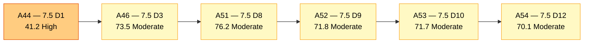
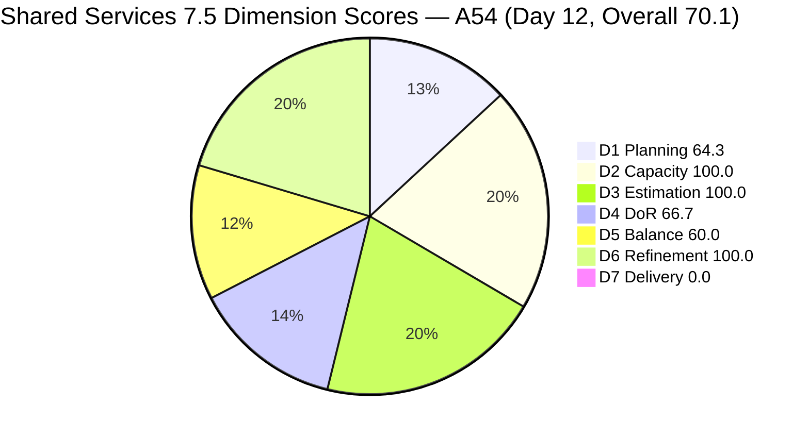
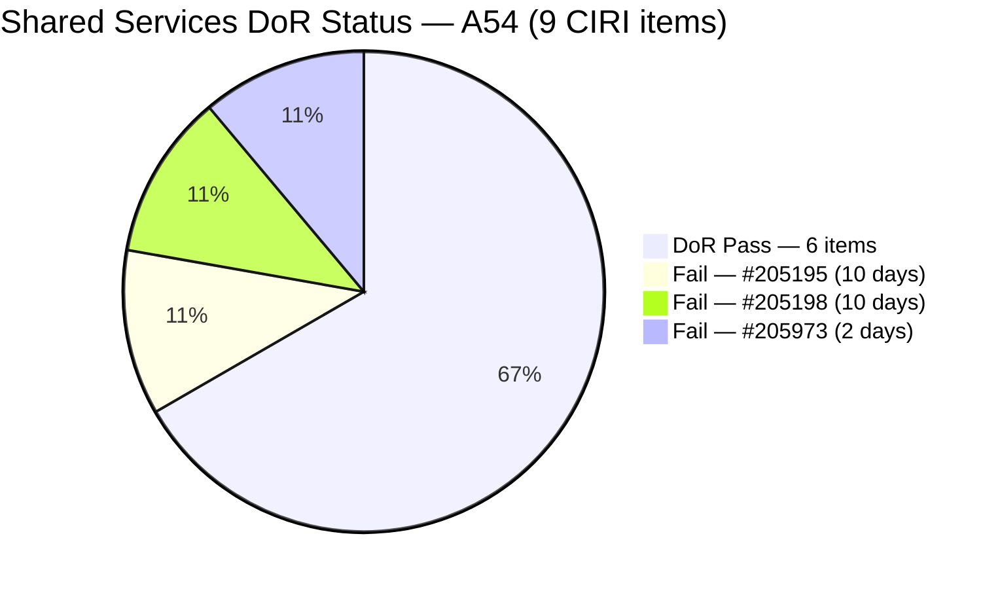
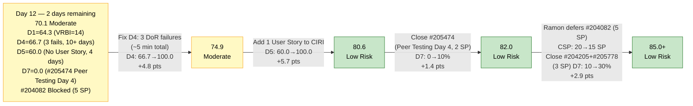
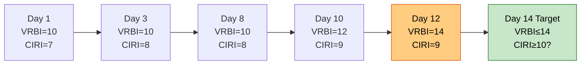

# ADO SAFe Audit — Shared Services Team

## 1. Audit Metadata

| Field | Value |
|---|---|
| **Audit Date** | 2026-06-12 02:03 CST |
| **Sprint Day** | **12 of 14** |
| **Prior Audit** | A53 — `AUDIT_20260610_0203.md` (Overall 71.7, Moderate Risk — 7.5 Day 10) |
| **ADO Project** | Jairosoft Portfolio (`666bb99a-6acd-4999-bb34-efd0e4ea90dc`) |
| **ADO Team** | Shared Services Team (`bd9578fd-5773-48fc-bd80-988dfe5de806`) |
| **Iteration** | Iteration 7.5 (`9c70d575-210a-4156-bbdc-79f1efbe2869`) |
| **Iteration Path** | `Jairosoft Portfolio\2026-PI7\Iteration 7.5` |
| **Iteration Dates** | Jun 1, 2026 – Jun 14, 2026 |
| **Workspace Folder** | `ado_shared` |
| **Overall Score** | **70.1 — Moderate Risk** |
| **Risk Band** | Moderate (60–79.9) |
| **Visible Backlog Items (VRBI)** | 14 open root items |
| **Current Iteration Root Items (CIRI)** | 9 items (IterationPath = Iteration 7.5) |
| **Capacity** | Teofilo: 6h/day · Jaszmeine: 3h/day · Ramon: 0.5h/day · Vicsante: 6h/day (no CIRI items) = 15.5h/day active |
| **Project Exception** | Board URL uses `/Stories` — backlog category `Microsoft.RequirementCategory` confirmed |

---

## 2. Executive Summary

The Shared Services Team scores **70.1 — Moderate Risk** on Day 12 of Iteration 7.5, a **−1.6 point decrease** from A53 (71.7). The regression is driven by D1 decline: two new items (#206112 Gemini License Plan and #206149 Enhance Mikrotik Security) appeared in the backlog API, expanding VRBI from 12 to 14 while CIRI remained at 9, pushing D1 from 75.0 to 64.3. All other dimensions are unchanged from A53 — the three persistent DoR failures (#205195, #205198, #205973) remain unaddressed, D5 still carries the No-User-Story −40 penalty, and D7 = 0.0 for the ninth consecutive audit.

Key findings:

- **VRBI expanded to 14 — two new items appeared.** #206112 (Gemini License Plan, Spike, New, Teofilo, iteration path `Jairosoft Portfolio\2026-PI7` — PI-level, not sprint-assigned) and #206149 (Enhance Mikrotik Security, Enabler, Grooming, 7.6 IP, Teofilo) are now visible in the backlog. Neither is assigned to Iteration 7.5, so CIRI remains 9. D1 = 9/14 = 64.3 — dropped from 75.0.
- **#205973 promoted from Grooming to Active (Jun 11 update).** The state change is positive, but the item still fails DoR on both Desc (~7 NWS) and AC (~8 NWS). Moving to Active without meeting DoR thresholds continues the persistent pattern.
- **Three DoR failures persist unchanged — Day 12.** #205195 and #205198 (Jaszmeine, Spike) have been failing D4 for 10 consecutive days. #205973 (Teofilo, Enabler) fails on both fields since entry. Combined fix: D4 → 100.0, +4.8 pts.
- **No User Story in CIRI — Day 12.** D5 = 60.0 (−40 penalty) for the fourth consecutive day since #204238 closed Jun 9. This is the largest single gap from Low Risk.
- **#205474 (Up Mikrotik VPN, Peer Testing, 2 SP) remains in Peer Testing.** Now Day 4 of Peer Testing (entered Jun 8). Peer Testing → Closed should have happened by Day 10. Urgent escalation needed.
- **#204082 (Blocked, 5 SP, Ramon) unresolved.** Still Blocked as of last update Jun 10. With Ramon at 0.5h/day (1h remaining capacity over 2 days), this item cannot realistically close this sprint. It occupies 25% of CSP and depresses D7 recovery potential.
- **Path to Low Risk: 2 days, urgent.** Fix D4 (3 items) + Add User Story + Close #205474 = approximately 83.3 overall. All are achievable on Jun 12–13.

---

## 3. Previous Audit Delta (A53 → A54)

| Dimension | A53 Score (7.5 Day 10) | A54 Score (7.5 Day 12) | Delta | Driver |
|---|---|---|---|---|
| D1 Iteration Planning | 75.0 | **64.3** | **−10.7** | VRBI expanded 12→14 (#206112 + #206149 appeared). CIRI unchanged at 9. Net: 9/14 = 64.3. |
| D2 Team Capacity | 100.0 | **100.0** | 0.0 | All 3 contributors with CIRI work have configured capacity. 3/3 = 100.0. |
| D3 Estimation | 100.0 | **100.0** | 0.0 | All 9 CIRI items estimated. CSP = 20 SP. Unchanged. |
| D4 DoR Compliance | 66.7 | **66.7** | 0.0 | 3 failures persist (#205195, #205198, #205973). 6/9 = 66.7. No change despite 2 more days. |
| D5 Work Item Balance | 60.0 | **60.0** | 0.0 | No User Story added. −40 penalty persists. Day 4 without User Story in CIRI. |
| D6 Backlog Refinement | 100.0 | **100.0** | 0.0 | All 14 VRBI fresh; 0 untouched CIRI. #206112 (Jun 11) and #206149 (Jun 11) are fresh. No penalties. |
| D7 Delivery Predictability | 0.0 | **0.0** | 0.0 | 0 SP closed from live CIRI / 20 SP committed. #205474 still in Peer Testing. |
| **Overall** | **71.7** | **70.1** | **−1.6** | D1 regression from VRBI expansion. All other dimensions flat for 2 days. |

**Formula verification:** (64.3 + 100.0 + 100.0 + 66.7 + 60.0 + 100.0 + 0.0) / 7 = 491.0 / 7 = **70.1**

**Key transition observations A53 → A54:**
- **#206112** (Gemini License Plan, Spike, New, Teofilo, IterationPath = `Jairosoft Portfolio\2026-PI7`): New item visible in backlog — assigned to PI-level iteration path, no sprint assignment. No Desc or AC data returned, not estimated. Contributes to VRBI as a root-level item. Not CIRI.
- **#206149** (Enhance Mikrotik Security, Enabler, Grooming, Teofilo, IterationPath = 7.6 IP): New item visible in backlog. Updated Jun 11 (entered backlog view in the last 2 days). Has a description (~70 NWS) but no AC field populated — would fail D4 if moved to CIRI. Not CIRI.
- **#205973 state change: Grooming → Active (Jun 11).** Teofilo moved this item from Grooming to Active. Positive execution signal but DoR still fails on both Desc and AC.
- **#204082** (Blocked, 5 SP, Ramon): Last changed Jun 10. Still Blocked — no progress in 2 days. No resolution or deferral actioned per A53 recommendation.
- **#205474** (Peer Testing, 2 SP, Teofilo): Still in Peer Testing (last changed Jun 9 — 3 days). This item should have closed by now. Peer Testing typically completes in 1–2 days.

---

## 4. Current Iteration Snapshot

| Metric | Value |
|---|---|
| **Visible Backlog Items (VRBI)** | 14 |
| **Current Iteration Root Items (CIRI)** | 9 (IterationPath = Iteration 7.5) |
| **Non-current items** | 5 — #202947 (7.6 IP), #204087 (7.6 IP), #204950 (7.6 IP), #206149 (7.6 IP), #206112 (PI-level) |
| **Story Points Committed (CSP)** | 20 SP (all 9 CIRI items estimated) |
| **Story Points Closed (CLSP)** | 0 SP (no live CIRI items in Closed/Done state) |
| **Sprint Day / Total** | **12 / 14** — Day 12 |
| **Team Size (distinct CIRI assignees)** | 3 (Teofilo: 4 items, Jaszmeine: 4 items, Ramon: 1 item) |
| **Total Capacity (active contributors)** | 15.5h/day (Teofilo 6 + Jaszmeine 3 + Ramon 0.5) |
| **Remaining Capacity (2 days)** | 31 hours |
| **Iteration Start / Finish** | Jun 1, 2026 – Jun 14, 2026 |

**CIRI SP distribution by assignee (live):**

| Assignee | CIRI Items | SP Committed | DoR Status | Execution Signal |
|---|---|---|---|---|
| Teofilo Limpag | 4 (#204205, #205474, #205778, #205973) | 7 SP | #205973 Fail | #205474 in Peer Testing (Day 4); #205973 promoted to Active Jun 11 |
| Jaszmeine Villanueva | 4 (#202725, #202727, #205195, #205198) | 8 SP | #205195, #205198 Fail | #202725 Design Review (Day 5); #202727 Active |
| Ramon Aseniero | 1 (#204082) | 5 SP | Pass | Blocked — unchanged since Jun 10 |
| **Total** | **9** | **20 SP** | **3 failures** | — |

**Sprint-to-date contextual delivery (consistent with A53 — no new closures detected in current backlog snapshot):**
Approximately 28+ SP across 16+ items primarily from Teofilo. D7 formula does not credit sprint-to-date deliveries that have exited the backlog.

---

## 5. Work Item Analysis

### Current Iteration Items (9 items — IterationPath = Iteration 7.5, open)

| ID | Title | Type | State | SP | Assignee | DoR | ChangedDate | Notes |
|---|---|---|---|---|---|---|---|---|
| #202725 | Messaging & Communication | Design | Design Review | 3 | Jaszmeine | **Pass** | Jun 7 | Day 5 in Design Review — approver sign-off overdue. |
| #202727 | Contract Management | Design | Active | 3 | Jaszmeine | **Pass** | Jun 9 | Active; well-specified AC. Execution underway. |
| #204082 | QA Jodex / AI Enablement Session | Enabler | Blocked | 5 | Ramon | **Pass** | Jun 10 | Blocked — 2 days no change. 25% of CSP. 0 delivery probability. |
| #204205 | Android Phone from US | Enabler | Active | 1 | Teofilo | **Pass** | Jun 9 | Active; near completion per prior audits. |
| #205195 | [Retro] Alternative to Figma | Spike | Active | 1 | Jaszmeine | **Fail** | Jun 10 | Desc ~12 NWS < 30. **10 consecutive days of failure.** |
| #205198 | [Retro] Design Deliverables on track | Spike | Active | 1 | Jaszmeine | **Fail** | Jun 10 | Desc ~8 NWS < 30. **10 consecutive days of failure.** |
| #205474 | Up Mikrotik VPN | Enabler | Peer Testing | 2 | Teofilo | **Pass** | Jun 9 | Peer Testing Day 4 — overdue for closure. Highest-priority D7 target. |
| #205778 | Setup Frontend CI Gates | Defect | Active | 2 | Teofilo | **Pass** | Jun 8 | Active; structured Desc+AC. |
| #205973 | JIT Bubble Training Setup | Enabler | Active | 2 | Teofilo | **Fail** | Jun 11 | Promoted Grooming→Active Jun 11. DoR still fails both fields. |

### Non-CIRI Backlog Items (5 items — future iterations or PI-level)

| ID | Title | Iter | Type | State | Assignee | Changed | DoR Notes |
|---|---|---|---|---|---|---|---|
| #202947 | IT Support Services — End of PI7 Feedback Survey | 7.6 IP | Spike | New | Teofilo | Jun 10 | Desc: ~30 NWS borderline, no AC — would fail D4 if moved to CIRI |
| #204087 | PO — Jodex AI Enablement Sessions | 7.6 IP | Enabler | Active | Ramon | Jun 10 | Desc ✓, AC ✓ — DoR Pass |
| #204950 | Monthly Costing report — July 2026 | 7.6 IP | Enabler | New | Teofilo | Jun 10 | Desc ✓, AC ✓ — DoR Pass |
| #206149 | Enhance Mikrotik Security | 7.6 IP | Enabler | Grooming | Teofilo | Jun 11 | Desc ✓ (~70 NWS), no AC — would fail D4 if moved |
| #206112 | Gemini License Plan | PI-level | Spike | New | Teofilo | Jun 11 | No Desc, no AC, no SP — not sprint-ready |

### DoR Assessment — 9 CIRI Items

| ID | Title | Desc ≥ 30 NWS | AC ≥ 20 NWS | Result |
|---|---|---|---|---|
| #202725 | Messaging & Communication | ✓ (~55 NWS) | ✓ (7 BDD scenarios) | **Pass** |
| #202727 | Contract Management | ✓ (~50 NWS) | ✓ (8 structured ACs) | **Pass** |
| #204082 | QA Jodex / AI Enablement Session | ✓ (~40 NWS) | ✓ (4 checklist ACs) | **Pass** |
| #204205 | Android Phone from US | ✓ (~45 NWS) | ✓ (3 bullets) | **Pass** |
| #205195 | [Retro] Alternative to Figma | ✗ (~12 NWS: "figma dev MCP helped a lot / Dev0 / Lovable / Stitch / Claude Design") | ✗ (~10 NWS: 2-bullet AC) | **Fail — both fields** |
| #205198 | [Retro] Design Deliverables on track | ✗ (~8 NWS: "design items to be provided completely before iteration starts") | ✓ (~35 NWS: 4 linked items + narrative) | **Fail — Desc short** |
| #205474 | Up Mikrotik VPN | ✓ (~40 NWS) | ✓ (3 bullets) | **Pass** |
| #205778 | Setup Frontend CI Gates | ✓ (~50 NWS structured) | ✓ (~20 NWS) | **Pass** |
| #205973 | JIT Bubble Training Setup | ✗ (~7 NWS: "Setup bubble machines in 2F") | ✗ (~8 NWS: "Should be able to perform Bubble training requirements") | **Fail — both fields** |

**Pass: 6/9. Fail: 3 (#205195, #205198, #205973). DCI = 6/9 = 66.7%**

Remediation note: fixing all 3 failures requires only text expansion — no structural changes. Total fix time estimated at under 5 minutes for all three items.

### Type Distribution (9 CIRI items)

| Type | Count | Share | D5 Impact |
|---|---|---|---|
| Enabler | 4 (#204082, #204205, #205474, #205973) | 44.4% | Dominant type; ≤60% — no dominant-type penalty |
| Design | 2 (#202725, #202727) | 22.2% | — |
| Spike | 2 (#205195, #205198) | 22.2% | 22.2% < 40% — no Spike penalty |
| Defect | 1 (#205778) | 11.1% | — |
| User Story | **0** | **0.0%** | **−40 PENALTY — No User Story in CIRI** |
| **Total** | **9** | **100%** | **Score: 60.0** |

---

## 6. SAFe Compliance Scorecard

| Dimension | Score | Band | Evidence | Notes |
|---|---|---|---|---|
| D1 Iteration Planning | **64.3** | Moderate | 9 CIRI / 14 VRBI | Declined from 75.0. VRBI expanded +2 (#206112 PI-level, #206149 7.6 IP). CIRI unchanged at 9. |
| D2 Team Capacity | **100.0** | Low | 3/3 contributors with capacity | Teofilo 6h/day, Jaszmeine 3h/day, Ramon 0.5h/day. Vicsante 6h/day (no CIRI items). |
| D3 Estimation | **100.0** | Low | 9/9 ECI | All CIRI items estimated. CSP = 20 SP. |
| D4 DoR Compliance | **66.7** | Moderate | 6 DCI / 9 CIRI | 3 persistent failures. 10 consecutive days (#205195, #205198); 2 days (#205973). No progress despite prior recommendations. |
| D5 Work Item Balance | **60.0** | Moderate | No User Story → −40 penalty | Day 4 without User Story. No User Story added to CIRI despite 4 consecutive audits flagging this. |
| D6 Backlog Refinement | **100.0** | Low | 14/14 fresh; 0/9 untouched CIRI | All fresh. #206112 (Jun 11), #206149 (Jun 11) both within window. |
| D7 Delivery Predictability | **0.0** | Critical | 0 SP closed / 20 SP committed | Day 12. #205474 in Peer Testing Day 4 — must close today. #204082 Blocked (5 SP) — very low closure probability. |
| **OVERALL** | **70.1** | **Moderate** | (64.3+100.0+100.0+66.7+60.0+100.0+0.0)/7 | −1.6 from A53. D1 declined. D4, D5, D7 unchanged and fixable. |

**Formula verification:** (64.3 + 100.0 + 100.0 + 66.7 + 60.0 + 100.0 + 0.0) / 7 = 491.0 / 7 = **70.1**

---

## 7. Dimension Findings

### D1 — Iteration Planning: 64.3 / 100 — Moderate Risk

**Formula:** CIRI / VRBI × 100 = 9 / 14 × 100 = **64.3**

| Metric | Value |
|---|---|
| Visible root backlog items (VRBI) | 14 |
| Items in Iteration 7.5 (CIRI) | 9 |
| Non-current items | 5 (#202947, #204087, #204950 — 7.6 IP; #206149 — 7.6 IP; #206112 — PI-level) |
| Score | **64.3** |

D1 declined from 75.0 (A53) to 64.3 as two new items entered the visible backlog without being sprint-assigned. #206112 has no iteration assignment at all (PI-level) — this is a planning gap; items should be assigned to a sprint or placed in IP before they enter the backlog view. #206149 entered at 7.6 IP — acceptable for future planning.

**Sprint-close D1 risk:** If Teofilo closes his 4 CIRI items without replenishment, CIRI drops to 5/14 = 35.7% (Critical). The VRBI denominator has grown, making each closure a larger relative impact.

---

### D2 — Team Capacity: 100.0 / 100 — Low Risk

**Formula:** CC / CW × 100 = 3 / 3 × 100 = **100.0**

| Contributor | CIRI Items | Capacity | Remaining (2 days) | Status |
|---|---|---|---|---|
| Teofilo Limpag | 4 | 6h/day | 12h | Active execution; #205474 overdue in Peer Testing |
| Jaszmeine Villanueva | 4 | 3h/day | 6h | Design Review + Active items |
| Ramon Aseniero | 1 | 0.5h/day | 1h | Blocked item — capacity insufficient to deliver |
| Vicsante Aseniero | 0 | 6h/day | 12h | Configured but no CIRI items |

Note: Vicsante Aseniero is configured with 6h/day capacity but has no CIRI items assigned. The formula counts only contributors_with_current_work (3 people: Teofilo, Jaszmeine, Ramon), all of whom have capacity. D2 = 100.0.

**Ramon's constraint:** 1h remaining over 2 days. #204082 (Blocked, 5 SP) cannot be delivered at this capacity level. Strongly recommend deferring to 7.6 IP to improve D7 recovery math for Teofilo and Jaszmeine.

---

### D3 — Estimation: 100.0 / 100 — Low Risk

**Formula:** ECI / PECI × 100 = 9 / 9 × 100 = **100.0**

| ID | Title | Type | SP |
|---|---|---|---|
| #202725 | Messaging & Communication | Design | 3 |
| #202727 | Contract Management | Design | 3 |
| #204082 | QA Jodex / AI Enablement Session | Enabler | 5 |
| #204205 | Android Phone from US | Enabler | 1 |
| #205195 | [Retro] Alternative to Figma | Spike | 1 |
| #205198 | [Retro] Design Deliverables on track | Spike | 1 |
| #205474 | Up Mikrotik VPN | Enabler | 2 |
| #205778 | Setup Frontend CI Gates | Defect | 2 |
| #205973 | JIT Bubble Training Setup | Enabler | 2 |

**CSP = 20 SP.** All 9 estimated. D3 = 100.0 maintained. If #204082 is deferred to 7.6 IP, CSP resets to 15 SP — making D7 recovery more achievable (each 1 SP closed = 6.7% vs 5%).

---

### D4 — DoR Compliance: 66.7 / 100 — Moderate Risk

**Formula:** DCI / CIRI × 100 = 6 / 9 × 100 = **66.7**

Identical to A53. Three failures are now at Day 10–12 without remediation:

**#205195** (Jaszmeine, Spike, Active, 1 SP) — *10 consecutive days failure*:
- Desc: "figma dev MCP helped a lot in developing the designs" + bullet list of 4 tools — approximately 12 non-whitespace words. **Threshold: 30 NWS. Fails.**
- Suggested fix (paste into Desc field, takes 30 seconds): "This spike evaluates AI-integrated design alternatives to Figma — specifically Dev0, Lovable, Stitch, and Claude Design — to identify tools that integrate natively with Jodex and reduce the manual Figma-to-dev handoff overhead. The MCP bridge approach has shown promise and warrants formal evaluation."
- AC fails (~10 NWS). Suggested fix: "Design alternative evaluated against Jodex integration capability. At least one tool confirmed to support AI-assisted design prompting. Recommendation documented for team adoption decision."

**#205198** (Jaszmeine, Spike, Active, 1 SP) — *10 consecutive days failure*:
- Desc: "design items to be provided completely before iteration starts" — approximately 8 NWS. **Threshold: 30 NWS. Fails.**
- AC: passes (~35 NWS with linked items and narrative).
- Suggested fix (Desc only, 30 seconds): "This retrospective spike tracks the completion of four outstanding design deliverables (#202724, #202553, #202727, #202725) to confirm the Flawless web application design pipeline is fully cleared before Iteration 7.6 planning begins, preventing carry-over of unresolved design debt."

**#205973** (Teofilo, Enabler, Active, 2 SP) — *2 days, now Active*:
- Desc: "Setup bubble machines in 2F" — approximately 7 NWS. **Threshold: 30 NWS. Fails.**
- AC: "Should be able to perform Bubble training requirements" — approximately 8 NWS. **Threshold: 20 NWS. Fails.**
- This item is now Active — DoR should have been verified before state promotion. Teofilo should remediate before continuing execution.
- Suggested Desc: "Configure and validate all Bubble.io training workstations in the second-floor training room, ensuring each machine has current browser access to the Bubble platform, appropriate user accounts, and the JIT team training agenda pre-loaded."
- Suggested AC: "AC1: All 2F machines confirmed accessible to Bubble.io with valid login credentials. AC2: Training agenda and materials pre-loaded on each workstation. AC3: Trainer verified connectivity at least 1 hour before session start."

**If all 3 are remediated: DCI = 9/9 = 100.0, D4 = 100.0, Overall +4.8 pts → 74.9.**

---

### D5 — Work Item Balance: 60.0 / 100 — Moderate Risk

**Formula:** Base 100 − penalties applied independently

| Penalty | Trigger | Applied |
|---|---|---|
| −40: No User Story in CIRI | **0 User Stories in CIRI (Day 12)** | **YES — applied** |
| −30: Dominant type share > 60% | Enabler = 4/9 = 44.4% — no single type > 60% | **No** |
| −20: Spike share > 40% | Spike = 2/9 = 22.2% | **No** |

**Score:** max(0, 100 − 40) = **60.0**

D5 = 60.0 for the fourth consecutive day (since #204238 closed Jun 9). The No-User-Story penalty is the single largest gap between current score (70.1) and Low Risk (80.0). Adding any User Story to CIRI resolves this immediately.

**Options for adding a User Story (same-day actionable):**
1. Ramon: create a new User Story for any pending organizational requirement (FinOps documentation, process formalization, onboarding task, etc.)
2. Jaszmeine or Teofilo: review whether #202725 (Messaging & Communication, Design) or #205778 (Setup Frontend CI Gates, Defect) more accurately represents user-facing value — if so, reclassify as User Story. However, type changes should be confirmed with the team.
3. Pull a new User Story from an adjacent team's refinement queue or from the IP buffer.

Adding 1 User Story: D5 → 100.0, +5.7 pts → Overall 75.8 (without other fixes). Combined with D4 fix: Overall → 80.6 (Low Risk).

---

### D6 — Backlog Refinement: 100.0 / 100 — Low Risk

**Freshness window:** ChangedDate ≥ 2026-04-28 (45 days before 2026-06-12)

| Metric | Value |
|---|---|
| Total VRBI | 14 |
| Fresh items (ChangedDate ≥ Apr 28, 2026) | 14 — all items changed Jun 7 or later |
| Stale_90 items (ChangedDate < Mar 14, 2026) | 0 |
| Stale_180 items (ChangedDate < Dec 14, 2025) | 0 |
| Untouched CIRI (ChangedDate < Jun 1, 2026) | 0 — oldest CIRI: #202725 (Jun 7), #205778 (Jun 8), all after Jun 1 |

**Penalty calculation:** No penalties applicable. **Score: 100.0**

All 14 VRBI items are fresh. The two new items (#206112 Jun 11, #206149 Jun 11) are fresh. No staleness risk through sprint end. D6 = 100.0 for the sixth consecutive audit.

**Monitor for PI8 transition:** #206112 (PI-level, no sprint assignment) should be assigned to an iteration or IP before PI8 planning. Leaving items at PI-level creates backlog hygiene debt.

---

### D7 — Delivery Predictability: 0.0 / 100 — Critical

**Formula:** CLSP / CSP × 100 = 0 / 20 × 100 = **0.0**

| Metric | Value |
|---|---|
| Estimated current items (ECI) | 9 |
| Committed Story Points (CSP) | 20 SP |
| Closed Story Points (CLSP) | 0 SP (no live CIRI items in Closed/Done) |
| Nearest closure | #205474 (Peer Testing Day 4, Teofilo, 2 SP) |
| Highest closure risk | #204082 (Blocked, 5 SP, Ramon — 1h capacity remaining) |
| #202725 risk | Design Review Day 5 — approver availability unknown |
| Score | **0.0** |

**Day 12 of 14. 2 days remaining.**

D7 = 0.0 for the ninth consecutive audit. The formula consistently reflects 0 because Teofilo's closed items exit the backlog before the morning snapshot. Sprint-to-date contextual delivery is strong (~28+ SP). However, the live snapshot at Day 12 shows 0 SP credited — and with only 2 days left, this must change today.

**Recovery math (2 days remaining, CSP = 20 SP):**
- Close #205474 (2 SP): D7 = 10.0%, Overall → 71.5
- Close #205474 + fix D4 + add User Story: D7 = 10%, D4 = 100%, D5 = 100% → Overall = (64.3+100+100+100+100+100+10)/7 = 574.3/7 = **82.0 (Low Risk)**
- Close #205474 + #204205 (3 SP total) + fix D4 + add US: D7 = 15%, Overall → (64.3+100+100+100+100+100+15)/7 = 579.3/7 = **82.8 (Low Risk)**
- Close #205474 + #202727 (5 SP) + fix D4 + add US: D7 = 25%, Overall → **84.2 (Low Risk)**
- Defer #204082 (CSP resets to 15 SP), then close #205474 + #204205 (3 SP): D7 = 20%, fix D4 + US → **83.6 (Low Risk)**

**If Ramon defers #204082 to 7.6 IP today (CSP = 15 SP):**
- Close #205474 (2 SP) + fix D4 + add US: D7 = 13.3%, Overall → 82.4 (Low Risk)
- Close #205474 + #204205 + #205778 (5 SP): D7 = 33.3% → Overall → 85.0+ (Low Risk)

**Highest-probability D7 actions (Day 12):**
1. Teofilo: close #205474 NOW (Peer Testing Day 4 — overdue)
2. Teofilo: close #204205 (Active, 1 SP — near completion)
3. Jaszmeine: coordinate approver sign-off on #202725 (Design Review → Closed, 3 SP)
4. Ramon: defer #204082 to 7.6 IP to reduce CSP and improve D7 math

---

## 8. Risks and Bottlenecks

| # | Severity | Dimension | Risk | Recommended Action |
|---|---|---|---|---|
| R1 | **CRITICAL** | D5 | No User Story in CIRI for 4 days. −40 penalty costs the team 5.7 pts. This has been flagged since Day 9 with no action. | **Ramon or team: add 1 User Story to CIRI today (Day 12).** Any US-typed item qualifies. This alone: D5 → 100.0, Overall +5.7 pts → 75.8. Combined with D4 fix: 80.6 (Low Risk). |
| R2 | **CRITICAL** | D7 | #205474 (Up Mikrotik VPN, Peer Testing, 2 SP) is in Day 4 of Peer Testing. Peer review should complete in 1–2 days. This item is overdue for closure. | **Teofilo: close #205474 immediately.** Peer test peer has had 4 days. Closure today: D7 = 10%, Overall → 71.5. Combined with D4 + US fix: 82.0+ (Low Risk). |
| R3 | **HIGH** | D4 | Three DoR failures (#205195, #205198, #205973) persist for 10 days, 10 days, and 2 days respectively. Combined fix = +4.8 pts. Each has a 30-second text fix available (see Section 7 for exact suggested text). | **Jaszmeine: expand #205195 and #205198 Desc fields to ≥30 NWS (2 minutes total).** **Teofilo: expand #205973 Desc to ≥30 NWS and add AC ≥20 NWS (3 minutes).** See Section 7 for ready-to-paste text. |
| R4 | **HIGH** | D7 | #204082 (Blocked, 5 SP, Ramon) has not changed since Jun 10. Ramon has 1h capacity remaining (0.5h/day × 2 days). A 5 SP Blocked item cannot be delivered in 1 hour. Leaving it in CIRI inflates CSP and depresses all D7 calculations. | **Ramon: defer #204082 to Iteration 7.6 IP today.** CSP resets to 15 SP. Each 1 SP closed by Teofilo/Jaszmeine is then worth 6.7% D7 (vs 5% now). This is the most impactful single action for D7 recovery. |
| R5 | **HIGH** | D1 | D1 = 64.3. If Teofilo closes all 4 CIRI items (his demonstrated cadence), CIRI drops to 5/14 = 35.7% (Critical). VRBI denominator is now 14 — each closure has amplified D1 impact. | **Move #204950 (Monthly Costing July, 7.6 IP, DoR Pass) to Iteration 7.5** as Teofilo closes items. This maintains CIRI ≥ 9. #202947 needs AC before moving. #206149 needs AC before moving. |
| R6 | **MEDIUM** | D1 (hygiene) | #206112 (Gemini License Plan, Spike, New, Teofilo) has no iteration assignment — it sits at PI-level. Items at PI-level without sprint assignment are planning-incomplete. | **Assign #206112 to a sprint iteration or IP immediately.** If it is future-sprint work, assign to 7.6 IP. If it is PI8 work, leave at PI-level and confirm it will be sprint-assigned during PI8 planning. |
| R7 | **MEDIUM** | D4 (pattern) | #205973 entered Active state without DoR compliance (both Desc and AC fail). This is the fifth time in PI7 that an item was promoted to CIRI or Active without meeting DoR. The team has no pre-entry DoR gate after 12 audits. | **Team: establish behavioral DoR gate.** Before changing IterationPath or State to Active, verify Desc ≥30 NWS and AC ≥20 NWS. No tooling needed — 30-second personal checklist before any state change. |
| R8 | **HIGH** | D7 | #202725 (Messaging & Communication, Design Review, 3 SP) has been in Design Review since Jun 7 (Day 5). Approver sign-off has not materialized in 5 days. If not resolved by Day 13, this 3 SP item cannot contribute to D7. | **Jaszmeine: escalate #202725 approver coordination immediately.** Tag the approver directly in the work item and request same-day sign-off. Failure to close by Day 13 = 3 SP lost for D7. |

---

## 9. Prioritized Recommendations

1. **[CRITICAL — Today Day 12]** Teofilo: close #205474 (Up Mikrotik VPN, Peer Testing, 2 SP, DoR Pass). This item has been in Peer Testing for 4 days — it is the most overdue closure in the sprint. Closing today: D7 = 10.0%, Overall → 71.5. Combined with D4 + User Story fix: Overall → 82.0+ (Low Risk).

2. **[CRITICAL — Today Day 12]** Any team member: add 1 User Story to CIRI. This resolves the D5 No-User-Story −40 penalty immediately. Options: (a) Ramon creates a new US for any pending organizational requirement; (b) reclassify an existing operational work item as User Story if appropriate. D5 → 100.0, +5.7 pts. Combined with D4 fix: Overall → 80.6 (Low Risk threshold crossed).

3. **[CRITICAL — Today Day 12]** Fix all 3 DoR failures (under 5 minutes total):
   - **Jaszmeine:** Expand #205195 Desc to ≥30 NWS. Use suggested text in Section 7 — paste and save (30 seconds).
   - **Jaszmeine:** Expand #205198 Desc to ≥30 NWS. Use suggested text in Section 7 — paste and save (30 seconds).
   - **Teofilo:** Expand #205973 Desc to ≥30 NWS AND add AC ≥20 NWS. Use suggested text in Section 7 (3 minutes). Do this now — item is Active and execution without DoR is a SAFe violation.

4. **[HIGH — Today Day 12]** Ramon: defer #204082 (QA Jodex / AI Enablement Session, Blocked, 5 SP) to Iteration 7.6 IP. This item is Blocked, you have 1h capacity remaining, and 5 SP cannot be delivered in 1 hour. Moving it today: CSP resets to 15 SP, and every Teofilo/Jaszmeine closure is worth 6.7% instead of 5% toward D7. This is the highest-leverage individual action for D7 recovery.

5. **[HIGH — Today Day 12]** Jaszmeine: escalate #202725 (Messaging & Communication, Design Review, 3 SP) approver sign-off immediately. Day 5 in Design Review without approval. Tag the approver directly and request same-day resolution. If approval arrives today, close the item: D7 +15% (if CSP = 20) or +20% (if CSP = 15 after #204082 deferral).

6. **[HIGH — Days 12–13]** Teofilo: close #204205 (Android Phone, Active, 1 SP, DoR Pass) and #205778 (Setup Frontend CI Gates, Active, 2 SP, DoR Pass). Both are in execution. Closing both: additional +15% toward D7 (on 20 SP base) or +20% (on 15 SP base after #204082 deferral).

7. **[MEDIUM — Day 12]** Ramon or Teofilo: assign #206112 (Gemini License Plan, PI-level, no sprint) to a sprint iteration. Unassigned items at PI-level inflate VRBI without contributing to CIRI — depressing D1. Assign to 7.6 IP if it is future work, or confirm it is PI8 scope and it will be addressed at PI8 planning.

8. **[STANDING]** Pre-entry DoR gate: before moving any item's IterationPath to Iteration 7.5 OR changing State to Active, verify Desc ≥30 NWS and AC ≥20 NWS. This pattern has caused D4 failures for 10+ audits. A 30-second personal check eliminates it permanently.

---

## 10. Evidence Gaps and Limitations

| Gap | Impact | Notes |
|---|---|---|
| **D7 = 0.0 structural issue** | Understates actual delivery | Sprint-to-date: ~28+ SP across ~16+ items (Teofilo primary). Items close overnight and exit the backlog before the morning snapshot. D7 = 0.0 is technically accurate per rubric. |
| **#204082 Blocked — blocker undocumented** | D7 risk (5 SP) | The ADO item does not document the specific blocker reason. Ramon must clarify and document the blocker, then execute defer-to-7.6 today. 5 SP at risk of being permanently uncreditable. |
| **#202725 Design Review — approver identity unknown** | D7 risk (3 SP) | The approver for #202725 is not identified in the ADO fields returned. Jaszmeine must identify and contact the approver directly. Without sign-off by Day 13, this 3 SP item will not close. |
| **#206112 no SP / no Desc / no AC** | VRBI inflation | #206112 is not sprint-ready. It has no Story Points, no Description, and no AC. Assigning it to CIRI would fail D3 and D4 immediately. Must be groomed before sprint entry. |
| **#202947 borderline DoR** | D1/D4 risk if moved | #202947 has ~30 NWS description (borderline) and no AC. Moving to CIRI without adding AC would fail D4. Add AC before moving. |
| **D5 No-User-Story — Day 4** | −40 structural penalty | The team's natural work type skews toward Enabler/Design/Spike. User Stories must be intentionally added; they do not emerge organically from the current team's work profile. This requires deliberate planning action. |

---

## 11. Visualizations

### Score Trend (A44 → A54)

### Dimension Scores — A54 (Day 12)

### DoR Status — 9 CIRI Items (Day 12 — 10 days, 10 days, 2 days)

### Remediation Impact — Day 12 (2 days remaining)

### VRBI vs CIRI — Iteration 7.5 Trend

---

## 12. Audit Trail

| Source | Tool | Data |
|---|---|---|
| Current iteration | `work_list_team_iterations` (project `666bb99a`, team `bd9578fd`, timeframe=current) | Iteration 7.5: Jun 1–14, 2026; ID `9c70d575-210a-4156-bbdc-79f1efbe2869` — confirmed |
| Backlog items | `wit_list_backlog_work_items` (backlogId `Microsoft.RequirementCategory`) | 14 open root items (net from A53: +2 items — #206112 PI-level, #206149 7.6 IP) |
| Work item details | `wit_get_work_items_batch_by_ids` (IDs: 205474, 204205, 205973, 205778, 206112, 206149, 202725, 202727, 205195, 205198, 204082, 204087, 202947, 204950) | SP, State, Type, Desc, AC, ChangedDate, IterationPath confirmed for all 14 items |
| Team capacity | `work_get_team_capacity` (project `666bb99a`, iterationId `9c70d575`) | Teofilo 6h/day, Vicsante 6h/day, Jaszmeine 3h/day, Ramon 0.5h/day; 0 days off — 15.5h/day total |
| Prior audit | `AUDIT_20260610_0203.md` (A53) | Overall 71.7, Moderate Risk, 7.5 Day 10, 12 VRBI, 9 CIRI, 20 SP committed, 0 SP closed |
