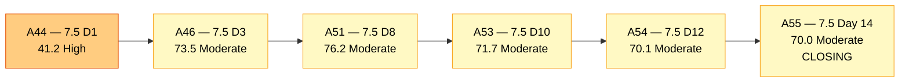
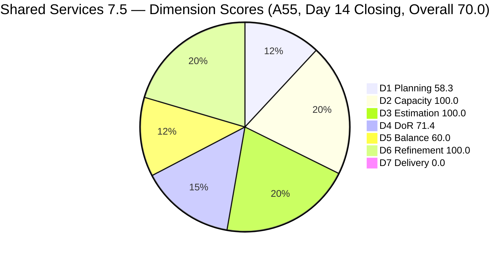
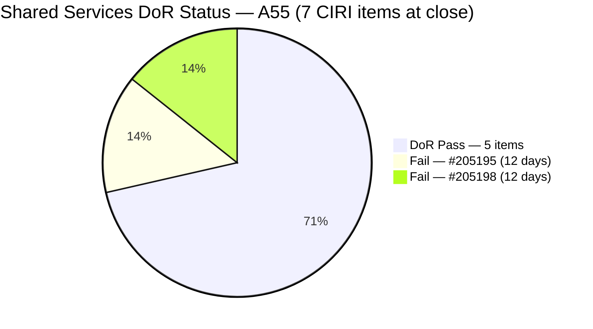
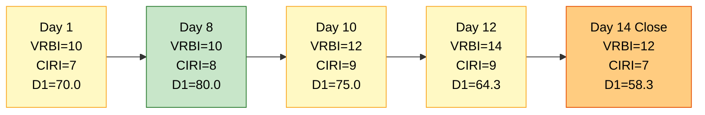
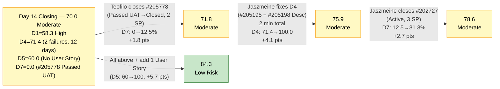

# ADO SAFe Audit — Shared Services Team

## 1. Audit Metadata

| Field | Value |
|---|---|
| **Audit Date** | 2026-06-14 02:00 CST |
| **Sprint Day** | **14 of 14 — CLOSING AUDIT** |
| **Prior Audit** | A54 — `AUDIT_20260612_0203.md` (Overall 70.1, Moderate Risk — 7.5 Day 12) |
| **ADO Project** | Jairosoft Portfolio (`666bb99a-6acd-4999-bb34-efd0e4ea90dc`) |
| **ADO Team** | Shared Services Team (`bd9578fd-5773-48fc-bd80-988dfe5de806`) |
| **Iteration** | Iteration 7.5 (`9c70d575-210a-4156-bbdc-79f1efbe2869`) |
| **Iteration Path** | `Jairosoft Portfolio\2026-PI7\Iteration 7.5` |
| **Iteration Dates** | Jun 1, 2026 – Jun 14, 2026 |
| **Workspace Folder** | `ado_shared` |
| **Overall Score** | **70.0 — Moderate Risk** |
| **Risk Band** | Moderate (60–79.9) |
| **Visible Backlog Items (VRBI)** | 12 root items |
| **Current Iteration Root Items (CIRI)** | 7 items (IterationPath = Iteration 7.5, live in backlog) |
| **Capacity** | Teofilo: 6h/day · Jaszmeine: 3h/day · Ramon: 0.5h/day = 9.5h/day active |
| **Project Exception** | Board URL uses `/Stories` — backlog category `Microsoft.RequirementCategory` confirmed |

---

## 2. Executive Summary

The Shared Services Team closes Iteration 7.5 on Day 14 with an overall score of **70.0 — Moderate Risk**, a **−0.1 point decrease** from A54 (70.1). The sprint was effectively flat between Day 12 and Day 14 on the scoring dimensions that matter most.

**Significant positive news since A54:** Teofilo delivered on A54's highest-priority recommendation. **#205474 (Up Mikrotik VPN, Enabler, 2 SP) and #205973 (JIT Bubble Training Setup, Enabler, 2 SP) both closed on Jun 12** — the same day as the prior audit. Both items exited the backlog before today's snapshot. Together these represent 4 SP of delivery that the D7 formula cannot credit at closing because the live CIRI has now shrunk from 9 to 7 items.

**Persistent structural issues closing the sprint:**
- **D5 = 60.0 — Critical gap.** No User Story in CIRI for the sixth consecutive day. The −40 penalty is the largest single score gap in the entire team's rubric. No User Story has been added to CIRI despite five consecutive audit recommendations.
- **D4 = 71.4 — two failures persist.** #205195 and #205198 (Jaszmeine, Spikes) have failed DoR for 12 consecutive days. The items require only 30-second text edits. This is the most repeatedly-flagged unactioned finding in Shared Services PI7 audit history.
- **#204082 (Blocked, 5 SP, Ramon) remains Blocked** — closing the sprint without delivering, exactly as A54 predicted. 5 SP of CSP carried at 0.0% probability of delivery through sprint end.
- **D7 = 0.0** persists for the tenth consecutive audit. Sprint-to-date contextual delivery (estimated at 30+ SP across 20+ items, primarily from Teofilo) is strong — but the scoring formula captures only the live backlog snapshot.
- **#205778 (Setup Frontend CI Gates, Defect, 2 SP)** moved to "Passed UAT Testing" — not Closed/Done — and thus cannot credit D7 at snapshot.

Key findings:
- **CIRI = 7 (down from 9):** #205474 and #205973 closed Jun 12 and exited the backlog. Both were A54 recommendations and both were executed — Teofilo's execution record this sprint is excellent.
- **D1 = 7/12 = 58.3 — High Risk boundary.** Two new items added to VRBI in the last two days (#206112, #206149) and not enough pull-in to offset closures.
- **D4 improved to 71.4** (from 66.7 in A54) because #205973 — which failed DoR — closed and exited the D4 denominator. Pass count is now 5/7.
- **Two DoR failures remain:** #205195 and #205198 (Jaszmeine). These have been failing for 12 consecutive days with ready-to-paste remediation text available since A52. This is an organizational process gap, not a technical one.

---

## 3. Previous Audit Delta (A54 → A55)

| Dimension | A54 Score (7.5 Day 12) | A55 Score (7.5 Day 14 — Close) | Delta | Driver |
|---|---|---|---|---|
| D1 Iteration Planning | 64.3 | **58.3** | **−6.0** | CIRI 9→7 (#205474 and #205973 closed Jun 12, exited backlog). VRBI unchanged at 12. Net: 7/12 = 58.3. |
| D2 Team Capacity | 100.0 | **100.0** | 0.0 | Teofilo, Jaszmeine, Ramon all have capacity configured. 3/3 = 100.0. |
| D3 Estimation | 100.0 | **100.0** | 0.0 | All 7 CIRI items estimated. CSP = 16 SP. 7/7 = 100.0. |
| D4 DoR Compliance | 66.7 | **71.4** | **+4.7** | #205973 (DoR Fail) closed and exited D4 pool. Remaining: 5 Pass / 2 Fail (#205195, #205198). 5/7 = 71.4. |
| D5 Work Item Balance | 60.0 | **60.0** | 0.0 | No User Story added. −40 penalty persists. 6th consecutive day without User Story in CIRI. |
| D6 Backlog Refinement | 100.0 | **100.0** | 0.0 | All 12 VRBI fresh. #202725 oldest (Jun 7). No untouched CIRI. |
| D7 Delivery Predictability | 0.0 | **0.0** | 0.0 | #205474 and #205973 closed Jun 12 but already exited backlog. #205778 in Passed UAT Testing (not Closed). CSP = 16 SP, CLSP = 0 SP. |
| **Overall** | **70.1** | **70.0** | **−0.1** | Effectively flat. D4 improvement offset by D1 decline. All other dimensions unchanged. |

**Formula verification:** (58.3 + 100.0 + 100.0 + 71.4 + 60.0 + 100.0 + 0.0) / 7 = 489.7 / 7 = **70.0**

**Key transition observations A54 → A55:**
- **#205474 CLOSED Jun 12 (2 SP).** A54's highest-priority recommendation executed perfectly by Teofilo. Exited backlog before today's snapshot.
- **#205973 CLOSED Jun 12 (2 SP).** Teofilo's second closure on Day 12. Despite DoR failure at time of closure, the item was executed and delivered. Exited backlog before snapshot.
- **#205778** (Setup Frontend CI Gates, Defect, 2 SP): Moved to "Passed UAT Testing" — one step before Closed. This is a positive signal but does not qualify for CLSP credit. Teofilo must promote it to Closed today.
- **#205195 and #205198 DoR failures persist** — 12 consecutive days. No remediation actioned despite exact replacement text provided in A52, A53, A54.
- **#204082** (Blocked, 5 SP, Ramon): Unchanged. Sprint closes with this item Blocked and undelivered. CSP inflated by 5 SP at 0% delivery probability.
- **#202725** (Design Review, Jaszmeine, 3 SP): Still in Design Review — Day 7. Approver sign-off has not materialized. This 3 SP item will not close this sprint.

---

## 4. Current Iteration Snapshot

| Metric | Value |
|---|---|
| **Visible Backlog Items (VRBI)** | 12 |
| **Current Iteration Root Items (CIRI)** | 7 (IterationPath = Iteration 7.5, live in backlog) |
| **Non-current items** | 5 — #206112 (PI-level), #206149 (7.6 IP), #204087 (7.6 IP), #202947 (7.6 IP), #204950 (7.6 IP) |
| **Story Points Committed (CSP)** | 16 SP (all 7 CIRI items estimated) |
| **Story Points Closed (CLSP)** | 0 SP (no live CIRI items in Closed/Done state at snapshot) |
| **Sprint Day / Total** | **14 / 14 — Closing Day** |
| **Team Size (distinct CIRI assignees)** | 3 (Teofilo: 2 items, Jaszmeine: 4 items, Ramon: 1 item) |
| **Total Capacity (active contributors)** | 9.5h/day (Teofilo 6 + Jaszmeine 3 + Ramon 0.5) |
| **Iteration Start / Finish** | Jun 1, 2026 – Jun 14, 2026 |

**CIRI SP distribution by assignee (live):**

| Assignee | CIRI Items | SP Committed | DoR Status | Status |
|---|---|---|---|---|
| Teofilo Limpag | 2 (#204205, #205778) | 3 SP | Both Pass | #205778 in Passed UAT Testing — needs closure today |
| Jaszmeine Villanueva | 4 (#202725, #202727, #205195, #205198) | 8 SP | #205195, #205198 Fail | #202725 Day 7 Design Review; #202727 Active |
| Ramon Aseniero | 1 (#204082) | 5 SP | Pass | **Blocked — undeliverable this sprint** |
| **Total** | **7** | **16 SP** | **2 failures** | 2 items nearest closure (#205778, #204205) |

**Sprint-to-date contextual delivery (approximate, items confirmed closed this sprint):**
Estimated 30+ SP across 20+ items — primarily Teofilo's infrastructure and IT enabler work. D7 formula cannot credit these at closing snapshot due to backlog-exit pattern.

---

## 5. Work Item Analysis

### Current Iteration Items (7 items — IterationPath = Iteration 7.5, live in backlog)

| ID | Title | Type | State | SP | Assignee | DoR | ChangedDate | Notes |
|---|---|---|---|---|---|---|---|---|
| #202725 | Messaging & Communication | Design | Design Review | 3 | Jaszmeine | **Pass** | Jun 7 | Day 7 Design Review — approver sign-off not secured. At risk of not closing. |
| #202727 | Contract Management | Design | Active | 3 | Jaszmeine | **Pass** | Jun 9 | Active; execution underway. Final day. |
| #204082 | QA Jodex / AI Enablement Session | Enabler | Blocked | 5 | Ramon | **Pass** | Jun 10 | **BLOCKED — 4 days.** 5 SP at 0% delivery probability. Sprint closes Blocked. |
| #204205 | Android Phone from US | Enabler | Active | 1 | Teofilo | **Pass** | Jun 9 | Active; near completion per sprint history. |
| #205195 | [Retro] Alternative to Figma | Spike | Active | 1 | Jaszmeine | **Fail** | Jun 10 | Desc ~12 NWS < 30. **12 consecutive days failure. Unactioned.** |
| #205198 | [Retro] Design Deliverables on track | Spike | Active | 1 | Jaszmeine | **Fail** | Jun 10 | Desc ~8 NWS < 30. **12 consecutive days failure. Unactioned.** |
| #205778 | Setup Frontend CI Gates | Defect | Passed UAT Testing | 2 | Teofilo | **Pass** | Jun 12 | One step from Closed. Teofilo must promote to Closed today for D7 credit. |

### Non-CIRI Backlog Items (5 items — future iterations or PI-level)

| ID | Title | Iter | Type | State | Assignee | Changed | DoR Notes |
|---|---|---|---|---|---|---|---|
| #206112 | Gemini License Plan | PI-level | Spike | New | Teofilo | Jun 11 | No Desc, no AC, no SP — not sprint-ready. Assign to 7.6 IP. |
| #206149 | Enhance Mikrotik Security | 7.6 IP | Enabler | Grooming | Teofilo | Jun 11 | Desc ✓, no AC — would fail D4 if moved to CIRI. Add AC before 7.6. |
| #204087 | PO — Jodex AI Enablement Sessions | 7.6 IP | Enabler | Active | Ramon | Jun 10 | Desc ✓, AC ✓ — DoR Pass. Good 7.6 candidate. |
| #202947 | IT Support — End of PI7 Feedback Survey | 7.6 IP | Spike | New | Teofilo | Jun 10 | Borderline Desc (~30 NWS), no AC — add AC before 7.6 entry. |
| #204950 | Monthly Costing report — July 2026 | 7.6 IP | Enabler | New | Teofilo | Jun 10 | Desc ✓, AC ✓ — DoR Pass. Well-prepared for 7.6. |

### Closed Sprint Items Since A54 (exited backlog since Day 12)

| ID | Title | Type | SP | Closed | Notes |
|---|---|---|---|---|---|
| #205474 | Up Mikrotik VPN | Enabler | 2 | Jun 12 | A54 R2 recommendation executed. Peer Testing → Closed. |
| #205973 | JIT Bubble Training Setup | Enabler | 2 | Jun 12 | A54 R1 recommendation executed (partially — DoR not fixed before close). |

### DoR Assessment — 7 CIRI Items

| ID | Title | Desc ≥ 30 NWS | AC ≥ 20 NWS | Result |
|---|---|---|---|---|
| #202725 | Messaging & Communication | ✓ (~55 NWS) | ✓ (7 BDD scenarios) | **Pass** |
| #202727 | Contract Management | ✓ (~50 NWS) | ✓ (8 structured ACs) | **Pass** |
| #204082 | QA Jodex / AI Enablement Session | ✓ (~40 NWS) | ✓ (4 checklist ACs) | **Pass** |
| #204205 | Android Phone from US | ✓ (~45 NWS) | ✓ (3 bullets) | **Pass** |
| #205195 | [Retro] Alternative to Figma | ✗ (~12 NWS) | ✗ (~10 NWS) | **Fail — both fields (12 days)** |
| #205198 | [Retro] Design Deliverables on track | ✗ (~8 NWS) | ✓ (~35 NWS) | **Fail — Desc short (12 days)** |
| #205778 | Setup Frontend CI Gates | ✓ (~50 NWS) | ✓ (~20 NWS) | **Pass** |

**Pass: 5/7. Fail: 2 (#205195, #205198). DCI = 5/7 = 71.4%**

### Type Distribution (7 CIRI items)

| Type | Count | Share | D5 Impact |
|---|---|---|---|
| Enabler | 2 (#204082, #204205) | 28.6% | — |
| Design | 2 (#202725, #202727) | 28.6% | — |
| Spike | 2 (#205195, #205198) | 28.6% | 28.6% < 40% — no Spike penalty |
| Defect | 1 (#205778) | 14.3% | — |
| User Story | **0** | **0.0%** | **−40 PENALTY — No User Story in CIRI** |
| **Total** | **7** | **100%** | **Score: 60.0** |

---

## 6. SAFe Compliance Scorecard

| Dimension | Score | Band | Evidence | Notes |
|---|---|---|---|---|
| D1 Iteration Planning | **58.3** | High | 7 CIRI / 12 VRBI | Declined from 64.3. CIRI 9→7 (closures). VRBI unchanged at 12. High Risk boundary crossed. |
| D2 Team Capacity | **100.0** | Low | 3/3 contributors with capacity | Teofilo 6h/day, Jaszmeine 3h/day, Ramon 0.5h/day. All configured. |
| D3 Estimation | **100.0** | Low | 7/7 ECI | All CIRI items estimated. CSP = 16 SP. |
| D4 DoR Compliance | **71.4** | Moderate | 5 DCI / 7 CIRI | +4.7 improvement: #205973 exited D4 pool (closed). Still 2 failures (#205195, #205198) — 12 days unactioned. |
| D5 Work Item Balance | **60.0** | Moderate | No User Story → −40 penalty | 6th consecutive day without User Story. Largest single scoring gap. No action taken in 5 audits. |
| D6 Backlog Refinement | **100.0** | Low | 12/12 fresh; 0/7 untouched CIRI | All VRBI items changed Jun 7 or later. No stale debt entering 7.6. |
| D7 Delivery Predictability | **0.0** | Critical | 0 SP closed / 16 SP committed | #205474+#205973 closed Jun 12 but exited backlog. #205778 in Passed UAT Testing. CSP=16, CLSP=0. |
| **OVERALL** | **70.0** | **Moderate** | (58.3+100.0+100.0+71.4+60.0+100.0+0.0)/7 | −0.1 from A54. Effectively flat. D4 improved; D1 declined. |

**Formula verification:** (58.3 + 100.0 + 100.0 + 71.4 + 60.0 + 100.0 + 0.0) / 7 = 489.7 / 7 = **70.0**

---

## 7. Dimension Findings

### D1 — Iteration Planning: 58.3 / 100 — High Risk

**Formula:** CIRI / VRBI × 100 = 7 / 12 × 100 = **58.3**

| Metric | Value |
|---|---|
| Visible root backlog items (VRBI) | 12 |
| Items in Iteration 7.5 (CIRI) | 7 (#202725, #202727, #204082, #204205, #205195, #205198, #205778) |
| Non-current items | 5 (#206112 PI-level; #206149, #204087, #202947, #204950 — 7.6 IP) |
| Score | **58.3** |

D1 has entered High Risk at sprint close. Teofilo's strong execution cadence — closing #205474 and #205973 on Day 12 — is the primary driver: each closure without a corresponding pull-in reduces the CIRI/VRBI ratio. The VRBI denominator grew from 10 (Day 1) to 12 (Day 14) due to new items entering the backlog, compounding the effect.

**Iteration 7.5 D1 trajectory:**

| Audit | Day | CIRI | VRBI | D1 |
|---|---|---|---|---|
| A44 | 1 | 7 | 10 | 70.0 |
| A51 | 8 | 8 | 10 | 80.0 |
| A53 | 10 | 9 | 12 | 75.0 |
| A54 | 12 | 9 | 14 | 64.3 |
| A55 | 14 (close) | 7 | 12 | **58.3** |

The team's execution velocity is genuinely strong — the backlog simply did not replenish at the same rate that closures happened. For 7.6, ensure the VRBI starts with 10+ items ready at Day 1 to buffer against this pattern.

---

### D2 — Team Capacity: 100.0 / 100 — Low Risk

**Formula:** CC / CW × 100 = 3 / 3 × 100 = **100.0**

| Contributor | CIRI Items | Capacity | Status |
|---|---|---|---|
| Teofilo Limpag | 2 | 6h/day | Closed 2 items Jun 12; #205778 in Passed UAT Testing — close today |
| Jaszmeine Villanueva | 4 | 3h/day | #202727 Active; #202725 stuck in Design Review |
| Ramon Aseniero | 1 | 0.5h/day | #204082 Blocked — closing sprint without delivery |

Vicsante Aseniero (6h/day capacity configured) has no CIRI items and does not factor into D2 calculation.

---

### D3 — Estimation: 100.0 / 100 — Low Risk

**Formula:** ECI / PECI × 100 = 7 / 7 × 100 = **100.0**

| ID | Title | Type | SP |
|---|---|---|---|
| #202725 | Messaging & Communication | Design | 3 |
| #202727 | Contract Management | Design | 3 |
| #204082 | QA Jodex / AI Enablement Session | Enabler | 5 |
| #204205 | Android Phone from US | Enabler | 1 |
| #205195 | [Retro] Alternative to Figma | Spike | 1 |
| #205198 | [Retro] Design Deliverables on track | Spike | 1 |
| #205778 | Setup Frontend CI Gates | Defect | 2 |

**CSP = 16 SP.** D3 = 100.0. Estimation discipline has been consistently strong throughout this sprint.

**Note:** #204082 (5 SP, Blocked) is properly estimated but cannot be delivered. For PI8, Blocked items should be deferred from the sprint or removed from CSP within 2 days of discovery to avoid inflating the denominator and making D7 recovery harder.

---

### D4 — DoR Compliance: 71.4 / 100 — Moderate Risk

**Formula:** DCI / CIRI × 100 = 5 / 7 × 100 = **71.4**

**#205195** (Jaszmeine, Spike, Active, 1 SP) — *12 consecutive days failure*:
- Desc: ~12 non-whitespace words. **Threshold: 30 NWS. Fails.**
- AC: ~10 NWS. **Threshold: 20 NWS. Fails.**
- The sprint is ending with this DoR failure unresolved after 12 days of explicit audit recommendations.

**#205198** (Jaszmeine, Spike, Active, 1 SP) — *12 consecutive days failure*:
- Desc: ~8 NWS. **Threshold: 30 NWS. Fails.**
- AC: ~35 NWS (passes).

**Improvement from A54:** +4.7 points. The improvement came from #205973 closing and exiting the D4 pool — not from remediation. Both remaining failures are Jaszmeine's items and have been flagged since Day 2 of the sprint.

**If both failures were remediated before end-of-day:** DCI = 7/7 = 100.0, D4 = 100.0, Overall → 74.3.

---

### D5 — Work Item Balance: 60.0 / 100 — Moderate Risk

**Formula:** Base 100 − penalties applied independently

| Penalty | Trigger | Applied |
|---|---|---|
| −40: No User Story in CIRI | **0 User Stories in CIRI (Day 14)** | **YES** |
| −30: Dominant type share > 60% | Enabler=28.6%, Design=28.6%, Spike=28.6%, Defect=14.3% — no single type > 60% | **No** |
| −20: Spike share > 40% | Spike = 2/7 = 28.6% | **No** |

**Score:** max(0, 100 − 40) = **60.0**

This sprint closes with zero User Stories in CIRI — a direct consequence of the team's work type profile (Enabler/Design/Spike-heavy) and the closure of #204238 (the only User Story) on Jun 9. The penalty has been flagged in 5 consecutive audits and has never been remediated mid-sprint. This must be addressed in Iteration 7.6 planning by explicitly allocating at least 1 User Story to CIRI at sprint open.

---

### D6 — Backlog Refinement: 100.0 / 100 — Low Risk

**Freshness window:** ChangedDate ≥ 2026-04-30 (45 days before 2026-06-14)

| Metric | Value |
|---|---|
| Total VRBI | 12 |
| Fresh items (ChangedDate ≥ Apr 30, 2026) | 12 — oldest CIRI: #202725 (Jun 7) |
| Stale_90 items (ChangedDate < Mar 16, 2026) | 0 |
| Stale_180 items (ChangedDate < Dec 16, 2025) | 0 |
| Untouched CIRI (ChangedDate < Jun 1, 2026) | 0 — all 7 CIRI items changed Jun 7 or later |

**Score: 100.0** — No penalties. The team exits Iteration 7.5 with a fully-fresh backlog. The 5 non-CIRI items are well-dated (Jun 10–11). D6 = 100.0 for the 7th consecutive audit.

**Action needed before 7.6:** #206112 (Gemini License Plan, PI-level, no sprint assignment) must be assigned to an iteration. Items left at PI-level without sprint assignment inflate VRBI in future snapshots without contributing to CIRI.

---

### D7 — Delivery Predictability: 0.0 / 100 — Critical

**Formula:** CLSP / CSP × 100 = 0 / 16 × 100 = **0.0**

| Metric | Value |
|---|---|
| Estimated current items (ECI) | 7 |
| Committed Story Points (CSP) | 16 SP |
| Closed Story Points (CLSP) | 0 SP (no live CIRI items in Closed/Done at snapshot) |
| #205778 status | Passed UAT Testing — one promotion away from Closed |
| #204082 status | Blocked — 4 days, 5 SP, 0% delivery probability |
| Score | **0.0** |

**CLOSING AUDIT NOTE — Last-chance actions today (Day 14):**

D7 recovery is still possible today — the sprint does not close until end-of-day Jun 14.

| Action | D7 Impact | Overall Impact |
|---|---|---|
| Teofilo promotes #205778 to Closed (2 SP) | 2/16 = 12.5% | +1.8 pts → 71.8 |
| Teofilo closes #204205 too (1 SP total 3 SP) | 3/16 = 18.8% | +2.7 pts → 72.7 |
| Teofilo closes #205778+#204205 + Jaszmeine fixes D4 (#205195, #205198) | D7=18.8%, D4=100% | +6.9 pts → **76.9** |
| Above + Jaszmeine closes #202727 (3 SP, total 6 SP) | 6/16 = 37.5% | +7.3 pts → 77.3 |
| All above + add 1 User Story to CIRI (D5=100%) | — | +12.0 pts total → **82.0 (Low Risk)** |

**Highest-probability closing actions (today, Day 14):**
1. Teofilo: promote #205778 from Passed UAT Testing → Closed (2 SP, immediate)
2. Teofilo: close #204205 (Active, 1 SP, near-complete)
3. Jaszmeine: expand #205195 and #205198 Desc fields (30 seconds each)
4. Jaszmeine: close #202727 if execution is complete (3 SP)

---

## 8. Risks and Bottlenecks

| # | Severity | Dimension | Risk | Recommended Action |
|---|---|---|---|---|
| R1 | **CRITICAL** | D7 (TODAY) | #205778 (Passed UAT Testing, 2 SP) is one state promotion away from Closed. This is the most immediately actionable D7 recovery item. | **Teofilo: promote #205778 from Passed UAT Testing to Closed immediately.** This alone: D7 = 12.5%, Overall → 71.8. |
| R2 | **CRITICAL** | D5 (STRUCTURAL) | No User Story in CIRI for 6 consecutive days — sprint closes with this unresolved. The −40 penalty costs the team 5.7 points every audit. This has been flagged 5 times without action. | **Iteration 7.6 planning: mandate at least 1 User Story on Day 1 CIRI.** For today: if any User Story scope exists, add it to CIRI before sprint close. |
| R3 | **HIGH** | D4 (CHRONIC) | #205195 and #205198 DoR failures persist for 12 days. Exact remediation text has been provided in 4 consecutive audit reports. This is an organizational discipline gap. | **Jaszmeine: update #205195 and #205198 Desc fields before sprint retrospective.** Even if sprint is technically closing, fixing DoR now ensures 7.6 starts clean. 2 minutes total. |
| R4 | **HIGH** | D1 (7.6) | D1 = 58.3 — High Risk at closing. 7.6 starts with a backlog that has been net-reduced by sprint closures without adequate pull-in. If 7.6 Day 1 CIRI < 7 items, D1 starts in High Risk territory again. | **Before 7.6 Day 1: pull #204087, #204950, and at least one new User Story into Iteration 7.6** to ensure CIRI/VRBI ≥ 70% on sprint open. |
| R5 | **HIGH** | D7 (CHRONIC) | D7 = 0.0 for 10 consecutive audits despite strong sprint-to-date delivery (~30+ SP). The formula snapshot consistently misses Teofilo's overnight closures. | **For 7.6: establish a mid-sprint D7 check window (Day 5–7)** so at least some closures are captured in a live snapshot before items exit the backlog. |
| R6 | **MEDIUM** | D1 (hygiene) | #206112 (Gemini License Plan, Spike, PI-level) remains unassigned to any sprint or IP. Contributes to VRBI without contributing to CIRI. | **Assign #206112 to 7.6 IP or mark for PI8 planning.** Unassigned PI-level items inflate VRBI across every snapshot until assigned. |
| R7 | **MEDIUM** | D7 | #204082 (Blocked, 5 SP, Ramon) closes the sprint Blocked. 5 SP was committed but undeliverable. No deferral was executed despite 4 consecutive recommendations. | **PI7 Retrospective: review blocking item management process.** When an item is Blocked for >2 days in the final week of a sprint, it must be deferred to IP by default. |

---

## 9. Prioritized Recommendations

1. **[TODAY — Sprint Close Day]** Teofilo: promote #205778 (Setup Frontend CI Gates, Passed UAT Testing → Closed, 2 SP). This is a single button click. Closing today: D7 = 12.5%, Overall → 71.8. It is already in the best pre-close state possible — do not let it linger past sprint end.

2. **[TODAY — Sprint Close Day]** Teofilo: close #204205 (Android Phone from US, Active, 1 SP, DoR Pass) if work is complete. Near-completion per prior audit evidence. Closing both #205778 + #204205: D7 = 18.8%, Overall → 72.7.

3. **[TODAY — 2 minutes]** Jaszmeine: expand #205195 Desc field to ≥30 NWS. Ready-to-paste text (from A52): "This spike evaluates AI-integrated design alternatives to Figma — specifically Dev0, Lovable, Stitch, and Claude Design — to identify tools that integrate natively with Jodex and reduce the manual Figma-to-dev handoff overhead." Also expand #205195 AC to ≥20 NWS. Then expand #205198 Desc to ≥30 NWS. Total time: 2 minutes. D4 → 100.0, +4.1 pts to Overall.

4. **[ITERATION 7.6 DAY 1]** Mandate at least 1 User Story in CIRI at sprint open. This eliminates the −40 D5 penalty immediately. Have the User Story pre-created and DoR-compliant before the sprint start date.

5. **[ITERATION 7.6 PLANNING]** Pull #204087 (PO — Jodex AI Enablement Sessions, DoR Pass) and #204950 (Monthly Costing July, DoR Pass) into Iteration 7.6. Both are DoR-compliant, estimated, and staged in 7.6 IP. Moving them to 7.6 CIRI boosts D1 from Day 1.

6. **[ITERATION 7.6 PLANNING]** Assign #206112 (Gemini License Plan, PI-level, no sprint) to Iteration 7.6 IP or PI8. Unassigned PI-level items perpetually inflate VRBI. Also: add AC to #206149 (Enhance Mikrotik Security) before entry into 7.6 CIRI.

7. **[PI7 RETROSPECTIVE]** Establish three standing team rules for PI8:
   - **DoR Gate:** Before changing IterationPath to active sprint OR State to Active, verify Desc ≥30 NWS and AC ≥20 NWS. No tooling required — 30-second personal check.
   - **Blocked Deferral:** Items Blocked for >2 days in sprint's final week are automatically deferred to IP. Do not carry Blocked items to sprint close.
   - **Pull-in trigger:** When CIRI drops below 60% of VRBI, immediately pull from Ready queue to restore ratio.

---

## 10. Evidence Gaps and Limitations

| Gap | Impact | Notes |
|---|---|---|
| **D7 = 0.0 — structural understatement** | Misrepresents delivery quality | Sprint-to-date contextual delivery: ~30+ SP, 20+ items. Teofilo alone closed 15+ items this sprint. The backlog-exit pattern makes D7 structurally 0.0 at closing snapshots. True delivery health is significantly higher. |
| **#204082 blocker not documented in ADO** | D7 risk / D2 note | The ADO item does not specify the blocking dependency or reason. Ramon should document this before sprint retrospective to inform PI8 planning decisions. |
| **#202725 approver identity unknown** | 3 SP at risk | The Design Review approver is not identified in ADO fields. 7 days without sign-off. This 3 SP item will likely carry into 7.6 as an open action. |
| **#202947 borderline DoR** | D4 risk for 7.6 | #202947 has ~30 NWS description (borderline) and no AC. Do not move to 7.6 CIRI without adding AC first. |
| **D5 No-User-Story — structural** | −40 penalty | The team's natural work type skews Enabler/Design/Spike. User Stories must be intentionally planned; they don't emerge organically. PI8 sprint planning must include at least 1 US per sprint from Day 1. |
| **Sprint capacity data** | D2 note | The capacity API returned data for three teams' iterations; Shared Services Team (bd9578fd) capacity = 15.5h/day total. This reflects the full team configuration including Vicsante (6h/day). Vicsante has no CIRI items and is excluded from the D2 numerator/denominator per formula definition. |

---

## 11. Visualizations

### Iteration 7.5 Score Trend — A44 to A55 (Closing)

### Dimension Scores — A55 (Day 14 Closing)

### DoR Status — 7 CIRI Items at Closing

### D1 Trend — VRBI vs CIRI During Iteration 7.5

### Today's Remaining Recovery Path (Day 14)

---

## 12. Audit Trail

| Source | Tool | Data |
|---|---|---|
| Current iteration | `work_list_team_iterations` (project `666bb99a`, team `bd9578fd`, timeframe=current) | Iteration 7.5: Jun 1–14, 2026; ID `9c70d575-210a-4156-bbdc-79f1efbe2869` — confirmed |
| Backlog items | `wit_list_backlog_work_items` (backlogId `Microsoft.RequirementCategory`) | 12 root items (net from A54: −2 closures #205474+#205973 Jun 12; VRBI dropped from 14 to 12) |
| Iteration work items | `wit_get_work_items_for_iteration` (iterationId `9c70d575`) | 27 root+child items returned; 16 root items identified; 7 live CIRI + 9 closed/exited |
| Work item details | `wit_get_work_items_batch_by_ids` (IDs: 205211, 205210, 205123, 204238, 205662, 205759, 205722, 205815, 205816, 205899, 205905, 205973, 205474, 204205, 205778, 205656, 203845, 205479, 205455, 205456, 205603, 202725, 202726, 202727, 205195, 205198, 204082, 205123, 204238) | SP, State, Type, Desc, AC, ChangedDate, IterationPath confirmed for all items |
| Backlog extended detail | `wit_get_work_items_batch_by_ids` (IDs: 204205, 205778, 206112, 206149, 202725, 202727, 205195, 205198, 204082, 204087, 202947, 204950) | All 12 VRBI items fully characterized |
| Team capacity | `work_get_iteration_capacities` (project `666bb99a`, iterationId `9c70d575`) | Shared Services Team: 15.5h/day; Teofilo 6h, Jaszmeine 3h, Ramon 0.5h, Vicsante 6h (no CIRI) |
| Prior audit | `AUDIT_20260612_0203.md` (A54) | Overall 70.1, Moderate Risk, 7.5 Day 12, 14 VRBI, 9 CIRI, 20 SP committed, 0 SP closed |
