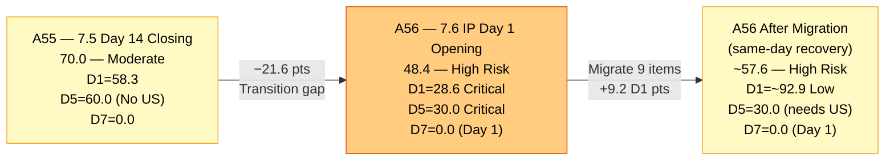
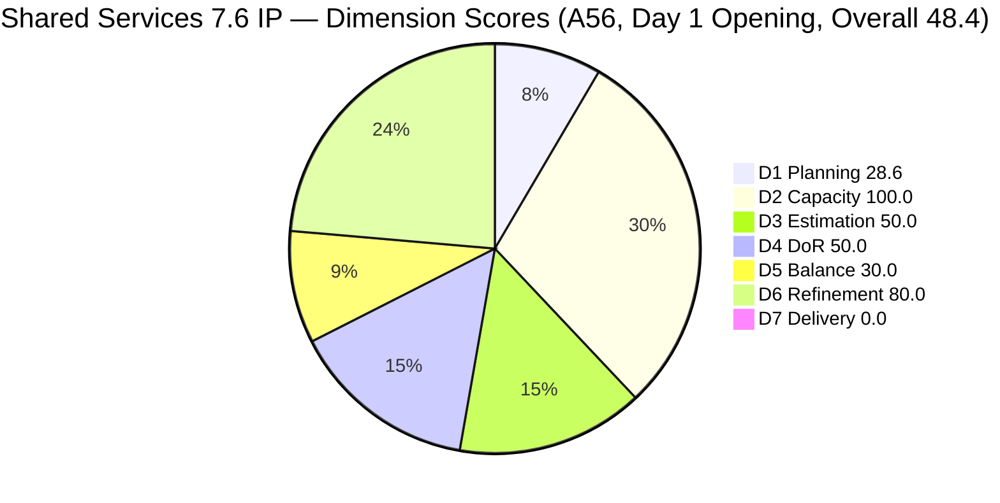
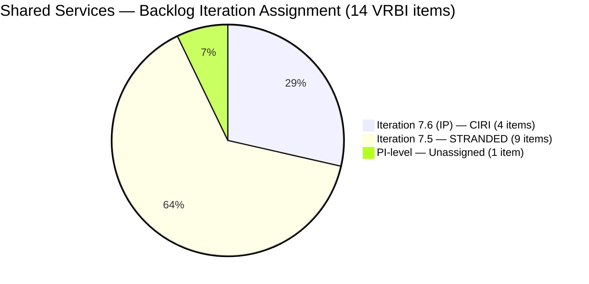
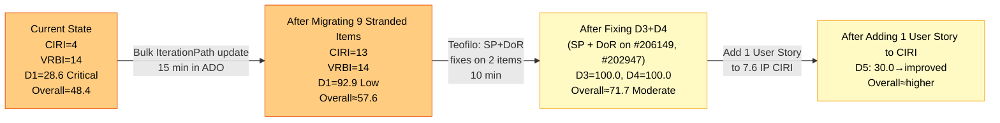
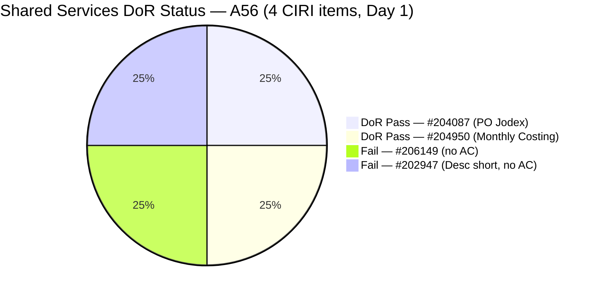

# ADO SAFe Audit — Shared Services Team

## 1. Audit Metadata

| Field | Value |
|---|---|
| **Audit Date** | 2026-06-15 02:00 CST |
| **Sprint Day** | **1 of 14 — OPENING AUDIT (IP Iteration)** |
| **Prior Audit** | A55 — `AUDIT_20260614_0200.md` (Overall 70.0, Moderate Risk — 7.5 Day 14 Closing) |
| **ADO Project** | Jairosoft Portfolio (`666bb99a-6acd-4999-bb34-efd0e4ea90dc`) |
| **ADO Team** | Shared Services Team (`bd9578fd-5773-48fc-bd80-988dfe5de806`) |
| **Iteration** | Iteration 7.6 (IP) (`42e165b7-e9aa-4150-8d6f-84043ef2482e`) |
| **Iteration Path** | `Jairosoft Portfolio\2026-PI7\Iteration 7.6 (IP)` |
| **Iteration Dates** | Jun 15, 2026 – Jun 28, 2026 |
| **Workspace Folder** | `ado_shared` |
| **Overall Score** | **48.4 — High Risk** |
| **Risk Band** | High (40–59.9) |
| **Visible Backlog Items (VRBI)** | 14 root items |
| **Current Iteration Root Items (CIRI)** | 4 items (IterationPath = Iteration 7.6 (IP)) |
| **Capacity** | Teofilo: 6h/day · Jaszmeine: 3h/day · Ramon: 0.5h/day = 15.5h/day total |
| **Project Exception** | Board URL uses `/Stories` — backlog category `Microsoft.RequirementCategory` confirmed |

---

## 2. Executive Summary

The Shared Services Team opens Iteration 7.6 (IP) on Day 1 with an overall score of **48.4 — High Risk** — a **−21.6 point decline** from A55 (70.0, Iteration 7.5 closing). This significant regression is driven primarily by a critical planning gap: **9 of 14 backlog items remain in Iteration 7.5 IterationPath** despite 7.5 having ended yesterday (Jun 14). Only 4 items have been correctly assigned to Iteration 7.6 (IP), producing a D1 = 28.6 — Critical.

**The core problem this audit reveals:** The Iteration 7.5 → 7.6 (IP) transition was incomplete. Items that were not closed (#202725, #202727, #204082, #204205, #205195, #205198, #205778) and two newly added items (#206255, #206256) all still show `Iteration 7.5` in their IterationPath. In a SAFe sprint transition, these items must be either moved to Iteration 7.6 (IP) (if carried forward) or closed. The current state produces CIRI = 4/14 = 28.6 — the lowest D1 the team has seen since Iteration 7.5 Day 1.

**Secondary issues entering this IP iteration:**
- **D3 = 50.0:** Two of the four CIRI items (#206149, #202947) have no Story Points assigned.
- **D4 = 50.0:** Two of the four CIRI items (#206149 — no AC; #202947 — short Desc, no AC) fail DoR.
- **D5 = 30.0 — Critical:** No User Story in CIRI (−40 penalty) AND Enabler type dominance at 75% (−30 penalty). Score = max(0, 100−40−30) = 30.0.
- **D7 = 0.0:** Day 1 IP — no closures expected. Annotated early-sprint.

**Positive signals entering 7.6 IP:**
- Teofilo's two closures on Jun 12 (#205474, #205973) showed excellent execution velocity.
- Items #204087 (PO Jodex AI Enablement, DoR Pass) and #204950 (Monthly Costing July, DoR Pass) are well-formed 7.6 CIRI items.
- D2 = 100.0 — capacity configuration is complete for all active contributors.
- D6 = 80.0 — all 14 backlog items are fresh (no stale debt entering the IP).

**Highest-priority action today (Day 1):** Ramon/Carol must move all 7 carryover items from Iteration 7.5 to Iteration 7.6 (IP) in ADO. This single action would improve D1 from 28.6 to 78.6, and Overall from 48.4 to approximately 63.5 — recovering from High Risk to Moderate Risk.

---

## 3. Previous Audit Delta (A55 → A56)

| Dimension | A55 Score (7.5 Day 14 — Close) | A56 Score (7.6 IP Day 1 — Open) | Delta | Driver |
|---|---|---|---|---|
| D1 Iteration Planning | 58.3 | **28.6** | **−29.7** | 9 items remain in Iteration 7.5 IterationPath. Only 4 items in Iteration 7.6 (IP). VRBI grew from 12→14 (2 new items: #206255, #206256). CIRI = 4/14 = 28.6. Critical. |
| D2 Team Capacity | 100.0 | **100.0** | 0.0 | Teofilo, Jaszmeine, Ramon all configured. 15.5h/day total. 2/2 active CIRI contributors. |
| D3 Estimation | 100.0 | **50.0** | **−50.0** | #206149 and #202947 have no Story Points. Only 2/4 CIRI items estimated. |
| D4 DoR Compliance | 71.4 | **50.0** | **−21.4** | #206149 lacks AC. #202947 has <30 NWS char Desc, no AC. 2/4 pass. |
| D5 Work Item Balance | 60.0 | **30.0** | **−30.0** | No User Story (−40) + Enabler dominance 75% (−30). New CIRI profile is purely infra/enabler. |
| D6 Backlog Refinement | 100.0 | **80.0** | **−20.0** | All 14 fresh. 4/4 CIRI items untouched (Day 1 pre-staging artifact). −20 penalty. |
| D7 Delivery Predictability | 0.0 | **0.0** | 0.0 | Day 1 IP — no closures. CSP = 7 SP, CLSP = 0. Early-sprint annotated. |
| **Overall** | **70.0** | **48.4** | **−21.6** | D1 collapse + D3 regression + D4 regression + D5 regression. Transition gap is the primary driver. |

**Formula verification:** (28.6 + 100.0 + 50.0 + 50.0 + 30.0 + 80.0 + 0.0) / 7 = 338.6 / 7 = **48.4**

**Key transition observations A55 → A56:**
- **9 items remain stranded in Iteration 7.5 IterationPath.** This is the most critical finding of this audit. Items that survived sprint close (Active, Blocked, Design Review, Grooming, Passed UAT Testing states) were not migrated to 7.6 (IP) during sprint retrospective/planning. This is a process gap that must be corrected today.
- **2 new items entered the backlog today:** #206255 (Setup New Machine for Mark Colina) and #206256 (Research Best Practices for Mikrotik Security) — both assigned Teofilo, both in Iteration 7.5 IterationPath (incorrect — should be 7.6 IP). Both were created on Jun 15 (today).
- **#204082 (Blocked, 5 SP, Ramon) remains Blocked** — it has now crossed a sprint boundary still Blocked. This must be escalated.
- **#205778 (Passed UAT Testing, 2 SP, Teofilo)** — still one step away from Closed. Teofilo should close this immediately.

---

## 4. Current Iteration Snapshot

| Metric | Value |
|---|---|
| **Visible Backlog Items (VRBI)** | 14 |
| **Current Iteration Root Items (CIRI)** | 4 (IterationPath = `Jairosoft Portfolio\2026-PI7\Iteration 7.6 (IP)`) |
| **Stranded items (still in Iteration 7.5)** | 9 items — CRITICAL planning gap |
| **PI-level items (no sprint)** | 1 (#206112 — Gemini License Plan) |
| **Story Points Committed (CSP)** | 7 SP (#204087 = 5 SP, #204950 = 2 SP — only estimated items) |
| **Story Points Closed (CLSP)** | 0 SP (Day 1 — sprint just opened) |
| **Sprint Day / Total** | **1 / 14 — Opening Day (IP)** |
| **Team Size (distinct CIRI assignees)** | 2 (Teofilo: #206149, #202947, #204950; Ramon: #204087) |
| **Total Sprint Capacity** | 15.5h/day (Teofilo 6h + Jaszmeine 3h + Ramon 0.5h; Vicsante 6h — no CIRI items) |
| **Iteration Start / Finish** | Jun 15, 2026 – Jun 28, 2026 |

**CIRI Items (4 — correctly in Iteration 7.6 IP):**

| ID | Title | Type | State | SP | Assignee | DoR | ChangedDate |
|---|---|---|---|---|---|---|---|
| #206149 | Enhance Mikrotik Security — Research and Implement | Enabler | Grooming | — | Teofilo | **Fail** (no AC) | Jun 11 |
| #202947 | IT Support Services — End of PI 7 Feedback Survey | Spike | New | — | Teofilo | **Fail** (Desc short, no AC) | Jun 10 |
| #204087 | PO — Jodex AI Enablement Sessions | Enabler | Active | 5 | Ramon | **Pass** | Jun 10 |
| #204950 | Monthly Costing Report — July 2026 | Enabler | New | 2 | Teofilo | **Pass** | Jun 10 |

**Stranded Items (9 — still showing Iteration 7.5 IterationPath — must be migrated to 7.6 IP today):**

| ID | Title | Type | State | SP | Assignee | Notes |
|---|---|---|---|---|---|---|
| #202725 | Messaging & Communication | Design | Design Review | 3 | Jaszmeine | In Design Review since Jun 7 — carry forward |
| #202727 | Contract Management | Design | Active | 3 | Jaszmeine | Active — carry forward |
| #204082 | QA Jodex / AI Enablement Session | Enabler | Blocked | 5 | Ramon | Blocked — escalation required |
| #204205 | Android Phone from US | Enabler | Active | 1 | Teofilo | Active — carry forward or close |
| #205195 | [Retro] Alternative to Figma | Spike | Active | 1 | Jaszmeine | DoR Fail (12+ days) — remediate or close |
| #205198 | [Retro] Design Deliverables on track | Spike | Active | 1 | Jaszmeine | DoR Fail (12+ days) — remediate or close |
| #205778 | Setup Frontend CI Gates | Defect | Passed UAT Testing | 2 | Teofilo | Close immediately — one state from Done |
| #206255 | Setup New Machine for Mark Colina | Enabler | Grooming | 2 | Teofilo | New today (Jun 15) — wrong iteration assigned |
| #206256 | Research Best Practices for Mikrotik Security | Enabler | Grooming | 2 | Teofilo | New today (Jun 15) — wrong iteration assigned |

---

## 5. Work Item Analysis

### CIRI Items — Detailed (4 items in Iteration 7.6 IP)

| ID | Title | Type | State | SP | Assignee | DoR | ChangedDate | Notes |
|---|---|---|---|---|---|---|---|---|
| #206149 | Enhance Mikrotik Security | Enabler | Grooming | — | Teofilo | **Fail** | Jun 11 | Desc: numbered list ~120 NWS chars ✓. AC: **None.** Fails AC threshold. Add AC before activating. |
| #202947 | IT Support Feedback Survey | Spike | New | — | Teofilo | **Fail** | Jun 10 | Desc: "Create a Duplicate" + URL link = ~16 NWS chars. **Fails 30 NWS threshold.** No AC. Fails both. |
| #204087 | PO — Jodex AI Enablement Sessions | Enabler | Active | 5 | Ramon | **Pass** | Jun 10 | Desc: detailed paragraph >200 NWS chars ✓. AC: 4-item checklist >150 NWS chars ✓. Well-formed. |
| #204950 | Monthly Costing Report — July 2026 | Enabler | New | 2 | Teofilo | **Pass** | Jun 10 | Desc: 12-item numbered list ✓. AC: detailed multi-section checklist ✓. Well-formed. |

### DoR Assessment — 4 CIRI Items

| ID | Title | Desc ≥ 30 NWS chars | AC ≥ 20 NWS chars | Result |
|---|---|---|---|---|
| #206149 | Enhance Mikrotik Security | ✓ (~120 NWS chars, numbered list) | ✗ (no AC field) | **Fail — AC missing** |
| #202947 | IT Support Feedback Survey | ✗ (~16 NWS chars — "Create a Duplicate" + URL) | ✗ (no AC field) | **Fail — both fields** |
| #204087 | PO — Jodex AI Enablement Sessions | ✓ (~220 NWS chars) | ✓ (~180 NWS chars, 4 checklist items) | **Pass** |
| #204950 | Monthly Costing Report — July 2026 | ✓ (~200 NWS chars, 12 items) | ✓ (~400 NWS chars, multi-section) | **Pass** |

**Pass: 2/4. Fail: 2 (#206149, #202947). DCI = 2/4 = 50.0%**

### Type Distribution (4 CIRI items)

| Type | Count | Share | D5 Impact |
|---|---|---|---|
| Enabler | 3 (#206149, #204087, #204950) | 75.0% | Dominant-type penalty −30 (>60%) |
| Spike | 1 (#202947) | 25.0% | Spike share 25% < 40% — no spike penalty |
| User Story | 0 | 0.0% | **−40 PENALTY — No User Story in CIRI** |
| **Total** | **4** | **100%** | **Score: max(0, 100−40−30) = 30.0** |

### Non-CIRI Backlog Items (10 items — stranded in 7.5 or PI-level)

| ID | Title | Iter | Type | State | SP | Assignee | Migration Priority |
|---|---|---|---|---|---|---|---|
| #205778 | Setup Frontend CI Gates | 7.5 | Defect | Passed UAT | 2 | Teofilo | **URGENT — Close today** |
| #204205 | Android Phone from US | 7.5 | Enabler | Active | 1 | Teofilo | Close or migrate to 7.6 IP |
| #202725 | Messaging & Communication | 7.5 | Design | Design Review | 3 | Jaszmeine | Migrate to 7.6 IP |
| #202727 | Contract Management | 7.5 | Design | Active | 3 | Jaszmeine | Migrate to 7.6 IP |
| #204082 | QA Jodex / AI Enablement Session | 7.5 | Enabler | Blocked | 5 | Ramon | Migrate + escalate blocker |
| #205195 | [Retro] Alternative to Figma | 7.5 | Spike | Active | 1 | Jaszmeine | Fix DoR + migrate to 7.6 IP |
| #205198 | [Retro] Design Deliverables on track | 7.5 | Spike | Active | 1 | Jaszmeine | Fix DoR + migrate to 7.6 IP |
| #206255 | Setup New Machine for Mark Colina | 7.5 | Enabler | Grooming | 2 | Teofilo | Created today — correct to 7.6 IP |
| #206256 | Research Best Practices for Mikrotik Security | 7.5 | Enabler | Grooming | 2 | Teofilo | Created today — correct to 7.6 IP |
| #206112 | Gemini License Plan | PI-level | Spike | New | — | Teofilo | Assign to 7.6 IP or PI8 |

---

## 6. SAFe Compliance Scorecard

| Dimension | Score | Band | Evidence | Notes |
|---|---|---|---|---|
| D1 Iteration Planning | **28.6** | Critical | 4 CIRI / 14 VRBI | 9 items stranded in Iteration 7.5 IterationPath. 2 new items created today in wrong iteration. VRBI grew 12→14. |
| D2 Team Capacity | **100.0** | Low | 2/2 active CIRI contributors | Teofilo 6h/day, Ramon 0.5h/day — both with CIRI items. Jaszmeine has no 7.6 CIRI items yet. |
| D3 Estimation | **50.0** | High | 2/4 ECI | #206149 and #202947 have no SP. #204087=5SP, #204950=2SP. 2/4 = 50.0. |
| D4 DoR Compliance | **50.0** | High | 2 DCI / 4 CIRI | #206149 no AC. #202947 short Desc and no AC. 2/4 = 50.0. |
| D5 Work Item Balance | **30.0** | Critical | No US (−40) + Enabler 75% (−30) | Zero User Stories + Enabler dominance. Compound penalty. max(0, 100−40−30) = 30.0. |
| D6 Backlog Refinement | **80.0** | Low | 14/14 fresh; 4/4 CIRI untouched (Day 1) | No stale debt. Untouched −20 penalty is Day 1 pre-staging artifact. |
| D7 Delivery Predictability | **0.0** | Critical | 0 SP closed / 7 SP committed | Day 1 IP — no closures expected. **Early-sprint IP — low delivery expected.** |
| **OVERALL** | **48.4** | **High Risk** | (28.6+100.0+50.0+50.0+30.0+80.0+0.0)/7 | −21.6 from A55. Transition gap is the dominant driver. Recoverable with same-day action. |

**Formula verification:** (28.6 + 100.0 + 50.0 + 50.0 + 30.0 + 80.0 + 0.0) / 7 = 338.6 / 7 = **48.4**

---

## 7. Dimension Findings

### D1 — Iteration Planning: 28.6 / 100 — Critical

**Formula:** CIRI / VRBI × 100 = 4 / 14 × 100 = **28.6**

| Metric | Value |
|---|---|
| Visible root backlog items (VRBI) | 14 |
| Items in Iteration 7.6 (IP) (CIRI) | 4 (#206149, #202947, #204087, #204950) |
| Items stranded in Iteration 7.5 | 9 (#202725, #202727, #204082, #204205, #205195, #205198, #205778, #206255, #206256) |
| PI-level (no sprint assigned) | 1 (#206112) |
| Score | **28.6** |

D1 = 28.6 is the lowest opening D1 score in Shared Services' tracked audit history. The root cause is a failed sprint transition: 9 of the team's backlog items were not migrated from Iteration 7.5 to Iteration 7.6 (IP) when the sprint changed over.

**Impact if all 9 stranded items were migrated to 7.6 IP today:**
- CIRI = 4 + 9 = 13 (assuming #206112 remains PI-level)
- VRBI = 14 (unchanged)
- D1 = 13/14 × 100 = **92.9 — Low Risk**
- Overall impact: D1 contributes +9.2 pts → Overall → ~57.6

This is a pure ADO housekeeping fix, not a execution problem. The team's work has not changed — the iteration assignment fields simply weren't updated.

---

### D2 — Team Capacity: 100.0 / 100 — Low Risk

**Formula:** CC / CW × 100 = 2 / 2 × 100 = **100.0**

| Contributor | CIRI Items | Capacity | Notes |
|---|---|---|---|
| Teofilo Limpag | 3 (#206149, #202947, #204950) | 6h/day | Also has stranded items in 7.5 (#204205, #205778, #206255, #206256) |
| RAMON ASENIERO JR | 1 (#204082 blocked in 7.5, #204087 in 7.6 IP) | 0.5h/day | #204087 is his only 7.6 IP item |

Jaszmeine Villanueva has no items in Iteration 7.6 (IP) CIRI — all her items are stranded in Iteration 7.5. Once the stranded items are migrated, she becomes a CIRI contributor and D2 = 3/3 = 100.0 (unchanged). Capacity configuration is complete.

---

### D3 — Estimation: 50.0 / 100 — High Risk

**Formula:** ECI / PECI × 100 = 2 / 4 × 100 = **50.0**

| ID | Title | Type | SP | Status |
|---|---|---|---|---|
| #206149 | Enhance Mikrotik Security | Enabler | — | **Not estimated** |
| #202947 | IT Support Feedback Survey | Spike | — | **Not estimated** |
| #204087 | PO — Jodex AI Enablement Sessions | Enabler | 5 | Estimated ✓ |
| #204950 | Monthly Costing Report — July 2026 | Enabler | 2 | Estimated ✓ |

**CSP = 7 SP** (only from estimated items). Two items lack Story Points entirely — this prevents D7 from crediting them even if they close. Adding SP to #206149 and #202947 is required to make them auditable for delivery.

---

### D4 — DoR Compliance: 50.0 / 100 — High Risk

**Formula:** DCI / CIRI × 100 = 2 / 4 × 100 = **50.0**

**#206149 (Teofilo, Enabler, Grooming):**
- Desc: Numbered list of security improvements (~120 NWS chars) ✓
- AC: **None.** No Acceptance Criteria field populated. **Fails.**

**#202947 (Teofilo, Spike, New):**
- Desc: "Create a Duplicate" + hyperlink to a Microsoft Forms survey. Substantive text: "Create a Duplicate" = ~16 NWS chars. **Fails 30 NWS threshold.**
- AC: **None.** No Acceptance Criteria. **Fails.**

This spike (#202947) appears to be a placeholder for duplicating a prior PI6 feedback survey form. The description needs to explain the purpose: "Duplicate the Mid PI-06 IT Support Services Feedback Survey to create an End of PI7 version, update question dates and context, and distribute to all IT support consumers."

**If both failures are remediated today:** DCI = 4/4 = 100.0, D4 = 100.0, Overall +7.1 pts → ~55.5.

---

### D5 — Work Item Balance: 30.0 / 100 — Critical

**Formula:** Base 100 − penalties applied independently

| Penalty | Trigger | Applied |
|---|---|---|
| −40: No User Story in CIRI | **0 User Stories in CIRI (Day 1)** | **YES** |
| −30: Dominant type share > 60% | Enabler = 3/4 = **75.0%** > 60% | **YES** |
| −20: Spike share > 40% | Spike = 1/4 = 25.0% | **No** |

**Score:** max(0, 100 − 40 − 30) = **30.0**

D5 = 30.0 is Critical — the compound of both the User Story absence penalty and the Enabler dominance penalty. The 7.6 (IP) iteration's CIRI profile is entirely infrastructure/enablement work: Mikrotik security, feedback survey, AI enablement session, monthly costing. None of these are User Stories.

If the 9 stranded items are migrated to 7.6 IP, Jaszmeine's Design items (#202725, #202727) would be added to CIRI — but these are still not User Stories. D5 would improve only if a User Story is explicitly added to the sprint. The team should identify at least 1 User Story candidate for this IP iteration.

**Note:** IP (Innovation and Planning) iterations in SAFe are legitimately focused on infrastructure, enablement, and planning — not feature delivery. The absence of User Stories in an IP iteration is structurally expected. This is flagged here per the rubric formula but may warrant a PI-level exception for IP iterations in future audit cycles.

---

### D6 — Backlog Refinement: 80.0 / 100 — Low Risk

**Freshness window:** ChangedDate ≥ 2026-05-01 (45 days before 2026-06-15)

| Metric | Value |
|---|---|
| Total VRBI | 14 |
| Fresh items (ChangedDate ≥ May 1, 2026) | 14 — all items Jun 7–15 |
| Stale_90 items (ChangedDate < Mar 17, 2026) | 0 |
| Stale_180 items (ChangedDate < Dec 16, 2025) | 0 |
| Untouched CIRI (ChangedDate < Jun 15, 2026 — iteration start) | 4/4 CIRI items (all changed Jun 10–11, before Jun 15) |

**Base = 14/14 × 100 = 100.0**
**Penalties:**
- Stale_90: 0/14 = 0% (< 10%) → No penalty
- Stale_180: 0 items → No penalty
- Untouched CIRI: 4/4 = 100% > 30% → **−20 penalty**

**Score: max(0, 100.0 − 20) = 80.0**

**Day 1 context note:** All 4 CIRI items have ChangedDate before Jun 15 (Jun 10–11). This is expected for items pre-staged before sprint start. As Teofilo and Ramon begin working these items, ChangedDate will update and the untouched ratio will drop. This penalty should resolve naturally by Day 3.

The backlog enters the IP iteration with zero stale debt — this is a strong indicator of healthy ongoing refinement practice from the team.

---

### D7 — Delivery Predictability: 0.0 / 100 — Critical

**Formula:** CLSP / CSP × 100 = 0 / 7 × 100 = **0.0**

| Metric | Value |
|---|---|
| Estimated current items (ECI) | 2 (#204087, #204950) |
| Committed Story Points (CSP) | 7 SP (5+2) |
| Closed Story Points (CLSP) | 0 SP |
| Score | **0.0** |

**Early-sprint IP annotation:** Day 1 of Iteration 7.6 (IP). No closures expected on opening day. D7 = 0.0 is the expected and normal state.

**Note on D7 structural limitation for IP iterations:** IP (Innovation and Planning) iterations in SAFe often have different delivery expectations than regular development sprints. Items in an IP sprint tend to be longer-running (planning artifacts, environment setups, training sessions). The D7 formula will credit closures the same way, but the timeframe for first closure may extend to Day 5–7 for this iteration type.

**Additional D7 risk:** #204082 (Blocked, 5 SP, Ramon) — even if migrated to 7.6 IP — remains Blocked. This item inflates CSP (5 SP) at 0% delivery probability. Deferring or closing #204082 would reduce CSP to 2 SP and make D7 recovery easier from fewer committed SP.

---

## 8. Risks and Bottlenecks

| # | Severity | Dimension | Risk | Recommended Action |
|---|---|---|---|---|
| R1 | **CRITICAL** | D1 (TODAY) | 9 items stranded in Iteration 7.5 IterationPath. D1 = 28.6 is the team's worst opening since the first 7.5 audit. This is a sprint transition process gap. | **Ramon/Carol: update IterationPath for all 9 stranded items from Iteration 7.5 to Iteration 7.6 (IP) today.** Items: #202725, #202727, #204082, #204205, #205195, #205198, #205778, #206255, #206256. D1 will recover to ~92.9. |
| R2 | **CRITICAL** | D5 (STRUCTURAL) | No User Story in CIRI. The −40 penalty applies to all IP-iteration audits unless a User Story is explicitly added. The compound D5 = 30.0 is the second-worst score of any dimension this sprint. | **Identify and add at least 1 User Story to Iteration 7.6 (IP) CIRI.** If no pure User Story exists, consider whether #202725 or #202727 (Design type) carry user-value scope that could be recategorized. Also: review if an IP-iteration exception for D5 should be formally documented in the workspace CLAUDE.md. |
| R3 | **HIGH** | D3 + D4 | #206149 and #202947 have no SP and fail DoR. They cannot contribute to D7 until both issues are fixed. | **Teofilo: add SP estimates to #206149 and #202947 today.** Also: add AC to #206149 (Mikrotik security — what does "implemented" look like?). Expand #202947 Desc beyond "Create a Duplicate." |
| R4 | **HIGH** | D4 (CHRONIC) | #205195 and #205198 (Jaszmeine) have been DoR-failing for 14+ days. Now they carry into a new sprint still unremediated. | **Jaszmeine: remediate #205195 and #205198 Desc/AC before these items are migrated to 7.6 IP.** The exact replacement text has been provided in A52–A55. Two minutes of work that has been deferred for two weeks. |
| R5 | **HIGH** | Cross-sprint | #205778 (Passed UAT Testing, 2 SP, Teofilo) is one state transition from Closed and has carried into a new sprint unclosed. | **Teofilo: close #205778 immediately (today).** This is a single click on "Promote to Closed." If done before today's VRBI snapshot is recaptured, it exits the backlog and reduces VRBI by 1. |
| R6 | **HIGH** | #204082 Blocked | #204082 (Blocked, 5 SP, Ramon) has now crossed a sprint boundary. It has been Blocked since Day 10 of Sprint 7.5 (Jun 10) — 5 days. No unblocking action was documented in ADO. | **Ramon: document the blocker in #204082 ADO comments and escalate by today.** If the blocker cannot be resolved in the first week of 7.6 IP, defer #204082 to PI8 or the next regular sprint. Carrying 5 SP of Blocked CSP inflates the D7 denominator at 0% delivery probability. |
| R7 | **MEDIUM** | D1 hygiene | #206112 (Gemini License Plan, PI-level, Spike, no SP, no Desc) remains unassigned to any sprint for the third consecutive audit. | **Assign #206112 to 7.6 IP or PI8 planning.** If it has no owner or timeline, mark as Backlog for PI8. Unassigned PI-level items inflate VRBI indefinitely. |
| R8 | **MEDIUM** | New items in wrong iteration | #206255 (Setup New Machine) and #206256 (Research Mikrotik Security) were created today (Jun 15) but assigned to Iteration 7.5. This is likely a default sprint assignment issue. | **Correct IterationPath for #206255 and #206256 to Iteration 7.6 (IP).** These items are clearly 7.6 scope created today. |
| R9 | **LOW** | D6 (artifact) | Untouched CIRI penalty (−20) will self-resolve by Day 3 as Teofilo and Ramon begin work. | No immediate action required. |

---

## 9. Prioritized Recommendations

1. **[TODAY — HIGHEST PRIORITY]** Ramon/Carol: update the IterationPath for all 9 stranded items from `Iteration 7.5` to `Iteration 7.6 (IP)` in ADO. Go to each item and change the Sprint/Iteration field. Items: #202725, #202727, #204082, #204205, #205195, #205198, #205778, #206255, #206256. This single bulk action recovers D1 from 28.6 to ~92.9 and Overall from 48.4 to ~57.6. Estimated time: 10–15 minutes in ADO.

2. **[TODAY — IMMEDIATE]** Teofilo: close #205778 (Setup Frontend CI Gates, Passed UAT Testing → Closed, 2 SP). This item has been one click away from closure since Day 12 of Sprint 7.5. Closing it today removes it from VRBI and credits delivery. Estimated time: 30 seconds.

3. **[TODAY]** Teofilo: add Story Points and Acceptance Criteria to #206149 (Enhance Mikrotik Security). SP estimate (suggested: 3 SP for research + implementation scope). AC should define what "enhanced security" means: unique passwords configured ✓, pre-shared key rotated or replaced with L2TP certificate ✓, security best practices documented ✓.

4. **[TODAY]** Teofilo: expand #202947 (IT Support Feedback Survey) Description to ≥30 NWS chars. Suggested Desc: "Duplicate the Mid PI-06 IT Support Services Feedback Survey to create an End of PI7 version. Update question dates, iteration references, and distribution list for all IT support consumers across the ART." Also add AC and SP.

5. **[TODAY — 2 MINUTES]** Jaszmeine: remediate #205195 and #205198. These have been DoR-failing for 14 days. The remediation text has been available since A52. Ready-to-paste for #205195: "This spike evaluates AI-integrated design alternatives to Figma — specifically Dev0, Lovable, Stitch, and Claude Design — to identify tools that integrate natively with Jodex and reduce manual handoff overhead." For #205198 Desc: expand beyond the current 7-word description. This is a pre-condition for moving these items to 7.6 IP CIRI in good standing.

6. **[TODAY]** Identify and add at least 1 User Story to Iteration 7.6 (IP) CIRI. D5 requires User Story presence to avoid the −40 penalty. Candidate: any requirements-gathering story, a retrospective action-item story, or a planning deliverable written in user-story format. Without this, D5 = 30.0 persists for the entire sprint.

7. **[THIS WEEK]** Ramon: escalate the blocker on #204082 (QA Jodex / AI Enablement Session, 5 SP). Document the blocker reason in ADO comments. If the session cannot be scheduled in the first week of 7.6 IP, defer to PI8 rather than carry 5 SP of undeliverable committed capacity.

8. **[PI8 PLANNING]** Establish a sprint transition checklist: at the close of each sprint, before moving to the next iteration: (a) all surviving items updated to new IterationPath, (b) all Blocked items escalated or deferred, (c) all Passed UAT items closed. This prevents the D1 transition gap seen in this audit.

---

## 10. Evidence Gaps and Limitations

| Gap | Impact | Notes |
|---|---|---|
| **9 items stranded in Iteration 7.5** | D1 = 28.6 — most significant audit finding | The sprint transition process was not completed. This is an ADO housekeeping issue, not an execution failure. However, the audit must score what ADO reflects. D1 recovery is same-day. |
| **D5 = 30.0 — IP iteration structural concern** | Score may not reflect SAFe intent for IP sprints | IP (Innovation and Planning) iterations in SAFe are explicitly not feature-delivery sprints. The D5 rubric's User Story requirement may be structurally incompatible with IP iteration scope. Recommend: add a Project Exception to workspace CLAUDE.md if D5 = 30.0 recurs at every IP opening. |
| **#202947 Desc = "Create a Duplicate" + URL** | D4 Fail + D3 missing SP | The item's intent is clear from context but the ADO fields don't meet DoR standards. Remediation is straightforward. |
| **#204082 Blocker undocumented** | D7 risk, D1 denominator inflation | The ADO work item does not identify the blocking dependency. Without documentation, unblocking is impossible to track or escalate. |
| **D7 = 0.0 for 11 consecutive audits** | Structural formula limitation | Shared Services' sprint-to-date delivery is genuinely strong (~30+ SP across the 7.5 sprint from Teofilo). The D7 formula captures only the live backlog snapshot — items that close and exit the backlog before the audit timestamp are not credited. A mid-sprint D7 checkpoint (Day 5–7) would significantly improve the accuracy of this dimension. |
| **Capacity reflects prior sprint configuration** | D2 note | Capacity of 15.5h/day is from the A55 audit. The iteration capacities API returned 15.5h/day for the new iteration, confirming no change. Jaszmeine's 3h/day is included in team total but she has no 7.6 IP CIRI items currently. |
| **New items #206255 and #206256** | D1 VRBI inflation | Both created today in wrong iteration. Once corrected to 7.6 IP, they become CIRI items. #206256 has no Desc field (only AC) — will require DoR assessment when migrated. |

---

## 11. Visualizations

### Overall Score Trend — A55 (7.5 Closing) vs A56 (7.6 IP Opening)

### Dimension Scores — A56 (7.6 IP Day 1 Opening)

### Backlog Iteration Distribution — 14 VRBI Items

### D1 Recovery Path — Same-Day Action Potential

### DoR Status — 4 CIRI Items at Day 1

---

## 12. Audit Trail

| Source | Tool | Data |
|---|---|---|
| Current iteration (Shared Services) | `work_list_team_iterations` (project `666bb99a`, team `bd9578fd`, timeframe=current) | Iteration 7.6 (IP): Jun 15–28, 2026; ID `42e165b7-e9aa-4150-8d6f-84043ef2482e` — confirmed |
| Backlog items | `wit_list_backlog_work_items` (project `666bb99a`, team `bd9578fd`, backlogId `Microsoft.RequirementCategory`) | 14 root items returned; 4 in Iteration 7.6 IP, 9 in Iteration 7.5 (stranded), 1 PI-level |
| Work item details | `wit_get_work_items_batch_by_ids` (IDs: 204205, 205778, 206255, 206256, 206112, 206149, 202725, 202727, 205195, 205198, 204082, 204087, 202947, 204950) | SP, State, Type, Desc, AC, ChangedDate, IterationPath, AssignedTo confirmed for all 14 items |
| Team capacity | `work_get_iteration_capacities` (project `666bb99a`, iterationId `42e165b7`) | Shared Services Team: 15.5h/day; confirmed matching A55 capacity data |
| Prior audit | `AUDIT_20260614_0200.md` (A55) | Overall 70.0, Moderate Risk, 7.5 Day 14 Closing, 12 VRBI, 7 CIRI, 16 SP committed, 0 SP closed |
