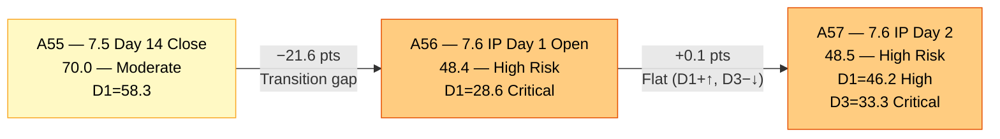
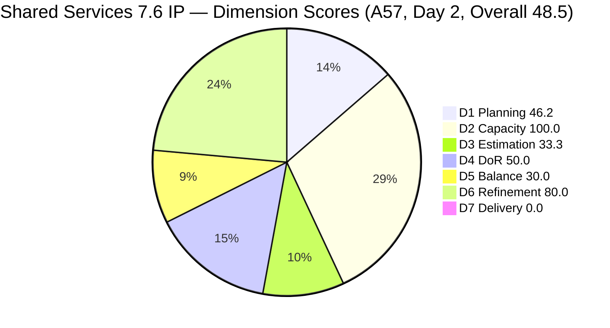
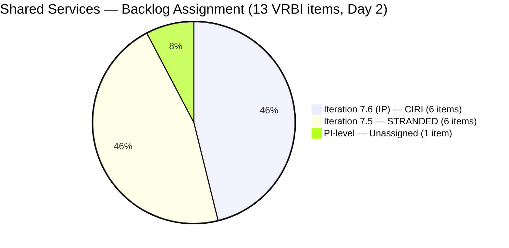
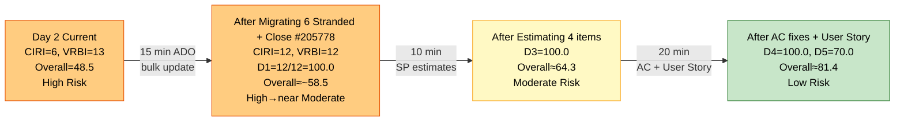
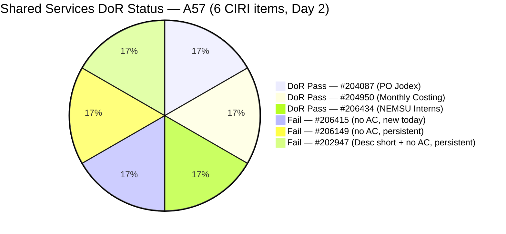

# ADO SAFe Audit — Shared Services Team

## 1. Audit Metadata

| Field | Value |
|---|---|
| **Audit Date** | 2026-06-16 02:06 CST |
| **Sprint Day** | **2 of 14 (IP Iteration)** |
| **Prior Audit** | A56 — `AUDIT_20260615_0200.md` (Overall 48.4, High Risk — 7.6 IP Day 1 Opening) |
| **ADO Project** | Jairosoft Portfolio (`666bb99a-6acd-4999-bb34-efd0e4ea90dc`) |
| **ADO Team** | Shared Services Team (`bd9578fd-5773-48fc-bd80-988dfe5de806`) |
| **Iteration** | Iteration 7.6 (IP) (`42e165b7-e9aa-4150-8d6f-84043ef2482e`) |
| **Iteration Path** | `Jairosoft Portfolio\2026-PI7\Iteration 7.6 (IP)` |
| **Iteration Dates** | Jun 15, 2026 – Jun 28, 2026 |
| **Workspace Folder** | `ado_shared` |
| **Overall Score** | **48.5 — High Risk** |
| **Risk Band** | High (40–59.9) |
| **Visible Backlog Items (VRBI)** | 13 root items |
| **Current Iteration Root Items (CIRI)** | 6 items (IterationPath = Iteration 7.6 (IP)) |
| **Capacity** | Teofilo: 6h/day · Ramon: 0.5h/day = 15.5h/day total (Jaszmeine 3h/day — no CIRI items) |

---

## 2. Executive Summary

The Shared Services Team enters Day 2 of Iteration 7.6 (IP) with an overall score of **48.5 — High Risk**, essentially flat against A56 (48.4). The score is unchanged because the sprint transition gap identified in A56 — 9 items stranded in Iteration 7.5 — has not been fully resolved. However, two significant developments are noted:

**Positive changes since A56:** Two items that were previously stranded in Iteration 7.5 have exited the backlog entirely — #202725 (Messaging and Communication) and #202727 (Contract Management) no longer appear in the VRBI list, suggesting they were closed or moved. This reduces VRBI from 14 to 13. Additionally, two new CIRI items were added to Iteration 7.6 (IP): #206415 (Globe Davao Primary Internet Connection — UNSTABLE, Defect, Jun 16) and #206434 (Add NEMSU Interns to ADO, Enabler, Jun 16), expanding CIRI from 4 to 6.

**Persistent critical issues:** Six items remain stranded in Iteration 7.5 IterationPath (#204082, #204205, #205195, #205198, #205778, #206256). The sprint transition process gap flagged in A56 R1 has not been resolved for these items. D1 = 46.2 (vs A56's 28.6 — improved but still Critical range math-wise since VRBI declined). D3 = 33.3 — worsened because two new CIRI items (#206415, #206434) are unestimated, adding to the two pre-existing unestimated items. D4 = 50.0 — three of six CIRI items fail DoR (two have no AC, one has insufficient Desc and no AC). D5 = 30.0 persists — no User Story in CIRI. #205778 (Passed UAT Testing) and #204082 (Blocked) continue unremediated from A56.

**The team needs concentrated action today.** The D1 recovery path documented in A56 (migrate 6 stranded items, close #205778, escalate #204082) remains the primary lever. A56's recovery projection of ~57.6 after migration is still achievable, though the unestimated and DoR-failing items will need parallel fixes to reach Moderate Risk.

---

## 3. Previous Audit Delta (A56 → A57)

| Dimension | A56 Score (7.6 IP Day 1 — Open) | A57 Score (7.6 IP Day 2) | Delta | Driver |
|---|---|---|---|---|
| D1 Iteration Planning | 28.6 | **46.2** | **+17.6** | VRBI 14→13 (exit of #202725, #202727). CIRI 4→6 (#206415, #206434 added). 6/13 = 46.2. Still Critical risk zone. |
| D2 Team Capacity | 100.0 | **100.0** | 0.0 | Teofilo 6h/day, Ramon 0.5h/day configured. Both have CIRI items. 2/2 = 100.0. |
| D3 Estimation | 50.0 | **33.3** | **−16.7** | 2 new unestimated CIRI items (#206415, #206434) added, regressing from 2/4 to 2/6. |
| D4 DoR Compliance | 50.0 | **50.0** | 0.0 | New items: #206434 passes DoR; #206415 fails (no AC). 3/6 pass = 50.0. No change in rate. |
| D5 Work Item Balance | 30.0 | **30.0** | 0.0 | No User Story (−40) + Enabler dominance 4/6=66.7% (−30). #206415 (Defect) added but doesn't help. |
| D6 Backlog Refinement | 80.0 | **80.0** | 0.0 | 13/13 fresh. 4/6 CIRI untouched = 66.7% > 30% → −20. Base 100.0 − 20 = 80.0. |
| D7 Delivery Predictability | 0.0 | **0.0** | 0.0 | Day 2 IP — no closures. CSP = 7 SP (unchanged). Early-sprint annotated. |
| **Overall** | **48.4** | **48.5** | **+0.1** | D1 improvement (+17.6 contribution) offset by D3 regression (−16.7 contribution). Net: effectively flat. |

**Formula verification:** (46.2 + 100.0 + 33.3 + 50.0 + 30.0 + 80.0 + 0.0) / 7 = 339.5 / 7 = **48.5**

**Key transition observations A56 → A57:**
- **#202725 and #202727 exited the backlog.** Jaszmeine's two Design items (Messaging and Communication; Contract Management) are no longer visible in the scoped backlog. They were previously stranded in Iteration 7.5. It is likely they were closed or moved to a different team's backlog. This is a positive outcome — VRBI contracted from 14 to 13, and the Jaszmeine stranded items are resolved.
- **Two new items added to Iteration 7.6 (IP):** #206415 (Globe Davao Internet — UNSTABLE, Defect, Jun 16) and #206434 (Add NEMSU Interns to ADO, Enabler, Jun 16). Both created today. #206434 is DoR-complete (user story format Desc + detailed AC). #206415 has numbered-list Desc but no AC — DoR fail.
- **D3 regressed:** Neither new item has Story Points. This dropped D3 from 50.0 (2/4) to 33.3 (2/6). Three of the six CIRI items now have no SP estimate.
- **#205778 (Passed UAT Testing) still unclosed.** This item was flagged in A56 R5 as requiring immediate closure (one click). It remains in Iteration 7.5 and Passed UAT Testing state after 2 days of carry-forward.
- **#204082 (Blocked) still unresolved.** The Blocked state Enabler has now persisted for 6+ days across a sprint boundary with no documented unblocking action.
- **#206112 (Gemini License Plan) updated today.** ChangedDate = Jun 16 (PI-level Spike, Requirements Gathering, Teofilo). This suggests some activity on the item, though it remains unassigned to a sprint.

---

## 4. Current Iteration Snapshot

| Metric | Value |
|---|---|
| **Visible Backlog Items (VRBI)** | 13 |
| **Current Iteration Root Items (CIRI)** | 6 (IterationPath = `Jairosoft Portfolio\2026-PI7\Iteration 7.6 (IP)`) |
| **Stranded items (still in Iteration 7.5)** | 6 items — persistent planning gap |
| **PI-level items (no sprint)** | 1 (#206112 — Gemini License Plan) |
| **Story Points Committed (CSP)** | 7 SP (#204087 = 5 SP, #204950 = 2 SP — only estimated CIRI items) |
| **Story Points Closed (CLSP)** | 0 SP (Day 2 — sprint just opened) |
| **Sprint Day / Total** | **2 / 14 — IP Iteration** |
| **Team Size (distinct CIRI assignees)** | 2 (Teofilo: #206415, #202947, #206149, #204950, #206434; Ramon: #204087) |
| **Total Sprint Capacity** | 15.5h/day (Teofilo 6h + Jaszmeine 3h + Ramon 0.5h; Jaszmeine has no 7.6 IP CIRI items) |
| **Iteration Start / Finish** | Jun 15, 2026 – Jun 28, 2026 |

**CIRI Items (6 — in Iteration 7.6 IP):**

| ID | Title | Type | State | SP | Assignee | DoR | ChangedDate |
|---|---|---|---|---|---|---|---|
| #206415 | Globe Davao Primary Internet — UNSTABLE | Defect | Grooming | — | Teofilo | **Fail** (no AC) | Jun 16 |
| #202947 | IT Support Services — End of PI 7 Feedback Survey | Spike | New | — | Teofilo | **Fail** (Desc short, no AC) | Jun 10 |
| #206149 | Enhance Mikrotik Security — Research and Implement | Enabler | Grooming | — | Teofilo | **Fail** (no AC) | Jun 11 |
| #204087 | PO — Jodex AI Enablement Sessions | Enabler | Active | 5 | Ramon | **Pass** | Jun 10 |
| #204950 | Monthly Costing Report — July 2026 | Enabler | New | 2 | Teofilo | **Pass** | Jun 10 |
| #206434 | Add NEMSU Interns to ADO | Enabler | New | — | Teofilo | **Pass** | Jun 16 |

**Stranded Items (6 — still in Iteration 7.5 IterationPath):**

| ID | Title | Type | State | SP | Assignee | Notes |
|---|---|---|---|---|---|---|
| #204082 | QA Jodex / AI Enablement Session | Enabler | Blocked | 5 | Ramon | Blocked 6+ days — escalation overdue |
| #204205 | Android Phone from US | Enabler | Active | 1 | Teofilo | Active work item stranded in prior sprint |
| #205195 | [Retro] Alternative to Figma | Spike | Active | 1 | Jaszmeine | DoR remediation still needed |
| #205198 | [Retro] Design Deliverables on track | Spike | Active | 1 | Jaszmeine | DoR remediation still needed |
| #205778 | Setup Frontend CI Gates | Defect | Passed UAT Testing | 2 | Teofilo | Close immediately — one click from Done |
| #206256 | Research Best Practices for Mikrotik Security | Enabler | Grooming | 2 | Teofilo | Has AC but no Desc — partial DoR |

---

## 5. Work Item Analysis

### CIRI Items — Detailed (6 items in Iteration 7.6 IP)

| ID | Title | Type | State | SP | Assignee | DoR | ChangedDate | Notes |
|---|---|---|---|---|---|---|---|---|
| #206415 | Globe Davao Primary Internet — UNSTABLE | Defect | Grooming | — | Teofilo | **Fail** | Jun 16 | Desc: numbered list of 3 investigation steps (~100 NWS chars) ✓. AC: **None.** Fails AC threshold. New item created today. |
| #202947 | IT Support Feedback Survey | Spike | New | — | Teofilo | **Fail** | Jun 10 | Desc: "Create a Duplicate" + URL = ~16 NWS chars. **Fails 30 NWS threshold.** No AC. Fails both. Persistent from A56. |
| #206149 | Enhance Mikrotik Security | Enabler | Grooming | — | Teofilo | **Fail** | Jun 11 | Desc: numbered list (~120 NWS chars) ✓. AC: **None.** Fails AC threshold. Persistent from A56. |
| #204087 | PO — Jodex AI Enablement Sessions | Enabler | Active | 5 | Ramon | **Pass** | Jun 10 | Desc: detailed paragraph ✓. AC: 4-item checklist ✓. Well-formed. Active — Ramon executing. |
| #204950 | Monthly Costing Report — July 2026 | Enabler | New | 2 | Teofilo | **Pass** | Jun 10 | Desc: 12-item numbered list ✓. AC: multi-section checklist ✓. Well-formed. |
| #206434 | Add NEMSU Interns to ADO | Enabler | New | — | Teofilo | **Pass** | Jun 16 | Desc: "As a trainer, I want to add new interns to ADO So that..." ✓. AC: 6-item checklist with intern emails ✓. Strong DoR for a new item. |

### DoR Assessment — 6 CIRI Items

| ID | Title | Desc ≥ 30 NWS chars | AC ≥ 20 NWS chars | Result |
|---|---|---|---|---|
| #206415 | Globe Davao Internet — UNSTABLE | ✓ (~100 NWS chars, numbered investigation) | ✗ (no AC field) | **Fail — AC missing** |
| #202947 | IT Support Feedback Survey | ✗ (~16 NWS chars — "Create a Duplicate" + URL) | ✗ (no AC field) | **Fail — both fields** |
| #206149 | Enhance Mikrotik Security | ✓ (~120 NWS chars, numbered list) | ✗ (no AC field) | **Fail — AC missing** |
| #204087 | PO — Jodex AI Enablement Sessions | ✓ (~220 NWS chars) | ✓ (~180 NWS chars, 4 checklist items) | **Pass** |
| #204950 | Monthly Costing Report — July 2026 | ✓ (~200 NWS chars, 12 items) | ✓ (~400 NWS chars, multi-section) | **Pass** |
| #206434 | Add NEMSU Interns to ADO | ✓ (~130 NWS chars, BDD format) | ✓ (~260 NWS chars, 6-item checklist) | **Pass** |

**Pass: 3/6. Fail: 3 (#206415 — no AC; #202947 — short Desc, no AC; #206149 — no AC). DCI = 3/6 = 50.0%**

### Type Distribution (6 CIRI items)

| Type | Count | Share | D5 Impact |
|---|---|---|---|
| Enabler | 4 (#206149, #204087, #204950, #206434) | 66.7% | Dominant-type penalty −30 (>60%) |
| Spike | 1 (#202947) | 16.7% | Spike share 16.7% < 40% — no spike penalty |
| Defect | 1 (#206415) | 16.7% | Not User Story |
| User Story | 0 | 0.0% | **−40 PENALTY — No User Story in CIRI** |
| **Total** | **6** | **100%** | **Score: max(0, 100−40−30) = 30.0** |

### Stranded Items Analysis (6 items still in Iteration 7.5)

| ID | Title | Type | State | SP | Assignee | Priority |
|---|---|---|---|---|---|---|
| #205778 | Setup Frontend CI Gates | Defect | Passed UAT Testing | 2 | Teofilo | **URGENT — Close today (one click)** |
| #204082 | QA Jodex / AI Enablement Session | Enabler | Blocked | 5 | Ramon | Migrate + escalate blocker |
| #204205 | Android Phone from US | Enabler | Active | 1 | Teofilo | Migrate or close |
| #205195 | [Retro] Alternative to Figma | Spike | Active | 1 | Jaszmeine | Fix DoR then migrate |
| #205198 | [Retro] Design Deliverables on track | Spike | Active | 1 | Jaszmeine | Fix DoR then migrate |
| #206256 | Research Best Practices for Mikrotik Security | Enabler | Grooming | 2 | Teofilo | Migrate — has AC, needs Desc |

---

## 6. SAFe Compliance Scorecard

| Dimension | Score | Band | Evidence | Notes |
|---|---|---|---|---|
| D1 Iteration Planning | **46.2** | High | 6 CIRI / 13 VRBI | CIRI grew 4→6 (2 new items). VRBI shrank 14→13 (#202725, #202727 exited). 6/13 = 46.2. 6 items stranded in 7.5 remain. |
| D2 Team Capacity | **100.0** | Low | 2/2 active CIRI contributors | Teofilo 6h/day, Ramon 0.5h/day — both with CIRI items. 15.5h/day configured. |
| D3 Estimation | **33.3** | Critical | 2/6 ECI | #206415 and #206434 (new) + #202947 and #206149 (persistent) = 4 unestimated. Only #204087 (5 SP) and #204950 (2 SP). |
| D4 DoR Compliance | **50.0** | High | 3 DCI / 6 CIRI | #206415 no AC. #202947 short Desc and no AC. #206149 no AC. Persistent failures from A56. |
| D5 Work Item Balance | **30.0** | Critical | No US (−40) + Enabler 66.7% (−30) | No User Stories in CIRI. Compound penalty persists. IP iteration structural note applies. |
| D6 Backlog Refinement | **80.0** | Low | 13/13 fresh; 4/6 untouched CIRI | No stale debt. Untouched: #202947, #206149, #204087, #204950 all changed before Jun 15. −20 penalty. |
| D7 Delivery Predictability | **0.0** | Critical | 0 SP closed / 7 SP committed | Day 2 IP — no closures. **Early-sprint IP — low delivery expected.** |
| **OVERALL** | **48.5** | **High Risk** | (46.2+100.0+33.3+50.0+30.0+80.0+0.0)/7 | +0.1 from A56. D1 improved; D3 regressed by equal magnitude. Stalled recovery — action required today. |

**Formula verification:** (46.2 + 100.0 + 33.3 + 50.0 + 30.0 + 80.0 + 0.0) / 7 = 339.5 / 7 = **48.5**

---

## 7. Dimension Findings

### D1 — Iteration Planning: 46.2 / 100 — High Risk

**Formula:** CIRI / VRBI × 100 = 6 / 13 × 100 = **46.2**

| Metric | Value |
|---|---|
| Visible root backlog items (VRBI) | 13 |
| Items in Iteration 7.6 (IP) (CIRI) | 6 (#206415, #202947, #206149, #204087, #204950, #206434) |
| Items stranded in Iteration 7.5 | 6 (#204082, #204205, #205195, #205198, #205778, #206256) |
| PI-level (no sprint) | 1 (#206112) |
| Score | **46.2** |

D1 improved from 28.6 (A56) to 46.2 (+17.6) through two mechanisms: VRBI contracted from 14 to 13 (closure of #202725, #202727), and CIRI grew from 4 to 6 (addition of #206415, #206434). However, six items remain stranded in Iteration 7.5, and D1 = 46.2 is still High Risk — below the 60.0 Moderate threshold.

**If all 6 stranded items were migrated to 7.6 IP today:**
- CIRI = 6 + 6 = 12 (assuming #206112 stays PI-level)
- VRBI = 13 (unchanged)
- D1 = 12/13 × 100 = **92.3 — Low Risk**
- Overall impact: → **~(92.3+100.0+33.3+50.0+30.0+80.0+0.0)/7 = 55.1 — High Risk (improved)**

This migration is the single highest-leverage action available to the team.

---

### D2 — Team Capacity: 100.0 / 100 — Low Risk

**Formula:** CC / CW × 100 = 2 / 2 × 100 = **100.0**

| Contributor | CIRI Items | Capacity | Notes |
|---|---|---|---|
| Teofilo Limpag | 5 (#206415, #202947, #206149, #204950, #206434) | 6h/day | Heavy load — 5 CIRI items plus stranded work |
| RAMON ASENIERO JR | 1 (#204087) | 0.5h/day | Active on #204087. Blocked item #204082 in 7.5 also his. |

Jaszmeine Villanueva has no items in Iteration 7.6 (IP) CIRI — all her work (#205195, #205198) remains stranded in Iteration 7.5. Her 3h/day capacity is technically idle in the current sprint.

---

### D3 — Estimation: 33.3 / 100 — Critical

**Formula:** ECI / PECI × 100 = 2 / 6 × 100 = **33.3**

| ID | Title | Type | SP | Status |
|---|---|---|---|---|
| #206415 | Globe Davao Internet — UNSTABLE | Defect | — | **Not estimated** (new today) |
| #202947 | IT Support Feedback Survey | Spike | — | **Not estimated** (persistent from A56) |
| #206149 | Enhance Mikrotik Security | Enabler | — | **Not estimated** (persistent from A56) |
| #204087 | PO — Jodex AI Enablement Sessions | Enabler | 5 | Estimated ✓ |
| #204950 | Monthly Costing Report — July 2026 | Enabler | 2 | Estimated ✓ |
| #206434 | Add NEMSU Interns to ADO | Enabler | — | **Not estimated** (new today) |

**CSP = 7 SP** (only estimated items). Four CIRI items lack Story Points. This prevents D7 from crediting them even if they close before sprint end. D3 = 33.3 is a regression from A56 (50.0) because two new unestimated items were added without SP.

**Key required action:** Teofilo must add SP estimates to all four unestimated items today — #206415, #202947, #206149, #206434. Suggested sizes: #206415 = 2 SP (investigation + coordination), #202947 = 1 SP (duplicate a form), #206149 = 3 SP (research + implementation), #206434 = 1 SP (ADO user management). If done: D3 = 6/6 = 100.0, CSP grows to ~7+2+1+3+1=14 SP, and D3 contributes +9.5 pts to Overall → ~58.0.

---

### D4 — DoR Compliance: 50.0 / 100 — High Risk

**Formula:** DCI / CIRI × 100 = 3 / 6 × 100 = **50.0**

**Persistent failures (unchanged from A56):**

**#202947 (Teofilo, Spike, New):**
- Desc: "Create a Duplicate" + hyperlink = ~16 NWS chars. **Fails 30 NWS threshold.**
- AC: **None.** No Acceptance Criteria. **Fails both fields.**
- This failure has persisted across 2 audits (A56, A57) without remediation.

**#206149 (Teofilo, Enabler, Grooming):**
- Desc: Numbered list of 3 security tasks (~120 NWS chars) ✓
- AC: **None.** No Acceptance Criteria. **Fails.**
- Persisted since A56.

**New failure:**

**#206415 (Teofilo, Defect, Grooming — created today):**
- Desc: Numbered list of 3 investigation actions ("Understand the reason behind the intermittent connection", "What is the action plan of GLOBE", "Check enhancement solution with for our VPN connection") — ~100 NWS chars ✓
- AC: **None.** No Acceptance Criteria. **Fails.**
- Item created today without AC — the same Day 1 DoR gap pattern observed repeatedly across teams.

**Passing items (unchanged):**
- #204087: Detailed BDD Desc and 4-item AC checklist ✓
- #204950: 12-item scope Desc and multi-section AC checklist ✓
- #206434: BDD-format Desc ("As a trainer, I want to...") and 6-item AC with intern email addresses ✓

**If all 3 failures are remediated:** D4 = 6/6 = 100.0, contributing +7.1 pts to Overall → ~55.6.

---

### D5 — Work Item Balance: 30.0 / 100 — Critical

**Formula:** Base 100 − penalties applied independently

| Penalty | Trigger | Applied |
|---|---|---|
| −40: No User Story in CIRI | **0 User Stories in CIRI** | **YES** |
| −30: Dominant type share > 60% | Enabler = 4/6 = **66.7%** > 60% | **YES** |
| −20: Spike share > 40% | Spike = 1/6 = 16.7% | **No** |

**Score:** max(0, 100 − 40 − 30) = **30.0**

D5 = 30.0 is Critical and unchanged from A56. The addition of #206415 (Defect) does not introduce a User Story and does not reduce the Enabler dominance below 60%. The compound penalty of −40 (no US) and −30 (Enabler dominance) is structural to this IP iteration's CIRI profile.

**IP iteration structural note:** Innovation and Planning (IP) iterations in SAFe are legitimately infrastructure and planning-focused — not feature delivery sprints. The absence of User Stories in an IP iteration reflects appropriate scope separation. This should be formally documented as a Project Exception in workspace CLAUDE.md if it persists across all IP audits, so the D5 = 30.0 floor is contextualized appropriately.

**The only practical D5 improvement this sprint:** Add at least 1 User Story to CIRI. This changes the formula to: max(0, 100 − 0 − 30) = 70.0 (+40 pts), which would push Overall from 48.5 toward ~64.2 — crossing into Moderate Risk territory.

---

### D6 — Backlog Refinement: 80.0 / 100 — Low Risk

**Freshness window:** ChangedDate ≥ 2026-05-02 (45 days before 2026-06-16)

| Metric | Value |
|---|---|
| Total VRBI | 13 |
| Fresh items (ChangedDate ≥ May 2, 2026) | 13 — all items Jun 9–16 |
| Stale_90 items (ChangedDate < Mar 18, 2026) | 0 |
| Stale_180 items (ChangedDate < Dec 19, 2025) | 0 |
| Untouched CIRI (ChangedDate < Jun 15, 2026) | 4/6 (#202947 Jun 10, #206149 Jun 11, #204087 Jun 10, #204950 Jun 10) |

**Base = 13/13 × 100 = 100.0**
**Penalties:**
- Stale_90: 0/13 = 0% (< 10%) → No penalty
- Stale_180: 0 items → No penalty
- Untouched CIRI: 4/6 = 66.7% > 30% → **−20 penalty**

**Score: max(0, 100.0 − 20) = 80.0**

The backlog enters Day 2 of the IP iteration with zero stale debt — a strong positive. The untouched penalty will self-resolve as Teofilo and Ramon begin active work on the CIRI items. #206415 and #206434 (created today, ChangedDate = Jun 16) are already "touched" and do not contribute to the untouched count.

---

### D7 — Delivery Predictability: 0.0 / 100 — Critical

**Formula:** CLSP / CSP × 100 = 0 / 7 × 100 = **0.0**

| Metric | Value |
|---|---|
| Estimated current items (ECI) | 2 (#204087 = 5 SP, #204950 = 2 SP) |
| Committed Story Points (CSP) | 7 SP |
| Closed Story Points (CLSP) | 0 SP |
| Score | **0.0** |

**Early-sprint IP annotation:** Day 2 of Iteration 7.6 (IP). No closures expected. D7 = 0.0 is the expected state.

**D7 structural limitation:** Only 2 of 6 CIRI items are estimated. If Teofilo closes #206434 (Add NEMSU Interns — estimated at 0 SP currently), it would not contribute to D7. Adding SP estimates to all four unestimated items is a prerequisite for D7 to reflect actual delivery progress.

**Blocked item risk:** If #204082 (5 SP, Ramon, Blocked) is migrated to 7.6 IP, it inflates CSP to 12 SP while being 0% deliverable. Consider excluding #204082 from 7.6 IP CIRI by deferring to PI8 or closing.

---

## 8. Risks and Bottlenecks

| # | Severity | Dimension | Risk | Recommended Action |
|---|---|---|---|---|
| R1 | **CRITICAL** | D1 (Day 2 — STILL OUTSTANDING) | 6 items remain stranded in Iteration 7.5 IterationPath. This was flagged as A56 R1 (CRITICAL) and has not been resolved in 24 hours. The 15-minute ADO housekeeping fix from A56 recommendation #1 remains unexecuted. | **Ramon/Carol/Teofilo: migrate all 6 stranded items from Iteration 7.5 to Iteration 7.6 (IP) immediately.** Items: #204082, #204205, #205195, #205198, #205778, #206256. D1 recovers from 46.2 to 92.3. |
| R2 | **CRITICAL** | D5 (STRUCTURAL) | No User Story in CIRI. D5 = 30.0. The compound penalty is structural to the current CIRI profile. | **Identify and add at least 1 User Story to Iteration 7.6 (IP) CIRI.** Consider a requirements-gathering or planning story, or if appropriate, a retrospective action-item formalized as a User Story. D5 would recover from 30.0 to 70.0 (+40 pts), pushing Overall from 48.5 toward 64.2 (Moderate Risk). |
| R3 | **CRITICAL** | D3 | 4/6 CIRI items unestimated. D3 = 33.3 (regression from A56's 50.0). Two new items added today without SP. | **Teofilo: add SP to #206415, #202947, #206149, #206434 today.** Suggested: #206415=2SP, #202947=1SP, #206149=3SP, #206434=1SP. D3 → 100.0 (+9.5 pts). CSP → ~14 SP (better D7 denominator if items close). |
| R4 | **HIGH** | D4 (Persistent) | Three CIRI items fail DoR. #202947 and #206149 have failed for 2+ consecutive audits. #206415 created today with no AC. | **Teofilo: add AC to #206415 and #206149. Expand #202947 Desc to ≥30 NWS chars and add AC.** For #202947 Desc: "Duplicate the Mid PI-06 IT Support Services Feedback Survey to create an End of PI7 version. Update question dates and distribution." For AC: "Duplicate form confirmed in Microsoft Forms, end-of-PI7 question dates updated, distribution list includes all IT support consumers." D4 → 100.0 (+7.1 pts). |
| R5 | **HIGH** | Cross-sprint (#205778) | #205778 (Passed UAT Testing, 2 SP, Teofilo) is one state from Closed and has now persisted across 2 sprint boundaries unremediated. | **Teofilo: close #205778 immediately (today).** Single click: Passed UAT Testing → Closed. Exit from VRBI reduces VRBI to 12, reducing denominator pressure on D1. |
| R6 | **HIGH** | #204082 Blocked (7+ days) | #204082 (Blocked, 5 SP, Ramon) has been Blocked for 7+ days across 2 sprints with no documented escalation in ADO comments. | **Ramon: document the blocker in #204082 ADO comments today with owner and ETA.** If the QA Jodex session cannot be scheduled in the first week of 7.6 IP, defer #204082 to PI8. Continuing to carry 5 SP of Blocked committed capacity artificially inflates CSP with 0% delivery probability. |
| R7 | **MEDIUM** | D1 (new items process) | Both items created today (#206415, #206434) were assigned to the correct iteration (7.6 IP) — this is an improvement over A56's issue where new items defaulted to 7.5. However, #206415 was created without SP or AC. | **Establish a "DoR at creation" norm:** when Teofilo or Ramon creates a new item, add SP + AC before saving. The pattern of creating items without AC is visible across 3 CIRI items. |
| R8 | **MEDIUM** | Jaszmeine capacity idle | Jaszmeine has 3h/day capacity configured but zero CIRI items in Iteration 7.6 (IP). Her Retro items (#205195, #205198) remain stranded in 7.5. | Once stranded items are migrated (R1), Jaszmeine has CIRI items. If #202725 and #202727 were permanently closed, she may need new work assigned for this IP iteration. |
| R9 | **LOW** | D6 untouched | 4/6 CIRI items untouched — structural Day 1-2 artifact for pre-staged items. | Will self-resolve as Teofilo and Ramon begin active work. Expected resolution: Day 3–4. |

---

## 9. Prioritized Recommendations

1. **[TODAY — CRITICAL PRIORITY]** Ramon/Carol/Teofilo: migrate all 6 stranded items from `Iteration 7.5` to `Iteration 7.6 (IP)` in ADO. Items: #204082, #204205, #205195, #205198, #205778, #206256. This has been the highest-priority recommendation for 2 consecutive audits. Estimated time: 10–15 minutes in ADO. D1 recovers to 92.3, Overall → ~55.1. Every day this is delayed, D1 remains High Risk.

2. **[TODAY — ONE CLICK]** Teofilo: close #205778 (Setup Frontend CI Gates, Passed UAT Testing → Closed). This has been outstanding for 2+ sprints. One state transition click removes it from VRBI and credits Teofilo's prior delivery.

3. **[TODAY]** Teofilo: add Story Points to all 4 unestimated CIRI items (#206415, #202947, #206149, #206434). Suggested SP: #206415=2, #202947=1, #206149=3, #206434=1. D3 → 100.0, CSP → ~14 SP. This is the second-highest leverage action available after the migration.

4. **[TODAY]** Teofilo: add Acceptance Criteria to #206415 (Globe Davao Internet UNSTABLE) and #206149 (Mikrotik Security). For #206415 AC: "Root cause of intermittent Globe Davao connection identified, GLOBE action plan confirmed and documented, VPN enhancement implemented and connection stability tested." For #206149 AC: "All Mikrotik user passwords changed and unique, pre-shared key replaced with L2TP certificate, security best practices documented in team SharePoint."

5. **[TODAY]** Teofilo: expand #202947 (IT Support Feedback Survey) Desc beyond "Create a Duplicate" to meet the 30 NWS char threshold. Suggested: "Duplicate the Mid PI-06 IT Support Services Feedback Survey for end-of-PI7. Update question dates, iteration references, and distribution list for all IT support consumers." Also add AC and SP.

6. **[TODAY]** Identify and add at least 1 User Story to Iteration 7.6 (IP) CIRI. Any requirements-gathering, planning-artifact, or retrospective action item written in user-story format qualifies. Adding 1 User Story improves D5 from 30.0 to 70.0 (+40 pts) and pushes Overall from 48.5 toward 64.2 — crossing into Moderate Risk.

7. **[TODAY]** Ramon: escalate and document the blocker on #204082 (QA Jodex / AI Enablement Session, 5 SP) in ADO comments. Record: what is blocking the session, who is the dependency owner, and what is the ETA. If the session cannot be scheduled in the first 7 days of 7.6 IP, defer to PI8 to prevent 5 SP of permanently undeliverable committed capacity.

8. **[PROCESS — PI8]** Establish a sprint transition checklist to prevent recurrence of the Iteration 7.5→7.6 transition gap: (a) at sprint close, update all open items to new IterationPath; (b) all Blocked items escalated or deferred; (c) all Passed UAT items closed before transition. The same transition gap occurred at 7.4→7.5 and 7.5→7.6 — this is a systemic process issue.

9. **[PROCESS — ONGOING]** Implement a "DoR at creation" norm: all new work items must have SP + AC populated at creation. Both items added today (#206415, #206434) — only #206434 followed this norm. Teofilo should set a personal habit: never save a new work item without SP and AC filled in.

10. **[WORKSPACE CLAUDE.md — RECOMMENDED]** Document an IP-iteration Project Exception for D5: "IP (Innovation and Planning) iterations are SAFe-defined infrastructure sprints; absence of User Stories in CIRI during IP iterations is structurally expected. D5 = 30.0 during IP sprints is acknowledged as a structural outcome, not an execution failure." This prevents repeated Critical-level flagging for a known structural constraint.

---

## 10. Evidence Gaps and Limitations

| Gap | Impact | Notes |
|---|---|---|
| **6 items stranded in Iteration 7.5** | D1 = 46.2 — persistent planning gap | The sprint transition process has not been executed for the second consecutive day. This is an ADO housekeeping issue. D1 recovery to 92.3 requires only a 15-minute ADO bulk update. |
| **#202725 and #202727 exit not confirmed** | VRBI = 13 (vs 14 in A56) | These Jaszmeine Design items no longer appear in the scoped backlog. Most likely closed or moved. If they were moved to another team's backlog, they may resurface. No ADO API evidence of the specific action taken. |
| **D3 = 33.3 — 4 unestimated CIRI items** | CSP = 7 SP (2 items) — D7 denominator underrepresents team commitment | The four unestimated items (#206415, #202947, #206149, #206434) cannot contribute to D7 credit. Adding SP is a prerequisite for D7 to accurately reflect delivery progress. |
| **#204082 blocker undocumented** | D7 risk, D1 denominator inflation | ADO work item has no blocker comment. Without documentation, the blocking dependency is invisible to the audit. |
| **D5 = 30.0 — IP iteration structural concern** | Score may not reflect SAFe intent for IP sprints | SAFe IP iterations are legitimately not feature-delivery sprints. The D5 rubric's User Story requirement is structurally incompatible with IP scope. Recommend adding formal Project Exception to workspace CLAUDE.md. |
| **D7 = 0.0 structural — Day 2** | Expected state | IP iterations tend to have later first closures (planning artifacts, environment setups). D7 progress expected from Day 5–7 onward. |
| **#206112 updated today** | #206112 is now ChangedDate Jun 16 | The Gemini License Plan (PI-level Spike, Requirements Gathering, Teofilo) was modified today. It remains unassigned to a sprint. If Teofilo is actively working it, it should be assigned to 7.6 IP. |

---

## 11. Visualizations

### Score Trend — A55 → A56 → A57

### Dimension Scores — A57 (7.6 IP Day 2, Overall 48.5)

### Backlog Iteration Distribution — 13 VRBI Items (Day 2)

### Recovery Path — Same-Day Action Potential

### DoR Status — 6 CIRI Items at Day 2

---

## 12. Audit Trail

| Source | Tool | Data |
|---|---|---|
| Current iteration | `work_list_team_iterations` (project `666bb99a`, team `bd9578fd`, timeframe=current) | Iteration 7.6 (IP): Jun 15–28, 2026; ID `42e165b7-e9aa-4150-8d6f-84043ef2482e` — confirmed |
| Team capacity | `work_get_iteration_capacities` (project `666bb99a`, iterationId `42e165b7`) | Shared Services Team: 15.5h/day (Teofilo 6h + Jaszmeine 3h + Ramon 0.5h); 0 days off |
| Backlog items | `wit_list_backlog_work_items` (project `666bb99a`, team `bd9578fd`, backlogId `Microsoft.RequirementCategory`) | 13 root items: #206415, #204205, #205778, #206256, #206112, #206149, #205195, #205198, #204082, #204087, #202947, #204950, #206434 |
| Work item details | `wit_get_work_items_batch_by_ids` (IDs: 206415, 204205, 205778, 206256, 206112, 206149, 205195, 205198, 204082, 204087, 202947, 204950, 206434) | SP, State, Type, Desc, AC, ChangedDate, IterationPath, AssignedTo confirmed for all 13 items |
| Prior audit | `AUDIT_20260615_0200.md` (A56) | Overall 48.4, High Risk, 7.6 IP Day 1 Opening, 14 VRBI, 4 CIRI, 7 SP committed, 0 SP closed |
| VRBI change noted | Observation | #202725 (Messaging & Communication) and #202727 (Contract Management) no longer in backlog — likely closed or moved since A56 |
