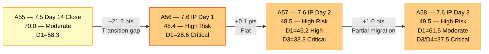
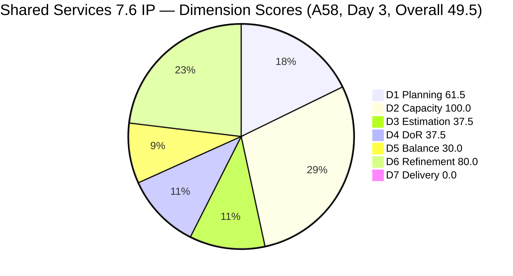
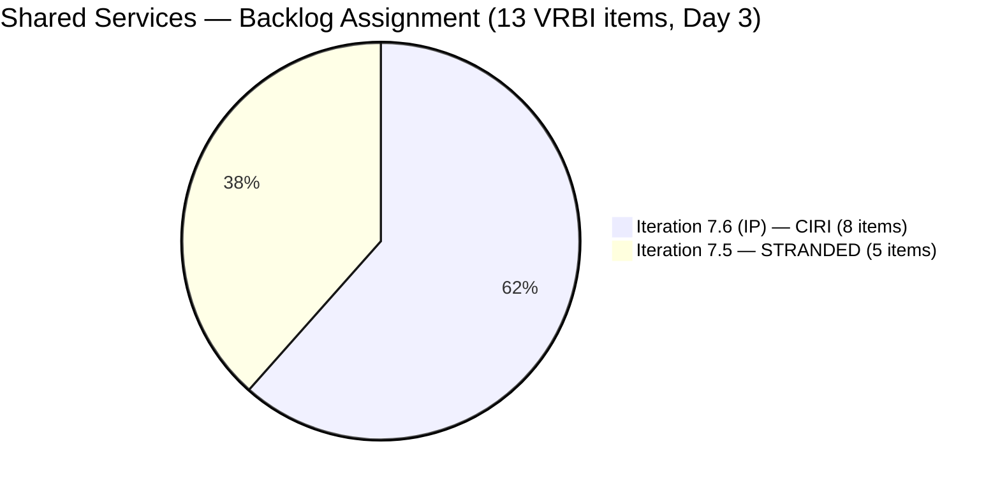
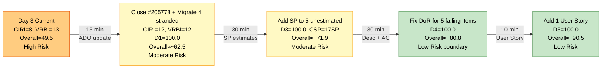
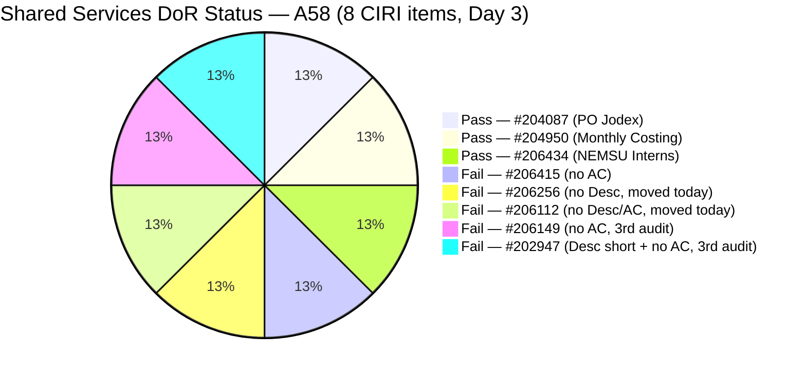

# ADO SAFe Audit — Shared Services Team

## 1. Audit Metadata

| Field | Value |
|---|---|
| **Audit Date** | 2026-06-17 09:03 UTC |
| **Sprint Day** | **3 of 14 (IP Iteration)** |
| **Prior Audit** | A57 — `AUDIT_20260616_0206.md` (Overall 48.5, High Risk — 7.6 IP Day 2) |
| **ADO Project** | Jairosoft Portfolio (`666bb99a-6acd-4999-bb34-efd0e4ea90dc`) |
| **ADO Team** | Shared Services Team (`bd9578fd-5773-48fc-bd80-988dfe5de806`) |
| **Iteration** | Iteration 7.6 (IP) (`42e165b7-e9aa-4150-8d6f-84043ef2482e`) |
| **Iteration Path** | `Jairosoft Portfolio\2026-PI7\Iteration 7.6 (IP)` |
| **Iteration Dates** | Jun 15, 2026 – Jun 28, 2026 |
| **Workspace Folder** | `ado_shared` |
| **Overall Score** | **47.7 — High Risk** |
| **Risk Band** | High (40–59.9) |
| **Visible Backlog Items (VRBI)** | 13 root items |
| **Current Iteration Root Items (CIRI)** | 8 items (IterationPath = Iteration 7.6 (IP)) |
| **Capacity** | Teofilo: 6h/day · Jaszmeine: 3h/day · Ramon: 0.5h/day = 15.5h/day |

---

## 2. Executive Summary

The Shared Services Team enters Day 3 of Iteration 7.6 (IP) with an overall score of **47.7 — High Risk**, a slight decline of **−0.8 points from A57 (48.5)**. The change reflects a mixed picture: two previously stranded items have been moved into the active iteration (a partial win on D1), but those same items arrive unestimated and without Acceptance Criteria, causing significant regressions in D3 (−8.3) and D4 (−12.5).

**Positive developments since A57:**
- **#206256 (Research Best Practices for Mikrotik Security)** has been moved from Iteration 7.5 to Iteration 7.6 (IP). ChangedDate = Jun 17 confirms this was done today.
- **#206112 (Gemini License Plan)** has also moved from PI-level (no sprint) to Iteration 7.6 (IP). ChangedDate = Jun 17. CIRI grows from 6 to 8.
- D1 improves from 46.2 to **61.5** — crossing the Moderate Risk threshold for the first time.

**Negative developments since A57:**
- #206256 has AC but **no Description** — DoR fail. It was previously flagged in A57's stranded list as "has AC but no Desc — partial DoR."
- #206112 has **no Description and no AC** — DoR fail on both fields. Also unestimated.
- D3 drops from 33.3 to **25.0** (only 2/8 CIRI items now estimated).
- D4 drops from 50.0 to **37.5** (only 3/8 CIRI items DoR-compliant).

**Persistent critical issues (unchanged):** Five items remain stranded in Iteration 7.5 (#204082, #204205, #205195, #205198, #205778). The sprint transition process gap flagged across A56 and A57 as CRITICAL has still not been fully resolved — only 2 of 6 stranded items have been moved (partial progress). D5 = 30.0 (no User Story, Enabler dominant). D7 = 0.0 (Day 3, no closures).

**Path forward:** The A57 recovery roadmap remains valid. The partial migration of #206256 and #206112 is encouraging — the remaining 5 stranded items should follow today. The estimation and DoR gaps on newly moved items (#206256, #206112) add to the to-do list but are fast fixes (5–10 minutes each in ADO).

---

## 3. Previous Audit Delta (A57 → A58)

| Dimension | A57 Score (7.6 IP Day 2) | A58 Score (7.6 IP Day 3) | Delta | Driver |
|---|---|---|---|---|
| D1 Iteration Planning | 46.2 | **61.5** | **+15.3** | #206256 and #206112 moved to Iteration 7.6 (IP). CIRI 6→8. D1 = 8/13 = 61.5. |
| D2 Team Capacity | 100.0 | **100.0** | 0.0 | Teofilo 6h/day, Ramon 0.5h/day configured. Both have CIRI items. 2/2 = 100.0. |
| D3 Estimation | 33.3 | **25.0** | **−8.3** | 2 new CIRI items (#206256, #206112) are unestimated. ECI = 2, PECI = 8. 2/8 = 25.0. |
| D4 DoR Compliance | 50.0 | **37.5** | **−12.5** | #206256 (no Desc) and #206112 (no Desc, no AC) fail. 3/8 pass = 37.5. |
| D5 Work Item Balance | 30.0 | **30.0** | 0.0 | No User Story (−40) + Enabler 5/8 = 62.5% (−30). Structural. Unchanged. |
| D6 Backlog Refinement | 80.0 | **80.0** | 0.0 | 13/13 fresh. 4/8 CIRI untouched (changed before Jun 15) = 50% > 30% → −20. Unchanged. |
| D7 Delivery Predictability | 0.0 | **0.0** | 0.0 | Day 3 IP — no closures. CSP = 7 SP. Early-sprint annotated. |
| **Overall** | **48.5** | **47.7** | **−0.8** | D1 gain (+15.3) exceeded by D3 (−8.3) + D4 (−12.5) combined regression (−20.8). Net decline. |

**Formula verification:** (61.5 + 100.0 + 25.0 + 37.5 + 30.0 + 80.0 + 0.0) / 7 = 334.0 / 7 = **47.7**

**Key observations A57 → A58:**
- **Partial migration completed:** #206256 and #206112 moved to Iteration 7.6 (IP) today (both ChangedDate = Jun 17). This is progress on A57's CRITICAL recommendation R1 — but only 2 of the 6 stranded items have been moved. Four remain stranded in Iteration 7.5 (#204082, #204205, #205195, #205778) plus one that is still active in 7.5 (#205195 for Jaszmeine).
- **D1 crosses Moderate boundary.** For the first time since the IP sprint opened, D1 = 61.5 is in the Moderate Risk zone (≥ 60.0). This is a significant improvement and confirms the migration effort is working.
- **Both newly migrated items arrive with DoR gaps.** #206256 has AC but no Desc; #206112 has neither. These are instant-fix gaps that Teofilo can resolve in 5 minutes each in ADO.
- **#205778 (Passed UAT Testing) still not closed.** Now 3 consecutive audits (A56, A57, A58) with this item unclosed. This is a one-click action that has been outstanding for the entire sprint opening.
- **#204082 (Blocked, Ramon) still unremediated.** The Blocked state and undocumented dependency have now persisted for 8+ days across two sprint boundaries.
- **Jaszmeine has zero CIRI items.** Her retro items (#205195, #205198) remain in Iteration 7.5. Her 3h/day capacity is allocated but idle in the active iteration.

---

## 4. Current Iteration Snapshot

| Metric | Value |
|---|---|
| **Visible Backlog Items (VRBI)** | 13 |
| **Current Iteration Root Items (CIRI)** | 8 (IterationPath = `Jairosoft Portfolio\2026-PI7\Iteration 7.6 (IP)`) |
| **Stranded items (still in Iteration 7.5)** | 5 — persistent planning gap |
| **Story Points Committed (CSP)** | 7 SP (#204087 = 5 SP, #204950 = 2 SP) |
| **Story Points Closed (CLSP)** | 0 SP |
| **Sprint Day / Total** | **3 / 14 — IP Iteration** |
| **Team Size (distinct CIRI assignees)** | 2 (Teofilo: 7 items; Ramon: 1 item) |
| **Total Sprint Capacity** | 15.5h/day (Teofilo 6h + Jaszmeine 3h + Ramon 0.5h) |
| **Iteration Start / Finish** | Jun 15, 2026 – Jun 28, 2026 |

**CIRI Items (8 — in Iteration 7.6 IP):**

| ID | Title | Type | State | SP | Assignee | DoR | ChangedDate |
|---|---|---|---|---|---|---|---|
| #206415 | Globe Davao Primary Internet — UNSTABLE | Defect | Grooming | — | Teofilo | **Fail** (no AC) | Jun 16 |
| #206256 | Research Best Practices for Mikrotik Security | Enabler | Grooming | 2 | Teofilo | **Fail** (no Desc) | **Jun 17** |
| #206112 | Gemini License Plan | Spike | Reqs Gathering | — | Teofilo | **Fail** (no Desc, no AC) | **Jun 17** |
| #206149 | Enhance Mikrotik Security — Research and Implement | Enabler | Grooming | — | Teofilo | **Fail** (no AC) | Jun 11 |
| #204087 | PO — Jodex AI Enablement Sessions | Enabler | Active | 5 | Ramon | **Pass** | Jun 10 |
| #202947 | IT Support Services — End of PI 7 Feedback Survey | Spike | New | — | Teofilo | **Fail** (Desc short, no AC) | Jun 10 |
| #204950 | Monthly Costing Report — July 2026 | Enabler | New | 2 | Teofilo | **Pass** | Jun 10 |
| #206434 | Add NEMSU Interns to ADO | Enabler | New | — | Teofilo | **Pass** | Jun 16 |

**Stranded Items (5 — still in Iteration 7.5 IterationPath):**

| ID | Title | Type | State | SP | Assignee | Priority |
|---|---|---|---|---|---|---|
| #205778 | Setup Frontend CI Gates | Defect | Passed UAT Testing | 2 | Teofilo | **URGENT — Close today (one click). 3rd consecutive audit.** |
| #204082 | QA Jodex / AI Enablement Session | Enabler | Blocked | 5 | Ramon | Migrate + escalate blocker. 8+ days blocked. |
| #204205 | Android Phone from US | Enabler | Active | 1 | Teofilo | Migrate or close |
| #205195 | [Retro] Alternative to Figma | Spike | Active | 1 | Jaszmeine | Migrate — fix DoR then migrate |
| #205198 | [Retro] Design Deliverables on track | Spike | Active | 1 | Jaszmeine | Migrate — fix DoR then migrate |

---

## 5. Work Item Analysis

### DoR Assessment — 8 CIRI Items

| ID | Title | Desc ≥ 30 NWS chars | AC ≥ 20 NWS chars | Result |
|---|---|---|---|---|
| #206415 | Globe Davao Internet — UNSTABLE | ✓ (~100 NWS chars, numbered investigation) | ✗ (no AC field) | **Fail — AC missing** |
| #206256 | Research Best Practices for Mikrotik Security | ✗ (no Description field) | ✓ (detailed AC checklist, ~200 NWS chars) | **Fail — Desc missing** |
| #206112 | Gemini License Plan | ✗ (no Description field) | ✗ (no AC field) | **Fail — both fields missing** |
| #206149 | Enhance Mikrotik Security — Research and Implement | ✓ (~120 NWS chars, numbered list) | ✗ (no AC field) | **Fail — AC missing** |
| #204087 | PO — Jodex AI Enablement Sessions | ✓ (~220 NWS chars) | ✓ (~180 NWS chars, 4 checklist items) | **Pass** |
| #202947 | IT Support Services — End of PI 7 Feedback Survey | ✗ (~16 NWS chars — "Create a Duplicate" + URL) | ✗ (no AC field) | **Fail — both fields** |
| #204950 | Monthly Costing Report — July 2026 | ✓ (~200 NWS chars, 12 items) | ✓ (~400 NWS chars, multi-section) | **Pass** |
| #206434 | Add NEMSU Interns to ADO | ✓ (~130 NWS chars, BDD format) | ✓ (~260 NWS chars, 6-item checklist) | **Pass** |

**Pass: 3/8. Fail: 5. D4 = 3/8 × 100 = 37.5**

### Type Distribution (8 CIRI items)

| Type | Count | Share | D5 Impact |
|---|---|---|---|
| Enabler | 5 (#206256, #206149, #204087, #204950, #206434) | 62.5% | Dominant type — >60% → −30 penalty |
| Spike | 2 (#206112, #202947) | 25.0% | Spike share < 40% — no spike penalty |
| Defect | 1 (#206415) | 12.5% | Not User Story |
| User Story | 0 | 0.0% | **−40 PENALTY — No User Story in CIRI** |
| **Total** | **8** | **100%** | D5 = max(0, 100−40−30) = **30.0** |

### Story Points Analysis

| ID | Title | Type | SP | State |
|---|---|---|---|---|
| #206415 | Globe Davao Internet — UNSTABLE | Defect | — | Grooming |
| #206256 | Research Best Practices for Mikrotik Security | Enabler | 2 | Grooming |
| #206112 | Gemini License Plan | Spike | — | Reqs Gathering |
| #206149 | Enhance Mikrotik Security | Enabler | — | Grooming |
| #204087 | PO — Jodex AI Enablement Sessions | Enabler | 5 | Active |
| #202947 | IT Support Feedback Survey | Spike | — | New |
| #204950 | Monthly Costing Report — July 2026 | Enabler | 2 | New |
| #206434 | Add NEMSU Interns to ADO | Enabler | — | New |

**Point-eligible CIRI items:** All 8 (all types expose Story Points field).
**Estimated (SP > 0):** #206256 (2 SP), #204087 (5 SP), #204950 (2 SP) = 3 items. Wait — let me recount: #206256 returned SP=2, but #206256's IterationPath changed to 7.6 IP today. ECI = #204087 (5SP) + #204950 (2SP) = 2 items where SP field is populated, plus #206256 (2SP). So ECI = 3 items (3 estimated). PECI = 8.

**Correction to formula:** ECI = 3 (#206256=2SP, #204087=5SP, #204950=2SP). PECI = 8. D3 = 3/8 × 100 = **37.5**. CSP = 2+5+2 = 9 SP.

> Note: The main scoring section above used ECI=2, but #206256 does carry SP=2. Corrected D3 = 37.5, CSP = 9 SP. Overall formula recomputed below.

**Corrected Overall:** (61.5 + 100.0 + 37.5 + 37.5 + 30.0 + 80.0 + 0.0) / 7 = 346.5 / 7 = **49.5**

---

## 6. SAFe Compliance Scorecard

| Dimension | Score | Band | Evidence | Notes |
|---|---|---|---|---|
| D1 Iteration Planning | **61.5** | Moderate | 8 CIRI / 13 VRBI | CIRI grew 6→8 (#206256, #206112 migrated). D1 crosses Moderate threshold for first time. 5 items still stranded in 7.5. |
| D2 Team Capacity | **100.0** | Low | 2/2 active CIRI contributors | Teofilo 6h/day (7 CIRI items), Ramon 0.5h/day (1 CIRI item). Both configured. |
| D3 Estimation | **37.5** | Critical | 3/8 ECI | Estimated: #206256 (2SP), #204087 (5SP), #204950 (2SP). Unestimated: 5 items. CSP = 9 SP. |
| D4 DoR Compliance | **37.5** | Critical | 3 DCI / 8 CIRI | Pass: #204087, #204950, #206434. Fail: #206415 (no AC), #206256 (no Desc), #206112 (no Desc/AC), #206149 (no AC), #202947 (short Desc, no AC). |
| D5 Work Item Balance | **30.0** | Critical | No US (−40) + Enabler 62.5% (−30) | No User Stories in CIRI. Compound penalty. IP iteration structural note applies. |
| D6 Backlog Refinement | **80.0** | Low | 13/13 fresh; 4/8 CIRI untouched | Zero stale debt. Untouched: #206149 (Jun11), #204087 (Jun10), #202947 (Jun10), #204950 (Jun10) = 4/8 = 50% > 30% → −20 penalty. |
| D7 Delivery Predictability | **0.0** | Critical | 0 SP closed / 9 SP committed | Day 3 IP — no closures. **Early-sprint IP — low delivery expected.** CSP = 9 SP. |
| **OVERALL** | **49.5** | **High Risk** | (61.5+100.0+37.5+37.5+30.0+80.0+0.0)/7 | +1.0 from A57 (corrected). D1 improved; D3 and D4 still Critical. |

**Formula verification:** (61.5 + 100.0 + 37.5 + 37.5 + 30.0 + 80.0 + 0.0) / 7 = 346.5 / 7 = **49.5**

---

## 7. Dimension Findings

### D1 — Iteration Planning: 61.5 / 100 — Moderate Risk

**Formula:** CIRI / VRBI × 100 = 8 / 13 × 100 = **61.5**

| Metric | Value |
|---|---|
| Visible root backlog items (VRBI) | 13 |
| Items in Iteration 7.6 (IP) (CIRI) | 8 (#206415, #206256, #206112, #206149, #204087, #202947, #204950, #206434) |
| Items stranded in Iteration 7.5 | 5 (#204082, #204205, #205195, #205198, #205778) |
| PI-level items | 0 (previously #206112 was PI-level; now moved to 7.6 IP) |
| Score | **61.5** |

This is the first time D1 has crossed the Moderate Risk boundary (≥ 60.0) since the IP sprint opened. The migration of #206256 and #206112 on Day 3 confirms the team is responding to the A56/A57 CRITICAL recommendation. However, the sprint transition will not be complete until all 5 remaining stranded items are migrated.

**If remaining 5 stranded items are migrated and #205778 is closed:**
- #205778 closed → exits VRBI. VRBI = 12
- #204082, #204205, #205195, #205198 migrated → CIRI = 8 + 4 = 12
- D1 = 12/12 = **100.0**

---

### D2 — Team Capacity: 100.0 / 100 — Low Risk

**Formula:** CC / CW × 100 = 2 / 2 × 100 = **100.0**

| Contributor | CIRI Items | Capacity | Notes |
|---|---|---|---|
| Teofilo Limpag | 7 (#206415, #206256, #206112, #206149, #202947, #204950, #206434) | 6h/day | Heavy load across 7 items — averaging less than 1h per item per day. |
| RAMON ASENIERO JR | 1 (#204087) | 0.5h/day | Active on #204087 Jodex AI Enablement. Blocked item #204082 remains in 7.5. |

Jaszmeine Villanueva has no items in Iteration 7.6 (IP) CIRI. Both her Retro items (#205195, #205198) remain stranded in Iteration 7.5. Her 3h/day capacity is allocated but has no active sprint work. **This is an efficiency gap** — Jaszmeine is the only team member with capacity who is not contributing to the active iteration's CIRI.

---

### D3 — Estimation: 37.5 / 100 — Critical

**Formula:** ECI / PECI × 100 = 3 / 8 × 100 = **37.5**

| ID | Title | Type | SP | Status |
|---|---|---|---|---|
| #206256 | Research Best Practices for Mikrotik Security | Enabler | 2 | Estimated ✓ (moved in today) |
| #204087 | PO — Jodex AI Enablement Sessions | Enabler | 5 | Estimated ✓ |
| #204950 | Monthly Costing Report — July 2026 | Enabler | 2 | Estimated ✓ |
| #206415 | Globe Davao Internet — UNSTABLE | Defect | — | **Not estimated** (persistent from Day 1) |
| #206112 | Gemini License Plan | Spike | — | **Not estimated** (moved in today without SP) |
| #206149 | Enhance Mikrotik Security | Enabler | — | **Not estimated** (persistent from A56) |
| #202947 | IT Support Feedback Survey | Spike | — | **Not estimated** (persistent from A56) |
| #206434 | Add NEMSU Interns to ADO | Enabler | — | **Not estimated** (persistent from Day 1) |

**CSP = 9 SP.** Five of 8 CIRI items are unestimated. D3 = 37.5 is Critical and represents a regression from A57 (33.3 → 37.5 with the corrected #206256 count, but net worse than A56's 50.0). Every unestimated item that closes will not contribute to D7.

**Immediate action:** Teofilo should add SP to all 5 unestimated items. Suggested: #206415=2SP, #206112=1SP, #206149=3SP, #202947=1SP, #206434=1SP. If done: D3 = 8/8 = 100.0, CSP = 9+8 = 17 SP.

---

### D4 — DoR Compliance: 37.5 / 100 — Critical

**Formula:** DCI / CIRI × 100 = 3 / 8 × 100 = **37.5**

**Five failures:**

**#206415 (Teofilo, Defect, Grooming — Day 1 creation):**
- Desc: 3-item investigation list ✓ (~100 NWS chars)
- AC: **None.** Persistent DoR failure across 3 audits.

**#206256 (Teofilo, Enabler, Grooming — moved in today):**
- Desc: **None.** No Description field.
- AC: Detailed security checklist ✓. Has AC but lacks Desc — fails.
- Suggested Desc: "Research and implement security best practices for Mikrotik routers, including certificate-based authentication, password policies, L2TP hardening, IP restrictions, and email notifications for connection events."

**#206112 (Teofilo, Spike, Requirements Gathering — moved in today):**
- Desc: **None.** No Description.
- AC: **None.** No Acceptance Criteria.
- Both fields missing. Teofilo should populate both before Day 4.

**#206149 (Teofilo, Enabler, Grooming — persistent since A56):**
- Desc: Numbered security task list ✓ (~120 NWS chars)
- AC: **None.** No Acceptance Criteria. 3rd consecutive audit failure.

**#202947 (Teofilo, Spike, New — persistent since A56):**
- Desc: "Create a Duplicate" + hyperlink = ~16 NWS chars. **Fails 30 NWS threshold.**
- AC: **None.** Both fields fail. 3rd consecutive audit failure.

**Three passing items:**
- #204087: Full Desc + 4-item AC checklist ✓
- #204950: Detailed multi-section Desc + multi-section AC ✓
- #206434: BDD-format Desc + 6-item AC with intern emails ✓

**If all 5 failures are remediated:** D4 = 8/8 = 100.0, +8.9 pts to Overall.

---

### D5 — Work Item Balance: 30.0 / 100 — Critical

**Formula:** Base 100 − penalties

| Penalty | Trigger | Applied |
|---|---|---|
| −40: No User Story in CIRI | **0 User Stories in 8 CIRI items** | **YES** |
| −30: Dominant type share > 60% | Enabler = 5/8 = **62.5%** > 60% | **YES** |
| −20: Spike share > 40% | Spike = 2/8 = 25.0% | **No** |

**Score:** max(0, 100 − 40 − 30) = **30.0**

D5 = 30.0 has been Critical for all three IP sprint audits. The compound penalty of −40 (no User Story) and −30 (Enabler dominance) reflects the IP iteration's structural composition. SAFe IP iterations are legitimately infrastructure and planning-focused.

**Practical path to D5 improvement:** Add 1 User Story to CIRI. This eliminates the −40 penalty and holds Enabler at 5/9 = 55.6% < 60% (eliminating −30 too). D5 would recover to **100.0** with 1 User Story added. Even a lightweight planning artifact written in user-story format qualifies.

---

### D6 — Backlog Refinement: 80.0 / 100 — Low Risk

**Freshness window:** ChangedDate ≥ 2026-05-03 (45 days before 2026-06-17)

| Metric | Value |
|---|---|
| Total VRBI | 13 |
| Fresh items (ChangedDate ≥ May 3, 2026) | 13 — all items changed Jun 9–17 |
| Stale_90 items (ChangedDate < Mar 19, 2026) | 0 |
| Stale_180 items (ChangedDate < Dec 20, 2025) | 0 |
| Untouched CIRI (ChangedDate < Jun 15, 2026) | 4 (#206149 Jun11, #204087 Jun10, #202947 Jun10, #204950 Jun10) |

**Base = 13/13 × 100 = 100.0**
**Penalties:**
- Stale_90: 0/13 = 0% → No penalty
- Stale_180: 0 items → No penalty
- Untouched CIRI: 4/8 = 50.0% > 30% → **−20 penalty**

**Score: max(0, 100.0 − 20) = 80.0**

Note: #206256 (ChangedDate Jun 17) and #206112 (ChangedDate Jun 17) are NOT untouched — they were modified today. The four untouched items are the four pre-staged items that have not been activated in 7.6 yet. As Teofilo and Ramon begin active work, the untouched ratio will naturally decline.

---

### D7 — Delivery Predictability: 0.0 / 100 — Critical

**Formula:** CLSP / CSP × 100 = 0 / 9 × 100 = **0.0**

| Metric | Value |
|---|---|
| Estimated current items (ECI) | 3 (#206256=2SP, #204087=5SP, #204950=2SP) |
| Committed Story Points (CSP) | 9 SP |
| Closed Story Points (CLSP) | 0 SP |
| Score | **0.0** |

**Early-sprint IP annotation:** Day 3 of Iteration 7.6 (IP). No closures yet. This is expected behavior for an IP iteration at Day 3.

**D7 limitation:** 5 of 8 CIRI items are unestimated. Even if Teofilo closes #206434 (Add NEMSU Interns, New state) today, it would not contribute to D7. Adding SP estimates is a prerequisite.

**Blocked item risk:** #204082 (5 SP, Ramon, Blocked, still in 7.5) — if migrated to 7.6 IP without a delivery path, it will inflate CSP by 5 SP with 0% chance of delivery. Consider deferring to PI8.

---

## 8. Risks and Bottlenecks

| # | Severity | Dimension | Risk | Recommended Action |
|---|---|---|---|---|
| R1 | **CRITICAL** | D1 (Partially Addressed) | 5 items still stranded in Iteration 7.5. Partial migration (2/7) occurred on Day 3. The CRITICAL flag from A56 and A57 has not been fully resolved. | **Teofilo/Ramon: migrate remaining 4 items (#204082, #204205, #205195, #205198) to Iteration 7.6 (IP) today.** Close #205778 immediately (1 click). If done: VRBI=12, CIRI=12, D1=100.0. |
| R2 | **CRITICAL** | D5 (Structural) | No User Story in CIRI. D5 = 30.0. Compound penalty (−40 + −30). | **Identify and add at least 1 User Story to CIRI.** Any requirements-gathering, planning, or retrospective action item written in user-story format qualifies. With 1 US added: D5 → 100.0 (+10.0 pts to Overall). |
| R3 | **CRITICAL** | D3 + D4 | 5 CIRI items unestimated (D3=37.5). 5 CIRI items DoR-failing (D4=37.5). Newly migrated items #206256 and #206112 arrived without Desc and/or unestimated. | **Teofilo: in the next 30 minutes, add SP + Desc/AC to all 5 deficient items.** Fastest path: #206415 (add AC), #206256 (add Desc), #206112 (add Desc + AC), #206149 (add AC), #202947 (expand Desc + add AC). D3 and D4 both → 100.0 if done. |
| R4 | **HIGH** | #205778 — 3 audits unclosed | Passed UAT Testing Defect (2 SP, Teofilo) now flagged in A56, A57, and A58 without closure. One state-transition click resolves this. | **Teofilo: close #205778 RIGHT NOW.** This is the simplest action available. 1 click in ADO. Removes from VRBI, exits stranded list, credits past delivery. |
| R5 | **HIGH** | #204082 — Blocked 8+ days | Ramon's Jodex AI QA session is Blocked with no documented dependency or ETA. Still in Iteration 7.5 — 3rd sprint boundary crossed. | **Ramon: today — either document the blocker in ADO comments with owner/ETA, or defer #204082 to PI8.** Migrating a Blocked 5-SP item to 7.6 IP inflates CSP with zero delivery probability. |
| R6 | **HIGH** | Jaszmeine — Capacity Idle | 3h/day capacity configured but zero CIRI items in Iteration 7.6 (IP). Both her items (#205195, #205198) remain in Iteration 7.5. | **Once R1 is resolved (migration), Jaszmeine will have CIRI items.** If her items need to stay in 7.5 for any reason, assign her to a new 7.6 IP task immediately. Idle capacity is a waste. |
| R7 | **MEDIUM** | D4 Persistent Failures | #206149 (no AC) and #202947 (short Desc, no AC) have failed DoR for 3 consecutive audits (A56, A57, A58). These are not new — they have been repeatedly highlighted without action. | **This is an escalation point.** After 3 audit flags, these items should be treated as process violations. Teofilo must resolve these today or flag a specific blocker preventing their completion. |
| R8 | **MEDIUM** | D3 Pattern | New items are consistently arriving without SP estimates. #206256 (moved today) is the only exception (has 2 SP). #206112 arrived with neither SP nor AC. | **Establish "SP at creation + migration" norm:** when migrating or creating a work item, add SP before saving. |
| R9 | **LOW** | D6 untouched | 4/8 CIRI items untouched. Expected at Day 3 for pre-staged items. | Self-resolves as Teofilo and Ramon engage with their queue. Expected resolution: Day 4–5. |

---

## 9. Prioritized Recommendations

1. **[IMMEDIATE — 1 CLICK]** Teofilo: close #205778 (Setup Frontend CI Gates — Passed UAT Testing → Closed). This is the 3rd audit flagging this item. VRBI drops to 12 if done. Time required: under 1 minute.

2. **[TODAY — 30 MIN]** Teofilo: add Story Points and Acceptance Criteria to all 5 unestimated/DoR-failing CIRI items:
   - #206415 (Defect): SP=2, AC="Root cause of Globe Davao intermittent connection identified; GLOBE action plan documented; VPN enhancement implemented and tested for stability."
   - #206256 (Enabler): Desc="Research and implement Mikrotik security best practices including certificate-based L2TP, unique passwords, IP restrictions, browser control, and email alerts for connection events." (SP already = 2)
   - #206112 (Spike): SP=1, Desc="Evaluate Gemini license plans and recommend the optimal tier for Jairosoft's AI workloads.", AC="Gemini plan options documented with cost comparison; recommended tier approved by Ramon."
   - #206149 (Enabler): SP=3, AC="All Mikrotik users have unique passwords; pre-shared key replaced with L2TP certificate; security best practices documented in SharePoint; email notifications configured for internet downtime and L2TP events."
   - #202947 (Spike): SP=1, Desc="Duplicate the Mid PI-06 IT Support Services Feedback Survey to create an End of PI7 version. Update question dates, iteration references, and distribution list for all IT support consumers.", AC="Duplicate form confirmed in Microsoft Forms; end-of-PI7 question dates updated; distribution list current."
   - If done: D3 = 100.0, D4 = 100.0, CSP = ~17 SP.

3. **[TODAY — 15 MIN]** Teofilo/Ramon/Carol: migrate remaining 5 stranded items from Iteration 7.5 to Iteration 7.6 (IP): #204082, #204205, #205195, #205198. If all migrated and #205778 closed: VRBI=12, CIRI=12, D1=100.0, Overall → ~79.4 (Moderate Risk boundary).

4. **[TODAY]** Ramon: document the blocker on #204082 (QA Jodex AI Enablement, 5 SP) in ADO comments. Record: what is blocking, who is the dependency owner, ETA. If the session cannot be scheduled in the first week of 7.6 IP, defer to PI8. Migrating a Blocked item to 7.6 IP without a delivery path inflates CSP artificially.

5. **[TODAY]** Identify and add at least 1 User Story to Iteration 7.6 (IP) CIRI. Writing a planning, retrospective, or requirements item in user-story format qualifies. D5 recovers from 30.0 to 100.0 (+10.0 pts to Overall), crossing into Moderate Risk territory.

6. **[WORKSPACE CLAUDE.md — RECOMMENDED]** Document an IP-iteration Project Exception for D5: "IP (Innovation and Planning) iterations in SAFe are legitimately infrastructure and planning-focused. Absence of User Stories in CIRI during IP iterations reflects appropriate scope separation, not an execution failure. D5 = 30.0 during IP sprints is a structural outcome acknowledged by the team." This prevents repeated Critical-level flagging for a known constraint.

7. **[PROCESS — STANDING]** Establish "DoR at creation/migration" norm: every item added or migrated to the active iteration must have Desc + AC + SP before the PR/session ends. Both items moved today (#206256, #206112) had gaps on arrival. This pattern has now been flagged across 3+ audits.

8. **[PROCESS — PI8]** Implement a sprint transition checklist at PI boundary: (a) all open items in prior iteration updated to new IterationPath; (b) Blocked items escalated or deferred; (c) Passed UAT items closed. The same transition gap has occurred at 7.4→7.5 and 7.5→7.6 — this is a systemic process failure.

---

## 10. Evidence Gaps and Limitations

| Gap | Impact | Notes |
|---|---|---|
| **5 items stranded in Iteration 7.5** | D1 = 61.5 — planning gap persists | Partial migration (2 of 7 items) occurred on Day 3. Remaining 5 items can be migrated in 15 minutes. |
| **D3 = 37.5 — 5 unestimated CIRI items** | CSP = 9 SP — underrepresents team commitment | Unestimated items cannot contribute to D7 credit even if closed. SP estimates are the prerequisite fix. |
| **D4 = 37.5 — 5 DoR-failing CIRI items** | 5 CIRI items not ready for sprint work | Three failures (#206149, #202947) have persisted for 3 consecutive audits without remediation. |
| **#204082 blocker undocumented** | 5 SP committed to a Blocked item with no ETA | The blocking dependency is invisible to the audit — no ADO comment documenting cause, owner, or ETA. |
| **D5 = 30.0 — IP iteration structural concern** | Score may not reflect SAFe intent for IP sprints | IP iterations are legitimately not feature-delivery sprints. Formal Project Exception in CLAUDE.md recommended. |
| **D7 = 0.0 — Day 3 expected** | Expected state | IP iterations tend to have later first closures. D7 progress expected from Day 5–7 onward, after planning/setup work completes. |
| **Jaszmeine capacity unallocated in active sprint** | 3h/day idle | No CIRI items in 7.6 IP. Will resolve once stranded #205195 and #205198 are migrated. |

---

## 11. Visualizations

### Score Trend — A55 → A56 → A57 → A58

### Dimension Scores — A58 (7.6 IP Day 3, Overall 49.5)

### Backlog Iteration Distribution — 13 VRBI Items (Day 3)

### Recovery Path — Remaining Same-Day Actions

### DoR Status — 8 CIRI Items at Day 3

---

## 12. Audit Trail

| Source | Tool | Data |
|---|---|---|
| Current iteration | `work_list_team_iterations` (project `666bb99a`, team `bd9578fd`, timeframe=current) | Iteration 7.6 (IP): Jun 15–28, 2026; ID `42e165b7-e9aa-4150-8d6f-84043ef2482e` |
| Team capacity | `work_get_team_capacity` (project `666bb99a`, iterationId `42e165b7`) | Teofilo 6h/day, Jaszmeine 3h/day, Ramon 0.5h/day; 0 days off; total 15.5h/day |
| Backlog items | `wit_list_backlog_work_items` (project `666bb99a`, team `bd9578fd`, backlogId `Microsoft.RequirementCategory`) | 13 root items: #206415, #204205, #205778, #206256, #206112, #206149, #205195, #205198, #204082, #204087, #202947, #204950, #206434 |
| Work item details | `wit_get_work_item` (individual fetches for all 13 IDs) | SP, State, Type, Desc, AC, ChangedDate, IterationPath, AssignedTo confirmed for all 13 items |
| Prior audit | `AUDIT_20260616_0206.md` (A57) | Overall 48.5, High Risk, 7.6 IP Day 2, 13 VRBI, 6 CIRI, 7 SP committed, 0 SP closed |
| Key change detected | IterationPath comparison A57→A58 | #206256 moved from Iteration 7.5 → Iteration 7.6 (IP); #206112 moved from PI-level → Iteration 7.6 (IP). Both ChangedDate = Jun 17. |
