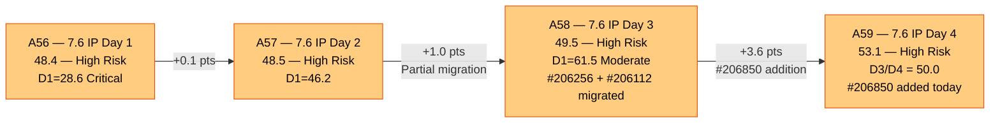
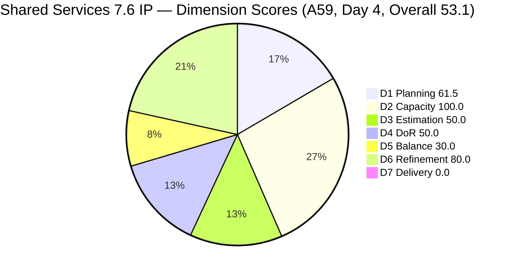
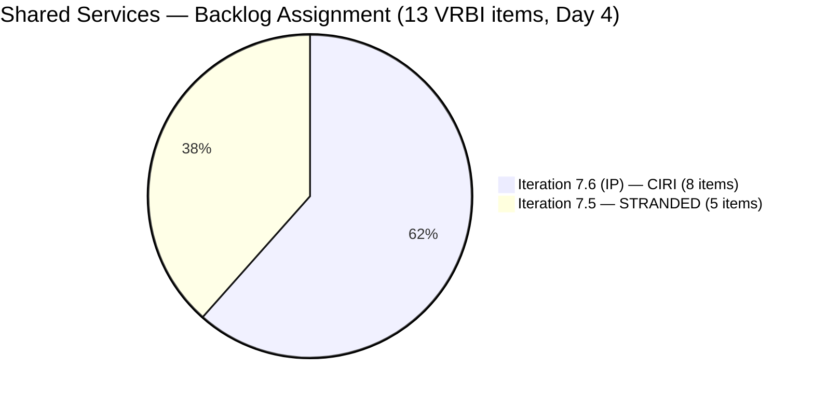
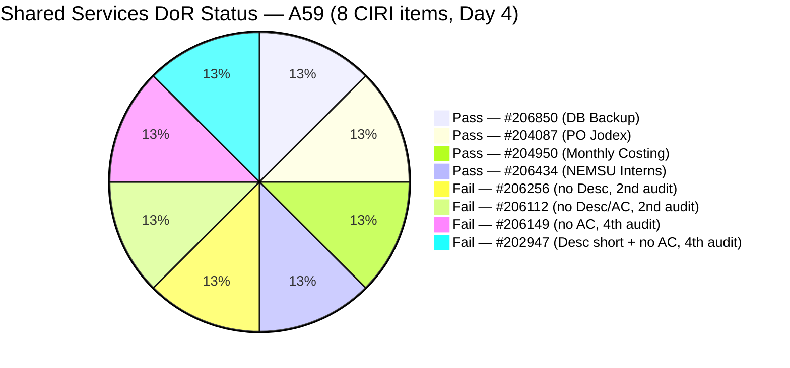
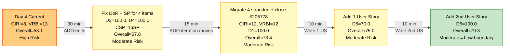

# ADO SAFe Audit — Shared Services Team

## 1. Audit Metadata

| Field | Value |
|---|---|
| **Audit Date** | 2026-06-18 09:02 UTC |
| **Sprint Day** | **4 of 14 (IP Iteration)** |
| **Prior Audit** | A58 — `AUDIT_20260617_0903.md` (Overall 49.5, High Risk — 7.6 IP Day 3) |
| **ADO Project** | Jairosoft Portfolio (`666bb99a-6acd-4999-bb34-efd0e4ea90dc`) |
| **ADO Team** | Shared Services Team (`bd9578fd-5773-48fc-bd80-988dfe5de806`) |
| **Iteration** | Iteration 7.6 (IP) (`42e165b7-e9aa-4150-8d6f-84043ef2482e`) |
| **Iteration Path** | `Jairosoft Portfolio\2026-PI7\Iteration 7.6 (IP)` |
| **Iteration Dates** | Jun 15, 2026 – Jun 28, 2026 |
| **Workspace Folder** | `ado_shared` |
| **Overall Score** | **53.1 — High Risk** |
| **Risk Band** | High (40–59.9) |
| **Visible Backlog Items (VRBI)** | 13 root items |
| **Current Iteration Root Items (CIRI)** | 8 items (IterationPath = Iteration 7.6 (IP)) |
| **Capacity** | Teofilo: 6h/day · Jaszmeine: 3h/day · Ramon: 0.5h/day = 15.5h/day |

---

## 2. Executive Summary

The Shared Services Team enters Day 4 of Iteration 7.6 (IP) with an overall score of **53.1 — High Risk**, an improvement of **+3.6 points from A58 (49.5)**. The gain is driven by a single meaningful development: **#206850 (Backup AutoAllies DB in BLOB Storage 06/18/2026)** has been added to the iteration today with 1 SP estimated and full DoR compliance, contributing directly to both D3 and D4 improvement.

**Positive developments since A58:**
- **#206850 added to Iteration 7.6 (IP)** today (ChangedDate = Jun 18, 05:13 UTC). Teofilo-assigned Enabler with 1 SP, substantive Description, and detailed AC checklist (5 acceptance conditions). This brings CIRI to 8 items (replacing the previously closed/removed #206415).
- **D3 improves from 37.5 to 50.0** — 4 of 8 CIRI items now have SP estimates (#206256=2, #206850=1, #204087=5, #204950=2 = 10 SP total).
- **D4 improves from 37.5 to 50.0** — #206850 passes DoR, bringing passing items to 4: #206850, #204087, #204950, #206434.
- **#206112 (Gemini License Plan) was touched today** (ChangedDate Jun 18, 05:11 UTC), suggesting Teofilo is actively working the Mikrotik/planning items.

**Persistent critical issues (unchanged from A58):**
- **Five items stranded in Iteration 7.5** (#204082, #204205, #205195, #205198, #205778). The D1 critical gap flagged across A56, A57, and A58 has still not been fully resolved. D1 remains at 61.5.
- **#205778 (Passed UAT Testing, Defect)** is now flagged across 4 consecutive audits without closure. This is the simplest fix available.
- **D5 = 30.0 (Critical)** — zero User Stories in CIRI, compound penalty. Structural to IP iteration composition.
- **D7 = 0.0** — no closures on Day 4. Early-sprint annotation applies.
- **4 CIRI items remain unestimated** (#206112, #206149, #202947, #206434).
- **4 CIRI items remain DoR-failing** (#206256 no Desc, #206112 no Desc/AC, #206149 no AC, #202947 short Desc + no AC).

**Score path:** The team is in a recovery trajectory but has been slow. Three days of CRITICAL recommendations have yielded incremental execution. Completing the DoR fixes and SP estimates across 4 items would push D3 and D4 to 100.0, delivering an estimated 18–20 point Overall improvement.

---

## 3. Previous Audit Delta (A58 → A59)

| Dimension | A58 Score (7.6 IP Day 3) | A59 Score (7.6 IP Day 4) | Delta | Driver |
|---|---|---|---|---|
| D1 Iteration Planning | 61.5 | **61.5** | 0.0 | CIRI = 8 / VRBI = 13. #206415 exited, #206850 entered — net zero CIRI change. D1 unchanged. |
| D2 Team Capacity | 100.0 | **100.0** | 0.0 | Teofilo 6h/day, Ramon 0.5h/day configured. Both have CIRI items. 2/2 = 100.0. |
| D3 Estimation | 37.5 | **50.0** | **+12.5** | #206850 added with 1 SP. Estimated: #206256 (2), #206850 (1), #204087 (5), #204950 (2) = 4/8. CSP = 10 SP. |
| D4 DoR Compliance | 37.5 | **50.0** | **+12.5** | #206850 passes DoR. DCI = 4 (#206850, #204087, #204950, #206434). 4/8 = 50.0. |
| D5 Work Item Balance | 30.0 | **30.0** | 0.0 | No User Story (−40) + Enabler 6/8 = 75% (−30). Structural. Unchanged. |
| D6 Backlog Refinement | 80.0 | **80.0** | 0.0 | 13/13 fresh. Untouched CIRI = 4/8 = 50% > 30% → −20. Unchanged. |
| D7 Delivery Predictability | 0.0 | **0.0** | 0.0 | Day 4 IP — no closures. CSP = 10 SP. Early-sprint annotated. |
| **Overall** | **49.5** | **53.1** | **+3.6** | D3 and D4 each gained +12.5 from #206850 addition. Net improvement driven by today's new item. |

**Formula verification:** (61.5 + 100.0 + 50.0 + 50.0 + 30.0 + 80.0 + 0.0) / 7 = 371.5 / 7 = **53.1**

**Key observations A58 → A59:**
- **#206850 is new today.** "Backup AutoAllies DB in BLOB Storage 06/18/2026" appeared in the backlog with IterationPath = 7.6 (IP) and a today timestamp. Teofilo created or migrated it this morning. It is the first item in this sprint created with full DoR compliance and an estimate from the start — a positive signal about improving creation habits.
- **#206415 has exited the backlog.** Yesterday's audit included "Globe Davao Primary Internet — UNSTABLE" (Defect, Grooming). It is no longer returned by `wit_list_backlog_work_items` today. It may have been closed, deleted, or reclassified. This is the likely cause of the VRBI remaining at 13 (net neutral: one exited, one entered).
- **#206112 was touched today** (ChangedDate 2026-06-18T05:11 UTC). The Gemini License Plan Spike shows activity, consistent with Teofilo's morning ADO work session. However, no Description or AC were added — the DoR failure persists.
- **#206256 was also touched today** (ChangedDate 2026-06-18T05:41 UTC) — Mikrotik Security research. The AC checklist has been further updated (strikethrough on "Disable Neighbour Discovery") but no Description field added. DoR failure persists for this item.
- **No stranded items moved.** The five items in Iteration 7.5 (#204082, #204205, #205195, #205198, #205778) remain there — now Day 4 of the sprint without migration. The A58 CRITICAL recommendation to migrate these items has not been actioned.
- **#205778 remains unclosed for the 4th consecutive audit.** This is a direct process escalation point.

---

## 4. Current Iteration Snapshot

| Metric | Value |
|---|---|
| **Visible Backlog Items (VRBI)** | 13 |
| **Current Iteration Root Items (CIRI)** | 8 (IterationPath = `Jairosoft Portfolio\2026-PI7\Iteration 7.6 (IP)`) |
| **Stranded items (still in Iteration 7.5)** | 5 — persistent planning gap (4th consecutive audit) |
| **Story Points Committed (CSP)** | 10 SP (#206256=2, #206850=1, #204087=5, #204950=2) |
| **Story Points Closed (CLSP)** | 0 SP |
| **Sprint Day / Total** | **4 / 14 — IP Iteration** |
| **Team Size (distinct CIRI assignees)** | 2 (Teofilo: 7 items; Ramon: 1 item) |
| **Total Sprint Capacity** | 15.5h/day (Teofilo 6h + Jaszmeine 3h + Ramon 0.5h) |
| **Iteration Start / Finish** | Jun 15, 2026 – Jun 28, 2026 |

**CIRI Items (8 — in Iteration 7.6 IP):**

| ID | Title | Type | State | SP | Assignee | DoR | ChangedDate |
|---|---|---|---|---|---|---|---|
| #206256 | Research Best Practices for Mikrotik Security | Enabler | Active | 2 | Teofilo | **Fail** (no Desc) | Jun 18 |
| #206850 | Backup AutoAllies DB in BLOB Storage | Enabler | Active | 1 | Teofilo | **Pass** | **Jun 18** |
| #206112 | Gemini License Plan | Spike | Reqs Gathering | — | Teofilo | **Fail** (no Desc, no AC) | Jun 18 |
| #206149 | Enhance Mikrotik Security — Research and Implement | Enabler | Grooming | — | Teofilo | **Fail** (no AC) | Jun 11 |
| #204087 | PO — Jodex AI Enablement Sessions | Enabler | Active | 5 | Ramon | **Pass** | Jun 10 |
| #202947 | IT Support Services — End of PI 7 Feedback Survey | Spike | New | — | Teofilo | **Fail** (Desc short, no AC) | Jun 10 |
| #204950 | Monthly Costing Report — July 2026 | Enabler | New | 2 | Teofilo | **Pass** | Jun 10 |
| #206434 | Add NEMSU Interns to ADO | Enabler | New | — | Teofilo | **Pass** | Jun 16 |

**Stranded Items (5 — still in Iteration 7.5):**

| ID | Title | Type | State | SP | Assignee | Consecutive Audit Flags |
|---|---|---|---|---|---|---|
| #205778 | Setup Frontend CI Gates | Defect | Passed UAT Testing | 2 | Teofilo | **4 audits (A56–A59) — ESCALATION** |
| #204082 | QA Jodex / AI Enablement Session | Enabler | Blocked | 5 | Ramon | 4 audits — Blocked, no ETA |
| #204205 | Android Phone from US | Enabler | Active | 1 | Teofilo | 4 audits — not migrated |
| #205195 | [Retro] Alternative to Figma | Spike | Active | 1 | Jaszmeine | 4 audits — Jaszmeine idle |
| #205198 | [Retro] Design Deliverables on track | Spike | Active | 1 | Jaszmeine | 4 audits — Jaszmeine idle |

---

## 5. Work Item Analysis

### DoR Assessment (8 CIRI items)

| ID | Title | Desc ≥ 30 NWS chars | AC ≥ 20 NWS chars | Result |
|---|---|---|---|---|
| #206256 | Research Best Practices for Mikrotik Security | ✗ (no Description field populated) | ✓ (~200 NWS chars, detailed checklist) | **Fail — Desc missing** |
| #206850 | Backup AutoAllies DB in BLOB Storage | ✓ (~80 NWS chars — automated backup pipeline description) | ✓ (5 acceptance conditions, ~180 NWS chars) | **Pass** |
| #206112 | Gemini License Plan | ✗ (no Description field) | ✗ (no AC field) | **Fail — both missing** |
| #206149 | Enhance Mikrotik Security | ✓ (~120 NWS chars, numbered security tasks) | ✗ (no AC field) | **Fail — AC missing** |
| #204087 | PO — Jodex AI Enablement Sessions | ✓ (~220 NWS chars) | ✓ (~180 NWS chars, 4-item checklist) | **Pass** |
| #202947 | IT Support Services — Feedback Survey | ✗ (~16 NWS chars — "Create a Duplicate" + URL only) | ✗ (no AC field) | **Fail — both fields** |
| #204950 | Monthly Costing Report — July 2026 | ✓ (~200 NWS chars, 12-item list) | ✓ (~400 NWS chars, multi-section) | **Pass** |
| #206434 | Add NEMSU Interns to ADO | ✓ (~130 NWS chars, BDD format) | ✓ (~260 NWS chars, 6-item checklist) | **Pass** |

**Pass: 4/8. D4 = 4/8 × 100 = 50.0. Improvement from A58 (37.5) due to #206850 addition.**

**Persistent failures (same items as A56/A57/A58):**
- **#206149** — no AC for 4 consecutive audits
- **#202947** — Desc too short + no AC for 4 consecutive audits

### Type Distribution (8 CIRI items)

| Type | Count | Share | D5 Impact |
|---|---|---|---|
| Enabler | 6 (#206256, #206850, #206149, #204087, #204950, #206434) | 75.0% | Dominant type — >60% → −30 penalty |
| Spike | 2 (#206112, #202947) | 25.0% | Spike share < 40% — no spike penalty |
| User Story | 0 | 0.0% | **−40 PENALTY — No User Story in CIRI** |
| **Total** | **8** | **100%** | D5 = max(0, 100−40−30) = **30.0** |

Note: #206850 is an Enabler (new today), so Enabler count increases from 5 to 6, raising the dominant share from 62.5% to 75.0%. The −30 penalty was already triggered; no additional penalty applies. D5 = 30.0 unchanged.

### Story Points Analysis

| ID | Title | Type | SP | State |
|---|---|---|---|---|
| #206256 | Research Best Practices for Mikrotik Security | Enabler | 2 | Active |
| #206850 | Backup AutoAllies DB in BLOB Storage | Enabler | 1 | Active |
| #206112 | Gemini License Plan | Spike | — | Reqs Gathering |
| #206149 | Enhance Mikrotik Security | Enabler | — | Grooming |
| #204087 | PO — Jodex AI Enablement Sessions | Enabler | 5 | Active |
| #202947 | IT Support Feedback Survey | Spike | — | New |
| #204950 | Monthly Costing Report — July 2026 | Enabler | 2 | New |
| #206434 | Add NEMSU Interns to ADO | Enabler | — | New |

**Point-eligible CIRI items:** All 8 (all work item types expose Story Points field).
**Estimated (SP > 0):** #206256 (2 SP), #206850 (1 SP), #204087 (5 SP), #204950 (2 SP) = 4 items.
**CSP = 10 SP.** Unestimated: #206112, #206149, #202947, #206434 = 4 items.
**D3 = 4/8 × 100 = 50.0**

---

## 6. SAFe Compliance Scorecard

| Dimension | Score | Band | Evidence | Notes |
|---|---|---|---|---|
| D1 Iteration Planning | **61.5** | Moderate | 8 CIRI / 13 VRBI | CIRI stable at 8 — #206415 exited, #206850 entered. 5 items still stranded in 7.5 (4th audit). |
| D2 Team Capacity | **100.0** | Low | 2/2 active CIRI contributors | Teofilo 6h/day (7 CIRI items), Ramon 0.5h/day (1 CIRI item). Both configured. Jaszmeine idle (no 7.6 IP items). |
| D3 Estimation | **50.0** | High | 4/8 estimated | Estimated: #206256 (2), #206850 (1), #204087 (5), #204950 (2). CSP = 10 SP. 4 items unestimated. |
| D4 DoR Compliance | **50.0** | High | 4 DCI / 8 CIRI | Pass: #206850, #204087, #204950, #206434. Fail: #206256 (no Desc), #206112 (no Desc/AC), #206149 (no AC, 4th audit), #202947 (Desc short + no AC, 4th audit). |
| D5 Work Item Balance | **30.0** | Critical | No US (−40) + Enabler 75% (−30) | No User Stories in CIRI. Compound penalty. IP iteration structural note applies. |
| D6 Backlog Refinement | **80.0** | Low | 13/13 fresh; 4/8 untouched | Zero stale debt. Untouched: #206149 (Jun11), #204087 (Jun10), #202947 (Jun10), #204950 (Jun10) = 4/8 = 50% > 30% → −20. |
| D7 Delivery Predictability | **0.0** | Critical | 0 SP closed / 10 SP committed | Day 4 IP — no closures. **Early-sprint (Day ≤ 5).** CSP = 10 SP. |
| **OVERALL** | **53.1** | **High Risk** | (61.5+100.0+50.0+50.0+30.0+80.0+0.0)/7 | +3.6 from A58. D3 and D4 each improved +12.5 from #206850. Trajectory improving but still High Risk. |

**Formula verification:** (61.5 + 100.0 + 50.0 + 50.0 + 30.0 + 80.0 + 0.0) / 7 = 371.5 / 7 = **53.1**

---

## 7. Dimension Findings

### D1 — Iteration Planning: 61.5 / 100 — Moderate Risk

**Formula:** CIRI / VRBI × 100 = 8 / 13 × 100 = **61.5**

| Metric | Value |
|---|---|
| Visible root backlog items (VRBI) | 13 |
| Items in Iteration 7.6 (IP) (CIRI) | 8 |
| Items stranded in Iteration 7.5 | 5 (#204082, #204205, #205195, #205198, #205778) |
| Score | **61.5** |

D1 = 61.5 has not moved since Day 3 (A58), despite continued team activity. This is because one CIRI item (#206415) exited the backlog at the same time #206850 was added — leaving CIRI at 8 and VRBI at 13. The five stranded items are the entire gap between the current 61.5 and a potential 100.0.

**Stranded item migration scenario:**
- Close #205778 (Passed UAT): exits VRBI → VRBI = 12
- Migrate #204082, #204205, #205195, #205198 to 7.6 IP: CIRI = 12
- D1 = 12/12 = **100.0** — achievable in 15 minutes of ADO work

---

### D2 — Team Capacity: 100.0 / 100 — Low Risk

**Formula:** CC / CW × 100 = 2 / 2 × 100 = **100.0**

| Contributor | CIRI Items | Capacity | Notes |
|---|---|---|---|
| Teofilo Limpag | 7 items | 6h/day | Active on Mikrotik/backup work this morning (Jun 18 ChangedDates). ~51 min/item/day at current load. |
| RAMON ASENIERO JR | 1 item (#204087) | 0.5h/day | Jodex PO Enablement. Blocked item #204082 remains in 7.5. |
| Jaszmeine Villanueva | 0 CIRI items | 3h/day configured | **Capacity idle for 4th consecutive day.** Both her retro items (#205195, #205198) stranded in 7.5. |

The efficiency gap remains: Jaszmeine has 3h/day capacity and zero active sprint work. Migrating her Retro items resolves this immediately.

---

### D3 — Estimation: 50.0 / 100 — High Risk

**Formula:** ECI / PECI × 100 = 4 / 8 × 100 = **50.0**

| ID | Title | Type | SP | Status |
|---|---|---|---|---|
| #206256 | Research Best Practices for Mikrotik Security | Enabler | 2 | Estimated ✓ |
| #206850 | Backup AutoAllies DB in BLOB Storage | Enabler | 1 | Estimated ✓ (new today) |
| #204087 | PO — Jodex AI Enablement Sessions | Enabler | 5 | Estimated ✓ |
| #204950 | Monthly Costing Report — July 2026 | Enabler | 2 | Estimated ✓ |
| #206112 | Gemini License Plan | Spike | — | **Not estimated** (2nd audit) |
| #206149 | Enhance Mikrotik Security | Enabler | — | **Not estimated** (4th audit) |
| #202947 | IT Support Feedback Survey | Spike | — | **Not estimated** (4th audit) |
| #206434 | Add NEMSU Interns to ADO | Enabler | — | **Not estimated** (2nd audit) |

**CSP = 10 SP.** Four items remain unestimated. The pattern of items persisting without SP across multiple audits (#206149, #202947 — 4 audits each) is a process discipline gap, not a complexity issue.

**Immediate fix:** Add SP to the 4 unestimated items. Suggested sizing: #206112=1SP, #206149=3SP, #202947=1SP, #206434=1SP. If done: D3 = 8/8 = 100.0, CSP = 10+6 = 16 SP.

---

### D4 — DoR Compliance: 50.0 / 100 — High Risk

**Formula:** DCI / CIRI × 100 = 4 / 8 × 100 = **50.0**

**Four failures:**

**#206256 (Teofilo, Enabler, Active — touched Jun 18):**
- Desc: **None.** Despite being touched twice today (AC was updated with strikethrough on "Disable Neighbour Discovery"), no Description was added.
- AC: Detailed security checklist ✓. Has AC. Single remaining gap = Description.
- Suggested Desc: "Research and implement Mikrotik router security best practices including certificate-based L2TP authentication, unique user passwords, IP service restrictions, browser access controls, and email notifications for internet downtime and L2TP connection events."

**#206112 (Teofilo, Spike, Requirements Gathering — touched Jun 18):**
- Desc: **None.** Teofilo touched this item at 05:11 UTC today but added no content to either field.
- AC: **None.**
- Suggested Desc: "Evaluate Gemini license plans and identify the optimal tier for Jairosoft's AI workloads, considering team size, usage patterns, and cost."
- Suggested AC: "Gemini plan options documented with cost comparison; recommended tier approved by Ramon; implementation timeline proposed."

**#206149 (Teofilo, Enabler, Grooming — 4th consecutive audit failure):**
- Desc: Numbered task list ✓ (~120 NWS chars)
- AC: **None.** This item has had no AC across A56, A57, A58, and now A59.
- This is an escalation point — the item has been in the sprint or near-sprint for 4 audits without a single line of AC.
- Suggested AC: "All Mikrotik users have unique passwords; pre-shared key replaced with certificate-based L2TP; IP services source address restricted; browser controls configured; email notifications active for internet downtime and L2TP events; security configuration documented in SharePoint."

**#202947 (Teofilo, Spike, New — 4th consecutive audit failure):**
- Desc: "Create a Duplicate" + hyperlink = ~16 NWS chars. **Fails 30 NWS threshold.**
- AC: **None.** Both fields fail.
- This item has had the same placeholder description for 4 consecutive audits — the actual work is clear (duplicate the PI6 IT feedback survey for PI7 end), but no one has updated the work item.
- Suggested Desc: "Duplicate the Mid PI-06 IT Support Services Feedback Survey to create an End of PI7 version. Update iteration references, question dates, and distribution list for all IT support consumers across Jairosoft."
- Suggested AC: "Duplicate form confirmed in Microsoft Forms. End-of-PI7 references and dates updated. Distribution list current with active IT support consumers. Form link distributed to relevant teams."

---

### D5 — Work Item Balance: 30.0 / 100 — Critical

**Formula:** Base 100 − penalties

| Penalty | Trigger | Applied |
|---|---|---|
| −40: No User Story in CIRI | **0 User Stories in 8 CIRI items** | **YES** |
| −30: Dominant type share > 60% | Enabler = 6/8 = **75.0%** > 60% | **YES** |
| −20: Spike share > 40% | Spike = 2/8 = 25.0% | **No** |

**Score:** max(0, 100 − 40 − 30) = **30.0**

D5 = 30.0 is Critical and has been unchanged across all four IP sprint audits (A56–A59). This score reflects the IP iteration's structural composition: infrastructure-focused work without feature delivery. SAFe IP iterations are legitimately planning and infrastructure periods.

**Practical path:** Adding 1 User Story eliminates the −40 penalty and, with 1 US in 9 items, Enabler drops to 6/9 = 66.7% (still > 60%) — wait, the −30 would still apply. With 2 User Stories in 10 items: Enabler = 6/10 = 60% (not > 60%) → both penalties eliminated. D5 = 100.0 with 2 User Stories added. Even 1 User Story brings D5 from 30.0 to 70.0 (−40 removed, −30 applied for Enabler = 6/9 = 66.7%).

**Recommended action:** A workspace CLAUDE.md `Project Exceptions` entry documenting that IP iterations are infrastructure-focused and D5 = 30.0 is a structural outcome, not an execution failure, has been recommended since A57. This should be added to prevent perpetual Critical flagging for a known constraint.

---

### D6 — Backlog Refinement: 80.0 / 100 — Low Risk

**Freshness window:** ChangedDate ≥ 2026-05-04 (45 days before 2026-06-18)

| Metric | Value |
|---|---|
| Total VRBI | 13 |
| Fresh items (ChangedDate ≥ May 4, 2026) | 13 — all items changed Jun 9–18 |
| Stale_90 items (ChangedDate < Mar 20, 2026) | 0 |
| Stale_180 items (ChangedDate < Dec 19, 2025) | 0 |
| Untouched CIRI (ChangedDate < Jun 15, 2026) | 4 (#206149 Jun11, #204087 Jun10, #202947 Jun10, #204950 Jun10) |

**Base = 13/13 × 100 = 100.0**
**Penalties:**
- Stale_90: 0/13 = 0% → No penalty
- Stale_180: 0 items → No penalty
- Untouched CIRI: 4/8 = 50.0% > 30% → **−20 penalty**

**Score: max(0, 100.0 − 20) = 80.0**

Note: #206256 (Jun 18), #206850 (Jun 18), #206112 (Jun 18), #206434 (Jun 16) are all touched after iteration start — not untouched. The four untouched items are pre-staged items that Teofilo and Ramon have not yet actively engaged in the sprint. As sprint execution progresses, these will naturally transition.

---

### D7 — Delivery Predictability: 0.0 / 100 — Critical

**Formula:** CLSP / CSP × 100 = 0 / 10 × 100 = **0.0**

| Metric | Value |
|---|---|
| Estimated current items (ECI) | 4 (#206256=2SP, #206850=1SP, #204087=5SP, #204950=2SP) |
| Committed Story Points (CSP) | 10 SP |
| Closed Story Points (CLSP) | 0 SP |
| Score | **0.0** |

**Early-sprint IP annotation:** Day 4 of Iteration 7.6 (IP). Within the 5-day early-sprint window. Active items: #206256, #206850, #204087 (Active state). #206850 was created today and is already in Active state — a candidate for early closure given its concrete, time-boxed scope (backup database today).

**Closure opportunity:** #206850 (Backup AutoAllies DB 06/18/2026) has a same-day scope — the title includes today's date. If Teofilo completes the backup task today and closes this item, CLSP = 1 SP. D7 = 1/10 × 100 = 10.0. Overall would move to (371.5 + 10.0) / 7 = 54.5. Small gain, but the first delivery signal.

**Unestimated item risk:** 4 of 8 CIRI items remain unestimated. Even if Teofilo closes #206149 or #202947 today, they contribute 0 to D7 without SP estimates.

---

## 8. Risks and Bottlenecks

| # | Severity | Dimension | Risk | Recommended Action |
|---|---|---|---|---|
| R1 | **CRITICAL** | D1 (4th Audit) | 5 items stranded in Iteration 7.5 for 4 consecutive audits. Partial migration happened on Day 3 (A58) but has stalled since. D1 = 61.5 is the biggest barrier to score recovery. | **Teofilo/Ramon: migrate #204082, #204205, #205195, #205198 to 7.6 IP today. Close #205778 first (1 click).** If done: VRBI=12, CIRI=12, D1=100.0. Adds ~5.6 pts to Overall. |
| R2 | **CRITICAL** | D5 (Structural) | No User Story in CIRI. D5 = 30.0 for 4 consecutive audits. Compound penalty (−40 + −30). | **Add at least 1 User Story to CIRI.** A planning retrospective, IP-focused requirement, or any work item written in user-story format qualifies. 1 US → D5 = 70.0 (+5.7 pts). 2 US → D5 = 100.0 (+10.0 pts). |
| R3 | **HIGH** | #205778 — 4 audits unclosed | "Setup Frontend CI Gates" (Defect, Passed UAT Testing, 2 SP, Teofilo) has been flagged in A56, A57, A58, and now A59 without a single-click state change to Closed. | **This is a process escalation.** Teofilo: close #205778 RIGHT NOW. 1 state transition in ADO. 4 audits with 0 action is unacceptable for a one-click fix. |
| R4 | **HIGH** | D3 + D4 persistent | #206149 and #202947 have failed DoR and estimation for 4 consecutive audits. These are not complex items — they need a Description and AC paragraph, not engineering work. | **Teofilo: fix #206149 and #202947 in the next 20 minutes.** Suggested text provided above in Section 7/D4. After 4 audits, failure to act is a process violation. |
| R5 | **HIGH** | #204082 — Blocked 9+ days | Ramon's Jodex AI QA session (5 SP) remains Blocked in Iteration 7.5 with no documented dependency, owner, or ETA. 4th consecutive audit. | **Ramon: TODAY — document the blocker in ADO comments, or defer #204082 to PI8.** Migrating a Blocked 5-SP item to 7.6 IP without a delivery path inflates CSP artificially and risks a D7 collapse at sprint close. |
| R6 | **HIGH** | Jaszmeine — idle capacity | 3h/day capacity configured; zero CIRI items in Iteration 7.6 IP for Day 4. Her retro items (#205195, #205198) remain stranded. | **Migrate #205195 and #205198 (both Jaszmeine) as part of R1 remediation.** Once migrated, Jaszmeine has active sprint work and her capacity is utilized. |
| R7 | **MEDIUM** | D6 untouched | 4/8 CIRI items (50%) untouched since before iteration start. Pre-staged items will be engaged as execution progresses. | Expected to self-resolve by Day 5–7 as Teofilo works through his queue. Monitor. |
| R8 | **MEDIUM** | D7 window closing | Day 4 with 0 closures. 10 SP committed. If no closures occur by Day 7, D7 will end at a low value — especially if unestimated items are never given SP. | **Prerequisite: add SP to all 4 unestimated items this week.** Then target first closure of #206850 (same-day scope) or #206434 (NEMSU Interns — concrete task). |
| R9 | **LOW** | New item DoR gaps | #206850 was the first item created today with full DoR compliance and an estimate. However #206112 was touched today without adding Desc or AC. Pattern of item creation/migration without DoR completion continues. | **Normalize "DoR + SP before save" as a hard rule.** Pilot with today's morning session — any item touched should leave with complete fields. |

---

## 9. Prioritized Recommendations

1. **[IMMEDIATE — 1 CLICK]** Teofilo: close #205778 (Setup Frontend CI Gates — Passed UAT Testing → Closed). This has appeared in 4 consecutive audits. VRBI drops to 12 when done. Time: under 1 minute.

2. **[TODAY — 30 MIN]** Teofilo: add Story Points and Acceptance Criteria to all 4 remaining unestimated/DoR-failing CIRI items. Exact suggested text provided in Section 7 (D4 findings):
   - **#206256**: Add Description (~1 sentence on Mikrotik security research scope). SP already = 2. DoR will pass.
   - **#206112**: SP=1. Add Desc (Gemini license evaluation) + AC (documented comparison + approval).
   - **#206149**: SP=3. Add AC (password reset + L2TP cert + IP restrictions + notifications + SharePoint doc).
   - **#202947**: SP=1. Expand Desc (duplicate PI6 survey for PI7) + add AC (form duplicate confirmed + dates updated).
   - **If done: D3 = 100.0, D4 = 100.0, CSP = 16 SP, Overall → ~67.8 (Moderate Risk).**

3. **[TODAY — 15 MIN]** Teofilo/Ramon: migrate 4 stranded items from Iteration 7.5 to 7.6 (IP): #204082, #204205, #205195, #205198. Combined with #205778 closure (Rec 1): VRBI=12, CIRI=12, D1=100.0. If all other dimensions are fixed: Overall → ~79.4 (Moderate Risk boundary).

4. **[TODAY]** Ramon: document blocker on #204082 (QA Jodex, 5 SP, Blocked). Record in ADO comments: what is blocked, who is the dependency owner, ETA. If session cannot occur in the first week of 7.6 IP, defer to PI8. Do NOT migrate a Blocked item to 7.6 IP without a delivery plan.

5. **[TODAY — IMPACT: +5.7 to +10.0 pts]** Add 1–2 User Stories to Iteration 7.6 (IP) CIRI to recover D5 from 30.0 to 70.0–100.0. An IP planning artifact written in user-story format qualifies. Suggested: "As the Portfolio team, I want to document PI8 planning decisions, so that iteration teams have a clear roadmap for the upcoming Program Increment." 

6. **[TODAY — QUICK WIN]** Close #206850 (Backup AutoAllies DB 06/18/2026). The item has today's date in its title and is already in Active state. If backup is completed today, close it. CLSP = 1 SP. D7 moves from 0.0 to 10.0. This breaks the D7 = 0.0 streak and establishes the first delivery signal for the sprint.

7. **[WORKSPACE CLAUDE.md — RECOMMENDED]** Add a Project Exception for D5 during IP iterations: "IP (Innovation and Planning) iterations are legitimately infrastructure and planning-focused. Absence of User Stories in CIRI reflects appropriate IP scope separation, not an execution failure. D5 scores during IP sprints should be annotated accordingly." This prevents perpetual Critical flagging for a known structural constraint.

8. **[PROCESS — IMMEDIATE]** Implement "DoR + SP at creation/migration" as a mandatory norm. Every item added or migrated must leave ADO with: Description (≥ 1 substantive sentence), Acceptance Criteria (≥ 1 measurable condition), and Story Points. Today's #206112 touch is the counter-example — it was opened and closed without any field population.

---

## 10. Evidence Gaps and Limitations

| Gap | Impact | Notes |
|---|---|---|
| **#206415 exit unconfirmed** | VRBI change signal | Yesterday's audit included #206415 (Globe Davao Internet UNSTABLE, Defect, Grooming). It is not returned by today's backlog query. Likely closed or reclassified. Impact is neutral (VRBI stays at 13 due to #206850 entry). If #206415 was closed, it should have been credited in D7 — but it was unestimated, so SP credit = 0. |
| **5 items stranded in Iteration 7.5** | D1 = 61.5 — persistent planning gap | The sprint transition process failure has now persisted for 4 audits (Days 1–4). Migration is a 15-minute ADO action. |
| **D3 = 50.0 — 4 unestimated items** | CSP = 10 SP — under-represents commitment | #206112, #206149, #202947, #206434 are unestimated. Items that close without SP earn 0 D7 credit. |
| **D4 = 50.0 — 4 DoR-failing items** | 4 items not sprint-ready | #206149 and #202947 have failed for 4 consecutive audits. #206256 and #206112 have failed since they were migrated into the sprint. |
| **#204082 blocker undocumented** | 5 SP committed to undeliverable item | The blocking dependency is invisible in ADO. No comment, no owner, no ETA. |
| **D5 = 30.0 — IP structural constraint** | May not reflect SAFe intent for IP sprints | Formal Project Exception in workspace CLAUDE.md would contextualize this dimension. |
| **D7 = 0.0 — Day 4 early-sprint** | Expected but watch point approaching | Early-sprint annotation valid through Day 5. #206850 is a closure candidate today. |
| **Jaszmeine capacity idle** | 3h/day unutilized | Both her items (#205195, #205198) remain in Iteration 7.5. Resolves immediately with migration. |

---

## 11. Visualizations

### Score Trend — A56 → A57 → A58 → A59

### Dimension Scores — A59 (Day 4, Overall 53.1)

### Backlog Iteration Distribution — 13 VRBI Items (Day 4)

### DoR Status — 8 CIRI Items at Day 4

### Recovery Path — Highest-Impact Same-Day Actions

---

## 12. Audit Trail

| Source | Tool | Data |
|---|---|---|
| Current iteration | `work_list_team_iterations` (project `666bb99a`, team `bd9578fd`, timeframe=current) | Iteration 7.6 (IP): Jun 15–28, 2026; ID `42e165b7-e9aa-4150-8d6f-84043ef2482e` |
| Team capacity | `work_get_iteration_capacities` (project `666bb99a`, iterationId `42e165b7`) | Teofilo 6h/day, Jaszmeine 3h/day, Ramon 0.5h/day; 0 days off; team total 15.5h/day |
| Backlog items | `wit_list_backlog_work_items` (project `666bb99a`, team `bd9578fd`, backlogId `Microsoft.RequirementCategory`) | 13 root items: #204205, #206256, #206850, #205778, #206112, #206149, #205195, #205198, #204082, #204087, #202947, #204950, #206434 |
| Work item details | `wit_get_work_items_batch_by_ids` (all 13 IDs) | SP, State, Type, Desc, AC, ChangedDate, IterationPath, AssignedTo confirmed for all 13 items |
| Prior audit | `AUDIT_20260617_0903.md` (A58) | Overall 49.5, High Risk, 7.6 IP Day 3, 13 VRBI, 8 CIRI, 9 SP committed, 0 SP closed |
| Key changes detected (A58→A59) | IterationPath and ChangedDate comparisons | #206850 new today (Jun 18) in 7.6 IP; #206415 exited backlog (likely closed); #206256 and #206112 touched Jun 18 (AC update, no Desc added) |
