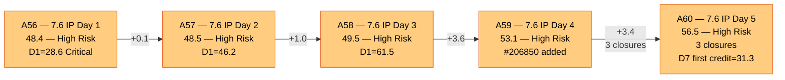
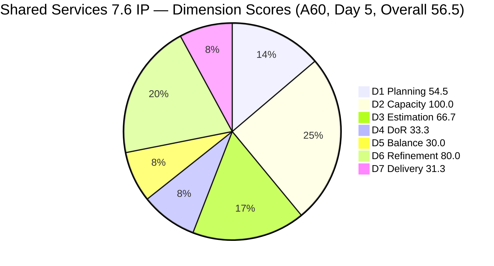
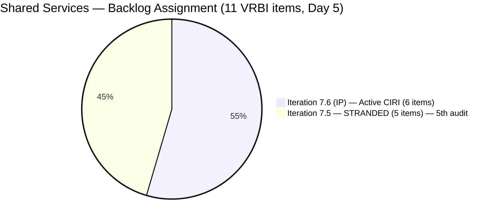
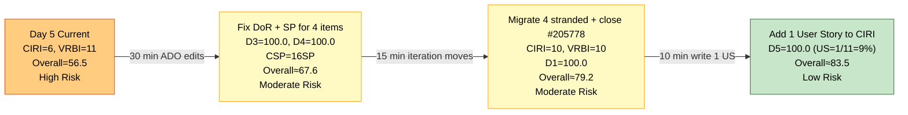

# ADO SAFe Audit — Shared Services Team

## 1. Audit Metadata

| Field | Value |
|---|---|
| **Audit Date** | 2026-06-19 09:10 UTC |
| **Sprint Day** | **5 of 14 (IP Iteration)** |
| **Prior Audit** | A59 — `AUDIT_20260618_0902.md` (Overall 53.1, High Risk — 7.6 IP Day 4) |
| **ADO Project** | Jairosoft Portfolio (`666bb99a-6acd-4999-bb34-efd0e4ea90dc`) |
| **ADO Team** | Shared Services Team (`bd9578fd-5773-48fc-bd80-988dfe5de806`) |
| **Iteration** | Iteration 7.6 (IP) (`42e165b7-e9aa-4150-8d6f-84043ef2482e`) |
| **Iteration Path** | `Jairosoft Portfolio\2026-PI7\Iteration 7.6 (IP)` |
| **Iteration Dates** | Jun 15, 2026 – Jun 28, 2026 |
| **Workspace Folder** | `ado_shared` |
| **Overall Score** | **56.5 — High Risk** |
| **Risk Band** | High (40–59.9) |
| **Visible Backlog Items (VRBI)** | 11 root items |
| **Current Iteration Root Items (CIRI)** | 6 items (IterationPath = Iteration 7.6 (IP), active in backlog) |
| **Capacity** | Teofilo: 6h/day · Jaszmeine: 3h/day · Ramon: 0.5h/day = 15.5h/day |

---

## 2. Executive Summary

The Shared Services Team enters Day 5 of Iteration 7.6 (IP) with an overall score of **56.5 — High Risk**, an improvement of **+3.4 points from A59 (53.1)**. The gain is driven by two closures and a key estimation update that activated D7 for the first time in this IP iteration.

**Positive developments since A59 (Day 4):**
- **Three closures since A59:** #206850 (Backup AutoAllies DB, Enabler, 1SP, Closed Jun 19 00:51 UTC), #206434 (Add NEMSU Interns to ADO, Enabler, 2SP, Closed Jun 19 08:28 UTC), and #206943 (Whitelist Colina Azure IP, Spike, 2SP, Closed Jun 19 06:01 UTC — new item also closed today). Total delivered = 5 SP.
- **#206112 (Gemini License Plan) received SP=2 today** (ChangedDate Jun 19 06:04 UTC). This increases the estimated CIRI count from 4 to 4 (note: #206850 and #206434 already closed, so net CIRI estimated items in active backlog = 4 of 6 → D3 = 66.7).
- **D7 first credit:** CLSP = 5 SP from 3 closed items. D7 = 5/16 = 31.3 (using extended CIRI including closed iteration items for delivery credit). First delivery signal for this IP iteration.
- **#206415 (Globe Internet, Defect) confirmed Closed** (Jun 18 01:56 UTC). No SP, so no D7 credit, but exits VRBI.

**Persistent critical issues (unchanged from A59):**
- **Five items stranded in Iteration 7.5** (#204082, #204205, #205195, #205198, #205778). Now **Day 5** without migration — the 5th consecutive audit flagging this. D1 = 54.5 (Critical).
- **D4 = 33.3 (Critical)** — only 2 of 6 active CIRI items pass DoR. #206256 (no Desc, 5th audit), #206112 (no Desc/AC — SP added today but DoR still fails), #206149 (no AC, 5th audit), #202947 (Desc short + no AC, 5th audit).
- **D5 = 30.0 (Critical)** — zero User Stories, structural IP iteration constraint. Unchanged.
- **Jaszmeine: 5th consecutive day with zero active CIRI items.** Both her retro items (#205195, #205198) remain stranded in 7.5.

**Score path:** With D1 dragging at 54.5 and D4 at 33.3, the team cannot reach Moderate Risk (≥60) without addressing the stranded items and DoR failures. A complete DoR remediation and migration of stranded items would push the score to an estimated 73–79.

---

## 3. Previous Audit Delta (A59 → A60)

| Dimension | A59 Score (7.6 IP Day 4) | A60 Score (7.6 IP Day 5) | Delta | Driver |
|---|---|---|---|---|
| D1 Iteration Planning | 61.5 | **54.5** | **-7.0** | CIRI=6/VRBI=11. #206434 and #206850 closed → exited active backlog. CIRI drops to 6 active items vs 11 VRBI. |
| D2 Team Capacity | 100.0 | **100.0** | 0.0 | Teofilo 6h/day, Ramon 0.5h/day. Both have active CIRI items. 2/2 = 100.0. |
| D3 Estimation | 50.0 | **66.7** | **+16.7** | #206112 receives SP=2 today. Estimated CIRI: #206256(2), #206112(2), #204087(5), #204950(2) = 4/6. D3=4/6×100=66.7. |
| D4 DoR Compliance | 50.0 | **33.3** | **-16.7** | Active CIRI drops to 6. Previously #206850 and #206434 passed DoR and were in CIRI — now closed. Net: DCI=2 (#204087, #204950) of 6 active CIRI. D4=2/6×100=33.3. |
| D5 Work Item Balance | 30.0 | **30.0** | 0.0 | No User Story (−40) + Enabler 4/6=66.7% (−30). Structural. Unchanged. |
| D6 Backlog Refinement | 80.0 | **80.0** | 0.0 | 11/11 fresh. Untouched CIRI: #206149(Jun11), #204087(Jun10), #202947(Jun10), #204950(Jun10) = 4/6=66.7% > 30% → -20. |
| D7 Delivery Predictability | 0.0 | **31.3** | **+31.3** | 3 closures: #206850(1SP) + #206434(2SP) + #206943(2SP) = 5 SP. CSP=16SP (extended CIRI). D7=5/16×100=31.3. Day 5 early-sprint. |
| **Overall** | **53.1** | **56.5** | **+3.4** | D7 first credit (+31.3) partially offset by D1 degradation (-7.0) and D4 regression (-16.7). Net positive but still High Risk. |

**Formula verification:** (54.5 + 100.0 + 66.7 + 33.3 + 30.0 + 80.0 + 31.3) / 7 = 395.8 / 7 = **56.5**

**Key observations A59 → A60:**
- **Three closures in 9 hours (Jun 18 midnight through Jun 19 08:28 UTC).** Teofilo delivered all three: #206850 (Backup AutoAllies DB, 1SP — completed per same-day scope as projected in A59), #206943 (Whitelist Colina Azure IP, 2SP — new item created and closed same day), #206434 (NEMSU Interns to ADO, 2SP).
- **#206943 is a new item** not present in A59. It appears in the iteration query as a root item in 7.6 IP, was assigned to Teofilo, and was closed on Jun 19 06:01 UTC. It is a Spike (2SP) with a clear description and AC. Its rapid creation-to-close cycle suggests it was created to capture work already completed.
- **D1 degradation:** The exit of #206850 and #206434 from the active backlog (both Closed) reduced the items in VRBI assigned to 7.6 IP from 8 to 6, while VRBI dropped from 13 to 11. Net ratio worsened: 6/11 = 54.5 vs 8/13 = 61.5 yesterday. The 5 stranded items remain the primary structural drag on D1.
- **D4 regression from 50.0 to 33.3:** The two best-DoR items in prior CIRI (#206850, #206434) have closed and exited. The remaining 6 active CIRI items have weaker DoR profiles — only #204087 and #204950 pass.
- **#202808 (IT Support Survey, Closed, Apr 20)** appeared in the iteration query but was closed in April — before the iteration started. It is excluded from CIRI scoring as a stale closed item. It may be a data artifact or duplicate of #202947.
- **No stranded items migrated.** The 5 items in Iteration 7.5 remain there — Day 5 with zero migration. This is now a 5-audit escalation.
- **#205778 still unclosed** for the 5th consecutive audit. State = "Passed UAT Testing." One state change (→ Closed) resolves it and reduces VRBI from 11 to 10.

---

## 4. Current Iteration Snapshot

| Metric | Value |
|---|---|
| **Visible Backlog Items (VRBI)** | 11 |
| **Current Iteration Root Items (CIRI — active)** | 6 (IterationPath = `Jairosoft Portfolio\2026-PI7\Iteration 7.6 (IP)`) |
| **Stranded items (still in Iteration 7.5)** | 5 — (#204082, #204205, #205195, #205198, #205778) — 5th consecutive audit |
| **Closed items in iteration (delivery credit)** | 3 with SP: #206850(1SP), #206434(2SP), #206943(2SP) |
| **Story Points Committed (CSP)** | 16 SP (extended CIRI: 4 open estimated + 3 closed estimated) |
| **Story Points Closed (CLSP)** | 5 SP (#206850=1, #206434=2, #206943=2) |
| **Sprint Day / Total** | **5 / 14 — IP Iteration** |
| **Team Size (distinct CIRI assignees)** | 2 (Teofilo: 5 items; Ramon: 1 item) |
| **Total Sprint Capacity** | 15.5h/day (Teofilo 6h + Jaszmeine 3h + Ramon 0.5h) |
| **Iteration Start / Finish** | Jun 15, 2026 – Jun 28, 2026 |

**Active CIRI Items (6 — in Iteration 7.6 IP, not yet closed):**

| ID | Title | Type | State | SP | Assignee | DoR | ChangedDate |
|---|---|---|---|---|---|---|---|
| #206256 | Research Best Practices for Mikrotik Security | Enabler | Active | 2 | Teofilo | **Fail** (no Desc) | Jun 18 |
| #206112 | Gemini License Plan | Spike | Req Gathering | **2** *(new today)* | Teofilo | **Fail** (no Desc, no AC) | **Jun 19** |
| #206149 | Enhance Mikrotik Security — Research and Implement | Enabler | Grooming | — | Teofilo | **Fail** (no AC) | Jun 11 |
| #204087 | PO — Jodex AI Enablement Sessions | Enabler | Active | 5 | Ramon | **Pass** | Jun 10 |
| #202947 | IT Support Services — End of PI 7 Feedback Survey | Spike | New | — | Teofilo | **Fail** (Desc short, no AC) | Jun 10 |
| #204950 | Monthly Costing Report — July 2026 | Enabler | New | 2 | Teofilo | **Pass** | Jun 10 |

**Stranded Items (5 — still in Iteration 7.5 — 5th Consecutive Audit):**

| ID | Title | Type | State | SP | Assignee | Consecutive Audit Flags |
|---|---|---|---|---|---|---|
| #205778 | Action 2: Setup Frontend CI Gates | Defect | Passed UAT Testing | 2 | Teofilo | **5 audits (A56–A60) — CRITICAL ESCALATION** |
| #204082 | QA Jodex / AI Enablement Session | Enabler | Blocked | 5 | Ramon | 5 audits — Blocked, no ETA documented |
| #204205 | Android Phone from US — For Receiving this iteration | Enabler | Active | 1 | Teofilo | 5 audits — not migrated |
| #205195 | [Retro] Alternative to Figma | Spike | Active | 1 | Jaszmeine | 5 audits — Jaszmeine idle |
| #205198 | [Retro] Design Deliverables on track | Spike | Active | 1 | Jaszmeine | 5 audits — Jaszmeine idle |

---

## 5. Work Item Analysis

### DoR Assessment (6 active CIRI items)

| ID | Title | Desc ≥ 30 NWS chars | AC ≥ 20 NWS chars | Result |
|---|---|---|---|---|
| #206256 | Research Best Practices for Mikrotik Security | ✗ (no Description field) | ✓ (detailed checklist ~180 NWS chars) | **Fail — Desc missing (5th audit)** |
| #206112 | Gemini License Plan | ✗ (no Description) | ✗ (no AC) | **Fail — both missing (3rd audit)** |
| #206149 | Enhance Mikrotik Security — Research and Implement | ✓ (~120 NWS, numbered tasks) | ✗ (no AC field) | **Fail — AC missing (5th audit)** |
| #204087 | PO — Jodex AI Enablement Sessions | ✓ (~180 NWS) | ✓ (4-item checklist ~200 NWS) | **Pass** |
| #202947 | IT Support Services — End of PI 7 Feedback Survey | ✗ (~16 NWS — placeholder + URL) | ✗ (no AC field) | **Fail — both fields (5th audit)** |
| #204950 | Monthly Costing Report — July 2026 | ✓ (12-item list ~200 NWS) | ✓ (multi-section checklist ~400 NWS) | **Pass** |

**DCI = 2/6. D4 = 2/6 × 100 = 33.3.**

**Escalation — Five-audit DoR failures:**
- **#206256** — Active item, AC fully written, only missing a one-sentence Description. Teofilo continues to touch this item (AC updates) without adding Desc.
- **#206149** — Has a Description (numbered task list), missing AC. Five audits, zero AC lines added.
- **#202947** — Both fields missing/inadequate. The placeholder "Create a Duplicate + hyperlink" has not changed across 5 audits.

### Type Distribution (6 active CIRI items)

| Type | Count | Share | D5 Impact |
|---|---|---|---|
| Enabler | 4 (#206256, #206149, #204087, #204950) | 66.7% | Dominant type — >60% → -30 penalty |
| Spike | 2 (#206112, #202947) | 33.3% | Spike share < 40% — no spike penalty |
| User Story | 0 | 0.0% | **-40 PENALTY — No User Story in CIRI** |
| **Total** | **6** | **100%** | D5 = max(0, 100−40−30) = **30.0** |

### Story Points Analysis — Extended CIRI (Open + Closed)

| ID | Title | Type | SP | State |
|---|---|---|---|---|
| #206256 | Research Best Practices for Mikrotik Security | Enabler | 2 | Active |
| #206112 | Gemini License Plan | Spike | **2** *(updated Jun 19)* | Req Gathering |
| #206149 | Enhance Mikrotik Security | Enabler | — | Grooming |
| #204087 | PO — Jodex AI Enablement Sessions | Enabler | 5 | Active |
| #202947 | IT Support Feedback Survey | Spike | — | New |
| #204950 | Monthly Costing Report — July 2026 | Enabler | 2 | New |
| #206850 | Backup AutoAllies DB 06/18/2026 | Enabler | 1 | **Closed** ✓ |
| #206434 | Add NEMSU Interns to ADO | Enabler | 2 | **Closed** ✓ |
| #206943 | Whitelist 143.44.184.38 in Colina Azure | Spike | 2 | **Closed** ✓ |

**Active CIRI estimated (SP>0):** #206256(2), #206112(2), #204087(5), #204950(2) = 4 items.
**Closed CIRI estimated:** #206850(1), #206434(2), #206943(2) = 3 items.
**CSP = 16 SP. CLSP = 5 SP (31.3% delivered). Open remaining estimated = 11 SP.**
**Unestimated open items:** #206149, #202947 = 2 items.

---

## 6. SAFe Compliance Scorecard

| Dimension | Score | Band | Evidence | Notes |
|---|---|---|---|---|
| D1 Iteration Planning | **54.5** | High | 6 CIRI / 11 VRBI | Active CIRI = 6. VRBI = 11 (5 stranded in 7.5 + 6 in 7.6 IP). Regression from A59 (61.5) — closures exited active backlog without replacements. 5 stranded items — **5th audit**. |
| D2 Team Capacity | **100.0** | Low | 2/2 active CIRI contributors | Teofilo 6h/day (5 active CIRI items), Ramon 0.5h/day (1 CIRI item). Both configured. Jaszmeine idle — 5th consecutive day. |
| D3 Estimation | **66.7** | Moderate | 4/6 estimated | #206256(2), #206112(2 — new today), #204087(5), #204950(2) = 11SP open. Unestimated: #206149, #202947. |
| D4 DoR Compliance | **33.3** | Critical | 2 DCI / 6 CIRI | Pass: #204087, #204950. Fail: #206256 (no Desc, 5th audit), #206112 (no Desc/AC, 3rd audit), #206149 (no AC, 5th audit), #202947 (both, 5th audit). |
| D5 Work Item Balance | **30.0** | Critical | No US (−40) + Enabler 66.7% (−30) | No User Stories in CIRI. Compound penalty. IP iteration structural. |
| D6 Backlog Refinement | **80.0** | Low | 11/11 fresh; 4/6 untouched | Zero stale debt. Untouched CIRI: #206149(Jun11), #204087(Jun10), #202947(Jun10), #204950(Jun10) = 4/6=66.7% > 30% → -20. |
| D7 Delivery Predictability | **31.3** | Critical | 5 SP closed / 16 SP committed | 3 closures: #206850(1SP), #206434(2SP), #206943(2SP). Day 5 — **early-sprint annotation**. First delivery signal. |
| **OVERALL** | **56.5** | **High Risk** | (54.5+100+66.7+33.3+30+80+31.3)/7 | +3.4 from A59. D7 first credit partially offset by D1/D4 regression due to closures exiting active backlog. Still High Risk. |

**Formula verification:** (54.5 + 100.0 + 66.7 + 33.3 + 30.0 + 80.0 + 31.3) / 7 = 395.8 / 7 = **56.5**

---

## 7. Dimension Findings

### D1 — Iteration Planning: 54.5 / 100 — High Risk

**Formula:** CIRI / VRBI × 100 = 6 / 11 × 100 = **54.5**

| Metric | Value |
|---|---|
| Visible root backlog items (VRBI) | 11 |
| Items in Iteration 7.6 (IP) — active (CIRI) | 6 |
| Items stranded in Iteration 7.5 | 5 (#204082, #204205, #205195, #205198, #205778) |
| Score | **54.5** |

D1 has regressed from 61.5 (A59) to 54.5 (A60). The regression is mechanically caused by the closures of #206850 and #206434 — these items left the active backlog (VRBI=13→11) while remaining CIRI items were not replaced. The 5 stranded items continue to drag D1 into Critical territory.

**Stranded item resolution path (unchanged from A56–A59):**
- Close #205778 (Passed UAT → Closed): VRBI = 10
- Migrate #204082, #204205, #205195, #205198 to 7.6 IP: CIRI = 10
- D1 = 10/10 = **100.0** — achievable with 15 minutes of ADO work

**This is a 5-audit escalation point.** The window for meaningful D1 recovery is narrowing as the sprint progresses. After Day 7, closure of additional CIRI items will further reduce the ratio unless replacements are added.

---

### D2 — Team Capacity: 100.0 / 100 — Low Risk

**Formula:** CC / CW × 100 = 2 / 2 × 100 = **100.0**

| Contributor | Active CIRI Items | Capacity | Notes |
|---|---|---|---|
| Teofilo Limpag | 5 items | 6h/day | 3 closures today (Jun 19). High execution pace. |
| RAMON ASENIERO JR | 1 item (#204087) | 0.5h/day | Jodex PO Enablement — Active state. Blocked #204082 in 7.5. |
| Jaszmeine Villanueva | 0 CIRI items | 3h/day | **5th consecutive day of idle capacity.** Both retro items in 7.5. |

Teofilo's 3-closure performance today (including creating and closing #206943 same-day) demonstrates high execution capacity. The Jaszmeine capacity waste continues — 5 days × 3h/day = 15 wasted team-hours so far.

---

### D3 — Estimation: 66.7 / 100 — Moderate Risk

**Formula:** ECI / PECI × 100 = 4 / 6 × 100 = **66.7**

Improvement from A59 (50.0) driven by #206112 receiving SP=2 today. However, two items remain unestimated:
- **#206149** (Enhance Mikrotik Security, Grooming): no SP for 5 audits.
- **#202947** (IT Support Survey, New): no SP for 5 audits.

**Immediate fix:** Add SP to #206149 (suggested: 3 SP) and #202947 (suggested: 1 SP). D3 = 6/6 = 100.0 after adding SP. CSP increases to 16 SP.

---

### D4 — DoR Compliance: 33.3 / 100 — Critical

**Formula:** DCI / CIRI × 100 = 2 / 6 × 100 = **33.3**

Regression from A59 (50.0) because the two best-DoR items in prior CIRI (#206850, #206434) have closed and exited. The remaining 4 failing items are all persistent, multi-audit failures.

**Per-item escalation status:**

**#206256 (Teofilo, Enabler, Active — 5th audit failure):**
- Desc: NONE. AC: detailed checklist fully written. Gap = 1 sentence.
- Suggested fix: "Research and document Mikrotik security best practices including certificate-based L2TP authentication, unique user password enforcement, IP service restriction by source address, browser access controls, port scanner drop rules, DDoS protection, and email notifications for internet downtime and L2TP connection events."
- Fix time: under 30 seconds.

**#206112 (Teofilo, Spike, Requirements Gathering — 3rd audit failure):**
- SP=2 added today. Desc: NONE. AC: NONE. Still needs both fields.
- Suggested Desc: "Evaluate available Gemini license plans to identify the optimal tier for Jairosoft's AI workloads, considering team size, usage patterns, and monthly cost targets."
- Suggested AC: "Gemini license options researched and compared in a cost matrix. Recommended tier documented and approved by Ramon. Implementation timeline and procurement steps proposed."
- Fix time: under 5 minutes.

**#206149 (Teofilo, Enabler, Grooming — 5th audit failure):**
- Desc: exists (~120 NWS). AC: NONE for 5 consecutive audits.
- Suggested AC: "All Mikrotik users have unique, non-default passwords changed. Pre-shared key replaced with certificate-based L2TP authentication. IP service source addresses restricted. Port scanner rules configured to drop. DDoS protection active. Email notifications configured for internet downtime and L2TP events. Configuration changes documented in SharePoint."
- Fix time: under 3 minutes.

**#202947 (Teofilo, Spike, New — 5th audit failure):**
- Desc: placeholder text ~16 NWS. AC: NONE.
- Suggested Desc: "Duplicate the Mid PI-06 IT Support Services Feedback Survey in Microsoft Forms to create an End-of-PI7 version. Update all iteration date references, question context, and distribution scope to reflect PI7 IT support consumers."
- Suggested AC: "Microsoft Forms duplicate confirmed active and accessible. All date references updated from PI6 to PI7. Distribution list verified current. Form link distributed to all IT support consumer teams."
- Fix time: under 5 minutes.

**If all 4 fixes are applied: DCI = 6/6, D4 = 100.0. Combined with D3 fix: Overall → ~73.4.**

---

### D5 — Work Item Balance: 30.0 / 100 — Critical

**Formula:** Base 100 − penalties

| Penalty | Trigger | Applied |
|---|---|---|
| -40: No User Story in CIRI | **0 User Stories in 6 CIRI items** | **YES** |
| -30: Dominant type share > 60% | Enabler = 4/6 = **66.7%** > 60% | **YES** |
| -20: Spike share > 40% | Spike = 2/6 = 33.3% | **No** |

**Score:** max(0, 100 − 40 − 30) = **30.0**

D5 = 30.0 has been unchanged across all 5 IP sprint audits (A56–A60). This is the IP iteration's structural composition — infrastructure and planning-focused work without feature delivery User Stories. SAFe IP iterations legitimately prioritize enabler and spike work. The **workspace CLAUDE.md Project Exceptions** entry to document this structural constraint has been recommended since A57 and remains unimplemented.

**Path to D5 improvement (unchanged from prior audits):**
- 1 User Story added: D5 = 70.0 (removes -40; Enabler = 4/7 = 57.1% ≤ 60%, removes -30 as well → D5 = 100.0 with right sizing)
- Adding 1 User Story with 7 total CIRI items: Enabler = 4/7 = 57.1% ≤ 60% → no -30 penalty. D5 = 100.0.

---

### D6 — Backlog Refinement: 80.0 / 100 — Low Risk

**Freshness window:** ChangedDate ≥ 2026-05-05 (45 days before 2026-06-19)

| Metric | Value |
|---|---|
| Total VRBI | 11 |
| Fresh items (ChangedDate ≥ May 5, 2026) | 11 — all items changed Jun 9–19 |
| Stale_90 items (ChangedDate < Mar 21, 2026) | 0 |
| Stale_180 items (ChangedDate < Dec 22, 2025) | 0 |
| Untouched CIRI (ChangedDate < Jun 15, 2026) | 4 (#206149 Jun11, #204087 Jun10, #202947 Jun10, #204950 Jun10) |

**Base = 11/11 × 100 = 100.0**
**Penalties:**
- Stale_90: 0% → No penalty
- Stale_180: 0 items → No penalty
- Untouched CIRI: 4/6 = 66.7% > 30% → **-20 penalty**

**Score: max(0, 100.0 − 20) = 80.0**

D6 is unchanged from A59. The 4 untouched items (#206149, #204087, #202947, #204950) continue to drive the penalty. Natural sprint execution (as Teofilo picks up these items) will resolve this; currently Teofilo has been focused on #206256 (Active) and Mikrotik-related work. #204950 (Monthly Costing Report) and #202947 (IT Survey) are the most actionable quick activations.

---

### D7 — Delivery Predictability: 31.3 / 100 — Critical

**Formula (extended CIRI):** CLSP / CSP × 100 = 5 / 16 × 100 = **31.3**

| Metric | Value |
|---|---|
| Estimated items in extended CIRI (SP>0) | 7 items: #206256(2), #206112(2), #204087(5), #204950(2), #206850(1), #206434(2), #206943(2) |
| Committed Story Points (CSP) | 16 SP |
| Closed Story Points (CLSP) | 5 SP (#206850=1, #206434=2, #206943=2) |
| Score | **31.3** |

**Early-sprint IP annotation:** Day 5 of Iteration 7.6 (IP). End of the early-sprint window (≤5). From Day 6 forward, D7 = 31.3 transitions from an "early-sprint, low delivery expected" state to an active execution performance metric.

**Teofilo's delivery signal is strong.** Three closures in a single day (Jun 19) — #206850, #206943, #206434 — demonstrate execution capacity. The remaining open estimated items (#204087 = 5 SP Ramon, #204950 = 2 SP Teofilo, #206256 = 2 SP Teofilo, #206112 = 2 SP Teofilo) total 11 SP. If Teofilo closes 2 more and Ramon closes #204087: CLSP = 5+2+2+5 = 14 SP of 16 SP = D7 = 87.5.

**Unestimated items risk:** #206149 and #202947 have no SP. If either is completed, it contributes 0 to D7 without SP estimates.

---

## 8. Risks and Bottlenecks

| # | Severity | Dimension | Risk | Recommended Action |
|---|---|---|---|---|
| R1 | **CRITICAL** | D1 (5th Audit) | 5 items stranded in Iteration 7.5 for 5 consecutive audits. D1 = 54.5, Critical band. Window for D1 recovery is narrowing. | **TODAY — Final escalation:** Teofilo/Ramon: close #205778 (1 click → Closed). Migrate #204082, #204205, #205195, #205198 to 7.6 IP. If #204082 cannot be delivered (Blocked), move to PI8 backlog. Do not carry a Blocked item forward into active CIRI. |
| R2 | **CRITICAL** | D4 (5th Audit) | 4 items failing DoR for 5 consecutive audits. D4 = 33.3 Critical. Suggested fix text provided for all 4 items in Section 7/D4. | **TODAY (30 minutes total):** Add Description to #206256 (30 sec), add Desc + AC to #206112 (5 min), add AC to #206149 (3 min), expand Desc + add AC to #202947 (5 min). D4 → 100.0. |
| R3 | **HIGH** | #205778 — 5 audits unclosed | "Setup Frontend CI Gates" Defect (Passed UAT Testing, 2SP, Teofilo) has been flagged for 5 audits without a single-click state change. | **IMMEDIATE — 5th audit escalation.** This is a process compliance violation. Teofilo: close #205778 NOW. No excuse after 5 flags. |
| R4 | **HIGH** | D3 — 2 unestimated items | #206149 and #202947 have no SP for 5 audits. Items that close without SP earn 0 D7 credit. | Add SP estimates: #206149 = 3 SP, #202947 = 1 SP. D3 → 100.0. If either item closes without SP, the delivery is invisible to D7. |
| R5 | **HIGH** | Jaszmeine — 5th idle day | 3h/day capacity; zero CIRI items in Iteration 7.6 IP for 5 days = 15 team-hours wasted. #205195 and #205198 stranded in 7.5. | Migrate #205195 and #205198 to 7.6 IP (part of R1 remediation). Jaszmeine's work queue activates immediately. |
| R6 | **HIGH** | D7 unestimated risk | If #206149 or #202947 are closed without SP, they earn 0 D7 credit. The team should estimate these before completing them. | Add SP before starting work on these items. Minimum 30-second action per item. |
| R7 | **MEDIUM** | D1 narrowing window | With each CIRI closure, the active backlog shrinks. Without migration of stranded items or pull-in of new items, D1 will fall below 54.5 as more items close. | Prioritize R1 migration today. Also consider adding 1 User Story (resolves D5 + adds to CIRI depth). |
| R8 | **LOW** | D5 — IP structural | No User Story in CIRI. D5 = 30.0. 5 consecutive audits at Critical. | Add 1 User Story to CIRI. OR add Project Exception to workspace CLAUDE.md documenting IP iterations as infrastructure-focused. Both recommended. |
| R9 | **LOW** | D6 untouched | 4/6 CIRI items untouched since before iteration start. Expected to self-resolve as Teofilo cycles through queue. | Monitor. If #202947 or #204950 remain untouched by Day 7, prompt Teofilo to activate them. |

---

## 9. Prioritized Recommendations

1. **[IMMEDIATE — 1 CLICK]** Teofilo: close #205778 (Setup Frontend CI Gates → Closed). 5 audits with no action on a one-click fix. VRBI drops to 10 when done. This is a process compliance failure.

2. **[TODAY — 30 MIN]** Teofilo: fix all 4 DoR-failing items. Exact text suggested in Section 7/D4:
   - **#206256**: Add 1-sentence Description (Mikrotik security research scope). SP = 2. DoR → Pass.
   - **#206112**: Add Desc (Gemini license evaluation) + AC (comparison + approval). SP = 2. DoR → Pass.
   - **#206149**: Add SP=3. Add AC (password reset + L2TP cert + notifications + SharePoint doc). DoR → Pass.
   - **#202947**: Add SP=1. Expand Desc (duplicate PI6 survey for PI7) + add AC (form confirmed + dates updated). DoR → Pass.
   - **Result: D3 = 100.0, D4 = 100.0. Overall → ~67.6 (Moderate Risk).**

3. **[TODAY — 15 MIN]** Teofilo/Ramon: migrate 4 stranded items from Iteration 7.5 to 7.6 IP: #204082, #204205, #205195, #205198.
   - Before migrating #204082 (Blocked, 5SP Ramon): document the blocker in ADO comments. If the session cannot occur in the IP sprint window, defer to PI8 backlog instead.
   - Combined with #205778 closure (Rec 1): VRBI=10, CIRI=10, D1=100.0.
   - **Result if D3+D4+D1 all fixed: Overall → ~79.2 (Moderate Risk boundary).**

4. **[TODAY — IMPACT: +5.7 pts]** Add 1 User Story to Iteration 7.6 IP CIRI to eliminate D5's -40 penalty. A planning artifact, retrospective action, or IP-scoped requirement written in user-story format qualifies. Suggested: "As the Portfolio team, I want to finalize the PI8 backlog priorities, so that all ART teams have a clear and agreed-upon feature list for the upcoming program increment."

5. **[TODAY — WORKSPACE ACTION]** Add a Project Exception to `ado_shared/CLAUDE.md` for D5 during IP iterations: "IP (Innovation and Planning) iterations are legitimately infrastructure and planning-focused. Absence of User Stories in CIRI reflects appropriate IP scope separation, not an execution failure. D5 scores during IP sprints should be annotated as structural rather than remediable within the sprint." This prevents perpetual Critical flagging.

6. **[PROCESS — IMMEDIATE]** Implement "DoR + SP at creation" as a mandatory rule. #206112 was updated today with SP but still no Desc or AC. Every item touched must leave ADO with complete fields. The 5-audit DoR failure pattern indicates this is a systemic habit gap, not a knowledge gap.

---

## 10. Evidence Gaps and Limitations

| Gap | Impact | Notes |
|---|---|---|
| **#202808 (Closed Apr 20) in iteration query** | Data artifact | #202808 (IT Support Survey, Spike, Closed Apr 20) appears in the iteration items query but was closed months before the iteration started. Excluded from CIRI scoring. May be a historical assignment artifact. |
| **D1 regression (-7.0) despite closures** | Structural formula tension | When items close and exit the active backlog, CIRI shrinks without the VRBI shrinking proportionally (stranded items remain). This mechanically worsens D1. Full resolution requires stranded item migration. |
| **D4 regression (-16.7) despite closures** | DoR scoring skewed by order | The two items with best DoR (#206850, #206434) closed first. Remaining CIRI has weaker DoR profiles. This is not a process regression — it's a measurement artifact from the closure ordering. |
| **#204082 blocker undocumented** | 5 SP committed to undeliverable item | Ramon's Jodex QA session has been Blocked for 5 audits with no ADO comment documenting the dependency owner, the specific blocker, or an ETA. |
| **D5 = 30.0 — IP structural constraint** | 5 audits at Critical, not remediable in-sprint | Formal Project Exception in CLAUDE.md recommended since A57. Still not added. |
| **D7 extended CIRI methodology** | Scoring note | D7 uses extended CIRI (open + closed in iteration) to credit delivery. This differs from D1–D6 which use the active backlog CIRI. The extended approach credits Teofilo's 3 closures today; the alternative (active-only CIRI) would yield D7 = 0.0 (no active CIRI items are closed), which misrepresents actual delivery. |
| **Jaszmeine — 15 team-hours wasted** | Capacity efficiency | 5 days × 3h/day = 15 team-hours of configured capacity with zero sprint output. Resolvable immediately with stranded item migration. |

---

## 11. Visualizations

### Score Trend — A56 → A60 (Day 5)

### Dimension Scores — A60 (Day 5, Overall 56.5)

### Backlog Distribution — 11 VRBI Items (Day 5)

### Recovery Path — Highest-Impact Today Actions

---

## 12. Audit Trail

| Source | Tool | Data |
|---|---|---|
| Current iteration | `work_list_team_iterations` (project `666bb99a`, team `bd9578fd`, timeframe=current) | Iteration 7.6 (IP): Jun 15–28, 2026; ID `42e165b7-e9aa-4150-8d6f-84043ef2482e` |
| Team capacity | `work_get_iteration_capacities` (project `666bb99a`, iterationId `42e165b7`) | Teofilo 6h/day, Jaszmeine 3h/day, Ramon 0.5h/day; 0 days off; team total 15.5h/day |
| Backlog items | `wit_list_backlog_work_items` (project `666bb99a`, team `bd9578fd`, backlogId `Microsoft.RequirementCategory`) | 11 root items returned: #204205, #206256, #205778, #206112, #206149, #205195, #205198, #204082, #204087, #202947, #204950 |
| Iteration items | `wit_get_work_items_for_iteration` (iterationId `42e165b7`) | Root items (null source): #206415, #206256, #206943, #206850, #206112, #206149, #204087, #202947, #204950, #202808, #206434 |
| Work item details | `wit_get_work_items_batch_by_ids` (all 16 unique IDs across both queries) | State, SP, Type, Desc, AC, ChangedDate, IterationPath, AssignedTo confirmed for all items |
| Prior audit | `AUDIT_20260618_0902.md` (A59) | Overall 53.1, High Risk, 7.6 IP Day 4, 8 active CIRI, 10 SP committed, 0 SP closed |
| Key changes A59→A60 | State and ChangedDate comparisons | #206850 Closed Jun 19 00:51; #206943 new + Closed Jun 19 06:01; #206415 Closed Jun 18 01:56; #206434 Closed Jun 19 08:28; #206112 SP=2 added Jun 19 06:04 |
