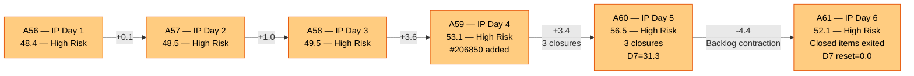
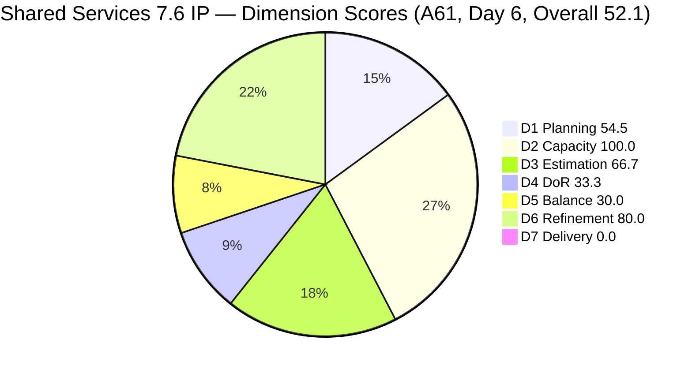
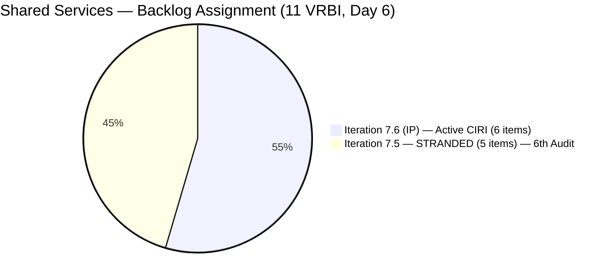
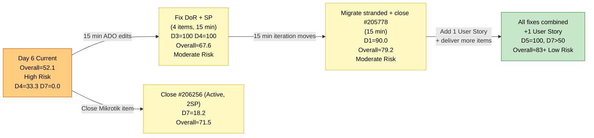

# ADO SAFe Audit — Shared Services Team

## 1. Audit Metadata

| Field | Value |
|---|---|
| **Audit Date** | 2026-06-20 09:35 UTC |
| **Sprint Day** | **6 of 14 (IP Iteration)** |
| **Prior Audit** | A60 — `AUDIT_20260619_0910.md` (Overall 56.5, High Risk — 7.6 IP Day 5) |
| **ADO Project** | Jairosoft Portfolio (`666bb99a-6acd-4999-bb34-efd0e4ea90dc`) |
| **ADO Team** | Shared Services Team (`bd9578fd-5773-48fc-bd80-988dfe5de806`) |
| **Iteration** | Iteration 7.6 (IP) (`42e165b7-e9aa-4150-8d6f-84043ef2482e`) |
| **Iteration Path** | `Jairosoft Portfolio\2026-PI7\Iteration 7.6 (IP)` |
| **Iteration Dates** | Jun 15, 2026 – Jun 28, 2026 |
| **Workspace Folder** | `ado_shared` |
| **Overall Score** | **52.1 — High Risk** |
| **Risk Band** | High (40–59.9) |
| **Visible Backlog Items (VRBI)** | 11 root items (unchanged — 5 stranded in 7.5) |
| **Current Iteration Root Items (CIRI)** | 6 items (IterationPath = Iteration 7.6 (IP)) |
| **Capacity** | Teofilo: 6h/day · Jaszmeine: 3h/day · Ramon: 0.5h/day = 15.5h/day |

---

## 2. Executive Summary

The Shared Services Team is at Day 6 of Iteration 7.6 (IP) with an overall score of **52.1 — High Risk**, a regression of **-4.4 points from A60 (56.5)**. This is the **6th consecutive audit** in the High Risk band. The regression is driven by D7 dropping from 31.3 to 0.0 — the three items closed on Day 5 (#206850, #206943, #206434) have exited the active backlog, and no new active CIRI items are Closed today.

**Structural issues remain unchanged for the 6th consecutive audit:**
- **5 items stranded in Iteration 7.5** (#204082, #204205, #205195, #205198, #205778). No migration has occurred since A56.
- **4 of 6 CIRI items failing DoR** (#206256, #206112, #206149, #202947). All 4 are now in their **6th consecutive audit failure** except #206112 (4th).
- **0 User Stories in CIRI** → D5 = 30.0 (Critical), structural IP constraint.
- **Jaszmeine: 6th consecutive day with zero active CIRI items** = 18 team-hours wasted.

**Today's formula dynamics:**
- D7 resets to 0.0 (closed items exited backlog; active CIRI has 0 Closed items). Day 6 is beyond the early-sprint annotation window.
- D1, D3, D4, D5, D6 are unchanged from A60.

**Without action today:** D7 remains 0.0. No stranded items have been migrated. The team is on track for the same High Risk outcome for a 7th consecutive audit.

---

## 3. Previous Audit Delta (A60 → A61)

| Dimension | A60 Score (7.6 IP Day 5) | A61 Score (7.6 IP Day 6) | Delta | Driver |
|---|---|---|---|---|
| D1 Iteration Planning | 54.5 | **54.5** | 0.0 | CIRI=6/VRBI=11. No stranded items migrated. No new items added. Unchanged. |
| D2 Team Capacity | 100.0 | **100.0** | 0.0 | Teofilo 6h/day (5 items), Ramon 0.5h/day (1 item). Both configured. Unchanged. |
| D3 Estimation | 66.7 | **66.7** | 0.0 | 4/6 estimated (#206256=2, #206112=2, #204087=5, #204950=2). Unestimated: #206149, #202947. Unchanged. |
| D4 DoR Compliance | 33.3 | **33.3** | 0.0 | 2 DCI / 6 CIRI. Pass: #204087, #204950. Fail: #206256 (no Desc, 6th audit), #206112 (no Desc/AC, 4th audit), #206149 (no AC, 6th audit), #202947 (both, 6th audit). Unchanged. |
| D5 Work Item Balance | 30.0 | **30.0** | 0.0 | No User Story (−40) + Enabler 66.7% (−30). IP structural. Unchanged. |
| D6 Backlog Refinement | 80.0 | **80.0** | 0.0 | 11/11 fresh. 4/6 CIRI untouched (66.7% > 30%) → -20. Unchanged. |
| D7 Delivery Predictability | 31.3 | **0.0** | **-31.3** | Closed items (#206850, #206943, #206434) exited active backlog. Active CIRI: 0 Closed. CSP=11SP, CLSP=0. D7=0.0. Day 6 — beyond early-sprint window. |
| **Overall** | **56.5** | **52.1** | **-4.4** | D7 reset to 0.0 as prior-day closures exited backlog. All other dimensions unchanged — no improvements, no new failures beyond the ongoing patterns. |

**Formula verification:** (54.5 + 100.0 + 66.7 + 33.3 + 30.0 + 80.0 + 0.0) / 7 = 364.5 / 7 = **52.1**

**Key observations A60 → A61:**
- **No new closures since A60 (Day 5).** The 3 closures from yesterday (#206850, #206943, #206434) remain the last sprint deliveries. Day 6 has produced no new activity.
- **No stranded items migrated.** #204082, #204205, #205195, #205198, #205778 remain in Iteration 7.5. This is the 6th consecutive audit cycle without migration — now a **critical process escalation**.
- **No DoR fixes applied.** The 4 failing items remain unchanged. All 4 are on their 6th audit with identical failure modes.
- **#206943 (Whitelist Colina Azure, Spike, Closed Jun 19)** confirmed closed. Per the iteration query it remains in the 7.6 IP iteration path but has exited the active backlog.
- **#202808 artifact:** This item (IT Support Survey, Closed Apr 20, IterationPath = 7.6 IP) continues to appear in the iteration query. Confirmed excluded from CIRI scoring — it was closed 2 months before the iteration started and represents a data artifact.

---

## 4. Current Iteration Snapshot

| Metric | Value |
|---|---|
| **Visible Backlog Items (VRBI)** | 11 |
| **Current Iteration Root Items (CIRI — active)** | 6 (IterationPath = `Jairosoft Portfolio\2026-PI7\Iteration 7.6 (IP)`) |
| **Stranded items (still in Iteration 7.5)** | 5 — (#204082, #204205, #205195, #205198, #205778) — **6th consecutive audit** |
| **Closed items in iteration (exited backlog)** | 3 with SP: #206850(1SP), #206434(2SP), #206943(2SP) — exited yesterday |
| **Story Points Committed (CSP — active CIRI)** | 11 SP (estimated CIRI only: #206256=2, #206112=2, #204087=5, #204950=2) |
| **Story Points Closed (CLSP — active CIRI)** | 0 SP (no active CIRI items are Closed) |
| **Sprint delivery to date (cumulative)** | 5 SP closed (items exited backlog, not scored in D7) |
| **Sprint Day / Total** | **6 / 14 — IP Iteration** |
| **Team Size (distinct CIRI assignees)** | 2 (Teofilo: 5 items; Ramon: 1 item) |
| **Total Sprint Capacity** | 15.5h/day (Teofilo 6h + Jaszmeine 3h + Ramon 0.5h) |
| **Iteration Start / Finish** | Jun 15, 2026 – Jun 28, 2026 |

**Active CIRI Items (6 — in Iteration 7.6 IP, in active backlog):**

| ID | Title | Type | State | SP | Assignee | DoR | ChangedDate |
|---|---|---|---|---|---|---|---|
| #206256 | Research Best Practices for Mikrotik Security | Enabler | Active | 2 | Teofilo | **Fail** (no Desc — 6th audit) | Jun 18 |
| #206112 | Gemini License Plan | Spike | Requirements Gathering | 2 | Teofilo | **Fail** (no Desc, no AC — 4th audit) | Jun 19 |
| #206149 | Enhance Mikrotik Security — Research and Implement | Enabler | Grooming | — | Teofilo | **Fail** (no AC — 6th audit) | Jun 11 |
| #204087 | PO — Jodex AI Enablement Sessions | Enabler | Active | 5 | Ramon | **Pass** | Jun 10 |
| #202947 | IT Support Services — End of PI 7 Feedback Survey | Spike | New | — | Teofilo | **Fail** (Desc short ~16 NWS, no AC — 6th audit) | Jun 10 |
| #204950 | Monthly Costing Report — July 2026 | Enabler | New | 2 | Teofilo | **Pass** | Jun 10 |

**Stranded Items (5 — still in Iteration 7.5 — 6th Consecutive Audit):**

| ID | Title | Type | State | SP | Assignee | Consecutive Audit Flags |
|---|---|---|---|---|---|---|
| #205778 | Action 2: Setup Frontend CI Gates | Defect | Passed UAT Testing | 2 | Teofilo | **6 audits (A56–A61) — CRITICAL** |
| #204082 | QA Jodex / AI Enablement Session | Enabler | Blocked | 5 | Ramon | 6 audits — Blocked, no ETA documented |
| #204205 | Android Phone from US — For Receiving this iteration | Enabler | Active | 1 | Teofilo | 6 audits — not migrated |
| #205195 | [Retro] Alternative to Figma | Spike | Active | 1 | Jaszmeine | 6 audits — Jaszmeine idle 6 days |
| #205198 | [Retro] Design Deliverables on track | Spike | Active | 1 | Jaszmeine | 6 audits — Jaszmeine idle 6 days |

---

## 5. Work Item Analysis

### DoR Assessment (6 active CIRI items)

| ID | Title | Desc ≥ 30 NWS | AC ≥ 20 NWS | Result |
|---|---|---|---|---|
| #206256 | Research Best Practices for Mikrotik Security | ✗ (no Description field present) | ✓ (detailed checklist, ~180 NWS) | **Fail — Desc missing (6th audit)** |
| #206112 | Gemini License Plan | ✗ (no Description) | ✗ (no AC) | **Fail — both missing (4th audit)** |
| #206149 | Enhance Mikrotik Security — Research and Implement | ✓ (~3-item bullet list, ~120 NWS) | ✗ (no AC field) | **Fail — AC missing (6th audit)** |
| #204087 | PO — Jodex AI Enablement Sessions | ✓ (~180 NWS, session objective) | ✓ (4-item checklist, ~200 NWS) | **Pass** |
| #202947 | IT Support Services — End of PI 7 Feedback Survey | ✗ ("Create a Duplicate + hyperlink" ~16 NWS) | ✗ (no AC field) | **Fail — both missing (6th audit)** |
| #204950 | Monthly Costing Report — July 2026 | ✓ (12-item numbered list, ~200 NWS) | ✓ (multi-section checklist, ~400 NWS) | **Pass** |

**DCI = 2/6. D4 = 2/6 × 100 = 33.3.**

**6-audit escalation — DoR remediation text (unchanged from A57–A60 recommendations; still not applied):**

- **#206256 (6th audit):** Add one sentence as Description: *"Research and document Mikrotik security best practices including certificate-based L2TP authentication, unique user password enforcement, IP service restriction by source address, browser access controls, port scanner drop rules, DDoS protection, and email notifications for internet downtime and L2TP connection events."* Fix time: under 30 seconds.

- **#206112 (4th audit):** Add Description: *"Evaluate available Gemini license plans to identify the optimal tier for Jairosoft's AI workloads, considering team size, usage patterns, and monthly cost targets."* Add AC: *"Gemini license options researched and compared in a cost matrix. Recommended tier documented and approved by Ramon. Implementation timeline and procurement steps proposed."* Fix time: under 5 minutes.

- **#206149 (6th audit):** Add AC: *"All Mikrotik users have unique, non-default passwords changed. Pre-shared key replaced with certificate-based L2TP authentication. IP service source addresses restricted. Port scanner rules configured to drop. DDoS protection active. Email notifications configured for internet downtime and L2TP events. Configuration changes documented in SharePoint."* Fix time: under 3 minutes.

- **#202947 (6th audit):** Expand Description: *"Duplicate the Mid PI-06 IT Support Services Feedback Survey in Microsoft Forms to create an End-of-PI7 version. Update all iteration date references, question context, and distribution scope to reflect PI7 IT support consumers."* Add AC: *"Microsoft Forms duplicate confirmed active and accessible. All date references updated from PI6 to PI7. Distribution list verified current. Form link distributed to all IT support consumer teams."* Fix time: under 5 minutes.

**If all 4 fixes applied: DCI = 6/6, D4 = 100.0.**

### Type Distribution (6 active CIRI items)

| Type | Count | Share | D5 Impact |
|---|---|---|---|
| Enabler | 4 (#206256, #206149, #204087, #204950) | 66.7% | Dominant type > 60% → -30 penalty |
| Spike | 2 (#206112, #202947) | 33.3% | Spike < 40% — no -20 penalty |
| User Story | 0 | 0.0% | **-40 PENALTY — No User Story in CIRI** |
| **Total** | **6** | **100%** | D5 = max(0, 100−40−30) = **30.0** |

### Story Points Analysis — Active CIRI

| ID | Title | Type | SP | State |
|---|---|---|---|---|
| #206256 | Research Best Practices for Mikrotik Security | Enabler | 2 | Active |
| #206112 | Gemini License Plan | Spike | 2 | Requirements Gathering |
| #206149 | Enhance Mikrotik Security | Enabler | — | Grooming |
| #204087 | PO — Jodex AI Enablement Sessions | Enabler | 5 | Active |
| #202947 | IT Support Feedback Survey | Spike | — | New |
| #204950 | Monthly Costing Report — July 2026 | Enabler | 2 | New |

**Active CIRI estimated (SP > 0): #206256(2), #206112(2), #204087(5), #204950(2) = 4 items = 11 SP.**
**Active CIRI unestimated: #206149, #202947 = 2 items. If closed without SP → 0 D7 credit.**

---

## 6. SAFe Compliance Scorecard

| Dimension | Score | Band | Evidence | Notes |
|---|---|---|---|---|
| D1 Iteration Planning | **54.5** | High | 6 CIRI / 11 VRBI | Unchanged from A60. 5 stranded items in 7.5 — **6th consecutive audit** without migration. D1 recovers to 100.0 only after migration + #205778 closure. |
| D2 Team Capacity | **100.0** | Low | 2/2 active CIRI contributors | Teofilo 6h/day (5 CIRI), Ramon 0.5h/day (1 CIRI). Both configured. Jaszmeine: 0 CIRI items — 6th day idle. |
| D3 Estimation | **66.7** | Moderate | 4/6 estimated | #206256(2), #206112(2), #204087(5), #204950(2) = 11SP. Unestimated: #206149, #202947. Unchanged from A60. |
| D4 DoR Compliance | **33.3** | Critical | 2 DCI / 6 CIRI | Pass: #204087, #204950. Fail: #206256 (no Desc, **6th audit**), #206112 (no Desc/AC, 4th audit), #206149 (no AC, **6th audit**), #202947 (both, **6th audit**). |
| D5 Work Item Balance | **30.0** | Critical | No US (−40) + Enabler 66.7% (−30) | No User Stories in CIRI. Compound penalty. IP iteration structural constraint. |
| D6 Backlog Refinement | **80.0** | Low | 11/11 fresh; 4/6 CIRI untouched (66.7% > 30%) | Zero stale debt. #206149(Jun11), #204087(Jun10), #202947(Jun10), #204950(Jun10) = untouched. -20 penalty. |
| D7 Delivery Predictability | **0.0** | Critical | 0 SP closed / 11 SP committed | Active CIRI has 0 Closed items. Prior-day closures exited backlog. Day 6 — beyond early-sprint window. |
| **OVERALL** | **52.1** | **High Risk** | (54.5+100+66.7+33.3+30+80+0)/7 | -4.4 from A60. D7 reset as yesterday's closures exited backlog. All other dimensions unchanged. **6th consecutive High Risk audit.** |

**Formula verification:** (54.5 + 100.0 + 66.7 + 33.3 + 30.0 + 80.0 + 0.0) / 7 = 364.5 / 7 = **52.1**

---

## 7. Dimension Findings

### D1 — Iteration Planning: 54.5 / 100 — High Risk

**Formula:** CIRI / VRBI × 100 = 6 / 11 × 100 = **54.5**

| Metric | Value |
|---|---|
| Visible root backlog items (VRBI) | 11 |
| Items in Iteration 7.6 (IP) — active (CIRI) | 6 |
| Items stranded in Iteration 7.5 | 5 (#204082, #204205, #205195, #205198, #205778) |
| Score | **54.5** |

D1 is unchanged from A60. No stranded items have been migrated across 6 consecutive audits (A56–A61). The 5-item shortfall in CIRI (6 of 11 = 54.5%) is entirely attributable to the stranded items remaining in Iteration 7.5.

**Stranded item resolution path (same as A56–A60 — still not executed):**
- Close #205778 (Passed UAT → Closed): VRBI = 10
- Migrate #204082, #204205, #205195, #205198 to 7.6 IP: CIRI = 10, VRBI = 10
- D1 = 10/10 = **100.0** — achievable with ~15 minutes of ADO work

**6-audit escalation point.** This is now a governance failure, not a planning gap. Remediation window is narrowing; with Day 6 of 14, approximately 8 sprint days remain where pulled items can contribute meaningful D7 delivery credit.

---

### D2 — Team Capacity: 100.0 / 100 — Low Risk

**Formula:** CC / CW × 100 = 2 / 2 × 100 = **100.0**

| Contributor | Active CIRI Items | Capacity | Notes |
|---|---|---|---|
| Teofilo Limpag | 5 items (#206256, #206112, #206149, #202947, #204950) | 6h/day | 3 closures on Day 5 (Jun 19). Active on #206256 today. |
| RAMON ASENIERO JR | 1 item (#204087) | 0.5h/day | Jodex PO Enablement, Active state. #204082 blocked in 7.5. |
| Jaszmeine Villanueva | 0 CIRI items | 3h/day | **6th consecutive day — zero active CIRI work. 18 team-hours wasted.** #205195 and #205198 stranded in 7.5. |

---

### D3 — Estimation: 66.7 / 100 — Moderate Risk

**Formula:** ECI / PECI × 100 = 4 / 6 × 100 = **66.7**

Unchanged from A60. Two items remain unestimated for 6 consecutive audits:
- **#206149** (Enhance Mikrotik Security, Grooming): suggested 3 SP.
- **#202947** (IT Support Survey, New): suggested 1 SP.

**Risk:** If either item is completed and closed without SP, it earns 0 D7 credit. Both items must be estimated before any work is executed.

---

### D4 — DoR Compliance: 33.3 / 100 — Critical

**Formula:** DCI / CIRI × 100 = 2 / 6 × 100 = **33.3**

Unchanged from A60. All 4 failing items are now on their **6th consecutive audit cycle** (except #206112 on its 4th). Full remediation text in Section 5. Combined fix time: approximately 15 minutes.

**Escalation note:** #206256 has had its Acceptance Criteria fully written and updated across multiple sessions, yet the Description field remains empty. The fix for this item is a single sentence — under 30 seconds. The 6-audit failure here is a documented habit gap, not a knowledge gap.

---

### D5 — Work Item Balance: 30.0 / 100 — Critical

**Formula:** Base 100 − penalties = max(0, 100 − 40 − 30) = **30.0**

| Penalty | Trigger | Applied |
|---|---|---|
| -40: No User Story in CIRI | **0 User Stories in 6 CIRI items** | **YES** |
| -30: Dominant type share > 60% | Enabler = 4/6 = **66.7%** > 60% | **YES** |
| -20: Spike share > 40% | Spike = 2/6 = 33.3% | **No** |

D5 = 30.0 across all 6 IP sprint audits (A56–A61). IP iterations legitimately prioritize Enabler and Spike work. The recommended Project Exception for workspace CLAUDE.md remains unimplemented (recommended since A57, now 4 consecutive audits without action).

**Path to D5 improvement:**
- Adding 1 User Story (7 total CIRI with migration): Enabler = 4/7 = 57.1% ≤ 60% → no -30. US present → no -40. D5 = **100.0**.

---

### D6 — Backlog Refinement: 80.0 / 100 — Low Risk

**Freshness window:** ChangedDate ≥ 2026-05-06 (45 days before 2026-06-20)

| Metric | Value |
|---|---|
| Total VRBI | 11 |
| Fresh items (ChangedDate ≥ May 6, 2026) | 11 — all items changed Jun 9–19 |
| Stale_90 items (ChangedDate < Mar 22, 2026) | 0 |
| Stale_180 items (ChangedDate < Dec 23, 2025) | 0 |
| Untouched CIRI (ChangedDate < Jun 15, 2026) | 4 (#206149 Jun11, #204087 Jun10, #202947 Jun10, #204950 Jun10) |

**Base = 11/11 × 100 = 100.0**
**Penalties:**
- Stale_90: 0% → No penalty
- Stale_180: 0 items → No penalty
- Untouched CIRI: 4/6 = 66.7% > 30% → **-20 penalty**

**Score: max(0, 100.0 − 20) = 80.0**

D6 unchanged from A60. Natural sprint execution as Teofilo cycles through the queue will self-resolve some untouched items. However, three of the four untouched items (#204087, #202947, #204950) are also DoR-failing or under-engaged, suggesting they are being deferred rather than worked.

---

### D7 — Delivery Predictability: 0.0 / 100 — Critical

**Formula:** CLSP / CSP × 100 = 0 / 11 × 100 = **0.0**

| Metric | Value |
|---|---|
| Estimated active CIRI items (SP > 0) | 4 (#206256=2, #206112=2, #204087=5, #204950=2) |
| Committed Story Points (CSP) | 11 SP |
| Closed Story Points (CLSP — from active CIRI) | 0 SP |
| Score | **0.0** |

**Context:** The 3 items closed on Day 5 (#206850=1SP, #206434=2SP, #206943=2SP) have exited the active backlog. Sprint cumulative delivery = 5 SP, but these items are no longer in CIRI and cannot be credited under the formula's active-backlog scope.

**Day 6 — beyond the early-sprint annotation window.** D7 = 0.0 is an active performance gap from this point forward.

**Recovery path:** Teofilo has 4 open estimated items (#206256, #206112, #204950 + #206149 if SP added). If Teofilo closes #206256 (Active, 2SP) today: D7 = 2/11 × 100 = 18.2. If Ramon closes #204087 (5SP): D7 = 5/11 × 100 = 45.5. Closing all 4 estimated items: D7 = 11/11 = 100.0, Overall = 70.1 (Moderate Risk).

---

## 8. Risks and Bottlenecks

| # | Severity | Dimension | Risk | Recommended Action |
|---|---|---|---|---|
| R1 | **CRITICAL** | D1 (6th Audit) | 5 items stranded in Iteration 7.5 for **6 consecutive audits**. D1 = 54.5. Window for D1 recovery now critically narrow. After Day 7, additional CIRI closures further erode D1 without migration replacements. | **TODAY — Final governance escalation:** Close #205778 (1 click, Passed UAT → Closed). Migrate #204205, #205195, #205198 to 7.6 IP. Defer #204082 (Blocked) to PI8 unless blocker is resolved same-day. |
| R2 | **CRITICAL** | D4 (6th Audit) | 4 items with persistent DoR failures across 6 consecutive audits. D4 = 33.3. Remediation text fully written in A57–A61, still not applied. | **TODAY (15 min total):** Apply fix text from Section 5 for #206256 (30 sec), #206112 (5 min), #206149 (3 min), #202947 (5 min). D4 → 100.0. Combined with D3 fix: Overall → ~67.6. |
| R3 | **CRITICAL** | D7 | D7 = 0.0 at Day 6. No active CIRI items Closed. 11 SP committed, 0 delivered against active CIRI. | **TODAY:** Teofilo: close #206256 (Research Mikrotik, Active, 2SP). Item has been Active since before the iteration; AC is written. First closure moves D7 to 18.2. Ramon: advance #204087 (Jodex, 5SP) — any state change improves D6 and signals progress. |
| R4 | **HIGH** | #205778 (6th Audit) | Defect "Setup Frontend CI Gates" in Passed UAT Testing state for 6 audits. One click to Closed. | **IMMEDIATE:** Teofilo closes #205778. This is a process compliance failure of the highest order — 6 audits with no action on a one-click fix. |
| R5 | **HIGH** | D3 | #206149 and #202947 unestimated for 6 consecutive audits. If closed without SP: 0 D7 credit, invisible delivery. | Add SP before starting work: #206149 = 3 SP, #202947 = 1 SP. D3 → 100.0. |
| R6 | **HIGH** | Jaszmeine — 6th idle day | 3h/day × 6 days = **18 team-hours wasted**. #205195 and #205198 remain in 7.5. | Migrate #205195 and #205198 to 7.6 IP (part of R1 remediation). Jaszmeine's work queue activates immediately. |
| R7 | **MEDIUM** | D7 deterioration risk | With each day without active CIRI closure, D7 = 0.0 deepens the score gap. If Teofilo's focus remains on infrastructure without ADO closure updates, sprint delivery becomes invisible. | Teofilo: prioritize closing completed items same-day. Update ADO state as work completes — do not batch closures. |
| R8 | **LOW** | D5 — IP structural | D5 = 30.0 for 6 consecutive audits. IP iteration structural. Recommended Project Exception still not added to CLAUDE.md. | Add 1 User Story **or** document IP exception in workspace `ado_shared/CLAUDE.md`. Both recommended. |

---

## 9. Prioritized Recommendations

1. **[IMMEDIATE — 1 CLICK, R4]** Teofilo: close #205778 (Setup Frontend CI Gates → Closed). **6 audits. Zero action. This is a governance breach.** VRBI drops from 11 to 10 upon closure.

2. **[TODAY — 15 MIN, R2]** Teofilo: apply DoR fixes for all 4 failing items using exact text from Section 5:
   - **#206256**: Add 1-sentence Description. DoR → Pass. (30 sec)
   - **#206112**: Add Description + AC. DoR → Pass. (5 min)
   - **#206149**: Add SP=3 + AC. DoR → Pass, D3 improves. (3 min)
   - **#202947**: Add SP=1 + expand Desc + add AC. DoR → Pass, D3 improves. (5 min)
   - **Result: D3 = 100.0, D4 = 100.0. Overall → ~67.6 (Moderate Risk).**

3. **[TODAY — 15 MIN, R1]** Teofilo/Ramon: migrate stranded items and close #205778:
   - Close #205778 (1 click): VRBI = 10
   - Migrate #204205, #205195, #205198 to Iteration 7.6 IP: CIRI = 9, VRBI = 10
   - Defer #204082 (Blocked, 5SP) to PI8 backlog with blocker comment documenting dependency owner, contact, and ETA.
   - **Result: D1 = 9/10 = 90.0. Combined with R2: Overall → ~79.2 (Moderate Risk boundary).**

4. **[TODAY — D7 RECOVERY]** Teofilo: close #206256 (Research Best Practices for Mikrotik Security, Active, 2SP). This item has been Active since before the iteration. The AC is fully written. Closing it:
   - D7 = 2/11 × 100 = 18.2 (partial recovery)
   - Overall with R2+R3: → ~70.7 (Moderate Risk)

5. **[TODAY — WORKSPACE ACTION]** Add a Project Exception to `ado_shared/CLAUDE.md` for D5 during IP iterations: *"IP (Innovation and Planning) iterations are legitimately infrastructure and planning-focused. Absence of User Stories in CIRI reflects appropriate IP scope separation, not an execution failure. D5 scores during IP sprints should be annotated as structural rather than remediable within the sprint."* This resolves 6 audits of perpetual Critical flagging.

6. **[PROCESS — PERMANENT]** Implement mandatory "DoR + SP at item creation" as a team rule. 6 consecutive DoR failures on the same items indicate this is a systemic habit gap, not a knowledge problem. Teofilo must not create or touch items without leaving complete fields on exit.

---

## 10. Evidence Gaps and Limitations

| Gap | Impact | Notes |
|---|---|---|
| **D7 = 0.0 — formula scope vs. sprint delivery** | Score understatement | Formula counts only active CIRI items. Sprint cumulative delivery = 5 SP from 3 closed items. These items are no longer in active CIRI and cannot be credited. Recovery depends on next active-CIRI closure. |
| **#202808 (Closed Apr 20) in iteration query** | Data artifact | Confirmed Closed before iteration start. Excluded from CIRI scoring. Appears to be a historical iteration path assignment not cleaned up. |
| **D1 structural drag — stranded items in 7.5** | Formula explains 45.5% gap to 100.0 | Migration of 4 items + closure of #205778 would fully resolve D1. Each additional CIRI closure without migration replacement will further degrade D1. |
| **#204082 blocker undocumented (6th audit)** | 5 SP committed to undeliverable work | Ramon's Jodex QA session has been Blocked for 6 audits with no ADO comment documenting the blocker, dependency owner, or ETA. This item should be deferred to PI8 with documented rationale. |
| **D5 = 30.0 — IP structural constraint** | 6 audits at Critical, not remediable in-sprint | Formal Project Exception recommended since A57. Still not added to `ado_shared/CLAUDE.md`. |
| **Jaszmeine capacity waste** | 18 team-hours = 6 days × 3h/day wasted | Resolvable immediately with #205195 and #205198 migration. |

---

## 11. Visualizations

### Score Trend — A56 through A61 (6-Audit High Risk Band)

### Dimension Scores — A61 (Day 6, Overall 52.1)

### Backlog Distribution — 11 VRBI Items (Day 6)

### Recovery Path — Today Actions to Cross Moderate Risk Threshold

---

## 12. Audit Trail

| Source | Tool | Data |
|---|---|---|
| Current iteration | `work_list_team_iterations` (project `666bb99a`, team `bd9578fd`, timeframe=current) | Iteration 7.6 (IP): Jun 15–28, 2026; ID `42e165b7-e9aa-4150-8d6f-84043ef2482e` |
| Team capacity | `work_get_iteration_capacities` (project `666bb99a`, iterationId `42e165b7`) | Teofilo 6h/day, Jaszmeine 3h/day, Ramon 0.5h/day; team total 15.5h/day |
| Backlog items | `wit_list_backlog_work_items` (project `666bb99a`, team `bd9578fd`, backlogId `Microsoft.RequirementCategory`) | 11 root items: #204205, #206256, #205778, #206112, #206149, #205195, #205198, #204082, #204087, #202947, #204950 |
| Iteration items | `wit_get_work_items_for_iteration` (iterationId `42e165b7`) | Root items (source=null): #206415, #206256, #206943, #206850, #206112, #206149, #204087, #202947, #204950, #202808, #206434 |
| Work item details | `wit_get_work_items_batch_by_ids` (16 unique IDs across both queries including stranded items) | State, SP, Type, Desc, AC, ChangedDate, IterationPath, AssignedTo confirmed for all items |
| Stranded items check | `wit_get_work_items_batch_by_ids` (#204082, #204205, #205195, #205198, #205778) | All 5 confirmed IterationPath = `Jairosoft Portfolio\2026-PI7\Iteration 7.5` — no migration since A56 |
| Prior audit | `AUDIT_20260619_0910.md` (A60) | Overall 56.5, High Risk, 7.6 IP Day 5, 6 active CIRI, 16 SP committed (extended), 5 SP closed |
