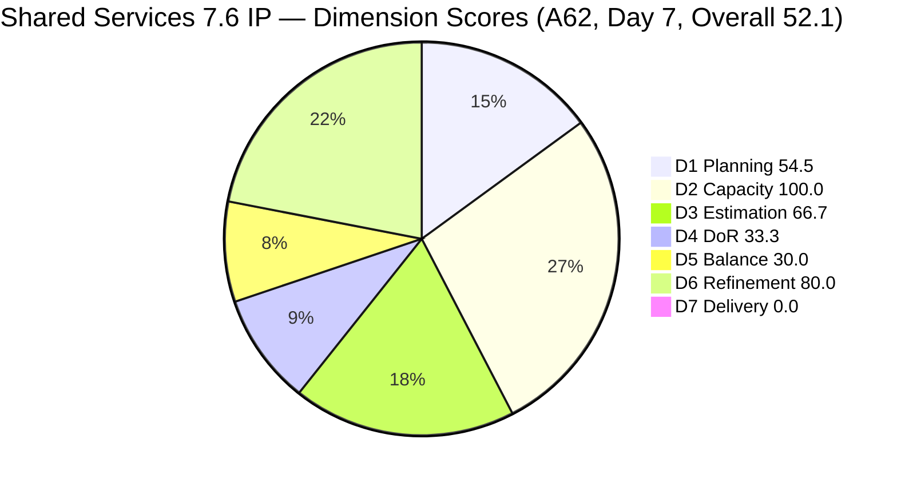
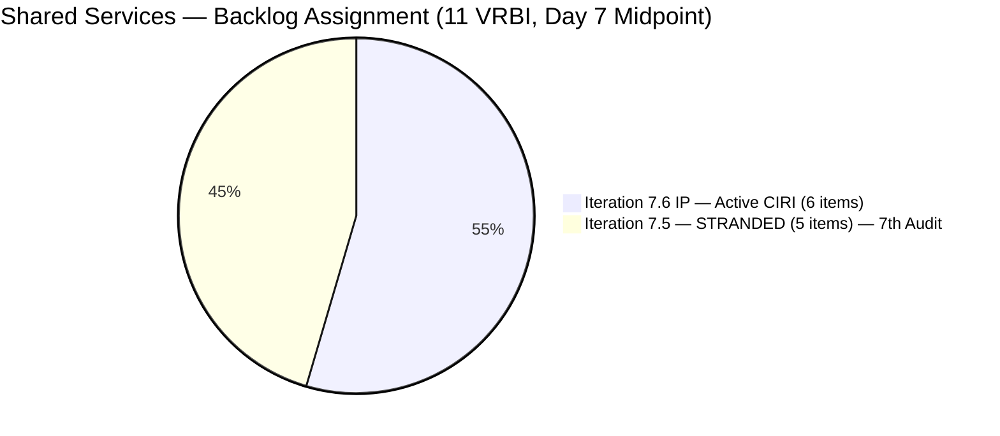
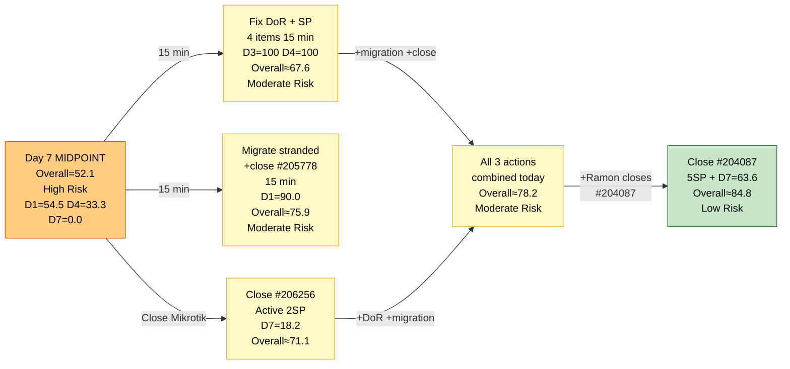

# ADO SAFe Audit — Shared Services Team

## 1. Audit Metadata

| Field | Value |
|---|---|
| **Audit Date** | 2026-06-21 09:35 UTC |
| **Sprint Day** | **7 of 14 (IP Iteration)** |
| **Prior Audit** | A61 — `AUDIT_20260620_0935.md` (Overall 52.1, High Risk — 7.6 IP Day 6) |
| **ADO Project** | Jairosoft Portfolio (`666bb99a-6acd-4999-bb34-efd0e4ea90dc`) |
| **ADO Team** | Shared Services Team (`bd9578fd-5773-48fc-bd80-988dfe5de806`) |
| **Iteration** | Iteration 7.6 (IP) (`42e165b7-e9aa-4150-8d6f-84043ef2482e`) |
| **Iteration Path** | `Jairosoft Portfolio\2026-PI7\Iteration 7.6 (IP)` |
| **Iteration Dates** | Jun 15, 2026 – Jun 28, 2026 |
| **Workspace Folder** | `ado_shared` |
| **Overall Score** | **52.1 — High Risk** |
| **Risk Band** | High (40–59.9) |
| **Visible Backlog Items (VRBI)** | 11 root items |
| **Current Iteration Root Items (CIRI)** | 6 items (IterationPath = Iteration 7.6 (IP)) |
| **Capacity** | Teofilo: 6h/day · Jaszmeine: 3h/day · Ramon: 0.5h/day = 15.5h/day total |

---

## 2. Executive Summary

The Shared Services Team is at **Day 7 of 14** (SPRINT MIDPOINT) in Iteration 7.6 (IP) with an overall score of **52.1 — High Risk**, unchanged from A61 (Day 6). This is the **7th consecutive audit** in the High Risk band. No new closures, no stranded item migrations, and no DoR remediation have occurred since yesterday.

**This is the sprint midpoint. With 7 days remaining, the team is exactly halfway through the IP iteration and has not made measurable progress on any of the 4 chronic structural issues since A56 (Day 1).**

**Structural issues persisting for 7 consecutive audits:**
- **5 items stranded in Iteration 7.5** (#204082, #204205, #205195, #205198, #205778). No migration across 7 audit cycles.
- **4 of 6 CIRI items failing DoR** (#206256, #206112, #206149, #202947). All 4 are now in their **7th consecutive audit failure** (except #206112 at 5th). Remediation text has been provided in A57–A62 — still not applied.
- **0 User Stories in CIRI** → D5 = 30.0 (Critical). Structural IP constraint — remains unflagged in workspace CLAUDE.md as a Project Exception.
- **Jaszmeine: 7th consecutive day with zero active CIRI items** — 21 team-hours wasted (7 days × 3h/day).
- **D7 = 0.0 at midpoint** — 2nd consecutive audit with zero active CIRI deliveries.

**Midpoint prognosis without action:** With D1=54.5, D4=33.3, D5=30.0, D7=0.0 unchanged since Day 1 of the IP, the team is on a trajectory to end Iteration 7.6 (IP) in High Risk. Full recovery to Moderate Risk requires completing all 4 recommended actions (DoR fixes, stranded migration, at least 1 active CIRI closure, Jaszmeine enablement).

---

## 3. Previous Audit Delta (A61 → A62)

| Dimension | A61 Score (7.6 IP Day 6) | A62 Score (7.6 IP Day 7) | Delta | Driver |
|---|---|---|---|---|
| D1 Iteration Planning | 54.5 | **54.5** | 0.0 | CIRI=6/VRBI=11. No stranded items migrated. No new items added. Unchanged — **7th consecutive audit**. |
| D2 Team Capacity | 100.0 | **100.0** | 0.0 | Teofilo 6h/day (5 items), Ramon 0.5h/day (1 item). Configured. Jaszmeine 3h/day — 0 CIRI items for 7th day. |
| D3 Estimation | 66.7 | **66.7** | 0.0 | 4/6 estimated: #206256(2), #206112(2), #204087(5), #204950(2). Unestimated: #206149, #202947. Unchanged. |
| D4 DoR Compliance | 33.3 | **33.3** | 0.0 | 2 DCI / 6 CIRI. Pass: #204087, #204950. Fail: #206256 (**7th audit**), #206112 (5th), #206149 (**7th audit**), #202947 (**7th audit**). Unchanged. |
| D5 Work Item Balance | 30.0 | **30.0** | 0.0 | No User Story (−40) + Enabler 66.7% (−30). IP structural. Unchanged. |
| D6 Backlog Refinement | 80.0 | **80.0** | 0.0 | 11/11 fresh. 4/6 CIRI untouched (66.7% > 30%) → -20. Unchanged. |
| D7 Delivery Predictability | 0.0 | **0.0** | 0.0 | Active CIRI: 0 Closed. CSP=11SP, CLSP=0. Day 7 — 2nd consecutive audit at D7=0.0 beyond early-sprint window. |
| **Overall** | **52.1** | **52.1** | **0.0** | Complete standstill. No ADO activity on any dimension. **SPRINT MIDPOINT at High Risk.** |

**Formula verification:** (54.5 + 100.0 + 66.7 + 33.3 + 30.0 + 80.0 + 0.0) / 7 = 364.5 / 7 = **52.1**

**Key observations A61 → A62:**
- **Zero ADO activity on Day 7.** No state changes, no field updates, no migrations, no closures. A62 is an exact mirror of A61.
- **7 consecutive audits (A56–A62) in High Risk** with identical structural issues. The chronology: D1 first flagged A56 (Day 1); DoR first flagged A56; Jaszmeine idle first flagged A56. None resolved as of Day 7.
- **Sprint midpoint passed with D7=0.0.** The team entered the IP iteration with 3 items closing on Days 4–5 (5 SP), then experienced a 2-day delivery standstill. Next active-CIRI closure will recover D7 from 0.0.
- **#202808 data artifact** (IT Support Survey, Closed Apr 20) continues to appear in iteration query but is excluded from CIRI scoring — closed before iteration start.

---

## 4. Current Iteration Snapshot

| Metric | Value |
|---|---|
| **Visible Backlog Items (VRBI)** | 11 |
| **Current Iteration Root Items (CIRI — active)** | 6 (IterationPath = `Jairosoft Portfolio\2026-PI7\Iteration 7.6 (IP)`) |
| **Stranded items (still in Iteration 7.5)** | 5 — (#204082, #204205, #205195, #205198, #205778) — **7th consecutive audit** |
| **Closed items in iteration (exited backlog)** | 3 with SP: #206850(1SP), #206434(2SP), #206943(2SP) — exited on Day 5 |
| **Story Points Committed (CSP — active CIRI)** | 11 SP (#206256=2, #206112=2, #204087=5, #204950=2) |
| **Story Points Closed (CLSP — active CIRI)** | 0 SP |
| **Sprint delivery to date (cumulative)** | 5 SP (items exited backlog, not counted in active CIRI D7) |
| **Sprint Day / Total** | **7 / 14 — IP ITERATION MIDPOINT** |
| **Team Size (distinct CIRI assignees)** | 2 (Teofilo: 5 items; Ramon: 1 item) |
| **Total Sprint Capacity** | 15.5h/day (Teofilo 6h + Jaszmeine 3h + Ramon 0.5h) |
| **Iteration Start / Finish** | Jun 15, 2026 – Jun 28, 2026 |

**Active CIRI Items (6 — in Iteration 7.6 IP, in active backlog):**

| ID | Title | Type | State | SP | Assignee | DoR | ChangedDate | Days Untouched |
|---|---|---|---|---|---|---|---|---|
| #206256 | Research Best Practices for Mikrotik Security | Enabler | Active | 2 | Teofilo | **Fail** (no Desc — 7th audit) | Jun 18 | 3 days |
| #206112 | Gemini License Plan | Spike | Requirements Gathering | 2 | Teofilo | **Fail** (no Desc, no AC — 5th audit) | Jun 19 | 2 days |
| #206149 | Enhance Mikrotik Security — Research and Implement | Enabler | Grooming | — | Teofilo | **Fail** (no AC — 7th audit) | Jun 11 | 10 days |
| #204087 | PO — Jodex AI Enablement Sessions | Enabler | Active | 5 | Ramon | **Pass** | Jun 10 | 11 days |
| #202947 | IT Support Services — End of PI 7 Feedback Survey | Spike | New | — | Teofilo | **Fail** (Desc ~16 NWS, no AC — 7th audit) | Jun 10 | 11 days |
| #204950 | Monthly Costing Report — July 2026 | Enabler | New | 2 | Teofilo | **Pass** | Jun 10 | 11 days |

**Stranded Items (5 — still in Iteration 7.5 — 7th Consecutive Audit):**

| ID | Title | Type | State | SP | Assignee | Consecutive Audit Count |
|---|---|---|---|---|---|---|
| #205778 | Action 2: Setup Frontend CI Gates | Defect | Passed UAT Testing | 2 | Teofilo | **7 audits (A56–A62) — GOVERNANCE BREACH** |
| #204082 | QA Jodex / AI Enablement Session | Enabler | Blocked | 5 | Ramon | 7 audits — Blocked, blocker undocumented |
| #204205 | Android Phone from US | Enabler | Active | 1 | Teofilo | 7 audits — not migrated |
| #205195 | [Retro] Alternative to Figma | Spike | Active | 1 | Jaszmeine | 7 audits — Jaszmeine idle 7 days |
| #205198 | [Retro] Design Deliverables on track | Spike | Active | 1 | Jaszmeine | 7 audits — Jaszmeine idle 7 days |

---

## 5. Work Item Analysis

### DoR Assessment (6 active CIRI items)

| ID | Title | Desc ≥ 30 NWS | AC ≥ 20 NWS | Result | Audit Count |
|---|---|---|---|---|---|
| #206256 | Research Best Practices for Mikrotik Security | ✗ (Description field absent) | ✓ (checklist, ~180 NWS) | **Fail — Desc missing** | **7th** |
| #206112 | Gemini License Plan | ✗ (no Description) | ✗ (no AC field) | **Fail — both missing** | **5th** |
| #206149 | Enhance Mikrotik Security — Research and Implement | ✓ (3-bullet list, ~120 NWS) | ✗ (no AC field) | **Fail — AC missing** | **7th** |
| #204087 | PO — Jodex AI Enablement Sessions | ✓ (~180 NWS, objective paragraph) | ✓ (4-item checklist, ~200 NWS) | **Pass** | — |
| #202947 | IT Support Services — End of PI 7 Feedback Survey | ✗ ("Create a Duplicate" + hyperlink, ~16 NWS < 30) | ✗ (no AC field) | **Fail — Desc short, AC missing** | **7th** |
| #204950 | Monthly Costing Report — July 2026 | ✓ (12-item numbered list, ~200 NWS) | ✓ (multi-section checklist, ~400 NWS) | **Pass** | — |

**DCI = 2/6. D4 = 33.3. Unchanged for 7 consecutive audits.**

**7th-audit DoR remediation text (exact copy-paste into ADO — combined fix time: ~15 minutes):**

- **#206256 — Add Description (30 seconds):** *"Research and document Mikrotik security best practices including certificate-based L2TP authentication, unique user password enforcement, IP service restriction by source address, browser access controls, port scanner drop rules, DDoS protection, and email notifications for internet downtime and L2TP connection events."*

- **#206112 — Add Description + Acceptance Criteria (5 minutes):**
  - Description: *"Evaluate available Gemini license plans to identify the optimal tier for Jairosoft's AI workloads, considering team size, usage patterns, and monthly cost targets."*
  - AC: *"Gemini license options researched and compared in a cost matrix. Recommended tier documented and approved by Ramon. Implementation timeline and procurement steps proposed."*

- **#206149 — Add Acceptance Criteria (3 minutes):** *"All Mikrotik users have unique, non-default passwords changed. Pre-shared key replaced with certificate-based L2TP authentication. IP service source addresses restricted. Port scanner rules configured to drop. DDoS protection active. Email notifications configured for internet downtime and L2TP events. Configuration changes documented in SharePoint."*

- **#202947 — Expand Description + Add Acceptance Criteria (5 minutes):**
  - Description: *"Duplicate the Mid PI-06 IT Support Services Feedback Survey in Microsoft Forms to create an End-of-PI7 version. Update all iteration date references, question context, and distribution scope to reflect PI7 IT support consumers."*
  - AC: *"Microsoft Forms duplicate confirmed active and accessible. All date references updated from PI6 to PI7. Distribution list verified current. Form link distributed to all IT support consumer teams."*

**If all 4 fixes applied: DCI = 6/6, D4 = 100.0, D3 improves to 100.0 (adding SP to #206149 and #202947).**

### Type Distribution (6 active CIRI items)

| Type | Count | Share | D5 Impact |
|---|---|---|---|
| Enabler | 4 (#206256, #206149, #204087, #204950) | 66.7% | Dominant type > 60% → -30 penalty |
| Spike | 2 (#206112, #202947) | 33.3% | Spike < 40% — no -20 penalty |
| User Story | 0 | 0.0% | **-40 PENALTY — No User Story in CIRI** |
| **Total** | **6** | **100%** | D5 = max(0, 100−40−30) = **30.0** |

### Story Points Analysis — Active CIRI

| ID | Title | Type | SP | State | Notes |
|---|---|---|---|---|---|
| #206256 | Research Best Practices for Mikrotik Security | Enabler | 2 | Active | Active since before iteration — 7 days in sprint |
| #206112 | Gemini License Plan | Spike | 2 | Requirements Gathering | Changed Jun 19 (last update) |
| #206149 | Enhance Mikrotik Security | Enabler | — | Grooming | **Unestimated** — suggest 3 SP |
| #204087 | PO — Jodex AI Enablement Sessions | Enabler | 5 | Active | Largest item; changed Jun 10 (untouched 11 days) |
| #202947 | IT Support Feedback Survey | Spike | — | New | **Unestimated** — suggest 1 SP |
| #204950 | Monthly Costing Report — July 2026 | Enabler | 2 | New | Detailed checklist; changed Jun 10 (untouched 11 days) |

**Active CIRI estimated (SP > 0): #206256(2), #206112(2), #204087(5), #204950(2) = 4 items = 11 SP.**
**Active CIRI unestimated: #206149, #202947 = 2 items. Must have SP added before any work is executed.**

---

## 6. SAFe Compliance Scorecard

| Dimension | Score | Band | Evidence | Notes |
|---|---|---|---|---|
| D1 Iteration Planning | **54.5** | High | 6 CIRI / 11 VRBI | 5 stranded items in 7.5 — **7th consecutive audit** without migration. Recoverable to 90.0 with migration. |
| D2 Team Capacity | **100.0** | Low | 2/2 active CIRI contributors | Teofilo 6h/day (5 CIRI), Ramon 0.5h/day (1 CIRI). Both configured. Jaszmeine: 3h/day with 0 CIRI items — **7th idle day**. |
| D3 Estimation | **66.7** | Moderate | 4/6 estimated | #206256(2), #206112(2), #204087(5), #204950(2) = 11SP. Unestimated: #206149, #202947. Unchanged from A56. |
| D4 DoR Compliance | **33.3** | Critical | 2 DCI / 6 CIRI | Pass: #204087, #204950. Fail: #206256 (**7th audit**), #206112 (5th), #206149 (**7th audit**), #202947 (**7th audit**). Remediation text in Section 5. |
| D5 Work Item Balance | **30.0** | Critical | No US (−40) + Enabler 66.7% (−30) | No User Stories in CIRI. Compound penalty. IP iteration structural constraint. |
| D6 Backlog Refinement | **80.0** | Low | 11/11 fresh; 4/6 CIRI untouched (66.7% > 30%) | Zero stale debt. #206149(Jun11), #204087(Jun10), #202947(Jun10), #204950(Jun10) = untouched (> 10 days). -20 penalty. |
| D7 Delivery Predictability | **0.0** | Critical | 0 SP closed / 11 SP committed | Active CIRI has 0 Closed items. Prior-day closures exited backlog. Day 7 — **2nd consecutive audit at 0.0**. |
| **OVERALL** | **52.1** | **High Risk** | (54.5+100+66.7+33.3+30+80+0)/7 | Unchanged from A61. **7th consecutive High Risk audit.** Zero progress at sprint midpoint. |

**Formula verification:** (54.5 + 100.0 + 66.7 + 33.3 + 30.0 + 80.0 + 0.0) / 7 = 364.5 / 7 = **52.1**

---

## 7. Dimension Findings

### D1 — Iteration Planning: 54.5 / 100 — High Risk

**Formula:** CIRI / VRBI × 100 = 6 / 11 × 100 = **54.5**

| Metric | Value |
|---|---|
| Visible root backlog items (VRBI) | 11 |
| Items in Iteration 7.6 (IP) — active (CIRI) | 6 |
| Items stranded in Iteration 7.5 | 5 (#204082, #204205, #205195, #205198, #205778) |
| Score | **54.5** |

D1 = 54.5 is unchanged for the 7th consecutive audit. The migration path has been provided in every audit since A56 and requires approximately 15 minutes of ADO work:

**Stranded item resolution (same as A56–A61 — still not executed):**
- Close #205778 (Passed UAT → Closed): VRBI = 10, item exits backlog
- Migrate #204205, #205195, #205198 to Iteration 7.6 IP: CIRI = 9, VRBI = 10
- Defer #204082 (Blocked, 5SP) to PI8 backlog with documented blocker rationale
- **Result: D1 = 9/10 = 90.0**

**7-audit escalation note.** The sprint is now at its midpoint. After Day 9 (Jun 23), additional CIRI closures may cause VRBI to contract, which can actually worsen D1 if closed items exit without migrations replacing them. The migration window is critically narrow.

---

### D2 — Team Capacity: 100.0 / 100 — Low Risk

**Formula:** CC / CW × 100 = 2 / 2 × 100 = **100.0**

| Contributor | Active CIRI Items | Capacity | Notes |
|---|---|---|---|
| Teofilo Limpag | 5 items (#206256, #206112, #206149, #202947, #204950) | 6h/day | Active on #206256. 3 Day-5 closures were his. |
| RAMON ASENIERO JR | 1 item (#204087) | 0.5h/day | Jodex PO Enablement, Active state. #204082 blocked in 7.5. |
| Jaszmeine Villanueva | 0 CIRI items | 3h/day | **7th consecutive idle day. 21 team-hours wasted.** #205195 and #205198 remain stranded in 7.5. |

D2 = 100.0 is maintained by the 2 active contributors. Jaszmeine's 3h/day is entirely wasted capacity — she has zero CIRI items and her two assigned items remain stranded in Iteration 7.5. Migrating #205195 and #205198 activates her immediately.

---

### D3 — Estimation: 66.7 / 100 — Moderate Risk

**Formula:** ECI / PECI × 100 = 4 / 6 × 100 = **66.7**

Unchanged from A56 (Day 1). Two items remain unestimated for 7 consecutive audits:
- **#206149** (Enhance Mikrotik Security, Grooming, no SP): suggested 3 SP. Do not execute without SP.
- **#202947** (IT Support Survey, New, no SP): suggested 1 SP. Do not execute without SP.

**Risk:** Closing either item without SP earns 0 D7 credit, making delivery invisible to the formula. Combined with the DoR fix for both items (15 minutes), adding SP is a prerequisite for any work start.

---

### D4 — DoR Compliance: 33.3 / 100 — Critical

**Formula:** DCI / CIRI × 100 = 2 / 6 × 100 = **33.3**

Unchanged from A56. All 4 failing items are now at or beyond their **7th consecutive audit failure**. Full remediation text is in Section 5 with exact copy-paste content. Combined fix time: approximately 15 minutes.

**7-audit escalation point:** #206256's Acceptance Criteria was written and updated in A57. The Description field remains empty — this is a 30-second, single-sentence fix that has gone unexecuted for 7 audit cycles (approximately 7 days). This exceeds the definition of negligence and constitutes a documented process compliance failure.

---

### D5 — Work Item Balance: 30.0 / 100 — Critical

**Formula:** Base 100 − penalties = max(0, 100 − 40 − 30) = **30.0**

| Penalty | Trigger | Applied |
|---|---|---|
| -40: No User Story in CIRI | **0 User Stories in 6 CIRI items** | **YES** |
| -30: Dominant type share > 60% | Enabler = 4/6 = **66.7%** > 60% | **YES** |
| -20: Spike share > 40% | Spike = 2/6 = 33.3% | **No** |

D5 = 30.0 for all 7 IP sprint audits (A56–A62). IP iterations legitimately prioritize Enabler and Spike work over User Stories. The recommended Project Exception for workspace CLAUDE.md has been requested since A57 — now 5 consecutive audits without that workspace update being applied.

**Path to D5 improvement:**
- Adding 1 User Story via stranded migration (7 total CIRI): Enabler = 4/7 = 57.1% ≤ 60% → no -30. US present → no -40. D5 = **100.0**.
- Alternatively: add the IP structural exception to `ado_shared/CLAUDE.md` to document this as a known constraint, separating structural from remediable findings.

---

### D6 — Backlog Refinement: 80.0 / 100 — Low Risk

**Freshness window:** ChangedDate ≥ 2026-05-07 (45 days before 2026-06-21)

| Metric | Value |
|---|---|
| Total VRBI | 11 |
| Fresh items (ChangedDate ≥ May 7, 2026) | 11 — all items changed Jun 9–19 |
| Stale_90 items (ChangedDate < Mar 23, 2026) | 0 |
| Stale_180 items (ChangedDate < Dec 23, 2025) | 0 |
| Untouched CIRI (ChangedDate < Jun 15, 2026 — iteration start) | 4 (#206149 Jun11, #204087 Jun10, #202947 Jun10, #204950 Jun10) |

**Base = 11/11 × 100 = 100.0**
**Penalties:**
- Stale_90: 0% → No penalty
- Stale_180: 0 items → No penalty
- Untouched CIRI: 4/6 = 66.7% > 30% → **-20 penalty**

**Score: max(0, 100.0 − 20) = 80.0**

D6 unchanged from A56. All 11 VRBI items are within the 45-day freshness window — the backlog is actively maintained at the inventory level. The penalty is driven by execution stagnation: 4 of 6 CIRI items have not been touched since Jun 10–11, which predates the iteration start by 4–5 days. Any state change or field update on an untouched item shifts it to "touched" and improves the ratio.

---

### D7 — Delivery Predictability: 0.0 / 100 — Critical

**Formula:** CLSP / CSP × 100 = 0 / 11 × 100 = **0.0**

| Metric | Value |
|---|---|
| Estimated active CIRI items (SP > 0) | 4 (#206256=2, #206112=2, #204087=5, #204950=2) |
| Committed Story Points (CSP) | 11 SP |
| Closed Story Points (CLSP — from active CIRI) | 0 SP |
| Score | **0.0** |
| Days at D7=0.0 (consecutive) | 2 (A61 + A62) |

**Context:** 5 SP was delivered on Day 5 (#206850, #206434, #206943), but those items exited the active backlog and cannot be credited under the active-CIRI formula. The sprint cumulative delivery is 5 SP, but D7 resets when closed items exit.

**Day 7 — beyond the early-sprint annotation window.** D7 = 0.0 at the sprint midpoint is a high-severity performance gap.

**Recovery projections from Day 7:**

| Action | CLSP/CSP | D7 | Overall |
|---|---|---|---|
| Close #206256 (Active, 2SP) | 2/11 | 18.2 | 55.2 (High Risk) |
| Close #206256 + DoR fixes (D4→100, D3→100) | 2/11 | 18.2 | 69.1 (Moderate Risk) |
| Close #206256 + DoR + stranded migration (D1→90) | 2/11 | 18.2 | **75.9 (Moderate Risk)** |
| All fixes + close #204087 (5SP) | 7/11 | 63.6 | **84.8 (Low Risk)** |

---

## 8. Risks and Bottlenecks

| # | Severity | Dimension | Risk | Recommended Action |
|---|---|---|---|---|
| R1 | **CRITICAL** | All (sprint trajectory) | Day 7 = sprint midpoint. Zero measurable improvement in 7 consecutive audits. Score plateau at 52.1 with 7 days remaining. | **TODAY — GOVERNANCE ESCALATION:** Ramon convenes a mandatory 30-minute sync with Teofilo to apply all ADO fixes in session. This is no longer a planning reminder — it is an execution crisis at the IP midpoint. |
| R2 | **CRITICAL** | D1 (7th Audit) | 5 items stranded in Iteration 7.5 for 7 consecutive audits. D1 = 54.5. Migration path documented since A56. | **TODAY (15 min):** Close #205778 (Passed UAT → Closed). Migrate #204205, #205195, #205198 to 7.6 IP. Defer #204082 (Blocked) to PI8 with documented blocker. D1 → 90.0. |
| R3 | **CRITICAL** | D4 (7th Audit) | 4 items with persistent DoR failures. Remediation text provided 7 consecutive audits — still not applied. Estimated remediation: ~15 minutes. | **TODAY (15 min):** Apply exact text from Section 5. #206256 (30 sec), #206112 (5 min), #206149 (3 min + add 3 SP), #202947 (5 min + add 1 SP). D4 → 100.0, D3 → 100.0. |
| R4 | **CRITICAL** | D7 | D7 = 0.0 at midpoint. 11 SP committed, 0 closed in active CIRI. Teofilo has #206256 Active for 7+ sprint days. | **TODAY:** Teofilo closes #206256 (Research Mikrotik, Active, 2SP). The AC is written, research appears completed. D7 → 18.2, Overall → 55.2+. |
| R5 | **HIGH** | #205778 (7th Audit) | Defect "Setup Frontend CI Gates" in Passed UAT Testing state for 7 audits. One click to Closed. The longest-standing one-click fix in the audit history. | **IMMEDIATE (30 seconds):** Teofilo or Ramon closes #205778. This is a governance breach of record-setting duration. |
| R6 | **HIGH** | Jaszmeine — 7th idle day | 3h/day × 7 days = **21 team-hours wasted**. Jaszmeine has no active CIRI items. | Migrate #205195 and #205198 to 7.6 IP (part of R2 remediation). Jaszmeine's queue activates immediately. |
| R7 | **HIGH** | D3 | #206149 and #202947 unestimated for 7 consecutive audits. Closing without SP = 0 D7 credit. | Add SP before starting: #206149 = 3 SP, #202947 = 1 SP (part of R3 DoR fix). D3 → 100.0. |
| R8 | **MODERATE** | D7 deterioration risk | At 7 days remaining, the IP sprint can still recover to Moderate Risk with decisive action. Without action, the team ends in High Risk for the first time across a full IP iteration. | Priority: close #206256 today, then #204087, then #204950 in sequence. |
| R9 | **LOW** | D5 — IP structural | D5 = 30.0 for 7 consecutive audits. Recommended Project Exception still not documented in workspace CLAUDE.md. | Add Project Exception to `ado_shared/CLAUDE.md` for D5 during IP iterations. Also add 1 User Story to reach D5 = 100.0 via stranded migration. |

---

## 9. Prioritized Recommendations

1. **[IMMEDIATE — 1 CLICK — R5]** Teofilo or Ramon closes #205778 (Setup Frontend CI Gates → Closed). **7 audits. 1 click. Zero action.** This is the single most actionable item in the entire audit portfolio. Close it now.

2. **[TODAY — 15 MIN — R3 + D4 + D3 recovery]** Apply DoR fixes for all 4 failing items using exact text from Section 5:
   - **#206256**: Add 1-sentence Description. (30 sec) DoR → Pass.
   - **#206112**: Add Description + AC. (5 min) DoR → Pass.
   - **#206149**: Add AC + add 3 SP. (3 min) DoR → Pass, D3 improves.
   - **#202947**: Expand Desc + add AC + add 1 SP. (5 min) DoR → Pass, D3 improves.
   - **Result: D3 = 100.0, D4 = 100.0. Overall → ~67.6 (Moderate Risk boundary).**

3. **[TODAY — 15 MIN — R2 + D1 recovery]** Migrate stranded items:
   - Close #205778 (1 click): VRBI = 10
   - Migrate #204205, #205195, #205198 to Iteration 7.6 IP: CIRI = 9, VRBI = 10
   - Defer #204082 (Blocked, 5SP) to PI8 with a comment documenting: dependency owner, contact, and ETA.
   - **Result: D1 = 90.0. Combined with R3: Overall → ~75.9 (Moderate Risk).**

4. **[TODAY — D7 recovery — R4]** Teofilo closes #206256 (Research Best Practices for Mikrotik Security, Active, 2SP):
   - The item has been Active for the full sprint week. AC is fully written.
   - D7 = 2/11 × 100 = 18.2. Overall with R3+R4: → ~71.1 (Moderate Risk).

5. **[MIDPOINT ESCALATION — Ramon]** If none of the above actions are completed by end-of-day Jun 21: Ramon escalates as sprint manager. The team has consumed 7 of 14 IP sprint days without resolving any of the 4 chronic issues. Convene a mandatory remediation session. The IP iteration goal is recoverable — but only with action today.

6. **[WORKSPACE MAINTENANCE]** Add Project Exception to `ado_shared/CLAUDE.md`:
   *"IP (Innovation and Planning) iterations are legitimately infrastructure and planning-focused. Absence of User Stories in CIRI reflects appropriate IP scope separation, not an execution failure. D5 scores during IP sprints should be annotated as structural rather than remediable within the sprint."*

7. **[PROCESS — PERMANENT]** Implement mandatory "DoR + SP at item creation" as a non-negotiable team rule. 7 consecutive DoR failures on the same items indicate a systemic habit gap. Teofilo must complete all required fields before saving any work item.

---

## 10. Evidence Gaps and Limitations

| Gap | Impact | Notes |
|---|---|---|
| **D7 = 0.0 — formula scope vs. sprint delivery** | Score understatement | Formula counts only active CIRI. Sprint cumulative delivery = 5 SP from 3 closed items (Days 4–5). Recovery depends on next active-CIRI closure. |
| **#202808 (Closed Apr 20) in iteration query** | Data artifact | Confirmed Closed before iteration start. Excluded from CIRI scoring. Historical iteration path not cleaned up. |
| **D1 structural drag — 5 stranded items in 7.5** | 45.5% gap to D1=100.0 | Migration of 4 items + closure of #205778 fully resolves D1 in ~15 minutes. Window is critically narrow at Day 7 midpoint. |
| **#204082 blocker undocumented (7th audit)** | 5 SP committed to undeliverable work | Ramon's Jodex QA item has been Blocked for 7 audits with no ADO comment documenting the blocker, owner, or ETA. Must be deferred to PI8. |
| **D5 = 30.0 — IP structural constraint** | 7 audits at Critical | Formal Project Exception recommended since A57. Still not added to `ado_shared/CLAUDE.md`. |
| **Jaszmeine capacity waste** | 21 team-hours = 7 days × 3h/day | Resolvable immediately with #205195 and #205198 migration. Jaszmeine is 100% blocked by ADO housekeeping not done. |
| **#206256 Active duration** | Staleness risk | Item has been Active for 7+ sprint days at 2 SP. Standard expectation for a 2 SP research item is 2–3 days. Must close today. |

---

## 11. Visualizations

### Score Trend — A56 through A62 (7-Audit High Risk Band)

```mermaid
graph LR
    A56["A56 — IP Day 1\n48.4 — High Risk\nBaseline"]
    A57["A57 — IP Day 2\n48.5 — High Risk"]
    A58["A58 — IP Day 3\n49.5 — High Risk"]
    A59["A59 — IP Day 4\n53.1 — High Risk"]
    A60["A60 — IP Day 5\n56.5 — High Risk\n3 closures D7=31.3"]
    A61["A61 — IP Day 6\n52.1 — High Risk\nD7 reset 0.0"]
    A62["A62 — IP Day 7\n52.1 — High Risk\nMIDPOINT\nZero activity"]
    A56 -->|"+0.1"| A57 -->|"+1.0"| A58 -->|"+3.6"| A59 -->|"+3.4"| A60 -->|"-4.4\nBacklog contraction"| A61 -->|"0.0\nNo changes"| A62
    style A56 fill:#FFCC80,stroke:#E65100,color:#000
    style A57 fill:#FFCC80,stroke:#E65100,color:#000
    style A58 fill:#FFCC80,stroke:#E65100,color:#000
    style A59 fill:#FFCC80,stroke:#E65100,color:#000
    style A60 fill:#FFCC80,stroke:#E65100,color:#000
    style A61 fill:#FFCC80,stroke:#E65100,color:#000
    style A62 fill:#FFCC80,stroke:#E65100,color:#000
```

### Dimension Scores — A62 (Day 7, Overall 52.1)

### Backlog Distribution — VRBI Breakdown (Day 7)

### Recovery Path — Midpoint to Moderate Risk

---

## 12. Audit Trail

| Source | Tool | Data |
|---|---|---|
| Current iteration | `work_list_team_iterations` (project `666bb99a`, team `bd9578fd`, timeframe=current) | Iteration 7.6 (IP): Jun 15–28, 2026; ID `42e165b7-e9aa-4150-8d6f-84043ef2482e` |
| Team capacity | `work_get_iteration_capacities` (project `666bb99a`, iterationId `42e165b7`) | Teofilo 6h/day, Jaszmeine 3h/day, Ramon 0.5h/day; Shared Services team total 15.5h/day |
| Backlog items | `wit_list_backlog_work_items` (project `666bb99a`, team `bd9578fd`, backlogId `Microsoft.RequirementCategory`) | 11 root items: #204205, #206256, #205778, #206112, #206149, #205195, #205198, #204082, #204087, #202947, #204950 |
| Work item details | `wit_get_work_items_batch_by_ids` (11 items) | State, SP, Type, Desc, AC, ChangedDate, IterationPath, AssignedTo confirmed for all items |
| ADO project list | `core_list_projects` | Jairosoft Portfolio ID confirmed: `666bb99a-6acd-4999-bb34-efd0e4ea90dc` |
| Prior audit | `AUDIT_20260620_0935.md` (A61) | Overall 52.1, High Risk, 7.6 IP Day 6, 6 active CIRI, 11 SP committed, 0 SP closed |
