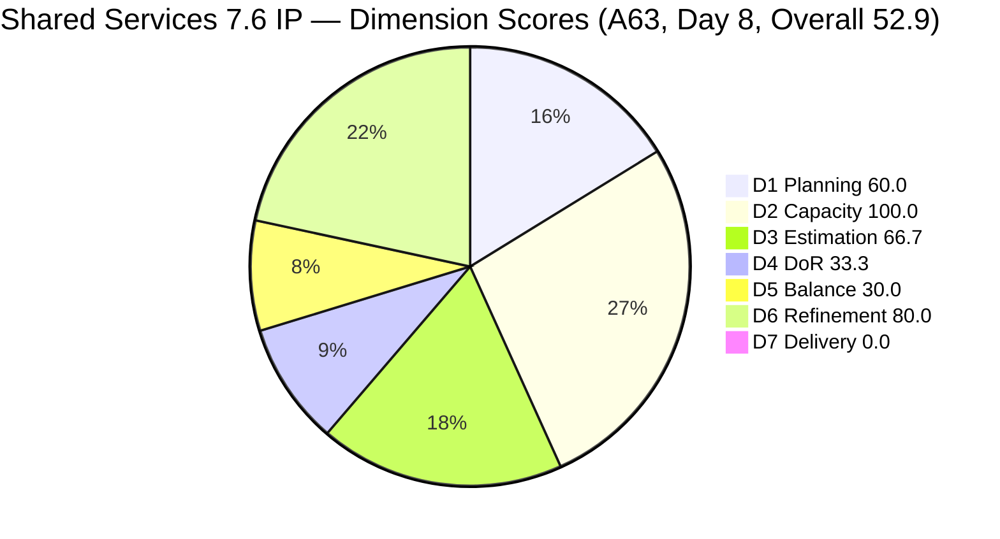
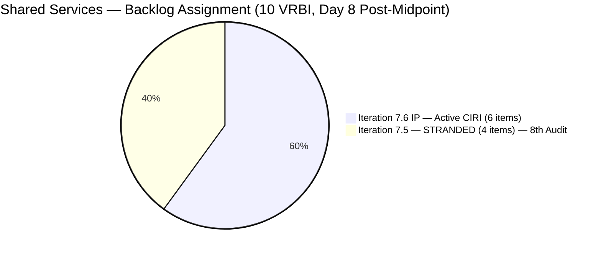
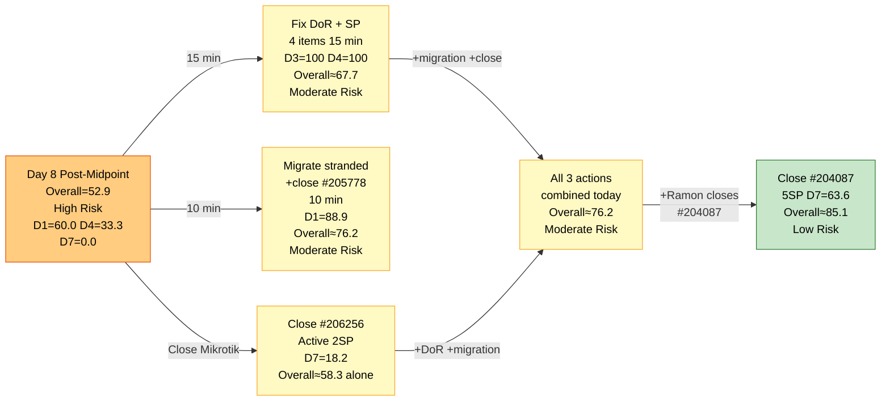

# ADO SAFe Audit — Shared Services Team

## 1. Audit Metadata

| Field | Value |
|---|---|
| **Audit Date** | 2026-06-22 09:03 UTC |
| **Sprint Day** | **8 of 14 (IP Iteration)** |
| **Prior Audit** | A62 — `AUDIT_20260621_0935.md` (Overall 52.1, High Risk — 7.6 IP Day 7) |
| **ADO Project** | Jairosoft Portfolio (`666bb99a-6acd-4999-bb34-efd0e4ea90dc`) |
| **ADO Team** | Shared Services Team (`bd9578fd-5773-48fc-bd80-988dfe5de806`) |
| **Iteration** | Iteration 7.6 (IP) (`42e165b7-e9aa-4150-8d6f-84043ef2482e`) |
| **Iteration Path** | `Jairosoft Portfolio\2026-PI7\Iteration 7.6 (IP)` |
| **Iteration Dates** | Jun 15, 2026 – Jun 28, 2026 |
| **Workspace Folder** | `ado_shared` |
| **Overall Score** | **52.9 — High Risk** |
| **Risk Band** | High (40–59.9) |
| **Visible Backlog Items (VRBI)** | 10 root items (was 11 — #205198 exited the backlog) |
| **Current Iteration Root Items (CIRI)** | 6 items (IterationPath = Iteration 7.6 (IP)) |
| **Capacity** | Teofilo: 6h/day · Jaszmeine: 3h/day · Ramon: 0.5h/day = 15.5h/day total |

---

## 2. Executive Summary

The Shared Services Team is at **Day 8 of 14** (day after sprint midpoint) in Iteration 7.6 (IP) with an overall score of **52.9 — High Risk**, a marginal improvement of +0.8 from A62 (52.1). This is the **8th consecutive audit** in the High Risk band. The sole score driver is #205198 exiting the active backlog (VRBI reduced from 11 to 10), which lifted D1 from 54.5 to 60.0. No ADO content changes, no DoR fixes, no closures, and no stranded item migrations have occurred.

**Structural issues persisting for 8 consecutive audits:**
- **4 items stranded in Iteration 7.5** (#204082, #204205, #205195, #205778). Migration path documented since A56 — still not executed.
- **4 of 6 CIRI items failing DoR** (#206256, #206112, #206149, #202947). All 4 are now in their **8th consecutive audit failure** for at least 3 of them; #206112 at 6th. Remediation text provided every audit — still not applied.
- **0 User Stories in CIRI** → D5 = 30.0 (Critical). IP structural constraint.
- **Jaszmeine: 8th consecutive day with zero active CIRI items** — 24 team-hours wasted (8 days × 3h/day).
- **D7 = 0.0 at post-midpoint** — 3rd consecutive audit with zero active CIRI deliveries.

**The team enters the second half of the IP sprint in a governance crisis.** Six sprint days remain. Without immediate action on all four chronic issues, the IP iteration will end in High Risk — the first complete High Risk IP sprint in the audit history of this workspace.

---

## 3. Previous Audit Delta (A62 → A63)

| Dimension | A62 Score (7.6 IP Day 7) | A63 Score (7.6 IP Day 8) | Delta | Driver |
|---|---|---|---|---|
| D1 Iteration Planning | 54.5 | **60.0** | **+5.5** | #205198 exited the backlog (VRBI 11→10). CIRI unchanged at 6. Score = 6/10 = 60.0. Structural improvement, not active remediation. |
| D2 Team Capacity | 100.0 | **100.0** | 0.0 | Teofilo 6h/day (5 items), Ramon 0.5h/day (1 item). Both configured. Jaszmeine 3h/day — 0 CIRI items for **8th day**. |
| D3 Estimation | 66.7 | **66.7** | 0.0 | 4/6 estimated. Unestimated: #206149, #202947. Unchanged. |
| D4 DoR Compliance | 33.3 | **33.3** | 0.0 | 2 DCI / 6 CIRI. Pass: #204087, #204950. Fail: #206256 (**8th audit**), #206112 (6th), #206149 (**8th audit**), #202947 (**8th audit**). |
| D5 Work Item Balance | 30.0 | **30.0** | 0.0 | No User Story (−40) + Enabler 66.7% (−30). IP structural. Unchanged. |
| D6 Backlog Refinement | 80.0 | **80.0** | 0.0 | 10/10 fresh. 4/6 CIRI untouched (66.7% > 30%) → -20. Unchanged. |
| D7 Delivery Predictability | 0.0 | **0.0** | 0.0 | Active CIRI: 0 Closed. CSP=11SP, CLSP=0. Day 8 — **3rd consecutive audit at D7=0.0**. |
| **Overall** | **52.1** | **52.9** | **+0.8** | #205198 backlog exit improved D1. No other ADO changes. **8th consecutive High Risk audit.** |

**Formula verification:** (60.0 + 100.0 + 66.7 + 33.3 + 30.0 + 80.0 + 0.0) / 7 = 370.0 / 7 = **52.9**

**Key observations A62 → A63:**
- **#205198 exited the backlog.** The item ([Retro] Design Deliverables on Track) no longer appears in `wit_list_backlog_work_items` results. It was assigned to Jaszmeine and stranded in Iteration 7.5. Its exit reduces VRBI from 11 to 10, mechanically improving D1 from 54.5 to 60.0. The remaining 4 stranded items still need active migration.
- **Zero deliberate ADO actions for the 8th consecutive day.** All 4 chronic structural issues (D1, D3, D4, D7) remain exactly as first reported in A56 (Day 1 of the IP). No field edits, no state transitions, no migrations, no DoR fixes — verified across all 10 VRBI items.
- **Jaszmeine's idle day count: 8.** Total wasted capacity: 24 team-hours. With #205198 now gone, her remaining stranded item is #205195 ([Retro] Alternative to Figma, Iteration 7.5, Active, 1 SP). One migration fixes her queue.
- **D7=0.0 for 3 consecutive audits.** Day 8 is past the sprint midpoint. The team has 6 days to prevent a zero-delivery IP sprint.

---

## 4. Current Iteration Snapshot

| Metric | Value |
|---|---|
| **Visible Backlog Items (VRBI)** | 10 (was 11 — #205198 exited) |
| **Current Iteration Root Items (CIRI — active)** | 6 (IterationPath = `Jairosoft Portfolio\2026-PI7\Iteration 7.6 (IP)`) |
| **Stranded items (still in Iteration 7.5)** | 4 — (#204082, #204205, #205195, #205778) — **8th consecutive audit** |
| **Closed items in iteration (exited backlog)** | 3 with SP: #206850(1SP), #206434(2SP), #206943(2SP) — exited on Day 5; #205198 — exited this period |
| **Story Points Committed (CSP — active CIRI)** | 11 SP (#206256=2, #206112=2, #204087=5, #204950=2) |
| **Story Points Closed (CLSP — active CIRI)** | 0 SP |
| **Sprint delivery to date (cumulative)** | 5 SP (items exited backlog, not counted in active CIRI D7) |
| **Sprint Day / Total** | **8 / 14 — Post-Midpoint** |
| **Team Size (distinct CIRI assignees)** | 2 (Teofilo: 5 items; Ramon: 1 item) |
| **Total Sprint Remaining Capacity** | ~93 hours (6 days × 15.5h/day) |
| **Iteration Start / Finish** | Jun 15, 2026 – Jun 28, 2026 |

**Active CIRI Items (6 — in Iteration 7.6 IP, in active backlog):**

| ID | Title | Type | State | SP | Assignee | DoR | ChangedDate | Days Untouched |
|---|---|---|---|---|---|---|---|---|
| #206256 | Research Best Practices for Mikrotik Security | Enabler | Active | 2 | Teofilo | **Fail** (no Desc — 8th audit) | Jun 18 | 4 days |
| #206112 | Gemini License Plan | Spike | Requirements Gathering | 2 | Teofilo | **Fail** (no Desc, no AC — 6th audit) | Jun 19 | 3 days |
| #206149 | Enhance Mikrotik Security — Research and Implement | Enabler | Grooming | — | Teofilo | **Fail** (no AC — 8th audit) | Jun 11 | 11 days |
| #204087 | PO — Jodex AI Enablement Sessions | Enabler | Active | 5 | Ramon | **Pass** | Jun 10 | 12 days |
| #202947 | IT Support Services — End of PI 7 Feedback Survey | Spike | New | — | Teofilo | **Fail** (Desc ~16 NWS, no AC — 8th audit) | Jun 10 | 12 days |
| #204950 | Monthly Costing Report — July 2026 | Enabler | New | 2 | Teofilo | **Pass** | Jun 10 | 12 days |

**Stranded Items (4 — still in Iteration 7.5 — 8th Consecutive Audit):**

| ID | Title | Type | State | SP | Assignee | Consecutive Audit Count |
|---|---|---|---|---|---|---|
| #205778 | Action 2: Setup Frontend CI Gates | Defect | Passed UAT Testing | 2 | Teofilo | **8 audits (A56–A63) — GOVERNANCE BREACH** |
| #204082 | QA Jodex / AI Enablement Session | Enabler | Blocked | 5 | Ramon | 8 audits — Blocked, blocker undocumented |
| #204205 | Android Phone from US | Enabler | Active | 1 | Teofilo | 8 audits — not migrated |
| #205195 | [Retro] Alternative to Figma | Spike | Active | 1 | Jaszmeine | 8 audits — Jaszmeine idle 8 days (only remaining stranded item for her) |

---

## 5. Work Item Analysis

### DoR Assessment (6 active CIRI items)

| ID | Title | Desc ≥ 30 NWS | AC ≥ 20 NWS | Result | Audit Count |
|---|---|---|---|---|---|
| #206256 | Research Best Practices for Mikrotik Security | ✗ (Description field absent in API response) | ✓ (checklist with certificate/password/L2TP/email items, ~180 NWS) | **Fail — Desc missing** | **8th** |
| #206112 | Gemini License Plan | ✗ (no Description field) | ✗ (no AC field) | **Fail — both missing** | **6th** |
| #206149 | Enhance Mikrotik Security — Research and Implement | ✓ (3-item numbered list: unique passwords, L2TP certificate, security config research, ~120 NWS) | ✗ (no AC field) | **Fail — AC missing** | **8th** |
| #204087 | PO — Jodex AI Enablement Sessions | ✓ (~180 NWS: hands-on AI Enablement session objective) | ✓ (4-item checklist: Environment Ready, Session Delivered, Artifacts Secured, Action Items Defined, ~200 NWS) | **Pass** | — |
| #202947 | IT Support Services — End of PI 7 Feedback Survey | ✗ ("Create a Duplicate" + hyperlink, ~16 NWS < 30 threshold) | ✗ (no AC field) | **Fail — Desc short, AC missing** | **8th** |
| #204950 | Monthly Costing Report — July 2026 | ✓ (12-item numbered list of cost categories, ~200 NWS) | ✓ (multi-section checklist: Cloud, SaaS, AI/API costing, ~400 NWS) | **Pass** | — |

**DCI = 2/6. D4 = 33.3. Unchanged for 8 consecutive audits.**

**8th-audit DoR remediation text (exact copy-paste into ADO — combined fix time: ~15 minutes):**

- **#206256 — Add Description (30 seconds):** *"Research and document Mikrotik security best practices including certificate-based L2TP authentication, unique user password enforcement, IP service restriction by source address, browser access controls, port scanner drop rules, DDoS protection, and email notifications for internet downtime and L2TP connection events."*

- **#206112 — Add Description + Acceptance Criteria (5 minutes):**
  - Description: *"Evaluate available Gemini license plans to identify the optimal tier for Jairosoft's AI workloads, considering team size, usage patterns, and monthly cost targets."*
  - AC: *"Gemini license options researched and compared in a cost matrix. Recommended tier documented and approved by Ramon. Implementation timeline and procurement steps proposed."*

- **#206149 — Add Acceptance Criteria (3 minutes):** *"All Mikrotik users have unique, non-default passwords changed. Pre-shared key replaced with certificate-based L2TP authentication. IP service source addresses restricted. Port scanner rules configured to drop. DDoS protection active. Email notifications configured for internet downtime and L2TP events. Configuration changes documented in SharePoint."*

- **#202947 — Expand Description + Add Acceptance Criteria (5 minutes):**
  - Description: *"Duplicate the Mid PI-06 IT Support Services Feedback Survey in Microsoft Forms to create an End-of-PI7 version. Update all iteration date references, question context, and distribution scope to reflect PI7 IT support consumers."*
  - AC: *"Microsoft Forms duplicate confirmed active and accessible. All date references updated from PI6 to PI7. Distribution list verified current. Form link distributed to all IT support consumer teams."*

**If all 4 fixes applied: DCI = 6/6, D4 = 100.0, D3 improves to 100.0 (adding SP to #206149 and #202947).**

### Type Distribution (6 active CIRI items)

| Type | Count | Share | D5 Impact |
|---|---|---|---|
| Enabler | 4 (#206256, #206149, #204087, #204950) | 66.7% | Dominant type > 60% → -30 penalty |
| Spike | 2 (#206112, #202947) | 33.3% | Spike < 40% — no -20 penalty |
| User Story | 0 | 0.0% | **-40 PENALTY — No User Story in CIRI** |
| **Total** | **6** | **100%** | D5 = max(0, 100−40−30) = **30.0** |

### Story Points Analysis — Active CIRI

| ID | Title | Type | SP | State | Notes |
|---|---|---|---|---|---|
| #206256 | Research Best Practices for Mikrotik Security | Enabler | 2 | Active | Active; last changed Jun 18 — 4 days |
| #206112 | Gemini License Plan | Spike | 2 | Requirements Gathering | Changed Jun 19 |
| #206149 | Enhance Mikrotik Security | Enabler | — | Grooming | **Unestimated** — suggest 3 SP |
| #204087 | PO — Jodex AI Enablement Sessions | Enabler | 5 | Active | Largest item; changed Jun 10 — 12 days untouched |
| #202947 | IT Support Feedback Survey | Spike | — | New | **Unestimated** — suggest 1 SP |
| #204950 | Monthly Costing Report — July 2026 | Enabler | 2 | New | Changed Jun 10 — 12 days untouched |

**Active CIRI estimated (SP > 0): #206256(2), #206112(2), #204087(5), #204950(2) = 4 items = 11 SP.**
**Active CIRI unestimated: #206149, #202947 = 2 items. Must have SP added before any work is executed.**

---

## 6. SAFe Compliance Scorecard

| Dimension | Score | Band | Evidence | Notes |
|---|---|---|---|---|
| D1 Iteration Planning | **60.0** | Moderate | 6 CIRI / 10 VRBI | #205198 exited the backlog (VRBI 11→10). **+5.5 from A62.** 4 items still stranded in 7.5 — **8th consecutive audit** without migration. |
| D2 Team Capacity | **100.0** | Low | 2/2 active CIRI contributors | Teofilo 6h/day (5 CIRI), Ramon 0.5h/day (1 CIRI). Both configured. Jaszmeine: 3h/day with 0 CIRI items — **8th idle day**. |
| D3 Estimation | **66.7** | Moderate | 4/6 estimated | #206256(2), #206112(2), #204087(5), #204950(2) = 11SP. Unestimated: #206149, #202947. Unchanged from A56. |
| D4 DoR Compliance | **33.3** | Critical | 2 DCI / 6 CIRI | Pass: #204087, #204950. Fail: #206256 (**8th audit**), #206112 (6th), #206149 (**8th audit**), #202947 (**8th audit**). Remediation text in Section 5. |
| D5 Work Item Balance | **30.0** | Critical | No US (−40) + Enabler 66.7% (−30) | No User Stories in CIRI. Compound penalty. IP iteration structural constraint. |
| D6 Backlog Refinement | **80.0** | Low | 10/10 fresh; 4/6 CIRI untouched (66.7% > 30%) | All 10 VRBI changed Jun 9–19 — all fresh. #206149(Jun11), #204087(Jun10), #202947(Jun10), #204950(Jun10) = untouched (pre-iteration start). -20 penalty. |
| D7 Delivery Predictability | **0.0** | Critical | 0 SP closed / 11 SP committed | Active CIRI has 0 Closed items. Day 8 — **3rd consecutive audit at 0.0**. All 4 estimated items (11 SP) remain Active/New/Requirements Gathering. |
| **OVERALL** | **52.9** | **High Risk** | (60+100+66.7+33.3+30+80+0)/7 | +0.8 from A62. **8th consecutive High Risk audit.** D1 improved passively (#205198 exit). No active remediation observed. |

**Formula verification:** (60.0 + 100.0 + 66.7 + 33.3 + 30.0 + 80.0 + 0.0) / 7 = 370.0 / 7 = **52.9**

---

## 7. Dimension Findings

### D1 — Iteration Planning: 60.0 / 100 — Moderate Risk

**Formula:** CIRI / VRBI × 100 = 6 / 10 × 100 = **60.0**

| Metric | Value |
|---|---|
| Visible root backlog items (VRBI) | 10 (was 11 — #205198 exited backlog) |
| Items in Iteration 7.6 (IP) — active (CIRI) | 6 |
| Items stranded in Iteration 7.5 | 4 (#204082, #204205, #205195, #205778) |
| Score | **60.0** |

D1 improved from 54.5 to 60.0 because #205198 ([Retro] Design Deliverables on Track, Jaszmeine's Spike, Iteration 7.5) exited the active backlog. This is a passive improvement — VRBI contracted while CIRI remained at 6. The remaining 4 stranded items continue to suppress D1.

**Active migration path — same as A56–A62, still not executed:**
- Close #205778 (Passed UAT Testing → Closed): VRBI = 9, item exits backlog
- Migrate #204205, #205195 to Iteration 7.6 IP: CIRI = 8, VRBI = 9
- Defer #204082 (Blocked, 5SP) to PI8 backlog with documented blocker rationale
- **Result after migration: D1 = 8/9 = 88.9 — Low Risk**

**Note:** With #205198 already gone, the migration scope is now 3 items (not 4), reducing the time estimate from 15 minutes to approximately 10 minutes.

---

### D2 — Team Capacity: 100.0 / 100 — Low Risk

**Formula:** CC / CW × 100 = 2 / 2 × 100 = **100.0**

| Contributor | Active CIRI Items | Capacity | Notes |
|---|---|---|---|
| Teofilo Limpag | 5 items (#206256, #206112, #206149, #202947, #204950) | 6h/day | Active on #206256. #206149 in Grooming, #202947 in New. |
| RAMON ASENIERO JR | 1 item (#204087) | 0.5h/day | Jodex PO Enablement, Active state. #204082 blocked in 7.5. |
| Jaszmeine Villanueva | 0 CIRI items | 3h/day | **8th consecutive idle day. 24 team-hours wasted.** #205195 remains stranded in 7.5. #205198 exited. |

D2 = 100.0 is maintained by the 2 active contributors. Jaszmeine's capacity waste continues — 24 team-hours (8 days × 3h/day) of productive capacity lost. Migrating #205195 to Iteration 7.6 IP activates Jaszmeine's queue.

---

### D3 — Estimation: 66.7 / 100 — Moderate Risk

**Formula:** ECI / PECI × 100 = 4 / 6 × 100 = **66.7**

Unchanged from A56 (Day 1). Two items remain unestimated for 8 consecutive audits:
- **#206149** (Enhance Mikrotik Security, Grooming, no SP): suggested 3 SP.
- **#202947** (IT Support Survey, New, no SP): suggested 1 SP.

**Risk:** Closing either item without SP earns 0 D7 credit. Combined with the DoR fix (~15 minutes), adding SP is a prerequisite for work start on both items.

---

### D4 — DoR Compliance: 33.3 / 100 — Critical

**Formula:** DCI / CIRI × 100 = 2 / 6 × 100 = **33.3**

Unchanged from A56. All 4 failing items are at their 8th consecutive audit failure (or 6th for #206112). Full remediation text is in Section 5 with exact copy-paste content. Combined fix time: approximately 15 minutes.

**8-audit escalation.** #206256 has had its AC written and in place since A57. The Description field is a single sentence — 30 seconds to fix. Eight audit cycles have passed (approximately 8 working days) without this 30-second action being taken. This constitutes a documented process compliance failure at the governance level, not an execution gap.

---

### D5 — Work Item Balance: 30.0 / 100 — Critical

**Formula:** Base 100 − penalties = max(0, 100 − 40 − 30) = **30.0**

| Penalty | Trigger | Applied |
|---|---|---|
| -40: No User Story in CIRI | **0 User Stories in 6 CIRI items** | **YES** |
| -30: Dominant type share > 60% | Enabler = 4/6 = **66.7%** > 60% | **YES** |
| -20: Spike share > 40% | Spike = 2/6 = 33.3% | **No** |

D5 = 30.0 for all 8 IP sprint audits (A56–A63). IP iterations legitimately prioritize Enabler and Spike work over User Stories. The workspace Project Exception for D5 during IP sprints remains undocumented in `ado_shared/CLAUDE.md` — a simple CLAUDE.md edit that separates this structural constraint from remediable findings.

**Path to D5 improvement within this sprint:**
- Migrating #205195 (Jaszmeine's Spike, Iteration 7.5→7.6) adds 1 item to CIRI. Enabler type count stays at 4 of 7 = 57.1% ≤ 60% → no -30. US still absent → -40 persists. D5 = 60.0.
- **True D5 resolution requires a User Story in CIRI.** Closing the IP sprint as-is means D5 = 30.0 is permanent for this iteration.

---

### D6 — Backlog Refinement: 80.0 / 100 — Low Risk

**Freshness window:** ChangedDate ≥ 2026-05-08 (45 days before 2026-06-22)

| Metric | Value |
|---|---|
| Total VRBI | 10 |
| Fresh items (ChangedDate ≥ May 8, 2026) | 10 — all items changed Jun 9–19 |
| Stale_90 items (ChangedDate < Mar 24, 2026) | 0 |
| Stale_180 items (ChangedDate < Dec 24, 2025) | 0 |
| Untouched CIRI (ChangedDate < Jun 15, 2026 — iteration start) | 4 (#206149 Jun11, #204087 Jun10, #202947 Jun10, #204950 Jun10) |

**Base = 10/10 × 100 = 100.0**
**Penalties:**
- Stale_90: 0% → No penalty
- Stale_180: 0 items → No penalty
- Untouched CIRI: 4/6 = 66.7% > 30% → **-20 penalty**

**Score: max(0, 100.0 − 20) = 80.0**

D6 unchanged from A56. The backlog inventory is current (all 10 items within 45-day window). The penalty is entirely driven by execution stagnation: 4 of 6 CIRI items (#206149, #204087, #202947, #204950) have not been touched since Jun 10–11, which predates the iteration start by 4–5 days. A single state change or field edit on any of these items would reduce the untouched ratio — touching all 4 would drop it to 0%, eliminating the -20 penalty and restoring D6 = 100.0.

---

### D7 — Delivery Predictability: 0.0 / 100 — Critical

**Formula:** CLSP / CSP × 100 = 0 / 11 × 100 = **0.0**

| Metric | Value |
|---|---|
| Estimated active CIRI items (SP > 0) | 4 (#206256=2, #206112=2, #204087=5, #204950=2) |
| Committed Story Points (CSP) | 11 SP |
| Closed Story Points (CLSP — from active CIRI) | 0 SP |
| Score | **0.0** |
| Days at D7=0.0 (consecutive active sprint audits) | 3 (A61 + A62 + A63) |

**Context:** 5 SP was delivered on Day 5 (#206850, #206434, #206943), but those items exited the active backlog and cannot be credited under the active-CIRI formula. The sprint cumulative delivery is 5 SP, but D7 measures only items remaining in the active backlog.

**Day 8 — beyond the early-sprint annotation window.** D7 = 0.0 at Day 8 post-midpoint is a high-severity performance gap. #206256 has been in Active state for the entire IP sprint week — the AC is fully written and the research appears completed per prior audits.

**Recovery projections from Day 8:**

| Action | CLSP/CSP | D7 | Overall |
|---|---|---|---|
| Close #206256 (Active, 2SP) | 2/11 | 18.2 | 55.6 (High Risk) |
| Close #206256 + DoR fixes (D4→100, D3→100) | 2/11 | 18.2 | 69.4 (Moderate Risk) |
| Close #206256 + DoR + stranded migration (D1→88.9) | 2/11 | 18.2 | **76.2 (Moderate Risk)** |
| All fixes + close #204087 (5SP) | 7/11 | 63.6 | **85.1 (Low Risk)** |

---

## 8. Risks and Bottlenecks

| # | Severity | Dimension | Risk | Recommended Action |
|---|---|---|---|---|
| R1 | **CRITICAL** | All (sprint trajectory) | Day 8 = post-midpoint. Zero measurable deliberate improvement in 8 consecutive audits. Score = 52.9. 6 days remaining. The team is on track to end the IP sprint in High Risk. | **TODAY — GOVERNANCE ESCALATION:** Ramon convenes a mandatory sync with Teofilo. All ADO fixes can be applied in a single 30-minute working session. This is no longer advisory — it is a governance requirement. |
| R2 | **CRITICAL** | D1 (8th Audit) | 4 items stranded in Iteration 7.5 for 8 consecutive audits. Migration path documented since A56. Now only 3 actions needed (not 4 — #205198 exited). | **TODAY (10 min):** Close #205778 (1 click). Migrate #204205 and #205195 to Iteration 7.6 IP. Defer #204082 (Blocked) to PI8 with a blocker comment. D1 → 88.9. |
| R3 | **CRITICAL** | D4 (8th Audit) | 4 items with persistent DoR failures. #206256 requires a single 30-second sentence. Eight audit cycles have passed without action. | **TODAY (15 min):** Apply exact text from Section 5. D4 → 100.0, D3 → 100.0. |
| R4 | **CRITICAL** | D7 | D7 = 0.0 at Day 8. 11 SP committed, 0 closed in active CIRI. #206256 has been Active for the full sprint. | **TODAY:** Teofilo closes #206256 (Research Mikrotik, Active, 2SP). D7 → 18.2. |
| R5 | **HIGH** | #205778 (8th Audit) | Defect "Setup Frontend CI Gates" in "Passed UAT Testing" state for 8 audits — the longest-running one-click fix in this audit workspace's history. | **IMMEDIATE (30 seconds):** Teofilo or Ramon closes #205778. This is an 8-audit governance breach. |
| R6 | **HIGH** | Jaszmeine — 8th idle day | 3h/day × 8 days = **24 team-hours wasted**. Jaszmeine has no active CIRI items. #205198 exited; only #205195 remains stranded. | Migrate #205195 to 7.6 IP (part of R2 remediation). One migration activates Jaszmeine's only remaining item. |
| R7 | **HIGH** | D3 | #206149 and #202947 unestimated for 8 consecutive audits. | Add SP before starting: #206149 = 3 SP, #202947 = 1 SP (included in R3 DoR fix time). D3 → 100.0. |
| R8 | **MODERATE** | D7 trajectory | 6 days remain. If no closure by end of Day 9 (Jun 23), the IP sprint will likely end in High Risk. | Monitor: if no closure by Jun 23 EOD, Ramon personally closes the highest-SP active item. |
| R9 | **LOW** | D5 — IP structural | D5 = 30.0 for 8 consecutive audits. Recommended Project Exception still undocumented in `ado_shared/CLAUDE.md`. | Add Project Exception to `ado_shared/CLAUDE.md` for D5 during IP iterations. Separates structural from remediable findings in future audits. |

---

## 9. Prioritized Recommendations

1. **[IMMEDIATE — 1 CLICK — R5]** Teofilo or Ramon closes #205778 (Setup Frontend CI Gates → Closed). **8 audits. 1 click. Zero action.** This item has been in "Passed UAT Testing" state for the entire duration of this workspace's audit history. There is no legitimate reason this has not been closed.

2. **[TODAY — 10 MIN — R2 + D1 recovery]** Migrate stranded items:
   - Close #205778 (1 click): VRBI = 9
   - Migrate #204205 and #205195 to Iteration 7.6 IP: CIRI = 8, VRBI = 9
   - Defer #204082 (Blocked, 5SP) to PI8 with a comment documenting: dependency owner, contact, and ETA.
   - **Result: D1 = 88.9 — Low Risk.**

3. **[TODAY — 15 MIN — R3 + D4 + D3 recovery]** Apply DoR fixes for all 4 failing items using exact text from Section 5:
   - **#206256**: Add 1-sentence Description. (30 sec) DoR → Pass.
   - **#206112**: Add Description + AC. (5 min) DoR → Pass.
   - **#206149**: Add AC + add 3 SP. (3 min) DoR → Pass, D3 improves.
   - **#202947**: Expand Desc + add AC + add 1 SP. (5 min) DoR → Pass, D3 improves.
   - **Result: D3 = 100.0, D4 = 100.0.**

4. **[TODAY — D7 recovery — R4]** Teofilo closes #206256 (Research Best Practices for Mikrotik Security, Active, 2SP):
   - D7 = 2/11 × 100 = 18.2.
   - Combined with R2 + R3: Overall ≈ **76.2 — Moderate Risk.**

5. **[THIS WEEK — D7 major recovery]** Ramon closes #204087 (PO Jodex AI Enablement Sessions, Active, 5SP). This is the highest-SP item in active CIRI. If closed today along with #206256: CLSP = 7 SP → D7 = 63.6 → Combined with R2+R3: Overall ≈ **85.1 — Low Risk.**

6. **[WORKSPACE MAINTENANCE]** Add to `ado_shared/CLAUDE.md` under Project Exceptions:
   *"IP (Innovation and Planning) iterations are legitimately infrastructure and planning-focused. Absence of User Stories in CIRI reflects appropriate IP scope separation, not an execution failure. D5 scores during IP sprints should be annotated as structural rather than remediable within the sprint."*

7. **[PROCESS — PERMANENT]** Mandatory "DoR + SP at item creation" rule. 8 consecutive DoR failures on the same items indicate a systemic process gap. Teofilo must complete Description + AC + Story Points before saving any new work item.

---

## 10. Evidence Gaps and Limitations

| Gap | Impact | Notes |
|---|---|---|
| **D7 = 0.0 — formula scope vs. sprint delivery** | Score understatement | Formula counts only active CIRI. Sprint cumulative delivery = 5 SP from 3 closed items (Day 5). Recovery depends on next active-CIRI closure. |
| **#205198 exit reason unconfirmed** | D1 score change context | #205198 ([Retro] Design Deliverables on Track) no longer appears in `wit_list_backlog_work_items`. Assumed closed or moved out of scope. This passively improved D1 from 54.5 → 60.0 without active team effort. |
| **#204082 blocker undocumented (8th audit)** | 5 SP committed to undeliverable work | Ramon's Jodex QA item has been Blocked for 8 audits with no ADO comment documenting the blocker, owner, or ETA. Must be deferred to PI8. |
| **D5 = 30.0 — IP structural constraint** | 8 audits at Critical | Formal Project Exception recommended since A57. Still not added to `ado_shared/CLAUDE.md`. |
| **Jaszmeine capacity waste** | 24 team-hours = 8 days × 3h/day | Resolvable with migration of #205195 to 7.6 IP. One migration unlocks her only remaining active item. |
| **#206256 Active duration** | Staleness risk | Item has been Active for the full IP sprint (8 days). Standard expectation for a 2 SP research Enabler is 2–3 days Active. Must close today. |
| **D6 untouched items (#204087, #202947, #204950, #206149)** | -20 D6 penalty | All 4 items changed Jun 10–11 (pre-iteration start). Any state change or field edit eliminates the untouched designation. Applying DoR fixes (R3) and SP updates would touch all 4, potentially restoring D6 to 100.0. |

---

## 11. Visualizations

### Score Trend — A56 through A63 (8-Audit High Risk Band)

```mermaid
graph LR
    A56["A56 — IP Day 1\n48.4 — High"]
    A57["A57 — IP Day 2\n48.5 — High"]
    A58["A58 — IP Day 3\n49.5 — High"]
    A59["A59 — IP Day 4\n53.1 — High"]
    A60["A60 — IP Day 5\n56.5 — High\n3 closures D7=31.3"]
    A61["A61 — IP Day 6\n52.1 — High\nD7 reset 0.0"]
    A62["A62 — IP Day 7\n52.1 — High\nMIDPOINT\nZero activity"]
    A63["A63 — IP Day 8\n52.9 — High\n#205198 exited\nPassive D1 +5.5"]
    A56 -->|"+0.1"| A57 -->|"+1.0"| A58 -->|"+3.6"| A59 -->|"+3.4"| A60 -->|"-4.4"| A61 -->|"0.0"| A62 -->|"+0.8\nPassive"| A63
    style A56 fill:#FFCC80,stroke:#E65100,color:#000
    style A57 fill:#FFCC80,stroke:#E65100,color:#000
    style A58 fill:#FFCC80,stroke:#E65100,color:#000
    style A59 fill:#FFCC80,stroke:#E65100,color:#000
    style A60 fill:#FFCC80,stroke:#E65100,color:#000
    style A61 fill:#FFCC80,stroke:#E65100,color:#000
    style A62 fill:#FFCC80,stroke:#E65100,color:#000
    style A63 fill:#FFCC80,stroke:#E65100,color:#000
```

### Dimension Scores — A63 (Day 8, Overall 52.9)

### Backlog Distribution — VRBI Breakdown (Day 8)

### Recovery Path — Post-Midpoint to Moderate/Low Risk

---

## 12. Audit Trail

| Source | Tool | Data |
|---|---|---|
| Current iteration | `work_list_team_iterations` (project `666bb99a`, team `bd9578fd`, timeframe=current) | Iteration 7.6 (IP): Jun 15–28, 2026; ID `42e165b7-e9aa-4150-8d6f-84043ef2482e` |
| Team capacity | `work_get_iteration_capacities` (project `666bb99a`, iterationId `42e165b7`) | Shared Services Team total 15.5h/day: Teofilo 6h, Jaszmeine 3h, Ramon 0.5h |
| Backlog items | `wit_list_backlog_work_items` (project `666bb99a`, team `bd9578fd`, backlogId `Microsoft.RequirementCategory`) | 10 root items (was 11 — #205198 no longer returned): #204205, #206256, #205778, #206112, #206149, #205195, #204082, #204087, #202947, #204950 |
| Work item details | `wit_get_work_items_batch_by_ids` (10 items) | State, SP, Type, Desc, AC, ChangedDate, IterationPath, AssignedTo confirmed for all items |
| ADO project list | `core_list_projects` | Jairosoft Portfolio ID confirmed: `666bb99a-6acd-4999-bb34-efd0e4ea90dc` |
| Prior audit | `AUDIT_20260621_0935.md` (A62) | Overall 52.1, High Risk, 7.6 IP Day 7, 6 active CIRI, 11 SP committed, 0 SP closed |
