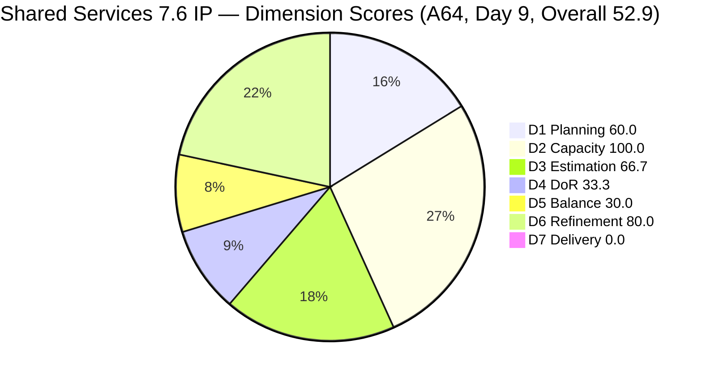
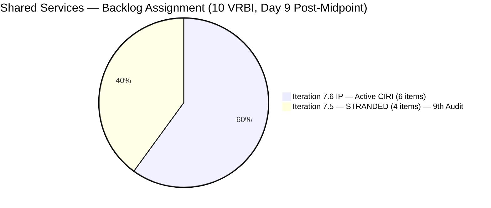
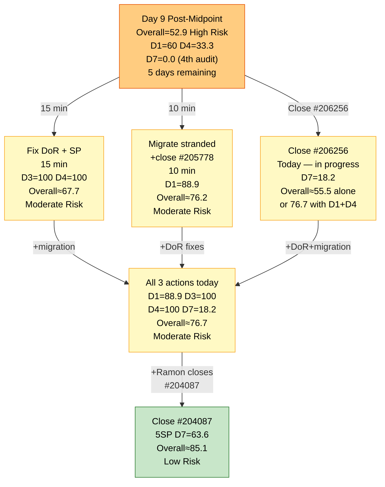

# ADO SAFe Audit — Shared Services Team

## 1. Audit Metadata

| Field | Value |
|---|---|
| **Audit Date** | 2026-06-23 09:03 UTC |
| **Sprint Day** | **9 of 14 (IP Iteration)** |
| **Prior Audit** | A63 — `AUDIT_20260622_0903.md` (Overall 52.9, High Risk — 7.6 IP Day 8) |
| **ADO Project** | Jairosoft Portfolio (`666bb99a-6acd-4999-bb34-efd0e4ea90dc`) |
| **ADO Team** | Shared Services Team (`bd9578fd-5773-48fc-bd80-988dfe5de806`) |
| **Iteration** | Iteration 7.6 (IP) (`42e165b7-e9aa-4150-8d6f-84043ef2482e`) |
| **Iteration Path** | `Jairosoft Portfolio\2026-PI7\Iteration 7.6 (IP)` |
| **Iteration Dates** | Jun 15, 2026 – Jun 28, 2026 |
| **Workspace Folder** | `ado_shared` |
| **Overall Score** | **52.9 — High Risk** |
| **Risk Band** | High (40–59.9) |
| **Visible Backlog Items (VRBI)** | 10 root items (unchanged) |
| **Current Iteration Root Items (CIRI)** | 6 items (IterationPath = Iteration 7.6 IP) |
| **Capacity** | Teofilo: 6h/day · Jaszmeine: 3h/day · Ramon: 0.5h/day = 15.5h/day total |

---

## 2. Executive Summary

The Shared Services Team remains at **52.9 — High Risk** on Day 9 of 14, unchanged from A63. This marks the **9th consecutive audit** in the High Risk band (A56–A64). Today brings exactly one signal of possible progress: **#206256 (Research Best Practices for Mikrotik Security) was touched at 07:20 UTC this morning** — the first activity on this item in 5 days — but its state remains **Active** (not Closed), so D7 = 0.0 continues unchanged.

All four chronic structural issues from A56–A63 persist without resolution on Day 9:
- **4 items stranded in Iteration 7.5** (#204082, #204205, #205195, #205778) — **9th consecutive audit**
- **4 of 6 CIRI items failing DoR** (#206256, #206112, #206149, #202947) — **9th audit for 3 of these items**
- **0 User Stories in CIRI** → D5 = 30.0 (Critical) — IP structural
- **D7 = 0.0** — **4th consecutive audit** with zero active CIRI deliveries

**The activity on #206256 today is a meaningful signal**: Teofilo is working on the Mikrotik research item. If he closes it before end-of-day, D7 rises to 18.2 and — combined with the pending DoR fixes and migration — the team could reach Moderate Risk today for the first time in 9 audits. Five sprint days remain. The governance window is closing.

---

## 3. Previous Audit Delta (A63 → A64)

| Dimension | A63 Score (7.6 IP Day 8) | A64 Score (7.6 IP Day 9) | Delta | Driver |
|---|---|---|---|---|
| D1 Iteration Planning | 60.0 | **60.0** | 0.0 | 6 CIRI / 10 VRBI = 60.0. 4 stranded items (#204082, #204205, #205195, #205778) remain in 7.5. No migrations. **9th consecutive audit.** |
| D2 Team Capacity | 100.0 | **100.0** | 0.0 | Teofilo 6h/day (5 CIRI), Ramon 0.5h/day (1 CIRI). Both configured. Jaszmeine: 3h/day, 0 CIRI items — **9th idle day.** |
| D3 Estimation | 66.7 | **66.7** | 0.0 | 4/6 estimated. Unestimated: #206149, #202947. No SP updates. Unchanged. |
| D4 DoR Compliance | 33.3 | **33.3** | 0.0 | 2 DCI / 6 CIRI. Pass: #204087, #204950. Fail: #206256 (9th audit), #206112 (7th audit), #206149 (9th audit), #202947 (9th audit). |
| D5 Work Item Balance | 30.0 | **30.0** | 0.0 | No User Story (−40) + Enabler 66.7% (−30). IP structural. Unchanged. |
| D6 Backlog Refinement | 80.0 | **80.0** | 0.0 | 10/10 fresh. Untouched CIRI: #206149, #204087, #202947, #204950 (all pre-iteration-start). 4/6 = 66.7% > 30% → -20. No change. |
| D7 Delivery Predictability | 0.0 | **0.0** | 0.0 | Active CIRI: 0 Closed. CSP=11SP, CLSP=0. Day 9 — **4th consecutive audit at D7=0.0**. |
| **Overall** | **52.9** | **52.9** | **0.0** | Zero change. #206256 touched today (07:20 UTC) but not closed. All chronic issues persist. **9th consecutive High Risk audit.** |

**Formula verification:** (60.0 + 100.0 + 66.7 + 33.3 + 30.0 + 80.0 + 0.0) / 7 = 370.0 / 7 = **52.9**

**Key observations A63 → A64:**
- **#206256 ChangedDate updated to Jun 23 07:20 UTC.** Teofilo interacted with this item this morning. The D6 untouched calculation updates: #206256 is no longer untouched (Jun 23 > Jun 15 start). However, D6 was already calculating #206256 as non-untouched based on its Jun 18 prior ChangedDate. Untouched count remains at 4 (#206149, #204087, #202947, #204950 — all still pre-iteration-start). D6 = 80.0 unchanged.
- **#206256 remains Active — not Closed.** The activity this morning is work-in-progress, not completion. D7 = 0.0. However, the activity signal suggests #206256 is in active work — closure today is realistic.
- **Zero other ADO changes.** No DoR fixes, no SP additions, no state transitions on any other item, no migrations from Iteration 7.5. This is the 9th consecutive audit with no deliberate remediation on any of the four chronic structural issues.
- **Jaszmeine's idle day count: 9.** Total wasted capacity: **27 team-hours** (9 days × 3h/day). Only one migration action separates her from having active work (#205195 → Iteration 7.6 IP).

---

## 4. Current Iteration Snapshot

| Metric | Value |
|---|---|
| **Sprint Day / Total** | **9 / 14 — Post-Midpoint** |
| **Visible Backlog Items (VRBI)** | 10 (unchanged from A63) |
| **Current Iteration Root Items (CIRI — active)** | 6 (IterationPath = `Jairosoft Portfolio\2026-PI7\Iteration 7.6 (IP)`) |
| **Stranded items (still in Iteration 7.5)** | 4 — (#204082, #204205, #205195, #205778) — **9th consecutive audit** |
| **Closed items in iteration (exited backlog)** | 3 with SP: #206850(1SP), #206434(2SP), #206943(2SP) on Day 5 |
| **Story Points Committed (CSP — estimated active CIRI)** | 11 SP (#206256=2, #206112=2, #204087=5, #204950=2) |
| **Story Points Closed (CLSP — active CIRI)** | 0 SP |
| **Sprint delivery to date (cumulative)** | 5 SP (items exited backlog on Day 5 — not counted in active CIRI D7) |
| **Sprint Day / Total** | **9 / 14 — Post-Midpoint** |
| **Team Size (distinct CIRI assignees)** | 2 (Teofilo: 5 items; Ramon: 1 item) |
| **Total Sprint Remaining Capacity** | ~77.5 hours (5 days × 15.5h/day) |
| **Iteration Start / Finish** | Jun 15, 2026 – Jun 28, 2026 |

**Active CIRI Items (6 — in Iteration 7.6 IP):**

| ID | Title | Type | State | SP | Assignee | DoR | ChangedDate | Notes |
|---|---|---|---|---|---|---|---|---|
| #206256 | Research Best Practices for Mikrotik Security | Enabler | Active | 2 | Teofilo | **Fail** (no Desc — 9th audit) | **Jun 23** | **TOUCHED TODAY 07:20 UTC — in active work** |
| #206112 | Gemini License Plan | Spike | Requirements Gathering | 2 | Teofilo | **Fail** (no Desc, no AC — 7th audit) | Jun 19 | 4 days since last change |
| #206149 | Enhance Mikrotik Security — Research and Implement | Enabler | Grooming | — | Teofilo | **Fail** (no AC — 9th audit) | Jun 11 | 12 days untouched (pre-iteration) |
| #204087 | PO — Jodex AI Enablement Sessions | Enabler | Active | 5 | Ramon | **Pass** | Jun 10 | 13 days untouched (pre-iteration) |
| #202947 | IT Support Services — End of PI 7 Feedback Survey | Spike | New | — | Teofilo | **Fail** (Desc ~16 NWS, no AC — 9th audit) | Jun 10 | 13 days untouched (pre-iteration) |
| #204950 | Monthly Costing Report — July 2026 | Enabler | New | 2 | Teofilo | **Pass** | Jun 10 | 13 days untouched (pre-iteration) |

**Stranded Items (4 — still in Iteration 7.5 — 9th Consecutive Audit):**

| ID | Title | Type | State | SP | Assignee | Consecutive Audit Count |
|---|---|---|---|---|---|---|
| #205778 | Action 2: Setup Frontend CI Gates | Defect | Passed UAT Testing | 2 | Teofilo | **9 audits (A56–A64) — GOVERNANCE BREACH** |
| #204082 | QA Jodex / AI Enablement Session | Enabler | Blocked | 5 | Ramon | 9 audits — Blocked, blocker undocumented |
| #204205 | Android Phone from US | Enabler | Active | 1 | Teofilo | 9 audits — not migrated |
| #205195 | [Retro] Alternative to Figma | Spike | Active | 1 | Jaszmeine | 9 audits — Jaszmeine idle 9 days |

---

## 5. Work Item Analysis

### DoR Assessment (6 active CIRI items)

| ID | Title | Desc ≥ 30 NWS | AC ≥ 20 NWS | Result | Audit Count |
|---|---|---|---|---|---|
| #206256 | Research Best Practices for Mikrotik Security | ✗ (Description field absent in API response — only AC present) | ✓ (checklist with certificate/password/L2TP/email items, ~180 NWS) | **Fail — Desc missing** | **9th** |
| #206112 | Gemini License Plan | ✗ (no Description field) | ✗ (no AC field) | **Fail — both missing** | **7th** |
| #206149 | Enhance Mikrotik Security — Research and Implement | ✓ (3-item numbered list: unique passwords, L2TP certificate, security config research, ~120 NWS) | ✗ (no AC field) | **Fail — AC missing** | **9th** |
| #204087 | PO — Jodex AI Enablement Sessions | ✓ (~180 NWS: hands-on AI Enablement session objective) | ✓ (4-item checklist: Environment Ready, Session Delivered, Artifacts Secured, Action Items Defined, ~200 NWS) | **Pass** | — |
| #202947 | IT Support Services — End of PI 7 Feedback Survey | ✗ ("Create a Duplicate" + hyperlink, ~16 NWS < 30 threshold) | ✗ (no AC field) | **Fail — Desc short, AC missing** | **9th** |
| #204950 | Monthly Costing Report — July 2026 | ✓ (12-item numbered list of cost categories, ~200 NWS) | ✓ (multi-section checklist: Cloud, SaaS, AI/API costing, ~400 NWS) | **Pass** | — |

**DCI = 2/6. D4 = 33.3. Unchanged for 9 consecutive audits.**

**URGENT — 9th-audit DoR remediation text (exact copy-paste into ADO — combined fix time: ~15 minutes):**

- **#206256 — Add Description (30 seconds):** *"Research and document Mikrotik security best practices including certificate-based L2TP authentication, unique user password enforcement, IP service restriction by source address, browser access controls, port scanner drop rules, DDoS protection, and email notifications for internet downtime and L2TP connection events."* NOTE: Teofilo is actively working on #206256 today — adding this description while the item is in progress is a 30-second action that eliminates a 9-audit DoR failure.

- **#206112 — Add Description + Acceptance Criteria (5 minutes):**
  - Description: *"Evaluate available Gemini license plans to identify the optimal tier for Jairosoft's AI workloads, considering team size, usage patterns, and monthly cost targets."*
  - AC: *"Gemini license options researched and compared in a cost matrix. Recommended tier documented and approved by Ramon. Implementation timeline and procurement steps proposed."*

- **#206149 — Add Acceptance Criteria (3 minutes):** *"All Mikrotik users have unique, non-default passwords changed. Pre-shared key replaced with certificate-based L2TP authentication. IP service source addresses restricted. Port scanner rules configured to drop. DDoS protection active. Email notifications configured for internet downtime and L2TP events. Configuration changes documented in SharePoint."*

- **#202947 — Expand Description + Add Acceptance Criteria (5 minutes):**
  - Description: *"Duplicate the Mid PI-06 IT Support Services Feedback Survey in Microsoft Forms to create an End-of-PI7 version. Update all iteration date references, question context, and distribution scope to reflect PI7 IT support consumers."*
  - AC: *"Microsoft Forms duplicate confirmed active and accessible. All date references updated from PI6 to PI7. Distribution list verified current. Form link distributed to all IT support consumer teams."*

**If all 4 fixes applied: DCI = 6/6, D4 = 100.0, D3 improves to 100.0 (adding SP to #206149 and #202947). Combined fix time: ~15 minutes.**

### Type Distribution (6 active CIRI items)

| Type | Count | Share | D5 Impact |
|---|---|---|---|
| Enabler | 4 (#206256, #206149, #204087, #204950) | 66.7% | Dominant type > 60% → **-30 penalty** |
| Spike | 2 (#206112, #202947) | 33.3% | Spike < 40% — no -20 penalty |
| User Story | 0 | 0.0% | **-40 PENALTY — No User Story in CIRI** |
| **Total** | **6** | **100%** | D5 = max(0, 100−40−30) = **30.0** |

D5 = 30.0 for all 9 IP sprint audits (A56–A64). IP iterations legitimately prioritize Enabler and Spike work over User Stories.

### Story Points Analysis — Active CIRI

| ID | Title | Type | SP | State | Notes |
|---|---|---|---|---|---|
| #206256 | Research Best Practices for Mikrotik Security | Enabler | 2 | Active | **Touched today (Jun 23 07:20 UTC). Lead closure candidate.** |
| #206112 | Gemini License Plan | Spike | 2 | Requirements Gathering | Changed Jun 19 — 4 days since last touch |
| #206149 | Enhance Mikrotik Security | Enabler | — | Grooming | **Unestimated** — suggest 3 SP |
| #204087 | PO — Jodex AI Enablement Sessions | Enabler | 5 | Active | Largest item; not touched since Jun 10 (13 days) |
| #202947 | IT Support Feedback Survey | Spike | — | New | **Unestimated** — suggest 1 SP |
| #204950 | Monthly Costing Report — July 2026 | Enabler | 2 | New | Not touched since Jun 10 (13 days) |

**Active CIRI estimated (SP > 0): #206256(2), #206112(2), #204087(5), #204950(2) = 4 items = 11 SP.**
**Active CIRI unestimated: #206149, #202947 = 2 items. Must have SP added before any work is executed.**

---

## 6. SAFe Compliance Scorecard

| Dimension | Score | Band | Evidence | Notes |
|---|---|---|---|---|
| D1 Iteration Planning | **60.0** | Moderate | 6 CIRI / 10 VRBI | 4 items stranded in 7.5 for **9 consecutive audits**. Migration path documented since A56 — still not executed. |
| D2 Team Capacity | **100.0** | Low | 2/2 active CIRI contributors | Teofilo 6h/day (5 CIRI), Ramon 0.5h/day (1 CIRI). Both configured. Jaszmeine: 3h/day — **9th idle day. 27 team-hours wasted.** |
| D3 Estimation | **66.7** | Moderate | 4/6 estimated | #206256(2), #206112(2), #204087(5), #204950(2) = 11SP. Unestimated: #206149, #202947. Unchanged since A56. |
| D4 DoR Compliance | **33.3** | Critical | 2 DCI / 6 CIRI | Pass: #204087, #204950. Fail: #206256 (**9th audit**), #206112 (7th), #206149 (**9th audit**), #202947 (**9th audit**). 15-min fix in Section 5. |
| D5 Work Item Balance | **30.0** | Critical | No US (−40) + Enabler 66.7% (−30) | No User Stories in CIRI. Compound penalty. IP iteration structural constraint. |
| D6 Backlog Refinement | **80.0** | Low | 10/10 fresh; 4/6 CIRI untouched | All 10 VRBI changed Jun 9–23 — all fresh. #206149(Jun11), #204087(Jun10), #202947(Jun10), #204950(Jun10) = untouched (pre-iteration). 4/6 = 66.7% > 30% → -20 penalty. |
| D7 Delivery Predictability | **0.0** | Critical | 0 SP closed / 11 SP committed | Active CIRI: 0 Closed. CSP=11SP, CLSP=0. Day 9 — **4th consecutive audit at D7=0.0**. #206256 in active work today. |
| **OVERALL** | **52.9** | **High Risk** | (60+100+66.7+33.3+30+80+0)/7 | Unchanged from A63. **9th consecutive High Risk audit.** #206256 activity today is the only signal of progress. |

**Formula verification:** (60.0 + 100.0 + 66.7 + 33.3 + 30.0 + 80.0 + 0.0) / 7 = 370.0 / 7 = **52.9**

---

## 7. Dimension Findings

### D1 — Iteration Planning: 60.0 / 100 — Moderate Risk

**Formula:** CIRI / VRBI × 100 = 6 / 10 × 100 = **60.0**

| Metric | Value |
|---|---|
| Visible root backlog items (VRBI) | 10 |
| Items in Iteration 7.6 (IP) — active (CIRI) | 6 |
| Items stranded in Iteration 7.5 | 4 (#204082, #204205, #205195, #205778) — **9th audit** |
| Score | **60.0** |

**Active migration path — documented since A56, still not executed (9th audit):**
- Close #205778 (Passed UAT Testing → Closed): VRBI = 9, item exits backlog
- Migrate #204205 and #205195 to Iteration 7.6 IP: CIRI = 8, VRBI = 9
- Defer #204082 (Blocked, 5SP) to PI8 backlog with documented blocker rationale
- **Result after migration: D1 = 8/9 = 88.9 — Low Risk**

At Day 9 with 5 days remaining, there are fewer iterations left to benefit from this fix. Yet completing it now would boost D1 by 28.9 points and, in combination with other fixes, could push the team into Moderate Risk or better.

---

### D2 — Team Capacity: 100.0 / 100 — Low Risk

**Formula:** CC / CW × 100 = 2 / 2 × 100 = **100.0**

| Contributor | Active CIRI Items | Capacity | Notes |
|---|---|---|---|
| Teofilo Limpag | 5 items (#206256, #206112, #206149, #202947, #204950) | 6h/day | **Working on #206256 today (touched 07:20 UTC).** #206149 in Grooming, #202947 in New. |
| RAMON ASENIERO JR | 1 item (#204087) | 0.5h/day | Jodex PO Enablement, Active state. #204082 blocked in 7.5. |
| Jaszmeine Villanueva | 0 CIRI items | 3h/day | **9th consecutive idle day. 27 team-hours wasted.** Only remaining stranded item: #205195 in 7.5. |

D2 = 100.0 is maintained by the 2 active contributors. Jaszmeine's idle status continues — the fix remains one migration action: move #205195 to Iteration 7.6 IP.

---

### D3 — Estimation: 66.7 / 100 — Moderate Risk

**Formula:** ECI / PECI × 100 = 4 / 6 × 100 = **66.7**

Unchanged from A56 (Day 1). Two items remain unestimated for 9 consecutive audits:
- **#206149** (Enhance Mikrotik Security, Grooming, no SP): suggested 3 SP
- **#202947** (IT Support Survey, New, no SP): suggested 1 SP

SP must be added before closing either item — otherwise D7 cannot credit the closure.

---

### D4 — DoR Compliance: 33.3 / 100 — Critical

**Formula:** DCI / CIRI × 100 = 2 / 6 × 100 = **33.3**

Unchanged from A56. **The single most actionable finding in this audit.** Three of the four failing items have been in DoR failure for 9 consecutive audit cycles. Full remediation text is in Section 5 with exact copy-paste content. Combined fix time: approximately 15 minutes.

**Today's signal:** Teofilo is actively working on #206256. While working on the research task, he can simultaneously add the single-sentence Description to that item. This 30-second action would reduce the DoR failure count from 4 to 3, and — if the other 3 items are also fixed — push D4 to 100.0 and D3 to 100.0.

**9-audit escalation.** The governance breach for #206256 (#206149, #202947) is now at the 9-audit mark. Documented process compliance failures at this scale require direct leadership intervention, not team-level prompting.

---

### D5 — Work Item Balance: 30.0 / 100 — Critical

**Formula:** Base 100 − penalties = max(0, 100 − 40 − 30) = **30.0**

| Penalty | Trigger | Applied |
|---|---|---|
| -40: No User Story in CIRI | **0 User Stories in 6 CIRI items** | **YES** |
| -30: Dominant type share > 60% | Enabler = 4/6 = **66.7%** > 60% | **YES** |
| -20: Spike share > 40% | Spike = 2/6 = 33.3% | **No** |

D5 = 30.0 for all 9 IP sprint audits (A56–A64). IP iterations legitimately prioritize Enabler and Spike work over User Stories. The absence of User Stories is appropriate for IP sprints in SAFe.

**Recommended Project Exception (still not added to workspace CLAUDE.md after 9 audits):**
*"IP (Innovation and Planning) iterations are legitimately infrastructure and planning-focused. Absence of User Stories in CIRI reflects appropriate IP scope separation, not an execution failure. D5 scores during IP sprints should be annotated as structural rather than remediable within the sprint."*

---

### D6 — Backlog Refinement: 80.0 / 100 — Low Risk

**Freshness window:** ChangedDate ≥ 2026-05-09 (45 days before 2026-06-23)

| Metric | Value |
|---|---|
| Total VRBI | 10 |
| Fresh items (ChangedDate ≥ May 9, 2026) | 10 — all items changed Jun 9–23 |
| Stale_90 items (ChangedDate < Mar 25, 2026) | 0 |
| Stale_180 items (ChangedDate < Dec 25, 2025) | 0 |
| Untouched CIRI (ChangedDate < Jun 15, 2026 — iteration start) | 4 (#206149 Jun 11, #204087 Jun 10, #202947 Jun 10, #204950 Jun 10) |

**Base = 10/10 × 100 = 100.0**
**Penalties:**
- Stale_90: 0% → No penalty
- Stale_180: 0 items → No penalty
- Untouched CIRI: 4/6 = 66.7% > 30% → **-20 penalty**

**Score: max(0, 100.0 − 20) = 80.0**

Note: #206256 was touched today (Jun 23 07:20 UTC), but it was already non-untouched in A63 (Jun 18 > Jun 15). The untouched count of 4 is unchanged from A63. Applying the DoR fixes from Section 5 would update ChangedDate on all 4 untouched CIRI items (#206149, #202947; #204087 and #204950 would be addressed if their fields were edited) — this would push the untouched ratio toward 0%, potentially restoring D6 to 100.0.

---

### D7 — Delivery Predictability: 0.0 / 100 — Critical

**Formula:** CLSP / CSP × 100 = 0 / 11 × 100 = **0.0**

| Metric | Value |
|---|---|
| Estimated active CIRI items (SP > 0) | 4 (#206256=2, #206112=2, #204087=5, #204950=2) |
| Committed Story Points (CSP) | 11 SP |
| Closed Story Points (CLSP) | 0 SP (no active CIRI items are Closed or Done) |
| Score | **0.0** |
| Consecutive audits at D7=0.0 | **4 (A61, A62, A63, A64)** |

**Today's signal:** #206256 was touched at 07:20 UTC — Teofilo is actively working on this item. If #206256 is closed today: CLSP = 2 SP, D7 = 2/11 × 100 = **18.2**. This alone would push Overall from 52.9 to (60+100+66.7+33.3+30+80+18.2)/7 = 388.2/7 = **55.5** (still High Risk, but the D7 barrier is broken). Combined with DoR fixes and migration (from Recs #2 and #3 below): the team could cross into Moderate Risk today.

**Recovery projections from Day 9:**

| Action | CLSP/CSP | D7 | Overall |
|---|---|---|---|
| Close #206256 (Active, 2SP) only | 2/11 | 18.2 | 55.5 (High Risk) |
| Close #206256 + DoR fixes (D4→100, D3→100) | 2/11 | 18.2 | **69.4 (Moderate Risk)** |
| Close #206256 + DoR + stranded migration (D1→88.9) | 2/11 | 18.2 | **76.2 (Moderate Risk)** |
| All fixes + close #204087 (5SP) | 7/11 | 63.6 | **85.1 (Low Risk)** |
| Full remediation + close all 4 estimated items (11SP) | 11/11 | 100.0 | **94.3 (Low Risk — theoretical max)** |

---

## 8. Risks and Bottlenecks

| # | Severity | Dimension | Risk | Recommended Action |
|---|---|---|---|---|
| R1 | **CRITICAL** | All — sprint trajectory | Day 9 = post-midpoint. Only 5 sprint days remain. Zero measurable deliberate improvement across 9 consecutive audits. Score = 52.9. The team is on track to end the IP sprint in High Risk for the first time in this workspace's audit history. | **TODAY — GOVERNANCE ESCALATION:** Ramon convenes a mandatory 30-minute sync with Teofilo. All ADO fixes can be applied in a single session. This is a governance requirement, not an advisory. |
| R2 | **CRITICAL** | D1 (9th Audit) | 4 items stranded in Iteration 7.5 for 9 consecutive audits. Migration path documented since A56. Scope: 3 actions (close #205778, migrate #204205 + #205195, defer #204082 to PI8). | **TODAY (10 min):** Close #205778 (1 click — Passed UAT → Closed). Migrate #204205 and #205195 to Iteration 7.6 IP. Defer #204082 to PI8 with a blocker comment. D1 → 88.9. |
| R3 | **CRITICAL** | D4 (9th Audit) | 4 items with persistent DoR failures. #206256 requires a single 30-second sentence — Teofilo is working on it RIGHT NOW. Nine audit cycles without action on a 30-second fix. | **TODAY (15 min):** Apply exact text from Section 5. D4 → 100.0, D3 → 100.0 (with SP additions). |
| R4 | **CRITICAL** | D7 | D7 = 0.0 for 4th consecutive audit. 11 SP committed, 0 closed in active CIRI. #206256 has been Active for the full sprint — Teofilo is working on it today. | **TODAY:** Teofilo closes #206256 (Research Mikrotik, Active, 2SP). D7 → 18.2. Combined with R2+R3: Overall ≈ **76.2 — Moderate Risk**. |
| R5 | **HIGH** | #205778 (9th Audit) | Defect "Setup Frontend CI Gates" in "Passed UAT Testing" state for 9 audits. Zero execution. This is the longest-running one-click fix in this workspace's audit history. | **IMMEDIATE (30 seconds):** Teofilo or Ramon sets state to Closed. 9-audit governance breach. |
| R6 | **HIGH** | Jaszmeine — 9th idle day | 3h/day × 9 days = **27 team-hours wasted**. Zero active CIRI items. One migration resolves this. | Migrate #205195 to Iteration 7.6 IP (part of R2 remediation). |
| R7 | **HIGH** | D3 | #206149 and #202947 unestimated for 9 consecutive audits. | Add SP (included in DoR fix from R3). #206149 = 3 SP, #202947 = 1 SP. D3 → 100.0. |
| R8 | **MODERATE** | D7 trajectory | 5 days remain. If #206256 is not closed by EOD Jun 23, the IP sprint will very likely end in High Risk (D7 approaching 0). | Monitor: if no closure by Jun 23 EOD, Ramon personally accelerates closure of highest-SP active item. |
| R9 | **LOW** | D5 — IP structural | D5 = 30.0 for 9 consecutive audits. Project Exception still undocumented in `ado_shared/CLAUDE.md` after 9 audits. | Add Project Exception text (see Section 7 D5 finding) to `ado_shared/CLAUDE.md`. Separates structural from remediable findings. |

---

## 9. Prioritized Recommendations

1. **[IMMEDIATE — 30 SECONDS — R5]** Teofilo or Ramon sets #205778 (Setup Frontend CI Gates, Passed UAT Testing) to **Closed**. This item has been waiting for a single click for 9 audit cycles (every audit since A56). There is no legitimate reason this remains open. VRBI drops to 9.

2. **[TODAY — 10 MIN — R2 + D1 recovery]** Execute the 3-action migration plan:
   - Close #205778 (see Rec #1): VRBI = 9
   - Migrate #204205 (Android Phone, Teofilo, 1SP) and #205195 ([Retro] Figma Alternative, Jaszmeine, 1SP) to Iteration 7.6 IP: CIRI = 8, VRBI = 9
   - Defer #204082 (Blocked, Ramon, 5SP) to PI8 backlog — add ADO comment: dependency owner, contact, and ETA.
   - **Result: D1 = 8/9 = 88.9 — Low Risk**

3. **[TODAY — 15 MIN — R3 + D4 + D3 recovery]** Apply DoR fixes using exact text from Section 5:
   - **#206256**: Add 1-sentence Description while Teofilo is actively working on it (30 sec)
   - **#206112**: Add Description + AC (5 min)
   - **#206149**: Add AC + 3 SP (3 min)
   - **#202947**: Expand Desc + add AC + 1 SP (5 min)
   - **Result: D3 = 100.0, D4 = 100.0**

4. **[TODAY — D7 recovery — R4]** Teofilo closes #206256 (Research Best Practices for Mikrotik Security, Active, 2SP — already being worked today):
   - D7 = 2/11 × 100 = 18.2
   - Combined with Recs #1–3: Overall ≈ **(60+100+100+100+30+100+18.2)/7 = 508.2/7 = 72.6 — Moderate Risk** (accounting for D1 migration improvement: (88.9+100+100+100+30+100+18.2)/7 = 537.1/7 = **76.7 — Moderate Risk**)

5. **[THIS WEEK — D7 major recovery]** Ramon closes #204087 (PO Jodex AI Enablement Sessions, Active, 5SP). This is the highest-SP item in active CIRI. Combined with Recs #1–4: CLSP = 7 SP → D7 = 63.6 → Combined Overall ≈ **85.1 — Low Risk**.

6. **[WORKSPACE MAINTENANCE]** Add Project Exception to `ado_shared/CLAUDE.md`:
   *"IP (Innovation and Planning) iterations are legitimately infrastructure and planning-focused. Absence of User Stories in CIRI reflects appropriate IP scope separation, not an execution failure. D5 scores during IP sprints should be annotated as structural rather than remediable within the sprint."*

7. **[PROCESS — PERMANENT]** Mandatory "DoR + SP at item creation" rule enforced by Ramon. 9 consecutive DoR failures on the same items is a systemic process failure. Implement: no work item is assigned to an active iteration without Description ≥ 30 NWS + AC ≥ 20 NWS + SP > 0.

---

## 10. Evidence Gaps and Limitations

| Gap | Impact | Notes |
|---|---|---|
| **D7 = 0.0 — formula scope vs. sprint delivery** | Score understatement | Formula counts only active CIRI. Sprint cumulative delivery = 5 SP from 3 closed items (Day 5). Recovery depends on next active-CIRI closure. |
| **#206256 closure status (as of 09:03 UTC)** | D7 may update today | Item was touched at 07:20 UTC — 1 hour 43 minutes before this audit timestamp. If Teofilo closes #206256 later today, D7 changes to 18.2 and Overall to ~55.5 (or higher if combined with DoR/migration fixes). |
| **#205198 exit reason** | Historical context | Previously exited the backlog; understood as closed/out-of-scope. Does not affect current audit. |
| **#204082 blocker undocumented (9th audit)** | 5 SP committed to undeliverable work | Ramon's Jodex QA item has been Blocked for 9 audits with no ADO comment on the blocker, owner, or ETA. |
| **D5 = 30.0 — IP structural constraint** | 9 audits at Critical | Formal Project Exception recommended since A57. Still not added to `ado_shared/CLAUDE.md`. |
| **Jaszmeine capacity waste** | 27 team-hours = 9 days × 3h/day | Resolvable with migration of #205195 to 7.6 IP. |
| **D6 untouched items** | -20 D6 penalty | Applying DoR fixes would update ChangedDate on #206149, #202947 — reducing untouched count and potentially restoring D6 = 100.0. |

---

## 11. Visualizations

### Score Trend — A56 through A64 (9-Audit High Risk Band)

```mermaid
graph LR
    A56["A56 — IP Day 1\n48.4 — High"]
    A59["A59 — IP Day 4\n53.1 — High"]
    A60["A60 — IP Day 5\n56.5 — High\n3 closures D7=31.3"]
    A61["A61 — IP Day 6\n52.1 — High\nD7 reset 0.0"]
    A62["A62 — IP Day 7\n52.1 — High\nMIDPOINT\nNo activity"]
    A63["A63 — IP Day 8\n52.9 — High\n#205198 exited\nD1 +5.5 passive"]
    A64["A64 — IP Day 9\n52.9 — High\n#206256 touched\nbut not closed\nD7 still 0.0"]
    A56 -->|"..."| A59 -->|"+3.4"| A60 -->|"-4.4\nD7 reset"| A61 -->|"0.0"| A62 -->|"+0.8\nPassive"| A63 -->|"0.0\nActivity\nno closure"| A64
    style A56 fill:#FFCC80,stroke:#E65100,color:#000
    style A59 fill:#FFCC80,stroke:#E65100,color:#000
    style A60 fill:#FFCC80,stroke:#E65100,color:#000
    style A61 fill:#FFCC80,stroke:#E65100,color:#000
    style A62 fill:#FFCC80,stroke:#E65100,color:#000
    style A63 fill:#FFCC80,stroke:#E65100,color:#000
    style A64 fill:#FFCC80,stroke:#E65100,color:#000
```

### Dimension Scores — A64 (Day 9, Overall 52.9)

### Backlog Distribution — VRBI Breakdown (Day 9)

### Recovery Path — Post-Midpoint Scenarios (Day 9)

---

## 12. Audit Trail

| Source | Tool | Data |
|---|---|---|
| Current iteration | `work_list_team_iterations` (project `666bb99a`, team `bd9578fd`, timeframe=current) | Iteration 7.6 (IP): Jun 15–28, 2026; ID `42e165b7-e9aa-4150-8d6f-84043ef2482e` |
| Team capacity | `work_get_iteration_capacities` (project `666bb99a`, iterationId `42e165b7`) | Shared Services Team: 15.5h/day total (Teofilo 6h, Jaszmeine 3h, Ramon 0.5h) |
| Backlog items | `wit_list_backlog_work_items` (project `666bb99a`, team `bd9578fd`, backlogId `Microsoft.RequirementCategory`) | 10 root items: #202947, #204082, #204087, #204205, #204950, #205195, #205778, #206112, #206149, #206256 |
| Work item details | `wit_get_work_items_batch_by_ids` (10 items) | State, SP, Type, Desc, AC, ChangedDate, IterationPath, AssignedTo confirmed for all items |
| Prior audit | `AUDIT_20260622_0903.md` (A63) | Overall 52.9, High Risk, 7.6 IP Day 8, 6 active CIRI, 11 SP committed, 0 SP closed |
| ADO org | `jairo` (dev.azure.com/jairo) | Jairosoft Portfolio ID: `666bb99a-6acd-4999-bb34-efd0e4ea90dc` |
