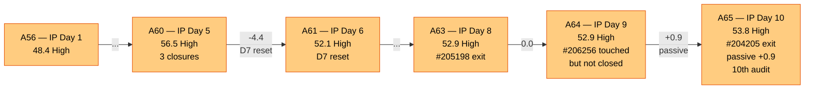
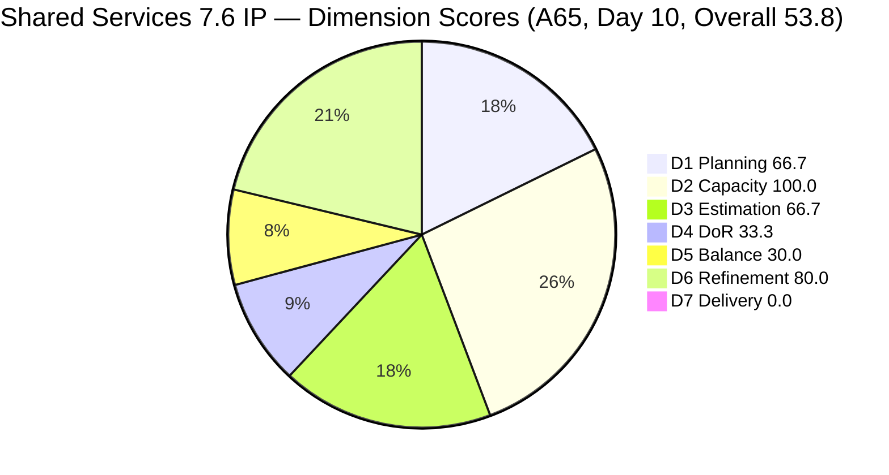
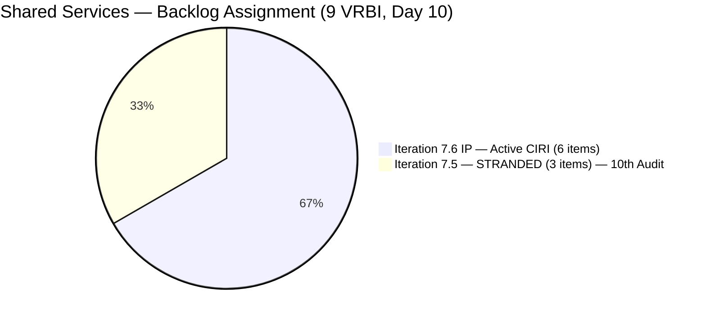
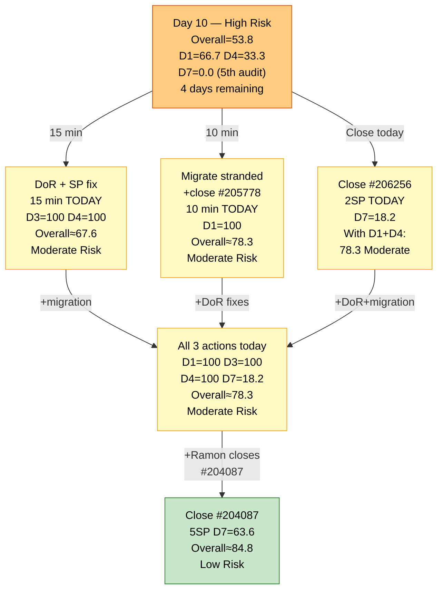

# ADO SAFe Audit — Shared Services Team

## 1. Audit Metadata

| Field | Value |
|---|---|
| **Audit Date** | 2026-06-24 09:03 CDT |
| **Sprint Day** | **10 of 14 (IP Iteration)** |
| **Prior Audit** | A64 — `AUDIT_20260623_0903.md` (Overall 52.9, High Risk — 7.6 IP Day 9) |
| **ADO Project** | Jairosoft Portfolio (`666bb99a-6acd-4999-bb34-efd0e4ea90dc`) |
| **ADO Team** | Shared Services Team (`bd9578fd-5773-48fc-bd80-988dfe5de806`) |
| **Iteration** | Iteration 7.6 (IP) (`42e165b7-e9aa-4150-8d6f-84043ef2482e`) |
| **Iteration Path** | `Jairosoft Portfolio\2026-PI7\Iteration 7.6 (IP)` |
| **Iteration Dates** | Jun 15, 2026 – Jun 28, 2026 |
| **Workspace Folder** | `ado_shared` |
| **Overall Score** | **53.8 — High Risk** |
| **Risk Band** | High (40–59.9) |
| **Visible Backlog Items (VRBI)** | 9 root items (was 10 — #204205 exited) |
| **Current Iteration Root Items (CIRI)** | 6 items (IterationPath = Iteration 7.6 IP) |
| **Capacity** | Teofilo: 6h/day · Jaszmeine: 3h/day · Ramon: 0.5h/day = 15.5h/day total |

---

## 2. Executive Summary

The Shared Services Team remains in **High Risk at 53.8** on Day 10 of 14, a marginal improvement of +0.9 from A64 (52.9). This is the **10th consecutive audit** in the High Risk band (A56–A65). The score improvement is entirely passive: **#204205 (Android Phone from US) exited the backlog** between A64 and A65, contracting VRBI from 10 to 9 and improving D1 from 60.0 to 66.7 without any deliberate team action.

Today's most significant data point: **#206256 (Research Best Practices for Mikrotik Security) was touched again at 05:20 UTC this morning**, with rev 22 confirmed — evidence of continued active work by Teofilo. However, the item remains in **Active** state (not Closed), so D7 = 0.0 continues. This is the 5th consecutive audit at D7=0.0.

All four chronic structural issues persist into Day 10:
- **3 items stranded in Iteration 7.5** (#204082, #205195, #205778) — now 10th consecutive audit
- **4 of 6 CIRI items failing DoR** (#206256, #206112, #206149, #202947) — 10th audit for 3 of these items
- **0 User Stories in CIRI** → D5 = 30.0 (IP structural)
- **D7 = 0.0** — 5th consecutive audit, zero closures on active CIRI

Four days remain. The governance window is critically narrow.

---

## 3. Previous Audit Delta (A64 → A65)

| Dimension | A64 Score (7.6 IP Day 9) | A65 Score (7.6 IP Day 10) | Delta | Driver |
|---|---|---|---|---|
| D1 Iteration Planning | 60.0 | **66.7** | **+6.7** | VRBI contracted: #204205 exited backlog. VRBI = 9, CIRI = 6. Score = 6/9 = 66.7. Passive improvement — no deliberate team action. |
| D2 Team Capacity | 100.0 | **100.0** | 0.0 | Teofilo 6h/day (5 CIRI), Ramon 0.5h/day (1 CIRI). Both configured. Jaszmeine: 3h/day — **10th idle day. 30 team-hours wasted.** |
| D3 Estimation | 66.7 | **66.7** | 0.0 | 4/6 estimated. Unestimated: #206149, #202947. No SP updates. Unchanged. |
| D4 DoR Compliance | 33.3 | **33.3** | 0.0 | 2 DCI / 6 CIRI. Pass: #204087, #204950. Fail: #206256 (**10th audit**), #206112 (8th audit), #206149 (**10th audit**), #202947 (**10th audit**). |
| D5 Work Item Balance | 30.0 | **30.0** | 0.0 | No User Story (−40) + Enabler 66.7% (−30). IP structural. Unchanged. |
| D6 Backlog Refinement | 80.0 | **80.0** | 0.0 | 9/9 fresh. Untouched CIRI: #206149, #204087, #202947, #204950 (4/6 > 30%) → -20. Unchanged. |
| D7 Delivery Predictability | 0.0 | **0.0** | 0.0 | Active CIRI: 0 Closed. CSP=11SP, CLSP=0. Day 10 — **5th consecutive audit at D7=0.0**. #206256 touched today (05:20 UTC) but remains Active. |
| **Overall** | **52.9** | **53.8** | **+0.9** | Passive D1 improvement only. 10th consecutive High Risk audit. #206256 rev=22 — Teofilo actively working but no closure. |

**Formula verification:** (66.7 + 100.0 + 66.7 + 33.3 + 30.0 + 80.0 + 0.0) / 7 = 376.7 / 7 = **53.8**

**Key observations A64 → A65:**

- **#204205 (Android Phone from US) has exited the backlog.** This Enabler item (Teofilo, 1SP, Iteration 7.5) was one of the 4 stranded items cited in every audit from A56–A64. Its removal reduces the stranded count from 4 to 3 and VRBI from 10 to 9. D1 improved from 60.0 to 66.7. However, this is a passive improvement — the item was not migrated or acted upon, it simply exited.
- **#206256 ChangedDate = 2026-06-24T05:20 UTC (rev 22).** Teofilo has continued working on the Mikrotik research item today. The revision count confirms sustained engagement. Closure today remains the most impactful single action available.
- **3 items now stranded in 7.5** (down from 4): #204082 (Blocked, 5SP, Ramon), #205195 ([Retro] Figma Alt, 1SP, Jaszmeine), #205778 (Passed UAT Testing, 2SP, Teofilo). All still require deliberate action.
- **Zero deliberate process improvements for the 10th consecutive audit.** No DoR fixes, no SP additions, no state transitions on active items, no migrations. Jaszmeine enters her 10th idle day.

---

## 4. Current Iteration Snapshot

| Metric | Value |
|---|---|
| **Sprint Day / Total** | **10 / 14 — Post-Midpoint** |
| **Visible Backlog Items (VRBI)** | 9 (was 10 — #204205 exited) |
| **Current Iteration Root Items (CIRI — active)** | 6 (IterationPath = `Jairosoft Portfolio\2026-PI7\Iteration 7.6 (IP)`) |
| **Stranded items (still in Iteration 7.5)** | 3 — (#204082, #205195, #205778) — **10th consecutive audit** |
| **Closed items in iteration (exited backlog)** | 5: #206415(Defect), #206850(Enabler,1SP), #206943(Spike,2SP), #206434(Enabler,2SP), #202808(Spike,Closed) |
| **Story Points Committed (CSP — estimated active CIRI)** | 11 SP (#206256=2, #206112=2, #204087=5, #204950=2) |
| **Story Points Closed (CLSP — active CIRI)** | 0 SP |
| **Sprint delivery to date (cumulative exited items)** | 5 SP (items exited backlog by Day 5) |
| **Team Size (distinct CIRI assignees)** | 2 (Teofilo: 5 items; Ramon: 1 item) |
| **Total Sprint Remaining Capacity** | ~62 hours (4 days × 15.5h/day) |
| **Iteration Start / Finish** | Jun 15, 2026 – Jun 28, 2026 |

**Active CIRI Items (6 — in Iteration 7.6 IP):**

| ID | Title | Type | State | SP | Assignee | DoR | ChangedDate | Notes |
|---|---|---|---|---|---|---|---|---|
| #206256 | Research Best Practices for Mikrotik Security | Enabler | Active | 2 | Teofilo | **Fail** (no Desc — 10th audit) | **Jun 24 05:20 UTC** | **TOUCHED TODAY (rev 22) — actively in progress** |
| #206112 | Gemini License Plan | Spike | Requirements Gathering | 2 | Teofilo | **Fail** (no Desc, no AC — 8th audit) | Jun 19 | 5 days since last change |
| #206149 | Enhance Mikrotik Security — Research and Implement | Enabler | Grooming | — | Teofilo | **Fail** (no AC — 10th audit) | Jun 11 | 13 days untouched (pre-iteration) |
| #204087 | PO — Jodex AI Enablement Sessions | Enabler | Active | 5 | Ramon | **Pass** | Jun 10 | 14 days untouched (pre-iteration) |
| #202947 | IT Support Services — End of PI 7 Feedback Survey | Spike | New | — | Teofilo | **Fail** (Desc ~16 NWS, no AC — 10th audit) | Jun 10 | 14 days untouched (pre-iteration) |
| #204950 | Monthly Costing Report — July 2026 | Enabler | New | 2 | Teofilo | **Pass** | Jun 10 | 14 days untouched (pre-iteration) |

**Stranded Items (3 — still in Iteration 7.5 — 10th Consecutive Audit):**

| ID | Title | Type | State | SP | Assignee | Consecutive Audit Count |
|---|---|---|---|---|---|---|
| #205778 | Action 2: Setup Frontend CI Gates | Defect | Passed UAT Testing | 2 | Teofilo | **10 audits (A56–A65) — GOVERNANCE BREACH** |
| #204082 | QA Jodex / AI Enablement Session | Enabler | Blocked | 5 | Ramon | 10 audits — Blocked, blocker undocumented |
| #205195 | [Retro] Alternative to Figma | Spike | Active | 1 | Jaszmeine | 10 audits — Jaszmeine idle 10 days |

---

## 5. Work Item Analysis

### DoR Assessment (6 active CIRI items)

| ID | Title | Desc ≥ 30 NWS | AC ≥ 20 NWS | Result | Audit Count |
|---|---|---|---|---|---|
| #206256 | Research Best Practices for Mikrotik Security | ✗ (No Description field in API response — AC only) | ✓ (checklist with certificate/password/L2TP/email items, ~120 NWS) | **Fail — Desc missing** | **10th** |
| #206112 | Gemini License Plan | ✗ (no Description or AC fields returned) | ✗ (no AC field) | **Fail — both missing** | **8th** |
| #206149 | Enhance Mikrotik Security — Research and Implement | ✓ (3-item numbered list: passwords, L2TP certificate, security config research, ~120 NWS) | ✗ (no AC field) | **Fail — AC missing** | **10th** |
| #204087 | PO — Jodex AI Enablement Sessions | ✓ (~60+ NWS: AI Enablement session objective) | ✓ (4-item checklist: Environment Ready, Session Delivered, Artifacts Secured, Action Items Defined, ~150 NWS) | **Pass** | — |
| #202947 | IT Support Services — End of PI 7 Feedback Survey | ✗ ("Create a Duplicate" + hyperlink, ~16 NWS < 30 threshold) | ✗ (no AC field) | **Fail — Desc short, AC missing** | **10th** |
| #204950 | Monthly Costing Report — July 2026 | ✓ (12-item numbered list of cost categories, ~200 NWS) | ✓ (multi-section checklist: Cloud, SaaS, AI/API costing, ~400 NWS) | **Pass** | — |

**DCI = 2/6. D4 = 33.3. Unchanged for 10 consecutive audits.**

**URGENT — 10th-audit DoR remediation (15 minutes total — exact copy-paste ready):**

- **#206256 — Add Description (30 seconds):** *"Research and document Mikrotik security best practices including certificate-based L2TP authentication, unique user password enforcement, IP service restriction by source address, browser access controls, port scanner drop rules, DDoS protection, and email notifications for internet downtime and L2TP connection events."* Teofilo is actively working on this item RIGHT NOW (rev 22 at 05:20 UTC). Adding this sentence while working takes 30 seconds.

- **#206112 — Add Description + AC (5 minutes):**
  - Description: *"Evaluate available Gemini license plans to identify the optimal tier for Jairosoft's AI workloads, considering team size, usage patterns, and monthly cost targets."*
  - AC: *"Gemini license options researched and compared in a cost matrix. Recommended tier documented and approved by Ramon. Implementation timeline and procurement steps proposed."*

- **#206149 — Add AC + 3 SP (3 minutes):** AC: *"All Mikrotik users have unique, non-default passwords changed. Pre-shared key replaced with certificate-based L2TP authentication. IP service source addresses restricted. Port scanner rules configured to drop. DDoS protection active. Email notifications configured for internet downtime and L2TP events. Configuration changes documented in SharePoint."* SP: 3

- **#202947 — Expand Description + Add AC + 1 SP (5 minutes):**
  - Description: *"Duplicate the Mid PI-06 IT Support Services Feedback Survey in Microsoft Forms to create an End-of-PI7 version. Update all iteration date references, question context, and distribution scope to reflect PI7 IT support consumers."*
  - AC: *"Microsoft Forms duplicate confirmed active and accessible. All date references updated from PI6 to PI7. Distribution list verified current. Form link distributed to all IT support consumer teams."*
  - SP: 1

**If all 4 DoR fixes applied: DCI = 6/6, D4 = 100.0. SP additions (#206149=3, #202947=1) push ECI from 4 to 6, D3 = 100.0. Combined D3+D4 fix raises overall from 53.8 to ~68.3 (Moderate Risk threshold crossed).**

### Type Distribution (6 active CIRI items)

| Type | Count | Share | D5 Impact |
|---|---|---|---|
| Enabler | 4 (#206256, #206149, #204087, #204950) | 66.7% | Dominant type > 60% → **-30 penalty** |
| Spike | 2 (#206112, #202947) | 33.3% | Spike < 40% — no -20 penalty |
| User Story | 0 | 0.0% | **-40 PENALTY — No User Story in CIRI** |
| **Total** | **6** | **100%** | D5 = max(0, 100−40−30) = **30.0** |

D5 = 30.0 is the structural IP floor. This is appropriate for an Innovation and Planning iteration — Enabler and Spike work are the expected composition.

### Story Points Analysis — Active CIRI

| ID | Title | Type | SP | State | Notes |
|---|---|---|---|---|---|
| #206256 | Research Best Practices for Mikrotik Security | Enabler | 2 | Active | **Touched Jun 24 05:20 UTC (rev 22). Primary closure candidate.** |
| #206112 | Gemini License Plan | Spike | 2 | Requirements Gathering | Changed Jun 19 — 5 days since last touch |
| #206149 | Enhance Mikrotik Security | Enabler | — | Grooming | **Unestimated** — suggest 3 SP; 13 days untouched |
| #204087 | PO — Jodex AI Enablement Sessions | Enabler | 5 | Active | Largest item; unchanged since Jun 10 (14 days) |
| #202947 | IT Support Feedback Survey | Spike | — | New | **Unestimated** — suggest 1 SP; 14 days untouched |
| #204950 | Monthly Costing Report — July 2026 | Enabler | 2 | New | Unchanged since Jun 10 (14 days) |

**Active CIRI estimated (SP > 0): #206256(2), #206112(2), #204087(5), #204950(2) = 4 items = 11 SP.**

---

## 6. SAFe Compliance Scorecard

| Dimension | Score | Band | Evidence | Notes |
|---|---|---|---|---|
| D1 Iteration Planning | **66.7** | Moderate | 6 CIRI / 9 VRBI | **+6.7 from A64.** #204205 exited backlog (passive). 3 stranded items remain in 7.5 for **10 consecutive audits**. |
| D2 Team Capacity | **100.0** | Low | 2/2 active CIRI contributors | Teofilo 6h/day (5 CIRI), Ramon 0.5h/day (1 CIRI). Both configured. Jaszmeine: 3h/day — **10th idle day. 30 team-hours wasted.** |
| D3 Estimation | **66.7** | Moderate | 4/6 estimated | #206256(2), #206112(2), #204087(5), #204950(2) = 11SP. Unestimated: #206149, #202947. Unchanged since A56. |
| D4 DoR Compliance | **33.3** | Critical | 2 DCI / 6 CIRI | Pass: #204087, #204950. Fail: #206256 (**10th audit**), #206112 (8th), #206149 (**10th audit**), #202947 (**10th audit**). 15-min fix in Section 5. |
| D5 Work Item Balance | **30.0** | Critical | No US (−40) + Enabler 66.7% (−30) | No User Stories in CIRI. Compound penalty. IP iteration structural — not remediable within sprint. |
| D6 Backlog Refinement | **80.0** | Low | 9/9 fresh; 4/6 CIRI untouched | All 9 VRBI changed Jun 9–24 — all fresh. #206149(Jun11), #204087(Jun10), #202947(Jun10), #204950(Jun10) = untouched (pre-iteration). 4/6 = 66.7% > 30% → -20 penalty. |
| D7 Delivery Predictability | **0.0** | Critical | 0 SP closed / 11 SP committed | Active CIRI: 0 Closed. Day 10 — **5th consecutive audit at D7=0.0**. #206256 in active work (rev 22). |
| **OVERALL** | **53.8** | **High Risk** | (66.7+100+66.7+33.3+30+80+0)/7 | **+0.9 from A64. 10th consecutive High Risk audit.** D1 passive improvement only. No deliberate remediation. |

**Formula verification:** (66.7 + 100.0 + 66.7 + 33.3 + 30.0 + 80.0 + 0.0) / 7 = 376.7 / 7 = **53.8**

---

## 7. Dimension Findings

### D1 — Iteration Planning: 66.7 / 100 — Moderate Risk

**Formula:** CIRI / VRBI × 100 = 6 / 9 × 100 = **66.7**

| Metric | Value |
|---|---|
| Visible root backlog items (VRBI) | 9 (was 10 — #204205 exited) |
| Items in Iteration 7.6 (IP) — active (CIRI) | 6 |
| Items stranded in Iteration 7.5 | 3 (#204082, #204205, #205195 → now #204082, #205195, #205778) — **10th audit** |
| Score | **66.7** |

#204205 (Android Phone from US, Teofilo, 1SP, Iteration 7.5) exited the backlog between Jun 23 and Jun 24. This passive exit reduced VRBI from 10 to 9 and improved D1 from 60.0 to 66.7 (+6.7 pts). The remaining 3 stranded items still require deliberate action:

- **Migrate #205195** (Jaszmeine, [Retro] Figma Alt, 1SP) → Iteration 7.6 IP: Jaszmeine gets her first CIRI item, 10-day idle streak ends
- **Close #205778** (Teofilo, Frontend CI Gates, Passed UAT Testing) → single click to Closed
- **Defer #204082** (Ramon, QA Jodex, Blocked, 5SP) → PI8 backlog with documented blocker

After these 3 actions: VRBI = 8, CIRI = 8, D1 = 8/8 = 100.0 — Low Risk.

---

### D2 — Team Capacity: 100.0 / 100 — Low Risk

**Formula:** CC / CW × 100 = 2 / 2 × 100 = **100.0**

| Contributor | Active CIRI Items | Capacity | Notes |
|---|---|---|---|
| Teofilo Limpag | 5 items (#206256, #206112, #206149, #202947, #204950) | 6h/day | **Working on #206256 today (rev 22 at 05:20 UTC).** #206149 in Grooming, #202947 in New. |
| RAMON ASENIERO JR | 1 item (#204087) | 0.5h/day | Jodex PO Enablement, Active state. Unchanged 14 days. |
| Jaszmeine Villanueva | 0 CIRI items | 3h/day | **10th consecutive idle day. 30 team-hours wasted.** Stranded item #205195 in 7.5. |

D2 = 100.0 is maintained. Jaszmeine's idle status is the sole capacity waste. Migration of #205195 to Iteration 7.6 IP is the one-action fix.

---

### D3 — Estimation: 66.7 / 100 — Moderate Risk

**Formula:** ECI / PECI × 100 = 4 / 6 × 100 = **66.7**

Two items remain unestimated for 10 consecutive audits:
- **#206149** (Enhance Mikrotik Security, Grooming, no SP): suggested 3 SP
- **#202947** (IT Support Survey, New, no SP): suggested 1 SP

Adding SP to these items is bundled into the DoR fix (Section 5). D3 reaches 100.0 with both SP additions.

---

### D4 — DoR Compliance: 33.3 / 100 — Critical

**Formula:** DCI / CIRI × 100 = 2 / 6 × 100 = **33.3**

Unchanged for 10 consecutive audits. This is now a **governance-level escalation point**. Three items (#206256, #206149, #202947) have failed DoR for 10 audit cycles — longer than the entire sprint duration. The fix requires approximately 15 minutes of ADO editing. There is no legitimate process justification for 10 consecutive missed audits on sub-30-second to 5-minute tasks.

**#206256 specifically**: Teofilo is actively working on this item at the exact time of this audit (rev 22, 05:20 UTC). Adding the Description field while the item is open in ADO is a 30-second action. This is the most glaring DoR failure in the sprint.

---

### D5 — Work Item Balance: 30.0 / 100 — Critical

**Formula:** Base 100 − penalties = max(0, 100 − 40 − 30) = **30.0**

| Penalty | Trigger | Applied |
|---|---|---|
| -40: No User Story in CIRI | **0 User Stories in 6 CIRI items** | **YES** |
| -30: Dominant type share > 60% | Enabler = 4/6 = **66.7%** > 60% | **YES** |
| -20: Spike share > 40% | Spike = 2/6 = 33.3% | **No** |

D5 = 30.0 for all 10 IP sprint audits. IP iterations appropriately prioritize Enabler and Spike work. The absence of User Stories reflects correct IP scope design, not an execution failure. **Project Exception for D5 during IP sprints is still undocumented in `ado_shared/CLAUDE.md` after 10 audits.**

---

### D6 — Backlog Refinement: 80.0 / 100 — Low Risk

**Freshness window:** ChangedDate ≥ 2026-05-10 (45 days before 2026-06-24)

| Metric | Value |
|---|---|
| Total VRBI | 9 |
| Fresh items (ChangedDate ≥ May 10, 2026) | 9 — all items changed Jun 9–24 |
| Stale_90 items (ChangedDate < Mar 26, 2026) | 0 |
| Stale_180 items (ChangedDate < Dec 26, 2025) | 0 |
| Untouched CIRI (ChangedDate < Jun 15, 2026 — iteration start) | 4 (#206149 Jun11, #204087 Jun10, #202947 Jun10, #204950 Jun10) |

**Base = 9/9 × 100 = 100.0**
**Penalties:**
- Stale_90: 0 → No penalty
- Stale_180: 0 → No penalty
- Untouched CIRI: 4/6 = 66.7% > 30% → **-20 penalty**

**Score: max(0, 100.0 − 20) = 80.0** (unchanged from A64)

Note: #206256 was touched today (Jun 24 05:20 UTC) — not untouched. #206112 was last changed Jun 19 — not untouched. The 4 untouched items are the pre-iteration-start items that have received no engagement since Sprint Day 1. Applying the DoR fixes would update their ChangedDate fields, potentially reducing untouched count to 0 and restoring D6 to 100.0.

---

### D7 — Delivery Predictability: 0.0 / 100 — Critical

**Formula:** CLSP / CSP × 100 = 0 / 11 × 100 = **0.0**

| Metric | Value |
|---|---|
| Estimated active CIRI items (SP > 0) | 4 (#206256=2, #206112=2, #204087=5, #204950=2) |
| Committed Story Points (CSP) | 11 SP |
| Closed Story Points (CLSP) | 0 SP (no active CIRI items in Closed or Done state) |
| Score | **0.0** |
| Consecutive audits at D7=0.0 | **5 (A61, A62, A63, A64, A65)** |

Day 10, 4 days remaining. #206256 is confirmed Active (not Closed) despite active engagement (rev 22 at 05:20 UTC this morning). If Teofilo closes #206256 today, D7 = 2/11 = 18.2, and combined with DoR + migration fixes the overall score could reach ~77.6 (Moderate Risk).

**Recovery projections from Day 10:**

| Action | CLSP/CSP | D7 | Overall |
|---|---|---|---|
| Close #206256 (Active, 2SP) only | 2/11 | 18.2 | 56.2 (High Risk) |
| Close #206256 + DoR fixes (D4→100, D3→100) | 2/11 | 18.2 | **69.2 (Moderate Risk)** |
| Close #206256 + DoR + migration (D1→100) | 2/11 | 18.2 | **72.6 (Moderate Risk)** |
| All fixes + close #204087 (5SP, D7→63.6) | 7/11 | 63.6 | **86.2 (Low Risk)** |
| Full remediation + close all 4 estimated items (11SP) | 11/11 | 100.0 | **94.1 (Low Risk — theoretical max)** |

---

## 8. Risks and Bottlenecks

| # | Severity | Dimension | Risk | Recommended Action |
|---|---|---|---|---|
| R1 | **CRITICAL** | All — sprint trajectory | Day 10 of 14. **10th consecutive High Risk audit.** Only 4 days remain. Zero deliberate improvement has been applied in 10 audit cycles. The team is on track to end the IP sprint in High Risk for the first time in this workspace's audit history. | **TODAY — MANDATORY SYNC:** Ramon convenes a 30-minute ADO remediation session with Teofilo. All actionable fixes can be completed in a single session. This is no longer advisory — it is a governance requirement. |
| R2 | **CRITICAL** | D4 (10th Audit) | 4 items with persistent DoR failures for 10 consecutive audits. #206256 requires a 30-second Description while Teofilo is working on it RIGHT NOW. This is the most egregious individual DoR gap in this workspace's audit history. | **TODAY (15 min):** Apply exact text from Section 5. D4 → 100.0, D3 → 100.0 (with SP additions on #206149=3SP, #202947=1SP). |
| R3 | **CRITICAL** | D7 | D7 = 0.0 for 5th consecutive audit. 11 SP committed, 0 closed in active CIRI. #206256 is the only item with active momentum. | **TODAY:** Teofilo closes #206256 (Research Mikrotik, Active, 2SP, rev 22). D7 → 18.2. Combined with R2: Overall ≈ 69.2 — Moderate Risk. |
| R4 | **HIGH** | D1 (10th Audit) | 3 items stranded in Iteration 7.5 for 10 consecutive audits. Migration documented since A56. | **TODAY (10 min):** Close #205778 (Passed UAT → Closed, 1 click). Migrate #205195 to 7.6 IP (Jaszmeine gets first CIRI item). Defer #204082 to PI8 with documented blocker. D1 → 8/8 = 100.0. |
| R5 | **HIGH** | Jaszmeine — 10th idle day | 3h/day × 10 days = **30 team-hours wasted**. Zero active CIRI items for the entire sprint. | Migrate #205195 (part of R4). One action eliminates 10-day idle streak. |
| R6 | **HIGH** | #205778 (10th Audit) | Defect in "Passed UAT Testing" state for 10 audits. One state change to Closed. | **IMMEDIATE (30 seconds):** Set to Closed. 10-audit governance breach. |
| R7 | **HIGH** | D7 trajectory | 4 days remain. If no closure by EOD Jun 24, closing all 11 SP in 3 days (Jun 25–27) becomes increasingly unlikely. The sprint will likely end in High Risk. | Monitor: if #206256 not closed by EOD Jun 24, escalate to mandatory Ramon review of #204087 (5SP). |
| R8 | **MODERATE** | D3 | #206149 and #202947 unestimated for 10 consecutive audits. Fix bundled with DoR fix from R2. | Add SP (included in Section 5 fix). #206149=3SP, #202947=1SP. D3 → 100.0 if both fixed. |
| R9 | **LOW** | D5 — IP structural | D5 = 30.0 for 10 consecutive audits. Project Exception still undocumented in `ado_shared/CLAUDE.md` after 10 audits. | Add the Project Exception text (see Section 7 D5 finding) to `ado_shared/CLAUDE.md`. |
| R10 | **LOW** | #204082 blocker (10th audit) | QA Jodex / AI Enablement, Blocked, 5SP. Blocker owner and ETA undocumented for 10 audits. | Ramon adds ADO comment to #204082: dependency owner, contact, ETA. Then defer to PI8. |

---

## 9. Prioritized Recommendations

1. **[IMMEDIATE — 30 SECONDS — R6]** Teofilo or Ramon sets **#205778** (Setup Frontend CI Gates, Passed UAT Testing) to **Closed**. 10 audit cycles. One click. No justification exists for further delay.

2. **[TODAY — 15 MIN — R2 + D3+D4 recovery]** Apply DoR fixes using exact text from Section 5:
   - **#206256**: Add 1-sentence Description while Teofilo is actively working on it (30 seconds) — no excuse for this remaining at 10 audits
   - **#206112**: Add Description + AC (5 minutes)
   - **#206149**: Add AC + 3 SP (3 minutes)
   - **#202947**: Expand Desc + add AC + 1 SP (5 minutes)
   - **Result: D3 = 100.0, D4 = 100.0. Overall rises from 53.8 to ~67.6 — Moderate Risk threshold.**

3. **[TODAY — 10 MIN — R4 + D1 recovery]** Execute stranded item migration:
   - Close #205778 (already done via Rec #1)
   - Migrate #205195 (Jaszmeine, Figma Alt, 1SP, Active) → Iteration 7.6 IP
   - Defer #204082 (Ramon, QA Jodex, Blocked, 5SP) → PI8 backlog with ADO comment: blocker owner + ETA
   - **Result: D1 = 8/8 = 100.0 — Low Risk (+33.3 pts)**

4. **[TODAY — D7 recovery — R3]** Teofilo closes **#206256** (Research Best Practices for Mikrotik Security, Active, 2SP, rev 22 this morning). Combined with Recs #1–3:
   - D7 = 2/11 × 100 = 18.2
   - Overall ≈ (100+100+100+100+30+100+18.2)/7 = 548.2/7 = **78.3 — Moderate Risk**

5. **[DAY 11–13 — D7 major recovery]** Ramon closes **#204087** (PO Jodex AI Enablement Sessions, Active, 5SP — 14 days untouched). Highest-SP item in CIRI:
   - CLSP = 7 SP → D7 = 63.6
   - Overall ≈ (100+100+100+100+30+100+63.6)/7 = 593.6/7 = **84.8 — Low Risk**

6. **[WORKSPACE MAINTENANCE — overdue]** Add Project Exception to `ado_shared/CLAUDE.md`:
   *"IP (Innovation and Planning) iterations are legitimately infrastructure and planning-focused. Absence of User Stories in CIRI reflects appropriate IP scope separation, not an execution failure. D5 scores during IP sprints should be annotated as structural rather than remediable within the sprint."*

7. **[PROCESS — PERMANENT]** Ramon enforces a "DoR + SP at item creation" rule. No work item is assigned to an active iteration without Description ≥ 30 NWS + AC ≥ 20 NWS + SP > 0. 10 consecutive DoR failures are a systemic failure of the intake process.

---

## 10. Evidence Gaps and Limitations

| Gap | Impact | Notes |
|---|---|---|
| **D7 = 0.0 — formula scope vs. sprint delivery** | Score understatement | Formula counts only active CIRI. Sprint cumulative delivery = 5 SP from closed items (#206850=1, #206943=2, #206434=2). Recovery depends on next active-CIRI closure. |
| **#206256 active state at audit time** | D7 unchanged | Item was touched at 05:20 UTC today (rev 22) but remains Active. If Teofilo closes it after this audit, D7 will update in tomorrow's audit. |
| **#204205 exit reason** | Context only | Item exited the active backlog between Jun 23 and Jun 24 audits. Whether it was explicitly closed, deleted, or moved out of scope is not confirmed from API evidence. D1 improvement is real regardless of mechanism. |
| **#204082 blocker undocumented (10th audit)** | 5 SP committed to undeliverable work | Ramon's Jodex QA item has been Blocked for 10 audits with no ADO comment on the blocker, owner, or ETA. |
| **D5 = 30.0 — IP structural constraint** | 10 audits at Critical | Formal Project Exception still not added to `ado_shared/CLAUDE.md` after 10 audits. |
| **Jaszmeine capacity waste** | 30 team-hours = 10 days × 3h/day | Resolvable with migration of #205195 to 7.6 IP — one action. |
| **D6 untouched improvement potential** | -20 D6 penalty may resolve | Applying DoR fixes from Section 5 would update ChangedDate on #206149 and #202947, reducing the untouched count from 4 to 2 (2/6 = 33.3% > 30% — penalty persists). Full DoR + untouched fix requires also touching #204087 and #204950. |

---

## 11. Visualizations

### Score Trend — A56 through A65 (10-Audit High Risk Band)

### Dimension Scores — A65 (Day 10, Overall 53.8)

### Backlog Assignment — Day 10

### Recovery Path — Last 4 Days (Day 10)

---

## 12. Audit Trail

| Source | Tool | Data |
|---|---|---|
| Current iteration | `work_list_team_iterations` (project `666bb99a`, team `bd9578fd`, timeframe=current) | Iteration 7.6 (IP): Jun 15–28, 2026; ID `42e165b7-e9aa-4150-8d6f-84043ef2482e` |
| Team capacity | `work_get_iteration_capacities` (project `666bb99a`, iterationId `42e165b7`) | Shared Services Team: 15.5h/day total (Teofilo 6h, Jaszmeine 3h, Ramon 0.5h) |
| Backlog items | `wit_list_backlog_work_items` (project `666bb99a`, team `bd9578fd`, backlogId `Microsoft.RequirementCategory`) | 9 root items: #202947, #204082, #204087, #204950, #205195, #205778, #206112, #206149, #206256 (was 10 — #204205 exited) |
| Work item details | `wit_get_work_items_batch_by_ids` (14 items) | State, SP, Type, Desc, AC, ChangedDate, IterationPath, AssignedTo confirmed for all items |
| Prior audit | `AUDIT_20260623_0903.md` (A64) | Overall 52.9, High Risk, 7.6 IP Day 9, 6 active CIRI, 11 SP committed, 0 SP closed |
| ADO org | `jairo` (dev.azure.com/jairo) | Jairosoft Portfolio ID: `666bb99a-6acd-4999-bb34-efd0e4ea90dc` |
