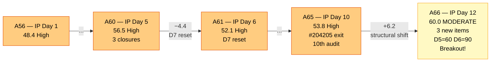
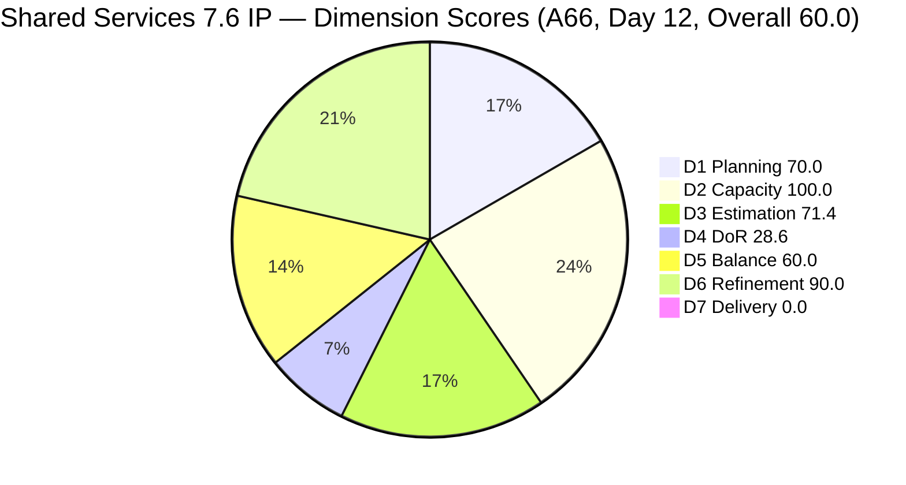
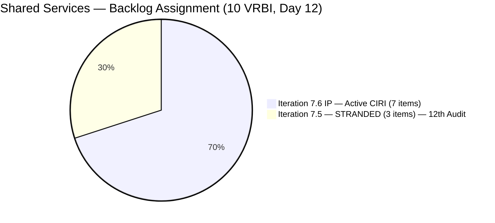
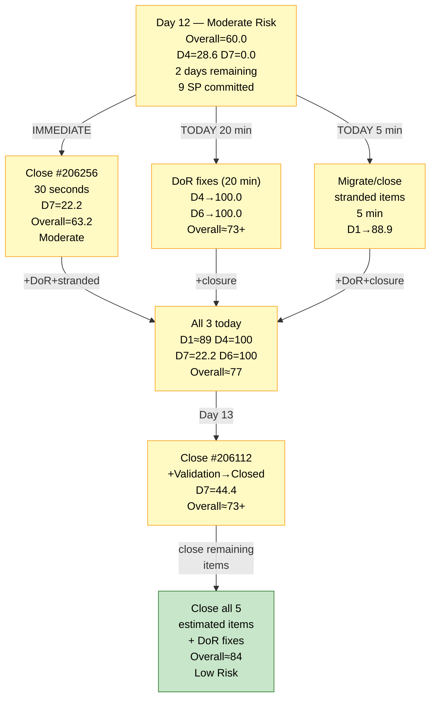
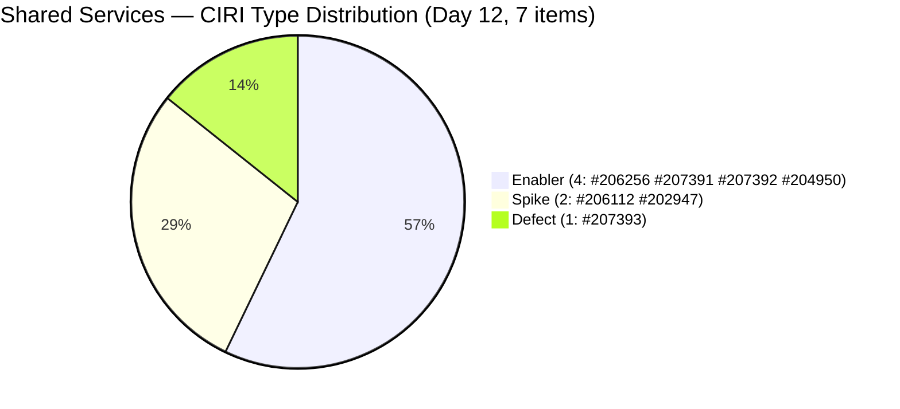

# ADO SAFe Audit — Shared Services Team

## 1. Audit Metadata

| Field | Value |
|---|---|
| **Audit Date** | 2026-06-26 09:03 CDT |
| **Sprint Day** | **12 of 14 (IP Iteration)** |
| **Prior Audit** | A65 — `AUDIT_20260624_0903.md` (Overall 53.8, High Risk — 7.6 IP Day 10) |
| **ADO Project** | Jairosoft Portfolio (`666bb99a-6acd-4999-bb34-efd0e4ea90dc`) |
| **ADO Team** | Shared Services Team (`bd9578fd-5773-48fc-bd80-988dfe5de806`) |
| **Iteration** | Iteration 7.6 (IP) (`42e165b7-e9aa-4150-8d6f-84043ef2482e`) |
| **Iteration Path** | `Jairosoft Portfolio\2026-PI7\Iteration 7.6 (IP)` |
| **Iteration Dates** | Jun 15, 2026 – Jun 28, 2026 |
| **Workspace Folder** | `ado_shared` |
| **Overall Score** | **60.0 — Moderate Risk** |
| **Risk Band** | Moderate (60–79.9) |
| **Visible Backlog Items (VRBI)** | 10 root items |
| **Current Iteration Root Items (CIRI)** | 7 items (IterationPath = Iteration 7.6 IP) |
| **Capacity** | Teofilo: 6h/day · Jaszmeine: 3h/day · Ramon: 0.5h/day = 15.5h/day total |

---

## 2. Executive Summary

The Shared Services Team **breaks out of the High Risk band for the first time in 11 audits**, reaching **60.0 — Moderate Risk** on Day 12 of 14. This is a **+6.2 point improvement** from A65 (53.8) and represents a structural shift, not a passive one.

The most significant changes since A65 (Day 10):

1. **Three new items added to CIRI today (#207391, #207392, #207393)** — all assigned to Iteration 7.6 (IP) and to Teofilo. Two are well-formed (DoR pass). This expands CIRI from 6 to 7 and dilutes the Enabler dominant-type share below the 60% threshold.
2. **#204087 and #206149 migrated to PI8/Iteration 8.1** — exiting the VRBI backlog. This deferred 2 items from the VRBI pool while 3 new items were added, yielding VRBI = 10 (net +1).
3. **#202947 was touched today (Jun 26)** — ChangedDate updated to 2026-06-26T05:46:46Z — reducing untouched CIRI count.
4. **D5 improves dramatically from 30.0 to 60.0** — with 4 Enablers among 7 CIRI items (57.1%), the dominant-type share drops below 60%, eliminating the -30 penalty. The -40 (no User Story) remains.
5. **#206256 advanced to "Passed UAT Testing" state** (as of Jun 25) — the first CIRI state progression in 12 audits. Still not Closed, so D7 = 0.0 continues.

Four chronic issues persist. Two remain at governance-level severity:
- **3 items stranded in Iteration 7.5** (#204082, #205195, #205778) — 12th consecutive audit
- **DoR failures on 5 of 7 CIRI items** — including the new items #207392 and #207393
- **D7 = 0.0** — 6th consecutive audit at zero closed SP on active CIRI
- **Jaszmeine idle for 12 consecutive audit days** — no CIRI items despite 3h/day configured capacity

---

## 3. Previous Audit Delta (A65 → A66)

| Dimension | A65 Score (7.6 IP Day 10) | A66 Score (7.6 IP Day 12) | Delta | Driver |
|---|---|---|---|---|
| D1 Iteration Planning | 66.7 | **70.0** | **+3.3** | VRBI: 9→10 (3 new items added, #204087 and #206149 moved to PI8). CIRI: 6→7 (3 new items in 7.6 IP). Score = 7/10 = 70.0. |
| D2 Team Capacity | 100.0 | **100.0** | 0.0 | Teofilo has CIRI items; capacity configured. 1/1 contributors with work have configured capacity. Jaszmeine and Ramon have capacity but Jaszmeine has 0 CIRI items (unchanged). |
| D3 Estimation | 66.7 | **71.4** | **+4.7** | 5/7 items estimated. New: #207391(1SP) and #207393(2SP) estimated. #207392 unestimated. #202947 and now-absent #206149 accounted for. ECI=5, PECI=7. |
| D4 DoR Compliance | 33.3 | **28.6** | **−4.7** | 2/7 DCI. New items #207392 and #207393 both fail DoR. #207391 passes. Net: DCI drops from 2/6 to 2/7. Worsened by new non-compliant additions. |
| D5 Work Item Balance | 30.0 | **60.0** | **+30.0** | Enabler share: 4/7 = 57.1% (was 66.7% on 6 items). Below 60% → -30 penalty eliminated. No US → -40 remains. Spike 2/7 = 28.6% < 40%. Score = max(0,100−40) = 60.0. |
| D6 Backlog Refinement | 80.0 | **90.0** | **+10.0** | Base = 10/10 fresh = 100.0. Untouched CIRI: #204950 (Jun 10) = 1/7 = 14.3% > 10% → -10. Penalty reduced from -20 (4/6 untouched at Day 10) to -10 (1/7 untouched at Day 12). |
| D7 Delivery Predictability | 0.0 | **0.0** | 0.0 | No active CIRI closed. CSP=9SP (5 estimated items). CLSP=0. **6th consecutive audit at D7=0.0.** #206256 advanced to "Passed UAT Testing" — not yet Closed. |
| **OVERALL** | **53.8** | **60.0** | **+6.2** | **First Moderate Risk score in 12 audits.** Driven by D5 structural improvement (+30), D6 untouched reduction (+10), D1 and D3 marginal gains. D4 worsened slightly (-4.7) from new non-DoR-compliant items. |

**Formula verification:** (70.0 + 100.0 + 71.4 + 28.6 + 60.0 + 90.0 + 0.0) / 7 = 420.0 / 7 = **60.0**

**Key observations A65 → A66:**

- **Structural inflection point.** Three new items added to Iteration 7.6 (IP) — #207391 (Backup AutoAllies DB, 1SP, Active, DoR Pass), #207392 (AWS Free Tier, no SP, Active, DoR Fail), #207393 (Globe Monitoring, 2SP, Grooming, DoR Partial Fail) — all assigned to Teofilo today (Jun 26 ChangedDate). These items expand CIRI and shift type distribution.
- **#204087 (PO Jodex AI Enablement, 5SP) and #206149 (Enhance Mikrotik Security) moved to PI8/Iteration 8.1.** Both exited the VRBI pool. #204087 moving to PI8 removes the 5SP item that was the primary D7 recovery path described in A65. This is a significant scope decision — 5 SP of planned delivery capacity was deferred to PI8.
- **#206256 (Research Mikrotik Security) advanced to "Passed UAT Testing" as of Jun 25** (ChangedDate 2026-06-25T05:57:45Z, rev 24). This is the first state progression beyond Active for any CIRI item this sprint. However, "Passed UAT Testing" is not Closed or Done — D7 = 0.0 continues.
- **#202947 (IT Support Survey) was touched today** (Jun 26 05:46 UTC, rev 9). ChangedDate updated. Still no Acceptance Criteria added; Description remains short (~16 NWS < 30 threshold).
- **3 stranded items (#204082, #205195, #205778) remain in Iteration 7.5 for the 12th consecutive audit.** No migration has occurred.
- **Jaszmeine enters her 12th idle day.** 3h/day × 12 days = **36 team-hours wasted.** #205195 ([Retro] Figma Alt) remains in 7.5 unaddressed.

---

## 4. Current Iteration Snapshot

| Metric | Value |
|---|---|
| **Sprint Day / Total** | **12 / 14 — Post-Midpoint** |
| **Visible Backlog Items (VRBI)** | 10 |
| **Current Iteration Root Items (CIRI — active)** | 7 (IterationPath = `Jairosoft Portfolio\2026-PI7\Iteration 7.6 (IP)`) |
| **Stranded items (still in Iteration 7.5)** | 3 — (#204082, #205195, #205778) — **12th consecutive audit** |
| **Closed items exited backlog this sprint** | #206415(Defect), #206850(Enabler,1SP), #206943(Spike,2SP), #206434(Enabler,2SP), #202808(Spike), #207387(Enabler,2SP,Closed Jun 26) |
| **Story Points Committed (CSP — estimated active CIRI)** | 9 SP (#206256=2, #206112=2, #207391=1, #207393=2, #204950=2) |
| **Story Points Closed (CLSP — active CIRI)** | 0 SP |
| **Sprint delivery to date (cumulative exited items)** | ~7+ SP (items exited backlog including #207387 closed today) |
| **Team Size (distinct CIRI assignees)** | 1 active contributor (Teofilo: all 7 CIRI items) |
| **Total Sprint Remaining Capacity** | ~31 hours (2 days × 15.5h/day) |
| **Iteration Start / Finish** | Jun 15, 2026 – Jun 28, 2026 |

**Active CIRI Items (7 — in Iteration 7.6 IP):**

| ID | Title | Type | State | SP | Assignee | DoR | ChangedDate | Notes |
|---|---|---|---|---|---|---|---|---|
| #206256 | Research Best Practices for Mikrotik Security | Enabler | **Passed UAT Testing** | 2 | Teofilo | **Fail** (no Desc — 12th audit) | Jun 25 05:57 UTC | **State progressed! One click to Closed.** |
| #206112 | Gemini License Plan | Spike | Validation | 2 | Teofilo | **Fail** (no Desc, no AC — 10th audit) | Jun 26 05:12 UTC | **Updated today. In Validation state.** |
| #207391 | Backup AutoAllies DB in BLOB Storage | Enabler | Active | 1 | Teofilo | **Pass** | Jun 26 05:41 UTC | New item. DoR complete. Fully described. |
| #207392 | AWS Free Tier Usage Limit | Enabler | Active | — | Teofilo | **Fail** (no Desc, no AC — 1st audit) | Jun 26 05:43 UTC | New item. No description or AC. Unestimated. |
| #207393 | Globe Monitoring | Defect | Grooming | 2 | Teofilo | **Fail** (Desc ~2 NWS, AC ~7 NWS — 1st audit) | Jun 26 05:45 UTC | New item. Desc and AC both too short. |
| #202947 | IT Support Services - End of PI 7 Feedback Survey | Spike | New | — | Teofilo | **Fail** (Desc ~16 NWS, no AC — 12th audit) | Jun 26 05:46 UTC | Updated today. Still no AC. Desc still short. |
| #204950 | Monthly Costing Report — July 2026 | Enabler | New | 2 | Teofilo | **Pass** | Jun 10 | Pre-iteration. DoR complete. Unchanged. |

**Stranded Items (3 — still in Iteration 7.5 — 12th Consecutive Audit):**

| ID | Title | Type | State | SP | Assignee | Consecutive Audit Count |
|---|---|---|---|---|---|---|
| #205778 | Action 2: Setup Frontend CI Gates | Defect | Passed UAT Testing | 2 | Teofilo | **12 audits (A55–A66) — GOVERNANCE BREACH** |
| #204082 | QA Jodex / AI Enablement Session | Enabler | Blocked | 5 | Ramon | 12 audits — Blocked, blocker undocumented |
| #205195 | [Retro] Alternative to Figma | Spike | Active | 1 | Jaszmeine | 12 audits — Jaszmeine idle 12 days |

---

## 5. Work Item Analysis

### DoR Assessment (7 active CIRI items)

| ID | Title | Desc ≥ 30 NWS | AC ≥ 20 NWS | Result | Audit Count |
|---|---|---|---|---|---|
| #206256 | Research Best Practices for Mikrotik Security | ✗ (No Description field in API response) | ✓ (checklist with certificate/password/L2TP/email, ~120 NWS) | **Fail — Desc missing** | **12th** |
| #206112 | Gemini License Plan | ✗ (no Description or AC returned) | ✗ (no AC field) | **Fail — both missing** | **10th** |
| #207391 | Backup AutoAllies DB in BLOB Storage | ✓ (Azure Blob backup pipeline description, ~80 NWS) | ✓ (Automated Trigger, Successful Storage, Security, Notification, Verification — ~150 NWS) | **Pass** | 1st (new) |
| #207392 | AWS Free Tier Usage Limit | ✗ (no Description field) | ✗ (no AC field) | **Fail — both missing** | 1st (new) |
| #207393 | Globe Monitoring | ✗ ("GLOBE monitoring" + "1." list item — ~2 NWS effective < 30) | ✗ ("Should be stable for 1 week" — ~7 NWS < 20) | **Fail — both too short** | 1st (new) |
| #202947 | IT Support Services — End of PI 7 Feedback Survey | ✗ ("Create a Duplicate" + hyperlink — ~16 NWS < 30 threshold) | ✗ (no AC field) | **Fail — Desc short, AC missing** | **12th** |
| #204950 | Monthly Costing Report — July 2026 | ✓ (12-item list of cost categories, ~200 NWS) | ✓ (multi-section checklist: Cloud, SaaS, AI/API, ~400 NWS) | **Pass** | — |

**DCI = 2/7 (28.6). D4 = 28.6 — worse than A65 (33.3).** New items #207392 and #207393 both fail DoR. #206256 at 12 consecutive failures is now the longest-running DoR gap in this workspace's audit history.

**Actionable DoR fixes — can be completed today in under 20 minutes:**

- **#206256 — Add Description (30 seconds):** *"Research and document Mikrotik security best practices including certificate-based L2TP authentication, unique user password enforcement, IP service restriction by source address, browser access controls, port scanner drop rules, DDoS protection, and email notifications for internet downtime and L2TP connection events."* Item is in Passed UAT Testing state and ready to close — adding this while opening it to close costs 30 seconds.
- **#207392 — Add Description + AC (3 minutes):**
  - Description: *"Monitor and manage AWS Free Tier usage limits to prevent unexpected charges. Track service usage across EC2, S3, Lambda, and other applicable services against free tier thresholds."*
  - AC: *"AWS Free Tier usage dashboard reviewed. Services approaching limits identified and flagged. Budget alerts configured to notify team at 80% and 100% of free tier thresholds."*
- **#207393 — Expand Description + AC (3 minutes):**
  - Description: *"Monitor and resolve Globe connectivity stability for the Jairosoft network. Investigate current downtime or performance issues and validate stability over a one-week observation period."*
  - AC: *"Globe connection stable with no unplanned downtime for 7 consecutive days. Mikrotik email notification configured to alert on internet downtime events. Stability report documented in SharePoint."*
- **#202947 — Expand Description + Add AC (5 minutes):**
  - Description: *"Duplicate the Mid PI-06 IT Support Services Feedback Survey in Microsoft Forms to create an End-of-PI7 version. Update all iteration date references, question context, and distribution scope to reflect PI7 IT support consumers."*
  - AC: *"Microsoft Forms duplicate confirmed active and accessible. All date references updated from PI6 to PI7. Distribution list verified current. Form link distributed to all IT support consumer teams."*
- **#206112 — Add Description + AC (5 minutes):**
  - Description: *"Evaluate available Gemini license plans to identify the optimal tier for Jairosoft's AI workloads, considering team size, usage patterns, and monthly cost targets."*
  - AC: *"Gemini license options researched and compared in a cost matrix. Recommended tier documented and approved by Ramon. Implementation timeline and procurement steps proposed."*

**If all 5 DoR fixes applied: DCI = 7/7, D4 = 100.0. Combined with #207392 SP estimate: D3 improves further. Overall score rises to approximately 77.1 — approaching the Low Risk threshold.**

### Type Distribution (7 active CIRI items)

| Type | Count | Share | D5 Impact |
|---|---|---|---|
| Enabler | 4 (#206256, #207391, #207392, #204950) | 57.1% | Below 60% — **-30 penalty NOT applied** (threshold not met) |
| Spike | 2 (#206112, #202947) | 28.6% | Spike < 40% — no -20 penalty |
| Defect | 1 (#207393) | 14.3% | — |
| User Story | 0 | 0.0% | **-40 PENALTY — No User Story in CIRI** |
| **Total** | **7** | **100%** | D5 = max(0, 100−40) = **60.0** |

**D5 = 60.0 — a +30.0 improvement over A65 (30.0).** The addition of 3 new CIRI items diluted the Enabler share from 66.7% to 57.1%, eliminating the -30 dominant-type penalty. The -40 for No User Story remains, which is appropriate for an IP (Innovation and Planning) iteration.

### Story Points Analysis — Active CIRI

| ID | Title | Type | SP | State | Notes |
|---|---|---|---|---|---|
| #206256 | Research Best Practices for Mikrotik Security | Enabler | 2 | **Passed UAT Testing** | **One-click closure ready. Highest priority.** |
| #206112 | Gemini License Plan | Spike | 2 | Validation | In validation. Updated Jun 26. May be closure-ready. |
| #207391 | Backup AutoAllies DB in BLOB Storage | Enabler | 1 | Active | New today. DoR complete. In progress. |
| #207392 | AWS Free Tier Usage Limit | Enabler | — | Active | New today. Unestimated. DoR fails. |
| #207393 | Globe Monitoring | Defect | 2 | Grooming | New today. DoR fails. |
| #202947 | IT Support Feedback Survey | Spike | — | New | Updated today. Unestimated. DoR fails. |
| #204950 | Monthly Costing Report — July 2026 | Enabler | 2 | New | Unchanged since Jun 10. DoR complete. |

**Estimated CIRI items: #206256(2), #206112(2), #207391(1), #207393(2), #204950(2) = 5 items = 9 SP (CSP).**

---

## 6. SAFe Compliance Scorecard

| Dimension | Score | Band | Evidence | Notes |
|---|---|---|---|---|
| D1 Iteration Planning | **70.0** | Moderate | 7 CIRI / 10 VRBI | CIRI expanded from 6→7 (3 new items). VRBI expanded 9→10 (#204087+#206149 exited to PI8, 3 new items added). D1 = 7/10 = 70.0. **+3.3 from A65.** |
| D2 Team Capacity | **100.0** | Low | 1/1 CIRI contributors with capacity | Teofilo holds all 7 CIRI items; 6h/day configured. 1/1 = 100.0. Jaszmeine and Ramon have capacity but Jaszmeine has 0 CIRI items (12th idle day). |
| D3 Estimation | **71.4** | Moderate | 5/7 estimated | Estimated: #206256(2), #206112(2), #207391(1), #207393(2), #204950(2). Unestimated: #207392, #202947. **+4.7 from A65.** |
| D4 DoR Compliance | **28.6** | Critical | 2 DCI / 7 CIRI | Pass: #207391, #204950. Fail: #206256 (**12th audit**), #206112 (**10th audit**), #207392 (1st), #207393 (1st), #202947 (**12th audit**). **−4.7 from A65 — worsened.** |
| D5 Work Item Balance | **60.0** | Moderate | Enabler 57.1% < 60% → -30 not applied | No US → -40. Enabler=57.1% < 60% → no -30. Spike=28.6% < 40% → no -20. Score = max(0,100−40) = **60.0. +30.0 from A65 — structural improvement.** |
| D6 Backlog Refinement | **90.0** | Low | 10/10 fresh; 1/7 untouched → -10 | All 10 VRBI fresh (May 12 window). Stale_90=0, Stale_180=0. Untouched CIRI: #204950 (Jun 10 < Jun 15) = 1/7 = 14.3% > 10% → -10. Score = max(0,100−10) = **90.0. +10.0 from A65.** |
| D7 Delivery Predictability | **0.0** | Critical | 0 SP closed / 9 SP committed | Active CIRI: 0 Closed. #206256 in "Passed UAT Testing" — NOT Closed. Day 12 — **6th consecutive audit at D7=0.0.** |
| **OVERALL** | **60.0** | **Moderate Risk** | (70+100+71.4+28.6+60+90+0)/7 | **+6.2 from A65 (53.8 High Risk). First Moderate Risk score in 12 audits. DoR regression (D4 −4.7) is the only dimension that worsened.** |

**Formula verification:** (70.0 + 100.0 + 71.4 + 28.6 + 60.0 + 90.0 + 0.0) / 7 = 420.0 / 7 = **60.0**

---

## 7. Dimension Findings

### D1 — Iteration Planning: 70.0 / 100 — Moderate Risk

**Formula:** CIRI / VRBI × 100 = 7 / 10 × 100 = **70.0**

| Metric | Value |
|---|---|
| Visible root backlog items (VRBI) | 10 |
| Items in Iteration 7.6 (IP) — CIRI | 7 (#206256, #206112, #207391, #207392, #207393, #202947, #204950) |
| Items stranded in Iteration 7.5 | 3 (#204082, #205195, #205778) — **12th consecutive audit** |
| Score | **70.0** |

VRBI shifted from 9 to 10: #204087 and #206149 exited to PI8/Iteration 8.1 (-2), and #207391, #207392, #207393 were added to 7.6 IP (+3). CIRI shifted from 6 to 7 with the three new items. The D1 ratio improved from 66.7 to 70.0.

The 3 remaining stranded items have persisted for 12 consecutive audits with no deliberate action:
- **Close #205778** (Defect, Passed UAT Testing — 12 audits, 1 click)
- **Migrate #205195** (Jaszmeine, Figma Alt, 1SP) → Iteration 7.6 IP
- **Defer #204082** (Ramon, QA Jodex, Blocked, 5SP) → PI8 with documented blocker

After these 3 actions: VRBI=10 (stranded items removed), CIRI=8 (205195 added, 204082+205778 removed but wait — closing them removes them from VRBI too). Net: close #205778 (removes from VRBI), migrate #205195 to CIRI, defer #204082 (removes from VRBI). VRBI=8, CIRI=8, D1=100.0.

---

### D2 — Team Capacity: 100.0 / 100 — Low Risk

**Formula:** CC / CW × 100 = 1 / 1 × 100 = **100.0**

| Contributor | Active CIRI Items | Capacity | Notes |
|---|---|---|---|
| Teofilo Limpag | 7 items (all CIRI) | 6h/day | Multiple items active/in-progress. #206256 in Passed UAT Testing. |
| RAMON ASENIERO JR | 0 CIRI items | 0.5h/day | #204087 moved to PI8. No active CIRI items. |
| Jaszmeine Villanueva | 0 CIRI items | 3h/day | **12th consecutive idle day. 36 team-hours wasted.** #205195 stranded in 7.5. |

D2 = 100.0 is maintained because contributors_with_current_work = 1 (Teofilo only) and contributors_with_capacity = 1 (Teofilo is configured). Ramon and Jaszmeine have configured capacity but zero CIRI items. The formula counts only contributors with CIRI items against capacity.

Teofilo is now managing 7 active CIRI items — a significant workload concentration risk with 2 sprint days remaining.

---

### D3 — Estimation: 71.4 / 100 — Moderate Risk

**Formula:** ECI / PECI × 100 = 5 / 7 × 100 = **71.4**

Two items remain unestimated:
- **#207392** (AWS Free Tier Usage Limit, Enabler, Active — new today, no SP)
- **#202947** (IT Support Feedback Survey, Spike, New — 12 audits, no SP; suggestion: 1 SP)

All other CIRI items are estimated: #206256(2), #206112(2), #207391(1), #207393(2), #204950(2) = 9 SP total.

Adding SP to #207392 (suggest 1 SP) and #202947 (suggest 1 SP) would push D3 to 7/7 = 100.0 and CSP to 11 SP.

---

### D4 — DoR Compliance: 28.6 / 100 — Critical

**Formula:** DCI / CIRI × 100 = 2 / 7 × 100 = **28.6**

D4 worsened from 33.3 (A65) to 28.6 — the addition of 3 new items (#207391 passing, #207392 and #207393 failing) net-reduced the DoR compliance rate. This is the only dimension that regressed from A65.

**Chronic failures:**
- **#206256 — 12th consecutive DoR failure.** This item is in "Passed UAT Testing" state and could be closed today. Its Description is missing at the API level despite active work over 12 audits.
- **#202947 — 12th consecutive DoR failure.** Item was touched today (Jun 26) but Description remains ~16 NWS and AC is still absent.
- **#206112 — 10th consecutive DoR failure.** Item advanced to Validation state (updated Jun 26). Still no Description or AC in API response.

**New failures:**
- **#207392 — 1st audit.** Added today with no Description or AC. Added to CIRI without DoR completion.
- **#207393 — 1st audit.** Added today with a 2-word Description ("GLOBE monitoring") and a single-sentence AC ("Should be stable for 1 week"). Both fall below the 30 NWS / 20 NWS thresholds.

The 5 DoR fixes in Section 5 (estimated 20 minutes) would raise D4 to 100.0 and push the overall score to approximately 77.1.

---

### D5 — Work Item Balance: 60.0 / 100 — Moderate Risk

**Formula:** Base 100 − penalties = max(0, 100 − 40) = **60.0**

| Penalty | Trigger | Applied |
|---|---|---|
| -40: No User Story in CIRI | **0 User Stories in 7 CIRI items** | **YES** |
| -30: Dominant type share > 60% | Enabler = 4/7 = **57.1%** < 60% | **No** |
| -20: Spike share > 40% | Spike = 2/7 = 28.6% | **No** |

**Score:** max(0, 100 − 40) = **60.0** (+30.0 from A65)

This is the first time this sprint that D5 has exceeded the -40-only floor. The three new Enabler items (#207391, #207392, #207393) diluted the Enabler share below the 60% dominant threshold, eliminating the -30 penalty. IP iterations appropriately contain Enabler and Spike work; the -40 for absent User Stories reflects the IP structure, not an execution failure.

**Note:** A formal Project Exception for IP iteration D5 floor should still be documented in `ado_shared/CLAUDE.md` (now 12 audits overdue).

---

### D6 — Backlog Refinement: 90.0 / 100 — Low Risk

**Freshness window:** ChangedDate ≥ 2026-05-12 (45 days before 2026-06-26)

| Metric | Value |
|---|---|
| Total VRBI | 10 |
| Fresh items (ChangedDate ≥ May 12, 2026) | 10 — all items changed Jun 10–26 |
| Stale_90 items (ChangedDate < Mar 28, 2026) | 0 |
| Stale_180 items (ChangedDate < Dec 28, 2025) | 0 |
| Untouched CIRI (ChangedDate < Jun 15, 2026 — iteration start) | 1 (#204950 — Jun 10 < Jun 15) |

**Base = 10/10 × 100 = 100.0**

**Penalties:**
- Stale_90: 0 → No penalty
- Stale_180: 0 → No penalty
- Untouched CIRI: 1/7 = 14.3% > 10% but ≤ 30% → **-10 penalty**

**Score: max(0, 100.0 − 10) = 90.0** (+10.0 from A65)

D6 improved significantly. At A65, 4/6 CIRI items (66.7%) were untouched — triggering the -20 penalty. Today:
- #202947: touched Jun 26 (was Jun 10) → no longer untouched
- #206149: exited to PI8 (removed from CIRI)
- #204087: exited to PI8 (removed from CIRI)
- New items #207391, #207392, #207393: created Jun 26 → not untouched
- Only #204950 (Jun 10) remains untouched (1/7 = 14.3% → -10 penalty instead of -20)

Touching #204950 (applying DoR fixes would update its ChangedDate) would eliminate the -10 penalty and push D6 to 100.0.

---

### D7 — Delivery Predictability: 0.0 / 100 — Critical

**Formula:** CLSP / CSP × 100 = 0 / 9 × 100 = **0.0**

| Metric | Value |
|---|---|
| Estimated CIRI items (SP > 0) | 5 (#206256=2, #206112=2, #207391=1, #207393=2, #204950=2) |
| Committed Story Points (CSP) | 9 SP |
| Closed Story Points (CLSP) | 0 SP (no active CIRI items in Closed or Done state) |
| Score | **0.0** |
| Consecutive audits at D7=0.0 | **6 (A61–A66)** |

Day 12 of 14. Two days remain.

**#206256 (Research Mikrotik Security) is now in "Passed UAT Testing"** — the last state before Closed in this team's workflow. Closing this item today is a single state-change action. If Teofilo changes the state to Closed, D7 = 2/9 = 22.2 and overall = 63.2 (Moderate Risk maintained).

**#206112 (Gemini License Plan) is in "Validation"** — updated Jun 26 (05:12 UTC). This item may also be approaching closure.

**#204087 (PO Jodex AI Enablement, 5SP)** was moved to PI8/Iteration 8.1, removing what had been the primary D7 recovery path (5SP closure → D7=45.5). This PI8 deferral caps the theoretical maximum D7 recovery this sprint.

**Recovery projections from Day 12 (2 days remaining):**

| Action | CLSP/CSP | D7 | Overall |
|---|---|---|---|
| Status quo (no closures) | 0/9 | 0.0 | 60.0 (Moderate) |
| Close #206256 (2SP) | 2/9 | 22.2 | 63.2 (Moderate) |
| Close #206256 + #206112 (4SP) | 4/9 | 44.4 | 66.3 (Moderate) |
| Close #206256+#206112+#207391 (7SP) | 7/9 | 77.8 | 71.1 (Moderate) |
| Close all 5 estimated items (9SP) | 9/9 | 100.0 | **77.1 (Moderate, near Low threshold)** |
| All closures + DoR fixes | 9/9 | 100.0 | **~84.3 (Low Risk — theoretical max with D4=100)** |

---

## 8. Risks and Bottlenecks

| # | Severity | Dimension | Risk | Recommended Action |
|---|---|---|---|---|
| R1 | **CRITICAL** | D7 | D7 = 0.0 for 6th consecutive audit. 2 sprint days remain. #206256 is in "Passed UAT Testing" — the last state before Closed. Zero remaining process barrier to closure. | **IMMEDIATE (30 seconds):** Teofilo sets #206256 State → Closed. D7 = 22.2. Overall = 63.2. No excuse for further delay — item has passed UAT. |
| R2 | **CRITICAL** | D4 (12th Audit) | 5 of 7 CIRI items fail DoR. 3 chronic failures (#206256, #202947 = 12th audit; #206112 = 10th audit). 2 new failures (#207392, #207393) added today without DoR completion before iteration assignment. | **TODAY (20 min):** Apply all 5 DoR fixes from Section 5. D4 → 100.0. Combined with D7 closures: Overall → ~77–84 range. |
| R3 | **CRITICAL** | Stranded items (12th Audit) | 3 items in Iteration 7.5 for 12 consecutive audits: #205778 (Passed UAT Testing — 1 click), #205195 (Jaszmeine — migrate to 7.6 IP), #204082 (Blocked — defer to PI8 with comment). | **TODAY (5 min):** Close #205778, migrate #205195, defer #204082 with ADO comment. |
| R4 | **HIGH** | Sprint trajectory | 2 days remaining. 0 SP closed in active CIRI. 9 SP committed. #204087 (5SP) was the primary D7 recovery path and was deferred to PI8, eliminating the clearest path to Low Risk via D7. Maximum achievable D7=100.0 yields overall 77.1 without DoR fixes. | Close #206256 and #206112 today. Attempt #207391 by Day 13. |
| R5 | **HIGH** | Scope management | Three new items (#207391, #207392, #207393) added to CIRI on Day 12 (2 days before sprint end). #207392 and #207393 both fail DoR at addition time. Adding non-DoR-compliant items late in the sprint violates sprint gate principles. | Establish intake gate: DoR + SP required before IterationPath assignment. Applies to PI8 from Iteration 8.1 onward. |
| R6 | **HIGH** | Jaszmeine — 12th idle day | 3h/day × 12 days = **36 team-hours wasted.** Zero CIRI items. #205195 stranded in 7.5. | Migrate #205195 (part of R3). One action ends 12-day idle streak. |
| R7 | **MODERATE** | Teofilo overload | All 7 CIRI items assigned to Teofilo. 2 days, 12 hours remaining (2 × 6h). With DoR fixes + closures, Teofilo's plate is the bottleneck for all sprint improvements. | Prioritize: (1) Close #206256, (2) Close #206112, (3) DoR fixes, (4) Close #207391. |
| R8 | **LOW** | D5 — IP structural | D5 = 60.0 for IP sprint — appropriate for Innovation and Planning iteration. Project Exception still undocumented in `ado_shared/CLAUDE.md`. | Document IP Exception (see D5 finding). |
| R9 | **LOW** | #204082 blocker (12th audit) | QA Jodex / AI Enablement, Blocked, 5SP. Blocker undocumented for 12 audits. Now deferred to PI8 — but blocker documentation is still needed. | Ramon adds ADO comment: dependency owner, contact, ETA. Then PI8 planning can address it. |

---

## 9. Prioritized Recommendations

1. **[IMMEDIATE — 30 SECONDS — R1, D7]** Teofilo sets **#206256** (Research Mikrotik Security, Passed UAT Testing, 2SP) State → **Closed**. This item has passed UAT. One state change. The 12-audit DoR fix (Description) can be added simultaneously while opening the item:
   - D7 = 2/9 × 100 = 22.2
   - Overall = (70+100+71.4+28.6+60+90+22.2)/7 = **63.2 — Moderate Risk**

2. **[TODAY — 5 MIN — R3 stranded items]** Execute the three stranded item actions:
   - **#205778** → Closed (Passed UAT Testing, 1 click, 12-audit breach)
   - **#205195** → Migrate to Iteration 7.6 IP (Jaszmeine gets first CIRI item; 12-day idle streak ends)
   - **#204082** → Ramon adds ADO comment: blocker owner + contact + ETA; then defer to PI8
   - **D1 impact:** After closing #205778 and #204082 out of VRBI and migrating #205195 to CIRI: VRBI = 9, CIRI = 8 → D1 = 88.9

3. **[TODAY — 20 MIN — R2, D4 recovery]** Apply all 5 DoR fixes using exact text from Section 5:
   - #206256: Add Description (30 seconds, already closing)
   - #207392: Add Desc + AC (3 minutes)
   - #207393: Expand Desc + AC (3 minutes)
   - #202947: Expand Desc + Add AC (5 minutes)
   - #206112: Add Desc + AC (5 minutes)
   - **Result: D4 = 7/7 = 100.0. Touching #204950 (DoR already passes) updates its ChangedDate → D6 = 100.0.**

4. **[TODAY — D7 continued — R4]** Close **#206112** (Gemini License Plan, Validation, 2SP — updated Jun 26). Item is in Validation state. If research is complete:
   - CLSP = 4 SP → D7 = 44.4
   - Combined with Recs 1–3 full fix: Overall ≈ 73–77 range (Moderate Risk, approaching Low)

5. **[DAY 13 — D7 completion]** Close **#207391** (Backup AutoAllies DB, Active, 1SP — DoR complete). Closes with 1 SP:
   - CLSP = 7 SP → D7 = 77.8
   - Overall ≈ 75–80 range depending on D4 fix status

6. **[WORKSPACE MAINTENANCE — 12 audits overdue]** Add IP Project Exception to `ado_shared/CLAUDE.md`:
   *"IP (Innovation and Planning) iterations are legitimately infrastructure and planning-focused. Absence of User Stories in CIRI reflects appropriate IP scope separation, not an execution failure. D5 scores during IP sprints should be annotated as structural rather than remediable within the sprint."*

7. **[PROCESS — PERMANENT — R5]** Enforce DoR gate before IterationPath assignment. New items #207392 and #207393 were added to the sprint on Day 12 without DoR compliance. Starting PI8 Iteration 8.1: no work item assigned to the active iteration without Description ≥ 30 NWS + AC ≥ 20 NWS + SP > 0 + Assignee.

---

## 10. Evidence Gaps and Limitations

| Gap | Impact | Notes |
|---|---|---|
| **D7 = 0.0 — formula scope vs. cumulative delivery** | Score understatement | Formula counts only active CIRI. Sprint delivery includes: #206415(Defect), #206850(Enabler,1SP), #206943(Spike,2SP), #206434(Enabler,2SP), #207387(Enabler,2SP,Closed Jun 26) = 7+ SP from exited items. Recovery depends on active CIRI closures. |
| **#206256 Description missing from API** | D4 chronic failure | Teofilo's Mikrotik research has AC but no Description returned in API responses for 12 consecutive audits. Item may have description in a non-standard field or in ADO text not returned by batch API. Regardless, adding the suggested Description text (Section 5) resolves the gap. |
| **#206112 No Description/AC in API** | D4 chronic failure | Gemini License Plan returns no Description or AC fields for 10 consecutive audits despite the item advancing through Validation state. Content may exist in a tab not returned by default API fields. Fix: add content using suggested text in Section 5. |
| **#204087 PI8 deferral impact** | D7 ceiling lowered | #204087 (5SP, PO Jodex AI Enablement) was the highest-SP CIRI item and the primary D7 recovery path from A65 projections. Its move to PI8/Iteration 8.1 reduces maximum achievable D7 from 100.0 (11 SP → close all) to 100.0 on a 9 SP base. The Low Risk path still exists via DoR fixes combined with full CIRI closure. |
| **Jaszmeine capacity waste** | 36 team-hours | 12 days × 3h/day = 36 team-hours unallocated. Resolvable with migration of #205195 to 7.6 IP — one action. |
| **#205778 stranded state (12th audit)** | 2 SP uncredited | Defect in "Passed UAT Testing" for 12 consecutive audits. Not in CIRI (still in 7.5). Closing it removes it from VRBI and improves D1. |
| **New items added Day 12** | Late-sprint risk | #207391, #207392, #207393 added to CIRI on Day 12 with 2 days remaining. Completing these items within 48 hours is theoretically possible but operationally aggressive given existing queue. |

---

## 11. Visualizations

### Score Trend — A56 through A66 (Breaking the High Risk Band)

### Dimension Scores — A66 (Day 12, Overall 60.0)

### Backlog Assignment — Day 12 (10 VRBI)

### Recovery Path — Last 2 Days (Day 12)

### CIRI Type Distribution — Day 12 (7 items)

---

## 12. Audit Trail

| Source | Tool | Data |
|---|---|---|
| Current iteration | `work_list_team_iterations` (project `666bb99a`, team `bd9578fd`, timeframe=current) | Iteration 7.6 (IP): Jun 15–28, 2026; ID `42e165b7-e9aa-4150-8d6f-84043ef2482e` |
| Team capacity | `work_get_iteration_capacities` (project `666bb99a`, iterationId `42e165b7`) | Shared Services Team: 15.5h/day total (Teofilo 6h, Jaszmeine 3h, Ramon 0.5h) |
| Backlog items | `wit_list_backlog_work_items` (project `666bb99a`, team `bd9578fd`, backlogId `Microsoft.RequirementCategory`) | 10 root items: #202947, #204082, #204950, #205195, #205778, #206112, #206256, #207391, #207392, #207393 (shifted from A65: #204087+#206149 exited to PI8; #207391+#207392+#207393 added) |
| Iteration work items | `wit_get_work_items_for_iteration` (project `666bb99a`, team `bd9578fd`, iterationId `42e165b7`) | 15 items including children; root CIRI items identified by cross-referencing with VRBI backlog list |
| Work item details | `wit_get_work_items_batch_by_ids` (13 items: #202947, #204082, #204087, #204950, #205195, #205778, #206112, #206149, #206256, #207387, #207391, #207392, #207393) | State, SP, Type, Desc, AC, ChangedDate, IterationPath, AssignedTo confirmed for all items |
| Prior audit | `AUDIT_20260624_0903.md` (A65) | Overall 53.8, High Risk, 7.6 IP Day 10, 6 active CIRI, 11 SP committed, 0 SP closed |
| ADO org | `jairo` (dev.azure.com/jairo) | Jairosoft Portfolio ID: `666bb99a-6acd-4999-bb34-efd0e4ea90dc` |
