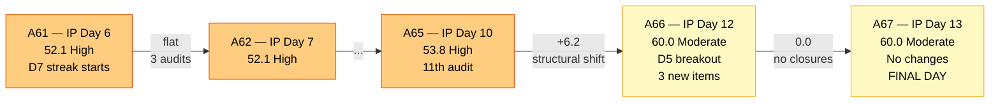
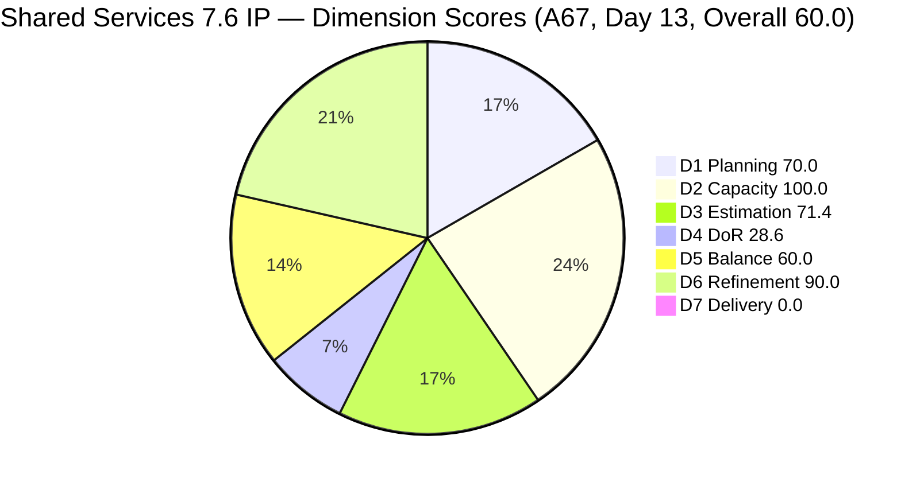
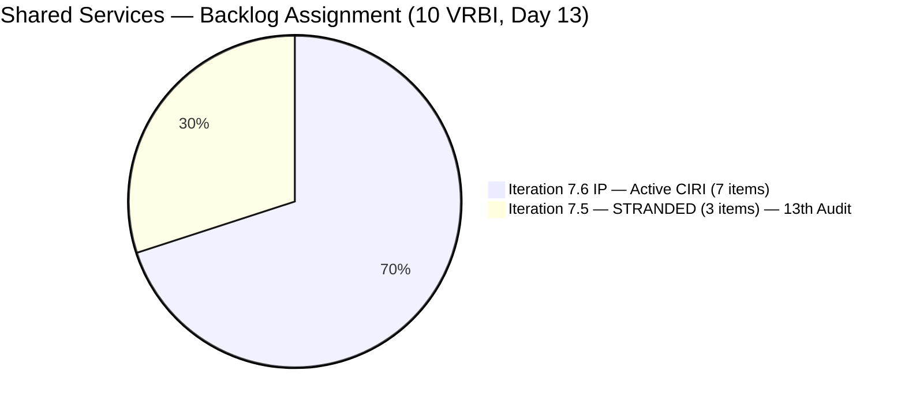
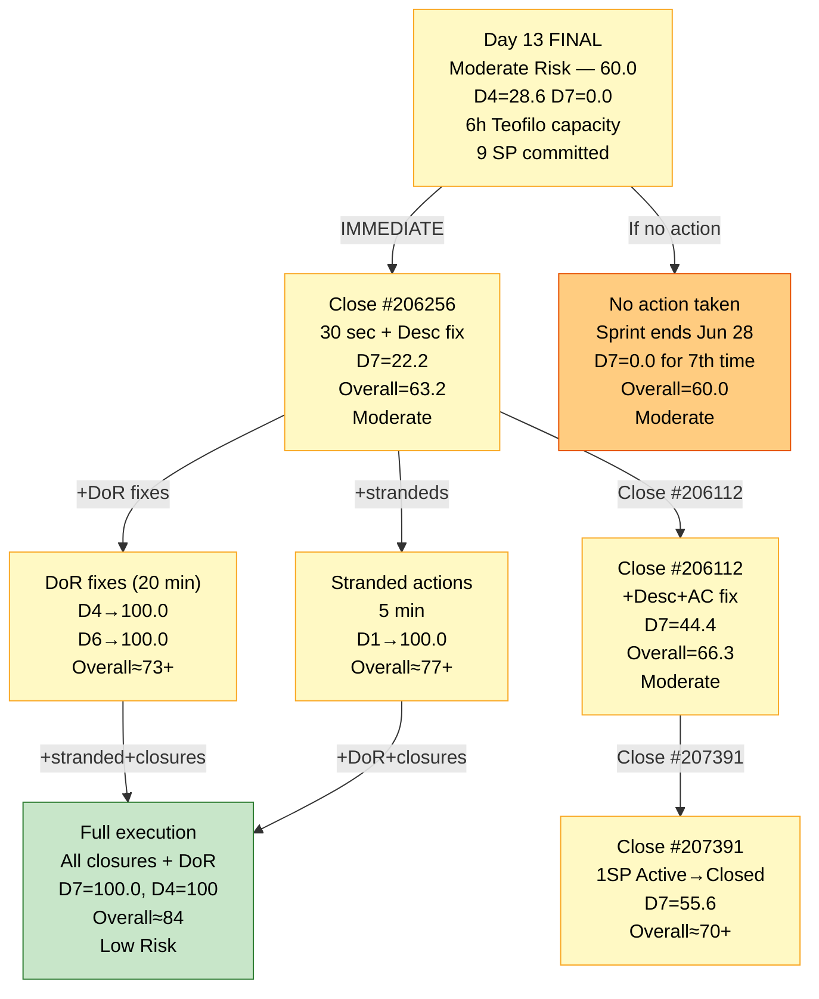
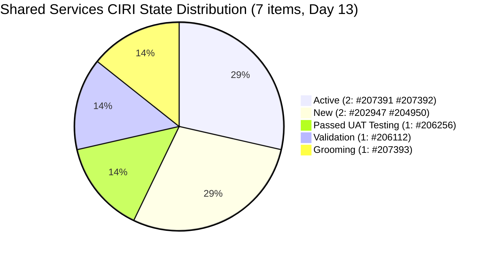

# ADO SAFe Audit — Shared Services Team

## 1. Audit Metadata

| Field | Value |
|---|---|
| **Audit Date** | 2026-06-27 09:03 CDT |
| **Sprint Day** | **13 of 14 (IP Iteration)** |
| **Prior Audit** | A66 — `AUDIT_20260626_0903.md` (Overall 60.0, Moderate Risk — 7.6 IP Day 12) |
| **ADO Project** | Jairosoft Portfolio (`666bb99a-6acd-4999-bb34-efd0e4ea90dc`) |
| **ADO Team** | Shared Services Team (`bd9578fd-5773-48fc-bd80-988dfe5de806`) |
| **Iteration** | Iteration 7.6 (IP) (`42e165b7-e9aa-4150-8d6f-84043ef2482e`) |
| **Iteration Path** | `Jairosoft Portfolio\2026-PI7\Iteration 7.6 (IP)` |
| **Iteration Dates** | Jun 15, 2026 – Jun 28, 2026 |
| **Workspace Folder** | `ado_shared` |
| **Overall Score** | **60.0 — Moderate Risk** |
| **Risk Band** | Moderate (60–79.9) |
| **Visible Backlog Items (VRBI)** | 10 |
| **Current Iteration Root Items (CIRI)** | 7 |
| **Capacity** | Teofilo: 6h/day · Jaszmeine: 3h/day · Ramon: 0.5h/day = 15.5h/day total |

---

## 2. Executive Summary

The Shared Services Team holds at **60.0 — Moderate Risk** on Day 13 of 14, unchanged from A66 (Day 12). No CIRI state transitions have been recorded since yesterday, and the seven CIRI items remain in the same states as at yesterday's audit close.

**Today is the final working day before the sprint closes on Jun 28.** Three critical actions remain unexecuted from the A66 recommendations:

1. **#206256 (Research Mikrotik Security, Passed UAT Testing, 2SP) — still not Closed.** This item passed UAT as of Jun 25. It requires a single state-change click. Its 12th consecutive audit at D7=0.0 continues.
2. **#206112 (Gemini License Plan, Validation, 2SP) — still not Closed.** Updated Jun 26. May be closure-ready.
3. **3 stranded items in Iteration 7.5 (#205778, #205195, #204082) — 13th consecutive audit** without resolution.
4. **5 of 7 CIRI items fail DoR** — same as A66. No DoR fixes have been applied since yesterday.

If no closures occur today, the sprint ends with D7=0.0 for the 7th consecutive audit and an overall score of 60.0.

**If Teofilo closes #206256 today:** D7 = 22.2, Overall = 63.2. Closing #206256 + #206112 → D7 = 44.4, Overall = 66.3. A full-closure scenario with DoR fixes is still achievable but requires significant sprint-closing action within today's capacity window.

---

## 3. Previous Audit Delta (A66 → A67)

| Dimension | A66 Score (7.6 IP Day 12) | A67 Score (7.6 IP Day 13) | Delta | Driver |
|---|---|---|---|---|
| D1 Iteration Planning | 70.0 | **70.0** | 0.0 | CIRI=7/VRBI=10. No backlog membership changes. 3 stranded items remain in Iteration 7.5. |
| D2 Team Capacity | 100.0 | **100.0** | 0.0 | Teofilo holds all 7 CIRI items; capacity configured. 1/1. |
| D3 Estimation | 71.4 | **71.4** | 0.0 | 5/7 estimated. #207392 and #202947 remain unestimated. |
| D4 DoR Compliance | 28.6 | **28.6** | 0.0 | 2/7 pass (#207391, #204950). 5 fail. No DoR fixes applied since A66. |
| D5 Work Item Balance | 60.0 | **60.0** | 0.0 | Enabler 57.1% < 60% → no -30. No US → -40. Spike 28.6% < 40% → no -20. Score = 60.0. |
| D6 Backlog Refinement | 90.0 | **90.0** | 0.0 | All 10 VRBI fresh. #204950 (Jun 10) remains only untouched CIRI item (1/7 = 14.3% → -10). Score = 90.0. |
| D7 Delivery Predictability | 0.0 | **0.0** | 0.0 | 0 SP closed. Active CIRI: 0 Closed or Done. **7th consecutive audit at D7=0.0.** |
| **Overall** | **60.0** | **60.0** | **0.0** | No state changes to CIRI items since A66. Final opportunity for recovery is today. |

**Formula verification:** (70.0 + 100.0 + 71.4 + 28.6 + 60.0 + 90.0 + 0.0) / 7 = 420.0 / 7 = **60.0**

**Key observations A66 → A67:**

- **No CIRI state transitions since A66.** All 7 CIRI items are in the same states. #206256 remains in "Passed UAT Testing" (since Jun 25) — the last state before Closed. #206112 remains in "Validation" (since Jun 26).
- **Three stranded items continue to sit in Iteration 7.5 for the 13th consecutive audit.** #205778 is in "Passed UAT Testing" — one click from Closed. #205195 (Jaszmeine) is Active, unassigned from current CIRI. #204082 (Blocked, Ramon) requires a comment + iteration change.
- **DoR failures on 5 of 7 CIRI items persist unchanged.** None of the 5 suggested DoR fix texts from A66 Section 5 have been applied.
- **Today is the only remaining recovery window.** Sprint closes Jun 28.

---

## 4. Current Iteration Snapshot

| Metric | Value |
|---|---|
| **Sprint Day / Total** | **13 / 14 — FINAL WORKING DAY** |
| **Visible Backlog Items (VRBI)** | 10 |
| **Current Iteration Root Items (CIRI)** | 7 (IterationPath = `Jairosoft Portfolio\2026-PI7\Iteration 7.6 (IP)`) |
| **Stranded items (in Iteration 7.5)** | 3 — #204082, #205195, #205778 — **13th consecutive audit** |
| **Story Points Committed (CSP)** | 9 SP (5 estimated CIRI items) |
| **Story Points Closed (CLSP)** | 0 SP |
| **Cumulative sprint delivery (exited items)** | ~7+ SP from items that exited the backlog during the sprint |
| **Team Size (distinct CIRI assignees)** | 1 active (Teofilo — all 7 CIRI items) |
| **Total Remaining Capacity** | ~6 hours (1 day × 6h/day for Teofilo) |
| **Iteration Start / Finish** | Jun 15, 2026 – Jun 28, 2026 |

**Active CIRI Items (7 — in Iteration 7.6 IP):**

| ID | Title | Type | State | SP | Assignee | DoR | ChangedDate | Notes |
|---|---|---|---|---|---|---|---|---|
| #206256 | Research Best Practices for Mikrotik Security | Enabler | **Passed UAT Testing** | 2 | Teofilo | **Fail** (no Desc) | Jun 25 05:57 UTC | **13th audit. One state change to Closed.** |
| #206112 | Gemini License Plan | Spike | **Validation** | 2 | Teofilo | **Fail** (no Desc, no AC) | Jun 26 05:12 UTC | **11th audit. In Validation — may be closure-ready.** |
| #207391 | Backup AutoAllies DB in BLOB Storage | Enabler | Active | 1 | Teofilo | **Pass** | Jun 26 05:41 UTC | Added Day 12. DoR complete. |
| #207392 | AWS Free Tier Usage Limit | Enabler | Active | — | Teofilo | **Fail** (no Desc, no AC) | Jun 26 05:43 UTC | Added Day 12. Unestimated. DoR fails. |
| #207393 | Globe Monitoring | Defect | Grooming | 2 | Teofilo | **Fail** (Desc ~2 NWS, AC ~7 NWS) | Jun 26 05:45 UTC | Added Day 12. Both DoR thresholds not met. |
| #202947 | IT Support Services - End of PI 7 Feedback Survey | Spike | New | — | Teofilo | **Fail** (Desc ~16 NWS, no AC) | Jun 26 05:46 UTC | **13th audit. Touched Jun 26. Still no AC.** |
| #204950 | Monthly Costing Report — July 2026 | Enabler | New | 2 | Teofilo | **Pass** | Jun 10 | Pre-iteration. DoR complete. Only untouched CIRI item. |

**Stranded Items (3 — still in Iteration 7.5 — 13th Consecutive Audit):**

| ID | Title | Type | State | SP | Assignee | Audit Count |
|---|---|---|---|---|---|---|
| #205778 | Action 2: Setup Frontend CI Gates | Defect | Passed UAT Testing | 2 | Teofilo | **13 audits — 1 click to Closed** |
| #204082 | QA Jodex / AI Enablement Session | Enabler | Blocked | 5 | Ramon | **13 audits — Blocker undocumented** |
| #205195 | [Retro] Alternative to Figma | Spike | Active | 1 | Jaszmeine | **13 audits — Jaszmeine idle 13 days** |

---

## 5. Work Item Analysis

### DoR Assessment (7 active CIRI items)

| ID | Title | Desc ≥ 30 NWS | AC ≥ 20 NWS | Result | Audit Count |
|---|---|---|---|---|---|
| #206256 | Research Best Practices for Mikrotik Security | ✗ (No Description field in API) | ✓ (checklist ~120 NWS — certificates, L2TP, email, DDoS) | **Fail — Desc missing** | **13th** |
| #206112 | Gemini License Plan | ✗ (no Description returned) | ✗ (no AC field returned) | **Fail — both missing** | **11th** |
| #207391 | Backup AutoAllies DB in BLOB Storage | ✓ (~80 NWS — Azure Blob backup pipeline goal) | ✓ (~150 NWS — Automated Trigger, Storage, RBAC, Notification, Verification) | **Pass** | 2nd |
| #207392 | AWS Free Tier Usage Limit | ✗ (no Description field returned) | ✗ (no AC field returned) | **Fail — both missing** | **2nd** |
| #207393 | Globe Monitoring | ✗ ("GLOBE monitoring" — ~2 NWS effective, < 30 threshold) | ✗ ("Should be stable for 1 week" — ~7 NWS, < 20 threshold) | **Fail — both too short** | **2nd** |
| #202947 | IT Support Services — End of PI 7 Feedback Survey | ✗ ("Create a Duplicate" + link — ~16 NWS, < 30 threshold) | ✗ (no AC field returned) | **Fail — Desc short, AC missing** | **13th** |
| #204950 | Monthly Costing Report — July 2026 | ✓ (12-item cost category list, ~200 NWS) | ✓ (multi-section checklist: Cloud, SaaS, AI/API, ~400 NWS) | **Pass** | — |

**DCI = 2/7 (28.6). D4 = 28.6 — unchanged from A66.**

**Actionable DoR fixes (all carry-over from A66 — can be applied in under 20 minutes today):**

- **#206256 — Add Description (30 sec):** *"Research and document Mikrotik security best practices including certificate-based L2TP authentication, unique user password enforcement, IP service restriction by source address, browser access controls, port scanner drop rules, DDoS protection, and email notifications for internet downtime and L2TP connection events."*
- **#207392 — Add Desc + AC (3 min):** Desc: *"Monitor and manage AWS Free Tier usage limits to prevent unexpected charges across EC2, S3, Lambda, and applicable services."* AC: *"Usage dashboard reviewed; services approaching limits flagged; budget alerts configured at 80% and 100% thresholds."*
- **#207393 — Expand Desc + AC (3 min):** Desc: *"Monitor and resolve Globe connectivity stability for the Jairosoft network and validate stability over a one-week observation period."* AC: *"Globe connection stable with no unplanned downtime for 7 consecutive days. Mikrotik email notification configured. Stability report documented in SharePoint."*
- **#202947 — Expand Desc + Add AC (5 min):** Desc: *"Duplicate the Mid PI-06 IT Support Services Feedback Survey in Microsoft Forms to create an End-of-PI7 version with updated iteration date references and distribution scope."* AC: *"Form duplicate active and accessible. Date references updated from PI6 to PI7. Distribution list verified. Form link distributed to all IT support consumer teams."*
- **#206112 — Add Desc + AC (5 min):** Desc: *"Evaluate available Gemini license plans to identify the optimal tier for Jairosoft's AI workloads considering team size, usage patterns, and monthly cost targets."* AC: *"Gemini license options researched and compared in a cost matrix. Recommended tier documented and approved by Ramon. Implementation timeline and procurement steps proposed."*

**If all 5 DoR fixes are applied today: DCI = 7/7, D4 = 100.0.**

### Type Distribution (7 active CIRI items)

| Type | Count | Share | D5 Impact |
|---|---|---|---|
| Enabler | 4 (#206256, #207391, #207392, #204950) | 57.1% | Below 60% — **-30 penalty NOT applied** |
| Spike | 2 (#206112, #202947) | 28.6% | Below 40% — **-20 penalty NOT applied** |
| Defect | 1 (#207393) | 14.3% | — |
| User Story | 0 | 0.0% | **-40 PENALTY — No User Story (IP iteration context)** |
| **Total** | **7** | **100%** | D5 = max(0, 100 − 40) = **60.0** |

The -40 for absence of User Stories in an IP iteration reflects appropriate IP scope separation (Enabler + Spike work is standard for Innovation and Planning sprints), not an execution failure.

### Story Points Analysis — Active CIRI

| ID | Title | Type | SP | State | Notes |
|---|---|---|---|---|---|
| #206256 | Research Best Practices for Mikrotik Security | Enabler | 2 | **Passed UAT Testing** | **Highest priority. One state change to Closed. 13th audit.** |
| #206112 | Gemini License Plan | Spike | 2 | Validation | In Validation. Updated Jun 26. May be closure-ready today. |
| #207391 | Backup AutoAllies DB in BLOB Storage | Enabler | 1 | Active | DoR complete. Potentially closable if work is done. |
| #207392 | AWS Free Tier Usage Limit | Enabler | — | Active | Unestimated. DoR fails. |
| #207393 | Globe Monitoring | Defect | 2 | Grooming | In Grooming. DoR fails. |
| #202947 | IT Support Feedback Survey | Spike | — | New | Updated Jun 26. Unestimated. DoR fails. |
| #204950 | Monthly Costing Report — July 2026 | Enabler | 2 | New | Unchanged since Jun 10. DoR passes. |

**Estimated CIRI: #206256(2), #206112(2), #207391(1), #207393(2), #204950(2) = 5 items = 9 SP (CSP).**

### Freshness Analysis (D6 inputs)

| ID | ChangedDate | Fresh (≥May 13)? | Stale_90 (<Mar 29)? | Stale_180 (<Dec 30)? | Untouched (<Jun 15)? |
|---|---|---|---|---|---|
| #206256 | Jun 25, 2026 | **Yes** | No | No | No |
| #206112 | Jun 26, 2026 | **Yes** | No | No | No |
| #207391 | Jun 26, 2026 | **Yes** | No | No | No |
| #207392 | Jun 26, 2026 | **Yes** | No | No | No |
| #207393 | Jun 26, 2026 | **Yes** | No | No | No |
| #202947 | Jun 26, 2026 | **Yes** | No | No | No |
| #204950 | Jun 10, 2026 | **Yes** | No | No | **Yes (Jun 10 < Jun 15)** |
| #204082 | Jun 10, 2026 | **Yes** (in VRBI) | No | No | — (stranded, not in CIRI) |
| #205195 | Jun 10, 2026 | **Yes** (in VRBI) | No | No | — (stranded, not in CIRI) |
| #205778 | Jun 12, 2026 | **Yes** (in VRBI) | No | No | — (stranded, not in CIRI) |

Fresh VRBI: 10/10. Stale_90: 0. Stale_180: 0. Untouched CIRI: 1 (#204950) → 1/7 = 14.3% > 10% → -10 penalty.

---

## 6. SAFe Compliance Scorecard

| Dimension | Score | Band | Evidence | Notes |
|---|---|---|---|---|
| D1 Iteration Planning | **70.0** | Moderate | 7 CIRI / 10 VRBI | 3 items stranded in Iteration 7.5 (13th audit). 7 of 10 VRBI items in active iteration. |
| D2 Team Capacity | **100.0** | Low | 1/1 contributors with capacity | Teofilo: all 7 CIRI items, 6h/day. Jaszmeine: 0 CIRI items (13th idle day). Ramon: 0 CIRI items. Formula counts contributors with CIRI work vs. capacity. |
| D3 Estimation | **71.4** | Moderate | 5/7 estimated | Unestimated: #207392 (new, Enabler), #202947 (13th audit, Spike). Estimated: #206256(2), #206112(2), #207391(1), #207393(2), #204950(2) = 9 SP. |
| D4 DoR Compliance | **28.6** | Critical | 2 DCI / 7 CIRI | Pass: #207391, #204950. Fail: #206256 (**13th audit**), #206112 (**11th**), #207392 (2nd), #207393 (2nd), #202947 (**13th**). |
| D5 Work Item Balance | **60.0** | Moderate | No US → -40; Enabler 57.1% < 60% | No User Story (appropriate for IP). No dominant type (57.1% < 60%). Spike 28.6% < 40%. Score = max(0,100−40) = 60.0. |
| D6 Backlog Refinement | **90.0** | Low | 10/10 fresh; 1/7 untouched → -10 | All VRBI fresh. Stale_90=0, Stale_180=0. #204950 (Jun 10, before Jun 15 start) = 1/7 = 14.3% → -10 penalty. |
| D7 Delivery Predictability | **0.0** | Critical | 0 SP closed / 9 SP committed | 0 Closed/Done items in active CIRI. #206256 in "Passed UAT Testing" — not yet Closed. **7th consecutive audit at D7=0.0.** |
| **OVERALL** | **60.0** | **Moderate Risk** | (70+100+71.4+28.6+60+90+0)/7 | Unchanged from A66. Final day for recovery. Closing #206256 alone → Overall = 63.2. |

**Formula verification:** (70.0 + 100.0 + 71.4 + 28.6 + 60.0 + 90.0 + 0.0) / 7 = 420.0 / 7 = **60.0**

---

## 7. Dimension Findings

### D1 — Iteration Planning: 70.0 / 100 — Moderate Risk

**Formula:** CIRI / VRBI × 100 = 7 / 10 × 100 = **70.0**

| Metric | Value |
|---|---|
| Visible root backlog items (VRBI) | 10 |
| Items in Iteration 7.6 (IP) — CIRI | 7 |
| Items stranded in Iteration 7.5 | 3 (#204082, #205195, #205778) — **13th consecutive audit** |
| Score | **70.0** |

The 3 stranded items (#205778 = Defect Passed UAT Testing, #205195 = Spike Active, #204082 = Enabler Blocked) have remained in Iteration 7.5 for 13 consecutive audits. Today is the last day to resolve this before the sprint closes.

**Immediate actions (combined ~5 minutes):**
- **#205778:** State → Closed (Defect in Passed UAT Testing, 1 click). Removes from VRBI.
- **#205195:** Migrate IterationPath → Iteration 7.6 (IP) (gives Jaszmeine first CIRI item). Ends 13-day idle streak.
- **#204082:** Ramon adds ADO comment with blocker owner + contact + ETA, then change IterationPath → PI8/Iteration 8.1. Removes from VRBI.

After these 3 actions: VRBI = 8 (205778 closed removes it, 204082 moves to PI8 removes it), CIRI = 8 (205195 migrates in). D1 = 8/8 = **100.0**.

---

### D2 — Team Capacity: 100.0 / 100 — Low Risk

**Formula:** CC / CW × 100 = 1 / 1 × 100 = **100.0**

| Contributor | Active CIRI Items | Capacity | Status |
|---|---|---|---|
| Teofilo Limpag | 7 (all CIRI) | 6h/day | Active across 7 items. Primary delivery channel. |
| RAMON ASENIERO JR | 0 CIRI items | 0.5h/day | No active CIRI. #204082 stranded in 7.5. |
| Jaszmeine Villanueva | 0 CIRI items | 3h/day | **13th consecutive idle day. 39 team-hours wasted (13 × 3h).** #205195 stranded in 7.5. |

D2 = 100.0 because contributors_with_current_work = 1 (Teofilo) and contributors_with_capacity = 1 (Teofilo configured). Jaszmeine and Ramon have capacity configured but zero CIRI items — they are counted in capacity but not in "work" — so they do not affect the formula. The formula limitation understates the team workload imbalance.

Teofilo manages all 7 CIRI items on the final working day. With 6 hours available today, prioritizing closures over new work is critical.

---

### D3 — Estimation: 71.4 / 100 — Moderate Risk

**Formula:** ECI / PECI × 100 = 5 / 7 × 100 = **71.4**

Two items remain unestimated:
- **#207392** (AWS Free Tier Usage Limit, Enabler, Active — 2nd audit without SP)
- **#202947** (IT Support Feedback Survey, Spike, New — 13th audit without SP; suggested: 1 SP)

Adding SP to both would push D3 to 7/7 = **100.0** and CSP to 11 SP.

---

### D4 — DoR Compliance: 28.6 / 100 — Critical

**Formula:** DCI / CIRI × 100 = 2 / 7 × 100 = **28.6**

This is the lowest-scoring non-zero dimension and the most actionable one. Five of seven CIRI items fail DoR. All 5 suggested fix texts were provided in A66 (Section 5) and are carried forward in this audit (Section 5 above).

**Chronic failures (carried into the final sprint day uncorrected):**
- **#206256:** 13 consecutive DoR failures. In "Passed UAT Testing" state. Missing Description only. One paragraph needed — adds 30 seconds to the closure action.
- **#202947:** 13 consecutive DoR failures. Description is 16 NWS (needs 30). No AC. Updated Jun 26 with no DoR improvement.
- **#206112:** 11 consecutive DoR failures. In "Validation" state. Both Description and AC missing from API response.

**If all 5 DoR fixes applied + full CIRI closure:** D4 = 100.0, D7 = 100.0 → Overall = **84.3** (Low Risk). This is achievable today within Teofilo's 6-hour capacity window. Sequence: fix #206256 Desc → close it, fix + close #206112, fix #207392, fix #207393, close #207391, fix #202947.

---

### D5 — Work Item Balance: 60.0 / 100 — Moderate Risk

**Formula:** Base 100 − penalties = max(0, 100 − 40) = **60.0**

| Penalty | Trigger | Applied |
|---|---|---|
| -40: No User Story in CIRI | 0 User Stories among 7 CIRI items | **YES** |
| -30: Dominant type share > 60% | Enabler = 4/7 = 57.1% (< 60%) | **No** |
| -20: Spike share > 40% | Spike = 2/7 = 28.6% (< 40%) | **No** |

**Score:** max(0, 100 − 40) = **60.0** (unchanged from A66)

The -40 penalty for absence of User Stories is structurally appropriate for an IP (Innovation and Planning) iteration. IP iterations contain Enabler, Spike, and infrastructure work by design. A Project Exception for this structural constraint should be documented in `ado_shared/CLAUDE.md` (13 audits overdue — see Recommendation 6).

---

### D6 — Backlog Refinement: 90.0 / 100 — Low Risk

**Freshness window:** ChangedDate ≥ 2026-05-13 (45 days before 2026-06-27)

| Metric | Value |
|---|---|
| Total VRBI | 10 |
| Fresh items (ChangedDate ≥ May 13, 2026) | 10 — all items changed Jun 10–26, 2026 |
| Stale_90 items (ChangedDate < Mar 29, 2026) | 0 |
| Stale_180 items (ChangedDate < Dec 30, 2025) | 0 |
| Untouched CIRI (ChangedDate < Jun 15, 2026) | 1 (#204950 — Jun 10 < Jun 15) → 1/7 = 14.3% > 10% |

**Base = 10/10 × 100 = 100.0**
**Penalties:** Untouched 14.3% > 10% but ≤ 30% → **-10**
**Score: max(0, 100 − 10) = 90.0** (unchanged from A66)

If any DoR fix update is applied to #204950 (or its ChangedDate is updated via another edit), the untouched count would drop to 0, eliminating the -10 penalty and raising D6 to **100.0**.

---

### D7 — Delivery Predictability: 0.0 / 100 — Critical

**Formula:** CLSP / CSP × 100 = 0 / 9 × 100 = **0.0**

| Metric | Value |
|---|---|
| Estimated CIRI items (SP > 0) | 5 (#206256=2, #206112=2, #207391=1, #207393=2, #204950=2) |
| Committed Story Points (CSP) | 9 SP |
| Closed Story Points (CLSP) | 0 SP |
| Score | **0.0** |
| Consecutive audits at D7=0.0 | **7 (A61–A67)** |

Day 13 of 14. Final working day. **#206256 (Research Mikrotik Security) has been in "Passed UAT Testing" since Jun 25** — 2 days — with zero further action. This item will close the sprint without a state change if no action is taken today.

**D7 recovery projections (today, final opportunity):**

| Action | CLSP/CSP | D7 | Overall |
|---|---|---|---|
| Status quo (no closures) | 0/9 | 0.0 | **60.0** (Moderate) |
| Close #206256 only (2SP) | 2/9 | **22.2** | **63.2** (Moderate) |
| Close #206256 + #206112 (4SP) | 4/9 | **44.4** | **66.3** (Moderate) |
| Close #206256 + #206112 + #207391 (5SP) | 5/9 | **55.6** | **68.0** (Moderate) |
| Close all 5 estimated items (9SP) | 9/9 | **100.0** | **77.1** (Moderate, near Low threshold) |
| Full closures + all DoR fixes | 9/9 | **100.0** | **~84.3** (Low Risk — if D4 = 100.0) |

---

## 8. Risks and Bottlenecks

| # | Severity | Dimension | Risk | Recommended Action |
|---|---|---|---|---|
| R1 | **CRITICAL** | D7 (7th audit) | #206256 has been in "Passed UAT Testing" for 2 days without being Closed. Sprint ends tomorrow. **Zero process barrier remains** — item has passed UAT testing. | **IMMEDIATE (30 sec):** Teofilo sets #206256 → Closed. D7 = 22.2. Overall = 63.2. |
| R2 | **CRITICAL** | D4 (13th audit) | 5 of 7 CIRI items fail DoR. 3 chronic failures (#206256 = 13th, #202947 = 13th, #206112 = 11th). Adding suggested text from Section 5 takes ~20 minutes total. If applied while closing items, the marginal DoR effort is near zero. | **TODAY (20 min):** Apply all 5 DoR fixes from Section 5 using carry-over text. D4 → 100.0. Combined with closures: Overall → ~77–84 range. |
| R3 | **CRITICAL** | Stranded items (13th audit) | 3 items in Iteration 7.5 for 13 consecutive audits. #205778 (Passed UAT Testing) needs 1 click. #205195 needs an iteration migration. #204082 needs a comment + PI8 deferral. | **TODAY (5 min):** Close #205778, migrate #205195 to 7.6 IP, defer #204082 to PI8 with ADO comment. D1 → 100.0. Jaszmeine's 13-day idle streak ends. |
| R4 | **HIGH** | Sprint finalization | Final day. 9 SP committed, 0 SP closed. Teofilo has 6h today. With prioritized execution: close #206256, #206112, apply DoR fixes, close #207391, strandeds resolved — all achievable. | Prioritized sequence: (1) Close #206256 + add Desc, (2) Strandeds 5 min, (3) DoR fixes #207392/#207393/#202947, (4) Close #206112, (5) Close #207391. |
| R5 | **HIGH** | Jaszmeine — 13th idle day | 3h/day × 13 days = **39 team-hours wasted.** Zero CIRI items. One migration (#205195) ends this immediately. | Migrate #205195 to Iteration 7.6 IP (part of R3). |
| R6 | **HIGH** | Teofilo overload | All 7 CIRI items, all closures, all DoR fixes — all on Teofilo. 6 hours available. Execution order matters. | Sequence tasks by impact: #206256 closure first (highest D7 impact). DoR fixes can be batched during closure actions. |
| R7 | **MODERATE** | #202947 estimation (13th audit) | IT Support Feedback Survey unestimated for 13 audits. Simple survey duplication = 1 SP. Adding SP would move D3 to 6/7 = 85.7 (combined with #207392 SP: D3 = 100.0). | Add 1 SP to #202947, 1 SP to #207392 when applying DoR fixes. D3 → 100.0. |
| R8 | **LOW** | D5 IP structural | D5 = 60.0 floor for IP sprint — structurally correct. Project Exception undocumented for 13 consecutive audits. | Document IP Exception in `ado_shared/CLAUDE.md` after sprint close. |
| R9 | **LOW** | #204082 blocker (13th audit) | QA Jodex / AI Enablement Blocked with undocumented blocker. Now effectively deferred to PI8. | Ramon adds ADO comment with dependency owner, contact, ETA before PI8 planning. |

---

## 9. Prioritized Recommendations

1. **[IMMEDIATE — 30 SECONDS — R1, D7]** Teofilo sets **#206256** (Research Mikrotik Security, Passed UAT Testing, 2SP) State → **Closed**. Simultaneously add the Description text from Section 5 (30 seconds, 1 paragraph) to resolve the 13th consecutive DoR failure:
   - D7 = 2/9 × 100 = **22.2**
   - If D4 fix applied simultaneously: DCI = 3/7 so far
   - Overall = (70+100+71.4+28.6+60+90+22.2)/7 = **63.2 — Moderate Risk**

2. **[TODAY — 5 MIN — R3, D1 recovery]** Execute the three stranded item actions:
   - **#205778** → State: Closed (Defect, Passed UAT Testing, 1 click, 13-audit breach)
   - **#205195** → IterationPath: Iteration 7.6 (IP) (ends Jaszmeine's 13-day idle streak, adds to CIRI)
   - **#204082** → Ramon adds ADO comment (blocker owner, contact, ETA) → IterationPath: Iteration 8.1
   - **D1 impact:** VRBI=8, CIRI=8 → D1 = 100.0

3. **[TODAY — 20 MIN — R2, D4 recovery]** Apply all 5 DoR fixes from Section 5:
   - #206256: Add Description (already being done in Rec 1)
   - #207392: Add Desc + AC (3 min)
   - #207393: Expand Desc + AC (3 min)
   - #202947: Expand Desc + Add AC (5 min). Also add 1 SP → D3 improvement.
   - #206112: Add Desc + AC (5 min)
   - **Touching #204950 with any update** removes it from untouched CIRI: D6 → 100.0
   - **Result if all applied: D4 = 7/7 = 100.0**

4. **[TODAY — D7 continued — R4]** Close **#206112** (Gemini License Plan, Validation, 2SP — updated Jun 26). Item in Validation = pre-final state. If research is complete:
   - CLSP = 4 SP → D7 = **44.4**
   - Combined with Recs 1–3: Overall ≈ 73+ (Moderate)

5. **[TODAY — D7 continued — R4]** Close **#207391** (Backup AutoAllies DB, Active, 1SP — DoR complete). If backup pipeline is established or in-progress and verifiable:
   - CLSP = 5 SP → D7 = **55.6**
   - Combined all: Overall ≈ 75 (Moderate, approaching Low Risk boundary)

6. **[POST-SPRINT — Document IP Project Exception]** Add to `ado_shared/CLAUDE.md`:
   *"IP (Innovation and Planning) iterations focus on infrastructure, DevOps, and planning work. Absence of User Stories in CIRI during IP sprints reflects the correct separation of concerns per SAFe IP iteration guidance, not an execution failure. D5 scores during IP sprints are expected to carry a structural -40 penalty and should be annotated as architectural rather than remediable within the sprint."*

7. **[PI8 INTAKE GATE — PERMANENT]** Enforce DoR gate before IterationPath assignment in all future iterations. New items should not be assigned to the active sprint without: Description ≥ 30 NWS + AC ≥ 20 NWS + SP > 0 + Assignee set. Items #207392 and #207393 were added to the sprint 2 days before close without DoR compliance.

---

## 10. Evidence Gaps and Limitations

| Gap | Impact | Notes |
|---|---|---|
| **D7 = 0.0 — formula scope vs. cumulative delivery** | Score understatement | Active-backlog formula excludes items that exited the backlog during the sprint (e.g., #206415, #206850, #206943, #206434, #207387 — ~7+ SP from exited items). Recovery requires active CIRI closures today. |
| **#206256 Description missing from API** | D4 chronic failure (13th audit) | Mikrotik Security research has AC confirmed via API but Description returns null for 13 consecutive audits. The AC contains sufficient checklist content (L2TP, certificates, DDoS, email notifications). The Description field likely exists in a non-default ADO text tab. Fix requires opening the item and adding one paragraph (suggested text in Section 5). |
| **#206112 No Description/AC in API** | D4 chronic failure (11th audit) | Gemini License Plan has advanced to Validation state without Description or AC fields appearing in API response. The item may have content in a rich-text tab not returned by the batch API default fields. Fix requires opening item and adding content (suggested text in Section 5). |
| **Jaszmeine capacity utilization** | 39 team-hours wasted | 13 days × 3h/day = 39 team-hours unallocated. Resolvable with migration of #205195 to 7.6 IP — one field change. If migrated today, Jaszmeine gains 1 CIRI item for the final day (3 hours remaining capacity). |
| **#205778 stranded state (13th audit)** | D1 understated | Defect in "Passed UAT Testing" for 13 consecutive audits, still in Iteration 7.5. One state change (→ Closed) resolves D1 + removes item from VRBI. |
| **#207392 and #207393 added Day 12** | Sprint scope risk | Two items added without DoR on Day 12 (2 days before sprint end). Neither is likely closable in 1 day given DoR is still unmet. They commit Teofilo's queue without near-term delivery probability. |
| **Capacity return for work (D2)** | Formula masking real imbalance | D2 = 100.0 because the formula checks only contributors with CIRI work against capacity — Jaszmeine and Ramon have capacity configured but zero CIRI items, so they don't reduce D2. This masks the team concentration risk (all 7 items on one person). |

---

## 11. Visualizations

### Score Trend — A61 through A67

### Dimension Scores — A67 (Day 13, Overall 60.0)

### Backlog Assignment — Day 13 (10 VRBI)

### Final Day Recovery Scenarios

### CIRI State Distribution — Day 13

---

## 12. Audit Trail

| Source | Tool | Data |
|---|---|---|
| ADO Project ID | Workspace CLAUDE.md | Jairosoft Portfolio: `666bb99a-6acd-4999-bb34-efd0e4ea90dc` |
| ADO Team ID | Workspace CLAUDE.md | Shared Services Team: `bd9578fd-5773-48fc-bd80-988dfe5de806` |
| Current iteration | `work_list_team_iterations` (project `666bb99a`, team `bd9578fd`, timeframe=current) | Iteration 7.6 (IP): Jun 15–28, 2026; ID `42e165b7-e9aa-4150-8d6f-84043ef2482e` |
| Backlog items | `wit_list_backlog_work_items` (project `666bb99a`, team `bd9578fd`, backlogId `Microsoft.RequirementCategory`) | 10 root items: #202947, #204082, #204950, #205195, #205778, #206112, #206256, #207391, #207392, #207393 |
| Work item details | `wit_get_work_items_batch_by_ids` (#202947, #204082, #204950, #205195, #205778, #206112, #206256, #207391, #207392, #207393) | State, SP, Type, Desc, AC, ChangedDate, IterationPath, AssignedTo confirmed. Data collected 2026-06-27. |
| Team capacity | `work_get_iteration_capacities` (project `666bb99a`, iterationId `42e165b7`) | Shared Services Team: 15.5h/day (Teofilo 6h, Jaszmeine 3h, Ramon 0.5h) + Colina Health team 13h/day (separate) |
| Prior audit | `AUDIT_20260626_0903.md` (A66) | Overall 60.0, Moderate Risk, 7.6 IP Day 12, 7 CIRI, 9 SP committed, 0 SP closed |
| ADO org | `jairo` (dev.azure.com/jairo) | Jairosoft Portfolio ID: `666bb99a-6acd-4999-bb34-efd0e4ea90dc` |
