# AutoAllies Developer Productivity Audit

**Audit Date:** 2026-03-09
**Auditor:** Technical Project Manager
**Framework:** SAFe (Scaled Agile Framework)
**Audit Period:** 2025-11-10 to 2026-03-09 (~4 months)
**Repositories Under Review:**
- **Frontend** — `jairosoft-com/autoallies-version2` (TypeScript)
- **Backend** — `jairosoft-com/autoallies-api-core` (PHP/Laravel)

---

## 1. Executive Summary

The AutoAllies project is approximately 4 months old with active development across two repositories. The team consists of 4 contributors with **ecarinoJS** serving as the primary developer on both repos. Development velocity peaked in February 2026 and has tapered into March. Several critical process gaps exist — **zero code reviews**, **86-92% of PRs merged in under 5 minutes**, and **42+ stale branches** — that pose significant risk to code quality and maintainability.

### SAFe Health Radar

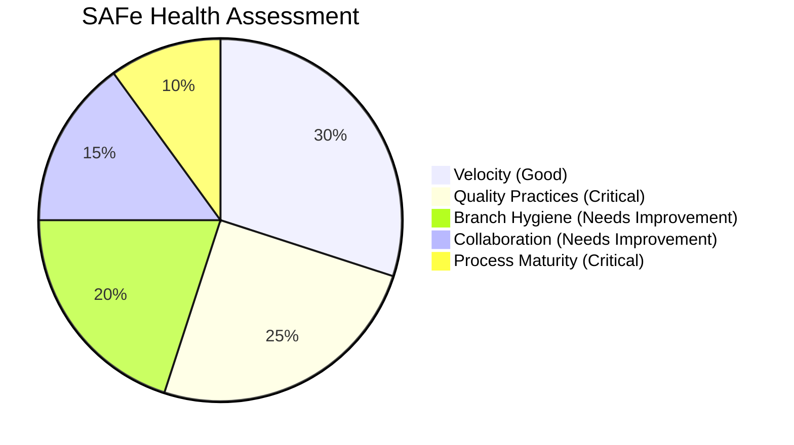

**Overall Rating: NEEDS SIGNIFICANT IMPROVEMENT**

---

## 2. Team Composition & Contribution Analysis

### 2.1 Contributors

| GitHub Handle | Role | Frontend Commits | Backend Commits | Frontend PRs | Backend PRs |
|---------------|------|:---:|:---:|:---:|:---:|
| **ecarinoJS** | Lead Developer | 79 | 30 | 27 | 10 |
| **ccarcuevajairo** | Developer | 27 | 15 | 35 | 15 |
| **RodenCole** | DevOps/Infra | 11 | 12 | 0 | 0 |
| **abernaldezjs** | Backend Dev | 0 | 28 | 0 | 0 |
| **JosephJairo** | Developer | 4 | 0 | 2 | 0 |

### 2.2 Contribution Distribution

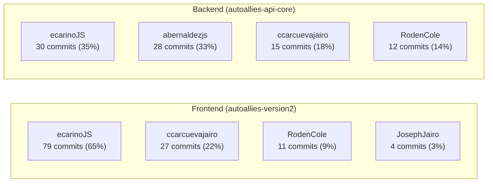

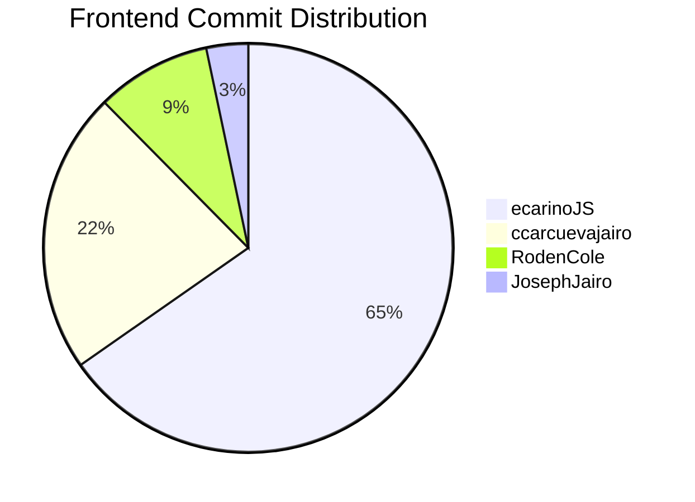

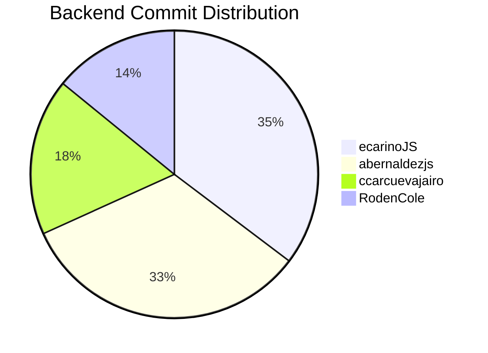

### 2.3 Key Finding: Bus Factor Risk

> **Bus Factor = 1** (ecarinoJS)

ecarinoJS is the sole contributor active across both repos and carries 65% of frontend commits and 35% of backend commits. If this developer becomes unavailable, project velocity would drop by more than 50%.

| Risk | Impact | Likelihood | Mitigation |
|------|--------|-----------|------------|
| ecarinoJS unavailability | Critical | Medium | Cross-train ccarcuevajairo on backend |
| abernaldezjs inactive since Nov 2025 | High | Realized | Backend has no active backend-specialist |
| RodenCole limited to infra/deploy | Medium | Low | Expand scope or document pipelines |

---

## 3. Development Velocity

### 3.1 Monthly PR Activity

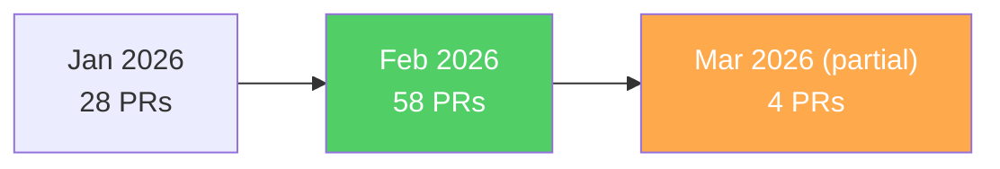

| Month | Frontend PRs | Backend PRs | Total |
|-------|:---:|:---:|:---:|
| Jan 2026 | 25 | 3 | 28 |
| Feb 2026 | 37 | 21 | 58 |
| Mar 2026 (9 days) | 3 | 1 | 4 |

### 3.2 Commit Timeline (Main Branches Only)

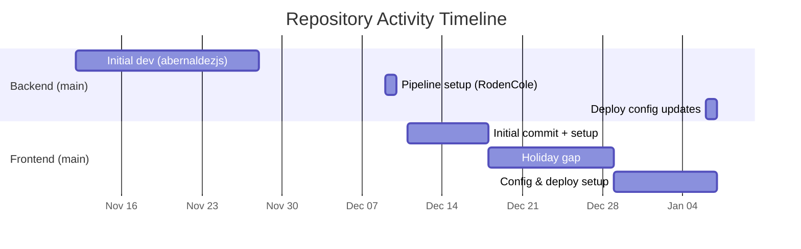

### 3.3 Active Development (develop/dev branches)

The majority of work happens on `develop` (frontend) and `dev` (backend) branches, with **121 commits** on frontend develop and **86 commits** on backend dev.

---

## 4. Pull Request Process Analysis

### 4.1 PR Merge Time (CRITICAL FINDING)

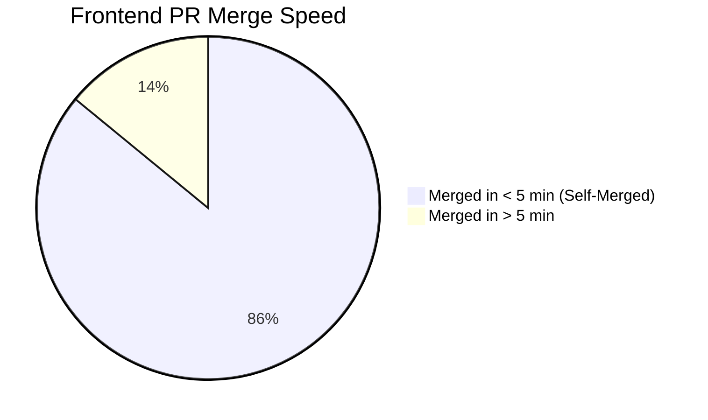

| Metric | Frontend | Backend |
|--------|:---:|:---:|
| Total Merged PRs | 64 | 25 |
| Avg Merge Time | 52.7 min | 0.8 min |
| PRs Merged < 5 min | 55 (86%) | 23 (92%) |
| PRs with Code Reviews | **0 (0%)** | **0 (0%)** |

### 4.2 Critical Issues Identified

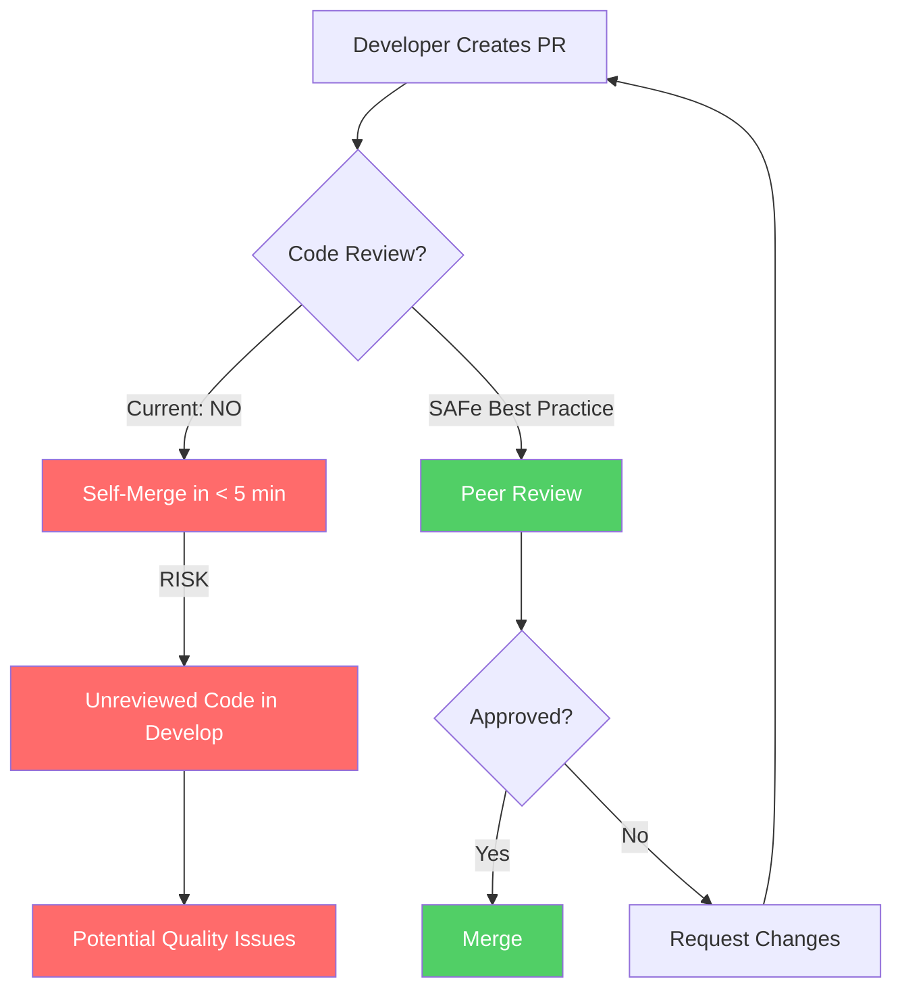

**Findings:**
1. **Zero code reviews** across 89 total PRs — no peer review process exists
2. **Self-merging is the norm** — developers merge their own PRs immediately
3. **PR descriptions are absent** — most PRs have only auto-generated branch-name titles
4. **No PR templates** configured in either repo
5. **No branch protection rules** enforced on `develop` or `dev`

---

## 5. Branch Management

### 5.1 Branch Inventory

| Category | Frontend | Backend |
|----------|:---:|:---:|
| Total Branches | 42 | 16 |
| Active (last 7 days) | 3 | 0 |
| Stale (> 30 days, unmerged) | ~25 | ~8 |
| Environment Branches | 3 (main, develop, staging) | 4 (main, dev, qa, staging) |

### 5.2 Branch Naming Convention Compliance

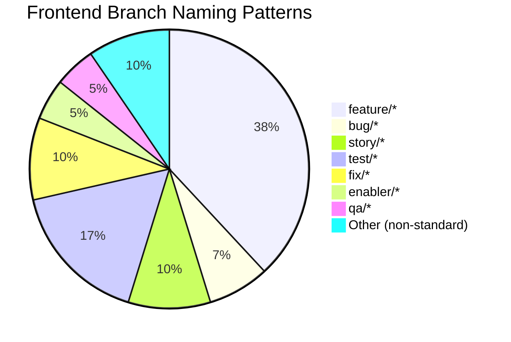

**Naming Assessment:**
- Mixed conventions: `feature/`, `story/`, `enabler/`, `defect/`, `bug/`, `hotfix/` all in use
- Some branches reference ADO work item IDs (e.g., `194658`, `198176`) — good traceability
- Several branches lack work item references — poor traceability
- `test/` branches appear to be used for deployment testing rather than actual tests

### 5.3 Stale Branch Cleanup Needed

The following branches are candidates for deletion (merged or abandoned):

**Frontend (25+ stale branches):**
- `enabler/196427-types-services` (Dec 2025)
- `trymain` (Jan 2026)
- `story/194648-login-ui` (Jan 2026)
- `story/sign-up-wizard` (Jan 2026)
- `feature/login` (Jan 2026)
- `revert-f67d316`, `copilot/revert-f67d316` (Jan 2026)
- `fix/feature-sign-up`, `fix/feature-sign-up.rc`, `fix/signup-cliff-test` (Jan 2026)
- `feature/sign-up-cliff`, `feature/sign-up-cliff-2` (Jan 2026)
- `test/*` branches (Jan-Feb 2026)
- `hotfix/develop-deployment-01202025` (Jan 2026)
- And more...

---

## 6. Branching Strategy Assessment

### 6.1 Current Flow

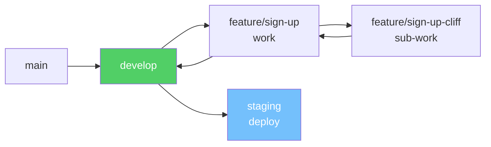

**Observations:**
- Uses a **Gitflow-like** branching model (main -> develop -> feature branches)
- `staging` branch exists but is rarely used (only 1 PR to staging found)
- Sub-branching pattern observed (e.g., `feature/sign-up-cliff` -> `feature/sign-up` -> `develop`)
- **Main branch is stale** — last commit Jan 6, 2026; `develop` is 2+ months ahead
- No evidence of regular release cadence or release branches

### 6.2 Frontend vs Backend Inconsistency

| Aspect | Frontend | Backend |
|--------|----------|---------|
| Main dev branch | `develop` | `dev` |
| Has staging branch | Yes | Yes (`staging`) |
| Has QA branch | No | Yes (`qa`) |
| Release branches | No | Yes (`ready/demo_v1`) |

> **SAFe Recommendation:** Standardize branch naming and environment strategy across both repos.

---

## 7. Commit Quality Analysis

### 7.1 Commit Message Patterns

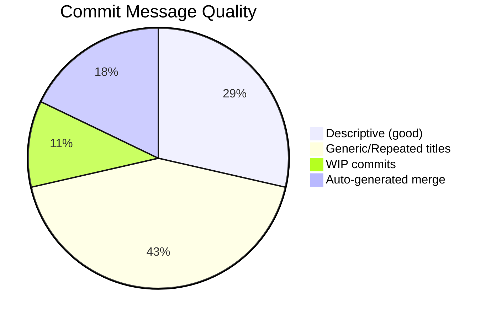

**Issues Found:**
- **Repeated PR titles**: `Feature/instant quote cliff UI 2` used for **15 consecutive PRs** (#33-#56) by ccarcuevajairo
- **WIP commits** pushed to shared branches (e.g., "WIP: test endpoint for product plans")
- **No conventional commit format** (e.g., `feat:`, `fix:`, `chore:`) consistently applied
- Some commits reference ADO work items (good), but many do not

### 7.2 PR Granularity Issue

ccarcuevajairo opened 12 PRs from the same branch (`feature/instant-quote-cliff-ui-2`) to `develop` between Feb 9-23 — all with identical titles. This suggests:
- Work is being committed and merged in very small, unplanned increments
- No sprint-level story decomposition into meaningful PRs
- Difficult to track what changed in each PR

---

## 8. DevOps & CI/CD

### 8.1 Pipeline Configuration

- GitHub Actions workflows detected (auto-deploy trigger files)
- RodenCole manages pipeline/infrastructure configuration
- Auto-deploy files found for both repos

### 8.2 Missing DevOps Practices

| Practice | Status |
|----------|--------|
| Branch protection rules | Not configured |
| Required reviewers | Not configured |
| CI checks (lint, test) | Not evident |
| Automated testing | Not evident |
| PR templates | Not configured |
| CODEOWNERS file | Not present |

---

## 9. SAFe Alignment Assessment

### 9.1 SAFe Principles Scorecard

| SAFe Principle | Score | Notes |
|----------------|:---:|-------|
| Built-in Quality | 1/5 | No reviews, no CI tests, no quality gates |
| Transparency | 2/5 | Some ADO linkage, but inconsistent |
| Program Increment Planning | 2/5 | Work items referenced but no PI structure visible |
| Continuous Delivery Pipeline | 2/5 | Auto-deploy exists but no quality gates |
| DevOps & Relentless Improvement | 1/5 | No retrospective artifacts, no improvement tracking |
| Team Collaboration | 2/5 | Siloed work, no cross-review |

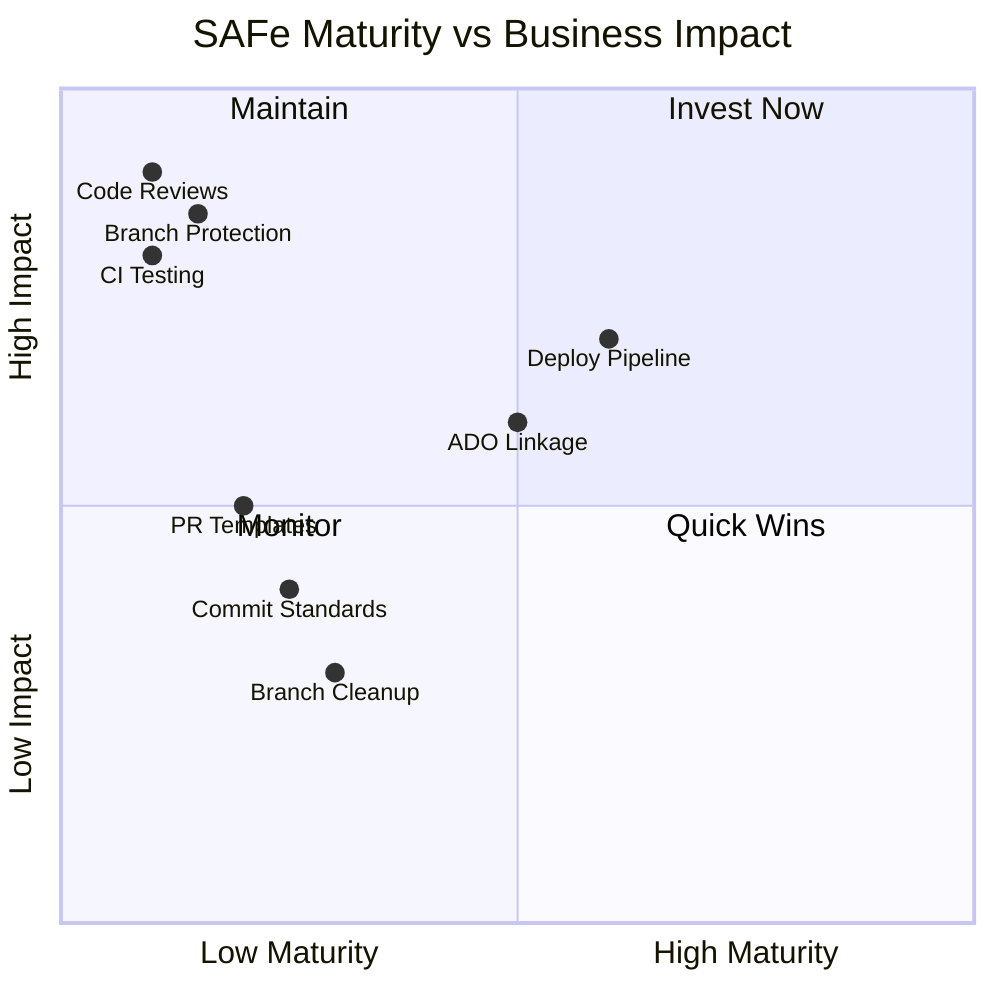

---

## 10. Recommendations (Prioritized)

### CRITICAL (Implement within 1 Sprint)

| # | Action | Owner | Effort |
|---|--------|-------|--------|
| 1 | **Enable branch protection** on `develop`/`dev` requiring at least 1 approving review | Karl (PM) | 1 hr |
| 2 | **Mandate code reviews** — no self-merging to develop/staging/main | Karl (PM) | Policy |
| 3 | **Add PR template** requiring: description, ADO link, test evidence | ecarinoJS | 2 hrs |
| 4 | **Configure CODEOWNERS** to auto-assign reviewers | ecarinoJS | 1 hr |

### HIGH (Implement within 2 Sprints)

| # | Action | Owner | Effort |
|---|--------|-------|--------|
| 5 | **Standardize branch naming** (`feature/`, `bugfix/`, `hotfix/`) with ADO ID requirement | Team | Policy |
| 6 | **Standardize dev branch naming** — use `develop` in both repos | RodenCole | 2 hrs |
| 7 | **Clean up stale branches** (25+ in frontend, 8+ in backend) | All devs | 2 hrs |
| 8 | **Add CI pipeline** with linting and basic tests before merge | RodenCole | 1 sprint |
| 9 | **Cross-train ccarcuevajairo** on backend to reduce bus factor | ecarinoJS | Ongoing |

### MEDIUM (Implement within PI)

| # | Action | Owner | Effort |
|---|--------|-------|--------|
| 10 | **Adopt conventional commits** (`feat:`, `fix:`, `chore:`) | Team | Training |
| 11 | **Establish release cadence** — regular merges from develop to main | Karl (PM) | Process |
| 12 | **Meaningful PR titles & descriptions** — stop reusing branch names | Team | Training |
| 13 | **Consolidate small PRs** into story-level PRs | Team | Practice |

---

## 11. Summary Dashboard

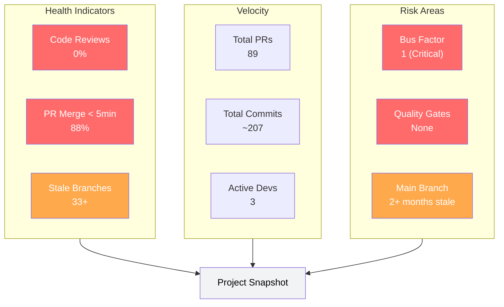

---

## Appendix A: Data Sources

- GitHub API (repos, commits, PRs, branches, contributors)
- Audit date: 2026-03-09
- Repos: `jairosoft-com/autoallies-version2`, `jairosoft-com/autoallies-api-core`

## Appendix B: Glossary

| Term | Definition |
|------|-----------|
| **Bus Factor** | The minimum number of team members who would need to leave before the project stalls |
| **SAFe** | Scaled Agile Framework |
| **PI** | Program Increment (~8-12 weeks) |
| **ADO** | Azure DevOps |
| **PR** | Pull Request |
