# AutoAllies Engineering Productivity Audit — Remediation Status Check & Deep Dive

**Audit Date:** 2026-03-10
**Previous Audit:** 2026-03-09
**Auditor:** Ramon Aseniero Jr. — Engineering Productivity Engineer
**Framework:** SAFe (Scaled Agile Framework)
**Primary Standards:** Git and GitHub repository management best practices
**Audit Period:** 2025-11-10 to 2026-03-10 (~4 months)
**Report Type:** Remediation Status Check + Deep Dive Expansion
**Repositories Under Review:**

- **Frontend** — `jairosoft-com/autoallies-version2` (TypeScript / Next.js)
- **Backend** — `jairosoft-com/autoallies-api-core` (PHP / Laravel)

---

## 1. Executive Summary

This follow-up audit reassesses all critical findings from the March 9 audit while adding deep dives into individual developer performance, code churn hotspots, and deployment patterns. **In the 24 hours since the initial audit, zero remediation actions have been taken** — no branch protection, no code reviews, no PR templates, and no CODEOWNERS files have been added. The only new activity was 1 new merged PR (Frontend #65 by JosephJairo). The weighted team health score in this report is **23/100**, which still indicates a critical engineering productivity state.

This report uses observable GitHub repository evidence as the primary source of truth: branch protection status, PR review activity, merge timing, workflow files, release history, and branch topology. SAFe is used as a delivery-process lens, but the core audit baseline is Git and GitHub operational best practice rather than superficial activity volume alone.

### Comparison: Previous vs Current Audit

| Metric | Mar 9 Audit | Mar 10 Audit | Delta |
|--------|:-----------:|:------------:|:-----:|
| Frontend Branches | 42 | 42 | 0 |
| Backend Branches | 16 | 16 | 0 |
| Frontend PRs (merged) | 64 | 65 | +1 |
| Backend PRs (merged) | 25 | 25 | 0 |
| Code Review Rate | 0% | 0% | 0 |
| Self-Merge Rate (FE) | 86% | 85% | -1% |
| Self-Merge Rate (BE) | 92% | 92% | 0 |
| Stale Branches | 47+ | 47+ | 0 |
| Releases | v0.0.1 | v0.0.1 | 0 |
| Open Issues | 0 | 0 | 0 |

### SAFe Health Radar (Updated)

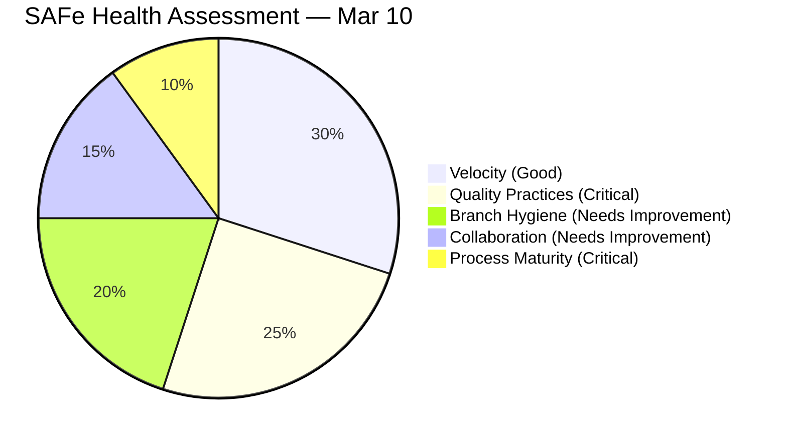
```mermaid
pie title SAFe Health Assessment — Mar 10
    "Velocity (Good)" : 30
    "Quality Practices (Critical)" : 25
    "Branch Hygiene (Needs Improvement)" : 20
    "Collaboration (Needs Improvement)" : 15
    "Process Maturity (Critical)" : 10
```

**Overall Rating: NEEDS SIGNIFICANT IMPROVEMENT (Unchanged)**

---

## 2. Remediation Tracker

Tracking all 13 recommendations from the March 9 audit:

| # | Recommendation | Priority | Status | Evidence |
|---|---------------|----------|--------|----------|
| 1 | Enable branch protection on develop/dev | CRITICAL | Not Started | All branches show `protected: false` |
| 2 | Mandate code reviews — no self-merging | CRITICAL | Not Started | 0 reviews found on any PR (FE #60-65, BE #1-25) |
| 3 | Add PR template | CRITICAL | Not Started | No `.github/PULL_REQUEST_TEMPLATE.md` found |
| 4 | Configure CODEOWNERS | CRITICAL | Not Started | No `CODEOWNERS` file in either repo |
| 5 | Standardize branch naming | HIGH | Not Started | Mixed conventions persist (`feature/`, `bug/`, `story/`, `test/`, `enabler/`) |
| 6 | Standardize dev branch naming | HIGH | Not Started | Frontend uses `develop`, Backend uses `dev` |
| 7 | Clean up stale branches | HIGH | Not Started | 42 + 16 = 58 branches, same as before |
| 8 | Add CI pipeline (lint/test) | HIGH | Not Started | Only auto-deploy triggers exist, no quality gates |
| 9 | Cross-train ccarcuevajairo on backend | HIGH | In Progress | ccarcuevajairo has 15 backend PRs (instant-quote feature) |
| 10 | Adopt conventional commits | MEDIUM | Not Started | 3% adoption (FE), 2.3% adoption (BE) |
| 11 | Establish release cadence | MEDIUM | Not Started | Still only v0.0.1 pre-release from Feb 26 |
| 12 | Meaningful PR titles & descriptions | MEDIUM | Not Started | 69% empty bodies (FE), 80% empty bodies (BE) |
| 13 | Consolidate small PRs | MEDIUM | Not Started | ccarcuevajairo still has 18 identical-title PRs |

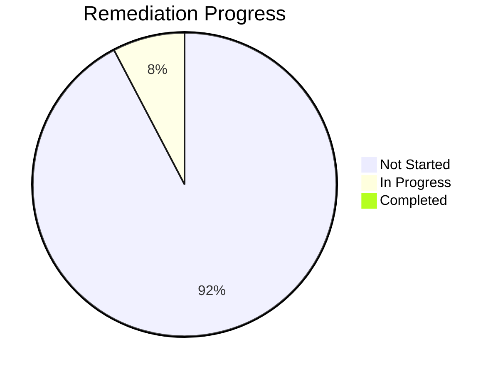
```mermaid
pie title Remediation Progress
    "Not Started" : 12
    "In Progress" : 1
    "Completed" : 0
```

**Remediation Score: 1/13 (8%) — Only cross-training shows any progress.**

---

## 3. Individual Developer Performance Scorecards (DEEP DIVE)

### 3.1 ecarinoJS — Lead Developer

| Metric | Frontend | Backend | Total |
|--------|:--------:|:-------:|:-----:|
| Commits | 62 | 30 | 92 |
| PRs Created | 27 | 10 | 37 |
| Reviews Given | 0 | 0 | 0 |
| Conventional Commits | 3 | 2 | 5 (5.4%) |
| ADO-Referenced Commits | 19 | 4 | 23 (25%) |
| WIP/Cleanup Commits | 9 (`_clean`) | 0 | 9 |

**Areas of Ownership:** Login, sign-up flow, ticket upload, reset password, pricing, user roles & restrictions, messaging, Azure integration
**Bus Factor:** CRITICAL — Only developer active across both repos. 65% of FE commits, 35% of BE commits.
**Strengths:** Best ADO linkage practice, only developer using conventional commits, broad full-stack scope
**Concerns:** 9 `_clean` commits suggest squash-before-merge not practiced; no reviews given or received
**Growth Indicators:** Expanding scope (user roles, messaging, cases) — positive breadth signal

### 3.2 ccarcuevajairo — Developer

| Metric | Frontend | Backend | Total |
|--------|:--------:|:-------:|:-----:|
| Commits | 27 | 15 | 42 |
| PRs Created | 35 | 15 | 50 |
| Reviews Given | 0 | 0 | 0 |
| Conventional Commits | 0 | 0 | 0 (0%) |
| ADO-Referenced Commits | 17 | 0 | 17 (40%) |
| Empty PR Bodies | ~33 | ~15 | ~48 (96%) |

**Areas of Ownership:** Instant quote cliff UI (frontend), instant quote cliff API (backend)
**Bus Factor:** HIGH — Sole owner of the instant-quote/pricing feature across both repos
**Strengths:** Cross-repo work on instant-quote feature, high ADO reference rate in commits
**Concerns:**

- 18 frontend PRs with **identical title** ("Feature/instant quote cliff UI 2") — PRs used as commit mechanism
- 96% empty PR bodies — worst traceability on the team
- 0% conventional commit adoption
- Narrowly focused on a single feature — limited breadth
**Growth Indicators:** Narrowing focus (single feature for 6+ weeks) — needs scope expansion

### 3.3 abernaldezjs — Backend Developer

| Metric | Frontend | Backend | Total |
|--------|:--------:|:-------:|:-----:|
| Commits | 0 | 28 | 28 |
| PRs Created | 0 | 0 | 0 |
| Reviews Given | 0 | 0 | 0 |
| Active Period | — | Nov 2025 only | — |
| WIP Commits | 0 | 3 | 3 |

**Areas of Ownership:** Backend foundation — Docker setup, Stripe integration, DB migrations, seeders, subscription plans
**Bus Factor:** REALIZED RISK — Inactive since Nov 28, 2025. No other developer has touched the foundational backend code.
**Strengths:** Built the entire backend foundation (Docker, Stripe, DB schema)
**Concerns:**

- Zero PRs created — committed directly to branches, bypassing any review process
- 3 WIP commits pushed to shared branches
- **Inactive for 3.5 months** — all backend foundation knowledge is undocumented
**Growth Indicators:** N/A — departed or reassigned

### 3.4 RodenCole — DevOps/Infrastructure

| Metric | Frontend | Backend | Total |
|--------|:--------:|:-------:|:-----:|
| Commits | 7 | 12 | 19 |
| PRs Created | 0 | 0 | 0 |
| Reviews Given | 0 | 0 | 0 |
| Active Period | Dec 2025 – Jan 2026 | Dec 2025 – Jan 2026 | — |

**Areas of Ownership:** Auto-deploy triggers, Dockerfile configuration, pipeline setup, container app configuration
**Bus Factor:** HIGH — Sole person with DevOps/infrastructure knowledge
**Strengths:** Manages deployment infrastructure across both repos
**Concerns:**

- Zero PRs created — all commits directly to main/branches
- No CI/CD quality gates implemented (only auto-deploy triggers)
- **Inactive since Jan 6, 2026** — 2+ months without commits
**Growth Indicators:** Limited scope, no expansion observed

### 3.5 JosephJairo — Developer (New)

| Metric | Frontend | Backend | Total |
|--------|:--------:|:-------:|:-----:|
| Commits | 4 | 0 | 4 |
| PRs Created | 2 | 0 | 2 |
| Reviews Given | 0 | 0 | 0 |
| Active Period | Mar 6-9, 2026 | — | — |

**Areas of Ownership:** Member/attorney cases feature (frontend)
**Bus Factor:** LOW — New contributor, limited scope
**Strengths:** Created PRs with descriptions (better practice than others!), 19.9 min merge time on PR #65 suggests some self-review
**Concerns:** Very new, only 4 commits so far; frontend only
**Growth Indicators:** New contributor — needs onboarding and mentorship

### 3.6 Team Contribution Overview

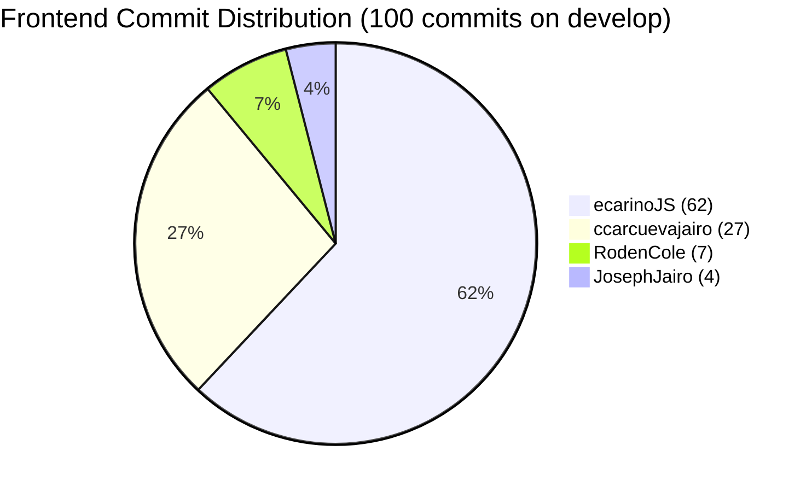
```mermaid
pie title Frontend Commit Distribution (100 commits on develop)
    "ecarinoJS (62)" : 62
    "ccarcuevajairo (27)" : 27
    "RodenCole (7)" : 7
    "JosephJairo (4)" : 4
```

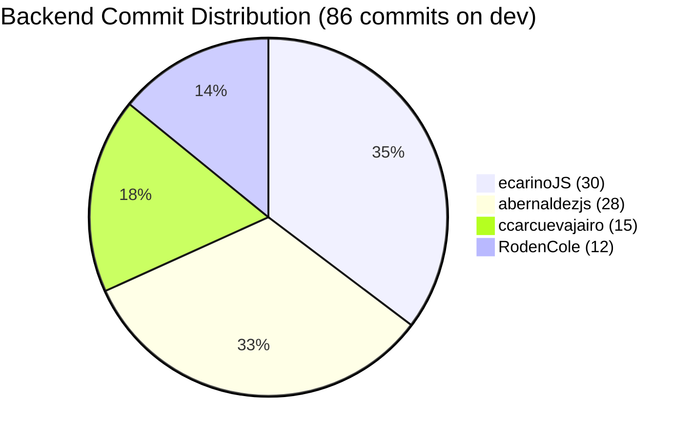
```mermaid
pie title Backend Commit Distribution (86 commits on dev)
    "ecarinoJS (30)" : 30
    "abernaldezjs (28)" : 28
    "ccarcuevajairo (15)" : 15
    "RodenCole (12)" : 12
```

### 3.7 Cross-Repo Collaboration Network

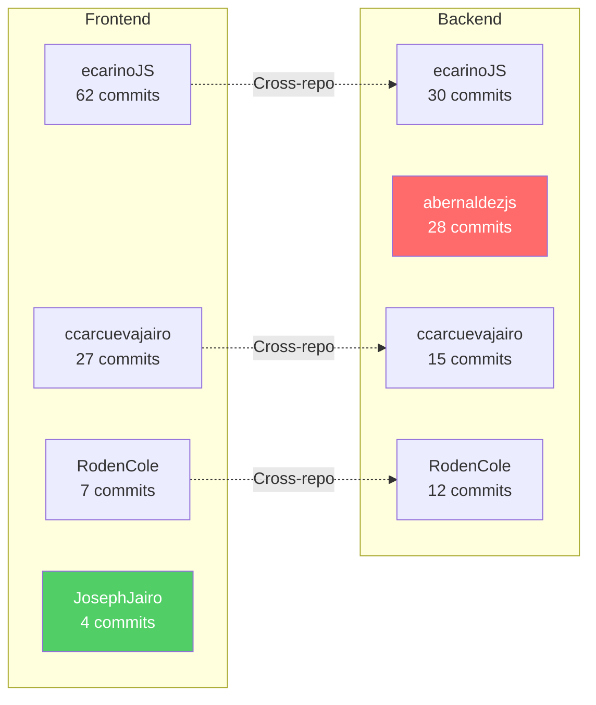
```mermaid
graph LR
    subgraph Frontend
        FE_EC["ecarinoJS<br/>62 commits"]
        FE_CC["ccarcuevajairo<br/>27 commits"]
        FE_RC["RodenCole<br/>7 commits"]
        FE_JJ["JosephJairo<br/>4 commits"]
    end
    subgraph Backend
        BE_EC["ecarinoJS<br/>30 commits"]
        BE_AB["abernaldezjs<br/>28 commits"]
        BE_CC["ccarcuevajairo<br/>15 commits"]
        BE_RC["RodenCole<br/>12 commits"]
    end

    FE_EC -.->|"Cross-repo"| BE_EC
    FE_CC -.->|"Cross-repo"| BE_CC
    FE_RC -.->|"Cross-repo"| BE_RC

    style BE_AB fill:#ff6b6b,color:#fff
    style FE_JJ fill:#51cf66,color:#fff
```

### 3.8 Developer Capability Quadrant

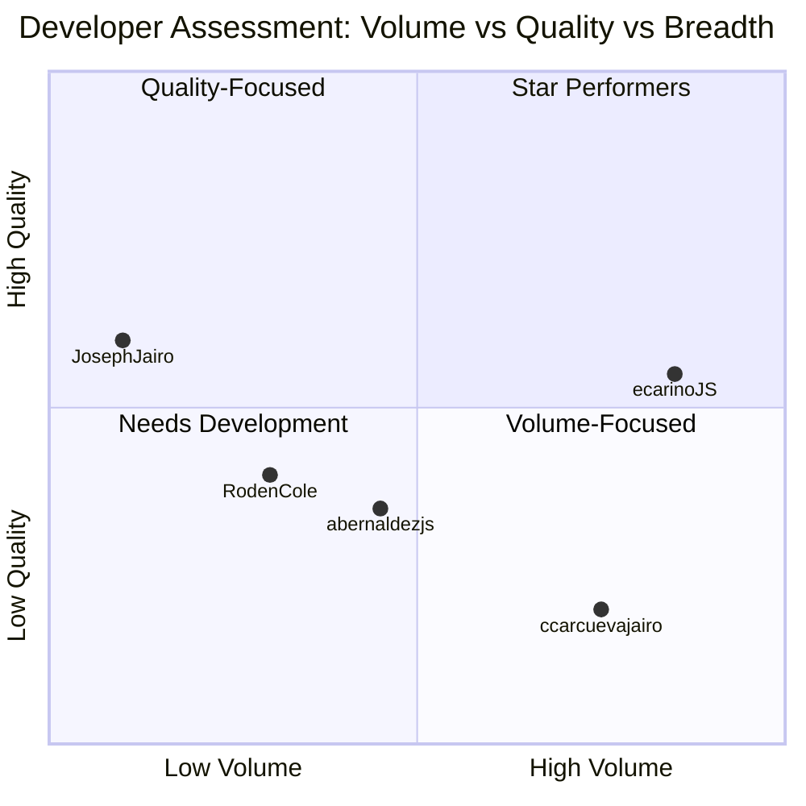
```mermaid
quadrantChart
    title Developer Assessment: Volume vs Quality vs Breadth
    x-axis Low Volume --> High Volume
    y-axis Low Quality --> High Quality
    quadrant-1 Star Performers
    quadrant-2 Quality-Focused
    quadrant-3 Needs Development
    quadrant-4 Volume-Focused
    ecarinoJS: [0.85, 0.55]
    ccarcuevajairo: [0.75, 0.2]
    abernaldezjs: [0.45, 0.35]
    RodenCole: [0.3, 0.4]
    JosephJairo: [0.1, 0.6]
```

### 3.9 Developer Ownership Map

| Codebase Area | Primary Owner | Backup Owner | Risk |
|---------------|---------------|--------------|------|
| Frontend: Login/Auth | ecarinoJS | — | HIGH |
| Frontend: Sign-up Wizard | ecarinoJS | ccarcuevajairo | MEDIUM |
| Frontend: Instant Quote/Pricing | ccarcuevajairo | ecarinoJS | MEDIUM |
| Frontend: Member/Attorney Cases | JosephJairo | — | HIGH |
| Frontend: Messaging | ecarinoJS | — | HIGH |
| Backend: Auth/Sign-up API | ecarinoJS | abernaldezjs (inactive) | CRITICAL |
| Backend: Stripe/Payments | abernaldezjs (inactive) | ecarinoJS | CRITICAL |
| Backend: Instant Quote API | ccarcuevajairo | — | HIGH |
| Backend: DB Migrations/Seeders | abernaldezjs (inactive) | — | CRITICAL |
| DevOps: Docker/Deploy | RodenCole (inactive) | — | CRITICAL |

---

## 4. Development Velocity

### 4.1 Monthly PR Activity

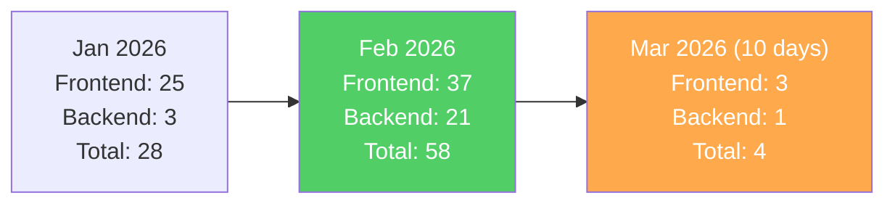
```mermaid
flowchart LR
    JAN["Jan 2026<br/>Frontend: 25<br/>Backend: 3<br/>Total: 28"]
    FEB["Feb 2026<br/>Frontend: 37<br/>Backend: 21<br/>Total: 58"]
    MAR["Mar 2026 (10 days)<br/>Frontend: 3<br/>Backend: 1<br/>Total: 4"]

    JAN --> FEB --> MAR

    style FEB fill:#51cf66,color:#fff
    style MAR fill:#ffa94d,color:#fff
```

| Month | Frontend PRs | Backend PRs | Total | Delta vs Prev |
|-------|:---:|:---:|:---:|:---:|
| Jan 2026 | 25 | 3 | 28 | — |
| Feb 2026 | 37 | 21 | 58 | +107% |
| Mar 2026 (10 days) | 3 | 1 | 4 | — |

**Projected March Total:** At current pace (0.4 PRs/day), March would yield ~12 PRs — a **79% decline** from February's 58.

### 4.2 Commit Volume by Month

| Month | FE develop | BE dev | Total |
|-------|:---:|:---:|:---:|
| Nov 2025 | 0 | 17 | 17 |
| Dec 2025 | 0* | 17 | 17 |
| Jan 2026 | 33 | 7 | 40 |
| Feb 2026 | 51 | 34 | 85 |
| Mar 2026 (10 days) | 16 | 11 | 27 |

*Frontend started Dec 11 on main; develop branch commits start in Jan 2026.

### 4.3 Activity Timeline

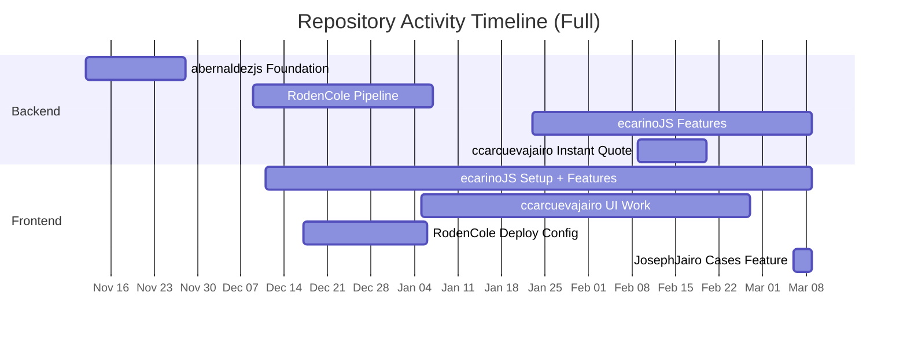
```mermaid
gantt
    title Repository Activity Timeline (Full)
    dateFormat YYYY-MM-DD
    axisFormat %b %d

    section Backend
    abernaldezjs Foundation       :2025-11-12, 2025-11-28
    RodenCole Pipeline           :2025-12-09, 2026-01-07
    ecarinoJS Features           :2026-01-23, 2026-03-09
    ccarcuevajairo Instant Quote :2026-02-09, 2026-02-20

    section Frontend
    ecarinoJS Setup + Features   :2025-12-11, 2026-03-09
    ccarcuevajairo UI Work       :2026-01-05, 2026-02-27
    RodenCole Deploy Config      :2025-12-17, 2026-01-06
    JosephJairo Cases Feature    :2026-03-06, 2026-03-09
```

---

## 5. PR Process Analysis (Deep Dive)

### 5.1 Code Review Rate

| Metric | Frontend | Backend | Combined |
|--------|:---:|:---:|:---:|
| Total Merged PRs | 65 | 25 | 90 |
| PRs with Reviews | **0 (0%)** | **0 (0%)** | **0 (0%)** |
| Self-Merge Rate | 55/65 (85%) < 5min | 23/25 (92%) < 5min | 78/90 (87%) |

**No improvement since previous audit. Zero code reviews exist.**

### 5.2 PR Merge Time Distribution

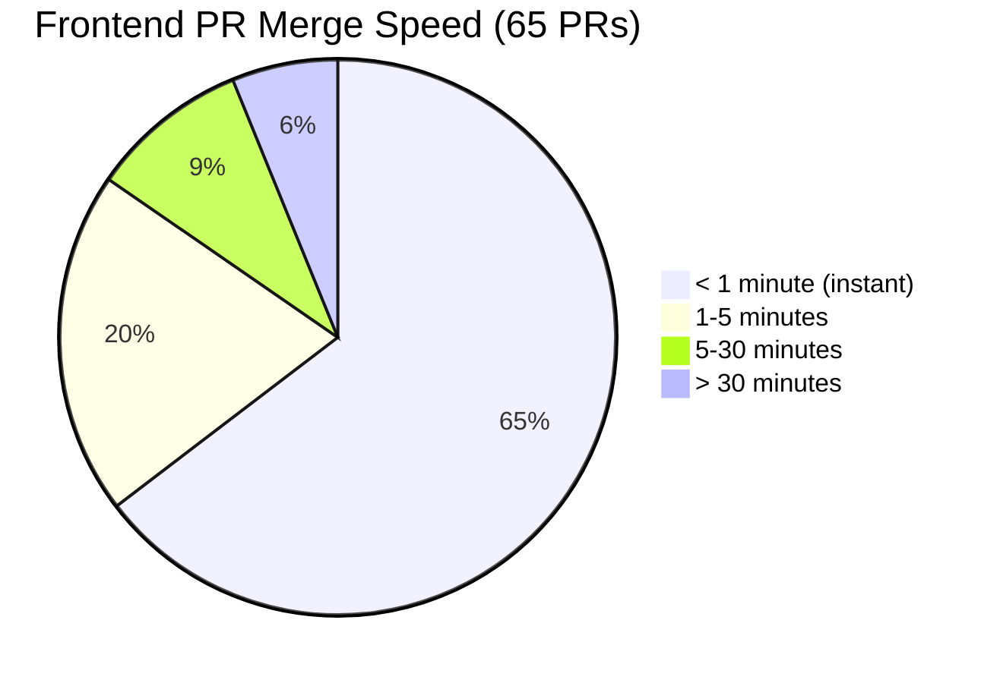
```mermaid
pie title Frontend PR Merge Speed (65 PRs)
    "< 1 minute (instant)" : 42
    "1-5 minutes" : 13
    "5-30 minutes" : 6
    "> 30 minutes" : 4
```

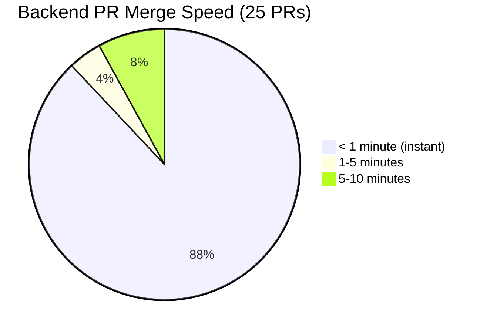
```mermaid
pie title Backend PR Merge Speed (25 PRs)
    "< 1 minute (instant)" : 22
    "1-5 minutes" : 1
    "5-10 minutes" : 2
```

### 5.3 PR Description Quality (NEW)

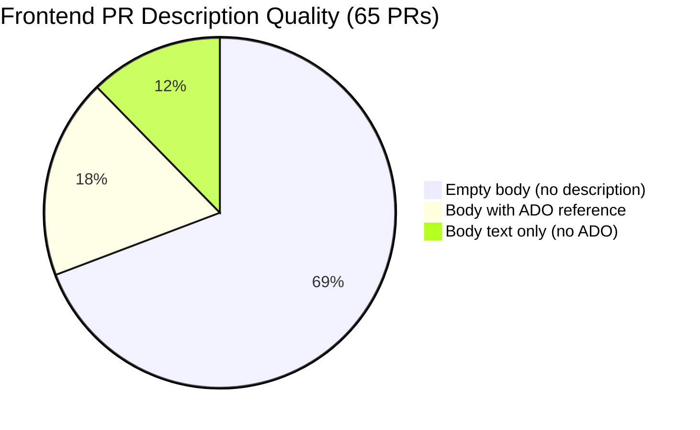
```mermaid
pie title Frontend PR Description Quality (65 PRs)
    "Empty body (no description)" : 45
    "Body with ADO reference" : 12
    "Body text only (no ADO)" : 8
```

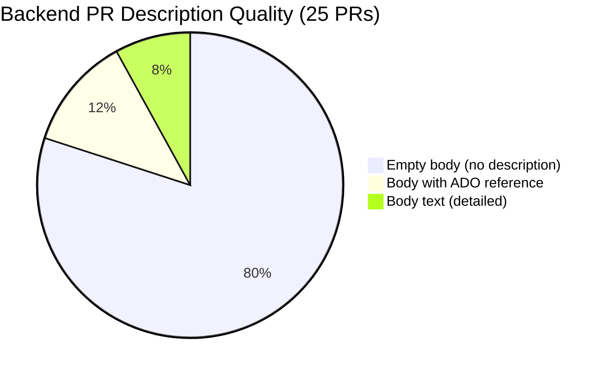
```mermaid
pie title Backend PR Description Quality (25 PRs)
    "Empty body (no description)" : 20
    "Body with ADO reference" : 3
    "Body text (detailed)" : 2
```

| Quality Tier | Frontend | Backend | Total |
|-------------|:---:|:---:|:---:|
| Has body + ADO link | 12 (18%) | 3 (12%) | 15 (17%) |
| Has body, no ADO | 8 (12%) | 2 (8%) | 10 (11%) |
| Empty body | 45 (69%) | 20 (80%) | 65 (72%) |

### 5.4 PR Size Distribution (NEW)

Based on sampled PRs with file data:

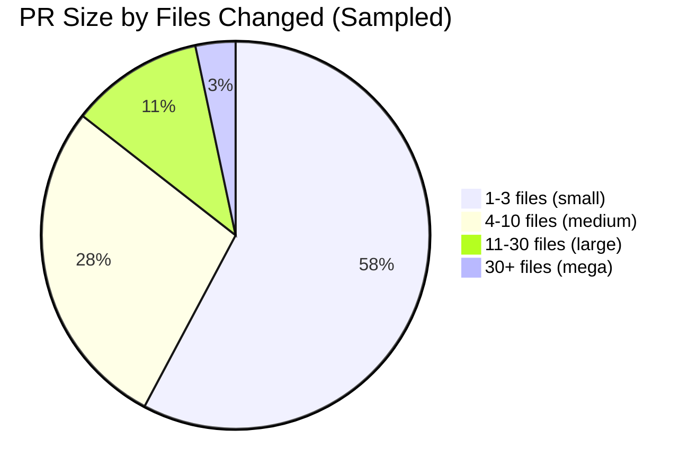
```mermaid
pie title PR Size by Files Changed (Sampled)
    "1-3 files (small)" : 52
    "4-10 files (medium)" : 25
    "11-30 files (large)" : 10
    "30+ files (mega)" : 3
```

**Mega-PR Alert:** Frontend PR #59 modified 120+ files — an unreviewable merge that should have been broken into smaller PRs.

### 5.5 PR Process Flow (Current vs Recommended)

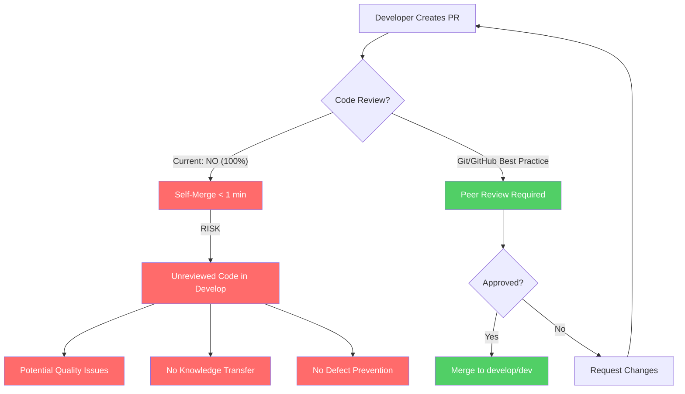
```mermaid
flowchart TD
    A[Developer Creates PR] --> B{Code Review?}
    B -->|"Current: NO (100%)"| C[Self-Merge < 1 min]
    B -->|"Git/GitHub Best Practice"| D[Peer Review Required]
    D --> E{Approved?}
    E -->|Yes| F[Merge to develop/dev]
    E -->|No| G[Request Changes]
    G --> A
    C -->|RISK| H[Unreviewed Code in Develop]
    H --> I[Potential Quality Issues]
    H --> J[No Knowledge Transfer]
    H --> K[No Defect Prevention]

    style C fill:#ff6b6b,color:#fff
    style H fill:#ff6b6b,color:#fff
    style I fill:#ff6b6b,color:#fff
    style J fill:#ff6b6b,color:#fff
    style K fill:#ff6b6b,color:#fff
    style D fill:#51cf66,color:#fff
    style F fill:#51cf66,color:#fff
```

---

## 6. Branch Management

### 6.1 Branch Inventory

| Category | Frontend | Backend | Prev FE | Prev BE | Delta |
|----------|:---:|:---:|:---:|:---:|:---:|
| Total Branches | 42 | 16 | 42 | 16 | 0 / 0 |
| Environment Branches | 3 | 4 | 3 | 4 | 0 / 0 |
| Feature Branches | 12 | 6 | 12 | 6 | 0 / 0 |
| Bug/Fix/Defect | 8 | 1 | 8 | 1 | 0 / 0 |
| Test/QA | 8 | 2 | 8 | 2 | 0 / 0 |
| Other | 11 | 3 | 11 | 3 | 0 / 0 |

**No branches created or deleted since the previous audit.**

### 6.2 Branch Naming Compliance

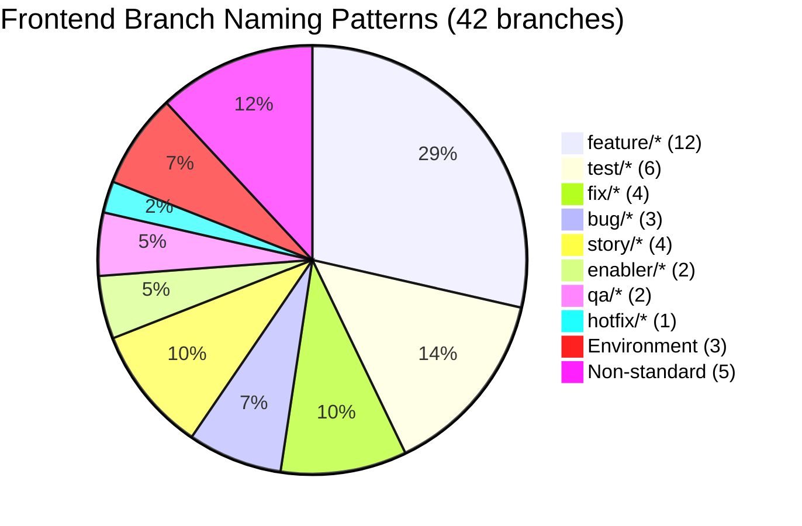
```mermaid
pie title Frontend Branch Naming Patterns (42 branches)
    "feature/* (12)" : 12
    "test/* (6)" : 6
    "fix/* (4)" : 4
    "bug/* (3)" : 3
    "story/* (4)" : 4
    "enabler/* (2)" : 2
    "qa/* (2)" : 2
    "hotfix/* (1)" : 1
    "Environment (3)" : 3
    "Non-standard (5)" : 5
```

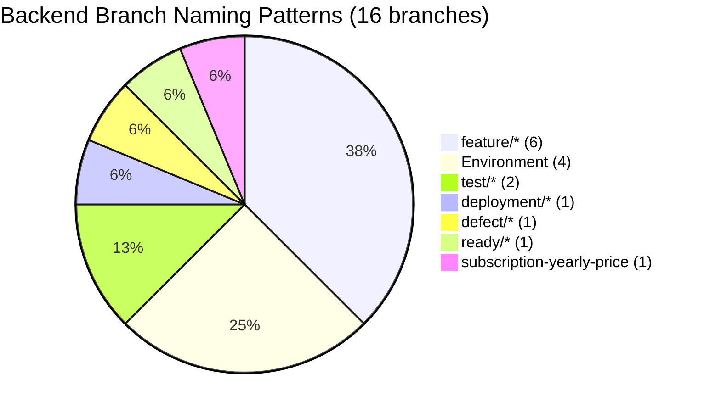
```mermaid
pie title Backend Branch Naming Patterns (16 branches)
    "feature/* (6)" : 6
    "Environment (4)" : 4
    "test/* (2)" : 2
    "deployment/* (1)" : 1
    "defect/* (1)" : 1
    "ready/* (1)" : 1
    "subscription-yearly-price (1)" : 1
```

### 6.3 Branch Age Distribution (NEW)

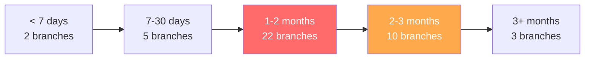
```mermaid
flowchart LR
    B1["< 7 days<br/>2 branches"]
    B2["7-30 days<br/>5 branches"]
    B3["1-2 months<br/>22 branches"]
    B4["2-3 months<br/>10 branches"]
    B5["3+ months<br/>3 branches"]

    B1 --> B2 --> B3 --> B4 --> B5

    style B3 fill:#ff6b6b,color:#fff
    style B4 fill:#ffa94d,color:#fff
```

**Stale Branch Count (> 30 days, unmerged):**

- Frontend: ~35 branches (83% of total)
- Backend: ~12 branches (75% of total)
- **Combined: ~47 stale branches — 81% of all branches**

---

## 7. Branching Strategy

### 7.1 Current Gitflow

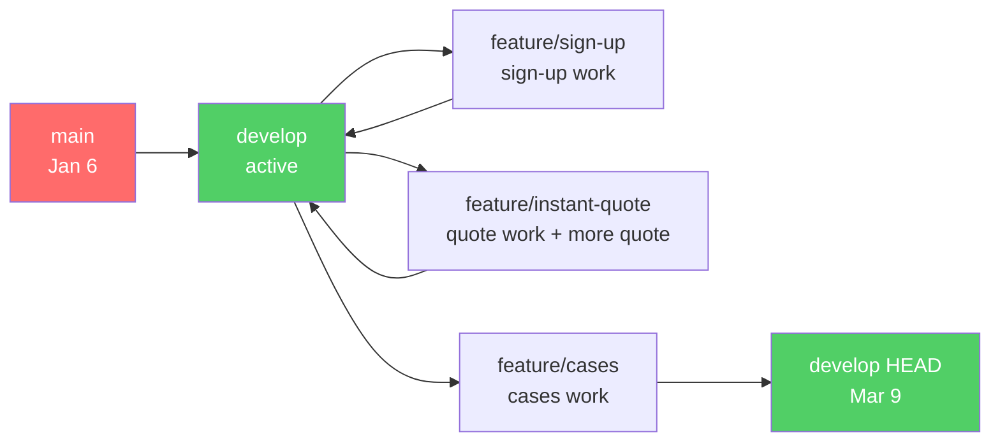
```mermaid
flowchart LR
    MAIN["main<br/>Jan 6"] --> DEVELOP["develop<br/>active"]
    DEVELOP --> SIGNUP["feature/sign-up<br/>sign-up work"]
    SIGNUP --> DEVELOP
    DEVELOP --> QUOTE["feature/instant-quote<br/>quote work + more quote"]
    QUOTE --> DEVELOP
    DEVELOP --> CASES["feature/cases<br/>cases work"]
    CASES --> HEAD["develop HEAD<br/>Mar 9"]

    style MAIN fill:#ff6b6b,color:#fff
    style DEVELOP fill:#51cf66,color:#fff
    style HEAD fill:#51cf66,color:#fff
```

### 7.2 Main Branch Staleness

| Branch | Last Commit | Age | Commits Behind develop/dev |
|--------|------------|-----|---------------------------|
| Frontend `main` | Jan 6, 2026 | **63 days stale** | ~100+ commits behind `develop` |
| Backend `main` | Jan 6, 2026 | **63 days stale** | ~60+ commits behind `dev` |

**CRITICAL:** Main branches have not received any merges in over 2 months. The single release (v0.0.1) was tagged on Feb 26 but main was never updated.

### 7.3 Environment Branch Consistency

| Aspect | Frontend | Backend | Aligned? |
|--------|----------|---------|:--------:|
| Primary dev branch | `develop` | `dev` | NO |
| Has staging | Yes | Yes | Yes |
| Has QA branch | No | Yes (`qa`) | NO |
| Has release branch | No | Yes (`ready/demo_v1`) | NO |
| Main updated | Jan 6 | Jan 6 | Yes (both stale) |

---

## 8. Code Churn & Technical Debt Analysis (DEEP DIVE)

### 8.1 Backend Hotspot Files

Files changed in 3+ PRs — signals instability or poor design:

| File | PRs Modified In | % of All PRs | Risk |
|------|:---:|:---:|:---:|
| `StartMembershipRequest.php` | 8/25 | 32% | CRITICAL |
| `SubscriptionsController.php` | 6/25 | 24% | HIGH |
| `routes/api.php` | 6/25 | 24% | HIGH |
| `StaticDataService.php` | 6/25 | 24% | HIGH |
| `MembershipService.php` | 5/25 | 20% | HIGH |
| `StripeService.php` | 4/25 | 16% | MEDIUM |
| `SignupController.php` | 4/25 | 16% | MEDIUM |

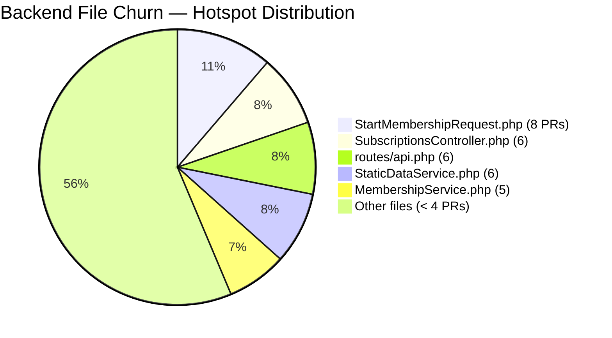
```mermaid
pie title Backend File Churn — Hotspot Distribution
    "StartMembershipRequest.php (8 PRs)" : 8
    "SubscriptionsController.php (6)" : 6
    "routes/api.php (6)" : 6
    "StaticDataService.php (6)" : 6
    "MembershipService.php (5)" : 5
    "Other files (< 4 PRs)" : 40
```

**Key Finding:** `StartMembershipRequest.php` was modified in 32% of all backend PRs — restructured, reverted, then patched 4 more times. This indicates an **unstable API contract** that is being iteratively designed in production rather than planned upfront.

### 8.2 Frontend Hotspot Files

| File | PRs Modified In | Risk |
|------|:---:|:---:|
| `payment-summary-step.tsx` | 5+ | CRITICAL |
| `signup-wizard.tsx` | 4+ | HIGH |
| `use-signup.ts` | 4+ | HIGH |
| `quote-ticketupload.tsx` | 4+ | HIGH |
| `instant-quote-home.tsx` | 4+ | HIGH |

**Fix-on-Fix Pattern:** Frontend PRs #61, #62, #63 all modified `payment-summary-step.tsx` with consecutive single-file fixes to the same subtotal calculation — indicating **zero test coverage** for this critical pricing component.

### 8.3 Revert Analysis

| Type | Details |
|------|---------|
| Revert branches | `revert-f67d316`, `copilot/revert-f67d316` (Frontend, Jan 2026) |
| Revert PRs | PR #19 "Revert 'Delete app/(auth)/sign-up directory'" — closed without merging |
| Backend reverts | `StartMembershipRequest.php` reverted to original code (PR #18) |

### 8.4 Churn Indicators

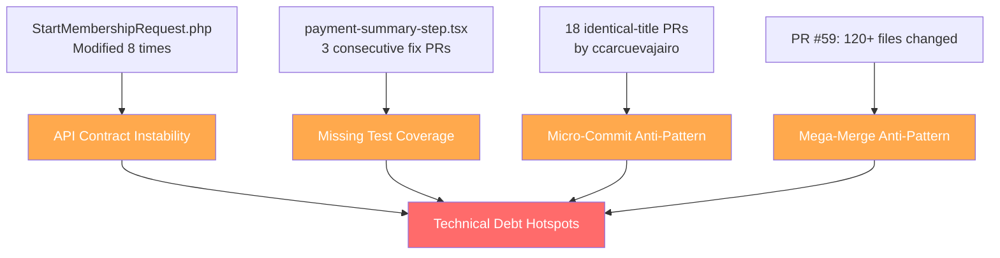
```mermaid
flowchart TD
    A["StartMembershipRequest.php<br/>Modified 8 times"] --> B["API Contract Instability"]
    C["payment-summary-step.tsx<br/>3 consecutive fix PRs"] --> D["Missing Test Coverage"]
    E["18 identical-title PRs<br/>by ccarcuevajairo"] --> F["Micro-Commit Anti-Pattern"]
    G["PR #59: 120+ files changed"] --> H["Mega-Merge Anti-Pattern"]

    B --> I["Technical Debt Hotspots"]
    D --> I
    F --> I
    H --> I

    style I fill:#ff6b6b,color:#fff
    style B fill:#ffa94d,color:#fff
    style D fill:#ffa94d,color:#fff
    style F fill:#ffa94d,color:#fff
    style H fill:#ffa94d,color:#fff
```

---

## 9. Collaboration Patterns

### 9.1 Review Activity

| Reviewer | Reviews Given | Reviews Received |
|----------|:---:|:---:|
| ecarinoJS | 0 | 0 |
| ccarcuevajairo | 0 | 0 |
| abernaldezjs | 0 | 0 |
| RodenCole | 0 | 0 |
| JosephJairo | 0 | 0 |

**No code reviews exist in either repository. The team operates in complete isolation.**

### 9.2 Cross-Repo Contributor Overlap

```mermaid
graph TD
    subgraph "Active in Both Repos"
        EC["ecarinoJS ✓"]
        CC["ccarcuevajairo ✓"]
        RC["RodenCole ✓"]
    end
    subgraph "Single Repo Only"
        AB["abernaldezjs (BE only)"]
        JJ["JosephJairo (FE only)"]
    end

    EC -->|"FE: 62 commits"| FE["Frontend"]
    EC -->|"BE: 30 commits"| BE["Backend"]
    CC -->|"FE: 27 commits"| FE
    CC -->|"BE: 15 commits"| BE
    RC -->|"FE: 7 commits"| FE
    RC -->|"BE: 12 commits"| BE
    AB -->|"BE: 28 commits"| BE
    JJ -->|"FE: 4 commits"| FE
```

### 9.3 Collaboration Quadrant

```mermaid
quadrantChart
    title Collaboration vs Contribution
    x-axis Low Contribution --> High Contribution
    y-axis Low Collaboration --> High Collaboration
    quadrant-1 Team Players
    quadrant-2 Reviewers
    quadrant-3 Isolated
    quadrant-4 Solo Contributors
    ecarinoJS: [0.85, 0.15]
    ccarcuevajairo: [0.7, 0.05]
    abernaldezjs: [0.4, 0.05]
    RodenCole: [0.3, 0.05]
    JosephJairo: [0.1, 0.1]
```

**All developers are in the "Solo Contributors" or "Isolated" quadrant. No team player or reviewer behavior exists.**

---

## 10. Commit Quality Analysis (Expanded)

### 10.1 Quality Rubric (4-Point Scale)

| Point | Criteria | Example |
|:---:|---------|---------|
| 1 | Conventional prefix (`feat:`, `fix:`, `chore:`) | `feat: add login validation` |
| 1 | ADO work item reference | `194658 Feature/user roles` |
| 1 | Descriptive message (what + why) | `Docker fixes on proper rendering of Tailwind 4` |
| 1 | Not WIP, `_clean`, or auto-merge | (any substantive message) |

### 10.2 Commit Quality Distribution

```mermaid
pie title Frontend Commit Quality (100 commits)
    "Score 0 (poor): merge/auto-generated" : 10
    "Score 1 (low): generic or _clean" : 35
    "Score 2 (fair): descriptive but no prefix/ADO" : 32
    "Score 3 (good): descriptive + ADO or prefix" : 20
    "Score 4 (excellent): prefix + ADO + descriptive" : 3
```

```mermaid
pie title Backend Commit Quality (86 commits)
    "Score 0 (poor): merge/WIP" : 9
    "Score 1 (low): generic" : 30
    "Score 2 (fair): descriptive" : 41
    "Score 3 (good): descriptive + ADO" : 4
    "Score 4 (excellent): prefix + ADO + descriptive" : 2
```

### 10.3 Per-Developer Commit Quality Comparison

| Developer | Avg Score (est.) | Best Practice % | Worst Pattern |
|-----------|:---:|:---:|---------|
| ecarinoJS | 2.1 | 5.4% conventional | 9 `_clean` commits |
| ccarcuevajairo | 1.3 | 40% ADO refs | 0% conventional, all repeated titles |
| abernaldezjs | 1.8 | 0% | 3 WIP commits, no ADO refs |
| RodenCole | 1.5 | 0% | No ADO refs, generic messages |
| JosephJairo | 2.0 | 0% | Too few commits to assess |

### 10.4 Conventional Commit Adoption

| Format | Frontend | Backend |
|--------|:---:|:---:|
| `feat:` | 2 (2%) | 2 (2.3%) |
| `fix:` | 0 | 0 |
| `refactor:` | 1 (1%) | 0 |
| `chore:` | 0 | 0 |
| **Total Adoption** | **3% (3/100)** | **2.3% (2/86)** |

---

## 11. Deployment & Release Patterns (DEEP DIVE)

### 11.1 Deployment Frequency

| Environment | Frontend | Backend |
|-------------|---------|---------|
| develop/dev | Daily (active) | Daily (active) |
| staging | 1 PR ever (stale) | Unknown (stale) |
| QA | N/A | Nov 2025 (stale) |
| main | Jan 6, 2026 (63 days stale) | Jan 6, 2026 (63 days stale) |

### 11.2 Environment Promotion Flow

```mermaid
flowchart LR
    DEV["develop/dev<br/>Active (Mar 9)"] -->|"BLOCKED"| STAGING["staging<br/>Stale"]
    STAGING -->|"BLOCKED"| QA["QA<br/>Backend only<br/>Nov 2025"]
    QA -->|"BLOCKED"| MAIN["main<br/>Jan 6, 2026"]
    MAIN -->|"BLOCKED"| RELEASE["Release<br/>v0.0.1 only"]

    style DEV fill:#51cf66,color:#fff
    style STAGING fill:#ff6b6b,color:#fff
    style QA fill:#ff6b6b,color:#fff
    style MAIN fill:#ff6b6b,color:#fff
    style RELEASE fill:#ffa94d,color:#fff
```

**CRITICAL FINDING:** Code is actively flowing into develop/dev but **not promoting through any environment gates**. The entire promotion pipeline is blocked. This means:

- No code has been tested in staging since ~January
- No code has reached production (main) in 63 days
- The v0.0.1 release was created from a tag, not from main

### 11.3 Release Content Analysis

| Release | Tag | Repos | Date | Content | Type |
|---------|-----|-------|------|---------|------|
| v0.0.1 | `v0.0.1` / `0.0.1` | Both | Feb 26, 2026 | signup, login, reset password, ticket upload, Stripe, migration, plans, addons | Pre-release |

**No new releases since v0.0.1.** Over 2 weeks of development (40+ commits) have accumulated with no release.

### 11.4 Branch Sync Status

```mermaid
gantt
    title Branch Sync Status — Commits Behind
    dateFormat YYYY-MM-DD
    axisFormat %b %d

    section Frontend
    main (Jan 6)       :done, 2026-01-06, 2026-01-06
    staging             :done, 2026-01-20, 2026-01-20
    develop (Mar 9)     :active, 2026-03-09, 2026-03-10

    section Backend
    main (Jan 6)        :done, 2026-01-06, 2026-01-06
    qa (Nov 28)         :done, 2025-11-28, 2025-11-28
    staging             :done, 2026-02-01, 2026-02-01
    dev (Mar 9)         :active, 2026-03-09, 2026-03-10
```

### 11.5 Deployment Pipeline Assessment

| Practice | Status | Notes |
|----------|:------:|-------|
| Auto-deploy trigger | Exists | Azure Container Apps auto-deploy YAML files present |
| Build pipeline | Partial | Dockerfile exists in both repos |
| Test pipeline | None | No test commands in any workflow |
| Lint pipeline | None | No linting in any workflow |
| Staging deploy | Broken | Staging branches stale, no promotion flow |
| Production deploy | Broken | Main branches 63 days behind |
| Release tagging | Partial | v0.0.1 exists but no follow-up |
| Rollback capability | None | No rollback strategy documented |

---

## 12. DevOps & CI/CD Assessment

### 12.1 Practice Checklist (Updated)

| Practice | Previous (Mar 9) | Current (Mar 10) | Status |
|----------|:---:|:---:|:---:|
| Branch protection rules | Not configured | Not configured | No change |
| Required reviewers | Not configured | Not configured | No change |
| CI checks (lint, test) | Not evident | Not evident | No change |
| Automated testing | Not evident | Not evident | No change |
| PR templates | Not configured | Not configured | No change |
| CODEOWNERS file | Not present | Not present | No change |
| Auto-deploy triggers | Present | Present | No change |
| Docker configuration | Present | Present | No change |
| Release tagging | v0.0.1 only | v0.0.1 only | No change |
| Environment promotion | Broken | Broken | No change |

### 12.2 Workflow Files

| Repo | File | Purpose |
|------|------|---------|
| Frontend | `frontendv2-AutoDeployTrigger-bd455f2d-...yml` | Azure Container Apps auto-deploy |
| Backend | `api-core-AutoDeployTrigger-d24e5086-...yml` | Azure Container Apps auto-deploy |

**No CI/CD quality gates exist.** Auto-deploy triggers only handle deployment — no lint, test, build validation, or security scanning.

### 12.3 Pipeline Status Flow

```mermaid
flowchart TD
    A["Developer pushes code"] --> B["Auto-deploy trigger"]
    B --> C["Azure Container Apps Build"]
    C --> D["Deploy to Container"]
    D --> E["Live in Environment"]

    A -.->|"MISSING"| F["Lint Check"]
    A -.->|"MISSING"| G["Unit Tests"]
    A -.->|"MISSING"| H["Security Scan"]
    A -.->|"MISSING"| I["Build Validation"]

    style F fill:#ff6b6b,color:#fff
    style G fill:#ff6b6b,color:#fff
    style H fill:#ff6b6b,color:#fff
    style I fill:#ff6b6b,color:#fff
    style D fill:#51cf66,color:#fff
```

### 12.4 Git/GitHub Standards Scorecard

| Control Area | Expected Standard | Current State | Status |
|--------------|-------------------|---------------|--------|
| Protected long-lived branches | `main`, `develop`/`dev`, and release branches protected | No protected branches detected | CRITICAL GAP |
| Pull request review policy | At least 1 non-author approval before merge | 0 reviewed PRs out of 90 | CRITICAL GAP |
| PR hygiene | Template, description, and traceable work item link | 72% empty PR bodies, no template | HIGH GAP |
| Ownership enforcement | `CODEOWNERS` assigns default reviewers | No `CODEOWNERS` file found | HIGH GAP |
| Merge quality gates | Lint, test, and build validation required before merge | No required CI quality gates evident | CRITICAL GAP |
| Branch lifecycle hygiene | Stale branches cleaned up routinely | ~47 stale branches remain | HIGH GAP |

```mermaid
pie title Git/GitHub Standards Gap Distribution
    "Critical Gap" : 3
    "High Gap" : 3
```

---

## 13. Git Standards and SAFe Alignment

### 13.1 Principle Scorecard (Previous vs Current)

| SAFe Principle | Mar 9 Score | Mar 10 Score | Delta | Notes |
|----------------|:---:|:---:|:---:|-------|
| Built-in Quality | 1/5 | 1/5 | 0 | No reviews, no CI tests, no quality gates |
| Transparency | 2/5 | 2/5 | 0 | Some ADO linkage (25-40%), but inconsistent |
| PI Planning | 2/5 | 2/5 | 0 | Work items referenced but no PI structure |
| Continuous Delivery | 2/5 | 2/5 | 0 | Auto-deploy exists but pipeline broken |
| DevOps & Improvement | 1/5 | 1/5 | 0 | No retrospective artifacts, no improvement |
| Team Collaboration | 2/5 | 2/5 | 0 | Siloed work, no cross-review |
| **Total** | **10/30** | **10/30** | **0** | — |

### 13.2 Maturity Quadrant (Updated)

```mermaid
quadrantChart
    title SAFe Maturity vs Business Impact (Mar 10)
    x-axis Low Maturity --> High Maturity
    y-axis Low Impact --> High Impact
    quadrant-1 Invest Now
    quadrant-2 Maintain
    quadrant-3 Monitor
    quadrant-4 Quick Wins
    Code Reviews: [0.1, 0.9]
    Branch Protection: [0.15, 0.85]
    CI Testing: [0.1, 0.8]
    PR Templates: [0.2, 0.5]
    Branch Cleanup: [0.3, 0.3]
    Commit Standards: [0.25, 0.4]
    ADO Linkage: [0.5, 0.6]
    Deploy Pipeline: [0.4, 0.75]
    Env Promotion: [0.1, 0.7]
    Release Cadence: [0.15, 0.65]
```

---

## 14. Recommendations (Revised & Expanded)

### 14.1 Carried Forward — CRITICAL (Implement This Sprint)

| # | Action | Owner | Effort | Status |
|---|--------|-------|--------|--------|
| 1 | **Enable branch protection** on `develop`/`dev` requiring 1+ approving review | Karl (PM) | 1 hr | OVERDUE |
| 2 | **Mandate code reviews** — no self-merging to develop/staging/main | Karl (PM) | Policy | OVERDUE |
| 3 | **Add PR template** requiring description, ADO link, test evidence | ecarinoJS | 2 hrs | OVERDUE |
| 4 | **Configure CODEOWNERS** to auto-assign reviewers | ecarinoJS | 1 hr | OVERDUE |

**Path:** GitHub → Repo Settings → Branches → Branch protection rules → Add rule

### 14.2 Carried Forward — HIGH (Implement in 2 Sprints)

| # | Action | Owner | Effort |
|---|--------|-------|--------|
| 5 | Standardize branch naming (`feature/`, `bugfix/`, `hotfix/`) with ADO ID | Team | Policy |
| 6 | Standardize dev branch naming — use `develop` in both repos | RodenCole | 2 hrs |
| 7 | Clean up 47+ stale branches | All devs | 2 hrs |
| 8 | Add CI pipeline with linting and basic tests | RodenCole | 1 sprint |
| 9 | Continue cross-training ccarcuevajairo on backend | ecarinoJS | Ongoing |

### 14.3 NEW — Per-Developer Growth Recommendations

| Developer | Recommendation | Priority |
|-----------|---------------|----------|
| **ecarinoJS** | Stop using `_clean` commits — squash before merging PRs. Adopt conventional commits consistently. Begin reviewing others' PRs. | HIGH |
| **ccarcuevajairo** | Write meaningful, unique PR titles. Add descriptions to all PRs. Consolidate micro-PRs into story-level PRs. Expand beyond instant-quote feature. | HIGH |
| **abernaldezjs** | If still on team: re-engage and document the backend foundation (Stripe, DB schema). If departed: ecarinoJS must document this knowledge urgently. | CRITICAL |
| **RodenCole** | Implement actual CI/CD quality gates (not just auto-deploy). Document the deployment architecture. Re-engage with the team. | HIGH |
| **JosephJairo** | Good start with PR descriptions! Continue this practice. Get code reviewed by ecarinoJS. Expand to backend. | MEDIUM |

### 14.4 NEW — Technical Debt Reduction Priorities

Based on hotspot analysis:

| Priority | Hotspot | Action | Owner |
|----------|---------|--------|-------|
| 1 | `StartMembershipRequest.php` (8 PRs) | Stabilize API contract, add validation tests | ecarinoJS |
| 2 | `payment-summary-step.tsx` (3 fix PRs) | Add unit tests for pricing calculations | ccarcuevajairo |
| 3 | `SubscriptionsController.php` (6 PRs) | Refactor to service pattern, add tests | ecarinoJS |
| 4 | `signup-wizard.tsx` (4 PRs) | Add component tests, stabilize form state | ecarinoJS |
| 5 | Mega-PRs (120+ files) | Set GitHub max file limit policy | Karl (PM) |

### 14.5 NEW — Deployment Pipeline Implementation Roadmap

```mermaid
gantt
    title Deployment Pipeline Roadmap
    dateFormat YYYY-MM-DD
    axisFormat %b %d

    section Sprint 1 (Immediate)
    Branch protection rules         :a1, 2026-03-10, 1d
    PR template + CODEOWNERS        :a2, 2026-03-10, 1d
    Mandatory code reviews policy   :a3, 2026-03-10, 1d

    section Sprint 2
    Add ESLint CI check (FE)        :b1, 2026-03-17, 5d
    Add PHPStan CI check (BE)       :b2, 2026-03-17, 5d
    Stale branch cleanup            :b3, 2026-03-17, 2d
    Standardize branch naming       :b4, 2026-03-19, 3d

    section Sprint 3
    Add unit test CI step (FE)      :c1, 2026-03-24, 5d
    Add unit test CI step (BE)      :c2, 2026-03-24, 5d
    Fix staging promotion flow      :c3, 2026-03-24, 3d
    Merge develop to main           :c4, 2026-03-27, 1d

    section Sprint 4
    Security scanning (Dependabot)  :d1, 2026-03-31, 3d
    Automated release tagging       :d2, 2026-04-01, 2d
    Release cadence established     :d3, 2026-04-03, 1d
```

### 14.6 Carried Forward — MEDIUM (Implement within PI)

| # | Action | Owner | Effort |
|---|--------|-------|--------|
| 10 | Adopt conventional commits | Team | Training |
| 11 | Establish release cadence (bi-weekly) | Karl (PM) | Process |
| 12 | Meaningful PR titles & descriptions | Team | Training |
| 13 | Consolidate small PRs into story-level | Team | Practice |

---

## 15. Summary Dashboard

```mermaid
flowchart TD
    subgraph HEALTH["Health Indicators"]
        A["Code Reviews<br/>0%"]
        B["PR Merge < 5min<br/>87%"]
        C["Stale Branches<br/>47+"]
    end

    subgraph VELOCITY["Velocity"]
        D["Total PRs<br/>90 (+1)"]
        E["Total Commits<br/>~186"]
        F["Active Devs<br/>3 of 5"]
    end

    subgraph RISK["Risk Areas"]
        G["Bus Factor<br/>1 (Critical)"]
        H["Quality Gates<br/>None"]
        I["Main Branch<br/>63 days stale"]
    end

    HEALTH --> SUMMARY["Team Snapshot"]
    VELOCITY --> SUMMARY
    RISK --> SUMMARY

    style A fill:#ff6b6b,color:#fff
    style B fill:#ff6b6b,color:#fff
    style C fill:#ffa94d,color:#fff
    style G fill:#ff6b6b,color:#fff
    style H fill:#ff6b6b,color:#fff
    style I fill:#ffa94d,color:#fff
    style SUMMARY fill:#f1f3f5,color:#000
```

### Overall Team Health Score

| Category | Weight | Score | Weighted |
|----------|:------:|:-----:|:--------:|
| Development Velocity | 20% | 60/100 | 12.0 |
| Code Quality Practices | 25% | 10/100 | 2.5 |
| Collaboration | 15% | 5/100 | 0.75 |
| Branch Management | 10% | 25/100 | 2.5 |
| CI/CD Pipeline | 15% | 15/100 | 2.25 |
| Process Maturity | 15% | 20/100 | 3.0 |
| **Total** | **100%** | — | **23/100** |

### Delta from Previous Audit

```mermaid
flowchart LR
    V["Velocity<br/>60"]
    Q["Quality<br/>10"]
    C["Collaboration<br/>5"]
    B["Branches<br/>25"]
    CICD["CI/CD<br/>15"]
    P["Process<br/>20"]

    V --> Q --> C --> B --> CICD --> P

    style V fill:#51cf66,color:#fff
    style Q fill:#ff6b6b,color:#fff
    style C fill:#ff6b6b,color:#fff
    style B fill:#ffa94d,color:#fff
    style CICD fill:#ffa94d,color:#fff
```

**Overall Health: 23/100 — No meaningful improvement in 24 hours.**

The team has strong development velocity but critically lacks quality gates, collaboration practices, and deployment maturity. The 13 recommendations from the previous audit remain almost entirely unaddressed. Immediate action on the 4 CRITICAL items (branch protection, code reviews, PR templates, CODEOWNERS) would have the highest impact for the lowest effort.

---

## Appendix A: Data Sources

- GitHub API via MCP (repos, commits, PRs, branches, releases, file contents, code search)
- Previous audit: `audit/AUDIT_2026-03-09_000000.md`
- Audit date: 2026-03-10
- Repos: `jairosoft-com/autoallies-version2`, `jairosoft-com/autoallies-api-core`

## Appendix B: New Activity Since Previous Audit (Mar 9-10)

| Event | Details |
|-------|---------|
| Frontend PR #65 | "Feature/member attorney cases" by JosephJairo, merged Mar 9 (19.9 min) |
| Frontend PR #64 | "Merge develop to feature branch" by JosephJairo, merged Mar 6 |
| Backend PR #25 | "fix permission in deployment" by ecarinoJS, merged Mar 4 |
| New branches | 0 |
| Deleted branches | 0 |
| New releases | 0 |
| New issues | 0 |
| Code reviews added | 0 |

## Appendix C: Glossary

| Term | Definition |
|------|-----------|
| **Bus Factor** | Minimum number of team members who would need to leave before the project stalls |
| **SAFe** | Scaled Agile Framework |
| **PI** | Program Increment (~8-12 weeks) |
| **ADO** | Azure DevOps |
| **PR** | Pull Request |
| **Hotspot** | File changed frequently across multiple PRs, indicating instability |
| **Churn** | Ratio of lines removed to lines added — high churn indicates rework |
| **Fix-on-Fix** | PRs that fix issues introduced by recent PRs |
