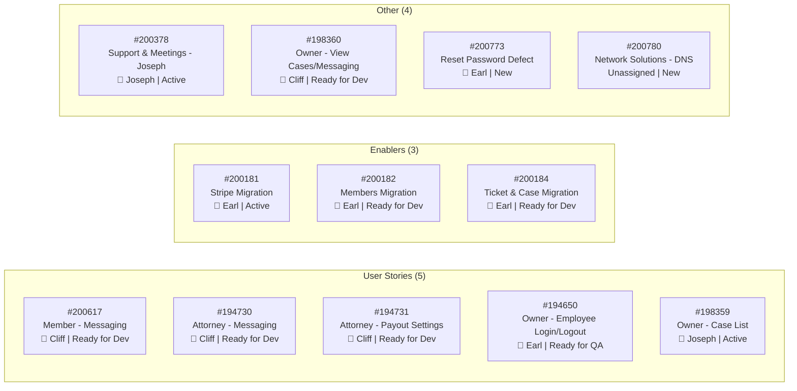
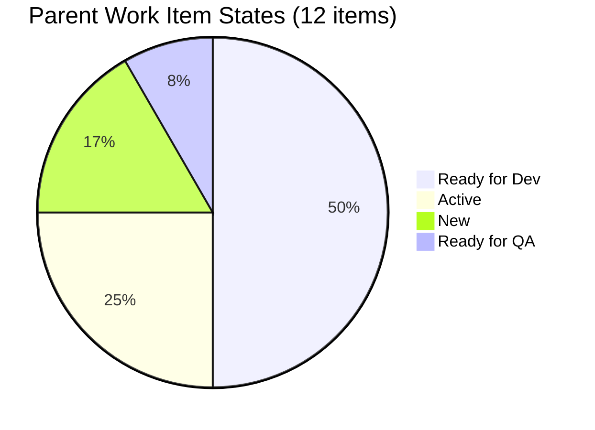
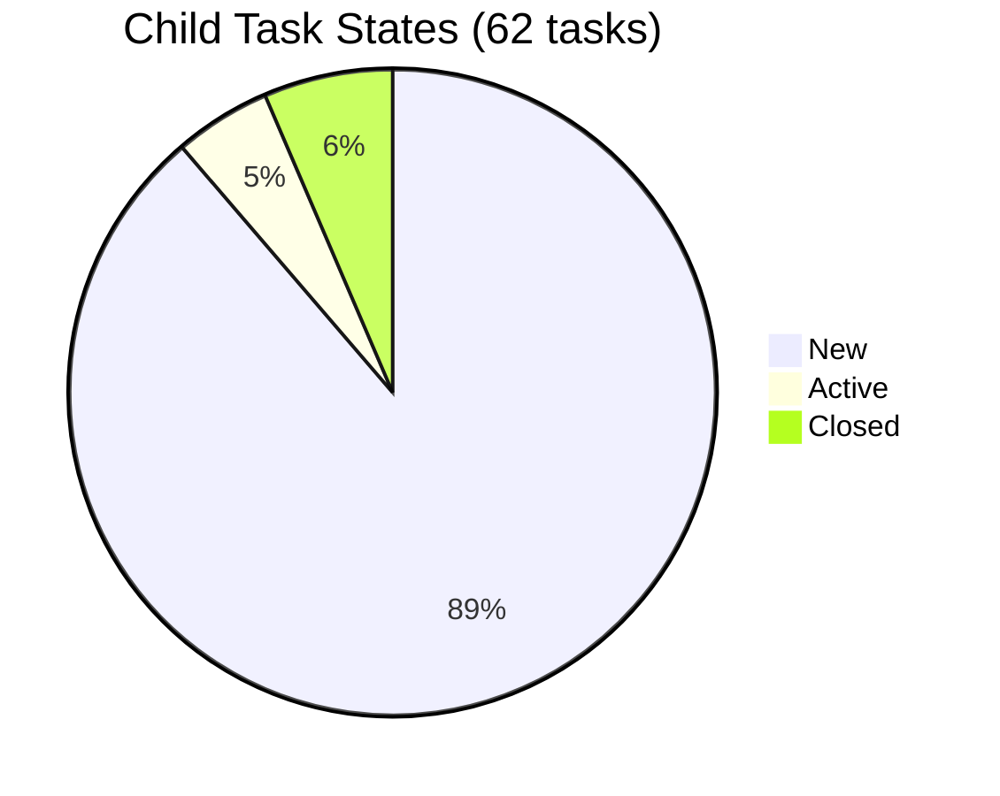
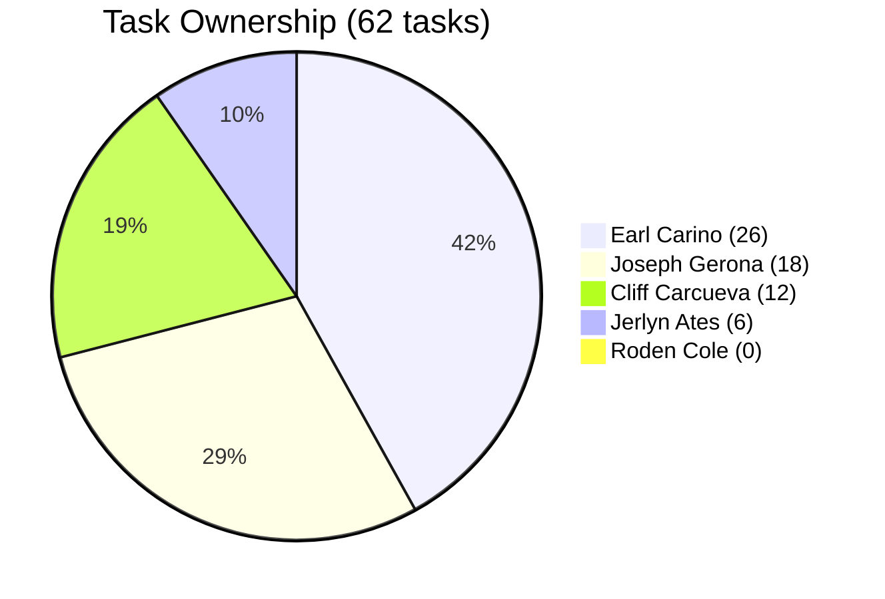
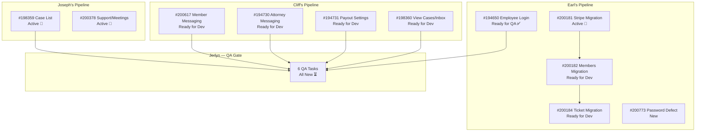
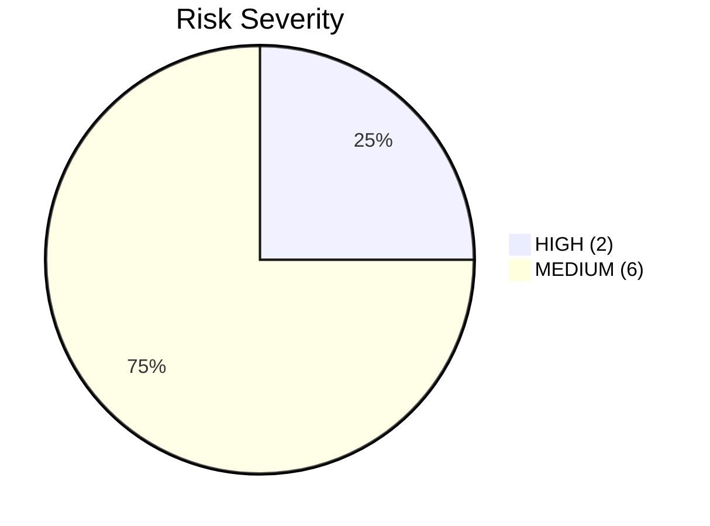
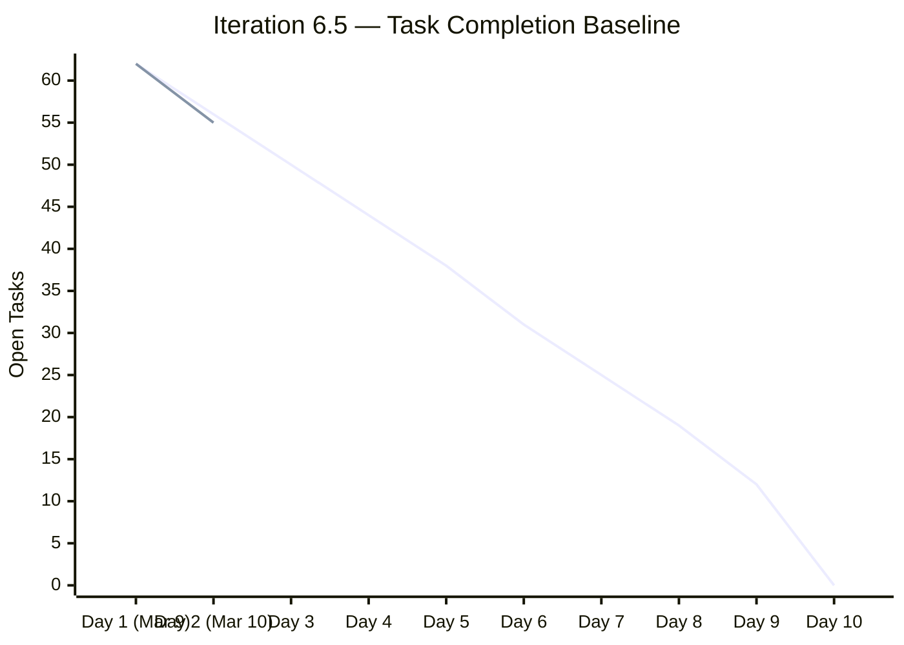

# AutoAllies Iteration Productivity Audit — Iteration 6.5

**Audit Date:** 2026-03-10T20:25:00Z
**Auditor:** Ramon Aseniero Jr. — Engineering Productivity Engineer
**Framework:** SAFe (Scaled Agile Framework)
**Report Type:** Iteration-Bounded Productivity Audit

---

## Audit Boundary

| Parameter | Value |
|-----------|-------|
| **ADO Organization** | `jairo` |
| **ADO Project** | `Auto Allies` (ID: `2d7af571-6ef6-4ad0-a509-c440e008b0fb`) |
| **ADO Team** | `AA Development Team` (Board ID: `330e6bf1-3515-443c-a2d8-b84f46c38f57`) |
| **Board / Backlog** | `Stories and Deliverables` |
| **Current Iteration** | **Iteration 6.5** |
| **Iteration Start** | 2026-03-09 |
| **Iteration Finish** | 2026-03-22 |
| **Iteration Day at Audit** | Day 2 of 14 (14% elapsed) |
| **GitHub Repo — Frontend** | `jairosoft-com/autoallies-version2` |
| **GitHub Repo — Backend** | `jairosoft-com/autoallies-api-core` |

> **Scope Note:** No other ADO boards, teams, projects, or GitHub repositories were analyzed. This audit is strictly bounded to the above sources.

### Data Availability

| Source | Status |
|--------|--------|
| ADO Iteration Settings | ✅ Available |
| ADO Work Items (Iteration 6.5) | ✅ Available |
| ADO Team Capacity | ✅ Available |
| GitHub — `autoallies-version2` | ❌ **Unavailable** (401 Bad Credentials) |
| GitHub — `autoallies-api-core` | ❌ **Unavailable** (401 Bad Credentials) |

> **Degraded Audit Notice:** GitHub data is completely unavailable due to authentication failure. This audit proceeds with ADO-only evidence. All GitHub-dependent sections (PR throughput, commit correlation, merge behavior, review participation, branch hygiene) cannot be assessed. This is explicitly reported as a limitation rather than broadening scope.

---

## 1. Executive Summary

Iteration 6.5 began on March 9, 2026, and this audit runs on Day 2 of a 14-day sprint. The team has **12 parent work items** (5 User Stories, 3 Enablers, 2 Spikes, 1 Defect) containing **62 child tasks** across 5 team members. Early progress is visible but concentrated: only **4 tasks are closed** (6.5%) and **3 are active** (4.8%), with the remaining **55 tasks still in New state** (88.7%).

The iteration carries a heavy workload with significant breadth — one developer (Earl Carino) owns 26 tasks spanning migration enablers, a user story in QA, and a production defect. This concentration represents a single-point-of-failure risk. GitHub evidence is unavailable, so delivery correlation cannot be verified.

**Key Findings:**
- ⚠️ **Ownership imbalance**: Earl Carino owns 42% of all tasks; Roden Cole has zero tasks
- ⚠️ **Early velocity signal**: Only 1 user story (194650) has reached "Ready for QA" — all others remain in pre-development states
- ⚠️ **GitHub data gap**: No delivery evidence from either repository can be correlated
- ✅ **Capacity planning**: Team capacity is configured (24h/day total) with days off tracked
- ✅ **Task decomposition**: All parent items have child task breakdowns

---

## 2. Iteration Scope & Methodology

### 2.1 Planned Work Items

### 2.2 Work Item State Distribution

### 2.3 Task State Distribution

---

## 3. Developer Productivity Findings

### 3.1 Team Capacity Overview

| Developer | Activity | Capacity/Day | Days Off | Planned Tasks | Closed | Active | New |
|-----------|----------|:------------:|:--------:|:-------------:|:------:|:------:|:---:|
| **Earl Carino** | Development | 6h | Mar 20 | 26 | 3 | 1 | 22 |
| **Joseph Gerona** | Development | 4h | — | 18 | 1 | 2 | 15 |
| **Cliff Carcueva** | Development | 6h | Mar 20 | 12 | 0 | 0 | 12 |
| **Jerlyn Ates** | Req (2h) + Test (4h) | 6h | — | 6 | 0 | 0 | 6 |
| **Roden Cole** | Deployment | 2h | — | 0 | 0 | 0 | 0 |
| **TOTAL** | — | **24h** | **2** | **62** | **4** | **3** | **55** |

### 3.2 Task Ownership Distribution

### 3.3 Individual Developer Analysis

#### Earl Carino — Heavy Load, Early Progress Visible

Earl owns **42% of all iteration tasks** across 4 parent items plus a defect. His work spans three distinct domains: feature development (Employee Login/Logout), infrastructure migration (Stripe, Members, Tickets/Cases), and a production defect. He is the only developer with **closed tasks** in this iteration (3 tasks under story #194650), moving that story to "Ready for QA." He also has one active task (Stripe migration script creation, #200462).

**Risk:** The migration enablers (#200182, #200184) each contain 8-10 sequentially-dependent documentation and scripting tasks. If any upstream task blocks, downstream tasks will cascade. Earl's workload at 26 tasks over 13 working days (day off on Mar 20) requires closing ~2 tasks per day to complete on time.

**Source:** ADO

#### Joseph Gerona — Active on Feature + Meeting Overhead

Joseph is assigned the Owner Case List feature (#198359, 9 dev tasks) plus a Spike for daily meetings and support (#200378, 10 tasks). He has 1 task closed (Meeting - March 9) and 2 active (UI/UX for Case List, Meeting - March 10). The meeting/support spike consumes 10 of his 18 tasks, meaning 56% of his tracked work is non-development overhead.

**Risk:** At 4h/day development capacity, Joseph has 9 development tasks for the Case List feature. If meetings and support consume the capacity tracked in the spike, feature delivery could be under-resourced.

**Source:** ADO

#### Cliff Carcueva — Large Scope, No Started Tasks Yet

Cliff owns 4 user stories (#200617, #194730, #194731, #198360) with 12 tasks — all still in **New** state. None have been activated or closed. This is Day 2 of the iteration, so the zero-progress state is not alarming yet, but given the breadth of 4 separate features (Member Messaging, Attorney Messaging, Attorney Payout Settings, View Cases/Inbox), there is a risk of context-switching overhead.

**Risk:** Cliff's 12 tasks across 4 stories means parallel work is likely required. At 6h/day across 13 working days (day off on Mar 20), he needs to close ~1 task/day. However, the features span both frontend (Create UI) and backend (Create endpoint) work, requiring cross-repo delivery.

**Source:** ADO

#### Jerlyn Ates — QA Gated on Development Completion

Jerlyn has 6 QA Testing tasks, one per testable parent work item. All are in **New** state, which is expected since very little development work has reached completion. Her productivity in this iteration is gated by the pace of the developers.

**Risk:** If development tasks cluster toward the end of the sprint, QA will face a bottleneck in the final days of Iteration 6.5.

**Source:** ADO

#### Roden Cole — No Assigned Tasks

Roden has deployment capacity (2h/day) but **zero tasks** in this iteration. This may indicate that deployment work is ad-hoc and unplanned, or that no deployment is expected until features complete.

**Risk:** Untracked deployment work creates visibility gaps. If Roden is doing deployment work, it should be captured as tasks under relevant stories.

**Source:** ADO

---

## 4. ADO-to-GitHub Traceability Analysis

### 4.1 Traceability Status

| Analysis Area | Status |
|---------------|--------|
| Branch-to-work-item correlation | ❌ Cannot assess — GitHub unavailable |
| Commit message work item references | ❌ Cannot assess — GitHub unavailable |
| PR title/body work item references | ❌ Cannot assess — GitHub unavailable |
| Merge evidence for closed tasks | ❌ Cannot assess — GitHub unavailable |
| Unlinked GitHub work | ❌ Cannot assess — GitHub unavailable |

> **Limitation:** Without GitHub access, there is no way to verify whether closed ADO tasks (200441, 200444, 200445, 200379) have corresponding merged PRs, commits, or branches. The "Ready for QA" state of story #194650 cannot be validated against actual code delivery. This is the most significant gap in this audit.

### 4.2 Classification (ADO-Only)

Based solely on ADO work item states:

| Classification | Count | Items |
|----------------|:-----:|-------|
| **Planned iteration work (board)** | 12 parent + 62 tasks | All items in Iteration 6.5 |
| **Delivered work (GitHub)** | Unknown | GitHub unavailable |
| **No cross-system traceability** | 62 tasks | Cannot verify any ADO→GitHub links |

---

## 5. Collaboration & Review Analysis

### 5.1 ADO-Observable Collaboration Signals

| Signal | Observation |
|--------|-------------|
| Cross-assignment between developers | ❌ No task is shared between developers — each works in isolation on assigned parent items |
| QA integration | ⚠️ Jerlyn has QA tasks but all are blocked waiting for dev completion |
| Deployment integration | ⚠️ Roden has zero tasks despite being a team member |
| Peer review activity | ❌ Cannot assess — requires GitHub PR review data |

### 5.2 Work Dependency Map

---

## 6. Risks & Bottlenecks

### 6.1 Risk Matrix

| # | Risk | Severity | Source | Affected |
|---|------|----------|--------|----------|
| R1 | **Earl Carino single-point-of-failure** — 42% of all tasks, 3 migration enablers with sequential dependencies | 🔴 HIGH | ADO | Entire migration track |
| R2 | **GitHub data gap** — no delivery evidence available for audit verification | 🔴 HIGH | Cross-system | Entire audit |
| R3 | **QA bottleneck risk** — all 6 QA tasks blocked until dev completion; if dev clusters late, QA has no runway | 🟡 MEDIUM | ADO | Jerlyn Ates, all stories |
| R4 | **Cliff context-switching** — 4 separate features across frontend and backend with zero tasks started | 🟡 MEDIUM | ADO | 4 user stories |
| R5 | **Joseph meeting overhead** — 56% of tracked tasks are meetings/support, not feature development | 🟡 MEDIUM | ADO | Case List feature #198359 |
| R6 | **Roden has no tasks** — deployment capacity is unplanned and untracked | 🟡 MEDIUM | ADO | Deployment visibility |
| R7 | **Unassigned spike** — #200780 (Network DNS issue) has no owner | 🟡 MEDIUM | ADO | Infrastructure |
| R8 | **Production defect open** — #200773 (password reset) is New with no active work | 🟡 MEDIUM | ADO | End-user impact |

### 6.2 Risk Severity Distribution

---

## 7. Prioritized Remediation Actions

| Priority | Action | Owner | Rationale |
|----------|--------|-------|-----------|
| 🔴 **P0** | **Restore GitHub API credentials** immediately so audit traceability and CI/CD visibility can be verified | Ramon / DevOps | Without GitHub, 50% of the audit evidence pipeline is blind |
| 🔴 **P0** | **Triage production defect #200773** (password reset) — move to Active and assign investigation tasks | Earl / Karl | Production-impacting defect should not sit in New state |
| 🟡 **P1** | **Rebalance Earl's workload** — consider deferring one migration enabler (#200184) to next iteration or assigning Roden to support | Karl | 26 tasks at 6h/day is a burnout and delivery risk |
| 🟡 **P1** | **Assign #200780** (Network DNS spike) to an owner | Karl | Unassigned work creates ambiguity |
| 🟡 **P1** | **Track Roden's deployment work** as explicit tasks under relevant stories | Karl / Roden | Zero-task team members create false idle signals |
| 🟢 **P2** | **Cliff should prioritize and sequence** his 4 stories — pick 1-2 to start immediately rather than parallel-starting all 4 | Cliff / Karl | Reduces context-switching overhead |
| 🟢 **P2** | **Joseph should timebox meetings** — ensure the meeting spike doesn't consume >25% of iteration capacity | Joseph / Karl | Protect feature delivery time for Case List |
| 🟢 **P2** | **Plan QA handoff cadence** — Jerlyn and developers should agree on mid-sprint QA checkpoints rather than end-of-sprint batch | Jerlyn / Karl | Prevents QA crunch in final 2-3 days |

---

## 8. Iteration Burndown Baseline (Day 2 Snapshot)

> At Day 2, the team has closed 4 tasks and activated 3, reducing the open count from 62 to 55 (excluding active). The ideal burndown rate is ~6.2 tasks/day. The actual rate of ~3.5 closures/day is below ideal but within acceptable range for an iteration start where setup and planning absorb initial capacity.

---

## 9. Audit Metadata

| Field | Value |
|-------|-------|
| **Audit ID** | `AUDIT_2026-03-10_202500` |
| **Generated** | 2026-03-10T20:25:00Z |
| **Iteration** | Iteration 6.5 (2026-03-09 to 2026-03-22) |
| **ADO Team** | AA Development Team |
| **ADO Board** | Stories and Deliverables |
| **GitHub Repos** | `jairosoft-com/autoallies-version2`, `jairosoft-com/autoallies-api-core` |
| **GitHub Status** | ❌ Unavailable (401 Bad Credentials) |
| **Scope Exclusions** | No other boards, teams, projects, or repositories analyzed |
| **Previous Audits** | `AUDIT_2026-03-09_000000.md`, `AUDIT_2026-03-10_000000.md` |
| **Data Sources Used** | ADO Iteration API, ADO Work Items API, ADO Capacity API |
| **Data Sources Unavailable** | GitHub REST API (both repos), GitHub MCP connector, `gh` CLI |

---

*End of audit report.*
