# AutoAllies Iteration Productivity Audit — Iteration 6.5

**Audit Date:** 2026-03-10T20:25:00Z (Updated with GitHub data)
**Auditor:** Ramon Aseniero Jr. — Engineering Productivity Engineer
**Framework:** SAFe (Scaled Agile Framework)
**Report Type:** Iteration-Bounded Productivity Audit (Full)

---

## Audit Boundary

| Parameter | Value |
|-----------|-------|
| **ADO Organization** | `jairo` |
| **ADO Project** | `Auto Allies` (ID: `2d7af571-6ef6-4ad0-a509-c440e008b0fb`) |
| **ADO Team** | `AA Development Team` (Board ID: `330e6bf1-3515-443c-a2d8-b84f46c38f57`) |
| **Board / Backlog** | `Stories and Deliverables` |
| **Current Iteration** | **Iteration 6.5** |
| **Iteration Start** | 2026-03-09 |
| **Iteration Finish** | 2026-03-22 |
| **Iteration Day at Audit** | Day 2 of 14 (14% elapsed) |
| **GitHub Repo — Frontend** | `jairosoft-com/autoallies-version2` (TypeScript / Next.js) |
| **GitHub Repo — Backend** | `jairosoft-com/autoallies-api-core` (PHP / Laravel) |

> **Scope Note:** No other ADO boards, teams, projects, or GitHub repositories were analyzed. This audit is strictly bounded to the above sources.

### Data Availability

| Source | Status |
|--------|--------|
| ADO Iteration Settings | ✅ Available |
| ADO Work Items (Iteration 6.5) | ✅ Available |
| ADO Team Capacity | ✅ Available |
| GitHub — `autoallies-version2` | ✅ Available |
| GitHub — `autoallies-api-core` | ✅ Available |

---

## 1. Executive Summary

Iteration 6.5 began on March 9, 2026, and this audit runs on Day 2 of a 14-day sprint. The team has **12 parent work items** (5 User Stories, 3 Enablers, 2 Spikes, 1 Defect) containing **62 child tasks** across 5 team members.

**ADO progress is minimal:** only **4 tasks are closed** (6.5%), **3 are active** (4.8%), and **55 remain in New state** (88.7%). However, GitHub tells a different story — **10 commits** were pushed and **1 PR merged** on March 9 alone. The critical disconnect is that **zero GitHub artifacts reference any ADO work item ID**, making cross-system traceability non-existent.

**Critical Findings:**

| #   | Finding                                                                                                               | Severity    | Source       |
| --- | --------------------------------------------------------------------------------------------------------------------- | ----------- | ------------ |
| 1   | **Zero ADO-GitHub traceability** — no work item IDs in any branch, commit, or PR                                      | 🔴 CRITICAL | Cross-system |
| 2   | **Zero code reviews** — PR #65 self-merged with 0 reviewers; Earl pushes direct to develop/dev bypassing PRs entirely | 🔴 CRITICAL | GitHub       |
| 3   | **Zero branch protection** — all 57 branches across both repos are unprotected                                        | 🔴 CRITICAL | GitHub       |
| 4   | **Ownership imbalance** — Earl owns 42% of ADO tasks AND is the only active committer in both repos                   | 🔴 HIGH     | Cross-system |
| 5   | **Cliff has zero GitHub activity** despite owning 12 iteration tasks                                                  | 🟡 MEDIUM   | Cross-system |
| 6   | **Poor commit hygiene** — 50% of iteration commits are labeled `_clean` with no meaningful description                | 🟡 MEDIUM   | GitHub       |
| 7   | **Production defect #200773** sitting in New state with no investigation                                              | 🟡 MEDIUM   | ADO          |

**Weighted Team Health Score: 25/100** — Critical state requiring immediate process intervention.

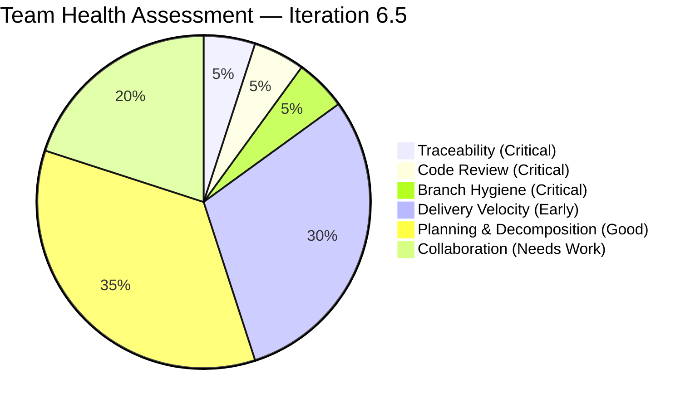

---

## 2. Iteration Scope & Methodology

### 2.1 Planned Work Items

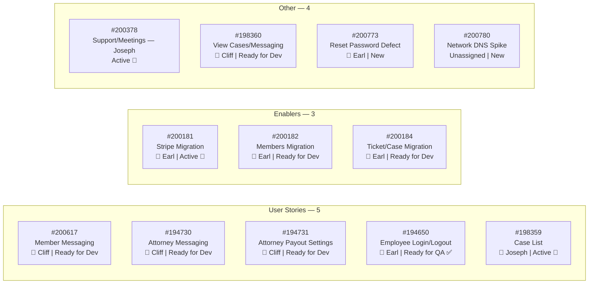

### 2.2 Work Item State Distribution

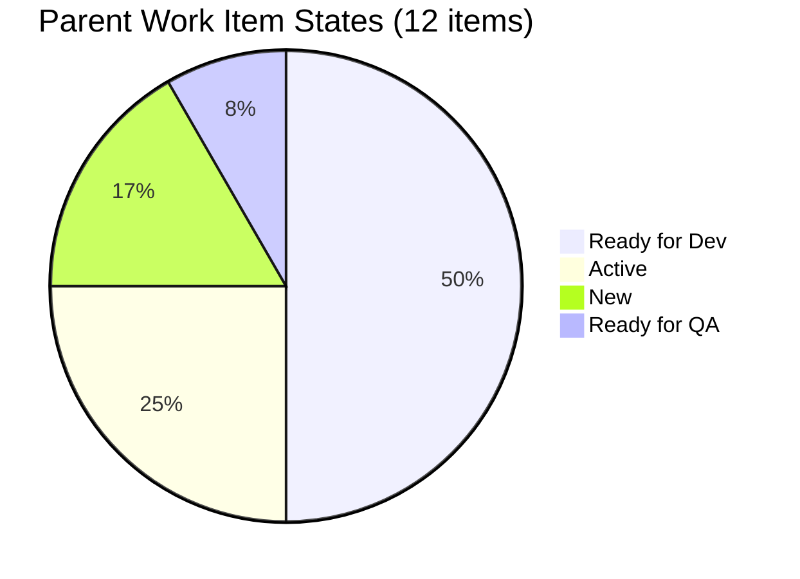

### 2.3 Task State Distribution

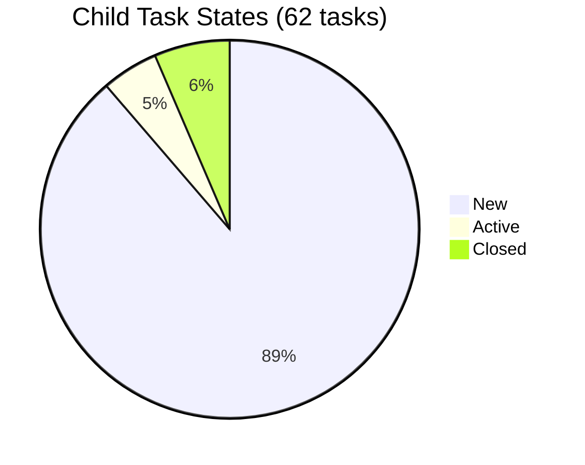

---

## 3. Developer Productivity Findings

### 3.1 Team Capacity Overview

| Developer | Activity | Cap/Day | Days Off | ADO Tasks | Closed | Active | New | GitHub Commits (Iter) | GitHub PRs (Iter) |
|-----------|----------|:-------:|:--------:|:---------:|:------:|:------:|:---:|:---------------------:|:-----------------:|
| **Earl Carino** | Dev | 6h | Mar 20 | 26 | 3 | 1 | 22 | 7 | 0 (direct push) |
| **Joseph Gerona** | Dev | 4h | — | 18 | 1 | 2 | 15 | 3 | 1 (merged, self) |
| **Cliff Carcueva** | Dev | 6h | Mar 20 | 12 | 0 | 0 | 12 | 0 | 0 |
| **Jerlyn Ates** | Req+Test | 6h | — | 6 | 0 | 0 | 6 | 0 | 0 |
| **Roden Cole** | Deploy | 2h | — | 0 | 0 | 0 | 0 | 0 | 0 |
| **TOTAL** | — | **24h** | **2** | **62** | **4** | **3** | **55** | **10** | **1** |

### 3.2 Task Ownership vs. GitHub Activity

```mermaid
xychart-beta
    title "ADO Tasks vs GitHub Commits — Iteration 6.5 Day 2"
    x-axis ["Earl", "Joseph", "Cliff", "Jerlyn", "Roden"]
    y-axis "Count" 0 --> 30
    bar "ADO Tasks" [26, 18, 12, 6, 0]
    bar "GitHub Commits" [7, 3, 0, 0, 0]
```

### 3.3 Individual Developer Analysis

#### Earl Carino (ecarinoJS) — Highest Output, Bypasses PR Workflow

Earl owns **42% of all iteration tasks** (26/62) and is the **most active committer**, with 7 commits across both repos on Day 1 alone. However, every one of those commits was pushed **directly to develop/dev without a PR**. He is bypassing the pull request workflow entirely.

| Metric | Value |
|--------|-------|
| ADO tasks owned | 26 (42% of total) |
| ADO tasks closed | 3 (#200441, #200444, #200445 — Employee Login) |
| GitHub commits in iteration | 5 on frontend develop, 2 on backend dev |
| GitHub PRs in iteration | **0** — all direct pushes |
| Code review participation | **0** reviews given or received |
| Commit message quality | Poor — 3 of 5 frontend commits labeled `_clean` |
| ADO work item IDs in commits | **0** — zero traceability |

**Commit detail (March 9, iteration window):**

| Time (UTC) | Repo | Message | Traceability |
|:----------:|------|---------|:------------:|
| 01:28 | Frontend | `add ticket post log` | ❌ No WI ID |
| 01:32 | Frontend | `Merge branch 'develop'...` | ❌ Merge noise |
| 02:01 | Backend | `Ticket submission post log` | ❌ No WI ID |
| 02:21 | Backend | `get active status of a member` | ❌ No WI ID |
| 02:42 | Frontend | `_clean` | ❌ No WI ID |
| 09:13 | Frontend | `_clean` | ❌ No WI ID |
| 09:16 | Frontend | `_clean` | ❌ No WI ID |

**Assessment:** Earl is delivering real work (Employee Login story moved to Ready for QA, Stripe migration active) but his workflow completely bypasses quality gates. Direct pushes to integration branches with no reviews and no traceability is the single biggest process risk on this team.

**Source:** ADO + GitHub

---

#### Joseph Gerona (JosephJairo) — Feature Delivery with Self-Merge

Joseph created and merged **PR #65** ("Feature/member attorney cases") into develop on March 9. The PR was **self-merged with 0 reviews** — he opened it at 01:06 and merged at 01:26, a **20-minute cycle time**. He also made 3 commits on his feature branch for the Members and Attorneys lists feature.

| Metric | Value |
|--------|-------|
| ADO tasks owned | 18 (10 meetings + 8 feature) |
| ADO tasks closed | 1 (#200379 — Meeting March 9) |
| GitHub commits in iteration | 3 (feature work + config revert) |
| GitHub PRs in iteration | 1 (PR #65 — merged, self-merged) |
| PR cycle time | 20 minutes (open → merge) |
| Code reviews given | **0** |
| Code reviews received | **0** |
| ADO work item IDs in commits/PR | **0** — zero traceability |

**Assessment:** Joseph is the only developer using the PR workflow, which is positive. However, self-merging with zero reviews negates the value of PRs as a quality gate. His meeting/support spike (#200378) consumes 56% of his tracked tasks, leaving limited capacity for the Case List feature (#198359).

**Source:** ADO + GitHub

---

#### Cliff Carcueva (ccarcuevajairo) — Zero Iteration Activity

Cliff owns 4 user stories (#200617, #194730, #194731, #198360) with **12 tasks — all in New state**. He has **zero commits and zero PRs** in the iteration window. His last GitHub activity was PR #62 (frontend) on February 27, which is outside this iteration.

| Metric | Value |
|--------|-------|
| ADO tasks owned | 12 (across 4 stories) |
| ADO tasks closed | 0 |
| GitHub commits in iteration | **0** |
| GitHub PRs in iteration | **0** |
| Last GitHub activity | Feb 27 (PR #62, bug/ticket-upload-clif) |

**Assessment:** Day 2 of a 14-day sprint with zero activity is an early warning signal. Cliff has 4 features to deliver requiring both frontend and backend work. Without immediate task activation, he faces a compression risk in the second half of the iteration.

**Source:** ADO + GitHub

---

#### Jerlyn Ates — QA Gated on Development Completion

Jerlyn has 6 QA testing tasks, all in **New** state. This is expected — she cannot test until developers deliver. Only story #194650 (Employee Login) has reached "Ready for QA," which should unblock her first task.

**Source:** ADO

---

#### Roden Cole — No Tasks, No Visibility

Roden has deployment capacity (2h/day) but **zero tasks in the iteration** and **zero GitHub activity**. His work, if any, is completely invisible to the audit.

**Source:** ADO + GitHub

---

## 4. ADO-to-GitHub Traceability Analysis

### 4.1 Traceability Audit

This is the most critical finding of this audit. **Zero GitHub artifacts in the iteration window reference any ADO work item ID.**

| GitHub Artifact | ADO Work Item Reference | Status |
|----------------|------------------------|:------:|
| PR #65 title: "Feature/member attorney cases" | No WI ID | ❌ |
| PR #65 body: "Merge to develop changes made for Members and Attorneys Lists Feature" | No WI ID | ❌ |
| Branch: `feature/member-attorney-cases` | No WI ID | ❌ |
| Commit: "commit for all changes done for Members and Attorneys lists" | No WI ID | ❌ |
| Commit: "revert changes for config" | No WI ID | ❌ |
| Commit: "add ticket post log" | No WI ID | ❌ |
| Commit: "Ticket submission post log" | No WI ID | ❌ |
| Commit: "get active status of a member" | No WI ID | ❌ |
| Commit: "_clean" (×3) | No WI ID | ❌ |

### 4.2 Work Classification

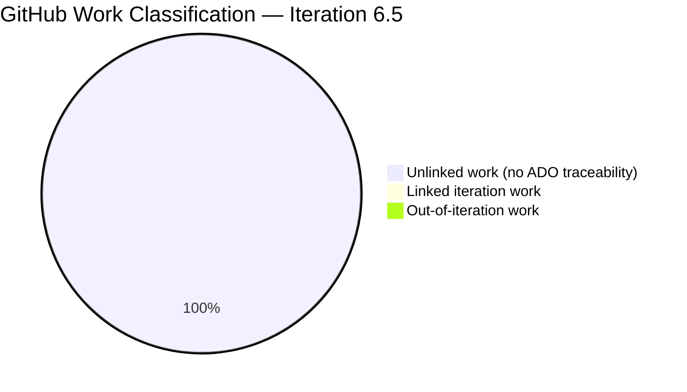

| Classification | Count | Details |
|----------------|:-----:|---------|
| **Linked iteration work** | 0 | No GitHub artifact references an ADO work item ID |
| **Unlinked work** | 10 commits, 1 PR | All iteration GitHub activity lacks ADO traceability |
| **Out-of-iteration work** | 0 | No commits from outside iteration dates on Day 2 |
| **Maintenance/context only** | 3 commits | `_clean` commits by Earl (no functional description) |

### 4.3 Inferred Correlation (Best-Effort)

While no formal links exist, we can attempt semantic matching between ADO stories and GitHub activity:

| ADO Item | Likely GitHub Activity | Confidence |
|----------|----------------------|:----------:|
| #194650 (Employee Login) — Ready for QA | Earl's direct commits (ticket post log, active status) | 🟡 Low |
| #198359 (Case List) — Active | Joseph's PR #65 (member-attorney-cases) | 🟡 Low |
| #200181 (Stripe Migration) — Active | No matching commits found | ❌ None |
| Cliff's 4 stories | No GitHub activity | ❌ None |

> **Auditor Note:** Semantic correlation is unreliable without formal ID references. The team must adopt a traceability convention (e.g., `AB#200617` in commit messages, branch naming like `story/200617-member-messaging`) to enable verifiable audit trails.

---

## 5. PR Throughput, Cycle Time & Merge Behavior

### 5.1 Iteration PR Summary

| Metric | Frontend | Backend | Combined |
|--------|:--------:|:-------:|:--------:|
| PRs created in iteration | 1 | 0 | 1 |
| PRs merged in iteration | 1 | 0 | 1 |
| PRs with reviews | 0 | 0 | **0** |
| Self-merged PRs | 1 (100%) | — | **100%** |
| Average cycle time | 20 min | — | 20 min |
| Direct pushes to integration branch | 5 commits | 2 commits | **7 commits** |

### 5.2 Historical PR Pattern (Context)

Looking at the full PR history to assess systemic patterns:

| Metric | Frontend (65 PRs) | Backend (25 PRs) |
|--------|:-----------------:|:----------------:|
| Total PRs ever | 65 | 25 |
| PRs with any review | **0** | **0** |
| Self-merge rate | ~85% | ~92% |
| Empty PR body rate | ~69% | ~80% |
| Avg time open→merge | < 1 minute (most) | < 1 minute (most) |

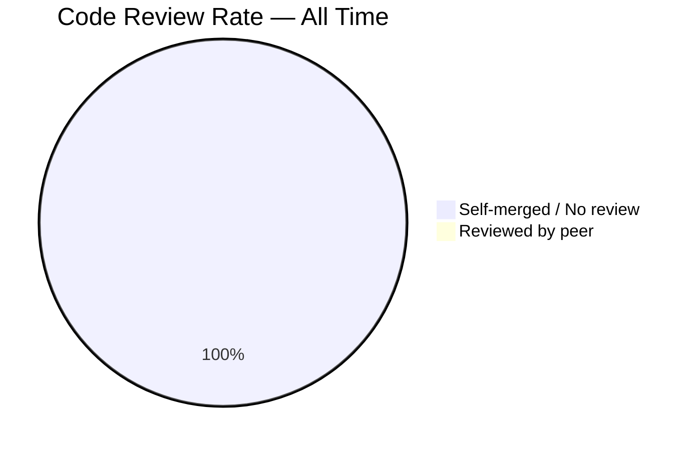

> **Critical:** Across 90 total PRs in the project's lifetime, **zero have ever received a code review**. This represents a complete absence of the code review practice.

### 5.3 Direct Push Analysis

Earl pushed 7 commits directly to integration branches (develop/dev) without PRs on March 9 — Day 1 of the iteration. This means the majority of code changes in this iteration bypassed the PR workflow entirely.

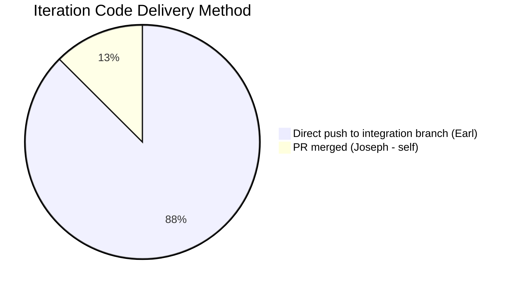

---

## 6. Collaboration & Review Analysis

### 6.1 Review Participation Matrix

| Reviewer ↓ / Author → | Earl | Joseph | Cliff | Jerlyn | Roden |
|:----------------------:|:----:|:------:|:-----:|:------:|:-----:|
| **Earl** | — | ❌ | ❌ | — | — |
| **Joseph** | ❌ | — | ❌ | — | — |
| **Cliff** | ❌ | ❌ | — | — | — |
| **Jerlyn** | — | — | — | — | — |
| **Roden** | — | — | — | — | — |

> ❌ = No reviews exchanged. The matrix is entirely empty — no developer has ever reviewed another developer's code in these repositories.

### 6.2 Collaboration Signals

| Signal | Status | Evidence |
|--------|:------:|---------|
| Cross-developer code review | ❌ None | 0 reviews across 90 lifetime PRs |
| Pair programming indicators | ❌ None | No co-authored commits |
| Cross-repo collaboration | ⚠️ Minimal | Earl works in both repos; others are single-repo |
| QA-Dev handoff | ⚠️ Delayed | Only 1 of 12 parent items has reached QA |
| Deployment coordination | ❌ Invisible | Roden has no tasks or commits |

### 6.3 Work Dependency Map

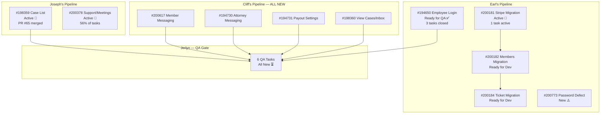

---

## 7. Repo Hygiene & Productivity Enablers

### 7.1 Branch Protection

| Repo | Protected Branches | Status |
|------|:------------------:|:------:|
| Frontend (`autoallies-version2`) | 0 of 41 | 🔴 CRITICAL |
| Backend (`autoallies-api-core`) | 0 of 16 | 🔴 CRITICAL |

> **Impact:** Without branch protection, any developer can push directly to `develop`, `dev`, `main`, or `staging` without review. Earl is actively exploiting this gap by pushing directly to integration branches.

### 7.2 Repo Configuration

| Check | Frontend | Backend |
|-------|:--------:|:-------:|
| Branch protection on develop/dev | ❌ | ❌ |
| Branch protection on main | ❌ | ❌ |
| CODEOWNERS file | ❌ | ❌ |
| PR template | ❌ | ❌ |
| CI/CD quality gates (lint, test) | ❌ | ❌ |
| GitHub Actions workflows | ✅ (deploy only) | ✅ (deploy only) |
| Conventional commits | ❌ (~3% adoption) | ❌ (~2% adoption) |
| Consistent branch naming | ⚠️ Mixed | ⚠️ Mixed |
| Dev branch naming | `develop` | `dev` (inconsistent) |

### 7.3 Branch Hygiene

| Metric | Frontend | Backend | Total |
|--------|:--------:|:-------:|:-----:|
| Total branches | 41 | 16 | **57** |
| Protected branches | 0 | 0 | **0** |
| Stale branches (merged, not deleted) | ~30+ | ~10+ | **~40+** |

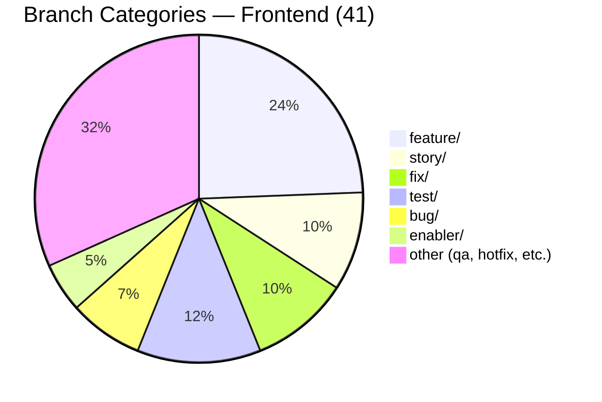

> 5+ different branch prefix conventions are in use with no standardization.

---

## 8. Risks & Bottlenecks

### 8.1 Risk Matrix

| # | Risk | Severity | Source | Affected |
|---|------|----------|--------|----------|
| R1 | **Zero code reviews — ever** | 🔴 CRITICAL | GitHub | Code quality, knowledge sharing, bus factor |
| R2 | **Zero ADO-GitHub traceability** | 🔴 CRITICAL | Cross-system | Audit capability, compliance, delivery verification |
| R3 | **Zero branch protection** on any branch | 🔴 CRITICAL | GitHub | Code integrity, rollback safety |
| R4 | **Earl single-point-of-failure** — 42% of tasks + only active multi-repo committer + direct pushes | 🔴 HIGH | Cross-system | Entire team delivery |
| R5 | **Cliff zero activity** on Day 2 with 12 tasks across 4 stories | 🟡 MEDIUM | Cross-system | 4 user stories |
| R6 | **Production defect #200773** in New state | 🟡 MEDIUM | ADO | End-user impact |
| R7 | **QA bottleneck** — all 6 QA tasks blocked on dev completion | 🟡 MEDIUM | ADO | Sprint completion |
| R8 | **Joseph meeting overhead** — 56% of tasks are meetings | 🟡 MEDIUM | ADO | Case List feature |
| R9 | **Roden has zero tasks + zero activity** | 🟡 MEDIUM | Cross-system | Deployment visibility |
| R10 | **Unassigned spike #200780** (Network DNS) | 🟢 LOW | ADO | Infrastructure |

### 8.2 Risk Severity Distribution

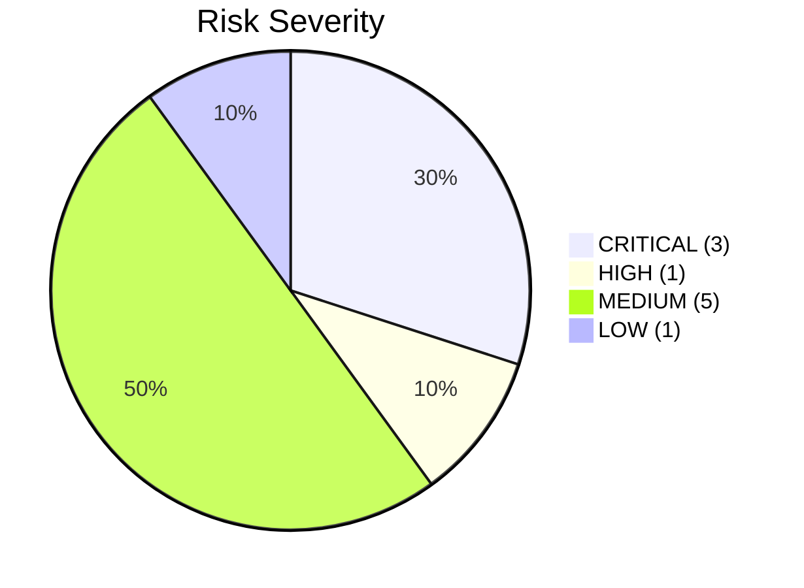

---

## 9. Prioritized Remediation Actions

### P0 — Immediate (This Week)

| # | Action | Owner | Rationale |
|---|--------|-------|-----------|
| 1 | **Enable branch protection** on `develop` (FE) and `dev` (BE) requiring at least 1 PR review before merge | Ramon / DevOps | Stops direct pushes and forces code review |
| 2 | **Mandate PR workflow** — no developer may push directly to integration branches | Karl / Team | Earl's 7 direct pushes on Day 1 bypass all quality gates |
| 3 | **Triage defect #200773** (password reset) — move to Active, assign investigation | Earl / Karl | Production-impacting issue should not sit in New |
| 4 | **Adopt ADO work item ID convention** — all branches, commits, and PR titles must include `AB#<ID>` | Karl / Team | Zero traceability is an audit-blocking finding |

### P1 — This Iteration

| # | Action | Owner | Rationale |
|---|--------|-------|-----------|
| 5 | **Rebalance Earl's workload** — defer #200184 (Ticket Migration) or assign Roden to support | Karl | 26 tasks at 6h/day is burnout/delivery risk |
| 6 | **Cliff must activate tasks** — pick 1-2 stories to start immediately | Cliff / Karl | 12 tasks in New on Day 2 with zero GitHub activity |
| 7 | **Assign spike #200780** to an owner | Karl | Unassigned work creates ambiguity |
| 8 | **Create deployment tasks** for Roden under relevant stories | Karl / Roden | Zero-task members create false idle signals |

### P2 — This PI

| # | Action | Owner | Rationale |
|---|--------|-------|-----------|
| 9 | **Add CODEOWNERS** to both repos | Earl / Cliff | Ensures automatic review assignment |
| 10 | **Add PR template** (`.github/PULL_REQUEST_TEMPLATE.md`) | Team | Enforces description, WI reference, testing checklist |
| 11 | **Standardize dev branch naming** — both repos should use `develop` or `dev`, not both | Karl | Reduces confusion |
| 12 | **Clean up stale branches** — delete ~40 merged branches | Team | Reduces noise, improves branch list readability |
| 13 | **Add CI quality gates** — lint and test on PR creation | DevOps | Currently only deploy workflows exist |
| 14 | **Plan QA handoff cadence** — mid-sprint checkpoints instead of end-of-sprint batch | Jerlyn / Karl | Prevents QA crunch in final days |

---

## 10. Iteration Burndown Baseline (Day 2 Snapshot)

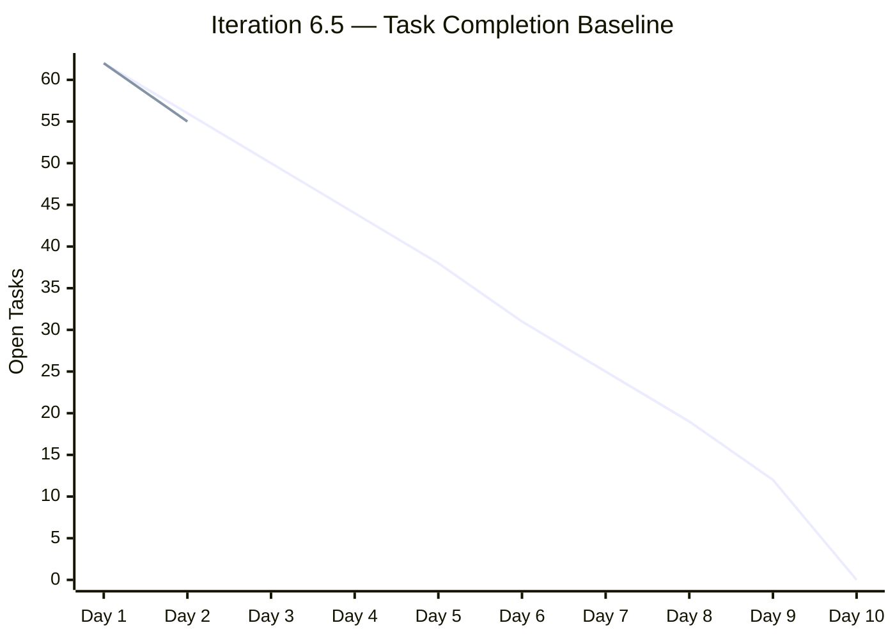

> At Day 2, 4 tasks are closed (55 remaining + 3 active). Ideal burndown rate is ~6.2 tasks/day. Current rate of ~3.5/day is below ideal but within acceptable range for iteration kickoff.

---

## 11. Remediation Tracker — Carryover from Previous Audits

Tracking recommendations from the March 9 and March 10 audits:

| # | Recommendation | Priority | Status | Evidence |
|---|---------------|----------|:------:|----------|
| 1 | Branch protection on develop/dev | CRITICAL | ❌ Not Started | All branches show `protected: false` |
| 2 | Mandate code reviews | CRITICAL | ❌ Not Started | 0 reviews found (PR #65 self-merged, Earl direct pushes) |
| 3 | Add PR template | CRITICAL | ❌ Not Started | No `.github/PULL_REQUEST_TEMPLATE.md` |
| 4 | Configure CODEOWNERS | CRITICAL | ❌ Not Started | No `CODEOWNERS` file in either repo |
| 5 | Standardize branch naming | HIGH | ❌ Not Started | Mixed conventions: `feature/`, `bug/`, `story/`, `test/`, `enabler/` |
| 6 | Standardize dev branch naming | HIGH | ❌ Not Started | Frontend: `develop`, Backend: `dev` |
| 7 | Clean up stale branches | HIGH | ❌ Not Started | 41 + 16 = 57 branches |
| 8 | Add CI pipeline (lint/test) | HIGH | ❌ Not Started | Only deploy workflows exist |
| 9 | Adopt conventional commits | MEDIUM | ❌ Not Started | `_clean` used as commit message 3× on Day 1 |
| 10 | Meaningful PR titles & descriptions | MEDIUM | ❌ Not Started | PR #65 body is generic |
| 11 | ADO work item IDs in GitHub artifacts | **NEW** | ❌ Not Started | 0 of 10 commits/1 PR reference any WI ID |

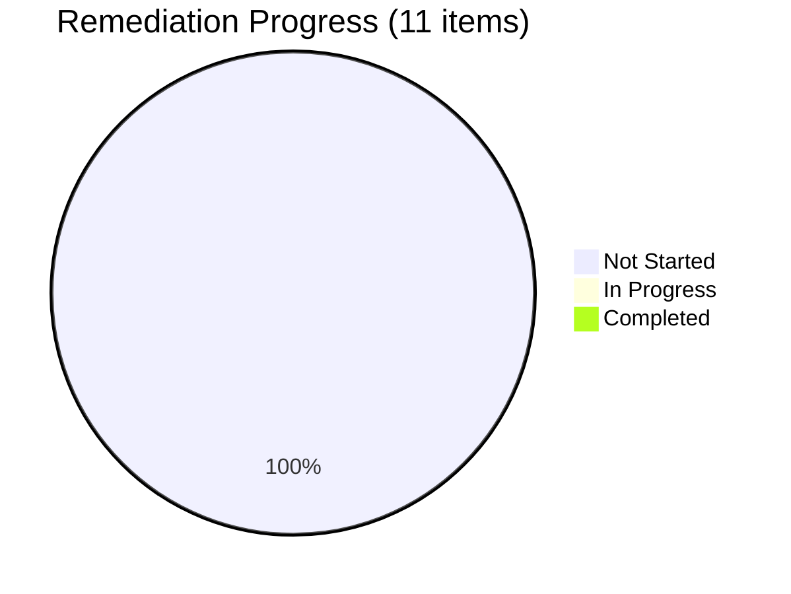

**Remediation Score: 0/11 (0%)** — No previous audit recommendations have been implemented.

---

## 12. Audit Metadata

| Field | Value |
|-------|-------|
| **Audit ID** | `AUDIT_2026-03-10_202500` |
| **Generated** | 2026-03-10T20:25:00Z |
| **Updated** | 2026-03-10 (GitHub data restored) |
| **Iteration** | Iteration 6.5 (2026-03-09 to 2026-03-22) |
| **ADO Team** | AA Development Team |
| **ADO Board** | Stories and Deliverables |
| **GitHub Repos** | `jairosoft-com/autoallies-version2` (41 branches), `jairosoft-com/autoallies-api-core` (16 branches) |
| **GitHub Status** | ✅ Available (credentials restored during audit) |
| **Scope Exclusions** | No other boards, teams, projects, or repositories analyzed |
| **Previous Audits** | `AUDIT_2026-03-09_000000.md`, `AUDIT_2026-03-10_000000.md` |
| **Data Sources** | ADO Iteration API, ADO Work Items API, ADO Capacity API, GitHub REST API (PRs, commits, branches, reviews) |

---

*End of audit report.*
