# AutoAllies Iteration Productivity Audit — Iteration 6.5

**Audit Date:** 2026-03-11T23:41:00Z
**Auditor:** Ramon Aseniero Jr. — Engineering Productivity Engineer
**Framework:** SAFe (Scaled Agile Framework)
**Report Type:** Iteration-Bounded Productivity Audit (Daily)

---

## Audit Boundary

| Parameter | Value |
|-----------|-------|
| **ADO Organization** | `jairo` |
| **ADO Project** | `Auto Allies` (ID: `2d7af571-6ef6-4ad0-a509-c440e008b0fb`) |
| **ADO Team** | `AA Development Team` (Board ID: `330e6bf1-3515-443c-a2d8-b84f46c38f57`) |
| **Board / Backlog** | `Stories and Deliverables` (`Microsoft.RequirementCategory`) |
| **Current Iteration** | **Iteration 6.5** |
| **Iteration Start** | 2026-03-09 |
| **Iteration Finish** | 2026-03-22 |
| **Iteration Day at Audit** | Day 3 of 14 (21% elapsed) |
| **GitHub Repo — Frontend** | `jairosoft-com/autoallies-version2` (TypeScript / Next.js) |
| **GitHub Repo — Backend** | `jairosoft-com/autoallies-api-core` (PHP / Laravel) |

> **Scope Note:** No other ADO boards, teams, projects, or GitHub repositories were analyzed. This audit is strictly bounded to the above sources.

### Data Availability

| Source | Status |
|--------|--------|
| ADO Iteration Settings | ✅ Available |
| ADO Work Items (Iteration 6.5) | ✅ Available |
| ADO Team Capacity | ✅ Available |
| GitHub — `autoallies-version2` | ✅ Available |
| GitHub — `autoallies-api-core` | ✅ Available |

---

## 1. Executive Summary

Iteration 6.5 is now at **Day 3 of 14** (21% elapsed). The team has expanded its iteration scope to **15 parent work items** (up from 12 on Day 2) containing **66 child tasks** across 6 team members. The most significant development since the last audit is threefold: **Cliff Carcueva has activated** with large messaging PRs merged across both repos, **the Stripe Migration enabler (#200181) has been closed** (the first completed enabler this iteration), and **three new parent items were added** mid-iteration.

**Progress Summary (Day 3 vs Day 2):**

| Metric | Day 2 (Mar 10) | Day 3 (Mar 11) | Delta |
|--------|:--------------:|:--------------:|:-----:|
| Parent Work Items | 12 | 15 | +3 |
| Child Tasks | 62 | 66 | +4 |
| Tasks Closed | 4 (6.5%) | 15 (22.7%) | **+11** |
| Tasks Active | 3 (4.8%) | 7 (10.6%) | +4 |
| Tasks New | 55 (88.7%) | 44 (66.7%) | -11 |
| GitHub PRs Merged (Iteration) | 1 | 3 | +2 |
| GitHub Commits (Iteration) | 10 | 12 | +2 |
| Code Reviews | 0 | **0** | 0 |
| ADO-GitHub Traceability | 0% | **0%** | 0 |

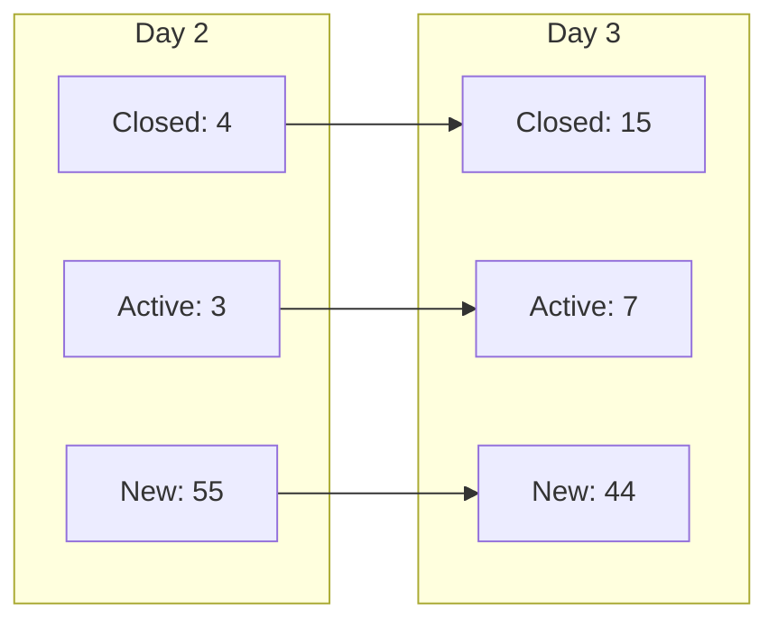

**Critical Findings Update:**

| # | Finding | Severity | Status vs Day 2 |
|---|---------|----------|:----------------:|
| 1 | **Zero ADO-GitHub traceability** — 0 of 12 iteration commits reference any ADO work item | 🔴 CRITICAL | Unchanged |
| 2 | **Zero code reviews** — PRs #65, #66, #26 all self-merged with 0 reviewers | 🔴 CRITICAL | Unchanged |
| 3 | **Zero branch protection** — all branches remain unprotected | 🔴 CRITICAL | Unchanged |
| 4 | **Instant self-merges** — PR #66 merged in 16 seconds, PR #26 in 15 seconds | 🔴 CRITICAL | Worsened |
| 5 | **Cliff activated but bypasses quality** — 15,975 additions across 62 files with 0 review | 🟡 MEDIUM | New finding |
| 6 | **Scope creep** — 3 new parent items added mid-iteration (+25% scope growth) | 🟡 MEDIUM | New finding |
| 7 | **Defect #200773** moved to Ready for Dev (was New) | 🟢 IMPROVED | Improved |

**Weighted Team Health Score: 30/100** (was 25/100) — Marginal improvement driven by delivery activity, still in critical state.

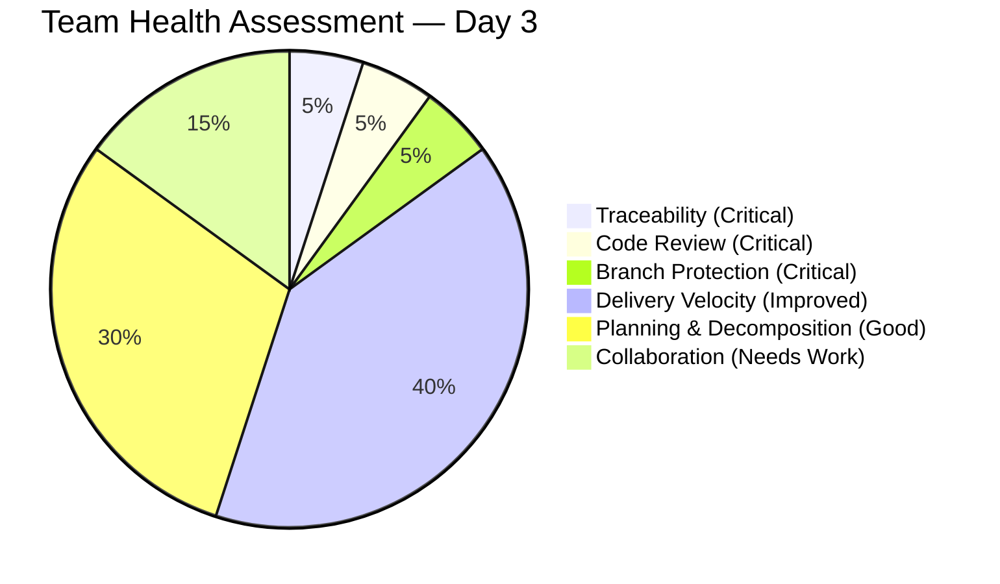

---

## 2. Iteration Scope & Methodology

### 2.1 Planned Work Items (15 Parents — Updated)

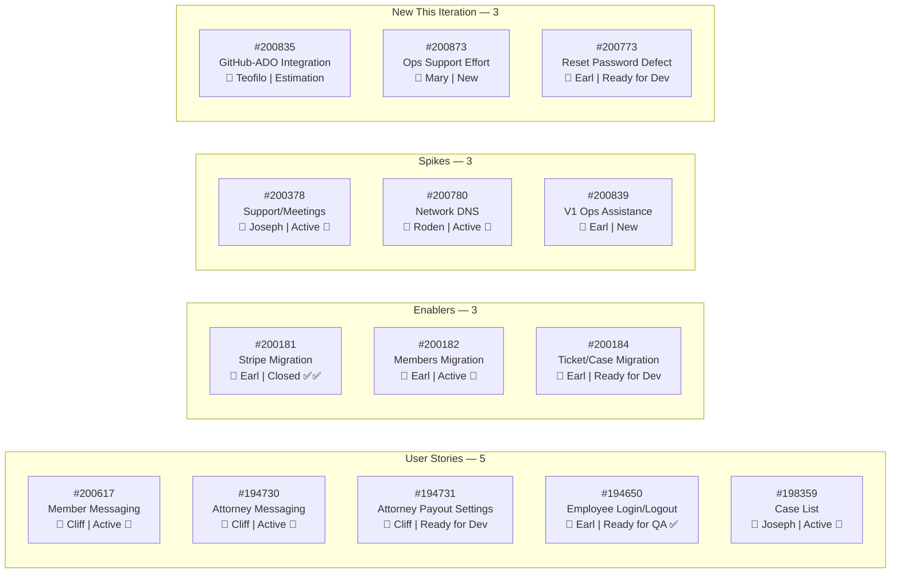

### 2.2 Scope Change Analysis (Day 2 → Day 3)

| Item | Type | Owner | State | Change Since Day 2 |
|------|------|-------|:-----:|:-------------------:|
| **#200835** | Enabler | Teofilo Limpag | Estimation | **NEW** — Added to iteration |
| **#200839** | Spike | Earl | New | **NEW** — Added to iteration |
| **#200873** | Spike | Mary Secusana | New | **NEW** — Added to iteration |
| **#200181** | Enabler | Earl | **Closed** | **Was Active → now Closed** ✅ |
| **#200617** | User Story | Cliff | **Active** | Was Ready for Dev → Active |
| **#194730** | User Story | Cliff | **Active** | Was Ready for Dev → Active |
| **#200182** | Enabler | Earl | **Active** | Was Ready for Dev → Active |
| **#200780** | Spike | **Roden** | **Active** | Was New/Unassigned → Active, now assigned to Roden |
| **#200773** | Defect | Earl | **Ready for Dev** | Was New → Ready for Dev |

> **+25% scope expansion** (12 → 15 parent items) on Day 3 of a 14-day sprint. While spikes and estimation items carry lighter delivery weight, this represents mid-iteration scope injection that should be monitored.

### 2.3 Work Item State Distribution

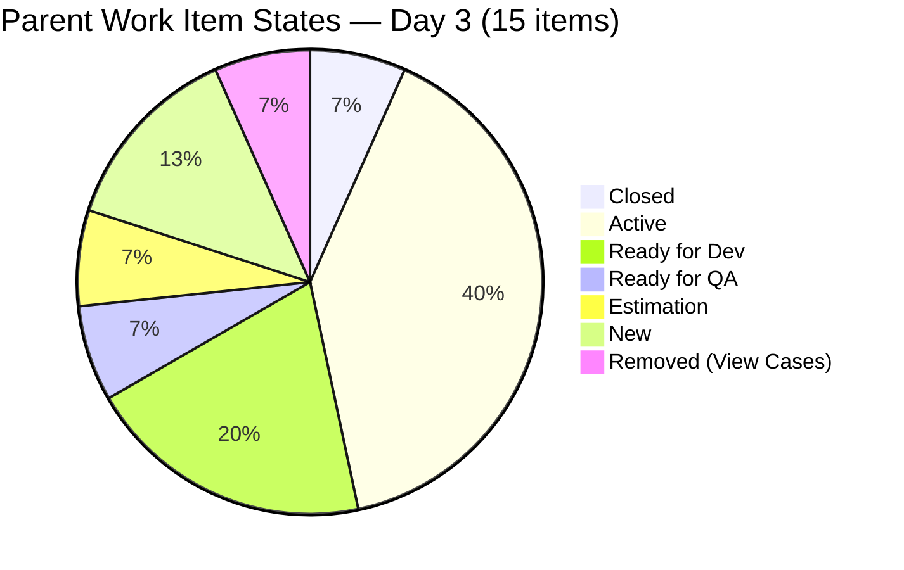

### 2.4 Task State Distribution

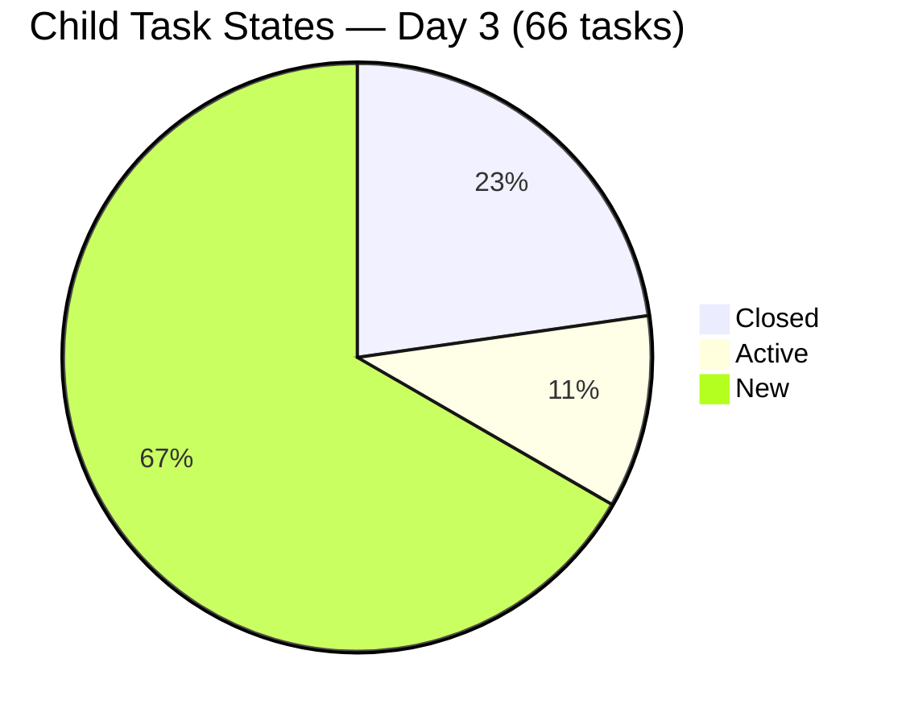

---

## 3. Developer Productivity Findings

### 3.1 Team Capacity & Delivery Overview

| Developer | Activity | Cap/Day | Days Off | ADO Tasks | Closed | Active | New | GH Commits (Iter) | GH PRs (Iter) |
|-----------|----------|:-------:|:--------:|:---------:|:------:|:------:|:---:|:-----------------:|:--------------:|
| **Earl Carino** | Dev | 6h | Mar 20 | 25 | 8 | 1 | 16 | 7 | 0 (direct push) |
| **Cliff Carcueva** | Dev | 6h | Mar 20 | 14 | 4 | 2 | 8 | 2 | **2 (merged, self)** |
| **Joseph Gerona** | Dev | 4h | — | 18 | 2 | 4 | 12 | 3 | 1 (merged, self) |
| **Jerlyn Ates** | Req+Test | 6h | — | 7 | 0 | 0 | 7 | 0 | 0 |
| **Roden Cole** | Deploy | 2h | — | 1 | **1** | 0 | 0 | 0 | 0 |
| **Mary Secusana** | Ops | — | — | 1 | 0 | 0 | 1 | 0 | 0 |
| **TOTAL** | — | **24h** | **2** | **66** | **15** | **7** | **44** | **12** | **3** |

### 3.2 Task Ownership vs. GitHub Activity

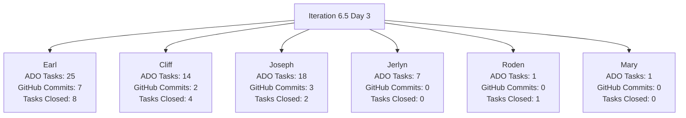

### 3.3 Individual Developer Analysis

#### Earl Carino (ecarinoJS) — Highest Output, Process Unchanged

Earl remains the most productive developer by volume, closing 8 tasks (up from 3) including the complete **Stripe Migration enabler (#200181)** — the first enabler closed this iteration. He now has the Members Migration (#200182) active. However, his workflow has not changed: **all 7 iteration commits are direct pushes to develop/dev with zero PRs, zero reviews, and zero ADO traceability**.

| Metric | Day 2 | Day 3 | Delta |
|--------|:-----:|:-----:|:-----:|
| ADO tasks owned | 26 | 25 | -1 (scope adj) |
| ADO tasks closed | 3 | **8** | **+5** |
| GitHub commits (iteration) | 7 | 7 | 0 |
| GitHub PRs (iteration) | 0 | 0 | 0 |
| Code reviews given/received | 0 | 0 | 0 |
| ADO work item IDs in commits | 0 | 0 | 0 |

**Key Closures:** #200441 (Employee Login tasks), #200444, #200445, #200181 (Stripe Migration), and related sub-tasks.

**Assessment:** Earl is demonstrating strong delivery velocity — Stripe Migration closure is a material milestone. However, his direct-push workflow continues to bypass all quality gates. The combination of high output and zero process compliance creates a **high-velocity risk pattern**: code ships fast but without any review safety net.

**Source:** ADO + GitHub

---

#### Cliff Carcueva (ccarcuevajairo) — Major Activation Event

**This is the most significant change since the Day 2 audit.** Cliff went from zero iteration activity to delivering two substantial PRs:

| PR | Repo | Files | Additions | Deletions | Cycle Time | Reviews |
|----|------|:-----:|:---------:|:---------:|:----------:|:-------:|
| **#66** | Frontend | 21 | 10,322 | 15 | **16 seconds** | **0** |
| **#26** | Backend | 41 | 5,653 | 7 | **15 seconds** | **0** |

**Combined: 62 files changed, 15,975 lines added, 22 lines deleted across both repos — merged with zero reviews in under 20 seconds each.**

| Metric | Day 2 | Day 3 | Delta |
|--------|:-----:|:-----:|:-----:|
| ADO tasks owned | 12 | 14 | +2 |
| ADO tasks closed | 0 | **4** | **+4** |
| ADO tasks active | 0 | **2** | +2 |
| ADO tasks new | 12 | 8 | -4 |
| GitHub commits (iteration) | 0 | **2** | **+2** |
| GitHub PRs (iteration) | 0 | **2** | **+2** |
| Code reviews received | 0 | **0** | 0 |

**Assessment:** Cliff's activation is a strong positive signal — messaging stories #200617 and #194730 have moved to Active. However, the delivery method raises serious concern: **15,975 lines of new code across 62 files with zero code review and cycle times of 15-16 seconds**. At that volume, peer review is not optional — it is essential. A single defect in messaging infrastructure could cascade across both frontend and backend.

**Source:** ADO + GitHub

---

#### Joseph Gerona (JosephJairo) — Steady Progress

Joseph continues work on Case List (#198359) and Support/Meetings (#200378). His PR #65 from Day 1 remains his only merged PR this iteration. He has 2 tasks closed (up from 1) and 4 active.

| Metric | Day 2 | Day 3 | Delta |
|--------|:-----:|:-----:|:-----:|
| ADO tasks owned | 18 | 18 | 0 |
| ADO tasks closed | 1 | **2** | +1 |
| ADO tasks active | 2 | **4** | +2 |
| GitHub commits (iteration) | 3 | 3 | 0 |
| GitHub PRs (iteration) | 1 | 1 | 0 |

**Assessment:** Joseph's progress is steady but his meeting overhead remains high (56% of tasks). The Case List feature (#198359) is active and should produce GitHub artifacts in the coming days.

**Source:** ADO + GitHub

---

#### Jerlyn Ates — QA Blocked

Jerlyn has 7 QA tasks (up from 6, scope expansion), all in New state. With #194650 (Employee Login) at Ready for QA and messaging features now active, QA work should unblock within the next 2-3 days.

**Source:** ADO

---

#### Roden Cole — Now Active with DNS Spike

The most notable improvement for Roden: **Spike #200780 (Network DNS) has been assigned to him and moved to Active**, with child task #200888 already **Closed**. This is the first time Roden has visible iteration work.

| Metric | Day 2 | Day 3 | Delta |
|--------|:-----:|:-----:|:-----:|
| ADO tasks owned | 0 | **1** | **+1** |
| ADO tasks closed | 0 | **1** | **+1** |
| GitHub commits (iteration) | 0 | 0 | 0 |

**Assessment:** Positive that Roden now has visible work. DNS spike investigation may not produce GitHub commits (infrastructure work), which is expected. However, Roden should have deployment-related tasks for features approaching staging.

**Source:** ADO

---

#### New Team Members

**Teofilo Limpag** — Assigned to #200835 (GitHub-ADO Integration), currently in Estimation state. This enabler is directly relevant to the zero-traceability finding.

**Mary Secusana** — Assigned to #200873 (Operations Support Effort), a new spike in New state.

---

## 4. ADO-to-GitHub Traceability Analysis

### 4.1 Traceability Audit (Day 3)

**Zero GitHub artifacts in the iteration window reference any ADO work item ID.** This finding is unchanged from Day 2.

| GitHub Artifact | ADO Work Item Reference | Status |
|----------------|------------------------|:------:|
| PR #65 "Feature/member attorney cases" | No WI ID | ❌ |
| PR #66 "Feature/messaging" | No WI ID | ❌ |
| PR #26 "Feature/messaging" | No WI ID | ❌ |
| Branch: `feature/member-attorney-cases` | No WI ID | ❌ |
| Branch: `feature/messaging` | No WI ID | ❌ |
| All 12 iteration commits | No WI ID | ❌ |

### 4.2 Work Classification

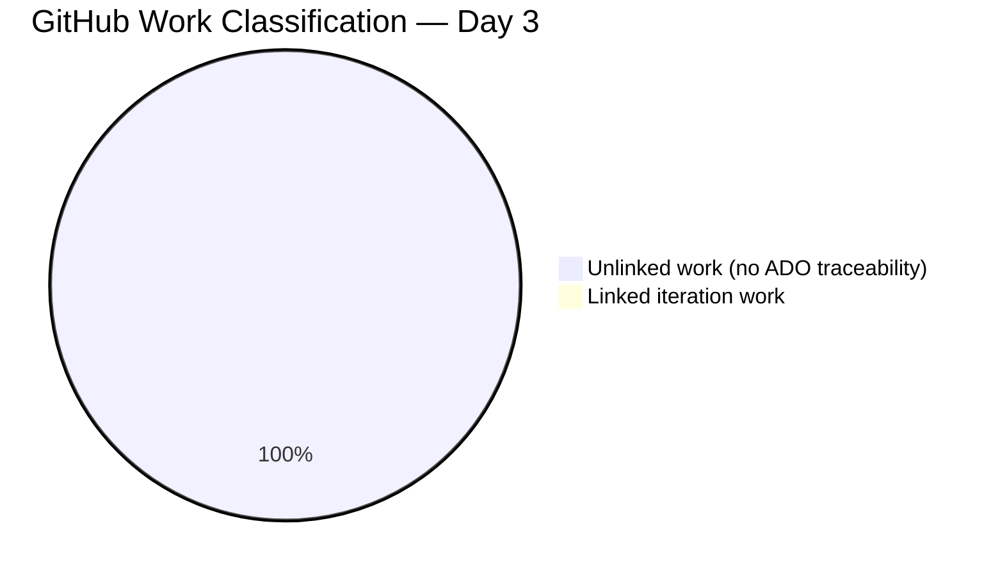

| Classification | Count | Details |
|----------------|:-----:|---------|
| **Linked iteration work** | 0 | No GitHub artifact references an ADO work item ID |
| **Unlinked work** | 12 commits, 3 PRs | All iteration GitHub activity lacks ADO traceability |
| **Maintenance/context only** | 3 commits | Earl's `_clean` commits with no functional description |

### 4.3 Inferred Correlation (Best-Effort)

| ADO Item | Likely GitHub Activity | Confidence |
|----------|----------------------|:----------:|
| #194650 (Employee Login) | Earl's direct commits (ticket post log, active status) | 🟡 Low |
| #198359 (Case List) | Joseph's PR #65 (member-attorney-cases) | 🟡 Low |
| #200617 (Member Messaging) | Cliff's PR #66 (FE) + PR #26 (BE) | 🟡 Low |
| #194730 (Attorney Messaging) | Cliff's PR #66 (FE) + PR #26 (BE) | 🟡 Low |
| #200181 (Stripe Migration) — Closed | Earl's backend commits | 🟡 Low |

> **Note:** #200835 (GitHub-ADO Integration enabler) in Estimation state could directly resolve the traceability gap if it involves configuring ADO-GitHub linking or commit conventions. This should be accelerated.

---

## 5. PR Throughput, Cycle Time & Merge Behavior

### 5.1 Iteration PR Summary (Day 3)

| Metric | Frontend | Backend | Combined |
|--------|:--------:|:-------:|:--------:|
| PRs merged in iteration | 2 | 1 | **3** |
| PRs with reviews | 0 | 0 | **0** |
| Self-merged PRs | 2 (100%) | 1 (100%) | **100%** |
| Average cycle time | 10 min | 15 sec | **~7 min** |
| Lines added (via PR) | 10,322 | 5,653 | **15,975** |
| Files changed (via PR) | 21 | 41 | **62** |
| Direct pushes to integration branch | 5 | 2 | **7** |

### 5.2 Cycle Time Deep Dive

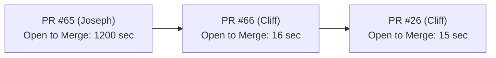

| PR | Author | Open Time | Merge Time | Cycle Time | Lines Added | Reviewers |
|----|--------|-----------|------------|:----------:|:-----------:|:---------:|
| FE #65 | JosephJairo | Mar 9 01:06 | Mar 9 01:26 | 20 min | ~200 | **0** |
| FE #66 | ccarcuevajairo | Mar 11 | Mar 11 | **16 sec** | **10,322** | **0** |
| BE #26 | ccarcuevajairo | Mar 11 | Mar 11 | **15 sec** | **5,653** | **0** |

> **Critical:** Cliff merged **15,975 lines across 62 files in a combined 31 seconds** with zero reviewers. This is the largest unreviewed merge event in the project's history. By comparison, the prior "worst case" was ccarcuevajairo's instant-quote PRs averaging ~300 lines each.

### 5.3 Delivery Method Distribution

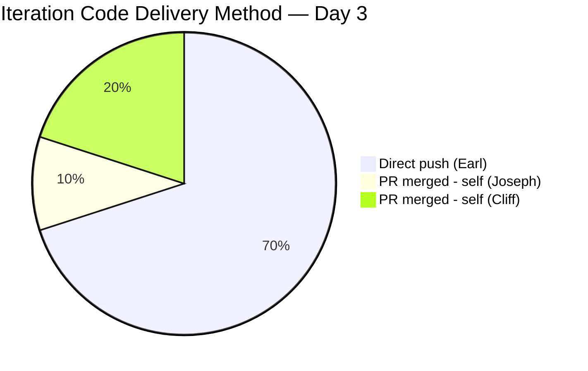

> Earl continues to bypass the PR workflow entirely. Cliff uses PRs but treats them as instant rubber-stamps. Joseph's 20-minute cycle is the closest to a healthy pattern, though still lacks review.

---

## 6. Collaboration & Review Analysis

### 6.1 Review Participation Matrix (Iteration 6.5)

| Reviewer ↓ / Author → | Earl | Joseph | Cliff | Jerlyn | Roden |
|:----------------------:|:----:|:------:|:-----:|:------:|:-----:|
| **Earl** | — | ❌ | ❌ | — | — |
| **Joseph** | ❌ | — | ❌ | — | — |
| **Cliff** | ❌ | ❌ | — | — | — |
| **Jerlyn** | — | — | — | — | — |
| **Roden** | — | — | — | — | — |

> ❌ = No reviews exchanged. The matrix remains completely empty — **no developer has ever reviewed another developer's code in these repositories across the project's entire lifetime (90+ PRs).**

### 6.2 Collaboration Signals

| Signal | Day 2 | Day 3 | Trend |
|--------|:-----:|:-----:|:-----:|
| Cross-developer code review | ❌ None | ❌ None | Unchanged |
| Pair programming indicators | ❌ None | ❌ None | Unchanged |
| Cross-repo collaboration | ⚠️ Earl only | ⚠️ Earl + **Cliff** | 🟢 Improved |
| QA-Dev handoff | ⚠️ 1 item at QA | ⚠️ 1 item at QA | Unchanged |
| Task assignment for Roden | ❌ Zero | ✅ **1 task, closed** | 🟢 Improved |

### 6.3 Work Dependency Map (Day 3)

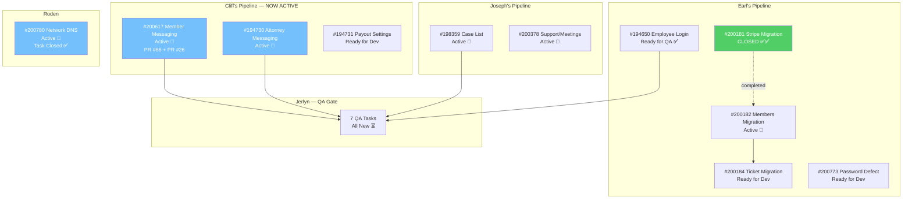

---

## 7. Repo Hygiene & Productivity Enablers

### 7.1 Branch Protection (Unchanged)

| Repo | Protected Branches | Status |
|------|:------------------:|:------:|
| Frontend (`autoallies-version2`) | 0 | 🔴 CRITICAL |
| Backend (`autoallies-api-core`) | 0 | 🔴 CRITICAL |

### 7.2 Repo Configuration (Unchanged)

| Check | Frontend | Backend |
|-------|:--------:|:-------:|
| Branch protection on develop/dev | ❌ | ❌ |
| Branch protection on main | ❌ | ❌ |
| CODEOWNERS file | ❌ | ❌ |
| PR template | ❌ | ❌ |
| CI/CD quality gates (lint, test) | ❌ | ❌ |
| GitHub Actions workflows | ✅ (deploy only) | ✅ (deploy only) |
| Conventional commits | ❌ | ❌ |
| ADO work item ID in branches/commits | ❌ | ❌ |

> **Day-over-day change: None.** Zero remediation items have been addressed for repo hygiene.

---

## 8. Risks & Bottlenecks

### 8.1 Risk Matrix (Updated)

| # | Risk | Severity | Source | Day 2 Status | Day 3 Status |
|---|------|----------|--------|:------------:|:------------:|
| R1 | **Zero code reviews** — 90+ lifetime PRs with 0 reviews | 🔴 CRITICAL | GitHub | Active | **Worsened** — 15,975 LOC merged unreviewed |
| R2 | **Zero ADO-GitHub traceability** | 🔴 CRITICAL | Cross-system | Active | Unchanged |
| R3 | **Zero branch protection** | 🔴 CRITICAL | GitHub | Active | Unchanged |
| R4 | **Earl single-point-of-failure** — direct-push workflow | 🔴 HIGH | Cross-system | Active | Active |
| R5 | **Large unreviewed merge** — Cliff's 15,975 LOC | 🔴 HIGH | GitHub | N/A | **NEW** |
| R6 | **Scope creep** — +25% parent items on Day 3 | 🟡 MEDIUM | ADO | N/A | **NEW** |
| R7 | **QA bottleneck** — 7 QA tasks blocked | 🟡 MEDIUM | ADO | Active | Active |
| R8 | **Joseph meeting overhead** — 56% tasks are meetings | 🟡 MEDIUM | ADO | Active | Active |
| R9 | **Defect #200773** in Ready for Dev (was New) | 🟡 MEDIUM | ADO | Active | 🟢 Improved |
| R10 | **Cliff zero activity** on Day 2 | 🟡 MEDIUM | Cross-system | Active | ✅ **Resolved** |
| R11 | **Roden zero tasks** | 🟡 MEDIUM | ADO | Active | ✅ **Resolved** |

### 8.2 Risk Severity Distribution

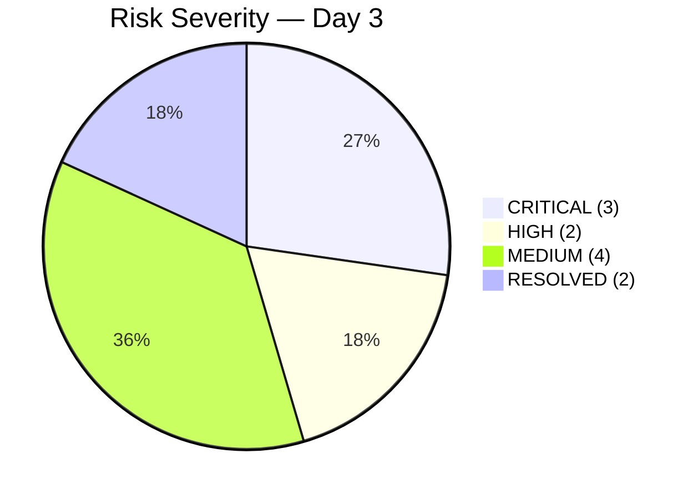

### 8.3 New Risk: Unreviewed Volume

The single biggest new risk this iteration is the volume of unreviewed code. Cliff's combined PRs represent **15,975 lines of new messaging infrastructure** spanning both frontend and backend. Without code review:

- No second pair of eyes verified API contracts between FE/BE messaging code
- No validation that error handling, authentication, or data sanitization is correct
- No knowledge transfer — only Cliff understands this code
- If messaging has a critical bug, the blast radius spans both repos

This is not a process concern — it is an **active quality risk** that compounds with each unreviewed merge.

---

## 9. Prioritized Remediation Actions

### P0 — Immediate (This Week)

| # | Action | Owner | Rationale | Day-over-Day |
|---|--------|-------|-----------|:------------:|
| 1 | **Enable branch protection** on `develop` and `dev` | Ramon / DevOps | Prevents direct pushes, forces PR + 1 review | Carried from Day 1 |
| 2 | **Mandate PR workflow** — no direct pushes to integration branches | Karl / Team | Earl's 7 direct pushes still bypass all gates | Carried from Day 1 |
| 3 | **Adopt ADO work item ID convention** — `AB#<ID>` in all GitHub artifacts | Karl / Team | 0% traceability across 12 commits, 3 PRs | Carried from Day 1 |
| 4 | **Retrospective review of Cliff's messaging PRs** | Earl + Cliff | 15,975 LOC unreviewed — post-merge review is minimum mitigation | **NEW** |
| 5 | **Accelerate #200835** (GitHub-ADO Integration) past Estimation | Karl / Teofilo | Directly addresses the traceability gap | **NEW** |

### P1 — This Iteration

| # | Action | Owner | Rationale |
|---|--------|-------|-----------|
| 6 | **Create deployment tasks** for Roden under features approaching staging | Karl / Roden | Roden's DNS spike is done; needs next work |
| 7 | **Plan QA handoff** — Employee Login (#194650) is at Ready for QA | Jerlyn / Karl | Unblock Jerlyn's first testing cycle |
| 8 | **Triage defect #200773** — assign investigation, move to Active | Earl / Karl | Ready for Dev but needs active investigation |
| 9 | **Monitor iteration scope** — freeze scope after Day 5 unless P0 | Karl | 25% growth on Day 3 risks sprint completion |

### P2 — This PI

| # | Action | Owner | Rationale |
|---|--------|-------|-----------|
| 10 | Add CODEOWNERS to both repos | Earl / Cliff | Auto-assigns reviewers |
| 11 | Add PR template | Team | Enforces WI reference, description, testing |
| 12 | Standardize dev branch naming | Karl | `develop` vs `dev` inconsistency |
| 13 | Clean up stale branches (~40+) | Team | Branch list noise |
| 14 | Add CI quality gates (lint/test) | DevOps | Only deploy workflows exist |

---

## 10. Iteration Burndown (Day 3)

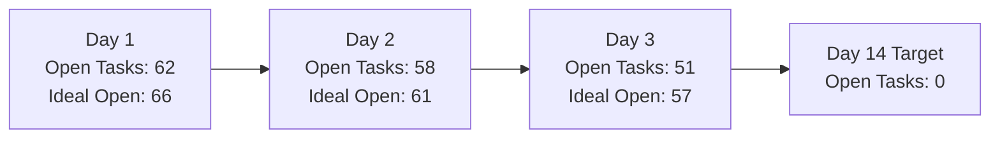

| Day | Total Tasks | Open (New+Active) | Closed | Ideal Close Rate | Actual Close Rate |
|:---:|:-----------:|:-----------------:|:------:|:----------------:|:-----------------:|
| 1 | 62 | 58 | 4 | 4.7/day | 4 |
| 2 | 62 | 58 | 4 | 4.7/day | 0 (same day) |
| 3 | 66 | 51 | 15 | 4.7/day | **11** |

> **Day 3 was a strong delivery day** — 11 tasks closed (vs ideal of ~5). However, the base expanded from 62 to 66 tasks (scope creep), partially offsetting the closure gains. The team needs to sustain ~5 closures/day to complete by Day 14. Current average: **5.0 closures/day** — exactly on ideal pace.

---

## 11. Remediation Tracker — Carryover from Previous Audits

Tracking all recommendations from the March 9, 10, and 10 (PM) audits:

| # | Recommendation | Priority | Status | Day 2 | Day 3 | Evidence |
|---|---------------|----------|:------:|:-----:|:-----:|----------|
| 1 | Branch protection on develop/dev | CRITICAL | ❌ | ❌ | ❌ | All branches `protected: false` |
| 2 | Mandate code reviews | CRITICAL | ❌ | ❌ | ❌ | PRs #65, #66, #26 all 0 reviewers |
| 3 | Add PR template | CRITICAL | ❌ | ❌ | ❌ | No `.github/PULL_REQUEST_TEMPLATE.md` |
| 4 | Configure CODEOWNERS | CRITICAL | ❌ | ❌ | ❌ | No `CODEOWNERS` file |
| 5 | Standardize branch naming | HIGH | ❌ | ❌ | ❌ | Mixed conventions persist |
| 6 | Standardize dev branch naming | HIGH | ❌ | ❌ | ❌ | FE: `develop`, BE: `dev` |
| 7 | Clean up stale branches | HIGH | ❌ | ❌ | ❌ | 57+ branches |
| 8 | Add CI pipeline (lint/test) | HIGH | ❌ | ❌ | ❌ | Deploy-only workflows |
| 9 | Adopt conventional commits | MEDIUM | ❌ | ❌ | ❌ | Still < 5% adoption |
| 10 | Meaningful PR titles | MEDIUM | ❌ | ❌ | ❌ | PR #66 and #26: "Feature/messaging" |
| 11 | ADO work item IDs in GitHub | CRITICAL | ❌ | ❌ | ❌ | 0 of 12 commits, 0 of 3 PRs |

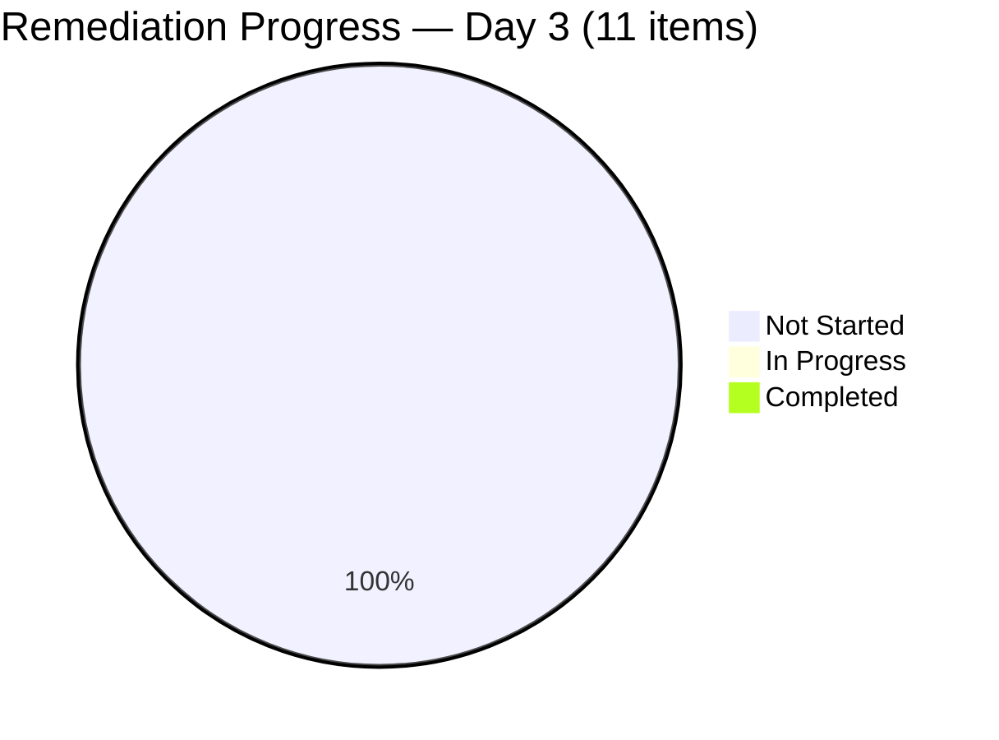

**Remediation Score: 0/11 (0%)** — Unchanged across 3 consecutive daily audits. No previous recommendations have been implemented.

---

## 12. Trend Analysis — 4 Audits (Mar 9-11)

### 12.1 Key Metric Trends

| Metric | Mar 9 (Baseline) | Mar 10 (AM) | Mar 10 (PM) | Mar 11 | Trend |
|--------|:-:|:-:|:-:|:-:|:-----:|
| Team Health Score | N/A (project-wide) | 23/100 | 25/100 | **30/100** | 📈 Improving |
| Tasks Closed | N/A | N/A | 4 | **15** | 📈 Strong |
| Active Contributors (GitHub) | 4 (lifetime) | 2 | 2 | **3** | 📈 Improving |
| PRs with Reviews | 0 | 0 | 0 | **0** | ➡️ Stagnant |
| ADO-GitHub Traceability | N/A | N/A | 0% | **0%** | ➡️ Stagnant |
| Branch Protection | 0% | 0% | 0% | **0%** | ➡️ Stagnant |
| Remediation Score | N/A | 1/13 (8%) | 0/11 (0%) | **0/11 (0%)** | ➡️ Stagnant |
| Stale Branches | 47+ | 47+ | 57 | **57** | ➡️ Stagnant |

### 12.2 Trend Visualization

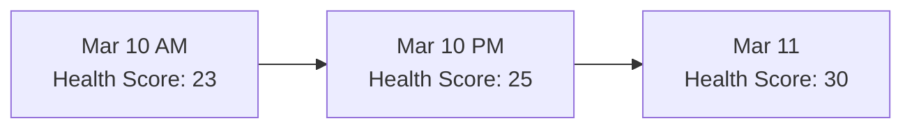

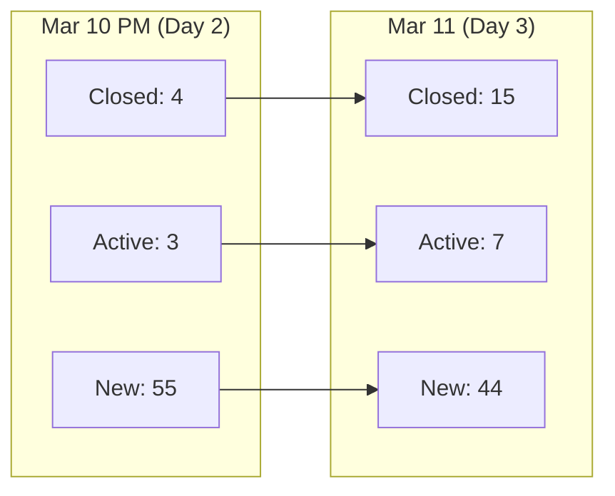

### 12.3 Patterns & Learnings

**Positive Trends:**

1. **Delivery acceleration** — Task closure rate jumped from 4 to 15 (+275%), indicating the team is moving past initial sprint ramp-up into active delivery.
2. **Contributor activation** — Both Cliff and Roden, flagged as inactive in Day 2 audit, are now active with visible work. The team went from 2 active GitHub contributors to 3.
3. **Enabler completion** — Stripe Migration (#200181) is the first enabler closed this iteration, demonstrating that migration work is achievable within sprint timelines.
4. **Defect triage** — #200773 moved from New to Ready for Dev, showing the team is responding to audit findings about untriaged defects.

**Persistent Concerns:**

1. **Zero remediation adoption** — Despite 3 consecutive daily audits flagging the same 11 items as critical/high, none have been implemented. The remediation score has been 0% for 3 days. This suggests either: (a) the team lacks the authority to implement repo-level changes, (b) the findings are not being communicated to decision-makers, or (c) process changes are deprioritized against feature delivery.
2. **Code review culture gap** — The project now has 93+ lifetime PRs with zero reviews ever. Each day the team merges without reviews, the precedent becomes harder to change.
3. **Volume risk escalation** — Cliff's 15,975-line unreviewed merge is an order of magnitude larger than any previous single merge event. The risk profile of unreviewed code is no longer theoretical.
4. **Traceability gap widening** — With 12 commits and 3 PRs now in the iteration, the gap between ADO planning and GitHub delivery continues to grow without any linking mechanism.

**Recommended Focus for Next Audit (Day 4):**

- Monitor whether Cliff's messaging code introduces any defects or rollbacks
- Track if #200835 (GitHub-ADO Integration) moves past Estimation
- Watch Jerlyn's QA queue — she should be testing Employee Login by Day 4-5
- Measure remediation adoption — the 0% score needs executive attention

---

## 13. Audit Metadata

| Field | Value |
|-------|-------|
| **Audit ID** | `AUDIT_2026-03-11_234100` |
| **Generated** | 2026-03-11T23:41:00Z |
| **Iteration** | Iteration 6.5 (2026-03-09 to 2026-03-22) |
| **Iteration Day** | Day 3 of 14 (21% elapsed) |
| **ADO Team** | AA Development Team |
| **ADO Board** | Stories and Deliverables |
| **GitHub Repos** | `jairosoft-com/autoallies-version2`, `jairosoft-com/autoallies-api-core` |
| **Scope Exclusions** | No other boards, teams, projects, or repositories analyzed |
| **Previous Audits** | `AUDIT_2026-03-09_000000.md`, `AUDIT_2026-03-10_000000.md`, `AUDIT_2026-03-10_202500.md` |
| **Data Sources** | ADO Iteration API, ADO Work Items API, ADO Capacity API, GitHub REST API (PRs, commits, branches, reviews) |

---

*End of audit report.*
