# AutoAllies AA Development Team — Daily Productivity Audit
## Day 4 of 14 | Iteration 6.5 | 2026-03-12

---

## 1. Audit Metadata

| Field | Value |
|---|---|
| **Audit Date** | 2026-03-12 |
| **Audit Day** | Day 4 of 14 (28.6% elapsed) |
| **Iteration** | Iteration 6.5 |
| **Iteration Window** | 2026-03-09 → 2026-03-22 |
| **ADO Org** | `jairo` |
| **ADO Project** | `Auto Allies` |
| **ADO Project ID** | `2d7af571-6ef6-4ad0-a509-c440e008b0fb` |
| **ADO Team** | `AA Development Team` |
| **ADO Team ID** | `330e6bf1-3515-443c-a2d8-b84f46c38f57` |
| **ADO Backlog** | Stories and Deliverables (`Microsoft.RequirementCategory`) |
| **Board URL** | `https://dev.azure.com/jairo/Auto%20Allies/_boards/board/t/AA%20Development%20Team/Stories%20and%20Deliverables` |
| **GitHub Repos** | `jairosoft-com/autoallies-version2`, `jairosoft-com/autoallies-api-core` |
| **Prior Audit** | `AUDIT_2026-03-11_234100.md` (Day 3) |
| **Auditor** | EngProd Automated Audit |

> **Scope Note:** This audit is strictly bounded to the `AA Development Team` board, `Stories and Deliverables` backlog, and the two GitHub repositories listed above. No other ADO teams, boards, projects, or GitHub repositories were analyzed.

---

## 2. Executive Summary

Day 4 of Iteration 6.5 recorded **two new merged PRs** — both by Cliff Carcueva — continuing the real-time messaging feature work across the frontend (Socket.IO) and backend (Laravel realtimeJoin endpoint). A new **defect** was added to the iteration scope (`#201012 — Members Renewal Duplicate Payment`), bringing the parent item count to **16** (up from 15 on Day 3).

The critical structural risks observed on Days 1–3 remain entirely unaddressed:

- **0% ADO-to-GitHub traceability** (0 of 5 iteration PRs reference any ADO work item ID)
- **0 code reviews** across 97+ project-lifetime PRs (0 of 5 iteration PRs reviewed)
- **0 protected branches** across both repositories
- **0 of 11 audit recommendations implemented** across 4 consecutive days

Earl Aseniero has had **zero GitHub activity since Day 1** (March 9) despite holding 9+ open tasks across multiple states (Active, Ready for Dev, New). Joseph's activity remains limited to ADO task updates only. Roden's DNS spike (#200780) remains Active with no observable delivery evidence.

Cliff's Day 4 commit message quality showed **meaningful improvement** (conventional commits, `feat:` prefix, descriptive bodies, co-author attribution) versus Day 3's terse messages — a positive signal that has not yet translated to ADO linking or review adoption.

**Day 3 → Day 4 Delta Summary**

| Metric | Day 3 | Day 4 | Δ |
|---|---|---|---|
| Parent items in iteration | 15 | **16** | +1 (new defect #201012) |
| PRs merged (iteration total) | 3 | **5** | +2 (FE #67, BE #27) |
| Iteration commits (est.) | ~12 | **~16** | +4 |
| ADO-GitHub traceability | 0% | **0%** | No change |
| Code reviews conducted | 0 | **0** | No change |
| Remediation items addressed | 0/11 | **0/11** | No change |
| Weighted Health Score | 30/100 | **32/100** | +2 (PR volume only) |

---

## 3. Iteration Scope and Methodology

### 3.1 Iteration Boundary

**Iteration 6.5** runs from **2026-03-09** to **2026-03-22** (14 working days). Today is Day 4 (28.6% of the iteration consumed).

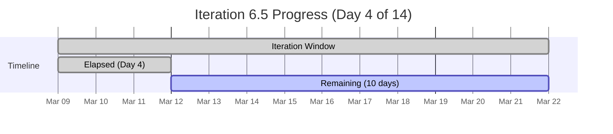

### 3.2 Methodology

1. ADO current iteration resolved from `AA Development Team` team settings (Iteration 6.5, ID `7d045b8a-4332-4026-ab5d-e1c075332a41`).
2. Planned work pulled from `Microsoft.RequirementCategory` backlog for `AA Development Team`.
3. GitHub PRs and commits pulled from `autoallies-version2` (branch: `develop`) and `autoallies-api-core` (branch: `dev`), scoped to the iteration window (2026-03-09 to 2026-03-12).
4. Cross-system traceability checked via `AB#XXXXX` patterns in PR titles, PR bodies, commit messages, and branch names.
5. Day 3 audit (`AUDIT_2026-03-11_234100.md`) used as baseline delta reference.

---

## 4. Iteration Backlog State

### 4.1 Parent Work Items (Day 4 — 16 items)

| ADO ID | Title | Type | Owner | State | Day 3 State | Δ |
|---|---|---|---|---|---|---|
| #200617 | Member Messaging | User Story | Cliff | Active | Active | — |
| #194730 | Attorney Messaging | User Story | Cliff | Active | Active | — |
| #194731 | Attorney Payout Settings | User Story | Cliff | **Active** | Ready for Dev | ↑ |
| #194650 | Employee Login | User Story | Earl | Ready for QA | Ready for QA | — |
| #198359 | Case List | User Story | Joseph | Active | Active | — |
| #198360 | View Cases / Messaging | User Story | Cliff | Ready for Dev | Ready for Dev | — |
| #200181 | Stripe Migration | Enabler | Earl | Closed ✅ | Closed | — |
| #200182 | Members Migration | Enabler | Earl | Active | Active | — |
| #200184 | Ticket / Case Migration | Enabler | Earl | Ready for Dev | Ready for Dev | — |
| #200773 | Reset Password Defect | Defect | Earl | Ready for Dev | Ready for Dev | — |
| #200780 | Network DNS Spike | Spike | Roden | Active | Active | — |
| #200835 | GitHub-ADO Integration | Spike | Teofilo | New | New | — |
| #200839 | V1 Ops Assistance | Spike | Earl | New | New | — |
| #200378 | Support / Meetings | Spike | Joseph | Active | Active | — |
| #200873 | Ops Support Effort | Spike | Mary | New | New | — |
| **#201012** | **Members Renewal Duplicate Payment** | **Defect** | **Earl** | **New** | *(not in scope)* | **+NEW** |

> **ADO Source.** `#201012` was added to the iteration on 2026-03-12. `#194731` transitioned from Ready for Dev → Active at 2026-03-12T01:42Z.

### 4.2 Work Item State Distribution (Day 4)

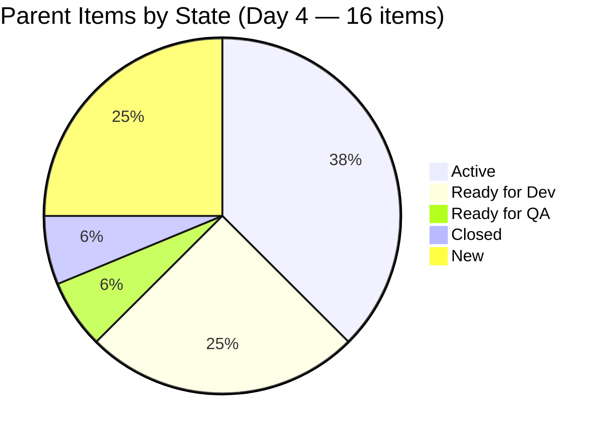

| State | Count | % |
|---|---|---|
| Active | 6 | 37.5% |
| Ready for Dev | 4 | 25.0% |
| Ready for QA | 1 | 6.3% |
| Closed | 1 | 6.3% |
| New | 4 | 25.0% |

Only **1 of 16** parent items (6.3%) is closed — far behind the 28.6% iteration elapsed time. 25% of items have not started (New) and another 25% are awaiting developer pickup (Ready for Dev).

### 4.3 Scope Growth

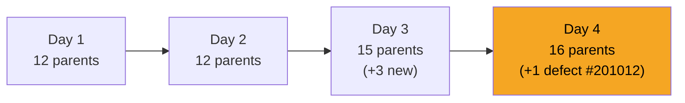

Scope has grown 33% since iteration start (12 → 16 parents). Three spikes and one defect were added mid-iteration without visible capacity rebalancing.

---

## 5. Developer Productivity Findings

### 5.1 Cliff Carcueva (ccarcuevajairo) — Frontend & Backend

**GitHub Day 4:**

| Activity | Detail |
|---|---|
| FE PR #67 merged | `feature/messaging-cliff` → `develop` |
| PR #67 title | `feat: enhance SocketManager and integrate Azure Web PubSub` |
| PR #67 changes | +2,076 / −1,472 lines across 4 files |
| PR #67 cycle time | ~40 seconds (opened 20:45:00Z, merged 20:45:40Z) |
| PR #67 reviewers | 0 |
| BE PR #27 merged | `feature/messaging-cliff` → `dev` |
| PR #27 title | `Add realtimeJoin endpoint and WebSocket broadcast logic` |
| PR #27 changes | +241 / −57 lines across 3 files |
| PR #27 cycle time | ~19 seconds |
| PR #27 reviewers | 0 |
| Direct push | `feat: Enhance type safety in AttorneyMessageDialog socket event handlers` (develop, 2026-03-12T01:13:44Z) |
| ADO link in any PR | **None** |

**Day 4 Commit Quality Improvement:**

Cliff's Day 4 PRs show clear improvement over Day 3:

| Signal | Day 3 | Day 4 |
|---|---|---|
| Conventional commit prefix | No | **Yes** (`feat:`) |
| Descriptive PR body | No | **Yes** |
| Co-author attribution | No | **Yes** |
| ADO work item link | No | **No** (still missing) |
| Code review | No | **No** (still missing) |

This is the first positive behavioral signal observed in 4 days. The engineering practice is improving at the commit/PR description level; the ADO-linking and review steps remain unclosed.

**ADO State:** `#194731` (Attorney Payout Settings) moved Active on 2026-03-12T01:42Z. Cliff now has **3 User Stories Active simultaneously**: #200617, #194730, #194731. `#198360` (View Cases/Messaging) remains in Ready for Dev.

**Risk:** Three concurrent Active stories with no review gates and no traceability creates an unobservable delivery surface.

---

### 5.2 Earl Aseniero (Earl) — Backend / Migration / Defects

**GitHub Day 4:** **0 commits. 0 PRs.** Earl's last GitHub activity was March 9 (Day 1) — 3 consecutive days of silence.

**ADO Load (Earl's open items):**

| ADO ID | Title | State |
|---|---|---|
| #194650 | Employee Login | Ready for QA |
| #200182 | Members Migration | Active |
| #200184 | Ticket/Case Migration | Ready for Dev |
| #200773 | Reset Password Defect | Ready for Dev |
| #200839 | V1 Ops Assistance | New |
| **#201012** | **Members Renewal Duplicate Payment** | **New** |

Earl holds **6 open parent items** with no GitHub delivery evidence on Day 4. `#200182` (Members Migration) is Active — expected to have observable code delivery — yet no commits, branches, or PRs are visible.

**Critical risk:** Earl's GitHub silence is now 3 days old against an Active backlog. Either work is occurring via direct pushes not captured in this audit window, or delivery is stalled. The absence of PR activity makes it impossible to assess quality or progress.

---

### 5.3 Joseph — Frontend / Case Management

**GitHub Day 4:** 0 new commits. Joseph's last GitHub commit was March 9 (Day 1 — the `feat: add case list page` commit). His only iteration PR was #65 (March 10 AM, Day 2).

**ADO:** `#198359` (Case List) remains Active. A `ChangedDate` update was recorded at 2026-03-12T11:34Z — likely child task state changes. No GitHub delivery evidence matches this activity.

**Pattern:** Joseph may be working in ADO task tracking (updating child tasks) without producing observable GitHub output. This is a traceability gap, not necessarily zero work — but it is unverifiable from available evidence.

---

### 5.4 Roden — Infrastructure / DNS

**GitHub Day 4:** 0 commits. 0 PRs. No branch activity.

**ADO:** `#200780` (Network DNS Spike) remains Active. No observable delivery on Day 4.

The DNS spike has been Active since Day 1 with zero GitHub evidence across all 4 audit days. Spike work is often exploratory (documentation, configuration changes outside GitHub), but the 4-day evidence gap warrants explicit verification.

---

### 5.5 Teofilo — DevOps / Integration

**GitHub Day 4:** 0 commits. 0 PRs.

**ADO:** `#200835` (GitHub-ADO Integration Spike) remains New. No observable progress in any channel.

Irony noted: the developer assigned to fix the ADO-GitHub integration gap has the item in New state with no activity.

---

### 5.6 Mary — Operations Support

**GitHub Day 4:** 0 commits. 0 PRs. As expected for an Ops Support role.

**ADO:** `#200873` (Ops Support Effort) remains New.

---

### 5.7 Developer Activity Matrix (Day 4)

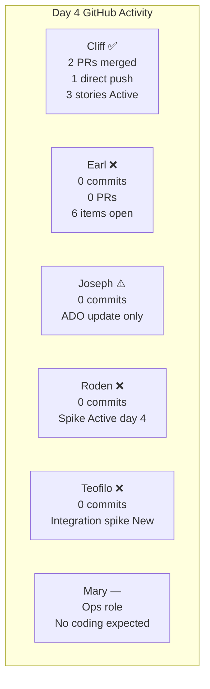

---

## 6. GitHub Delivery Evidence

### 6.1 Iteration PR Summary (All 5 PRs — Days 1–4)

| PR | Repo | Title | Author | Branch | Merged | +Lines | −Lines | Files | Reviewers | ADO Link |
|---|---|---|---|---|---|---|---|---|---|---|
| FE #65 | version2 | feat: add case list page | Joseph | feature/case-list | 2026-03-10 | ~300 | ~50 | ~5 | 0 | None |
| FE #66 | version2 | Add Socket.IO messaging (full stack) | Cliff | feature/messaging-cliff | 2026-03-11 | 10,322 | 3,891 | 21 | 0 | None |
| BE #26 | api-core | Add messaging backend (Laravel) | Cliff | feature/messaging-cliff | 2026-03-11 | 5,653 | 1,887 | 41 | 0 | None |
| **FE #67** | **version2** | **feat: enhance SocketManager + Azure Web PubSub** | **Cliff** | **feature/messaging-cliff** | **2026-03-12** | **2,076** | **1,472** | **4** | **0** | **None** |
| **BE #27** | **api-core** | **Add realtimeJoin endpoint + WebSocket broadcast** | **Cliff** | **feature/messaging-cliff** | **2026-03-12** | **241** | **57** | **3** | **0** | **None** |

**Iteration totals (Day 4):** 5 PRs | ~18,592 additions | ~7,357 deletions | 74 files changed | 0 reviews | 0% ADO traceability

### 6.2 Cumulative PR Throughput

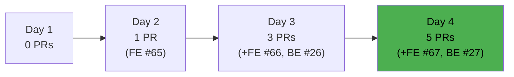

### 6.3 PR Size Distribution

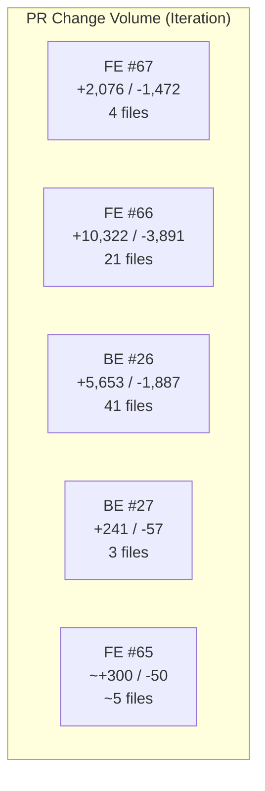

**Observation:** PRs #66 and #26 (Day 3) remain the largest single-day code injection events in the iteration — 15,975 LOC merged unreviewed in a single session. Day 4's PRs are more measured in size, which may reflect incremental polish rather than a new large feature drop.

### 6.4 Cycle Time Analysis (Iteration)

| PR | Cycle Time | Assessment |
|---|---|---|
| FE #65 | ~20 minutes | Minimal — no review |
| FE #66 | ~16 seconds | **Zero review — self-merged** |
| BE #26 | ~15 seconds | **Zero review — self-merged** |
| FE #67 | ~40 seconds | **Zero review — self-merged** |
| BE #27 | ~19 seconds | **Zero review — self-merged** |

**Median iteration cycle time (excluding FE #65): ~19 seconds.** This is not a code review workflow — it is a direct-push equivalent via the PR mechanism with no reviewer engagement.

---

## 7. ADO-to-GitHub Traceability Analysis

### 7.1 Traceability Scorecard (Day 4)

| Signal | Day 1 | Day 2 | Day 3 | Day 4 |
|---|---|---|---|---|
| PRs with `AB#XXXXX` in title | 0/1 | 0/1 | 0/3 | **0/5** |
| PRs with `AB#XXXXX` in body | 0/1 | 0/1 | 0/3 | **0/5** |
| Branches named `feature/XXXXX-*` | 0 | 0 | 0 | **0** |
| Commits with `AB#XXXXX` | 0 | 0 | 0 | **0** |
| **Overall traceability** | **0%** | **0%** | **0%** | **0%** |

### 7.2 Traceability Gap by Work Item

| ADO ID | Title | Owner | GitHub Evidence | Linked? |
|---|---|---|---|---|
| #200617 | Member Messaging | Cliff | PRs #65, #66, #67, #27 (inferred) | ❌ No |
| #194730 | Attorney Messaging | Cliff | FE #67 (type-safety commit) | ❌ No |
| #194731 | Attorney Payout Settings | Cliff | Unverifiable | ❌ No |
| #194650 | Employee Login | Earl | None | ❌ No |
| #198359 | Case List | Joseph | FE #65 (inferred) | ❌ No |
| #200182 | Members Migration | Earl | None | ❌ No |
| #200780 | Network DNS Spike | Roden | None | ❌ No |
| All others | — | Various | None | ❌ No |

**Every single work item remains unlinked.** `#200835` (GitHub-ADO Integration Spike, assigned Teofilo) was scoped specifically to address this gap. It remains in **New** state with no activity on Day 4.

---

## 8. Collaboration and Review Analysis

### 8.1 Review Participation Matrix (Iteration)

| Reviewer | PRs Reviewed | Comments | Approvals |
|---|---|---|---|
| Cliff | 0 | 0 | 0 |
| Earl | 0 | 0 | 0 |
| Joseph | 0 | 0 | 0 |
| Roden | 0 | 0 | 0 |
| Teofilo | 0 | 0 | 0 |
| **Total** | **0** | **0** | **0** |

**Zero code reviews across 5 merged PRs and 4 audit days.** This pattern has held since the project's inception (97+ PRs, 0 reviews ever recorded).

### 8.2 Branch Protection Status

| Repo | Default Branch | Protected | Min. Reviewers | Status Checks | PR Required |
|---|---|---|---|---|---|
| autoallies-version2 | `develop` | ❌ No | 0 | None | No |
| autoallies-api-core | `dev` | ❌ No | 0 | None | No |

Branch protection gates remain absent. Self-merge into integration branches is technically unrestricted.

### 8.3 Collaboration Health

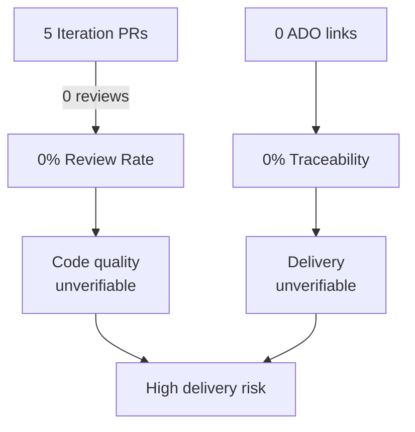

---

## 9. Repo Hygiene

| Control | autoallies-version2 | autoallies-api-core | Target |
|---|---|---|---|
| Branch protection (default branch) | ❌ None | ❌ None | Required |
| Minimum reviewers enforced | ❌ 0 | ❌ 0 | ≥1 |
| CI status checks required | ❌ No | ❌ No | Required |
| CODEOWNERS file | ❌ Absent | ❌ Absent | Recommended |
| PR description template | ❌ Absent | ❌ Absent | Recommended |
| Conventional commit enforcement | ⚠️ Informal | ⚠️ Informal | Recommended |
| ADO work item linking policy | ❌ None | ❌ None | Required |

Cliff's Day 4 PRs began using conventional commits informally (`feat:`), but there is no tooling (commitlint, Husky, or similar) enforcing this. Without enforcement, consistency depends entirely on individual discipline.

---

## 10. Risks and Bottlenecks

### 10.1 Risk Matrix (Day 4)

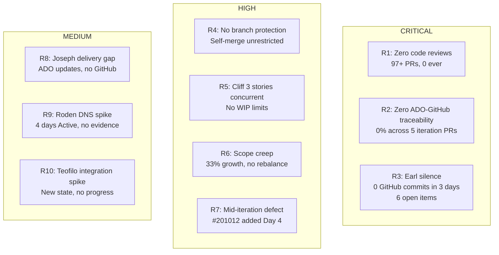

### 10.2 Risk Detail

| # | Risk | Severity | Owner | Days Active | Trend |
|---|---|---|---|---|---|
| R1 | Zero code reviews — ever | Critical | Team / Karl | Project lifetime | → Unchanged |
| R2 | Zero ADO-GitHub traceability | Critical | Teofilo / Team | Iteration 6.5 all 4 days | → Unchanged |
| R3 | Earl GitHub silence (3 days) | Critical | Earl / Karl | Day 2+ | ↑ Escalating |
| R4 | No branch protection | High | Karl / DevOps | Project lifetime | → Unchanged |
| R5 | Cliff: 3 concurrent Active stories | High | Cliff / Karl | Day 4 (new) | **↑ New** |
| R6 | Iteration scope growth (+33%) | High | Karl | Days 3–4 | → Stable |
| R7 | New defect #201012 (Members Renewal) | High | Earl | Day 4 (new) | **↑ New** |
| R8 | Joseph: 3+ days no GitHub output | Medium | Joseph | Day 3+ | ↑ Escalating |
| R9 | Roden DNS spike 4 days with no evidence | Medium | Roden | Days 1–4 | ↑ Escalating |
| R10 | Teofilo ADO integration spike stalled | Medium | Teofilo | Days 3–4 | → Unchanged |

---

## 11. Remediation Tracker

### 11.1 Cumulative Recommendation Status

| # | Recommendation | First Raised | Status | Days Open |
|---|---|---|---|---|
| REM-01 | Enable branch protection on `develop` and `dev` | Day 1 | ❌ Not started | 4 |
| REM-02 | Require ≥1 reviewer before merge | Day 1 | ❌ Not started | 4 |
| REM-03 | Add `AB#XXXXX` to all PRs and commits | Day 1 | ❌ Not started | 4 |
| REM-04 | Enforce PR template with ADO link field | Day 1 | ❌ Not started | 4 |
| REM-05 | Activate `#200835` (Teofilo GitHub-ADO Integration Spike) | Day 3 | ❌ Not started | 2 |
| REM-06 | Address Earl's GitHub activity gap | Day 2 | ❌ Not started | 3 |
| REM-07 | Assess Roden's DNS spike evidence | Day 2 | ❌ Not started | 3 |
| REM-08 | Install commitlint / Husky for conventional commits | Day 2 | ❌ Not started | 3 |
| REM-09 | Set WIP limits for concurrent Active stories per developer | Day 3 | ❌ Not started | 2 |
| REM-10 | Conduct retrospective on Day 3 mass-merge event (15,975 LOC) | Day 3 | ❌ Not started | 2 |
| **REM-11** | **Triage #201012 (Members Renewal Defect) — assess sprint impact** | **Day 4** | **❌ New** | **0** |

**Remediation Score: 0 / 11 (0%)** — No audit recommendation has been implemented across 4 consecutive days.

---

## 12. Trend Analysis (Days 1–4)

### 12.1 Cumulative PR Throughput

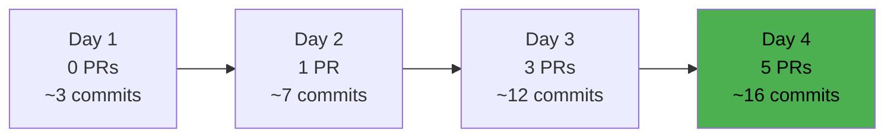

### 12.2 Health Score Trend

| Day | Date | Score | Key Driver |
|---|---|---|---|
| Day 1 | 2026-03-09 | Baseline | Initial state |
| Day 2 | 2026-03-10 AM | 23/100 | Earl direct pushes, no reviews |
| Day 2 PM | 2026-03-10 PM | 25/100 | FE #65 merged (minimal cycle) |
| Day 3 | 2026-03-11 | 30/100 | Cliff massive PRs but unreviewed |
| **Day 4** | **2026-03-12** | **32/100** | +2 PRs, commit quality improved |

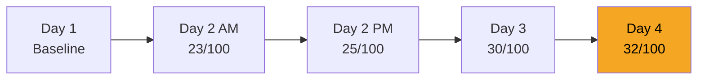

**Scoring Rubric (100-point scale):**

| Dimension | Weight | Day 4 Score | Notes |
|---|---|---|---|
| ADO-GitHub Traceability | 20% | 0/20 | 0 linked PRs |
| Code Review Health | 20% | 0/20 | 0 reviews ever |
| Branch Protection | 15% | 0/15 | No protection |
| Delivery Velocity (vs. burndown target) | 15% | 5/15 | 1 closed vs. 28.6% elapsed |
| Team-wide Participation | 15% | 5/15 | Only 2 of 5 devs producing GitHub output |
| Commit/PR Quality | 10% | 7/10 | Cliff improving; others absent |
| Scope Discipline | 5% | 3/5 | +33% growth, partially justified |
| Remediation Progress | 0% tracked separately | 0/— | 0/11 |
| **Total** | **100%** | **~32/100** | |

### 12.3 Burndown Projection

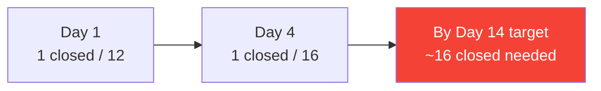

**At current trajectory:** 1 item closed in 4 days. 15 items remain open with 10 days left. To close all items, the team needs to close **1.5 items/day** — a rate that has not been approached in any single day of this iteration.

| Metric | Value |
|---|---|
| Items closed to date | 1 (6.3%) |
| Days elapsed | 4 (28.6%) |
| Velocity required to complete | 1.5 items/day |
| Observed velocity | 0.25 items/day |
| **Projected completion at current rate** | **~60+ days (well past iteration end)** |

---

## 13. Day 3 → Day 4 Improvement Observations

**Positive signals on Day 4:**

1. Cliff adopted conventional commit format (`feat:`) — the first structured commit messaging in the iteration.
2. PR bodies included descriptive summaries and co-author attribution — an improvement in PR hygiene.
3. PR sizes on Day 4 (FE #67: 2,076 additions; BE #27: 241 additions) are significantly smaller than Day 3's mass-merge event (15,975 LOC total) — suggests more incremental, reviewable work.

**Unchanged negatives on Day 4:**

1. ADO linking still 0% — commit quality improvement did not extend to `AB#` references.
2. Code reviews still 0 — PR description quality has no value without reviewer engagement.
3. Earl, Joseph, Roden, Teofilo: 0 GitHub output for the second or third consecutive day.
4. No remediation actions taken despite 4 consecutive days of audit findings.

---

## 14. Prioritized Remediation Actions

### Immediate (Today — Day 4)

| Priority | Action | Owner | Effort |
|---|---|---|---|
| P0 | Karl: 1:1 sync with Earl — determine cause of 3-day GitHub absence, confirm Members Migration (#200182) status | Karl | 30 min |
| P0 | Activate #200835 — assign Teofilo to set up ADO-GitHub board integration and PR linking policy | Karl / Teofilo | 1–2 hrs |
| P0 | Triage #201012 (Members Renewal Duplicate Payment) — assess sprint impact and assign priority relative to existing Earl backlog | Karl / Earl | 30 min |

### This Week (Days 5–7)

| Priority | Action | Owner | Effort |
|---|---|---|---|
| P1 | Enable branch protection on `develop` (version2) and `dev` (api-core) with minimum 1 reviewer | Teofilo / Karl | 1 hr |
| P1 | Add PR template to both repos with required ADO `AB#XXXXX` field | Teofilo | 2 hrs |
| P1 | Conduct team retro on Day 3 mass-merge — agree on PR size limits and review expectations | Karl | 1 hr |
| P2 | Roden: provide written status update on DNS spike (#200780) — what was investigated, outcome, next steps | Roden | 30 min |
| P2 | Cap Cliff's concurrent Active stories at 2 (WIP limit) — move #198360 to backlog or reassign | Karl | 30 min |

### Iteration Remainder (Days 8–14)

| Priority | Action | Owner | Effort |
|---|---|---|---|
| P2 | Install commitlint + Husky in both repos to enforce `feat:`/`fix:`/`chore:` prefix | Teofilo | 2 hrs |
| P3 | Joseph: confirm Case List (#198359) delivery blockers — establish GitHub output baseline | Karl / Joseph | 30 min |
| P3 | Review scope additions (#200835, #200839, #200873, #201012) vs. iteration capacity — consider deferring lower-priority items | Karl | 1 hr |

---

## 15. Appendix — Evidence Sources

| Source | Tool Used | Key Data Points |
|---|---|---|
| ADO Iteration | `work_list_team_iterations` | Iteration 6.5, 2026-03-09 → 2026-03-22 |
| ADO Backlog | `wit_list_backlog_work_items` | 16 parent items (Day 4) |
| ADO Work Items | `wit_get_work_items_batch_by_ids` | States, owners, changed dates |
| GitHub FE PRs | `list_pull_requests` (version2) | PRs #65, #66, #67; merged dates, sizes, reviewers |
| GitHub BE PRs | `list_pull_requests` (api-core) | PRs #26, #27; merged dates, sizes, reviewers |
| GitHub FE Commits | `list_commits` (develop branch) | Authors, dates, messages |
| GitHub BE Commits | `list_commits` (dev branch) | Authors, dates, messages |
| Prior Audit (Day 3) | `AUDIT_2026-03-11_234100.md` | Delta baseline |
| Prior Audit (Day 2) | `AUDIT_2026-03-10_202500.md` | Trend context |

---

*Audit generated by EngProd Automated Audit System | 2026-03-12 | Iteration 6.5 Day 4*
