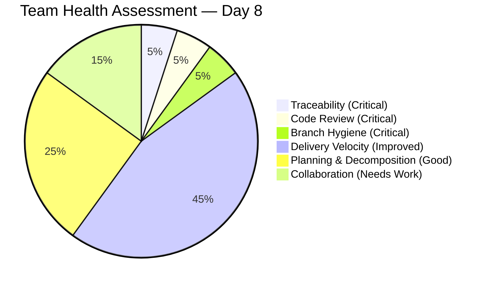
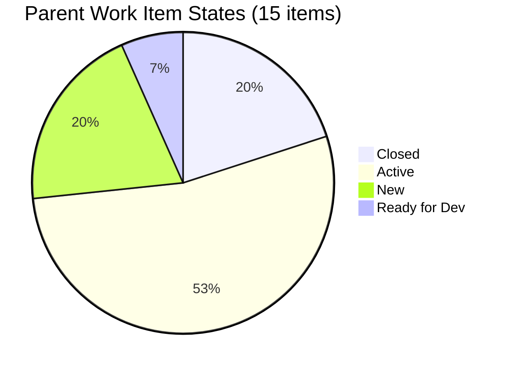
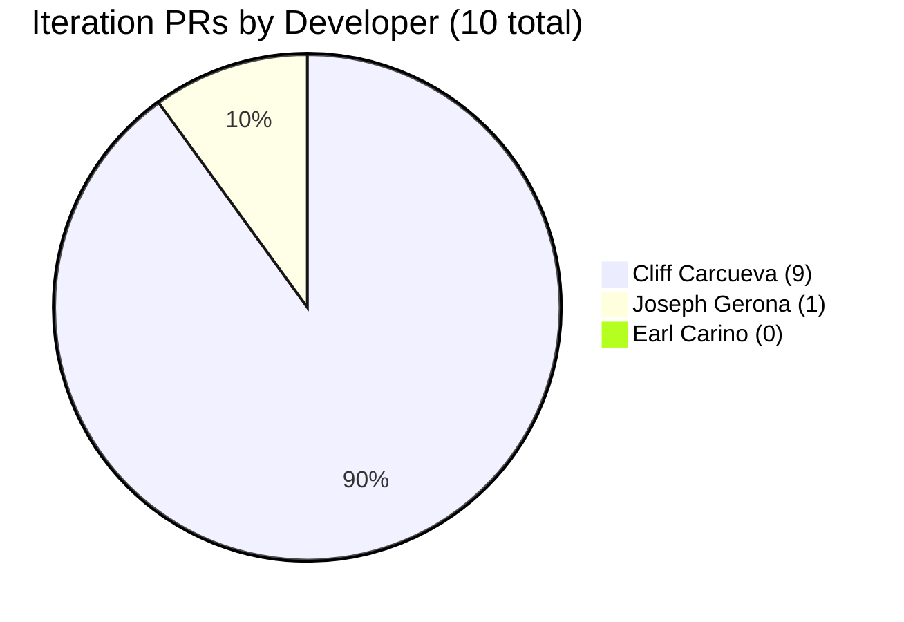
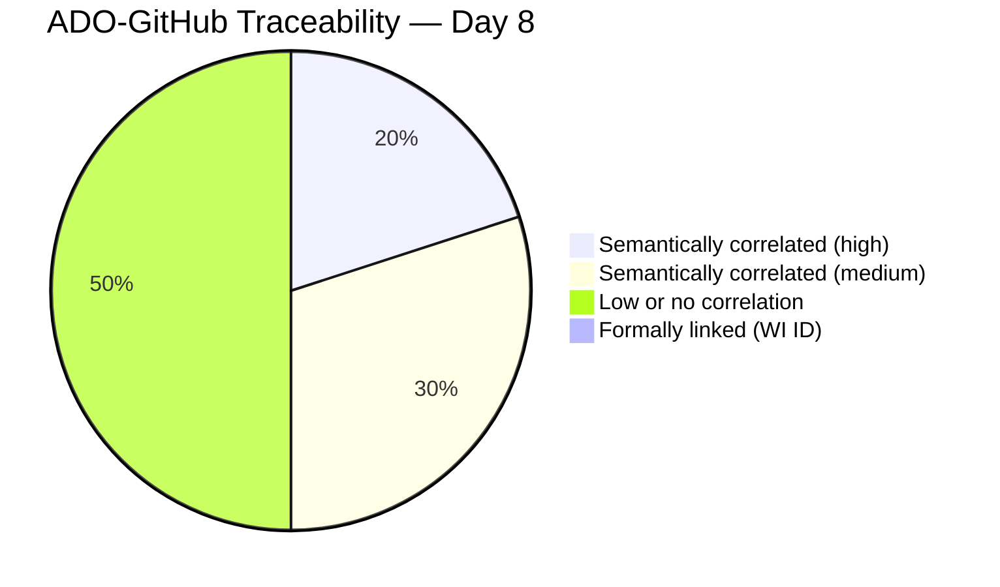
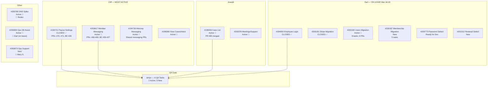
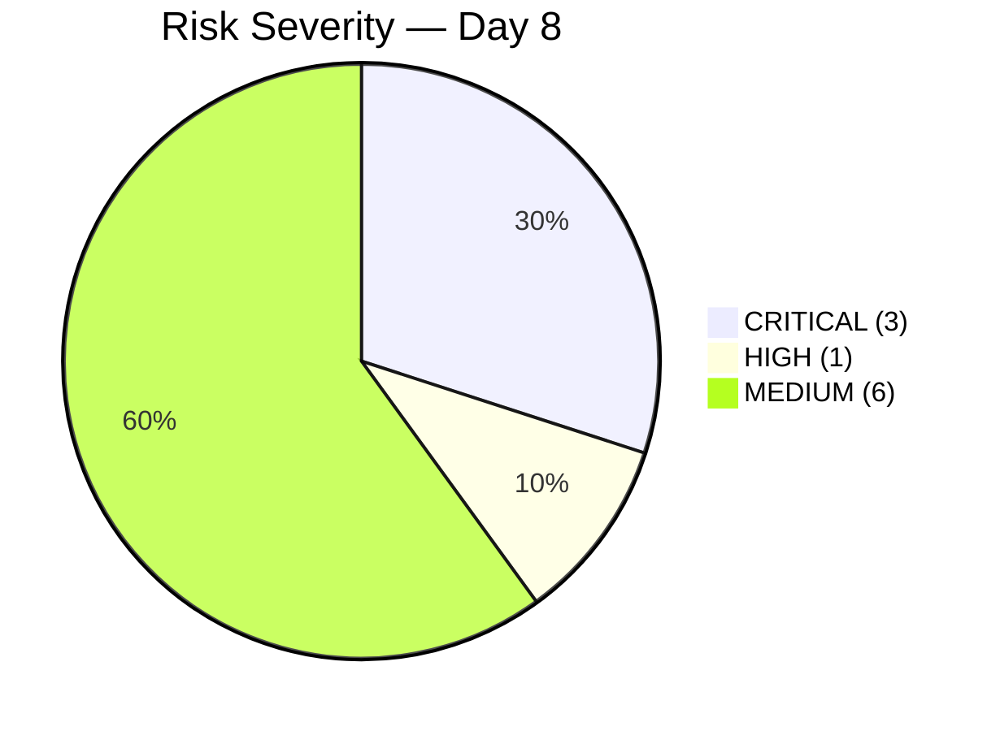
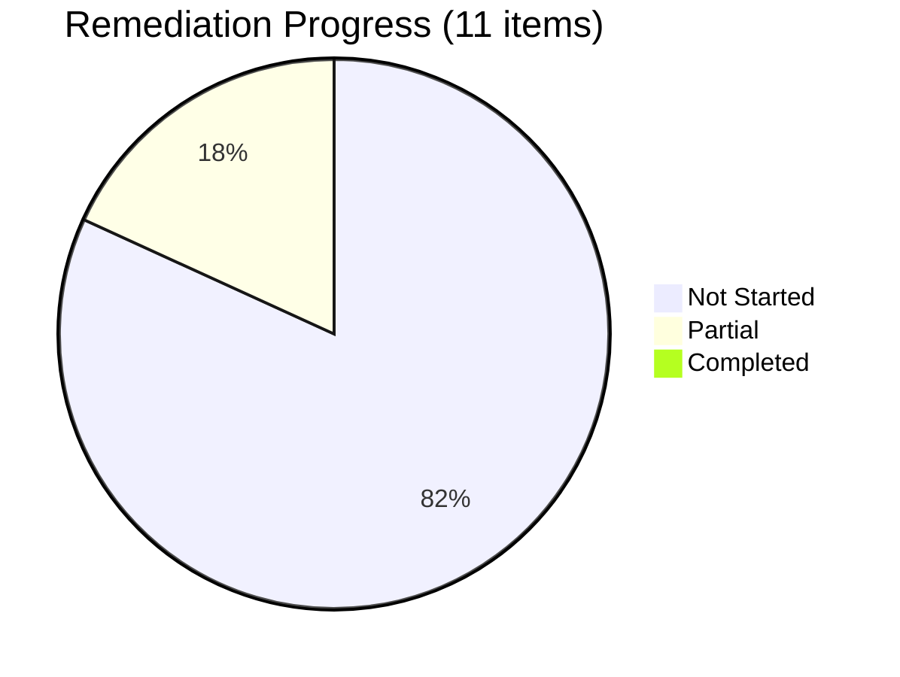

# AutoAllies Iteration Productivity Audit — Iteration 6.5 (Mid-Sprint)

**Audit Date:** 2026-03-16
**Auditor:** Ramon Aseniero Jr. — Engineering Productivity Engineer
**Framework:** SAFe (Scaled Agile Framework)
**Report Type:** Iteration-Bounded Productivity Audit — Mid-Sprint Checkpoint

---

## Audit Boundary

| Parameter | Value |
|-----------|-------|
| **ADO Organization** | `jairo` |
| **ADO Project** | `Auto Allies` (ID: `2d7af571-6ef6-4ad0-a509-c440e008b0fb`) |
| **ADO Team** | `AA Development Team` (ID: `330e6bf1-3515-443c-a2d8-b84f46c38f57`) |
| **ADO Board URL** | [Stories and Deliverables](https://dev.azure.com/jairo/Auto%20Allies/_boards/board/t/AA%20Development%20Team/Stories%20and%20Deliverables) |
| **Backlog** | `Stories and Deliverables` (`Microsoft.RequirementCategory`) |
| **Current Iteration** | **Iteration 6.5** |
| **Iteration Start** | 2026-03-09 |
| **Iteration Finish** | 2026-03-22 |
| **Iteration Day at Audit** | **Day 8 of 14 (57% elapsed)** |
| **GitHub Repo — Frontend** | `jairosoft-com/autoallies-version2` (TypeScript / Next.js) |
| **GitHub Repo — Backend** | `jairosoft-com/autoallies-api-core` (PHP / Laravel) |

> **Scope Note:** No other ADO boards, teams, projects, or GitHub repositories were analyzed. This audit is strictly bounded to the above sources.

### Data Availability

| Source | Status |
|--------|--------|
| ADO Iteration Settings | ✅ Available |
| ADO Work Items (Iteration 6.5) | ✅ Available |
| ADO Team Capacity | ✅ Available |
| GitHub — `autoallies-version2` | ✅ Available |
| GitHub — `autoallies-api-core` | ✅ Available |

---

## 1. Executive Summary

We are at the **halfway mark** of Iteration 6.5 (Day 8 of 14). Compared to the Day 2 audit, the picture has changed significantly — both positively and negatively.

**Positive:** Cliff Carcueva went from zero GitHub activity on Day 2 to becoming the **most active developer in the iteration** with 9 PRs merged across both repos. Two user stories and one enabler have been **closed** (#194731 Payout Settings, #194650 Employee Login, #200181 Stripe Migration). The team now has **3 parent items closed** out of 15 — a 20% completion rate at the midpoint.

**Negative:** The iteration **expanded by 3 new parent items** mid-sprint (scope creep from 12 to 15). Earl Carino is now **on leave for the entire remaining week** (Mar 16–20), leaving 26 ADO tasks without their primary owner. **Zero code reviews** have been performed — every PR was self-merged. **Zero ADO work item IDs** appear in any GitHub artifact. **Zero branch protection** remains across all 51 branches in both repos.

**Critical Findings:**

| # | Finding | Severity | Source | Change from Day 2 |
|---|---------|----------|--------|:------------------:|
| 1 | **Zero ADO-GitHub traceability** — no WI IDs in 10 PRs, ~20 commits, or any branch | 🔴 CRITICAL | Cross-system | Unchanged |
| 2 | **Zero code reviews** — all 10 iteration PRs self-merged with 0 reviewers | 🔴 CRITICAL | GitHub | Unchanged |
| 3 | **Zero branch protection** — 51 branches across both repos, none protected | 🔴 CRITICAL | GitHub | Unchanged |
| 4 | **Earl on leave** Mar 16–20 with 26 tasks — no coverage plan visible | 🔴 HIGH | ADO | ⬆️ NEW |
| 5 | **Mid-sprint scope creep** — 3 new parent items added after iteration start | 🟡 MEDIUM | ADO | ⬆️ NEW |
| 6 | **Cliff dramatic turnaround** — zero activity on Day 2 → 9 PRs by Day 5 | ✅ POSITIVE | GitHub | ⬆️ Improved |
| 7 | **3 parent items closed** at midpoint — on track for planned velocity | ✅ POSITIVE | ADO | ⬆️ Improved |

**Weighted Team Health Score: 35/100** (up from 25/100 on Day 2) — still critical, but delivery velocity improved.

---

## 2. Iteration Scope — Day 2 vs. Day 8 Comparison

### 2.1 Scope Growth

| Metric | Day 2 (Mar 10) | Day 8 (Mar 16) | Delta |
|--------|:--------------:|:--------------:|:-----:|
| Parent work items | 12 | **15** | +3 |
| Child tasks | 62 | **66** | +4 |
| Closed parent items | 0 | **3** | +3 |
| Active parent items | 3 | **8** | +5 |
| New (untouched) parent items | 9 | **4** | -5 |
| GitHub PRs (iteration) | 1 | **10** | +9 |
| GitHub commits (iteration) | ~10 | **~20** | +10 |
| Team days off | 2 | **7** | +5 |

### 2.2 Parent Work Item States — Day 8

### 2.3 All Parent Work Items

| ID | Title | Type | State | Owner | Day 2 State |
|:--:|-------|------|:-----:|-------|:-----------:|
| 194650 | Employee Login/Logout | User Story | **Closed** ✅ | Earl | Ready for QA |
| 194731 | Attorney - Payout Settings | User Story | **Closed** ✅ | Cliff | Ready for Dev |
| 200181 | Stripe Migration V2 Product | Enabler | **Closed** ✅ | Earl | Active |
| 200617 | Member - Messaging | User Story | Active 🔄 | Cliff | Ready for Dev |
| 194730 | Attorney - Messaging | User Story | Active 🔄 | Cliff | Ready for Dev |
| 198359 | Case List | User Story | Active 🔄 | Joseph | Active |
| 198360 | View Cases, Inbox/Messaging | User Story | Active 🔄 | Cliff | Ready for Dev |
| 200182 | Users Migration | Enabler | Active 🔄 | Earl | Ready for Dev |
| 200780 | Network DNS Spike | Spike | Active 🔄 | Roden | New |
| 200839 | Ops Team DB Assistance | Spike | Active 🔄 | Earl | — (new) |
| 200378 | Support/Meetings — Joseph | Spike | Active 🔄 | Joseph | Active |
| 200187 | Membership Migration | Enabler | New | Earl | — (new) |
| 201012 | V1 Renewal Duplicate Payment | Defect | New | Earl | — (new) |
| 200873 | Ops Support Effort | Spike | New | Mary S. | — (new) |
| 200773 | Reset Password Email Defect | Defect | Ready for Dev | Earl | New |

> Items 200187, 201012, 200839, 200873 were **added after the iteration started** — this constitutes mid-sprint scope creep.

---

## 3. Developer Productivity Findings

### 3.1 Team Capacity — Updated

| Developer | Cap/Day | Days Off | Available Days (remaining) | ADO Tasks | Closed | Active | New |
|-----------|:-------:|:--------:|:--------------------------:|:---------:|:------:|:------:|:---:|
| **Earl Carino** | 6h | **Mar 16–20** | **1** (Mar 21 only) | 26 | 3 | 1 | 22 |
| **Cliff Carcueva** | 6h | Mar 16, 20 | **3** | 12 | 2 | 2 | 8 |
| **Joseph Gerona** | 4h | — | **5** | 18 | 2 | 2 | 14 |
| **Jerlyn Ates** | 6h | — | **5** | 6 | 0 | 1 | 5 |
| **Roden Cole** | 2h | — | **5** | 1 | 1 | 0 | 0 |
| **TOTAL** | 24h | **7** | — | **66** (adj.) | **8** | **6** | **49** |

### 3.2 GitHub Activity by Developer — Full Iteration to Date

| Developer | PRs Created | PRs Merged | Commits (develop/dev) | Reviews Given | Reviews Received |
|-----------|:-----------:|:----------:|:---------------------:|:-------------:|:----------------:|
| **Cliff Carcueva** (ccarcuevajairo) | 9 | 9 | ~10 | **0** | **0** |
| **Joseph Gerona** (JosephJairo) | 1 | 1 | 3 | **0** | **0** |
| **Earl Carino** (ecarinoJS) | 0 | 0 | 7 (direct push) | **0** | **0** |
| **Jerlyn Ates** | 0 | 0 | 0 | **0** | **0** |
| **Roden Cole** | 0 | 0 | 0 | **0** | **0** |
| **TOTAL** | **10** | **10** | **~20** | **0** | **0** |

### 3.3 Individual Developer Analysis

#### Cliff Carcueva — From Zero to Hero

Cliff's turnaround is the most notable event in this iteration. On Day 2 he had zero commits, zero PRs, and 12 tasks all in New state. By Day 5 he had **9 PRs merged across both repos** covering messaging (WebSocket integration, Socket.IO, Azure Web PubSub) and payout settings (API client, UI components, backend endpoints).

| Metric | Day 2 | Day 8 | Delta |
|--------|:-----:|:-----:|:-----:|
| PRs merged | 0 | 9 | +9 |
| Stories closed | 0 | 1 (#194731) | +1 |
| Stories active | 0 | 3 | +3 |
| Tasks closed | 0 | 2 (#200838, #200949) | +2 |
| Commit message quality | N/A | ✅ Good (feat: prefixed, detailed bodies) | Improved |

**Risk:** Cliff is off today (Mar 16) and Mar 20. He still has 8 tasks in New state across his 4 stories. The messaging features (#200617, #194730) have active bug tasks (#201095, #201096), suggesting rework is needed.

**Source:** ADO + GitHub

#### Earl Carino — Heavy Load + Leave Collision

Earl closed 3 tasks on Day 1 (Employee Login) and has the Stripe Migration enabler (#200181) now closed. However, he is **on leave March 16–20**, meaning he has only **1 working day left** (Mar 21) with 22 tasks still in New state. His 7 direct pushes to develop/dev on March 9 remain the only GitHub activity — no PRs created.

| Metric | Day 2 | Day 8 | Delta |
|--------|:-----:|:-----:|:-----:|
| Tasks closed | 3 | 3 | 0 |
| Parent items closed | 0 | 2 (#194650, #200181) | +2 |
| New tasks remaining | 22 | 22 | 0 |
| Days off remaining | 1 (Mar 20) | **5 (Mar 16–20)** | +4 |
| PRs created | 0 | 0 | 0 |

**Critical Risk:** Earl's leave expansion from 1 day to 5 days is the single biggest capacity threat. His 22 remaining tasks — including the Users Migration (#200182, 9 tasks), Membership Migration (#200187, 5 tasks), password defect (#200773), and duplicate payment defect (#201012) — have no visible coverage plan.

**Source:** ADO + GitHub

#### Joseph Gerona — Steady Progress, Meeting Overhead Persists

Joseph merged PR #65 on Day 1 and has since closed task #201104 (fixing Case List bugs). His Case List feature (#198359) is Active with 10 tasks. Meeting/support spike (#200378) still consumes 10 of his 18 tasks (56%).

| Metric | Day 2 | Day 8 | Delta |
|--------|:-----:|:-----:|:-----:|
| PRs merged | 1 | 1 | 0 |
| Tasks closed | 1 | 2 (+#201104) | +1 |
| Active tasks | 2 | 2 | 0 |

**Source:** ADO + GitHub

#### Jerlyn Ates — QA Starting to Unblock

Jerlyn now has 1 active task (#200869 — Operations Assistance investigation) and 5 remaining in New state. With 3 parent items now closed/active, QA should begin to unblock this week.

**Source:** ADO

#### Roden Cole — Now Contributing

Positive change: Roden now has the DNS spike (#200780) assigned and has **closed** task #200888 (Domain R&D). He went from invisible to contributing. The spike is Active.

**Source:** ADO

---

## 4. ADO-to-GitHub Traceability Analysis

### 4.1 Traceability Score

Across **10 PRs**, **~20 commits**, and **~8 new branches** created during the iteration, **zero reference any ADO work item ID**.

| GitHub Artifact | Example | ADO WI ID? |
|----------------|---------|:----------:|
| PR #66 — "Feature/messaging" | Branch: `feature/messaging` | ❌ |
| PR #70 — "feat: add payout settings API client" | Branch: `feature/payout-settings` | ❌ |
| PR #65 — "Feature/member attorney cases" | Branch: `feature/member-attorney-cases` | ❌ |
| PR #28 — "Implement payout settings for lawyers" | Branch: `feature/payout-settings` | ❌ |
| PR #26 — "Feature/messaging" | Branch: `feature/messaging` | ❌ |
| All Earl direct commits (7) | Messages: `_clean`, `add ticket post log` | ❌ |

### 4.2 Semantic Correlation (Best-Effort)

While no formal links exist, we can infer the following correlations based on branch names, PR titles, and commit content:

| ADO Item | GitHub Activity | Confidence |
|----------|----------------|:----------:|
| #194731 (Payout Settings) — **Closed** | FE PR #70, #71; BE PR #28 (`feature/payout-settings`) | 🟢 High |
| #200617 (Member Messaging) — Active | FE PR #66-#69; BE PR #26-#27 (`feature/messaging*`) | 🟢 High |
| #194730 (Attorney Messaging) — Active | Same messaging PRs (shared implementation) | 🟡 Medium |
| #198359 (Case List) — Active | FE PR #65 (`feature/member-attorney-cases`) | 🟡 Medium |
| #198360 (View Cases/Inbox) — Active | Shared with messaging PRs | 🟡 Medium |
| #200181 (Stripe Migration) — Closed | No matching PRs; Earl's direct commits unclear | 🔴 Low |
| #200182 (Users Migration) — Active | No matching GitHub activity | ❌ None |

---

## 5. PR Throughput, Cycle Time & Review Analysis

### 5.1 Iteration PR Summary

| # | Repo | Title | Author | Created | Merged | Cycle Time | Reviews |
|---|------|-------|--------|---------|--------|:----------:|:-------:|
| 65 | FE | Feature/member attorney cases | Joseph | Mar 9 | Mar 9 | 20 min | **0** |
| 66 | FE | Feature/messaging | Cliff | Mar 11 | Mar 11 | < 1 min | **0** |
| 67 | FE | SocketManager enhancement | Cliff | Mar 12 | Mar 12 | < 1 min | **0** |
| 68 | FE | Feature/messaging cliff | Cliff | Mar 13 | Mar 13 | < 1 min | **0** |
| 69 | FE | Feature/messaging cliff | Cliff | Mar 13 | Mar 13 | ~1 min | **0** |
| 70 | FE | Payout settings API + UI | Cliff | Mar 13 | Mar 13 | < 1 min | **0** |
| 71 | FE | Feature/payout settings | Cliff | Mar 13 | Mar 13 | ~3 min | **0** |
| 26 | BE | Feature/messaging | Cliff | Mar 11 | Mar 11 | < 1 min | **0** |
| 27 | BE | realtimeJoin endpoint | Cliff | Mar 12 | Mar 12 | < 1 min | **0** |
| 28 | BE | Payout settings for lawyers | Cliff | Mar 13 | Mar 13 | < 1 min | **0** |

**Aggregate:**

- 10 PRs created and merged in iteration
- **0 reviews** on any PR
- Average cycle time: **< 2 minutes**
- Self-merge rate: **100%**
- Cliff merged 4 PRs on a single day (Mar 13) — rapid-fire merging pattern

### 5.2 Commit Quality — Iteration Comparison

| Author | Meaningful Messages | Low-Quality Messages | Total |
|--------|:-------------------:|:--------------------:|:-----:|
| Cliff | 8 (feat: prefixed, detailed) | 0 | 8 |
| Earl | 2 (ticket log, member status) | 5 (`_clean` ×3, merge noise ×2) | 7 |
| Joseph | 2 (feature commits) | 1 (generic "revert changes") | 3 |

> **Notable improvement:** Cliff's PR bodies contain well-structured descriptions with bullet points. This is the best commit/PR documentation practice observed on the team. Earl's `_clean` pattern remains a hygiene concern.

---

## 6. Repo Hygiene & Branch Status

### 6.1 Branch Protection

| Repo | Total Branches | Protected | Status |
|------|:--------------:|:---------:|:------:|
| Frontend | 30 | 0 | 🔴 CRITICAL |
| Backend | 21 | 0 | 🔴 CRITICAL |
| **Total** | **51** | **0** | 🔴 CRITICAL |

### 6.2 New Branches Created in Iteration

| Repo | Branch | Likely ADO Item |
|------|--------|:---------------:|
| FE | `feature/messaging` | #200617 / #194730 |
| FE | `feature/messaging-cliff` | #200617 / #194730 |
| FE | `feature/payout-settings` | #194731 |
| FE | `feature/owner-case-list-frontend` | #198359 |
| BE | `feature/messaging` | #200617 / #194730 |
| BE | `feature/messaging-cliff` | #200617 / #194730 |
| BE | `feature/messaging-2` | #200617 / #194730 |
| BE | `feature/payout-settings` | #194731 |
| BE | `feature/owner-case-list` | #198359 |
| BE | `feature/migration-scripts` | #200182 / #200187 |

> 10 new branches created but **none include ADO work item IDs** in their names.

### 6.3 Repo Configuration (Unchanged)

| Check | Frontend | Backend |
|-------|:--------:|:-------:|
| Branch protection | ❌ | ❌ |
| CODEOWNERS | ❌ | ❌ |
| PR template | ❌ | ❌ |
| CI quality gates | ❌ | ❌ |
| Dev branch naming | `develop` | `dev` (inconsistent) |

---

## 7. Collaboration & Review Analysis

### 7.1 Cross-System Delivery Map

### 7.2 Review Participation

| Reviewer ↓ / Author → | Cliff (9 PRs) | Joseph (1 PR) | Earl (0 PRs) |
|:----------------------:|:-------------:|:--------------:|:-------------:|
| **Cliff** | Self-merged | ❌ | — |
| **Joseph** | ❌ | Self-merged | — |
| **Earl** | ❌ | ❌ | — |

> The review matrix remains completely empty. **Zero peer reviews across 97 lifetime PRs** (71 FE + 28 BE). This is the team's most persistent process failure.

---

## 8. Risks & Bottlenecks

### 8.1 Risk Matrix

| # | Risk | Severity | Source | vs. Day 2 |
|---|------|----------|--------|:---------:|
| R1 | **Zero code reviews** — 97 lifetime PRs, 0 reviews ever | 🔴 CRITICAL | GitHub | Unchanged |
| R2 | **Zero ADO-GitHub traceability** — 0 WI IDs in any artifact | 🔴 CRITICAL | Cross-system | Unchanged |
| R3 | **Zero branch protection** across 51 branches | 🔴 CRITICAL | GitHub | Unchanged |
| R4 | **Earl on leave (Mar 16–20)** with 22 remaining tasks, no coverage | 🔴 HIGH | ADO | ⬆️ Escalated |
| R5 | **Mid-sprint scope creep** — 3 new parent items added | 🟡 MEDIUM | ADO | ⬆️ New |
| R6 | **Messaging bug tasks** (#201095, #201096) active — rework signal | 🟡 MEDIUM | ADO | ⬆️ New |
| R7 | **QA bottleneck** — 5 of 6 QA tasks still New at midpoint | 🟡 MEDIUM | ADO | Unchanged |
| R8 | **Joseph meeting overhead** — 56% of tasks are non-development | 🟡 MEDIUM | ADO | Unchanged |
| R9 | **Password defect #200773** still in Ready for Dev (not Active) | 🟡 MEDIUM | ADO | Slightly improved |
| R10 | **Duplicate payment defect #201012** New, Earl on leave | 🟡 MEDIUM | ADO | ⬆️ New |

### 8.2 Risk Trend

---

## 9. Prioritized Remediation Actions

### P0 — Immediate (Today)

| # | Action | Owner | Rationale |
|---|--------|-------|-----------|
| 1 | **Assign coverage for Earl's leave** — identify who handles #200182 (Users Migration), #200773 (password defect), #201012 (payment defect) this week | Karl | Earl is out all week with no visible coverage |
| 2 | **Enable branch protection** on `develop` (FE) and `dev` (BE) requiring ≥1 review | Ramon / DevOps | 97 PRs with zero reviews is a critical quality gap |

### P1 — This Week

| # | Action | Owner | Rationale |
|---|--------|-------|-----------|
| 3 | **Stop mid-sprint scope additions** — freeze iteration scope; defer new items to Iteration 6.6 | Karl | 3 new parents added mid-sprint dilutes focus |
| 4 | **Adopt `AB#<ID>` convention** in all branches, commits, and PR titles | Karl / Team | Zero traceability across 97 PRs is audit-blocking |
| 5 | **Cliff should prioritize messaging bugs** (#201095, #201096) before starting new tasks | Cliff | Rework signals suggest incomplete delivery |
| 6 | **Plan QA handoffs** — Jerlyn should begin testing closed stories this week | Jerlyn / Karl | 5 of 6 QA tasks still New at midpoint |

### P2 — This PI

| # | Action | Owner | Rationale |
|---|--------|-------|-----------|
| 7 | Add **CODEOWNERS** and **PR templates** to both repos | Team | Enforces review assignment and PR documentation |
| 8 | Add **CI quality gates** (lint/test on PR creation) | DevOps | Only deploy workflows exist |
| 9 | **Clean up stale branches** (~30+ merged branches never deleted) | Team | Reduces noise |
| 10 | **Standardize dev branch** naming (`develop` vs `dev`) | Karl | Inconsistency across repos |

---

## 10. Remediation Tracker — Carryover from Previous Audits

| # | Recommendation | First Raised | Status | Evidence |
|---|---------------|:------------:|:------:|----------|
| 1 | Branch protection on develop/dev | Mar 9 | ❌ Not Started | All branches `protected: false` |
| 2 | Mandate code reviews | Mar 9 | ❌ Not Started | 0 reviews on 10 iteration PRs |
| 3 | Add PR template | Mar 9 | ❌ Not Started | No `.github/PULL_REQUEST_TEMPLATE.md` |
| 4 | Configure CODEOWNERS | Mar 9 | ❌ Not Started | No `CODEOWNERS` file |
| 5 | Standardize branch naming | Mar 9 | ❌ Not Started | Mixed conventions persist |
| 6 | Standardize dev branch name | Mar 9 | ❌ Not Started | FE: `develop`, BE: `dev` |
| 7 | Clean up stale branches | Mar 9 | ❌ Not Started | 51 branches total |
| 8 | Add CI pipeline (lint/test) | Mar 9 | ❌ Not Started | Only deploy workflows |
| 9 | Adopt conventional commits | Mar 9 | ⚠️ Partial | Cliff using `feat:` prefix; Earl still uses `_clean` |
| 10 | Meaningful PR titles/descriptions | Mar 9 | ⚠️ Partial | Cliff's PRs have good descriptions; others don't |
| 11 | ADO work item IDs in GitHub | Mar 10 | ❌ Not Started | 0 of ~20 commits reference any WI ID |

**Remediation Score: 2/11 partial (9%)** — Cliff's improved commit/PR hygiene is the only forward progress.

---

## 11. Iteration Burndown — Day 8 Snapshot

At Day 8 of 14, the team has closed **8 child tasks** and has **6 active** out of 66 total. The remaining 49 tasks are in New state with 6 working days left — but effective capacity is severely reduced due to Earl's leave (Mar 16–20) and Cliff's days off (Mar 16, 20).

**Effective remaining capacity:** Approximately 12–14h/day (down from 24h/day) for the next 5 days, returning to 24h/day only on Mar 21.

---

## 12. Audit Metadata

| Field | Value |
|-------|-------|
| **Audit ID** | `AUDIT_2026-03-16_000000` |
| **Generated** | 2026-03-16 |
| **Iteration** | Iteration 6.5 (2026-03-09 to 2026-03-22) |
| **ADO Team** | AA Development Team |
| **ADO Board** | [Stories and Deliverables](https://dev.azure.com/jairo/Auto%20Allies/_boards/board/t/AA%20Development%20Team/Stories%20and%20Deliverables) |
| **GitHub Repos** | `jairosoft-com/autoallies-version2` (30 branches), `jairosoft-com/autoallies-api-core` (21 branches) |
| **Scope Exclusions** | No other boards, teams, projects, or repositories analyzed |
| **Previous Audits** | `AUDIT_2026-03-09_000000.md`, `AUDIT_2026-03-10_000000.md`, `AUDIT_2026-03-10_202500.md` |
| **Data Sources** | ADO Iteration API, ADO Work Items API, ADO Capacity API, GitHub REST API (PRs, commits, branches, reviews) |

---

*End of audit report.*
